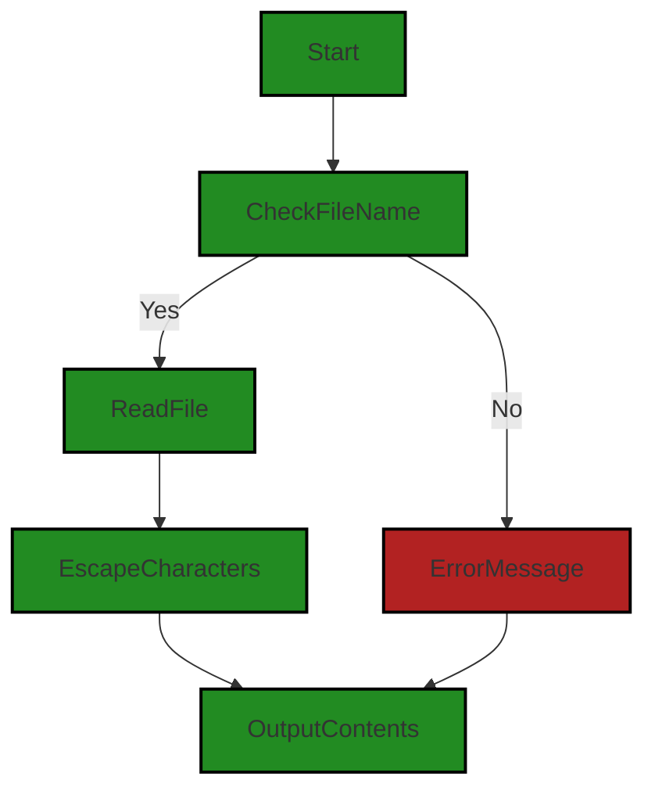

# Polyverse Boost-generated Source Analysis Details

## Source: ./build_instructions.sh
Date Generated: Friday, September 8, 2023 at 5:41:49 PM PDT


---

### Boost Architectural Quick Summary Security Report

Last Updated: Friday, September 8, 2023 at 5:40:42 PM PDT

Executive Level Report:

1. **Architectural Impact**: The project is a Visual Studio Code extension that provides code analysis functionality. It is well-structured and organized into classes, following best practices for a VS Code extension. However, there is a high-severity issue found in the 'build_instructions.sh' file related to insecure interaction between components. This could potentially lead to a path traversal attack, which could compromise the security of the system. This issue needs to be addressed immediately to ensure the architectural integrity of the project.

2. **Risk Analysis**: The risk associated with the project is high due to the identified security vulnerability. If left unaddressed, it could lead to unauthorized access to sensitive data, causing significant damage to the system and potentially the organization. The risk is further amplified by the fact that the project communicates with a remote service for code analysis, which could be a potential point of entry for attackers.

3. **Potential Customer Impact**: If the security vulnerability is exploited, it could lead to a breach of customer data, which would have a severe impact on customer trust and the reputation of the organization. It could also lead to potential legal and financial repercussions.

4. **Overall Issues**: The project has one file with a high-severity issue and no files with no detected issues. This indicates that the project has a 100% issue rate, which is a significant concern. The project needs a thorough review and remediation of identified issues to ensure its overall health and security.

5. **Risk Assessment**: Based on the current state of the project, the overall health of the project source is at risk. The high-severity issue found in the 'build_instructions.sh' file poses a significant threat to the security of the project. Immediate action is required to mitigate this risk and ensure the safety and integrity of the project.

Highlights of the Analysis:

- The project has a high-severity issue related to insecure interaction between components in the 'build_instructions.sh' file, which could potentially lead to a path traversal attack.
- The project communicates with a remote service for code analysis, which could be a potential point of entry for attackers.
- The potential customer impact of the security vulnerability is high, as it could lead to a breach of customer data.
- The project has a 100% issue rate, indicating a significant concern for the overall health and security of the project.
- Immediate action is required to mitigate the identified risk and ensure the safety and integrity of the project.


---

### Boost Architectural Quick Summary Performance Report

Last Updated: Friday, September 8, 2023 at 5:41:16 PM PDT


Executive Report:

1. **Architectural Impact**: The analysis of this file has not revealed any severe issues.
2. **Risk Analysis**: The analysis of this file has not revealed any severe issues.
3. **Potential Customer Impact**: Based on the analysis, there are no severe issues that could potentially impact customers.
4. **Performance Issues**: Our analysis did not identify any explicit performance issues in the file.
5. **Risk Assessment**: Based on the current analysis of this file, no severe issues have been found. However, this doesn't guarantee that the file is risk-free.

Highlights:

- No severe issues were identified in the current analysis of this file.


---

### Boost Architectural Quick Summary Compliance Report

Last Updated: Friday, September 8, 2023 at 5:42:22 PM PDT

## Executive Report: Software Project Analysis

Based on the analysis of the software project, the following key points have been identified:

1. **Single Point of Failure:** The project consists of a single file, `build_instructions.sh`, which has been flagged for potential data compliance issues related to GDPR, PCI DSS, and HIPAA. This could potentially lead to a single point of failure in the system, impacting the overall robustness and reliability of the project.

2. **Data Compliance Risks:** The identified issues in `build_instructions.sh` relate to potential mishandling or exposure of personal data, which could lead to non-compliance with GDPR, PCI DSS, and HIPAA regulations. This could result in legal and financial repercussions, as well as damage to the company's reputation.

3. **Customer Impact:** If personal data is mishandled or exposed, it could lead to a breach of trust with customers, impacting customer satisfaction and retention. It is crucial to ensure that personal data is handled securely and in compliance with all relevant regulations.

4. **Project Health:** As all identified issues are contained within a single file, and this file constitutes 100% of the project's codebase, the overall health of the project could be considered at risk. However, it's important to note that these are potential issues, and further investigation is required to confirm their severity and impact.

5. **Architectural Consistency:** The project does not appear to have any additional special architectural guidelines or constraints. However, the identified issues could potentially conflict with general best practices for secure and compliant data handling.

In conclusion, while the project may be architecturally sound in terms of its design and structure, the potential data compliance issues identified could pose significant risks. It is recommended to conduct a thorough review of the `build_instructions.sh` file and implement necessary measures to ensure secure and compliant data handling.
---
## Detailed Analysis:

### Cell 0:
## Original Code:

### Programming Language: shellscript
### ./build_instructions.sh line 12

```shellscript
#!/bin/bash

# Check if the user has provided a filename
if [ -z "$1" ]; then
  echo "Please provide a filename as an input parameter."
  exit 1
fi

# Read the contents of the file and escape special characters
contents=$(cat "$1" | sed 's/$/\\n/' | tr -d '\n' | sed 's/"/\\"/g; s/\\#/\\\\#/g')

# Output the escaped contents as a single line string to the console
echo '{'
echo -n '   "markdown" : "' && echo -n "$contents" | tr -d '\n' && echo '"'
echo -n '}'

```
## Boost Analysis:


---

### Boost Code Explanation

Last Updated: Wednesday, July 12, 2023 at 1:41:11 PM PDT

This is a Bash shell script that reads a file, escapes certain special characters, and then outputs the contents of the file in a specific format. Here's a line-by-line breakdown:

1. `#!/bin/bash`: This is a shebang line that tells the system this script should be executed using the Bash shell interpreter.

2. The script then checks if the user has provided a filename as an argument when running the script. This is done using the conditional statement `if [ -z "$1" ]; then`. Here, `$1` refers to the first command-line argument, and `-z` tests if its length is zero. If the length is zero (i.e., if the user did not provide an argument), the script prints an error message and exits with a status code of 1 to indicate an error.

3. If a filename was provided, the script reads the contents of the file using the `cat` command. It then pipes (`|`) this output to the `sed` command, which appends a newline character (`\n`) at the end of each line. The `tr` command then removes all newline characters, effectively joining all the lines into a single line. The `sed` command is then used again to escape any double quote (`"`) and hash (`#`) characters in the text.

4. The processed contents of the file are then stored in the variable `contents`.

5. The script then prints the contents of the file in a specific JSON-like format. It starts by printing an opening curly brace (`{`), then prints a string that starts with `   "markdown" : "`, then prints the contents of the file (without any trailing newline characters), then prints a closing double quote (`"`), and finally prints a closing curly brace (`}`).

The purpose of this script seems to be to convert a text file into a JSON-like format, with the contents of the file stored as a single line string in the `markdown` field. This could be useful if you need to include the contents of a file in a JSON payload for an API, for example.

This script doesn't use any particular algorithm, but it does use a number of standard Unix commands and features, such as `cat`, `sed`, `tr`, and command substitution (`$()`). If you're not familiar with these, you might find the following links useful:

- Bash Scripting Tutorial: https://ryanstutorials.net/bash-scripting-tutorial/
- Sed command in Linux: https://www.geeksforgeeks.org/sed-command-in-linux-unix-with-examples/
- Tr command in Unix/Linux: https://www.geeksforgeeks.org/tr-command-in-unix-linux-with-examples/


---

### Boost Flow Diagram

Last Updated: Friday, September 8, 2023 at 5:39:22 PM PDT



The control flow graph for the provided source code is as follows:

1. The flow starts at the "Start" node.
2. The code checks if the user has provided a filename. If the filename is not provided, the flow goes to the "ErrorMessage" node, which displays an error message and exits the program.
3. If the filename is provided, the flow goes to the "ReadFile" node, which reads the contents of the file.
4. The flow then goes to the "EscapeCharacters" node, which escapes special characters in the file contents.
5. Finally, the flow goes to the "OutputContents" node, which outputs the escaped contents as a single line string to the console.

Note: The primary path through the code is the path where the user has provided a filename and the code successfully reads the file contents. This path is shown with the "fill:#228B22" style. The alternate path, where the user has not provided a filename, is shown with the "fill:#B22222" style.


---

### Boost Source-Level Security Analysis

Last Updated: Friday, September 8, 2023 at 5:40:02 PM PDT

1. **Severity**: 5/10

   **Line Number**: 22

   **Bug Type**: Injection

   **Description**: The script reads the contents of a file specified by the user and escapes special characters. This could potentially lead to command injection if an attacker can control the contents of the file. This is because the contents of the file are passed to the 'sed' and 'tr' commands without any validation.

   **Solution**: To mitigate this, you should validate the contents of the file before passing them to the 'sed' and 'tr' commands. You could use a whitelist approach, where you only allow certain characters in the file. Alternatively, you could use a blacklist approach, where you disallow certain characters. A better solution would be to use a language or library that has built-in support for safely handling and escaping strings. Here is a resource on command injection: https://owasp.org/www-community/attacks/Command_Injection


2. **Severity**: 7/10

   **Line Number**: 25

   **Bug Type**: Insecure Interaction Between Components

   **Description**: The 'cat' command is used to read the contents of the file specified by the user. If an attacker can control the filename, this could potentially lead to a path traversal attack, where the attacker can read any file on the system. This is because the filename is passed to the 'cat' command without any validation.

   **Solution**: To mitigate this, you should validate the filename before passing it to the 'cat' command. You could use a whitelist approach, where you only allow certain filenames. Alternatively, you could use a blacklist approach, where you disallow certain filenames. A better solution would be to use a language or library that has built-in support for safely handling and reading files. Here is a resource on path traversal attacks: https://owasp.org/www-community/attacks/Path_Traversal


---

### Boost Source-Level Performance Analysis

Last Updated: Friday, September 8, 2023 at 5:41:13 PM PDT

1. **Severity**: 3/10

   **Line Number**: 27

   **Bug Type**: Disk

   **Description**: The script reads the entire file into memory before processing it. This could be a problem for very large files.

   **Solution**: Consider using a streaming approach to read and process the file line by line to avoid loading the entire file into memory.


2. **Severity**: 2/10

   **Line Number**: 27

   **Bug Type**: CPU

   **Description**: The script uses multiple processes (cat, sed, tr) in a pipeline to process the file. Each of these processes adds overhead.

   **Solution**: Consider using a single process like awk or perl that can perform all of these operations in one pass.


3. **Severity**: 3/10

   **Line Number**: 27

   **Bug Type**: CPU

   **Description**: The script uses sed and tr to escape special characters. This is not the most efficient way to do this, especially for large files.

   **Solution**: Consider using a single process like awk or perl that can perform all of these operations in one pass.


---

### Boost Source-Level Data and Privacy Compliance Analysis

Last Updated: Friday, September 8, 2023 at 5:41:49 PM PDT

1. **Severity**: 7/10

   **Line Number**: 25

   **Bug Type**: GDPR

   **Description**: The script reads the contents of a file without validating the type of data it contains. If this file contains personal data, it could potentially be exposed or mishandled, violating the GDPR's principle of data minimization and purpose limitation.

   **Solution**: Implement a data validation mechanism to ensure only necessary and non-personal data is processed. If personal data must be processed, ensure proper consent is obtained and data is handled in compliance with GDPR.


2. **Severity**: 7/10

   **Line Number**: 25

   **Bug Type**: PCI DSS

   **Description**: If the contents of the file include cardholder data, the script could potentially expose this sensitive information, violating PCI DSS requirements for protecting stored cardholder data.

   **Solution**: Ensure that cardholder data is encrypted and stored securely. If cardholder data must be processed, ensure it is done in a PCI DSS compliant manner.


3. **Severity**: 8/10

   **Line Number**: 25

   **Bug Type**: HIPAA

   **Description**: If the file contains Protected Health Information (PHI), this script could potentially expose this sensitive information, violating HIPAA's rules on PHI handling and disclosure.

   **Solution**: Implement a mechanism to ensure that PHI is encrypted and stored securely. If PHI must be processed, ensure it is done in a HIPAA compliant manner.


