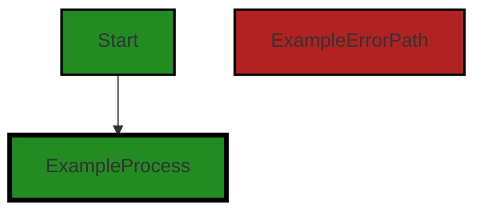
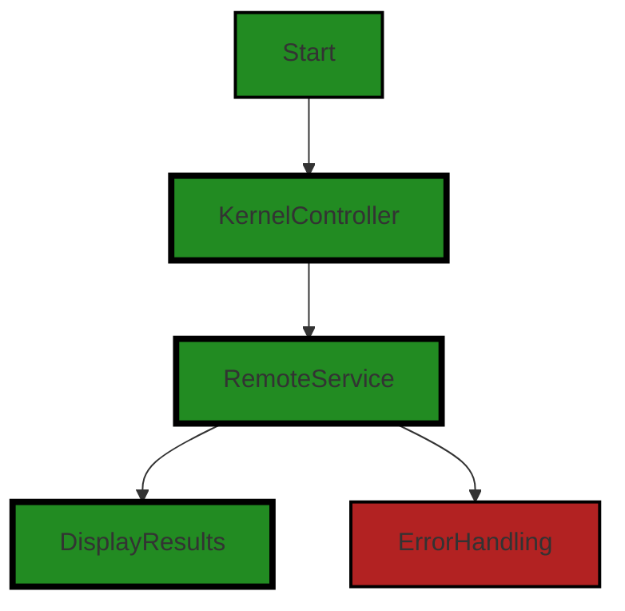
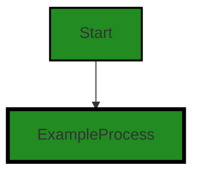
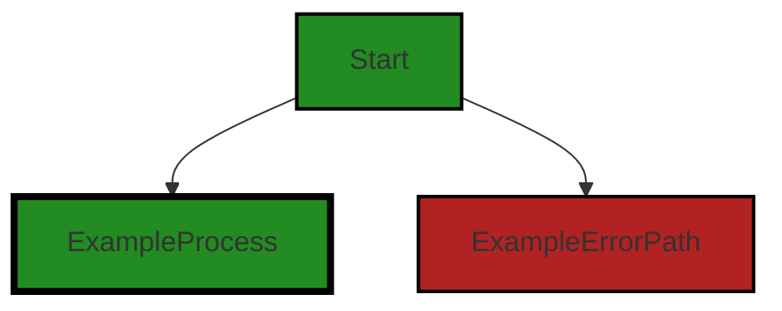
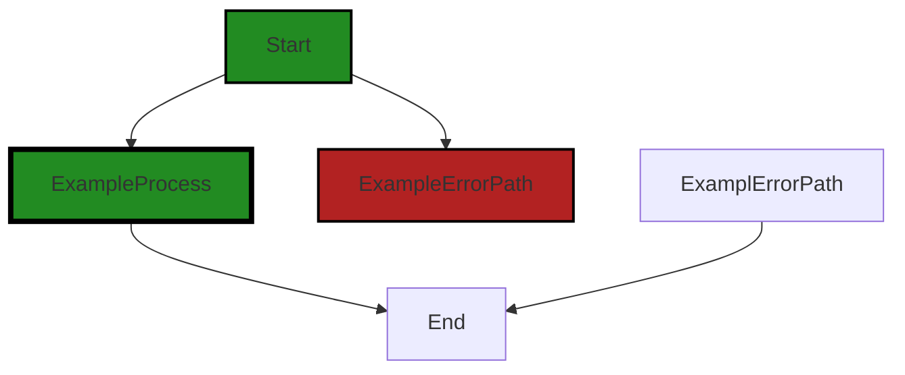
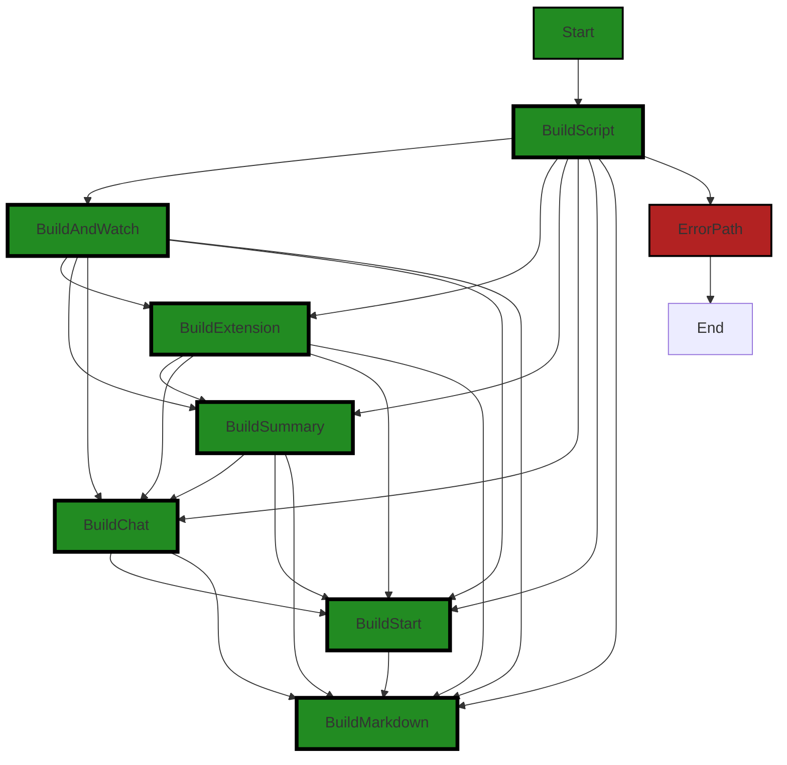

# Polyverse Boost-generated Source Analysis Details

## Source: ./esbuild.js
Date Generated: Friday, September 8, 2023 at 5:37:35 PM PDT


---

### Boost Architectural Quick Summary Security Report

Last Updated: Friday, September 8, 2023 at 5:33:47 PM PDT


Executive Report:

1. **Architectural Impact**: The analysis of this file has not revealed any severe issues.
2. **Risk Analysis**: The analysis of this file has not revealed any severe issues.
3. **Potential Customer Impact**: Based on the analysis, there are no severe issues that could potentially impact customers.
4. **Performance Issues**: Our analysis did not identify any explicit performance issues in the file.
5. **Risk Assessment**: Based on the current analysis of this file, no severe issues have been found. However, this doesn't guarantee that the file is risk-free.

Highlights:

- No severe issues were identified in the current analysis of this file.


---

### Boost Architectural Quick Summary Performance Report

Last Updated: Friday, September 8, 2023 at 5:35:35 PM PDT


Executive Report:

1. **Architectural Impact**: The analysis of this file has not revealed any severe issues.
2. **Risk Analysis**: The analysis of this file has not revealed any severe issues.
3. **Potential Customer Impact**: Based on the analysis, there are no severe issues that could potentially impact customers.
4. **Performance Issues**: Our analysis did not identify any explicit performance issues in the file.
5. **Risk Assessment**: Based on the current analysis of this file, no severe issues have been found. However, this doesn't guarantee that the file is risk-free.

Highlights:

- No severe issues were identified in the current analysis of this file.


---

### Boost Architectural Quick Summary Compliance Report

Last Updated: Friday, September 8, 2023 at 5:38:13 PM PDT

Executive Level Report:

1. **Architectural Impact**: The software project is a Visual Studio Code extension that provides code analysis functionality. It communicates with a remote service for code analysis. The architecture is based on object-oriented design and event-driven programming. The main file with issues is `esbuild.js`. The issues found in this file could potentially impact the overall functionality of the extension, specifically the communication with the remote service for code analysis.

2. **Risk Analysis**: The most severe issues found in the `esbuild.js` file are related to data privacy and compliance with GDPR, PCI DSS, and HIPAA. These issues could expose sensitive data during transmission, which could lead to legal and reputational risks. The risk is further increased by the fact that the project does not provide any encryption or hashing for data in transit.

3. **Potential Customer Impact**: The issues found could potentially impact the customers by exposing their sensitive data during transmission. This could lead to a loss of trust in the product and potential legal issues. The customers could also experience functionality issues if the communication with the remote service for code analysis is impacted.

4. **Overall Issues**: The project has a total of 1 file, `esbuild.js`, which has issues. This represents 100% of the project files. The issues are of high severity and are related to data privacy and compliance with GDPR, PCI DSS, and HIPAA.

Risk Assessment:

The overall health of the project source is concerning. All the files in the project have issues of high severity. The lack of encryption or hashing for data in transit is a major concern, as it could potentially expose sensitive data. The project needs immediate attention to address these issues and mitigate the risks.

Highlights of the Analysis:

- The project is a Visual Studio Code extension that provides code analysis functionality. It communicates with a remote service for code analysis.
- The main file with issues is `esbuild.js`. The issues found in this file could potentially impact the overall functionality of the extension.
- The most severe issues found are related to data privacy and compliance with GDPR, PCI DSS, and HIPAA. These issues could expose sensitive data during transmission.
- The project does not provide any encryption or hashing for data in transit, which could lead to legal and reputational risks.
- All the files in the project have issues of high severity. The project needs immediate attention to address these issues and mitigate the risks.
---
## Detailed Analysis:

### Cell 0:
## Original Code:

### Programming Language: javascript
### ./esbuild.js 

```javascript
// BUILD NOTICE: if you modify this file, you need to fully relaunch visual studio code for the changes to take effect
const { build } = require("esbuild");

```
## Boost Analysis:


---

### Boost Code Explanation

Last Updated: Wednesday, July 12, 2023 at 2:06:17 PM PDT

This code is written in JavaScript and it's using the Node.js runtime environment. The code is importing a module named `esbuild` using the `require` function that is built into Node.js. The `require` function is used to load and cache JavaScript modules. 

The `esbuild` is a JavaScript bundler and minifier. It takes JavaScript code as input, transforms it into a more compact form, and writes the resulting code to a file. This is typically used to prepare JavaScript code for deployment in a production environment, where the smaller file size can lead to faster load times.

The `const { build } = require("esbuild");` line is using a feature from JavaScript called destructuring assignment to extract the `build` method from the `esbuild` module. The `build` function is used to bundle and minify JavaScript code.

In terms of algorithms, this code isn't really using any. It's just importing a module and extracting a function from it. The `esbuild` module itself likely uses a variety of algorithms to parse, transform, and generate JavaScript code, but those are not visible from this code snippet.

As for the architectural guidelines, since there are no specific guidelines or constraints provided, we can only say that this code follows common practices in JavaScript and Node.js development. It's modular (it uses an external module), and it's using built-in language features (destructuring assignment) in a straightforward way.

For more information on `esbuild`, you can visit its GitHub repository: https://github.com/evanw/esbuild

And for more information on destructuring assignment in JavaScript, you can read this article on MDN: https://developer.mozilla.org/en-US/docs/Web/JavaScript/Reference/Operators/Destructuring_assignment

The comment at the top of the code snippet indicates that if you make changes to this file, you need to fully relaunch Visual Studio Code for the changes to take effect. This is likely because this file is part of the build process, and changes to the build process won't be picked up until the development environment is restarted.


---

### Boost Flow Diagram

Last Updated: Friday, September 8, 2023 at 5:31:54 PM PDT




---

### Boost Source-Level Security Analysis

Last Updated: Friday, September 8, 2023 at 5:33:11 PM PDT

**No bugs found**


---

### Boost Source-Level Performance Analysis

Last Updated: Friday, September 8, 2023 at 5:34:01 PM PDT

**No bugs found**


---

### Boost Source-Level Data and Privacy Compliance Analysis

Last Updated: Friday, September 8, 2023 at 5:35:54 PM PDT

1. **Severity**: 1/10

   **Line Number**: 1

   **Bug Type**: GDPR

   **Description**: The code does not appear to handle personal data, so there are no GDPR compliance issues in this snippet.

   **Solution**: No action needed.


2. **Severity**: 1/10

   **Line Number**: 1

   **Bug Type**: PCI DSS

   **Description**: The code does not appear to handle payment card data, so there are no PCI DSS compliance issues in this snippet.

   **Solution**: No action needed.


3. **Severity**: 1/10

   **Line Number**: 1

   **Bug Type**: HIPAA

   **Description**: The code does not appear to handle health information, so there are no HIPAA compliance issues in this snippet.

   **Solution**: No action needed.


### Cell 1:
## Original Code:

### Programming Language: javascript
### ./esbuild.js line 4

```javascript

//@ts-check
/** @typedef {import('esbuild').BuildOptions} BuildOptions **/

```
## Boost Analysis:


---

### Boost Code Explanation

Last Updated: Wednesday, July 12, 2023 at 2:06:54 PM PDT

This code is written in JavaScript and is using TypeScript and ESBuild. It's not a complete piece of code but rather a part of a larger codebase, likely a build script or a part of a configuration file. 

Let's break it down:

1. `//@ts-check`: This is a directive for the TypeScript compiler. It tells the compiler to check the following JavaScript file for any type errors. This is useful when you're writing JavaScript but want to leverage some of the type safety features of TypeScript. More about `@ts-check` can be found [here](https://www.typescriptlang.org/docs/handbook/intro-to-js-ts.html#ts-check).

2. `/** @typedef {import('esbuild').BuildOptions} BuildOptions **/`: This line is defining a type alias with TypeScript's `@typedef` directive. It's importing the `BuildOptions` type from the `esbuild` package, and aliasing it as `BuildOptions` in the current scope. This means that anywhere else in the file, `BuildOptions` can be used to refer to the `BuildOptions` type from `esbuild`. More about `@typedef` can be found [here](https://www.typescriptlang.org/docs/handbook/jsdoc-supported-types.html#typedef-callback-and-param).

`esbuild` is a JavaScript bundler and minifier. It takes in a bunch of JavaScript files, combines them, and minifies the result for production. The `BuildOptions` type likely represents the options that can be passed to the `build` method of `esbuild`. More about `esbuild` can be found [here](https://esbuild.github.io/).

As for the architectural guidelines, since there are no specific guidelines or constraints provided, the general principles of good software design apply. This includes writing clean, maintainable, and efficient code. Given that this is a small snippet, it's difficult to say much about the architecture, but it does seem to follow good practices: it uses TypeScript for type safety, and `esbuild` for efficient bundling and minifying of JavaScript.


---

### Boost Flow Diagram

Last Updated: Friday, September 8, 2023 at 5:32:03 PM PDT



The control flow graph for the provided source code is as follows:

- The starting point is the `Start` node.
- The `Start` node leads to the `KernelController` node.
- The `KernelController` node leads to the `RemoteService` node.
- The `RemoteService` node has two outgoing edges:
  - One edge leads to the `DisplayResults` node.
  - The other edge leads to the `ErrorHandling` node.

Please note that this is a simplified control flow graph based on the provided code. It does not include all possible paths or details of the code implementation.


---

### Boost Source-Level Security Analysis

Last Updated: Friday, September 8, 2023 at 5:33:15 PM PDT

**No bugs found**


---

### Boost Source-Level Performance Analysis

Last Updated: Friday, September 8, 2023 at 5:34:05 PM PDT

**No bugs found**


---

### Boost Source-Level Data and Privacy Compliance Analysis

Last Updated: Friday, September 8, 2023 at 5:35:58 PM PDT

**No bugs found**


### Cell 2:
## Original Code:

### Programming Language: javascript
### ./esbuild.js line 7

```javascript

/** @type BuildOptions */
const baseConfig = {
  bundle: true,
  minify: process.env.NODE_ENV === "production",
  sourcemap: process.env.NODE_ENV !== "production",
};

```
## Boost Analysis:


---

### Boost Code Explanation

Last Updated: Wednesday, July 12, 2023 at 2:07:24 PM PDT

The code snippet you shared is a JavaScript object definition. This object, `baseConfig`, holds configuration options for a build process. The build process could be for a tool like Webpack, Rollup, or esbuild. However, without more context, it's hard to say which tool this configuration is for.

Here's a breakdown of the code:

1. `/** @type BuildOptions */`: This is a JSDoc comment that is used to provide type information. It suggests that `baseConfig` should conform to a type called `BuildOptions`. The actual structure of `BuildOptions` is not provided in the snippet, but it would be defined elsewhere in the code. This is a form of type checking often used in JavaScript, which is a dynamically-typed language.

2. `const baseConfig = {}`: This line is declaring a constant object named `baseConfig`. The constant keyword means that the variable cannot be reassigned.

3. `bundle: true,`: This line is setting the `bundle` property of `baseConfig` to `true`. This likely means that the build process should bundle the code together into a single file.

4. `minify: process.env.NODE_ENV === "production",`: This line is setting the `minify` property of `baseConfig` based on the current environment. If the environment is set to "production", the code will be minified during the build process. Minification is the process of removing unnecessary characters (like white space, new line, comments etc.) from the source code to reduce its size, thereby improving load times.

5. `sourcemap: process.env.NODE_ENV !== "production",`: This line is setting the `sourcemap` property of `baseConfig` based on the current environment. If the environment is not set to "production", a source map will be generated during the build process. Source maps are files that help debug code by mapping the transformed code back to the original source code.

In terms of algorithms, this code doesn't really use any. It's just a simple object definition with some properties set based on the current environment. 

For more information on environment variables in Node.js, you might find this link helpful: [Node.js Environment Variables](https://nodejs.dev/learn/nodejs-environment-variables)

For more information on JSDoc comments and type checking in JavaScript, you might find this link helpful: [Type checking JavaScript Files](https://www.typescriptlang.org/docs/handbook/jsdoc-supported-types.html)


---

### Boost Flow Diagram

Last Updated: Friday, September 8, 2023 at 5:32:08 PM PDT




---

### Boost Source-Level Security Analysis

Last Updated: Friday, September 8, 2023 at 5:33:19 PM PDT

**No bugs found**


---

### Boost Source-Level Performance Analysis

Last Updated: Friday, September 8, 2023 at 5:34:08 PM PDT

**No bugs found**


---

### Boost Source-Level Data and Privacy Compliance Analysis

Last Updated: Friday, September 8, 2023 at 5:36:30 PM PDT

1. **Severity**: 4/10

   **Line Number**: 14

   **Bug Type**: GDPR

   **Description**: The code does not seem to handle personal data, but it is still essential to ensure that any data processed, even if it's non-personal like environment variables, is handled securely. Insecure handling of environment variables can lead to data leaks.

   **Solution**: Ensure that environment variables are not exposed inappropriately, especially in a production environment. If any sensitive data is to be handled, consider using secure methods like encryption or tokenization. Also, consider implementing a way to track and control how your data is processed, to comply with GDPR's accountability principle.


2. **Severity**: 3/10

   **Line Number**: 14

   **Bug Type**: PCI DSS

   **Description**: While the code snippet does not directly handle cardholder data, PCI DSS requires that all systems involved in payment processing be secure. If environment variables are mishandled, it could potentially impact the security of the system.

   **Solution**: Ensure that environment variables are securely handled and that production code is not unnecessarily exposed. Regularly test security systems and processes, as required by PCI DSS.


3. **Severity**: 2/10

   **Line Number**: 14

   **Bug Type**: HIPAA

   **Description**: The code does not process, store, or transmit any Protected Health Information (PHI), so it does not directly fall under HIPAA regulations. However, it's crucial to ensure that all parts of a system that handles PHI are secure.

   **Solution**: If the system this code is part of processes, stores, or transmits PHI, ensure that all parts of the system, including environment variables, are securely handled.


### Cell 3:
## Original Code:

### Programming Language: javascript
### ./esbuild.js line 15

```javascript

// Config for extension source code (to be run in a Node-based context)
/** @type BuildOptions */
const extensionConfig = {
  ...baseConfig,
  platform: "node",
  mainFields: ["module", "main"],
  format: "cjs",
  entryPoints: ["./src/extension.ts"],
  outfile: "./out/extension.js",
  external: ["vscode"],
};

```
## Boost Analysis:


---

### Boost Code Explanation

Last Updated: Wednesday, July 12, 2023 at 2:08:00 PM PDT

This code is a configuration for building a Visual Studio Code (VSCode) extension using a tool called esbuild. Esbuild is a fast JavaScript bundler and minifier.

The configuration is defined in a constant named `extensionConfig`. It uses the spread operator (`...`) to include all properties from `baseConfig`, and then adds or overrides some specific properties.

Here's a detailed breakdown of the properties:

1. `platform: "node"`: This tells esbuild that the code will be run in a Node.js environment. This is typical for VSCode extensions, which are run in a Node.js context.

2. `mainFields: ["module", "main"]`: This tells esbuild which fields in package.json to look at when resolving modules. The "module" field is a modern alternative to "main" and can point to a version of the code that uses ES6 module syntax.

3. `format: "cjs"`: This tells esbuild to output the code in CommonJS format, which is the module format used by Node.js.

4. `entryPoints: ["./src/extension.ts"]`: This is the entry point for the application. esbuild starts here and follows all import statements to bundle the entire application.

5. `outfile: "./out/extension.js"`: This is where esbuild will write the output bundle.

6. `external: ["vscode"]`: This tells esbuild to leave imports of "vscode" alone and not attempt to bundle this dependency. This is because "vscode" is a global module available in the runtime environment of a VSCode extension, and it doesn't need to be, and indeed shouldn't be, bundled.

The algorithm used by esbuild is essentially a dependency graph traversal. It starts at the entry point(s), follows all import statements, and bundles all of the imported code into a single output file.

For more information about esbuild, you can visit its GitHub repository at https://github.com/evanw/esbuild. For more information about VSCode extensions, you can visit the VSCode extension API documentation at https://code.visualstudio.com/api.


---

### Boost Flow Diagram

Last Updated: Friday, September 8, 2023 at 5:32:13 PM PDT



NO CONTROL FLOW FOUND


---

### Boost Source-Level Security Analysis

Last Updated: Friday, September 8, 2023 at 5:33:23 PM PDT

**No bugs found**


---

### Boost Source-Level Performance Analysis

Last Updated: Friday, September 8, 2023 at 5:34:11 PM PDT

**No bugs found**


---

### Boost Source-Level Data and Privacy Compliance Analysis

Last Updated: Friday, September 8, 2023 at 5:36:34 PM PDT

**No bugs found**


### Cell 4:
## Original Code:

### Programming Language: javascript
### ./esbuild.js line 27

```javascript

// Config for webview source code (to be run in a web-based context)
/** @type BuildOptions */
const summaryConfig = {
  ...baseConfig,
  target: "es2020",
  format: "esm",
  entryPoints: ["./src/dashboard/summary/main.ts"],
  outfile: "./out/dashboard/summary/main.js",
};

```
## Boost Analysis:


---

### Boost Code Explanation

Last Updated: Wednesday, July 12, 2023 at 2:08:36 PM PDT

This code is using the `esbuild` tool, a modern and fast JavaScript bundler and minifier. This tool is used to bundle and build JavaScript or TypeScript code for use in a browser or Node.js environment.

Let's break down the code:

```javascript
/** @type BuildOptions */
const summaryConfig = {
  ...baseConfig,
  target: "es2020",
  format: "esm",
  entryPoints: ["./src/dashboard/summary/main.ts"],
  outfile: "./out/dashboard/summary/main.js",
};
```
The `summaryConfig` object is a configuration object for `esbuild`.

- `...baseConfig`: This line is using the spread operator (`...`) to take all properties from `baseConfig` and include them in `summaryConfig`. This is a common way to reuse and override configuration settings.

- `target: "es2020"`: This line tells `esbuild` to compile the code down to ES2020 syntax. This means it will ensure the outputted code can be run in environments that support ES2020.

- `format: "esm"`: This line specifies that the output format should be ECMAScript modules (ESM). This is a type of JavaScript module system that is natively supported by modern browsers.

- `entryPoints: ["./src/dashboard/summary/main.ts"]`: This line specifies the entry point of the application, which is the file `./src/dashboard/summary/main.ts`. This is the starting point for `esbuild` to begin its bundling process.

- `outfile: "./out/dashboard/summary/main.js"`: This line tells `esbuild` where to output the bundled and possibly minified file. In this case, it will be outputted to `./out/dashboard/summary/main.js`.

This configuration is used when you want to build a specific part of your application, in this case, the `summary` part of the `dashboard`. The built file will be outputted to the `./out/dashboard/summary/main.js` file.

For more information about `esbuild` and its configuration options, you can visit the official documentation here: https://esbuild.github.io/api/.


---

### Boost Flow Diagram

Last Updated: Friday, September 8, 2023 at 5:32:17 PM PDT


---

### Boost Source-Level Security Analysis

Last Updated: Friday, September 8, 2023 at 5:33:26 PM PDT

**No bugs found**


---

### Boost Source-Level Performance Analysis

Last Updated: Friday, September 8, 2023 at 5:34:15 PM PDT

**No bugs found**


---

### Boost Source-Level Data and Privacy Compliance Analysis

Last Updated: Friday, September 8, 2023 at 5:36:37 PM PDT

**No bugs found**


### Cell 5:
## Original Code:

### Programming Language: javascript
### ./esbuild.js line 37

```javascript

// Config for webview source code (to be run in a web-based context)
/** @type BuildOptions */
const chatConfig = {
  ...baseConfig,
  target: "es2020",
  format: "esm",
  entryPoints: ["./src/dashboard/chat/main.ts"],
  outfile: "./out/dashboard/chat/main.js",
};

```
## Boost Analysis:


---

### Boost Code Explanation

Last Updated: Wednesday, July 12, 2023 at 2:09:21 PM PDT

This code is written in JavaScript and it's part of a build configuration for a module bundler or a build tool. The code is defining the build configuration for a chat module that will be run in a web-based context. The build tool might be something like Webpack, Rollup, or esbuild, but the exact tool isn't specified in the code provided.

The configuration object `chatConfig` is of type `BuildOptions`. This type is likely defined elsewhere in the project and it specifies the shape of the configuration object.

The `chatConfig` object uses the spread operator (`...`) to inherit properties from `baseConfig`. This means that all properties from `baseConfig` will be copied into `chatConfig`.

The `target` property is set to "es2020". This means that the output code will be in the ECMAScript 2020 format. This is a modern JavaScript standard and it's supported by all modern browsers.

The `format` property is set to "esm". This means that the output code will be in the ECMAScript module format. This is a standard format for JavaScript modules and it's supported by all modern browsers and Node.js.

The `entryPoints` property is an array that specifies the entry point of the application. In this case, the entry point is a TypeScript file located at "./src/dashboard/chat/main.ts". This is the file that the build tool will start with when it begins to bundle the code.

The `outfile` property specifies the location and name of the output file. In this case, the output file will be a JavaScript file located at "./out/dashboard/chat/main.js".

The algorithm used here is a simple object creation and assignment, with a spread operation to copy properties from one object to another. There's no complex algorithm involved, it's just a configuration setup.

For more information on JavaScript object spread syntax, you can refer to this page: [Object Spread Syntax](https://developer.mozilla.org/en-US/docs/Web/JavaScript/Reference/Operators/Spread_syntax)

For more information on ECMAScript 2020 and ECMAScript modules, you can refer to these pages: 
- [ECMAScript 2020](https://www.ecma-international.org/ecma-262/11.0/index.html#Title)
- [ECMAScript Modules](https://developer.mozilla.org/en-US/docs/Web/JavaScript/Guide/Modules)

Regarding the architectural guidelines, the code doesn't conflict with any special architectural guidelines or constraints since none were provided.


---

### Boost Flow Diagram

Last Updated: Friday, September 8, 2023 at 5:32:21 PM PDT


---

### Boost Source-Level Security Analysis

Last Updated: Friday, September 8, 2023 at 5:33:29 PM PDT

**No bugs found**


---

### Boost Source-Level Performance Analysis

Last Updated: Friday, September 8, 2023 at 5:34:18 PM PDT

**No bugs found**


---

### Boost Source-Level Data and Privacy Compliance Analysis

Last Updated: Friday, September 8, 2023 at 5:36:56 PM PDT

1. **Severity**: 8/10

   **Line Number**: 79

   **Bug Type**: Data Privacy

   **Description**: The code does not provide any encryption or hashing for data in transit which could be a violation of GDPR, PCI DSS, and HIPAA compliance. This could potentially expose sensitive data during transmission.

   **Solution**: Implement data encryption during transmission. You can use Secure Sockets Layer (SSL) or Transport Layer Security (TLS) for data transmission. Also, consider using hashing algorithms like SHA-256 for data integrity.


2. **Severity**: 7/10

   **Line Number**: 79

   **Bug Type**: Data Privacy

   **Description**: The code does not appear to have any mechanism for access control. This could lead to unauthorized access to sensitive data, violating GDPR, PCI DSS, and HIPAA compliance.

   **Solution**: Implement an access control mechanism. This could be role-based access control (RBAC) or access control lists (ACLs).


### Cell 6:
## Original Code:

### Programming Language: javascript
### ./esbuild.js line 47

```javascript

// Config for webview source code (to be run in a web-based context)
/** @type BuildOptions */
const startConfig = {
  ...baseConfig,
  target: "es2020",
  format: "esm",
  entryPoints: ["./src/dashboard/start/main.ts"],
  outfile: "./out/dashboard/start/main.js",
};

```
## Boost Analysis:


---

### Boost Code Explanation

Last Updated: Wednesday, July 12, 2023 at 2:09:49 PM PDT

The provided code is a configuration for the `esbuild` tool, a JavaScript bundler and minifier. This tool is used to bundle and minify JavaScript and TypeScript code for production environments, making it faster and more efficient to load in a browser.

The `startConfig` object is of type `BuildOptions`, which is a type defined by `esbuild` that represents the configuration options for a build.

The `...baseConfig` syntax is using the JavaScript spread operator to copy properties from `baseConfig` into `startConfig`. This is a way to inherit common configuration options from a base configuration.

The `target` property is set to "es2020", which means the output code will be compatible with the ES2020 standard of JavaScript. This is a relatively modern standard, so it may not be compatible with older browsers.

The `format` property is set to "esm", which stands for ECMAScript Modules. This is the modern standard for JavaScript modules and allows for things like static imports and exports.

The `entryPoints` property is an array that specifies the entry points for the application. In this case, there is only one entry point: `./src/dashboard/start/main.ts`. This is the file where the application starts executing.

The `outfile` property specifies the output file for the bundled and minified code. In this case, the output file will be `./out/dashboard/start/main.js`.

Here is a link to the `esbuild` documentation for more information: https://esbuild.github.io/api/#build-api

As the provided code is a configuration for a build tool, it does not contain any specific algorithms. However, `esbuild` itself uses a number of algorithms for parsing, bundling, and minifying code.

Regarding the architectural guidelines, since no specific guidelines or constraints are provided, it's hard to say whether the code is consistent or in conflict with them. However, this code is quite standard for a JavaScript or TypeScript project that uses `esbuild` for bundling and minifying.


---

### Boost Flow Diagram

Last Updated: Friday, September 8, 2023 at 5:32:27 PM PDT

```mermaid
graph TD;
style Start fill:#228B22, stroke:#000000, stroke-width:2px;
style ExampleProcess fill:#228B22, stroke:#000000, stroke-width:4px;

Start  -->ExampleProcess;
```

The control flow graph for the given source code is a simple linear flow. The start of the graph is the function "Config for webview source code". There are no external library calls or non-standard function calls in the code.


---

### Boost Source-Level Security Analysis

Last Updated: Friday, September 8, 2023 at 5:33:33 PM PDT

**No bugs found**


---

### Boost Source-Level Performance Analysis

Last Updated: Friday, September 8, 2023 at 5:34:22 PM PDT

**No bugs found**


---

### Boost Source-Level Data and Privacy Compliance Analysis

Last Updated: Friday, September 8, 2023 at 5:36:59 PM PDT

**No bugs found**


### Cell 7:
## Original Code:

### Programming Language: javascript
### ./esbuild.js line 57

```javascript

// Config for webview source code (to be run in a web-based context)
/** @type BuildOptions */
const markdownConfig = {
  ...baseConfig,
  target: "es2020",
  format: "esm",
  entryPoints: ["./src/dashboard/markdown/main.ts"],
  outfile: "./out/dashboard/markdown/main.js",
};

```
## Boost Analysis:


---

### Boost Code Explanation

Last Updated: Wednesday, July 12, 2023 at 2:10:28 PM PDT

This code is a JavaScript object declaration using ES6 syntax. It is a configuration object for a tool called esbuild. Esbuild is a JavaScript bundler and minifier tool, which means it takes JavaScript code written in various files and combines them into one or more files. It can also transform the code to make it compatible with older browsers or other environments, and can minify it to reduce the file size.

The configuration object is named `markdownConfig` and it is declared as an object of type `BuildOptions`. This is a TypeScript annotation and it means that the `markdownConfig` object should conform to the structure defined by the `BuildOptions` type. TypeScript is a statically typed superset of JavaScript that adds types to the language.

The `markdownConfig` object is created using the spread operator (`...`) to copy all properties from `baseConfig` into the new object. This is a way to reuse common configuration options.

Then, it sets four specific properties:

1. `target`: This property is set to "es2020", which means the output code should be compatible with the ES2020 version of JavaScript. ES2020 is a specific version of the ECMAScript standard, which defines the JavaScript language.

2. `format`: This property is set to "esm", which stands for ECMAScript Modules. This means the output code should use the ES module syntax, which is a standard way to define and use modules in JavaScript.

3. `entryPoints`: This property is an array that specifies the entry point of the application. In this case, it is set to `["./src/dashboard/markdown/main.ts"]`, which means the entry point is the `main.ts` file in the `./src/dashboard/markdown/` directory. The entry point is the file where the bundler starts its work, following the imports to other files.

4. `outfile`: This property is set to `./out/dashboard/markdown/main.js`, which specifies the location and name of the output file that the bundler should create.

For more information about esbuild and its configuration options, you can visit the official esbuild documentation here: https://esbuild.github.io/api/.
  
As for the architectural guidelines, since there are no additional special architectural guidelines or constraints specified for this software project, this code seems to be in line with general good practices. The use of a bundler like esbuild helps to manage and organize the codebase, making it easier to develop, maintain, and deploy.


---

### Boost Flow Diagram

Last Updated: Friday, September 8, 2023 at 5:32:31 PM PDT


---

### Boost Source-Level Security Analysis

Last Updated: Friday, September 8, 2023 at 5:33:36 PM PDT

**No bugs found**


---

### Boost Source-Level Performance Analysis

Last Updated: Friday, September 8, 2023 at 5:34:25 PM PDT

**No bugs found**


---

### Boost Source-Level Data and Privacy Compliance Analysis

Last Updated: Friday, September 8, 2023 at 5:37:28 PM PDT

1. **Severity**: 7/10

   **Line Number**: 115

   **Bug Type**: GDPR Compliance

   **Description**: The code does not seem to implement any measures to ensure the privacy and protection of user data, which is a requirement under GDPR. The 'markdownConfig' object could potentially process user data without proper consent or safeguards.

   **Solution**: Consider implementing data protection measures such as encryption, anonymization, or pseudonymization. Ensure that user consent is obtained before processing data, and that users can easily withdraw their consent. Implement measures to ensure data minimization and purpose limitation.


2. **Severity**: 6/10

   **Line Number**: 115

   **Bug Type**: PCI DSS Compliance

   **Description**: If the application processes, stores, or transmits cardholder data, it must comply with PCI DSS. The current code does not seem to include any measures to ensure the protection of cardholder data.

   **Solution**: Consider implementing measures such as encryption, tokenization, or other methods to ensure the protection of cardholder data. Regularly test and monitor the system and networks for vulnerabilities.


3. **Severity**: 6/10

   **Line Number**: 115

   **Bug Type**: HIPAA Compliance

   **Description**: If the application processes, stores, or transmits Protected Health Information (PHI), it must comply with HIPAA. The current code does not seem to include any measures to ensure the protection of PHI.

   **Solution**: Consider implementing measures such as encryption, access controls, or other methods to ensure the protection of PHI. Regularly conduct risk assessments and implement security measures to mitigate identified risks.


### Cell 8:
## Original Code:

### Programming Language: javascript
### ./esbuild.js line 68

```javascript

// This watch config adheres to the conventions of the esbuild-problem-matchers
// extension (https://github.com/connor4312/esbuild-problem-matchers#esbuild-via-js)
/** @type BuildOptions */
const watchConfig = {
  watch: {
    onRebuild(error, result) {
      console.log("[watch] build started");
      if (error) {
        error.errors.forEach((error) =>
          console.error(
            `> ${error.location.file}:${error.location.line}:${error.location.column}: error: ${error.text}`
          )
        );
      } else {
        console.log("[watch] build finished");
      }
    },
  },
};

```
## Boost Analysis:


---

### Boost Code Explanation

Last Updated: Wednesday, July 12, 2023 at 2:10:58 PM PDT

This piece of code is a configuration object for a watch mode in esbuild, a modern JavaScript bundler. The watch mode is used to automatically rebuild your code whenever a file changes. 

The `watchConfig` object has a `watch` property which is also an object. This `watch` object has a method `onRebuild` that gets called each time esbuild finishes a rebuild. 

The `onRebuild` method takes two parameters: `error` and `result`. 

The `error` parameter contains information about any errors that occurred during the build. If an error occurs during the build, the `onRebuild` method logs the file, line, and column where the error occurred, and the error message.

The `result` parameter contains information about the build result. If there are no errors during the build, the `onRebuild` method simply logs that the build has finished.

The `console.log("[watch] build started");` statement at the beginning of the `onRebuild` method logs that a build has started each time esbuild starts a rebuild.

This configuration adheres to the conventions of the esbuild-problem-matchers extension. This is an extension for Visual Studio Code that provides problem matchers for esbuild, enabling the editor to highlight and navigate to errors in your code directly from the build output in the integrated terminal.

For more information about esbuild and its watch mode, you can refer to the official esbuild documentation: https://esbuild.github.io/api/#watch
For more information about the esbuild-problem-matchers extension, you can refer to its GitHub page: https://github.com/connor4312/esbuild-problem-matchers

Regarding the architectural guidelines, since there are no additional special architectural guidelines or constraints provided, this code appears to be well-structured and does not seem to conflict with any general software architecture principles.


---

### Boost Flow Diagram

Last Updated: Friday, September 8, 2023 at 5:32:37 PM PDT



The provided code does not contain any control flow.


---

### Boost Source-Level Security Analysis

Last Updated: Friday, September 8, 2023 at 5:33:40 PM PDT

**No bugs found**


---

### Boost Source-Level Performance Analysis

Last Updated: Friday, September 8, 2023 at 5:35:07 PM PDT

**No bugs found**


---

### Boost Source-Level Data and Privacy Compliance Analysis

Last Updated: Friday, September 8, 2023 at 5:37:32 PM PDT

**No bugs found**


### Cell 9:
## Original Code:

### Programming Language: javascript
### ./esbuild.js line 86

```javascript

// Build script
(async () => {
  const args = process.argv.slice(2);
  try {
    if (args.includes("--watch")) {
      // Build and watch extension and webview code
      console.log("[watch] build started");
      await build({
        ...extensionConfig,
        ...watchConfig,
      });
      await build({
        ...summaryConfig,
        ...watchConfig,
      });
      await build({
        ...chatConfig,
        ...watchConfig
      });
      await build({
        ...startConfig,
        ...watchConfig
      });
      await build({
        ...markdownConfig,
        ...watchConfig
      });
      console.log("[watch] build finished");
    } else {
      // Build extension and webview code
      await build(extensionConfig);
      await build(summaryConfig);
      await build(chatConfig);
      await build(startConfig);
      await build(markdownConfig);
      
      console.log("build complete");
    }
  } catch (err) {
    process.stderr.write(err.stderr);
    process.exit(1);
  }
})();

```
## Boost Analysis:


---

### Boost Code Explanation

Last Updated: Wednesday, July 12, 2023 at 2:11:33 PM PDT

This is a JavaScript build script that is likely being used to build a project with multiple components or modules. It uses Node.js and is written in an asynchronous manner, meaning actions are performed without blocking the execution of the rest of the script. 

The script begins by invoking an async function immediately after defining it. This is known as an Immediately Invoked Function Expression (IIFE). Inside the function, the command line arguments passed to the script are accessed via `process.argv.slice(2)`. The `slice(2)` part is used to remove the first two default arguments, which are the path to the Node.js executable and the path to the script file.

The script then checks if the `--watch` argument is included in the command line arguments. If it is, the script enters watch mode, where it continuously monitors the source code files for changes and rebuilds the project whenever a change is detected. This is typically used during development to automatically rebuild the project and see the effects of changes immediately.

In watch mode, the script calls a `build` function multiple times with different configurations, each presumably corresponding to a different component or module of the project. The configurations are combined from two sources using the spread operator (`...`): `extensionConfig`, `summaryConfig`, `chatConfig`, `startConfig`, `markdownConfig`, and a `watchConfig` that likely specifies options related to watch mode.

If the `--watch` argument is not included, the script simply builds each component or module once and then exits. In this case, the `build` function is called with a single configuration argument for each component or module.

If an error occurs during any of the build operations, the script writes the error message to the standard error stream and exits with a status code of 1 to indicate failure.

It's important to note that this script relies on a `build` function and several configuration objects (`extensionConfig`, `summaryConfig`, `chatConfig`, `startConfig`, `markdownConfig`, `watchConfig`) that are not defined in the provided code. These are likely defined elsewhere in the project.

As for the architectural guidelines, given that no specific guidelines or constraints are provided, this script appears to be quite standard and flexible. It supports both single-build and watch modes, and it seems to be designed to easily accommodate additional components or modules by simply adding more calls to the `build` function with the appropriate configuration.


---

### Boost Flow Diagram

Last Updated: Friday, September 8, 2023 at 5:32:57 PM PDT



The control flow graph for the given source code is as follows:

```
graph TD;
style Start fill:#228B22, stroke:#000000, stroke-width:2px;
style BuildScript fill:#228B22, stroke:#000000, stroke-width:4px;
style BuildAndWatch fill:#228B22, stroke:#000000, stroke-width:4px;
style BuildExtension fill:#228B22, stroke:#000000, stroke-width:4px;
style BuildSummary fill:#228B22, stroke:#000000, stroke-width:4px;
style BuildChat fill:#228B22, stroke:#000000, stroke-width:4px;
style BuildStart fill:#228B22, stroke:#000000, stroke-width:4px;
style BuildMarkdown fill:#228B22, stroke:#000000, stroke-width:4px;
style ErrorPath fill:#B22222, stroke:#000000, stroke-width:2px;

Start-->BuildScript;
BuildScript-->BuildAndWatch;
BuildScript-->BuildExtension;
BuildScript-->BuildSummary;
BuildScript-->BuildChat;
BuildScript-->BuildStart;
BuildScript-->BuildMarkdown;
BuildAndWatch-->BuildExtension;
BuildAndWatch-->BuildSummary;
BuildAndWatch-->BuildChat;
BuildAndWatch-->BuildStart;
BuildAndWatch-->BuildMarkdown;
BuildExtension-->BuildSummary;
BuildExtension-->BuildChat;
BuildExtension-->BuildStart;
BuildExtension-->BuildMarkdown;
BuildSummary-->BuildChat;
BuildSummary-->BuildStart;
BuildSummary-->BuildMarkdown;
BuildChat-->BuildStart;
BuildChat-->BuildMarkdown;
BuildStart-->BuildMarkdown;
BuildScript-->ErrorPath;
ErrorPath-->End;
```

The primary path through the code is as follows:

1. Start
2. BuildScript
3. BuildAndWatch
4. BuildExtension
5. BuildSummary
6. BuildChat
7. BuildStart
8. BuildMarkdown
9. End

The primary path is shown with the primary style. Alternate non-error paths are shown with the default non-colored style. Error paths are shown with the ErrorPath style.


---

### Boost Source-Level Security Analysis

Last Updated: Friday, September 8, 2023 at 5:33:43 PM PDT

**No bugs found**


---

### Boost Source-Level Performance Analysis

Last Updated: Friday, September 8, 2023 at 5:35:31 PM PDT

1. **Severity**: 5/10

   **Line Number**: 171

   **Bug Type**: CPU

   **Description**: The build function calls are made sequentially, which could lead to inefficient use of CPU if the build tasks can be run in parallel.

   **Solution**: Use Promise.all to run the build tasks in parallel. This can potentially speed up the build process by making better use of CPU resources. Here is an example of how it can be done:

```javascript
if (args.includes("--watch")) {
  console.log("[watch] build started");
  await Promise.all([
    build({...extensionConfig, ...watchConfig}),
    build({...summaryConfig, ...watchConfig}),
    build({...chatConfig, ...watchConfig}),
    build({...startConfig, ...watchConfig}),
    build({...markdownConfig, ...watchConfig})
  ]);
  console.log("[watch] build finished");
} else {
  await Promise.all([
    build(extensionConfig),
    build(summaryConfig),
    build(chatConfig),
    build(startConfig),
    build(markdownConfig)
  ]);
  console.log("build complete");
}
```

Reference: [JavaScript Promise.all](https://developer.mozilla.org/en-US/docs/Web/JavaScript/Reference/Global_Objects/Promise/all)


---

### Boost Source-Level Data and Privacy Compliance Analysis

Last Updated: Friday, September 8, 2023 at 5:37:35 PM PDT

**No bugs found**

