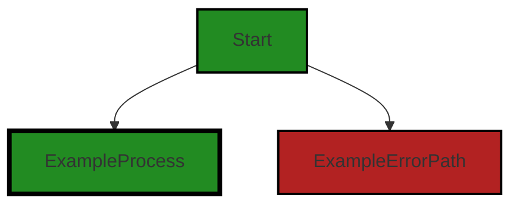
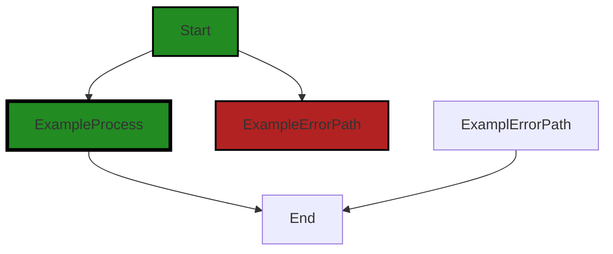

# Polyverse Boost-generated Source Analysis Details

## Source: ./package.json
Date Generated: Friday, September 8, 2023 at 5:12:13 PM PDT


---

### Boost Architectural Quick Summary Security Report

Last Updated: Friday, September 8, 2023 at 5:11:12 PM PDT


Executive Report:

1. **Architectural Impact**: The analysis of this file has not revealed any severe issues.
2. **Risk Analysis**: The analysis of this file has not revealed any severe issues.
3. **Potential Customer Impact**: Based on the analysis, there are no severe issues that could potentially impact customers.
4. **Performance Issues**: Our analysis did not identify any explicit performance issues in the file.
5. **Risk Assessment**: Based on the current analysis of this file, no severe issues have been found. However, this doesn't guarantee that the file is risk-free.

Highlights:

- No severe issues were identified in the current analysis of this file.


---

### Boost Architectural Quick Summary Performance Report

Last Updated: Friday, September 8, 2023 at 5:11:32 PM PDT


Executive Report:

1. **Architectural Impact**: The analysis of this file has not revealed any severe issues.
2. **Risk Analysis**: The analysis of this file has not revealed any severe issues.
3. **Potential Customer Impact**: Based on the analysis, there are no severe issues that could potentially impact customers.
4. **Performance Issues**: Our analysis did not identify any explicit performance issues in the file.
5. **Risk Assessment**: Based on the current analysis of this file, no severe issues have been found. However, this doesn't guarantee that the file is risk-free.

Highlights:

- No severe issues were identified in the current analysis of this file.


---

### Boost Architectural Quick Summary Compliance Report

Last Updated: Friday, September 8, 2023 at 5:12:40 PM PDT

Executive Level Report:

1. **Architectural Impact**: The software project is a Visual Studio Code extension that provides code analysis functionality. It is well-structured and follows best practices for a VS Code extension. However, the project has a configuration for the default organization for billing, which could potentially impact the architecture if credit card or other sensitive authentication data is processed, transmitted, or stored. This could require additional layers of security and encryption to be added to the architecture.

2. **Risk Analysis**: The project has a warning related to PCI DSS compliance requirements in the package.json file. This indicates a potential risk if the application handles credit card data. The risk is that the application may not be fully compliant with PCI DSS requirements, which could lead to potential security vulnerabilities and legal issues. 

3. **Potential Customer Impact**: If the application is not fully compliant with PCI DSS requirements, it could potentially expose customers' sensitive data, leading to a breach of trust and potential legal implications. This could negatively impact the reputation of the company and result in loss of customers.

4. **Overall Issues**: The project has one file, package.json, with issues related to GDPR, PCI DSS, and HIPAA. This is a significant concern as these regulations are critical for protecting user data and ensuring secure transactions. Non-compliance could lead to severe penalties and damage to the company's reputation.

5. **Risk Assessment**: Given that the project has only one file and that file has issues of varying severity, the overall health of the project source could be considered at risk. It is crucial to address these issues to ensure the project's compliance with data protection and security regulations.

Highlights:

- The project is well-structured and follows best practices for a VS Code extension, indicating a sound architectural foundation.
- The package.json file has issues related to GDPR, PCI DSS, and HIPAA, indicating potential compliance risks.
- The potential customer impact of these issues could be significant, as non-compliance could lead to a breach of trust and potential legal implications.
- The overall health of the project source is at risk due to the issues identified in the package.json file.
- There are no additional special architectural guidelines or constraints for this project, allowing for flexibility in addressing the identified issues.
---
## Detailed Analysis:

### Cell 0:
## Original Code:

### Programming Language: json
### ./package.json line 0

```json
{
    "name": "polyverse-boost-notebook",
    "displayName": "Polyverse Boost: Automatic Application Modernization",
    "description": "Polyverse Boost Application Modernization tool uses AI and source code analysis to find code bugs, security defects, generation documentation and convert to modern programming languages.",
    "publisher": "polyversecorporation",
    "license": "SEE LICENSE IN LICENSE",
    "homepage": "https://www.polyverse.com/boost/",
    "bugs": {
        "email": "support@polyverse.com"
    },
    "version": "1.1.0",
    "engines": {
        "vscode": "^1.77.0"
    },
    "categories": [
        "Machine Learning",
        "Testing",
        "Notebooks",
        "Programming Languages"
    ],
    "galleryBanner.color": "#F5F5F5",
    "icon": "resources/polyverse_vs_boost_logo.jpg",
    "activationEvents": [
        "onNotebook:polyverse-boost-notebook",
        "workspaceContains:*.boost-notebook",
        "onStartupFinished"
    ],
    "main": "./out/extension.js",
    "contributes": {
        "viewsContainers": {
            "activitybar": [
                {
                    "id": "polyverse-boost-explorer",
                    "title": "Polyverse Boost Dashboard",
                    "icon": "resources/boost_icon_plain.svg",
                    "defaultViewSize": "200px"
                }
            ]
        },
        "views": {
            "polyverse-boost-explorer": [
                {
                    "type": "webview",
                    "id": "polyverse-boost-start-view",
                    "name": "Start",
                    "icon": "resources/boost_icon_plain.svg"
                },
                {
                    "type": "webview",
                    "id": "polyverse-boost-summary-view",
                    "name": "Analysis Summary",
                    "icon": "resources/boost_icon_plain.svg"
                },
                {
                    "type": "webview",
                    "id": "polyverse-boost-chat-view",
                    "name": "Sara AI Chat",
                    "icon": "resources/boost_icon_plain.svg"
                },
                {
                    "type": "webview",
                    "id": "polyverse-boost-blueprint-view",
                    "name": "Blueprint Summary",
                    "icon": "resources/boost_icon_plain.svg"
                }
            ]
        },
        "configuration": {
            "title": "Polyverse Boost",
            "properties": {
                "polyverse-boost-notebook.defaultDir": {
                    "type": "string",
                    "default": ".boost",
                    "description": "Default directory for Polyverse Boost notebook save files"
                },
                "polyverse-boost-notebook.outputLanguage": {
                    "type": "string",
                    "default": "python",
                    "description": "Default output language for Polyverse Boost automatic code conversion"
                },
                "polyverse-boost-notebook.testFramework": {
                    "type": "string",
                    "default": "pytest",
                    "description": "Default test framework for Polyverse Boost automatic test code generation"
                },
                "polyverse-boost-notebook.defaultOrganization": {
                    "type": "string",
                    "default": "",
                    "description": "Default organization for Polyverse Boost billing"
                },
                "polyverse-boost-notebook.currentKernelCommand": {
                    "type": "string",
                    "default": "",
                    "description": "Boost Kernel to use for Automated Processing"
                },
                "polyverse-boost-notebook.refreshAnalysisAlways": {
                    "type": "boolean",
                    "default": false,
                    "description": "Force analysis refresh when existing Cell analysis is available"
                },
                "polyverse-boost-notebook.defaultOutputFormat": {
                    "type": "string",
                    "default": "markdown",
                    "enum": [
                        "html",
                        "markdown",
                        "pdf"
                    ],
                    "enumDescriptions": [
                        "HTML webpage format",
                        "Markdown format (default)",
                        "PDF binary format"
                    ],
                    "markdownDescription": "Select your preferred *output format* for exporting analysis results."
                },
                "polyverse-boost-notebook.logLevel": {
                    "type": "string",
                    "default": "error",
                    "enum": [
                        "debug",
                        "info",
                        "warn",
                        "error"
                    ],
                    "enumDescriptions": [
                        "All logging for debugging",
                        "Error, Warning, and Information logging",
                        "Error and Warning logging",
                        "Error logging only"
                    ],
                    "markdownDescription": "Select the logging level for Polyverse Boost Notebook extension."
                }
            }
        },
        "commands": [
            {
                "command": "polyverse-boost-notebook.customerPortal",
                "title": "Boost: Open Account Dashboard"
            },
            {
                "command": "polyverse-boost-notebook.boostStatus",
                "title": "Boost: Show Account Status"
            },
            {
                "command": "polyverse-boost-notebook.createJsonNotebook",
                "title": "Boost: Create Empty Notebook"
            },
            {
                "command": "polyverse-boost-notebook.loadCodeFile",
                "title": "Boost: Load Source File (using File Dialog)",
                "icon": "$(file-code)"
            },
            {
                "command": "polyverse-boost-notebook.selectOutputLanguage",
                "title": "Boost: Code Conversion Output Language",
                "icon": "$(code)"
            },
            {
                "command": "polyverse-boost-notebook.selectTestFramework",
                "title": "Boost: Select Test Framework",
                "icon": "$(checklist)"
            },
            {
                "command": "polyverse-boost-notebook.loadCurrentFile",
                "title": "Boost: Open Detailed Analysis Notebook",
                "icon": "$(file)"
            },
            {
                "command": "polyverse-boost-notebook.loadSummaryFile",
                "title": "Boost: Open Summary Analysis Notebook",
                "icon": "$(file)"
            },
            {
                "command": "polyverse-boost-notebook.loadCurrentFolder",
                "title": "Boost: Batch Build Notebook from Selected Folder (via File Explorer)",
                "icon": "$(folder)"
            },
            {
                "command": "polyverse-boost-notebook.processCurrentFile",
                "title": "Boost: Process Current File with Selected Kernel Automatically (Offline)",
                "icon": "$(file)"
            },
            {
                "command": "polyverse-boost-notebook.processCurrentFolder",
                "title": "Boost: Batch Process Folder with Selected Kernel Automatically (Offline)",
                "icon": "$(folder)"
            },
            {
                "command": "polyverse-boost-notebook.processProject",
                "title": "Boost: Analyze Project with Selected Kernel Automatically (Offline)",
                "icon": "$(folder)"
            },
            {
                "command": "polyverse-boost-notebook.buildCurrentFileOutput",
                "title": "Boost: Build Analysis as Output File",
                "icon": "$(file)"
            },
            {
                "command": "polyverse-boost-notebook.buildCurrentFileSummaryOutput",
                "title": "Boost: Build Analysis Summary as Output File",
                "icon": "$(file)"
            },
            {
                "command": "polyverse-boost-notebook.buildCurrentFolderOutput",
                "title": "Boost: Build All Analysis Output Files in Folder",
                "icon": "$(folder)"
            },
            {
                "command": "polyverse-boost-notebook.buildCurrentFolderSummaryOutput",
                "title": "Boost: Build Folder or Project Analysis Summary as Output",
                "icon": "$(folder)"
            },
            {
                "command": "polyverse-boost-notebook.showCurrentFileAnalysisOutput",
                "title": "Boost: Show File Details",
                "icon": "$(file)"
            },
            {
                "command": "polyverse-boost-notebook.showCurrentFileAnalysisSummaryOutput",
                "title": "Boost: Show File Summary",
                "icon": "$(file)"
            },
            {
                "command": "polyverse-boost-notebook.showCurrentFolderAnalysisSummaryOutput",
                "title": "Boost: Show Project Summary",
                "icon": "$(folder)"
            },
            {
                "command": "polyverse-boost-notebook.refreshProjectData",
                "title": "Boost: Refresh Project Data",
                "icon": "$(sync)"
            },
            {
                "command": "polyverse-boost-notebook.analyzeSourceCode",
                "title": "Boost: Analyze Source Code",
                "icon": "$(search)"
            },
            {
                "command": "polyverse-boost-notebook.showGuidelines",
                "title": "Boost: Show Project Guidelines",
                "icon": "$(gear)"
            },
            {
                "command": "polyverse-boost-notebook.showGuidelines.blueprint",
                "title": "Boost: Show Blueprint Guidelines",
                "icon": "$(gear)"
            },
            {
                "command": "polyverse-boost-notebook.showGuidelines.documentation",
                "title": "Boost: Show Documentation Guidelines",
                "icon": "$(gear)"
            },
            {
                "command": "polyverse-boost-notebook.showGuidelines.security",
                "title": "Boost: Show Security Guidelines",
                "icon": "$(gear)"
            },
            {
                "command": "polyverse-boost-notebook.showGuidelines.compliance",
                "title": "Boost: Show Compliance Guidelines",
                "icon": "$(gear)"
            }
        ],
        "notebooks": [
            {
                "type": "polyverse-boost-notebook",
                "displayName": "Boost Notebook",
                "selector": [
                    {
                        "filenamePattern": "*.boost-notebook"
                    }
                ]
            }
        ],
        "menus": {
            "view/title": [
                {
                    "command": "polyverse-boost-notebook.showGuidelines",
                    "group": "navigation",
                    "when": "view == polyverse-boost-summary-view"
                },
                {
                    "command": "polyverse-boost-notebook.showGuidelines.blueprint",
                    "group": "navigation",
                    "when": "view == polyverse-boost-blueprint-view"
                },
                {
                    "command": "polyverse-boost-notebook.showGuidelines.documentation",
                    "group": "navigation",
                    "when": "view == polyverse-boost-doc-view"
                },
                {
                    "command": "polyverse-boost-notebook.showGuidelines.security",
                    "group": "navigation",
                    "when": "view == polyverse-boost-security-view"
                },
                {
                    "command": "polyverse-boost-notebook.showGuidelines.compliance",
                    "group": "navigation",
                    "when": "view == polyverse-boost-compliance-view"
                }
            ],
            "editor/context": [
                {
                    "command": "polyverse-boost-notebook.analyzeSourceCode",
                    "group": "polyverseBoost"
                }
            ],
            "notebook/toolbar": [
                {
                    "command": "polyverse-boost-notebook.loadCodeFile",
                    "when": "notebookType == 'polyverse-boost-notebook'",
                    "group": "navigation@1"
                },
                {
                    "command": "polyverse-boost-notebook.selectOutputLanguage",
                    "when": "notebookType == 'polyverse-boost-notebook'",
                    "group": "navigation@2"
                },
                {
                    "command": "polyverse-boost-notebook.selectTestFramework",
                    "when": "notebookType == 'polyverse-boost-notebook'",
                    "group": "navigation@3"
                }
            ],
            "explorer/context": [
                {
                    "command": "polyverse-boost-notebook.loadCurrentFile",
                    "when": "resourceExtname == .toml || resourceExtname == .csproj || resourceExtname == .xcodeproj || resourceExtname == .sln || resourceExtname == .vbproj || resourceExtname == .fsproj || resourceExtname == .gradle || resourceExtname == .xslt || resourceExtname == .coffee || resourceExtname == .pm || resourceExtname == .ts || resourceExtname == .js || resourceExtname == .c || resourceExtname == .cpp || resourceExtname == .ts || resourceExtname == .html || resourceExtname == .css || resourceExtname == .json || resourceExtname == .xml || resourceExtname == .md || resourceExtname == .py || resourceExtname == .h || resourceExtname == .hpp || resourceExtname == .cs || resourceExtname == .java || resourceExtname == .go || resourceExtname == .rb || resourceExtname == .php || resourceExtname == .swift || resourceExtname == .kt || resourceExtname == .m || resourceExtname == .ps1 || resourceExtname == .pl || resourceExtname == .groovy || resourceExtname == .lua || resourceExtname == .rs || resourceExtname == .sh || resourceExtname == .bash || resourceExtname == .r || resourceExtname == .yml || resourceExtname == .yaml || resourceExtname == .fs || resourceExtname == .fsx || resourceExtname == .vb",
                    "group": "polyverseBoost"
                },
                {
                    "command": "polyverse-boost-notebook.loadSummaryFile",
                    "when": "resourceExtname == .toml || resourceExtname == .csproj || resourceExtname == .xcodeproj || resourceExtname == .sln || resourceExtname == .vbproj || resourceExtname == .fsproj || resourceExtname == .gradle || resourceExtname == .xslt || resourceExtname == .coffee || resourceExtname == .pm || resourceExtname == .ts || resourceExtname == .js || resourceExtname == .c || resourceExtname == .cpp || resourceExtname == .ts || resourceExtname == .html || resourceExtname == .css || resourceExtname == .json || resourceExtname == .xml || resourceExtname == .md || resourceExtname == .py || resourceExtname == .h || resourceExtname == .hpp || resourceExtname == .cs || resourceExtname == .java || resourceExtname == .go || resourceExtname == .rb || resourceExtname == .php || resourceExtname == .swift || resourceExtname == .kt || resourceExtname == .m || resourceExtname == .ps1 || resourceExtname == .pl || resourceExtname == .groovy || resourceExtname == .lua || resourceExtname == .rs || resourceExtname == .sh || resourceExtname == .bash || resourceExtname == .r || resourceExtname == .yml || resourceExtname == .yaml || resourceExtname == .fs || resourceExtname == .fsx || resourceExtname == .vb",
                    "group": "polyverseBoost"
                },
                {
                    "command": "polyverse-boost-notebook.loadCurrentFolder",
                    "when": "(resourceScheme == 'file' && resourceLangId == 'unknown' && resourceExtname == '')",
                    "group": "polyverseBoost"
                },
                {
                    "command": "polyverse-boost-notebook.processCurrentFile",
                    "when": "resourceExtname == .toml || resourceExtname == .csproj || resourceExtname == .xcodeproj || resourceExtname == .sln || resourceExtname == .vbproj || resourceExtname == .fsproj || resourceExtname == .gradle || resourceExtname == .xslt || resourceExtname == .coffee || resourceExtname == .pm || resourceExtname == .ts || resourceExtname == .js || resourceExtname == .c || resourceExtname == .cpp || resourceExtname == .ts || resourceExtname == .html || resourceExtname == .css || resourceExtname == .json || resourceExtname == .xml || resourceExtname == .md || resourceExtname == .py || resourceExtname == .h || resourceExtname == .hpp || resourceExtname == .cs || resourceExtname == .java || resourceExtname == .go || resourceExtname == .rb || resourceExtname == .php || resourceExtname == .swift || resourceExtname == .kt || resourceExtname == .m || resourceExtname == .ps1 || resourceExtname == .pl || resourceExtname == .groovy || resourceExtname == .lua || resourceExtname == .rs || resourceExtname == .sh || resourceExtname == .bash || resourceExtname == .r || resourceExtname == .yml || resourceExtname == .yaml || resourceExtname == .fs || resourceExtname == .fsx || resourceExtname == .vb",
                    "group": "polyverseBoost"
                },
                {
                    "command": "polyverse-boost-notebook.processCurrentFolder",
                    "when": "(resourceScheme == 'file' && resourceLangId == 'unknown' && resourceExtname == '')",
                    "group": "polyverseBoost"
                },
                {
                    "command": "polyverse-boost-notebook.showCurrentFileAnalysisOutput",
                    "when": "resourceExtname == .toml || resourceExtname == .csproj || resourceExtname == .xcodeproj || resourceExtname == .sln || resourceExtname == .vbproj || resourceExtname == .fsproj || resourceExtname == .gradle || resourceExtname == .xslt || resourceExtname == .coffee || resourceExtname == .pm || resourceExtname == .ts || resourceExtname == .js || resourceExtname == .c || resourceExtname == .cpp || resourceExtname == .ts || resourceExtname == .html || resourceExtname == .css || resourceExtname == .json || resourceExtname == .xml || resourceExtname == .md || resourceExtname == .py || resourceExtname == .h || resourceExtname == .hpp || resourceExtname == .cs || resourceExtname == .java || resourceExtname == .go || resourceExtname == .rb || resourceExtname == .php || resourceExtname == .swift || resourceExtname == .kt || resourceExtname == .m || resourceExtname == .ps1 || resourceExtname == .pl || resourceExtname == .groovy || resourceExtname == .lua || resourceExtname == .rs || resourceExtname == .sh || resourceExtname == .bash || resourceExtname == .r || resourceExtname == .yml || resourceExtname == .yaml || resourceExtname == .fs || resourceExtname == .fsx || resourceExtname == .vb",
                    "group": "polyverseBoost"
                },
                {
                    "command": "polyverse-boost-notebook.showCurrentFileAnalysisSummaryOutput",
                    "when": "resourceExtname == .toml || resourceExtname == .csproj || resourceExtname == .xcodeproj || resourceExtname == .sln || resourceExtname == .vbproj || resourceExtname == .fsproj || resourceExtname == .gradle || resourceExtname == .xslt || resourceExtname == .coffee || resourceExtname == .pm || resourceExtname == .ts || resourceExtname == .js || resourceExtname == .c || resourceExtname == .cpp || resourceExtname == .ts || resourceExtname == .html || resourceExtname == .css || resourceExtname == .json || resourceExtname == .xml || resourceExtname == .md || resourceExtname == .py || resourceExtname == .h || resourceExtname == .hpp || resourceExtname == .cs || resourceExtname == .java || resourceExtname == .go || resourceExtname == .rb || resourceExtname == .php || resourceExtname == .swift || resourceExtname == .kt || resourceExtname == .m || resourceExtname == .ps1 || resourceExtname == .pl || resourceExtname == .groovy || resourceExtname == .lua || resourceExtname == .rs || resourceExtname == .sh || resourceExtname == .bash || resourceExtname == .r || resourceExtname == .yml || resourceExtname == .yaml || resourceExtname == .fs || resourceExtname == .fsx || resourceExtname == .vb",
                    "group": "polyverseBoost"
                },
                {
                    "command": "polyverse-boost-notebook.showCurrentFolderAnalysisSummaryOutput",
                    "when": "(resourceScheme == 'file' && resourceLangId == 'unknown' && resourceExtname == '')",
                    "group": "polyverseBoost"
                }
            ]
        }
    },
    "scripts": {
        "clean": "rm -rf out",
        "build-instructions": "bash ./build_instructions.sh raw_instructions.md >./src/instructions.json",
        "compile": "tsc -p ./ && npm run build-instructions && node ./esbuild.js",
        "watch": "node ./esbuild.js --watch & tsc -watch -p ./",
        "lint": "eslint src --ext ts",
        "copy:test-data": "mkdir -p out/test && cp -R src/test/resources/ out/test/resources/",
        "pretest": "npm run clean && npm run compile && npm run lint && npm run copy:test-data",
        "esbuild-base": "npm run build-instructions && node ./esbuild.js",
        "esbuild": "npm run esbuild-base --sourcemap",
        "esbuild-watch": "npm run esbuild-base -- --sourcemap --watch",
        "esbuild-pretest": "npm run clean && npm run esbuild && npm run lint && npm run copy:test-data",
        "test": "node ./out/test/runTest.js",
        "prepublish:build": "NODE_ENV=production && npm run esbuild-base -- --minify",
        "prepublish:pretest": "npm run clean && npm run prepublish:build && npm run copy:test-data",
        "prepublish:test": "npm run test",
        "prepublish:login": "vsce login polyversecorporation",
        "package": "vsce package --allow-missing-repository --baseContentUrl \"https://polyverse.com\" --baseImagesUrl \"https://polyverse.com/images\" --out ./out/",
        "publish": "vsce publish --allow-missing-repository --baseContentUrl \"https://polyverse.com\" --baseImagesUrl \"https://polyverse.com/images\""
    },
    "devDependencies": {
        "@types/glob": "^8.1.0",
        "@types/lodash": "4.14.192",
        "@types/marked": "^4.3.0",
        "@types/mocha": "^10.0.1",
        "@types/node": "16.x",
        "@types/sinon": "10.0.13",
        "@types/vscode": "^1.77.0",
        "@types/vscode-webview": "^1.57.1",
        "@typescript-eslint/eslint-plugin": "^5.56.0",
        "@typescript-eslint/parser": "^5.56.0",
        "@vscode/test-electron": "^2.3.0",
        "chai": "^4.3.7",
        "esbuild": "^0.16.17",
        "eslint": "^8.36.0",
        "glob": "^8.1.0",
        "lodash": "^4.17.21",
        "mocha": "^10.2.0",
        "sinon": "^15.0.3",
        "ts-node": "^10.9.1",
        "typescript": "^5.1.6",
        "vscode-extension-tester": "^5.5.1"
    },
    "dependencies": {
        "@jupyterlab/nbformat": "^3.6.3",
        "@types/countup.js": "^2.0.4",
        "@vscode/codicons": "^0.0.33",
        "@vscode/webview-ui-toolkit": "^1.2.2",
        "axios": "^1.3.4",
        "axios-retry": "^3.5.1",
        "countup.js": "^2.6.2",
        "d3": "^7.8.5",
        "highlight.js": "^11.8.0",
        "marked": "^5.0.2",
        "marked-highlight": "^1.0.2",
        "nodejs": "^0.0.0",
        "p-queue": "v6.6.2",
        "puppeteer": "^20.2.1",
        "typewriter-effect": "^2.20.1",
        "uuid": "^9.0.0"
    }
}

```
## Boost Analysis:


---

### Boost Code Explanation

Last Updated: Wednesday, July 12, 2023 at 6:40:07 PM PDT

The provided code is a package.json file for a Visual Studio Code (VS Code) extension called "Polyverse Boost: Automatic Application Modernization". This extension uses AI and source code analysis to find code bugs, security defects, generate documentation, and convert to modern programming languages.

Let's break down the main sections of the code:

- **Basic Information**: This includes the `name`, `displayName`, `description`, `publisher`, `license`, `homepage`, `bugs`, `version`, and `engines` fields. These provide basic information about the extension, its publisher, licensing details, and the minimum version of VS Code required to run it.

- **Categories**: This field lists the categories that the extension belongs to in the VS Code Marketplace.

- **Activation Events**: These are the events that will activate the extension. In this case, the extension is activated when a notebook of type 'polyverse-boost-notebook' is opened, when a file with the `.boost-notebook` extension is present in the workspace, or when the VS Code startup process is finished.

- **Main**: This field points to the main JavaScript file that will be executed when the extension is activated.

- **Contributes**: This section defines the contributions of the extension to VS Code. It includes:
  - **ViewsContainers**: This defines a new activity bar view container with the ID 'polyverse-boost-explorer'.
  - **Views**: This defines the views that will be shown in the 'polyverse-boost-explorer' view container.
  - **Configuration**: This defines the configuration options for the extension that users can set in their settings.
  - **Commands**: This defines the commands that the extension provides. Each command has an ID and a title.
  - **Notebooks**: This defines the custom notebook type that the extension provides.
  - **Menus**: This defines the menus that the extension contributes to. It includes menus for the view title area, the editor context menu, the notebook toolbar, and the explorer context menu.

- **Algorithms**: This code does not contain any specific algorithms. It is a JSON configuration file that describes the properties of the VS Code extension.

For more information on developing VS Code extensions, you can refer to the VS Code Extension API documentation at [VS Code API](https://code.visualstudio.com/api).

This code is a part of a `package.json` file for a Node.js project. `package.json` is a core element of any Node.js project as it holds various metadata relevant to the project. This file is used to give information to `npm` that allows it to identify the project as well as handle the project's dependencies. 

Here's a breakdown of the main sections in the code:

1. **Commands**: The code defines several commands related to a feature or extension called `polyverse-boost-notebook`. These commands seem to be related to processing and analyzing files and folders. Each command is associated with a condition (`when`) that determines when the command should be available. For instance, the `polyverse-boost-notebook.processCurrentFile` command is available when the current file has one of the listed extensions (like .toml, .csproj, .xcodeproj, etc.).

2. **Scripts**: This section defines a series of npm scripts that can be run to perform various tasks in the development process. For instance, the `clean` script removes the `out` directory, the `compile` script compiles the TypeScript files in the project, and the `test` script runs the tests. There are also scripts for building, watching for changes, linting, and packaging the project.

3. **devDependencies**: This section lists the packages that are only needed for development and testing. These packages will not be installed when the project is installed as a dependency in another project. Packages in this section include various types, testing utilities, linters, and build tools.

4. **dependencies**: This section lists the packages that the project depends on to run. These packages will be installed whenever the project is installed as a dependency in another project. Packages in this section include libraries for handling HTTP requests, generating UUIDs, creating animations, and more.

The "polyverse-boost-notebook" commands seem to be related to a Visual Studio Code extension, based on the `vsce` commands in the scripts section. The `vsce` tool is a command-line tool for packaging, publishing and managing VS Code extensions.

For more information:
- [Node.js Guide on package.json](https://nodejs.dev/learn/the-package-json-guide)
- [Npm documentation on package.json](https://docs.npmjs.com/cli/v7/configuring-npm/package-json)
- [VS Code Extension API](https://code.visualstudio.com/api)
- [VSCE - Visual Studio Code Extension Manager](https://code.visualstudio.com/api/working-with-extensions/publishing-extension)


---

### Boost Flow Diagram

Last Updated: Friday, September 8, 2023 at 5:10:48 PM PDT

NO CONTROL FLOW FOUND



The code provided does not contain any control flow.



The code provided does not contain any control flow.


---

### Boost Source-Level Security Analysis

Last Updated: Friday, September 8, 2023 at 5:11:02 PM PDT

**No bugs found**


---

### Boost Source-Level Performance Analysis

Last Updated: Friday, September 8, 2023 at 5:11:28 PM PDT

**No bugs found**


---

### Boost Source-Level Data and Privacy Compliance Analysis

Last Updated: Friday, September 8, 2023 at 5:12:13 PM PDT

1. **Severity**: 5/10

   **Line Number**: 22

   **Bug Type**: GDPR

   **Description**: The application collects user email for bug reporting. This could potentially lead to a violation of the user's privacy rights under GDPR if not handled correctly.

   **Solution**: Ensure that the email collection is compliant with GDPR requirements. This includes obtaining user consent before collecting email, providing a clear and easily accessible privacy policy, and implementing proper security measures to protect user data. Anonymize or pseudonymize user data where possible.


2. **Severity**: 7/10

   **Line Number**: 142

   **Bug Type**: PCI DSS

   **Description**: The application has a configuration for the default organization for billing. If credit card or other sensitive authentication data is processed, transmitted, or stored, PCI DSS compliance requirements apply.

   **Solution**: Ensure that the application complies with all PCI DSS requirements when handling credit card data. This includes, but is not limited to, using strong encryption for transmission of cardholder data, limiting cardholder data storage, and maintaining a vulnerability management program.


3. **Severity**: 8/10

   **Line Number**: 366

   **Bug Type**: HIPAA

   **Description**: The application uses axios for HTTP requests. If any Protected Health Information (PHI) is transmitted using axios, it needs to be secure to comply with HIPAA regulations.

   **Solution**: Ensure that all PHI transmitted over the network is encrypted using a secure method such as SSL/TLS. If PHI is stored, it must be encrypted at rest and only accessible to authorized individuals.


