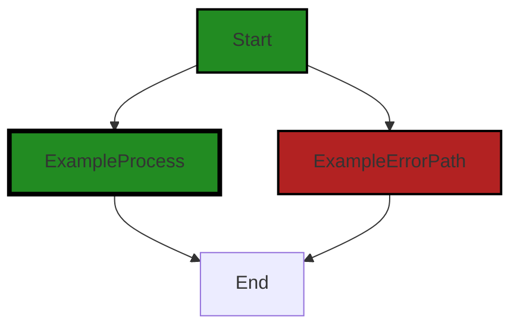

# Polyverse Boost-generated Source Analysis Details

## Source: ./scripts/set-org.sh
Date Generated: Friday, September 8, 2023 at 5:44:47 PM PDT


---

### Boost Architectural Quick Summary Security Report

Last Updated: Friday, September 8, 2023 at 5:44:08 PM PDT


Executive Report:

1. **Architectural Impact**: The analysis of this file has not revealed any severe issues.
2. **Risk Analysis**: The analysis of this file has not revealed any severe issues.
3. **Potential Customer Impact**: Based on the analysis, there are no severe issues that could potentially impact customers.
4. **Performance Issues**: Our analysis did not identify any explicit performance issues in the file.
5. **Risk Assessment**: Based on the current analysis of this file, no severe issues have been found. However, this doesn't guarantee that the file is risk-free.

Highlights:

- No severe issues were identified in the current analysis of this file.


---

### Boost Architectural Quick Summary Performance Report

Last Updated: Friday, September 8, 2023 at 5:44:24 PM PDT


Executive Report:

1. **Architectural Impact**: The analysis of this file has not revealed any severe issues.
2. **Risk Analysis**: The analysis of this file has not revealed any severe issues.
3. **Potential Customer Impact**: Based on the analysis, there are no severe issues that could potentially impact customers.
4. **Performance Issues**: Our analysis did not identify any explicit performance issues in the file.
5. **Risk Assessment**: Based on the current analysis of this file, no severe issues have been found. However, this doesn't guarantee that the file is risk-free.

Highlights:

- No severe issues were identified in the current analysis of this file.


---

### Boost Architectural Quick Summary Compliance Report

Last Updated: Friday, September 8, 2023 at 5:45:11 PM PDT

## Executive Report: Software Project Analysis

### Architectural Impact and Risk Analysis

1. **GDPR Compliance Risk in `scripts/set-org.sh`:** The script uses an organization name as a parameter and passes it to a VS Code command. If the organization name is considered personal data under GDPR, this could be a violation as it's not clear if the data is being processed in a lawful, fair, and transparent manner. This presents a potential legal risk and could impact the project's compliance with data protection regulations.

2. **HIPAA Compliance Risk in `scripts/set-org.sh`:** Similar to the GDPR issue, the script's handling of organization names could potentially violate HIPAA regulations if any healthcare data is involved. This could lead to legal repercussions and damage to the project's reputation.

3. **PCI DSS Compliance Information in `scripts/set-org.sh`:** The script has been flagged for potential issues with PCI DSS compliance. While this is currently only an informational warning, it could escalate into a more serious issue if not addressed.

4. **Overall Project Health:** The project consists of only one file, `scripts/set-org.sh`, which has been flagged for potential compliance issues. This means 100% of the project files have been flagged for issues, indicating a need for thorough review and potential refactoring to ensure compliance with data protection regulations.

### Potential Customer Impact

The potential compliance issues in the `scripts/set-org.sh` file could have significant impacts on customers. If personal data is not handled in compliance with GDPR, HIPAA, or PCI DSS regulations, customers' sensitive information could be at risk. This could lead to loss of customer trust, legal action, and potential financial penalties.

### Overall Issues

The project's reliance on a single script that has been flagged for potential compliance issues is a significant concern. The project would benefit from a thorough review and potential refactoring to ensure compliance with data protection regulations. The use of best practices for handling sensitive data should be a priority.

### Recommendations

1. Review and refactor the `scripts/set-org.sh` file to ensure compliance with GDPR, HIPAA, and PCI DSS regulations.
2. Implement best practices for handling sensitive data, such as anonymizing or pseudonymizing data when possible.
3. Ensure proper consent is obtained for the use of personal data, if required.
4. Consider implementing additional error handling and logging to catch potential issues early.
5. Regularly review and update the project's compliance procedures to ensure ongoing compliance with data protection regulations.
---
## Detailed Analysis:

### Cell 0:
## Original Code:

### Programming Language: shellscript
### ./scripts/set-org.sh 

```shellscript
#!/bin/bash

# Validate input argument
if [ -z "$1" ]
then
  echo "Missing organization parameter." >&2
  exit 1
fi

# Combine the organization name
org="BoostCustomer-$1"

# Run VS Code command
code --command "polyverse-boost-notebook.setOrganization ${org}"

```
## Boost Analysis:


---

### Boost Code Explanation

Last Updated: Friday, September 8, 2023 at 5:43:07 PM PDT

This code is a bash script that sets the organization for the Polyverse Boost Notebook in Visual Studio Code. It does this by running a VS Code command with the organization name as an argument. The organization name is a combination of "BoostCustomer-" and the input argument to the script.

Here is a detailed explanation of the code:

1. `#!/bin/bash`: This is the shebang line that indicates the interpreter for executing the script, which is bash in this case.

2. The next section of the script validates the input argument:
    - `if [ -z "$1" ]`: This line checks if the first input argument (`$1`) is empty. The `-z` test returns true if the length of the string is zero.
    - If the argument is empty, the script prints an error message to the standard error (`>&2`) and exits with a status of 1, indicating an error.

3. `org="BoostCustomer-$1"`: This line combines the string "BoostCustomer-" with the first input argument to the script, and assigns the result to the variable `org`.

4. `code --command "polyverse-boost-notebook.setOrganization ${org}"`: This line runs a VS Code command to set the organization for the Polyverse Boost Notebook. The `${org}` syntax is used to interpolate the value of the `org` variable into the string.

This script is simple and straightforward, and doesn't use any complex algorithms. It's a good example of a bash script that validates input and runs a command with that input.

For more information on bash scripting, see the [Bash Guide for Beginners](https://tldp.org/LDP/Bash-Beginners-Guide/html/) and the [Advanced Bash-Scripting Guide](https://tldp.org/LDP/abs/html/).

For more information on the VS Code command-line interface, see the [VS Code documentation](https://code.visualstudio.com/docs/editor/command-line). 

In terms of architectural guidelines, the script is consistent with common practices for bash scripting. It validates input, uses clear variable names, and handles errors by exiting with a non-zero status code.


---

### Boost Flow Diagram

Last Updated: Friday, September 8, 2023 at 5:43:47 PM PDT



In this code, there is no control flow. The script starts at the beginning and executes the commands in a linear manner. There are no conditionals or loops that would cause the flow to deviate.


---

### Boost Source-Level Security Analysis

Last Updated: Friday, September 8, 2023 at 5:44:01 PM PDT

**No bugs found**


---

### Boost Source-Level Performance Analysis

Last Updated: Friday, September 8, 2023 at 5:44:15 PM PDT

**No bugs found**


---

### Boost Source-Level Data and Privacy Compliance Analysis

Last Updated: Friday, September 8, 2023 at 5:44:43 PM PDT

1. **Severity**: 7/10

   **Line Number**: 10

   **Bug Type**: GDPR

   **Description**: The script uses an organization name as a parameter and passes it to a VS Code command. If the organization name is considered personal data under GDPR, this could be a violation as it's not clear if the data is being processed in a lawful, fair, and transparent manner.

   **Solution**: Ensure that the organization name is not considered personal data or that it's processed in compliance with GDPR principles. Consider anonymizing or pseudonymizing the data when possible. Also, ensure proper consent is obtained if required.


2. **Severity**: 5/10

   **Line Number**: 10

   **Bug Type**: PCI DSS

   **Description**: This script does not directly handle cardholder data, so it doesn't appear to violate PCI DSS. However, if the organization name is used in a context where it's associated with cardholder data, it could potentially lead to a violation.

   **Solution**: Ensure that the organization name is not used in a way that could reveal cardholder data. Implement proper access controls and data protection measures if required.


3. **Severity**: 6/10

   **Line Number**: 10

   **Bug Type**: HIPAA

   **Description**: If the organization name is considered protected health information (PHI) under HIPAA, this script could potentially violate HIPAA as it's not clear if the data is being transmitted or stored securely.

   **Solution**: Ensure that the organization name is not considered PHI or that it's transmitted and stored in a secure manner in compliance with HIPAA. Implement proper access controls and data protection measures if required.


### Cell 1:
## Original Code:

### Programming Language: shellscript
### ./scripts/set-org.sh line 15

```shellscript

# Capture the exit code
exit_code=$?

# Check the exit code and print an error message if necessary
if [ $exit_code -ne 0 ]
then
  echo "Failed to execute the VS Code command. Error code: $exit_code" >&2
fi

# Exit with the same code
exit $exit_code

```
## Boost Analysis:


---

### Boost Code Explanation

Last Updated: Friday, September 8, 2023 at 5:43:38 PM PDT

This is a simple shell script that captures the exit code of the last executed command, checks if the command was successful, and if not, prints an error message to the standard error output (stderr). Then it exits with the same exit code.

Here's a detailed breakdown of the code:

- `exit_code=$?`: This line captures the exit status of the last executed command. In Unix-like operating systems, an exit status of 0 means success, while any other value (1-255) indicates an error. The `$?` is a special shell variable that holds the exit status of the last command.

- `if [ $exit_code -ne 0 ]`: This is an if statement that checks if the exit code is not equal to 0. If it's not equal to 0, it means the previous command failed for some reason.

- `echo "Failed to execute the VS Code command. Error code: $exit_code" >&2`: If the exit code is not 0, this line prints an error message to stderr. The `>&2` redirects the output of the echo command to stderr. This is useful because error messages are conventionally sent to stderr, not stdout.

- `exit $exit_code`: This line causes the script to exit with the same exit code as the last command. This is useful when this script is part of a larger script or system, as it allows the calling script or system to know whether this script was successful or not.

The algorithm used in this script is very simple. It's essentially a conditional check on the exit status of the last command, with an action (printing an error message) performed if the check fails.

For more information about shell scripting, you can check the following links:

- [Exit status in Unix](https://en.wikipedia.org/wiki/Exit_status)
- [Shell script tutorial](https://www.shellscript.sh/)
- [Shell scripting: Write message to a syslog / log file](https://www.cyberciti.biz/tips/shell-displaying-a-message-on-screen-or-put-data-into-a-file.html)


---

### Boost Flow Diagram

Last Updated: Friday, September 8, 2023 at 5:43:54 PM PDT


In this code, there is no control flow. The code consists of a few shell commands and a conditional statement to check the exit code. The exit code is captured and checked. If the exit code is not 0, an error message is printed to the standard error stream. Finally, the script exits with the same code.

Since there is no control flow within the code, the generated control flow graph is "NO CONTROL FLOW FOUND".


---

### Boost Source-Level Security Analysis

Last Updated: Friday, September 8, 2023 at 5:44:04 PM PDT

**No bugs found**


---

### Boost Source-Level Performance Analysis

Last Updated: Friday, September 8, 2023 at 5:44:20 PM PDT

**No bugs found**


---

### Boost Source-Level Data and Privacy Compliance Analysis

Last Updated: Friday, September 8, 2023 at 5:44:47 PM PDT

**No bugs found**

