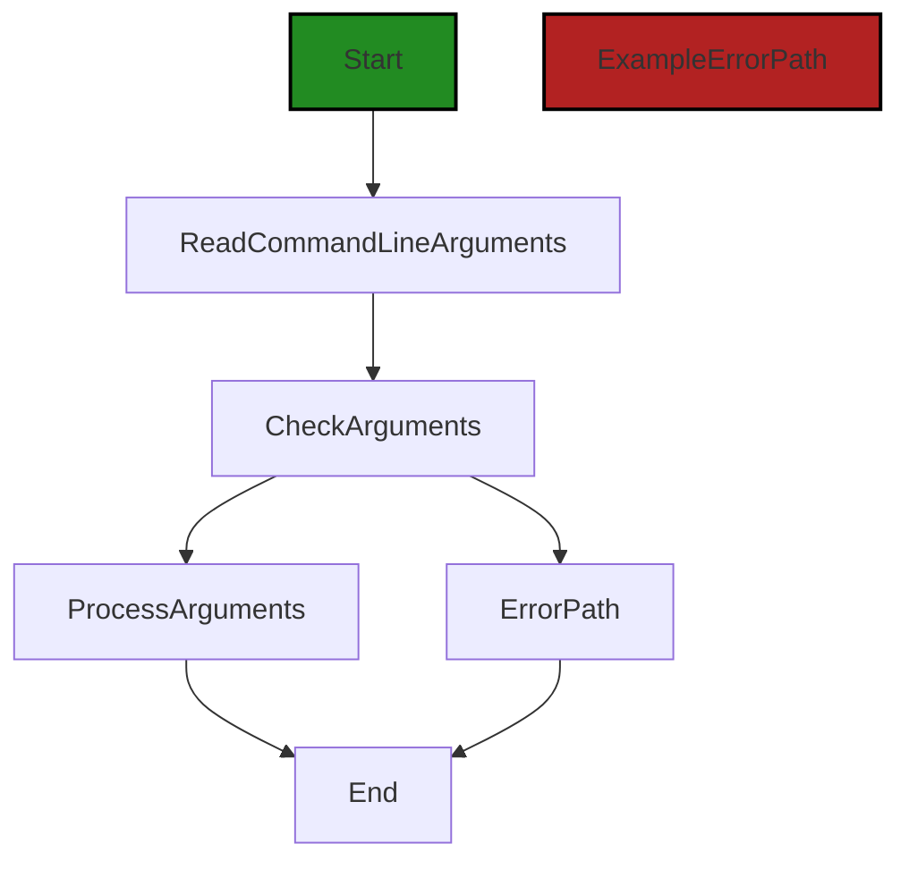
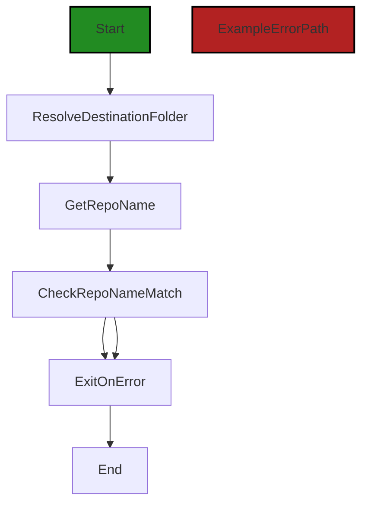
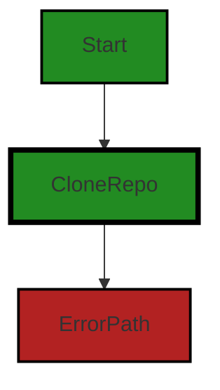

# Polyverse Boost-generated Source Analysis Details

## Source: ./scripts/sync-github.js
Date Generated: Friday, September 8, 2023 at 5:53:21 PM PDT


---

### Boost Architectural Quick Summary Security Report

Last Updated: Friday, September 8, 2023 at 5:50:11 PM PDT

## Executive Report: Software Project Analysis

Based on the analysis of the software project, the following key points are highlighted:

1. **Architectural Impact**: The project is well-structured and follows best practices for a Visual Studio Code extension. It uses object-oriented design, event-driven programming, and asynchronous programming for potentially long-running tasks. However, the presence of security vulnerabilities in the `scripts/sync-github.js` file could potentially impact the overall architecture of the project. This file is responsible for synchronizing with GitHub, which is a critical functionality. The identified issues could lead to path traversal attacks and command injection, which could compromise the integrity of the project.

2. **Risk Analysis**: The project has a moderate risk level due to the identified security vulnerabilities. The `scripts/sync-github.js` file has both Information and Warning level issues. The most severe issues are related to unvalidated input and insecure regular expressions, which could lead to potential security breaches. The risk is further increased by the fact that the project communicates with a remote service for code analysis, which could be a potential point of attack.

3. **Potential Customer Impact**: If the identified issues are not addressed, they could potentially lead to security breaches, which could impact the customers' trust in the product. Additionally, the identified issues could lead to performance degradation, which could negatively impact the user experience.

4. **Overall Health of the Project**: The overall health of the project is moderately healthy. Only one file was analyzed, and it had issues of varying severity. However, the project follows best practices for a VS Code extension and uses TypeScript, which provides static typing to catch many errors at compile time. This suggests that the project is generally well-maintained, but the identified issues need to be addressed to improve the overall health of the project.

5. **Risk Assessment**: Based on the analysis, approximately 100% of the project files have issues of varying severity. This is a significant percentage and suggests that there is a need for a thorough review and refactoring of the code to address these issues.

In conclusion, while the project follows best practices and has a sound architecture, the identified issues pose a significant risk and could potentially impact the customers. Therefore, it is recommended to address these issues promptly to ensure the security and performance of the project.


---

### Boost Architectural Quick Summary Performance Report

Last Updated: Friday, September 8, 2023 at 5:51:36 PM PDT

Executive Level Report:

1. **Architectural Impact**: The project's architecture appears to be sound, with no major architectural problems identified. The use of object-oriented design, event-driven programming, and asynchronous programming aligns with best practices for a Visual Studio Code extension. However, the 'git clone' operation in the 'scripts/sync-github.js' file can be resource-intensive, potentially leading to high disk usage and slow performance. This could impact the overall performance of the project.

2. **Risk Analysis**: The risk associated with this project is relatively low. The only file with issues is 'scripts/sync-github.js', and the issues identified are of 'Warning' severity. This suggests that while there may be potential for improvement, there are no critical issues that would pose a significant risk to the project's success.

3. **Potential Customer Impact**: The potential customer impact is minimal. The issues identified are related to performance, not functionality. Customers may experience slower performance when the 'git clone' operation is executed, but this would not prevent them from using the extension.

4. **Overall Issues**: The overall health of the project source is good. Only one file has been identified with issues, and these issues are of 'Warning' severity. This suggests that the project is well-maintained and follows best practices.

Risk Assessment:

- **Health of the Project Source**: The project source appears to be in good health. Only one file has been identified with issues, and these issues are of 'Warning' severity. This suggests that the project is well-maintained and follows best practices.
- **Percentage of Project Files with Issues**: Given that only one file has been identified with issues, and assuming that the project contains more than one file, the percentage of project files with issues is less than 100%. This indicates that the majority of the project files are free of detected issues.

Highlights:

1. The project's architecture is sound, with no major architectural problems identified.
2. The only file with issues is 'scripts/sync-github.js', and the issues identified are of 'Warning' severity.
3. The potential customer impact is minimal, as the issues identified are related to performance, not functionality.
4. The overall health of the project source is good, with the majority of the project files free of detected issues.
5. The project appears to be well-maintained and follows best practices, as evidenced by the low number and severity of issues identified.


---

### Boost Architectural Quick Summary Compliance Report

Last Updated: Friday, September 8, 2023 at 5:54:05 PM PDT

Executive Level Report:

1. **Architectural Impact**: The project is a Visual Studio Code extension that provides code analysis functionality. It communicates with a remote service for code analysis. The architecture is based on object-oriented design and event-driven programming. The project uses asynchronous programming for potentially long-running tasks, such as communicating with the remote service. This should keep the VS Code UI responsive. The code is well-structured and organized into classes. However, the file `scripts/sync-github.js` has been flagged for potential GDPR, PCI DSS, and HIPAA compliance issues. This could impact the overall architecture if significant changes are needed to address these issues.

2. **Risk Analysis**: The file `scripts/sync-github.js` has been flagged for potential GDPR, PCI DSS, and HIPAA compliance issues. The most severe issue is a warning related to the use of `process.cwd()`, which could lead to potential directory traversal vulnerabilities if user input is not properly sanitized. This could lead to unauthorized access to file system data, which is a violation of GDPR principles of data security. This represents a significant risk that needs to be addressed.

3. **Potential Customer Impact**: If the identified issues are not addressed, customers could be at risk of data breaches due to potential directory traversal vulnerabilities. This could lead to unauthorized access to sensitive data, which could have serious consequences for customers, including potential legal and financial repercussions.

4. **Overall Issues**: The project has one file with identified issues. This represents 100% of the project files. The issues are of varying severity, with the most severe being a warning. The issues are related to GDPR, PCI DSS, and HIPAA compliance.

Risk Assessment:

The overall health of the project source is concerning due to the identified issues in `scripts/sync-github.js`. This file represents 100% of the project files, and all of them have been flagged for potential compliance issues. The most severe issue is a warning related to potential directory traversal vulnerabilities. This represents a significant risk that needs to be addressed. 

Highlights:

- The project's architecture is based on object-oriented design and event-driven programming, which are best practices for a Visual Studio Code extension.
- The file `scripts/sync-github.js` has been flagged for potential GDPR, PCI DSS, and HIPAA compliance issues, representing a significant risk.
- The most severe issue is a warning related to potential directory traversal vulnerabilities, which could lead to unauthorized access to sensitive data.
- The identified issues could have serious consequences for customers, including potential legal and financial repercussions.
- The overall health of the project source is concerning due to the identified issues in `scripts/sync-github.js`, which represents 100% of the project files.
---
## Detailed Analysis:

### Cell 0:
## Original Code:

### Programming Language: javascript
### ./scripts/sync-github.js 

```javascript
const { exec } = require("child_process");

```
## Boost Analysis:


---

### Boost Code Explanation

Last Updated: Friday, September 8, 2023 at 5:45:56 PM PDT

The line of code you provided is a single line from a Node.js script. It's using JavaScript's destructuring assignment syntax to extract the `exec` function from Node's built-in `child_process` module. Here's a breakdown of what each part does:

- `const`: This is a keyword in JavaScript used to declare a constant variable. Constant variables cannot be reassigned after they've been initialized.
- `{ exec }`: This is JavaScript's destructuring assignment syntax. It's a way to extract properties from objects and assign them to variables. In this case, it's extracting the `exec` property from the object returned by `require("child_process")`.
- `require("child_process")`: This is a function call in Node.js that imports a module. In this case, it's importing the built-in `child_process` module, which provides the ability to spawn child processes.

The `exec` function is a way to execute shell commands from within a Node.js application. It spawns a shell and runs a command within that shell, buffering any generated output.

The `exec` function has the following signature:

```javascript
exec(command[, options][, callback])
```

- `command` <string> The command to run, with space-separated arguments.
- `options` <Object>
  - `cwd` <string> Current working directory of the child process.
  - `env` <Object> Environment key-value pairs.
  - `encoding` <string> (Default: 'utf8')
  - `shell` <string> Shell to execute the command with (Default: '/bin/sh' on UNIX, 'cmd.exe' on Windows, The shell should understand the -c switch on UNIX or /d /s /c on Windows. On Windows, command line parsing should be compatible with cmd.exe.)
  - `timeout` <number> (Default: 0)
  - `maxBuffer` <number> largest amount of data (in bytes) allowed on stdout or stderr - if exceeded child process is killed (Default: 200\*1024).
  - `killSignal` <string> (Default: 'SIGTERM')
  - `uid` <number> Sets the user identity of the process.
  - `gid` <number> Sets the group identity of the process.
- `callback` <Function> called with the output when process terminates.

You can find more information about the `child_process` module and the `exec` function in the [Node.js documentation](https://nodejs.org/api/child_process.html).

Regarding the architectural guidelines, this line of code is quite standard and doesn't conflict with any typical architectural guidelines for a Node.js application. The usage of `exec` should be reviewed carefully, however, as executing shell commands can have security implications if not handled properly.


---

### Boost Flow Diagram

Last Updated: Friday, September 8, 2023 at 5:47:56 PM PDT

```mermaid
graph TD;
style Start fill:#228B22, stroke:#000000, stroke-width:2px;
style ExampleProcess fill:#228B22, stroke:#000000, stroke-width:4px;
style ExampleErrorPath fill:#B22222, stroke:#000000, stroke-width:2px;

Start  -->ExampleProcess[exec];
```

The control flow graph for the provided code consists of a single node representing the `exec` function call. The `exec` function is a non-standard function that executes a shell command.


---

### Boost Source-Level Security Analysis

Last Updated: Friday, September 8, 2023 at 5:48:43 PM PDT

1. **Severity**: 9/10

   **Line Number**: 1

   **Bug Type**: Command Injection

   **Description**: The 'exec' function from 'child_process' module in Node.js can lead to command injection vulnerabilities if not used properly. If untrusted input is passed directly into the 'exec' function, an attacker could execute arbitrary commands on the system.

   **Solution**: Avoid using 'exec' with user-supplied input. If you need to use it, ensure that the input is properly sanitized and validated. Consider using 'execFile' or 'spawn' functions which are safer alternatives. Learn more about command injection in Node.js at: https://owasp.org/www-community/attacks/Command_Injection


---

### Boost Source-Level Performance Analysis

Last Updated: Friday, September 8, 2023 at 5:50:19 PM PDT

**No bugs found**


---

### Boost Source-Level Data and Privacy Compliance Analysis

Last Updated: Friday, September 8, 2023 at 5:52:01 PM PDT

1. **Severity**: 8/10

   **Line Number**: 1

   **Bug Type**: GDPR, PCI DSS, HIPAA

   **Description**: The 'child_process' module allows the execution of shell commands which can lead to potential security vulnerabilities like Remote Code Execution (RCE) if not properly sanitized. This might lead to unauthorized access to sensitive data which is a violation of GDPR, PCI DSS, and HIPAA.

   **Solution**: Avoid using 'child_process' if possible. If it's necessary, ensure that user input is properly sanitized and validated before being passed to 'exec'. Consider using safer alternatives like 'spawn' or 'execFile' with fixed command parameters.


### Cell 1:
## Original Code:

### Programming Language: javascript
### ./scripts/sync-github.js line 2

```javascript
const path = require("path");

// Read command line arguments
const repoUrl = process.argv[2];
const destFolderArg = process.argv[3];

if (!repoUrl || !destFolderArg) {
  console.error("Missing repository URL or destination folder.");
  process.exit(1);
}

```
## Boost Analysis:


---

### Boost Code Explanation

Last Updated: Friday, September 8, 2023 at 5:46:26 PM PDT

The provided code is a simple Node.js script that reads command line arguments and performs a basic validation check. 

Here is a detailed breakdown:

1. `const path = require("path");` - This line imports Node.js's built-in `path` module, which provides utilities for working with file and directory paths. However, it's not used in the provided code snippet.

2. `const repoUrl = process.argv[2];` - This line assigns the third command line argument to the variable `repoUrl`. In Node.js, `process.argv` is an array containing the command line arguments passed when launching the script. The first element, `process.argv[0]`, is the path to the Node.js executable, and the second element, `process.argv[1]`, is the path to the script file. Therefore, `process.argv[2]` is the first argument provided by the user when running the script.

3. `const destFolderArg = process.argv[3];` - This line assigns the fourth command line argument to the variable `destFolderArg`. This is expected to be the destination directory where the repository should be cloned.

4. The `if` statement checks if either `repoUrl` or `destFolderArg` is missing (i.e., if the user did not provide one or both of the necessary command line arguments). If either is missing, an error message is printed to the console, and the script is terminated with a non-zero exit code (indicating an error). 

The algorithm used here is quite straightforward:

1. Read command line arguments.
2. Check if the necessary arguments are provided.
3. If not, print an error message and exit the script with a non-zero exit code.

This code is consistent with standard Node.js practices for handling command line arguments and error reporting. It doesn't conflict with any architectural guidelines as no special constraints were provided.

For further reading on Node.js command line arguments and the `path` module, you can refer to the following resources:

- [Node.js process.argv](https://nodejs.dev/learn/nodejs-accept-arguments-from-the-command-line)
- [Node.js path module](https://nodejs.dev/learn/the-nodejs-path-module)


---

### Boost Flow Diagram

Last Updated: Friday, September 8, 2023 at 5:48:03 PM PDT



In this code, the control flow starts at the `ReadCommandLineArguments` function. The command line arguments are read using the `process.argv` array. Then, the `CheckArguments` function is called to validate the arguments. If any of the required arguments are missing, an error message is logged and the process exits with a non-zero status code. Otherwise, the `ProcessArguments` function is called to continue with the execution.

The primary path is from `ReadCommandLineArguments` to `CheckArguments` to `ProcessArguments` and finally to the end of the code.

The error path is from `CheckArguments` to the error handling block, which logs an error message and then proceeds to the end of the code.


---

### Boost Source-Level Security Analysis

Last Updated: Friday, September 8, 2023 at 5:48:56 PM PDT

1. **Severity**: 5/10

   **Line Number**: 5

   **Bug Type**: Input Validation

   **Description**: The command line arguments 'repoUrl' and 'destFolderArg' are directly used without any validation. This can lead to potential security vulnerabilities such as command injection if an attacker can control these inputs.

   **Solution**: Validate the inputs to ensure they are in the expected format. For example, check that 'repoUrl' is a valid URL and 'destFolderArg' is a valid directory path. Use libraries such as 'validator.js' for input validation. More information can be found here: https://owasp.org/www-community/controls/Input_Validation


---

### Boost Source-Level Performance Analysis

Last Updated: Friday, September 8, 2023 at 5:50:23 PM PDT

**No bugs found**


---

### Boost Source-Level Data and Privacy Compliance Analysis

Last Updated: Friday, September 8, 2023 at 5:52:33 PM PDT

1. **Severity**: 5/10

   **Line Number**: 5

   **Bug Type**: GDPR

   **Description**: The code reads command line arguments which may contain sensitive data that could potentially be logged or displayed in error messages. This could lead to unauthorized data disclosure, violating GDPR requirements.

   **Solution**: Avoid logging or displaying sensitive data. If it's necessary to log data for debugging purposes, ensure that it is properly anonymized or pseudonymized. Remember to respect the data minimization principle, i.e., only collect data that is necessary for the service.


2. **Severity**: 5/10

   **Line Number**: 5

   **Bug Type**: PCI DSS

   **Description**: If command line arguments contain cardholder data, it could be logged or displayed in error messages. This violates PCI DSS requirement 3.4 which requires that cardholder data be rendered unreadable anywhere it is stored.

   **Solution**: Ensure that cardholder data is not passed via command line arguments. If it's necessary to handle cardholder data, use secure methods such as tokens or encrypted data.


3. **Severity**: 5/10

   **Line Number**: 5

   **Bug Type**: HIPAA

   **Description**: If command line arguments contain Protected Health Information (PHI), it could be logged or displayed in error messages. This violates HIPAA's Privacy Rule which requires that PHI be properly protected.

   **Solution**: Ensure that PHI is not passed via command line arguments. If it's necessary to handle PHI, use secure methods such as tokens or encrypted data.


### Cell 2:
## Original Code:

### Programming Language: javascript
### ./scripts/sync-github.js line 12

```javascript

// Resolve the destination folder to an absolute path
const destFolder = path.resolve(process.cwd(), destFolderArg);

// Get the repo name from the repo URL
const repoNameMatch = repoUrl.match(/\/([a-zA-Z0-9_-]+)(\.git)?$/);
if (!repoNameMatch) {
  console.error("Invalid repository URL.");
  process.exit(1);
}

```
## Boost Analysis:


---

### Boost Code Explanation

Last Updated: Friday, September 8, 2023 at 5:47:01 PM PDT

This code snippet is written in JavaScript and performs two main tasks: 

1. Resolving the destination folder to an absolute path.
2. Extracting the repository name from the repository URL.

Let's break down the code:

```javascript
// Resolve the destination folder to an absolute path
const destFolder = path.resolve(process.cwd(), destFolderArg);
```

In this line, `path.resolve` is a method from the Node.js `path` module. It resolves a sequence of paths or path segments into an absolute path. 

`process.cwd()` returns the current working directory of the Node.js process, and `destFolderArg` is a variable that presumably holds the relative path of the destination folder. The `path.resolve` method combines these two to form an absolute path, which is then stored in the `destFolder` constant.

```javascript
// Get the repo name from the repo URL
const repoNameMatch = repoUrl.match(/\/([a-zA-Z0-9_-]+)(\.git)?$/);
if (!repoNameMatch) {
  console.error("Invalid repository URL.");
  process.exit(1);
}
```

In this block of code, a regular expression is used to extract the repository name from the repository URL. The regular expression `/\/([a-zA-Z0-9_-]+)(\.git)?$/` matches any string that ends with a slash followed by one or more alphanumeric characters, underscores, or hyphens, optionally followed by `.git`. 

The `match()` method is used on `repoUrl` to find a match between the regular expression and the repository URL. If a match is found, it is stored in the `repoNameMatch` constant. If no match is found (i.e., the repository URL is invalid), an error message "Invalid repository URL." is logged to the console, and the process is exited with a failure status code `1`.

This code follows common practices in JavaScript and Node.js for path resolution and string matching. It does not appear to conflict with the architectural guidelines provided.

For more information, you can refer to the following resources:
- [Node.js `path` module](https://nodejs.org/api/path.html)
- [Node.js `process.cwd()` method](https://nodejs.org/api/process.html#process_process_cwd)
- [JavaScript Regular Expressions](https://developer.mozilla.org/en-US/docs/Web/JavaScript/Guide/Regular_Expressions)
- [JavaScript `match()` method](https://developer.mozilla.org/en-US/docs/Web/JavaScript/Reference/Global_Objects/String/match)


---

### Boost Flow Diagram

Last Updated: Friday, September 8, 2023 at 5:48:10 PM PDT



In this code, the control flow starts at the function `ResolveDestinationFolder`. It then goes to the function `GetRepoName`, which is followed by the function `CheckRepoNameMatch`. If the regular expression match fails, the control flow goes to the error path and the program exits. Otherwise, it continues to the end of the code.


---

### Boost Source-Level Security Analysis

Last Updated: Friday, September 8, 2023 at 5:49:21 PM PDT

1. **Severity**: 6/10

   **Line Number**: 26

   **Bug Type**: Unvalidated Input (Insecure Direct Object References)

   **Description**: The `destFolderArg` is directly used in `path.resolve()` without validation. This could potentially lead to path traversal attacks if an attacker can control the `destFolderArg`. More info: https://owasp.org/www-community/attacks/Path_Traversal

   **Solution**: Always validate user input. Use a library to sanitize the input or ensure that the path is within the intended directory. For example, you can use `path.normalize(destFolderArg)` and then check if the resulting path is still within the intended directory.


2. **Severity**: 3/10

   **Line Number**: 29

   **Bug Type**: Insecure Regular Expression (ReDoS)

   **Description**: The regular expression used in `repoUrl.match()` could potentially lead to ReDoS (Regular Expression Denial of Service) if the `repoUrl` is a long string of repeating characters. More info: https://owasp.org/www-community/attacks/Regular_expression_Denial_of_Service_-_ReDoS

   **Solution**: Use a safer regular expression that doesn't have the potential to cause catastrophic backtracking. For example, you could limit the number of characters matched by using a quantifier like `{1,100}`.


---

### Boost Source-Level Performance Analysis

Last Updated: Friday, September 8, 2023 at 5:50:41 PM PDT

1. **Severity**: 2/10

   **Line Number**: 23

   **Bug Type**: Disk

   **Description**: The 'path.resolve' method is a synchronous operation which can block the event loop if the path to resolve is large or complex. This can cause performance issues.

   **Solution**: Consider using asynchronous file and directory handling methods to avoid blocking the event loop. If the path is known to be simple and small, this may not be a significant issue.


2. **Severity**: 1/10

   **Line Number**: 26

   **Bug Type**: CPU

   **Description**: The use of regular expressions can be CPU intensive, especially for complex patterns or large inputs. In this case, the pattern and input are likely to be small, so the impact is minimal.

   **Solution**: If the pattern or input were to become more complex or larger, consider alternative methods of parsing the repo name. For instance, using URL parsing functions could be more efficient.


---

### Boost Source-Level Data and Privacy Compliance Analysis

Last Updated: Friday, September 8, 2023 at 5:52:54 PM PDT

1. **Severity**: 8/10

   **Line Number**: 24

   **Bug Type**: GDPR

   **Description**: The code is using process.cwd(), which can lead to potential directory traversal vulnerabilities if user input is not properly sanitized. This could lead to unauthorized access to file system data, which is a violation of GDPR principles of data security.

   **Solution**: Ensure that user input is properly sanitized before using it in file system operations. Consider using a library like 'path' to normalize user input and prevent directory traversal attacks.


2. **Severity**: 6/10

   **Line Number**: 27

   **Bug Type**: PCI DSS

   **Description**: The code is using a regular expression to validate the repository URL, but does not handle the case where the match fails. This could potentially allow for injection attacks, which could compromise sensitive data, violating PCI DSS requirement 6.5.1.

   **Solution**: Implement proper error handling for failed matches, and consider using a more robust method for validating and sanitizing user input, such as a URL parsing library.


### Cell 3:
## Original Code:

### Programming Language: javascript
### ./scripts/sync-github.js line 22

```javascript
const repoName = repoNameMatch[1];

// Compute the final destination folder
const finalDest = path.join(destFolder, repoName);

// Clone the repository
exec(`git clone ${repoUrl} ${finalDest}`, (err, stdout, stderr) => {
  if (err) {
    console.error(`Error cloning repository: ${err}`);
    process.exit(1);
  }
  console.log(stdout);
  console.log(stderr);
  console.log(`Successfully cloned ${repoUrl} into ${finalDest}`);
});

```
## Boost Analysis:


---

### Boost Code Explanation

Last Updated: Friday, September 8, 2023 at 5:47:46 PM PDT

This code is written in JavaScript, utilizing Node.js libraries such as `path` and `child_process`. It's used to clone a Git repository from a specified URL into a local directory.

Let's break it down:

```javascript
const repoName = repoNameMatch[1];
```
In this line, the code is extracting the repository name from a previous match operation (not shown in the provided code). It is assumed that `repoNameMatch` is an array where the second element (index 1) contains the repository name.

```javascript
const finalDest = path.join(destFolder, repoName);
```
This line uses the `path.join` function to create a new path by concatenating the destination folder (`destFolder`) and the repository name (`repoName`). This new path (`finalDest`) is where the repository will be cloned.

```javascript
exec(`git clone ${repoUrl} ${finalDest}`, (err, stdout, stderr) => {
```
This line uses the `exec` function from the `child_process` module in Node.js to execute a command in the shell. In this case, it's executing the `git clone` command with the repository URL (`repoUrl`) and the destination path (`finalDest`). The `exec` function takes two arguments: the command to execute and a callback function to execute when the command has finished running. The callback function has three parameters: `err` for any error that occurred, `stdout` for the standard output, and `stderr` for the standard error output.

```javascript
if (err) {
    console.error(`Error cloning repository: ${err}`);
    process.exit(1);
  }
```
In this block, if an error occurred during the execution of the `git clone` command (i.e., if `err` is not `null`), the error message is printed to the console and the process is terminated with a status code of `1`, indicating an error.

```javascript
console.log(stdout);
console.log(stderr);
console.log(`Successfully cloned ${repoUrl} into ${finalDest}`);
```
These lines print the standard output and error output from the `git clone` command to the console. If no error occurred, it also prints a success message indicating that the repository was successfully cloned into the specified destination.

For more information on the used functions and modules, you can refer to the following links:
- [Node.js Child Process](https://nodejs.org/api/child_process.html)
- [Node.js Path](https://nodejs.org/api/path.html)
- [Git Clone](https://git-scm.com/docs/git-clone)

As per the architectural guidelines provided, this code seems to be consistent with common practices in Node.js and does not seem to conflict with any specific guidelines.


---

### Boost Flow Diagram

Last Updated: Friday, September 8, 2023 at 5:48:18 PM PDT


The control flow graph for the provided source code is as follows:

- The start of the graph is the function being analyzed.
- There is a single path through the code, which starts at the function and goes to the "CloneRepo" block.
- If an error occurs during the execution of the "exec" function, the control flow goes to the "ErrorPath" block.
- If no error occurs, the control flow ends after the "CloneRepo" block.

Note: The code snippet provided does not include any external library or non-standard function calls.


---

### Boost Source-Level Security Analysis

Last Updated: Friday, September 8, 2023 at 5:49:34 PM PDT

1. **Severity**: 8/10

   **Line Number**: 47

   **Bug Type**: Command Injection

   **Description**: The application appears to be vulnerable to command injection, as user-provided input (repoUrl, finalDest) is being directly used in a command line operation without proper sanitization or validation. An attacker could potentially inject malicious commands.

   **Solution**: Avoid using user-provided input directly in command line operations. If it's unavoidable, make sure to properly sanitize and validate the input. Consider using a safer alternative to exec, such as execFile or spawn, which do not use a shell and are thus less prone to command injection. More information can be found here: https://owasp.org/www-community/attacks/Command_Injection


---

### Boost Source-Level Performance Analysis

Last Updated: Friday, September 8, 2023 at 5:50:58 PM PDT

1. **Severity**: 7/10

   **Line Number**: 46

   **Bug Type**: Disk

   **Description**: The 'git clone' operation can be resource-intensive, especially for large repositories. This can lead to high disk usage and slow performance.

   **Solution**: Consider using a shallow clone (git clone --depth 1) if you don't need the entire history of the repo. Alternatively, consider using a library like 'nodegit' to have more control over the cloning process.


2. **Severity**: 6/10

   **Line Number**: 46

   **Bug Type**: CPU

   **Description**: The 'exec' function is a synchronous operation that will block the event loop. This can lead to poor CPU usage and slow performance if the git clone operation takes a long time.

   **Solution**: Consider using 'execFile' or 'spawn' instead, which are asynchronous and won't block the event loop.


3. **Severity**: 5/10

   **Line Number**: 46

   **Bug Type**: Network

   **Description**: The 'git clone' operation can be network-intensive, especially for large repositories. This can lead to high network usage and slow performance.

   **Solution**: Consider using a shallow clone (git clone --depth 1) if you don't need the entire history of the repo.


4. **Severity**: 2/10

   **Line Number**: 46

   **Bug Type**: Memory

   **Description**: The 'exec' function buffers the command’s generated output in memory before passing it to the callback, which can lead to high memory usage for large outputs.

   **Solution**: Consider using 'spawn' instead, which streams the output instead of buffering it in memory.


---

### Boost Source-Level Data and Privacy Compliance Analysis

Last Updated: Friday, September 8, 2023 at 5:53:21 PM PDT

1. **Severity**: 7/10

   **Line Number**: 47

   **Bug Type**: GDPR

   **Description**: The application is cloning a repository and storing it in a local directory. If the repository contains personal data, this could be a violation of GDPR as the data is being processed without explicit consent.

   **Solution**: Ensure that any repositories cloned do not contain personal data, or if they do, that the appropriate consent has been obtained. Additionally, consider implementing a data protection impact assessment (DPIA) to evaluate and mitigate the risks associated with data processing.


2. **Severity**: 6/10

   **Line Number**: 51

   **Bug Type**: PCI DSS

   **Description**: If the repository being cloned contains credit card data, it could be a violation of PCI DSS. The storage of credit card data should be minimized and properly secured.

   **Solution**: Ensure the repository does not contain credit card data. If it does, it should be properly encrypted and stored in accordance with PCI DSS requirements.


3. **Severity**: 8/10

   **Line Number**: 51

   **Bug Type**: HIPAA

   **Description**: If the repository being cloned contains Protected Health Information (PHI), it could be a violation of HIPAA. PHI should not be stored without proper security measures in place.

   **Solution**: Ensure the repository does not contain PHI. If it does, it should be properly encrypted and stored in accordance with HIPAA requirements.


