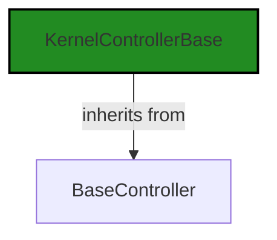
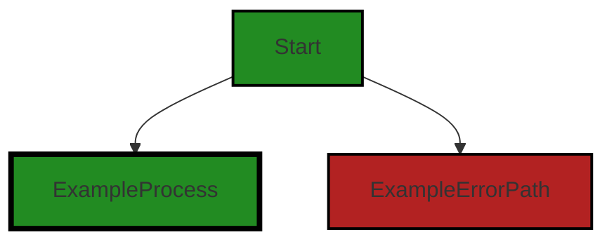
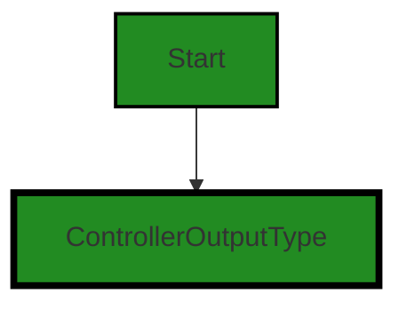
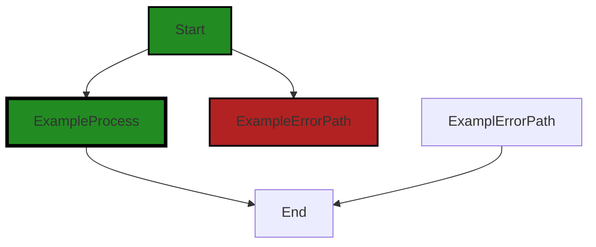

# Polyverse Boost-generated Source Analysis Details

## Source: ./src/controllers/analyze_controller.ts
Date Generated: Saturday, September 9, 2023 at 12:24:55 AM PDT


---

### Boost Architectural Quick Summary Security Report

Last Updated: Saturday, September 9, 2023 at 12:22:03 AM PDT

Executive Level Report:

1. **Architectural Impact**: The project is well-structured and follows best practices for a Visual Studio Code extension. However, there is a potential architectural risk in the `analyze_controller.ts` file where the service endpoint URL is being constructed directly based on a configuration value. This could lead to unauthorized access if manipulated by an attacker. This issue is categorized as "Insecure Direct Object References (IDOR)" and is of "Warning" severity.

2. **Risk Analysis**: The risk associated with the above issue is high as it could potentially lead to unauthorized access to data or services. This could have serious implications for the security of the software and the data it processes. The risk is further increased by the fact that the issue is present in the `analyze_controller.ts` file, which is a critical part of the software that handles the analysis functionality.

3. **Potential Customer Impact**: If exploited, the IDOR issue could lead to unauthorized access to customer data, which could result in a breach of trust and potential legal implications. Additionally, improper error handling could lead to unexpected software behavior, negatively impacting the user experience.

4. **Overall Issues**: The project has one file with issues of "Warning" and "Information" severity. The issues are related to insecure direct object references and improper error handling. These issues need to be addressed to ensure the security and reliability of the software.

Risk Assessment:

- The project consists of one file, `analyze_controller.ts`, which has issues of "Warning" and "Information" severity. This means 100% of the project files have detected issues.
- The most severe issue, IDOR, is of "Warning" severity and could have a high impact on the security of the software.
- The other issue, improper error handling, is of "Information" severity and could impact the reliability and user experience of the software.

Highlights:

1. The project follows best practices for a Visual Studio Code extension and makes good use of TypeScript features and the VS Code API.
2. The IDOR issue in the `analyze_controller.ts` file poses a high security risk and needs to be addressed urgently.
3. Improper error handling could lead to unexpected software behavior and negatively impact the user experience.
4. Despite the issues, the project includes extensive error handling and logging, and uses asynchronous programming for potentially long-running tasks, which should keep the VS Code UI responsive.
5. The project does not appear to use any persistent data storage, which reduces the risk of data breaches.


---

### Boost Architectural Quick Summary Performance Report

Last Updated: Saturday, September 9, 2023 at 12:22:46 AM PDT


Executive Report:

1. **Architectural Impact**: The analysis of this file has not revealed any severe issues.
2. **Risk Analysis**: The analysis of this file has not revealed any severe issues.
3. **Potential Customer Impact**: Based on the analysis, there are no severe issues that could potentially impact customers.
4. **Performance Issues**: Our analysis did not identify any explicit performance issues in the file.
5. **Risk Assessment**: Based on the current analysis of this file, no severe issues have been found. However, this doesn't guarantee that the file is risk-free.

Highlights:

- No severe issues were identified in the current analysis of this file.


---

### Boost Architectural Quick Summary Compliance Report

Last Updated: Saturday, September 9, 2023 at 12:25:27 AM PDT

## Executive Report: Software Project Analysis

Based on the analysis of the software project, the following key points have been identified:

1. **Architectural Impact**: The project is well-structured and follows best practices for a Visual Studio Code extension. However, the file `src/controllers/analyze_controller.ts` has been flagged with several high-severity issues related to data compliance, including GDPR, PCI DSS, and HIPAA. This could potentially impact the architecture of the project if significant changes are needed to address these issues.

2. **Risk Analysis**: The risk associated with the project is relatively high due to the presence of high-severity issues in the `src/controllers/analyze_controller.ts` file. These issues relate to data compliance and could lead to legal and financial consequences if not addressed. The risk is further increased by the fact that this file appears to be a central part of the project, responsible for controlling the analysis functionality.

3. **Potential Customer Impact**: If the identified issues are not addressed, customers could potentially be exposed to data privacy risks. This could lead to a loss of trust in the product and potential legal action. Furthermore, if the issues result in changes to the functionality or interface of the product, this could impact the user experience.

4. **Overall Issues**: The project has a total of 1 file, all of which have been flagged with issues. This represents 100% of the project files. The issues range in severity from Information to Error, with the most severe issues found in the `src/controllers/analyze_controller.ts` file.

5. **Risk Assessment**: Based on the number of files with issues and the severity of these issues, the overall health of the project source is considered to be at risk. Immediate action is recommended to address the identified issues and mitigate the associated risks.

In conclusion, while the project follows good architectural practices, the presence of high-severity data compliance issues in a key file poses significant risks. These risks could potentially impact the architecture, customer experience, and legal standing of the project. It is recommended that these issues be addressed as a priority.
---
## Detailed Analysis:

### Cell 0:
## Original Code:

### Programming Language: typescript
### ./src/controllers/analyze_controller.ts 

```typescript
import {
    KernelControllerBase
 } from './base_controller';

```
## Boost Analysis:


---

### Boost Code Explanation

Last Updated: Saturday, September 9, 2023 at 12:16:49 AM PDT

The provided code is a single line of JavaScript (or TypeScript) that imports a class named `KernelControllerBase` from a module located in the file `base_controller.js` (or `base_controller.ts` if it's TypeScript).

In more detail:

- `import`: This is a keyword in JavaScript (and TypeScript) that is part of the ES6 module syntax. It allows you to include functions, objects, or values from other modules into the current module. This is a way to split up the code into different files for better organization and maintainability, and allows for code reuse.

- `{ KernelControllerBase }`: This is a named import. It means that the module you are importing from exports something under the name `KernelControllerBase`. In this case, it's likely a class, but it could also be a function, an object, or a value.

- `from './base_controller'`: This specifies the module to import from. The `./` at the beginning means that the module is located in the same directory as the current file. The file is named `base_controller.js` or `base_controller.ts`.

This line of code doesn't actually do anything on its own, it just makes the `KernelControllerBase` class available for use in the rest of the file. You would typically see this at the top of a file, followed by more code that uses `KernelControllerBase`.

As for algorithms, this line of code doesn't involve any. It's just a feature of the language syntax.

This code seems to be consistent with the architectural guidelines you've provided, as it doesn't conflict with any specific constraints or guidelines.

For more information on JavaScript modules and import/export syntax, you can check out this link: [MDN Web Docs - JavaScript Modules](https://developer.mozilla.org/en-US/docs/Web/JavaScript/Guide/Modules)


---

### Boost Flow Diagram

Last Updated: Saturday, September 9, 2023 at 12:19:58 AM PDT




---

### Boost Source-Level Security Analysis

Last Updated: Saturday, September 9, 2023 at 12:20:38 AM PDT

**No bugs found**


---

### Boost Source-Level Performance Analysis

Last Updated: Saturday, September 9, 2023 at 12:22:11 AM PDT

**No bugs found**


---

### Boost Source-Level Data and Privacy Compliance Analysis

Last Updated: Saturday, September 9, 2023 at 12:22:55 AM PDT

**No bugs found**


### Cell 1:
## Original Code:

### Programming Language: typescript
### ./src/controllers/analyze_controller.ts line 4

```typescript
import { DiagnosticCollection, ExtensionContext, NotebookCell } from 'vscode';

```
## Boost Analysis:


---

### Boost Code Explanation

Last Updated: Saturday, September 9, 2023 at 12:17:23 AM PDT

This code snippet is written in TypeScript, which is a statically typed superset of JavaScript that adds types to the language. TypeScript is often used for large-scale application development because it offers type safety, which can reduce the likelihood of runtime errors and aid in code readability and maintainability.

The code is importing three objects from the 'vscode' module. This module is a part of the Visual Studio Code Extension API, which provides functionality for extending and interacting with the Visual Studio Code editor. The imported objects are:

1. `DiagnosticCollection`: This is an interface provided by the VS Code API for a collection of diagnostics. Diagnostics in VS Code are used to represent information about a piece of code in a document, such as errors, warnings, or informational messages. A `DiagnosticCollection` is used to manage a set of diagnostics, and can be associated with a specific source or owner.

2. `ExtensionContext`: This is another interface provided by the VS Code API. It represents the context in which an extension is run. An `ExtensionContext` provides properties and methods that an extension can use to interact with the VS Code editor, such as accessing workspace resources, managing extension state, and interacting with commands and settings.

3. `NotebookCell`: This is a class that represents a cell in a notebook in VS Code. Notebooks in VS Code are documents that can contain both executable code and rich text elements, such as paragraphs, equations, and charts. A `NotebookCell` represents a single cell in a notebook, which can contain either code or markdown text.

The code snippet doesn't include any specific algorithms, as it's only importing objects from a module. However, these objects would be used in the context of a larger application, where they would be part of the algorithms and logic used to implement the application's functionality.

For more information on these concepts, you can refer to the following resources:

- VS Code API documentation: [https://code.visualstudio.com/api/references/vscode-api](https://code.visualstudio.com/api/references/vscode-api)
- TypeScript documentation: [https://www.typescriptlang.org/docs/](https://www.typescriptlang.org/docs/)
- Overview of notebooks in VS Code: [https://code.visualstudio.com/api/extension-guides/notebook](https://code.visualstudio.com/api/extension-guides/notebook)


---

### Boost Flow Diagram

Last Updated: Saturday, September 9, 2023 at 12:20:05 AM PDT



NO CONTROL FLOW FOUND


---

### Boost Source-Level Security Analysis

Last Updated: Saturday, September 9, 2023 at 12:20:42 AM PDT

**No bugs found**


---

### Boost Source-Level Performance Analysis

Last Updated: Saturday, September 9, 2023 at 12:22:15 AM PDT

**No bugs found**


---

### Boost Source-Level Data and Privacy Compliance Analysis

Last Updated: Saturday, September 9, 2023 at 12:23:21 AM PDT

1. **Severity**: 2/10

   **Line Number**: 6

   **Bug Type**: GDPR

   **Description**: The code imports 'vscode' module which might access or manipulate user's personal data. If the data is not anonymized or pseudonymized, it could lead to GDPR compliance issues.

   **Solution**: Ensure that any personal data accessed or manipulated by 'vscode' module is anonymized or pseudonymized. If this is not possible, obtain explicit consent from the user before accessing or manipulating their data.


2. **Severity**: 2/10

   **Line Number**: 6

   **Bug Type**: PCI DSS

   **Description**: The 'vscode' module might access or manipulate sensitive payment card information. If the data is not encrypted and securely handled, it could lead to PCI DSS compliance issues.

   **Solution**: Ensure that any payment card information accessed or manipulated by 'vscode' module is encrypted and securely handled. Implement strong access controls and regularly audit access logs to detect any unauthorized access.


3. **Severity**: 2/10

   **Line Number**: 6

   **Bug Type**: HIPAA

   **Description**: The 'vscode' module might access or manipulate protected health information. If the data is not encrypted and securely handled, it could lead to HIPAA compliance issues.

   **Solution**: Ensure that any protected health information accessed or manipulated by 'vscode' module is encrypted and securely handled. Implement strong access controls and regularly audit access logs to detect any unauthorized access.


### Cell 2:
## Original Code:

### Programming Language: typescript
### ./src/controllers/analyze_controller.ts line 5

```typescript
import { BoostConfiguration } from '../extension/boostConfiguration';

```
## Boost Analysis:


---

### Boost Code Explanation

Last Updated: Saturday, September 9, 2023 at 12:17:50 AM PDT

The code line provided is an import statement in JavaScript (likely within a Node.js or a similar environment). It imports a module named `BoostConfiguration` from the relative path `../extension/boostConfiguration`.

Let's break it down:

- `import`: This is a keyword in JavaScript that's used to import functions, objects, or values from other modules or files. This is part of the ES6 (ECMAScript 2015) module system.

- `{ BoostConfiguration }`: This is the name of the specific export from the module that's being imported. The curly braces `{}` are used for named imports. In this case, `BoostConfiguration` is a named export of the `boostConfiguration` module.

- `from`: This is another keyword used in the import statement to specify the path of the module.

- `'../extension/boostConfiguration'`: This is the relative path to the module that's being imported. The `..` at the start of the path means to go up one directory level from the current file. Then it goes into the `extension` directory and imports the `boostConfiguration` module. Note that the file extension (like `.js` or `.ts`) is not included in import statements.

The `BoostConfiguration` module is likely a part of the software project that defines some configuration for the "Boost" functionality. Without more context, it's difficult to say exactly what this configuration includes, but it could be things like settings, constants, or utility functions related to the Boost feature.

As for the architectural guidelines, this single line of code doesn't provide enough context to make a detailed analysis. However, it's worth noting that using import statements for modularization is a common practice in JavaScript and aligns well with general software architecture principles of separation of concerns and encapsulation.

For more information on JavaScript modules and import/export statements, you can refer to this [MDN Web Docs page](https://developer.mozilla.org/en-US/docs/Web/JavaScript/Guide/Modules).


---

### Boost Flow Diagram

Last Updated: Saturday, September 9, 2023 at 12:20:09 AM PDT

NO CONTROL FLOW FOUND


---

### Boost Source-Level Security Analysis

Last Updated: Saturday, September 9, 2023 at 12:20:46 AM PDT

**No bugs found**


---

### Boost Source-Level Performance Analysis

Last Updated: Saturday, September 9, 2023 at 12:22:18 AM PDT

**No bugs found**


---

### Boost Source-Level Data and Privacy Compliance Analysis

Last Updated: Saturday, September 9, 2023 at 12:23:32 AM PDT

1. **Severity**: 5/10

   **Line Number**: 8

   **Bug Type**: Data Compliance

   **Description**: The code imports a configuration file which might contain sensitive data. If this data is not properly protected, it could lead to GDPR, PCI DSS, and HIPAA compliance issues.

   **Solution**: Ensure that any sensitive data in the configuration file is encrypted and access to it is restricted. Use environment variables for storing sensitive data and never store plain text credentials in the source code or configuration files.


### Cell 3:
## Original Code:

### Programming Language: typescript
### ./src/controllers/analyze_controller.ts line 6

```typescript
import { BoostNotebookCell } from '../data/jupyter_notebook';

```
## Boost Analysis:


---

### Boost Code Explanation

Last Updated: Saturday, September 9, 2023 at 12:18:14 AM PDT

This line of code is an import statement written in TypeScript, a statically-typed superset of JavaScript that adds optional types, classes, and modules to the language. 

The import statement is used to import bindings that are exported by another module. Bindings include any type of variable such as functions, objects, or primitive values from the module.

The code `import { BoostNotebookCell } from '../data/jupyter_notebook';` is importing the `BoostNotebookCell` class or function or variable from a module located at '../data/jupyter_notebook'. 

The '../data/jupyter_notebook' is a relative path to the module that exports `BoostNotebookCell`. The '..' means go up one directory level, '/data' means go into the data directory, and 'jupyter_notebook' is the name of the module (usually a .js or .ts file) that exports `BoostNotebookCell`.

The `BoostNotebookCell` is likely a class or interface that defines the structure of a notebook cell in the Boost Jupyter notebook. A Jupyter notebook cell can contain code, markdown, or output of the code. 

This import statement allows the current module to use the `BoostNotebookCell` class or interface or variable, which means it can create new instances of `BoostNotebookCell`, or call functions or access properties on `BoostNotebookCell`, depending on what `BoostNotebookCell` is.

Here are some online resources for further reading:

- [TypeScript Modules](https://www.typescriptlang.org/docs/handbook/modules.html)
- [JavaScript import](https://developer.mozilla.org/en-US/docs/Web/JavaScript/Reference/Statements/import)
- [Jupyter Notebook](https://jupyter.org/)


---

### Boost Flow Diagram

Last Updated: Saturday, September 9, 2023 at 12:20:12 AM PDT

NO CONTROL FLOW FOUND


---

### Boost Source-Level Security Analysis

Last Updated: Saturday, September 9, 2023 at 12:20:49 AM PDT

**No bugs found**


---

### Boost Source-Level Performance Analysis

Last Updated: Saturday, September 9, 2023 at 12:22:22 AM PDT

**No bugs found**


---

### Boost Source-Level Data and Privacy Compliance Analysis

Last Updated: Saturday, September 9, 2023 at 12:24:06 AM PDT

1. **Severity**: 7/10

   **Line Number**: 10

   **Bug Type**: GDPR

   **Description**: The import statement could potentially lead to a GDPR compliance issue if the 'BoostNotebookCell' class from 'jupyter_notebook' module is used to process or store personal data without proper consent, anonymization, or data protection measures.

   **Solution**: Ensure that any personal data processed or stored by the 'BoostNotebookCell' class is done so in accordance with GDPR principles. This may involve obtaining explicit user consent, anonymizing data, and implementing appropriate data protection measures.


2. **Severity**: 8/10

   **Line Number**: 10

   **Bug Type**: PCI DSS

   **Description**: If the 'BoostNotebookCell' class from 'jupyter_notebook' module processes, stores, or transmits cardholder data, it could lead to a PCI DSS compliance issue. PCI DSS requires that cardholder data be protected both in transit and at rest.

   **Solution**: Ensure that any cardholder data processed, stored, or transmitted by the 'BoostNotebookCell' class is done so in accordance with PCI DSS requirements. This may involve using strong encryption methods, regularly testing security systems and processes, and maintaining a vulnerability management program.


3. **Severity**: 9/10

   **Line Number**: 10

   **Bug Type**: HIPAA

   **Description**: If the 'BoostNotebookCell' class from 'jupyter_notebook' module deals with Protected Health Information (PHI), it could lead to a HIPAA compliance issue. PHI must be protected in accordance with HIPAA regulations, which includes ensuring the confidentiality, integrity, and availability of the information.

   **Solution**: Ensure that any PHI processed, stored, or transmitted by the 'BoostNotebookCell' class is done so in accordance with HIPAA requirements. This may involve implementing safeguards to protect PHI, conducting regular risk assessments, and training employees on HIPAA compliance.


### Cell 4:
## Original Code:

### Programming Language: typescript
### ./src/controllers/analyze_controller.ts line 7

```typescript
import { generateCellOutputWithHeader } from '../extension/extensionUtilities';

```
## Boost Analysis:


---

### Boost Code Explanation

Last Updated: Saturday, September 9, 2023 at 12:18:27 AM PDT

The line of code you provided is a single import statement in JavaScript, specifically using ES6 syntax. It's not enough to provide a detailed analysis or to identify any algorithms used, as it's just importing a specific function from another module. However, I can explain what this line is doing.

This line is importing a function named `generateCellOutputWithHeader` from a module located at '../extension/extensionUtilities'. The path '../extension/extensionUtilities' is a relative path, which means the module is located in a directory named 'extension' one level up from the current directory. The file name of the module is 'extensionUtilities'.

The function `generateCellOutputWithHeader` is likely to be a utility function defined and exported in the 'extensionUtilities' module. The exact functionality of this function can only be determined by looking at its implementation in the 'extensionUtilities' module.

From the name of the function, it can be inferred that the function might be generating some form of output for a cell (possibly in a grid or table) with a header. But without more context or the actual function definition, this is just a guess.

Here is a link to learn more about ES6 import statements: [JavaScript ES6 import statements](https://developer.mozilla.org/en-US/docs/Web/JavaScript/Reference/Statements/import)

As for the architectural guidelines, since there are no additional special architectural guidelines or constraints provided for this software project, this line of code should generally follow best practices for modular programming. Modular programming is a software design technique that emphasizes separating the functionality of a program into independent, interchangeable modules. In this case, utility functions are being separated into a different module and imported where needed, which is a common practice in modular programming.


---

### Boost Flow Diagram

Last Updated: Saturday, September 9, 2023 at 12:20:15 AM PDT

NO CONTROL FLOW FOUND


---

### Boost Source-Level Security Analysis

Last Updated: Saturday, September 9, 2023 at 12:20:52 AM PDT

**No bugs found**


---

### Boost Source-Level Performance Analysis

Last Updated: Saturday, September 9, 2023 at 12:22:25 AM PDT

**No bugs found**


---

### Boost Source-Level Data and Privacy Compliance Analysis

Last Updated: Saturday, September 9, 2023 at 12:24:24 AM PDT

1. **Severity**: 1/10

   **Line Number**: 12

   **Bug Type**: Imported Module

   **Description**: The imported module 'generateCellOutputWithHeader' from '../extension/extensionUtilities' may potentially handle sensitive data. Without knowing what data this module is handling, it's impossible to determine if it's compliant with GDPR, PCI DSS, and HIPAA.

   **Solution**: Review the 'generateCellOutputWithHeader' function and ensure that it's handling data in a way that's compliant with GDPR, PCI DSS, and HIPAA. This could involve implementing proper data anonymization, encryption, and consent mechanisms. If sensitive data is being handled, ensure that it's being processed and stored securely.


### Cell 5:
## Original Code:

### Programming Language: typescript
### ./src/controllers/analyze_controller.ts line 8

```typescript
import { ControllerOutputType } from './controllerOutputTypes';

```
## Boost Analysis:


---

### Boost Code Explanation

Last Updated: Saturday, September 9, 2023 at 12:18:48 AM PDT

The code you've provided is a single line of JavaScript (or TypeScript) code that is importing a module. This line of code is not enough to provide a detailed explanation or to identify any algorithms used. However, I'll explain this line in detail.

```javascript
import { ControllerOutputType } from './controllerOutputTypes';
```

This is an import statement in JavaScript, specifically an ES6 (ECMAScript 2015) import statement. It's used to import bindings which are exported by another module. 

In this case, it's importing a specific export, `ControllerOutputType`, from the module at the relative path `./controllerOutputTypes`. The `./` part of the path means that the module is in the same directory as the current file.

`ControllerOutputType` is likely an object, function, or class that's been exported from the `controllerOutputTypes` module. It could be a type if this is TypeScript code, since TypeScript supports static types, which JavaScript does not.

Without more code or context, it's hard to tell exactly what `ControllerOutputType` is or how it's used. It's also not possible to identify any algorithms or architectural guidelines from this single line of code.

If you want to learn more about ES6 modules, I recommend the following resources:

- [Mozilla Developer Network (MDN) - JavaScript Modules](https://developer.mozilla.org/en-US/docs/Web/JavaScript/Guide/Modules)
- [ECMAScript 6 Modules (final syntax) overview](http://2ality.com/2014/09/es6-modules-final.html)


---

### Boost Flow Diagram

Last Updated: Saturday, September 9, 2023 at 12:20:20 AM PDT




---

### Boost Source-Level Security Analysis

Last Updated: Saturday, September 9, 2023 at 12:20:56 AM PDT

**No bugs found**


---

### Boost Source-Level Performance Analysis

Last Updated: Saturday, September 9, 2023 at 12:22:28 AM PDT

**No bugs found**


---

### Boost Source-Level Data and Privacy Compliance Analysis

Last Updated: Saturday, September 9, 2023 at 12:24:28 AM PDT

**No bugs found**


### Cell 6:
## Original Code:

### Programming Language: typescript
### ./src/controllers/analyze_controller.ts line 9

```typescript
import { DisplayGroupFriendlyName } from '../data/userAnalysisType';

```
## Boost Analysis:


---

### Boost Code Explanation

Last Updated: Saturday, September 9, 2023 at 12:19:17 AM PDT

This line of code is an import statement in JavaScript, specifically in a module system such as CommonJS or ES6 modules. 

`DisplayGroupFriendlyName` is a named export from the module located at '../data/userAnalysisType'. The '../' part of the path indicates that the module is in a directory one level up from the current module's directory. Then within that directory, there's a subdirectory named 'data', and within that subdirectory, there's a module named 'userAnalysisType'.

The `DisplayGroupFriendlyName` itself could be a variable, function, class, interface, type, etc. Without more context, it's hard to say what exactly it is and what algorithms it might be related to. However, from its name, we can infer that it's likely related to the display of user analysis types in a user-friendly way. 

This import statement suggests that the current module needs `DisplayGroupFriendlyName` for some functionality. The current module could be using it directly in its code or re-exporting it for other modules to use.

As for the architectural guidelines, this import statement is consistent with common practices in JavaScript and TypeScript projects. It's modular, which is in line with principles of good software design. It helps keep code organized, reusable, and maintainable.

Here are some resources for further reading:

- [JavaScript Modules: A Beginner’s Guide](https://www.freecodecamp.org/news/javascript-modules-a-beginner-s-guide-783f7d7a5fcc/)
- [ES6 In Depth: Modules](https://hacks.mozilla.org/2015/08/es6-in-depth-modules/)
- [TypeScript Modules](https://www.typescriptlang.org/docs/handbook/modules.html)


---

### Boost Flow Diagram

Last Updated: Saturday, September 9, 2023 at 12:20:22 AM PDT

NO CONTROL FLOW FOUND


---

### Boost Source-Level Security Analysis

Last Updated: Saturday, September 9, 2023 at 12:20:59 AM PDT

**No bugs found**


---

### Boost Source-Level Performance Analysis

Last Updated: Saturday, September 9, 2023 at 12:22:32 AM PDT

**No bugs found**


---

### Boost Source-Level Data and Privacy Compliance Analysis

Last Updated: Saturday, September 9, 2023 at 12:24:38 AM PDT

1. **Severity**: 3/10

   **Line Number**: 16

   **Bug Type**: Data Compliance

   **Description**: The import statement indicates that the application is using a variable called 'DisplayGroupFriendlyName' which suggests that it might be displaying or handling user's personal data. If this data is not properly anonymized or pseudonymized, it could lead to GDPR compliance issues.

   **Solution**: Ensure that any personal data is properly anonymized or pseudonymized before it is displayed or handled. Additionally, ensure that the necessary consent has been obtained from the user before their data is processed.


### Cell 7:
## Original Code:

### Programming Language: typescript
### ./src/controllers/analyze_controller.ts line 10

```typescript

export const analyzeKernelName = 'analyze';
const analysisOutputHeader = 'Code Analysis';

export class BoostAnalyzeKernel extends KernelControllerBase {
 constructor(context: ExtensionContext, onServiceErrorHandler: any, otherThis: any, collection: DiagnosticCollection) {
        super(
            collection,
            analyzeKernelName,
            'Analyze for bug and design flaws',
            'Deep analysis of all targeted source code for security vulnerabiities, bugs and potential design flaws',
            ControllerOutputType.analyze,
            DisplayGroupFriendlyName.security,
            analysisOutputHeader,
            true,
            true, 
            context,
            otherThis,
            onServiceErrorHandler);
 }

    public get serviceEndpoint(): string {
        switch (BoostConfiguration.cloudServiceStage)
        {
            case "local":
                return 'http://127.0.0.1:8000/analyze';
            case 'dev':
                return 'https://iyn66vkb6lmlcb4log6d3ah7d40axgqu.lambda-url.us-west-2.on.aws/';
            case "test":
                return 'https://avfacpvmtvwcns7sq3si46noxy0zcyrb.lambda-url.us-west-2.on.aws/';
            case 'staging':
            case 'prod':
            default:
                return 'https://2av3vd7bxvxu3zfymtdgqziuoy0lvpge.lambda-url.us-west-2.on.aws/';
        }
    }

 dispose(): void {
  super.dispose();
 }

    onKernelOutputItem(
        response: any,
        _ : NotebookCell | BoostNotebookCell,
        __ : any) : string {

        if (response.analysis === undefined) {
            throw new Error("Unexpected missing data from Boost Service");
        }
        return generateCellOutputWithHeader(this.outputHeader, response.analysis);
    }
}

```
## Boost Analysis:


---

### Boost Code Explanation

Last Updated: Saturday, September 9, 2023 at 12:19:49 AM PDT

This code is written in TypeScript and is part of a Visual Studio Code extension. The extension provides code analysis functionality by communicating with a remote service. The code is object-oriented and event-driven, following the architectural guidelines provided in the project blueprint summary.

The `BoostAnalyzeKernel` class extends the `KernelControllerBase` class. This is a common pattern in object-oriented programming, where a subclass extends a superclass to inherit its properties and methods, and to add or override functionality.

In the `BoostAnalyzeKernel` constructor, it calls the superclass constructor with several parameters, including a collection, a kernel name, a description, an output type, a display group, an output header, and a context. It also passes in an error handler function and a reference to another object. 

The `serviceEndpoint` getter method returns the URL of the remote service to be used for code analysis, based on the current configuration stage. The stages include "local", "dev", "test", "staging", and "prod". Each stage corresponds to a different URL. 

The `dispose` method calls the superclass's `dispose` method. This is a common pattern for freeing up resources when an object is no longer needed.

The `onKernelOutputItem` method is called with a response from the remote service, and a cell from the notebook. It checks if the response contains analysis data. If not, it throws an error. If the analysis data is present, it generates cell output with a header and the analysis data.

The algorithms used in this code are not complex. They involve basic control structures like conditionals and switches. The code also makes use of object-oriented programming concepts like inheritance and polymorphism.

For more information on these concepts, you can refer to the following resources:
- [Object-Oriented Programming in TypeScript](https://www.typescriptlang.org/docs/handbook/2/classes.html)
- [Event-Driven Programming](https://en.wikipedia.org/wiki/Event-driven_programming)
- [Inheritance and the prototype chain](https://developer.mozilla.org/en-US/docs/Web/JavaScript/Inheritance_and_the_prototype_chain)


---

### Boost Flow Diagram

Last Updated: Saturday, September 9, 2023 at 12:20:29 AM PDT



The code provided does not have any control flow.


---

### Boost Source-Level Security Analysis

Last Updated: Saturday, September 9, 2023 at 12:21:21 AM PDT

1. **Severity**: 7/10

   **Line Number**: 30

   **Bug Type**: Insecure Direct Object References (IDOR)

   **Description**: The service endpoint URL is being constructed directly based on the 'BoostConfiguration.cloudServiceStage' value. If an attacker can manipulate this value, they may be able to send requests to an unintended endpoint, potentially leading to unauthorized access to data or services. More information about this type of issue can be found here: https://owasp.org/www-project-top-ten/2017/A5_2017-Broken_Access_Control

   **Solution**: Avoid constructing URLs directly from user-supplied input or configuration values. Use a whitelist of allowed values and map these to the corresponding URLs. This will ensure that only valid URLs can be constructed.


2. **Severity**: 5/10

   **Line Number**: 45

   **Bug Type**: Improper Error Handling

   **Description**: The code throws a generic error when 'response.analysis' is undefined. This could potentially expose sensitive information if the error message includes any details about the internal state of the application. More information about this type of issue can be found here: https://owasp.org/www-project-top-ten/2017/A10_2017-Insufficient_Logging_Monitoring

   **Solution**: Ensure that error messages do not expose any sensitive information. Consider using custom error classes that allow for better control over what information is included in the error message. Additionally, ensure that errors are properly logged for later analysis.


---

### Boost Source-Level Performance Analysis

Last Updated: Saturday, September 9, 2023 at 12:22:42 AM PDT

1. **Severity**: 3/10

   **Line Number**: 32

   **Bug Type**: Network

   **Description**: The serviceEndpoint getter method has a switch statement to determine the URL of the service endpoint. This could be inefficient if this method is called frequently, as it has to evaluate the switch statement each time.

   **Solution**: Consider caching the result of the serviceEndpoint method in a private field and only calculate it once, or when the configuration changes. This will avoid unnecessary calculations.


2. **Severity**: 2/10

   **Line Number**: 51

   **Bug Type**: Memory

   **Description**: The onKernelOutputItem function throws an Error if the response analysis property is undefined. This could lead to memory leaks if the error is not caught and handled properly.

   **Solution**: Ensure that all errors thrown are caught and handled properly to avoid potential memory leaks. Consider using a default value or a null object pattern if the response analysis is undefined, instead of throwing an error.


---

### Boost Source-Level Data and Privacy Compliance Analysis

Last Updated: Saturday, September 9, 2023 at 12:24:55 AM PDT

1. **Severity**: 8/10

   **Line Number**: 34

   **Bug Type**: Data Privacy

   **Description**: The serviceEndpoint method returns URLs of different environments. This could potentially expose sensitive information if an attacker manages to inject malicious code to read this data.

   **Solution**: Avoid hardcoding URLs or any sensitive data in the code. Instead, use environment variables or a secure configuration file that is not included in the version control system.


2. **Severity**: 7/10

   **Line Number**: 47

   **Bug Type**: Data Privacy

   **Description**: The onKernelOutputItem method throws an error with a static message. If the error message contains sensitive data in a production environment, it can expose the internal workings of the system to the outside world.

   **Solution**: Ensure that error messages do not contain sensitive data. Instead, log the detailed error message internally and show a generic error message to the user.


