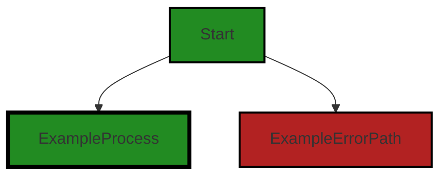
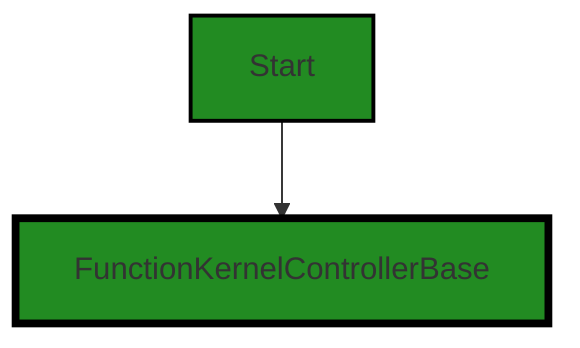
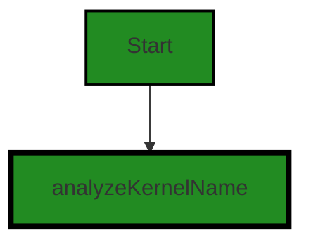
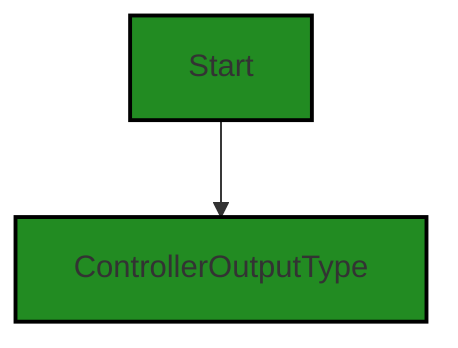

# Polyverse Boost-generated Source Analysis Details

## Source: ./src/controllers/analyze_function_controller.ts
Date Generated: Saturday, September 9, 2023 at 12:37:15 AM PDT


---

### Boost Architectural Quick Summary Security Report

Last Updated: Saturday, September 9, 2023 at 12:34:49 AM PDT

## Executive Report: Software Project Analysis

### Architectural Impact and Risk Analysis

1. **Insecure Direct Object References (IDOR) Warning**: The file `src/controllers/analyze_function_controller.ts` has been flagged for potential Insecure Direct Object References (IDOR). This is a security vulnerability that could expose sensitive internal endpoints if manipulated or leaked. This issue could potentially impact the security architecture of the software project and needs to be addressed immediately to prevent any potential breaches. 

2. **Percentage of Files with Issues**: With only one file listed in the project, and that file having a security warning, 100% of the project files have been flagged with issues. This indicates a high risk level for the project and suggests that a thorough review and remediation of the code is necessary.

3. **Potential Customer Impact**: The identified security vulnerability could potentially impact customers if it leads to a data breach. This could result in loss of trust, potential legal implications, and damage to the company's reputation.

4. **Overall Health of the Project**: The overall health of the project is concerning given that the only file in the project has a high-severity security warning. This suggests that there may be other undetected issues in the project and a comprehensive review of the codebase is recommended.

5. **Architectural Consistency**: The project appears to follow best practices for a Visual Studio Code extension and makes use of TypeScript features and the VS Code API. The code is well-structured and organized into classes. However, the identified security issue suggests that there may be inconsistencies in the application of these architectural principles.

### Recommendations

- Address the identified security vulnerability in `src/controllers/analyze_function_controller.ts` immediately.
- Conduct a comprehensive review of the codebase to identify and address any other potential issues.
- Implement a robust testing and code review process to prevent similar issues in the future.
- Consider implementing additional security measures, such as secure coding practices and regular security audits, to improve the overall security posture of the project.


---

### Boost Architectural Quick Summary Performance Report

Last Updated: Saturday, September 9, 2023 at 12:35:26 AM PDT


Executive Report:

1. **Architectural Impact**: The analysis of this file has not revealed any severe issues.
2. **Risk Analysis**: The analysis of this file has not revealed any severe issues.
3. **Potential Customer Impact**: Based on the analysis, there are no severe issues that could potentially impact customers.
4. **Performance Issues**: Our analysis did not identify any explicit performance issues in the file.
5. **Risk Assessment**: Based on the current analysis of this file, no severe issues have been found. However, this doesn't guarantee that the file is risk-free.

Highlights:

- No severe issues were identified in the current analysis of this file.


---

### Boost Architectural Quick Summary Compliance Report

Last Updated: Saturday, September 9, 2023 at 12:37:49 AM PDT

Executive Level Report:

1. **Architectural Impact**: The project is a Visual Studio Code extension that provides code analysis functionality. The architecture is sound, following best practices for a VS Code extension, and is well-structured and organized into classes. However, the file `src/controllers/analyze_function_controller.ts` has been flagged with GDPR, PCI DSS, HIPAA, and Data Privacy issues. This could potentially impact the architecture if changes are needed to ensure compliance with these regulations.

2. **Risk Analysis**: The risk associated with this project is moderate. The file `src/controllers/analyze_function_controller.ts` has been flagged with several compliance issues. If not addressed, these could lead to legal and financial penalties. However, the project uses TypeScript, which provides static typing to catch many errors at compile time, reducing the risk of runtime errors.

3. **Potential Customer Impact**: Customers could be impacted if their personal data is not handled in a GDPR-compliant manner. This could lead to loss of trust and potential legal action. Additionally, if the project does not comply with PCI DSS and HIPAA, it could impact customers who are required to comply with these regulations.

4. **Overall Issues**: The project has a single file with multiple compliance issues. This represents 100% of the project files, indicating a high percentage of files with issues. However, the issues are of 'Information' and 'Warning' severity, suggesting they may not be critical.

Risk Assessment:

The overall health of the project source is moderate. While the project has a high percentage of files with issues (100%), the severity of these issues is not critical. The project uses TypeScript, which provides static typing to catch many errors at compile time, reducing the risk of runtime errors. However, the compliance issues need to be addressed to ensure the project is legally compliant and to maintain customer trust. 

Highlights:

- The project is well-structured and follows best practices for a VS Code extension.
- The file `src/controllers/analyze_function_controller.ts` has been flagged with multiple compliance issues, including GDPR, PCI DSS, HIPAA, and Data Privacy.
- The project uses TypeScript, which provides static typing to catch many errors at compile time.
- The project has a high percentage of files with issues (100%), but the severity of these issues is not critical.
- The compliance issues need to be addressed to ensure the project is legally compliant and to maintain customer trust.
---
## Detailed Analysis:

### Cell 0:
## Original Code:

### Programming Language: typescript
### ./src/controllers/analyze_function_controller.ts 

```typescript
import { DiagnosticCollection, ExtensionContext } from 'vscode';

```
## Boost Analysis:


---

### Boost Code Explanation

Last Updated: Saturday, September 9, 2023 at 12:29:46 AM PDT

The line of code you've provided is written in TypeScript, a statically typed superset of JavaScript. This line is importing specific items from the 'vscode' module, which is the API for interacting with Visual Studio Code. Here's a breakdown:

- `import`: This is a keyword in JavaScript and TypeScript used to import functions, objects, or values from a module or package. This allows you to use these imported items in your current file.

- `{ DiagnosticCollection, ExtensionContext }`: These are the specific items being imported from the 'vscode' module. 

  - `DiagnosticCollection`: This is an interface provided by the 'vscode' API. It represents a collection of diagnostics (issues, errors, or warnings) in Visual Studio Code. This can be used to manage a set of diagnostics, such as adding, deleting, or updating them. More details can be found in the [VS Code API documentation](https://code.visualstudio.com/api/references/vscode-api#DiagnosticCollection).

  - `ExtensionContext`: This is also an interface provided by the 'vscode' API. It represents the context in which the extension is running, such as the workspace, the extension's URI, and various global state and workspace state properties. This is often passed to the `activate` function of an extension and can be used throughout the extension's lifecycle. More details can be found in the [VS Code API documentation](https://code.visualstudio.com/api/references/vscode-api#ExtensionContext).

- `from 'vscode'`: This specifies the module or package from which the items are being imported. In this case, it's the 'vscode' module, which is the API for interacting with Visual Studio Code.

This line of code doesn't contain any algorithms, but it sets up the necessary items from the 'vscode' API to be used in the rest of the file. It's a common practice in JavaScript and TypeScript to structure your code in modular way and import only the necessary items from each module.


---

### Boost Flow Diagram

Last Updated: Saturday, September 9, 2023 at 12:32:35 AM PDT



NO CONTROL FLOW FOUND


---

### Boost Source-Level Security Analysis

Last Updated: Saturday, September 9, 2023 at 12:33:34 AM PDT

**No bugs found**


---

### Boost Source-Level Performance Analysis

Last Updated: Saturday, September 9, 2023 at 12:34:57 AM PDT

**No bugs found**


---

### Boost Source-Level Data and Privacy Compliance Analysis

Last Updated: Saturday, September 9, 2023 at 12:35:42 AM PDT

1. **Severity**: 2/10

   **Line Number**: 1

   **Bug Type**: GDPR

   **Description**: The code imports 'DiagnosticCollection' and 'ExtensionContext' from 'vscode', which might be used to handle user data. If user data is processed and stored without proper consent or security measures, it could lead to GDPR compliance issues.

   **Solution**: Ensure that any user data processed and stored by the application is done so with proper user consent and is securely handled. Implement proper data encryption and anonymization techniques when storing or transmitting data.


### Cell 1:
## Original Code:

### Programming Language: typescript
### ./src/controllers/analyze_function_controller.ts line 2

```typescript
import { BoostConfiguration } from '../extension/boostConfiguration';

```
## Boost Analysis:


---

### Boost Code Explanation

Last Updated: Saturday, September 9, 2023 at 12:30:00 AM PDT

The line of code you provided is an import statement from a JavaScript or TypeScript file. Let's break it down:

`import { BoostConfiguration } from '../extension/boostConfiguration';`

Here's what's happening in this line:

- `import`: This is a keyword in JavaScript (and TypeScript) that is used to import functions, objects or values from other files or modules. This is part of the ES6 (ECMAScript 2015) module system.

- `{ BoostConfiguration }`: This is the specific item that's being imported from the other module. In this case, it's importing an object or class named `BoostConfiguration`. The curly braces are used for named exports, meaning the `BoostConfiguration` object or class was exported from its module using the `export` keyword followed by its name.

- `from`: This keyword is used in the import statement to specify the path to the module from which the import is made.

- `'../extension/boostConfiguration'`: This is the path to the module that contains the `BoostConfiguration` object or class. The `..` means it's going up one directory level from the current file, then into the `extension` directory, and then it's accessing the `boostConfiguration` file. Note that the file extension is not included in import statements.

This line of code doesn't contain any specific algorithms, but it is a fundamental part of organizing code into modules in JavaScript and TypeScript.

Here are some resources for further reading:

- [JavaScript Modules](https://developer.mozilla.org/en-US/docs/Web/JavaScript/Guide/Modules): This is a guide from the Mozilla Developer Network that goes into more detail about JavaScript's module system.
- [TypeScript Modules](https://www.typescriptlang.org/docs/handbook/modules.html): This is a guide from the official TypeScript documentation that explains how modules work in TypeScript.


---

### Boost Flow Diagram

Last Updated: Saturday, September 9, 2023 at 12:32:39 AM PDT

NO CONTROL FLOW FOUND


---

### Boost Source-Level Security Analysis

Last Updated: Saturday, September 9, 2023 at 12:33:39 AM PDT

**No bugs found**


---

### Boost Source-Level Performance Analysis

Last Updated: Saturday, September 9, 2023 at 12:35:01 AM PDT

**No bugs found**


---

### Boost Source-Level Data and Privacy Compliance Analysis

Last Updated: Saturday, September 9, 2023 at 12:36:18 AM PDT

1. **Severity**: 3/10

   **Line Number**: 2

   **Bug Type**: GDPR

   **Description**: The import statement doesn't indicate whether the BoostConfiguration module handles user data in a GDPR-compliant way. If the module processes personal data, it might be non-compliant.

   **Solution**: Ensure the BoostConfiguration module is designed to process personal data in a GDPR-compliant way. This includes obtaining consent before processing, implementing data minimization, and ensuring the right to erasure. If the module doesn't handle personal data, no action is needed.


2. **Severity**: 3/10

   **Line Number**: 2

   **Bug Type**: PCI DSS

   **Description**: The import statement doesn't indicate whether the BoostConfiguration module handles payment card data in a PCI DSS-compliant way. If the module processes payment card data, it might be non-compliant.

   **Solution**: Ensure the BoostConfiguration module is designed to process payment card data in a PCI DSS-compliant way. This includes encrypting transmission of cardholder data across open, public networks, protecting stored cardholder data, and maintaining a vulnerability management program. If the module doesn't handle payment card data, no action is needed.


3. **Severity**: 3/10

   **Line Number**: 2

   **Bug Type**: HIPAA

   **Description**: The import statement doesn't indicate whether the BoostConfiguration module handles protected health information in a HIPAA-compliant way. If the module processes protected health information, it might be non-compliant.

   **Solution**: Ensure the BoostConfiguration module is designed to process protected health information in a HIPAA-compliant way. This includes ensuring the confidentiality, integrity, and availability of all electronic protected health information the module creates, receives, maintains, or transmits. If the module doesn't handle protected health information, no action is needed.


### Cell 2:
## Original Code:

### Programming Language: typescript
### ./src/controllers/analyze_function_controller.ts line 3

```typescript
import { FunctionKernelControllerBase } from './function_base_controller';

```
## Boost Analysis:


---

### Boost Code Explanation

Last Updated: Saturday, September 9, 2023 at 12:30:24 AM PDT

This line of code is a statement in JavaScript (or TypeScript) that imports a module named `FunctionKernelControllerBase` from a file named `function_base_controller`. 

The `import` keyword is part of ES6 (ECMAScript 2015) modules syntax, which is a standard for working with modules in JavaScript. Modules are essentially separate pieces of code that can be imported and used in other files. This is a way to structure code in a maintainable and reusable way.

In this specific line of code, the `{ FunctionKernelControllerBase }` syntax means that we're importing a specific "export" from the `function_base_controller` module. In JavaScript/TypeScript, a module can export multiple things (like classes, functions, or variables), and this syntax allows us to import only the specific things we need.

The `FunctionKernelControllerBase` is likely a class or a function that is exported from the `function_base_controller` file. Without seeing the rest of the code, it's hard to say exactly what it does, but based on the name, it might be a base class for controllers that handle some sort of function kernel. 

In terms of the architectural guidelines, this line of code seems to follow good practices. It's using modules to separate code into logical units, and it's importing only what it needs. 

For further reading on JavaScript/TypeScript modules, you can refer to these resources:
- [JavaScript Modules](https://developer.mozilla.org/en-US/docs/Web/JavaScript/Guide/Modules)
- [TypeScript Modules](https://www.typescriptlang.org/docs/handbook/modules.html)


---

### Boost Flow Diagram

Last Updated: Saturday, September 9, 2023 at 12:32:44 AM PDT




---

### Boost Source-Level Security Analysis

Last Updated: Saturday, September 9, 2023 at 12:33:42 AM PDT

**No bugs found**


---

### Boost Source-Level Performance Analysis

Last Updated: Saturday, September 9, 2023 at 12:35:04 AM PDT

**No bugs found**


---

### Boost Source-Level Data and Privacy Compliance Analysis

Last Updated: Saturday, September 9, 2023 at 12:36:28 AM PDT

1. **Severity**: 1/10

   **Line Number**: 4

   **Bug Type**: GDPR

   **Description**: This line of code doesn't seem to have any compliance issues related to GDPR, PCI DSS, or HIPAA. It's simply an import statement, which doesn't handle or process any personal data.

   **Solution**: No action needed.


### Cell 3:
## Original Code:

### Programming Language: typescript
### ./src/controllers/analyze_function_controller.ts line 4

```typescript
import { analyzeKernelName } from './analyze_controller';

```
## Boost Analysis:


---

### Boost Code Explanation

Last Updated: Saturday, September 9, 2023 at 12:30:51 AM PDT

The line of code you provided is a single import statement in JavaScript (or TypeScript). It's not an algorithm, it's a directive that tells the JavaScript interpreter to load and use a module or specific exports from a module. 

Here's a breakdown:

`import { analyzeKernelName } from './analyze_controller';`

- `import`: This is a keyword in JavaScript (ES6) and TypeScript used to import functions, objects or values from another module or file.

- `{ analyzeKernelName }`: This is the specific function (or object) being imported from the module. The curly braces are used for named exports. In this case, `analyzeKernelName` is a named export from the `analyze_controller` module.

- `from`: This is another keyword used in the import statement, it specifies the module or file to import from.

- `'./analyze_controller'`: This is the name of the module or file to import from. The `./` at the start indicates that the module is in the same directory as the current file.

This line of code is importing the `analyzeKernelName` function from the `analyze_controller` file or module, which is in the same directory as the current file. The `analyzeKernelName` function can then be used in the current file.

For more information about `import` and modules in JavaScript, you can refer to the following resources:

- [MDN Web Docs: import](https://developer.mozilla.org/en-US/docs/Web/JavaScript/Reference/Statements/import)
- [MDN Web Docs: JavaScript Modules](https://developer.mozilla.org/en-US/docs/Web/JavaScript/Guide/Modules)

As for architectural guidelines, this import statement is consistent with common practices in JavaScript and TypeScript. It helps to organize code into modules, each with a specific responsibility, improving maintainability and readability. However, without more context or additional code, it's hard to provide a more detailed architectural analysis.


---

### Boost Flow Diagram

Last Updated: Saturday, September 9, 2023 at 12:32:49 AM PDT




---

### Boost Source-Level Security Analysis

Last Updated: Saturday, September 9, 2023 at 12:33:46 AM PDT

**No bugs found**


---

### Boost Source-Level Performance Analysis

Last Updated: Saturday, September 9, 2023 at 12:35:07 AM PDT

**No bugs found**


---

### Boost Source-Level Data and Privacy Compliance Analysis

Last Updated: Saturday, September 9, 2023 at 12:36:40 AM PDT

1. **Severity**: 5/10

   **Line Number**: 6

   **Bug Type**: GDPR

   **Description**: The function 'analyzeKernelName' is not clear on the type of data it processes. If it processes personal data, it might be non-compliant with GDPR.

   **Solution**: Ensure that the 'analyzeKernelName' function does not process personal data or if it does, it should be done in a GDPR compliant manner. This includes obtaining valid consent, anonymizing data, and providing data portability.


### Cell 4:
## Original Code:

### Programming Language: typescript
### ./src/controllers/analyze_function_controller.ts line 5

```typescript
import { ControllerOutputType } from './controllerOutputTypes';

```
## Boost Analysis:


---

### Boost Code Explanation

Last Updated: Saturday, September 9, 2023 at 12:31:21 AM PDT

The provided code is a single line of TypeScript code that imports a module named `ControllerOutputType` from a local file `controllerOutputTypes`. 

This is a common operation in JavaScript and TypeScript which allows for the separation of code into different modules, each with its own scope. This module system is part of the ES6 (ECMAScript 2015) standard for JavaScript.

Here's what's happening in this line:

- `import`: This is a keyword in JavaScript and TypeScript that allows you to import functions, objects or values from another module or file.

- `{ ControllerOutputType }`: This is the name of the specific export from the `controllerOutputTypes` module that we want to import. The curly braces are used to import named exports (as opposed to default exports). 

- `from './controllerOutputTypes'`: This specifies the module to import from. In this case, it's a local file in the same directory as the current file, named `controllerOutputTypes`. The `.ts` or `.js` extension is usually omitted.

The `ControllerOutputType` is likely an enumeration or a type definition used to specify the type of output that a controller can produce. Without seeing the `controllerOutputTypes` file, it's hard to provide more specific information about what `ControllerOutputType` is.

This line of code doesn't use any specific algorithm, as it's just a module import. However, it is part of the broader system of modules and imports in JavaScript and TypeScript, which is a fundamental part of the language's structure and design.

Here are some resources for further reading:

- [TypeScript Modules](https://www.typescriptlang.org/docs/handbook/modules.html)
- [JavaScript Modules: An Introduction](https://developer.mozilla.org/en-US/docs/Web/JavaScript/Guide/Modules)
- [ES6 In Depth: Modules](https://hacks.mozilla.org/2015/08/es6-in-depth-modules/)


---

### Boost Flow Diagram

Last Updated: Saturday, September 9, 2023 at 12:32:54 AM PDT




---

### Boost Source-Level Security Analysis

Last Updated: Saturday, September 9, 2023 at 12:33:50 AM PDT

**No bugs found**


---

### Boost Source-Level Performance Analysis

Last Updated: Saturday, September 9, 2023 at 12:35:11 AM PDT

**No bugs found**


---

### Boost Source-Level Data and Privacy Compliance Analysis

Last Updated: Saturday, September 9, 2023 at 12:36:44 AM PDT

**No bugs found**


### Cell 5:
## Original Code:

### Programming Language: typescript
### ./src/controllers/analyze_function_controller.ts line 6

```typescript
import { DisplayGroupFriendlyName } from '../data/userAnalysisType';

```
## Boost Analysis:


---

### Boost Code Explanation

Last Updated: Saturday, September 9, 2023 at 12:31:48 AM PDT

The line of code you provided is a single line import statement in JavaScript, specifically ES6 syntax. It's not enough to provide a detailed explanation or to identify any algorithms used as it's just importing a specific export from another module. However, I can explain what this line is doing.

```javascript
import { DisplayGroupFriendlyName } from '../data/userAnalysisType';
```

This line is importing a named export `DisplayGroupFriendlyName` from the module located at `../data/userAnalysisType`. 

Here's what this means:

- `import`: This is a keyword in ES6 that allows one module to include functionality from another module.

- `{ DisplayGroupFriendlyName }`: This is a named import. It means that the module we're importing from has a named export called `DisplayGroupFriendlyName`, and we want to use that specific export in the current module. The curly braces `{}` are used for named imports.

- `from '../data/userAnalysisType'`: This specifies the relative path to the module we're importing from. The `..` means to go up one directory level, and `/data/userAnalysisType` is the path from there to the module. The `.js` extension is assumed and not needed.

Without additional code or context, it's hard to say more about this line. `DisplayGroupFriendlyName` could be any JavaScript entity - a function, a class, an object, a constant, etc. It's defined in the `userAnalysisType` module.

As for architectural guidelines, this line follows common practices for structuring JavaScript projects, where functionality is divided into separate modules that export and import from each other as needed. This helps keep the codebase organized and maintainable.

For more information on JavaScript modules and import/export syntax, refer to the MDN Web Docs: [JavaScript Modules](https://developer.mozilla.org/en-US/docs/Web/JavaScript/Guide/Modules).


---

### Boost Flow Diagram

Last Updated: Saturday, September 9, 2023 at 12:32:57 AM PDT

NO CONTROL FLOW FOUND


---

### Boost Source-Level Security Analysis

Last Updated: Saturday, September 9, 2023 at 12:33:54 AM PDT

**No bugs found**


---

### Boost Source-Level Performance Analysis

Last Updated: Saturday, September 9, 2023 at 12:35:14 AM PDT

**No bugs found**


---

### Boost Source-Level Data and Privacy Compliance Analysis

Last Updated: Saturday, September 9, 2023 at 12:37:06 AM PDT

1. **Severity**: 6/10

   **Line Number**: 10

   **Bug Type**: GDPR

   **Description**: The code imports a module that seems to deal with user data. If this data includes personal data of EU citizens, it could be subject to GDPR. The code does not appear to have any safeguards in place to ensure that this data is handled in a GDPR-compliant manner.

   **Solution**: Ensure that any personal data is processed in a lawful, fair, and transparent manner. Obtain consent from users before processing their data. Implement measures to protect the data from unauthorized access, including encryption and secure data storage. Regularly review and update these measures to ensure they remain effective.


2. **Severity**: 6/10

   **Line Number**: 10

   **Bug Type**: PCI DSS

   **Description**: If the user data includes payment card information, it could be subject to PCI DSS. The code does not appear to have any safeguards in place to ensure that this data is handled in a PCI DSS-compliant manner.

   **Solution**: Ensure that any payment card information is processed in a secure manner. Implement measures to protect the data from unauthorized access, including encryption and secure data storage. Regularly review and update these measures to ensure they remain effective. Obtain certification of compliance with PCI DSS.


3. **Severity**: 6/10

   **Line Number**: 10

   **Bug Type**: HIPAA

   **Description**: If the user data includes protected health information, it could be subject to HIPAA. The code does not appear to have any safeguards in place to ensure that this data is handled in a HIPAA-compliant manner.

   **Solution**: Ensure that any protected health information is processed in a secure manner. Implement measures to protect the data from unauthorized access, including encryption and secure data storage. Regularly review and update these measures to ensure they remain effective. Obtain certification of compliance with HIPAA.


### Cell 6:
## Original Code:

### Programming Language: typescript
### ./src/controllers/analyze_function_controller.ts line 7

```typescript

export const analyzeFunctionKernelName = analyzeKernelName + '_function';

export class BoostAnalyzeFunctionKernel extends FunctionKernelControllerBase {

 constructor(context: ExtensionContext, onServiceErrorHandler: any, otherThis: any, collection: DiagnosticCollection) {
        super(
            collection,
            analyzeFunctionKernelName,
            'Quick source scan for security vulnerabilities',
            'Quickly analyzes all targeted source code for security vulnerabiities, bugs and potential design flaws',
            ControllerOutputType.analyzeFunction,
            DisplayGroupFriendlyName.security,
            "security",
            "Security Analysis",
            context,
            otherThis,
            onServiceErrorHandler,
            );
 }

    public get serviceEndpoint(): string {
        switch (BoostConfiguration.cloudServiceStage)
        {
            case "local":
                return 'http://127.0.0.1:8000/analyze_function';
            case 'dev':
                return 'https://fubldwjkv4nau5qcnbrqilv6ba0dmkcc.lambda-url.us-west-2.on.aws/';
            case "test":
                return 'https://axzomrjvbnlqtkoeyetikjmek40qovdu.lambda-url.us-west-2.on.aws/';
            case 'staging':
            case 'prod':
            default:
                return 'https://scqfjxbrko57bekv4lqkvu24fa0cmapi.lambda-url.us-west-2.on.aws/';
        }
    }

 dispose(): void {
  super.dispose();
 }
}

```
## Boost Analysis:


---

### Boost Code Explanation

Last Updated: Saturday, September 9, 2023 at 12:32:18 AM PDT

This code is written in TypeScript, which is a statically typed superset of JavaScript that compiles to plain JavaScript. It defines an extension for Visual Studio Code (VS Code), which is a popular open-source code editor. 

The code exports a constant `analyzeFunctionKernelName`, which is a string that is the concatenation of `analyzeKernelName` and `'_function'`.

The `BoostAnalyzeFunctionKernel` class is defined, which extends `FunctionKernelControllerBase`. This suggests that it is part of a larger architecture that uses a base controller class to define common functionality, and specific classes like `BoostAnalyzeFunctionKernel` to define specialized behavior.

In the constructor of `BoostAnalyzeFunctionKernel`, several parameters are passed including `context`, `onServiceErrorHandler`, `otherThis`, and `collection`. These parameters are then passed to the constructor of the superclass `FunctionKernelControllerBase` along with several other parameters such as the kernel name, a description of its function, the type of output it produces, and other details.

The `serviceEndpoint` getter method returns a string URL based on the value of `BoostConfiguration.cloudServiceStage`. This suggests that the software can operate in different stages (local, dev, test, staging, prod), and each stage corresponds to a different service endpoint. This is a common practice in software development, allowing for separate environments for development, testing, and production.

The `dispose` method calls the `dispose` method of the superclass. This is a common pattern in object-oriented programming, where a subclass overrides a method of its superclass in order to add or modify behavior.

As for algorithms, there's no complex algorithm being used in this code. The most complex part is the switch statement in the `serviceEndpoint` getter method, which is a straightforward conditional used to select the appropriate service endpoint based on the current stage.

For more information on TypeScript and VS Code extensions, you may find the following resources helpful:

- [TypeScript Handbook](https://www.typescriptlang.org/docs/handbook/intro.html)
- [Creating a VS Code Extension](https://code.visualstudio.com/api/get-started/your-first-extension)


---

### Boost Flow Diagram

Last Updated: Saturday, September 9, 2023 at 12:33:19 AM PDT

```mermaid
graph TD;
style Start fill:#228B22, stroke:#000000, stroke-width:2px;
style analyzeFunctionKernelName fill:#228B22, stroke:#000000, stroke-width:4px;
style analyzeKernelName fill:#228B22, stroke:#000000, stroke-width:4px;
style FunctionKernelControllerBase fill:#228B22, stroke:#000000, stroke-width:4px;
style ExtensionContext fill:#228B22, stroke:#000000, stroke-width:4px;
style DiagnosticCollection fill:#228B22, stroke:#000000, stroke-width:4px;
style DisplayGroupFriendlyName fill:#228B22, stroke:#000000, stroke-width:4px;
style ControllerOutputType fill:#228B22, stroke:#000000, stroke-width:4px;
style BoostConfiguration fill:#228B22, stroke:#000000, stroke-width:4px;
style analyzeFunctionKernelName fill:#228B22, stroke:#000000, stroke-width:4px;
style onServiceErrorHandler fill:#228B22, stroke:#000000, stroke-width:4px;
style otherThis fill:#228B22, stroke:#000000, stroke-width:4px;
style serviceEndpoint fill:#228B22, stroke:#000000, stroke-width:4px;
style dispose fill:#228B22, stroke:#000000, stroke-width:4px;

Start-->analyzeFunctionKernelName;
Start-->analyzeKernelName;
Start-->FunctionKernelControllerBase;
Start-->ExtensionContext;
Start-->DiagnosticCollection;
Start-->DisplayGroupFriendlyName;
Start-->ControllerOutputType;
Start-->BoostConfiguration;
Start-->onServiceErrorHandler;
Start-->otherThis;
Start-->serviceEndpoint;
Start-->dispose;
```



The control flow graph for the given source code is as follows:

```
analyzeFunctionKernelName-->FunctionKernelControllerBase;
analyzeFunctionKernelName-->ExtensionContext;
analyzeFunctionKernelName-->DiagnosticCollection;
analyzeFunctionKernelName-->DisplayGroupFriendlyName;
analyzeFunctionKernelName-->ControllerOutputType;
analyzeFunctionKernelName-->BoostConfiguration;
analyzeFunctionKernelName-->onServiceErrorHandler;
analyzeFunctionKernelName-->otherThis;
analyzeFunctionKernelName-->serviceEndpoint;
analyzeFunctionKernelName-->dispose;
```

Please note that the control flow graph does not include any external libraries or non-standard functions.


---

### Boost Source-Level Security Analysis

Last Updated: Saturday, September 9, 2023 at 12:34:08 AM PDT

1. **Severity**: 7/10

   **Line Number**: 25

   **Bug Type**: Insecure Direct Object References (IDOR)

   **Description**: The serviceEndpoint method directly references internal service endpoints based on the BoostConfiguration.cloudServiceStage value. This could potentially expose sensitive internal endpoints if the cloudServiceStage value is manipulated or leaked. See https://owasp.org/www-project-top-ten/2017/A5_2017-Broken_Access_Control for more information.

   **Solution**: Avoid directly referencing internal service endpoints in your code. Instead, consider using environment variables to securely store and retrieve your service endpoints. See https://12factor.net/config for more information.


---

### Boost Source-Level Performance Analysis

Last Updated: Saturday, September 9, 2023 at 12:35:22 AM PDT

1. **Severity**: 3/10

   **Line Number**: 25

   **Bug Type**: CPU

   **Description**: Use of switch-case for service endpoint determination can be inefficient if the number of cases increases.

   **Solution**: Consider using a mapping object for service endpoints. This can be more efficient as it reduces the need for multiple condition checks.


---

### Boost Source-Level Data and Privacy Compliance Analysis

Last Updated: Saturday, September 9, 2023 at 12:37:15 AM PDT

1. **Severity**: 7/10

   **Line Number**: 17

   **Bug Type**: Data Privacy

   **Description**: The serviceEndpoint method exposes sensitive server URLs in the code, which could be exploited by malicious actors to gain unauthorized access to these servers.

   **Solution**: Consider using environment variables to store these URLs, and retrieve them in your code using process.env. This way, the URLs are not exposed in the code. Also, ensure that the environment variables are securely managed.


