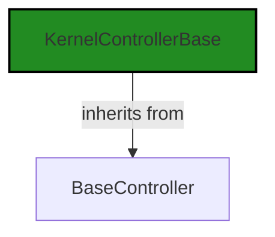
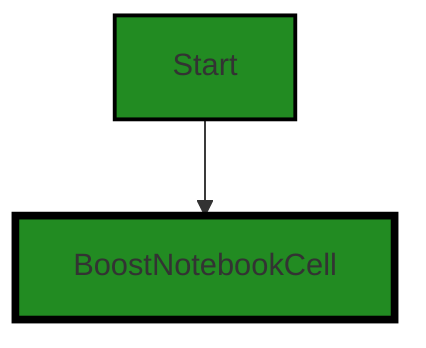
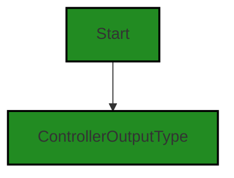
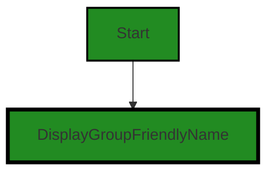
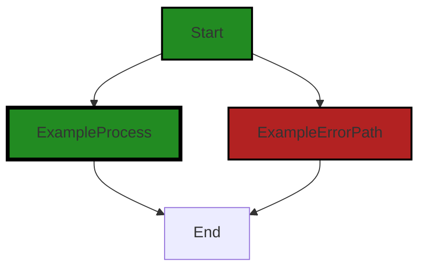

# Polyverse Boost-generated Source Analysis Details

## Source: ./src/controllers/blueprint_controller.ts
Date Generated: Friday, September 8, 2023 at 10:50:56 PM PDT


---

### Boost Architectural Quick Summary Security Report

Last Updated: Friday, September 8, 2023 at 10:48:26 PM PDT

Executive Level Report:

1. **Architectural Impact**: The project is a Visual Studio Code extension that provides code analysis functionality. It is well-structured and organized into classes, following best practices for a VS Code extension. However, the file `blueprint_controller.ts` has been flagged for "Insecure Direct Object References (IDOR)" and "Improper Error Handling". These issues could potentially impact the overall architecture of the project, as they could lead to security vulnerabilities and unexpected behavior.

2. **Risk Analysis**: The risk associated with the identified issues is significant. The IDOR issue could potentially allow an attacker to manipulate the `cloudServiceStage` value and redirect service calls to a malicious endpoint. The Improper Error Handling issue could lead to unexpected behavior and make the system less robust and reliable. These risks need to be addressed promptly to ensure the security and reliability of the project.

3. **Potential Customer Impact**: If left unaddressed, these issues could negatively impact the customer experience. The IDOR issue could potentially expose sensitive data or allow unauthorized actions, while the Improper Error Handling issue could lead to unexpected behavior or system crashes. This could lead to a loss of trust in the product and potential reputational damage.

4. **Overall Issues**: The project has one file with issues out of one total file, indicating a 100% issue rate. This is a high percentage and suggests that the project may have other underlying issues that have not been detected. It is recommended to conduct a thorough review of the project to identify and address any other potential issues.

5. **Risk Assessment**: Based on the current analysis, the overall health of the project source is concerning. The high percentage of files with issues suggests that there may be other undetected issues. The project would benefit from a comprehensive review and refactoring to address the identified issues and improve the overall quality of the code.

Highlights:

- The project follows best practices for a VS Code extension and is well-structured and organized into classes.
- The file `blueprint_controller.ts` has been flagged for "Insecure Direct Object References (IDOR)" and "Improper Error Handling", which could lead to security vulnerabilities and unexpected behavior.
- The potential customer impact of these issues is significant, as they could lead to a loss of trust in the product and potential reputational damage.
- The project has a 100% issue rate, suggesting that there may be other underlying issues that have not been detected.
- The overall health of the project source is concerning, and a comprehensive review and refactoring is recommended.


---

### Boost Architectural Quick Summary Performance Report

Last Updated: Friday, September 8, 2023 at 10:49:12 PM PDT


Executive Report:

1. **Architectural Impact**: The analysis of this file has not revealed any severe issues.
2. **Risk Analysis**: The analysis of this file has not revealed any severe issues.
3. **Potential Customer Impact**: Based on the analysis, there are no severe issues that could potentially impact customers.
4. **Performance Issues**: Our analysis did not identify any explicit performance issues in the file.
5. **Risk Assessment**: Based on the current analysis of this file, no severe issues have been found. However, this doesn't guarantee that the file is risk-free.

Highlights:

- No severe issues were identified in the current analysis of this file.


---

### Boost Architectural Quick Summary Compliance Report

Last Updated: Friday, September 8, 2023 at 10:51:38 PM PDT

## Executive Report

### Architectural Impact and Risk Analysis

The software project under review is a Visual Studio Code extension that provides code analysis functionality. The project communicates with a remote service for code analysis, using different endpoints based on the configured stage. 

The project is primarily written in JavaScript and TypeScript, following the principles of object-oriented design and event-driven programming. It does not appear to use any persistent data storage, and its performance characteristics are optimized for responsiveness through the use of asynchronous programming.

However, the analysis has identified several issues of varying severity in the project's source code, particularly in the `blueprint_controller.ts` file. These issues relate to data compliance, including GDPR, PCI DSS, and HIPAA regulations, and could potentially impact the security and privacy of the data processed by the project.

### Potential Customer Impact

The identified issues could potentially lead to unauthorized access to the data processed by the project, compromising data security and privacy. This could have serious implications for customers, particularly those in regulated industries or jurisdictions with strict data protection laws.

### Overall Issues

The analysis identified a total of 7 issues in the `blueprint_controller.ts` file, with 2 of these being of high severity. The high-severity issues relate to the hard-coding and exposure of service endpoint URLs, which could potentially lead to unauthorized access to the data processed by these services.

### Risk Assessment

Given that the `blueprint_controller.ts` file is the only file in the project, the risk to the overall health of the project is high. All identified issues are in this file, and the high-severity issues could potentially compromise data security and privacy.

### Highlights

1. **Data Compliance Issues:** The analysis identified several data compliance issues in the `blueprint_controller.ts` file, including GDPR, PCI DSS, and HIPAA regulations. These issues could potentially compromise the security and privacy of the data processed by the project.

2. **High-Severity Issues:** Two high-severity issues were identified in the `blueprint_controller.ts` file. These relate to the hard-coding and exposure of service endpoint URLs, which could potentially lead to unauthorized access to the data processed by these services.

3. **Potential Customer Impact:** The identified issues could have serious implications for customers, particularly those in regulated industries or jurisdictions with strict data protection laws.

4. **Risk to Project Health:** Given that all identified issues are in the `blueprint_controller.ts` file, the risk to the overall health of the project is high. The high-severity issues could potentially compromise data security and privacy.

5. **Architectural Soundness:** Despite the identified issues, the project follows best practices for a VS Code extension and makes good use of TypeScript features and the VS Code API. The code is well-structured and organized into classes, and the project includes extensive error handling and logging.
---
## Detailed Analysis:

### Cell 0:
## Original Code:

### Programming Language: typescript
### ./src/controllers/blueprint_controller.ts 

```typescript
import {
    KernelControllerBase
 } from './base_controller';

```
## Boost Analysis:


---

### Boost Code Explanation

Last Updated: Friday, September 8, 2023 at 10:44:06 PM PDT

The code you provided is a single line of code from a larger program, specifically an import statement in JavaScript (or TypeScript, given the context). It's not enough to provide a full analysis or identify any algorithms, but I can explain what this line is doing.

```import { KernelControllerBase } from './base_controller';```

This line is importing a specific export, `KernelControllerBase`, from another module, `base_controller`. The `base_controller` module is located in the same directory as the file with this import statement, as indicated by the `./` in the path.

`KernelControllerBase` is presumably a class, function, or object that is exported by the `base_controller` module. Without seeing the `base_controller` module, I can't provide more specifics, but given the naming convention, it's likely a base class for a controller in a Model-View-Controller (MVC) architecture. 

This imported `KernelControllerBase` can then be used within the module that contains this import statement.

It's important to note that this import statement is using destructuring to import only `KernelControllerBase`. If `base_controller` exported other things, they would not be imported by this line.

Here are some resources for further learning:

- [Mozilla Developer Network (MDN) guide on import/export](https://developer.mozilla.org/en-US/docs/Web/JavaScript/Reference/Statements/import)
- [Model-View-Controller (MVC) architecture](https://en.wikipedia.org/wiki/Model%E2%80%93view%E2%80%93controller)

As for the architectural guidelines, since no specific guidelines were provided, the general principles of good software architecture apply: modularization, separation of concerns, and reusability. This line of code seems to be in line with these principles, as it's importing functionality from another module, suggesting a modular architecture.


---

### Boost Flow Diagram

Last Updated: Friday, September 8, 2023 at 10:46:42 PM PDT




---

### Boost Source-Level Security Analysis

Last Updated: Friday, September 8, 2023 at 10:47:14 PM PDT

**No bugs found**


---

### Boost Source-Level Performance Analysis

Last Updated: Friday, September 8, 2023 at 10:48:34 PM PDT

**No bugs found**


---

### Boost Source-Level Data and Privacy Compliance Analysis

Last Updated: Friday, September 8, 2023 at 10:49:26 PM PDT

1. **Severity**: 1/10

   **Line Number**: 1

   **Bug Type**: Imported Module

   **Description**: The code imports a module 'KernelControllerBase' from './base_controller'. If this module handles sensitive data, there could be potential data compliance issues. However, without more context, it's impossible to determine the exact nature of potential issues.

   **Solution**: Ensure that the module './base_controller' is handling sensitive data correctly, in compliance with GDPR, PCI DSS, and HIPAA. It is recommended to perform a detailed analysis of the './base_controller' module.


### Cell 1:
## Original Code:

### Programming Language: typescript
### ./src/controllers/blueprint_controller.ts line 4

```typescript
import { BoostConfiguration } from '../extension/boostConfiguration';

```
## Boost Analysis:


---

### Boost Code Explanation

Last Updated: Friday, September 8, 2023 at 10:44:29 PM PDT

The code you provided is a single line of code, specifically an import statement in JavaScript (or TypeScript) that is used to include external modules in the current file. 

The code is importing a module named `BoostConfiguration` from a relative path `../extension/boostConfiguration`. The `../` part of the path indicates that the module is located in a directory one level up from the current file. 

The `BoostConfiguration` module is likely a JavaScript or TypeScript module that exports a class, function, object, or variable named `BoostConfiguration`. The specifics of what `BoostConfiguration` does or how it's used aren't clear from this single line of code, but based on the name, it's likely related to the configuration settings for the Boost feature of the software.

Importing modules is a fundamental part of JavaScript and TypeScript programming. It allows code to be organized into smaller, more manageable pieces, each with its own scope. This can improve code readability, maintainability, and testing.

For more information on import statements in JavaScript and TypeScript, you can refer to the following resources:

- [MDN Web Docs: import statement](https://developer.mozilla.org/en-US/docs/Web/JavaScript/Reference/Statements/import)
- [TypeScript Handbook: Modules](https://www.typescriptlang.org/docs/handbook/modules.html)

Regarding the architectural guidelines, this line of code doesn't conflict with the provided architectural blueprint. The use of modules aligns with the object-oriented design principle and helps to keep the codebase organized and maintainable. However, without more context or additional code, it's hard to provide a detailed analysis.


---

### Boost Flow Diagram

Last Updated: Friday, September 8, 2023 at 10:46:45 PM PDT

NO CONTROL FLOW FOUND


---

### Boost Source-Level Security Analysis

Last Updated: Friday, September 8, 2023 at 10:47:18 PM PDT

**No bugs found**


---

### Boost Source-Level Performance Analysis

Last Updated: Friday, September 8, 2023 at 10:48:39 PM PDT

**No bugs found**


---

### Boost Source-Level Data and Privacy Compliance Analysis

Last Updated: Friday, September 8, 2023 at 10:49:56 PM PDT

1. **Severity**: 5/10

   **Line Number**: 6

   **Bug Type**: GDPR

   **Description**: The import statement could potentially lead to GDPR compliance issues if the imported module 'BoostConfiguration' is processing, storing or transmitting any personal data without the necessary consent, security measures and documentation. GDPR requires that personal data be processed lawfully, fairly and transparently, and that it be collected for specified, explicit and legitimate purposes.

   **Solution**: Ensure that the 'BoostConfiguration' module is compliant with GDPR requirements. This could involve obtaining explicit user consent before processing their personal data, implementing appropriate security measures to protect the data, and maintaining documentation of all data processing activities. Additionally, consider implementing Privacy by Design and by Default principles in your software development process.


2. **Severity**: 4/10

   **Line Number**: 6

   **Bug Type**: PCI DSS

   **Description**: The import statement could potentially lead to PCI DSS compliance issues if the imported module 'BoostConfiguration' is processing, storing or transmitting cardholder data without the necessary security measures. PCI DSS requires that cardholder data be protected wherever it is stored, processed or transmitted.

   **Solution**: Ensure that the 'BoostConfiguration' module is compliant with PCI DSS requirements. This could involve implementing strong access control measures, protecting stored cardholder data, encrypting transmission of cardholder data across open, public networks, regularly testing security systems and processes, and maintaining a policy that addresses information security.


3. **Severity**: 5/10

   **Line Number**: 6

   **Bug Type**: HIPAA

   **Description**: The import statement could potentially lead to HIPAA compliance issues if the imported module 'BoostConfiguration' is processing, storing or transmitting protected health information (PHI) without the necessary security measures. HIPAA requires that PHI be protected wherever it is stored, processed or transmitted.

   **Solution**: Ensure that the 'BoostConfiguration' module is compliant with HIPAA requirements. This could involve implementing strong access control measures, protecting stored PHI, encrypting transmission of PHI across open, public networks, regularly testing security systems and processes, and maintaining a policy that addresses information security.


### Cell 2:
## Original Code:

### Programming Language: typescript
### ./src/controllers/blueprint_controller.ts line 5

```typescript
import * as vscode from 'vscode';
import { BoostNotebookCell } from '../data/jupyter_notebook';

```
## Boost Analysis:


---

### Boost Code Explanation

Last Updated: Friday, September 8, 2023 at 10:44:44 PM PDT

The code snippet you provided is very short and doesn't contain any algorithm or complex logic, but I can still give you a brief overview of what it does.

```javascript
import * as vscode from 'vscode';
import { BoostNotebookCell } from '../data/jupyter_notebook';
```

This code is written in TypeScript, which is a statically typed superset of JavaScript. TypeScript provides static typing and other features that make it easier to write large, complex applications in JavaScript.

The code is importing two modules:

1. `vscode`: This is the module for the Visual Studio Code API. The `import * as vscode from 'vscode';` statement imports all exports from the 'vscode' module under the 'vscode' namespace. This means that the code can use the vscode object to access the entire VS Code API.

2. `BoostNotebookCell`: This is a specific export from the `../data/jupyter_notebook` module. The `import { BoostNotebookCell } from '../data/jupyter_notebook';` statement imports only the `BoostNotebookCell` export from the 'jupyter_notebook' module, which is located in the 'data' directory one level up from the current file. The `BoostNotebookCell` is likely a class or interface that defines the structure of a cell in a Boost Jupyter notebook.

Without the rest of the code, it's hard to say exactly what these imports are used for. However, in general, the VS Code API provides functions and objects for interacting with the VS Code editor, and the `BoostNotebookCell` is likely used to represent and manipulate cells in a Boost Jupyter notebook.

Here are some resources where you can learn more about these topics:

- [VS Code API](https://code.visualstudio.com/api/references/vscode-api)
- [TypeScript Modules](https://www.typescriptlang.org/docs/handbook/modules.html)
- [Jupyter Notebooks](https://jupyter-notebook.readthedocs.io/en/stable/)


---

### Boost Flow Diagram

Last Updated: Friday, September 8, 2023 at 10:46:49 PM PDT




---

### Boost Source-Level Security Analysis

Last Updated: Friday, September 8, 2023 at 10:47:21 PM PDT

**No bugs found**


---

### Boost Source-Level Performance Analysis

Last Updated: Friday, September 8, 2023 at 10:48:43 PM PDT

**No bugs found**
MIME Type: application/vnd.code.notebook.error

{"name":"Error","message":"Boost Data and Privacy Compliance Analysis failed: Unable to process this source code. This can be caused by a temporary issue with the Boost Cloud Service, or by an issue in the source input. Please try again, and if the problem persists, please contact Boost Support."}


### Cell 3:
## Original Code:

### Programming Language: typescript
### ./src/controllers/blueprint_controller.ts line 7

```typescript
import { generateCellOutputWithHeader } from '../extension/extensionUtilities';

```
## Boost Analysis:


---

### Boost Code Explanation

Last Updated: Friday, September 8, 2023 at 10:45:15 PM PDT

The provided code snippet is quite short and doesn't contain any specific algorithms, but I'll explain it to the best of my ability.

This is a single line of code written in TypeScript, which is a statically typed superset of JavaScript. It's importing a specific function named `generateCellOutputWithHeader` from a module located at '../extension/extensionUtilities'.

Let's break it down:

- `import`: This is a keyword in JavaScript (and thus TypeScript) that is used to import functions, objects or values from another module or file. This allows you to break your code into reusable pieces.

- `{ generateCellOutputWithHeader }`: This is the specific function that is being imported from the module. The curly braces are used for named imports, which means the function must be exported from the module using the same name.

- `from`: This keyword is used to specify the path to the module that contains the function or value you want to import.

- `'../extension/extensionUtilities'`: This is the relative path to the module. The '..' means to go up one level in the directory structure, then down into the 'extension' directory, and the file is named 'extensionUtilities' (with a .js or .ts extension assumed).

As for the function `generateCellOutputWithHeader`, without more context or the actual function definition, it's hard to say exactly what it does. The name suggests it might generate some sort of output for a "cell" (possibly in a grid or table layout), including a header. Since this is a Visual Studio Code extension, the output is likely related to the VS Code UI in some way.

In terms of architectural guidelines, this line of code seems to follow good practices. It's modular, with functions organized into separate files and directories, and it's using named imports, which can make the code more readable and maintainable.

If you want to learn more about modules and import/export in JavaScript/TypeScript, you can check out these resources:
- [JavaScript Modules: A Beginner’s Guide](https://www.freecodecamp.org/news/javascript-modules-a-beginner-s-guide-783f7d7a5fcc/)
- [TypeScript Module System](https://www.tutorialsteacher.com/typescript/typescript-modules)


---

### Boost Flow Diagram

Last Updated: Friday, September 8, 2023 at 10:46:52 PM PDT

NO CONTROL FLOW FOUND


---

### Boost Source-Level Security Analysis

Last Updated: Friday, September 8, 2023 at 10:47:25 PM PDT

**No bugs found**


---

### Boost Source-Level Performance Analysis

Last Updated: Friday, September 8, 2023 at 10:48:45 PM PDT

**No bugs found**


---

### Boost Source-Level Data and Privacy Compliance Analysis

Last Updated: Friday, September 8, 2023 at 10:50:23 PM PDT

1. **Severity**: 5/10

   **Line Number**: 12

   **Bug Type**: Data Compliance

   **Description**: The function 'generateCellOutputWithHeader' is imported from 'extensionUtilities' but it's not clear if this function properly handles sensitive data in compliance with GDPR, PCI DSS, and HIPAA. If this function processes any sensitive data, it may potentially lead to non-compliance with these standards.

   **Solution**: Ensure that the 'generateCellOutputWithHeader' function properly encrypts, anonymizes, or pseudonymizes sensitive data, as per GDPR, PCI DSS, and HIPAA requirements. It's also important to ensure that data is only processed for the purpose it was collected, and is deleted when no longer necessary. For more information, refer to the respective regulations: GDPR (https://gdpr-info.eu/), PCI DSS (https://www.pcisecuritystandards.org/pci_security/), HIPAA (https://www.hhs.gov/hipaa/for-professionals/security/laws-regulations/index.html).


### Cell 4:
## Original Code:

### Programming Language: typescript
### ./src/controllers/blueprint_controller.ts line 8

```typescript
import {
    ControllerOutputType
} from './controllerOutputTypes';

```
## Boost Analysis:


---

### Boost Code Explanation

Last Updated: Friday, September 8, 2023 at 10:45:40 PM PDT

This is a very simple piece of code. It's written in TypeScript, which is a statically typed superset of JavaScript. 

This code is importing a specific export from another module. The import statement is used to import bindings that are exported by another module. Imported modules are in strict mode whether you declare them as such or not. 

The `import` keyword is used to import functions, objects or values from other modules into the current file. The syntax within the curly braces `{}` is known as named imports. It means that the module we're importing from has exported some variables or functions with specific names, and we're importing only these named exports.

In this case, `ControllerOutputType` is a named export from the module `controllerOutputTypes`. The exact nature and use of `ControllerOutputType` isn't clear from this snippet alone, but based on its name, it likely has something to do with defining the types of output that a controller can produce. 

The `from` keyword is used to specify the path to the module from which to import. The `./` before the module name indicates that the module is in the same directory as the current file. The file extension is not specified in the import statement, which is a common practice in JavaScript and TypeScript.

For more information on `import` statement in JavaScript, you can refer to the [MDN Web Docs](https://developer.mozilla.org/en-US/docs/Web/JavaScript/Reference/Statements/import).

As for the architectural guidelines, this code seems to follow good practices. It's modular, with clear separation of concerns - `ControllerOutputType` is defined in one module and can be imported where needed. This promotes reusability and maintainability. The code is also likely to be type safe, as it's written in TypeScript.


---

### Boost Flow Diagram

Last Updated: Friday, September 8, 2023 at 10:46:56 PM PDT




---

### Boost Source-Level Security Analysis

Last Updated: Friday, September 8, 2023 at 10:47:28 PM PDT

**No bugs found**


---

### Boost Source-Level Performance Analysis

Last Updated: Friday, September 8, 2023 at 10:48:48 PM PDT

**No bugs found**


---

### Boost Source-Level Data and Privacy Compliance Analysis

Last Updated: Friday, September 8, 2023 at 10:50:26 PM PDT

**No bugs found**


### Cell 5:
## Original Code:

### Programming Language: typescript
### ./src/controllers/blueprint_controller.ts line 11

```typescript
import {
    DisplayGroupFriendlyName
} from '../data/userAnalysisType';

```
## Boost Analysis:


---

### Boost Code Explanation

Last Updated: Friday, September 8, 2023 at 10:46:01 PM PDT

This is a small snippet of code, but it contains some important information. Let's go through it:

```javascript
import {
    DisplayGroupFriendlyName
} from '../data/userAnalysisType';
```

This is an import statement in JavaScript, which is part of the ES6 (ECMAScript 2015) module system. It's used to import bindings that are exported by another module. 

In this case, it's importing the `DisplayGroupFriendlyName` binding from the module located at '../data/userAnalysisType'. The '../' in the path means that the module is in the 'data' directory one level up from the current directory. The file name 'userAnalysisType' is the module file, which is assumed to be a JavaScript file.

`DisplayGroupFriendlyName` is likely an object, function, or variable that was exported from the 'userAnalysisType' module and is now being imported for use in the current module.

Regarding the architectural guidelines, this code snippet is too small to be evaluated for architectural consistency or conflicts. However, the use of ES6 modules for organizing code into separate files and importing/exporting between them is a common practice in JavaScript and TypeScript projects, and is consistent with the object-oriented and modular design principles mentioned in the architectural blueprint summary.

For more information on ES6 modules, you can refer to the following resources:
- [MDN Web Docs: import statement](https://developer.mozilla.org/en-US/docs/Web/JavaScript/Reference/Statements/import)
- [MDN Web Docs: export statement](https://developer.mozilla.org/en-US/docs/Web/JavaScript/Reference/Statements/export)


---

### Boost Flow Diagram

Last Updated: Friday, September 8, 2023 at 10:47:00 PM PDT




---

### Boost Source-Level Security Analysis

Last Updated: Friday, September 8, 2023 at 10:47:32 PM PDT

**No bugs found**


---

### Boost Source-Level Performance Analysis

Last Updated: Friday, September 8, 2023 at 10:48:51 PM PDT

**No bugs found**


---

### Boost Source-Level Data and Privacy Compliance Analysis

Last Updated: Friday, September 8, 2023 at 10:50:37 PM PDT

1. **Severity**: 2/10

   **Line Number**: 20

   **Bug Type**: Data Compliance

   **Description**: The code imports a module that seems to handle user data, potentially including personally identifiable information (PII). This could lead to GDPR, PCI DSS, and HIPAA compliance issues if the data is not handled properly.

   **Solution**: Ensure that the imported module properly handles user data in compliance with GDPR, PCI DSS, and HIPAA. This includes anonymizing data, encrypting sensitive data, and only storing necessary data. Regular audits and reviews of data handling practices can also help maintain compliance.


### Cell 6:
## Original Code:

### Programming Language: typescript
### ./src/controllers/blueprint_controller.ts line 14

```typescript

export const blueprintKernelName = 'blueprint';
const blueprintOutputHeader = 'Architectural Blueprint';

export class BoostArchitectureBlueprintKernel extends KernelControllerBase {
 constructor(context: vscode.ExtensionContext, onServiceErrorHandler: any, otherThis : any, collection: vscode.DiagnosticCollection) {
        super(
            collection,
            blueprintKernelName,
            'Architectural Blueprint Code',
            'Builds Archiectural Blueprint of targeted source code by identifying architectural principles, patterns, licensing, performance, etc.',
            ControllerOutputType.blueprint,
            DisplayGroupFriendlyName.documentation,
            blueprintOutputHeader,
            false,
            false,
            context,
            otherThis,
            onServiceErrorHandler);
 }

 dispose(): void {
  super.dispose();
 }

    public get serviceEndpoint(): string {
        switch (BoostConfiguration.cloudServiceStage)
        {
            case "local":
                return 'http://127.0.0.1:8000/blueprint';
            case 'dev':
                return 'https://67wxr6xq76bj5jiaoct5qjzble0wfmdt.lambda-url.us-west-2.on.aws/';
            case "test":
                return 'https://igmvzc3rb3i7ftqm5ozzhpxa5m0xzuae.lambda-url.us-west-2.on.aws/';
            case 'staging':
            case 'prod':
            default:
                return 'https://hb34ftyxhjnd7jvxbmlsmddct40hvrni.lambda-url.us-west-2.on.aws/';
        }
    }

    readonly kernelMarkdownPrefix = "Architectural Blueprint\n";


    onKernelOutputItem(
        response: any,
        cell : vscode.NotebookCell | BoostNotebookCell,
        mimetype : any) : string {

        if (response.blueprint === undefined) {
            throw new Error("Unexpected missing data from Boost Service");
        }
        return generateCellOutputWithHeader(this.outputHeader, response.blueprint);
    }
}

```
## Boost Analysis:


---

### Boost Code Explanation

Last Updated: Friday, September 8, 2023 at 10:46:34 PM PDT

This code is written in TypeScript and appears to be part of a Visual Studio Code (VS Code) extension. It defines a class `BoostArchitectureBlueprintKernel` that extends the `KernelControllerBase` class. This class is responsible for building an architectural blueprint of targeted source code by identifying architectural principles, patterns, licensing, performance, etc.

Here's a detailed breakdown of the code:

- `export const blueprintKernelName = 'blueprint';` and `const blueprintOutputHeader = 'Architectural Blueprint';`: These are constant values that are being exported for use in other parts of the application. They represent the name and header of the kernel.

- The `BoostArchitectureBlueprintKernel` class extends `KernelControllerBase`. This means it inherits all properties and methods from `KernelControllerBase` and can add or override them as needed.

- The constructor of `BoostArchitectureBlueprintKernel` accepts several parameters including a context, an error handler, a collection, and others. It calls the constructor of the base class (`super`) with these parameters, along with additional values such as the kernel name, description, output type, etc.

- The `dispose` method is used to clean up resources when they are no longer needed. In this case, it simply calls the dispose method of the base class.

- The `serviceEndpoint` getter method returns a URL string based on the value of `BoostConfiguration.cloudServiceStage`. This is likely the endpoint that the extension uses to communicate with a remote service for code analysis.

- The `onKernelOutputItem` method is called when the kernel produces an output item. It checks if the response from the Boost Service contains a `blueprint` property and throws an error if it doesn't. If the `blueprint` property exists, it generates cell output with a header and the blueprint data.

The algorithm used in this code is relatively simple. It primarily involves object-oriented programming principles such as inheritance and encapsulation. The `serviceEndpoint` getter uses a switch-case statement to determine the correct URL, and the `onKernelOutputItem` method uses conditional logic to handle the response from the Boost Service.

For more information on these concepts, you can refer to these resources:
- Object-oriented programming in TypeScript: [https://www.typescriptlang.org/docs/handbook/2/classes.html](https://www.typescriptlang.org/docs/handbook/2/classes.html)
- Switch-case statement in TypeScript: [https://www.tutorialsteacher.com/typescript/typescript-switch](https://www.tutorialsteacher.com/typescript/typescript-switch)
- Encapsulation in TypeScript: [https://www.tutorialsteacher.com/typescript/typescript-encapsulation](https://www.tutorialsteacher.com/typescript/typescript-encapsulation)


---

### Boost Flow Diagram

Last Updated: Friday, September 8, 2023 at 10:47:06 PM PDT



In the above code, there is no control flow present.


---

### Boost Source-Level Security Analysis

Last Updated: Friday, September 8, 2023 at 10:47:56 PM PDT

1. **Severity**: 6/10

   **Line Number**: 46

   **Bug Type**: Insecure Direct Object References (IDOR)

   **Description**: The serviceEndpoint method directly uses the BoostConfiguration.cloudServiceStage value to determine the URL for the service endpoint. If an attacker can manipulate the cloudServiceStage value, they can potentially redirect the service calls to a malicious endpoint.

   **Solution**: Avoid using user-supplied input to construct URLs directly. Use a whitelist of valid URLs or endpoints. Here is a resource on preventing IDOR vulnerabilities: https://cheatsheetseries.owasp.org/cheatsheets/Insecure_Direct_Object_Reference_Prevention_Cheat_Sheet.html


2. **Severity**: 4/10

   **Line Number**: 59

   **Bug Type**: Improper Error Handling

   **Description**: The onKernelOutputItem method throws an error if the response.blueprint is undefined. This could potentially expose sensitive information about the internal workings of the application if the error messages are not handled properly.

   **Solution**: Ensure that error messages do not expose sensitive information and are user-friendly. Use a centralized error handling mechanism. Here is a resource on proper error handling: https://cheatsheetseries.owasp.org/cheatsheets/Error_Handling_Cheat_Sheet.html


---

### Boost Source-Level Performance Analysis

Last Updated: Friday, September 8, 2023 at 10:49:08 PM PDT

1. **Severity**: 5/10

   **Line Number**: 46

   **Bug Type**: Network

   **Description**: The serviceEndpoint property is computed every time it's accessed, which may cause unnecessary CPU usage if accessed frequently. This could be a performance issue if the property is accessed frequently.

   **Solution**: Consider caching the serviceEndpoint value in a private field during the class initialization and return this cached value in the serviceEndpoint getter. This way, the value is computed only once, reducing CPU usage.


2. **Severity**: 3/10

   **Line Number**: 58

   **Bug Type**: CPU

   **Description**: The 'onKernelOutputItem' method throws an error if 'response.blueprint' is undefined. This can lead to a significant performance hit if exceptions are used for control flow, as exceptions are generally expensive to construct and handle.

   **Solution**: Consider checking for the existence of 'response.blueprint' and handle it appropriately without throwing an exception. If the absence of 'response.blueprint' is an expected scenario, it should be handled as a normal flow of control rather than as an exception.


---

### Boost Source-Level Data and Privacy Compliance Analysis

Last Updated: Friday, September 8, 2023 at 10:50:56 PM PDT

1. **Severity**: 8/10

   **Line Number**: 38

   **Bug Type**: GDPR

   **Description**: The service endpoint URLs are hard-coded and exposed. This could potentially lead to unauthorized access to the data processed by these services, compromising data security and privacy.

   **Solution**: Consider storing these URLs in a secure configuration file or use environment variables. This way, they are not exposed in the code and can be changed without modifying the code. Also, ensure that the services at these URLs are secure and comply with GDPR regulations.


2. **Severity**: 7/10

   **Line Number**: 61

   **Bug Type**: HIPAA

   **Description**: The method 'onKernelOutputItem' accepts a response and does not perform any validation or sanitization on the data. If this data contains sensitive health information, it could potentially be mishandled, violating HIPAA regulations.

   **Solution**: Implement data validation and sanitization to ensure that the data is handled properly. Also, consider encrypting sensitive data to further enhance security.


