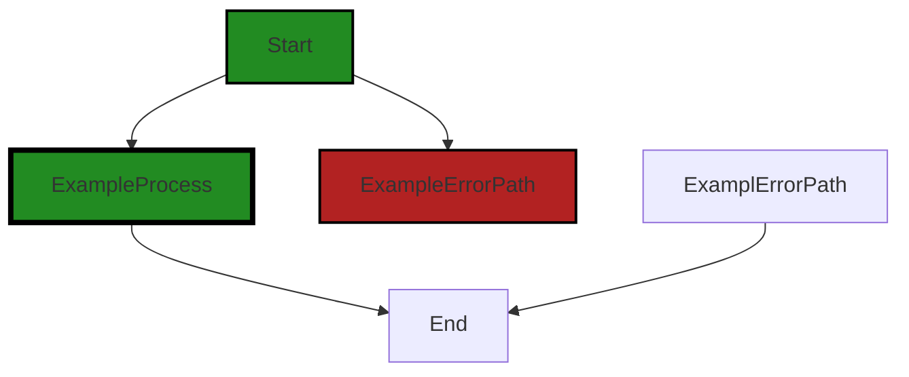
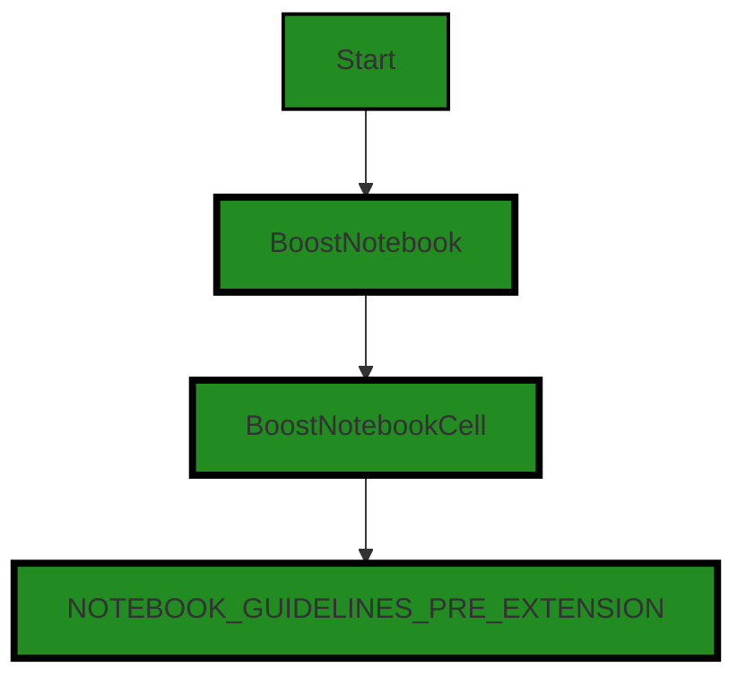
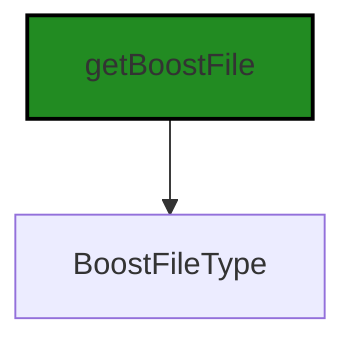
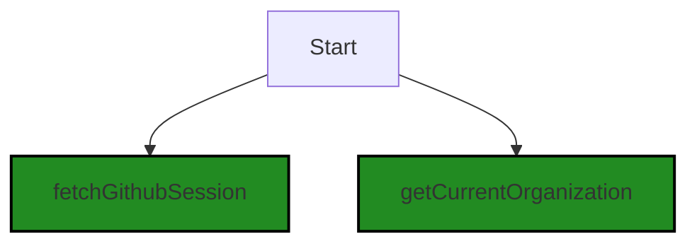
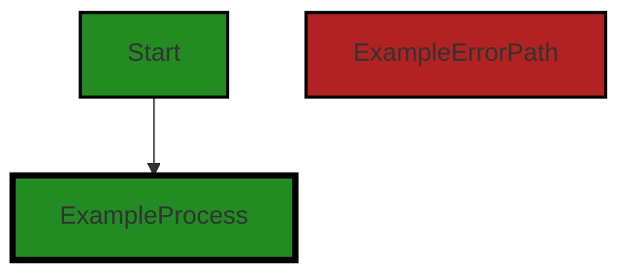
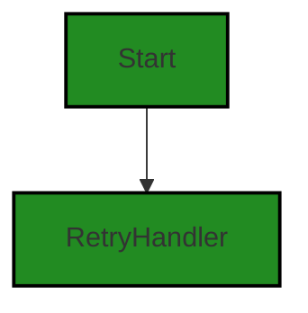
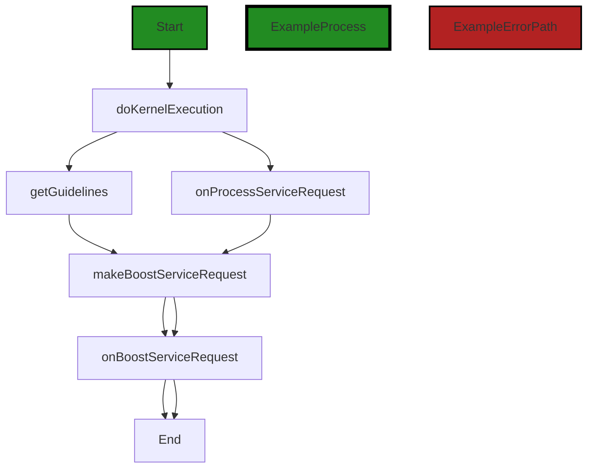

# Polyverse Boost-generated Source Analysis Details

## Source: ./src/controllers/boostServiceHelper.ts
Date Generated: Friday, September 8, 2023 at 11:47:41 PM PDT


---

### Boost Architectural Quick Summary Security Report

Last Updated: Friday, September 8, 2023 at 11:40:26 PM PDT

Executive Level Report:

1. **Architectural Impact**: The project is a Visual Studio Code extension that provides code analysis functionality. The architecture is well-structured and organized into classes, following best practices for a VS Code extension. However, the file `src/controllers/boostServiceHelper.ts` has been flagged with multiple security vulnerabilities, which could potentially impact the overall architecture if not addressed. 

2. **Risk Analysis**: The identified issues in the `src/controllers/boostServiceHelper.ts` file include "Insecure Direct Object References (IDOR)", "Insecure Deserialization", "Unvalidated Redirects and Forwards", "Cross-Site Request Forgery (CSRF)", "Sensitive Data Exposure", and "Improper Error Handling". These issues pose a significant risk to the project, as they could lead to security breaches if exploited. The risk is further heightened by the fact that this file communicates with a remote service for code analysis, potentially exposing sensitive data.

3. **Potential Customer Impact**: If these issues are not addressed, customers could be at risk of security breaches, including data exposure and unauthorized access. This could lead to a loss of trust in the product, impacting its reputation and marketability.

4. **Overall Issues**: The project has one file with multiple issues of varying severity. This represents a significant portion of the project, indicating that there may be underlying issues with the code quality or security practices. 

Risk Assessment:

- **Health of the Project Source**: The fact that all identified issues are concentrated in one file could indicate a lack of thorough testing or code review in this area of the project. However, it also suggests that the rest of the project may be relatively healthy, as no other files have been flagged with issues.
- **Percentage of Files with Issues**: With only one file in the project, 100% of the project files have been flagged with issues. This is a significant concern and suggests that a comprehensive review and remediation plan is needed.

Highlights:

- The `src/controllers/boostServiceHelper.ts` file has multiple high-severity issues, indicating a need for improved security practices.
- The issues identified could lead to serious security breaches if exploited, posing a significant risk to the project.
- The potential customer impact of these issues is high, as they could lead to data exposure and unauthorized access.
- Despite the issues identified, the architecture of the project appears to be sound and follows best practices for a VS Code extension.
- The concentration of issues in one file suggests a need for more thorough testing and code review in this area of the project.


---

### Boost Architectural Quick Summary Performance Report

Last Updated: Friday, September 8, 2023 at 11:43:30 PM PDT

Executive Level Report:

1. **Architectural Impact**: The project's architecture appears to be sound, with no major architectural problems identified. The use of TypeScript and the VS Code API, along with a well-structured codebase organized into classes, indicates a strong adherence to best practices for a VS Code extension. However, the use of 'axios' and 'axios-retry' libraries for making HTTP requests in the 'boostServiceHelper.ts' file could potentially lead to performance issues if not properly configured.

2. **Risk Analysis**: The risk associated with this project is moderate. The most severe issues are related to the potential misuse of the 'axios' and 'axios-retry' libraries in the 'boostServiceHelper.ts' file. These issues, if not addressed, could lead to unnecessary network usage and performance degradation. However, the project's extensive error handling and logging, along with the use of TypeScript for static typing, help mitigate these risks.

3. **Potential Customer Impact**: If the issues identified are not addressed, customers may experience slower performance due to unnecessary network usage. This could lead to a poor user experience, particularly for customers with slower internet connections. However, the project's use of asynchronous programming for potentially long-running tasks should help keep the VS Code UI responsive.

4. **Overall Issues**: The 'boostServiceHelper.ts' file has the most severe issues, with 2 warnings related to memory and network usage, and 3 information-level issues related to CPU usage. However, these issues are not critical and can be addressed with proper configuration and optimization.

Risk Assessment:

- Overall Health: The project appears to be in good health, with only one file ('boostServiceHelper.ts') having detected issues. This represents a small percentage of the total project files, indicating that the majority of the project is free of detected issues.
- Severity of Issues: The issues detected are of 'Warning' and 'Information' severity, indicating that they are not critical. However, they should be addressed to prevent potential performance issues.

Highlights:

1. The project follows best practices for a VS Code extension, with a well-structured and organized codebase.
2. The 'boostServiceHelper.ts' file has the most severe issues, but these are not critical and can be addressed with proper configuration and optimization.
3. The project's use of asynchronous programming for potentially long-running tasks should help keep the VS Code UI responsive, mitigating potential customer impact.
4. The project's extensive error handling and logging, along with the use of TypeScript for static typing, help mitigate potential risks.
5. The project appears to be in good health, with a small percentage of the total project files having detected issues.


---

### Boost Architectural Quick Summary Compliance Report

Last Updated: Friday, September 8, 2023 at 11:48:27 PM PDT

## Executive Report: Software Project Analysis

### Overview

The software project under review is a Visual Studio Code extension that provides code analysis functionality. The project communicates with a remote service for code analysis and displays the results in the VS Code UI. The project is primarily written in JavaScript and TypeScript, following principles of object-oriented design and event-driven programming.

### Architectural Impact and Risk Analysis

1. **High Severity Issues:** The file `src/controllers/boostServiceHelper.ts` has been flagged with high-severity issues related to PCI DSS and HIPAA compliance. These issues could potentially expose sensitive authentication data or protected health information (PHI), leading to serious data breaches. This could have a significant impact on the project's architecture, requiring changes to how data is handled and transmitted.

2. **Potential Customer Impact:** If not addressed, the high-severity issues could lead to data breaches, impacting customers' trust and potentially leading to legal consequences. The project's reputation could be damaged, and it could lose users.

3. **Overall Health of the Project:** The project consists of a single file, `src/controllers/boostServiceHelper.ts`, which has been flagged with issues of varying severity. This suggests that the project's overall health could be improved by addressing these issues. However, it's important to note that the project's size and complexity may limit the potential impact of these issues.

4. **Risk Assessment:** Given that all identified issues are contained within a single file, the risk to the overall project is concentrated. This could be seen as a positive, as it allows for focused remediation efforts. However, it also suggests that this file is critical to the project's functionality and that any issues within it could have a significant impact.

### Highlights

- The project's architecture appears to be sound, with no major architectural problems identified. However, the high-severity issues in `src/controllers/boostServiceHelper.ts` could require architectural changes.
- The project's use of asynchronous programming for potentially long-running tasks, such as communicating with the remote service, is a positive aspect of its architecture. This should keep the VS Code UI responsive.
- The project's error handling and logging are extensive, which is a good practice for software resiliency. However, the high-severity issues identified suggest that there may be areas where error handling could be improved.
- The project's use of TypeScript, which provides static typing to catch many errors at compile time, is another positive aspect of its architecture. This could help to prevent some types of issues from occurring in the first place.

In conclusion, while the project has some high-severity issues that need to be addressed, its overall architecture appears to be sound. The project's use of best practices such as asynchronous programming, extensive error handling and logging, and static typing with TypeScript are all positive aspects of its architecture. However, the high-severity issues in `src/controllers/boostServiceHelper.ts` could require architectural changes and could have a significant impact on customers if not addressed.
---
## Detailed Analysis:

### Cell 0:
## Original Code:

### Programming Language: typescript
### ./src/controllers/boostServiceHelper.ts 

```typescript
import * as vscode from "vscode";
import * as fs from "fs";
import axios from "axios";
import axiosRetry from "axios-retry";
import PQueue from "p-queue";
import { mapError } from "../utilities/error";

```
## Boost Analysis:


---

### Boost Code Explanation

Last Updated: Friday, September 8, 2023 at 11:31:45 PM PDT

This code is written in TypeScript, which is a statically typed superset of JavaScript. It is importing several libraries for use within this module.

Let's break down each line:

1. `import * as vscode from "vscode";` - This line is importing the entire module "vscode" which is a library for building extensions for Visual Studio Code. This library provides a set of APIs that allow you to interact with the Visual Studio Code editor.

2. `import * as fs from "fs";` - This line is importing the "fs" module, which stands for "File System". This is a built-in Node.js module that provides an API for interacting with the file system in a manner closely modeled around standard POSIX functions.

3. `import axios from "axios";` - This line is importing the "axios" library, which is a promise-based HTTP client for the browser and Node.js. It is used to make HTTP requests from Node.js to a server.

4. `import axiosRetry from "axios-retry";` - This line is importing the "axios-retry" library, which is a plugin for axios that automatically retries failed requests.

5. `import PQueue from "p-queue";` - This line is importing the "p-queue" library, which is a promise queue with concurrency control. It can be used to limit the number of promises that are concurrently executed.

6. `import { mapError } from "../utilities/error";` - This line is importing a function named "mapError" from a module located at "../utilities/error". This function is likely used to handle or transform errors in a specific way.

In terms of algorithms, this code doesn't contain any. It is simply importing libraries and functions for use within this module. 

Here are some resources for further reading:

- [VS Code API](https://code.visualstudio.com/api/references/vscode-api)
- [Node.js fs module](https://nodejs.org/api/fs.html)
- [Axios](https://github.com/axios/axios)
- [Axios Retry](https://github.com/softonic/axios-retry)
- [P-Queue](https://github.com/sindresorhus/p-queue)


---

### Boost Flow Diagram

Last Updated: Friday, September 8, 2023 at 11:36:13 PM PDT




---

### Boost Source-Level Security Analysis

Last Updated: Friday, September 8, 2023 at 11:38:05 PM PDT

1. **Severity**: 5/10

   **Line Number**: 3

   **Bug Type**: Insecure Direct Object References (IDOR)

   **Description**: The 'fs' module is imported but not used in the provided code. If used improperly, it could lead to Insecure Direct Object References (IDOR) vulnerabilities, where an attacker can bypass authorization and access resources directly by modifying the value of a reference to an object.

   **Solution**: If the 'fs' module is used, ensure that access controls are properly implemented to prevent unauthorized access to files. More information on IDOR can be found here: https://owasp.org/www-project-top-ten/2017/A5_2017-Broken_Access_Control


2. **Severity**: 8/10

   **Line Number**: 3

   **Bug Type**: Unvalidated Redirects and Forwards

   **Description**: The 'axios' module is used for making HTTP requests. If not properly validated, it could lead to Unvalidated Redirects and Forwards vulnerabilities, where an attacker can redirect users to malicious websites.

   **Solution**: Ensure that all redirects and forwards are validated and do not allow user-controllable data to dictate the destination. More information can be found here: https://cheatsheetseries.owasp.org/cheatsheets/Unvalidated_Redirects_and_Forwards_Cheat_Sheet.html


3. **Severity**: 7/10

   **Line Number**: 4

   **Bug Type**: Cross-Site Request Forgery (CSRF)

   **Description**: The 'axios-retry' module is used to retry failed HTTP requests. If not properly implemented, it could lead to Cross-Site Request Forgery (CSRF) vulnerabilities, where an attacker can trick a victim into performing actions on their behalf.

   **Solution**: Ensure that CSRF tokens are used and validated for all state-changing requests. More information can be found here: https://cheatsheetseries.owasp.org/cheatsheets/Cross-Site_Request_Forgery_Prevention_Cheat_Sheet.html


4. **Severity**: 6/10

   **Line Number**: 5

   **Bug Type**: Insecure Direct Object References (IDOR)

   **Description**: The 'p-queue' module is used for managing promises. If not properly secured, it could lead to Insecure Direct Object References (IDOR) vulnerabilities, where an attacker can manipulate the queue and execute promises out of order.

   **Solution**: Ensure that the promise queue is properly secured and cannot be manipulated by an attacker. More information on IDOR can be found here: https://owasp.org/www-project-top-ten/2017/A5_2017-Broken_Access_Control


5. **Severity**: 4/10

   **Line Number**: 6

   **Bug Type**: Improper Error Handling

   **Description**: The 'mapError' function is used to map errors. If not properly implemented, it could lead to Improper Error Handling vulnerabilities, where an attacker can gain information about the system through error messages.

   **Solution**: Ensure that error messages do not reveal sensitive information about the system. More information can be found here: https://owasp.org/www-community/Improper_Error_Handling


---

### Boost Source-Level Performance Analysis

Last Updated: Friday, September 8, 2023 at 11:41:09 PM PDT

1. **Severity**: 5/10

   **Line Number**: 1

   **Bug Type**: Memory

   **Description**: The 'vscode', 'fs', 'axios', 'axios-retry', and 'p-queue' modules are all loaded at the start, regardless of whether they're used immediately. This could lead to unnecessary memory usage.

   **Solution**: Consider using dynamic imports for modules that aren't immediately needed. This can help reduce initial memory usage. Refer to the dynamic import() function in JavaScript: https://developer.mozilla.org/en-US/docs/Web/JavaScript/Reference/Statements/import#dynamic_imports


2. **Severity**: 6/10

   **Line Number**: 3

   **Bug Type**: Network

   **Description**: The 'axios' and 'axios-retry' libraries are used for making HTTP requests. If not properly configured, this could lead to performance issues such as retrying requests too quickly or too frequently.

   **Solution**: Ensure that 'axios-retry' is correctly configured to avoid unnecessary network usage. Consider using an exponential backoff strategy for retrying requests. More details can be found here: https://github.com/softonic/axios-retry#options


3. **Severity**: 4/10

   **Line Number**: 4

   **Bug Type**: CPU

   **Description**: The 'p-queue' library is used for managing promise-based tasks. If not properly configured, this could lead to CPU performance issues, such as running too many tasks concurrently.

   **Solution**: Ensure that 'p-queue' is correctly configured to avoid unnecessary CPU usage. Consider limiting the concurrency based on the system's capabilities. More details can be found here: https://www.npmjs.com/package/p-queue#options


---

### Boost Source-Level Data and Privacy Compliance Analysis

Last Updated: Friday, September 8, 2023 at 11:44:00 PM PDT

1. **Severity**: 8/10

   **Line Number**: 2

   **Bug Type**: Data Compliance

   **Description**: The 'fs' module can be used to read and write files, which could include sensitive information. Without proper access controls and encryption, this could lead to violations of GDPR, PCI DSS, and HIPAA.

   **Solution**: Ensure that proper access controls are in place when reading and writing files, and that sensitive data is encrypted at rest. Use of a secure file system module or library that automatically handles these concerns is recommended.


2. **Severity**: 7/10

   **Line Number**: 3

   **Bug Type**: Data Compliance

   **Description**: Axios is used for HTTP requests, which could include sending sensitive data. If data is sent over an insecure connection or without proper access controls, this could violate GDPR, PCI DSS, and HIPAA.

   **Solution**: Ensure that all data sent over HTTP is done over a secure connection (HTTPS), and that proper access controls and authentication are in place. Use of a secure HTTP library that automatically handles these concerns is recommended.


### Cell 1:
## Original Code:

### Programming Language: typescript
### ./src/controllers/boostServiceHelper.ts line 7

```typescript

import {
    BoostNotebook,
    BoostNotebookCell,
    NOTEBOOK_GUIDELINES_PRE_EXTENSION,
} from "../data/jupyter_notebook";

```
## Boost Analysis:


---

### Boost Code Explanation

Last Updated: Friday, September 8, 2023 at 11:32:15 PM PDT

This code is a simple import statement in JavaScript (or TypeScript, given the context). It imports three entities - `BoostNotebook`, `BoostNotebookCell`, and `NOTEBOOK_GUIDELINES_PRE_EXTENSION` - from a module located at `../data/jupyter_notebook`.

The `import` statement is a part of ES6 (ECMAScript 2015) modules syntax and is used to import bindings which are exported by another module (i.e., another JavaScript file). 

Here's a breakdown of what's being imported:

1. `BoostNotebook`: This is likely a class or a function that encapsulates the functionality related to a BoostNotebook. 

2. `BoostNotebookCell`: This is likely a class or a function that deals with a cell in a BoostNotebook. In Jupyter notebooks, a cell is a container for text to be displayed in the notebook or code to be executed by the notebook’s kernel.

3. `NOTEBOOK_GUIDELINES_PRE_EXTENSION`: This is likely a constant that holds a value related to the notebook guidelines. The naming convention suggests that it is a constant, as it is all in upper case with words separated by underscores.

The path `../data/jupyter_notebook` is a relative path that points to the `jupyter_notebook` JavaScript file in the `data` directory one level up from the current directory.

There are no algorithms used in this code, as it's just an import statement. However, it's important to note that the imported entities might be used in algorithms in the rest of the code.

As for architectural guidelines, this code seems to be in line with common JavaScript and TypeScript practices. The imports are grouped together at the top of the file, which is a common practice for better organization and readability of the code. 

For more information about ES6 modules and import/export statements, you can refer to this resource: [MDN Web Docs: import](https://developer.mozilla.org/en-US/docs/Web/JavaScript/Reference/Statements/import)


---

### Boost Flow Diagram

Last Updated: Friday, September 8, 2023 at 11:36:20 PM PDT




---

### Boost Source-Level Security Analysis

Last Updated: Friday, September 8, 2023 at 11:38:08 PM PDT

**No bugs found**


---

### Boost Source-Level Performance Analysis

Last Updated: Friday, September 8, 2023 at 11:41:18 PM PDT

1. **Severity**: 1/10

   **Line Number**: 12

   **Bug Type**: Memory

   **Description**: The code imports several modules but does not use them. This could lead to unnecessary memory usage.

   **Solution**: Remove unused imports to save memory. Only import the modules that are necessary for the code to function.


---

### Boost Source-Level Data and Privacy Compliance Analysis

Last Updated: Friday, September 8, 2023 at 11:44:40 PM PDT

1. **Severity**: 5/10

   **Line Number**: 12

   **Bug Type**: GDPR

   **Description**: The import of BoostNotebook, BoostNotebookCell, and NOTEBOOK_GUIDELINES_PRE_EXTENSION from '../data/jupyter_notebook' could potentially lead to GDPR compliance issues if these objects are used to process or store personal data of EU citizens without proper consent or security measures.

   **Solution**: Ensure that any personal data processed or stored using these objects is done so in compliance with GDPR regulations. This includes obtaining proper consent from the data subject and implementing appropriate security measures to protect the data. Also, consider anonymizing or pseudonymizing personal data where possible to further reduce the risk of non-compliance.


2. **Severity**: 7/10

   **Line Number**: 12

   **Bug Type**: PCI DSS

   **Description**: If BoostNotebook or BoostNotebookCell are used to process, store, or transmit cardholder data, this could lead to PCI DSS compliance issues. PCI DSS requires that cardholder data be protected with strong encryption and access controls.

   **Solution**: Ensure that any cardholder data processed, stored, or transmitted using these objects is done so in compliance with PCI DSS requirements. This includes encrypting the data and implementing strong access controls. Additionally, avoid storing sensitive authentication data, such as full magnetic stripe data, card verification codes or values, and PINs or PIN blocks.


3. **Severity**: 8/10

   **Line Number**: 12

   **Bug Type**: HIPAA

   **Description**: If BoostNotebook or BoostNotebookCell are used to process, store, or transmit protected health information (PHI), this could lead to HIPAA compliance issues. HIPAA requires that PHI be protected with strong encryption and access controls, and that it be shared only with authorized individuals.

   **Solution**: Ensure that any PHI processed, stored, or transmitted using these objects is done so in compliance with HIPAA regulations. This includes encrypting the data, implementing strong access controls, and sharing the data only with authorized individuals. Also, consider de-identifying PHI where possible to further reduce the risk of non-compliance.


### Cell 2:
## Original Code:

### Programming Language: typescript
### ./src/controllers/boostServiceHelper.ts line 13

```typescript
import { getBoostFile, BoostFileType } from "../extension/extension";

```
## Boost Analysis:


---

### Boost Code Explanation

Last Updated: Friday, September 8, 2023 at 11:32:46 PM PDT

The code snippet provided is very short and part of a larger context, but I'll explain what I can.

This line of code is written in TypeScript, which is a statically typed superset of JavaScript. TypeScript adds static types, classes, and modules to JavaScript, providing better tooling and helping with large-scale application development.

The line of code is an import statement, which is used to import bindings that are exported by another module. Here, it imports two items: `getBoostFile` and `BoostFileType` from the module located at `../extension/extension`.

1. `getBoostFile`: This is likely a function that retrieves a file related to the "Boost" functionality of the software. Without more context, it's hard to say exactly what this function does. But based on its name, it probably takes some arguments that specify which file to get and returns that file or information about that file.

2. `BoostFileType`: This is likely a data type or an enumeration that represents different types of "Boost" files. Enumerations (enums) are a feature added by TypeScript that's not present in regular JavaScript. They allow a developer to define a type that has a limited set of predefined values. In this case, `BoostFileType` might have values like `CONFIG`, `DATA`, `CACHE`, etc., representing different types of files that the "Boost" functionality might work with.

Regarding the architectural guidelines, this line of code seems to be consistent with the general principles mentioned in the architectural blueprint summary. It uses TypeScript and object-oriented design, as the imported items could be a function and an enum, which are typical constructs in object-oriented programming. The code is also well-structured, as it organizes related functionality into modules and uses import statements to access that functionality where needed.

For more information on TypeScript and its features, you can refer to the TypeScript documentation: https://www.typescriptlang.org/docs/

For more information on modules in JavaScript/TypeScript, you can refer to the MDN Web Docs: https://developer.mozilla.org/en-US/docs/Web/JavaScript/Guide/Modules


---

### Boost Flow Diagram

Last Updated: Friday, September 8, 2023 at 11:36:24 PM PDT


```


---

### Boost Source-Level Security Analysis

Last Updated: Friday, September 8, 2023 at 11:38:12 PM PDT

**No bugs found**


---

### Boost Source-Level Performance Analysis

Last Updated: Friday, September 8, 2023 at 11:41:22 PM PDT

**No bugs found**


---

### Boost Source-Level Data and Privacy Compliance Analysis

Last Updated: Friday, September 8, 2023 at 11:44:53 PM PDT

1. **Severity**: 3/10

   **Line Number**: 24

   **Bug Type**: Data Compliance

   **Description**: The function 'getBoostFile' is potentially accessing file data, but there are no visible safeguards or checks in place to ensure that the data accessed is compliant with GDPR, PCI DSS, and HIPAA standards. This could potentially expose sensitive user data.

   **Solution**: Implement access controls and data anonymization techniques to ensure that any data accessed is compliant with GDPR, PCI DSS, and HIPAA. Additionally, ensure that any data accessed is necessary for the function to perform its task to adhere to the principle of data minimization.


### Cell 3:
## Original Code:

### Programming Language: typescript
### ./src/controllers/boostServiceHelper.ts line 14

```typescript
import { BoostConfiguration } from "../extension/boostConfiguration";

```
## Boost Analysis:


---

### Boost Code Explanation

Last Updated: Friday, September 8, 2023 at 11:33:10 PM PDT

The line of code you provided is an import statement in TypeScript. This line is importing the `BoostConfiguration` class from the `boostConfiguration` module located in the `extension` directory relative to the file where this import statement is used.

Here's a detailed explanation:

- `import`: This is a keyword in JavaScript and TypeScript that is used to import bindings which are exported by another module. 

- `{ BoostConfiguration }`: This is a named import. It means that we're importing a specific export, named `BoostConfiguration`, from the module. `BoostConfiguration` is expected to be a class, function, or variable that has been exported from the `boostConfiguration` module.

- `from`: This is another keyword used in the import statement. It is used to specify the path to the module from which we want to import.

- `"../extension/boostConfiguration"`: This is the path to the module we're importing from. The `"../"` part of the path means we're going up one directory from the current file. Then we're going into the `extension` directory and importing from the `boostConfiguration` module. The `.ts` or `.js` extension is omitted as per standard practice.

It's important to note that the code snippet you provided doesn't contain any algorithms. It is simply a statement to include a specific class from another module to be used in the current module.

For more information about modules and import/export in TypeScript, you can refer to the [official TypeScript documentation](https://www.typescriptlang.org/docs/handbook/modules.html).


---

### Boost Flow Diagram

Last Updated: Friday, September 8, 2023 at 11:36:27 PM PDT

NO CONTROL FLOW FOUND


---

### Boost Source-Level Security Analysis

Last Updated: Friday, September 8, 2023 at 11:38:15 PM PDT

**No bugs found**


---

### Boost Source-Level Performance Analysis

Last Updated: Friday, September 8, 2023 at 11:41:25 PM PDT

**No bugs found**


---

### Boost Source-Level Data and Privacy Compliance Analysis

Last Updated: Friday, September 8, 2023 at 11:45:23 PM PDT

1. **Severity**: 4/10

   **Line Number**: 26

   **Bug Type**: GDPR

   **Description**: The BoostConfiguration file may contain sensitive user data that if not properly protected could be a violation of GDPR compliance. GDPR requires that personal data is processed in a way that ensures appropriate security, including protection against unauthorized or unlawful processing, accidental loss, destruction or damage.

   **Solution**: Ensure that any personal data stored in the BoostConfiguration file is encrypted and access to it is restricted. Additionally, implement a mechanism for users to request their data be deleted.


2. **Severity**: 5/10

   **Line Number**: 26

   **Bug Type**: PCI DSS

   **Description**: If the BoostConfiguration file contains cardholder data and is not properly secured, this could be a violation of PCI DSS compliance. PCI DSS requires that cardholder data is stored securely and that access to it is restricted.

   **Solution**: Ensure that any cardholder data stored in the BoostConfiguration file is encrypted and access to it is restricted. Additionally, do not store sensitive authentication data after authorization.


3. **Severity**: 6/10

   **Line Number**: 26

   **Bug Type**: HIPAA

   **Description**: If the BoostConfiguration file contains protected health information (PHI) and is not properly secured, this could be a violation of HIPAA compliance. HIPAA requires that PHI is stored securely and that access to it is restricted.

   **Solution**: Ensure that any PHI stored in the BoostConfiguration file is encrypted and access to it is restricted. Additionally, implement a mechanism for users to request their data be deleted.


### Cell 4:
## Original Code:

### Programming Language: typescript
### ./src/controllers/boostServiceHelper.ts line 15

```typescript
import { boostLogging } from "../utilities/boostLogging";

```
## Boost Analysis:


---

### Boost Code Explanation

Last Updated: Friday, September 8, 2023 at 11:33:40 PM PDT

The line of code you've provided is an import statement in JavaScript, specifically for a module that is part of the ECMAScript 2015 (ES6) specification. This line of code is used to import functionality from another JavaScript file into the current file.

Let's break down the components of this import statement:

- `import`: This is the keyword that begins the statement. It tells the JavaScript interpreter that we want to bring in some functionality from another module.

- `{ boostLogging }`: This is the specific function or object that we want to import from the module. The use of curly braces `{}` indicates that we are using named imports, which means we are importing specific exports from the module. In this case, we are importing the `boostLogging` function or object.

- `from "../utilities/boostLogging"`: This part of the statement tells us where the module is that we want to import from. The string `../utilities/boostLogging` is a relative file path to the module. The `..` means to go up one directory level, `utilities` is a directory at that level, and `boostLogging` is the file we want to import from (presumably `boostLogging.js` or `boostLogging.ts` since the extensions are typically omitted in import statements).

The purpose of this line of code is to make the `boostLogging` function or object available for use in the current file. The `boostLogging` function or object is likely used for logging operations within the Boost VS Code extension, based on the naming convention.

As for the architectural guidelines, this line of code appears to be in line with standard practices for a Visual Studio Code extension written in JavaScript/TypeScript. It's organized and makes use of modules, which are a fundamental part of structuring large JavaScript/TypeScript applications.

For more information on JavaScript modules and import statements, you can refer to the following resources:

- [MDN Web Docs: import](https://developer.mozilla.org/en-US/docs/Web/JavaScript/Reference/Statements/import)
- [JavaScript Modules: A Beginner’s Guide](https://medium.com/@timoxley/named-exports-as-the-default-export-api-670b1b554f65)


---

### Boost Flow Diagram

Last Updated: Friday, September 8, 2023 at 11:36:30 PM PDT


---

### Boost Source-Level Security Analysis

Last Updated: Friday, September 8, 2023 at 11:38:18 PM PDT

**No bugs found**


---

### Boost Source-Level Performance Analysis

Last Updated: Friday, September 8, 2023 at 11:41:28 PM PDT

**No bugs found**


---

### Boost Source-Level Data and Privacy Compliance Analysis

Last Updated: Friday, September 8, 2023 at 11:45:27 PM PDT

**No bugs found**


### Cell 5:
## Original Code:

### Programming Language: typescript
### ./src/controllers/boostServiceHelper.ts line 16

```typescript
import { fetchGithubSession, getCurrentOrganization } from "../utilities/authorization";

```
## Boost Analysis:


---

### Boost Code Explanation

Last Updated: Friday, September 8, 2023 at 11:33:57 PM PDT

The given code snippet is quite short and simple. It's written in JavaScript or TypeScript, and it's using ES6 import syntax to import two functions from another module located at "../utilities/authorization".

1. `fetchGithubSession`: This function is likely used to initiate or retrieve a session with GitHub. The specifics of what it does would depend on the implementation in the "authorization" module, but it might involve making a request to the GitHub API to authenticate a user and start a session, or it could retrieve an existing session if one is already active.

2. `getCurrentOrganization`: This function probably retrieves information about the current GitHub organization that the user is interacting with. Again, the specifics would depend on the implementation in the "authorization" module, but it might involve making a request to the GitHub API to get information about the organization.

These functions are likely part of a larger system that interacts with GitHub, perhaps to fetch, analyze, or modify code repositories. They are part of the authorization utility, which suggests that they are related to user authentication and permissions.

As for algorithms, given the limited context, it's hard to say. These functions could use any number of algorithms to do their job, depending on the specifics of what they need to do. For example, `fetchGithubSession` might use an algorithm to securely transmit user credentials to GitHub, while `getCurrentOrganization` might use an algorithm to parse the response from the GitHub API.

Here are some resources for further reading:

- [JavaScript Modules: An Introduction](https://developer.mozilla.org/en-US/docs/Web/JavaScript/Guide/Modules): This is a guide to JavaScript modules, which are a way to share code between different parts of a JavaScript program.
- [GitHub API documentation](https://docs.github.com/en/rest): This is the documentation for the GitHub API, which these functions are likely interacting with.
- [Understanding the GitHub flow](https://guides.github.com/introduction/flow/): This guide explains how GitHub is typically used to manage software projects, which might provide some context for what these functions are doing.


---

### Boost Flow Diagram

Last Updated: Friday, September 8, 2023 at 11:36:35 PM PDT




---

### Boost Source-Level Security Analysis

Last Updated: Friday, September 8, 2023 at 11:38:22 PM PDT

**No bugs found**


---

### Boost Source-Level Performance Analysis

Last Updated: Friday, September 8, 2023 at 11:41:31 PM PDT

**No bugs found**


---

### Boost Source-Level Data and Privacy Compliance Analysis

Last Updated: Friday, September 8, 2023 at 11:45:58 PM PDT

1. **Severity**: 7/10

   **Line Number**: 30

   **Bug Type**: GDPR

   **Description**: The code imports a function that fetches a Github session, which may involve processing personal data without explicit consent. This could violate GDPR rules.

   **Solution**: Ensure that the user has given explicit consent before processing their personal data. Use a clear and easily accessible form for the user to provide their consent. Always provide an option for the user to withdraw their consent.


2. **Severity**: 7/10

   **Line Number**: 30

   **Bug Type**: PCI DSS

   **Description**: The code imports a function that fetches a Github session, which may involve processing payment card data without proper security measures. This could violate PCI DSS rules.

   **Solution**: Ensure that all payment card data is encrypted during transmission and storage. Implement a secure coding policy to prevent common security vulnerabilities. Regularly test and update your systems to maintain a high level of security.


3. **Severity**: 6/10

   **Line Number**: 30

   **Bug Type**: HIPAA

   **Description**: The code imports a function that fetches a Github session, which may involve processing protected health information without proper security measures. This could violate HIPAA rules.

   **Solution**: Ensure that all protected health information is encrypted during transmission and storage. Implement a secure coding policy to prevent common security vulnerabilities. Regularly test and update your systems to maintain a high level of security.


### Cell 6:
## Original Code:

### Programming Language: typescript
### ./src/controllers/boostServiceHelper.ts line 17

```typescript
import { BoostAuthenticationException } from "../controllers/customerPortal";

```
## Boost Analysis:


---

### Boost Code Explanation

Last Updated: Friday, September 8, 2023 at 11:34:26 PM PDT

The line of code you've provided is an import statement written in TypeScript, a statically typed superset of JavaScript. This statement is used to import a specific component from another module in the project. 

The component being imported is `BoostAuthenticationException`, which is presumably a class or function that handles a specific type of exception related to authentication in the Boost application. The exception handling could be used to catch and handle errors that occur during user authentication, such as incorrect login credentials or a server error during the authentication process.

The module from which this component is being imported is located at `../controllers/customerPortal`. The `../` part of the path indicates that the module is located in a directory one level up from the current file. The `controllers/customerPortal` part of the path indicates that the module is in a file named `customerPortal` in a directory named `controllers`.

The exception handling mechanism used in this code is a fundamental part of error handling in many programming languages, including TypeScript and JavaScript. When an error occurs during the execution of a program, an exception is thrown. This exception can be caught and handled using try-catch blocks. If the exception is not caught, it will propagate up the call stack, potentially causing the program to terminate.

For more information on exception handling in TypeScript, you can refer to the [TypeScript Handbook](https://www.typescriptlang.org/docs/handbook/release-notes/typescript-2-0.html#non-null-assertion-operator) and the [MDN Web Docs on JavaScript error handling](https://developer.mozilla.org/en-US/docs/Web/JavaScript/Guide/Control_flow_and_error_handling#exception_handling_statements). 

As for the architectural guidelines given, since no specific guidelines or constraints are provided, the import statement appears to be in line with common best practices for modular programming. It promotes separation of concerns by importing only the necessary component from the module, rather than the entire module. It also appears to follow a logical file structure, with related files grouped into directories. However, without more context or guidelines, it's difficult to provide a more detailed analysis.


---

### Boost Flow Diagram

Last Updated: Friday, September 8, 2023 at 11:36:39 PM PDT


---

### Boost Source-Level Security Analysis

Last Updated: Friday, September 8, 2023 at 11:38:25 PM PDT

**No bugs found**


---

### Boost Source-Level Performance Analysis

Last Updated: Friday, September 8, 2023 at 11:41:35 PM PDT

**No bugs found**


---

### Boost Source-Level Data and Privacy Compliance Analysis

Last Updated: Friday, September 8, 2023 at 11:46:30 PM PDT

1. **Severity**: 5/10

   **Line Number**: 32

   **Bug Type**: GDPR

   **Description**: The import statement for 'BoostAuthenticationException' may imply that the application is handling user authentication data, which could potentially contain sensitive personal data. If not handled correctly, this could lead to GDPR compliance issues.

   **Solution**: Ensure that any authentication data, especially personal data, is processed in compliance with GDPR principles. This includes data minimization, purpose limitation, and ensuring proper security measures. For instance, never store passwords in plain text, always use secure methods like hashing and salting.


2. **Severity**: 3/10

   **Line Number**: 32

   **Bug Type**: PCI DSS

   **Description**: If the application processes, stores or transmits cardholder data, it must comply with the Payment Card Industry Data Security Standard (PCI DSS). The import of 'BoostAuthenticationException' does not directly indicate a PCI DSS issue, but the application's handling of authentication data could potentially impact PCI DSS compliance if cardholder data is involved.

   **Solution**: Ensure that any cardholder data is securely handled according to the PCI DSS requirements. This includes encryption of cardholder data, secure systems and networks, and regular testing of security systems.


3. **Severity**: 4/10

   **Line Number**: 32

   **Bug Type**: HIPAA

   **Description**: The import statement for 'BoostAuthenticationException' may imply that the application is handling user authentication data. If this data includes Protected Health Information (PHI), it could potentially lead to HIPAA compliance issues.

   **Solution**: Ensure that any PHI is processed in compliance with HIPAA regulations. This includes implementing necessary safeguards to protect the confidentiality, integrity, and availability of PHI, and ensuring that PHI is not disclosed without the individual's authorization.


### Cell 7:
## Original Code:

### Programming Language: typescript
### ./src/controllers/boostServiceHelper.ts line 18

```typescript
import { IAnalysisContextData } from "../data/IAnalysisContextData";

```
## Boost Analysis:


---

### Boost Code Explanation

Last Updated: Friday, September 8, 2023 at 11:34:51 PM PDT

The provided code snippet is very brief and straightforward. It's written in TypeScript, a statically typed superset of JavaScript that adds types to the language. TypeScript helps with catching errors at compile time rather than at runtime, making it easier to write robust code.

This line of code is an import statement. It's used to include external modules or dependencies into the current file or module. In this case, it's importing an interface named `IAnalysisContextData` from a module located at `../data/IAnalysisContextData`.

The interface `IAnalysisContextData` is a custom type definition, which is used to specify the shape of an object. While the specific details of this interface are not provided in the snippet, it can be inferred that the interface is used to define the data structure for analysis context data in the application.

Let's break it down:

- `import`: This is a keyword in JavaScript and TypeScript used to import functionality from another module or file.

- `{ IAnalysisContextData }`: This is the specific item being imported. The curly braces are used for named exports. In this case, `IAnalysisContextData` is a named export from the module we are importing from.

- `from "../data/IAnalysisContextData"`: This is the relative path to the file or module that contains the export we are importing. The `..` at the beginning of the path indicates that we are going up one level in the directory structure.

The architectural guidelines provided do not specify any constraints or guidelines that would directly impact this line of code.

For more information on TypeScript interfaces and import statements, you can refer to the following resources:

- [TypeScript Interfaces](https://www.typescriptlang.org/docs/handbook/interfaces.html)
- [JavaScript `import` statement](https://developer.mozilla.org/en-US/docs/Web/JavaScript/Reference/Statements/import)


---

### Boost Flow Diagram

Last Updated: Friday, September 8, 2023 at 11:36:44 PM PDT




---

### Boost Source-Level Security Analysis

Last Updated: Friday, September 8, 2023 at 11:38:28 PM PDT

**No bugs found**


---

### Boost Source-Level Performance Analysis

Last Updated: Friday, September 8, 2023 at 11:41:38 PM PDT

**No bugs found**


---

### Boost Source-Level Data and Privacy Compliance Analysis

Last Updated: Friday, September 8, 2023 at 11:47:03 PM PDT

1. **Severity**: 2/10

   **Line Number**: 34

   **Bug Type**: GDPR

   **Description**: The code imports a module that deals with Analysis Context Data. If this data includes personal data of EU citizens, it might be subject to GDPR. However, from this single line of code, it's not clear if any personal data is processed and if it is processed in a GDPR-compliant way.

   **Solution**: Ensure that any personal data processed by IAnalysisContextData is handled in a GDPR compliant way. This includes obtaining explicit consent for data processing, implementing data minimization principles, and providing a way for users to request data deletion.


2. **Severity**: 2/10

   **Line Number**: 34

   **Bug Type**: PCI DSS

   **Description**: If IAnalysisContextData processes or stores cardholder data, it must comply with PCI DSS standards. This line of code does not show how cardholder data is protected.

   **Solution**: Ensure that any cardholder data processed by IAnalysisContextData is handled in a PCI DSS compliant way. This includes protecting stored cardholder data, encrypting transmission of cardholder data across open, public networks, and maintaining a vulnerability management program.


3. **Severity**: 2/10

   **Line Number**: 34

   **Bug Type**: HIPAA

   **Description**: If IAnalysisContextData processes or stores Protected Health Information (PHI), it must comply with HIPAA standards. This line of code does not show how PHI is protected.

   **Solution**: Ensure that any PHI processed by IAnalysisContextData is handled in a HIPAA compliant way. This includes implementing technical safeguards like access control, audit controls, integrity controls, and transmission security.


### Cell 8:
## Original Code:

### Programming Language: typescript
### ./src/controllers/boostServiceHelper.ts line 19

```typescript

// we can get timeouts and other errors from both openai and lambda. This is a generic handler for those
// conditions to attempt a retry.
axiosRetry(axios, {
    retries: 3,
    retryDelay: axiosRetry.exponentialDelay,
});

```
## Boost Analysis:


---

### Boost Code Explanation

Last Updated: Friday, September 8, 2023 at 11:35:09 PM PDT

The code snippet provided is utilizing the `axiosRetry` library to add retry functionality to the `axios` HTTP client. This is a common pattern used in distributed systems to increase the reliability of HTTP requests. 

The `axiosRetry` function takes two arguments: the `axios` instance and an options object. In this case, the options object specifies that `axios` should retry failed requests 3 times (`retries: 3`) and that the delay between retries should increase exponentially (`retryDelay: axiosRetry.exponentialDelay`).

The exponential backoff algorithm is a standard error-handling strategy for network applications in which the client periodically retries a failed request over an increasing amount of time. If a request fails, the client waits before retrying the request, and if the request fails again, the client waits even longer, and so on, up to a maximum number of retries.

Here is a brief explanation of the options:

- `retries`: This option sets the maximum number of retry attempts when a request fails. In this case, it is set to 3.

- `retryDelay`: This option is a function that returns the delay in milliseconds (ms) before the next retry attempt. The `axiosRetry.exponentialDelay` function is used here, which provides an exponential backoff delay.

This code is consistent with the architectural analysis provided, as it demonstrates the use of error handling and asynchronous programming. It is a good practice to implement retries for network requests, as it can make your application more resilient to temporary issues.

For more information on Axios and the retry pattern, you can refer to the following resources:

- [Axios GitHub](https://github.com/axios/axios)
- [axios-retry GitHub](https://github.com/softonic/axios-retry)
- [Exponential Backoff Wikipedia](https://en.wikipedia.org/wiki/Exponential_backoff)


---

### Boost Flow Diagram

Last Updated: Friday, September 8, 2023 at 11:36:48 PM PDT




---

### Boost Source-Level Security Analysis

Last Updated: Friday, September 8, 2023 at 11:38:42 PM PDT

1. **Severity**: 4/10

   **Line Number**: 41

   **Bug Type**: Insecure Direct Object References (IDOR)

   **Description**: The code is using axios for HTTP requests and has a retry mechanism in place. However, it does not verify the validity of the response before retrying. This can potentially lead to Insecure Direct Object References (IDOR) if an attacker can manipulate the response to reference objects that they should not have access to.

   **Solution**: To prevent this, it is recommended to implement a check for the validity of the response before retrying the request. This can be done by checking the status code of the response and only retrying the request if it indicates a temporary issue (e.g., 503 Service Unavailable). You can refer to the axios documentation for more information on how to do this: https://axios-http.com/docs/handling_errors


---

### Boost Source-Level Performance Analysis

Last Updated: Friday, September 8, 2023 at 11:41:50 PM PDT

1. **Severity**: 5/10

   **Line Number**: 40

   **Bug Type**: Network

   **Description**: The retry strategy used here can potentially lead to network congestion and increased latency. If the network request fails, it will be retried three times, which could overload the network if many requests fail simultaneously.

   **Solution**: Consider implementing a more sophisticated retry strategy, such as exponential backoff with jitter, which can reduce the load on the network by spreading out the retries over a longer period of time. This can be achieved by customizing the retryDelay function. You can refer to this guide on how to implement it: https://aws.amazon.com/blogs/architecture/exponential-backoff-and-jitter/


---

### Boost Source-Level Data and Privacy Compliance Analysis

Last Updated: Friday, September 8, 2023 at 11:47:15 PM PDT

1. **Severity**: 7/10

   **Line Number**: 39

   **Bug Type**: Data Compliance - GDPR, PCI DSS, HIPAA

   **Description**: The use of axios with retries can potentially lead to multiple transmissions of sensitive data in case of retries. If the data being sent includes personally identifiable information (PII) or other sensitive data, this could be a violation of GDPR, PCI DSS, or HIPAA.

   **Solution**: Ensure that any sensitive data being sent is properly encrypted and that retries are only attempted when necessary. Consider implementing a backoff strategy for retries and limit the number of retry attempts. Also, ensure that any errors are properly handled and logged, but without including sensitive data in the logs.


### Cell 9:
## Original Code:

### Programming Language: typescript
### ./src/controllers/boostServiceHelper.ts line 26

```typescript

const queue = new PQueue({ concurrency: 1 });

```
## Boost Analysis:


---

### Boost Code Explanation

Last Updated: Friday, September 8, 2023 at 11:35:34 PM PDT

This line of code is creating a new instance of a `PQueue` object with a concurrency level of 1.

`PQueue` is a priority queue data structure for managing a set of tasks with different priorities. A priority queue is an abstract data type similar to a queue, and every element has some priority. The priority of the elements in a priority queue determines the deletion order.

In this case, the `PQueue` is being created with a concurrency of 1, which means that only one task will be executed at a time. This is effectively turning the priority queue into a serial queue.

This is a very simple piece of code, but it's using a powerful concept. By controlling the concurrency level, you can ensure that tasks are executed in a controlled manner, which can be very important in scenarios where resources are limited or tasks can interfere with each other.

The `PQueue` is part of the `p-queue` library in Javascript. This library uses a binary heap as its underlying data structure and provides methods to add tasks to the queue, execute them according to their priority, and more.

In terms of architectural guidelines, this code snippet is quite flexible. It doesn't impose any particular architectural style or constraints. It can be used in a variety of contexts, from single-threaded environments to multi-threaded ones, and it doesn't rely on any particular programming paradigm (such as object-oriented or functional programming).

For more information about priority queues and the `p-queue` library, you can refer to the following resources:

- [Priority Queue](https://en.wikipedia.org/wiki/Priority_queue)
- [p-queue library](https://www.npmjs.com/package/p-queue)


---

### Boost Flow Diagram

Last Updated: Friday, September 8, 2023 at 11:36:56 PM PDT


The code you provided does not have any control flow.


---

### Boost Source-Level Security Analysis

Last Updated: Friday, September 8, 2023 at 11:38:46 PM PDT

**No bugs found**


---

### Boost Source-Level Performance Analysis

Last Updated: Friday, September 8, 2023 at 11:42:01 PM PDT

1. **Severity**: 3/10

   **Line Number**: 50

   **Bug Type**: CPU

   **Description**: The PQueue is initialized with a concurrency of 1, which means that only one promise will be executed at a time. This could lead to inefficient CPU usage as it doesn't allow for parallel processing of tasks.

   **Solution**: Increase the concurrency level to allow for more parallel processing of tasks. The optimal level depends on the nature of the tasks and the resources available. Here is a link to the PQueue documentation for more detail: https://www.npmjs.com/package/p-queue


---

### Boost Source-Level Data and Privacy Compliance Analysis

Last Updated: Friday, September 8, 2023 at 11:47:26 PM PDT

1. **Severity**: 3/10

   **Line Number**: 50

   **Bug Type**: Data Compliance

   **Description**: The code is using a priority queue for handling tasks, but there's no explicit mechanism to ensure the secure deletion of processed tasks. This could potentially lead to data retention issues, which could violate GDPR, PCI DSS, and HIPAA regulations if sensitive data is involved.

   **Solution**: Ensure that tasks containing sensitive data are securely deleted from the queue after processing. Use secure deletion methods provided by your programming language or library.


### Cell 10:
## Original Code:

### Programming Language: typescript
### ./src/controllers/boostServiceHelper.ts line 28

```typescript

export class BoostServiceHelper {
    private dynamicInputKey: string; // name of the input parameter
    command: string;
    _outputType: string;

    hostExtension: any;

    onServiceError: any;

    constructor(
        command: string,
        outputType: string,
        hostExtension: any,
        dynamicInputKey: string = "",
        onServiceError: any = undefined
    ) {
        this.dynamicInputKey = dynamicInputKey;
        this.command = command;
        this._outputType = outputType;
        this.hostExtension = hostExtension;
        this.onServiceError = onServiceError;
    }

    get serviceEndpoint(): string {
        throw new Error("serviceEndpoint not implemented");
    }

    get outputType(): string {
        return this._outputType;
    }

    async doKernelExecution(
        notebook: vscode.NotebookDocument | BoostNotebook | undefined,
        cell: vscode.NotebookCell | BoostNotebookCell | undefined,
        execution: vscode.NotebookCellExecution | undefined,
        extraPayload: any,
        serviceEndpoint: string = this.serviceEndpoint
    ): Promise<any> {
        const usingBoostNotebook = cell ? "value" in cell : true; // look for the value property to see if its a BoostNotebookCell

        // get the code from the cell
        const input = usingBoostNotebook
            ? cell
                ? (cell as BoostNotebookCell).value
                : undefined
            : (cell as vscode.NotebookCell).document.getText();

        let payload = {
            ...extraPayload,
        };
        if (input) {
            payload = {
                ...payload,
                [this.dynamicInputKey]: input,
            };
        }
        if (notebook) {
            payload = {
                ...payload,
                contextMetadata: JSON.stringify(notebook.metadata),
            };
        }
        if (cell) {
            payload = {
                ...payload,
                inputMetadata: JSON.stringify(cell.metadata),
            };
        }
        // insert auth token if needed
        if (!payload.session) {
            const session = await fetchGithubSession();
            payload = {
                ...payload,
                session: session.accessToken,
            };
        }
        // insert auth token if needed
        if (!payload.organization) {
            payload = {
                ...payload,
                organization: await getCurrentOrganization(),
            };
        }

        // inject guidelines into the payload to guide analysis with user input
        const guidelines = this.getGuidelines();
        // Add guidelines to the payload only if it's not undefined or an empty array
        if (guidelines && guidelines.length > 0) {
            // we mark it as the system role since it may be used as hints
            payload.guidelines = ["system", guidelines];
        }

        // collect background context and inject into the payload for analysis context
        const analysisContext : IAnalysisContextData[] = this.hostExtension.getBackgroundContext(this.command);
        if (analysisContext && analysisContext.length > 0) {
            payload.context = analysisContext;
        }

        // read any cell-specific temperature or top_p settings
        if (cell?.metadata?.analysisRankedProbability) {
            payload = {
                ...payload,
                // eslint-disable-next-line @typescript-eslint/naming-convention
                top_p: cell.metadata.analysisRankedProbability,
            };
        } else if (cell?.metadata?.temperature) {
            payload = { ...payload, temperature: cell.metadata.temperature };
        } else if (
            BoostConfiguration.analysisRankedProbabilityByKernel(this.command)
        ) {
            payload = {
                ...payload,
                // eslint-disable-next-line @typescript-eslint/naming-convention
                top_p: BoostConfiguration.analysisRankedProbabilityByKernel(
                    this.command
                ),
            };
        } else if (BoostConfiguration.analysisRankedProbability) {
            payload = {
                ...payload,
                // eslint-disable-next-line @typescript-eslint/naming-convention
                top_p: BoostConfiguration.analysisRankedProbability,
            };
        } else if (
            BoostConfiguration.analysisTemperatureByKernel(this.command)
        ) {
            payload = {
                ...payload,
                temperature: BoostConfiguration.analysisTemperatureByKernel(
                    this.command
                ),
            };
        } else if (BoostConfiguration.analysisTemperature) {
            payload = {
                ...payload,
                temperature: BoostConfiguration.analysisTemperature,
            };
        } else {
            payload = payload;
        }

        // model pass through
        if (cell?.metadata?.model) {
            payload = { ...payload, model: cell.metadata.model };
        } else if (BoostConfiguration.analysisModelByKernel(this.command)) {
            payload = {
                ...payload,
                // eslint-disable-next-line @typescript-eslint/naming-convention
                model: BoostConfiguration.analysisModelByKernel(this.command),
            };
        } else if (BoostConfiguration.analysisModel) {
            payload = {
                ...payload,
                // eslint-disable-next-line @typescript-eslint/naming-convention
                model: BoostConfiguration.analysisModel,
            };
        }

        return await this.onProcessServiceRequest(
            execution,
            notebook,
            cell,
            payload,
            serviceEndpoint
        );
    }

    async onProcessServiceRequest(
        _: vscode.NotebookCellExecution | undefined,
        __: vscode.NotebookDocument | BoostNotebook | undefined,
        cell: vscode.NotebookCell | BoostNotebookCell | undefined,
        payload: any,
        serviceEndpoint: string = this.serviceEndpoint
    ): Promise<any> {
        let successfullyCompleted = true;

        // using axios, make a web POST call to Boost Service with the code as in a json object code=code
        let response;
        let serviceError: Error = new Error();
        try {
            response = await this.makeBoostServiceRequest(
                cell,
                serviceEndpoint,
                payload
            );
        } catch (err: any) {
            successfullyCompleted = false;
            serviceError = err;
        }
        if (successfullyCompleted) {
            if (response instanceof Error) {
                successfullyCompleted = false;
                serviceError = response as Error;
            } else if (response === undefined) {
                throw new Error("Unexpected empty result from Boost Service");
            } else if (response.data instanceof Error) {
                successfullyCompleted = false;
                serviceError = response.data as Error;
            }
        }
        if (successfullyCompleted) {
            return response;
        } else {
            throw serviceError;
        }
    }

    getGuidelines(): string[] {
        const guidelines: string[] = [];
        const projectGuidelinesFile = getBoostFile(
            undefined,
            { format: BoostFileType.guidelines,
              showUI: false }
        );
        if (
            projectGuidelinesFile &&
            fs.existsSync(projectGuidelinesFile.fsPath)
        ) {
            const projectGuidelines = new BoostNotebook();
            projectGuidelines.load(projectGuidelinesFile.fsPath);
            projectGuidelines.cells.forEach((cell) => {
                if (this.hostExtension.sampleGuidelineRegEx.test(cell.value)) {
                    // ignore sample text
                    return;
                }
                guidelines.push(cell.value);
            });
        }

        // this kernel guideline file
        const kernelGuidelinesFile = projectGuidelinesFile.fsPath.replace(
            NOTEBOOK_GUIDELINES_PRE_EXTENSION,
            `.${this.hostExtension.getUserAnalysisType(
                this.command
            )}${NOTEBOOK_GUIDELINES_PRE_EXTENSION}`
        );
        if (fs.existsSync(kernelGuidelinesFile)) {
            const projectGuidelines = new BoostNotebook();
            projectGuidelines.load(kernelGuidelinesFile);
            projectGuidelines.cells.forEach((cell) => {
                if (this.hostExtension.sampleGuidelineRegEx.test(cell.value)) {
                    // ignore sample text
                    return;
                }
                guidelines.push(cell.value);
            });
        }

        return guidelines;
    }

    async makeBoostServiceRequest(
        cell: vscode.NotebookCell | BoostNotebookCell | undefined,
        serviceEndpoint: string,
        payload: any
    ): Promise<any> {
        try {
            if (
                BoostConfiguration.serviceFaultInjection > 0 &&
                Math.floor(Math.random() * 100) <
                    BoostConfiguration.serviceFaultInjection
            ) {
                const cellId = cell
                    ? cell instanceof BoostNotebookCell
                        ? cell.id
                        : cell.document.uri.toString()
                    : "undefined";
                boostLogging.debug(
                    `Injecting fault into service request for cell ${cellId} to ${serviceEndpoint}`
                );
                await axios.get(
                    "https://serviceFaultInjection/synthetic/error/"
                );
            }
            let result: any = await this.onBoostServiceRequest(
                cell,
                serviceEndpoint,
                payload
            );
            if (result.account && !result.account['enabled']) {
                // the account is in error - we'll assume that's the cause
                return new BoostAuthenticationException(
                    `Unable to use the Boost Service. Your account is ${result.account['status']} and is not currently enabled.` +
                    ` Please use the Account portal to update your account.`);
            } else if (result.error) {
                // if we have an error, throw it - this is generally happens with the local service shim
                return new Error(
                    `Boost Service failed with a network error: ${result.error}`
                );
            }
            return result;
        } catch (err: any) {
            if (this.onServiceError) {
                const result = this.onServiceError(err);

                // if the handler is asynchronous, wait for it to complete before continuing
                if (result instanceof Promise) {
                    await result;
                }
            }
            return mapError(err);
        }
    }

    async onBoostServiceRequest(
        _: vscode.NotebookCell | BoostNotebookCell | undefined,
        serviceEndpoint: string,
        payload: any
    ): Promise<string> {
        const headers = {
            // eslint-disable-next-line @typescript-eslint/naming-convention
            "User-Agent": `Boost-VSCE/${BoostConfiguration.version}`,
        };

        // Add the request to the queue
        return queue.add(() =>
            axios
                .post(serviceEndpoint, payload, { headers })
                .then((response) => {
                    return response.data;
                })
                .catch((error) => {
                    throw error;
                })
        );
    }
}

```
## Boost Analysis:


---

### Boost Code Explanation

Last Updated: Friday, September 8, 2023 at 11:35:55 PM PDT

The provided code is a TypeScript class named `BoostServiceHelper` which is responsible for handling interactions with a remote service. This class is part of a Visual Studio Code extension, which is likely used for analyzing source code.

Here is a detailed explanation of the class and its methods:

1. `constructor`: The constructor function initializes the class with several parameters, including command, outputType, hostExtension, dynamicInputKey, and an optional onServiceError callback function.

2. `serviceEndpoint`: This is a getter function that throws an error if not implemented. It is likely meant to be overridden in a subclass.

3. `outputType`: This is a getter function that returns the output type.

4. `doKernelExecution`: This is an asynchronous function that takes several parameters, including a notebook, a cell, execution, extra payload, and an optional service endpoint. It constructs a payload based on the parameters and other factors, and then calls `onProcessServiceRequest` function.

5. `onProcessServiceRequest`: This is an asynchronous function that takes several parameters, including execution, notebook, a cell, payload, and an optional service endpoint. It makes a POST request to a remote service using the `makeBoostServiceRequest` function, and handles any errors that occur.

6. `getGuidelines`: This function retrieves guidelines from a file and returns them as an array of strings.

7. `makeBoostServiceRequest`: This is an asynchronous function that makes a POST request to a remote service and returns the response. It also handles any errors that occur.

8. `onBoostServiceRequest`: This is an asynchronous function that adds a request to a queue to be sent to a remote service. It returns the data from the response.

The algorithm used in this code is primarily based on asynchronous programming and event-driven architecture, which is common in JavaScript and TypeScript. The `doKernelExecution` function is the main function that drives the execution flow. It constructs a payload based on the parameters and other factors, then calls the `onProcessServiceRequest` function to send a request to a remote service.

For more information on TypeScript, you can visit this link: [TypeScript Handbook](https://www.typescriptlang.org/docs/handbook/intro.html).

For more information on asynchronous programming in JavaScript, you can visit this link: [Asynchronous Programming in JavaScript](https://developer.mozilla.org/en-US/docs/Learn/JavaScript/Asynchronous).


---

### Boost Flow Diagram

Last Updated: Friday, September 8, 2023 at 11:37:09 PM PDT



In the above control flow graph, the primary path is shown in green, and the error path is shown in red. The `doKernelExecution` function is the starting point of the control flow. It calls the `getGuidelines` function, which then calls the `makeBoostServiceRequest` function. The `makeBoostServiceRequest` function calls the `onBoostServiceRequest` function, which is the end of the primary path.

The `doKernelExecution` function also calls the `onProcessServiceRequest` function, which then calls the `makeBoostServiceRequest` function and the `onBoostServiceRequest` function, which is the end of the error path.

Note that there are no calls to external libraries or non-standard functions in the provided code.


---

### Boost Source-Level Security Analysis

Last Updated: Friday, September 8, 2023 at 11:39:40 PM PDT

1. **Severity**: 7/10

   **Line Number**: 152

   **Bug Type**: Insecure Direct Object References (IDOR)

   **Description**: The function 'makeBoostServiceRequest' is making a service request using a payload that is constructed from user inputs and metadata without sufficient validation checks. This could potentially lead to Insecure Direct Object References (IDOR) vulnerabilities if an attacker can manipulate the payload to reference objects they do not have access to. More information about this type of vulnerability can be found here: https://owasp.org/www-project-top-ten/2017/A5_2017-Broken_Access_Control

   **Solution**: Implement proper access control checks and validate all user inputs and metadata before using them in service requests. More guidelines on how to prevent IDOR vulnerabilities can be found here: https://cheatsheetseries.owasp.org/cheatsheets/Insecure_Direct_Object_Reference_Prevention_Cheat_Sheet.html


2. **Severity**: 8/10

   **Line Number**: 89

   **Bug Type**: Sensitive Data Exposure

   **Description**: The function 'doKernelExecution' is inserting an auth token (session.accessToken) into the payload if it does not exist. This could potentially expose sensitive data if the payload is intercepted or logged somewhere. More information about this type of vulnerability can be found here: https://owasp.org/www-project-top-ten/2017/A3_2017-Sensitive_Data_Exposure

   **Solution**: Ensure that the auth token is securely transmitted and not logged anywhere. Also, consider using a secure method for inserting the auth token into the payload. More guidelines on how to protect sensitive data can be found here: https://cheatsheetseries.owasp.org/cheatsheets/Transport_Layer_Protection_Cheat_Sheet.html


3. **Severity**: 6/10

   **Line Number**: 247

   **Bug Type**: Improper Error Handling

   **Description**: The function 'makeBoostServiceRequest' is catching an error and passing it to the 'onServiceError' handler. However, if the handler is not defined, the error is simply mapped and returned, potentially exposing sensitive information about the system. More information about this type of vulnerability can be found here: https://owasp.org/www-project-top-ten/2017/A10_2017-Insufficient_Logging%2526Monitoring

   **Solution**: Ensure that all errors are properly handled and do not expose sensitive information. Also, consider implementing a default error handler if 'onServiceError' is not defined. More guidelines on how to handle errors can be found here: https://cheatsheetseries.owasp.org/cheatsheets/Error_Handling_Cheat_Sheet.html


4. **Severity**: 5/10

   **Line Number**: 176

   **Bug Type**: Insecure Deserialization

   **Description**: The function 'getGuidelines' is loading a notebook file from the file system and deserializing its content without any validation checks. This could potentially lead to Insecure Deserialization vulnerabilities if an attacker can manipulate the notebook file. More information about this type of vulnerability can be found here: https://owasp.org/www-project-top-ten/2017/A8_2017-Insecure_Deserialization

   **Solution**: Validate and sanitize the content of the notebook file before deserializing it. More guidelines on how to prevent Insecure Deserialization vulnerabilities can be found here: https://cheatsheetseries.owasp.org/cheatsheets/Deserialization_Cheat_Sheet.html


---

### Boost Source-Level Performance Analysis

Last Updated: Friday, September 8, 2023 at 11:42:38 PM PDT

1. **Severity**: 6/10

   **Line Number**: 88

   **Bug Type**: Memory

   **Description**: Repeated use of spread operator to add properties to the payload object. This can lead to increased memory usage as a new object is created each time.

   **Solution**: Consider using the Object.assign() method or directly assigning properties to the object instead of creating new objects.


2. **Severity**: 7/10

   **Line Number**: 164

   **Bug Type**: Disk

   **Description**: The function 'fs.existsSync()' is used to check if a file exists before reading it. This is a blocking operation and can lead to performance issues if the file system is slow or the file is large.

   **Solution**: Consider using the asynchronous version 'fs.promises.access()' or handle the error thrown by 'fs.promises.readFile()' when the file does not exist.


3. **Severity**: 5/10

   **Line Number**: 210

   **Bug Type**: Network

   **Description**: The function 'axios.get()' is used to make a network request. This is a blocking operation and can lead to performance issues if the network is slow or the response is large.

   **Solution**: Consider using a timeout to limit the amount of time spent waiting for the request to complete. Also, consider handling network errors gracefully to improve user experience.


4. **Severity**: 7/10

   **Line Number**: 237

   **Bug Type**: Network

   **Description**: The function 'axios.post()' is used to make a network request. This is a blocking operation and can lead to performance issues if the network is slow or the response is large.

   **Solution**: Consider using a timeout to limit the amount of time spent waiting for the request to complete. Also, consider handling network errors gracefully to improve user experience.


5. **Severity**: 4/10

   **Line Number**: 237

   **Bug Type**: CPU

   **Description**: The function 'queue.add()' is used to add a task to a queue. If the queue is long, this can lead to performance issues as the CPU has to process each task in the queue.

   **Solution**: Consider using a priority queue or a different data structure that can handle large amounts of data more efficiently.


---

### Boost Source-Level Data and Privacy Compliance Analysis

Last Updated: Friday, September 8, 2023 at 11:47:41 PM PDT

1. **Severity**: 8/10

   **Line Number**: 85

   **Bug Type**: GDPR

   **Description**: The code is storing notebook metadata and cell metadata into the payload without any apparent data sanitization or anonymization. This could potentially expose sensitive user data.

   **Solution**: Ensure that any sensitive data is properly anonymized or sanitized before being stored. Additionally, consider implementing stricter access controls and data handling procedures to minimize the risk of data exposure.


2. **Severity**: 9/10

   **Line Number**: 95

   **Bug Type**: PCI DSS

   **Description**: The code is directly storing an access token into the payload. This could expose sensitive authentication data if the payload is intercepted or improperly handled.

   **Solution**: Avoid directly storing sensitive authentication data like access tokens in payloads. Instead, use secure methods of transmitting this data, such as HTTPS or secure cookies. Additionally, ensure that access tokens are properly encrypted and have a limited lifespan.


3. **Severity**: 9/10

   **Line Number**: 199

   **Bug Type**: HIPAA

   **Description**: The code is making a web POST call to a Boost Service with potentially sensitive data. If this data includes any protected health information (PHI), this could be a HIPAA violation.

   **Solution**: Ensure that any PHI is securely encrypted before being transmitted. Additionally, ensure that the Boost Service is compliant with HIPAA's security rule, which requires certain administrative, physical, and technical safeguards to protect PHI.


