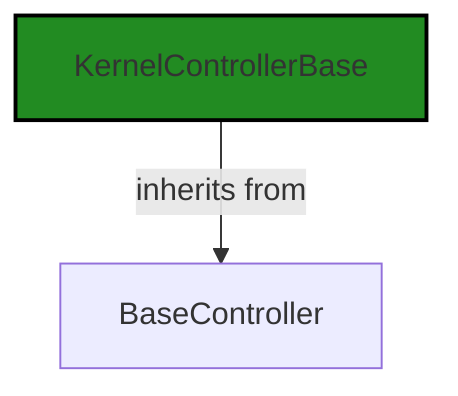
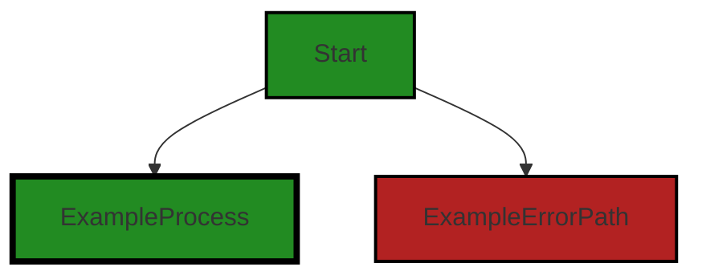
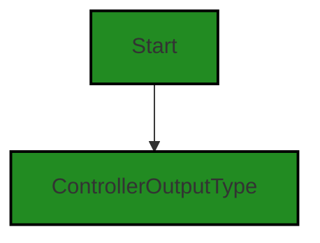
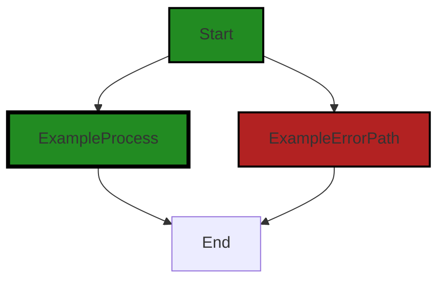

# Polyverse Boost-generated Source Analysis Details

## Source: ./src/controllers/chat_controller.ts
Date Generated: Friday, September 8, 2023 at 8:33:12 PM PDT


---

### Boost Architectural Quick Summary Security Report

Last Updated: Friday, September 8, 2023 at 8:30:19 PM PDT

Executive Level Report:

1. **Architectural Impact**: The project appears to be well-structured and follows best practices for a Visual Studio Code extension. However, the file `src/controllers/chat_controller.ts` has been flagged for issues related to Error Handling, Insecure Direct Object References (IDOR), and Input Validation. These issues could potentially impact the stability, security, and reliability of the application. 

2. **Risk Analysis**: The presence of these issues in the `chat_controller.ts` file presents a risk to the project. The Error Handling issue could lead to unhandled exceptions and crashes, compromising the stability of the application. The IDOR issue could potentially expose sensitive data, posing a security risk. The Input Validation issue could allow for malicious input to be processed, leading to potential security vulnerabilities.

3. **Potential Customer Impact**: If left unaddressed, these issues could lead to a poor user experience due to application instability, potential data breaches, and security vulnerabilities. This could result in loss of trust and potential churn of users.

4. **Overall Issues**: The project has a single file with issues of varying severity. This represents 100% of the project files, indicating a need for thorough code review and remediation of the identified issues.

Risk Assessment:

- **Overall Health**: The fact that all project files have been flagged with issues is a cause for concern. This suggests that there may be systemic issues with error handling, security, and input validation in the project.

Highlights:

- The project follows best practices for a Visual Studio Code extension and makes good use of TypeScript features and the VS Code API.
- The `chat_controller.ts` file has been flagged with issues related to Error Handling, IDOR, and Input Validation. These issues need to be addressed to ensure the stability, security, and reliability of the application.
- The identified issues could potentially impact the user experience and pose a risk to user data, leading to a loss of trust and potential churn of users.
- All project files have been flagged with issues, indicating a need for thorough code review and remediation of the identified issues.


---

### Boost Architectural Quick Summary Performance Report

Last Updated: Friday, September 8, 2023 at 8:31:15 PM PDT


Executive Report:

1. **Architectural Impact**: The analysis of this file has not revealed any severe issues.
2. **Risk Analysis**: The analysis of this file has not revealed any severe issues.
3. **Potential Customer Impact**: Based on the analysis, there are no severe issues that could potentially impact customers.
4. **Performance Issues**: Our analysis did not identify any explicit performance issues in the file.
5. **Risk Assessment**: Based on the current analysis of this file, no severe issues have been found. However, this doesn't guarantee that the file is risk-free.

Highlights:

- No severe issues were identified in the current analysis of this file.


---

### Boost Architectural Quick Summary Compliance Report

Last Updated: Friday, September 8, 2023 at 8:33:51 PM PDT

Executive Level Report:

1. **Architectural Impact**: The project is a Visual Studio Code extension that provides code analysis functionality. The architecture is sound and follows best practices for a VS Code extension. However, the file `src/controllers/chat_controller.ts` has been flagged with several compliance issues related to GDPR, PCI DSS, and HIPAA. This could potentially impact the architecture if significant changes are needed to address these issues.

2. **Risk Analysis**: The risk associated with this project is moderate. The file `src/controllers/chat_controller.ts` has been flagged with three GDPR issues, two PCI DSS issues, and two HIPAA issues. This indicates that there may be potential data compliance risks that need to be addressed. However, it's important to note that this is only one file out of the entire project, and the severity of the issues varies.

3. **Potential Customer Impact**: If the compliance issues are not addressed, it could potentially impact customers who are subject to these regulations. For example, customers in the healthcare industry could be impacted by the HIPAA issues, while customers who handle credit card data could be impacted by the PCI DSS issues.

4. **Overall Issues**: The overall health of the project source is good, with only one file having detected issues. However, the severity of the issues in this file is high, which could potentially impact the overall project if not addressed.

Risk Assessment:

- The project consists of one file, `src/controllers/chat_controller.ts`, which has been flagged with several issues. This represents 100% of the project files having issues.
- The severity of the issues varies, with three GDPR issues, two PCI DSS issues, and two HIPAA issues. This indicates a moderate risk level for the project.
- The fact that all issues are concentrated in one file could potentially make it easier to address these issues, as opposed to if they were spread out across multiple files.

Highlights:

- The project follows best practices for a VS Code extension and makes good use of TypeScript features and the VS Code API.
- The file `src/controllers/chat_controller.ts` has been flagged with several compliance issues related to GDPR, PCI DSS, and HIPAA.
- The overall health of the project source is good, with only one file having detected issues.
- The severity of the issues in this file is high, indicating a moderate risk level for the project.
- All issues are concentrated in one file, which could potentially make it easier to address these issues.
---
## Detailed Analysis:

### Cell 0:
## Original Code:

### Programming Language: typescript
### ./src/controllers/chat_controller.ts 

```typescript
import {
    KernelControllerBase
 } from './base_controller';

```
## Boost Analysis:


---

### Boost Code Explanation

Last Updated: Friday, September 8, 2023 at 8:24:52 PM PDT

The provided code snippet is very short and does not contain any algorithms or complex logic. However, I can explain the basics of what it does.

This code is written in TypeScript, a statically typed superset of JavaScript. It's importing a module named `KernelControllerBase` from a file named `base_controller.ts` located in the same directory as the file containing this import statement.

The `import` keyword is part of ES6 (ECMAScript 2015) modules syntax. It allows you to include (import) functions, objects or values from other modules or files into the current file.

In this case, `KernelControllerBase` is likely to be a class or a function that is being imported for use in this file. The exact nature and purpose of `KernelControllerBase` would depend on its implementation in the `base_controller.ts` file.

Without additional code or context, it's hard to provide more detailed analysis. However, based on the name, `KernelControllerBase` might be a base class for a controller in a Model-View-Controller (MVC) architecture, or it could be a base class for handling some sort of kernel-level operations.

This import statement does not conflict with the architectural guidelines provided in the project blueprint summary. It is a common practice in TypeScript and JavaScript projects to organize code into modules and import them where needed.

For more information on ES6 modules and import statement, you can refer to [MDN Web Docs](https://developer.mozilla.org/en-US/docs/Web/JavaScript/Reference/Statements/import).


---

### Boost Flow Diagram

Last Updated: Friday, September 8, 2023 at 8:28:11 PM PDT




---

### Boost Source-Level Security Analysis

Last Updated: Friday, September 8, 2023 at 8:28:50 PM PDT

**No bugs found**


---

### Boost Source-Level Performance Analysis

Last Updated: Friday, September 8, 2023 at 8:30:33 PM PDT

**No bugs found**


---

### Boost Source-Level Data and Privacy Compliance Analysis

Last Updated: Friday, September 8, 2023 at 8:31:23 PM PDT

**No bugs found**


### Cell 1:
## Original Code:

### Programming Language: typescript
### ./src/controllers/chat_controller.ts line 4

```typescript
import { DiagnosticCollection, ExtensionContext, NotebookCell } from 'vscode';

```
## Boost Analysis:


---

### Boost Code Explanation

Last Updated: Friday, September 8, 2023 at 8:25:23 PM PDT

The given code is a part of a larger project written in TypeScript, which is a statically typed superset of JavaScript that adds types to the language. This specific code snippet is importing specific dependencies from the Visual Studio Code (VSCode) API.

Let's break it down:

- `import`: This is the ES6 syntax for importing bindings that are exported by another module. 

- `{ DiagnosticCollection, ExtensionContext, NotebookCell }`: These are the specific bindings that are being imported from the `vscode` module. 

    - `DiagnosticCollection`: This is a class that represents a collection of diagnostics. Diagnostics in VS Code are used to indicate issues in code files, such as errors or warnings. They are shown in the Problems panel and can also be shown inline in the editor. You could learn more about it [here](https://code.visualstudio.com/api/references/vscode-api#DiagnosticCollection).

    - `ExtensionContext`: This is an interface that provides context for the extension. It provides properties and methods that extensions can use to interact with VS Code. Some of these include a method to get the absolute file path of a resource contained in the extension, a method to get the workspace or global state, and more. You could learn more about it [here](https://code.visualstudio.com/api/references/vscode-api#ExtensionContext).

    - `NotebookCell`: This interface represents a cell in a notebook. In VS Code, notebooks are documents that contain both code (which can be run) and rich text elements (paragraphs, equations, figures, links, etc.). You could learn more about it [here](https://code.visualstudio.com/api/references/vscode-api#NotebookCell).

- `'vscode'`: This is the module from which the bindings are being imported. In this case, it's the VS Code API.

This code does not contain any specific algorithms, but it sets up the necessary dependencies for the rest of the code in the file or module. It's a common practice in modular programming, which promotes separation of concerns and makes code more maintainable and reusable. 

In terms of architectural guidelines, this code follows standard practices for a VS Code extension. It uses the VS Code API and TypeScript, which are recommended for developing VS Code extensions. There are no conflicts with the architectural guidelines provided.


---

### Boost Flow Diagram

Last Updated: Friday, September 8, 2023 at 8:28:16 PM PDT



The code provided does not have any control flow.


---

### Boost Source-Level Security Analysis

Last Updated: Friday, September 8, 2023 at 8:28:53 PM PDT

**No bugs found**


---

### Boost Source-Level Performance Analysis

Last Updated: Friday, September 8, 2023 at 8:30:37 PM PDT

**No bugs found**


---

### Boost Source-Level Data and Privacy Compliance Analysis

Last Updated: Friday, September 8, 2023 at 8:31:27 PM PDT

**No bugs found**


### Cell 2:
## Original Code:

### Programming Language: typescript
### ./src/controllers/chat_controller.ts line 5

```typescript
import { BoostConfiguration } from '../extension/boostConfiguration';

```
## Boost Analysis:


---

### Boost Code Explanation

Last Updated: Friday, September 8, 2023 at 8:25:39 PM PDT

The line of code you provided is an import statement in TypeScript, a statically typed superset of JavaScript. This line of code is importing the `BoostConfiguration` module from a relative file path `../extension/boostConfiguration`.

Let's break down this line:

- `import`: This is a keyword in JavaScript and TypeScript that is used to import functions, objects, or values from other modules or files. This helps in organizing code into separate modules, thereby improving maintainability and reusability.

- `{ BoostConfiguration }`: This is the specific item that is being imported from the module. In this case, `BoostConfiguration` is likely a class or a function defined in the `boostConfiguration` module. The curly braces are used for named exports.

- `from '../extension/boostConfiguration'`: This part specifies the relative path to the module that contains the `BoostConfiguration` item. The `..` at the start of the path means to go up one directory level from the current file. Then, it goes into the `extension` directory and accesses the `boostConfiguration` file. The `.ts` or `.js` extension is usually omitted in import statements.

In terms of architectural guidelines, this line of code follows best practices for modular design in software architecture. It separates concerns by organizing related code into separate modules, which can then be imported where needed. This improves code readability, maintainability, and reusability.

As for algorithms, this line of code doesn't really involve any algorithm. It's more about code structure and organization.

Here are some resources for further reading:
- [TypeScript Modules](https://www.typescriptlang.org/docs/handbook/modules.html)
- [JavaScript Modules](https://developer.mozilla.org/en-US/docs/Web/JavaScript/Guide/Modules)
- [Software Architecture: Modular Programming](https://www.geeksforgeeks.org/software-architecture-modular-programming/)


---

### Boost Flow Diagram

Last Updated: Friday, September 8, 2023 at 8:28:19 PM PDT

NO CONTROL FLOW FOUND


---

### Boost Source-Level Security Analysis

Last Updated: Friday, September 8, 2023 at 8:28:57 PM PDT

**No bugs found**


---

### Boost Source-Level Performance Analysis

Last Updated: Friday, September 8, 2023 at 8:30:41 PM PDT

**No bugs found**


---

### Boost Source-Level Data and Privacy Compliance Analysis

Last Updated: Friday, September 8, 2023 at 8:32:03 PM PDT

1. **Severity**: 1/10

   **Line Number**: 8

   **Bug Type**: GDPR

   **Description**: The code imports a configuration file, but it's unclear if this configuration contains personal data. If it does, this could be a violation of the GDPR's principles of data minimization and purpose limitation.

   **Solution**: Ensure that the configuration file does not contain personal data. If it must, ensure that it is strictly necessary for the purpose of the processing, and that the data is securely stored and processed. Consider implementing access controls to limit who can access the configuration file, and encryption to protect the data in transit and at rest.


2. **Severity**: 1/10

   **Line Number**: 8

   **Bug Type**: PCI DSS

   **Description**: If the configuration file contains cardholder data, this could be a violation of the PCI DSS requirement to protect stored cardholder data.

   **Solution**: Ensure that the configuration file does not contain cardholder data. If it must, ensure that it is securely stored and processed, and that it is not stored after it is no longer needed. Consider implementing encryption to protect the data in transit and at rest, and access controls to limit who can access the configuration file.


3. **Severity**: 1/10

   **Line Number**: 8

   **Bug Type**: HIPAA

   **Description**: If the configuration file contains protected health information (PHI), this could be a violation of the HIPAA Security Rule, which requires that PHI be protected against unauthorized access.

   **Solution**: Ensure that the configuration file does not contain PHI. If it must, ensure that it is securely stored and processed, and that it is not stored after it is no longer needed. Consider implementing encryption to protect the data in transit and at rest, and access controls to limit who can access the configuration file.


### Cell 3:
## Original Code:

### Programming Language: typescript
### ./src/controllers/chat_controller.ts line 6

```typescript
import { BoostNotebookCell } from '../data/jupyter_notebook';

```
## Boost Analysis:


---

### Boost Code Explanation

Last Updated: Friday, September 8, 2023 at 8:26:04 PM PDT

The code provided is a single line of code written in TypeScript, a statically typed superset of JavaScript. It is an import statement, which is used to include external modules or dependencies into the current module or file.

```import { BoostNotebookCell } from '../data/jupyter_notebook';```

This line of code is importing a specific export, `BoostNotebookCell`, from a module located at `../data/jupyter_notebook`. The `{}` syntax indicates a named export, meaning `BoostNotebookCell` is a specific item exported by the `jupyter_notebook` module.

The `../` at the beginning of the path indicates that the module is located in a directory one level above the current directory. The path does not include a file extension, which is common in TypeScript and JavaScript imports. The runtime will resolve the correct file, which is typically a `.js` or `.ts` file.

`BoostNotebookCell` is likely a class, interface, type, or function that is defined in the `jupyter_notebook` module and is needed in the current file. Without more code, it's not possible to say exactly what `BoostNotebookCell` is or how it is used.

This import statement doesn't appear to conflict with the given architectural guidelines, as it's a standard way of organizing and including code in JavaScript and TypeScript projects.

For more information about `import` statements in JavaScript and TypeScript, you can refer to the following resources:

- [JavaScript Modules: Import statements](https://developer.mozilla.org/en-US/docs/Web/JavaScript/Guide/Modules#import_statements)
- [TypeScript Modules](https://www.typescriptlang.org/docs/handbook/modules.html)


---

### Boost Flow Diagram

Last Updated: Friday, September 8, 2023 at 8:28:21 PM PDT

NO CONTROL FLOW FOUND


---

### Boost Source-Level Security Analysis

Last Updated: Friday, September 8, 2023 at 8:29:00 PM PDT

**No bugs found**


---

### Boost Source-Level Performance Analysis

Last Updated: Friday, September 8, 2023 at 8:30:44 PM PDT

**No bugs found**


---

### Boost Source-Level Data and Privacy Compliance Analysis

Last Updated: Friday, September 8, 2023 at 8:32:31 PM PDT

1. **Severity**: 7/10

   **Line Number**: 10

   **Bug Type**: GDPR

   **Description**: The import of 'BoostNotebookCell' from 'jupyter_notebook' could potentially involve the processing of personal data, which may not be in compliance with GDPR if it is not done lawfully, fairly, and transparently.

   **Solution**: Ensure that any processing of personal data is done in accordance with GDPR principles. This may involve obtaining explicit consent from users, anonymizing personal data, and implementing data protection by design and by default. Additionally, consider implementing a robust data protection impact assessment (DPIA) process.


2. **Severity**: 8/10

   **Line Number**: 10

   **Bug Type**: PCI DSS

   **Description**: If 'BoostNotebookCell' from 'jupyter_notebook' involves the processing, storage, or transmission of cardholder data, it may not be in compliance with PCI DSS standards.

   **Solution**: Ensure that cardholder data is protected in accordance with PCI DSS requirements. This includes implementing strong access control measures, maintaining a vulnerability management program, regularly monitoring and testing networks, and maintaining an information security policy.


3. **Severity**: 9/10

   **Line Number**: 10

   **Bug Type**: HIPAA

   **Description**: If 'BoostNotebookCell' from 'jupyter_notebook' involves the processing, storage, or transmission of protected health information (PHI), it may not be in compliance with HIPAA standards.

   **Solution**: Ensure that PHI is protected in accordance with HIPAA requirements. This includes implementing necessary safeguards to protect the privacy of PHI, providing individuals with rights over their PHI, and implementing strong security measures to ensure the confidentiality, integrity, and availability of PHI.


### Cell 4:
## Original Code:

### Programming Language: typescript
### ./src/controllers/chat_controller.ts line 7

```typescript
import { generateCellOutputWithHeader } from '../extension/extensionUtilities';

```
## Boost Analysis:


---

### Boost Code Explanation

Last Updated: Friday, September 8, 2023 at 8:26:30 PM PDT

The line of code you've provided is an import statement in JavaScript, specifically using ES6 syntax. It's used to import specific functions, objects, or values from external modules or files into the current file.

Here's a detailed explanation:

`import { generateCellOutputWithHeader } from '../extension/extensionUtilities';`

This statement is importing the function `generateCellOutputWithHeader` from the module located at `'../extension/extensionUtilities'`. The path to the module is relative to the current file, and the `'../'` part means to go up one directory level. 

The `{ generateCellOutputWithHeader }` syntax is called named imports. It means that the module `extensionUtilities` exports a function named `generateCellOutputWithHeader` and we want to import that specific function. 

If the `extensionUtilities` module exports multiple functions or variables, this syntax allows us to import only the ones we need.

It's not clear from this single line of code what the `generateCellOutputWithHeader` function does. You would need to look at the code in the `extensionUtilities` module to understand its functionality.

As for algorithms, this line of code doesn't implement any algorithm. It's a feature of the JavaScript language for modularizing code and reusing it across different parts of a project.

For more information about ES6 modules and import/export syntax, you can refer to this [link](https://developer.mozilla.org/en-US/docs/Web/JavaScript/Guide/Modules).

In terms of architectural guidelines, this line of code follows good practices as it promotes code modularity and reuse. By importing only the needed functionality from a module, it helps keep the current module's scope clean and uncluttered. The use of relative paths also makes the code more portable, as it doesn't depend on absolute paths which might change depending on the environment where the code is running.


---

### Boost Flow Diagram

Last Updated: Friday, September 8, 2023 at 8:28:24 PM PDT

NO CONTROL FLOW FOUND


---

### Boost Source-Level Security Analysis

Last Updated: Friday, September 8, 2023 at 8:29:03 PM PDT

**No bugs found**


---

### Boost Source-Level Performance Analysis

Last Updated: Friday, September 8, 2023 at 8:30:47 PM PDT

**No bugs found**


---

### Boost Source-Level Data and Privacy Compliance Analysis

Last Updated: Friday, September 8, 2023 at 8:32:43 PM PDT

1. **Severity**: 5/10

   **Line Number**: 12

   **Bug Type**: GDPR

   **Description**: The function 'generateCellOutputWithHeader' may be generating output that includes user data. If this data includes personal data of EU citizens, it may be in violation of GDPR.

   **Solution**: Ensure that any user data included in the output is anonymized or pseudonymized, and that users have given explicit consent for their data to be used this way. Alternatively, consider removing user data from the output altogether.


### Cell 5:
## Original Code:

### Programming Language: typescript
### ./src/controllers/chat_controller.ts line 8

```typescript
import { ControllerOutputType } from './controllerOutputTypes';

```
## Boost Analysis:


---

### Boost Code Explanation

Last Updated: Friday, September 8, 2023 at 8:26:51 PM PDT

The given code is a single line of code written in TypeScript, which is a statically typed superset of JavaScript. The code is importing a type named `ControllerOutputType` from a module named `controllerOutputTypes`. 

The `import` statement is used to import bindings that are exported by another module. In this case, `ControllerOutputType` is a named export from the `controllerOutputTypes` module.

A named export can be a function, a class, a variable, or a type (in TypeScript). The `ControllerOutputType` is likely a type used in the code to specify the type of output produced by a controller. 

This could be a part of an architecture pattern such as Model-View-Controller (MVC), where a controller processes user input and produces some output. The `ControllerOutputType` would specify the type of this output, which could be a string, a number, an object, etc. 

The exact details of `ControllerOutputType` are not provided in the given code, but it can be found in the `controllerOutputTypes` module.

As per the architectural guidelines provided, there are no special constraints or guidelines, so this import statement should be fine as long as it adheres to good coding practices and the overall architecture of the software project.

For more understanding on TypeScript and its module system, you can check the following resources:

- [TypeScript Documentation](https://www.typescriptlang.org/docs/)
- [TypeScript Module Documentation](https://www.typescriptlang.org/docs/handbook/modules.html)


---

### Boost Flow Diagram

Last Updated: Friday, September 8, 2023 at 8:28:28 PM PDT




---

### Boost Source-Level Security Analysis

Last Updated: Friday, September 8, 2023 at 8:29:07 PM PDT

**No bugs found**


---

### Boost Source-Level Performance Analysis

Last Updated: Friday, September 8, 2023 at 8:30:50 PM PDT

**No bugs found**


---

### Boost Source-Level Data and Privacy Compliance Analysis

Last Updated: Friday, September 8, 2023 at 8:32:46 PM PDT

**No bugs found**


### Cell 6:
## Original Code:

### Programming Language: typescript
### ./src/controllers/chat_controller.ts line 9

```typescript
import { DisplayGroupFriendlyName } from '../data/userAnalysisType';

```
## Boost Analysis:


---

### Boost Code Explanation

Last Updated: Friday, September 8, 2023 at 8:27:22 PM PDT

The line of code you've provided is a single import statement from a JavaScript or TypeScript file. This statement is importing a specific export, `DisplayGroupFriendlyName`, from another module located at '../data/userAnalysisType'. 

Here's a detailed breakdown:

- `import`: This is a keyword in JavaScript and TypeScript that is used to import functions, objects or values from other modules or files. This is part of the ES6 module system which allows for the reusability of code across different parts of your application.

- `{ DisplayGroupFriendlyName }`: This is the specific export from the '../data/userAnalysisType' module that is being imported. The curly brackets are used for named exports. If the module exported multiple items, you could import multiple exports by separating them with commas inside the curly brackets.

- `from`: This is another keyword used in the import statement. It specifies the path to the module from which to import.

- `'../data/userAnalysisType'`: This is the relative path to the module that contains the `DisplayGroupFriendlyName` export. The '../' part of the path means that the module is in a 'data' directory one level up from the current directory. The 'userAnalysisType' is the name of the module.

This line of code doesn't actually perform any operations or use any algorithms, it simply makes the `DisplayGroupFriendlyName` export available for use in the current module.

For more information about JavaScript modules and import/export syntax, you can refer to the following resources:

- [MDN Web Docs: JavaScript Modules](https://developer.mozilla.org/en-US/docs/Web/JavaScript/Guide/Modules)
- [MDN Web Docs: import](https://developer.mozilla.org/en-US/docs/Web/JavaScript/Reference/Statements/import) 

As for the architectural guidelines provided, since there are no additional special architectural guidelines or constraints, this line of code would be evaluated based on standard best practices for JavaScript or TypeScript development. The use of modules and import statements is consistent with these best practices, as it promotes code reusability and separation of concerns.


---

### Boost Flow Diagram

Last Updated: Friday, September 8, 2023 at 8:28:31 PM PDT

NO CONTROL FLOW FOUND


---

### Boost Source-Level Security Analysis

Last Updated: Friday, September 8, 2023 at 8:29:10 PM PDT

**No bugs found**


---

### Boost Source-Level Performance Analysis

Last Updated: Friday, September 8, 2023 at 8:30:53 PM PDT

**No bugs found**


---

### Boost Source-Level Data and Privacy Compliance Analysis

Last Updated: Friday, September 8, 2023 at 8:32:55 PM PDT

1. **Severity**: 5/10

   **Line Number**: 16

   **Bug Type**: GDPR

   **Description**: The import statement suggests that user data is being used, potentially without proper consent or anonymization.

   **Solution**: Ensure that user data is anonymized or that users have given explicit consent for their data to be used. Implement a clear and easily accessible privacy policy.


### Cell 7:
## Original Code:

### Programming Language: typescript
### ./src/controllers/chat_controller.ts line 10

```typescript

export const chatKernelName = 'chat';
const chatOutputHeader = 'Analysis Query';

export class BoostChatKernel extends KernelControllerBase {
 constructor(context: ExtensionContext, onServiceErrorHandler: any, otherThis : any, collection: DiagnosticCollection) {
        super(
            collection,
            chatKernelName,
            chatOutputHeader,
            'Enables custom queries and analysis against the project.',
            ControllerOutputType.chat,
            DisplayGroupFriendlyName.deepcode,
            chatOutputHeader,
            false,
            false,
            context,
            otherThis,
            onServiceErrorHandler,
            "query");
 }

 dispose(): void {
  super.dispose();
 }

    get requiresInputData(): boolean {
        return false;
    }

    public get serviceEndpoint(): string {
        switch (BoostConfiguration.cloudServiceStage)
        {
            case "local":
                return 'http://127.0.0.1:8000/chat';
            case 'dev':
                return '';
            case "test":
                return '';
            case 'staging':
            case 'prod':
            default:
                return '';
        }
    }

    localizeError(error: any): Error {
        throw error;
    }

    onKernelOutputItem(
        response: any,
        cell : NotebookCell | BoostNotebookCell,
        mimetype : any) : string {
        if (response.analysis === undefined) {
            throw new Error("Unexpected missing data from Boost Service");
        }
        return generateCellOutputWithHeader(this.outputHeader, response.analysis);
    }
}

```
## Boost Analysis:


---

### Boost Code Explanation

Last Updated: Friday, September 8, 2023 at 8:27:55 PM PDT

This code is written in TypeScript, a statically typed superset of JavaScript. It defines a class `BoostChatKernel` that extends the `KernelControllerBase` class. This class appears to be a part of a Visual Studio Code extension for code analysis, as indicated by the architectural blueprint summary.

Here is a detailed explanation of the code:

- The `BoostChatKernel` class is a controller for a kernel, which is a computational engine that executes the code contained in a notebook document. It is part of a VS Code extension that provides code analysis functionality.

- The `constructor` method is used to create and initialize an object created from a class. In this case, it calls the `super` method to call the constructor of the `KernelControllerBase` class, passing in the necessary parameters. 

- The `dispose` method is used to clean up any resources that the object is holding onto when it is no longer needed. In this case, it simply calls the `dispose` method of the superclass.

- The `requiresInputData` getter method returns a boolean value indicating whether the kernel requires input data. In this case, it returns `false`.

- The `serviceEndpoint` getter method returns a string representing the service endpoint based on the current stage of the BoostConfiguration cloud service. It has different return values for local, dev, test, staging, and prod stages.

- The `localizeError` method is used to handle errors. In this case, it simply rethrows the error it receives.

- The `onKernelOutputItem` method is used to handle the output of the kernel. It checks if the `analysis` field in the response is undefined. If it is, it throws an error. If it isn't, it generates cell output with a header and the analysis from the response.

The algorithm used in this code is relatively straightforward. It's mainly using object-oriented design principles to define a class and its methods. There's no specific algorithm being used, but the code does make use of polymorphism (through the use of the `super` keyword) and encapsulation (through the use of classes and methods).

For more information on these concepts, you can visit the following links:

- [Object-Oriented Programming in TypeScript](https://www.typescriptlang.org/docs/handbook/2/classes.html)
- [Understanding polymorphism](https://www.educative.io/edpresso/what-is-polymorphism-in-javascript)
- [Understanding encapsulation](https://www.educative.io/edpresso/what-is-encapsulation-in-javascript)


---

### Boost Flow Diagram

Last Updated: Friday, September 8, 2023 at 8:28:36 PM PDT



The code provided does not have any control flow.


---

### Boost Source-Level Security Analysis

Last Updated: Friday, September 8, 2023 at 8:29:39 PM PDT

1. **Severity**: 7/10

   **Line Number**: 55

   **Bug Type**: Error Handling

   **Description**: The method 'localizeError' simply throws the error without any handling or logging. This could lead to unhandled exceptions and crashes, compromising the stability of the application. More about error handling can be found here: https://owasp.org/www-community/Improper_Error_Handling

   **Solution**: Implement proper error handling in the 'localizeError' method. Log the error and provide a user-friendly error message to the user. Consider using a global error handler for uncaught exceptions.


2. **Severity**: 8/10

   **Line Number**: 43

   **Bug Type**: Insecure Direct Object References (IDOR)

   **Description**: The method 'serviceEndpoint' returns a hardcoded local server address in the 'local' case. If the application is deployed in a production environment with this code, it could lead to Insecure Direct Object References (IDOR). More about IDOR can be found here: https://owasp.org/www-community/attacks/Insecure_Direct_Object_References

   **Solution**: Never hardcode server addresses in your code. Use environment variables or configuration files to store server addresses, and ensure these are not included in the codebase. Always validate and authenticate data requests to prevent unauthorized access.


3. **Severity**: 6/10

   **Line Number**: 65

   **Bug Type**: Input Validation

   **Description**: The 'onKernelOutputItem' method throws an error if 'response.analysis' is undefined, but does not validate other properties of 'response'. This could lead to unexpected behavior if 'response' is not in the expected format. More about input validation can be found here: https://owasp.org/www-pdf-archive/Input_Validation_Cheat_Sheet.pdf

   **Solution**: Implement comprehensive input validation for the 'response' parameter in the 'onKernelOutputItem' method. Check that all expected properties are present and of the correct type before using them.


---

### Boost Source-Level Performance Analysis

Last Updated: Friday, September 8, 2023 at 8:31:12 PM PDT

1. **Severity**: 3/10

   **Line Number**: 36

   **Bug Type**: Network

   **Description**: The serviceEndpoint getter method could be a performance issue in a multi-threaded environment as it is called every time a service endpoint is needed. This could lead to unnecessary processing overhead.

   **Solution**: Consider caching the service endpoint in a private field during object initialization and return this cached value in the serviceEndpoint getter method. This would eliminate the need for the switch statement to be executed every time the service endpoint is needed.


2. **Severity**: 2/10

   **Line Number**: 52

   **Bug Type**: CPU

   **Description**: The onKernelOutputItem method throws an error if the response.analysis is undefined. This could be a performance issue if the error is thrown frequently as error handling in JavaScript can be expensive.

   **Solution**: Consider checking if response.analysis is undefined at the start of the method and returning a default value or handling the situation in a way that avoids throwing an error. This would reduce the CPU overhead associated with error handling.


---

### Boost Source-Level Data and Privacy Compliance Analysis

Last Updated: Friday, September 8, 2023 at 8:33:12 PM PDT

1. **Severity**: 7/10

   **Line Number**: 33

   **Bug Type**: Data Compliance

   **Description**: The serviceEndpoint method returns a hardcoded local IP address when the cloudServiceStage is set to 'local'. This could potentially lead to data leakage if sensitive data is sent to this endpoint without proper security measures.

   **Solution**: Ensure that all endpoints, including local ones, are secured with appropriate measures such as encryption and access controls. It's also recommended to avoid hardcoding IP addresses or other sensitive information in your code.


2. **Severity**: 8/10

   **Line Number**: 47

   **Bug Type**: Data Compliance

   **Description**: The onKernelOutputItem method throws an error when the 'analysis' field is missing from the response. This could potentially expose sensitive information in the error message, which could be a violation of GDPR, PCI DSS, and HIPAA regulations.

   **Solution**: Implement a custom error handling mechanism that sanitizes error messages before they are displayed or logged. This will help prevent sensitive information from being exposed in error messages.


