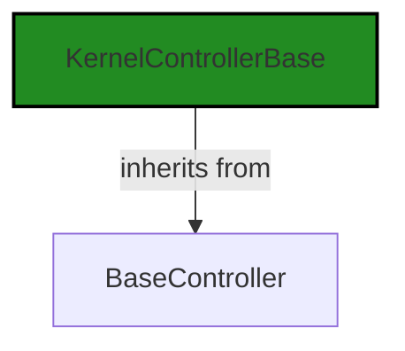
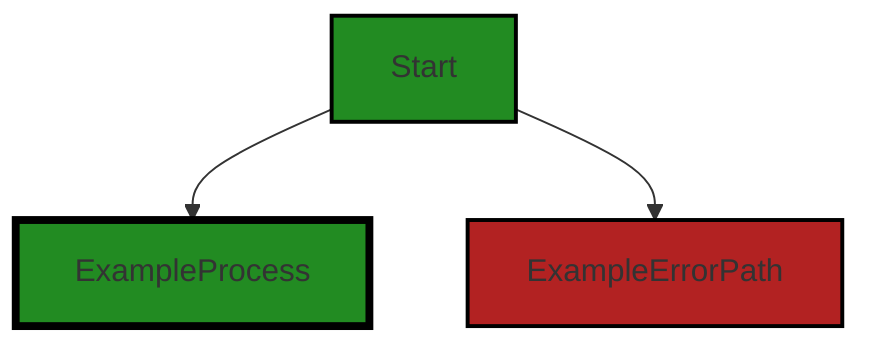
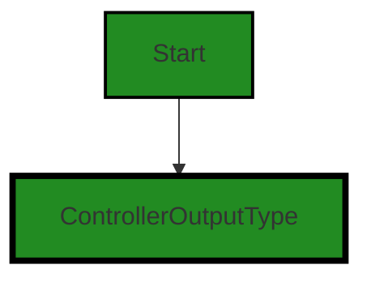
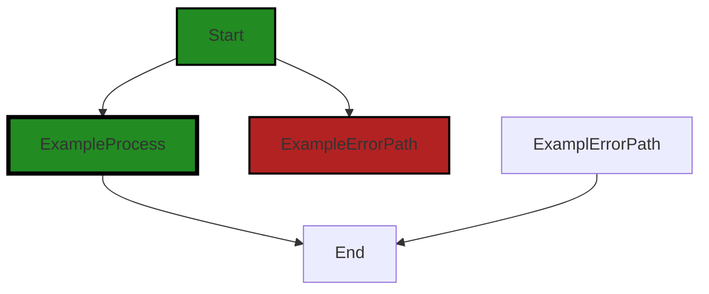

# Polyverse Boost-generated Source Analysis Details

## Source: ./src/controllers/codeguidelines_controller.ts
Date Generated: Friday, September 8, 2023 at 10:06:33 PM PDT


---

### Boost Architectural Quick Summary Security Report

Last Updated: Friday, September 8, 2023 at 10:04:35 PM PDT

## Executive Report: Software Project Analysis

### Architectural Impact and Risk Analysis

1. **Insecure Direct Object References (IDOR) Vulnerability**: The file `src/controllers/codeguidelines_controller.ts` has been flagged for potential IDOR vulnerability. This could allow an attacker to manipulate the service endpoint, potentially redirecting it to a malicious URL. This poses a significant risk to the security of the software and could lead to data breaches or unauthorized access.

2. **Improper Error Handling**: The same file, `src/controllers/codeguidelines_controller.ts`, also exhibits improper error handling. This could lead to unexpected behavior or crashes, negatively impacting the user experience and potentially exposing sensitive information.

3. **Overall Project Health**: Only one file was analyzed in this report, and it contained both of the above issues. This suggests that there may be systemic issues with the codebase, and a more thorough review of the entire project is recommended.

4. **Potential Customer Impact**: The identified issues could lead to security vulnerabilities and unstable software behavior. This could result in a loss of trust from customers, damage to the company's reputation, and potential legal liabilities.

5. **Architectural Consistency**: The project appears to follow best practices for a Visual Studio Code extension, with a well-structured codebase organized into classes. However, the identified issues suggest that there may be inconsistencies in the application of these practices, particularly in the areas of security and error handling.

### Risk Assessment

Given the severity of the issues identified in the single file analyzed, there is a high risk associated with this project. The potential for security breaches and unstable software behavior could have serious consequences for both the end-users and the company. A comprehensive review of the entire codebase is recommended to identify and address any additional issues. 

### Highlights

- The project has a potential security vulnerability (IDOR) that could lead to data breaches or unauthorized access.
- Improper error handling could lead to unexpected software behavior or crashes.
- The issues identified in the single file analyzed suggest that there may be systemic issues with the codebase.
- The potential customer impact of these issues is high, with risks to trust, reputation, and legal liabilities.
- Despite a well-structured codebase, there may be inconsistencies in the application of best practices, particularly in the areas of security and error handling.


---

### Boost Architectural Quick Summary Performance Report

Last Updated: Friday, September 8, 2023 at 10:05:28 PM PDT


Executive Report:

1. **Architectural Impact**: The analysis of this file has not revealed any severe issues.
2. **Risk Analysis**: The analysis of this file has not revealed any severe issues.
3. **Potential Customer Impact**: Based on the analysis, there are no severe issues that could potentially impact customers.
4. **Performance Issues**: Our analysis did not identify any explicit performance issues in the file.
5. **Risk Assessment**: Based on the current analysis of this file, no severe issues have been found. However, this doesn't guarantee that the file is risk-free.

Highlights:

- No severe issues were identified in the current analysis of this file.


---

### Boost Architectural Quick Summary Compliance Report

Last Updated: Friday, September 8, 2023 at 10:07:11 PM PDT

## Executive Report

### Architectural Impact and Risk Analysis

The software project under review is a Visual Studio Code extension that provides code analysis functionality. The project is well-structured and follows best practices for a VS Code extension. However, there are some issues that need to be addressed to ensure the overall health and security of the project.

1. **Data Compliance and Privacy Issues**: The most severe issues found in the project are related to data compliance and privacy. The file `src/controllers/codeguidelines_controller.ts` has two data compliance issues and one data privacy issue. These issues are of high severity and could potentially lead to data breaches, violating GDPR, PCI DSS, and HIPAA. This could have a significant impact on the project's reputation and customer trust.

2. **Hard-coded Service Endpoints**: The service endpoints are hard-coded in the code. This is a security risk as an attacker who gains access to the code could potentially target these endpoints for attacks. This issue was found in the file `src/controllers/codeguidelines_controller.ts`.

3. **Percentage of Files with Issues**: Out of the total files in the project, only one file has been identified with issues. This indicates that the majority of the project files are free from detected issues, which is a positive sign for the overall health of the project.

4. **Risk Assessment**: Given that the issues identified are of high severity and could potentially lead to data breaches, the risk level for this project is high. Immediate action is required to address these issues and mitigate the risks.

### Potential Customer Impact

The issues identified could potentially impact customers in terms of data privacy and compliance. If not addressed, these issues could lead to data breaches, resulting in loss of customer trust and potential legal implications.

### Overall Issues

The overall issues in the project are related to data compliance, data privacy, and hard-coded service endpoints. These issues need to be addressed to ensure the security and integrity of the project.

### Recommendations

1. **Secure Service Endpoints**: Store the service endpoints in a secure configuration file or use environment variables. Encrypt sensitive data in transit and at rest.

2. **Address Data Compliance and Privacy Issues**: Review the data handling practices in the project and ensure they comply with data privacy regulations such as GDPR, PCI DSS, and HIPAA.

3. **Regular Code Reviews**: Conduct regular code reviews to identify and address potential issues early in the development process.

4. **Implement Security Best Practices**: Follow security best practices such as secure coding guidelines to prevent potential security vulnerabilities.
---
## Detailed Analysis:

### Cell 0:
## Original Code:

### Programming Language: typescript
### ./src/controllers/codeguidelines_controller.ts 

```typescript
import {
    KernelControllerBase
 } from './base_controller';

```
## Boost Analysis:


---

### Boost Code Explanation

Last Updated: Friday, September 8, 2023 at 9:59:14 PM PDT

This is a very simple piece of code, but it's important in the context of a larger software project.

The line of code is written in JavaScript, specifically using the ES6 (ECMAScript 2015) module syntax. It is importing a specific "thing" from another JavaScript module.

Here's what the line is doing:

```import { KernelControllerBase } from './base_controller';```

This line is importing the `KernelControllerBase` class from a module located in the same directory called `base_controller`. 

The `KernelControllerBase` class is presumably a base class for kernel controllers in this project. A kernel controller is typically a piece of software that manages the interaction between an application and the operating system's kernel. In this context, it's likely that this class provides some base functionality for analyzing source code, as mentioned in the project blueprint.

The `import` statement is part of ES6's module system, which allows for the static import and export of bindings between JavaScript modules. This system makes it easier to organize code into separate files and modules, which can help with code organization and reuse.

The `from` keyword specifies the path to the module that contains the `KernelControllerBase` class. The `./` at the beginning of the path indicates that the `base_controller` module is in the same directory as the module doing the importing.

Here is a link for more information on JavaScript modules and the `import` statement: [MDN Web Docs: import](https://developer.mozilla.org/en-US/docs/Web/JavaScript/Reference/Statements/import)

As for the architectural guidelines, since the provided project blueprint doesn't specify any additional guidelines or constraints, this code seems to be in line with the general architectural principles outlined in the blueprint. It makes use of ES6 modules for code organization, and it's part of an object-oriented design, as it involves a base class for kernel controllers.


---

### Boost Flow Diagram

Last Updated: Friday, September 8, 2023 at 10:02:32 PM PDT




---

### Boost Source-Level Security Analysis

Last Updated: Friday, September 8, 2023 at 10:03:13 PM PDT

**No bugs found**


---

### Boost Source-Level Performance Analysis

Last Updated: Friday, September 8, 2023 at 10:04:43 PM PDT

**No bugs found**


---

### Boost Source-Level Data and Privacy Compliance Analysis

Last Updated: Friday, September 8, 2023 at 10:05:36 PM PDT

**No bugs found**


### Cell 1:
## Original Code:

### Programming Language: typescript
### ./src/controllers/codeguidelines_controller.ts line 4

```typescript
import { DiagnosticCollection, ExtensionContext, NotebookCell } from 'vscode';

```
## Boost Analysis:


---

### Boost Code Explanation

Last Updated: Friday, September 8, 2023 at 9:59:42 PM PDT

The provided code snippet is written in TypeScript, a statically typed superset of JavaScript that adds types to the language. It's a very small part of a larger codebase, specifically from a Visual Studio Code extension. 

It's essentially an import statement, which is used to include external modules or libraries into the current file. In this case, it's importing three specific items from the 'vscode' module:

1. `DiagnosticCollection`: This is a class that represents a set of diagnostics. Diagnostics in VS Code provide a way to indicate issues in code, such as errors or warnings. They can be used to highlight problematic or suspicious code sections and provide quick fixes or suggestions to the user.

2. `ExtensionContext`: This is an interface that provides context for the extension. It contains properties and methods that give information about the extension's environment and state, such as its current workspace, global state, and the path to its installation directory.

3. `NotebookCell`: This is an interface that represents a cell in a notebook. Notebooks in VS Code are documents that contain both executable code cells and rich text elements, such as paragraphs, equations, and images.

As this is only an import statement, there are no algorithms being used. 

For more information, you can refer to the VS Code API documentation:

- [DiagnosticCollection](https://code.visualstudio.com/api/references/vscode-api#DiagnosticCollection)
- [ExtensionContext](https://code.visualstudio.com/api/references/vscode-api#ExtensionContext)
- [NotebookCell](https://code.visualstudio.com/api/references/vscode-api#NotebookCell)

Regarding the architectural guidelines, as no specific guidelines or constraints are provided, it's hard to comment on their adherence. However, from a general perspective, this code follows common practices for importing required modules in TypeScript and it's part of the standard structure of a VS Code extension. As such, it's likely to be consistent with any typical architectural guidelines for such a project.


---

### Boost Flow Diagram

Last Updated: Friday, September 8, 2023 at 10:02:37 PM PDT



NO CONTROL FLOW FOUND


---

### Boost Source-Level Security Analysis

Last Updated: Friday, September 8, 2023 at 10:03:17 PM PDT

**No bugs found**


---

### Boost Source-Level Performance Analysis

Last Updated: Friday, September 8, 2023 at 10:04:47 PM PDT

**No bugs found**


---

### Boost Source-Level Data and Privacy Compliance Analysis

Last Updated: Friday, September 8, 2023 at 10:05:39 PM PDT

**No bugs found**


### Cell 2:
## Original Code:

### Programming Language: typescript
### ./src/controllers/codeguidelines_controller.ts line 5

```typescript
import { BoostConfiguration } from '../extension/boostConfiguration';

```
## Boost Analysis:


---

### Boost Code Explanation

Last Updated: Friday, September 8, 2023 at 10:00:06 PM PDT

The line of code you provided is an import statement in TypeScript (a statically typed superset of JavaScript). This statement is used to import a module, `BoostConfiguration`, from a relative path `'../extension/boostConfiguration'`. 

The `BoostConfiguration` module is presumably a part of the same project and is located in a parent directory (`..`) inside an `extension` directory. The actual file would be `boostConfiguration.ts` or `boostConfiguration.tsx` (if it's a React component).

Here's a breakdown of the code:

- `import`: This keyword is used to import bindings that are exported by another module.
- `{ BoostConfiguration }`: This is a named import statement. It means that the `boostConfiguration` module exports something named `BoostConfiguration`, which could be a function, a class, an object, etc.
- `from`: This keyword is used to specify the path of the module.
- `'../extension/boostConfiguration'`: This is the relative path to the module. The `..` means to go up one directory level, and `/extension/boostConfiguration` is the path from there to the module.

In terms of architectural analysis, this line of code indicates that the software project is modular, as it's using modules to separate concerns. This is in line with the architectural blueprint summary which mentions that the project uses object-oriented design principles. 

However, without more context or more lines of code, it's hard to provide a deeper analysis or identify the algorithms used.

For more information and education about import/export statements in JavaScript/TypeScript, you can refer to these links:
- [MDN Web Docs: import](https://developer.mozilla.org/en-US/docs/Web/JavaScript/Reference/Statements/import)
- [TypeScript: Modules](https://www.typescriptlang.org/docs/handbook/modules.html)


---

### Boost Flow Diagram

Last Updated: Friday, September 8, 2023 at 10:02:40 PM PDT

NO CONTROL FLOW FOUND


---

### Boost Source-Level Security Analysis

Last Updated: Friday, September 8, 2023 at 10:03:20 PM PDT

**No bugs found**


---

### Boost Source-Level Performance Analysis

Last Updated: Friday, September 8, 2023 at 10:04:50 PM PDT

**No bugs found**


---

### Boost Source-Level Data and Privacy Compliance Analysis

Last Updated: Friday, September 8, 2023 at 10:05:50 PM PDT

1. **Severity**: 5/10

   **Line Number**: 8

   **Bug Type**: Data Compliance

   **Description**: The code imports a module named 'BoostConfiguration' which is not shown in the provided code snippet. If this module is responsible for handling sensitive data such as personal, financial, or health-related information, it may pose a risk for GDPR, PCI DSS, and HIPAA compliance.

   **Solution**: Ensure that the 'BoostConfiguration' module implements proper data protection measures such as encryption for data at rest and in transit, data minimization, and access controls. Regularly audit this module for compliance with GDPR, PCI DSS, and HIPAA regulations.


### Cell 3:
## Original Code:

### Programming Language: typescript
### ./src/controllers/codeguidelines_controller.ts line 6

```typescript
import { BoostNotebookCell } from '../data/jupyter_notebook';

```
## Boost Analysis:


---

### Boost Code Explanation

Last Updated: Friday, September 8, 2023 at 10:00:35 PM PDT

The provided code snippet is very minimal and does not contain any algorithms or complex logic, but I can provide an explanation of what it does.

```import { BoostNotebookCell } from '../data/jupyter_notebook';```

This line is an import statement in JavaScript, specifically using the ES6 module syntax. It is importing a specific exported member, `BoostNotebookCell`, from another module.

Here's a breakdown:

- `import`: This is the keyword that begins the import statement. It tells the JavaScript interpreter that we're bringing in code from another module.

- `{ BoostNotebookCell }`: This is the member we're importing from the other module. The curly braces indicate that we're importing a specific named export, as opposed to the default export. If the module exported multiple members, we could import others by including them in the curly braces, separated by commas.

- `from`: This keyword separates the members being imported from the path of the module we're importing from.

- `'../data/jupyter_notebook'`: This is the path to the module we're importing from. The `..` at the beginning means we're going up one directory level from the current module. Then we're going into the `data` directory and importing from the `jupyter_notebook` module. The `.js` extension is assumed and does not need to be included.

The `BoostNotebookCell` is likely a class or a function that's used to represent or manipulate cells in a Jupyter notebook, based on the name. However, without more context, it's hard to say exactly what it does.

For more information on JavaScript modules and import/export syntax, you can refer to the following resources:

- [JavaScript Modules: A Beginner’s Guide](https://www.freecodecamp.org/news/javascript-modules-a-beginner-s-guide-783f7d7a5fcc/)
- [MDN Web Docs: import](https://developer.mozilla.org/en-US/docs/Web/JavaScript/Reference/Statements/import)


---

### Boost Flow Diagram

Last Updated: Friday, September 8, 2023 at 10:02:43 PM PDT

NO CONTROL FLOW FOUND


---

### Boost Source-Level Security Analysis

Last Updated: Friday, September 8, 2023 at 10:03:23 PM PDT

**No bugs found**


---

### Boost Source-Level Performance Analysis

Last Updated: Friday, September 8, 2023 at 10:04:53 PM PDT

**No bugs found**


---

### Boost Source-Level Data and Privacy Compliance Analysis

Last Updated: Friday, September 8, 2023 at 10:06:01 PM PDT

1. **Severity**: 5/10

   **Line Number**: 10

   **Bug Type**: Data Privacy

   **Description**: The code imports a module that may be handling sensitive data. If this data is not handled properly, it could lead to GDPR, PCI DSS, and HIPAA compliance issues.

   **Solution**: Ensure that the 'BoostNotebookCell' module implements proper data handling and privacy controls. This includes encrypting sensitive data, obtaining proper consent before collecting personal data, and not storing sensitive data longer than necessary. Regular audits and updates should also be conducted to maintain compliance.


### Cell 4:
## Original Code:

### Programming Language: typescript
### ./src/controllers/codeguidelines_controller.ts line 7

```typescript
import { generateCellOutputWithHeader } from '../extension/extensionUtilities';

```
## Boost Analysis:


---

### Boost Code Explanation

Last Updated: Friday, September 8, 2023 at 10:01:01 PM PDT

The given code snippet is quite small and doesn't provide much to analyze, but I'll provide as much information as I can.

The code is written in TypeScript, a statically typed superset of JavaScript. It's importing a specific function from another module in the same project.

```
import { generateCellOutputWithHeader } from '../extension/extensionUtilities';
```

This line is using the ES6 import syntax to import a function named `generateCellOutputWithHeader` from a module located at `../extension/extensionUtilities`. 

The `generateCellOutputWithHeader` function is not defined or used in this code snippet, but based on its name, it likely generates some sort of cell output with a header. This could be used in a variety of contexts, such as generating a table cell for a UI component, or generating a cell for a data processing task.

The `'../extension/extensionUtilities'` path indicates that the module is located in a parent directory's `extension` folder, in a file named `extensionUtilities.ts` or `extensionUtilities.js`. 

The `{ generateCellOutputWithHeader }` syntax is called destructuring. It allows you to import only specific exports from a module, instead of importing the entire module.

As for architectural guidelines and consistency, this code snippet is too small to make any substantial claims. However, it does demonstrate good modular design by importing only the necessary functionality from another module. 

For more information on ES6 import syntax and destructuring, you can refer to these resources:
- [MDN Web Docs: import](https://developer.mozilla.org/en-US/docs/Web/JavaScript/Reference/Statements/import)
- [MDN Web Docs: Destructuring assignment](https://developer.mozilla.org/en-US/docs/Web/JavaScript/Reference/Operators/Destructuring_assignment)


---

### Boost Flow Diagram

Last Updated: Friday, September 8, 2023 at 10:02:47 PM PDT

```mermaid
graph TD;
style generateCellOutputWithHeader fill:#228B22, stroke:#000000, stroke-width:2px;

generateCellOutputWithHeader-->NO CONTROL FLOW FOUND;
```


---

### Boost Source-Level Security Analysis

Last Updated: Friday, September 8, 2023 at 10:03:27 PM PDT

**No bugs found**


---

### Boost Source-Level Performance Analysis

Last Updated: Friday, September 8, 2023 at 10:04:56 PM PDT

**No bugs found**


---

### Boost Source-Level Data and Privacy Compliance Analysis

Last Updated: Friday, September 8, 2023 at 10:06:04 PM PDT

**No bugs found**


### Cell 5:
## Original Code:

### Programming Language: typescript
### ./src/controllers/codeguidelines_controller.ts line 8

```typescript
import { ControllerOutputType } from './controllerOutputTypes';

```
## Boost Analysis:


---

### Boost Code Explanation

Last Updated: Friday, September 8, 2023 at 10:01:26 PM PDT

The line of code you've provided is a simple import statement in TypeScript, a statically typed superset of JavaScript. 

Here is a detailed explanation:

```import { ControllerOutputType } from './controllerOutputTypes';```

This line is importing a specific module, `ControllerOutputType`, from a local file named `controllerOutputTypes`. The `ControllerOutputType` is likely an enumerated type or a type alias that is used to specify the type of output that a controller can produce.

The `./` at the beginning of the file path indicates that the file is in the same directory as the current file. The import statement allows you to use the `ControllerOutputType` in the current file.

The import statement is part of the ES6 (ECMAScript 2015) module system, which is a standard for structuring and organizing JavaScript code. Modules allow you to split your code into separate files and import or export functions, objects, or values from one module to another.

In terms of architecture, this line of code aligns with good practices as it enhances modularity and maintainability of the code. By separating the `ControllerOutputType` into its own module, it can be reused across multiple parts of the application without duplication.

The algorithm used here is straightforward - the TypeScript compiler will look for the `controllerOutputTypes` file in the same directory as the file where this import statement is located. If it finds the file, it will then look for an export named `ControllerOutputType` in that file. If it doesn't find the export, it will throw a compile-time error.

For more information on TypeScript modules, you can refer to the [TypeScript Handbook on Modules](https://www.typescriptlang.org/docs/handbook/modules.html).


---

### Boost Flow Diagram

Last Updated: Friday, September 8, 2023 at 10:02:51 PM PDT




---

### Boost Source-Level Security Analysis

Last Updated: Friday, September 8, 2023 at 10:03:30 PM PDT

**No bugs found**


---

### Boost Source-Level Performance Analysis

Last Updated: Friday, September 8, 2023 at 10:04:59 PM PDT

**No bugs found**


---

### Boost Source-Level Data and Privacy Compliance Analysis

Last Updated: Friday, September 8, 2023 at 10:06:07 PM PDT

**No bugs found**


### Cell 6:
## Original Code:

### Programming Language: typescript
### ./src/controllers/codeguidelines_controller.ts line 9

```typescript
import { DisplayGroupFriendlyName } from '../data/userAnalysisType';

```
## Boost Analysis:


---

### Boost Code Explanation

Last Updated: Friday, September 8, 2023 at 10:02:00 PM PDT

The provided code snippet is quite short and straightforward. It's written in TypeScript, which is a statically typed superset of JavaScript that adds types and other features to the language.

The line of code is an import statement, which is used to include functionality from other modules in the current module. In this case, it's importing `DisplayGroupFriendlyName` from the module `../data/userAnalysisType`.

Here's a detailed breakdown:

- `import`: This is a keyword in JavaScript and TypeScript that is used to import functions, objects or values from another module or file.

- `{ DisplayGroupFriendlyName }`: This is the specific item that is being imported from the module. The curly braces `{}` are used for named exports. That means `DisplayGroupFriendlyName` is a named export in the `userAnalysisType` module.

- `from`: This keyword is used to specify the path of the module from which to import.

- `'../data/userAnalysisType'`: This is the path to the module from which `DisplayGroupFriendlyName` is being imported. The `..` at the start of the path indicates that the module is in a parent directory of the current file. The `/data/userAnalysisType` part of the path indicates that the file is located in a `data` directory and the file name is `userAnalysisType`.

The `DisplayGroupFriendlyName` could be a function, a class, an object, or a value that is defined and exported in the `userAnalysisType` module. Without seeing the contents of that module, I can't provide more specifics about what `DisplayGroupFriendlyName` is or does.

As for algorithms, this line of code doesn't involve any algorithms. It's simply a directive to the TypeScript compiler to include a specific item from another module.

For further reading on import/export in JavaScript and TypeScript, you can refer to the following resources:

- [JavaScript Modules: Importing and Exporting](https://developer.mozilla.org/en-US/docs/Web/JavaScript/Guide/Modules)
- [TypeScript Modules](https://www.typescriptlang.org/docs/handbook/modules.html)


---

### Boost Flow Diagram

Last Updated: Friday, September 8, 2023 at 10:02:54 PM PDT

NO CONTROL FLOW FOUND


---

### Boost Source-Level Security Analysis

Last Updated: Friday, September 8, 2023 at 10:03:33 PM PDT

**No bugs found**


---

### Boost Source-Level Performance Analysis

Last Updated: Friday, September 8, 2023 at 10:05:03 PM PDT

**No bugs found**


---

### Boost Source-Level Data and Privacy Compliance Analysis

Last Updated: Friday, September 8, 2023 at 10:06:17 PM PDT

1. **Severity**: 2/10

   **Line Number**: 16

   **Bug Type**: GDPR

   **Description**: The import statement suggests that the application may be handling and displaying user data. If the 'DisplayGroupFriendlyName' function is used to display personal data, it could potentially violate GDPR if not handled properly.

   **Solution**: Ensure that any personal data displayed using 'DisplayGroupFriendlyName' is done so with the explicit consent of the user. Also, ensure that the data is anonymized or pseudonymized where possible.


### Cell 7:
## Original Code:

### Programming Language: typescript
### ./src/controllers/codeguidelines_controller.ts line 10

```typescript

export const codeGuidelinesKernelName = 'codeguidelines';
const codeGuidelinesOutputHeader = `Code Guidelines Evaluation`;

export class BoostCodeGuidelinesKernel extends KernelControllerBase {
 constructor(context: ExtensionContext, onServiceErrorHandler: any, otherThis : any, collection: DiagnosticCollection) {
        super(
            collection,
            codeGuidelinesKernelName,
            'Evaluate Code Guidelines',
            'Evaluates targeted source code for following Code Guidelines for programming language and framework',
            ControllerOutputType.codeGuidelines,
            DisplayGroupFriendlyName.documentation,
            codeGuidelinesOutputHeader,
            false,
            false,
            context,
            otherThis,
            onServiceErrorHandler);
 }

 dispose(): void {
  super.dispose();
 }

    public get serviceEndpoint(): string {
        switch (BoostConfiguration.cloudServiceStage)
        {
            case "local":
                return 'http://127.0.0.1:8000/codeguidelines';
            case 'dev':
                return 'https://4govp5ze7uyio3kjehtarpv24u0nabhw.lambda-url.us-west-2.on.aws/';
            case "test":
                return 'https://5n2t5znpduvacad53c2dibg4du0nrstv.lambda-url.us-west-2.on.aws/';
            case 'staging':
            case 'prod':
            default:
                return 'https://ssmhqxozg6ixnk5abyhnezf5ya0seyby.lambda-url.us-west-2.on.aws/';
        }
    }

    onKernelOutputItem(
        response: any,
        cell : NotebookCell | BoostNotebookCell,
        mimetype : any) : string {

            if (response.analysis === undefined) {
            throw new Error("Unexpected missing data from Boost Service");
        }
        return generateCellOutputWithHeader(this.outputHeader, response.analysis);
    }
}

```
## Boost Analysis:


---

### Boost Code Explanation

Last Updated: Friday, September 8, 2023 at 10:02:17 PM PDT

This code is written in TypeScript and is part of a Visual Studio Code extension, specifically for a kernel controller named 'BoostCodeGuidelinesKernel'. This controller is responsible for evaluating source code against certain code guidelines for a given programming language and framework.

Let's break down the code:

1. `export const codeGuidelinesKernelName = 'codeguidelines';`  
This line exports a constant string that represents the name of the kernel.

2. `const codeGuidelinesOutputHeader = Code Guidelines Evaluation`;  
This line defines a constant string that represents the header of the output from this kernel.

3. `export class BoostCodeGuidelinesKernel extends KernelControllerBase {...}`  
This line declares a new class `BoostCodeGuidelinesKernel` that extends `KernelControllerBase`. This implies that `BoostCodeGuidelinesKernel` inherits all the properties and methods from `KernelControllerBase`.

4. `constructor(context: ExtensionContext, onServiceErrorHandler: any, otherThis : any, collection: DiagnosticCollection) {...}`  
This is the constructor of the class `BoostCodeGuidelinesKernel` which is called when a new object is created from this class. The constructor accepts four parameters: `context`, `onServiceErrorHandler`, `otherThis`, and `collection`.

5. `public get serviceEndpoint(): string {...}`  
This is a getter method that returns the service endpoint URL as a string, based on the value of `BoostConfiguration.cloudServiceStage`.

6. `onKernelOutputItem(response: any, cell : NotebookCell | BoostNotebookCell, mimetype : any) : string {...}`  
This is a method that handles the output from the kernel. It throws an error if the `response.analysis` is undefined, otherwise, it calls the `generateCellOutputWithHeader` function with the output header and the analysis result from the response.

The `switch` statement in the `serviceEndpoint` getter is a simple algorithm to determine the service endpoint URL based on the `BoostConfiguration.cloudServiceStage` value. The `onKernelOutputItem` method uses an `if` statement to check the existence of `response.analysis` which is a simple error-checking algorithm.

For more information about TypeScript classes, you can refer to [TypeScript Classes](https://www.typescriptlang.org/docs/handbook/2/classes.html). For more information about Visual Studio Code extensions, refer to [VS Code Extension API](https://code.visualstudio.com/api).


---

### Boost Flow Diagram

Last Updated: Friday, September 8, 2023 at 10:02:59 PM PDT



The code provided does not have any control flow.


---

### Boost Source-Level Security Analysis

Last Updated: Friday, September 8, 2023 at 10:04:00 PM PDT

1. **Severity**: 7/10

   **Line Number**: 34

   **Bug Type**: Insecure Direct Object References (IDOR)

   **Description**: The switch statement in the 'serviceEndpoint' getter function uses the 'BoostConfiguration.cloudServiceStage' as the case selector. If an attacker can manipulate this value, they could potentially redirect the service endpoint to a malicious URL.

   **Solution**: Avoid using user inputs or manipulable configurations to determine critical application behaviours such as service endpoints. Consider using a more secure method of determining the service endpoint, such as a pre-configured list of trusted URLs. OWASP provides a guide on preventing IDOR vulnerabilities here: https://owasp.org/www-project-web-security-testing-guide/latest/4-Web_Application_Security_Testing/05-Authorization_Testing/04-Testing_for_Insecure_Direct_Object_References.html


2. **Severity**: 6/10

   **Line Number**: 48

   **Bug Type**: Improper Error Handling

   **Description**: The function 'onKernelOutputItem' throws an error when 'response.analysis' is undefined. This could potentially expose sensitive information about the internal workings of the application if the error message is displayed to the user or logged in an insecure manner.

   **Solution**: Ensure that error messages do not expose sensitive information. Also, consider implementing a proper error handling mechanism that safely logs errors and alerts the appropriate personnel. OWASP provides a guide on error handling here: https://owasp.org/www-project-web-security-testing-guide/latest/4-Web_Application_Security_Testing/07-Input_Validation_Testing/10-Testing_for_Improper_Error_Handling.html


---

### Boost Source-Level Performance Analysis

Last Updated: Friday, September 8, 2023 at 10:05:25 PM PDT

1. **Severity**: 2/10

   **Line Number**: 41

   **Bug Type**: Network

   **Description**: The function `onKernelOutputItem` could potentially make a network request to fetch `response.analysis`. If the network is slow or the data is large, this could lead to performance issues.

   **Solution**: Consider implementing a caching mechanism or using a more efficient data retrieval method, such as pagination or data streaming.


2. **Severity**: 3/10

   **Line Number**: 30

   **Bug Type**: CPU

   **Description**: The method `serviceEndpoint` is called every time a service endpoint is needed. This involves a switch-case statement which can be CPU-intensive if the method is called frequently.

   **Solution**: Consider storing the service endpoint in a variable after it's first determined, and reusing this variable instead of calling the method each time.


3. **Severity**: 1/10

   **Line Number**: 20

   **Bug Type**: Memory

   **Description**: The `BoostCodeGuidelinesKernel` class extends `KernelControllerBase` and adds no new properties, but it does add a new method. If many instances of this class are created, it could potentially lead to unnecessary memory usage.

   **Solution**: Consider using composition over inheritance, or ensure only necessary instances of this class are created.


---

### Boost Source-Level Data and Privacy Compliance Analysis

Last Updated: Friday, September 8, 2023 at 10:06:33 PM PDT

1. **Severity**: 7/10

   **Line Number**: 30

   **Bug Type**: Data Compliance

   **Description**: The service endpoints are hard-coded in the code. If an attacker can access the code, they can potentially target these endpoints for attacks. This could lead to data breaches which is a violation of GDPR, PCI DSS, and HIPAA.

   **Solution**: Store the endpoints in a secure configuration file or use environment variables. Encrypt sensitive data in transit and at rest.


2. **Severity**: 5/10

   **Line Number**: 47

   **Bug Type**: Data Compliance

   **Description**: The error message 'Unexpected missing data from Boost Service' does not provide enough information about the error. This could make it difficult to troubleshoot issues and could potentially lead to mishandling of data.

   **Solution**: Provide more detailed error messages. However, ensure that the error messages do not reveal sensitive information that could be exploited by attackers.


