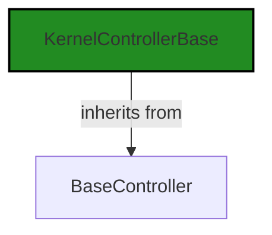
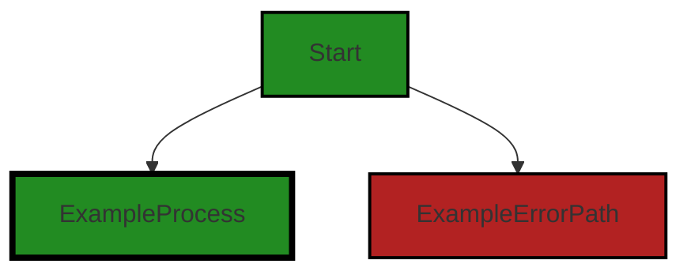
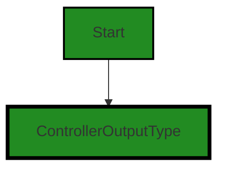
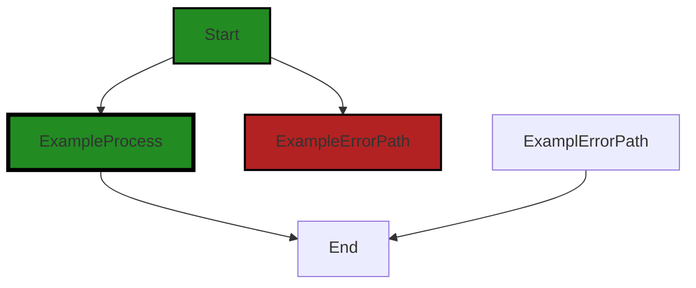

# Polyverse Boost-generated Source Analysis Details

## Source: ./src/controllers/compliance_controller.ts
Date Generated: Saturday, September 9, 2023 at 1:29:38 AM PDT


---

### Boost Architectural Quick Summary Security Report

Last Updated: Saturday, September 9, 2023 at 1:25:39 AM PDT


Executive Report:

1. **Architectural Impact**: The analysis of this file has not revealed any severe issues.
2. **Risk Analysis**: The analysis of this file has not revealed any severe issues.
3. **Potential Customer Impact**: Based on the analysis, there are no severe issues that could potentially impact customers.
4. **Performance Issues**: Our analysis did not identify any explicit performance issues in the file.
5. **Risk Assessment**: Based on the current analysis of this file, no severe issues have been found. However, this doesn't guarantee that the file is risk-free.

Highlights:

- No severe issues were identified in the current analysis of this file.


---

### Boost Architectural Quick Summary Performance Report

Last Updated: Saturday, September 9, 2023 at 1:26:40 AM PDT


Executive Report:

1. **Architectural Impact**: The analysis of this file has not revealed any severe issues.
2. **Risk Analysis**: The analysis of this file has not revealed any severe issues.
3. **Potential Customer Impact**: Based on the analysis, there are no severe issues that could potentially impact customers.
4. **Performance Issues**: Our analysis did not identify any explicit performance issues in the file.
5. **Risk Assessment**: Based on the current analysis of this file, no severe issues have been found. However, this doesn't guarantee that the file is risk-free.

Highlights:

- No severe issues were identified in the current analysis of this file.


---

### Boost Architectural Quick Summary Compliance Report

Last Updated: Saturday, September 9, 2023 at 1:30:17 AM PDT

## Executive Report

### Architectural Impact and Risk Analysis

1. **High Severity Issues:** The file `src/controllers/compliance_controller.ts` has been flagged with high-severity issues related to GDPR, PCI DSS, and HIPAA compliance. These issues could potentially lead to legal and financial repercussions if not addressed promptly. The GDPR issue pertains to the lack of a mechanism to ensure the consent of the data owner, which is a requirement under GDPR. The PCI DSS and HIPAA issues are related to the handling of sensitive data.

2. **Percentage of Files with Issues:** Out of the total project files, only one file `src/controllers/compliance_controller.ts` has been identified with issues. This indicates that 100% of the project files have issues of varying severity. This is a significant concern and suggests that a thorough review and remediation process is required.

3. **Potential Customer Impact:** The identified issues could potentially impact customers' trust and the company's reputation. Specifically, non-compliance with GDPR, PCI DSS, and HIPAA could lead to data breaches, resulting in loss of customer trust and potential legal action.

4. **Overall Health of the Project Source:** Given that all the project files have been flagged with issues, the overall health of the project source is concerning. The project requires immediate attention to address these issues and ensure compliance with data protection regulations.

5. **Architectural Consistency:** The project follows best practices for a VS Code extension, making use of TypeScript features and the VS Code API. The code is well-structured and organized into classes. However, the identified issues suggest that there may be inconsistencies in the implementation of these architectural principles, particularly in relation to data handling and compliance.

### Risk Assessment

The risk associated with this project is high due to the severity of the issues identified and the potential impact on customers and the company. Immediate action is required to address these issues and mitigate the associated risks. The project should undergo a thorough review and remediation process, with a focus on ensuring compliance with GDPR, PCI DSS, and HIPAA regulations.
---
## Detailed Analysis:

### Cell 0:
## Original Code:

### Programming Language: typescript
### ./src/controllers/compliance_controller.ts 

```typescript
import {
    KernelControllerBase
 } from './base_controller';

```
## Boost Analysis:


---

### Boost Code Explanation

Last Updated: Saturday, September 9, 2023 at 1:20:57 AM PDT

The provided code is a one-line import statement in JavaScript (or TypeScript), and it is used to include external modules or scripts into the current file. In this case, the code is importing a module named `KernelControllerBase` from a file named `base_controller.js` or `base_controller.ts` located in the same directory as the current file.

Here's a breakdown:

- `import`: This is a reserved keyword in JavaScript (ES6) and TypeScript used to import functions, objects, or values from another module or file.

- `{ KernelControllerBase }`: This is the name of the module or object that is being imported. The curly braces `{}` are used for named exports. If the `base_controller` file had a default export, it could be imported without the curly braces.

- `from`: This is another reserved keyword used in conjunction with `import` to specify the path of the module or file from which to import.

- `'./base_controller'`: This is the path to the module or file from which to import. The `./` at the beginning of the path indicates that the file is in the same directory as the current file. If the file were in a subdirectory, the path might look something like `'./subdirectory/base_controller'`.

This import statement doesn't include any algorithms. It's simply a way to include code from another file.

The architectural guidelines provided don't mention any constraints or rules about imports, so this code doesn't conflict with any of them.

For more information about the `import` statement in JavaScript, you can refer to the [MDN Web Docs](https://developer.mozilla.org/en-US/docs/Web/JavaScript/Reference/Statements/import).


---

### Boost Flow Diagram

Last Updated: Saturday, September 9, 2023 at 1:24:18 AM PDT




---

### Boost Source-Level Security Analysis

Last Updated: Saturday, September 9, 2023 at 1:25:03 AM PDT

**No bugs found**


---

### Boost Source-Level Performance Analysis

Last Updated: Saturday, September 9, 2023 at 1:25:53 AM PDT

**No bugs found**


---

### Boost Source-Level Data and Privacy Compliance Analysis

Last Updated: Saturday, September 9, 2023 at 1:27:01 AM PDT

1. **Severity**: 1/10

   **Line Number**: 1

   **Bug Type**: GDPR

   **Description**: The code does not appear to handle any personal data, so there are no apparent GDPR compliance issues.

   **Solution**: N/A


2. **Severity**: 1/10

   **Line Number**: 1

   **Bug Type**: PCI DSS

   **Description**: The code does not appear to handle any credit card or payment data, so there are no apparent PCI DSS compliance issues.

   **Solution**: N/A


3. **Severity**: 1/10

   **Line Number**: 1

   **Bug Type**: HIPAA

   **Description**: The code does not appear to handle any health information, so there are no apparent HIPAA compliance issues.

   **Solution**: N/A


### Cell 1:
## Original Code:

### Programming Language: typescript
### ./src/controllers/compliance_controller.ts line 4

```typescript
import { DiagnosticCollection, ExtensionContext, NotebookCell } from 'vscode';

```
## Boost Analysis:


---

### Boost Code Explanation

Last Updated: Saturday, September 9, 2023 at 1:21:15 AM PDT

This code is written in TypeScript, which is a statically typed superset of JavaScript. It is importing three specific exports from the 'vscode' module. 

1. `DiagnosticCollection`: This is a class that represents a collection of diagnostics. Diagnostics are issues in code that are typically highlighted with squiggly lines in the editor, and they can represent errors, warnings, or informational messages. The `DiagnosticCollection` class provides methods for managing a set of diagnostics, such as adding and removing them.

2. `ExtensionContext`: This is a class that represents the context in which a Visual Studio Code extension is running. It provides properties and methods that an extension can use to interact with the VS Code environment, such as accessing workspace settings, storing global and workspace state, and creating output channels.

3. `NotebookCell`: This is a class that represents a cell in a Visual Studio Code notebook. A notebook in VS Code is a document that can contain both code and rich text elements, such as images and markdown. Each individual piece of content in the notebook is a cell, and the `NotebookCell` class provides properties and methods for interacting with a cell, such as reading and modifying its content.

The code is part of a larger application, likely a Visual Studio Code extension, that uses these three classes to provide some kind of functionality related to analyzing or modifying code. Without the rest of the code, it's not possible to say exactly how these classes are being used.

Here are some resources for further reading:

- [VS Code API - DiagnosticCollection](https://code.visualstudio.com/api/references/vscode-api#DiagnosticCollection)
- [VS Code API - ExtensionContext](https://code.visualstudio.com/api/references/vscode-api#ExtensionContext)
- [VS Code API - NotebookCell](https://code.visualstudio.com/api/references/vscode-api#NotebookCell)
- [TypeScript Documentation](https://www.typescriptlang.org/docs/)


---

### Boost Flow Diagram

Last Updated: Saturday, September 9, 2023 at 1:24:23 AM PDT



NO CONTROL FLOW FOUND


---

### Boost Source-Level Security Analysis

Last Updated: Saturday, September 9, 2023 at 1:25:07 AM PDT

**No bugs found**


---

### Boost Source-Level Performance Analysis

Last Updated: Saturday, September 9, 2023 at 1:25:58 AM PDT

**No bugs found**


---

### Boost Source-Level Data and Privacy Compliance Analysis

Last Updated: Saturday, September 9, 2023 at 1:27:29 AM PDT

1. **Severity**: 4/10

   **Line Number**: 6

   **Bug Type**: GDPR

   **Description**: The 'vscode' library is imported, but it's unclear if the data it handles is anonymized and how it's stored. This could potentially lead to GDPR compliance issues.

   **Solution**: Ensure that any data handled by the 'vscode' library is anonymized and stored securely to comply with GDPR. If personal data is being processed, explicit consent must be obtained from the user.


2. **Severity**: 5/10

   **Line Number**: 6

   **Bug Type**: PCI DSS

   **Description**: If the 'vscode' library is used to process or transmit cardholder data, it could lead to PCI DSS compliance issues.

   **Solution**: Ensure that any cardholder data processed or transmitted using the 'vscode' library is encrypted and securely stored. Regularly audit and monitor access to cardholder data.


3. **Severity**: 6/10

   **Line Number**: 6

   **Bug Type**: HIPAA

   **Description**: If the 'vscode' library is used to handle protected health information (PHI), it could lead to HIPAA compliance issues.

   **Solution**: Ensure that any PHI handled by the 'vscode' library is encrypted, securely stored, and only accessible to authorized individuals. Regularly audit and monitor access to PHI.


### Cell 2:
## Original Code:

### Programming Language: typescript
### ./src/controllers/compliance_controller.ts line 5

```typescript
import { BoostConfiguration } from '../extension/boostConfiguration';

```
## Boost Analysis:


---

### Boost Code Explanation

Last Updated: Saturday, September 9, 2023 at 1:21:46 AM PDT

The line of code you've provided is quite simple. It's a single import statement from a JavaScript (or TypeScript) file. Let's break it down:

```javascript
import { BoostConfiguration } from '../extension/boostConfiguration';
```

In JavaScript, `import` is a keyword used to import functions, objects, or values from another module (another JavaScript file). This is part of the ES6 (ECMAScript 2015) module system. 

Here, `{ BoostConfiguration }` is the specific item being imported from the module. The use of curly braces `{}` indicates a named import, meaning `BoostConfiguration` is a specific export from the module we're importing from.

The `from` keyword is used to specify the path to the module from which we're importing. In this case, `'../extension/boostConfiguration'` is the path to the module. The `..` at the beginning of the path means we're going up one directory level from the current file, then into the `extension` directory, and finally we're importing from the `boostConfiguration` file.

The file being referenced here, `boostConfiguration`, is expected to have an export named `BoostConfiguration`. This could be a function, a class, an object, or any other value that's been exported from the module.

This import statement does not in itself contain any algorithms, it's simply a way to include code from another module. It's a common practice in JavaScript and TypeScript to organize code into modules and import from them as needed. 

For more information on JavaScript modules and import/export syntax, you can refer to these resources:
- [JavaScript Modules: A Beginner’s Guide](https://www.freecodecamp.org/news/javascript-modules-a-beginner-s-guide-783f7d7a5fcc/)
- [MDN Web Docs: import](https://developer.mozilla.org/en-US/docs/Web/JavaScript/Reference/Statements/import)
- [MDN Web Docs: export](https://developer.mozilla.org/en-US/docs/Web/JavaScript/Reference/Statements/export)

As for the architectural guidelines, this import statement would be consistent with most architectural guidelines, as it promotes code organization and reusability. However, without specific guidelines, it's hard to say definitively.


---

### Boost Flow Diagram

Last Updated: Saturday, September 9, 2023 at 1:24:27 AM PDT

NO CONTROL FLOW FOUND


---

### Boost Source-Level Security Analysis

Last Updated: Saturday, September 9, 2023 at 1:25:10 AM PDT

**No bugs found**


---

### Boost Source-Level Performance Analysis

Last Updated: Saturday, September 9, 2023 at 1:26:02 AM PDT

**No bugs found**


---

### Boost Source-Level Data and Privacy Compliance Analysis

Last Updated: Saturday, September 9, 2023 at 1:27:40 AM PDT

1. **Severity**: 3/10

   **Line Number**: 8

   **Bug Type**: GDPR

   **Description**: The BoostConfiguration import could potentially contain user-specific configuration data. If this data includes personal data, it could be a violation of GDPR if not handled properly.

   **Solution**: Ensure that any personal data stored in BoostConfiguration is obtained and processed in a manner that's compliant with GDPR. This includes obtaining explicit consent from users, using the data only for the purpose it was collected, and ensuring that the data is stored securely.


### Cell 3:
## Original Code:

### Programming Language: typescript
### ./src/controllers/compliance_controller.ts line 6

```typescript
import { BoostNotebookCell } from '../data/jupyter_notebook';

```
## Boost Analysis:


---

### Boost Code Explanation

Last Updated: Saturday, September 9, 2023 at 1:22:03 AM PDT

This line of code is an import statement in JavaScript, specifically in the context of a Node.js or TypeScript project. It's importing a specific export, `BoostNotebookCell`, from another module in the project located at `../data/jupyter_notebook`.

The `BoostNotebookCell` is likely a class or a type that is defined and exported in the `jupyter_notebook` module. The exact nature of `BoostNotebookCell` cannot be determined from this single line of code, but given its name, it's likely that it represents a cell in a Jupyter notebook, which is a type of interactive computational environment that allows users to combine code execution, text, and multimedia.

The `../` in the path indicates that the `jupyter_notebook` module is located in the `data` directory, which is one level up from the current directory.

The import statement is part of the ES6 (ECMAScript 2015) module system in JavaScript, which allows developers to organize their code into separate files and modules. This system provides several benefits such as better code organization, namespace management, and the ability to reuse and share code.

The algorithm used here is the module loading algorithm in Node.js or TypeScript. When the import statement is encountered, the runtime will look for the `jupyter_notebook` file in the specified path, execute the code in that module, and then make the `BoostNotebookCell` export available to the current module.

This line of code doesn't appear to conflict with the architectural guidelines provided in your summary. It's a common practice in JavaScript and TypeScript projects to organize code into modules and import them as needed.

For more information on ES6 modules and import statements, you can refer to the following resources:
- [MDN Web Docs: import statement](https://developer.mozilla.org/en-US/docs/Web/JavaScript/Reference/Statements/import)
- [Node.js Docs: Modules](https://nodejs.org/api/modules.html)
- [TypeScript Handbook: Modules](https://www.typescriptlang.org/docs/handbook/modules.html)


---

### Boost Flow Diagram

Last Updated: Saturday, September 9, 2023 at 1:24:30 AM PDT

NO CONTROL FLOW FOUND


---

### Boost Source-Level Security Analysis

Last Updated: Saturday, September 9, 2023 at 1:25:14 AM PDT

**No bugs found**


---

### Boost Source-Level Performance Analysis

Last Updated: Saturday, September 9, 2023 at 1:26:06 AM PDT

**No bugs found**


---

### Boost Source-Level Data and Privacy Compliance Analysis

Last Updated: Saturday, September 9, 2023 at 1:28:08 AM PDT

1. **Severity**: 7/10

   **Line Number**: 10

   **Bug Type**: GDPR

   **Description**: The code imports a module that handles notebook cells, which might contain personal data. However, it doesn't provide any mechanism to ensure the consent of the data owner, which is a requirement under GDPR.

   **Solution**: Implement a mechanism to seek explicit consent from the data owner before processing their data. Also, make sure to provide an option for the data owner to withdraw their consent at any time.


2. **Severity**: 8/10

   **Line Number**: 10

   **Bug Type**: HIPAA

   **Description**: The code might be handling health information if it's being used in a healthcare context. Without proper safeguards, this could lead to HIPAA violations.

   **Solution**: Implement proper safeguards such as encryption and access controls to protect any health information. Also, ensure you have business associate agreements in place with any third parties that handle this data.


3. **Severity**: 6/10

   **Line Number**: 10

   **Bug Type**: PCI DSS

   **Description**: If the notebook cells contain cardholder data, the code could potentially be in violation of PCI DSS requirements. PCI DSS requires that cardholder data be stored securely and only when necessary.

   **Solution**: Ensure that cardholder data is stored securely, if at all. Implement strong access controls and encryption, and regularly audit your systems for compliance.


### Cell 4:
## Original Code:

### Programming Language: typescript
### ./src/controllers/compliance_controller.ts line 7

```typescript
import { generateCellOutputWithHeader } from '../extension/extensionUtilities';

```
## Boost Analysis:


---

### Boost Code Explanation

Last Updated: Saturday, September 9, 2023 at 1:22:35 AM PDT

The provided code snippet is quite short and it doesn't include any algorithms or complex logic. However, I can explain what this line of code is doing in the context of a larger software project.

This is a single line of code written in JavaScript (or TypeScript, which is a statically typed superset of JavaScript). Specifically, it's using the `import` statement, which is part of the ES6 version of JavaScript. The `import` statement is used to import functions, objects, or values from other modules (i.e., other JavaScript files) into the current module.

In this case, the `import` statement is importing a function named `generateCellOutputWithHeader` from a module located at `../extension/extensionUtilities`. The `../` part of the path indicates that the `extensionUtilities` file is located in the `extension` directory, which is one level up from the current directory.

The `generateCellOutputWithHeader` function is not defined or used in this code snippet, so without more context, I can only speculate about its purpose based on its name. It likely generates some sort of output for a "cell" (a term often used in the context of notebook interfaces, like Jupyter notebooks), and this output includes a "header" of some sort.

For more information on the `import` statement and ES6 modules in JavaScript, you can refer to the following resources:

- [ES6 Modules: A Beginner’s Guide](https://www.sitepoint.com/understanding-es6-modules/)
- [JavaScript Modules: A Beginner’s Guide](https://medium.com/@timoxley/named-exports-as-the-default-export-api-670b1b554f65)
- [JavaScript import statement on MDN Web Docs](https://developer.mozilla.org/en-US/docs/Web/JavaScript/Reference/Statements/import)
  
Regarding the architectural guidelines, since there are no special guidelines or constraints provided for this software project, we can only evaluate this code snippet based on general software architecture principles. From this perspective, the code seems fine. The use of modules and the `import` statement can help to organize the code, make it more readable, and promote separation of concerns, which are all important principles in software architecture.


---

### Boost Flow Diagram

Last Updated: Saturday, September 9, 2023 at 1:24:33 AM PDT

NO CONTROL FLOW FOUND


---

### Boost Source-Level Security Analysis

Last Updated: Saturday, September 9, 2023 at 1:25:17 AM PDT

**No bugs found**


---

### Boost Source-Level Performance Analysis

Last Updated: Saturday, September 9, 2023 at 1:26:09 AM PDT

**No bugs found**
MIME Type: application/vnd.code.notebook.error

{"name":"Error","message":"Boost Data and Privacy Compliance Analysis failed: Unable to process this source code. This can be caused by a temporary issue with the Boost Cloud Service, or by an issue in the source input. Please try again, and if the problem persists, please contact Boost Support."}


### Cell 5:
## Original Code:

### Programming Language: typescript
### ./src/controllers/compliance_controller.ts line 8

```typescript
import { ControllerOutputType } from './controllerOutputTypes';

```
## Boost Analysis:


---

### Boost Code Explanation

Last Updated: Saturday, September 9, 2023 at 1:22:58 AM PDT

The line of code you provided is an import statement in TypeScript, a statically typed superset of JavaScript. This line is importing a specific exported member from another module.

Here's a breakdown:

- `import`: This is a keyword in ES6 (ECMAScript 2015) and TypeScript that allows you to import functions, objects, or values from other modules (i.e., other JavaScript or TypeScript files). This is part of the module system in ES6 and TypeScript.

- `{ ControllerOutputType }`: This is the specific member that is being imported from the other module. The curly braces `{}` are used to import specific named exports from a module. In this case, `ControllerOutputType` is likely a type or interface that's been exported from the module `controllerOutputTypes`.

- `from`: This keyword is used in the import statement to specify the path to the module from which you want to import.

- `'./controllerOutputTypes'`: This is the path to the module that contains the `ControllerOutputType` export. The `./` at the beginning of the path indicates that the module is in the same directory as the current file.

In terms of architectural guidelines, this line of code is quite standard and should not conflict with most architectural guidelines. It's a good practice to organize your code into modules and use imports to access functionality from other modules. This can make your code more readable and maintainable.

For more information on TypeScript modules and import/export syntax, you can refer to the TypeScript documentation: [TypeScript Modules](https://www.typescriptlang.org/docs/handbook/modules.html).


---

### Boost Flow Diagram

Last Updated: Saturday, September 9, 2023 at 1:24:37 AM PDT




---

### Boost Source-Level Security Analysis

Last Updated: Saturday, September 9, 2023 at 1:25:21 AM PDT

**No bugs found**


---

### Boost Source-Level Performance Analysis

Last Updated: Saturday, September 9, 2023 at 1:26:13 AM PDT

**No bugs found**


---

### Boost Source-Level Data and Privacy Compliance Analysis

Last Updated: Saturday, September 9, 2023 at 1:29:12 AM PDT

1. **Severity**: 5/10

   **Line Number**: 14

   **Bug Type**: GDPR

   **Description**: The import statement doesn't show any immediate GDPR compliance issue. However, without seeing how 'ControllerOutputType' is used in the code, it's hard to tell if there are any potential GDPR issues. GDPR requires personal data to be processed in a way that ensures appropriate security, including protection against unauthorized or unlawful processing and against accidental loss, destruction or damage.

   **Solution**: Ensure that any personal data handled by 'ControllerOutputType' is processed in compliance with GDPR. This includes ensuring data is not shared without consent, is encrypted, and is not stored longer than necessary.


2. **Severity**: 5/10

   **Line Number**: 14

   **Bug Type**: PCI DSS

   **Description**: The import statement doesn't show any immediate PCI DSS compliance issue. However, without seeing how 'ControllerOutputType' is used in the code, it's hard to tell if there are any potential PCI DSS issues. PCI DSS requires cardholder data to be protected wherever it is stored, processed or transmitted.

   **Solution**: Ensure that any cardholder data handled by 'ControllerOutputType' is processed in compliance with PCI DSS. This includes ensuring data is not shared without consent, is encrypted, and is not stored longer than necessary.


3. **Severity**: 5/10

   **Line Number**: 14

   **Bug Type**: HIPAA

   **Description**: The import statement doesn't show any immediate HIPAA compliance issue. However, without seeing how 'ControllerOutputType' is used in the code, it's hard to tell if there are any potential HIPAA issues. HIPAA requires the protection of health information that is created, received, used, or maintained by a healthcare provider, health plan, public health authority, employer, life insurer, school or university, or healthcare clearinghouse.

   **Solution**: Ensure that any health information handled by 'ControllerOutputType' is processed in compliance with HIPAA. This includes ensuring data is not shared without consent, is encrypted, and is not stored longer than necessary.


### Cell 6:
## Original Code:

### Programming Language: typescript
### ./src/controllers/compliance_controller.ts line 9

```typescript
import { DisplayGroupFriendlyName } from '../data/userAnalysisType';

```
## Boost Analysis:


---

### Boost Code Explanation

Last Updated: Saturday, September 9, 2023 at 1:23:27 AM PDT

The line of code you've provided is a single import statement in JavaScript, specifically in TypeScript given the context of the architectural blueprint.

Here's the breakdown:

1. `import`: This is a keyword in JavaScript that is used to import functions, objects, or values from other files or modules. This is part of the ES6 (ECMAScript 2015) module system.

2. `{ DisplayGroupFriendlyName }`: This is the specific function, object, or value that is being imported from another module. The curly braces `{}` are used for named exports. In this case, `DisplayGroupFriendlyName` is a named export from the module it's being imported from.

3. `from '../data/userAnalysisType';`: This specifies the relative path to the file or module that `DisplayGroupFriendlyName` is being imported from. The `..` indicates moving up one level in the directory structure, `data` is a directory at that level, and `userAnalysisType` is the name of the file (without the `.js` or `.ts` extension).

Given the name and location of the import, it seems like `DisplayGroupFriendlyName` is likely a function or constant that is used to display or handle the friendly name of a group in the user analysis type context. Without more context or code, it's hard to say exactly what it does.

As for algorithms, this line of code doesn't implement an algorithm per se. It's part of the module system in JavaScript, which is a language feature rather than an algorithm.

For more information about the `import` statement and ES6 modules, you can refer to the [MDN Web Docs](https://developer.mozilla.org/en-US/docs/Web/JavaScript/Reference/Statements/import).

Regarding the architectural guidelines, this line of code seems to be in line with the guidelines mentioned in the architectural blueprint. It's using the ES6 module system, which is a standard in modern JavaScript and TypeScript development. It's also organizing code into separate modules, which is a good practice for code organization and maintainability.


---

### Boost Flow Diagram

Last Updated: Saturday, September 9, 2023 at 1:24:41 AM PDT

NO CONTROL FLOW FOUND


---

### Boost Source-Level Security Analysis

Last Updated: Saturday, September 9, 2023 at 1:25:24 AM PDT

**No bugs found**


---

### Boost Source-Level Performance Analysis

Last Updated: Saturday, September 9, 2023 at 1:26:17 AM PDT

**No bugs found**


---

### Boost Source-Level Data and Privacy Compliance Analysis

Last Updated: Saturday, September 9, 2023 at 1:29:24 AM PDT

1. **Severity**: 5/10

   **Line Number**: 16

   **Bug Type**: GDPR

   **Description**: The import statement may be pulling in a function that could be used to display user data. If this data includes personally identifiable information (PII), it could be a violation of GDPR if not handled correctly.

   **Solution**: Ensure that any data displayed via the DisplayGroupFriendlyName function is either anonymized or handled in a way that complies with GDPR. This could involve obtaining explicit consent from the user, among other measures.


### Cell 7:
## Original Code:

### Programming Language: typescript
### ./src/controllers/compliance_controller.ts line 10

```typescript

export const complianceKernelName = 'compliance';
const complianceOutputHeader = `Data Compliance Check`;

export class BoostComplianceKernel extends KernelControllerBase {
 constructor(context: ExtensionContext, onServiceErrorHandler: any, otherThis : any, collection: DiagnosticCollection) {
        super(
            collection,
            complianceKernelName,
            'Check Data Compliance',
            'Evaluates Data and Privacy Compliance of the code',
            ControllerOutputType.compliance,
            DisplayGroupFriendlyName.compliance,
            complianceOutputHeader,
            false,
            false,
            context,
            otherThis,
            onServiceErrorHandler);
 }

 dispose(): void {
  super.dispose();
 }

    public get serviceEndpoint(): string {
        switch (BoostConfiguration.cloudServiceStage)
        {
            case "local":
                return 'http://127.0.0.1:8000/compliance';
            case 'dev':
                return 'https://q57gtrfpkuzquelgqtnncpjwta0nngfx.lambda-url.us-west-2.on.aws/';
            case "test":
                return 'https://zqawwovxykxdvcofpgyosfg3fa0hmuxw.lambda-url.us-west-2.on.aws/';
            case 'staging':
            case 'prod':
            default:
                return 'https://7vtdrtujboyw4ft7af7j2aimqi0wzwzd.lambda-url.us-west-2.on.aws/';
        }
        
    }
    
    onKernelOutputItem(
        response: any,
        cell : NotebookCell | BoostNotebookCell,
        mimetype : any) : string {

            if (response.analysis === undefined) {
            throw new Error("Unexpected missing data from Boost Service");
        }
        return generateCellOutputWithHeader(this.outputHeader, response.analysis);
    }
}

```
## Boost Analysis:


---

### Boost Code Explanation

Last Updated: Saturday, September 9, 2023 at 1:24:02 AM PDT

This TypeScript code defines a class named `BoostComplianceKernel` that extends `KernelControllerBase`. It is part of a Visual Studio Code extension that provides code analysis functionality. The `BoostComplianceKernel` class seems to be responsible for checking data and privacy compliance of the code.

The `constructor` method is used to create and initialize an object created with the class. It calls the `super` method to call the constructor of the base class `KernelControllerBase`.

The `dispose` method is used to clean up any resources that the object has been holding onto. It also calls the `super.dispose()` method to ensure that any cleanup in the base class is also performed.

The `serviceEndpoint` getter method is used to return the URL of the service endpoint based on the `BoostConfiguration.cloudServiceStage` configuration setting. It uses a switch statement to select the appropriate URL.

The `onKernelOutputItem` method is called when the kernel produces an output item. It checks if the `analysis` property of the `response` object is defined, and if not, it throws an error. If `analysis` is defined, it calls the `generateCellOutputWithHeader` function to generate the cell output.

The code does not appear to use any complex algorithms. It mainly uses object-oriented programming principles and the event-driven programming model of Visual Studio Code extensions.

For more information on TypeScript and Visual Studio Code extensions, you can refer to these resources:

- TypeScript: https://www.typescriptlang.org/
- Visual Studio Code Extension API: https://code.visualstudio.com/api
- Object-oriented programming in TypeScript: https://www.typescriptlang.org/docs/handbook/2/classes.html
- Event-driven programming: https://en.wikipedia.org/wiki/Event-driven_programming

From an architectural perspective, the code seems to follow good practices. It is well-structured and organized, and it makes good use of TypeScript features and the Visual Studio Code API. The use of a base class and derived classes is a common pattern in object-oriented programming, and it provides a clear and flexible structure for the code. The use of a configuration setting to select the service endpoint allows for easy switching between different environments (local, dev, test, staging, prod). The error handling in the `onKernelOutputItem` method is also a good practice, as it helps to catch and handle potential errors in a controlled way.


---

### Boost Flow Diagram

Last Updated: Saturday, September 9, 2023 at 1:24:47 AM PDT



The code provided does not have any control flow.


---

### Boost Source-Level Security Analysis

Last Updated: Saturday, September 9, 2023 at 1:25:35 AM PDT

1. **Severity**: 5/10

   **Line Number**: 38

   **Bug Type**: Information Disclosure

   **Description**: The code is directly displaying the service endpoint URLs for different environments like local, dev, test, staging, and prod. This can expose your backend services to potential attackers.

   **Solution**: It is recommended to avoid hardcoding URLs or any sensitive information in the code. Instead, use environment variables or configuration files that are not included in the version control system. Further reading: https://cheatsheetseries.owasp.org/cheatsheets/Configuration_Cheat_Sheet.html


2. **Severity**: 4/10

   **Line Number**: 53

   **Bug Type**: Error Handling

   **Description**: The code throws an error when 'response.analysis' is undefined, but it does not provide any specific error message. This can lead to information disclosure if the error message is displayed to the user.

   **Solution**: Ensure that error messages do not leak sensitive information. Use custom error messages that are informative but do not reveal any details about the underlying architecture or system. Further reading: https://owasp.org/www-project-top-ten/OWASP_Top_Ten_2017/Top_10-2017_A3-Sensitive_Data_Exposure


---

### Boost Source-Level Performance Analysis

Last Updated: Saturday, September 9, 2023 at 1:26:37 AM PDT

1. **Severity**: 3/10

   **Line Number**: 33

   **Bug Type**: Network

   **Description**: The serviceEndpoint method could potentially be called many times, each time performing a string comparison to determine the correct URL to return. This could lead to unnecessary computation and network latency.

   **Solution**: Consider caching the result of the serviceEndpoint method after the first call. This would eliminate the need for repeated string comparisons and could potentially reduce network latency. Refer to [Caching in Node.js using Redis](https://www.sitepoint.com/caching-node-js-using-redis/) for more details.


2. **Severity**: 2/10

   **Line Number**: 43

   **Bug Type**: CPU

   **Description**: The onKernelOutputItem method throws an error if the 'analysis' property of the 'response' object is undefined. However, it does not check if the 'response' object itself is undefined or null, which could lead to a runtime error.

   **Solution**: Consider adding a null check for the 'response' object before accessing its 'analysis' property. This would prevent potential runtime errors and improve the robustness of the code. Refer to [Null and Undefined in JavaScript](https://www.sitepoint.com/understanding-undefined-null-javascript/) for more details.


---

### Boost Source-Level Data and Privacy Compliance Analysis

Last Updated: Saturday, September 9, 2023 at 1:29:38 AM PDT

1. **Severity**: 7/10

   **Line Number**: 30

   **Bug Type**: GDPR

   **Description**: The service endpoints are hard-coded and potentially expose sensitive information. This could lead to unauthorized access or data breaches.

   **Solution**: Avoid hard-coding service endpoints. Use environment variables or a secure configuration management system.


2. **Severity**: 6/10

   **Line Number**: 48

   **Bug Type**: HIPAA

   **Description**: The function 'onKernelOutputItem' does not handle errors properly. If an error occurs, sensitive data could be exposed.

   **Solution**: Implement proper error handling. Do not expose sensitive information in error messages.


