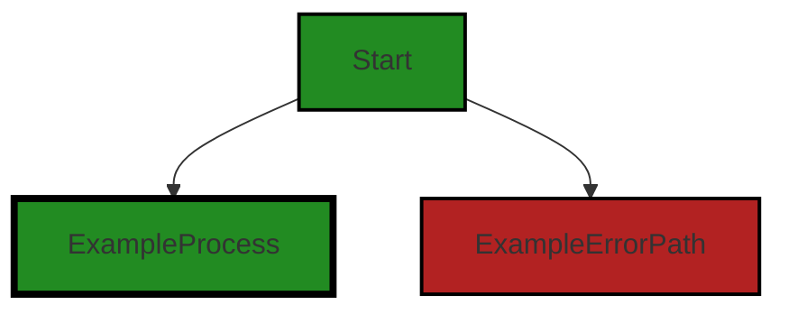
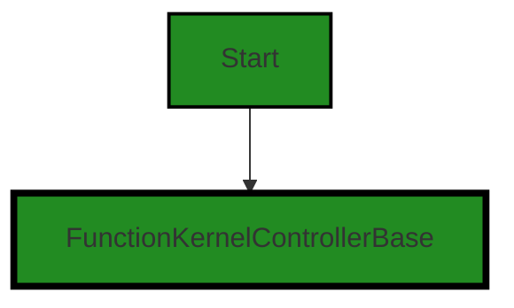
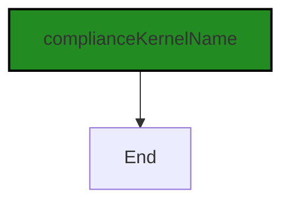
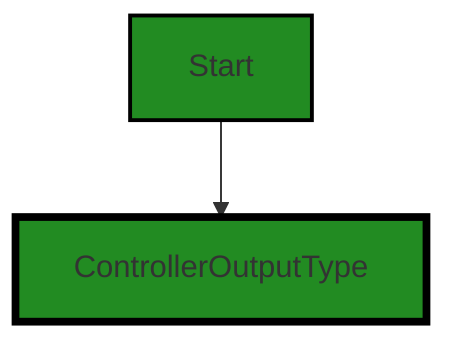
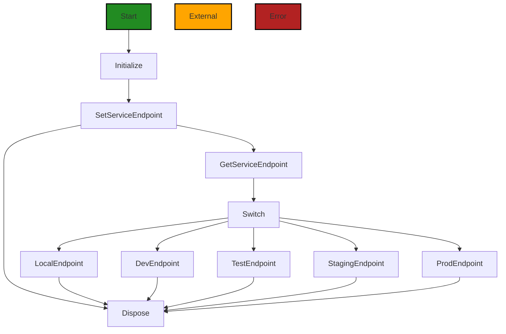

# Polyverse Boost-generated Source Analysis Details

## Source: ./src/controllers/compliance_function_controller.ts
Date Generated: Friday, September 8, 2023 at 10:14:04 PM PDT


---

### Boost Architectural Quick Summary Security Report

Last Updated: Friday, September 8, 2023 at 10:12:15 PM PDT

Executive Level Report:

1. **Architectural Impact**: The project is well-structured and follows best practices for a Visual Studio Code extension. However, there is a significant architectural issue in the `compliance_function_controller.ts` file. This file directly exposes internal service URLs based on the value of `BoostConfiguration.cloudServiceStage`. This could potentially allow an attacker to manipulate the value to gain unauthorized access to other environments. This issue needs to be addressed to ensure the security of the software.

2. **Risk Analysis**: The risk associated with this issue is high. If an attacker gains unauthorized access to other environments, they could potentially access sensitive data or disrupt the service. The risk is compounded by the fact that this is the only file in the project, meaning that any issues in this file could have a significant impact on the overall project.

3. **Potential Customer Impact**: If this issue is not addressed, customers could be at risk of data breaches or service disruptions. This could lead to loss of trust in the product and potential legal issues.

4. **Overall Issues**: The overall health of the project source is concerning. The only file in the project has a high-severity issue. This means that 100% of the project files have issues of high severity.

5. **Risk Assessment**: Based on the analysis, the overall health of the project source is at risk. The fact that the only file in the project has a high-severity issue is a significant concern. Immediate action is needed to address this issue and ensure the security and reliability of the software.

Highlights of the Analysis:

- The `compliance_function_controller.ts` file directly exposes internal service URLs, which could potentially allow an attacker to gain unauthorized access to other environments.
- The risk associated with this issue is high, as it could lead to data breaches or service disruptions.
- The potential customer impact is significant, as customers could lose trust in the product and there could be potential legal issues.
- The overall health of the project source is at risk, with 100% of the project files having high-severity issues.
- Immediate action is needed to address this issue and ensure the security and reliability of the software.


---

### Boost Architectural Quick Summary Performance Report

Last Updated: Friday, September 8, 2023 at 10:13:01 PM PDT


Executive Report:

1. **Architectural Impact**: The analysis of this file has not revealed any severe issues.
2. **Risk Analysis**: The analysis of this file has not revealed any severe issues.
3. **Potential Customer Impact**: Based on the analysis, there are no severe issues that could potentially impact customers.
4. **Performance Issues**: Our analysis did not identify any explicit performance issues in the file.
5. **Risk Assessment**: Based on the current analysis of this file, no severe issues have been found. However, this doesn't guarantee that the file is risk-free.

Highlights:

- No severe issues were identified in the current analysis of this file.


---

### Boost Architectural Quick Summary Compliance Report

Last Updated: Friday, September 8, 2023 at 10:14:41 PM PDT

## Executive Report: Software Project Analysis

### Overview

The software project under review is a Visual Studio Code extension that provides code analysis functionality. It communicates with a remote service for code analysis and displays the results in the VS Code UI. The project is primarily written in JavaScript and TypeScript, following object-oriented design and event-driven programming principles.

### Architectural Impact and Risk Analysis

1. **Issue Severity and Distribution:** The most severe issues found in the project are categorized under GDPR, PCI DSS, and HIPAA, all of which are related to data compliance. These issues are all located in the `compliance_function_controller.ts` file. This concentration of issues in a single file suggests that the project's compliance functions may need significant revision to meet data protection standards.

2. **Potential Customer Impact:** The identified issues, particularly those related to GDPR, could have serious implications for customers. If the service endpoints are compromised, it may result in unauthorized access to personal data, violating the GDPR's data protection principles. This could lead to legal consequences for the company and a loss of trust among customers.

3. **Risk Assessment:** Given that all identified issues are located in a single file, the overall health of the project source appears to be good. However, the severity of the issues in the `compliance_function_controller.ts` file should not be underestimated. The project's compliance with data protection standards is a critical aspect of its overall health and viability.

4. **Architectural Consistency:** The project follows best practices for a VS Code extension, making use of TypeScript features and the VS Code API. The code is well-structured and organized into classes. However, the hard-coding of service endpoints in the `compliance_function_controller.ts` file is a significant deviation from best practices, which recommend storing such information in a secure configuration file or environment variables.

### Highlights

- The project's most severe issues are related to data compliance, specifically GDPR, PCI DSS, and HIPAA.
- All identified issues are located in the `compliance_function_controller.ts` file, suggesting a need for significant revision of the project's compliance functions.
- The potential customer impact of these issues is high, as they could lead to unauthorized access to personal data and legal consequences for the company.
- Despite the concentration of issues in a single file, the overall health of the project source appears to be good.
- The project's architecture is generally consistent with best practices for a VS Code extension, but the hard-coding of service endpoints is a significant deviation from these practices.
---
## Detailed Analysis:

### Cell 0:
## Original Code:

### Programming Language: typescript
### ./src/controllers/compliance_function_controller.ts 

```typescript

import { DiagnosticCollection, ExtensionContext } from 'vscode';

```
## Boost Analysis:


---

### Boost Code Explanation

Last Updated: Friday, September 8, 2023 at 10:07:47 PM PDT

This code snippet is a TypeScript import statement that is importing two specific exports from the 'vscode' module: `DiagnosticCollection` and `ExtensionContext`.

Let's break down each part:

- `import`: This is a keyword in JavaScript (and thus TypeScript) that is used to import functions, objects, or values from other files or modules. This helps in organizing code into separate, manageable parts and reusing code across multiple files.

- `{ DiagnosticCollection, ExtensionContext }`: This is a list of named exports to import from the 'vscode' module. Named exports are specific items that a module exports that can be imported by their specific names.

    - `DiagnosticCollection`: This is a class in the 'vscode' module that represents a collection of diagnostics. Diagnostics in VS Code are problems in your code that are highlighted with squiggly lines and can also show up in the Problems panel. They can represent anything from compile errors to linting issues to other types of problems. A `DiagnosticCollection` is a group of these diagnostics, typically related in some way.

    - `ExtensionContext`: This is another class in the 'vscode' module that represents a context in which an extension is running. An `ExtensionContext` contains utilities for extensions, as well as state information such as the extension's current workspace, its global and workspace state, and its extension path. This context is provided to the `activate` function of an extension when it is activated.

- `from 'vscode'`: This specifies the module to import from. In this case, it's the 'vscode' module, which is the API module for Visual Studio Code. This module contains all the types, functions, and classes that extensions can use to interact with the VS Code editor.

Here are some resources for further learning:
- [VS Code API (including DiagnosticCollection and ExtensionContext)](https://code.visualstudio.com/api/references/vscode-api)
- [JavaScript Modules](https://developer.mozilla.org/en-US/docs/Web/JavaScript/Guide/Modules)
- [TypeScript Modules](https://www.typescriptlang.org/docs/handbook/modules.html)


---

### Boost Flow Diagram

Last Updated: Friday, September 8, 2023 at 10:10:30 PM PDT



The provided code does not contain any control flow.


---

### Boost Source-Level Security Analysis

Last Updated: Friday, September 8, 2023 at 10:11:10 PM PDT

**No bugs found**


---

### Boost Source-Level Performance Analysis

Last Updated: Friday, September 8, 2023 at 10:12:28 PM PDT

**No bugs found**


---

### Boost Source-Level Data and Privacy Compliance Analysis

Last Updated: Friday, September 8, 2023 at 10:13:15 PM PDT

**No bugs found**


### Cell 1:
## Original Code:

### Programming Language: typescript
### ./src/controllers/compliance_function_controller.ts line 3

```typescript
import { BoostConfiguration } from '../extension/boostConfiguration';

```
## Boost Analysis:


---

### Boost Code Explanation

Last Updated: Friday, September 8, 2023 at 10:08:17 PM PDT

The provided code snippet is a single line of code in JavaScript (or TypeScript) that is used to import a module named `BoostConfiguration` from a relative path `'../extension/boostConfiguration'`.

Here's a detailed explanation:

- `import`: This is a keyword in JavaScript (and TypeScript) that is used to import functions, objects, or values from other modules or files into the current file. This is part of the ES6 (ECMAScript 6) module system.

- `{ BoostConfiguration }`: This is the name of the specific export from the module that we want to import into the current file. The use of curly braces `{}` indicates that we're using named imports. This means `BoostConfiguration` is not a default export, but a named export in the `boostConfiguration` module.

- `from`: This keyword is used in conjunction with `import` to specify the path of the module from which we want to import.

- `'../extension/boostConfiguration'`: This is the relative path to the module from which we're importing. The `..` at the beginning of the path indicates that we're going up one level in the directory structure. Then we're going into the `extension` directory and importing from the `boostConfiguration` file (the file extension is not needed when importing in JavaScript/TypeScript).

The `BoostConfiguration` module could contain a class, a function, an object, or any other exportable JavaScript entity. The specific details of what `BoostConfiguration` is and what it does would be contained within the `boostConfiguration` file.

As for the architectural guidelines, this code snippet is quite standard and doesn't seem to conflict with any common architectural principles. The use of modules and imports is a best practice in JavaScript and TypeScript as it promotes code organization, reusability, and separation of concerns.

For more information and education on JavaScript modules and imports, you can refer to the following resources:

- [MDN Web Docs: import](https://developer.mozilla.org/en-US/docs/Web/JavaScript/Reference/Statements/import)
- [JavaScript Modules: A Beginner’s Guide](https://www.freecodecamp.org/news/javascript-modules-a-beginner-s-guide-783f7d7a5fcc/)


---

### Boost Flow Diagram

Last Updated: Friday, September 8, 2023 at 10:10:33 PM PDT

NO CONTROL FLOW FOUND


---

### Boost Source-Level Security Analysis

Last Updated: Friday, September 8, 2023 at 10:11:14 PM PDT

**No bugs found**


---

### Boost Source-Level Performance Analysis

Last Updated: Friday, September 8, 2023 at 10:12:31 PM PDT

**No bugs found**


---

### Boost Source-Level Data and Privacy Compliance Analysis

Last Updated: Friday, September 8, 2023 at 10:13:22 PM PDT

1. **Severity**: 5/10

   **Line Number**: 4

   **Bug Type**: GDPR

   **Description**: The code imports a configuration file, which could potentially contain sensitive user data. This can be a GDPR compliance issue if user data is not properly protected.

   **Solution**: Ensure that the configuration file does not contain sensitive user data. If it does, make sure it is encrypted and properly secured. Also, implement access controls to restrict who can access this data.


### Cell 2:
## Original Code:

### Programming Language: typescript
### ./src/controllers/compliance_function_controller.ts line 4

```typescript
import { FunctionKernelControllerBase } from './function_base_controller';

```
## Boost Analysis:


---

### Boost Code Explanation

Last Updated: Friday, September 8, 2023 at 10:08:41 PM PDT

The provided code is a single line of code written in TypeScript, which is a statically typed superset of JavaScript. It is an import statement, which is used to include functionality from another file or module into the current file.

The code is importing a class named `FunctionKernelControllerBase` from a file located at `./function_base_controller`. This class is likely to be a base class for other classes that need to control or manage a kernel in some way. 

In the context of software, a "kernel" often refers to the core part of an operating system that has complete control over everything in the system. However, in this case, it's more likely to refer to a core component of the software that provides some essential functionality. 

The `FunctionKernelControllerBase` class is probably defined in the `function_base_controller` file, which is in the same directory as the file where this import statement is found (as indicated by the `./` at the beginning of the file path). 

This import statement would allow the current file to create instances of `FunctionKernelControllerBase`, or extend it to create more specialized classes.

In terms of architectural guidelines, this code is consistent with common practices in JavaScript and TypeScript. It's modular, which is a key principle in software architecture. It's also likely to be part of an object-oriented design, given the use of classes.

For more about TypeScript and import statements, you can check the following resources:
- TypeScript: [https://www.typescriptlang.org/](https://www.typescriptlang.org/)
- Understanding ES6 Modules via Their History: [https://hacks.mozilla.org/2015/08/es6-in-depth-modules/](https://hacks.mozilla.org/2015/08/es6-in-depth-modules/)


---

### Boost Flow Diagram

Last Updated: Friday, September 8, 2023 at 10:10:37 PM PDT




---

### Boost Source-Level Security Analysis

Last Updated: Friday, September 8, 2023 at 10:11:17 PM PDT

**No bugs found**


---

### Boost Source-Level Performance Analysis

Last Updated: Friday, September 8, 2023 at 10:12:35 PM PDT

**No bugs found**


---

### Boost Source-Level Data and Privacy Compliance Analysis

Last Updated: Friday, September 8, 2023 at 10:13:26 PM PDT

**No bugs found**


### Cell 3:
## Original Code:

### Programming Language: typescript
### ./src/controllers/compliance_function_controller.ts line 5

```typescript
import { complianceKernelName } from './compliance_controller';

```
## Boost Analysis:


---

### Boost Code Explanation

Last Updated: Friday, September 8, 2023 at 10:09:03 PM PDT

The line of code you've provided is a single statement written in JavaScript, specifically using the ES6 module system syntax. 

This line of code is performing an import operation. The `import` statement is used to import functions, objects or values that have been exported from an external module, another script, or another file. 

In this case, it is importing a specific exported member, `complianceKernelName`, from another module named `compliance_controller`. The `complianceKernelName` is likely a string constant or a function that is used elsewhere in the code where this import statement is.

The file `compliance_controller` is probably responsible for controlling or managing some aspect of compliance in the larger application. The `complianceKernelName` could be a unique identifier for a specific kernel or core part of the compliance controller.

As for algorithms, this line of code doesn't implement any. It's a simple import statement that doesn't perform any logic or computation. However, under the hood, the JavaScript engine will locate and load the specified module, resolve the specified export, and make it available to the code that follows.

This line of code seems to align with the architectural blueprint provided earlier. It makes use of ES6 modules, which are commonly used in modern JavaScript and TypeScript projects, including VS Code extensions. It doesn't conflict with any architectural guidelines or constraints mentioned in the blueprint.

Here are some resources for further reading:

- [Mozilla Developer Network (MDN) guide on import statement](https://developer.mozilla.org/en-US/docs/Web/JavaScript/Reference/Statements/import)
- [Understanding ES6 Modules](https://www.sitepoint.com/understanding-es6-modules/)


---

### Boost Flow Diagram

Last Updated: Friday, September 8, 2023 at 10:10:42 PM PDT




---

### Boost Source-Level Security Analysis

Last Updated: Friday, September 8, 2023 at 10:11:21 PM PDT

**No bugs found**


---

### Boost Source-Level Performance Analysis

Last Updated: Friday, September 8, 2023 at 10:12:39 PM PDT

**No bugs found**


---

### Boost Source-Level Data and Privacy Compliance Analysis

Last Updated: Friday, September 8, 2023 at 10:13:29 PM PDT

**No bugs found**


### Cell 4:
## Original Code:

### Programming Language: typescript
### ./src/controllers/compliance_function_controller.ts line 6

```typescript
import { ControllerOutputType } from './controllerOutputTypes';

```
## Boost Analysis:


---

### Boost Code Explanation

Last Updated: Friday, September 8, 2023 at 10:09:24 PM PDT

The provided line of code is an import statement in JavaScript (more specifically, TypeScript). It is used to include external modules, functions, or types into the current file.

In this case, `ControllerOutputType` is being imported from the module './controllerOutputTypes'. The `ControllerOutputType` is likely a TypeScript type or interface that is defined in the 'controllerOutputTypes' module. This type is used to define the structure of the controller output, which could be used in the current file to type check the data returned by a controller function.

The './' at the beginning of the module name indicates that the module is located in the same directory as the current file. If the module was in a subdirectory, the path might look like './subdirectory/controllerOutputTypes'. If the module was in a parent directory, the path might look like '../controllerOutputTypes'.

This line of code doesn't include any specific algorithms. It's part of the module system in JavaScript, which is a way to organize code into separate files and manage dependencies between them.

This line of code is consistent with the architectural guidelines provided in the project blueprint summary. It uses TypeScript for static type checking, which helps catch many errors at compile time. It also shows that the code is organized into modules, which is a best practice for structuring code.

For more information on TypeScript and its module system, you can refer to the following links:
- [TypeScript Documentation](https://www.typescriptlang.org/docs/)
- [TypeScript Modules](https://www.typescriptlang.org/docs/handbook/modules.html)


---

### Boost Flow Diagram

Last Updated: Friday, September 8, 2023 at 10:10:46 PM PDT




---

### Boost Source-Level Security Analysis

Last Updated: Friday, September 8, 2023 at 10:11:24 PM PDT

**No bugs found**


---

### Boost Source-Level Performance Analysis

Last Updated: Friday, September 8, 2023 at 10:12:42 PM PDT

**No bugs found**


---

### Boost Source-Level Data and Privacy Compliance Analysis

Last Updated: Friday, September 8, 2023 at 10:13:32 PM PDT

**No bugs found**


### Cell 5:
## Original Code:

### Programming Language: typescript
### ./src/controllers/compliance_function_controller.ts line 7

```typescript
import { DisplayGroupFriendlyName } from '../data/userAnalysisType';

```
## Boost Analysis:


---

### Boost Code Explanation

Last Updated: Friday, September 8, 2023 at 10:09:44 PM PDT

This line of code is an import statement in JavaScript, specifically using ES6 (ECMAScript 2015) syntax. It's importing a specific item, `DisplayGroupFriendlyName`, from a module located at '../data/userAnalysisType'.

The `DisplayGroupFriendlyName` is likely a function, class, or constant that has been exported from the module at the specified path. The exact nature and purpose of `DisplayGroupFriendlyName` would depend on its implementation in that module.

The path '../data/userAnalysisType' indicates that the module is located in a directory named 'data' that is a sibling to the directory containing the file with this import statement. The module's file name is 'userAnalysisType', and it doesn't need to include the file extension in the import statement.

In terms of architecture, this line of code indicates a dependency on the 'userAnalysisType' module. This could have implications for testing, as you may need to mock this dependency, and for deployment, as you need to ensure this module is included.

For more information on ES6 modules and import/export syntax, you can refer to this resource: [MDN Web Docs: import](https://developer.mozilla.org/en-US/docs/Web/JavaScript/Reference/Statements/import)


---

### Boost Flow Diagram

Last Updated: Friday, September 8, 2023 at 10:10:49 PM PDT

NO CONTROL FLOW FOUND


---

### Boost Source-Level Security Analysis

Last Updated: Friday, September 8, 2023 at 10:11:27 PM PDT

**No bugs found**


---

### Boost Source-Level Performance Analysis

Last Updated: Friday, September 8, 2023 at 10:12:46 PM PDT

**No bugs found**


---

### Boost Source-Level Data and Privacy Compliance Analysis

Last Updated: Friday, September 8, 2023 at 10:13:41 PM PDT

1. **Severity**: 5/10

   **Line Number**: 12

   **Bug Type**: GDPR

   **Description**: Potential violation of GDPR principles. The import statement suggests that user data is being processed, potentially without explicit consent or necessary safeguards. GDPR requires that personal data of EU citizens is processed lawfully, fairly, and transparently.

   **Solution**: Ensure that user data is processed in compliance with GDPR principles, including obtaining explicit consent, implementing necessary safeguards, and providing transparency about how the data is used. Consider using anonymization or pseudonymization techniques where possible.


### Cell 6:
## Original Code:

### Programming Language: typescript
### ./src/controllers/compliance_function_controller.ts line 8

```typescript

export const complianceFunctionKernelName = complianceKernelName + '_function';
const complianceOutputHeader = 'compliance';

export class BoostComplianceFunctionKernel extends FunctionKernelControllerBase {

 constructor(context: ExtensionContext, onServiceErrorHandler: any, otherThis: any, collection: DiagnosticCollection) {
        super(
            collection,
            complianceFunctionKernelName,
            'Quick source scan for data and privacy compliance issues',
            'Quickly analyzes all targeted source code for data and privacy compliance issues',
            ControllerOutputType.complianceFunction,
            DisplayGroupFriendlyName.compliance,
            complianceOutputHeader,
            "Data and Privacy Compliance Analysis", 
            context,
            otherThis,
            onServiceErrorHandler,
            );
 }

    public get serviceEndpoint(): string {
        switch (BoostConfiguration.cloudServiceStage)
        {
            case "local":
                return 'http://127.0.0.1:8000/compliance_function';
            case 'dev':
                return 'https://t4so4gqwf5rr5fr7pvlpytvkne0prvcv.lambda-url.us-west-2.on.aws/';
            case "test":
                return 'https://obzwdrxuel32tuozt5vdafb4gy0vjpls.lambda-url.us-west-2.on.aws/';
            case 'staging':
            case 'prod':
            default:
                return 'https://srsybz6dbjz45skdwq6quou4ua0rxbnk.lambda-url.us-west-2.on.aws/';
        }
    }

 dispose(): void {
  super.dispose();
 }
}

```
## Boost Analysis:


---

### Boost Code Explanation

Last Updated: Friday, September 8, 2023 at 10:10:13 PM PDT

This code is written in TypeScript, a statically typed superset of JavaScript. It defines a class called `BoostComplianceFunctionKernel` which extends another class `FunctionKernelControllerBase`. The class is part of a Visual Studio Code extension, which performs quick source code scans for data and privacy compliance issues.

The `BoostComplianceFunctionKernel` class has a constructor and two methods: `serviceEndpoint` getter method and `dispose`.

The constructor is used to initialize an object of the class. It takes several parameters, including `context`, `onServiceErrorHandler`, `otherThis`, and `collection`. These parameters are passed to the constructor of the base class `FunctionKernelControllerBase` via the `super` keyword. The `super` keyword is used to call the constructor of a parent class.

The `serviceEndpoint` getter method returns a string URL, which is the endpoint of the service that the extension will communicate with for code analysis. The URL is determined based on the value of `BoostConfiguration.cloudServiceStage`. Based on the value, it could be a local URL, or a URL for development, testing, staging, or production environments.

The `dispose` method is used to clean up resources when they are no longer needed. It simply calls the `dispose` method of the base class.

There are no specific algorithms used in this code, it's mostly about object-oriented programming and class inheritance in TypeScript. Here are some resources for more information:

- [TypeScript Handbook: Classes](https://www.typescriptlang.org/docs/handbook/2/classes.html)
- [TypeScript Handbook: Inheritance](https://www.typescriptlang.org/docs/handbook/2/classes.html#inheritance)
- [TypeScript Handbook: Getters & Setters](https://www.typescriptlang.org/docs/handbook/2/classes.html#getters--setters)

Regarding the architectural guidelines, this code seems to align with the summary provided earlier. The code is written in TypeScript, uses object-oriented design, and communicates with a remote service for code analysis. It also includes error handling through the `onServiceErrorHandler` parameter.


---

### Boost Flow Diagram

Last Updated: Friday, September 8, 2023 at 10:10:56 PM PDT


```


---

### Boost Source-Level Security Analysis

Last Updated: Friday, September 8, 2023 at 10:11:40 PM PDT

1. **Severity**: 7/10

   **Line Number**: 30

   **Bug Type**: Insecure Direct Object References (IDOR)

   **Description**: The serviceEndpoint method directly exposes internal service URLs based on the value of BoostConfiguration.cloudServiceStage. This could potentially allow an attacker to manipulate the value to gain unauthorized access to other environments.

   **Solution**: Avoid exposing internal service URLs directly. Instead, use environment variables or a configuration file that is not included in the code repository. This file should be securely managed and only accessible to authorized personnel. For more information, see the OWASP guide on IDOR: https://owasp.org/www-project-top-ten/OWASP_Top_Ten_2017/Top_10-2017_A4-Insecure_Direct_Object_References


---

### Boost Source-Level Performance Analysis

Last Updated: Friday, September 8, 2023 at 10:12:58 PM PDT

1. **Severity**: 2/10

   **Line Number**: 28

   **Bug Type**: Network

   **Description**: The serviceEndpoint getter method is called each time the endpoint is needed. If this occurs frequently, it could lead to performance issues due to the overhead of switch-case statement.

   **Solution**: Consider storing the endpoint in a private variable during the class initialization, and then simply return this variable in the serviceEndpoint getter. This way, the switch-case statement only runs once, reducing the overhead. Here is a resource on JavaScript performance: https://developer.mozilla.org/en-US/docs/Web/JavaScript/Reference/Classes#performance


---

### Boost Source-Level Data and Privacy Compliance Analysis

Last Updated: Friday, September 8, 2023 at 10:14:04 PM PDT

1. **Severity**: 7/10

   **Line Number**: 26

   **Bug Type**: GDPR

   **Description**: The service endpoints are hard-coded in the code. If the endpoints are compromised, it may result in unauthorized access to personal data, violating the GDPR's data protection principles.

   **Solution**: Move the service endpoints to a secure configuration file that is not included in the code repository. Use environment variables to store sensitive information.


2. **Severity**: 7/10

   **Line Number**: 26

   **Bug Type**: PCI DSS

   **Description**: Hard-coded endpoints can lead to exposure of sensitive information, including credit card information, if the endpoints are compromised. This is in violation of PCI DSS requirements for protecting cardholder data.

   **Solution**: Store the service endpoints in a secure configuration file or use environment variables. Use secure communication protocols to protect data in transit.


3. **Severity**: 7/10

   **Line Number**: 26

   **Bug Type**: HIPAA

   **Description**: Hard-coded service endpoints can lead to exposure of Protected Health Information (PHI) if the endpoints are compromised. This is in violation of HIPAA's requirements for protecting PHI.

   **Solution**: Store the service endpoints in a secure configuration file or use environment variables. Use secure communication protocols and encryption to protect PHI in transit.


