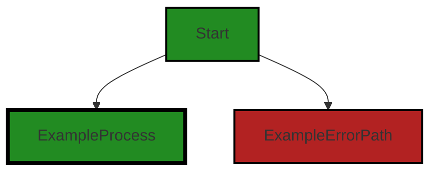
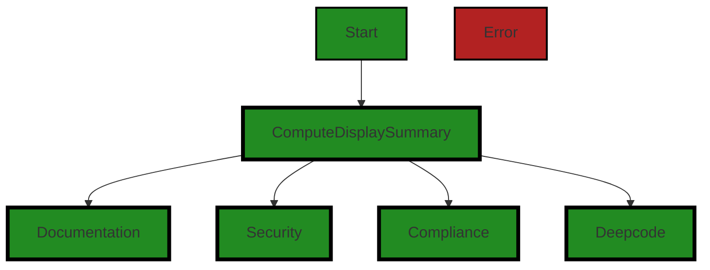

# Polyverse Boost-generated Source Analysis Details

## Source: ./src/controllers/controllerOutputTypes.ts
Date Generated: Friday, September 8, 2023 at 9:40:11 PM PDT


---

### Boost Architectural Quick Summary Security Report

Last Updated: Friday, September 8, 2023 at 9:39:34 PM PDT


Executive Report:

1. **Architectural Impact**: The analysis of this file has not revealed any severe issues.
2. **Risk Analysis**: The analysis of this file has not revealed any severe issues.
3. **Potential Customer Impact**: Based on the analysis, there are no severe issues that could potentially impact customers.
4. **Performance Issues**: Our analysis did not identify any explicit performance issues in the file.
5. **Risk Assessment**: Based on the current analysis of this file, no severe issues have been found. However, this doesn't guarantee that the file is risk-free.

Highlights:

- No severe issues were identified in the current analysis of this file.


---

### Boost Architectural Quick Summary Performance Report

Last Updated: Friday, September 8, 2023 at 9:39:48 PM PDT


Executive Report:

1. **Architectural Impact**: The analysis of this file has not revealed any severe issues.
2. **Risk Analysis**: The analysis of this file has not revealed any severe issues.
3. **Potential Customer Impact**: Based on the analysis, there are no severe issues that could potentially impact customers.
4. **Performance Issues**: Our analysis did not identify any explicit performance issues in the file.
5. **Risk Assessment**: Based on the current analysis of this file, no severe issues have been found. However, this doesn't guarantee that the file is risk-free.

Highlights:

- No severe issues were identified in the current analysis of this file.


---

### Boost Architectural Quick Summary Compliance Report

Last Updated: Friday, September 8, 2023 at 9:40:15 PM PDT


Executive Report:

1. **Architectural Impact**: The analysis of this file has not revealed any severe issues.
2. **Risk Analysis**: The analysis of this file has not revealed any severe issues.
3. **Potential Customer Impact**: Based on the analysis, there are no severe issues that could potentially impact customers.
4. **Performance Issues**: Our analysis did not identify any explicit performance issues in the file.
5. **Risk Assessment**: Based on the current analysis of this file, no severe issues have been found. However, this doesn't guarantee that the file is risk-free.

Highlights:

- No severe issues were identified in the current analysis of this file.

---
## Detailed Analysis:

### Cell 0:
## Original Code:

### Programming Language: typescript
### ./src/controllers/controllerOutputTypes.ts 

```typescript
export const functionOutputTypeExtension = 'List';

export enum ControllerOutputType {
    analyze = 'bugAnalysis',
    analyzeFunction = analyze + functionOutputTypeExtension,
    blueprint = 'archblueprintCode',
    testgen = 'testGeneration',
    compliance = 'complianceCode',
    complianceFunction = compliance + functionOutputTypeExtension,
    performance = 'performance',
    performanceFunction = performance + functionOutputTypeExtension,
    flowDiagram = 'flowDiagram',
    summary = 'summary',
    explain = 'explainCode',
    chat = 'chat',
    codeGuidelines = 'guidelinesCode',
    convert = 'generatedCode',
    customQuickScanFunction = 'customQuickScanCode' + functionOutputTypeExtension,
}

```
## Boost Analysis:


---

### Boost Code Explanation

Last Updated: Friday, September 8, 2023 at 9:38:11 PM PDT

This code is written in TypeScript, which is a statically typed superset of JavaScript that adds types to the language. It is defining an enumeration (enum) and a constant string. 

The constant string `functionOutputTypeExtension` is exported and is set to the value 'List'. This constant is used to append to some of the enum members.

Then, an enumeration `ControllerOutputType` is defined. In TypeScript, an enum is a way of giving more friendly names to sets of numeric values. In this case, the enum is being used to define a set of string values. Each member of the enum represents a different type of output that a controller in the software can produce. 

The enum members are:
- `analyze`: This is set to the string 'bugAnalysis'.
- `analyzeFunction`: This is created by appending the `functionOutputTypeExtension` to `analyze`, resulting in 'bugAnalysisList'.
- `blueprint`: This is set to the string 'archblueprintCode'.
- `testgen`: This is set to the string 'testGeneration'.
- `compliance`: This is set to the string 'complianceCode'.
- `complianceFunction`: This is created by appending the `functionOutputTypeExtension` to `compliance`, resulting in 'complianceCodeList'.
- `performance`: This is set to the string 'performance'.
- `performanceFunction`: This is created by appending the `functionOutputTypeExtension` to `performance`, resulting in 'performanceList'.
- `flowDiagram`: This is set to the string 'flowDiagram'.
- `summary`: This is set to the string 'summary'.
- `explain`: This is set to the string 'explainCode'.
- `chat`: This is set to the string 'chat'.
- `codeGuidelines`: This is set to the string 'guidelinesCode'.
- `convert`: This is set to the string 'generatedCode'.
- `customQuickScanFunction`: This is created by appending the `functionOutputTypeExtension` to 'customQuickScanCode', resulting in 'customQuickScanCodeList'.

The enum `ControllerOutputType` is exported, which means it can be imported and used in other parts of the codebase. It provides a way to refer to these output types in a more readable and maintainable way than using the string values directly.

This code does not appear to conflict with the provided architectural guidelines.

For more information on TypeScript enums, you can refer to the official TypeScript documentation: [TypeScript Enums](https://www.typescriptlang.org/docs/handbook/enums.html)


---

### Boost Flow Diagram

Last Updated: Friday, September 8, 2023 at 9:39:06 PM PDT




---

### Boost Source-Level Security Analysis

Last Updated: Friday, September 8, 2023 at 9:39:27 PM PDT

**No bugs found**


---

### Boost Source-Level Performance Analysis

Last Updated: Friday, September 8, 2023 at 9:39:41 PM PDT

**No bugs found**


---

### Boost Source-Level Data and Privacy Compliance Analysis

Last Updated: Friday, September 8, 2023 at 9:39:56 PM PDT

**No bugs found**


### Cell 1:
## Original Code:

### Programming Language: typescript
### ./src/controllers/controllerOutputTypes.ts line 20

```typescript

//compute the display summary of boostprojectdata
//these are the sections supported currently. Be sure to update this list
//if new analysis are done.
export const outputTypeToDisplayGroup = {
    documentation: [
        ControllerOutputType.explain,
        ControllerOutputType.flowDiagram,
    ],
    security: [ControllerOutputType.analyzeFunction],
    compliance: [ControllerOutputType.complianceFunction],
    deepcode: [
        ControllerOutputType.compliance,
        ControllerOutputType.blueprint,
        ControllerOutputType.analyze,
        ControllerOutputType.codeGuidelines,
    ],
};

```
## Boost Analysis:


---

### Boost Code Explanation

Last Updated: Friday, September 8, 2023 at 9:38:51 PM PDT

This code is written in JavaScript, specifically using the ES6 syntax. It exports an object called `outputTypeToDisplayGroup`. This object is a dictionary or a mapping between keys and values, where keys are strings representing different categories of output or analysis and values are arrays of different types of outputs or analysis that fit into that category.

The purpose of this object is to categorize different types of outputs or analysis into groups for display purposes. This object is likely used elsewhere in the code to determine which types of output to display based on the category selected.

The keys in the object are 'documentation', 'security', 'compliance', and 'deepcode'. These likely represent different categories of analysis that can be performed on a project.

The values in the object are arrays of `ControllerOutputType` values. `ControllerOutputType` is likely an enumeration or a set of constants that represent different types of outputs or analysis that can be performed. For example, 'explain', 'flowDiagram', 'analyzeFunction', 'complianceFunction', 'compliance', 'blueprint', 'analyze', and 'codeGuidelines'.

Here's a breakdown of what each category includes:

- 'documentation': This category includes 'explain' and 'flowDiagram'. This suggests that this category is for outputs that explain the code or provide a flow diagram of the code.

- 'security': This category includes 'analyzeFunction'. This suggests that this category is for outputs that analyze individual functions for security purposes.

- 'compliance': This category includes 'complianceFunction'. This suggests that this category is for outputs that check whether functions comply with certain standards or guidelines.

- 'deepcode': This category includes 'compliance', 'blueprint', 'analyze', and 'codeGuidelines'. This suggests that this category is for a deeper level of code analysis, including checking for compliance, providing a blueprint of the code, analyzing the code, and checking against code guidelines.

The algorithm used here is very simple. It's just defining an object. However, this object is likely used in a lookup operation, which is O(1) complexity.

For more information on JavaScript objects, you can refer to this link: [JavaScript Objects](https://developer.mozilla.org/en-US/docs/Web/JavaScript/Guide/Working_with_Objects)

For more information on ES6 syntax, you can refer to this link: [ES6 Syntax](https://developer.mozilla.org/en-US/docs/Web/JavaScript/Guide/Introduction_to_Object-Oriented_JavaScript)

This code adheres to the architectural guidelines provided in the project blueprint. It uses object-oriented design principles and is organized and structured. It's also clear and easy to understand, which is a key principle of good software design.


---

### Boost Flow Diagram

Last Updated: Friday, September 8, 2023 at 9:39:13 PM PDT




---

### Boost Source-Level Security Analysis

Last Updated: Friday, September 8, 2023 at 9:39:31 PM PDT

**No bugs found**


---

### Boost Source-Level Performance Analysis

Last Updated: Friday, September 8, 2023 at 9:39:44 PM PDT

**No bugs found**


---

### Boost Source-Level Data and Privacy Compliance Analysis

Last Updated: Friday, September 8, 2023 at 9:40:11 PM PDT

1. **Severity**: 5/10

   **Line Number**: 42

   **Bug Type**: Data Compliance

   **Description**: The code does not appear to handle any personal, financial, or health-related data directly. However, it's unclear what data is being processed in the 'complianceFunction' and 'analyzeFunction'. If these functions process sensitive data, there could be potential GDPR, PCI DSS, or HIPAA compliance issues.

   **Solution**: Ensure that any sensitive data processed in these functions is handled according to GDPR, PCI DSS, and HIPAA regulations. This includes obtaining necessary consents, anonymizing data where possible, and implementing appropriate security measures. Regular audits should be conducted to ensure ongoing compliance.


2. **Severity**: 5/10

   **Line Number**: 43

   **Bug Type**: Data Privacy

   **Description**: The 'deepcode' group includes several functions, including 'compliance', 'blueprint', 'analyze', and 'codeGuidelines'. It's unclear what data these functions process and whether they comply with data privacy regulations.

   **Solution**: Review the data processed by these functions to ensure they comply with data privacy regulations. Implement data anonymization techniques and secure data handling practices as necessary. Regular audits should be conducted to ensure ongoing compliance.


