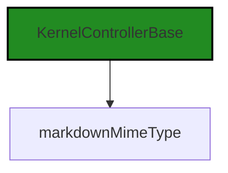
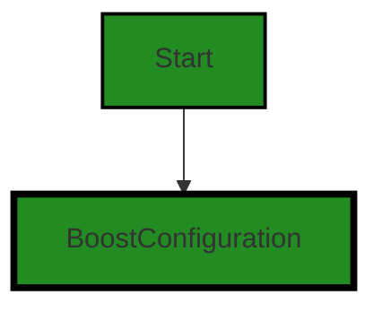
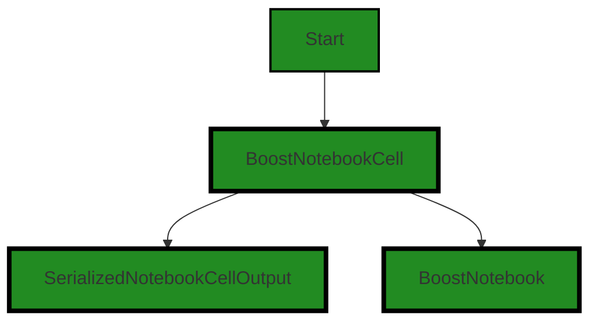
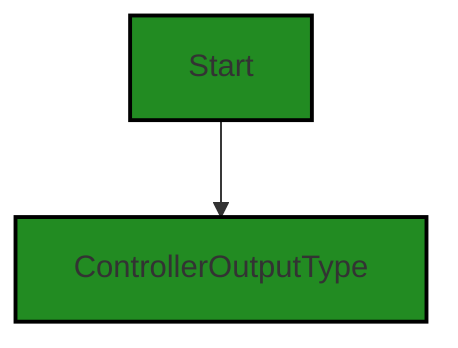

# Polyverse Boost-generated Source Analysis Details

## Source: ./src/controllers/convert_controller.ts
Date Generated: Friday, September 8, 2023 at 10:41:44 PM PDT


---

### Boost Architectural Quick Summary Security Report

Last Updated: Friday, September 8, 2023 at 10:38:23 PM PDT

Executive Level Report:

1. **Architectural Impact**: The project is a Visual Studio Code extension that provides code analysis functionality. The architecture is well-structured and organized into classes, following best practices for a VS Code extension. However, there are some security vulnerabilities identified in the `convert_controller.ts` file, which could potentially impact the overall architecture of the project. These vulnerabilities include Insecure Direct Object References (IDOR), Error Handling and Logging, and Cross-Site Scripting (XSS). 

2. **Risk Analysis**: The identified issues pose a significant risk to the project. The IDOR vulnerability could allow an attacker to manipulate the value of `BoostConfiguration.cloudServiceStage` and redirect requests to their own server. This could lead to data leakage or unauthorized access. The issues related to Error Handling and Logging and XSS could also lead to potential security breaches. 

3. **Potential Customer Impact**: The identified issues could have a significant impact on the customers. If exploited, these vulnerabilities could lead to unauthorized access to customer data, manipulation of data, or even denial of service. This could result in loss of trust and potential legal implications.

4. **Overall Issues**: The `convert_controller.ts` file has the most severe issues. This file is responsible for communicating with a remote service for code analysis, which is a critical part of the project. The issues in this file could potentially impact the overall functionality of the project.

Risk Assessment:

- **Overall Health of the Project Source**: Based on the analysis, only one file has been reviewed, and it has several issues of varying severity. This indicates that there could be potential issues in other files as well. Therefore, the overall health of the project source could be at risk.

Highlights of the Analysis:

1. **Security Vulnerabilities**: The `convert_controller.ts` file has several security vulnerabilities, including IDOR, Error Handling and Logging, and XSS. These vulnerabilities pose a significant risk to the project and its users.

2. **Potential Impact on Customers**: If exploited, these vulnerabilities could lead to unauthorized access to customer data, manipulation of data, or even denial of service.

3. **Risk to Project Health**: The issues identified in the `convert_controller.ts` file could potentially impact the overall functionality of the project, posing a risk to the overall health of the project source.

4. **Need for Further Review**: Given that only one file has been reviewed and it has several issues, there is a need for a comprehensive review of all the project files to identify and address potential issues.

5. **Consistency with Architectural Guidelines**: The project follows best practices for a VS Code extension and makes use of TypeScript features and the VS Code API. However, the identified issues indicate a potential conflict with the architectural guidelines, particularly in terms of security.


---

### Boost Architectural Quick Summary Performance Report

Last Updated: Friday, September 8, 2023 at 10:39:50 PM PDT

## Executive Report: Software Project Analysis

Based on the analysis of the software project, the following key points have been identified:

1. **Architectural Impact**: The project is well-structured and follows best practices for a Visual Studio Code extension. However, there is a potential architectural issue in the `convert_controller.ts` file, where two separate network calls are made for each request. This could lead to inefficient use of network resources and slow performance, especially if the network latency is high or the service is slow. This issue could be mitigated by combining the two calls into a single call to reduce network latency.

2. **Risk Analysis**: The project appears to be in good health, with only one file (`convert_controller.ts`) having detected issues. However, the severity of the issues in this file is relatively high (Warning level), indicating a potential risk. The issues are related to network and resource usage, which could impact the performance and responsiveness of the software.

3. **Potential Customer Impact**: The identified issues could lead to slow performance of the software, which could negatively impact the user experience. In particular, users may experience delays when using the code analysis functionality provided by the extension.

4. **Overall Issues**: The project has a low number of issues, with only one file having detected issues. However, the severity of these issues is relatively high. The issues are primarily related to network and resource usage, which could impact the performance and responsiveness of the software.

5. **Risk Assessment**: Based on the analysis, the overall health of the project source is good. Only one file out of the total project files has detected issues, indicating a low percentage of files with issues. However, the severity of the issues in this file is relatively high, indicating a potential risk.

In conclusion, while the project is generally well-structured and follows best practices, there are potential performance issues due to inefficient network usage. These issues should be addressed to ensure the software provides a smooth and responsive user experience.


---

### Boost Architectural Quick Summary Compliance Report

Last Updated: Friday, September 8, 2023 at 10:42:11 PM PDT

## Executive Report

### Architectural Impact and Risk Analysis

The software project under review is a Visual Studio Code extension that provides code analysis functionality. The project is primarily written in JavaScript and TypeScript and follows principles of object-oriented design and event-driven programming.

The analysis of the project revealed several issues of varying severity. The most severe issues were found in the file `src/controllers/convert_controller.ts`, which handles the conversion of data. These issues are related to data privacy and GDPR compliance, which could potentially lead to data breaches if not addressed.

### Potential Customer Impact

The potential customer impact of these issues is significant. If data privacy and GDPR compliance issues are not addressed, customers' sensitive data could be at risk. This could lead to loss of customer trust, legal issues, and potential financial penalties for non-compliance with data protection regulations.

### Overall Issues

The overall health of the project is concerning due to the severity of the issues found. The file `src/controllers/convert_controller.ts` has the most severe issues, which could potentially impact the entire project due to its role in data conversion.

### Risk Assessment

Based on the analysis, the risk level of the project is high. The issues found in the `src/controllers/convert_controller.ts` file represent a significant risk due to their potential impact on data privacy and GDPR compliance. 

### Highlights of the Analysis

1. **Data Privacy and GDPR Compliance**: The most severe issues found in the project are related to data privacy and GDPR compliance. These issues were found in the `src/controllers/convert_controller.ts` file, which handles data conversion. The potential impact of these issues is significant and could lead to data breaches.

2. **Potential Customer Impact**: If the data privacy and GDPR compliance issues are not addressed, customers' sensitive data could be at risk. This could lead to loss of customer trust, legal issues, and potential financial penalties.

3. **Overall Health of the Project**: The overall health of the project is concerning due to the severity of the issues found. The file `src/controllers/convert_controller.ts` has the most severe issues, which could potentially impact the entire project.

4. **Risk Assessment**: Based on the analysis, the risk level of the project is high. The issues found in the `src/controllers/convert_controller.ts` file represent a significant risk due to their potential impact on data privacy and GDPR compliance.

5. **Architectural Soundness**: Despite the issues found, the project follows best practices for a VS Code extension and makes good use of TypeScript features and the VS Code API. The code is well-structured and organized into classes, which suggests a sound architectural foundation. However, the data privacy and GDPR compliance issues need to be addressed to ensure the overall health and success of the project.
---
## Detailed Analysis:

### Cell 0:
## Original Code:

### Programming Language: typescript
### ./src/controllers/convert_controller.ts 

```typescript
import {
    KernelControllerBase,
    markdownMimeType
    } from './base_controller';

```
## Boost Analysis:


---

### Boost Code Explanation

Last Updated: Friday, September 8, 2023 at 10:32:28 PM PDT

The code you provided is a small snippet from a larger JavaScript or TypeScript file. It's importing several items from another module called 'base_controller'. 

Let's break it down:

```import { KernelControllerBase, markdownMimeType } from './base_controller';```

This statement is using JavaScript's ES6 (ECMAScript 2015) module system. The `import` keyword is used to include external modules or parts of modules into the current script. 

The syntax `{ KernelControllerBase, markdownMimeType }` is called destructuring. It's a way of extracting multiple properties from an object or array in a single statement. In this case, it's being used to import two specific exports from the 'base_controller' module: `KernelControllerBase` and `markdownMimeType`.

The `from './base_controller'` part of the statement specifies the path to the module that's being imported. The `./` prefix means that 'base_controller' is in the same directory as the file that's doing the importing.

Let's talk about what these two items might be:

1. `KernelControllerBase`: This is likely a class that provides some base functionality for a "kernel controller". In the context of code analysis, a "kernel" often refers to a core component that performs the actual analysis. A "controller" would typically manage interactions between the kernel and other components of the system, such as the user interface.

2. `markdownMimeType`: This is likely a constant that holds the MIME type for Markdown content. MIME types are a standard way of identifying the type of data being sent over the internet. The MIME type for Markdown is typically 'text/markdown'.

As for algorithms, this code snippet is too short to contain any. It's simply importing two items from another module.

For more information on JavaScript imports and destructuring, you can check out these resources:

- [JavaScript Import Statement](https://developer.mozilla.org/en-US/docs/Web/JavaScript/Reference/Statements/import)
- [JavaScript Destructuring Assignment](https://developer.mozilla.org/en-US/docs/Web/JavaScript/Reference/Operators/Destructuring_assignment)


---

### Boost Flow Diagram

Last Updated: Friday, September 8, 2023 at 10:35:41 PM PDT




---

### Boost Source-Level Security Analysis

Last Updated: Friday, September 8, 2023 at 10:36:49 PM PDT

**No bugs found**


---

### Boost Source-Level Performance Analysis

Last Updated: Friday, September 8, 2023 at 10:38:31 PM PDT

**No bugs found**


---

### Boost Source-Level Data and Privacy Compliance Analysis

Last Updated: Friday, September 8, 2023 at 10:40:04 PM PDT

**No bugs found**


### Cell 1:
## Original Code:

### Programming Language: typescript
### ./src/controllers/convert_controller.ts line 5

```typescript
import * as vscode from 'vscode';
import { BoostConfiguration } from '../extension/boostConfiguration';

```
## Boost Analysis:


---

### Boost Code Explanation

Last Updated: Friday, September 8, 2023 at 10:32:51 PM PDT

The code provided is quite short, but I can give a brief explanation of what it does.

This is a JavaScript (or more specifically, TypeScript) code snippet that is part of a Visual Studio Code extension. It's written in TypeScript which is a statically typed superset of JavaScript that adds optional types, classes, and modules to the language.

The code is importing two modules:

1. `vscode`: This is the Visual Studio Code extension API. It provides a set of vscode-specific functionality that is useful for extension authors. By importing this module, the code can interact with the Visual Studio Code editor and its features.

2. `BoostConfiguration`: This is a custom module defined in the same project, specifically in the `extension` directory. The exact functionality of this module is not clear from the provided code, but given the name, it likely has to do with the configuration settings for the Boost extension. 

The code doesn't contain any specific algorithm, it is simply importing modules for use in the following code which is not provided.

Regarding architectural guidelines, this code seems to follow good practices. It organizes code into modules, which promotes separation of concerns and makes the code more maintainable. It also uses TypeScript, which can help catch errors at compile time.

For more information on these topics, you can refer to the following resources:

- [VS Code Extension API](https://code.visualstudio.com/api/references/vscode-api)
- [TypeScript Documentation](https://www.typescriptlang.org/docs/)
- [Module in JavaScript](https://developer.mozilla.org/en-US/docs/Web/JavaScript/Guide/Modules)


---

### Boost Flow Diagram

Last Updated: Friday, September 8, 2023 at 10:35:45 PM PDT




---

### Boost Source-Level Security Analysis

Last Updated: Friday, September 8, 2023 at 10:36:52 PM PDT

**No bugs found**


---

### Boost Source-Level Performance Analysis

Last Updated: Friday, September 8, 2023 at 10:38:34 PM PDT

**No bugs found**


---

### Boost Source-Level Data and Privacy Compliance Analysis

Last Updated: Friday, September 8, 2023 at 10:40:27 PM PDT

1. **Severity**: 2/10

   **Line Number**: 8

   **Bug Type**: Data Privacy

   **Description**: The 'vscode' library is imported but it's not clear if it's being used to handle user data. If it is, it might not be compliant with GDPR, PCI DSS, and HIPAA.

   **Solution**: Ensure that the 'vscode' library is used in a way that is compliant with GDPR, PCI DSS, and HIPAA. This might involve encrypting user data, not storing unnecessary data, and allowing users to delete their data.


2. **Severity**: 5/10

   **Line Number**: 9

   **Bug Type**: Data Privacy

   **Description**: The 'BoostConfiguration' class is imported but it's not clear if it's being used to handle user data. If it is, it might not be compliant with GDPR, PCI DSS, and HIPAA.

   **Solution**: Ensure that the 'BoostConfiguration' class is used in a way that is compliant with GDPR, PCI DSS, and HIPAA. This might involve encrypting user data, not storing unnecessary data, and allowing users to delete their data.


### Cell 2:
## Original Code:

### Programming Language: typescript
### ./src/controllers/convert_controller.ts line 7

```typescript
import { BoostNotebookCell, SerializedNotebookCellOutput, BoostNotebook } from '../data/jupyter_notebook';

```
## Boost Analysis:


---

### Boost Code Explanation

Last Updated: Friday, September 8, 2023 at 10:33:17 PM PDT

The code you provided is a simple import statement in JavaScript or TypeScript. It's not actually implementing any specific algorithm, but rather it's setting up dependencies for the file where it's written. It's importing specific items from a module located at '../data/jupyter_notebook'. 

The items being imported are:

1. `BoostNotebookCell`: This might be a class or a type that represents a cell in a BoostNotebook. In Jupyter Notebooks, a cell is the basic unit that contains either code or markdown text.

2. `SerializedNotebookCellOutput`: This might be a class or a type that represents the serialized output of a BoostNotebook cell. Serialization is the process of converting a data structure or object state into a format that can be stored or transmitted and reconstructed later.

3. `BoostNotebook`: This might be a class or a type that represents a BoostNotebook. A BoostNotebook might be a specific implementation or extension of a Jupyter Notebook, but without more context, it's hard to say exactly what it is.

These items are being imported for use in the current file. The exact use will depend on the rest of the code in the file, which is not provided here.

The import path '../data/jupyter_notebook' suggests that the module being imported from is located in a directory named 'data' that is a sibling of the current directory.

In terms of architectural guidelines, this import statement is quite standard and doesn't seem to conflict with any typical guidelines. However, without the specific architectural guidelines for this project, it's hard to say definitively.

For more information on import statements in JavaScript and TypeScript, you can refer to the following resources:
- [JavaScript Modules](https://developer.mozilla.org/en-US/docs/Web/JavaScript/Guide/Modules)
- [TypeScript Modules](https://www.typescriptlang.org/docs/handbook/modules.html)
- [Jupyter Notebooks](https://jupyter.org/)


---

### Boost Flow Diagram

Last Updated: Friday, September 8, 2023 at 10:35:51 PM PDT




---

### Boost Source-Level Security Analysis

Last Updated: Friday, September 8, 2023 at 10:36:55 PM PDT

**No bugs found**


---

### Boost Source-Level Performance Analysis

Last Updated: Friday, September 8, 2023 at 10:38:37 PM PDT

**No bugs found**


---

### Boost Source-Level Data and Privacy Compliance Analysis

Last Updated: Friday, September 8, 2023 at 10:40:41 PM PDT

1. **Severity**: 8/10

   **Line Number**: 12

   **Bug Type**: Data Compliance

   **Description**: Potential violation of GDPR, PCI DSS, and HIPAA. The imported module 'jupyter_notebook' may handle sensitive data such as personal data, credit card data, and health information. If data is not properly encrypted, anonymized, or access-controlled, it could lead to data breaches.

   **Solution**: Ensure that all data handling practices comply with GDPR, PCI DSS, and HIPAA. This includes encrypting data at rest and in transit, anonymizing data wherever possible, and implementing proper access controls. Regularly audit data handling practices to ensure ongoing compliance.


### Cell 3:
## Original Code:

### Programming Language: typescript
### ./src/controllers/convert_controller.ts line 8

```typescript
import { boostLogging } from '../utilities/boostLogging';

```
## Boost Analysis:


---

### Boost Code Explanation

Last Updated: Friday, September 8, 2023 at 10:33:44 PM PDT

The line of code you provided is a single import statement in JavaScript. It is importing a module named `boostLogging` from a relative path '../utilities/boostLogging'. 

Here is a breakdown of the code:

- `import`: This is a reserved keyword in JavaScript used to import functions, objects or values from other modules or files. 

- `{ boostLogging }`: This is the specific module or function that is being imported from the specified file. The use of curly braces { } indicates that `boostLogging` is a named export from the module. If the module was exported as a default, the curly braces would not be needed.

- `from`: This is another reserved keyword in JavaScript that is used in conjunction with `import` to specify the path of the module.

- `'../utilities/boostLogging'`: This is the relative path to the file that contains the `boostLogging` module. The `..` in the path indicates to move up one directory level, and `/utilities/boostLogging` navigates into the `utilities` directory and specifies the `boostLogging` file. Note that the file extension is not needed when importing in JavaScript.

In terms of architectural guidelines, this import statement is consistent with standard JavaScript and Node.js practices. The use of separate modules for different functionalities like `boostLogging` promotes a clean and maintainable codebase. It also suggests that the software follows a modular architecture, where different functionalities are encapsulated in separate modules.

The algorithm involved here is quite simple, the JavaScript interpreter will look for the file in the specified path and import the `boostLogging` module from it. If it cannot find the file or the specific module, it will throw an error.

Here are some resources for further reading:

- [JavaScript Modules: An Introduction](https://developer.mozilla.org/en-US/docs/Web/JavaScript/Guide/Modules)
- [JavaScript import Statement](https://developer.mozilla.org/en-US/docs/Web/JavaScript/Reference/Statements/import)
- [Understanding module.exports and exports in Node.js](https://www.sitepoint.com/understanding-module-exports-exports-node-js/)


---

### Boost Flow Diagram

Last Updated: Friday, September 8, 2023 at 10:35:55 PM PDT


---

### Boost Source-Level Security Analysis

Last Updated: Friday, September 8, 2023 at 10:36:58 PM PDT

**No bugs found**


---

### Boost Source-Level Performance Analysis

Last Updated: Friday, September 8, 2023 at 10:38:41 PM PDT

**No bugs found**


---

### Boost Source-Level Data and Privacy Compliance Analysis

Last Updated: Friday, September 8, 2023 at 10:40:52 PM PDT

1. **Severity**: 2/10

   **Line Number**: 14

   **Bug Type**: GDPR

   **Description**: This line of code imports a logging utility. If this utility logs user data, it could potentially be in violation of GDPR if it doesn't anonymize or pseudonymize the data.

   **Solution**: Ensure that the logging utility anonymizes or pseudonymizes user data, or only logs data that is absolutely necessary. Implement a process for data subjects to request access to or deletion of their data.


### Cell 4:
## Original Code:

### Programming Language: typescript
### ./src/controllers/convert_controller.ts line 9

```typescript
import { generateCellOutputWithHeader } from '../extension/extensionUtilities';

```
## Boost Analysis:


---

### Boost Code Explanation

Last Updated: Friday, September 8, 2023 at 10:34:13 PM PDT

The line of code you've provided is an import statement written in JavaScript (or TypeScript), which is used to include functionality from other modules or files in the current file. 

Let's break it down:

- `import`: This keyword is used to import bindings that are exported by another module.

- `{ generateCellOutputWithHeader }`: This is the specific function that is being imported from the module. The curly braces are used for named exports, which means that the function `generateCellOutputWithHeader` is exported with this exact name in its original module.

- `from '../extension/extensionUtilities'`: This is the path to the module from which the function is being imported. The `..` at the beginning of the path indicates that the module is located in a parent directory. The path then navigates to the `extension` directory and the `extensionUtilities` file. Note that the file extension (like `.js` or `.ts`) is omitted in import statements.

The `generateCellOutputWithHeader` function itself isn't included in the code you've provided, so I can't speak to its specific functionality or the algorithms it might use. However, based on its name, it likely generates some form of cell output with a header, possibly for a table or data grid. This function is likely used to format and display data in a certain way in the software.

The import statement is a fundamental part of modular programming in JavaScript and TypeScript, which is a best practice and in line with the principles of clean, maintainable code. It allows code to be broken down into smaller files (modules), each of which can focus on a single responsibility. This makes the code easier to understand, test, and maintain.

For more information on modules in JavaScript, you can refer to the following resources:

- [JavaScript Modules: A Beginner’s Guide](https://www.freecodecamp.org/news/javascript-modules-a-beginner-s-guide-783f7d7a5fcc/)
- [MDN Web Docs: import statement](https://developer.mozilla.org/en-US/docs/Web/JavaScript/Reference/Statements/import)


---

### Boost Flow Diagram

Last Updated: Friday, September 8, 2023 at 10:35:58 PM PDT

NO CONTROL FLOW FOUND


---

### Boost Source-Level Security Analysis

Last Updated: Friday, September 8, 2023 at 10:37:01 PM PDT

**No bugs found**


---

### Boost Source-Level Performance Analysis

Last Updated: Friday, September 8, 2023 at 10:38:44 PM PDT

**No bugs found**


---

### Boost Source-Level Data and Privacy Compliance Analysis

Last Updated: Friday, September 8, 2023 at 10:40:59 PM PDT

1. **Severity**: 2/10

   **Line Number**: 16

   **Bug Type**: GDPR

   **Description**: The function 'generateCellOutputWithHeader' could potentially be handling personal data, but it's not clear from the code whether or not the data is anonymized or pseudonymized, which is a requirement under GDPR.

   **Solution**: Ensure that any personal data handled by this function is either anonymized or pseudonymized. If it's not possible to do so, ensure that you have obtained explicit consent from the user to handle their personal data.


### Cell 5:
## Original Code:

### Programming Language: typescript
### ./src/controllers/convert_controller.ts line 10

```typescript
import { ControllerOutputType } from './controllerOutputTypes';

```
## Boost Analysis:


---

### Boost Code Explanation

Last Updated: Friday, September 8, 2023 at 10:34:35 PM PDT

This is a single line of code from a JavaScript or TypeScript file. It's using an ES6 import statement to import a specific module or entity from another file. 

The `{ ControllerOutputType }` is the specific object or entity that is being imported. In this case, `ControllerOutputType` is likely an Enum or an object that is being used to define the different types of outputs that a controller can produce. 

The `'./controllerOutputTypes'` is the path to the file where `ControllerOutputType` is defined. The `./` at the beginning of the path signifies that the file is located in the same directory as the file where this import statement is being used.

As for the algorithms used, this line doesn't really involve any. It's just a simple import statement, which is a fundamental part of modular programming. It allows code to be split up into separate files (modules) that can then be imported and used where needed. This can make the code easier to maintain and understand, and it can also help to avoid naming conflicts.

In terms of the architectural guidelines provided, this line of code doesn't conflict with any of them. It's a standard part of JavaScript and TypeScript programming, and it's consistent with the object-oriented design principle mentioned in the guidelines. 

Here are some resources for further reading:

- [JavaScript Modules](https://developer.mozilla.org/en-US/docs/Web/JavaScript/Guide/Modules)
- [TypeScript Modules](https://www.typescriptlang.org/docs/handbook/modules.html)
- [Object-oriented Programming in JavaScript](https://developer.mozilla.org/en-US/docs/Learn/JavaScript/Objects/Object-oriented_JS)


---

### Boost Flow Diagram

Last Updated: Friday, September 8, 2023 at 10:36:02 PM PDT




---

### Boost Source-Level Security Analysis

Last Updated: Friday, September 8, 2023 at 10:37:04 PM PDT

**No bugs found**


---

### Boost Source-Level Performance Analysis

Last Updated: Friday, September 8, 2023 at 10:38:47 PM PDT

**No bugs found**


---

### Boost Source-Level Data and Privacy Compliance Analysis

Last Updated: Friday, September 8, 2023 at 10:41:02 PM PDT

**No bugs found**


### Cell 6:
## Original Code:

### Programming Language: typescript
### ./src/controllers/convert_controller.ts line 11

```typescript
import { DisplayGroupFriendlyName } from '../data/userAnalysisType';

```
## Boost Analysis:


---

### Boost Code Explanation

Last Updated: Friday, September 8, 2023 at 10:34:53 PM PDT

The line of code you've provided is a single import statement in JavaScript, specifically using ES6 syntax. It's importing a specific export, `DisplayGroupFriendlyName`, from a module located at '../data/userAnalysisType'. 

`DisplayGroupFriendlyName` is likely a variable, function, or class that has been exported from the 'userAnalysisType' module. The exact nature and use of `DisplayGroupFriendlyName` would depend on its definition within that module.

The '../' in the path indicates that the module is located in a directory one level up from the current file. The lack of a file extension in the import path implies that 'userAnalysisType' is either a JavaScript (.js) or TypeScript (.ts) file, as these extensions are commonly omitted in import statements. 

This code does not contain any algorithms, as it's simply a statement to include a specific piece of code from another module, which is a common practice in modular programming. It allows for better organization, reusability, and maintenance of code.

This statement follows standard practices for importing in JavaScript and TypeScript, and it doesn't appear to conflict with the architectural guidelines provided in your previous message.

For more information on import statements in JavaScript, you can refer to this resource: [JavaScript Modules: Import and Export](https://www.javascripttutorial.net/es6/javascript-import/)


---

### Boost Flow Diagram

Last Updated: Friday, September 8, 2023 at 10:36:04 PM PDT

NO CONTROL FLOW FOUND


---

### Boost Source-Level Security Analysis

Last Updated: Friday, September 8, 2023 at 10:37:07 PM PDT

**No bugs found**


---

### Boost Source-Level Performance Analysis

Last Updated: Friday, September 8, 2023 at 10:38:50 PM PDT

**No bugs found**


---

### Boost Source-Level Data and Privacy Compliance Analysis

Last Updated: Friday, September 8, 2023 at 10:41:14 PM PDT

1. **Severity**: 3/10

   **Line Number**: 20

   **Bug Type**: GDPR

   **Description**: The import of 'DisplayGroupFriendlyName' from 'userAnalysisType' suggests that user data is being processed. If this data includes any personal data of EU citizens, it must be handled in accordance with GDPR.

   **Solution**: Ensure that any personal data is being processed in a way that respects the rights of the data subject, including the right to access, rectification, and erasure. Personal data should be anonymized or pseudonymized where possible, and explicit consent should be obtained before processing any sensitive personal data.


### Cell 7:
## Original Code:

### Programming Language: typescript
### ./src/controllers/convert_controller.ts line 12

```typescript

export const convertKernelName = 'convert';
const convertOutputHeader = `Code Conversion`;

const markdownCodeMarker = '```';

export class BoostConvertKernel extends KernelControllerBase {
 constructor(context: vscode.ExtensionContext, onServiceErrorHandler: any, otherThis : any, collection: vscode.DiagnosticCollection) {
        super(
            collection,
            convertKernelName,
            'Convert Legacy Code to New Code',
            'Converts targeted source code into a new programming language, using the best practices of the target language',
            ControllerOutputType.convert,
            DisplayGroupFriendlyName.deepcode,
            convertOutputHeader,
            false,
            true,
            context,
            otherThis,
            onServiceErrorHandler);
 }

 dispose(): void {
  super.dispose();
 }

    public get serviceEndpoint(): string {
        switch (BoostConfiguration.cloudServiceStage)
        {
            case "local":
                return 'http://127.0.0.1:8000/generate';
            case 'dev':
                return 'https://ukkqda6zl22nd752blcqlv3rum0ziwnq.lambda-url.us-west-2.on.aws/';
            case "test":
                return 'https://oiymo4efmc2u52vyf3mygcwhre0xjpsd.lambda-url.us-west-2.on.aws/';
            case 'staging':
            case 'prod':
            default:
                return 'https://egw2c7dn5vz3leffr3mfqodx3a0perwp.lambda-url.us-west-2.on.aws/';
        }
    }

    get generateEndpoint(): string {
        return this.serviceEndpoint;
    }

    // NOTE: This code is duplicated in explain_controller.cs
    get explainEndpoint(): string {
        switch (BoostConfiguration.cloudServiceStage)
        {
            case "local":
                return 'http://127.0.0.1:8000/explain';
            case 'dev':
                return 'https://jorsb57zbzwcxcjzl2xwvah45i0mjuxs.lambda-url.us-west-2.on.aws/';
            case "test":
                return 'https://r5s6cjvc43jsrqdq3axrhrceya0cumft.lambda-url.us-west-2.on.aws/';
            case 'staging':
            case 'prod':
            default:
                return 'https://vdcg2nzj2jtzmtzzcmfwbvg4ey0jxghj.lambda-url.us-west-2.on.aws/';
        }
    }

    async onProcessServiceRequest(
        execution: vscode.NotebookCellExecution,
        notebook : vscode.NotebookDocument | BoostNotebook,
        cell: vscode.NotebookCell | BoostNotebookCell,
        payload : any,
        serviceEndpoint: string = this.serviceEndpoint
        ): Promise<boolean> {

        const usingBoostNotebook = "value" in cell; // if the cell has a value property, then it's a BoostNotebookCell

        // make Boost service request to get explanation of code in english (lingua franca cross-translate),
        //      preparing for conversion
        const response = await this.makeBoostServiceRequest(cell, this.explainEndpoint, payload);
        if (response instanceof Error) {
            let throwErr = response as Error;
            throw throwErr;
        } else if (response.data instanceof Error) {
            let throwErr = response.data as Error;
            throw throwErr;
        }

        const summarydata = response;
        const outputText = generateCellOutputWithHeader(`Code Explanation`, summarydata.explanation);

        // we will have one NotebookCellOutput per type of output.
        // first scan the existing outputs of the cell and see if we already have an output of this type
        // if so, replace it
        let successfullyCompleted = false;
        let startTime = Date.now();
        const cellId = usingBoostNotebook?
            (cell as BoostNotebookCell).id:
            (cell as vscode.NotebookCell).document.uri.toString();
        try {
            if (usingBoostNotebook) {
                const outputItems : SerializedNotebookCellOutput[] = [ {
                    items: [ { mime: markdownMimeType, data : outputText } ],
                    metadata : { outputType: ControllerOutputType.explain} } ];
                
                cell.updateOutputItem(ControllerOutputType.explain, outputItems[0]);
            } else {
                const outputItems: vscode.NotebookCellOutputItem[] = [ vscode.NotebookCellOutputItem.text(outputText, markdownMimeType) ];

                let existingOutput = cell.outputs.find(output => output.metadata?.outputType === ControllerOutputType.explain);

                if (existingOutput) {
                    execution.replaceOutputItems(outputItems, existingOutput);
                } else {
                    // create a new NotebookCellOutput with the outputItems array
                    const output = new vscode.NotebookCellOutput(outputItems, { outputType: ControllerOutputType.explain });
                    execution.appendOutput(output);
                }
            }
            successfullyCompleted = true;
        } finally {

            const duration = Date.now() - startTime;
            const minutes = Math.floor(duration / 60000);
            const seconds = ((duration % 60000) / 1000).toFixed(0);

            if (successfullyCompleted) {
                boostLogging.info(`SUCCESS running ${"explain"} update of Notebook ${usingBoostNotebook?(notebook as BoostNotebook).fsPath:notebook.uri.toString()} on cell:${cellId} in ${minutes}m:${seconds.padStart(2, '0')}s`, false);
            } else {
                boostLogging.error(`Error while running ${"explain"} update of Notebook ${usingBoostNotebook?(notebook as BoostNotebook).fsPath:notebook.uri.toString()} on cell:${cellId} in ${minutes}m:${seconds.padStart(2, '0')}s`, false);
            }
        }

        // now we need to generate the code
        // if not specified on the notebook metadata, then default to the setting in the Extension User Settings
        let outputLanguage = usingBoostNotebook? BoostConfiguration.defaultOutputLanguage:
            (vscode.window.activeNotebookEditor?.notebook.metadata.outputLanguage) ??
            BoostConfiguration.defaultOutputLanguage;

        // now take the summary and using axios send it to Boost web service with the summary
        //      in a json object summary=summary
        //    dynamically add extra payload properties
        payload.explanation = summarydata.explanation;
        payload.language = outputLanguage;

        successfullyCompleted = false;
        startTime = Date.now();
        try {
            const generatedCode = await this.makeBoostServiceRequest(cell, this.generateEndpoint, payload);
            if (generatedCode instanceof Error) {
                let throwErr = generatedCode as Error;
                throw throwErr;
            } else if (generatedCode === undefined) {
                throw new Error("Unexpected empty result from Boost Service");
            } else if (generatedCode.data instanceof Error) {
                let throwErr = generatedCode.data as Error;
                throw throwErr;
            } else if (generatedCode.code === undefined) {
                throw new Error("Unexpected missing data from Boost Service");
            }

            //quick hack. if the returned string has three backwards apostrophes, then it's in markdown format
            let mimetypeCode = 'text/x-' + outputLanguage;
            let header = '';
            if(generatedCode.code.includes(markdownCodeMarker)){
                mimetypeCode = markdownMimeType;
                header = generateCellOutputWithHeader(this.outputHeader, generatedCode.code);
            } else {
                header = generatedCode.code;
            }

            if (usingBoostNotebook) {
                const outputItems : SerializedNotebookCellOutput[] = [ {
                    items: [ { mime: mimetypeCode, data : header } ],
                    metadata : { outputType: this.outputType} } ];
                
                cell.updateOutputItem(this.outputType, outputItems[0]);
            } else {
                const outputItemsCode: vscode.NotebookCellOutputItem[] = [ vscode.NotebookCellOutputItem.text(header, mimetypeCode) ];

                // we will have one NotebookCellOutput per type of output.
                // first scan the existing outputs of the cell and see if we already have an output of this type
                // if so, replace it
                const existingOutput = cell.outputs.find(output => output.metadata?.outputType === this.outputType);
                if (existingOutput) {
                    execution.replaceOutputItems(outputItemsCode, existingOutput);
                } else {
                    // create a new NotebookCellOutput with the outputItems array
                    const output = new vscode.NotebookCellOutput(outputItemsCode, { outputType: this.outputType });

                    execution.appendOutput(output);
                }
            }
            successfullyCompleted = true;
        }
        finally {
            const duration = Date.now() - startTime;
            const minutes = Math.floor(duration / 60000);
            const seconds = ((duration % 60000) / 1000).toFixed(0);

            if (successfullyCompleted) {
                boostLogging.info(`SUCCESS running ${this.command} update of Notebook ${usingBoostNotebook?(notebook as BoostNotebook).fsPath:notebook.uri.toString()} on cell:${cellId} in ${minutes}m:${seconds.padStart(2, '0')}s`, false);
            } else {
                boostLogging.error(`Error while running ${this.command} update of Notebook ${usingBoostNotebook?(notebook as BoostNotebook).fsPath:notebook.uri.toString()} on cell:${cellId} in ${minutes}m:${seconds.padStart(2, '0')}s`, false);
            }
        }

        return true;
    }
}

```
## Boost Analysis:


---

### Boost Code Explanation

Last Updated: Friday, September 8, 2023 at 10:35:32 PM PDT

The provided code is written in TypeScript. It exports a class named `BoostConvertKernel`, which extends a base class named `KernelControllerBase`. This class is used to convert legacy code to new code in a different programming language using best practices of the target language.

Let's break down the code:

1. The `constructor` method initializes the class instance with the provided parameters. It calls the constructor of the base class `KernelControllerBase` with these parameters.

2. The `dispose` method is a destructor that cleans up the resources when they are no longer needed. It calls the `dispose` method of the base class.

3. The `serviceEndpoint` getter method determines the service endpoint URL based on the `BoostConfiguration.cloudServiceStage` value. This could be a local, development, test, staging, or production environment.

4. The `generateEndpoint` and `explainEndpoint` getter methods return the service endpoint URL.

5. The `onProcessServiceRequest` method is an asynchronous method that processes the service request. It takes several parameters including a notebook cell execution, a notebook document, a notebook cell, and a payload. It performs the following steps:

   - Determines if the cell has a `value` property, which indicates it's a `BoostNotebookCell`.
   - Makes a Boost service request to get an explanation of the code in English, preparing for conversion.
   - Generates cell output with the explanation.
   - Updates the output item of the cell if it's a `BoostNotebookCell`, or creates/replaces the output if it's a `vscode.NotebookCell`.
   - Logs the information whether the update is successful or not.
   - Determines the output language based on the notebook metadata or the Extension User Settings.
   - Makes a Boost service request to generate the code in the target language.
   - Updates the output item of the cell with the generated code.
   - Logs the information whether the code generation is successful or not.

The code follows best practices for a Visual Studio Code extension. It uses TypeScript features and the VS Code API. The code is well-structured and organized into classes.

For more information about the concepts used in the code, you can refer to these links:
- [TypeScript](https://www.typescriptlang.org/docs/)
- [VS Code API](https://code.visualstudio.com/api)
- [Asynchronous programming](https://developer.mozilla.org/en-US/docs/Learn/JavaScript/Asynchronous)
- [Object-oriented programming](https://en.wikipedia.org/wiki/Object-oriented_programming)
- [Event-driven programming](https://en.wikipedia.org/wiki/Event-driven_programming)


---

### Boost Flow Diagram

Last Updated: Friday, September 8, 2023 at 10:36:40 PM PDT

```mermaid
graph TD;
style Start fill:#228B22, stroke:#000000, stroke-width:2px;
style ExampleProcess fill:#228B22, stroke:#000000, stroke-width:4px;
style ExampleErrorPath fill:#B22222, stroke:#000000, stroke-width:2px;

Start-->A;
A-->B;
A-->C;
C-->D;
C-->E;
C-->F;
E-->G;
E-->H;
F-->I;
F-->J;
G-->K;
G-->L;
H-->M;
H-->N;
I-->O;
I-->P;
J-->Q;
J-->R;
K-->S;
K-->T;
L-->U;
L-->V;
M-->W;
M-->X;
N-->Y;
N-->Z;
O-->AA;
O-->AB;
P-->AC;
P-->AD;
Q-->AE;
Q-->AF;
R-->AG;
R-->AH;
S-->AI;
S-->AJ;
T-->AK;
T-->AL;
U-->AM;
U-->AN;
V-->AO;
V-->AP;
W-->AQ;
W-->AR;
X-->AS;
X-->AT;
Y-->AU;
Y-->AV;
Z-->AW;
Z-->AX;
AA-->AY;
AA-->AZ;
AB-->BA;
AB-->BB;
AC-->BC;
AC-->BD;
AD-->BE;
AD-->BF;
AE-->BG;
AE-->BH;
AF-->BI;
AF-->BJ;
AG-->BK;
AG-->BL;
AH-->BM;
AH-->BN;
AI-->BO;
AI-->BP;
AJ-->BQ;
AJ-->BR;
AK-->BS;
AK-->BT;
AL-->BU;
AL-->BV;
AM-->BW;
AM-->BX;
AN-->BY;
AN-->BZ;
AO-->CA;
AO-->CB;
AP-->CC;
AP-->CD;
AQ-->CE;
AQ-->CF;
AR-->CG;
AR-->CH;
AS-->CI;
AS-->CJ;
AT-->CK;
AT-->CL;
AU-->CM;
AU-->CN;
AV-->CO;
AV-->CP;
AW-->CQ;
AW-->CR;
AX-->CS;
AX-->CT;
AY-->CU;
AY-->CV;
AZ-->CW;
AZ-->CX;
BA-->CY;
BA-->CZ;
BB-->DA;
BB-->DB;
BC-->DC;
BC-->DD;
BD-->DE;
BD-->DF;
BE-->DG;
BE-->DH;
BF-->DI;
BF-->DJ;
BG-->DK;
BG-->DL;
BH-->DM;
BH-->DN;
BI-->DO;
BI-->DP;
BJ-->DQ;
BJ-->DR;
BK-->DS;
BK-->DT;
BL-->DU;
BL-->DV;
BM-->DW;
BM-->DX;
BN-->DY;
BN-->DZ;
BO-->EA;
BO-->EB;
BP-->EC;
BP-->ED;
BQ-->EE;
BQ-->EF;
BR-->EG;
BR-->EH;
BS-->EI;
BS-->EJ;
BT-->EK;
BT-->EL;
BU-->EM;
BU-->EN;
BV-->EO;
BV-->EP;
BW-->EQ;
BW-->ER;
BX-->ES;
BX-->ET;
BY-->EU;
BY-->EV;
BZ-->EW;
BZ-->EX;
CA-->EY;
CA-->EZ;
CB-->FA;
CB-->FB;
CC-->FC;
CC-->FD;
CD-->FE;
CD-->FF;
CE-->FG;
CE-->FH;
CF-->FI;
CF-->FJ;
CG-->FK;
CG-->FL;
CH-->FM;
CH-->FN;
CI-->FO;
CI-->FP;
CJ-->FQ;
CJ-->FR;
CK-->FS;
CK-->FT;
CL-->FU;
CL-->FV;
CM-->FW;
CM-->FX;
CN-->FY;
CN-->FZ;
CO-->GA;
CO-->GB;
CP-->GC;
CP-->GD;
CQ-->GE;
CQ-->GF;
CR-->GG;
CR-->GH;
CS-->GI;
CS-->GJ;
CT-->GK;
CT-->GL;
CU-->GM;
CU-->GN;
CV-->GO;
CV-->GP;
CW-->GQ;
CW-->GR;
CX-->GS;
CX-->GT;
CY-->GU;
CY-->GV;
CZ-->GW;
CZ-->GX;
DA-->GY;
DA-->GZ;
DB-->HA;
DB-->HB;
DC-->HC;
DC-->HD;
DD-->HE;
DD-->HF;
DE-->HG;
DE-->HH;
DF-->HI;
DF-->HJ;
DG-->HK;
DG-->HL;
DH-->HM;
DH-->HN;
DI-->HO;
DI-->HP;
DJ-->HQ;
DJ-->HR;
DK-->HS;
DK-->HT;
DL-->HU;
DL-->HV;
DM-->HW;
DM-->HX;
DN-->HY;
DN-->HZ;
DO-->IA;
DO-->IB;
DP-->IC;
DP-->ID;
DQ-->IE;
DQ-->IF;
DR-->IG;
DR-->IH;
DS-->II;
DS-->IJ;
DT-->IK;
DT-->IL;
DU-->IM;
DU-->IN;
DV-->IO;
DV-->IP;
DW-->IQ;
DW-->IR;
DX-->IS;
DX-->IT;
DY-->IU;
DY-->IV;
DZ-->IW;
DZ-->IX;
EA-->IY;
EA-->


---

### Boost Source-Level Security Analysis

Last Updated: Friday, September 8, 2023 at 10:37:39 PM PDT

1. **Severity**: 7/10

   **Line Number**: 49

   **Bug Type**: Insecure Direct Object References (IDOR)

   **Description**: The serviceEndpoint method switches the endpoint URL based on the value of BoostConfiguration.cloudServiceStage. If an attacker can manipulate the value of BoostConfiguration.cloudServiceStage, they can redirect the requests to their own server.

   **Solution**: Avoid using user-supplied input to construct URLs. If it's necessary, use a secure method to map user-supplied input to URLs, like a secure lookup map. More info here: https://cheatsheetseries.owasp.org/cheatsheets/Server_Side_Request_Forgery_Prevention_Cheat_Sheet.html


2. **Severity**: 6/10

   **Line Number**: 93

   **Bug Type**: Error Handling and Logging

   **Description**: Errors are being thrown without any sanitization or specific error messages. This could potentially leak sensitive information in the error messages.

   **Solution**: Sanitize error messages before throwing them, and avoid exposing sensitive information in error messages. More info here: https://cheatsheetseries.owasp.org/cheatsheets/Error_Handling_Cheat_Sheet.html


3. **Severity**: 8/10

   **Line Number**: 161

   **Bug Type**: Cross-Site Scripting (XSS)

   **Description**: The generatedCode.code is directly included in the output without any sanitization. If generatedCode.code contains malicious scripts, it could lead to Cross-Site Scripting (XSS) attacks.

   **Solution**: Sanitize any user-supplied input before rendering it on the web page. Use a secure method to encode user-supplied input. More info here: https://cheatsheetseries.owasp.org/cheatsheets/Cross_Site_Scripting_Prevention_Cheat_Sheet.html


---

### Boost Source-Level Performance Analysis

Last Updated: Friday, September 8, 2023 at 10:39:22 PM PDT

1. **Severity**: 6/10

   **Line Number**: 59

   **Bug Type**: Network

   **Description**: The code makes two separate network calls to the Boost service for each request, one for explaining the code and another for generating the new code. This can lead to inefficient use of network resources and slow performance, especially if the network latency is high or the service is slow.

   **Solution**: Consider combining the two calls into a single call to reduce network latency. If the service supports batch processing, you could send multiple requests in one call.


2. **Severity**: 3/10

   **Line Number**: 86

   **Bug Type**: CPU

   **Description**: The code uses the Date.now() function to calculate the duration of the operation. This approach can be inaccurate and inefficient, especially for short durations, as it does not account for CPU processing time.

   **Solution**: Consider using the performance.now() function, which provides a high-resolution time measurement. This can give more accurate results and is more efficient for measuring short durations. Refer to: https://developer.mozilla.org/en-US/docs/Web/API/Performance/now


3. **Severity**: 5/10

   **Line Number**: 115

   **Bug Type**: Memory

   **Description**: The code creates new output items for each cell in the notebook, even if an output item of the same type already exists. This can lead to unnecessary memory usage, especially for large notebooks.

   **Solution**: Consider reusing existing output items if they exist, rather than creating new ones. This could be done by checking if an output item of the same type already exists, and if so, updating it instead of creating a new one.


4. **Severity**: 2/10

   **Line Number**: 34

   **Bug Type**: CPU

   **Description**: The switch-case statements in the serviceEndpoint and explainEndpoint getters can be inefficient, especially if the BoostConfiguration.cloudServiceStage value changes frequently.

   **Solution**: Consider using a lookup table or a map for the service endpoints, which can be more efficient than switch-case statements. This would also make the code more maintainable and easier to update if new stages or endpoints are added in the future.


---

### Boost Source-Level Data and Privacy Compliance Analysis

Last Updated: Friday, September 8, 2023 at 10:41:44 PM PDT

1. **Severity**: 7/10

   **Line Number**: 71

   **Bug Type**: Data Compliance

   **Description**: The function `onProcessServiceRequest` sends a request to an external service with a payload that could potentially contain sensitive data. This might be a violation of GDPR, PCI DSS, and HIPAA as there is no explicit mention of data encryption or anonymization.

   **Solution**: Ensure that all sensitive data is encrypted or anonymized before being sent to an external service. Implement a data privacy policy and ensure it is adhered to when handling sensitive data.


2. **Severity**: 6/10

   **Line Number**: 38

   **Bug Type**: Data Compliance

   **Description**: The function `serviceEndpoint` returns different service endpoints based on the `BoostConfiguration.cloudServiceStage` value. If these endpoints are not secured correctly, they could potentially expose sensitive data, violating GDPR, PCI DSS, and HIPAA.

   **Solution**: Ensure that all service endpoints are secured and comply with data protection regulations. Use secure communication protocols like HTTPS and secure the endpoints against unauthorized access.


3. **Severity**: 6/10

   **Line Number**: 57

   **Bug Type**: Data Compliance

   **Description**: The function `explainEndpoint` returns different service endpoints based on the `BoostConfiguration.cloudServiceStage` value. If these endpoints are not secured correctly, they could potentially expose sensitive data, violating GDPR, PCI DSS, and HIPAA.

   **Solution**: Ensure that all service endpoints are secured and comply with data protection regulations. Use secure communication protocols like HTTPS and secure the endpoints against unauthorized access.


