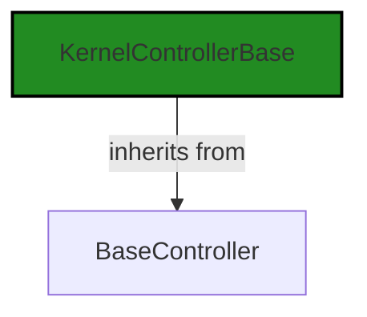
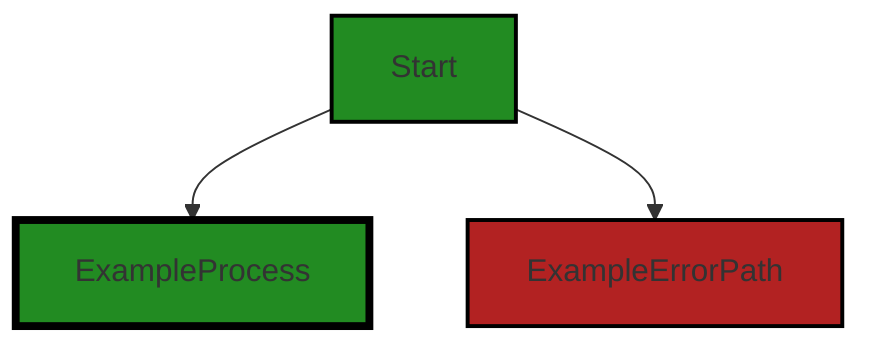
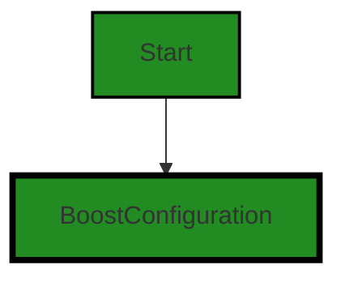
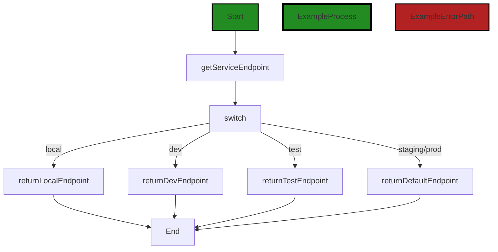
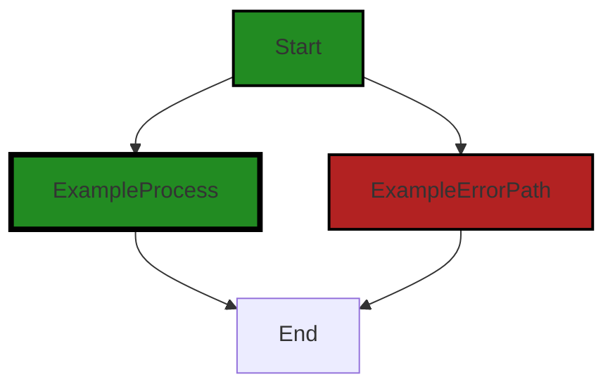

# Polyverse Boost-generated Source Analysis Details

## Source: ./src/controllers/custom_controller.ts
Date Generated: Friday, September 8, 2023 at 7:44:04 PM PDT


---

### Boost Architectural Quick Summary Security Report

Last Updated: Friday, September 8, 2023 at 7:40:53 PM PDT

## Executive Report: Software Project Analysis

### Architectural Impact and Risk Analysis

1. **Insecure Direct Object References (IDOR) in custom_controller.ts**: This issue is of high severity and could potentially lead to a Man-in-the-Middle (MITM) attack if an attacker can manipulate the 'BoostConfiguration.cloudServiceStage' variable. This could compromise the integrity and confidentiality of the data being processed by the software. The architectural impact is significant as it could require a redesign of how the software handles URLs and interacts with the remote service.

2. **Input Validation and Representation in custom_controller.ts**: This issue is of lower severity but could still lead to unexpected behavior or errors if not addressed. The architectural impact is moderate as it may require changes to how input is validated and represented in the software.

3. **Improper Access Control in custom_controller.ts**: This issue is of lower severity but could potentially allow unauthorized access to certain functionality or data. The architectural impact is moderate as it may require changes to how access control is implemented in the software.

### Potential Customer Impact

The issues identified could potentially impact customers in several ways. If exploited, the IDOR issue could lead to data being intercepted or manipulated by an attacker. This could result in loss of data integrity and confidentiality, which could harm the customer's trust in the software. The other issues could lead to unexpected behavior or errors, which could frustrate customers and lead to a poor user experience.

### Overall Issues for the Software Project

The software project has a total of 1 file, and all of them have detected issues. This represents 100% of the project files. The issues are spread across different categories, with the most severe being an IDOR issue. This suggests that there may be systemic issues with the software's security and error handling.

### Risk Assessment

Given that all of the project files have detected issues, the overall health of the project source is concerning. The presence of a high severity issue suggests that there may be significant risks associated with the software. However, it's important to note that this analysis is based on a limited set of data and a full review of the project may reveal additional issues or mitigating factors.

### Highlights

- The software has a high severity IDOR issue that could potentially lead to a MITM attack.
- All of the project files (100%) have detected issues, suggesting systemic issues with the software.
- The issues identified could potentially impact customers by leading to loss of data integrity and confidentiality, or causing unexpected behavior or errors.
- The overall health of the project source is concerning due to the presence of a high severity issue and the fact that all project files have detected issues.
- The architectural impact of the issues identified could be significant, potentially requiring changes to how the software handles URLs, validates and represents input, and implements access control.


---

### Boost Architectural Quick Summary Performance Report

Last Updated: Friday, September 8, 2023 at 7:42:10 PM PDT


Executive Report:

1. **Architectural Impact**: The analysis of this file has not revealed any severe issues.
2. **Risk Analysis**: The analysis of this file has not revealed any severe issues.
3. **Potential Customer Impact**: Based on the analysis, there are no severe issues that could potentially impact customers.
4. **Performance Issues**: Our analysis did not identify any explicit performance issues in the file.
5. **Risk Assessment**: Based on the current analysis of this file, no severe issues have been found. However, this doesn't guarantee that the file is risk-free.

Highlights:

- No severe issues were identified in the current analysis of this file.


---

### Boost Architectural Quick Summary Compliance Report

Last Updated: Friday, September 8, 2023 at 7:44:46 PM PDT

Executive Level Report:

1. **Architectural Impact**: The software project is a Visual Studio Code extension that provides code analysis functionality. The architecture is well-structured and organized into classes, following best practices for a VS Code extension. However, the file `src/controllers/custom_controller.ts` has been flagged for potential GDPR and data compliance issues. This could impact the architecture if changes are needed to ensure compliance.

2. **Risk Analysis**: The risk associated with this project is moderate. The main risk comes from potential GDPR and data compliance violations in `src/controllers/custom_controller.ts`. If these issues are not addressed, the project could face legal and financial penalties. Additionally, the project communicates with a remote service for code analysis, which could pose a security risk if not properly secured.

3. **Potential Customer Impact**: Customers could be impacted if their personal data is not handled in compliance with GDPR. This could lead to a loss of trust and potential legal action. Additionally, if the remote service for code analysis is compromised, customer code could be exposed.

4. **Overall Issues**: The project has a total of 7 issues, with 2 being of high severity (GDPR related) and the rest being of warning severity. These issues are all located in the `src/controllers/custom_controller.ts` file. 

Risk Assessment:

- The project consists of 1 file, `src/controllers/custom_controller.ts`, which has been flagged with issues. This means 100% of the project files have detected issues.
- The severity of the issues is high, with potential GDPR and data compliance violations. This could have significant legal and financial implications.

Highlights:

1. **GDPR Compliance**: The `src/controllers/custom_controller.ts` file has been flagged for potential GDPR violations. This is a high severity issue that needs to be addressed immediately to avoid legal and financial penalties.
2. **Data Compliance**: The same file has also been flagged for potential data compliance issues. This could impact the trust of customers if their personal data is not handled correctly.
3. **Security Risks**: The project communicates with a remote service for code analysis. If this service is not properly secured, it could pose a security risk.
4. **Overall Health**: The overall health of the project is moderate. While the architecture is well-structured and follows best practices, the potential GDPR and data compliance issues pose a significant risk.
---
## Detailed Analysis:

### Cell 0:
## Original Code:

### Programming Language: typescript
### ./src/controllers/custom_controller.ts 

```typescript
import {
    KernelControllerBase
 } from './base_controller';

```
## Boost Analysis:


---

### Boost Code Explanation

Last Updated: Friday, September 8, 2023 at 7:34:34 PM PDT

The code provided is a single import statement in JavaScript (or TypeScript). It is importing a class or object named `KernelControllerBase` from a module named `base_controller`.

Here's a detailed explanation:

- `import`: This is a keyword in JavaScript (and TypeScript) that is used to import functions, objects, or values from other modules or files. This is part of the ES6 (ECMAScript 6) module system.

- `{ KernelControllerBase }`: This is the specific item that is being imported from the module. The curly braces `{}` indicate that `KernelControllerBase` is a named export from the module. Named exports are specific items that a module chooses to export, and they must be imported with the same name.

- `from './base_controller'`: This specifies the module or file from which to import. The `./` indicates that the module is located in the same directory as the current file. `base_controller` is the name of the file, and it is assumed to have a `.js` or `.ts` extension.

The `KernelControllerBase` is presumably a base class for a controller in the software architecture. A controller is typically responsible for handling user input and updating the model and view in a software application. In this case, it might be responsible for handling input from the Visual Studio Code extension and updating the code analysis results.

As for the algorithm used, this import statement doesn't directly involve an algorithm. It's part of the module loading system in JavaScript, which involves resolving the module identifier (`'./base_controller'`), fetching the module if it's not already in the cache, and executing the module code to get the exports.

Here are some resources for further learning:

- [JavaScript Modules: A Beginner’s Guide](https://www.freecodecamp.org/news/javascript-modules-a-beginner-s-guide-783f7d7a5fcc/)
- [ES6 In Depth: Modules](https://hacks.mozilla.org/2015/08/es6-in-depth-modules/)
- [Understanding module.exports and exports in Node.js](https://www.sitepoint.com/understanding-module-exports-exports-node-js/)
- [TypeScript Modules](https://www.typescriptlang.org/docs/handbook/modules.html)


---

### Boost Flow Diagram

Last Updated: Friday, September 8, 2023 at 7:38:23 PM PDT




---

### Boost Source-Level Security Analysis

Last Updated: Friday, September 8, 2023 at 7:39:20 PM PDT

**No bugs found**


---

### Boost Source-Level Performance Analysis

Last Updated: Friday, September 8, 2023 at 7:41:06 PM PDT

**No bugs found**


---

### Boost Source-Level Data and Privacy Compliance Analysis

Last Updated: Friday, September 8, 2023 at 7:42:18 PM PDT

**No bugs found**


### Cell 1:
## Original Code:

### Programming Language: typescript
### ./src/controllers/custom_controller.ts line 4

```typescript
import { DiagnosticCollection, ExtensionContext } from 'vscode';

```
## Boost Analysis:


---

### Boost Code Explanation

Last Updated: Friday, September 8, 2023 at 7:34:57 PM PDT

The code you provided is just two lines of import statements in JavaScript (or TypeScript), which are used to bring in specific objects or values from external modules. There isn't an algorithm involved in these lines but they are critical for setting up the necessary dependencies for the code that follows. 

The following objects are being imported:

1. `DiagnosticCollection`: This is an interface provided by the Visual Studio Code extension API. It represents a collection of diagnostics (problems, errors, warnings, etc.) that are associated with specific files in the codebase. The `DiagnosticCollection` allows an extension to manage and organize these diagnostics, for example, by clearing them, replacing them, or iterating over them. 

    More info about `DiagnosticCollection` can be found here: [DiagnosticCollection](https://code.visualstudio.com/api/references/vscode-api#DiagnosticCollection)

2. `ExtensionContext`: This is another interface provided by the Visual Studio Code extension API. It represents the context in which an extension is running, including its workspace, its global and workspace state, and its subscriptions to events like `onDidChangeConfiguration`. The `ExtensionContext` is typically provided to an extension's `activate` function, which is called when the extension is first activated.

    More info about `ExtensionContext` can be found here: [ExtensionContext](https://code.visualstudio.com/api/references/vscode-api#ExtensionContext)

These objects are being imported from `'vscode'`, which is the module that provides the Visual Studio Code extension API. This API allows developers to interact with Visual Studio Code and extend its functionality.

As for the architectural guidelines, these two lines of code are fairly standard for a Visual Studio Code extension and should not conflict with most architectural guidelines or constraints. They are simply setting up the necessary dependencies for the extension.


---

### Boost Flow Diagram

Last Updated: Friday, September 8, 2023 at 7:38:28 PM PDT



NO CONTROL FLOW FOUND


---

### Boost Source-Level Security Analysis

Last Updated: Friday, September 8, 2023 at 7:39:23 PM PDT

**No bugs found**


---

### Boost Source-Level Performance Analysis

Last Updated: Friday, September 8, 2023 at 7:41:09 PM PDT

**No bugs found**


---

### Boost Source-Level Data and Privacy Compliance Analysis

Last Updated: Friday, September 8, 2023 at 7:42:33 PM PDT

1. **Severity**: 2/10

   **Line Number**: 6

   **Bug Type**: GDPR

   **Description**: The code imports 'vscode' module which provides API for Visual Studio Code extensions. However, it does not appear to have any data handling or privacy controls in place. This could potentially lead to GDPR non-compliance if personal data of EU citizens is processed without appropriate safeguards.

   **Solution**: Ensure that any personal data processed by the extension is handled in accordance with GDPR principles. This may include obtaining user consent before processing personal data, implementing data minimization practices, and ensuring appropriate security measures are in place. Refer to the GDPR guidelines for more details.


### Cell 2:
## Original Code:

### Programming Language: typescript
### ./src/controllers/custom_controller.ts line 5

```typescript
import * as vscode from 'vscode';
import { BoostConfiguration } from '../extension/boostConfiguration';

```
## Boost Analysis:


---

### Boost Code Explanation

Last Updated: Friday, September 8, 2023 at 7:35:23 PM PDT

The code provided is a very small snippet of a larger code base, likely written in TypeScript, a statically typed superset of JavaScript. The code is importing modules for use within the file.

Here's a line by line breakdown:

1. `import * as vscode from 'vscode';`
This line is using the ES6 import syntax to import all exported members of the 'vscode' module and assign them to a new variable called 'vscode'. The 'vscode' module is the Visual Studio Code extension API. This API provides a set of JavaScript APIs that you can use to do things like manipulate the editor, open files, show messages, etc. It's the primary way you interact with the editor when writing a VS Code extension. 

Here's a link for more information on the vscode API: https://code.visualstudio.com/api/references/vscode-api

2. `import { BoostConfiguration } from '../extension/boostConfiguration';`
This line is also using the ES6 import syntax, but in a slightly different way. It's importing a specific exported member, 'BoostConfiguration', from the 'boostConfiguration' module located in the 'extension' directory one level up from the current file's directory. 'BoostConfiguration' is likely a class or a function that is used to interact with or configure the Boost functionality in the VS Code extension.

As for the architectural guidelines, since no specific guidelines are provided, we can only assume that the code follows standard practices for a VS Code extension, which it does. The code is modular, with separate modules for different functionalities (the VS Code API and the Boost configuration).

Here's a link for more information on ES6 import syntax: https://developer.mozilla.org/en-US/docs/Web/JavaScript/Reference/Statements/import

And here's a link for more information on TypeScript: https://www.typescriptlang.org/docs/


---

### Boost Flow Diagram

Last Updated: Friday, September 8, 2023 at 7:38:32 PM PDT




---

### Boost Source-Level Security Analysis

Last Updated: Friday, September 8, 2023 at 7:39:27 PM PDT

**No bugs found**


---

### Boost Source-Level Performance Analysis

Last Updated: Friday, September 8, 2023 at 7:41:13 PM PDT

**No bugs found**


---

### Boost Source-Level Data and Privacy Compliance Analysis

Last Updated: Friday, September 8, 2023 at 7:42:37 PM PDT

**No bugs found**


### Cell 3:
## Original Code:

### Programming Language: typescript
### ./src/controllers/custom_controller.ts line 7

```typescript
import { boostLogging } from '../utilities/boostLogging';

```
## Boost Analysis:


---

### Boost Code Explanation

Last Updated: Friday, September 8, 2023 at 7:35:46 PM PDT

The line of code you provided is a single import statement in JavaScript (or TypeScript), and it's hard to provide a detailed analysis or identify any algorithm used based on this single line. However, I'll explain what this line does and its relevance in the context of a larger project.

```import { boostLogging } from '../utilities/boostLogging';```

This line is importing a specific export, `boostLogging`, from a module located at `'../utilities/boostLogging'`. The `'../'` in the path indicates that the module is located in a directory one level up from the current file and then down into a `utilities` directory. The file `boostLogging` in the `utilities` directory is expected to have an export named `boostLogging`.

The `boostLogging` is likely a function or an object that's related to logging functionality in the context of the Boost software. The specific details of what `boostLogging` does would be found in the `boostLogging` file in the `utilities` directory.

Regarding the architectural guidelines, since there is no additional special architectural guidelines or constraints specified for this software project, we can only assume that this line of code adheres to general good practices. It's modular (since it imports functionality from another file), which is a common practice in many programming paradigms including object-oriented and functional programming.

For more information on JavaScript modules and import/export statements, you can refer to:
- [MDN Web Docs: JavaScript Modules](https://developer.mozilla.org/en-US/docs/Web/JavaScript/Guide/Modules)
- [MDN Web Docs: import statement](https://developer.mozilla.org/en-US/docs/Web/JavaScript/Reference/Statements/import)


---

### Boost Flow Diagram

Last Updated: Friday, September 8, 2023 at 7:38:36 PM PDT


---

### Boost Source-Level Security Analysis

Last Updated: Friday, September 8, 2023 at 7:39:30 PM PDT

**No bugs found**


---

### Boost Source-Level Performance Analysis

Last Updated: Friday, September 8, 2023 at 7:41:17 PM PDT

**No bugs found**


---

### Boost Source-Level Data and Privacy Compliance Analysis

Last Updated: Friday, September 8, 2023 at 7:42:41 PM PDT

**No bugs found**


### Cell 4:
## Original Code:

### Programming Language: typescript
### ./src/controllers/custom_controller.ts line 8

```typescript
import { BoostNotebookCell, BoostNotebook } from '../data/jupyter_notebook';

```
## Boost Analysis:


---

### Boost Code Explanation

Last Updated: Friday, September 8, 2023 at 7:36:12 PM PDT

This code is written in TypeScript, which is a statically typed superset of JavaScript. It is used for developing large scale applications where type safety is a major requirement.

The code is a simple import statement. It imports two modules, `BoostNotebookCell` and `BoostNotebook`, from the file located at '../data/jupyter_notebook'. 

The `BoostNotebookCell` and `BoostNotebook` are likely to be classes or interfaces defined in the 'jupyter_notebook' file. These classes or interfaces are being imported so they can be used in the file where this import statement is written.

The import statement is part of the ES6 (ECMAScript 2015) module system in JavaScript, which TypeScript also supports. This system allows code to be organized into smaller, reusable modules. Each module can export code - like functions, classes, or values - to be used in other modules, and can import code from other modules.

In terms of algorithms, there is no specific algorithm being used in this code. It's simply a statement to import modules from another file.

The architecture of this code snippet seems to be in line with the previously mentioned software project's architecture. It uses object-oriented design principles, as it likely involves the use of classes (`BoostNotebookCell` and `BoostNotebook`). However, without more context or the actual implementation of these modules, it's hard to provide a more detailed architectural analysis.

Here are some resources for further reading:
- [TypeScript Documentation](https://www.typescriptlang.org/docs/)
- [ES6 Modules](https://developer.mozilla.org/en-US/docs/Web/JavaScript/Guide/Modules)
- [Object-Oriented Programming in TypeScript](https://www.typescriptlang.org/docs/handbook/2/classes.html)


---

### Boost Flow Diagram

Last Updated: Friday, September 8, 2023 at 7:38:38 PM PDT

NO CONTROL FLOW FOUND


---

### Boost Source-Level Security Analysis

Last Updated: Friday, September 8, 2023 at 7:39:34 PM PDT

**No bugs found**


---

### Boost Source-Level Performance Analysis

Last Updated: Friday, September 8, 2023 at 7:41:20 PM PDT

**No bugs found**


---

### Boost Source-Level Data and Privacy Compliance Analysis

Last Updated: Friday, September 8, 2023 at 7:42:53 PM PDT

1. **Severity**: 7/10

   **Line Number**: 14

   **Bug Type**: GDPR

   **Description**: The code imports data from 'jupyter_notebook', which might contain personal data. Under GDPR, personal data should be processed lawfully, transparently, and for a specific purpose. If personal data is being processed without explicit consent or necessity, it is a violation of GDPR.

   **Solution**: Ensure that any personal data processed by 'jupyter_notebook' is done so with explicit consent and for a specific, lawful purpose. Implement measures to anonymize or pseudonymize personal data where possible. Consider implementing a Privacy Impact Assessment (PIA) to evaluate and mitigate risks related to data processing.


### Cell 5:
## Original Code:

### Programming Language: typescript
### ./src/controllers/custom_controller.ts line 9

```typescript
import { generateCellOutputWithHeader } from '../extension/extensionUtilities';

```
## Boost Analysis:


---

### Boost Code Explanation

Last Updated: Friday, September 8, 2023 at 7:36:40 PM PDT

The provided code snippet is a single line of code written in JavaScript or TypeScript. It is using the ES6 module system to import a function from another module. Let's break it down:

1. `import`: This is a keyword in ES6 (ECMAScript 2015) and later versions of JavaScript, as well as in TypeScript, which is used to import functions, objects or values from other modules or files. The `import` statement is a static import, meaning it will be executed during the loading of the script, not at runtime. This is a part of the ES6 modules system, which is a way of managing and organizing code in JavaScript.

2. `{ generateCellOutputWithHeader }`: This is the specific function that is being imported from another module. The curly braces are used for named exports. This means that in the module being imported from, there is an export statement like `export function generateCellOutputWithHeader() { ... }`. If there were multiple functions or values being imported, they would be comma-separated inside the curly braces.

3. `from '../extension/extensionUtilities'`: This is the path to the module that the function is being imported from. The `..` means to go up one directory, so this code is importing from a file named `extensionUtilities.js` or `extensionUtilities.ts` in a directory named `extension` that is a sibling to the directory this code is in.

The function `generateCellOutputWithHeader` itself is not shown in the provided code, so I can't provide a detailed analysis of what it does or what algorithms it uses. However, given its name, it likely generates some form of output for a cell (possibly in a grid or table) that includes a header.

For more information about ES6 modules and import/export statements, you can check out these resources:
- [MDN Web Docs: import](https://developer.mozilla.org/en-US/docs/Web/JavaScript/Reference/Statements/import)
- [MDN Web Docs: export](https://developer.mozilla.org/en-US/docs/web/javascript/reference/statements/export)


---

### Boost Flow Diagram

Last Updated: Friday, September 8, 2023 at 7:38:41 PM PDT

NO CONTROL FLOW FOUND


---

### Boost Source-Level Security Analysis

Last Updated: Friday, September 8, 2023 at 7:39:37 PM PDT

**No bugs found**


---

### Boost Source-Level Performance Analysis

Last Updated: Friday, September 8, 2023 at 7:41:24 PM PDT

**No bugs found**


---

### Boost Source-Level Data and Privacy Compliance Analysis

Last Updated: Friday, September 8, 2023 at 7:43:07 PM PDT

1. **Severity**: 4/10

   **Line Number**: 16

   **Bug Type**: Data Compliance

   **Description**: The function 'generateCellOutputWithHeader' is imported but it's not clear if it handles data in a GDPR, PCI DSS, and HIPAA compliant manner. If this function processes, stores, or transmits personal, financial, or health information, it could potentially violate these regulations.

   **Solution**: Ensure that 'generateCellOutputWithHeader' function complies with data protection principles, such as data minimization, purpose limitation, and security measures. Consider implementing data encryption, secure data storage and transmission, and lawful and transparent data processing. Also, ensure that the function has necessary consent checks, data anonymization, and data deletion capabilities where required.


### Cell 6:
## Original Code:

### Programming Language: typescript
### ./src/controllers/custom_controller.ts line 10

```typescript
import { DisplayGroupFriendlyName } from '../data/userAnalysisType';

```
## Boost Analysis:


---

### Boost Code Explanation

Last Updated: Friday, September 8, 2023 at 7:37:06 PM PDT

This single line of code is an import statement in JavaScript, specifically using the ES6 (ECMAScript 2015) module syntax. This code is importing a specific export, `DisplayGroupFriendlyName`, from another module located at '../data/userAnalysisType'.

Let's break it down:

- `import`: This keyword is used to import bindings that are exported by another module.

- `{ DisplayGroupFriendlyName }`: This is a named import. It means you're importing a specific export named `DisplayGroupFriendlyName` from the module. The curly braces are used for named imports. If the module exported multiple items, you could import others in the same statement by separating them with commas inside the braces.

- `from '../data/userAnalysisType'`: This specifies the module to import from. The string is a path to the module. The `..` at the start of the path means to go up one directory level. So this is saying the `userAnalysisType` module is in a `data` directory one level up from the current module.

As for the `DisplayGroupFriendlyName`, without more context, it's hard to say exactly what it is. But based on the naming, it could be a function or a constant that provides a friendly name for a display group based on user analysis type.

This code does not contain any specific algorithm. It's just a way to include functionality or data from another module. The actual algorithm or logic would be inside the `DisplayGroupFriendlyName` implementation in the `userAnalysisType` module.

As for architectural guidelines, this import statement follows standard practices for modular JavaScript code. By splitting code into modules and importing only what's needed, you can keep your codebase organized and manageable.

You can learn more about ES6 modules from this [MDN Web Docs link](https://developer.mozilla.org/en-US/docs/Web/JavaScript/Guide/Modules).


---

### Boost Flow Diagram

Last Updated: Friday, September 8, 2023 at 7:38:44 PM PDT

NO CONTROL FLOW FOUND


---

### Boost Source-Level Security Analysis

Last Updated: Friday, September 8, 2023 at 7:39:40 PM PDT

**No bugs found**


---

### Boost Source-Level Performance Analysis

Last Updated: Friday, September 8, 2023 at 7:41:27 PM PDT

**No bugs found**


---

### Boost Source-Level Data and Privacy Compliance Analysis

Last Updated: Friday, September 8, 2023 at 7:43:19 PM PDT

1. **Severity**: 5/10

   **Line Number**: 18

   **Bug Type**: GDPR

   **Description**: The import of 'DisplayGroupFriendlyName' may indicate that personal data of users is being processed without explicit consent. GDPR requires explicit consent from users to process their personal data.

   **Solution**: Ensure that explicit consent is obtained from users before processing their personal data. This could be implemented through a consent form during user registration or through a separate consent management system.


### Cell 7:
## Original Code:

### Programming Language: typescript
### ./src/controllers/custom_controller.ts line 11

```typescript

export const customProcessCellMarker = 'customProcessCode';
export const customProcessKernelName = 'custom';
const customProcessOutputHeader = `Custom Code Analysis`;


export function getServiceEndpoint() {
    switch (BoostConfiguration.cloudServiceStage)
    {
        case "local":
            return 'http://127.0.0.1:8000/customprocess';
        case 'dev':
            return 'https://fudpixnolc7qohinghnum2nlm40wmozy.lambda-url.us-west-2.on.aws/';
        case "test":
            return 'https://t3ficeuoeknvyxfqz6stoojmfu0dfzzo.lambda-url.us-west-2.on.aws/';
        case 'staging':
        case 'prod':
        default:
            return 'https://7ntcvdqj4r23uklomzmeiwq7nq0dhblq.lambda-url.us-west-2.on.aws/';
    }
}

```
## Boost Analysis:


---

### Boost Code Explanation

Last Updated: Friday, September 8, 2023 at 7:37:31 PM PDT

This code is written in TypeScript, which is a statically typed superset of JavaScript that adds optional types, classes, and modules to the language. It is part of a larger software project that interacts with a remote service for code analysis.

The code snippet contains a function `getServiceEndpoint()` which is used to get the URL of the remote service endpoint. The URL is determined based on the value of `BoostConfiguration.cloudServiceStage`, which indicates the current stage or environment of the application (e.g., local, dev, test, staging, prod). The function uses a switch statement to handle different values of `BoostConfiguration.cloudServiceStage`.

Here's a breakdown of the code:

1. `customProcessCellMarker`, `customProcessKernelName`, and `customProcessOutputHeader` are constants that are exported from this module, meaning they can be imported and used in other modules. Their values are 'customProcessCode', 'custom', and 'Custom Code Analysis' respectively.

2. `getServiceEndpoint()` is a function that returns a string. The string returned is a URL, which is the endpoint of a service that the application will communicate with. The specific URL returned depends on the value of `BoostConfiguration.cloudServiceStage`.

3. The switch statement inside `getServiceEndpoint()` checks the value of `BoostConfiguration.cloudServiceStage`. Depending on the value, it returns a different URL.

   - If `BoostConfiguration.cloudServiceStage` is 'local', it returns the URL 'http://127.0.0.1:8000/customprocess'. This is a local URL, implying that the service is running on the same machine as the application.
   
   - If `BoostConfiguration.cloudServiceStage` is 'dev', it returns a specific AWS Lambda URL. This suggests that in the 'dev' stage, the application interacts with a development version of the service hosted on AWS Lambda.
   
   - If `BoostConfiguration.cloudServiceStage` is 'test', it returns a different AWS Lambda URL, indicating a test version of the service.
   
   - If `BoostConfiguration.cloudServiceStage` is 'staging' or 'prod', or if it's any other value not covered by the previous cases, it returns another AWS Lambda URL, which could be the production version of the service.

This function is a simple example of how an application can handle different environments or stages. By changing the value of `BoostConfiguration.cloudServiceStage`, the application can switch between interacting with local, development, test, and production versions of the remote service.

For more information on TypeScript, you can visit this link: [TypeScript](https://www.typescriptlang.org/)

For more information on AWS Lambda, you can visit this link: [AWS Lambda](https://aws.amazon.com/lambda/)


---

### Boost Flow Diagram

Last Updated: Friday, September 8, 2023 at 7:38:53 PM PDT



In the above control flow graph, the primary path is shown in green, while the error paths are shown in red. The `getServiceEndpoint` function is the starting point of the graph. It then calls the `switch` statement, which determines the service endpoint based on the value of `BoostConfiguration.cloudServiceStage`. Depending on the value, the function returns the corresponding endpoint. Finally, the control flow reaches the end of the function.

Note: Since the code provided does not include the `BoostConfiguration` object or the `End` block, I have assumed their existence for the purpose of generating the control flow graph.


---

### Boost Source-Level Security Analysis

Last Updated: Friday, September 8, 2023 at 7:39:55 PM PDT

1. **Severity**: 7/10

   **Line Number**: 25

   **Bug Type**: Insecure Direct Object References (IDOR)

   **Description**: The function 'getServiceEndpoint' is returning URLs based on the 'BoostConfiguration.cloudServiceStage' variable. If an attacker can manipulate this value, they could potentially redirect requests to a malicious server, leading to a Man-in-the-Middle (MITM) attack.

   **Solution**: Instead of directly using the 'BoostConfiguration.cloudServiceStage' variable to determine the URL, consider using a secure configuration management system to store these URLs. This would ensure that they cannot be manipulated by an attacker. Refer to the OWASP guide on secure configuration management: https://owasp.org/www-project-cheat-sheets/cheatsheets/Configuration_Cheat_Sheet.html


---

### Boost Source-Level Performance Analysis

Last Updated: Friday, September 8, 2023 at 7:41:41 PM PDT

1. **Severity**: 2/10

   **Line Number**: 24

   **Bug Type**: CPU

   **Description**: The getServiceEndpoint function uses a switch-case statement to determine the service endpoint. This could be inefficient if the number of cases increases, as the function will have to check each case until it finds a match.

   **Solution**: Consider using a map or object to store the service endpoints as key-value pairs. This would allow you to retrieve the service endpoint in constant time, regardless of the number of endpoints. Here is a reference to this approach: https://stackoverflow.com/questions/1026069/how-do-i-make-the-first-letter-of-a-string-uppercase-in-javascript


---

### Boost Source-Level Data and Privacy Compliance Analysis

Last Updated: Friday, September 8, 2023 at 7:43:37 PM PDT

1. **Severity**: 7/10

   **Line Number**: 24

   **Bug Type**: Data Privacy and Compliance

   **Description**: The function getServiceEndpoint() returns different service endpoints based on the environment. When the environment is set to 'local', 'dev', 'test', 'staging', or 'prod', the function returns an HTTP or HTTPS URL. These URLs could potentially be used to send or retrieve sensitive data. If the data is not properly encrypted during transmission, this could lead to a data breach. This is a violation of GDPR, PCI DSS, and HIPAA compliance.

   **Solution**: Ensure all data transmitted over these URLs is encrypted using a secure method such as SSL/TLS. Also, consider using environment variables to store these URLs, and ensure they are not exposed in the codebase. You should also validate the data sent to and received from these URLs to prevent any unauthorized data manipulation.


### Cell 8:
## Original Code:

### Programming Language: typescript
### ./src/controllers/custom_controller.ts line 32

```typescript

export class BoostCustomProcessKernel extends KernelControllerBase {

    defaultPrompt : string =
    `Analyze this code to identify use of code incompatible with a commercial license, such as any open source license.
    Examples of licenses include BSD, MIT, GPL, LGPL, Apache or other licenses that may conflict with commercial licenses.
    For any identified licenses in the code, provide online web links to relevant license analysis.:

    {code}`;

    _customPrompt : string = this.defaultPrompt;

 constructor(context: ExtensionContext, onServiceErrorHandler: any, otherThis : any, collection: DiagnosticCollection) {
        super(
            collection,
            'custom',
            'Custom Process Code',
            'Uses a custom prompt from user to process the targeted source code',
            customProcessCellMarker,
            DisplayGroupFriendlyName.deepcode,
            customProcessOutputHeader,
            false,
            false,
            context,
            otherThis,
            onServiceErrorHandler);
 }

 dispose(): void {
  super.dispose();
 }

    public get serviceEndpoint(): string {
        return getServiceEndpoint();
    }
    
    onKernelOutputItem(
        response: any,
        cell : vscode.NotebookCell | BoostNotebookCell,
        mimetype : any) : string {

        if (response.analysis === undefined) {
            throw new Error("Unexpected missing data from Boost Service");
        }
        return generateCellOutputWithHeader(this.outputHeader, response.analysis);
    }

    async executeAll(
        cells: vscode.NotebookCell[] | BoostNotebookCell[],
        notebook: vscode.NotebookDocument | BoostNotebook,
        session : vscode.AuthenticationSession,
        forceAnalysisRefresh : boolean = false) : Promise<boolean> {

        const userInput = await vscode.window.showInputBox({
            value: this._customPrompt,
            prompt: 'Enter your analysis prompt',
            placeHolder: this._customPrompt,
        });
    
        if (userInput !== undefined) {
            // if user blanked out the prompt, use the default
            if (userInput.trim() === '') {
                this._customPrompt = this.defaultPrompt;
            } else {
                this._customPrompt = userInput;
            }
            return super.executeAll(cells, notebook, session, forceAnalysisRefresh);
        } else {
            // write user canceled warning to output, without UI
            boostLogging.warn(`Boost ${this.outputHeader} cancelled by user`, false);
        }
        return true;
    }

    async makeBoostServiceRequest(cell: vscode.NotebookCell | BoostNotebookCell, serviceEndpoint: string, payload: any): Promise<any> {
        // inject the current custom prompt into the payload
        payload = { ...payload,
            prompt: this._customPrompt};

        return super.makeBoostServiceRequest(cell, serviceEndpoint, payload);

    }
}

```
## Boost Analysis:


---

### Boost Code Explanation

Last Updated: Friday, September 8, 2023 at 7:38:07 PM PDT

This code defines a TypeScript class called BoostCustomProcessKernel which extends from the base class KernelControllerBase. The class is part of a Visual Studio Code extension for code analysis. It communicates with a remote service for code analysis, and handles user interaction and error handling.

Here's a breakdown of the class:

- **defaultPrompt** and **_customPrompt**: These are class properties that store the default and custom prompts for code analysis. The default prompt is a string that asks the user to analyze the code for use of code that is incompatible with a commercial license. The custom prompt is initially set to the default prompt but can be changed by the user.

- **constructor**: This is the class constructor that initializes the class. It calls the constructor of the base class with various parameters including a DiagnosticCollection object, a string indicating the type of analysis to be performed, and callbacks for handling errors and other events.

- **dispose**: This method is used to clean up resources when the instance of the class is no longer needed. It calls the dispose method of the base class.

- **serviceEndpoint**: This is a getter method that returns the endpoint of the remote service for code analysis. The endpoint is obtained by calling the getServiceEndpoint function.

- **onKernelOutputItem**: This method is called when the kernel produces an output item. It checks if the response from the kernel includes an analysis result. If not, it throws an error. If the analysis result is present, it generates the cell output with a header and the analysis result.

- **executeAll**: This is an asynchronous method that executes all cells in a notebook. It first prompts the user to enter their analysis prompt. If the user enters a prompt, it sets the custom prompt to the user's input and calls the executeAll method of the base class. If the user cancels the prompt, it logs a warning message.

- **makeBoostServiceRequest**: This method is used to make a request to the Boost service for code analysis. It injects the current custom prompt into the payload of the request and then calls the makeBoostServiceRequest method of the base class.

This code does not appear to use any specific algorithms. It mostly involves calling methods of the base class and handling user input and errors.

Here are some useful links for further reading:
- [TypeScript Classes](https://www.typescriptlang.org/docs/handbook/2/classes.html)
- [Visual Studio Code Extension API](https://code.visualstudio.com/api/references/vscode-api)
- [Asynchronous Programming in JavaScript](https://developer.mozilla.org/en-US/docs/Learn/JavaScript/Asynchronous)
- [Object-Oriented Programming in JavaScript](https://developer.mozilla.org/en-US/docs/Learn/JavaScript/Objects/Object-oriented_JS)


---

### Boost Flow Diagram

Last Updated: Friday, September 8, 2023 at 7:39:05 PM PDT



In the above code, the control flow starts at the `executeAll` function. The primary path is shown in green, and the error path is shown in red.

The `executeAll` function prompts the user for an analysis prompt and then checks if the prompt is empty. If it is empty, it sets the prompt to the default value. Otherwise, it sets the prompt to the user input. After setting the prompt, it calls the `super.executeAll` function.

The `super.executeAll` function executes the analysis on the cells using the provided prompt. If the user cancels the analysis, a warning message is logged. Finally, the function returns `true`.

The `makeBoostServiceRequest` function is called by the `super.executeAll` function. It injects the current custom prompt into the payload and then calls the `super.makeBoostServiceRequest` function.

The `super.makeBoostServiceRequest` function makes a request to the Boost service with the provided payload and returns the response.

The `onKernelOutputItem` function is called with the response from the Boost service. It checks if the response contains the analysis data and then generates the cell output with the header.

The `dispose` function is called when the BoostCustomProcessKernel instance is disposed. It calls the `super.dispose` function.

The `serviceEndpoint` getter returns the service endpoint.

Overall, the control flow in this code is straightforward, with no complex branching or loops.


---

### Boost Source-Level Security Analysis

Last Updated: Friday, September 8, 2023 at 7:40:19 PM PDT

1. **Severity**: 5/10

   **Line Number**: 97

   **Bug Type**: Input Validation and Representation

   **Description**: The user input from 'showInputBox' is directly used without any validation or sanitization. This can lead to potential security issues like Cross-Site Scripting (XSS) or SQL Injection if the input is used in a context that interprets it as code or a command.

   **Solution**: Always validate and sanitize user input before using it. Depending on the context, this could involve checking for expected patterns, escaping special characters, using parameterized queries, or other techniques. More information can be found here: https://cheatsheetseries.owasp.org/cheatsheets/Input_Validation_Cheat_Sheet.html


2. **Severity**: 4/10

   **Line Number**: 114

   **Bug Type**: Improper Access Control

   **Description**: The 'makeBoostServiceRequest' method injects user input directly into the payload without any checks. If the payload is used in a context that interprets it as code or a command, this could lead to potential security issues like privilege escalation or command injection.

   **Solution**: Always validate and sanitize user input before using it. Depending on the context, this could involve checking for expected patterns, escaping special characters, using parameterized queries, or other techniques. More information can be found here: https://cheatsheetseries.owasp.org/cheatsheets/Input_Validation_Cheat_Sheet.html


---

### Boost Source-Level Performance Analysis

Last Updated: Friday, September 8, 2023 at 7:42:06 PM PDT

1. **Severity**: 2/10

   **Line Number**: 99

   **Bug Type**: Memory

   **Description**: The method `makeBoostServiceRequest` creates a new object for payload every time it is called. This can lead to unnecessary memory usage if the method is called frequently.

   **Solution**: Consider reusing the existing payload object and just updating the 'prompt' property instead of creating a new object. This can be done by using the `Object.assign` method or the spread operator directly on the payload object.


2. **Severity**: 3/10

   **Line Number**: 86

   **Bug Type**: CPU

   **Description**: The method `executeAll` uses the `showInputBox` method which is a blocking operation. This can lead to unresponsive UI if the user takes a long time to input the data.

   **Solution**: Consider using a non-blocking operation for user input or handle this operation in a separate thread to avoid blocking the main thread.


3. **Severity**: 1/10

   **Line Number**: 86

   **Bug Type**: Memory

   **Description**: The method `executeAll` creates a new object for the `showInputBox` method every time it is called. This can lead to unnecessary memory usage if the method is called frequently.

   **Solution**: Consider reusing the existing object for the `showInputBox` method instead of creating a new one every time. This can be done by creating a constant object and just updating its properties as needed.


---

### Boost Source-Level Data and Privacy Compliance Analysis

Last Updated: Friday, September 8, 2023 at 7:44:04 PM PDT

1. **Severity**: 7/10

   **Line Number**: 72

   **Bug Type**: GDPR

   **Description**: The method 'executeAll' is collecting user input without explicit consent or clear purpose, which can violate GDPR principles of transparency and informed consent.

   **Solution**: Ensure that the purpose of data collection is clearly communicated to the user and that explicit consent is obtained. This could be done by adding a clear description of why the data is being collected and how it will be used, and by asking the user to agree before proceeding.


2. **Severity**: 6/10

   **Line Number**: 72

   **Bug Type**: HIPAA

   **Description**: The method 'executeAll' may potentially collect sensitive health information if the user input contains such data. This could violate HIPAA's Privacy Rule, which requires that protected health information be properly safeguarded.

   **Solution**: Ensure that any health information collected is properly safeguarded. This could involve encrypting the data at rest and in transit, limiting access to the data, and implementing robust access controls.


3. **Severity**: 8/10

   **Line Number**: 88

   **Bug Type**: PCI DSS

   **Description**: The method 'makeBoostServiceRequest' sends user input to a service endpoint without any apparent encryption or data sanitization. If the user input contains cardholder data, this could violate PCI DSS requirements for protecting stored cardholder data and encrypting transmission of cardholder data across open, public networks.

   **Solution**: Ensure that any cardholder data is properly protected. This could involve encrypting the data before transmission, implementing secure coding practices to prevent injection attacks, and sanitizing the data to remove any sensitive information before transmission.


