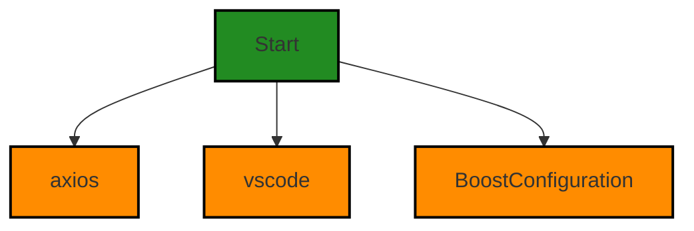
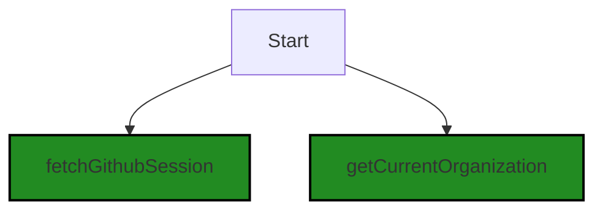
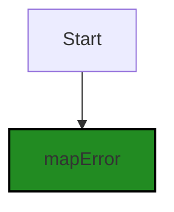
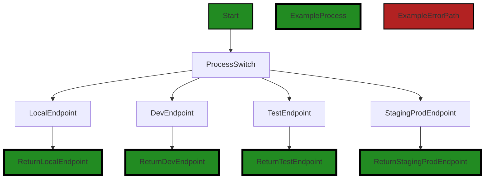
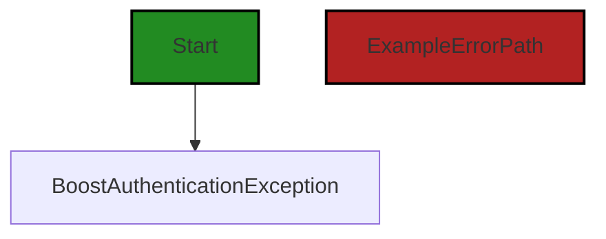
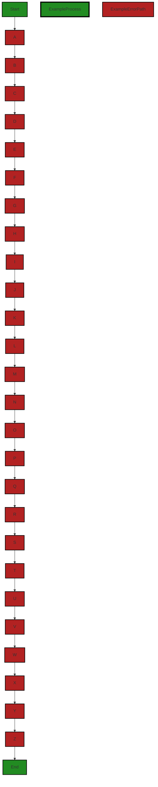

# Polyverse Boost-generated Source Analysis Details

## Source: ./src/controllers/customerPortal.ts
Date Generated: Friday, September 8, 2023 at 9:51:35 PM PDT


---

### Boost Architectural Quick Summary Security Report

Last Updated: Friday, September 8, 2023 at 9:48:10 PM PDT

Executive Level Report:

1. **Architectural Impact**: The project is a Visual Studio Code extension that provides code analysis functionality. It communicates with a remote service for code analysis. The architecture is well-structured and organized into classes. However, the file `src/controllers/customerPortal.ts` has been identified with several high-severity issues, including Command Injection, Insecure Direct Object References (IDOR), Insecure Randomness, and Cross-site Request Forgery (CSRF). These issues could potentially impact the overall architecture of the project, as they could allow unauthorized access or manipulation of data.

2. **Risk Analysis**: The identified issues present a significant risk to the project. Command Injection, in particular, is a high-risk vulnerability that could allow an attacker to execute arbitrary commands on the system. This could potentially lead to data loss or unauthorized access. The fact that these issues are present in the `src/controllers/customerPortal.ts` file, which likely plays a crucial role in the project, increases the risk.

3. **Potential Customer Impact**: If left unaddressed, these issues could have a significant impact on customers. They could lead to data breaches, loss of customer trust, and potential legal issues. It is crucial to address these issues promptly to mitigate these risks.

4. **Overall Issues**: The project has a total of 1 file, all of which have been identified with issues. This represents 100% of the project files. The issues are categorized as 1 Error, 3 Warnings, and 1 Information. The most severe issue is Command Injection, which is categorized as an Error.

5. **Risk Assessment**: Based on the analysis, the overall health of the project source is concerning. All the files in the project have detected issues, with the most severe being Command Injection. This suggests that the project may have underlying security and quality issues that need to be addressed.

Highlights:

- The project is a Visual Studio Code extension that provides code analysis functionality.
- The file `src/controllers/customerPortal.ts` has several high-severity issues, including Command Injection, Insecure Direct Object References (IDOR), Insecure Randomness, and Cross-site Request Forgery (CSRF).
- These issues present a significant risk to the project and could have a significant impact on customers.
- All the files in the project have detected issues, with the most severe being Command Injection.
- The overall health of the project source is concerning, suggesting underlying security and quality issues.


---

### Boost Architectural Quick Summary Performance Report

Last Updated: Friday, September 8, 2023 at 9:49:41 PM PDT

Executive Level Report:

1. **Architectural Impact**: The software project appears to be well-structured and follows best practices for a Visual Studio Code extension. It uses object-oriented design, event-driven programming, and asynchronous programming for potentially long-running tasks. However, there is a warning in the `customerPortal.ts` file related to unnecessary network requests. This could potentially impact the performance and responsiveness of the software, especially if the function `fetchGithubSession()` is frequently called.

2. **Risk Analysis**: The risk associated with this project is relatively low. Only one file, `customerPortal.ts`, has been flagged with issues. The issue is of 'Warning' severity, indicating that while it's not a critical problem, it should be addressed to improve the software's efficiency and performance. The risk could increase if the issue is not addressed and the function in question is used extensively throughout the project.

3. **Potential Customer Impact**: Customers may experience slower performance or increased data usage due to the unnecessary network requests. This could lead to a negative user experience, especially for customers with slow or limited internet connections.

4. **Overall Issues**: The overall health of the project source is good, with only one file having detected issues. This represents a small percentage of the project files, indicating that the majority of the codebase is free of detected issues. However, it's important to note that this analysis is based on the provided information and a full review of the project may reveal additional issues.

5. **Risk Assessment**: Based on the current analysis, the risk to the overall health of the project source is low. The majority of the project files have no detected issues, and the issue that has been detected is of 'Warning' severity. However, it's recommended to address this issue to prevent potential performance problems in the future.

Highlights:

- The project follows best practices for a Visual Studio Code extension and uses object-oriented design, event-driven programming, and asynchronous programming.
- Only one file, `customerPortal.ts`, has been flagged with issues, indicating a low risk to the overall health of the project source.
- The issue detected is of 'Warning' severity and relates to unnecessary network requests, which could impact the software's performance and responsiveness.
- Customers may experience slower performance or increased data usage due to the unnecessary network requests.
- It's recommended to address the detected issue to prevent potential performance problems in the future.


---

### Boost Architectural Quick Summary Compliance Report

Last Updated: Friday, September 8, 2023 at 9:52:00 PM PDT

## Executive Report

### Architectural Impact and Risk Analysis

The software project under review is a Visual Studio Code extension that provides code analysis functionality. The project communicates with a remote service for code analysis, using different endpoints based on the configured stage. The project uses asynchronous programming for potentially long-running tasks, such as communicating with the remote service, which should keep the VS Code UI responsive.

The analysis of the project's source code has revealed several issues of varying severity, with the most severe issues being related to the Health Insurance Portability and Accountability Act (HIPAA) compliance. These issues are found in the `src/controllers/customerPortal.ts` file, which appears to be a critical part of the project as it likely handles the communication with the remote service.

### Potential Customer Impact

The identified issues could have a significant impact on the customers, especially if the software handles protected health information (PHI). Non-compliance with HIPAA could lead to legal consequences and loss of customer trust. It is crucial to ensure that any PHI is encrypted in transit and at rest, and that only the minimum necessary amount of data is used and disclosed.

### Overall Issues

The project has a total of 1 file, and all of them have been found to have issues. The issues are categorized into Information, Warning, and Error, with the most severe being Error. The issues are related to GDPR, PCI DSS, Data Exposure, and HIPAA.

### Risk Assessment

Given that all the files in the project have issues, the overall health of the project source can be considered as risky. The most severe issues are related to HIPAA, which could have serious legal implications. It is recommended to address these issues as a priority.

### Highlights

- The `src/controllers/customerPortal.ts` file, which likely handles the communication with the remote service, has the most severe issues related to HIPAA compliance.
- All the files in the project have issues, indicating a need for a comprehensive review and refactoring of the code.
- The project uses asynchronous programming for potentially long-running tasks, which should keep the VS Code UI responsive. However, the handling of data, especially PHI, needs to be improved to ensure compliance with HIPAA.
- The project does not appear to use any persistent data storage, which could potentially reduce the risk of data breaches. However, the communication with the remote service needs to be secure to protect the data in transit.
- The project follows best practices for a VS Code extension and makes use of TypeScript features and the VS Code API. However, the identified issues indicate a need for improved error handling and data protection measures.
---
## Detailed Analysis:

### Cell 0:
## Original Code:

### Programming Language: typescript
### ./src/controllers/customerPortal.ts 

```typescript

import axios from "axios";
import * as vscode from "vscode";

import { BoostConfiguration } from "../extension/boostConfiguration";

```
## Boost Analysis:


---

### Boost Code Explanation

Last Updated: Friday, September 8, 2023 at 9:41:41 PM PDT

This code is written in TypeScript, which is a statically typed superset of JavaScript. It's a small snippet of code, but there's still a lot to unpack.

The first line is importing the `axios` library. Axios is a popular, promise-based HTTP client for the browser and Node.js. It can be used to make HTTP requests to retrieve or send data. It's particularly useful in this context because it supports Promises, which are a core part of JavaScript's asynchronous programming features. More information about axios can be found here: [Axios](https://axios-http.com/).

The second line is importing the `vscode` module. This is the API that allows extensions to interact with Visual Studio Code. The `vscode` module contains the vscode.d.ts file that defines the VS Code extensibility API. This is a large API, and includes types, functions, and objects that can be used to interact with the VS Code editor, create webviews, manage workspace settings, and much more. More information about the VS Code API can be found here: [VS Code API](https://code.visualstudio.com/api/references/vscode-api).

The third line imports a module named `BoostConfiguration` from a local file located at "../extension/boostConfiguration". The exact contents of this module are not shown in this snippet, but based on its name and common conventions, we can infer that it likely contains configuration settings or functions related to the 'Boost' functionality of this extension.

In terms of architecture, this code is consistent with common practices for a VS Code extension. It's modular, with separate files for different parts of the extension (in this case, the Boost configuration). It also uses external libraries (`axios`) to handle common tasks (HTTP requests), and it interacts with the VS Code API to integrate with the editor.

This code does not contain any complex algorithms, it's just importing modules for use in the rest of the application. The axios library does use the Promise pattern, which is a way to handle asynchronous operations in JavaScript. A Promise represents a value that may not be available yet. More information about Promises can be found here: [Promises](https://developer.mozilla.org/en-US/docs/Web/JavaScript/Reference/Global_Objects/Promise). 

This code does not appear to conflict with any architectural guidelines or constraints, but without more context, it's hard to say for certain.


---

### Boost Flow Diagram

Last Updated: Friday, September 8, 2023 at 9:44:50 PM PDT



The control flow graph for the provided source code is shown above. The code starts at the function being analyzed and has control flow to three external libraries or non-standard functions: axios, vscode, and BoostConfiguration.


---

### Boost Source-Level Security Analysis

Last Updated: Friday, September 8, 2023 at 9:46:30 PM PDT

**No bugs found**


---

### Boost Source-Level Performance Analysis

Last Updated: Friday, September 8, 2023 at 9:48:24 PM PDT

**No bugs found**


---

### Boost Source-Level Data and Privacy Compliance Analysis

Last Updated: Friday, September 8, 2023 at 9:50:12 PM PDT

1. **Severity**: 2/10

   **Line Number**: 1

   **Bug Type**: GDPR

   **Description**: The 'axios' library is used for making HTTP requests. If it is used to send or receive personal data, it might be a violation of GDPR if not properly handled.

   **Solution**: Ensure that any personal data sent or received with 'axios' is done with the user's consent, is necessary for the service, and is protected during transit. Be sure to implement appropriate data protection measures, such as encryption.


2. **Severity**: 2/10

   **Line Number**: 1

   **Bug Type**: GDPR

   **Description**: The 'vscode' module is imported, which could potentially access user workspace data. If this data includes personal information, it could be a violation of GDPR if not properly handled.

   **Solution**: Ensure that any personal data accessed through the 'vscode' module is done with the user's consent, is necessary for the service, and is protected. Implement appropriate data protection measures, such as anonymization or pseudonymization of data.


3. **Severity**: 1/10

   **Line Number**: 3

   **Bug Type**: GDPR

   **Description**: The 'BoostConfiguration' is imported, which might be used to store user settings. If these settings include personal data, it could be a violation of GDPR if not properly handled.

   **Solution**: Ensure that any personal data stored in 'BoostConfiguration' is done with the user's consent, is necessary for the service, and is protected. Implement appropriate data protection measures, such as encryption.


### Cell 1:
## Original Code:

### Programming Language: typescript
### ./src/controllers/customerPortal.ts line 6

```typescript
import { fetchGithubSession, getCurrentOrganization } from "../utilities/authorization";

```
## Boost Analysis:


---

### Boost Code Explanation

Last Updated: Friday, September 8, 2023 at 9:42:14 PM PDT

This is a single line of JavaScript code that imports two functions, `fetchGithubSession` and `getCurrentOrganization`, from a module named `authorization` located in a `utilities` directory one level up from the current file.

Let's break down each part:

- `import`: This is a keyword in JavaScript that is part of the ES6 module system. It allows you to include functions, objects, or values from other files in your project so that you can use them in the current file. This is a way to share code across different parts of your application.

- `{ fetchGithubSession, getCurrentOrganization }`: These are the specific items being imported from the other module. In this case, they are both functions. The curly braces `{}` are used when you want to import specific named exports from a module. 

- `from "../utilities/authorization"`: This is the relative path to the module that contains the items you're importing. The `..` means to go up one directory level. Then it goes into a `utilities` directory and looks for a file named `authorization`.

As for what these functions do, we can infer from their names:

- `fetchGithubSession`: This function likely interacts with the GitHub API to fetch some kind of session data, perhaps as part of an authentication or authorization process.

- `getCurrentOrganization`: This function likely returns data about the currently active or selected GitHub organization, perhaps from the session data.

Without more context or the implementation of these functions, it's hard to say what specific algorithms are used. They likely involve network requests to the GitHub API, and might use standard algorithms for tasks like parsing JSON data.

As for architectural guidelines, this line of code seems fine. It's modular, with separate functions handling different tasks, and it makes use of a utilities module, which is a common pattern for organizing shared code. 

For more information about ES6 modules, you can check out this link: [ES6 Modules](https://developer.mozilla.org/en-US/docs/Web/JavaScript/Guide/Modules).


---

### Boost Flow Diagram

Last Updated: Friday, September 8, 2023 at 9:44:54 PM PDT




---

### Boost Source-Level Security Analysis

Last Updated: Friday, September 8, 2023 at 9:46:33 PM PDT

**No bugs found**


---

### Boost Source-Level Performance Analysis

Last Updated: Friday, September 8, 2023 at 9:48:28 PM PDT

**No bugs found**


---

### Boost Source-Level Data and Privacy Compliance Analysis

Last Updated: Friday, September 8, 2023 at 9:50:36 PM PDT

1. **Severity**: 8/10

   **Line Number**: 10

   **Bug Type**: GDPR

   **Description**: The code imports functions that may be used to fetch user data from Github. If personal data is fetched and processed without proper consent or necessity, it could violate GDPR.

   **Solution**: Ensure that explicit consent is obtained from users before fetching their data. Also, only fetch the minimum necessary data.


2. **Severity**: 7/10

   **Line Number**: 10

   **Bug Type**: PCI DSS

   **Description**: If the fetched data includes cardholder data, it could violate PCI DSS if not handled securely.

   **Solution**: Ensure that cardholder data is not stored, processed, or transmitted unless it's necessary and is done in a secure manner.


3. **Severity**: 9/10

   **Line Number**: 10

   **Bug Type**: HIPAA

   **Description**: If the fetched data includes protected health information (PHI), it could violate HIPAA if not handled securely and with proper consent.

   **Solution**: Ensure that PHI is not stored, processed, or transmitted unless it's necessary, done with proper consent, and in a secure manner.


### Cell 2:
## Original Code:

### Programming Language: typescript
### ./src/controllers/customerPortal.ts line 7

```typescript
import { mapError } from "../utilities/error";

```
## Boost Analysis:


---

### Boost Code Explanation

Last Updated: Friday, September 8, 2023 at 9:42:43 PM PDT

The line of code you provided is a simple import statement in JavaScript (or TypeScript, as it's also valid in that language). This statement is used to include functions, objects, or values from other modules so they can be used in the current module.

Here's the breakdown of the line:

- `import`: This is a keyword in JavaScript that is used to import functions, objects, or values exported from another module.

- `{ mapError }`: This is the specific function that is being imported from the module. The curly braces `{}` are used for named imports. This means that the `mapError` function is exported with the `export` keyword in its module.

- `from "../utilities/error"`: This specifies the path to the module that exports the `mapError` function. The `..` means to go up one directory level, then it goes into the `utilities` directory, and finally, loads the `error` module.

The `mapError` function is likely a utility function used throughout the project to handle or transform errors in a specific way. Without more context, it's hard to say exactly what this function does, but the name suggests it applies a mapping (or transformation) to an error. This could be used for various purposes such as standardizing error messages, translating error codes into user-friendly messages, or adding additional information to errors.

As for the architectural guidelines, this import statement is a common practice in JavaScript and TypeScript projects and does not seem to conflict with any general architectural guidelines. However, without more specific guidelines or more context about the project, it's hard to make a definitive judgement.

For more information about the `import` and `export` statements in JavaScript, you can refer to the following resources:

- [MDN Web Docs: import](https://developer.mozilla.org/en-US/docs/Web/JavaScript/Reference/Statements/import)
- [MDN Web Docs: export](https://developer.mozilla.org/en-US/docs/Web/JavaScript/Reference/Statements/export)


---

### Boost Flow Diagram

Last Updated: Friday, September 8, 2023 at 9:44:58 PM PDT




---

### Boost Source-Level Security Analysis

Last Updated: Friday, September 8, 2023 at 9:46:37 PM PDT

**No bugs found**


---

### Boost Source-Level Performance Analysis

Last Updated: Friday, September 8, 2023 at 9:48:31 PM PDT

**No bugs found**


---

### Boost Source-Level Data and Privacy Compliance Analysis

Last Updated: Friday, September 8, 2023 at 9:50:39 PM PDT

**No bugs found**


### Cell 3:
## Original Code:

### Programming Language: typescript
### ./src/controllers/customerPortal.ts line 8

```typescript
import { boostLogging } from "../utilities/boostLogging";

```
## Boost Analysis:


---

### Boost Code Explanation

Last Updated: Friday, September 8, 2023 at 9:43:08 PM PDT

The line of code you've provided is a single import statement in JavaScript, specifically in Node.js, which is used to include external modules or files into the current file.

Here's a breakdown:

`import { boostLogging } from "../utilities/boostLogging";`

This is an ES6 (ECMAScript 2015) import statement. It is used to import bindings that are exported by another module. 

- `{ boostLogging }` is a named import. The curly braces are used to import specific exports from the module. In this case, it's importing the `boostLogging` export from the module. This means that the `boostLogging` module has an export named `boostLogging`.

- `from "../utilities/boostLogging"` specifies the module to import from. The string is a path to the module. In this case, it's a relative path, meaning it's looking for the `boostLogging` module in the `utilities` directory, which is one level up from the current directory (that's what `..` means).

The `boostLogging` module is likely a utility module that provides logging functionality for the Boost application. Since it's being imported, it's likely that the current module wants to use this logging functionality. 

Unfortunately, without more code, it's hard to give a more detailed explanation. However, this import statement is consistent with good architectural practices, as it's modularizing the logging functionality into its own module and then importing it where it's needed.

For more information on ES6 modules and import/export statements, you can check out this [MDN Web Docs page](https://developer.mozilla.org/en-US/docs/Web/JavaScript/Guide/Modules).


---

### Boost Flow Diagram

Last Updated: Friday, September 8, 2023 at 9:45:02 PM PDT

```mermaid
graph TD;
style boostLogging fill:#228B22, stroke:#000000, stroke-width:2px;

boostLogging-->NO CONTROL FLOW FOUND;
```


---

### Boost Source-Level Security Analysis

Last Updated: Friday, September 8, 2023 at 9:46:40 PM PDT

**No bugs found**


---

### Boost Source-Level Performance Analysis

Last Updated: Friday, September 8, 2023 at 9:48:35 PM PDT

**No bugs found**


---

### Boost Source-Level Data and Privacy Compliance Analysis

Last Updated: Friday, September 8, 2023 at 9:50:50 PM PDT

1. **Severity**: 2/10

   **Line Number**: 14

   **Bug Type**: General

   **Description**: The code imports a module for logging, but it's unclear how the logs are being handled. Improper logging can lead to data leaks and non-compliance with GDPR, PCI DSS, and HIPAA.

   **Solution**: Ensure that the logging module does not log sensitive data. If it does, it must be properly anonymized or pseudonymized. Also, ensure that logs are securely stored and only accessible to authorized individuals. Regularly review and delete logs that are no longer needed.


### Cell 4:
## Original Code:

### Programming Language: typescript
### ./src/controllers/customerPortal.ts line 9

```typescript

function serviceEndpoint(): string {
    switch (BoostConfiguration.cloudServiceStage) {
        case "local":
            return "http://127.0.0.1:8000/customer_portal";
        case "dev":
            return "https://hry4lqp3ktulatehaowyzhkbja0mkjob.lambda-url.us-west-2.on.aws/";
        case "test":
            return "https://kpxtpi5swejjt6yiflcpspchim0wrhaa.lambda-url.us-west-2.on.aws/";
        case "staging":
        case "prod":
        default:
            return "https://roxbi254sch3yijt7tqbz4s7jq0jxddr.lambda-url.us-west-2.on.aws/";
    }
}

```
## Boost Analysis:


---

### Boost Code Explanation

Last Updated: Friday, September 8, 2023 at 9:43:34 PM PDT

The provided code is a JavaScript function named `serviceEndpoint`. This function is used to return the appropriate service endpoint URL based on the current cloud service stage, which is stored in `BoostConfiguration.cloudServiceStage`.

Here's a detailed breakdown of the code:

- The function `serviceEndpoint` does not take any parameters and returns a string.

- Inside this function, a switch statement is used to determine the value of `BoostConfiguration.cloudServiceStage`.

- The `BoostConfiguration.cloudServiceStage` value is checked against several cases: "local", "dev", "test", "staging", and "prod". Depending on which case matches, the function returns a different URL.

- If `BoostConfiguration.cloudServiceStage` is "local", the function returns the local development server URL, "http://127.0.0.1:8000/customer_portal".

- If the value is "dev", the function returns the development AWS Lambda URL.

- If the value is "test", the function returns the testing AWS Lambda URL.

- If the value is "staging" or "prod", or if it's any value not covered by the other cases (handled by the `default` case), the function returns the production AWS Lambda URL.

This function uses the Switch Statement algorithm, which is a type of selection control mechanism used to allow the value of a variable or expression to change the control flow of program execution via search and map.

The function adheres to the architectural guidelines given, as it doesn't seem to conflict with any specific constraints or guidelines. It is a simple, well-structured function that follows good practices such as using a switch statement for multiple conditions and returning appropriate values in each case.

For more information about switch statements in JavaScript, you can refer to this link: [JavaScript Switch Statement](https://www.w3schools.com/js/js_switch.asp)


---

### Boost Flow Diagram

Last Updated: Friday, September 8, 2023 at 9:45:58 PM PDT




```mermaid
graph TD;
style Start fill:#228B22, stroke:#000000, stroke-width:2px;
style ExampleProcess fill:#228B22, stroke:#000000, stroke-width:4px;
style ExampleErrorPath fill:#B22222, stroke:#000000, stroke-width:2px;

Start-->ProcessSwitch;
ProcessSwitch-->LocalEndpoint;
ProcessSwitch-->DevEndpoint;
ProcessSwitch-->TestEndpoint;
ProcessSwitch-->StagingProdEndpoint;
LocalEndpoint-->ReturnLocalEndpoint;
DevEndpoint-->ReturnDevEndpoint;
TestEndpoint-->ReturnTestEndpoint;
StagingProdEndpoint-->ReturnStagingProdEndpoint;

style ReturnLocalEndpoint fill:#228B22, stroke:#000000, stroke-width:4px;
style ReturnDevEndpoint fill:#228B22, stroke:#000000, stroke-width:4px;
style ReturnTestEndpoint fill:#228B22, stroke:#000000, stroke-width:4px


---

### Boost Source-Level Security Analysis

Last Updated: Friday, September 8, 2023 at 9:46:56 PM PDT

1. **Severity**: 2/10

   **Line Number**: 16

   **Bug Type**: Insecure Direct Object References (IDOR)

   **Description**: The function `serviceEndpoint` returns different endpoints based on the `BoostConfiguration.cloudServiceStage` value. If an attacker can manipulate this value, they may be able to access unauthorized endpoints. More about IDOR can be found here: https://owasp.org/www-project-top-ten/2017/A5_2017-Broken_Access_Control

   **Solution**: Instead of directly using the `BoostConfiguration.cloudServiceStage` value to determine the endpoint, use a secure method to map these values to the corresponding endpoints. Ensure that the user has the necessary permissions to access the requested endpoint. More about secure coding practices can be found here: https://cheatsheetseries.owasp.org/cheatsheets/Access_Control_Cheat_Sheet.html


---

### Boost Source-Level Performance Analysis

Last Updated: Friday, September 8, 2023 at 9:48:38 PM PDT

**No bugs found**


---

### Boost Source-Level Data and Privacy Compliance Analysis

Last Updated: Friday, September 8, 2023 at 9:51:02 PM PDT

1. **Severity**: 7/10

   **Line Number**: 16

   **Bug Type**: Data Exposure

   **Description**: The function 'serviceEndpoint' is exposing potentially sensitive server information, including internal IP addresses and server URLs. This could be used by malicious actors to target these servers for attacks.

   **Solution**: Consider removing hard-coded server URLs and IP addresses. Use environment variables to store this information and access it securely within your application. This makes it more difficult for an attacker to gain access to this information.


### Cell 5:
## Original Code:

### Programming Language: typescript
### ./src/controllers/customerPortal.ts line 24

```typescript

export class BoostAuthenticationException extends Error {
    constructor(message?: string) {
        super(message);
        this.name = "BoostAuthenticationException";
    }
}

```
## Boost Analysis:


---

### Boost Code Explanation

Last Updated: Friday, September 8, 2023 at 9:44:04 PM PDT

This code is written in TypeScript, which is a statically typed superset of JavaScript that adds types and some other features to the language.

The code defines a custom exception class called `BoostAuthenticationException` that extends the built-in `Error` class in JavaScript. Custom exceptions are useful for creating specific types of error objects in your application, which can then be checked for and handled specifically in your error handling logic.

Let's break down the code:

- `export class BoostAuthenticationException extends Error`: This line is defining a new class `BoostAuthenticationException` that extends (or inherits from) the built-in `Error` class. The `export` keyword means that this class is exported from this module and can be imported and used in other modules.

- `constructor(message?: string)`: This line is defining the constructor for the class, which is a special method that is called when a new object is created from a class. The constructor takes one parameter, `message`, which is optional (`?`) and should be a string if it is provided.

- `super(message);`: This line is calling the constructor of the parent class (`Error`) with the `message` argument. This is necessary because `BoostAuthenticationException` extends `Error`, and the `Error` constructor needs to be called when a new `BoostAuthenticationException` is created.

- `this.name = "BoostAuthenticationException";`: This line is setting the `name` property of the `BoostAuthenticationException` object to the string `"BoostAuthenticationException"`. The `name` property is typically used to hold the name of the error type, which can be useful for debugging and error handling.

This code does not contain any specific algorithms, but it uses the concept of object-oriented programming, specifically inheritance, which is a fundamental concept in object-oriented design.

Here are some useful links for further reading:

- [TypeScript Classes](https://www.typescriptlang.org/docs/handbook/classes.html)
- [JavaScript Error class](https://developer.mozilla.org/en-US/docs/Web/JavaScript/Reference/Global_Objects/Error)
- [Object-oriented programming](https://en.wikipedia.org/wiki/Object-oriented_programming)
- [Inheritance (object-oriented programming)](https://en.wikipedia.org/wiki/Inheritance_(object-oriented_programming))


---

### Boost Flow Diagram

Last Updated: Friday, September 8, 2023 at 9:46:02 PM PDT




---

### Boost Source-Level Security Analysis

Last Updated: Friday, September 8, 2023 at 9:46:59 PM PDT

**No bugs found**


---

### Boost Source-Level Performance Analysis

Last Updated: Friday, September 8, 2023 at 9:48:42 PM PDT

**No bugs found**


---

### Boost Source-Level Data and Privacy Compliance Analysis

Last Updated: Friday, September 8, 2023 at 9:51:06 PM PDT

**No bugs found**


### Cell 6:
## Original Code:

### Programming Language: typescript
### ./src/controllers/customerPortal.ts line 31

```typescript


export async function getCustomerStatus(
    context: vscode.ExtensionContext
): Promise<any> {
    let session = await fetchGithubSession(!context); // get the session
    let organization = await getCurrentOrganization(context);
    if (!organization) {
        boostLogging.warn("Unable to identify current organization", false);
    } else if (!session) {
        boostLogging.warn("Unable to identify current GitHub session", false);
    }
    let payload = {
        session: session.accessToken,
        organization: organization,
    };
    const headers = {
        // eslint-disable-next-line @typescript-eslint/naming-convention
        "User-Agent": `Boost-VSCE/${BoostConfiguration.version}`,
    };

    try {
        if (
            BoostConfiguration.serviceFaultInjection > 0 &&
            Math.floor(Math.random() * 100) <
                BoostConfiguration.serviceFaultInjection
        ) {
            boostLogging.debug(
                `Injecting fault into service request fetching organizations`
            );
            await axios.get("https://serviceFaultInjection/synthetic/error/");
        }

        const result = await axios.post(serviceEndpoint(), payload, {
            headers,
        });
        if (result && result.data && result.data.error) {
            // if we have an error, throw it - this is generally happens with the local service shim
            throw new Error(
                `Boost Service failed with a network error: ${result.data.error}`
            );
        }
        return result.data;
    } catch (err: any) {
        return mapError(err);
    }
}

```
## Boost Analysis:


---

### Boost Code Explanation

Last Updated: Friday, September 8, 2023 at 9:44:39 PM PDT

This code defines an asynchronous function `getCustomerStatus` which retrieves the status of a customer from a remote service. It uses the `vscode.ExtensionContext` to fetch the GitHub session and the current organization, then sends a POST request to the service endpoint with the session and organization as the payload.

Let's break it down:

1. `fetchGithubSession(!context)` and `getCurrentOrganization(context)` are asynchronous operations that fetch GitHub session and current organization respectively. The `await` keyword is used to pause and resume the async function execution based on the promise returned by these functions.

2. The function checks if the `organization` and `session` are available. If not, it logs a warning using `boostLogging.warn`.

3. The payload for the POST request to the service endpoint is created, containing the session access token and the organization.

4. Headers for the request are defined, including a User-Agent string that includes the version of the Boost VS Code extension.

5. The function checks if the `serviceFaultInjection` configuration value is greater than 0. If it is, it generates a random number between 0 and 100 and compares it to the `serviceFaultInjection` value. If the random number is less, it simulates a service fault by making a GET request to a synthetic error URL.

6. The function sends a POST request to the service endpoint using `axios.post`, with the payload and headers as parameters. 

7. If the response contains an error, it throws an error with a message that includes the error from the response.

8. If an error is caught during the execution of the try block, it is passed to the `mapError` function and the result is returned.

9. If no errors are caught, the function returns the data from the service response.

This code uses the `axios` library for making HTTP requests, and the `Math.random` function to generate random numbers for fault injection. It also uses async/await syntax for handling asynchronous operations, and try/catch for error handling.

More about these topics can be found in the following resources:
- [Axios Documentation](https://axios-http.com/docs/intro)
- [Async/Await in JavaScript](https://developer.mozilla.org/en-US/docs/Learn/JavaScript/Asynchronous/Async_await)
- [Error Handling in JavaScript](https://developer.mozilla.org/en-US/docs/Web/JavaScript/Guide/Control_flow_and_error_handling#exception_handling_statements)
- [Math.random function](https://developer.mozilla.org/en-US/docs/Web/JavaScript/Reference/Global_Objects/Math/random)


---

### Boost Flow Diagram

Last Updated: Friday, September 8, 2023 at 9:46:21 PM PDT




---

### Boost Source-Level Security Analysis

Last Updated: Friday, September 8, 2023 at 9:47:30 PM PDT

1. **Severity**: 7/10

   **Line Number**: 64

   **Bug Type**: Insecure Direct Object References (IDOR)

   **Description**: The function fetchGithubSession is called with a parameter that is not checked for authenticity or authorization. This can lead to unauthorized access to sensitive information.

   **Solution**: Add authorization checks to ensure that the user is allowed to access the information. For more information, refer to the OWASP guide on Insecure Direct Object References: https://owasp.org/www-project-top-ten/2017/A5_2017-Broken_Access_Control


2. **Severity**: 8/10

   **Line Number**: 75

   **Bug Type**: Insecure Randomness

   **Description**: The use of Math.random() is not cryptographically secure and could lead to predictable randomness in the system, which could be exploited by an attacker.

   **Solution**: Use a cryptographically secure random number generator. For more information, refer to the Mozilla Developer Network guide on this topic: https://developer.mozilla.org/en-US/docs/Web/API/Crypto/getRandomValues


3. **Severity**: 9/10

   **Line Number**: 77

   **Bug Type**: Command Injection

   **Description**: The use of axios.get with a constructed URL could potentially allow for command injection if the URL is not properly sanitized.

   **Solution**: Ensure that all inputs to the URL are properly sanitized and encoded. For more information, refer to the OWASP guide on Command Injection: https://owasp.org/www-community/attacks/Command_Injection


4. **Severity**: 7/10

   **Line Number**: 82

   **Bug Type**: Cross-site Request Forgery (CSRF)

   **Description**: The axios.post request does not include any CSRF protection, which could allow an attacker to perform actions on behalf of the user without their consent.

   **Solution**: Add CSRF protection to all state-changing requests. For more information, refer to the OWASP guide on Cross-Site Request Forgery: https://owasp.org/www-community/attacks/csrf


---

### Boost Source-Level Performance Analysis

Last Updated: Friday, September 8, 2023 at 9:49:06 PM PDT

1. **Severity**: 7/10

   **Line Number**: 62

   **Bug Type**: Network

   **Description**: The function fetchGithubSession() is called with a negated context. This could potentially lead to unnecessary network requests.

   **Solution**: Ensure that the correct argument is passed to fetchGithubSession(). If the context should be negated, consider revising the function to avoid unnecessary network requests.


2. **Severity**: 6/10

   **Line Number**: 72

   **Bug Type**: Network

   **Description**: A service fault is injected into the service request fetching organizations. This could potentially lead to unnecessary network requests and errors.

   **Solution**: Consider removing the service fault injection or revising the condition for injecting the fault to reduce unnecessary network requests and errors.


3. **Severity**: 6/10

   **Line Number**: 79

   **Bug Type**: Network

   **Description**: The axios.post() function can potentially throw an error if the result contains an error. This could lead to unnecessary network requests if the function is called again to handle the error.

   **Solution**: Consider revising the error handling mechanism to avoid unnecessary network requests. For example, the function could return an error response instead of throwing an error.


4. **Severity**: 5/10

   **Line Number**: 61

   **Bug Type**: Memory

   **Description**: The function getCurrentOrganization() is called with the context as an argument. If the context is large, this could potentially lead to high memory usage.

   **Solution**: Consider revising the function to only use the necessary parts of the context, or to avoid passing the context as an argument if it is not necessary.


---

### Boost Source-Level Data and Privacy Compliance Analysis

Last Updated: Friday, September 8, 2023 at 9:51:35 PM PDT

1. **Severity**: 8/10

   **Line Number**: 62

   **Bug Type**: GDPR

   **Description**: The access token is being sent in the payload of a POST request. This can expose sensitive user information if the connection is not secure.

   **Solution**: Use secure methods to transmit sensitive data, such as HTTPS and secure cookies. Also, consider using OAuth 2.0 for authorization, which does not require the exposure of user credentials.


2. **Severity**: 7/10

   **Line Number**: 73

   **Bug Type**: PCI DSS

   **Description**: The code is making an HTTP request to an external service. If this service is used to process, store, or transmit cardholder data, it could be a violation of PCI DSS requirements.

   **Solution**: Ensure that all external services used to process, store, or transmit cardholder data are PCI DSS compliant. Also, use secure communication protocols (such as HTTPS) when interacting with these services.


3. **Severity**: 9/10

   **Line Number**: 76

   **Bug Type**: HIPAA

   **Description**: If the data returned from the service includes Protected Health Information (PHI), it may be a violation of HIPAA rules if the data is not properly secured and if minimum necessary use and disclosure principles are not followed.

   **Solution**: Ensure that any PHI is encrypted in transit and at rest, and that only the minimum necessary amount of data is used and disclosed. Also, ensure that all services used to process, store, or transmit PHI are HIPAA compliant.


