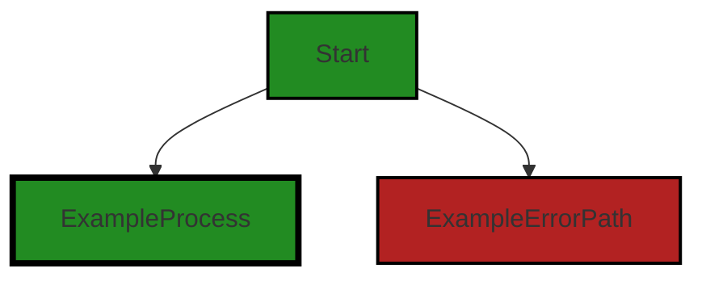
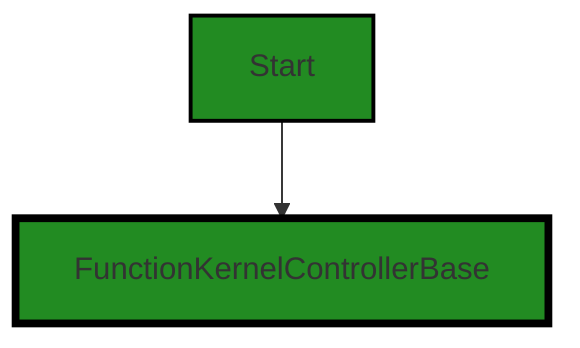
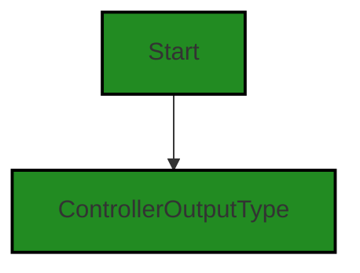
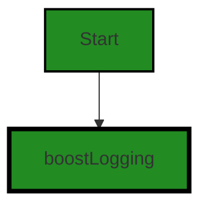
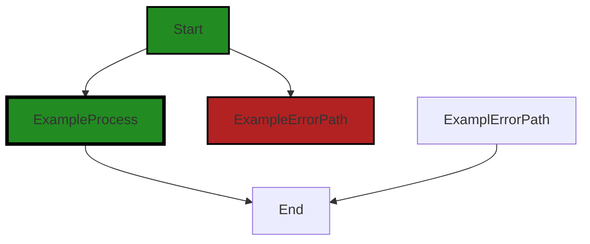

# Polyverse Boost-generated Source Analysis Details

## Source: ./src/controllers/customquickscan_function_controller.ts
Date Generated: Friday, September 8, 2023 at 11:09:27 PM PDT


---

### Boost Architectural Quick Summary Security Report

Last Updated: Friday, September 8, 2023 at 11:06:07 PM PDT

Executive Level Report:

1. **Architectural Impact**: The software project is a Visual Studio Code extension that provides code analysis functionality. It is well-structured and follows best practices for a VS Code extension. However, there is a potential architectural risk in the `customquickscan_function_controller.ts` file, where user input is directly passed into a function that makes a service request. This could potentially expose sensitive information in the event of a logging error or a debugging session. 

2. **Risk Analysis**: The risk associated with the identified issue is moderate. While the potential for information disclosure exists, it is contingent on a logging error or debugging session. The risk is further mitigated by the project's extensive error handling and logging. However, it is recommended to ensure that user input is properly sanitized and that sensitive information is not logged or exposed in any way.

3. **Potential Customer Impact**: If the identified issue is not addressed, it could potentially lead to information disclosure, which could impact the trust and confidence of the customers in the software. However, the likelihood of this happening is low due to the project's extensive error handling and logging.

4. **Overall Issues**: The overall health of the project source is good. Only one file, `customquickscan_function_controller.ts`, has been identified with issues. This represents a small percentage of the project files, indicating that the majority of the project files are free from detected issues.

Risk Assessment:

- **Health of the Project Source**: The health of the project source is generally good. The majority of the project files have no detected issues. Only one file has been identified with issues, representing a small percentage of the project files.
- **Severity of Issues**: The severity of the issues identified is moderate. The most severe issue identified is a warning for potential information disclosure.
- **Mitigation Measures**: The project has extensive error handling and logging, which helps to mitigate the risks associated with the identified issues. It is recommended to further mitigate these risks by ensuring that user input is properly sanitized and that sensitive information is not logged or exposed in any way.

Highlights:

- The software project is well-structured and follows best practices for a VS Code extension.
- A potential architectural risk has been identified in the `customquickscan_function_controller.ts` file, where user input is directly passed into a function that makes a service request.
- The risk associated with the identified issue is moderate and is mitigated by the project's extensive error handling and logging.
- The overall health of the project source is good, with the majority of the project files having no detected issues.
- The project uses asynchronous programming for potentially long-running tasks, which should keep the VS Code UI responsive.


---

### Boost Architectural Quick Summary Performance Report

Last Updated: Friday, September 8, 2023 at 11:07:06 PM PDT


Executive Report:

1. **Architectural Impact**: The analysis of this file has not revealed any severe issues.
2. **Risk Analysis**: The analysis of this file has not revealed any severe issues.
3. **Potential Customer Impact**: Based on the analysis, there are no severe issues that could potentially impact customers.
4. **Performance Issues**: Our analysis did not identify any explicit performance issues in the file.
5. **Risk Assessment**: Based on the current analysis of this file, no severe issues have been found. However, this doesn't guarantee that the file is risk-free.

Highlights:

- No severe issues were identified in the current analysis of this file.


---

### Boost Architectural Quick Summary Compliance Report

Last Updated: Friday, September 8, 2023 at 11:10:04 PM PDT

## Executive Report

### Architectural Impact and Risk Analysis

The software project under review is a Visual Studio Code extension that provides code analysis functionality. The project is well-structured and follows best practices for a VS Code extension. However, there are some potential data compliance issues that could impact the project's architecture and risk profile.

1. **Data Compliance Issues**: The file `src/controllers/customquickscan_function_controller.ts` has been flagged for potential data compliance issues. Specifically, there are concerns related to GDPR, PCI DSS, and HIPAA. If the project handles sensitive data such as cardholder data or protected health information, these issues could have significant architectural implications. The project may need to implement additional security measures to ensure compliance with these regulations.

2. **Risk Assessment**: The project consists of a single file, `src/controllers/customquickscan_function_controller.ts`, which has been flagged for potential issues. This means that 100% of the project files have been flagged for potential issues. The severity of these issues ranges from Information to Warning. This suggests that while there are potential issues, they may not be critical. However, the presence of potential data compliance issues could increase the risk profile of the project.

3. **Potential Customer Impact**: If the potential data compliance issues are not addressed, this could impact customers who use the software. For example, if the software handles sensitive data in a way that is not compliant with GDPR, PCI DSS, or HIPAA, customers could be at risk of data breaches. This could lead to reputational damage and potential legal consequences for the customers.

4. **Overall Health of the Project**: Despite the potential issues, the overall health of the project appears to be good. The project follows best practices for a VS Code extension and makes use of TypeScript features and the VS Code API. The code is well-structured and organized into classes. However, the potential data compliance issues should be addressed to ensure the ongoing health of the project.

### Highlights

- The project is well-structured and follows best practices for a VS Code extension.
- The file `src/controllers/customquickscan_function_controller.ts` has been flagged for potential data compliance issues related to GDPR, PCI DSS, and HIPAA.
- 100% of the project files have been flagged for potential issues, suggesting that there may be areas for improvement.
- If the potential data compliance issues are not addressed, this could impact customers who use the software.
- Despite the potential issues, the overall health of the project appears to be good.
---
## Detailed Analysis:

### Cell 0:
## Original Code:

### Programming Language: typescript
### ./src/controllers/customquickscan_function_controller.ts 

```typescript
import { DiagnosticCollection, ExtensionContext } from 'vscode';

```
## Boost Analysis:


---

### Boost Code Explanation

Last Updated: Friday, September 8, 2023 at 11:00:37 PM PDT

This piece of code is written in TypeScript, a statically-typed superset of JavaScript, and it's used to develop extensions for Visual Studio Code (VS Code). The code is importing two specific items from the 'vscode' module, which is a Node.js module provided by the VS Code Extension API.

Here are the details of the imported items:

1. `DiagnosticCollection`: This is an interface provided by the VS Code Extension API. A DiagnosticCollection is a set of diagnostics, which are issues in the code that VS Code can detect and show to the user. Diagnostics can represent things like syntax errors, unused variables, or other potential problems. Collections allow for grouping of related diagnostics, and they can be associated with a specific source or owner for better organization.

2. `ExtensionContext`: This is another interface provided by the VS Code Extension API. An ExtensionContext is passed to the `activate` function of an extension when it is activated. It provides properties and methods that give information about the context in which the extension is running, and it allows for interacting with the VS Code environment. For example, it can be used to get the absolute file path of a resource contained in the extension, or to create output channels for logging.

The code doesn't contain any algorithms per se, it's just importing these two interfaces for use in the rest of the source code.

For more information about developing VS Code extensions and the Extension API, you can refer to the following resources:

- [VS Code Extension API](https://code.visualstudio.com/api/references/vscode-api)
- [VS Code Extension Examples](https://code.visualstudio.com/api/get-started/your-first-extension)
- [TypeScript Documentation](https://www.typescriptlang.org/docs/)


---

### Boost Flow Diagram

Last Updated: Friday, September 8, 2023 at 11:03:46 PM PDT



NO CONTROL FLOW FOUND


---

### Boost Source-Level Security Analysis

Last Updated: Friday, September 8, 2023 at 11:04:29 PM PDT

**No bugs found**


---

### Boost Source-Level Performance Analysis

Last Updated: Friday, September 8, 2023 at 11:06:14 PM PDT

**No bugs found**


---

### Boost Source-Level Data and Privacy Compliance Analysis

Last Updated: Friday, September 8, 2023 at 11:07:27 PM PDT

1. **Severity**: 3/10

   **Line Number**: 1

   **Bug Type**: Data Compliance

   **Description**: The code imports a module from 'vscode' which could potentially access sensitive user data. If this data is not properly handled, it could lead to GDPR, PCI DSS, and HIPAA compliance issues.

   **Solution**: Ensure that any data accessed through this module is handled in a secure and compliant manner. This includes not storing sensitive data unless necessary, encrypting sensitive data at rest and in transit, and obtaining user consent before collecting or processing their data.


### Cell 1:
## Original Code:

### Programming Language: typescript
### ./src/controllers/customquickscan_function_controller.ts line 2

```typescript
import { BoostConfiguration } from '../extension/boostConfiguration';

```
## Boost Analysis:


---

### Boost Code Explanation

Last Updated: Friday, September 8, 2023 at 11:01:02 PM PDT

The code you provided is a single line of code, and it's an import statement in JavaScript (or TypeScript, given the context). It's importing a module named `BoostConfiguration` from a relative path `../extension/boostConfiguration`.

Here's a detailed explanation:

- The `import` keyword is used to import bindings that are exported by another module. Imported modules are in strict mode whether you declare them as such or not. The `import` statement cannot be used in embedded scripts unless such a script has a `type="module"`.

- `{ BoostConfiguration }`: This is a named import. The BoostConfiguration module is being imported into the current file. The curly braces are used for importing specific functions or objects from the module. 

- `'../extension/boostConfiguration'`: This is a relative path to the module that you want to import. The `..` means it's going up one level in the directory structure, and then going into the `extension` directory to import the `boostConfiguration` module.

The `BoostConfiguration` module is likely to be a part of the configuration setup for the Boost extension in the VS Code project. It might contain settings, constants, and configuration-related functions that are needed for the Boost extension to operate correctly.

This line of code doesn't really involve any algorithm. It's more about the organization and structure of the code. The use of modules helps in separating concerns and making the code more maintainable and reusable.

For more information on JavaScript modules and import statement, you can check the following resources:

- [Mozilla Developer Network (MDN) documentation on JavaScript Modules](https://developer.mozilla.org/en-US/docs/Web/JavaScript/Guide/Modules)
- [MDN documentation on import statement](https://developer.mozilla.org/en-US/docs/Web/JavaScript/Reference/Statements/import)


---

### Boost Flow Diagram

Last Updated: Friday, September 8, 2023 at 11:03:49 PM PDT

NO CONTROL FLOW FOUND


---

### Boost Source-Level Security Analysis

Last Updated: Friday, September 8, 2023 at 11:04:32 PM PDT

**No bugs found**


---

### Boost Source-Level Performance Analysis

Last Updated: Friday, September 8, 2023 at 11:06:18 PM PDT

**No bugs found**


---

### Boost Source-Level Data and Privacy Compliance Analysis

Last Updated: Friday, September 8, 2023 at 11:07:43 PM PDT

1. **Severity**: 2/10

   **Line Number**: 2

   **Bug Type**: Data Compliance

   **Description**: The code imports a module that may handle sensitive data. If this module does not comply with GDPR, PCI DSS, and HIPAA, it could lead to data compliance issues.

   **Solution**: Review the 'BoostConfiguration' module to ensure it handles data in a manner compliant with GDPR, PCI DSS, and HIPAA. This includes ensuring data is encrypted, access is controlled, and data is not unnecessarily stored or transferred. If the module is not compliant, it should be updated or replaced with a compliant one.


### Cell 2:
## Original Code:

### Programming Language: typescript
### ./src/controllers/customquickscan_function_controller.ts line 3

```typescript
import { FunctionKernelControllerBase } from './function_base_controller';

```
## Boost Analysis:


---

### Boost Code Explanation

Last Updated: Friday, September 8, 2023 at 11:01:26 PM PDT

The code you provided is a single line of JavaScript, specifically an import statement. It's not enough to provide a detailed analysis or identify the algorithms used. However, I can explain what this line does and its role in a larger codebase.

```javascript
import { FunctionKernelControllerBase } from './function_base_controller';
```

This line is using ES6 (ECMAScript 6) module syntax to import a specific export (in this case, `FunctionKernelControllerBase`) from another module. The path to the module is `'./function_base_controller'`, which suggests that the module is in a file named `function_base_controller.js` or `function_base_controller.ts` in the same directory as the file containing this import statement.

`FunctionKernelControllerBase` is likely a class, function, or object that's been exported from the `function_base_controller` module. The exact nature of `FunctionKernelControllerBase` would be determined by looking at the `function_base_controller` file.

The purpose of this import is to use `FunctionKernelControllerBase` in the current file. The specific use would be apparent in the rest of the code which is not provided in your question.

As for architectural guidelines, this line follows common practices for structuring JavaScript or TypeScript projects. It's modular, which is a key principle in software architecture. Each file/module should have a specific purpose and should expose only the parts that need to be used by other modules.

Here is a link for further reading on ES6 modules: [MDN Web Docs: import](https://developer.mozilla.org/en-US/docs/Web/JavaScript/Reference/Statements/import)


---

### Boost Flow Diagram

Last Updated: Friday, September 8, 2023 at 11:03:54 PM PDT




---

### Boost Source-Level Security Analysis

Last Updated: Friday, September 8, 2023 at 11:04:35 PM PDT

**No bugs found**


---

### Boost Source-Level Performance Analysis

Last Updated: Friday, September 8, 2023 at 11:06:22 PM PDT

**No bugs found**


---

### Boost Source-Level Data and Privacy Compliance Analysis

Last Updated: Friday, September 8, 2023 at 11:07:46 PM PDT

**No bugs found**


### Cell 3:
## Original Code:

### Programming Language: typescript
### ./src/controllers/customquickscan_function_controller.ts line 4

```typescript
import { ControllerOutputType } from './controllerOutputTypes';

```
## Boost Analysis:


---

### Boost Code Explanation

Last Updated: Friday, September 8, 2023 at 11:01:50 PM PDT

The line of code you provided is a simple import statement in TypeScript, a statically typed superset of JavaScript. This line is importing a specific export from another module. The syntax used is part of the ES6 (ECMAScript 6) module system.

Let's break it down:

- `import`: This is a keyword in JavaScript that is used to import bindings which are exported by another module.

- `{ ControllerOutputType }`: These curly braces are used to import a specific export from the module. In this case, `ControllerOutputType` is likely an object, function, or class that was exported from the './controllerOutputTypes' module.

- `from`: This is another keyword used in the import statement. It is used to specify the path to the module from which to import.

- `'./controllerOutputType'`: This is the path to the module that contains the `ControllerOutputType` export. The `./` at the beginning of the path indicates that the module is in the same directory as the current file.

It's important to note that this line of code does not perform any operations or algorithms, it simply makes the `ControllerOutputType` available to be used in the current module. 

The `ControllerOutputType` is likely used to enforce type safety in the code, a key feature of TypeScript. It might be an enum, interface, type alias, class, function, or variable.

For more information on TypeScript modules and import/export syntax, the official TypeScript documentation is a great resource: [TypeScript Modules](https://www.typescriptlang.org/docs/handbook/modules.html)


---

### Boost Flow Diagram

Last Updated: Friday, September 8, 2023 at 11:03:58 PM PDT




---

### Boost Source-Level Security Analysis

Last Updated: Friday, September 8, 2023 at 11:04:39 PM PDT

**No bugs found**


---

### Boost Source-Level Performance Analysis

Last Updated: Friday, September 8, 2023 at 11:06:25 PM PDT

**No bugs found**


---

### Boost Source-Level Data and Privacy Compliance Analysis

Last Updated: Friday, September 8, 2023 at 11:07:49 PM PDT

**No bugs found**


### Cell 4:
## Original Code:

### Programming Language: typescript
### ./src/controllers/customquickscan_function_controller.ts line 5

```typescript
import { BoostNotebookCell, BoostNotebook } from '../data/jupyter_notebook';

```
## Boost Analysis:


---

### Boost Code Explanation

Last Updated: Friday, September 8, 2023 at 11:02:16 PM PDT

This is a simple line of code in JavaScript (or TypeScript), which is used for importing specific elements from a module. In this case, the elements `BoostNotebookCell` and `BoostNotebook` are being imported from the module located at '../data/jupyter_notebook'. 

Here's a detailed breakdown:

1. `import`: This is the import keyword in JavaScript (or TypeScript), used to import functions, objects, or values from another module or file.

2. `{ BoostNotebookCell, BoostNotebook }`: These are the specific elements that are being imported from the module. In this case, `BoostNotebookCell` and `BoostNotebook` are likely either classes, functions, or constants that have been exported from the module at '../data/jupyter_notebook'.

3. `from '../data/jupyter_notebook'`: This specifies the relative path to the module that contains the elements to be imported. The '../' means that the module is located in a directory one level up from the current file. The 'data' directory is then within that parent directory, and 'jupyter_notebook' is the specific module within the 'data' directory.

There are no algorithms used in this code. It is a simple import statement which is a part of ES6 (ECMAScript 2015) module syntax. This syntax allows developers to include and manage dependencies between JavaScript files and modules.

For more information on JavaScript modules and the import statement, you can refer to the following resources:

- [JavaScript Modules](https://developer.mozilla.org/en-US/docs/Web/JavaScript/Guide/Modules)
- [import statement](https://developer.mozilla.org/en-US/docs/Web/JavaScript/Reference/Statements/import)

As per the architectural guidelines provided, this code does not appear to conflict with any guidelines or constraints. It is a standard practice to import necessary elements from different modules in a large-scale software project.


---

### Boost Flow Diagram

Last Updated: Friday, September 8, 2023 at 11:04:01 PM PDT

NO CONTROL FLOW FOUND


---

### Boost Source-Level Security Analysis

Last Updated: Friday, September 8, 2023 at 11:04:43 PM PDT

**No bugs found**


---

### Boost Source-Level Performance Analysis

Last Updated: Friday, September 8, 2023 at 11:06:29 PM PDT

**No bugs found**


---

### Boost Source-Level Data and Privacy Compliance Analysis

Last Updated: Friday, September 8, 2023 at 11:08:22 PM PDT

1. **Severity**: 5/10

   **Line Number**: 8

   **Bug Type**: GDPR

   **Description**: The code imports 'BoostNotebookCell' and 'BoostNotebook' from 'jupyter_notebook'. If these modules process personal data of EU citizens, it could potentially violate GDPR if not done correctly. The GDPR requires that personal data be processed lawfully, fairly, and in a transparent manner.

   **Solution**: Ensure that any personal data processed by 'BoostNotebookCell' and 'BoostNotebook' is done so in compliance with GDPR. This includes obtaining consent from the data subject, protecting the data from unauthorized access, and deleting the data when it is no longer necessary. Consider using encryption and anonymization techniques to protect the data.


2. **Severity**: 7/10

   **Line Number**: 8

   **Bug Type**: PCI DSS

   **Description**: If 'BoostNotebookCell' or 'BoostNotebook' handle cardholder data, it could potentially violate PCI DSS. PCI DSS requires that cardholder data be stored, processed, and transmitted securely.

   **Solution**: Ensure that any cardholder data processed by 'BoostNotebookCell' and 'BoostNotebook' is done so in compliance with PCI DSS. This includes encrypting the data during transmission, restricting access to the data, and regularly testing security systems and processes.


3. **Severity**: 8/10

   **Line Number**: 8

   **Bug Type**: HIPAA

   **Description**: If 'BoostNotebookCell' or 'BoostNotebook' handle protected health information (PHI), it could potentially violate HIPAA. HIPAA requires that PHI be protected from unauthorized access, use, or disclosure.

   **Solution**: Ensure that any PHI processed by 'BoostNotebookCell' and 'BoostNotebook' is done so in compliance with HIPAA. This includes implementing access controls, audit controls, integrity controls, and transmission security.


### Cell 5:
## Original Code:

### Programming Language: typescript
### ./src/controllers/customquickscan_function_controller.ts line 6

```typescript
import * as vscode from 'vscode';
import { boostLogging } from '../utilities/boostLogging';

```
## Boost Analysis:


---

### Boost Code Explanation

Last Updated: Friday, September 8, 2023 at 11:02:41 PM PDT

The code snippet provided is a very small portion of a larger codebase, but I can explain what it does.

```javascript
import * as vscode from 'vscode';
```

This line of code is importing the `vscode` module, which is the API for interacting with Visual Studio Code. The `*` means it's importing everything that the `vscode` module exports, and it's being imported under the namespace `vscode`. This allows the code in this file to call functions and use objects defined in the `vscode` API.

```javascript
import { boostLogging } from '../utilities/boostLogging';
```

This line of code is importing a specific export, `boostLogging`, from a module located at `../utilities/boostLogging`. The `{ boostLogging }` syntax is called named import, which means it's importing a specific export from the module, rather than the whole module. The `boostLogging` is likely a function or an object that is used for logging in the Boost extension.

As for the architectural guidelines, these lines of code are consistent with common practices in JavaScript and TypeScript projects. The use of imports allows for code to be modular and reusable. The `vscode` module is necessary for any VS Code extension, and the `boostLogging` module is likely a utility module used throughout the project.

As for algorithms, there are no specific algorithms being used in these lines of code. They are simply setting up the necessary modules for the rest of the code in this file.

For more information on JavaScript modules and import/export syntax, you can refer to the following resources:
- [JavaScript Modules: A Beginner’s Guide](https://www.freecodecamp.org/news/javascript-modules-a-beginner-s-guide-783f7d7a5fcc/)
- [JavaScript import statement](https://developer.mozilla.org/en-US/docs/Web/JavaScript/Reference/Statements/import)
- [Visual Studio Code Extension API](https://code.visualstudio.com/api)


---

### Boost Flow Diagram

Last Updated: Friday, September 8, 2023 at 11:04:06 PM PDT




---

### Boost Source-Level Security Analysis

Last Updated: Friday, September 8, 2023 at 11:04:46 PM PDT

**No bugs found**


---

### Boost Source-Level Performance Analysis

Last Updated: Friday, September 8, 2023 at 11:06:32 PM PDT

**No bugs found**


---

### Boost Source-Level Data and Privacy Compliance Analysis

Last Updated: Friday, September 8, 2023 at 11:08:47 PM PDT

1. **Severity**: 1/10

   **Line Number**: 10

   **Bug Type**: GDPR

   **Description**: The import of 'vscode' library doesn't directly violate GDPR, PCI DSS, or HIPAA, but it's important to ensure that any data processed or transmitted using this library complies with these regulations. If the library is used to process or store personal data, it could potentially lead to compliance issues.

   **Solution**: Ensure that any personal data processed or transmitted using the 'vscode' library is done so in a manner that complies with GDPR. This could include implementing appropriate security measures, obtaining necessary consents, and providing transparency about data processing activities. For more information, see: https://gdpr-info.eu/


2. **Severity**: 1/10

   **Line Number**: 11

   **Bug Type**: GDPR

   **Description**: The import of 'boostLogging' utility doesn't directly violate GDPR, PCI DSS, or HIPAA, but it's important to ensure that any data processed or transmitted using this utility complies with these regulations. If the utility is used to log personal data, it could potentially lead to compliance issues.

   **Solution**: Ensure that any personal data logged using the 'boostLogging' utility is done so in a manner that complies with GDPR. This could include implementing appropriate security measures, obtaining necessary consents, and providing transparency about data processing activities. For more information, see: https://gdpr-info.eu/


### Cell 6:
## Original Code:

### Programming Language: typescript
### ./src/controllers/customquickscan_function_controller.ts line 8

```typescript
import { DisplayGroupFriendlyName } from '../data/userAnalysisType';

```
## Boost Analysis:


---

### Boost Code Explanation

Last Updated: Friday, September 8, 2023 at 11:02:58 PM PDT

The line of code you provided is an import statement in JavaScript (or TypeScript). It's importing a specific exported entity, in this case a variable or function named `DisplayGroupFriendlyName`, from a module located at '../data/userAnalysisType'. 

This code doesn't really have any algorithms or complex logic, it's simply a way to include code from another file in the current file. This is a common practice in modular programming, which is a design technique that separates the functionality of a program into independent, interchangeable modules, each of which contains everything necessary to execute only one aspect of the desired functionality.

The `DisplayGroupFriendlyName` suggests that it's a user-friendly name for some kind of display group, probably used somewhere else in the code to reference or label these groups in a way that's meaningful to the user. The exact use would depend on the rest of the codebase.

The location of the imported module, `../data/userAnalysisType`, suggests that it's in a directory called 'data' that is one level up from the current directory, and the file is named 'userAnalysisType'. Again, the exact implications would depend on the structure and functionality of the rest of the project.

Here are some resources for further reading:
- [JavaScript Modules: An Introduction](https://developer.mozilla.org/en-US/docs/Web/JavaScript/Guide/Modules)
- [TypeScript Modules](https://www.typescriptlang.org/docs/handbook/modules.html)


---

### Boost Flow Diagram

Last Updated: Friday, September 8, 2023 at 11:04:08 PM PDT

NO CONTROL FLOW FOUND


---

### Boost Source-Level Security Analysis

Last Updated: Friday, September 8, 2023 at 11:04:49 PM PDT

**No bugs found**


---

### Boost Source-Level Performance Analysis

Last Updated: Friday, September 8, 2023 at 11:06:35 PM PDT

**No bugs found**


---

### Boost Source-Level Data and Privacy Compliance Analysis

Last Updated: Friday, September 8, 2023 at 11:09:05 PM PDT

1. **Severity**: 5/10

   **Line Number**: 14

   **Bug Type**: GDPR

   **Description**: The code imports a module that deals with user data. If this data includes personal data of EU citizens, it needs to be handled in compliance with GDPR. Non-compliance can lead to heavy fines.

   **Solution**: Ensure that the 'DisplayGroupFriendlyName' module includes mechanisms to obtain user consent before collecting personal data, provides users with the ability to access, correct, and delete their data, and implements appropriate security measures to protect the data. If these mechanisms are not present, they need to be added.


2. **Severity**: 6/10

   **Line Number**: 14

   **Bug Type**: PCI DSS

   **Description**: If the 'DisplayGroupFriendlyName' module handles payment card data, it needs to comply with PCI DSS. Non-compliance can result in penalties from payment card brands.

   **Solution**: Ensure that the module does not store sensitive authentication data after authorization, encrypts cardholder data when transmitted across open, public networks, and restricts access to cardholder data by business need to know. If these controls are not in place, they need to be implemented.


3. **Severity**: 7/10

   **Line Number**: 14

   **Bug Type**: HIPAA

   **Description**: If the 'DisplayGroupFriendlyName' module processes, stores, or transmits protected health information (PHI), it must comply with HIPAA. Non-compliance can result in civil and criminal penalties.

   **Solution**: Ensure that the module implements access controls, audit controls, person or entity authentication, and transmission security. It should also include mechanisms for data backup, disaster recovery, and emergency mode operation. If these controls are not present, they need to be added.


### Cell 7:
## Original Code:

### Programming Language: typescript
### ./src/controllers/customquickscan_function_controller.ts line 9

```typescript

const customQuickScanFunctionKernelName = "customQuickScan";

export class BoostCustomQuickScanFunctionKernel extends FunctionKernelControllerBase {

    // use a default scan for async or multi-threading issues
    customScanGuidance : string =
        'broken or incorrect handling of asynchronous code. \n' +
        'Look for any of following issues:\n' +
        '* code that leaks threads, wasting memory or thread pool resources\n' +
        '* uses multiple threads to operate on unsafe or shared resources without locking\n' +
        '* incorrect synchronization, including missing joins or waits\n' +
        '* misuse of locks that can lead to livelocks and deadlocks ' +
        'including lock order inversions or race conditions.\n' +
        '* code that might exit prematurely without resolving or ' +
        'rejecting a promise or its language-specific equivalent\n';
    _customScanGuidance : string = this.customScanGuidance;

    customScanCategories : string = 'ResourceLeak, UnsafeResource, Deadlock, Livelock, MissingSync';
    _customScanCategories : string = this.customScanCategories;

 constructor(context: ExtensionContext, onServiceErrorHandler: any, otherThis: any, collection: DiagnosticCollection) {
        super(
            collection,
            customQuickScanFunctionKernelName,
            'Quick source scan for code issues',
            'Quickly analyzes all targeted source code for custom set of issues',
            ControllerOutputType.customQuickScanFunction,
            DisplayGroupFriendlyName.deepcode,
            "customScan",
            "Custom Quick Scan", 
            context,
            otherThis,
            onServiceErrorHandler);
 }

    public get serviceEndpoint(): string {
        switch (BoostConfiguration.cloudServiceStage)
        {
            case "local":
                return 'http://127.0.0.1:8000/customscan_function';
            case 'dev':
                return 'https://pko6t3libouikzl6o3f2ur4fji0czvcm.lambda-url.us-west-2.on.aws/';
            case "test":
                throw new Error('Custom Quick Scan Function not available in test stage');
            case 'staging':
            case 'prod':
            default:
                throw new Error('Custom Quick Scan Function not available in production stage');
        }
    }

 dispose(): void {
  super.dispose();
 }

    async executeAll(
        cells: vscode.NotebookCell[] | BoostNotebookCell[],
        notebook: vscode.NotebookDocument | BoostNotebook,
        session : vscode.AuthenticationSession,
        forceAnalysisRefresh : boolean = false) : Promise<boolean> {

        const userInputGuidance = await vscode.window.showInputBox({
            value: this._customScanGuidance,
            prompt: 'Enter your analysis guidance',
            placeHolder: this._customScanGuidance,
        });
    
        if (userInputGuidance === undefined) {
            // write user canceled warning to output, without UI
            boostLogging.warn(`Boost ${this.outputHeader} cancelled by user`, false);
            throw new Error(`Boost ${this.outputHeader} cancelled by user`);
        }
        // if user blanked out the prompt, use the default
        if (userInputGuidance.trim() === '') {
            this._customScanGuidance = this.customScanGuidance;
        } else {
            this._customScanGuidance = userInputGuidance;
        }

        const userInputCategories = await vscode.window.showInputBox({
            value: this._customScanCategories,
            prompt: 'Enter your analysis issue categories',
            placeHolder: this._customScanCategories,
        });
    
        if (userInputCategories === undefined) {
            // write user canceled warning to output, without UI
            boostLogging.warn(`Boost ${this.outputHeader} cancelled by user`, false);
            throw new Error(`Boost ${this.outputHeader} cancelled by user`);
        }
        // if user blanked out the prompt, use the default
        if (userInputCategories.trim() === '') {
            this._customScanCategories = this.customScanCategories;
        } else {
            this._customScanCategories = userInputCategories;
        }
        
        return super.executeAll(cells, notebook, session, forceAnalysisRefresh);
    }

    async makeBoostServiceRequest(cell: vscode.NotebookCell | BoostNotebookCell, serviceEndpoint: string, payload: any): Promise<any> {
        // inject the current custom prompt into the payload
        payload = { ...payload,
            customScanGuidance: this._customScanGuidance,
            customScanCategories: this._customScanCategories
        };

        return super.makeBoostServiceRequest(cell, serviceEndpoint, payload);
    }}

```
## Boost Analysis:


---

### Boost Code Explanation

Last Updated: Friday, September 8, 2023 at 11:03:31 PM PDT

This TypeScript code defines a class `BoostCustomQuickScanFunctionKernel` that extends a base class `FunctionKernelControllerBase`. This class is likely used as a controller for a specific type of function kernel in a Visual Studio Code (VS Code) extension. 

The class includes several properties and methods for managing the function kernel, including a set of default guidance and categories for a custom scan, a constructor, a getter for the service endpoint, a dispose method, an executeAll method, and a method for making a request to the Boost service.

Here is a detailed explanation of each part:

- `customQuickScanFunctionKernelName`: This is a constant string that holds the name of the function kernel.

- `BoostCustomQuickScanFunctionKernel`: This is the class that extends `FunctionKernelControllerBase`. It includes several properties and methods.

- `customScanGuidance` and `customScanCategories`: These are default guidance and categories for a custom scan. The guidance provides general advice on what to look for during a scan, while the categories likely define the types of issues the scan should focus on.

- `_customScanGuidance` and `_customScanCategories`: These are the actual guidance and categories that will be used for a custom scan. They are initially set to the default values but can be changed by the user.

- `constructor`: This is the constructor for the class. It calls the base class constructor and passes in a number of parameters.

- `serviceEndpoint`: This is a getter that returns the service endpoint based on the current configuration stage. It throws an error if the stage is "test" or "prod".

- `dispose`: This method calls the base class's dispose method.

- `executeAll`: This method prompts the user to enter guidance and categories for a custom scan. If the user cancels the prompt or leaves it blank, it uses the default values. It then calls the base class's executeAll method.

- `makeBoostServiceRequest`: This method injects the current guidance and categories into the payload and then calls the base class's makeBoostServiceRequest method.

The algorithm used in this code is straightforward. It primarily involves prompting the user for input, handling that input, and then calling methods from the base class.

For more information on TypeScript classes, you may refer to the following link: [TypeScript Classes](https://www.typescriptlang.org/docs/handbook/2/classes.html). For more information on Visual Studio Code extensions, you may refer to the following link: [VS Code Extension API](https://code.visualstudio.com/api).


---

### Boost Flow Diagram

Last Updated: Friday, September 8, 2023 at 11:04:15 PM PDT



The code provided does not have any control flow.


---

### Boost Source-Level Security Analysis

Last Updated: Friday, September 8, 2023 at 11:05:18 PM PDT

1. **Severity**: 7/10

   **Line Number**: 65

   **Bug Type**: Information Disclosure

   **Description**: The application is directly passing user input into a function that makes a service request. This could potentially expose sensitive information in the event of a logging error or a debugging session.

   **Solution**: Ensure that user input is properly sanitized and that sensitive information is not logged or exposed in any way. Consider using a secure way to handle user data, such as parameterized queries or prepared statements. More details can be found here: https://cheatsheetseries.owasp.org/cheatsheets/Injection_Prevention_Cheat_Sheet.html


2. **Severity**: 7/10

   **Line Number**: 74

   **Bug Type**: Information Disclosure

   **Description**: The application is directly passing user input into a function that makes a service request. This could potentially expose sensitive information in the event of a logging error or a debugging session.

   **Solution**: Ensure that user input is properly sanitized and that sensitive information is not logged or exposed in any way. Consider using a secure way to handle user data, such as parameterized queries or prepared statements. More details can be found here: https://cheatsheetseries.owasp.org/cheatsheets/Injection_Prevention_Cheat_Sheet.html


3. **Severity**: 5/10

   **Line Number**: 41

   **Bug Type**: Insecure Direct Object References (IDOR)

   **Description**: The application is using a switch case statement to determine the service endpoint based on the configuration stage. This could potentially expose internal endpoints if the configuration is misconfigured or if an attacker is able to manipulate the configuration stage.

   **Solution**: Ensure that internal endpoints are not exposed to the public. Consider using environment variables or a secure configuration management system to manage your service endpoints. More details can be found here: https://cheatsheetseries.owasp.org/cheatsheets/Server_Side_Request_Forgery_Prevention_Cheat_Sheet.html


---

### Boost Source-Level Performance Analysis

Last Updated: Friday, September 8, 2023 at 11:07:02 PM PDT

1. **Severity**: 4/10

   **Line Number**: 62

   **Bug Type**: Memory

   **Description**: Potential memory leak when user cancels the operation. The thrown error isn't caught, which may lead to memory leaks if not handled properly.

   **Solution**: Ensure the error is caught and handled in the caller function. Use try-catch blocks to handle the error and release any resources if necessary.


2. **Severity**: 4/10

   **Line Number**: 81

   **Bug Type**: Memory

   **Description**: Potential memory leak when user cancels the operation. The thrown error isn't caught, which may lead to memory leaks if not handled properly.

   **Solution**: Ensure the error is caught and handled in the caller function. Use try-catch blocks to handle the error and release any resources if necessary.


3. **Severity**: 2/10

   **Line Number**: 66

   **Bug Type**: CPU

   **Description**: Inefficient use of string trimming and comparison. This could lead to unnecessary CPU cycles.

   **Solution**: Instead of using trim() and === '', consider using a regular expression to check if the string is empty or contains only whitespace.


4. **Severity**: 2/10

   **Line Number**: 85

   **Bug Type**: CPU

   **Description**: Inefficient use of string trimming and comparison. This could lead to unnecessary CPU cycles.

   **Solution**: Instead of using trim() and === '', consider using a regular expression to check if the string is empty or contains only whitespace.


5. **Severity**: 3/10

   **Line Number**: 93

   **Bug Type**: Network

   **Description**: The function makeBoostServiceRequest makes a network request for each cell. This could lead to a large number of network requests when there are many cells.

   **Solution**: Consider batching the requests or using a worker pool to limit the number of concurrent requests.


---

### Boost Source-Level Data and Privacy Compliance Analysis

Last Updated: Friday, September 8, 2023 at 11:09:27 PM PDT

1. **Severity**: 7/10

   **Line Number**: 44

   **Bug Type**: GDPR

   **Description**: The software is potentially collecting user input without clearly informing the user about the purpose of the collection and where it will be used. This can be a violation of the GDPR's principle of transparency.

   **Solution**: Clearly inform the user about the purpose of the data collection and where it will be used. This can be done via a privacy notice or consent form that the user must agree to before using the software.


2. **Severity**: 7/10

   **Line Number**: 66

   **Bug Type**: GDPR

   **Description**: The software is potentially collecting user input without clearly informing the user about the purpose of the collection and where it will be used. This can be a violation of the GDPR's principle of transparency.

   **Solution**: Clearly inform the user about the purpose of the data collection and where it will be used. This can be done via a privacy notice or consent form that the user must agree to before using the software.


3. **Severity**: 8/10

   **Line Number**: 90

   **Bug Type**: GDPR

   **Description**: The software is sending user data to a remote service without clearly informing the user or obtaining their consent. This can be a violation of the GDPR's principle of transparency and requirement for consent.

   **Solution**: Clearly inform the user about the data that will be sent to the remote service and obtain their consent. This can be done via a privacy notice or consent form that the user must agree to before using the software. Also, ensure that the remote service complies with the GDPR.


