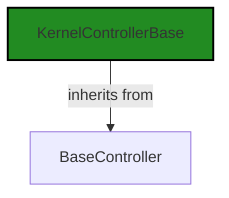
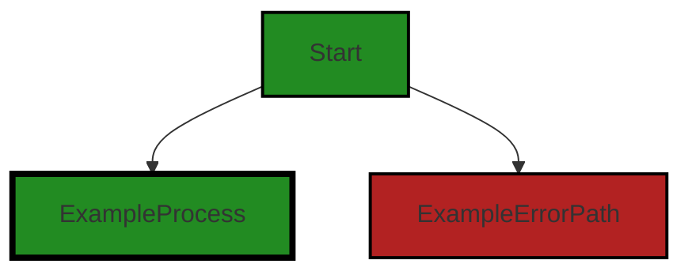
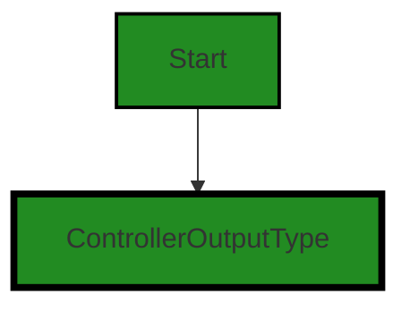
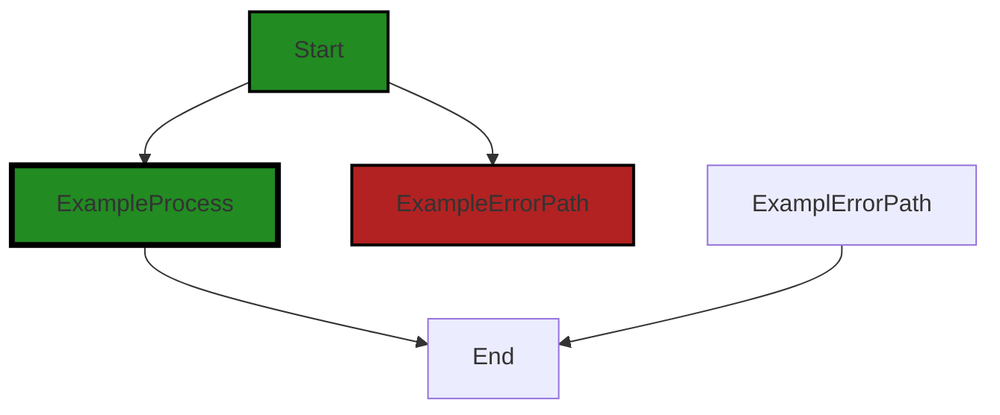

# Polyverse Boost-generated Source Analysis Details

## Source: ./src/controllers/explain_controller.ts
Date Generated: Friday, September 8, 2023 at 9:06:53 PM PDT


---

### Boost Architectural Quick Summary Security Report

Last Updated: Friday, September 8, 2023 at 9:04:40 PM PDT


Executive Report:

1. **Architectural Impact**: The analysis of this file has not revealed any severe issues.
2. **Risk Analysis**: The analysis of this file has not revealed any severe issues.
3. **Potential Customer Impact**: Based on the analysis, there are no severe issues that could potentially impact customers.
4. **Performance Issues**: Our analysis did not identify any explicit performance issues in the file.
5. **Risk Assessment**: Based on the current analysis of this file, no severe issues have been found. However, this doesn't guarantee that the file is risk-free.

Highlights:

- No severe issues were identified in the current analysis of this file.


---

### Boost Architectural Quick Summary Performance Report

Last Updated: Friday, September 8, 2023 at 9:05:34 PM PDT


Executive Report:

1. **Architectural Impact**: The analysis of this file has not revealed any severe issues.
2. **Risk Analysis**: The analysis of this file has not revealed any severe issues.
3. **Potential Customer Impact**: Based on the analysis, there are no severe issues that could potentially impact customers.
4. **Performance Issues**: Our analysis did not identify any explicit performance issues in the file.
5. **Risk Assessment**: Based on the current analysis of this file, no severe issues have been found. However, this doesn't guarantee that the file is risk-free.

Highlights:

- No severe issues were identified in the current analysis of this file.


---

### Boost Architectural Quick Summary Compliance Report

Last Updated: Friday, September 8, 2023 at 9:07:34 PM PDT

Executive Level Report:

1. **Architectural Impact**: The project is a Visual Studio Code extension that provides code analysis functionality. It is well-structured and organized into classes, following best practices for a VS Code extension. However, the file `src/controllers/explain_controller.ts` has been flagged for potential GDPR and Data Compliance issues. This could impact the architecture if changes are needed to ensure compliance.

2. **Risk Analysis**: The risk associated with this project is moderate. The identified issues are related to data compliance, GDPR, and data privacy. If not addressed, these could lead to legal implications and loss of user trust. However, these issues are contained within a single file (`src/controllers/explain_controller.ts`), which may limit the scope of the risk.

3. **Potential Customer Impact**: If the identified issues are not addressed, customers could potentially have their data handled in a non-compliant manner. This could lead to a loss of trust and potential legal implications. However, the impact is limited to the functionality provided by the `src/controllers/explain_controller.ts` file.

4. **Overall Issues**: The overall health of the project is good, with only one file having detected issues. This represents a small percentage of the total project files, indicating that the majority of the project is free of detected issues.

Risk Assessment:

- **Health of the Project Source**: The health of the project source is generally good. Only one file has detected issues, which suggests that the majority of the project is well-structured and follows best practices.
- **Percentage of Project Files with Issues**: Given that only one file has been flagged with issues, the percentage of project files with issues is low. This suggests that the project is generally well-maintained and follows best practices.

Highlights:

1. **Data Compliance and GDPR Issues**: The file `src/controllers/explain_controller.ts` has been flagged for potential GDPR and Data Compliance issues. This could have significant legal implications if not addressed.
2. **Single File with Issues**: Only one file has been flagged with issues, which suggests that the majority of the project is well-structured and follows best practices.
3. **Potential Customer Impact**: If the identified issues are not addressed, customers could potentially have their data handled in a non-compliant manner.
4. **Overall Project Health**: The overall health of the project is good, with only a small percentage of files having detected issues. This suggests that the project is generally well-maintained and follows best practices.
---
## Detailed Analysis:

### Cell 0:
## Original Code:

### Programming Language: typescript
### ./src/controllers/explain_controller.ts 

```typescript
import {
    KernelControllerBase
 } from './base_controller';

```
## Boost Analysis:


---

### Boost Code Explanation

Last Updated: Friday, September 8, 2023 at 8:59:47 PM PDT

The code you've provided is a single line of JavaScript that imports a module. Let's break it down:

```javascript
import {
    KernelControllerBase
 } from './base_controller';
```

This line is using the ES6 `import` statement to import a specific module called `KernelControllerBase` from a file named `base_controller.js`. The file is located in the same directory as the file where this import statement is written, as denoted by `./`.

The `import` statement is part of ES6 (ECMAScript 2015) modules system. This system allows you to separate your JavaScript code into independent modules, which can then be imported when needed. This can make your code more organized, reusable, and easier to maintain.

The `KernelControllerBase` is likely a class or a function that is being exported from the `base_controller.js` file. This could be a base class for a controller in a Model-View-Controller (MVC) architecture, or it could be a function that provides some base functionality for a controller.

Regarding the architectural guidelines, this line of code is consistent with the guidelines mentioned in the architectural blueprint summary. It follows the principles of object-oriented design by using modules and possibly classes, and it is part of a Visual Studio Code extension written in JavaScript/TypeScript.

For more information about ES6 modules, you can refer to the [MDN Web Docs](https://developer.mozilla.org/en-US/docs/Web/JavaScript/Guide/Modules).


---

### Boost Flow Diagram

Last Updated: Friday, September 8, 2023 at 9:03:05 PM PDT




---

### Boost Source-Level Security Analysis

Last Updated: Friday, September 8, 2023 at 9:03:45 PM PDT

**No bugs found**


---

### Boost Source-Level Performance Analysis

Last Updated: Friday, September 8, 2023 at 9:04:48 PM PDT

**No bugs found**


---

### Boost Source-Level Data and Privacy Compliance Analysis

Last Updated: Friday, September 8, 2023 at 9:05:54 PM PDT

**No bugs found**


### Cell 1:
## Original Code:

### Programming Language: typescript
### ./src/controllers/explain_controller.ts line 4

```typescript
import { DiagnosticCollection, ExtensionContext, NotebookCell } from 'vscode';

```
## Boost Analysis:


---

### Boost Code Explanation

Last Updated: Friday, September 8, 2023 at 9:00:12 PM PDT

The code provided is a simple import statement in JavaScript (or TypeScript, given the context of a Visual Studio Code extension). It is importing specific objects from the 'vscode' module. This module is the API for interacting with Visual Studio Code in the context of building extensions.

Here's a breakdown of what's being imported:

1. `DiagnosticCollection`: This is an interface provided by the 'vscode' module for managing a collection of diagnostics. Diagnostics in VS Code are issues in your code that the editor can detect, such as errors or warnings. A `DiagnosticCollection` is used to manage a set of diagnostics, grouped by the file they apply to.

2. `ExtensionContext`: This is another interface provided by the 'vscode' module. It represents a collection of utilities private to an extension. The `ExtensionContext` is provided as a parameter to the `activate` function of an extension, and can be used to access the extension's private state, log output, workspace state, and more.

3. `NotebookCell`: This interface represents a cell in a VS Code notebook. Notebooks in VS Code are documents that can contain both executable code and rich text elements (paragraphs, equations, charts, etc.). Each `NotebookCell` represents a single cell in the notebook, which can be either a code cell or a markdown cell.

The code is not using any specific algorithms, as it is just an import statement. However, the imported objects are likely to be used in the implementation of the VS Code extension, for managing diagnostics, interacting with the extension's context, and working with notebook cells.

For more information, you can refer to the [VS Code API documentation](https://code.visualstudio.com/api/references/vscode-api).


---

### Boost Flow Diagram

Last Updated: Friday, September 8, 2023 at 9:03:11 PM PDT



NO CONTROL FLOW FOUND


---

### Boost Source-Level Security Analysis

Last Updated: Friday, September 8, 2023 at 9:03:49 PM PDT

**No bugs found**


---

### Boost Source-Level Performance Analysis

Last Updated: Friday, September 8, 2023 at 9:04:52 PM PDT

**No bugs found**


---

### Boost Source-Level Data and Privacy Compliance Analysis

Last Updated: Friday, September 8, 2023 at 9:05:57 PM PDT

**No bugs found**


### Cell 2:
## Original Code:

### Programming Language: typescript
### ./src/controllers/explain_controller.ts line 5

```typescript
import { BoostConfiguration } from '../extension/boostConfiguration';

```
## Boost Analysis:


---

### Boost Code Explanation

Last Updated: Friday, September 8, 2023 at 9:00:43 PM PDT

The line of code you've provided is a single import statement from a JavaScript or TypeScript file. Let's break it down:

```import { BoostConfiguration } from '../extension/boostConfiguration';```

This line is using the import statement in JavaScript, which is part of the ES6 (ECMAScript 2015) module system. The import statement is used to import functions, objects, or values that have been exported from another module.

Here's what's happening in this specific import statement:

- `{ BoostConfiguration }` - This is the specific item that we're importing from the other module. The curly braces are used for named exports. That means there's something like `export const BoostConfiguration = ...` or `export class BoostConfiguration {...}` in the `boostConfiguration` module.

- `from '../extension/boostConfiguration'` - This is the path to the module that we're importing from. The `..` means to go up one directory level. So, this is saying to go up one directory level, then down into the `extension` directory, and import from the `boostConfiguration` module.

To summarize, this line is importing a specific named export (`BoostConfiguration`) from a module located at `../extension/boostConfiguration`.

It's hard to comment on the algorithm used as the provided code is just an import statement. The algorithm or logic would be present in the `BoostConfiguration` class or function that's being imported, and we would need to see that code to comment on it.

For more background on JavaScript's import and export syntax, you can refer to the [MDN documentation](https://developer.mozilla.org/en-US/docs/Web/JavaScript/Reference/Statements/import).

As for the architectural guidelines, this line of code doesn't conflict with the architectural blueprint provided earlier. It's a common practice to structure code into modules and import them as needed, which aligns with the principles of object-oriented design and event-driven programming mentioned in the blueprint.


---

### Boost Flow Diagram

Last Updated: Friday, September 8, 2023 at 9:03:13 PM PDT

NO CONTROL FLOW FOUND


---

### Boost Source-Level Security Analysis

Last Updated: Friday, September 8, 2023 at 9:03:53 PM PDT

**No bugs found**


---

### Boost Source-Level Performance Analysis

Last Updated: Friday, September 8, 2023 at 9:04:55 PM PDT

**No bugs found**


---

### Boost Source-Level Data and Privacy Compliance Analysis

Last Updated: Friday, September 8, 2023 at 9:06:07 PM PDT

1. **Severity**: 5/10

   **Line Number**: 8

   **Bug Type**: GDPR

   **Description**: The code imports a configuration file that might contain sensitive information. If this information is mishandled, it could lead to a GDPR compliance issue.

   **Solution**: Ensure that the configuration file does not contain any personal data or sensitive information. If it does, make sure it is properly protected and only accessible to authorized personnel. Also, consider using encryption for sensitive data.


### Cell 3:
## Original Code:

### Programming Language: typescript
### ./src/controllers/explain_controller.ts line 6

```typescript
import { BoostNotebookCell } from '../data/jupyter_notebook';

```
## Boost Analysis:


---

### Boost Code Explanation

Last Updated: Friday, September 8, 2023 at 9:01:15 PM PDT

The line of code you've provided is a single import statement in JavaScript, specifically using the ES6 syntax. It's not really an algorithm, but rather a method for including external modules in the current module or script.

```import { BoostNotebookCell } from '../data/jupyter_notebook';```

This line is importing a specific export (BoostNotebookCell) from another module (jupyter_notebook.js or jupyter_notebook.ts) which is located in the "data" directory one level up from the current directory.

Let's break it down:

- `import`: This is the keyword that begins the import statement. It tells the JavaScript interpreter that we're about to bring in some external code to use in this module.

- `{ BoostNotebookCell }`: This is the specific item we're importing from the external module. The curly braces are used for "destructuring" the export, which means we're pulling out just this one item from whatever the module exports. If the module exported multiple items, we could import multiple items by separating them with commas inside the curly braces.

- `from`: This keyword is used to specify the path to the module we're importing from.

- `'../data/jupyter_notebook'`: This is the path to the module we're importing from. The `..` means to go up one directory level, then `/data/` to go into the "data" directory, and finally `jupyter_notebook` is the name of the module. The file extension (.js or .ts) is typically omitted in import statements.

As for the architectural guidelines, this line of code seems to be consistent with good practices. It's using modern ES6 syntax and importing only the specific item it needs from the external module. However, without more context, it's hard to say if there are any conflicts.

For more information on the `import` statement and ES6 modules, you can check out these resources:

- [MDN Web Docs: import](https://developer.mozilla.org/en-US/docs/Web/JavaScript/Reference/Statements/import)
- [JavaScript Modules: A Beginner’s Guide](https://www.freecodecamp.org/news/javascript-modules-a-beginner-s-guide-783f7d7a5fcc/)


---

### Boost Flow Diagram

Last Updated: Friday, September 8, 2023 at 9:03:17 PM PDT

NO CONTROL FLOW FOUND


---

### Boost Source-Level Security Analysis

Last Updated: Friday, September 8, 2023 at 9:03:56 PM PDT

**No bugs found**


---

### Boost Source-Level Performance Analysis

Last Updated: Friday, September 8, 2023 at 9:04:59 PM PDT

**No bugs found**


---

### Boost Source-Level Data and Privacy Compliance Analysis

Last Updated: Friday, September 8, 2023 at 9:06:20 PM PDT

1. **Severity**: 5/10

   **Line Number**: 10

   **Bug Type**: Data Compliance

   **Description**: The code imports a module 'BoostNotebookCell' from '../data/jupyter_notebook'. If this module is handling sensitive data related to GDPR, PCI DSS, or HIPAA, it is important to ensure that the data is handled in a compliant manner. However, without more context, it's hard to identify specific issues.

   **Solution**: Review the 'BoostNotebookCell' module to ensure it handles data in a compliant manner. This includes proper encryption of sensitive data, obtaining user consent before collecting personal data, not storing sensitive data longer than necessary, among others.


### Cell 4:
## Original Code:

### Programming Language: typescript
### ./src/controllers/explain_controller.ts line 7

```typescript
import { generateCellOutputWithHeader } from '../extension/extensionUtilities';

```
## Boost Analysis:


---

### Boost Code Explanation

Last Updated: Friday, September 8, 2023 at 9:01:44 PM PDT

The code you provided is a single line of code in JavaScript (or TypeScript), which is importing a specific function from a module. Here's a breakdown:

`import { generateCellOutputWithHeader } from '../extension/extensionUtilities';`

- `import`: This is a keyword in JavaScript that is used to import functions, objects or values from another module or file. This is part of the ES6 (ECMAScript 2015) module system.

- `{ generateCellOutputWithHeader }`: This is the name of the function that is being imported. The curly braces { } indicate that this function is being imported by its specific name, which means it must be exported with the same name from the module it originates from. This is called a named import.

- `from`: This keyword is used to specify the path of the module from which the function, object or value is being imported.

- `'../extension/extensionUtilities'`: This is the relative path to the module that contains the `generateCellOutputWithHeader` function. The `..` at the start of the path means to go up one directory level. `/extension/extensionUtilities` is the path to the module from there. The file extension is not required when using `import`.

As for the function `generateCellOutputWithHeader`, without seeing the function itself, it's hard to say what algorithms it uses. The name suggests that it generates some sort of cell output with a header, possibly for a table or data grid. It's likely part of a larger system for displaying or processing data in the extension.

Here are some links for further reading:

- [JavaScript Modules](https://developer.mozilla.org/en-US/docs/Web/JavaScript/Guide/Modules): This is a guide from Mozilla Developer Network (MDN) that goes into detail about JavaScript modules, including `import` and `export`.

- [ES6 import statement](https://developer.mozilla.org/en-US/docs/Web/JavaScript/Reference/Statements/import): This is a more specific guide to the `import` statement in JavaScript, also from MDN.


---

### Boost Flow Diagram

Last Updated: Friday, September 8, 2023 at 9:03:19 PM PDT

NO CONTROL FLOW FOUND


---

### Boost Source-Level Security Analysis

Last Updated: Friday, September 8, 2023 at 9:04:00 PM PDT

**No bugs found**


---

### Boost Source-Level Performance Analysis

Last Updated: Friday, September 8, 2023 at 9:05:02 PM PDT

**No bugs found**


---

### Boost Source-Level Data and Privacy Compliance Analysis

Last Updated: Friday, September 8, 2023 at 9:06:24 PM PDT

**No bugs found**


### Cell 5:
## Original Code:

### Programming Language: typescript
### ./src/controllers/explain_controller.ts line 8

```typescript
import { ControllerOutputType } from './controllerOutputTypes';

```
## Boost Analysis:


---

### Boost Code Explanation

Last Updated: Friday, September 8, 2023 at 9:01:59 PM PDT

The code you provided is a single line of code that imports a module from another file in the same project. This line doesn't contain any algorithms or complex logic, it's a simple import statement. Let's break it down:

`import { ControllerOutputType } from './controllerOutputTypes';`

- `import`: This is a keyword in JavaScript (and TypeScript, which is a superset of JavaScript) that is used to import functions, objects or values from another module or file.

- `{ ControllerOutputType }`: This is the specific item that is being imported from the other module. In this case, it's likely that `ControllerOutputType` is either a function, a class, an object, or a type (since TypeScript supports static types).

- `from './controllerOutputTypes'`: This specifies the module or file from which `ControllerOutputType` is being imported. The `./` at the beginning of the string means that the file is in the same directory as the current file. The file name is `controllerOutputTypes`, and it's assumed to be a `.js` or `.ts` file (JavaScript or TypeScript) since the extension is not specified.

As for architectural guidelines, this line of code seems to be following good practices. It's importing only the specific item it needs (`ControllerOutputType`) from the `controllerOutputTypes` module, which can help to keep the memory footprint of the application as small as possible.

For further reading, here are some resources:

- [JavaScript Modules: Importing and Exporting](https://developer.mozilla.org/en-US/docs/Web/JavaScript/Guide/Modules)
- [TypeScript Modules](https://www.typescriptlang.org/docs/handbook/modules.html)


---

### Boost Flow Diagram

Last Updated: Friday, September 8, 2023 at 9:03:23 PM PDT




---

### Boost Source-Level Security Analysis

Last Updated: Friday, September 8, 2023 at 9:04:04 PM PDT

**No bugs found**


---

### Boost Source-Level Performance Analysis

Last Updated: Friday, September 8, 2023 at 9:05:06 PM PDT

**No bugs found**


---

### Boost Source-Level Data and Privacy Compliance Analysis

Last Updated: Friday, September 8, 2023 at 9:06:27 PM PDT

**No bugs found**


### Cell 6:
## Original Code:

### Programming Language: typescript
### ./src/controllers/explain_controller.ts line 9

```typescript
import { DisplayGroupFriendlyName } from '../data/userAnalysisType';

```
## Boost Analysis:


---

### Boost Code Explanation

Last Updated: Friday, September 8, 2023 at 9:02:33 PM PDT

The code you've provided is a single line of import statement in JavaScript, specifically in a node.js or a front-end framework environment. It doesn't include any algorithms or complex logic, but I'll explain what it does and how it fits into the larger context of a JavaScript application.

This line of code is importing a named export `DisplayGroupFriendlyName` from the module located at `'../data/userAnalysisType'`. 

The `import` statement is used to bring in functions, objects, or values from another module or file into the current file. This helps in organizing code into separate modules, each responsible for a specific functionality, and improves code maintainability and reusability.

In this case, `DisplayGroupFriendlyName` is likely a constant, a function, or an object that is being used in the file where this import statement is written. The exact path `'../data/userAnalysisType'` suggests that the `userAnalysisType.js` (or `userAnalysisType.ts` if it's a TypeScript project) file is in a directory named `data` one level up from the current file.

The specific purpose of `DisplayGroupFriendlyName` is not clear from this single line of code. However, based on the naming, it could be a function to get a user-friendly name for a display group, or it could be a mapping object that maps display group identifiers to user-friendly names.

For more on JavaScript modules and import/export statements, you can refer to the [Mozilla Developer Network (MDN) documentation](https://developer.mozilla.org/en-US/docs/Web/JavaScript/Guide/Modules).

Regarding your architectural guidelines, this line of code doesn't provide enough context to evaluate its consistency with or conflicts between the code and the guidelines. However, the use of modules and import statements is a common practice in modern JavaScript and TypeScript projects, and is generally considered a best practice for organizing code.


---

### Boost Flow Diagram

Last Updated: Friday, September 8, 2023 at 9:03:26 PM PDT

NO CONTROL FLOW FOUND


---

### Boost Source-Level Security Analysis

Last Updated: Friday, September 8, 2023 at 9:04:07 PM PDT

**No bugs found**


---

### Boost Source-Level Performance Analysis

Last Updated: Friday, September 8, 2023 at 9:05:09 PM PDT

**No bugs found**


---

### Boost Source-Level Data and Privacy Compliance Analysis

Last Updated: Friday, September 8, 2023 at 9:06:39 PM PDT

1. **Severity**: 7/10

   **Line Number**: 16

   **Bug Type**: GDPR

   **Description**: The code imports a module that seems to deal with user data. If this data includes personally identifiable information (PII), it may be in violation of GDPR if it's not handled properly.

   **Solution**: Ensure that all PII data is handled in a GDPR compliant manner. This includes obtaining explicit consent from users before collecting their data, only collecting the minimum necessary data, and ensuring that data is securely stored and transmitted.


### Cell 7:
## Original Code:

### Programming Language: typescript
### ./src/controllers/explain_controller.ts line 10

```typescript

export const explainKernelName = 'explain';
const explainOutputHeader = 'Code Explanation';

export class BoostExplainKernel extends KernelControllerBase {
 constructor(context: ExtensionContext, onServiceErrorHandler: any, otherThis : any, collection: DiagnosticCollection) {
        super(
            collection,
            explainKernelName,
            'Explain Code',
            'Explains the targeted source code in English, including algorithms, referenced frameworks and design patterns',
            ControllerOutputType.explain,
            DisplayGroupFriendlyName.documentation,
            explainOutputHeader,
            false,
            false,
            context,
            otherThis,
            onServiceErrorHandler);
 }

 dispose(): void {
  super.dispose();
 }

    public get serviceEndpoint(): string {
        switch (BoostConfiguration.cloudServiceStage)
        {
            case "local":
                return 'http://127.0.0.1:8000/explain';
            case 'dev':
                return 'https://jorsb57zbzwcxcjzl2xwvah45i0mjuxs.lambda-url.us-west-2.on.aws/';
            case "test":
                return 'https://r5s6cjvc43jsrqdq3axrhrceya0cumft.lambda-url.us-west-2.on.aws/';
            case 'staging':
            case 'prod':
            default:
                return 'https://vdcg2nzj2jtzmtzzcmfwbvg4ey0jxghj.lambda-url.us-west-2.on.aws/';
        }
    }

    onKernelOutputItem(
        response: any,
        cell : NotebookCell | BoostNotebookCell,
        mimetype : any) : string {
        if (response.explanation === undefined) {
            throw new Error("Unexpected missing data from Boost Service");
        }
        return generateCellOutputWithHeader(this.outputHeader, response.explanation);
    }
}

```
## Boost Analysis:


---

### Boost Code Explanation

Last Updated: Friday, September 8, 2023 at 9:02:50 PM PDT

The provided code is written in TypeScript, and it exports a class named `BoostExplainKernel` that extends the `KernelControllerBase` class. This class is part of a Visual Studio Code extension, and it's responsible for explaining the source code in English, including algorithms, referenced frameworks, and design patterns. 

Here's a detailed breakdown of the code:

- `explainKernelName` is a constant string that holds the name of the kernel, 'explain'.

- `explainOutputHeader` is another constant string that is set to 'Code Explanation'.

- The `BoostExplainKernel` class constructor accepts several parameters, including a context, an error handler, another object, and a collection. It calls the constructor of the base class `KernelControllerBase` with these parameters along with some additional information such as the kernel name, its description, output type, and others. 

- The `dispose` method overrides the `dispose` method of the base class and calls the `super.dispose()` method to clean up the resources used by the base class.

- The `serviceEndpoint` getter returns a different endpoint URL depending on the configuration of the `BoostConfiguration.cloudServiceStage`. This is used to connect to different services based on the environment (local, dev, test, staging, prod).

- The `onKernelOutputItem` method processes the response from the Boost Service. It expects the response to have an 'explanation' property. If this property is undefined, it throws an error. Otherwise, it generates cell output with a header using the `generateCellOutputWithHeader` method and the explanation from the response.

You can learn more about TypeScript classes [here](https://www.typescriptlang.org/docs/handbook/classes.html), and about Visual Studio Code extensions [here](https://code.visualstudio.com/api/get-started/your-first-extension).

In terms of architectural guidelines, this code seems to follow common practices for Visual Studio Code extensions and TypeScript programming. It uses object-oriented programming, with a class that extends a base class and overrides some of its methods. It also uses a switch statement to handle different configurations, which is a common practice in many programming languages.


---

### Boost Flow Diagram

Last Updated: Friday, September 8, 2023 at 9:03:32 PM PDT



The code provided does not have any control flow.


---

### Boost Source-Level Security Analysis

Last Updated: Friday, September 8, 2023 at 9:04:36 PM PDT

1. **Severity**: 5/10

   **Line Number**: 39

   **Bug Type**: Insecure Direct Object References (IDOR)

   **Description**: The serviceEndpoint method directly uses the BoostConfiguration.cloudServiceStage variable to decide which endpoint to use. If an attacker can manipulate the BoostConfiguration.cloudServiceStage variable, they can redirect requests to an endpoint of their choice, potentially leading to a Man-in-the-Middle (MITM) attack.

   **Solution**: Avoid using user-supplied input to construct URLs or file paths. If this is unavoidable, make sure to validate and sanitize the input to ensure it does not contain any malicious values. Use a whitelist of allowed values. More details can be found at [OWASP IDOR Guide](https://owasp.org/www-project-web-security-testing-guide/latest/4-Web_Application_Security_Testing/05-Authorization_Testing/04-Testing_for_Insecure_Direct_Object_References).


2. **Severity**: 3/10

   **Line Number**: 53

   **Bug Type**: Error Handling and Logging

   **Description**: The onKernelOutputItem method throws an error when response.explanation is undefined, but it does not log the error or provide any additional context. This can make it difficult to debug issues and can also provide an attacker with information on how to cause the application to fail.

   **Solution**: Implement proper error handling and logging. When an error occurs, log the error and provide enough context for developers to understand what went wrong, without revealing sensitive information that could be useful to an attacker. More details can be found at [OWASP Error Handling Guide](https://owasp.org/www-project-cheat-sheets/cheatsheets/Error_Handling_Cheat_Sheet.html).


---

### Boost Source-Level Performance Analysis

Last Updated: Friday, September 8, 2023 at 9:05:31 PM PDT

1. **Severity**: 5/10

   **Line Number**: 31

   **Bug Type**: Network

   **Description**: The serviceEndpoint property is using a switch case to determine the URL for the service endpoint. This could potentially lead to performance issues if the BoostConfiguration.cloudServiceStage value changes frequently, as the switch case would need to be evaluated each time the property is accessed.

   **Solution**: Consider caching the service endpoint URL in a variable during the object's initialization and update it only when the BoostConfiguration.cloudServiceStage value changes. This would reduce the need to evaluate the switch case each time the serviceEndpoint property is accessed.


2. **Severity**: 2/10

   **Line Number**: 43

   **Bug Type**: CPU

   **Description**: The onKernelOutputItem method is checking if response.explanation is undefined and throws an error if it is. This could potentially lead to performance issues if the check is performed frequently and the response object is large, as the property lookup operation could be expensive.

   **Solution**: Consider checking if the response object itself is undefined before accessing its properties. This would prevent unnecessary property lookup operations on undefined objects.


---

### Boost Source-Level Data and Privacy Compliance Analysis

Last Updated: Friday, September 8, 2023 at 9:06:53 PM PDT

1. **Severity**: 8/10

   **Line Number**: 27

   **Bug Type**: Data Compliance

   **Description**: The service endpoint URLs are hardcoded and exposed. This could lead to unauthorized access if the URLs are compromised.

   **Solution**: Store the URLs in a secure configuration file or environment variables that are not included in the codebase. Use a secure method to retrieve them when needed.


2. **Severity**: 7/10

   **Line Number**: 40

   **Bug Type**: Data Privacy

   **Description**: The error message does not specify what kind of data is missing. This could lead to revealing sensitive information if the data includes user's personal information.

   **Solution**: Make error messages more specific but avoid revealing sensitive information. Use generic error messages and log the details in a secure log file for debugging.


