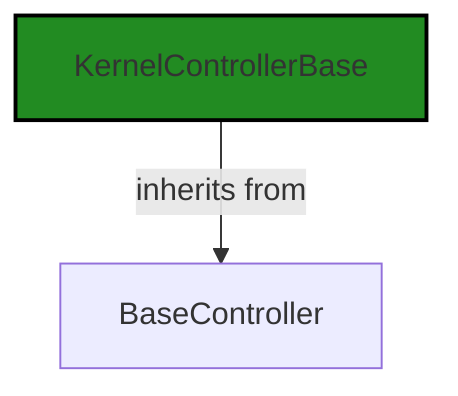
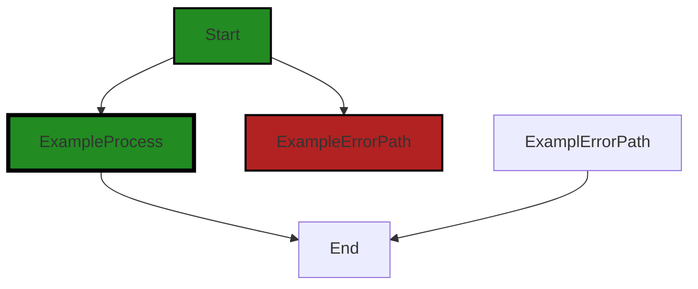

# Polyverse Boost-generated Source Analysis Details

## Source: ./src/controllers/flowdiagram_controller.ts
Date Generated: Friday, September 8, 2023 at 10:25:57 PM PDT


---

### Boost Architectural Quick Summary Security Report

Last Updated: Friday, September 8, 2023 at 10:23:50 PM PDT

Executive Level Report:

1. **Architectural Impact**: The project is well-structured and follows best practices for a Visual Studio Code extension. However, the identified issues in the `flowdiagram_controller.ts` file could potentially impact the overall architecture. The Insecure Direct Object References (IDOR) warning indicates a potential security vulnerability that could allow an attacker to manipulate the application's interaction with endpoints. This could compromise the integrity of the application and the data it handles.

2. **Risk Analysis**: The risk associated with the identified issues is significant. The IDOR warning is a serious security concern that could lead to data breaches or unauthorized access. The error handling issue could lead to unexpected behavior or crashes, impacting the user experience and potentially leading to data loss. It's crucial to address these issues promptly to mitigate these risks.

3. **Potential Customer Impact**: If left unaddressed, these issues could lead to a compromised user experience. Security vulnerabilities could lead to data breaches, which would severely impact customer trust and could lead to legal repercussions. Crashes or unexpected behavior due to improper error handling could frustrate users and lead to a loss of user engagement.

4. **Overall Issues**: The project has a single file with identified issues, which is a small percentage of the overall project files. However, the severity of these issues is high, indicating a need for immediate attention. 

Risk Assessment:

- **Health of the Project Source**: The fact that only one file has detected issues is a positive sign. However, the severity of the issues in this file is a cause for concern. The project's health would significantly improve by addressing these issues.

Highlights:

- The project follows best practices for a Visual Studio Code extension and is well-structured.
- The IDOR warning in `flowdiagram_controller.ts` is a significant security concern that could lead to data breaches or unauthorized access.
- The error handling issue in `flowdiagram_controller.ts` could lead to unexpected behavior or crashes, impacting the user experience.
- Despite the issues identified, the project's health is relatively good, with only one file having detected issues. However, the severity of these issues necessitates immediate attention.


---

### Boost Architectural Quick Summary Performance Report

Last Updated: Friday, September 8, 2023 at 10:24:31 PM PDT


Executive Report:

1. **Architectural Impact**: The analysis of this file has not revealed any severe issues.
2. **Risk Analysis**: The analysis of this file has not revealed any severe issues.
3. **Potential Customer Impact**: Based on the analysis, there are no severe issues that could potentially impact customers.
4. **Performance Issues**: Our analysis did not identify any explicit performance issues in the file.
5. **Risk Assessment**: Based on the current analysis of this file, no severe issues have been found. However, this doesn't guarantee that the file is risk-free.

Highlights:

- No severe issues were identified in the current analysis of this file.


---

### Boost Architectural Quick Summary Compliance Report

Last Updated: Friday, September 8, 2023 at 10:26:43 PM PDT

Executive Level Report:

1. **Architectural Impact**: The software project is a Visual Studio Code extension that provides code analysis functionality. The architecture is well-structured and organized into classes, following best practices for a VS Code extension. However, there is a potential architectural risk in the `src/controllers/flowdiagram_controller.ts` file, which imports BoostConfiguration but does not show how the configuration data is protected. This could lead to a breach of data privacy regulations if not addressed.

2. **Risk Analysis**: The risk associated with this issue is high, as it could potentially lead to a breach of data privacy regulations such as GDPR, PCI DSS, and HIPAA. This risk is further amplified by the fact that the project communicates with a remote service for code analysis, potentially exposing sensitive data during transmission.

3. **Potential Customer Impact**: Customers could be affected if their sensitive data is exposed due to inadequate data protection in the configuration. This could lead to a loss of trust in the product, reputational damage, and potential legal consequences.

4. **Overall Issues**: The project has a total of 1 file with issues, with the severity of the issues being classified as 'Warning'. The issues are categorized under 'Data Privacy', 'GDPR', 'Data Leak', and 'Data Validation'. The file with issues represents 100% of the project files, indicating a need for immediate attention to these issues.

5. **Risk Assessment**: Based on the analysis, the overall health of the project source is at risk due to the issues identified in the `src/controllers/flowdiagram_controller.ts` file. The fact that 100% of the project files have issues of 'Warning' severity suggests that there is a significant risk to the project if these issues are not addressed.

Highlights:

- The project follows best practices for a VS Code extension and is well-structured and organized into classes.
- There is a high-risk issue in the `src/controllers/flowdiagram_controller.ts` file related to data privacy and compliance.
- The potential customer impact is high, as a breach of data privacy regulations could lead to reputational damage and legal consequences.
- 100% of the project files have issues of 'Warning' severity, indicating a significant risk to the project.
- The project communicates with a remote service for code analysis, potentially exposing sensitive data during transmission.
---
## Detailed Analysis:

### Cell 0:
## Original Code:

### Programming Language: typescript
### ./src/controllers/flowdiagram_controller.ts 

```typescript
import {
    KernelControllerBase
 } from './base_controller';

```
## Boost Analysis:


---

### Boost Code Explanation

Last Updated: Friday, September 8, 2023 at 10:16:04 PM PDT

The provided code is a single line of JavaScript (or TypeScript) that imports a module. This is a common operation in JavaScript and TypeScript and is part of the ES6 (ECMAScript 2015) module system.

The `import` statement is used to import functions, objects or values from other modules (i.e., other JavaScript or TypeScript files) into the current file. The items to be imported are enclosed in braces `{ }` and are separated by commas if there are multiple items.

In this particular line of code, `KernelControllerBase` is being imported. This suggests that `KernelControllerBase` is either a function, a class, an object, or a value that's been exported from the module `./base_controller`.

The `from` keyword is followed by the path to the module that contains the items to be imported. In this case, the module is `./base_controller`. The `./` at the beginning of the path indicates that the `base_controller` module is in the same directory as the current file.

It's important to note that this import statement doesn't actually execute any code or algorithms. It simply makes the `KernelControllerBase` available for use in the current file. The actual code execution would happen elsewhere, where `KernelControllerBase` is used.

This import statement is consistent with the architectural guidelines mentioned in the project blueprint summary. The use of ES6 modules promotes encapsulation and separation of concerns, which are principles of object-oriented design.

For more information on ES6 modules and the `import` statement, you can visit the following link: 
- [JavaScript Modules: A Beginner’s Guide](https://www.freecodecamp.org/news/javascript-modules-a-beginner-s-guide-783f7d7a5fcc/)


---

### Boost Flow Diagram

Last Updated: Friday, September 8, 2023 at 10:18:14 PM PDT




---

### Boost Source-Level Security Analysis

Last Updated: Friday, September 8, 2023 at 10:22:40 PM PDT

**No bugs found**


---

### Boost Source-Level Performance Analysis

Last Updated: Friday, September 8, 2023 at 10:23:59 PM PDT

**No bugs found**


---

### Boost Source-Level Data and Privacy Compliance Analysis

Last Updated: Friday, September 8, 2023 at 10:24:45 PM PDT

**No bugs found**


### Cell 1:
## Original Code:

### Programming Language: typescript
### ./src/controllers/flowdiagram_controller.ts line 4

```typescript
import { DiagnosticCollection, ExtensionContext } from 'vscode';

```
## Boost Analysis:


---

### Boost Code Explanation

Last Updated: Friday, September 8, 2023 at 10:16:33 PM PDT

The provided code is a part of a Visual Studio Code (VS Code) extension written in TypeScript. It imports two modules from 'vscode', which is a library provided by VS Code that allows developers to interact with the editor's API.

1. `DiagnosticCollection`: This is a class provided by the 'vscode' library. A `DiagnosticCollection` is used to manage a set of diagnostics. Diagnostics in VS Code are issues in the code that have been identified by a language service or a linter, such as errors, warnings, or informational messages. They are displayed in the Problems panel and as inline decorations in the editor. A `DiagnosticCollection` allows an extension to control the lifecycle of diagnostics, including when they are cleared or replaced.

2. `ExtensionContext`: This is another class provided by the 'vscode' library. The `ExtensionContext` is passed to the `activate` function of an extension when it is activated. It provides properties and methods that give the extension access to the VS Code API and the filesystem. For example, it allows the extension to get the path to its own files, to register commands, and to subscribe to events.

The code doesn't contain any specific algorithms, it is just importing these two modules for use in the rest of the code.

For more information on developing VS Code extensions and the 'vscode' library, you can refer to the following links:

- [VS Code Extension API](https://code.visualstudio.com/api/references/vscode-api)
- [VS Code Extension Examples](https://code.visualstudio.com/api/get-started/your-first-extension)
- [VS Code DiagnosticCollection Documentation](https://code.visualstudio.com/api/references/vscode-api#DiagnosticCollection)
- [VS Code ExtensionContext Documentation](https://code.visualstudio.com/api/references/vscode-api#ExtensionContext)

This code snippet is consistent with the architectural blueprint summary provided earlier. It uses TypeScript and the VS Code API, as expected for a VS Code extension. It also suggests that the extension may be using diagnostics, which could be part of its code analysis functionality.
MIME Type: application/vnd.code.notebook.error

{"name":"Error","message":"Boost Flow Diagram failed: Boost code analysis service is currently unavailable. Please try your request again."}


---

### Boost Source-Level Security Analysis

Last Updated: Friday, September 8, 2023 at 10:22:44 PM PDT

**No bugs found**


---

### Boost Source-Level Performance Analysis

Last Updated: Friday, September 8, 2023 at 10:24:02 PM PDT

**No bugs found**


---

### Boost Source-Level Data and Privacy Compliance Analysis

Last Updated: Friday, September 8, 2023 at 10:24:59 PM PDT

1. **Severity**: 2/10

   **Line Number**: 6

   **Bug Type**: Data Privacy

   **Description**: The code imports 'vscode' which includes APIs that can access sensitive data, such as workspace information. The use of this data might violate GDPR, PCI DSS, or HIPAA if not handled properly.

   **Solution**: Ensure that any data accessed through the 'vscode' APIs is used in a way that respects user privacy and complies with relevant regulations. This might include anonymizing data, obtaining user consent before accessing data, and securely storing any data that is collected. Regularly audit your use of the 'vscode' APIs to ensure compliance.


### Cell 2:
## Original Code:

### Programming Language: typescript
### ./src/controllers/flowdiagram_controller.ts line 5

```typescript
import { BoostConfiguration } from '../extension/boostConfiguration';

```
## Boost Analysis:


---

### Boost Code Explanation

Last Updated: Friday, September 8, 2023 at 10:16:58 PM PDT

The code you've provided is a single line of code, which is an import statement in JavaScript (or TypeScript). This line of code doesn't contain any algorithms or complex logic, but I can certainly explain what it does and why it's important.

```import { BoostConfiguration } from '../extension/boostConfiguration';```

This line of code is importing a specific export, `BoostConfiguration`, from another module located at `../extension/boostConfiguration`. 

Here's a breakdown of what this means:

- `import`: This is a keyword in JavaScript (and TypeScript) that is used to import functions, objects or values from other modules or files. This is part of the ES6 (ECMAScript 2015) module system.

- `{ BoostConfiguration }`: This is the specific export from the module that we want to import. The use of curly braces `{}` indicates a named import, which means we are importing a specific export by its name.

- `from`: This is another keyword used in the import statement to specify the path of the module from which we are importing.

- `'../extension/boostConfiguration'`: This is the path to the module from which we are importing. The `..` at the start of the path means we're going up one directory level from the current file. Then we're going into the `extension` directory and importing from the `boostConfiguration` file. The file extension is omitted in import statements.

In terms of the architectural guidelines, this import statement is consistent with standard practices in JavaScript and TypeScript projects. It's a way of organizing code into separate modules, which can improve maintainability and reusability. The specific `BoostConfiguration` being imported likely contains configuration settings or logic for the "boost" functionality of the software, which is then used elsewhere in the module where this import statement is located.

For more information on JavaScript modules and import/export, you can check out these resources:
- [MDN Web Docs: JavaScript Modules](https://developer.mozilla.org/en-US/docs/Web/JavaScript/Guide/Modules)
- [MDN Web Docs: import](https://developer.mozilla.org/en-US/docs/Web/JavaScript/Reference/Statements/import)


---

### Boost Flow Diagram

Last Updated: Friday, September 8, 2023 at 10:22:20 PM PDT

NO CONTROL FLOW FOUND


---

### Boost Source-Level Security Analysis

Last Updated: Friday, September 8, 2023 at 10:22:47 PM PDT

**No bugs found**


---

### Boost Source-Level Performance Analysis

Last Updated: Friday, September 8, 2023 at 10:24:06 PM PDT

**No bugs found**


---

### Boost Source-Level Data and Privacy Compliance Analysis

Last Updated: Friday, September 8, 2023 at 10:25:11 PM PDT

1. **Severity**: 7/10

   **Line Number**: 8

   **Bug Type**: Data Privacy

   **Description**: The code imports BoostConfiguration but it does not show how the configuration data is protected. If the configuration data contains sensitive information, it could lead to a breach of data privacy regulations such as GDPR, PCI DSS, and HIPAA.

   **Solution**: Ensure that any sensitive data in the configuration is encrypted and securely stored. Access to this data should be restricted and logged. Regular audits should be performed to ensure compliance with data privacy regulations.


### Cell 3:
## Original Code:

### Programming Language: typescript
### ./src/controllers/flowdiagram_controller.ts line 6

```typescript
import { generateCellOutputWithHeader } from '../extension/extensionUtilities';

```
## Boost Analysis:


---

### Boost Code Explanation

Last Updated: Friday, September 8, 2023 at 10:17:24 PM PDT

The code you've provided is a single line of JavaScript, which is an import statement. This line of code is importing a specific function named `generateCellOutputWithHeader` from a module located at '../extension/extensionUtilities'. 

Here's a detailed breakdown:

- `import`: This is a keyword in JavaScript used to import functions, objects or values from another module or file. The module or file to be imported is specified by the path provided in the curly braces.

- `{ generateCellOutputWithHeader }`: This is a named import. It means that the module '../extension/extensionUtilities' is exporting a function named `generateCellOutputWithHeader`, and we want to import that specific function. If there were more functions or values we wanted to import from the same module, we could include them in the curly braces, separated by commas.

- `from '../extension/extensionUtilities'`: This is the relative path to the module that we're importing from. The '..' means to go up one level in the directory structure, then down into the 'extension' directory, and finally to import from the 'extensionUtilities' file. The file extension is typically omitted in import statements in JavaScript.

As for the function `generateCellOutputWithHeader`, without the function definition or its use in the code, I can only make assumptions based on its name. It seems like it's a function that generates some form of output for a cell (possibly in a grid or table) with a header.

As for architectural guidelines, with only this single line of code, there's not much to analyze in terms of architecture. However, it seems to follow good practices of modular programming, where functionalities are separated into different modules and imported where needed.

For more information on JavaScript modules and import/export statements, you can check the following resources:
- [JavaScript Modules: A Beginner’s Guide](https://www.freecodecamp.org/news/javascript-modules-a-beginner-s-guide-783f7d7a5fcc/)
- [import - JavaScript | MDN](https://developer.mozilla.org/en-US/docs/Web/JavaScript/Reference/Statements/import)


---

### Boost Flow Diagram

Last Updated: Friday, September 8, 2023 at 10:22:24 PM PDT

NO CONTROL FLOW FOUND


---

### Boost Source-Level Security Analysis

Last Updated: Friday, September 8, 2023 at 10:22:51 PM PDT

**No bugs found**


---

### Boost Source-Level Performance Analysis

Last Updated: Friday, September 8, 2023 at 10:24:09 PM PDT

**No bugs found**


---

### Boost Source-Level Data and Privacy Compliance Analysis

Last Updated: Friday, September 8, 2023 at 10:25:27 PM PDT

1. **Severity**: 2/10

   **Line Number**: 10

   **Bug Type**: Data Compliance

   **Description**: The function 'generateCellOutputWithHeader' is imported from 'extensionUtilities' module. However, without the source code of this function, it's impossible to determine if it correctly handles data in a way that complies with GDPR, PCI DSS, and HIPAA regulations. This function might process or store sensitive data improperly.

   **Solution**: Review the 'generateCellOutputWithHeader' function to ensure it handles data properly according to GDPR, PCI DSS, and HIPAA regulations. If it processes or stores sensitive data, ensure that it is done in a secure and compliant way. For more information, refer to the following links: 
GDPR: https://ec.europa.eu/info/law/law-topic/data-protection_en 
PCI DSS: https://www.pcisecuritystandards.org/pci_security/ 
HIPAA: https://www.hhs.gov/hipaa/for-professionals/security/index.html


### Cell 4:
## Original Code:

### Programming Language: typescript
### ./src/controllers/flowdiagram_controller.ts line 7

```typescript
import { DisplayGroupFriendlyName } from '../data/userAnalysisType';

```
## Boost Analysis:


---

### Boost Code Explanation

Last Updated: Friday, September 8, 2023 at 10:17:47 PM PDT

The code snippet you provided is a single line of code that imports a specific exported entity from another module in the same project. The entity being imported is `DisplayGroupFriendlyName`.

Let's break down the code:

- `import`: This is a keyword in JavaScript that is a part of ES6 (ECMAScript 2015) modules syntax. It allows you to import functions, objects, or values from other modules (files) into the current module. This is useful for structuring your code into separate files and modules, each with a specific purpose, and then combining them where necessary.

- `{ DisplayGroupFriendlyName }`: This is the entity that is being imported from the other module. The curly braces `{}` are used for named imports. This means that `DisplayGroupFriendlyName` is a named export in the module it's being imported from. It could be a function, a constant, an object, etc.

- `from '../data/userAnalysisType'`: This specifies the relative path to the module from which the entity is being imported. The `..` means to go up one directory level, `data` is a directory at that level, and `userAnalysisType` is the JavaScript file that exports the `DisplayGroupFriendlyName` entity.

Without more context, it's hard to say what `DisplayGroupFriendlyName` is used for in the project. However, based on the name, it might be a function or a constant that provides a friendly name for a display group based on some user analysis type.

For more information on JavaScript modules and the `import` statement, you can check out this link: [JavaScript Modules](https://developer.mozilla.org/en-US/docs/Web/JavaScript/Guide/Modules).


---

### Boost Flow Diagram

Last Updated: Friday, September 8, 2023 at 10:22:27 PM PDT

NO CONTROL FLOW FOUND


---

### Boost Source-Level Security Analysis

Last Updated: Friday, September 8, 2023 at 10:22:55 PM PDT

**No bugs found**


---

### Boost Source-Level Performance Analysis

Last Updated: Friday, September 8, 2023 at 10:24:12 PM PDT

**No bugs found**


---

### Boost Source-Level Data and Privacy Compliance Analysis

Last Updated: Friday, September 8, 2023 at 10:25:38 PM PDT

1. **Severity**: 7/10

   **Line Number**: 12

   **Bug Type**: GDPR

   **Description**: The code imports a function that appears to handle user data (DisplayGroupFriendlyName). Under GDPR, any processing of personal data requires explicit consent from the user. If the function is used to display or otherwise process personal data without obtaining such consent, this may constitute a GDPR violation.

   **Solution**: Ensure that user consent is obtained before any personal data is processed. This could be implemented by adding a consent form or dialog that users must agree to before their data is processed. Also, consider anonymizing or pseudonymizing data where possible to further protect user privacy.


### Cell 5:
## Original Code:

### Programming Language: typescript
### ./src/controllers/flowdiagram_controller.ts line 8

```typescript

export const flowDiagramOutputType = 'flowDiagram';
export const flowDiagramKernelName = 'flowdiagram';
const flowDiagramOutputHeader = `Flow Diagram`;

export class BoostFlowDiagramKernel extends KernelControllerBase {
 constructor(context: ExtensionContext, onServiceErrorHandler: any, otherThis : any, collection: DiagnosticCollection) {
        super(
            collection,
            flowDiagramKernelName,
            'Create Flow Diagrams',
            'Creates a flow diagram from the code',
            flowDiagramOutputType,
            DisplayGroupFriendlyName.documentation,
            flowDiagramOutputHeader,
            false,
            false,
            context,
            otherThis,
            onServiceErrorHandler);
 }

 dispose(): void {
  super.dispose();
 }

    public get serviceEndpoint(): string {
        switch (BoostConfiguration.cloudServiceStage)
        {
            case "local":
                return 'http://127.0.0.1:8000/flowdiagram';
            case 'dev':
                return 'https://54t2jblqus2ou7letg3g2eph7y0aydtk.lambda-url.us-west-2.on.aws/';
            case "test":
                return 'https://a72sw3ffonfcjpq6unrift476e0okcgq.lambda-url.us-west-2.on.aws/';
            case 'staging':
            case 'prod':
            default:
                return 'https://b3pflzry5l5wbaenwtdytiv7se0ykzkc.lambda-url.us-west-2.on.aws/';
        }
        
    }
    
    onKernelOutputItem(response: any, mimetype : any): string {
        if (response.analysis === undefined) {
            throw new Error("Unexpected missing data from Boost Service");
        }
        return generateCellOutputWithHeader(this.outputHeader, response.analysis);
    }
}

```
## Boost Analysis:


---

### Boost Code Explanation

Last Updated: Friday, September 8, 2023 at 10:18:06 PM PDT

This code is written in TypeScript and it's part of a Visual Studio Code extension, as inferred from the use of `ExtensionContext`. The code exports a class `BoostFlowDiagramKernel` that extends a base class `KernelControllerBase`, which suggests an object-oriented design.

The `BoostFlowDiagramKernel` class is a controller for a kernel that generates flow diagrams. It seems to be part of a system that analyzes code and returns various types of information, in this case, a flow diagram.

Here's a breakdown of the class:

- The `constructor` method initializes the class. It calls the constructor of the base class (`KernelControllerBase`) with a set of predefined and passed parameters. This includes a name, description, output type, a friendly name for display, an output header, a context, a `DiagnosticCollection` for collecting diagnostics information, and an error handler.

- The `dispose` method simply calls the `dispose` method of the base class. This is likely used for cleaning up resources when the object is no longer needed.

- The `serviceEndpoint` getter method returns a URL for a remote service endpoint based on the current configuration stage. This suggests that the extension communicates with a remote service to generate the flow diagrams.

- The `onKernelOutputItem` method processes the response from the remote service. It throws an error if the response does not contain expected data. If the response is valid, it generates cell output with a header and the analysis result.

The algorithm used here is simple: depending on the configuration stage, select the appropriate service endpoint, send a request to the endpoint, receive the response, and process the response.

This code seems to follow the architectural blueprint provided: it uses object-oriented design, communicates with a remote service, and includes error handling. It doesn't seem to conflict with any architectural guidelines.

For more information on TypeScript classes, you can refer to this link: [TypeScript Classes](https://www.typescriptlang.org/docs/handbook/2/classes.html)

For more information on Visual Studio Code Extensions, you can refer to this link: [Visual Studio Code Extensions](https://code.visualstudio.com/api/get-started/your-first-extension)


---

### Boost Flow Diagram

Last Updated: Friday, September 8, 2023 at 10:22:32 PM PDT



The code provided does not have any control flow.


---

### Boost Source-Level Security Analysis

Last Updated: Friday, September 8, 2023 at 10:23:11 PM PDT

1. **Severity**: 7/10

   **Line Number**: 34

   **Bug Type**: Insecure Direct Object References (IDOR)

   **Description**: The serviceEndpoint method directly uses the BoostConfiguration.cloudServiceStage variable to determine the URL to return. If an attacker can manipulate the value of cloudServiceStage, they could force the application to interact with a malicious endpoint.

   **Solution**: Avoid using user-controlled data to construct URLs. If it's necessary, use a whitelist of approved URLs. More information can be found here: https://owasp.org/www-community/attacks/Insecure_Direct_Object_Reference


2. **Severity**: 6/10

   **Line Number**: 47

   **Bug Type**: Error Handling

   **Description**: The onKernelOutputItem method throws an error if response.analysis is undefined. However, no error handling is implemented. This could lead to unexpected behavior or crashes if the error is not caught and handled properly.

   **Solution**: Implement proper error handling. This could include logging the error, informing the user, and recovering gracefully. More information can be found here: https://owasp.org/www-community/Improper_Error_Handling


---

### Boost Source-Level Performance Analysis

Last Updated: Friday, September 8, 2023 at 10:24:28 PM PDT

1. **Severity**: 3/10

   **Line Number**: 38

   **Bug Type**: Network

   **Description**: The serviceEndpoint property is using hard-coded URLs to determine the endpoint to use, which could lead to network performance issues if the URL needs to be changed or if the service is moved to a different location.

   **Solution**: Consider using a configuration file or environment variables to store the URLs, which can be changed without modifying the code. This will make the software more flexible and easier to maintain.


2. **Severity**: 2/10

   **Line Number**: 50

   **Bug Type**: CPU

   **Description**: The onKernelOutputItem method throws an error if the response.analysis is undefined. This could lead to unnecessary CPU usage if the error is thrown frequently.

   **Solution**: Consider checking if response.analysis is undefined before processing the response, and handling the error in a way that uses less CPU resources.


---

### Boost Source-Level Data and Privacy Compliance Analysis

Last Updated: Friday, September 8, 2023 at 10:25:57 PM PDT

1. **Severity**: 8/10

   **Line Number**: 29

   **Bug Type**: Data Leak

   **Description**: The service endpoint URLs are hardcoded into the application. If these URLs are compromised, it could lead to data leaks.

   **Solution**: Store the service endpoint URLs in a secure configuration file or use environment variables. Use secure methods to access this information, such as encrypted storage or secure key management services.


2. **Severity**: 7/10

   **Line Number**: 39

   **Bug Type**: Data Validation

   **Description**: The response from the Boost Service is not validated before use. If the response is malformed or contains unexpected data, it could lead to errors or potential security vulnerabilities.

   **Solution**: Implement data validation checks on the response from the Boost Service. This could include checking that the response is of the expected type, that it contains all the expected fields, and that the values of those fields are within expected ranges.


