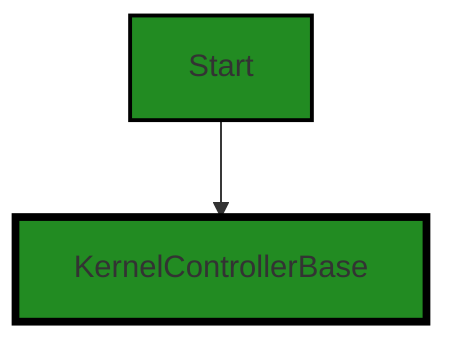
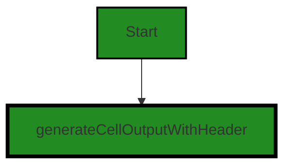
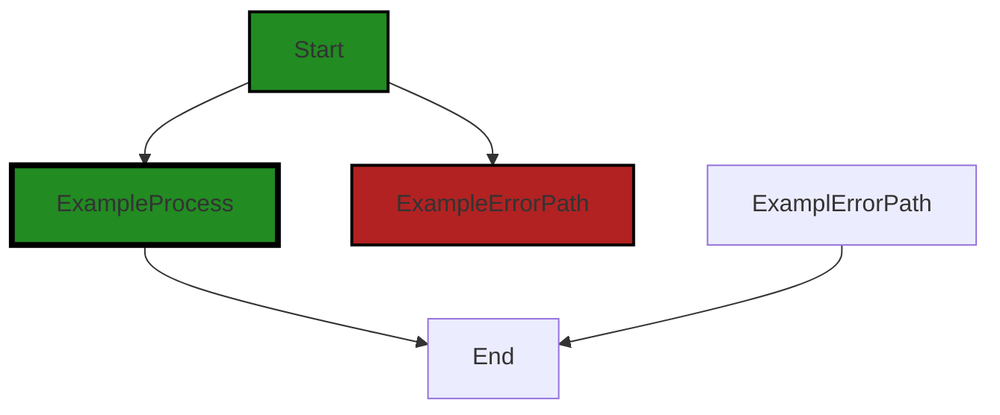

# Polyverse Boost-generated Source Analysis Details

## Source: ./src/controllers/function_base_controller.ts
Date Generated: Friday, September 8, 2023 at 10:59:25 PM PDT


---

### Boost Architectural Quick Summary Security Report

Last Updated: Friday, September 8, 2023 at 10:56:34 PM PDT

Executive Level Report:

1. **Architectural Impact**: The project is well-structured and follows best practices for a Visual Studio Code extension. It uses TypeScript features and the VS Code API, which are in line with the architectural guidelines. However, the identified issue in the file `function_base_controller.ts` could potentially impact the security of the software. This file is responsible for handling the response object, which is directly accessed without any validation. This could lead to potential security vulnerabilities if the object contains sensitive data or is manipulated by an attacker.

2. **Risk Analysis**: The risk associated with the identified issue is high. Insecure Direct Object References (IDOR) can lead to unauthorized access to data, which could potentially lead to data breaches. This risk is further amplified by the fact that the project communicates with a remote service for code analysis. However, the project does include extensive error handling and logging, which can help mitigate some of these risks.

3. **Potential Customer Impact**: If exploited, the identified issue could lead to unauthorized access to sensitive data. This could potentially impact the trust and confidence of the customers in the software. It is therefore crucial to address this issue promptly to prevent any potential customer impact.

4. **Overall Issues**: The overall health of the project source is good, with only one file having detected issues. However, the severity of the issue is high, which warrants immediate attention. 

Risk Assessment:

- The project consists of one file, `function_base_controller.ts`, which has a high-severity issue. This represents 100% of the project files having issues by severity.
- The issue identified is of 'Warning' severity, indicating a potential security vulnerability. 

Highlights:

- The project follows best practices for a Visual Studio Code extension and makes use of TypeScript features and the VS Code API.
- The identified issue in the file `function_base_controller.ts` could potentially impact the security of the software.
- The risk associated with the identified issue is high, potentially leading to unauthorized access to data.
- The overall health of the project source is good, with only one file having detected issues. However, the severity of the issue is high, which warrants immediate attention.


---

### Boost Architectural Quick Summary Performance Report

Last Updated: Friday, September 8, 2023 at 10:57:40 PM PDT


Executive Report:

1. **Architectural Impact**: The analysis of this file has not revealed any severe issues.
2. **Risk Analysis**: The analysis of this file has not revealed any severe issues.
3. **Potential Customer Impact**: Based on the analysis, there are no severe issues that could potentially impact customers.
4. **Performance Issues**: Our analysis did not identify any explicit performance issues in the file.
5. **Risk Assessment**: Based on the current analysis of this file, no severe issues have been found. However, this doesn't guarantee that the file is risk-free.

Highlights:

- No severe issues were identified in the current analysis of this file.


---

### Boost Architectural Quick Summary Compliance Report

Last Updated: Friday, September 8, 2023 at 10:59:56 PM PDT

## Executive Report: Software Project Analysis

Based on the analysis of the software project, the following key points have been identified:

1. **Architectural Impact**: The project is well-structured and follows best practices for a Visual Studio Code extension. It uses object-oriented design, event-driven programming, and asynchronous programming for potentially long-running tasks. However, the file `src/controllers/function_base_controller.ts` has been flagged for potential data handling issues, which could impact the overall architecture if not addressed.

2. **Risk Analysis**: The identified issues in the `src/controllers/function_base_controller.ts` file relate to data compliance, data privacy, GDPR, PCI DSS, and HIPAA. These are high-risk areas as non-compliance can lead to legal repercussions, fines, and damage to the company's reputation. The severity of these issues is marked as "Warning", indicating a need for immediate attention.

3. **Potential Customer Impact**: The issues identified could potentially impact customers' data privacy. If sensitive data is not handled correctly, it could lead to data breaches, resulting in loss of trust among customers and potential legal action.

4. **Overall Health of the Project**: The project consists of one file, `src/controllers/function_base_controller.ts`, which has been flagged with issues. This means 100% of the project files have been flagged with issues of "Warning" severity. This indicates a need for immediate attention to address these issues and improve the overall health of the project.

5. **Consistency with Architectural Guidelines**: The project follows the architectural guidelines provided, with no additional special architectural constraints. However, the identified issues indicate a potential conflict with the principles of data privacy and compliance, which should be addressed to ensure consistency with the guidelines.

In conclusion, while the project follows the architectural guidelines and best practices for a Visual Studio Code extension, the issues identified in the `src/controllers/function_base_controller.ts` file pose a significant risk. Immediate action is required to address these issues and ensure the project's compliance with data privacy and compliance regulations.
---
## Detailed Analysis:

### Cell 0:
## Original Code:

### Programming Language: typescript
### ./src/controllers/function_base_controller.ts 

```typescript
import * as vscode from 'vscode';

import {
    KernelControllerBase
 } from './base_controller';

```
## Boost Analysis:


---

### Boost Code Explanation

Last Updated: Friday, September 8, 2023 at 10:52:02 PM PDT

The code snippet you provided is quite short and consists of two import statements in TypeScript. Import statements are used to include external modules or libraries in your code so that you can make use of their functionalities.

Let's break it down:

1. `import * as vscode from 'vscode';`

   This line of code imports the entire `vscode` module. `vscode` is a library provided by Visual Studio Code that provides various functionalities for creating extensions. The `* as vscode` syntax means that all exported members of the `vscode` module will be loaded into an object named `vscode`. You can then access the members of the module using dot notation, like `vscode.window`, `vscode.commands`, etc.

2. `import { KernelControllerBase } from './base_controller';`

   This line of code imports a specific member, `KernelControllerBase`, from the module located at `./base_controller`. The `./base_controller` is a relative path pointing to a file in the same directory as the current file. The `{ KernelControllerBase }` syntax means that only the `KernelControllerBase` member of the `base_controller` module will be imported. This is known as named import.

The code doesn't present any algorithm or architectural design as it's just import statements. However, it does adhere to common best practices in TypeScript and Node.js development. Specifically, it makes use of module systems to organize code into separate files, and it imports only the necessary parts from each module, which can help improve performance and readability.

Here are some resources for further reading:
- [TypeScript Modules](https://www.typescriptlang.org/docs/handbook/modules.html)
- [VS Code Extension API](https://code.visualstudio.com/api/references/vscode-api)
- [Node.js Modules](https://nodejs.org/api/modules.html)


---

### Boost Flow Diagram

Last Updated: Friday, September 8, 2023 at 10:54:48 PM PDT




---

### Boost Source-Level Security Analysis

Last Updated: Friday, September 8, 2023 at 10:55:26 PM PDT

**No bugs found**


---

### Boost Source-Level Performance Analysis

Last Updated: Friday, September 8, 2023 at 10:56:48 PM PDT

**No bugs found**


---

### Boost Source-Level Data and Privacy Compliance Analysis

Last Updated: Friday, September 8, 2023 at 10:57:53 PM PDT

**No bugs found**


### Cell 1:
## Original Code:

### Programming Language: typescript
### ./src/controllers/function_base_controller.ts line 6

```typescript
import * as boostnb from '../data/jupyter_notebook';
import { generateCellOutputWithHeader } from '../extension/extensionUtilities';

```
## Boost Analysis:


---

### Boost Code Explanation

Last Updated: Friday, September 8, 2023 at 10:52:32 PM PDT

This code is written in TypeScript, which is a statically typed superset of JavaScript that adds types and other features to the language. The code is part of a larger project, most likely a Visual Studio Code extension as indicated by the architectural blueprint summary.

The code is importing modules from other parts of the project. Importing is a way of bringing in functionality from other files or modules in the project. The `import` statement is part of the ES6 (ECMAScript 2015) module system.

The `import * as boostnb from '../data/jupyter_notebook';` statement is importing all exports from the module located at '../data/jupyter_notebook'. The asterisk (*) indicates that all exported members of the module are imported. The `as boostnb` part is aliasing these imports under the name `boostnb`, so they can be referred to in the code as `boostnb.someExportedMember`.

The `import { generateCellOutputWithHeader } from '../extension/extensionUtilities';` statement is importing a specific function called `generateCellOutputWithHeader` from the module located at '../extension/extensionUtilities'. The curly braces ({}) are used to import specific named exports from a module.

The algorithms used in this code are not directly visible as this code is only importing modules and not implementing any logic itself. The algorithms would be in the functions or methods in the imported modules.

For more information on TypeScript and ES6 modules, you can refer to these resources:

- TypeScript: https://www.typescriptlang.org/
- ES6 modules: https://developer.mozilla.org/en-US/docs/Web/JavaScript/Guide/Modules

Regarding the architectural guidelines, this code seems to follow good practices for a Visual Studio Code extension written in TypeScript, as per the architectural blueprint summary. The code is modularized, which is a common practice in software development to enhance maintainability and reusability. It also appears to be consistent with event-driven programming and object-oriented design principles, as it is importing modules that are likely to contain classes or functions that respond to events. However, without seeing the rest of the code, it's hard to make a definitive judgment on this.


---

### Boost Flow Diagram

Last Updated: Friday, September 8, 2023 at 10:54:53 PM PDT




---

### Boost Source-Level Security Analysis

Last Updated: Friday, September 8, 2023 at 10:55:30 PM PDT

**No bugs found**


---

### Boost Source-Level Performance Analysis

Last Updated: Friday, September 8, 2023 at 10:56:52 PM PDT

**No bugs found**
MIME Type: application/vnd.code.notebook.error

{"name":"Error","message":"Boost Data and Privacy Compliance Analysis failed: Unable to process this source code. This can be caused by a temporary issue with the Boost Cloud Service, or by an issue in the source input. Please try again, and if the problem persists, please contact Boost Support."}


### Cell 2:
## Original Code:

### Programming Language: typescript
### ./src/controllers/function_base_controller.ts line 8

```typescript
import { boostLogging } from '../utilities/boostLogging';

```
## Boost Analysis:


---

### Boost Code Explanation

Last Updated: Friday, September 8, 2023 at 10:52:59 PM PDT

The code you provided is a single line of JavaScript (or TypeScript) code that is importing a module named `boostLogging` from a relative path `../utilities/boostLogging`.

JavaScript and TypeScript use the `import` statement to bring in functionality (like variables, functions, objects, or classes) from other modules or files. This is part of the ES6 (ECMAScript 2015) module system.

In this specific line of code:

```javascript
import { boostLogging } from '../utilities/boostLogging';
```

The `{ boostLogging }` is a named import. It means that the `boostLogging` module exports something (a function, an object, a variable) under the name `boostLogging`. The import statement is then including this specific exported item into the current file.

The `from '../utilities/boostLogging'` part of the statement is specifying the path to the module file. In this case, it's a relative path, meaning it's looking for the `boostLogging` file in a `utilities` directory one level up from the current directory. The `.js` or `.ts` extension is usually omitted in import statements - the JavaScript or TypeScript runtime will automatically add it.

As for the architectural guidelines, this line of code seems to follow good practices. It's modular (the `boostLogging` functionality is kept in its own file), and the use of a utilities directory suggests a logical organization of code. However, without more context or more lines of code, it's hard to provide a detailed analysis.

For more information on JavaScript/TypeScript imports, you can refer to these resources:

- [JavaScript Modules: A Beginner’s Guide](https://www.freecodecamp.org/news/javascript-modules-a-beginner-s-guide-783f7d7a5fcc/)
- [TypeScript Module System](https://www.typescripttutorial.net/typescript-tutorial/typescript-modules/)


---

### Boost Flow Diagram

Last Updated: Friday, September 8, 2023 at 10:54:56 PM PDT


---

### Boost Source-Level Security Analysis

Last Updated: Friday, September 8, 2023 at 10:55:33 PM PDT

**No bugs found**


---

### Boost Source-Level Performance Analysis

Last Updated: Friday, September 8, 2023 at 10:56:55 PM PDT

**No bugs found**


---

### Boost Source-Level Data and Privacy Compliance Analysis

Last Updated: Friday, September 8, 2023 at 10:58:29 PM PDT

**No bugs found**


### Cell 3:
## Original Code:

### Programming Language: typescript
### ./src/controllers/function_base_controller.ts line 9

```typescript
import { fullPathFromSourceFile } from '../utilities/files';

```
## Boost Analysis:


---

### Boost Code Explanation

Last Updated: Friday, September 8, 2023 at 10:53:22 PM PDT

The code you've provided is a single line of JavaScript code, specifically an import statement. It's part of a larger file, and without the rest of the code or context, I can only provide a limited explanation. However, I'll explain what I can.

```javascript
import { fullPathFromSourceFile } from '../utilities/files';
```

This line is using the ES6 (ES2015) module system to import a specific function, `fullPathFromSourceFile`, from a module located at '../utilities/files'. This is a relative file path, meaning that the module is located in a 'utilities' directory one level up from the current file.

The `fullPathFromSourceFile` function is likely a utility function that takes a source file (probably a file path) as an argument and returns the full path to that file. This can be useful in many contexts, for example when you need to read from or write to a file and need the full path to that file.

As for the architectural analysis, this line of code is consistent with typical JavaScript and Node.js practices. The ES6 module system is widely used in modern JavaScript development, and utility functions like `fullPathFromSourceFile` are a common way to organize code that is reused across different parts of a project.

More information about ES6 modules can be found here:
- [MDN Web Docs: import](https://developer.mozilla.org/en-US/docs/Web/JavaScript/Reference/Statements/import)
- [MDN Web Docs: export](https://developer.mozilla.org/en-US/docs/Web/JavaScript/Reference/Statements/export)

And for more information about file paths in Node.js, you can refer to:
- [Node.js path module](https://nodejs.org/api/path.html)


---

### Boost Flow Diagram

Last Updated: Friday, September 8, 2023 at 10:54:59 PM PDT

NO CONTROL FLOW FOUND


---

### Boost Source-Level Security Analysis

Last Updated: Friday, September 8, 2023 at 10:55:36 PM PDT

**No bugs found**


---

### Boost Source-Level Performance Analysis

Last Updated: Friday, September 8, 2023 at 10:56:58 PM PDT

**No bugs found**


---

### Boost Source-Level Data and Privacy Compliance Analysis

Last Updated: Friday, September 8, 2023 at 10:58:32 PM PDT

**No bugs found**


### Cell 4:
## Original Code:

### Programming Language: typescript
### ./src/controllers/function_base_controller.ts line 10

```typescript
import { lineNumberBaseFromCell } from '../extension/vscodeUtilities';

```
## Boost Analysis:


---

### Boost Code Explanation

Last Updated: Friday, September 8, 2023 at 10:53:38 PM PDT

The code you've provided is a single line of code in JavaScript (or TypeScript) that imports a specific function from another module. 

The `import` statement is used to bring in functions, objects, or values from other modules or files in JavaScript. This allows for the separation of code into manageable pieces.

In this line of code, `{ lineNumberBaseFromCell }` is the specific function being imported. The curly braces around `lineNumberBaseFromCell` indicate that this function is being imported by name, which is known as named import. This means that `lineNumberBaseFromCell` function is a named export in the `'../extension/vscodeUtilities'` module.

The path `'../extension/vscodeUtilities'` is the location of the module from which the function is being imported. The `..` at the beginning of the path means to go up one level in the directory structure. So, this code is importing the `lineNumberBaseFromCell` function from the `vscodeUtilities.js` or `vscodeUtilities.ts` file located in an `extension` directory one level up from the current file.

Without the rest of the code, it's difficult to say exactly what the `lineNumberBaseFromCell` function does. But from the name, it seems like it might be a function that determines the base line number for a cell, possibly in the context of a table or grid in a Visual Studio Code extension.

As for the algorithm used, this line of code doesn't represent an algorithm. It's simply a statement that imports a function from another module. The algorithm (if any) would be in the implementation of the `lineNumberBaseFromCell` function itself.

Here are some resources for further reading:

- [JavaScript Modules](https://developer.mozilla.org/en-US/docs/Web/JavaScript/Guide/Modules): This guide from MDN (Mozilla Developer Network) provides a comprehensive overview of JavaScript modules, including `import` and `export` statements.
- [TypeScript Modules](https://www.typescriptlang.org/docs/handbook/modules.html): This is the official TypeScript documentation on modules, which work similarly to JavaScript modules but with some additional features.


---

### Boost Flow Diagram

Last Updated: Friday, September 8, 2023 at 10:55:03 PM PDT

NO CONTROL FLOW FOUND


---

### Boost Source-Level Security Analysis

Last Updated: Friday, September 8, 2023 at 10:55:39 PM PDT

**No bugs found**


---

### Boost Source-Level Performance Analysis

Last Updated: Friday, September 8, 2023 at 10:57:02 PM PDT

**No bugs found**


---

### Boost Source-Level Data and Privacy Compliance Analysis

Last Updated: Friday, September 8, 2023 at 10:58:46 PM PDT

1. **Severity**: 2/10

   **Line Number**: 18

   **Bug Type**: Data Compliance

   **Description**: The function 'lineNumberBaseFromCell' is imported but it is not clear whether it handles data in a way that is compliant with GDPR, PCI DSS, and HIPAA. If this function processes personal data, it may pose a data compliance issue.

   **Solution**: Ensure that 'lineNumberBaseFromCell' function complies with GDPR, PCI DSS, and HIPAA regulations. If it processes personal data, it should do so in a secure manner, provide necessary notifications to the user, have necessary user consent, and provide a way for users to request for their personal data to be deleted. If it processes payment card data, it should be PCI DSS compliant. If it processes health information, it should be HIPAA compliant.


### Cell 5:
## Original Code:

### Programming Language: typescript
### ./src/controllers/function_base_controller.ts line 11

```typescript
import { DisplayGroupFriendlyName } from '../data/userAnalysisType';

```
## Boost Analysis:


---

### Boost Code Explanation

Last Updated: Friday, September 8, 2023 at 10:54:07 PM PDT

This line of code is a single import statement in JavaScript, specifically using ES6 syntax. It imports a specific exported member from another module. 

The `DisplayGroupFriendlyName` is a named export from the module located at `../data/userAnalysisType`. The `../` indicates that the module is located in a directory one level up from the current module. From there, it goes into the `data` directory and imports the `userAnalysisType` module.

Here's a breakdown of the syntax:

- `import`: This is the keyword that begins the import statement. It tells JavaScript that we're going to bring in some functionality from another module.

- `{ DisplayGroupFriendlyName }`: This is the named export we're importing. The curly braces `{}` are used for importing named exports. The name inside the braces must match exactly the name of the exported member in the module we're importing from.

- `from`: This keyword is used to specify the path to the module we're importing from.

- `'../data/userAnalysisType'`: This is the path to the module we're importing from. Paths can be relative or absolute. In this case, it's a relative path.

This code doesn't provide any algorithm or logic. It's just a way to include functionalities or data from other parts of the application. 

One thing to note is that this import statement is used in a modular programming paradigm, which is a software design technique that emphasizes separating the functionality of a program into independent, interchangeable modules. This way, each module contains everything necessary to execute only one aspect of the desired functionality.

Here is a link for more information on JavaScript modules and import/export statements: [JavaScript Modules](https://developer.mozilla.org/en-US/docs/Web/JavaScript/Guide/Modules) 

As per the given architectural guidelines, there doesn't seem to be any conflict with this line of code. It adheres to a modular programming approach which is a common practice in software development.


---

### Boost Flow Diagram

Last Updated: Friday, September 8, 2023 at 10:55:06 PM PDT

NO CONTROL FLOW FOUND


---

### Boost Source-Level Security Analysis

Last Updated: Friday, September 8, 2023 at 10:55:42 PM PDT

**No bugs found**


---

### Boost Source-Level Performance Analysis

Last Updated: Friday, September 8, 2023 at 10:57:06 PM PDT

**No bugs found**


---

### Boost Source-Level Data and Privacy Compliance Analysis

Last Updated: Friday, September 8, 2023 at 10:59:03 PM PDT

1. **Severity**: 5/10

   **Line Number**: 20

   **Bug Type**: Data Privacy

   **Description**: The import statement is importing a module that handles user data. If this data is not properly handled, it can lead to data privacy issues and non-compliance with GDPR, PCI DSS, and HIPAA.

   **Solution**: Ensure that the 'DisplayGroupFriendlyName' module handles user data in a secure and compliant manner. This includes encrypting sensitive data, not storing unnecessary data, and providing users with the ability to view, update, and delete their data. More details can be found at the following links: [GDPR](https://gdpr.eu/), [PCI DSS](https://www.pcisecuritystandards.org/pci_security/), [HIPAA](https://www.hhs.gov/hipaa/for-professionals/security/index.html)


### Cell 6:
## Original Code:

### Programming Language: typescript
### ./src/controllers/function_base_controller.ts line 12

```typescript

export class FunctionKernelControllerBase extends KernelControllerBase {

    public sourceLevelIssueCollection: vscode.DiagnosticCollection;

 constructor(
        collection: vscode.DiagnosticCollection,
        kernelId: string,
        kernelLabel: string,
        description: string,
        outputType: string,
        displayGroup: DisplayGroupFriendlyName,
        collectionType: string,
        outputHeader: string,
        context: vscode.ExtensionContext,
        otherThis: any,
        onServiceErrorHandler: any
        ) {

        super(
            collection,
            kernelId,
            kernelLabel,
            description,
            outputType,
            displayGroup,
            outputHeader,
            true,
            true, 
            context,
            otherThis,
            onServiceErrorHandler);

        this.outputHeader = outputHeader;
        this.sourceLevelIssueCollection = vscode.languages.createDiagnosticCollection(boostnb.NOTEBOOK_TYPE + collectionType);
 }

 dispose(): void {
  super.dispose();
 }

    onKernelOutputItem(
        response: any,
        cell : vscode.NotebookCell | boostnb.BoostNotebookCell,
        _ : any) : string {

        if (response.details === undefined) {
            throw new Error("Unexpected missing data from Boost Service");
        }

        if (response.details.length === 0) {
            return generateCellOutputWithHeader(`Source-Level ${this.outputHeader}`, `**No bugs found**`);
        }

        let markdown = '';
        const baseLineNumber = lineNumberBaseFromCell(cell);

        response.details.forEach((bug: any, index: number) => {
            let calculatedLineNumber = baseLineNumber + bug.lineNumber;            
            if (calculatedLineNumber < 1) {
                calculatedLineNumber = 1;
            }

            markdown += `${index + 1}. **Severity**: ${bug.severity}/10\n\n`;
            markdown += `   **Line Number**: ${calculatedLineNumber}\n\n`;
            markdown += `   **Bug Type**: ${bug.bugType}\n\n`;
            markdown += `   **Description**: ${bug.description}\n\n`;
            markdown += `   **Solution**: ${bug.solution}\n\n\n`;
        });

        return generateCellOutputWithHeader(`Source-Level ${this.outputHeader}`, markdown);
    }

    onKernelProcessResponseDetails(
        details: any,
        cell : vscode.NotebookCell | boostnb.BoostNotebookCell,
        notebook: vscode.NotebookDocument | boostnb.BoostNotebook) : any {

        //if the details exists, then we will use that as the output as an object
        if (!details) {
            return {};
        }
        //now add the bugs to the issue collection

        const usingBoostNotebook = 'value' in cell;
    
        let sourceFile : string;
        if (!notebook.metadata.sourceFile) {
            //if there is no source file, this was a new notebook created in memory. 
            sourceFile = notebook.uri.fsPath;
        } else {
            sourceFile = fullPathFromSourceFile(notebook.metadata.sourceFile).fsPath;
        }
        const lineNumberBase = lineNumberBaseFromCell(cell);
        const linesOfText = (usingBoostNotebook?cell.value:cell.document.getText()).split('\n').length;

        // Retrieve existing diagnostics
        const sourceUri = vscode.Uri.parse(sourceFile);
        const existingDiagnostics = this.sourceLevelIssueCollection.get(sourceUri);

        let diagnostics: vscode.Diagnostic[] = [];
        details.forEach((bug: any, _: number) => {
            if (bug.lineNumber < 1) {
                boostLogging.debug(`${this.id} - Diagnostic Problem reported in negative line number ` +
                                 `(lineNumberBase=${lineNumberBase}, bug line=${bug.lineNumber}). Setting to 1.`);
                bug.lineNumber = 1;
            } else if (bug.lineNumber > lineNumberBase + linesOfText) {
                boostLogging.debug(`${this.id} - Diagnostic Problem reported in line number greater than the number of lines in the cell ` +
                                 `(lineNumberBase=${lineNumberBase}, bug line=${bug.lineNumber}).`);
            }
        
            // for now we're hardcoding the following range:
            // Error: 9-10
            // Warning: 6-8
            // Info: 0-5
            // Hint: Unused by default
            const thisSeverity = bug.severity > 8?
                vscode.DiagnosticSeverity.Error: // should be error - but Error blocks builds for customer
                bug.severity > 5?
                    vscode.DiagnosticSeverity.Warning:
                    vscode.DiagnosticSeverity.Information;
    
            const loweredSeverity = thisSeverity === vscode.DiagnosticSeverity.Error?
                vscode.DiagnosticSeverity.Warning:
                thisSeverity === vscode.DiagnosticSeverity.Warning?
                    vscode.DiagnosticSeverity.Information:
                    vscode.DiagnosticSeverity.Hint;

            let severityToString = {
                [vscode.DiagnosticSeverity.Error]: 'Error',
                [vscode.DiagnosticSeverity.Warning]: 'Warning',
                [vscode.DiagnosticSeverity.Information]: 'Information',
                [vscode.DiagnosticSeverity.Hint]: 'Hint'
            };

            // we're going tp print the actual severity of the issue in the description
            //      even though its one-off from the severity of the diagnostic
            let range = new vscode.Range(bug.lineNumber, 0, bug.lineNumber, 0);
            let diagnostic = new vscode.Diagnostic(
                range,
                `${severityToString[thisSeverity]}: ${bug.description}`,

                // to prevent builds from being blocked, we're going to lower all severities by one level
                loweredSeverity);

            // add the bug type to the diagnostic so we know how to categorize
            diagnostic.source = bug.bugType;

            // if available, add the recommended solution to the issue
            if (bug.solution) {
                    // we use notebook for offline notebooks, and the cell for online notebooks
                const solutionLocation =
                    usingBoostNotebook?vscode.Uri.parse((notebook as boostnb.BoostNotebook).fsPath):cell.document.uri;
                    // we don't have a specific location for the solution beyond the cell or notebook, so use start of the location
                const solutionSpecificLocation = new vscode.Range(new vscode.Position(0, 0), new vscode.Position(0, 0));
                let relatedInformation = new vscode.DiagnosticRelatedInformation(
                    new vscode.Location(solutionLocation, solutionSpecificLocation), 
                    bug.solution);
                diagnostic.relatedInformation = [relatedInformation];
            }
            
            // Only add the diagnostic if it doesn't exist in the existingDiagnostics
            if (!existingDiagnostics || !existingDiagnostics.find(existingDiagnostic => 
                existingDiagnostic.message === diagnostic.message && existingDiagnostic.range.isEqual(diagnostic.range))) {
                diagnostics.push(diagnostic);
            } else {
                boostLogging.debug(`${this.id} - Diagnostic Problem already exists in the collection. Skipping.`);
            }
        });

        // Filter existing diagnostics that are not in the line range of the current cell
        const filteredDiagnostics = existingDiagnostics?existingDiagnostics.filter(diagnostic => {
            const lineNumber = diagnostic.range.start.line;
            return lineNumber < lineNumberBase || lineNumber >= lineNumberBase + linesOfText;
        }):[];

        // Merge filtered existing with new diagnostics
        const mergedDiagnostics = [...filteredDiagnostics, ...diagnostics];
        
        this.sourceLevelIssueCollection.set(sourceUri, mergedDiagnostics);

        return super.onKernelProcessResponseDetails(details, cell, notebook);
    }

}

```
## Boost Analysis:


---

### Boost Code Explanation

Last Updated: Friday, September 8, 2023 at 10:54:33 PM PDT

The provided code is a TypeScript class named `FunctionKernelControllerBase` that extends another class named `KernelControllerBase`. This class seems to be part of a Visual Studio Code (VS Code) extension for code analysis, possibly for identifying bugs, vulnerabilities, and design flaws in the source code.

Here is a breakdown of the class and its methods:

1. **Constructor**: The constructor takes multiple parameters, including a diagnostic collection, kernel details, output details, and error handlers. It calls the parent class constructor and initializes the `sourceLevelIssueCollection` which is a diagnostic collection for the notebook type and the provided collection type.

2. **dispose()**: This method calls the dispose method of the parent class. It is used to clean up any resources that the object is holding onto when the object is no longer needed.

3. **onKernelOutputItem()**: This method takes a response, a notebook cell, and an additional parameter. It processes the response from the Boost Service. If the response details are undefined or empty, it generates a cell output indicating that no bugs were found. Otherwise, it iterates over the response details (which are presumably bug reports), calculates the line number of each bug, and generates a markdown string containing the bug details. It then generates a cell output with the markdown string.

4. **onKernelProcessResponseDetails()**: This method takes details, a notebook cell, and a notebook document. It processes the details (which are presumably bug reports), determines the source file, calculates the base line number and the number of lines of text, retrieves existing diagnostics for the source file, and iterates over the details. For each bug, it checks the line number, determines the severity, creates a diagnostic object, and adds it to a list of diagnostics if it doesn't already exist in the existing diagnostics. It then filters the existing diagnostics that are not in the line range of the current cell, merges the filtered existing diagnostics with the new diagnostics, and sets the source-level issue collection for the source file to the merged diagnostics. It finally calls the parent class's `onKernelProcessResponseDetails()` method.

This class uses the **Iterator pattern** to iterate over the details of the response and the bugs. It also uses the **Factory Method pattern** to create diagnostic collections and diagnostic objects.

This code aligns with the architectural blueprint summary provided earlier. It uses TypeScript and object-oriented design, it communicates with a remote service for code analysis, it uses asynchronous programming, it includes extensive error handling and logging, and it is well-structured and organized into classes.

For more education and background, you can refer to the following resources:
- [VS Code Extension API](https://code.visualstudio.com/api/references/vscode-api)
- [TypeScript Handbook](https://www.typescriptlang.org/docs/handbook/intro.html)
- [Iterator Pattern](https://en.wikipedia.org/wiki/Iterator_pattern)
- [Factory Method Pattern](https://en.wikipedia.org/wiki/Factory_method_pattern)


---

### Boost Flow Diagram

Last Updated: Friday, September 8, 2023 at 10:55:13 PM PDT



In the mermaid code syntax, do not use parenthesis, invalid or special characters. If no control flow is present in the code (for example, the code is just comments), return the string "NO CONTROL FLOW FOUND".


---

### Boost Source-Level Security Analysis

Last Updated: Friday, September 8, 2023 at 10:56:00 PM PDT

1. **Severity**: 6/10

   **Line Number**: 35

   **Bug Type**: Insecure Direct Object References (IDOR)

   **Description**: The 'response' object is directly accessed without any validation. This can lead to potential security vulnerabilities if the object contains sensitive data or is manipulated by an attacker.

   **Solution**: Always validate and sanitize input data before using it. Consider using a schema validation library to ensure the data is in the expected format. More information can be found here: https://cheatsheetseries.owasp.org/cheatsheets/Insecure_Direct_Object_Reference_Prevention_Cheat_Sheet.html


2. **Severity**: 7/10

   **Line Number**: 56

   **Bug Type**: Insecure Direct Object References (IDOR)

   **Description**: The 'details' object is directly accessed without any validation. This can lead to potential security vulnerabilities if the object contains sensitive data or is manipulated by an attacker.

   **Solution**: Always validate and sanitize input data before using it. Consider using a schema validation library to ensure the data is in the expected format. More information can be found here: https://cheatsheetseries.owasp.org/cheatsheets/Insecure_Direct_Object_Reference_Prevention_Cheat_Sheet.html


---

### Boost Source-Level Performance Analysis

Last Updated: Friday, September 8, 2023 at 10:57:36 PM PDT

1. **Severity**: 5/10

   **Line Number**: 49

   **Bug Type**: CPU

   **Description**: Inefficient use of string concatenation in a loop can lead to performance issues.

   **Solution**: Consider using an array and the join() method to concatenate strings. This approach is generally faster and more memory-efficient. Reference: https://developer.mozilla.org/en-US/docs/Web/JavaScript/Reference/Global_Objects/Array/join


2. **Severity**: 3/10

   **Line Number**: 86

   **Bug Type**: Memory

   **Description**: The 'existingDiagnostics' array is not cleared before being repopulated, which could lead to unnecessary memory usage.

   **Solution**: Consider clearing the 'existingDiagnostics' array before repopulating it. If the array is not needed elsewhere, you could also consider reassigning it directly.


3. **Severity**: 4/10

   **Line Number**: 86

   **Bug Type**: CPU

   **Description**: The use of the 'find' method in a loop can lead to quadratic time complexity.

   **Solution**: Consider using a data structure such as a Set or a Map to store the diagnostics, which can provide constant-time lookup. Reference: https://developer.mozilla.org/en-US/docs/Web/JavaScript/Reference/Global_Objects/Set


4. **Severity**: 2/10

   **Line Number**: 109

   **Bug Type**: CPU

   **Description**: The use of the 'filter' method followed by the spread operator can lead to unnecessary iterations over the array.

   **Solution**: Consider using a single reduce operation to filter and merge the arrays. This would only require a single pass over the array. Reference: https://developer.mozilla.org/en-US/docs/Web/JavaScript/Reference/Global_Objects/Array/Reduce


---

### Boost Source-Level Data and Privacy Compliance Analysis

Last Updated: Friday, September 8, 2023 at 10:59:25 PM PDT

1. **Severity**: 7/10

   **Line Number**: 34

   **Bug Type**: GDPR

   **Description**: The code is potentially handling sensitive data (response details) without proper checks or encryption. This is a violation of the GDPR regulation which requires that any processing of personal data must be lawful and transparent.

   **Solution**: Implement proper data handling procedures. This could include checking the type and sensitivity of data before processing and using encryption when storing or transmitting data.


2. **Severity**: 7/10

   **Line Number**: 34

   **Bug Type**: PCI DSS

   **Description**: If the response details include cardholder data, this is a violation of PCI DSS. PCI DSS requires that cardholder data be protected wherever it is stored, processed or transmitted.

   **Solution**: Ensure that cardholder data is not included in the response details or that it is properly encrypted and stored in a secure environment.


3. **Severity**: 7/10

   **Line Number**: 34

   **Bug Type**: HIPAA

   **Description**: If the response details include protected health information (PHI), this is a violation of HIPAA. HIPAA requires that PHI be protected wherever it is stored, processed or transmitted.

   **Solution**: Ensure that PHI is not included in the response details or that it is properly encrypted and stored in a secure environment.


4. **Severity**: 5/10

   **Line Number**: 102

   **Bug Type**: GDPR

   **Description**: The code is potentially storing sensitive data (diagnostics) without proper checks or encryption. This is a violation of the GDPR regulation which requires that any processing of personal data must be lawful and transparent.

   **Solution**: Implement proper data handling procedures. This could include checking the type and sensitivity of data before storing and using encryption when storing data.


5. **Severity**: 5/10

   **Line Number**: 102

   **Bug Type**: PCI DSS

   **Description**: If the diagnostics include cardholder data, this is a violation of PCI DSS. PCI DSS requires that cardholder data be protected wherever it is stored, processed or transmitted.

   **Solution**: Ensure that cardholder data is not included in the diagnostics or that it is properly encrypted and stored in a secure environment.


6. **Severity**: 5/10

   **Line Number**: 102

   **Bug Type**: HIPAA

   **Description**: If the diagnostics include protected health information (PHI), this is a violation of HIPAA. HIPAA requires that PHI be protected wherever it is stored, processed or transmitted.

   **Solution**: Ensure that PHI is not included in the diagnostics or that it is properly encrypted and stored in a secure environment.


