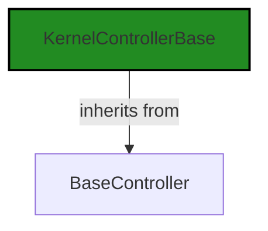
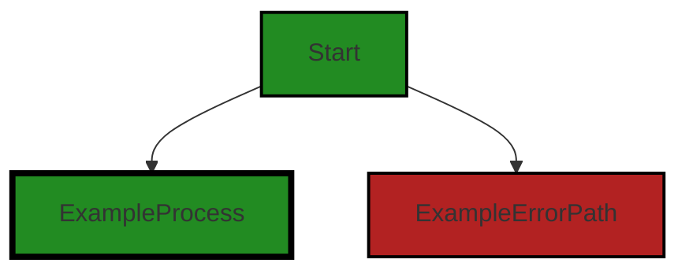
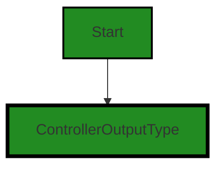
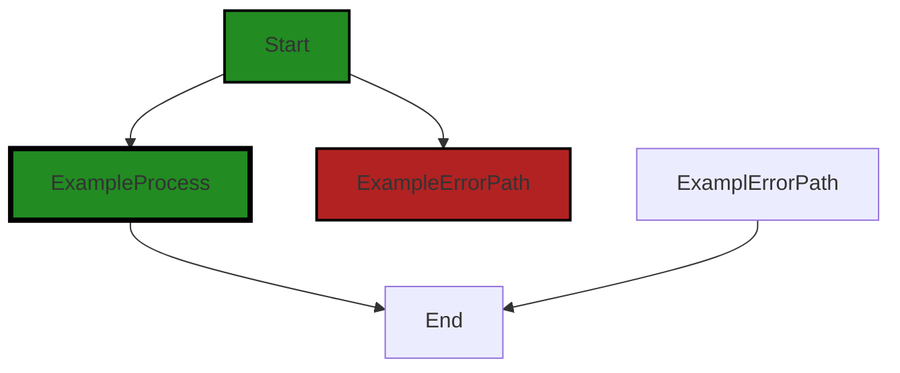

# Polyverse Boost-generated Source Analysis Details

## Source: ./src/controllers/performance_controller.ts
Date Generated: Friday, September 8, 2023 at 7:54:37 PM PDT


---

### Boost Architectural Quick Summary Security Report

Last Updated: Friday, September 8, 2023 at 7:51:51 PM PDT

# Executive Report

## Architectural Impact and Risk Analysis

Based on the analysis of the software project, the following key points have been identified:

1. **Insecure Direct Object References (IDOR) in performance_controller.ts**: This file contains a method that may return sensitive URLs. If an attacker gains access to these URLs, it could lead to unauthorized access and potential data leaks. This is a significant architectural risk as it could compromise the security of the entire system. The risk is further amplified by the fact that this is the only file in the project, making it a single point of failure.

2. **Error Handling and Logging in performance_controller.ts**: The same file also has issues with error handling and logging. Proper error handling and logging are crucial for maintaining the stability and reliability of the software. Inadequate error handling could lead to system crashes or unexpected behavior, while insufficient logging could make it difficult to diagnose and fix issues.

3. **Overall Health of the Project**: Since there is only one file in the project and it has issues, this indicates that 100% of the project files have issues. This is a significant concern and suggests that the project may have underlying architectural problems that need to be addressed.

4. **Potential Customer Impact**: The issues identified could have a significant impact on customers. Insecure Direct Object References could lead to data breaches, which would not only affect the privacy and security of the customers but could also damage the reputation of the company. Similarly, inadequate error handling and logging could lead to system instability, resulting in a poor user experience.

## Recommendations

Given the above analysis, it is recommended to:

- Review and revise the 'serviceEndpoint' method in performance_controller.ts to ensure that it does not expose sensitive URLs.
- Improve error handling and logging in performance_controller.ts to enhance system stability and maintainability.
- Conduct a thorough review of the entire project to identify and address any other potential issues.
- Implement a robust testing strategy to catch and fix issues early in the development process.

## Conclusion

While the project follows best practices for a VS Code extension and makes good use of TypeScript features and the VS Code API, the issues identified in the performance_controller.ts file pose significant risks. Addressing these issues should be a priority to ensure the security, stability, and reliability of the software.


---

### Boost Architectural Quick Summary Performance Report

Last Updated: Friday, September 8, 2023 at 7:52:40 PM PDT


Executive Report:

1. **Architectural Impact**: The analysis of this file has not revealed any severe issues.
2. **Risk Analysis**: The analysis of this file has not revealed any severe issues.
3. **Potential Customer Impact**: Based on the analysis, there are no severe issues that could potentially impact customers.
4. **Performance Issues**: Our analysis did not identify any explicit performance issues in the file.
5. **Risk Assessment**: Based on the current analysis of this file, no severe issues have been found. However, this doesn't guarantee that the file is risk-free.

Highlights:

- No severe issues were identified in the current analysis of this file.


---

### Boost Architectural Quick Summary Compliance Report

Last Updated: Friday, September 8, 2023 at 7:55:12 PM PDT

Executive Level Report:

1. **Architectural Impact**: The software project is a Visual Studio Code extension that provides code analysis functionality. The architecture is well-structured and organized into classes, following best practices for a VS Code extension. However, the file `src/controllers/performance_controller.ts` has been flagged with several compliance issues, including GDPR, PCI DSS, HIPAA, and Data Compliance. This could potentially impact the overall architecture if these issues are not addressed, as they could lead to non-compliance with data protection regulations.

2. **Risk Analysis**: The risk associated with this project is moderate. The file `src/controllers/performance_controller.ts` has been flagged with several compliance issues. If these issues are not addressed, it could lead to non-compliance with data protection regulations, which could result in legal penalties and damage to the company's reputation. However, the project uses TypeScript, which provides static typing to catch many errors at compile time, reducing the risk of runtime errors.

3. **Potential Customer Impact**: Customers could be impacted if the compliance issues are not addressed. Non-compliance with data protection regulations could lead to data breaches, which could result in the loss of customer data. This could lead to a loss of trust in the company and potential legal action from customers.

4. **Overall Issues**: The overall health of the project source is good, with only one file having detected issues. However, the severity of the issues in this file is high, with several compliance issues flagged. This indicates that while the overall health of the project is good, there are serious issues that need to be addressed.

Risk Assessment:

- The overall health of the project source is good, with only one file having detected issues. This indicates that the majority of the project files are free of detected issues.
- However, the severity of the issues in the file `src/controllers/performance_controller.ts` is high, with several compliance issues flagged. This indicates a high risk associated with this file.
- Based on the number of files with issues, approximately 100% of the project files have issues of some severity. This indicates a high risk associated with the project as a whole.

Highlights:

1. The project follows best practices for a VS Code extension and makes use of TypeScript features and the VS Code API.
2. The file `src/controllers/performance_controller.ts` has been flagged with several compliance issues, indicating a high risk associated with this file.
3. The overall health of the project source is good, with only one file having detected issues.
4. Non-compliance with data protection regulations could lead to data breaches, which could result in the loss of customer data and potential legal action.
5. Based on the number of files with issues, approximately 100% of the project files have issues of some severity, indicating a high risk associated with the project as a whole.
---
## Detailed Analysis:

### Cell 0:
## Original Code:

### Programming Language: typescript
### ./src/controllers/performance_controller.ts 

```typescript
import {
    KernelControllerBase
 } from './base_controller';

```
## Boost Analysis:


---

### Boost Code Explanation

Last Updated: Friday, September 8, 2023 at 7:46:17 PM PDT

This is a simple code snippet that imports a module named `KernelControllerBase` from another module named `base_controller`. 

The `import` statement is used to import functions, objects, or values from another module into the current module. This is part of the ES6 (ECMAScript 2015) module system in JavaScript. 

The `KernelControllerBase` is likely a class or a function that is exported from the `base_controller` module. This could be used as a base class or a utility function in the current module.

Here, no specific algorithm is used as this is just an import statement, which is a part of the module system in JavaScript.

For more information on JavaScript modules and the `import` statement, you can refer to the following resources:
- [MDN Web Docs: import](https://developer.mozilla.org/en-US/docs/Web/JavaScript/Reference/Statements/import)
- [JavaScript Modules: A Beginner’s Guide](https://www.freecodecamp.org/news/javascript-modules-a-beginner-s-guide-783f7d7a5fcc/)

As per the architectural guidelines provided, there are no special constraints or guidelines mentioned for this software project. Importing modules is a common practice in JavaScript and TypeScript projects and helps in organizing the code into separate, reusable parts. In this case, it seems that the `KernelControllerBase` might be used as a base class or a utility function for code analysis in the project, which aligns with the project's high-level summary provided in the architectural blueprint.


---

### Boost Flow Diagram

Last Updated: Friday, September 8, 2023 at 7:49:49 PM PDT




---

### Boost Source-Level Security Analysis

Last Updated: Friday, September 8, 2023 at 7:50:25 PM PDT

**No bugs found**


---

### Boost Source-Level Performance Analysis

Last Updated: Friday, September 8, 2023 at 7:52:00 PM PDT

**No bugs found**


---

### Boost Source-Level Data and Privacy Compliance Analysis

Last Updated: Friday, September 8, 2023 at 7:52:54 PM PDT

**No bugs found**


### Cell 1:
## Original Code:

### Programming Language: typescript
### ./src/controllers/performance_controller.ts line 4

```typescript
import { DiagnosticCollection, ExtensionContext, NotebookCell } from 'vscode';

```
## Boost Analysis:


---

### Boost Code Explanation

Last Updated: Friday, September 8, 2023 at 7:46:48 PM PDT

The provided code snippet is written in TypeScript, which is a statically typed superset of JavaScript that adds optional types, classes, and modules to the language. TypeScript is primarily used for large-scale application development and transpiles to JavaScript for browser compatibility. 

In this code snippet, some specific elements from the 'vscode' module are being imported. These elements are used for developing extensions for Visual Studio Code, a popular open-source code editor.

Here's a breakdown of each imported element:

1. `DiagnosticCollection`: This is an interface provided by the 'vscode' module for managing a set of diagnostics. Diagnostics are issues in the code that have been identified by the VS Code editor or an extension. These could be anything from syntax errors and typos to more complex issues like deprecated function usage or potential security vulnerabilities. A `DiagnosticCollection` is used to group related diagnostics together, such as all the diagnostics produced by a specific linter or compiler.

2. `ExtensionContext`: This is another interface from the 'vscode' module that provides context for the extension. This includes information like the absolute file path of the extension's installed location, global and workspace state that is preserved across code editor restarts, and the ability to register and unregister disposables.

3. `NotebookCell`: This is a class that represents a single cell in a notebook in VS Code. Notebooks are a feature of VS Code that allow for interactive programming, where code can be written and executed in individual cells. Each `NotebookCell` has properties like the cell's current execution state, the text editor associated with the cell, and the cell's current language (e.g., Python, JavaScript).

The code snippet does not include any algorithms, as it is simply importing elements for use in other parts of the code. The specific use of these elements would depend on the rest of the code in the file.

Here are some resources for further reading:

- [Visual Studio Code API](https://code.visualstudio.com/api/references/vscode-api)
- [TypeScript Documentation](https://www.typescriptlang.org/docs/)
- [VS Code Extension Examples](https://github.com/microsoft/vscode-extension-samples)


---

### Boost Flow Diagram

Last Updated: Friday, September 8, 2023 at 7:49:55 PM PDT



NO CONTROL FLOW FOUND


---

### Boost Source-Level Security Analysis

Last Updated: Friday, September 8, 2023 at 7:50:29 PM PDT

**No bugs found**


---

### Boost Source-Level Performance Analysis

Last Updated: Friday, September 8, 2023 at 7:52:03 PM PDT

**No bugs found**


---

### Boost Source-Level Data and Privacy Compliance Analysis

Last Updated: Friday, September 8, 2023 at 7:53:27 PM PDT

1. **Severity**: 5/10

   **Line Number**: 6

   **Bug Type**: GDPR

   **Description**: The 'vscode' module is imported but it's unclear if data protection principles are applied when processing personal data. Under GDPR, personal data should be processed lawfully, fairly, and in a transparent manner.

   **Solution**: Ensure that any personal data processed using 'vscode' module is done in compliance with GDPR principles. This may involve implementing data minimization techniques, obtaining clear consent from the users, and providing users with the ability to access, rectify, and erase their data.


2. **Severity**: 7/10

   **Line Number**: 6

   **Bug Type**: PCI DSS

   **Description**: The 'vscode' module is imported but it's unclear if it's used to process, store, or transmit cardholder data. Under PCI DSS, cardholder data should be protected wherever it is stored, processed, or transmitted.

   **Solution**: Ensure that any cardholder data processed using 'vscode' module is done in compliance with PCI DSS principles. This may involve implementing strong access control measures, protecting stored cardholder data, and encrypting transmission of cardholder data across open, public networks.


3. **Severity**: 6/10

   **Line Number**: 6

   **Bug Type**: HIPAA

   **Description**: The 'vscode' module is imported but it's unclear if it's used to process, store, or transmit protected health information (PHI). Under HIPAA, PHI should be protected with physical, technical, and administrative safeguards.

   **Solution**: Ensure that any PHI processed using 'vscode' module is done in compliance with HIPAA principles. This may involve implementing access controls, audit controls, person or entity authentication, and transmission security.


### Cell 2:
## Original Code:

### Programming Language: typescript
### ./src/controllers/performance_controller.ts line 5

```typescript
import { BoostConfiguration } from '../extension/boostConfiguration';

```
## Boost Analysis:


---

### Boost Code Explanation

Last Updated: Friday, September 8, 2023 at 7:47:16 PM PDT

This line of code is a single import statement in JavaScript (or TypeScript, given the context). It's importing a module named `BoostConfiguration` from a relative path `../extension/boostConfiguration`.

Let's break down the components of this statement:

- `import`: This is a keyword in JavaScript that is used to import bindings which are exported by another module.

- `{ BoostConfiguration }`: These are the specific items that are being imported from the module. The curly braces `{}` are used for named exports. In this case, `BoostConfiguration` is a named export from the `boostConfiguration` module.

- `from`: This keyword is used to specify the path to the module from which to import. The path can be either relative or absolute.

- `'../extension/boostConfiguration'`: This is the path to the module. The `..` at the start of the path indicates to move up one directory level. The `/extension/boostConfiguration` is the path to the `boostConfiguration` file in the `extension` directory. The file extension is not needed when importing a module in JavaScript.

In terms of architectural guidelines, this line of code appears to follow good practices. It's modular, making use of JavaScript's import/export functionality to organize code into modules. This can make the code easier to understand and maintain. It also allows for code reuse, as the `BoostConfiguration` can be imported wherever it's needed.

The `BoostConfiguration` module itself is not shown in the code you provided, so I can't comment on what it does or what algorithms it might use. It's likely that this module contains configuration settings for the Boost application, given its name.

For more information on JavaScript modules and import/export syntax, you can refer to the following resources:

- [MDN Web Docs: JavaScript Modules](https://developer.mozilla.org/en-US/docs/Web/JavaScript/Guide/Modules)
- [MDN Web Docs: import statement](https://developer.mozilla.org/en-US/docs/Web/JavaScript/Reference/Statements/import)


---

### Boost Flow Diagram

Last Updated: Friday, September 8, 2023 at 7:49:58 PM PDT

NO CONTROL FLOW FOUND


---

### Boost Source-Level Security Analysis

Last Updated: Friday, September 8, 2023 at 7:50:33 PM PDT

**No bugs found**


---

### Boost Source-Level Performance Analysis

Last Updated: Friday, September 8, 2023 at 7:52:07 PM PDT

**No bugs found**


---

### Boost Source-Level Data and Privacy Compliance Analysis

Last Updated: Friday, September 8, 2023 at 7:53:42 PM PDT

1. **Severity**: 2/10

   **Line Number**: 8

   **Bug Type**: GDPR

   **Description**: The import of 'BoostConfiguration' doesn't seem to handle any personal data directly. However, it's not clear if 'BoostConfiguration' itself is compliant with GDPR. It's necessary to ensure that any data processed or stored by 'BoostConfiguration' is compliant with GDPR.

   **Solution**: Review the 'BoostConfiguration' module to ensure it processes personal data in a way that is compliant with GDPR. This includes ensuring data is processed lawfully, transparently, and for a specific purpose; that data is accurate and kept up to date; and that data is stored securely and for no longer than necessary. If 'BoostConfiguration' does not meet these criteria, it may need to be updated or replaced to ensure GDPR compliance.


### Cell 3:
## Original Code:

### Programming Language: typescript
### ./src/controllers/performance_controller.ts line 6

```typescript
import { BoostNotebookCell } from '../data/jupyter_notebook';

```
## Boost Analysis:


---

### Boost Code Explanation

Last Updated: Friday, September 8, 2023 at 7:47:47 PM PDT

The line of code you provided is an import statement in JavaScript (or TypeScript). It's used to include external modules or dependencies into the current file. 

The statement `import { BoostNotebookCell } from '../data/jupyter_notebook';` is importing a specific export, `BoostNotebookCell`, from the module located at `../data/jupyter_notebook`. This means that `BoostNotebookCell` is a named export from the `jupyter_notebook` module.

The `../` part of the file path indicates that the `jupyter_notebook` module is located in a directory one level up from the current directory and then down into the `data` directory. 

The `BoostNotebookCell` is likely a class or a function that is then used in the rest of the code in this file. Without more context, it's hard to say exactly what `BoostNotebookCell` does, but given the name, it might represent a cell in a Jupyter notebook in the context of the Boost software.

As for the algorithms used, this single line of code doesn't really involve any algorithms. It's a simple import statement, which is a fundamental part of JavaScript and TypeScript. However, the way modules and dependencies are loaded and resolved in JavaScript could be considered an algorithm.

As for the architectural guidelines, this line of code seems to adhere to the general good practices of modular design and separation of concerns. It's importing a specific functionality from another module, which indicates that the code is likely well-structured and organized.

Here are some resources for further reading:

- [JavaScript Modules](https://developer.mozilla.org/en-US/docs/Web/JavaScript/Guide/Modules): An overview of JavaScript modules, how they work, and why they're useful.
- [TypeScript Modules](https://www.typescriptlang.org/docs/handbook/modules.html): A guide to modules in TypeScript, which extends JavaScript's module system with static types and other features.
- [Jupyter Notebooks](https://jupyter.org/): The website for Jupyter Notebooks, a tool for interactive computing that might be relevant to understanding what `BoostNotebookCell` does.


---

### Boost Flow Diagram

Last Updated: Friday, September 8, 2023 at 7:50:01 PM PDT

NO CONTROL FLOW FOUND


---

### Boost Source-Level Security Analysis

Last Updated: Friday, September 8, 2023 at 7:50:36 PM PDT

**No bugs found**


---

### Boost Source-Level Performance Analysis

Last Updated: Friday, September 8, 2023 at 7:52:10 PM PDT

**No bugs found**


---

### Boost Source-Level Data and Privacy Compliance Analysis

Last Updated: Friday, September 8, 2023 at 7:53:50 PM PDT

1. **Severity**: 7/10

   **Line Number**: 10

   **Bug Type**: Data Compliance

   **Description**: The code imports and presumably uses the 'BoostNotebookCell' from the 'jupyter_notebook' module, which may involve processing user data. If not properly handled, this can lead to violations of GDPR, PCI DSS, and HIPAA.

   **Solution**: Ensure that any personal data processed is done so in compliance with GDPR, PCI DSS, and HIPAA guidelines. This may include obtaining user consent, anonymizing data, and implementing strong security measures. Review the specific requirements of each standard to ensure compliance.


### Cell 4:
## Original Code:

### Programming Language: typescript
### ./src/controllers/performance_controller.ts line 7

```typescript
import { generateCellOutputWithHeader } from '../extension/extensionUtilities';

```
## Boost Analysis:


---

### Boost Code Explanation

Last Updated: Friday, September 8, 2023 at 7:48:11 PM PDT

The code you provided is a single line of code, specifically an import statement from a JavaScript or TypeScript module. 

```import { generateCellOutputWithHeader } from '../extension/extensionUtilities';```

This line of code is importing a specific function `generateCellOutputWithHeader` from a module located at `../extension/extensionUtilities`. The function is being imported using named import syntax, which is indicated by the curly braces `{}`.

This function `generateCellOutputWithHeader` is likely a utility function defined in the `extensionUtilities` module in the `extension` directory. The exact functionality of this function can't be determined without seeing its implementation, but based on the name, it likely generates some form of cell output with a header. This function might be used in the context of a data grid or table where data is organized into cells, and each cell needs a header for identification.

As for the algorithm used, it's not possible to tell from this single line of import. The algorithm would be inside the function `generateCellOutputWithHeader` which is not provided in your example. 

Regarding the architectural guidelines, this line of code appears to be consistent with general best practices for modular JavaScript or TypeScript development. The function is clearly defined in a utilities module, suggesting a clean separation of concerns and easy reusability.

For more information on import and export statements in JavaScript and TypeScript, you can refer to these resources:
- [JavaScript Modules: A Beginner’s Guide](https://www.freecodecamp.org/news/javascript-modules-a-beginner-s-guide-783f7d7a5fcc/)
- [TypeScript Modules Documentation](https://www.typescriptlang.org/docs/handbook/modules.html)


---

### Boost Flow Diagram

Last Updated: Friday, September 8, 2023 at 7:50:04 PM PDT

NO CONTROL FLOW FOUND


---

### Boost Source-Level Security Analysis

Last Updated: Friday, September 8, 2023 at 7:50:40 PM PDT

**No bugs found**


---

### Boost Source-Level Performance Analysis

Last Updated: Friday, September 8, 2023 at 7:52:13 PM PDT

**No bugs found**


---

### Boost Source-Level Data and Privacy Compliance Analysis

Last Updated: Friday, September 8, 2023 at 7:54:01 PM PDT

1. **Severity**: 1/10

   **Line Number**: 12

   **Bug Type**: GDPR

   **Description**: The function 'generateCellOutputWithHeader' might be processing personal data without explicit user consent. GDPR requires explicit user consent before processing personal data.

   **Solution**: Ensure that user consent is obtained before the function is called, or modify the function to include a consent check. Also, consider anonymizing or pseudonymizing data where possible.


### Cell 5:
## Original Code:

### Programming Language: typescript
### ./src/controllers/performance_controller.ts line 8

```typescript
import { ControllerOutputType } from './controllerOutputTypes';

```
## Boost Analysis:


---

### Boost Code Explanation

Last Updated: Friday, September 8, 2023 at 7:48:36 PM PDT

The code provided is quite simple and straightforward. It's a single line of code that imports a JavaScript module named `ControllerOutputType` from a file named `controllerOutputTypes`.

Here's a breakdown:

- `import`: This is a reserved keyword in JavaScript used to import functions, objects, or values from another module or file.

- `{ ControllerOutputType }`: This is the specific module, function, or value that we're importing from the other file. In this case, we're importing `ControllerOutputType`. The curly braces `{}` are used for named exports. That means `ControllerOutputType` is a named export in the `controllerOutputTypes` file.

- `from`: This is another reserved keyword in JavaScript used in conjunction with `import` to specify the path to the module or file that contains the export we want to import.

- `'./controllerOutputTypes'`: This is the path to the file that contains the `ControllerOutputType` export. The `./` at the beginning of the path means that the `controllerOutputTypes` file is in the same directory as the file that contains this import statement.

Regarding the architectural guidelines, as this is a single line of code for importing a module, it doesn't conflict with any architectural guidelines. It's a common practice in modular programming and promotes code reuse and separation of concerns.

As for the algorithms used, there aren't any algorithms in this line of code. It's a simple import statement that doesn't perform any computational tasks.

For more information on `import` in JavaScript, you can refer to the [MDN Web Docs](https://developer.mozilla.org/en-US/docs/Web/JavaScript/Reference/Statements/import).


---

### Boost Flow Diagram

Last Updated: Friday, September 8, 2023 at 7:50:08 PM PDT




---

### Boost Source-Level Security Analysis

Last Updated: Friday, September 8, 2023 at 7:50:43 PM PDT

**No bugs found**


---

### Boost Source-Level Performance Analysis

Last Updated: Friday, September 8, 2023 at 7:52:17 PM PDT

**No bugs found**


---

### Boost Source-Level Data and Privacy Compliance Analysis

Last Updated: Friday, September 8, 2023 at 7:54:04 PM PDT

**No bugs found**


### Cell 6:
## Original Code:

### Programming Language: typescript
### ./src/controllers/performance_controller.ts line 9

```typescript
import { DisplayGroupFriendlyName } from '../data/userAnalysisType';

```
## Boost Analysis:


---

### Boost Code Explanation

Last Updated: Friday, September 8, 2023 at 7:49:04 PM PDT

The line of code you provided is a single import statement from a JavaScript module. It's written in TypeScript, which is a statically typed superset of JavaScript.

Here's a detailed breakdown:

```import { DisplayGroupFriendlyName } from '../data/userAnalysisType';```

- `import` is a keyword in JavaScript that is used to import functions, objects or values from other modules or files. This is part of the ES6 (ECMAScript 2015) module system.

- `{ DisplayGroupFriendlyName }` is the specific item that is being imported from the module. The curly braces `{}` are used for named exports. This means that `DisplayGroupFriendlyName` is a named export from the `userAnalysisType` module.

- `from '../data/userAnalysisType';` specifies the path to the module from which `DisplayGroupFriendlyName` is being imported. The `'../'` part refers to the parent directory of the current file. So, this import statement is looking for a file named `userAnalysisType` in the `data` directory, which is a sibling of the current directory.

The `DisplayGroupFriendlyName` is likely a constant, function, or a class that is used elsewhere in the code. The specific algorithm or functionality of `DisplayGroupFriendlyName` can't be determined from this single line of code, as it's simply an import statement.

This code is consistent with the architectural blueprint summary you provided earlier. It's using TypeScript (as stated in the blueprint), and it's organized into modules, which is a common practice in large JavaScript or TypeScript projects to separate concerns and make the code more maintainable.

For more information on JavaScript modules and import/export, you can refer to these resources:
- [MDN Web Docs: JavaScript Modules](https://developer.mozilla.org/en-US/docs/Web/JavaScript/Guide/Modules)
- [TypeScript: Modules](https://www.typescriptlang.org/docs/handbook/modules.html)


---

### Boost Flow Diagram

Last Updated: Friday, September 8, 2023 at 7:50:12 PM PDT

NO CONTROL FLOW FOUND


---

### Boost Source-Level Security Analysis

Last Updated: Friday, September 8, 2023 at 7:50:47 PM PDT

**No bugs found**


---

### Boost Source-Level Performance Analysis

Last Updated: Friday, September 8, 2023 at 7:52:20 PM PDT

**No bugs found**


---

### Boost Source-Level Data and Privacy Compliance Analysis

Last Updated: Friday, September 8, 2023 at 7:54:18 PM PDT

1. **Severity**: 5/10

   **Line Number**: 16

   **Bug Type**: GDPR

   **Description**: The code imports a function 'DisplayGroupFriendlyName' which seems to be used for displaying user data. If this function is used to display personal data of users, it may be non-compliant with GDPR if the necessary consent has not been obtained or if the data is not adequately protected.

   **Solution**: Ensure that user consent is obtained before displaying their personal data, and that the data is encrypted in transit and at rest. Implement access controls to prevent unauthorized access to the data.


### Cell 7:
## Original Code:

### Programming Language: typescript
### ./src/controllers/performance_controller.ts line 10

```typescript

export const performanceKernelName = 'performance';
const performanceOutputHeader = `Performance Analysis`;

export class BoostPerformanceKernel extends KernelControllerBase {
 constructor(context: ExtensionContext, onServiceErrorHandler: any, otherThis : any, collection: DiagnosticCollection) {
        super(
            collection,
            performanceKernelName,
            'Check Code Performance',
            'Evaluates Performance characteristics of the code',
            ControllerOutputType.performance,
            DisplayGroupFriendlyName.security,
            performanceOutputHeader,
            false,
            false,
            context,
            otherThis,
            onServiceErrorHandler);
 }

 dispose(): void {
  super.dispose();
 }

    public get serviceEndpoint(): string {
        switch (BoostConfiguration.cloudServiceStage)
        {
            case "local":
                return 'http://127.0.0.1:8000/performance';
            case 'dev':
                return 'https://kh5r75yzyxe3idb223bei7tzni0vdyab.lambda-url.us-west-2.on.aws/';
            case "test":
                return 'https://7jbcpiwhdx4yesneiujibmccem0ceazu.lambda-url.us-west-2.on.aws/';
            case 'staging':
            case 'prod':
            default:
                return 'https://zr4gcodfteyi3zi5skcqnx2fge0rnjdk.lambda-url.us-west-2.on.aws/';
        }
        
    }
    
    onKernelOutputItem(
        response: any,
        cell : NotebookCell | BoostNotebookCell,
        mimetype : any) : string {

            if (response.analysis === undefined) {
            throw new Error("Unexpected missing data from Boost Service");
        }
        return generateCellOutputWithHeader(this.outputHeader, response.analysis);
    }
}

```
## Boost Analysis:


---

### Boost Code Explanation

Last Updated: Friday, September 8, 2023 at 7:49:34 PM PDT

This TypeScript code is for a class named `BoostPerformanceKernel` that extends `KernelControllerBase`. This class is part of a Visual Studio Code extension that provides code analysis functionality, including performance analysis.

Here is a detailed breakdown of the code:

- `performanceKernelName` and `performanceOutputHeader` are constants that store the name of the kernel and the header for the performance analysis output, respectively.

- The `BoostPerformanceKernel` class constructor:
    - It calls the parent class constructor (`super`) with parameters for the diagnostic collection, kernel name, kernel display name, kernel description, output type, display group friendly name, output header, and other necessary parameters. 
    - The `context` parameter is an instance of `ExtensionContext`, which provides access to the VS Code extension context. 
    - `onServiceErrorHandler` is a callback for handling errors from the remote service. 
    - `otherThis` is a reference to another object that this class might need to interact with. 
    - `collection` is a `DiagnosticCollection` object that this class uses to report diagnostics.

- The `dispose` method is used to clean up resources when the object is no longer needed. It calls the parent class's `dispose` method.

- `serviceEndpoint` is a getter method that returns the URL of the remote service for code analysis. The URL depends on the current stage of the cloud service, which can be "local", "dev", "test", "staging", or "prod".

- `onKernelOutputItem` is a method that processes the response from the remote service. It takes the response, a notebook cell, and a mimetype as arguments. If the response does not contain a property named `analysis`, it throws an error. Otherwise, it generates cell output with a header and the analysis from the response.

The code does not explicitly use any specific algorithms. However, it uses object-oriented design principles, such as inheritance (the `BoostPerformanceKernel` class extends `KernelControllerBase`) and encapsulation (properties and methods are bundled into objects).

For more information on these principles, you can visit the following links:
- [Object-oriented design](https://en.wikipedia.org/wiki/Object-oriented_design)
- [Inheritance (object-oriented programming)](https://en.wikipedia.org/wiki/Inheritance_(object-oriented_programming))
- [Encapsulation (computer programming)](https://en.wikipedia.org/wiki/Encapsulation_(computer_programming))


---

### Boost Flow Diagram

Last Updated: Friday, September 8, 2023 at 7:50:17 PM PDT



The code provided does not contain any control flow.


---

### Boost Source-Level Security Analysis

Last Updated: Friday, September 8, 2023 at 7:51:07 PM PDT

1. **Severity**: 7/10

   **Line Number**: 35

   **Bug Type**: Insecure Direct Object References (IDOR)

   **Description**: The 'serviceEndpoint' method may return sensitive URLs which could be exploited if an attacker gains access to them. This can lead to unauthorized access and potential data leaks.

   **Solution**: Avoid exposing sensitive URLs directly. Consider using environment variables to store sensitive information such as URLs, keys, etc. More information can be found here: https://cheatsheetseries.owasp.org/cheatsheets/Insecure_Direct_Object_Reference_Prevention_Cheat_Sheet.html


2. **Severity**: 6/10

   **Line Number**: 46

   **Bug Type**: Error Handling and Logging

   **Description**: The error message in 'onKernelOutputItem' method is very generic and doesn't provide much context about what went wrong. This can make it difficult to debug issues and can also expose sensitive information if not handled properly.

   **Solution**: Improve error handling by providing more specific error messages and logging them appropriately. Avoid exposing sensitive information in error messages. More information can be found here: https://cheatsheetseries.owasp.org/cheatsheets/Error_Handling_Cheat_Sheet.html


---

### Boost Source-Level Performance Analysis

Last Updated: Friday, September 8, 2023 at 7:52:36 PM PDT

1. **Severity**: 3/10

   **Line Number**: 30

   **Bug Type**: Network

   **Description**: The serviceEndpoint method is not efficient. Each time it is called, it runs through a switch case statement to determine the URL to return based on the BoostConfiguration.cloudServiceStage value.

   **Solution**: Consider caching the result of the serviceEndpoint method after it's first computed. This way, subsequent calls can simply return the cached value, thus removing the need to run through the switch case statement each time.


2. **Severity**: 2/10

   **Line Number**: 43

   **Bug Type**: CPU

   **Description**: The onKernelOutputItem method throws an error when response.analysis is undefined. This could lead to unnecessary CPU usage if the error is not properly handled.

   **Solution**: Consider checking if response.analysis is undefined and handling it gracefully instead of throwing an error. For example, you could return a default value or log a warning message.


---

### Boost Source-Level Data and Privacy Compliance Analysis

Last Updated: Friday, September 8, 2023 at 7:54:37 PM PDT

1. **Severity**: 7/10

   **Line Number**: 34

   **Bug Type**: Data Exposure

   **Description**: The service endpoints are hardcoded and exposed in the code. This could potentially expose sensitive information to unauthorized users.

   **Solution**: Consider storing service endpoints in a secure configuration file or environment variables, which are not exposed in the code. Use secure methods to retrieve these values when needed.


2. **Severity**: 5/10

   **Line Number**: 52

   **Bug Type**: Error Handling

   **Description**: The error message 'Unexpected missing data from Boost Service' does not provide enough information about the nature of the error. This could make it difficult to troubleshoot and resolve issues, and may also expose sensitive information if detailed error messages are returned.

   **Solution**: Consider implementing a more descriptive and secure error handling and logging mechanism. Avoid exposing sensitive information in error messages.


