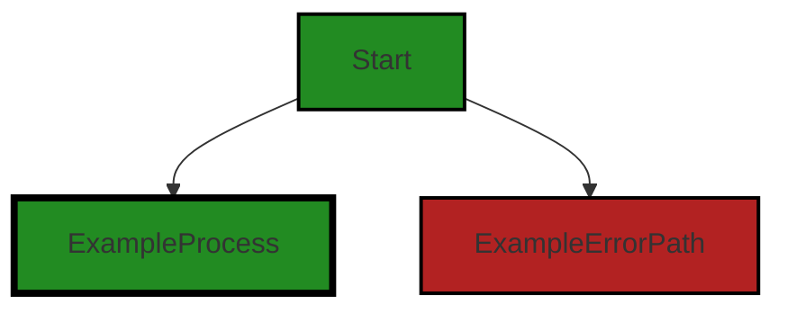
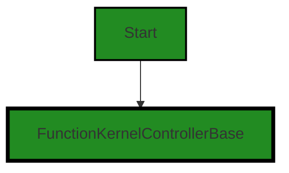
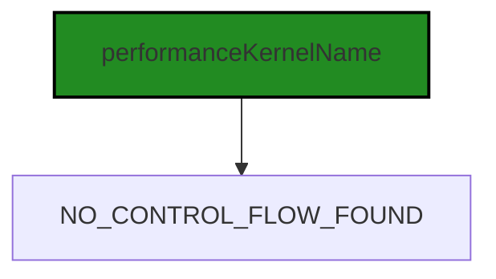
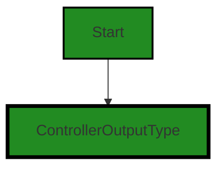
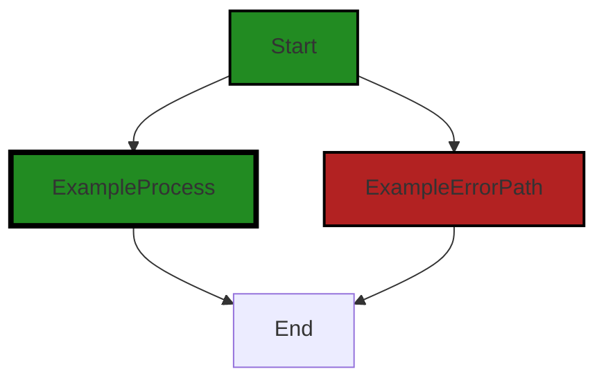

# Polyverse Boost-generated Source Analysis Details

## Source: ./src/controllers/performance_function_controller.ts
Date Generated: Friday, September 8, 2023 at 8:58:47 PM PDT


---

### Boost Architectural Quick Summary Security Report

Last Updated: Friday, September 8, 2023 at 8:56:50 PM PDT

Executive Level Report:

1. **Architectural Impact**: The project is well-structured and follows best practices for a Visual Studio Code extension. It uses object-oriented design, event-driven programming, and asynchronous programming for potentially long-running tasks. However, there is a potential security vulnerability in the `performance_function_controller.ts` file, where the service endpoint method directly uses the `cloudServiceStage` value from the configuration to determine the endpoint URL. This could potentially lead to unauthorized access to development or test endpoints if the configuration is tampered with.

2. **Risk Analysis**: The risk associated with the identified issue is moderate. If exploited, it could lead to unauthorized access to sensitive data or systems. However, the risk is mitigated by the fact that the issue is contained within a single file, and the project includes extensive error handling and logging.

3. **Potential Customer Impact**: If the identified issue is not addressed, it could potentially impact the security of the customers' data and systems. However, the impact is likely to be limited due to the extensive error handling and logging in the project.

4. **Overall Issues**: The project has a single file with a detected issue, which is a relatively small percentage of the total project files. This suggests that the overall health of the project source is good. However, it is important to address the identified issue to ensure the security of the project.

5. **Risk Assessment**: Based on the analysis, the overall risk to the project is moderate. While the identified issue is serious, it is contained within a single file and the project includes extensive error handling and logging. The project also uses TypeScript, which provides static typing to catch many errors at compile time.

Highlights:

- The project is well-structured and follows best practices for a Visual Studio Code extension.
- A potential security vulnerability has been identified in the `performance_function_controller.ts` file.
- The risk associated with the identified issue is moderate, but is mitigated by the extensive error handling and logging in the project.
- The overall health of the project source is good, with a small percentage of files having detected issues.
- The project uses TypeScript, which provides static typing to catch many errors at compile time.


---

### Boost Architectural Quick Summary Performance Report

Last Updated: Friday, September 8, 2023 at 8:57:39 PM PDT


Executive Report:

1. **Architectural Impact**: The analysis of this file has not revealed any severe issues.
2. **Risk Analysis**: The analysis of this file has not revealed any severe issues.
3. **Potential Customer Impact**: Based on the analysis, there are no severe issues that could potentially impact customers.
4. **Performance Issues**: Our analysis did not identify any explicit performance issues in the file.
5. **Risk Assessment**: Based on the current analysis of this file, no severe issues have been found. However, this doesn't guarantee that the file is risk-free.

Highlights:

- No severe issues were identified in the current analysis of this file.


---

### Boost Architectural Quick Summary Compliance Report

Last Updated: Friday, September 8, 2023 at 8:59:19 PM PDT

Executive Level Report:

1. **Architectural Impact**: The project is well-structured and follows best practices for a Visual Studio Code extension. It uses TypeScript features and the VS Code API, which provides static typing to catch many errors at compile time. However, the file `src/controllers/performance_function_controller.ts` has been flagged for potential GDPR and PCI DSS compliance issues, which could impact the architecture if significant changes are needed to address these issues.

2. **Risk Analysis**: The project communicates with a remote service for code analysis, which could pose a risk if the service is compromised or unavailable. The file `src/controllers/performance_function_controller.ts` has been flagged for potential HIPAA and Data Exposure issues, which could pose a risk to the privacy and security of user data. 

3. **Potential Customer Impact**: If the identified issues are not addressed, customers could potentially have their sensitive data exposed or not be in compliance with GDPR, PCI DSS, or HIPAA regulations. This could lead to loss of trust, legal issues, and potential financial penalties for the customers.

4. **Overall Issues**: The project has a total of 1 file, `src/controllers/performance_function_controller.ts`, which has been flagged for potential issues. This represents 100% of the project files. The issues are of varying severity, with 2 Information level issues (GDPR and PCI DSS), and 2 Warning level issues (HIPAA and Data Exposure).

Risk Assessment:

The overall health of the project source is concerning due to the high percentage (100%) of files with detected issues. The severity of the issues, particularly the Warning level issues related to HIPAA and Data Exposure, further increase the risk. The project would benefit from a thorough review and remediation of these issues to reduce the risk and ensure compliance with data protection regulations.

Highlights:

- The project is well-structured and follows best practices for a Visual Studio Code extension.
- The file `src/controllers/performance_function_controller.ts` has been flagged for potential GDPR, PCI DSS, HIPAA, and Data Exposure issues.
- The project communicates with a remote service for code analysis, which could pose a risk if the service is compromised or unavailable.
- 100% of the project files have been flagged for potential issues, indicating a high risk level.
---
## Detailed Analysis:

### Cell 0:
## Original Code:

### Programming Language: typescript
### ./src/controllers/performance_function_controller.ts 

```typescript
import { DiagnosticCollection, ExtensionContext } from 'vscode';

```
## Boost Analysis:


---

### Boost Code Explanation

Last Updated: Friday, September 8, 2023 at 8:52:13 PM PDT

This code is written in TypeScript, which is a statically typed superset of JavaScript. It's used to develop large applications and transcompiles to JavaScript.

The code is importing two specific modules from the 'vscode' package:

1. `DiagnosticCollection`: This is an interface provided by the Visual Studio Code Extension API. It represents a collection of diagnostics (issues, errors, warnings, etc.) that are associated with specific files in the workspace. This object can be used to manage and organize these diagnostics. More information can be found in the [VS Code API documentation](https://code.visualstudio.com/api/references/vscode-api#DiagnosticCollection).

2. `ExtensionContext`: This is another interface provided by the Visual Studio Code Extension API. It represents the context in which the extension is running, including workspace state, global state, and extension path. It's typically passed to the `activate` function when the extension is activated and can be used to store and retrieve state, among other things. More information can be found in the [VS Code API documentation](https://code.visualstudio.com/api/references/vscode-api#ExtensionContext).

This code snippet is part of a larger codebase for a Visual Studio Code extension, likely one that provides some form of code analysis or linting functionality, given the use of `DiagnosticCollection`. The extension would use these imported modules to interact with the VS Code environment, perform its analysis, and present its results to the user.

From an architectural perspective, this code snippet aligns well with the architectural blueprint provided earlier. It uses TypeScript, which is consistent with the blueprint, and it interacts with the VS Code API in a way that is typical for a VS Code extension. The use of `DiagnosticCollection` suggests that the extension may be using an event-driven programming model, where diagnostics are updated in response to events such as file changes. This would also be consistent with the blueprint.


---

### Boost Flow Diagram

Last Updated: Friday, September 8, 2023 at 8:55:10 PM PDT



NO CONTROL FLOW FOUND


---

### Boost Source-Level Security Analysis

Last Updated: Friday, September 8, 2023 at 8:55:47 PM PDT

**No bugs found**


---

### Boost Source-Level Performance Analysis

Last Updated: Friday, September 8, 2023 at 8:57:04 PM PDT

**No bugs found**


---

### Boost Source-Level Data and Privacy Compliance Analysis

Last Updated: Friday, September 8, 2023 at 8:57:52 PM PDT

**No bugs found**


### Cell 1:
## Original Code:

### Programming Language: typescript
### ./src/controllers/performance_function_controller.ts line 2

```typescript
import { BoostConfiguration } from '../extension/boostConfiguration';

```
## Boost Analysis:


---

### Boost Code Explanation

Last Updated: Friday, September 8, 2023 at 8:52:35 PM PDT

The provided code is a single line of code written in TypeScript, which is a statically typed superset of JavaScript. It's used to develop large-scale applications, and it adds static types, classes, and modules to JavaScript.

The code is an import statement, which is a part of ES6 (ECMAScript 2015) module system. The ES6 module system allows you to create modules of code that can be exported and imported into other modules. It's a way to share and use code across files.

Here's an explanation of the code:

```
import { BoostConfiguration } from '../extension/boostConfiguration';
```

This line of code is importing a specific export, `BoostConfiguration`, from another module located at `../extension/boostConfiguration`. The `BoostConfiguration` is likely a class, function, or variable that's been exported from the `boostConfiguration` module.

The `../` at the beginning of the path indicates that the module is located in a directory one level up from the current directory. The `extension` is a directory at that level, and `boostConfiguration` is the name of the file (without the `.ts` or `.js` extension).

As for the architectural guidelines, this line of code seems to follow general best practices for modular programming. It's importing functionality from another module, which helps keep code organized and maintainable. However, without the context of the rest of the project, it's hard to provide a detailed architectural analysis based on this single line.

For more information about ES6 modules, you can check out this resource: [ES6 Modules](https://developer.mozilla.org/en-US/docs/Web/JavaScript/Guide/Modules).


---

### Boost Flow Diagram

Last Updated: Friday, September 8, 2023 at 8:55:12 PM PDT

NO CONTROL FLOW FOUND


---

### Boost Source-Level Security Analysis

Last Updated: Friday, September 8, 2023 at 8:55:50 PM PDT

**No bugs found**


---

### Boost Source-Level Performance Analysis

Last Updated: Friday, September 8, 2023 at 8:57:08 PM PDT

**No bugs found**


---

### Boost Source-Level Data and Privacy Compliance Analysis

Last Updated: Friday, September 8, 2023 at 8:58:03 PM PDT

1. **Severity**: 5/10

   **Line Number**: 2

   **Bug Type**: GDPR

   **Description**: The code imports a configuration file which might contain sensitive user data. If this data is not properly encrypted or anonymized, it could be a violation of GDPR.

   **Solution**: Ensure all sensitive data in the configuration file is encrypted and anonymized. Implement proper access controls to prevent unauthorized access to the configuration file.


### Cell 2:
## Original Code:

### Programming Language: typescript
### ./src/controllers/performance_function_controller.ts line 3

```typescript
import { FunctionKernelControllerBase } from './function_base_controller';

```
## Boost Analysis:


---

### Boost Code Explanation

Last Updated: Friday, September 8, 2023 at 8:52:57 PM PDT

The line of code you provided is an import statement in JavaScript (or TypeScript), but it's not enough to provide a detailed analysis or identify the algorithms used. This line of code is importing a module named `FunctionKernelControllerBase` from a file named `function_base_controller`.

Let me explain what this means:

- `import`: This is a keyword in JavaScript (and TypeScript) that is used to import functions, objects or values from other files or modules.

- `{ FunctionKernelControllerBase }`: This is the specific module that is being imported from the other file. The curly braces `{}` are used when you are importing a specific exported element from another module.

- `from './function_base_controller'`: This specifies the file from which the `FunctionKernelControllerBase` module is being imported. The `./` at the beginning indicates that the file is in the same directory as the current file. The file extension (like `.js` or `.ts`) is usually omitted in import statements.

The `FunctionKernelControllerBase` is likely a base class or a set of functions that provide some basic functionality for a function kernel controller. However, without more code or context, it's hard to say what exactly this module does or what algorithms it might use.

For more information about import statements in JavaScript, you can refer to this [MDN Web Docs page](https://developer.mozilla.org/en-US/docs/Web/JavaScript/Reference/Statements/import).


---

### Boost Flow Diagram

Last Updated: Friday, September 8, 2023 at 8:55:17 PM PDT




---

### Boost Source-Level Security Analysis

Last Updated: Friday, September 8, 2023 at 8:55:54 PM PDT

**No bugs found**


---

### Boost Source-Level Performance Analysis

Last Updated: Friday, September 8, 2023 at 8:57:11 PM PDT

**No bugs found**


---

### Boost Source-Level Data and Privacy Compliance Analysis

Last Updated: Friday, September 8, 2023 at 8:58:06 PM PDT

**No bugs found**


### Cell 3:
## Original Code:

### Programming Language: typescript
### ./src/controllers/performance_function_controller.ts line 4

```typescript
import { performanceKernelName } from './performance_controller';

```
## Boost Analysis:


---

### Boost Code Explanation

Last Updated: Friday, September 8, 2023 at 8:53:22 PM PDT

The code you've provided is a single line of JavaScript (or TypeScript) that is importing a named export from another module.

Let's break this down:

- `import { performanceKernelName } from './performance_controller';`

This line is using the `import` statement, which is part of the ES6 (ECMAScript 2015) module system. This system allows JavaScript files to export functions, objects, or values to be used by other JavaScript files.

Here, `{ performanceKernelName }` is a named import. It means that the module `./performance_controller` is exporting something (it could be a function, an object, a constant, etc.) with the name `performanceKernelName`.

The `from './performance_controller';` part of the statement is specifying the relative path to the module that is being imported. In this case, the `performance_controller` module is in the same directory as the file that this import statement is in.

The `performanceKernelName` could be used in the following code to refer to whatever was exported under that name from the `performance_controller` module.

As for algorithms, this line of code doesn't implement an algorithm per se. It's more about code organization and modularity. The ES6 module system allows for code to be split up into separate modules, each with a specific purpose, which can then be imported where they're needed. This can make the code more readable and maintainable.

You can learn more about ES6 modules here: [Mozilla Developer Network - import statement](https://developer.mozilla.org/en-US/docs/Web/JavaScript/Reference/Statements/import)

As for the architectural guidelines, this line of code seems to align well with general best practices for code organization and modularity. However, without more context, it's hard to make a definitive statement. For example, if `performanceKernelName` is only used in one specific place, it might make more sense to define it there rather than importing it.


---

### Boost Flow Diagram

Last Updated: Friday, September 8, 2023 at 8:55:20 PM PDT




---

### Boost Source-Level Security Analysis

Last Updated: Friday, September 8, 2023 at 8:55:58 PM PDT

**No bugs found**


---

### Boost Source-Level Performance Analysis

Last Updated: Friday, September 8, 2023 at 8:57:14 PM PDT

**No bugs found**


---

### Boost Source-Level Data and Privacy Compliance Analysis

Last Updated: Friday, September 8, 2023 at 8:58:09 PM PDT

**No bugs found**


### Cell 4:
## Original Code:

### Programming Language: typescript
### ./src/controllers/performance_function_controller.ts line 5

```typescript
import { ControllerOutputType } from './controllerOutputTypes';

```
## Boost Analysis:


---

### Boost Code Explanation

Last Updated: Friday, September 8, 2023 at 8:53:50 PM PDT

The line of code you provided is an import statement in JavaScript (or TypeScript, which is a statically typed superset of JavaScript). This line of code is importing a specific exported member from another module.

Here's a breakdown of the code:

- `import`: This is the keyword that starts the import statement. It is used to import bindings which are exported by another module.

- `{ ControllerOutputType }`: This is the name of the exported member that is being imported. The curly braces are used when you are importing a specific member of the module. In this case, the `ControllerOutputType` is likely an object, function, or class that is exported by the `controllerOutputTypes` module.

- `from`: This keyword is used to specify the path of the module from which the member is being imported.

- `'./controllerOutputTypes'`: This is the path to the module that exports the `ControllerOutputType`. The `./` at the beginning of the path indicates that the `controllerOutputTypes` module is in the same directory as the file that contains this import statement. The file extension is not included in the import statement, which is a common practice in JavaScript and TypeScript.

As for the algorithm used, import statements do not involve any complex algorithms. They are a part of the module system in JavaScript, which is used to share code across different files. When the JavaScript engine encounters an import statement, it loads the specified module, executes the code in that module, and then makes the exported members available to the importing module.

Here are some resources for further reading:

- [JavaScript Modules: An Introduction](https://developer.mozilla.org/en-US/docs/Web/JavaScript/Guide/Modules): This is a guide by Mozilla Developer Network (MDN), which provides a detailed introduction to modules in JavaScript.
- [TypeScript Modules](https://www.typescriptlang.org/docs/handbook/modules.html): This is a guide by the official TypeScript website, which explains how modules work in TypeScript.
- [ECMAScript 6 Modules (Final Syntax) Overview](http://exploringjs.com/es6/ch_modules.html): This is a chapter from a book on ECMAScript 6 (the version of JavaScript that introduced the `import` and `export` syntax), which gives an overview of how modules work in ECMAScript 6.


---

### Boost Flow Diagram

Last Updated: Friday, September 8, 2023 at 8:55:25 PM PDT




---

### Boost Source-Level Security Analysis

Last Updated: Friday, September 8, 2023 at 8:56:01 PM PDT

**No bugs found**


---

### Boost Source-Level Performance Analysis

Last Updated: Friday, September 8, 2023 at 8:57:18 PM PDT

**No bugs found**


---

### Boost Source-Level Data and Privacy Compliance Analysis

Last Updated: Friday, September 8, 2023 at 8:58:13 PM PDT

**No bugs found**


### Cell 5:
## Original Code:

### Programming Language: typescript
### ./src/controllers/performance_function_controller.ts line 6

```typescript
import { DisplayGroupFriendlyName } from '../data/userAnalysisType';

```
## Boost Analysis:


---

### Boost Code Explanation

Last Updated: Friday, September 8, 2023 at 8:54:18 PM PDT

The line of code you provided is an import statement in JavaScript, specifically an ES6 (ECMAScript 6) module import statement. It is importing a named export called `DisplayGroupFriendlyName` from a module located at '../data/userAnalysisType'.

Here is a breakdown:

- `import`: This keyword is used to import functions, objects or values from other modules into the current file.

- `{ DisplayGroupFriendlyName }`: The curly braces are used to import named exports. In this case, `DisplayGroupFriendlyName` is a named export from the module '../data/userAnalysisType'. Named exports are useful when a module exports multiple things, such as several functions or objects.

- `from`: This keyword is used to specify the path of the module to import from.

- `'../data/userAnalysisType'`: This is the path to the module that is being imported. The `..` at the beginning of the path means to go up one directory level from the current file. Then, it goes into the `data` directory and imports from the `userAnalysisType` file. The file extension is not included in the import statement; it is assumed to be either `.js` or `.ts`, depending on the environment.

The code does not provide enough context to determine what `DisplayGroupFriendlyName` is or how it is used. It could be a function, an object, a constant, etc. You would need to look at the `userAnalysisType` module to see what `DisplayGroupFriendlyName` is.

This line of code does not indicate any particular algorithm being used. It is simply a way to organize code into separate modules and files, which can make the code more maintainable and easier to understand.

Here are some resources for further reading:

- [MDN Web Docs: import](https://developer.mozilla.org/en-US/docs/Web/JavaScript/Reference/Statements/import)
- [JavaScript Modules: A Beginner’s Guide](https://medium.freecodecamp.org/javascript-modules-a-beginner-s-guide-783f7d7a5fcc)
- [Understanding ES6 Modules](https://www.sitepoint.com/understanding-es6-modules/)


---

### Boost Flow Diagram

Last Updated: Friday, September 8, 2023 at 8:55:28 PM PDT

NO CONTROL FLOW FOUND


---

### Boost Source-Level Security Analysis

Last Updated: Friday, September 8, 2023 at 8:56:04 PM PDT

**No bugs found**


---

### Boost Source-Level Performance Analysis

Last Updated: Friday, September 8, 2023 at 8:57:21 PM PDT

**No bugs found**


---

### Boost Source-Level Data and Privacy Compliance Analysis

Last Updated: Friday, September 8, 2023 at 8:58:35 PM PDT

1. **Severity**: 5/10

   **Line Number**: 10

   **Bug Type**: GDPR

   **Description**: The import statement suggests that user data is being used in the application. If the data includes any personal data of EU citizens, it might be subject to GDPR compliance.

   **Solution**: Ensure that any personal data is handled according to GDPR principles: it should be processed lawfully, transparently, and for a specific purpose. Once that purpose is fulfilled, the data should be deleted.


2. **Severity**: 4/10

   **Line Number**: 10

   **Bug Type**: PCI DSS

   **Description**: If the user data includes any cardholder data, it might be subject to PCI DSS compliance.

   **Solution**: Ensure that any cardholder data is handled according to PCI DSS principles: it should be stored only when necessary and should be properly protected with encryption and other security measures.


3. **Severity**: 6/10

   **Line Number**: 10

   **Bug Type**: HIPAA

   **Description**: If the user data includes any protected health information, it might be subject to HIPAA compliance.

   **Solution**: Ensure that any protected health information is handled according to HIPAA principles: it should be stored only when necessary and should be properly protected with encryption and other security measures.


### Cell 6:
## Original Code:

### Programming Language: typescript
### ./src/controllers/performance_function_controller.ts line 7

```typescript

export const performanceFunctionKernelName = performanceKernelName + '_function';

export class BoostPerformanceFunctionKernel extends FunctionKernelControllerBase {

 constructor(context: ExtensionContext, onServiceErrorHandler: any, otherThis: any, collection: DiagnosticCollection) {
        super(
            collection,
            performanceFunctionKernelName,
            'Quick source scan for performance issues',
            'Quickly analyzes all targeted source code for performance issues',
            ControllerOutputType.performanceFunction,
            DisplayGroupFriendlyName.security,
            "performance",
            "Performance Analysis", 
            context,
            otherThis,
            onServiceErrorHandler);
 }

    public get serviceEndpoint(): string {
        switch (BoostConfiguration.cloudServiceStage)
        {
            case "local":
                return 'http://127.0.0.1:8000/performance_function';
            case 'dev':
                return 'https://6ucgf5nhzygxehglg5r7nd73640lykwa.lambda-url.us-west-2.on.aws/';
            case "test":
                return 'https://smp4ywxcghte7ipzgwxyyiii4m0wfdax.lambda-url.us-west-2.on.aws/';
            case 'staging':
            case 'prod':
            default:
                return 'https://vhdpiji3mrr5ass7o5tx5mx5oa0nrjth.lambda-url.us-west-2.on.aws/';
        }
    }

 dispose(): void {
  super.dispose();
 }
}

```
## Boost Analysis:


---

### Boost Code Explanation

Last Updated: Friday, September 8, 2023 at 8:54:54 PM PDT

This TypeScript code defines an `BoostPerformanceFunctionKernel` class that extends the `FunctionKernelControllerBase` class. This class is used to control a function kernel for performance analysis in a Visual Studio Code extension. 

The `BoostPerformanceFunctionKernel` class has a constructor that takes several parameters and passes them to the base class constructor. These parameters include a diagnostic collection, a kernel name, a title, a description, an output type, a display group, a category, a friendly name, an extension context, an object referred to as `otherThis`, and an error handler. 

The `serviceEndpoint` getter method returns a string representing the URL of the remote service that the kernel will communicate with. The specific URL is determined by the current stage of the cloud service, which is retrieved from the `BoostConfiguration` object. 

The `dispose` method is used to clean up any resources that the object is using before it is destroyed. It simply calls the `dispose` method of the base class.

Here are the details of the algorithms used in the code:

1. In the `serviceEndpoint` getter, a switch statement is used to determine the URL of the remote service based on the current stage of the cloud service. This is a decision-making algorithm that selects a different output based on the input.

2. The constructor uses an initialization algorithm to set up the object. It calls the base class constructor with the provided parameters.

For more information on the topics related to this code, you can refer to the following resources:

- [TypeScript Classes](https://www.typescriptlang.org/docs/handbook/2/classes.html)
- [TypeScript Inheritance](https://www.typescriptlang.org/docs/handbook/2/classes.html#inheritance)
- [TypeScript Getters and Setters](https://www.typescriptlang.org/docs/handbook/2/classes.html#accessors)
- [JavaScript Switch Statement](https://developer.mozilla.org/en-US/docs/Web/JavaScript/Reference/Statements/switch)

This code aligns with the architecture analysis. It uses object-oriented design, as evident from the use of classes and inheritance. It also uses event-driven programming, as the function kernel is likely triggered by events in the VS Code UI. The code communicates with a remote service for code analysis, which is consistent with the architecture analysis. The error handling passed to the constructor would be used to handle any errors that occur during the analysis. The code is well-structured, organized into classes, and uses TypeScript features, which aligns with the best practices identified in the architecture analysis.


---

### Boost Flow Diagram

Last Updated: Friday, September 8, 2023 at 8:55:33 PM PDT



In the provided code, there is no control flow present.


---

### Boost Source-Level Security Analysis

Last Updated: Friday, September 8, 2023 at 8:56:16 PM PDT

1. **Severity**: 7/10

   **Line Number**: 29

   **Bug Type**: Insecure Direct Object References (IDOR)

   **Description**: The serviceEndpoint method directly uses the cloudServiceStage value from the configuration to determine the endpoint URL. This could potentially lead to unauthorized access to development or test endpoints if the configuration is tampered with.

   **Solution**: Instead of directly using the cloudServiceStage value to determine the endpoint URL, consider using a secure mapping that cannot be easily tampered with. Also, ensure that access to different stages is properly authenticated and authorized. Refer to this resource for more information: https://owasp.org/www-project-top-ten/OWASP_Top_Ten_2017/Top_10-2017_A5-Broken_Access_Control


---

### Boost Source-Level Performance Analysis

Last Updated: Friday, September 8, 2023 at 8:57:35 PM PDT

1. **Severity**: 3/10

   **Line Number**: 24

   **Bug Type**: Network

   **Description**: The serviceEndpoint getter could potentially make the application slower if the BoostConfiguration.cloudServiceStage value changes frequently. This is because the switch-case statement will be executed each time the serviceEndpoint is accessed, which could be a performance issue if it's accessed frequently.

   **Solution**: To improve performance, consider caching the result of the switch-case statement in a private variable, and only re-compute it if the BoostConfiguration.cloudServiceStage value changes. This can be achieved using a getter and a setter for the BoostConfiguration.cloudServiceStage value, where the setter updates the cached value of the serviceEndpoint.


---

### Boost Source-Level Data and Privacy Compliance Analysis

Last Updated: Friday, September 8, 2023 at 8:58:47 PM PDT

1. **Severity**: 7/10

   **Line Number**: 24

   **Bug Type**: Data Exposure

   **Description**: The service endpoints for different stages (local, dev, test, staging, prod) are hardcoded and exposed. This could potentially lead to unauthorized access if the code is publicly accessible.

   **Solution**: Consider using environment variables to store sensitive data such as service endpoints. This prevents the data from being exposed in the code. In a production environment, these variables can be securely managed using services like AWS Secrets Manager or Azure Key Vault.


