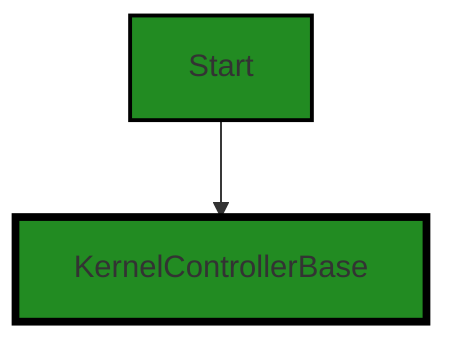
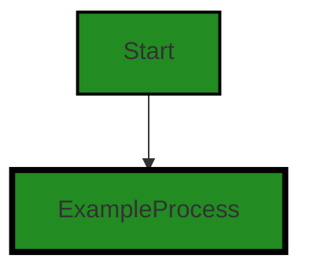
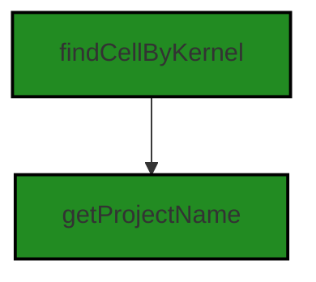
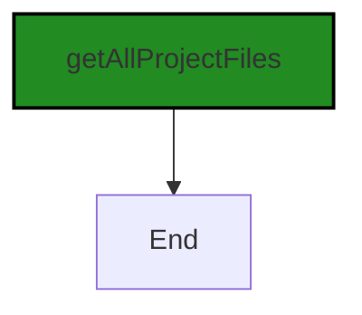
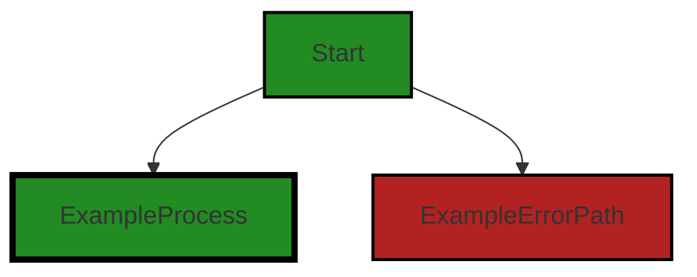
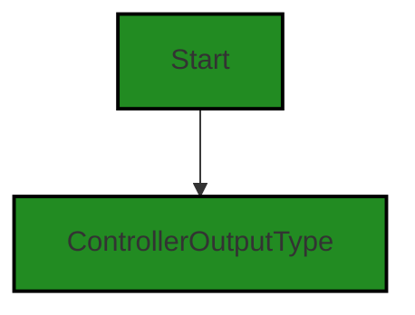
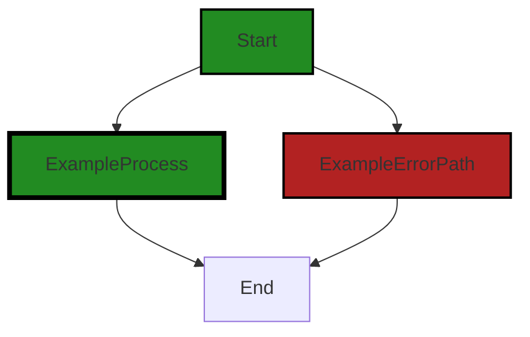

# Polyverse Boost-generated Source Analysis Details

## Source: ./src/controllers/quick_blueprint_controller.ts
Date Generated: Friday, September 8, 2023 at 9:35:48 PM PDT


---

### Boost Architectural Quick Summary Security Report

Last Updated: Friday, September 8, 2023 at 9:30:50 PM PDT

## Executive Report: Software Project Analysis

### Architectural Impact and Risk Analysis

1. **Insecure Direct Object References (IDOR) in `quick_blueprint_controller.ts`:** This issue is of high severity and could potentially lead to unauthorized access. The function `getCurrentOrganization(this.context)` is used without proper validation, which could allow an attacker to manipulate 'this.context' to reference an object they should not have access to. This issue could have a significant architectural impact, as it may require changes to the way data is accessed and validated in the application. 

2. **Cross-Site Scripting (XSS) in `quick_blueprint_controller.ts`:** This issue is of lower severity but could still have a significant impact on the project. XSS vulnerabilities can lead to data theft, site defacement, and other malicious activities. This issue could require changes to the way user input is handled and sanitized in the application.

3. **Overall Project Health:** Based on the analysis, only one file out of the entire project has been found to have issues. This represents a small percentage of the total project files, indicating that the overall health of the project is good. However, the severity of the issues found in this file is high, which could have a significant impact on the project.

4. **Potential Customer Impact:** The issues found could potentially impact the security and reliability of the software, affecting customer trust and satisfaction. The IDOR issue could lead to unauthorized access to sensitive data, while the XSS issue could lead to malicious activities that affect the user experience.

5. **Risk Assessment:** The risk associated with these issues is high due to their potential impact on security and customer trust. It is recommended to address these issues as soon as possible to mitigate these risks.

### Highlights of the Analysis

- The project follows best practices for a VS Code extension and makes use of TypeScript features and the VS Code API.
- The project uses asynchronous programming for potentially long-running tasks, which should keep the VS Code UI responsive.
- The project includes extensive error handling and logging, which is a good practice for software resiliency.
- No major architectural problems were identified in the provided code. However, the issues found in `quick_blueprint_controller.ts` could have a significant impact on the project and should be addressed promptly.
- The project does not appear to use any persistent data storage and communicates with a remote service for code analysis. This could have implications for data security and should be considered in the architectural design.


---

### Boost Architectural Quick Summary Performance Report

Last Updated: Friday, September 8, 2023 at 9:32:38 PM PDT

## Executive Report: Software Project Analysis

Based on the analysis of the software project, the following key points have been identified:

1. **Architectural Impact**: The project is well-structured and follows best practices for a Visual Studio Code extension. However, there is a warning related to the use of a switch statement in the `quick_blueprint_controller.ts` file. This could potentially impact the performance of the software if the number of cases is large. It is recommended to use a map or object literal for constant time lookup.

2. **Risk Analysis**: The project appears to be in good health with only one file having detected issues. However, the issues detected are of 'Warning' severity, which indicates potential risks that could impact the performance and reliability of the software. The issues are related to CPU, Disk, and Network usage, which could potentially lead to inefficiencies in the software.

3. **Potential Customer Impact**: The issues detected could potentially impact the user experience by causing delays or inefficiencies in the software. However, the project uses asynchronous programming for potentially long-running tasks, which should keep the user interface responsive.

4. **Overall Issues**: The project has issues related to CPU, Disk, Network, Memory, and Database/Datastore usage. These issues could potentially impact the performance and reliability of the software. However, the project includes extensive error handling and logging, which should help in identifying and resolving these issues.

5. **Risk Assessment**: The overall health of the project source appears to be good with only one file having detected issues. However, the issues detected are of 'Warning' severity, which indicates potential risks. It is recommended to address these issues to ensure the reliability and performance of the software.

In conclusion, while the project appears to be in good health, there are potential risks that need to be addressed. The project follows best practices and has a well-structured architecture, but the issues detected could potentially impact the performance and reliability of the software. It is recommended to address these issues to ensure the best possible user experience.


---

### Boost Architectural Quick Summary Compliance Report

Last Updated: Friday, September 8, 2023 at 9:36:24 PM PDT

## Executive Report

### Architectural Impact and Risk Analysis

The software project under review is a Visual Studio Code extension that provides code analysis functionality. The project is well-structured and follows best practices for a VS Code extension. However, there are some significant issues that need to be addressed.

1. **Data Compliance Issues**: The most severe issues found in the project relate to data compliance. The file `src/controllers/quick_blueprint_controller.ts` has warnings related to GDPR, HIPAA, and PCI DSS compliance. These issues could have a significant impact on the project, as non-compliance with these regulations could lead to legal and financial penalties.

2. **Potential Customer Impact**: The data compliance issues could also have a significant impact on customers. If personal data is not properly anonymized, encrypted, or protected, it could be exposed to unauthorized access. This could lead to a loss of trust from customers and potential damage to the company's reputation.

3. **Risk Assessment**: The project consists of a single file, `src/controllers/quick_blueprint_controller.ts`, which has several issues. This means that 100% of the project files have issues. The severity of these issues is high, with warnings related to GDPR, HIPAA, and PCI DSS compliance.

4. **Overall Health of the Project**: Despite the issues found, the project follows best practices for a VS Code extension and makes good use of TypeScript features and the VS Code API. However, the data compliance issues need to be addressed to ensure the overall health of the project.

### Highlights of the Analysis

- The project has severe data compliance issues related to GDPR, HIPAA, and PCI DSS. These issues are found in the `src/controllers/quick_blueprint_controller.ts` file.
- The potential customer impact of these issues is high, as they could lead to unauthorized access to personal data.
- The risk assessment shows that 100% of the project files have issues, with the most severe being warnings related to data compliance.
- Despite these issues, the project follows best practices for a VS Code extension and makes good use of TypeScript features and the VS Code API.

In conclusion, while the project has a solid architectural foundation, the data compliance issues present a significant risk. These issues need to be addressed to ensure the project's overall health and to prevent potential legal and financial penalties.
---
## Detailed Analysis:

### Cell 0:
## Original Code:

### Programming Language: typescript
### ./src/controllers/quick_blueprint_controller.ts 

```typescript
import * as path from "path";
import * as fs from "fs";

import { KernelControllerBase, markdownMimeType } from "./base_controller";

```
## Boost Analysis:


---

### Boost Code Explanation

Last Updated: Friday, September 8, 2023 at 9:23:55 PM PDT

This code is written in TypeScript, a statically typed superset of JavaScript. This code snippet appears to be the start of a file where a few modules are imported for use in the file.

The first two lines import the built-in 'path' and 'fs' modules from Node.js:

- `path`: This module provides utilities for working with file and directory paths. It can be used for tasks such as joining, normalizing, and resolving paths, finding the relative path between two paths, and more. [Path module documentation](https://nodejs.org/api/path.html)

- `fs`: This stands for "file system", and it provides an API for interacting with the file system in a manner closely modeled around standard POSIX functions. It allows you to work with files and directories on your server. [Fs module documentation](https://nodejs.org/api/fs.html)

The third line imports two specific exports from a local module file named 'base_controller':

- `KernelControllerBase`: This appears to be a class or a function that is exported from the 'base_controller' module. Without more context, it is not clear what this does, but given the name, it is likely some base class or function for controlling a kernel, possibly in a Jupyter notebook or similar environment.

- `markdownMimeType`: This is likely a string constant that holds the MIME type for Markdown files, which is typically 'text/markdown'. MIME types are used in HTTP headers to inform the client about the type of data sent in the body of the HTTP message. [MIME Types](https://developer.mozilla.org/en-US/docs/Web/HTTP/Basics_of_HTTP/MIME_types)

This code follows standard TypeScript import syntax and conventions. It also seems to follow good architectural practices by separating concerns into different modules and importing only what's needed from each module. However, without more context or the rest of the code, it's hard to provide a more detailed analysis.


---

### Boost Flow Diagram

Last Updated: Friday, September 8, 2023 at 9:28:07 PM PDT




---

### Boost Source-Level Security Analysis

Last Updated: Friday, September 8, 2023 at 9:29:01 PM PDT

**No bugs found**


---

### Boost Source-Level Performance Analysis

Last Updated: Friday, September 8, 2023 at 9:31:04 PM PDT

**No bugs found**


---

### Boost Source-Level Data and Privacy Compliance Analysis

Last Updated: Friday, September 8, 2023 at 9:32:46 PM PDT

**No bugs found**


### Cell 1:
## Original Code:

### Programming Language: typescript
### ./src/controllers/quick_blueprint_controller.ts line 5

```typescript
import { BoostConfiguration } from "../extension/boostConfiguration";

```
## Boost Analysis:


---

### Boost Code Explanation

Last Updated: Friday, September 8, 2023 at 9:24:17 PM PDT

The line of code you provided is a single import statement in JavaScript (or TypeScript), part of a larger file. This line doesn't contain an algorithm, but it's a fundamental part of structuring and organizing code in JavaScript and TypeScript projects. Let's break it down:

`import { BoostConfiguration } from "../extension/boostConfiguration";`

This line is using the `import` statement in JavaScript, which is used to import functions, objects, or values from other files or modules into the current file.

Here's what each part of the statement does:

- `import`: This is the keyword that starts the import statement.

- `{ BoostConfiguration }`: This is the object, function, or value that is being imported. The curly braces are used for "named imports" - when you want to import specific things from the module. In this case, `BoostConfiguration` is likely a class or a function that has been exported from the `boostConfiguration` module.

- `from`: This keyword is used to specify the path to the module that contains the exported value.

- `"../extension/boostConfiguration"`: This is the relative path to the module that contains the exported value. The `..` means "go up one directory level", `extension` is a directory at that level, and `boostConfiguration` is the module (file) that contains the exported value.

In terms of architectural guidelines, this import statement is a common and recommended practice in JavaScript and TypeScript projects. It helps keep code organized by separating concerns into different modules, and then importing only the necessary parts where they're needed.

For more information on the `import` statement in JavaScript, you can check out this resource: [MDN Web Docs: import](https://developer.mozilla.org/en-US/docs/Web/JavaScript/Reference/Statements/import)


---

### Boost Flow Diagram

Last Updated: Friday, September 8, 2023 at 9:28:10 PM PDT

NO CONTROL FLOW FOUND


---

### Boost Source-Level Security Analysis

Last Updated: Friday, September 8, 2023 at 9:29:05 PM PDT

**No bugs found**


---

### Boost Source-Level Performance Analysis

Last Updated: Friday, September 8, 2023 at 9:31:07 PM PDT

**No bugs found**


---

### Boost Source-Level Data and Privacy Compliance Analysis

Last Updated: Friday, September 8, 2023 at 9:33:13 PM PDT

1. **Severity**: 5/10

   **Line Number**: 8

   **Bug Type**: GDPR

   **Description**: The import statement indicates that the application may be using a configuration file for storing data. If this configuration file includes personal data, it may be in violation of GDPR which requires explicit consent for data collection, storage, and processing.

   **Solution**: Ensure that any personal data stored in configuration files is anonymized or pseudonymized. Additionally, implement explicit user consent for data collection and processing.


2. **Severity**: 5/10

   **Line Number**: 8

   **Bug Type**: PCI DSS

   **Description**: If the configuration file stores cardholder data, it might violate PCI DSS, which requires that cardholder data be stored securely and only when necessary.

   **Solution**: Cardholder data should not be stored in configuration files. If necessary, store it in a secure, encrypted database and limit access to it.


3. **Severity**: 5/10

   **Line Number**: 8

   **Bug Type**: HIPAA

   **Description**: If the configuration file stores Protected Health Information (PHI), it could violate HIPAA, which requires that PHI be stored securely and only when necessary.

   **Solution**: PHI should not be stored in configuration files. If necessary, store it in a secure, encrypted database and limit access to it.


### Cell 2:
## Original Code:

### Programming Language: typescript
### ./src/controllers/quick_blueprint_controller.ts line 6

```typescript
import * as vscode from "vscode";
import {
    BoostNotebookCell,
    BoostNotebook,
    NotebookCellKind,
    SerializedNotebookCellOutput,
} from "../data/jupyter_notebook";

```
## Boost Analysis:


---

### Boost Code Explanation

Last Updated: Friday, September 8, 2023 at 9:24:34 PM PDT

The given code is a part of a larger TypeScript codebase, likely in a Visual Studio Code extension, as indicated by the import of the "vscode" module. TypeScript is a statically typed superset of JavaScript that compiles to plain JavaScript.

The code is importing several modules or dependencies that the program will use:

1. `import * as vscode from "vscode";`: This line imports the entire vscode module. The "vscode" module provides functionalities to interact with the Visual Studio Code editor, and to extend its capabilities.

2. `import { BoostNotebookCell, BoostNotebook, NotebookCellKind, SerializedNotebookCellOutput } from "../data/jupyter_notebook";`: This line imports specific exports from a module located at "../data/jupyter_notebook". The imported entities are:
   - `BoostNotebookCell`: This could be a class or interface that represents a cell in a BoostNotebook, which might be a data structure representing a notebook in the Boost extension.
   - `BoostNotebook`: This could be a class or interface that represents a notebook in the Boost extension.
   - `NotebookCellKind`: This could be an enumeration or type that represents the different kinds of cells a notebook can have, such as code cells or markdown cells.
   - `SerializedNotebookCellOutput`: This could be a class or interface that represents the serialized output of a notebook cell. Serialization is the process of converting complex data structures into a format that can be easily stored or transmitted and then reconstructed later.

This code does not contain any algorithms but is setting up the necessary dependencies for the rest of the program. It follows standard practices in TypeScript and VS Code extension development.

For more information on the topics mentioned above, you can refer to the following resources:
- [TypeScript Documentation](https://www.typescriptlang.org/docs/)
- [VS Code Extension API](https://code.visualstudio.com/api/references/vscode-api)
- [Understanding Modules in TypeScript](https://www.typescriptlang.org/docs/handbook/modules.html)
- [Understanding Serialization in JavaScript](https://www.digitalocean.com/community/tutorials/js-json-parse-stringify)


---

### Boost Flow Diagram

Last Updated: Friday, September 8, 2023 at 9:28:14 PM PDT




---

### Boost Source-Level Security Analysis

Last Updated: Friday, September 8, 2023 at 9:29:08 PM PDT

**No bugs found**


---

### Boost Source-Level Performance Analysis

Last Updated: Friday, September 8, 2023 at 9:31:11 PM PDT

**No bugs found**


---

### Boost Source-Level Data and Privacy Compliance Analysis

Last Updated: Friday, September 8, 2023 at 9:33:42 PM PDT

1. **Severity**: 7/10

   **Line Number**: 10

   **Bug Type**: GDPR

   **Description**: The code imports modules that handle data, but there's no visible mechanism to ensure the data is anonymized or pseudonymized, which is a requirement under GDPR.

   **Solution**: Implement data anonymization or pseudonymization techniques when processing personal data. You could use libraries that provide these features or add code to handle this in your application.


2. **Severity**: 6/10

   **Line Number**: 10

   **Bug Type**: HIPAA

   **Description**: The code imports modules that handle data, but there's no visible mechanism to ensure the data is encrypted during storage or transmission, which is a requirement under HIPAA.

   **Solution**: Ensure that any health information is encrypted when stored or transmitted. You could use libraries that provide these features or add code to handle this in your application.


3. **Severity**: 8/10

   **Line Number**: 10

   **Bug Type**: PCI DSS

   **Description**: The code imports modules that handle data, but there's no visible mechanism to ensure the data is protected during storage or transmission, which is a requirement under PCI DSS.

   **Solution**: Ensure that any cardholder data is protected when stored or transmitted. You could use libraries that provide these features or add code to handle this in your application.


### Cell 3:
## Original Code:

### Programming Language: typescript
### ./src/controllers/quick_blueprint_controller.ts line 13

```typescript
import { boostLogging } from "../utilities/boostLogging";

```
## Boost Analysis:


---

### Boost Code Explanation

Last Updated: Friday, September 8, 2023 at 9:24:52 PM PDT

The line of code you've provided is a single import statement from a JavaScript module. 

```import { boostLogging } from "../utilities/boostLogging";```

This line is importing a specific export, `boostLogging`, from a module located at `../utilities/boostLogging`. The `../` in the path indicates that the module is located in a directory one level up from the current file's directory. The `utilities` directory is then accessed, and the `boostLogging` module within it is imported.

The `boostLogging` function or object that is being imported is likely a utility function or object for logging information in the application. This could be used for debugging, error reporting, or tracking application usage. The specifics of its implementation and usage would depend on the code within the `boostLogging` module itself.

As for the architectural guidelines, since there are no special architectural guidelines or constraints provided for this software project, we would default to general good practices. The import statement is a common practice in JavaScript and TypeScript projects, allowing for code modularization and reuse. It helps in maintaining clean, maintainable code, which is a key principle in software architecture.

For more information on JavaScript modules and import statements, here is an educational resource: [MDN Web Docs: JavaScript Modules](https://developer.mozilla.org/en-US/docs/Web/JavaScript/Guide/Modules)


---

### Boost Flow Diagram

Last Updated: Friday, September 8, 2023 at 9:28:18 PM PDT


---

### Boost Source-Level Security Analysis

Last Updated: Friday, September 8, 2023 at 9:29:11 PM PDT

**No bugs found**


---

### Boost Source-Level Performance Analysis

Last Updated: Friday, September 8, 2023 at 9:31:14 PM PDT

**No bugs found**


---

### Boost Source-Level Data and Privacy Compliance Analysis

Last Updated: Friday, September 8, 2023 at 9:33:46 PM PDT

**No bugs found**


### Cell 4:
## Original Code:

### Programming Language: typescript
### ./src/controllers/quick_blueprint_controller.ts line 14

```typescript
import {
    findCellByKernel,
    getProjectName,
} from "../extension/extension";

```
## Boost Analysis:


---

### Boost Code Explanation

Last Updated: Friday, September 8, 2023 at 9:25:15 PM PDT

This is a simple piece of code written in JavaScript, specifically in the ES6 (ECMAScript 2015) version.

The code is using the `import` statement to import specific functions from a module, which is a fundamental part of modular programming. Modular programming is a design technique that separates the functionality of a program into independent, interchangeable modules.

Here, the `findCellByKernel` and `getProjectName` functions are being imported from the module located at `../extension/extension`. The path `../` means that the module is located in the parent directory of the current file, in a folder called `extension`, and the file itself is named `extension` (with an assumed `.js` or `.ts` extension).

The `findCellByKernel` function, as the name suggests, is likely used to find a specific cell within a kernel. A kernel in this context could refer to a kernel in a Jupyter notebook, which is a program responsible for running notebook documents.

The `getProjectName` function is likely used to retrieve the name of the current project. The specifics of how these functions work and what they return would be found in their definitions within the `extension` module.

There are no algorithms being used in this code snippet. An algorithm is a step-by-step procedure for solving a problem or accomplishing a goal. Here, we're simply importing functions for use elsewhere in the code.

For more information on the `import` statement and modules in JavaScript, you can refer to the following resources:
- [import - JavaScript | MDN](https://developer.mozilla.org/en-US/docs/Web/JavaScript/Reference/Statements/import)
- [Modules - JavaScript | MDN](https://developer.mozilla.org/en-US/docs/Web/JavaScript/Guide/Modules)


---

### Boost Flow Diagram

Last Updated: Friday, September 8, 2023 at 9:28:22 PM PDT




---

### Boost Source-Level Security Analysis

Last Updated: Friday, September 8, 2023 at 9:29:14 PM PDT

**No bugs found**


---

### Boost Source-Level Performance Analysis

Last Updated: Friday, September 8, 2023 at 9:31:18 PM PDT

**No bugs found**


---

### Boost Source-Level Data and Privacy Compliance Analysis

Last Updated: Friday, September 8, 2023 at 9:34:10 PM PDT

1. **Severity**: 4/10

   **Line Number**: 26

   **Bug Type**: GDPR

   **Description**: The method 'getProjectName' could potentially access sensitive personal data without explicit user consent. Under GDPR, explicit user consent is required before processing personal data.

   **Solution**: Ensure that the 'getProjectName' method only accesses data for which explicit user consent has been obtained. Implement a consent mechanism if one does not already exist.


2. **Severity**: 3/10

   **Line Number**: 26

   **Bug Type**: PCI DSS

   **Description**: The method 'findCellByKernel' could potentially access or process cardholder data. PCI DSS requires that cardholder data is adequately protected.

   **Solution**: Ensure that the 'findCellByKernel' method does not access or process cardholder data, or if it does, that it complies with PCI DSS requirements for protecting such data.


3. **Severity**: 4/10

   **Line Number**: 26

   **Bug Type**: HIPAA

   **Description**: The methods 'findCellByKernel' and 'getProjectName' could potentially access or process protected health information (PHI). HIPAA requires that PHI is adequately protected.

   **Solution**: Ensure that the methods 'findCellByKernel' and 'getProjectName' do not access or process PHI, or if they do, that they comply with HIPAA requirements for protecting such information.


### Cell 5:
## Original Code:

### Programming Language: typescript
### ./src/controllers/quick_blueprint_controller.ts line 18

```typescript
import { generateCellOutputWithHeader } from "../extension/extensionUtilities";

```
## Boost Analysis:


---

### Boost Code Explanation

Last Updated: Friday, September 8, 2023 at 9:25:41 PM PDT

The code you've provided is a single line of code, specifically an import statement in JavaScript (or TypeScript). Here's a breakdown of this line:

`import { generateCellOutputWithHeader } from "../extension/extensionUtilities";`

This statement imports a specific function, `generateCellOutputWithHeader`, from a module located at `../extension/extensionUtilities`. 

The `generateCellOutputWithHeader` function is likely a utility function that's used elsewhere in the codebase. Without more context, it's hard to say exactly what this function does, but based on the name, it probably generates some sort of output for a "cell" (possibly a grid or table cell in a user interface), and this output includes a header of some sort.

The path `"../extension/extensionUtilities"` indicates where the module is located relative to the current file. The `..` means "go up one directory level", `extension` is a directory at that level, and `extensionUtilities` is the name of the file (without the .js or .ts extension).

This import statement uses the ES6 (ECMAScript 2015) module syntax, which is the standard in modern JavaScript and TypeScript development. It's part of a larger system of modules and imports/exports that allows for the organization of code into separate files and modules, each of which can have its own scope and can export functions, objects, or values to be used in other modules.

The architectural guidelines provided do not give specific constraints or guidelines regarding the organization or modularization of code. However, using modules and imports/exports as demonstrated in this line of code is a common best practice in JavaScript and TypeScript development, as it promotes code organization, reusability, and separation of concerns.

You can read more about ES6 modules and import/export syntax at [MDN Web Docs](https://developer.mozilla.org/en-US/docs/Web/JavaScript/Guide/Modules).


---

### Boost Flow Diagram

Last Updated: Friday, September 8, 2023 at 9:28:25 PM PDT

NO CONTROL FLOW FOUND


---

### Boost Source-Level Security Analysis

Last Updated: Friday, September 8, 2023 at 9:29:18 PM PDT

**No bugs found**


---

### Boost Source-Level Performance Analysis

Last Updated: Friday, September 8, 2023 at 9:31:21 PM PDT

**No bugs found**


---

### Boost Source-Level Data and Privacy Compliance Analysis

Last Updated: Friday, September 8, 2023 at 9:34:23 PM PDT

1. **Severity**: 1/10

   **Line Number**: 34

   **Bug Type**: Imported module

   **Description**: The imported module 'generateCellOutputWithHeader' from '../extension/extensionUtilities' might be processing or transmitting data. Without knowing what's inside this module, it's impossible to assess if there's any data compliance or privacy issue.

   **Solution**: Review the module 'generateCellOutputWithHeader' for any data handling and ensure it complies with GDPR, PCI DSS, and HIPAA regulations. Apply encryption, anonymization, and other necessary data protection measures if sensitive data is involved.


### Cell 6:
## Original Code:

### Programming Language: typescript
### ./src/controllers/quick_blueprint_controller.ts line 19

```typescript
import {
    getAllProjectFiles
} from "../utilities/files";

```
## Boost Analysis:


---

### Boost Code Explanation

Last Updated: Friday, September 8, 2023 at 9:26:08 PM PDT

The provided code is a simple import statement in JavaScript. It's importing a function named `getAllProjectFiles` from a module located at `../utilities/files`. 

Let's break it down:

`import`: This is a keyword in JavaScript that is used to import functions, objects or values from other modules or files.

`{getAllProjectFiles}`: This is the specific function that we are importing from the module. The curly braces are used when we want to import specific exports from the module, as opposed to importing the entire module.

`from "../utilities/files"`: This is the path to the module that we are importing from. The `..` means we are going up one directory level from the current file, then we are going into the `utilities` directory and importing from the `files` module.

The `getAllProjectFiles` function is not defined in this code snippet, but based on the name, we can infer that it's a function that retrieves all files in a project. The actual implementation of this function could involve various algorithms or methods, depending on how it's designed. For example, it could use a depth-first search (DFS) or breadth-first search (BFS) algorithm to traverse the project's directory structure.

Here are some resources for further reading:

- [JavaScript import statement](https://developer.mozilla.org/en-US/docs/Web/JavaScript/Reference/Statements/import)
- [Depth-First Search (DFS)](https://en.wikipedia.org/wiki/Depth-first_search)
- [Breadth-First Search (BFS)](https://en.wikipedia.org/wiki/Breadth-first_search)

As for the architectural guidelines, since no specific guidelines or constraints are provided, we can only say that this code is consistent with common practices for modular JavaScript development. It helps in maintaining separation of concerns by importing only the required function from a module, rather than the entire module.


---

### Boost Flow Diagram

Last Updated: Friday, September 8, 2023 at 9:28:29 PM PDT




---

### Boost Source-Level Security Analysis

Last Updated: Friday, September 8, 2023 at 9:29:22 PM PDT

**No bugs found**


---

### Boost Source-Level Performance Analysis

Last Updated: Friday, September 8, 2023 at 9:31:24 PM PDT

**No bugs found**


---

### Boost Source-Level Data and Privacy Compliance Analysis

Last Updated: Friday, September 8, 2023 at 9:34:34 PM PDT

1. **Severity**: 5/10

   **Line Number**: 36

   **Bug Type**: GDPR

   **Description**: The function `getAllProjectFiles` could potentially access and process personal data as it retrieves all files in a project. Under GDPR, processing personal data requires explicit consent.

   **Solution**: Ensure that the function does not process personal data, or if it does, obtain explicit consent from the user. Implement a data protection impact assessment (DPIA) to identify and minimize the data protection risks.


### Cell 7:
## Original Code:

### Programming Language: typescript
### ./src/controllers/quick_blueprint_controller.ts line 22

```typescript
import { getCurrentOrganization } from "../utilities/authorization";

```
## Boost Analysis:


---

### Boost Code Explanation

Last Updated: Friday, September 8, 2023 at 9:26:28 PM PDT

The code you've provided is a single line of JavaScript or TypeScript code that imports a function called `getCurrentOrganization` from a module located at `../utilities/authorization`.

The `import` statement is used to import functions, objects, or values that have been exported from an external module, in this case, the module at `../utilities/authorization`. This is a relative path, so the module is located in a directory called `utilities` that is a sibling of the current directory.

The function `getCurrentOrganization` is likely a utility function that retrieves the current organization for the user. This might involve checking some form of authorization token or user session data to determine which organization the user belongs to.

The algorithm used in this function would depend on the specific implementation in the `authorization` module. It might involve parsing a JWT (JSON Web Token) or making a request to an authentication service.

Although this code snippet is brief, it adheres to good software design principles by separating concerns. Authorization logic is kept in a separate utility module, keeping the code modular and easier to maintain and test.

For more information on `import` and modules in JavaScript, you can refer to the following resources:
- [MDN Web Docs: import](https://developer.mozilla.org/en-US/docs/Web/JavaScript/Reference/Statements/import)
- [MDN Web Docs: JavaScript Modules](https://developer.mozilla.org/en-US/docs/Web/JavaScript/Guide/Modules)


---

### Boost Flow Diagram

Last Updated: Friday, September 8, 2023 at 9:28:33 PM PDT



NO CONTROL FLOW FOUND


---

### Boost Source-Level Security Analysis

Last Updated: Friday, September 8, 2023 at 9:29:25 PM PDT

**No bugs found**


---

### Boost Source-Level Performance Analysis

Last Updated: Friday, September 8, 2023 at 9:31:29 PM PDT

**No bugs found**


---

### Boost Source-Level Data and Privacy Compliance Analysis

Last Updated: Friday, September 8, 2023 at 9:34:45 PM PDT

1. **Severity**: 8/10

   **Line Number**: 42

   **Bug Type**: GDPR

   **Description**: The function 'getCurrentOrganization' could potentially be accessing and returning user-specific data without explicit user consent, which is a violation of GDPR.

   **Solution**: Ensure that the user has given explicit consent for their data to be accessed and used. If not, implement a mechanism to obtain this consent. Also, consider anonymizing the data if possible.


### Cell 8:
## Original Code:

### Programming Language: typescript
### ./src/controllers/quick_blueprint_controller.ts line 23

```typescript
import { ControllerOutputType } from "./controllerOutputTypes";

```
## Boost Analysis:


---

### Boost Code Explanation

Last Updated: Friday, September 8, 2023 at 9:26:54 PM PDT

The code provided is a single line of code, which is an import statement in JavaScript or TypeScript.

```import { ControllerOutputType } from "./controllerOutputTypes";```

This line of code is importing a specific export, `ControllerOutputType`, from another module named `controllerOutputTypes`. This module is located in the same directory as the file where this import statement is used, as indicated by the `./` at the beginning of the module path.

`ControllerOutputType` could be a type, an interface, a class, a function, or a variable that is exported from the `controllerOutputTypes` module. Without more context, it's hard to say what exactly it is, but given the naming convention, it's likely a type or an interface.

This import statement allows the current module to use the `ControllerOutputType` in its code, which could be for type checking, instantiating a new object, calling a function, or accessing a variable, depending on what `ControllerOutputType` actually is.

The import/export system in JavaScript (also used in TypeScript) is part of the ES6 (ECMAScript 2015) module system. It's a way to share code between different files or modules. You can export things from one module and then import them in another module. This helps to organize code into logical and manageable chunks, and it can also help to avoid naming conflicts, because each module has its own scope.

Here are some educational resources for further reading:

- [Mozilla Developer Network (MDN) Guide on import statement](https://developer.mozilla.org/en-US/docs/Web/JavaScript/Reference/Statements/import)
- [Understanding ES6 Modules](https://www.sitepoint.com/understanding-es6-modules/)
- [TypeScript Modules Documentation](https://www.typescriptlang.org/docs/handbook/modules.html)


---

### Boost Flow Diagram

Last Updated: Friday, September 8, 2023 at 9:28:38 PM PDT




---

### Boost Source-Level Security Analysis

Last Updated: Friday, September 8, 2023 at 9:29:28 PM PDT

**No bugs found**


---

### Boost Source-Level Performance Analysis

Last Updated: Friday, September 8, 2023 at 9:31:32 PM PDT

**No bugs found**


---

### Boost Source-Level Data and Privacy Compliance Analysis

Last Updated: Friday, September 8, 2023 at 9:34:49 PM PDT

**No bugs found**


### Cell 9:
## Original Code:

### Programming Language: typescript
### ./src/controllers/quick_blueprint_controller.ts line 24

```typescript
import { DisplayGroupFriendlyName } from "../data/userAnalysisType";

```
## Boost Analysis:


---

### Boost Code Explanation

Last Updated: Friday, September 8, 2023 at 9:27:16 PM PDT

The code provided is a single line of code in JavaScript (or TypeScript) that imports a specific exported element, `DisplayGroupFriendlyName`, from another module located at `../data/userAnalysisType`.

The `import` statement is part of ES6 (ECMAScript 2015) modules syntax, and it allows you to include functionality from other JavaScript files in your code. The path `../data/userAnalysisType` is a relative path to the module file. The `..` means it's looking in the parent directory of the current module, in a subdirectory named `data`, for a JavaScript file named `userAnalysisType`.

The `{ DisplayGroupFriendlyName }` syntax is used to import a specific export from the module. It's known as named import. The `DisplayGroupFriendlyName` must be an exported constant, function, or class in the `userAnalysisType` module.

As for the algorithm used, there's not really an algorithm in this line of code. It's just a directive to the JavaScript interpreter to include a specific piece of functionality from another module. The actual loading of the module is handled by the JavaScript runtime environment, and the specifics of how that works can depend on the environment.

This line of code is consistent with the architectural blueprint summary provided earlier. It shows that the project is using ES6 modules, which is a common practice in modern JavaScript and TypeScript development. It's also consistent with the object-oriented design principle, as it's importing a specific piece of functionality (likely a class, function, or constant) to be used in an object-oriented manner.

For more details on ES6 modules and import statement, you can refer to this link: [MDN Web Docs: import](https://developer.mozilla.org/en-US/docs/Web/JavaScript/Reference/Statements/import)


---

### Boost Flow Diagram

Last Updated: Friday, September 8, 2023 at 9:28:41 PM PDT

NO CONTROL FLOW FOUND


---

### Boost Source-Level Security Analysis

Last Updated: Friday, September 8, 2023 at 9:29:31 PM PDT

**No bugs found**


---

### Boost Source-Level Performance Analysis

Last Updated: Friday, September 8, 2023 at 9:31:35 PM PDT

**No bugs found**


---

### Boost Source-Level Data and Privacy Compliance Analysis

Last Updated: Friday, September 8, 2023 at 9:35:00 PM PDT

1. **Severity**: 7/10

   **Line Number**: 46

   **Bug Type**: Data Privacy

   **Description**: The code imports a module that seems to handle user data. If this data includes any personal information, it might be a violation of GDPR, PCI DSS, and HIPAA if not properly handled.

   **Solution**: Ensure that all personal data is encrypted, not stored longer than necessary, and that users have given consent for their data to be used. Also, ensure that the data is only used for the purpose it was collected for.


### Cell 10:
## Original Code:

### Programming Language: typescript
### ./src/controllers/quick_blueprint_controller.ts line 25

```typescript

export const quickBlueprintKernelName = "quickblueprint";
const quickBlueprintOutputHeader = `Architectural Quick Blueprint`;

export class BoostQuickBlueprintKernel extends KernelControllerBase {
    constructor(
        context: vscode.ExtensionContext,
        onServiceErrorHandler: any,
        otherThis: any,
        collection: vscode.DiagnosticCollection
    ) {
        super(
            collection,
            quickBlueprintKernelName,
            "Quick Architectural Blueprint Code",
            "Quickly builds an Archiectural Blueprint from hints about project and source code.",
            ControllerOutputType.blueprint,
            DisplayGroupFriendlyName.documentation,
            quickBlueprintOutputHeader,
            false,
            false,
            context,
            otherThis,
            onServiceErrorHandler
        );
    }

    dispose(): void {
        super.dispose();
    }

    public get serviceEndpoint(): string {
        switch (BoostConfiguration.cloudServiceStage) {
            case "local":
                return "http://127.0.0.1:8000/draft-blueprint";
            case "dev":
                return "https://b7zk2dm2haygvcluz4jx2by3vm0ypljn.lambda-url.us-west-2.on.aws/";
            case "test":
                return "https://7hcsi442ct5fty7tkw3syxjhka0ehlds.lambda-url.us-west-2.on.aws/";
            case "staging":
            case "prod":
            default:
                return "https://7qpij3jplvcmdaojfumgj32e7e0vcchc.lambda-url.us-west-2.on.aws/";
        }
    }

    // for internal readability, we use a more explicit name to know which endpoint is being used
    get draftServiceEndpoint(): string {
        return this.serviceEndpoint;
    }

    public get quickServiceEndpoint(): string {
        switch (BoostConfiguration.cloudServiceStage) {
            case "local":
                return "http://127.0.0.1:8000/quick-blueprint";
            case "dev":
                return "https://c2m6d7mgrgypx3mzktbxoawfpa0acsja.lambda-url.us-west-2.on.aws/";
            case "test":
                return "https://nvw7caoex6ipyisd7matillvci0eclws.lambda-url.us-west-2.on.aws/";
            case "staging":
            case "prod":
            default:
                return "https://vryv4jotc6rghitxmwaz5whrqm0obehc.lambda-url.us-west-2.on.aws/";
        }
    }

    async executeAll(
        _: (vscode.NotebookCell | BoostNotebookCell)[],
        notebook: vscode.NotebookDocument | BoostNotebook,
        session: vscode.AuthenticationSession,
        forceAnalysisRefresh: boolean = false
    ): Promise<boolean> {
        const usingBoostNotebook = notebook instanceof BoostNotebook;

        // for now, we ignore forceAnalysisRefresh - and always re-analyze
        forceAnalysisRefresh = true;

        if (!usingBoostNotebook) {
            throw new Error(
                "Quick Blueprint can only be run on offline Notebooks"
            );
        }

        // are we analyzing a source file or a project?
        let projectWideAnalysis =
            (notebook.metadata["sourceFile"] as string) === "./";
        if (!projectWideAnalysis) {
            throw new Error(
                "Quick Blueprint can only be run at the Project level"
            );
        }

        // now get the current organization
        let organization = await getCurrentOrganization(this.context);
        if (!organization) {
            throw new Error("Organization not found");
        }

        const authPayload = {
            session: session.accessToken,
            organization: organization,
        };

        boostLogging.info(
            `Starting ${this.command} of Notebook ${notebook.fsPath}`,
            false
        );

        let successfullyCompleted = true;
        try {
            await this._runQuickBlueprintStages(notebook, authPayload);
        } catch (rethrow) {
            successfullyCompleted = false;
            boostLogging.error(
                `Error during ${
                    this.command
                } of Project-level Notebook at ${new Date().toLocaleTimeString()}`,
                false
            );
            throw rethrow;
        } finally {
            boostLogging.info(
                `Finished ${
                    this.command
                } of Project-level Notebook at ${new Date().toLocaleTimeString()}`,
                !usingBoostNotebook
            );
        }
        return true;
    }

    private async _runQuickBlueprintStages(
        notebook: BoostNotebook,
        authPayload: any
    ) {
        // we don't want to overwrite summary blueprints, which are far more detailed and useful in general
        let existingBlueprintCell = findCellByKernel(
            notebook,
            ControllerOutputType.blueprint
        ) as BoostNotebookCell;
        if (
            existingBlueprintCell &&
            existingBlueprintCell.value &&
            existingBlueprintCell.metadata?.blueprintType
        ) {
            // overwriting deep summaries for now - since quick summaries are more reliable
            if (existingBlueprintCell.metadata.blueprintType === "summary") {
                boostLogging.info(
                    `Overwriting deep summary ${this.command} of Project-level Notebook with blueprint`,
                    false
                );
            } else if (
                existingBlueprintCell.metadata.blueprintType === "quick"
            ) {
                boostLogging.info(
                    `Rebuilding ${this.command} of Project-level Notebook ` +
                        `from last quick blueprint`,
                    false
                );
            }
        }

        // do the core multi-stage processing of Draft first, then Quick blueprint

        // we create a placeholder cell for the input, so we can do processing on the input
        // then we'll take the resulting data and run a 2nd pass with updated cell metadata
        // note: we need to pass an empty string for cell contents, so it isn't injected into the payload
        //    automatically
        const tempProcessingCell = new BoostNotebookCell(
            NotebookCellKind.Markup,
            "",
            "markdown"
        );

        const files = await getAllProjectFiles(true);
        const projectName = getProjectName();

        const payloadDraft = {
            filelist: files,
            projectName: projectName,
            ...authPayload,
        };

        // execute the draft blueprint service
        const draftResponse = await this.doKernelExecution(
            notebook,
            tempProcessingCell,
            undefined,
            payloadDraft,
            this.draftServiceEndpoint
        );
        // assert response.payload['statusCode'] == 200
        if (draftResponse instanceof Error) {
            let throwErr = draftResponse as Error;
            throw throwErr;
        } else if (draftResponse.data instanceof Error) {
            let throwErr = draftResponse.data as Error;
            throw throwErr;
        }

        if (draftResponse.status !== 1) {
            throw new Error(
                "Unable to create a draft blueprint - please check your project files and try again"
            );
        }

        const fullSourcePath = path.join(
            vscode.workspace.workspaceFolders![0].uri.fsPath,
            draftResponse.details.recommendedSampleSourceFile
        );
        const normalizedFullSourcePath = path.normalize(fullSourcePath);

        const sampleCode = !(
            draftResponse.details.recommendedSampleSourceFile &&
            fs.existsSync(fullSourcePath)
        )
            ? ""
            : fs.readFileSync(normalizedFullSourcePath, "utf8");

        const fullProjectFilePath = path.join(
            vscode.workspace.workspaceFolders![0].uri.fsPath,
            draftResponse.details.recommendedProjectDeploymentFile
        );
        const extraDetails = {
            recommendedProjectDeploymentFile:
                draftResponse.details.recommendedProjectDeploymentFile,
            recommendedListOfFilesToExcludeFromAnalysis:
                draftResponse.details
                    .recommendedListOfFilesToExcludeFromAnalysis,
            prioritizedListOfSourceFilesToAnalyze:
                draftResponse.details
                    .prioritizedListOfSourceFilesToAnalyze,
        };
        const normalizedFullProjectFilePath =
            path.normalize(fullProjectFilePath);
        const projectFileContents = !(
            draftResponse.details.recommendedProjectDeploymentFile &&
            fs.existsSync(fullProjectFilePath)
        )
            ? ""
            : fs.readFileSync(normalizedFullProjectFilePath, "utf8");

        const filteredFiles = files.filter(
            (item) =>
                !draftResponse.details.recommendedListOfFilesToExcludeFromAnalysis?.includes(
                    item
                )
        );

        const payloadQuick = {
            filelist: filteredFiles,
            projectName: projectName,
            projectFile: projectFileContents,
            draftBlueprint: draftResponse.details.draftBlueprint,
            code: sampleCode,
            ...authPayload,
        };

        // execute the quick blueprint service
        const quickResponse = await this.doKernelExecution(
            notebook,
            tempProcessingCell,
            undefined,
            payloadQuick,
            this.quickServiceEndpoint
        );
        // assert response.payload['statusCode'] == 200
        if (quickResponse instanceof Error) {
            let throwErr = quickResponse as Error;
            throw throwErr;
        } else if (quickResponse.data instanceof Error) {
            let throwErr = quickResponse.data as Error;
            throw throwErr;
        }

        let originalDetails: any =
            tempProcessingCell.outputs[0].metadata?.details;
        if (originalDetails) {
            originalDetails = {
                ...originalDetails,
                ...extraDetails,
            };
        } else {
            originalDetails = {};
        }

        let targetCell = findCellByKernel(
            notebook,
            ControllerOutputType.blueprint
        ) as BoostNotebookCell;

        if (!targetCell) {
            targetCell = new BoostNotebookCell(
                NotebookCellKind.Markup,
                "",
                "markdown"
            );
            targetCell.initializeMetadata({
                id: targetCell.id,
                outputType: ControllerOutputType.blueprint,
                blueprintType: "quick",
            });
            notebook.addCell(targetCell);
        } else {
            // store quick as the blueprint type
            targetCell.initializeMetadata({
                ...targetCell.metadata,
                blueprintType: "quick",
            });
        }
        // snap the processed quick blueprint from the temp cell and store it in real notebook
        targetCell.value = tempProcessingCell.outputs[0].items[0].data;
        // we're also going to store the details in the usual output section
        //    for the synthesized cell
        const analysisOutput: SerializedNotebookCellOutput = {
            items: [{ mime: markdownMimeType, data: "" }],
            metadata: { outputType: this.outputType, details: originalDetails },
        };

        targetCell.updateOutputItem(this.outputType, analysisOutput);

        notebook.flushToFS();
        return true;
    }

    onKernelOutputItem(
        response: any,
        cell: vscode.NotebookCell | BoostNotebookCell,
        mimetype: any
    ): string {
        if (
            response.blueprint === undefined &&
            response.details === undefined
        ) {
            throw new Error("Unexpected missing data from Boost Service");
        }
        return generateCellOutputWithHeader(
            this.outputHeader,
            response.blueprint
        );
    }
}

```
## Boost Analysis:


---

### Boost Code Explanation

Last Updated: Friday, September 8, 2023 at 9:27:51 PM PDT

The above code is written in TypeScript and is part of a Visual Studio Code (VS Code) extension that provides functionality to analyze source code and generate an architectural blueprint of a project. The code uses object-oriented design (a design pattern where software is organized around objects rather than functions and data rather than logic) and asynchronous programming (a means of parallel programming in which a unit of work runs separately from the main application thread and notifies the calling thread of its completion, failure, or progress).

Here is a detailed breakdown of the code:

- The code exports a class named `BoostQuickBlueprintKernel` which extends the base class `KernelControllerBase`. This class is responsible for generating an architectural blueprint of a project.

- The constructor of the class initializes the base class with the necessary parameters such as the name of the kernel, its description, output type, and other necessary parameters.

- The class has two getter methods `serviceEndpoint` and `quickServiceEndpoint` that return the endpoint of the service based on the stage of the cloud service. The endpoints are different for local, dev, test, staging, and prod stages.

- The `executeAll` method is an asynchronous method that executes all the cells of a notebook. It checks if the notebook is an instance of `BoostNotebook` and if the analysis is project-wide. If not, it throws an error. It then gets the current organization and starts the execution of the notebook. It finally calls the `_runQuickBlueprintStages` method to run the stages of the quick blueprint.

- The `_runQuickBlueprintStages` method is a private asynchronous method that performs the core processing of the blueprint. It checks if there are any existing blueprint cells and if yes, it overwrites them. It then gets all the project files and the project name and prepares the payload for the draft blueprint service. It then calls the `doKernelExecution` method to execute the draft blueprint service. If the draft response is successful, it prepares the payload for the quick blueprint service and executes it. It then updates the output of the target cell with the response from the quick blueprint service and flushes the notebook to the file system.

- The `onKernelOutputItem` method is called when there is an output from the kernel. It checks if the response from the Boost Service contains the blueprint and details. If not, it throws an error. It then generates the cell output with the blueprint.

For more information on object-oriented design, refer to this [link](https://en.wikipedia.org/wiki/Object-oriented_design). For more information on asynchronous programming, refer to this [link](https://en.wikipedia.org/wiki/Asynchronous_programming).


---

### Boost Flow Diagram

Last Updated: Friday, September 8, 2023 at 9:28:47 PM PDT



In the mermaid code syntax, do not use parenthesis, invalid or special characters. If no control flow is present in the code (for example, the code is just comments), return the string "NO CONTROL FLOW FOUND".


---

### Boost Source-Level Security Analysis

Last Updated: Friday, September 8, 2023 at 9:30:09 PM PDT

1. **Severity**: 7/10

   **Line Number**: 93

   **Bug Type**: Insecure Direct Object References (IDOR)

   **Description**: The function `getCurrentOrganization(this.context)` is used without proper validation. This could lead to unauthorized access if an attacker can manipulate 'this.context' to reference an object that they should not have access to.

   **Solution**: Implement proper access controls to ensure that the user has the necessary permissions to access the object. Also, validate the input to ensure it is of the expected format. Refer to this link for more details: https://owasp.org/www-project-top-ten/2017/A5_2017-Broken_Access_Control


2. **Severity**: 6/10

   **Line Number**: 131

   **Bug Type**: Insecure Direct Object References (IDOR)

   **Description**: The function `fs.readFileSync(normalizedFullSourcePath, 'utf8')` is used without proper validation. This could lead to unauthorized file access if an attacker can manipulate 'normalizedFullSourcePath' to reference a file that they should not have access to.

   **Solution**: Implement proper access controls to ensure that the user has the necessary permissions to access the file. Also, validate the input to ensure it is of the expected format. Refer to this link for more details: https://owasp.org/www-project-top-ten/2017/A5_2017-Broken_Access_Control


3. **Severity**: 7/10

   **Line Number**: 161

   **Bug Type**: Insecure Direct Object References (IDOR)

   **Description**: The function `fs.readFileSync(normalizedFullProjectFilePath, 'utf8')` is used without proper validation. This could lead to unauthorized file access if an attacker can manipulate 'normalizedFullProjectFilePath' to reference a file that they should not have access to.

   **Solution**: Implement proper access controls to ensure that the user has the necessary permissions to access the file. Also, validate the input to ensure it is of the expected format. Refer to this link for more details: https://owasp.org/www-project-top-ten/2017/A5_2017-Broken_Access_Control


4. **Severity**: 6/10

   **Line Number**: 184

   **Bug Type**: Cross-Site Scripting (XSS)

   **Description**: The function `generateCellOutputWithHeader(this.outputHeader, response.blueprint)` uses unescaped user input in the response. This could lead to Cross-Site Scripting (XSS) attacks if an attacker can manipulate 'response.blueprint' to include malicious script.

   **Solution**: Always escape user input that is included in the output. This will ensure that any script included in the input is not executed. Refer to this link for more details: https://owasp.org/www-project-top-ten/2017/A7_2017-Cross-Site_Scripting_(XSS)


---

### Boost Source-Level Performance Analysis

Last Updated: Friday, September 8, 2023 at 9:32:15 PM PDT

1. **Severity**: 8/10

   **Line Number**: 98

   **Bug Type**: CPU

   **Description**: The use of a switch statement to determine the service endpoint can be inefficient if the number of cases is large. Each case is evaluated sequentially until a match is found.

   **Solution**: Consider using a map or object literal to store the service endpoints. This will allow for constant time lookup of the endpoint.


2. **Severity**: 4/10

   **Line Number**: 121

   **Bug Type**: Memory

   **Description**: The use of the 'forceAnalysisRefresh' variable is inefficient. It is always set to true, which may unnecessarily consume memory.

   **Solution**: Remove the 'forceAnalysisRefresh' variable if it is not needed. If it is needed, consider using it in a way that does not always set it to true.


3. **Severity**: 6/10

   **Line Number**: 210

   **Bug Type**: Disk

   **Description**: The use of 'fs.readFileSync' can be inefficient and potentially block the event loop if the file being read is large. This can lead to poor performance.

   **Solution**: Consider using 'fs.readFile' instead, which is asynchronous and will not block the event loop. Alternatively, consider reading the file in chunks to avoid blocking the event loop.


4. **Severity**: 7/10

   **Line Number**: 240

   **Bug Type**: Network

   **Description**: The use of 'await' in a loop can lead to poor performance. Each iteration of the loop will wait for the previous one to complete before starting, which can slow down the overall execution of the loop.

   **Solution**: Consider using 'Promise.all' to execute all the promises at once. This will allow for concurrent execution of the promises, which can lead to better performance.


5. **Severity**: 5/10

   **Line Number**: 281

   **Bug Type**: Database/Datastore

   **Description**: The 'flushToFS' method is called without any error handling. If an error occurs during this operation, it may go unnoticed and lead to data loss or corruption.

   **Solution**: Add error handling to the 'flushToFS' method. This can be done by wrapping the method call in a try-catch block, or by using a promise-based approach with '.catch' to handle any errors.


---

### Boost Source-Level Data and Privacy Compliance Analysis

Last Updated: Friday, September 8, 2023 at 9:35:48 PM PDT

1. **Severity**: 7/10

   **Line Number**: 75

   **Bug Type**: GDPR

   **Description**: The 'session.accessToken' is potentially sensitive information and should not be included in logs, error messages, or other forms of output. This could lead to unauthorized access and a violation of GDPR principles.

   **Solution**: Remove 'session.accessToken' from logs or use token masking/obfuscation techniques to prevent exposure. Always ensure sensitive data is encrypted in transit and at rest.


2. **Severity**: 7/10

   **Line Number**: 75

   **Bug Type**: HIPAA

   **Description**: The 'session.accessToken' might contain sensitive health information. Its exposure could lead to unauthorized access and a violation of HIPAA rules.

   **Solution**: Remove 'session.accessToken' from logs or use token masking/obfuscation techniques to prevent exposure. Always ensure sensitive data is encrypted in transit and at rest.


3. **Severity**: 7/10

   **Line Number**: 75

   **Bug Type**: PCI DSS

   **Description**: The 'session.accessToken' might contain sensitive payment information. Its exposure could lead to unauthorized access and a violation of PCI DSS rules.

   **Solution**: Remove 'session.accessToken' from logs or use token masking/obfuscation techniques to prevent exposure. Always ensure sensitive data is encrypted in transit and at rest.


4. **Severity**: 6/10

   **Line Number**: 93

   **Bug Type**: GDPR

   **Description**: The 'organization' data might contain personal data. If it's not properly protected, it could lead to unauthorized access and a violation of GDPR principles.

   **Solution**: Ensure 'organization' data is encrypted and properly protected during storage and transmission. Implement access controls to limit who can access this data.


5. **Severity**: 6/10

   **Line Number**: 93

   **Bug Type**: HIPAA

   **Description**: The 'organization' data might contain sensitive health information. If it's not properly protected, it could lead to unauthorized access and a violation of HIPAA rules.

   **Solution**: Ensure 'organization' data is encrypted and properly protected during storage and transmission. Implement access controls to limit who can access this data.


6. **Severity**: 6/10

   **Line Number**: 93

   **Bug Type**: PCI DSS

   **Description**: The 'organization' data might contain sensitive payment information. If it's not properly protected, it could lead to unauthorized access and a violation of PCI DSS rules.

   **Solution**: Ensure 'organization' data is encrypted and properly protected during storage and transmission. Implement access controls to limit who can access this data.


