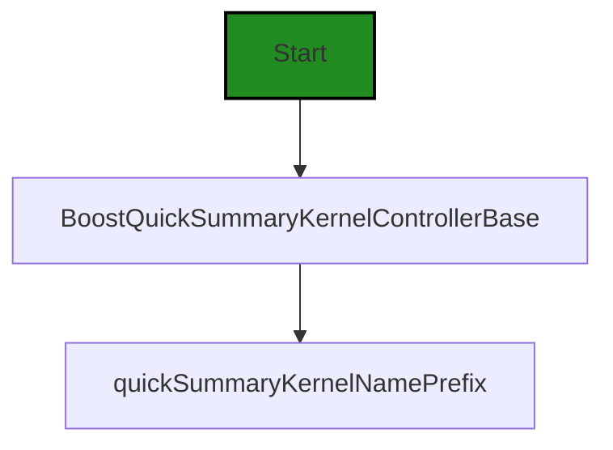
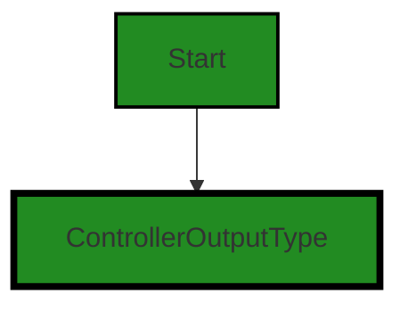
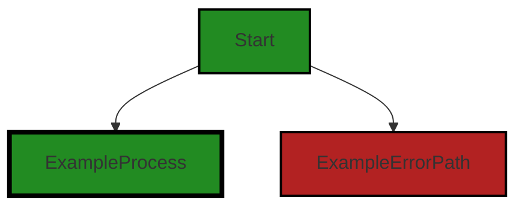
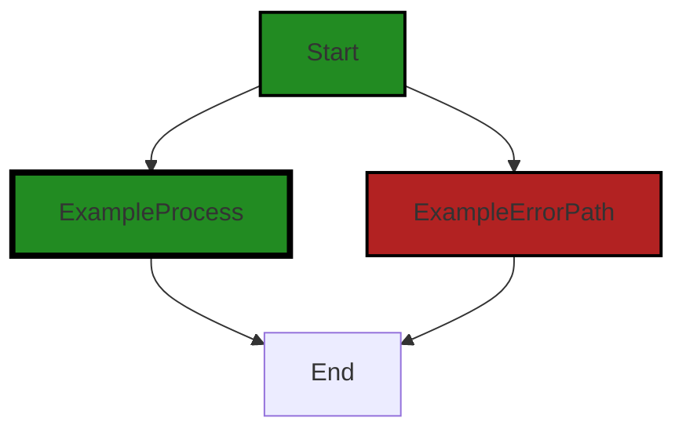

# Polyverse Boost-generated Source Analysis Details

## Source: ./src/controllers/quick_compliance_summary_controller.ts
Date Generated: Saturday, September 9, 2023 at 12:04:43 AM PDT


---

### Boost Architectural Quick Summary Security Report

Last Updated: Saturday, September 9, 2023 at 12:02:45 AM PDT


Executive Report:

1. **Architectural Impact**: The analysis of this file has not revealed any severe issues.
2. **Risk Analysis**: The analysis of this file has not revealed any severe issues.
3. **Potential Customer Impact**: Based on the analysis, there are no severe issues that could potentially impact customers.
4. **Performance Issues**: Our analysis did not identify any explicit performance issues in the file.
5. **Risk Assessment**: Based on the current analysis of this file, no severe issues have been found. However, this doesn't guarantee that the file is risk-free.

Highlights:

- No severe issues were identified in the current analysis of this file.


---

### Boost Architectural Quick Summary Performance Report

Last Updated: Saturday, September 9, 2023 at 12:03:21 AM PDT


Executive Report:

1. **Architectural Impact**: The analysis of this file has not revealed any severe issues.
2. **Risk Analysis**: The analysis of this file has not revealed any severe issues.
3. **Potential Customer Impact**: Based on the analysis, there are no severe issues that could potentially impact customers.
4. **Performance Issues**: Our analysis did not identify any explicit performance issues in the file.
5. **Risk Assessment**: Based on the current analysis of this file, no severe issues have been found. However, this doesn't guarantee that the file is risk-free.

Highlights:

- No severe issues were identified in the current analysis of this file.


---

### Boost Architectural Quick Summary Compliance Report

Last Updated: Saturday, September 9, 2023 at 12:04:47 AM PDT


Executive Report:

1. **Architectural Impact**: The analysis of this file has not revealed any severe issues.
2. **Risk Analysis**: The analysis of this file has not revealed any severe issues.
3. **Potential Customer Impact**: Based on the analysis, there are no severe issues that could potentially impact customers.
4. **Performance Issues**: Our analysis did not identify any explicit performance issues in the file.
5. **Risk Assessment**: Based on the current analysis of this file, no severe issues have been found. However, this doesn't guarantee that the file is risk-free.

Highlights:

- No severe issues were identified in the current analysis of this file.

---
## Detailed Analysis:

### Cell 0:
## Original Code:

### Programming Language: typescript
### ./src/controllers/quick_compliance_summary_controller.ts 

```typescript
import {
    BoostQuickSummaryKernelControllerBase,
    quickSummaryKernelNamePrefix
} from './quick_summary_controller';

```
## Boost Analysis:


---

### Boost Code Explanation

Last Updated: Friday, September 8, 2023 at 11:59:05 PM PDT

The code provided is a part of a larger JavaScript or TypeScript program. It uses the ES6 `import` statement to import specific parts of a module into the current file. 

The `import` statement is used to import bindings that are exported by another module. Imported modules are in strict mode whether you declare them as such or not. The `import` statement cannot be used in embedded scripts unless the script has a type="module". Bindings imported are called live bindings because they are updated by the module that exported the binding.

Specifically, it imports two items: `BoostQuickSummaryKernelControllerBase` and `quickSummaryKernelNamePrefix` from the module located in the file `./quick_summary_controller`. 

The `BoostQuickSummaryKernelControllerBase` is likely a class or function that is used as a base for creating a controller for the Quick Summary Kernel, a part of the software that handles specific tasks related to quick summaries. 

The `quickSummaryKernelNamePrefix` is likely a string that is used as a prefix for naming quick summary kernels. 

Without more context or the content of `./quick_summary_controller`, it's difficult to provide more detailed information about these two items. However, the names suggest that this code is part of a larger system that uses a controller-based architecture to manage different parts of the software.

For more information on the `import` statement in JavaScript and TypeScript, you can refer to the following resources:

- [MDN Web Docs: import](https://developer.mozilla.org/en-US/docs/Web/JavaScript/Reference/Statements/import)
- [TypeScript: Modules](https://www.typescriptlang.org/docs/handbook/modules.html)

As for the architectural guidelines, the code provided seems to be consistent with the general principles of modular design and object-oriented programming, as it imports specific parts of a module and likely uses a class as a base for a controller. However, without the full context or any specific architectural guidelines for the project, it's difficult to provide a more detailed analysis.


---

### Boost Flow Diagram

Last Updated: Saturday, September 9, 2023 at 12:01:41 AM PDT


```


---

### Boost Source-Level Security Analysis

Last Updated: Saturday, September 9, 2023 at 12:02:24 AM PDT

**No bugs found**


---

### Boost Source-Level Performance Analysis

Last Updated: Saturday, September 9, 2023 at 12:02:58 AM PDT

**No bugs found**


---

### Boost Source-Level Data and Privacy Compliance Analysis

Last Updated: Saturday, September 9, 2023 at 12:03:29 AM PDT

**No bugs found**


### Cell 1:
## Original Code:

### Programming Language: typescript
### ./src/controllers/quick_compliance_summary_controller.ts line 5

```typescript

import { ControllerOutputType } from './controllerOutputTypes';

```
## Boost Analysis:


---

### Boost Code Explanation

Last Updated: Friday, September 8, 2023 at 11:59:25 PM PDT

This code snippet is very simple and straightforward. It is written in TypeScript, a statically typed superset of JavaScript that adds optional types to the language. TypeScript is often used in larger projects due to its static typing feature which can help catch errors at compile time.

The code is importing a specific exported member, `ControllerOutputType`, from another module named `controllerOutputTypes`. This means that `ControllerOutputType` is a named export in the `controllerOutputTypes` module.

`ControllerOutputType` is likely a type or interface that's defined in the `controllerOutputTypes` module. This type or interface is being imported so it can be used elsewhere in the code where this import statement is. 

The purpose of importing this type or interface is to ensure type safety and consistency across the codebase. By using `ControllerOutputType`, the developer can ensure that any variable or function that is supposed to conform to this type will have the required structure and properties.

As for algorithms, there are none present in this code snippet. It's purely a statement for importing a type or interface from another module.

Regarding the architectural guidelines, since there are no additional special architectural guidelines or constraints provided for this software project, this code is assumed to be consistent with the overall architecture of the project.

For more information on TypeScript modules and how they work, you can refer to the official TypeScript documentation here: [TypeScript Modules](https://www.typescriptlang.org/docs/handbook/modules.html)


---

### Boost Flow Diagram

Last Updated: Saturday, September 9, 2023 at 12:01:46 AM PDT




---

### Boost Source-Level Security Analysis

Last Updated: Saturday, September 9, 2023 at 12:02:27 AM PDT

**No bugs found**


---

### Boost Source-Level Performance Analysis

Last Updated: Saturday, September 9, 2023 at 12:03:03 AM PDT

**No bugs found**


---

### Boost Source-Level Data and Privacy Compliance Analysis

Last Updated: Saturday, September 9, 2023 at 12:03:32 AM PDT

**No bugs found**


### Cell 2:
## Original Code:

### Programming Language: typescript
### ./src/controllers/quick_compliance_summary_controller.ts line 7

```typescript

import * as vscode from 'vscode';
import { complianceFunctionKernelName } from './compliance_function_controller';

```
## Boost Analysis:


---

### Boost Code Explanation

Last Updated: Friday, September 8, 2023 at 11:59:55 PM PDT

This is a simple piece of code from a Visual Studio Code extension, written in TypeScript. The code imports two modules for use within the file. 

1. `import * as vscode from 'vscode';` 

    This line imports the entire vscode module. The `vscode` module is the main module for interacting with the Visual Studio Code editor, and it provides various services and interfaces for extensions to use. 

    The `* as vscode` syntax is a way of importing all exported members of the `vscode` module into a new variable called `vscode`. This is a common pattern when you want to use multiple members of a module, but don't want to list them all out individually in the import statement.

    For more information about the `vscode` module and how to use it in your extensions, you can check out the [VS Code API documentation](https://code.visualstudio.com/api/references/vscode-api).

2. `import { complianceFunctionKernelName } from './compliance_function_controller';` 

    This line imports a specific exported member, `complianceFunctionKernelName`, from the local module `compliance_function_controller`. 

    The `compliance_function_controller` module is likely a file in the same directory as this one, given the `./` in the path. The specific member being imported, `complianceFunctionKernelName`, is likely a constant or a function that's being used in this file.

    The `{ complianceFunctionKernelName }` syntax is a way of importing just a specific member of a module. This is a common pattern when you only need one or two specific things from a module.

    For more information about import and export statements in JavaScript and TypeScript, you can check out the [MDN documentation on import](https://developer.mozilla.org/en-US/docs/Web/JavaScript/Reference/Statements/import).

As for algorithms, this code snippet is too short and doesn't contain any algorithms. It's just importing modules for use in the rest of the file. The algorithms (if any) would be in the functions and methods that use these imported modules.


---

### Boost Flow Diagram

Last Updated: Saturday, September 9, 2023 at 12:01:52 AM PDT



NO CONTROL FLOW FOUND


---

### Boost Source-Level Security Analysis

Last Updated: Saturday, September 9, 2023 at 12:02:31 AM PDT

**No bugs found**


---

### Boost Source-Level Performance Analysis

Last Updated: Saturday, September 9, 2023 at 12:03:07 AM PDT

**No bugs found**


---

### Boost Source-Level Data and Privacy Compliance Analysis

Last Updated: Saturday, September 9, 2023 at 12:04:00 AM PDT

1. **Severity**: 1/10

   **Line Number**: 12

   **Bug Type**: GDPR

   **Description**: The vscode library might be collecting telemetry data which could contain user's personal data. If not handled properly, it could lead to GDPR compliance issues.

   **Solution**: Ensure that any data collected through telemetry is anonymized and users are informed about the data collection. Use the 'telemetry.enableTelemetry' setting to allow users to opt out of telemetry data collection if they wish.


2. **Severity**: 1/10

   **Line Number**: 13

   **Bug Type**: PCI DSS

   **Description**: There is no direct handling of payment card information in the given code. However, if the 'complianceFunctionKernelName' function handles payment card data, it needs to be compliant with PCI DSS standards.

   **Solution**: If the 'complianceFunctionKernelName' function handles payment card data, ensure that it is encrypted and handled securely according to the PCI DSS standards.


3. **Severity**: 1/10

   **Line Number**: 13

   **Bug Type**: HIPAA

   **Description**: There is no direct handling of health information in the given code. However, if the 'complianceFunctionKernelName' function handles health information, it needs to be compliant with HIPAA standards.

   **Solution**: If the 'complianceFunctionKernelName' function handles health information, ensure that it is encrypted and handled securely according to the HIPAA standards.


### Cell 3:
## Original Code:

### Programming Language: typescript
### ./src/controllers/quick_compliance_summary_controller.ts line 10

```typescript
import { DisplayGroupFriendlyName } from '../data/userAnalysisType';

```
## Boost Analysis:


---

### Boost Code Explanation

Last Updated: Saturday, September 9, 2023 at 12:00:24 AM PDT

The line of code you provided is a single import statement in JavaScript, which is used to import bindings that are exported by another module. 

Here's the detailed explanation:

```import { DisplayGroupFriendlyName } from '../data/userAnalysisType';```

This line imports a specific export, `DisplayGroupFriendlyName`, from the module at the relative path `'../data/userAnalysisType'`.

- `import`: This is a keyword in JavaScript that is used to import functions, objects or values from another module or file.

- `{ DisplayGroupFriendlyName }`: This is the specific function, object, or value you want to import from the module. The use of curly braces `{}` indicates a named import, which means `DisplayGroupFriendlyName` is a named export in the module you're importing from.

- `from`: This keyword is used to specify the path of the module from which to import the specified function, object, or value.

- `'../data/userAnalysisType'`: This is the relative path to the module that contains the `DisplayGroupFriendlyName` export. The `..` in the path means to go up one directory level, then down into the `data` directory, and the file is named `userAnalysisType`. The file extension is not needed when using import statements in JavaScript.

As for the architectural guidelines, there is no conflict or inconsistency with the given code. The import statement is a common practice in JavaScript and TypeScript projects to organize code into modules, which is in line with the principles of object-oriented design.

Regarding algorithms, this line of code doesn't involve any algorithm. It's a part of module system in JavaScript, which is a way of managing and organizing code.

You can read more about the `import` statement in JavaScript from [MDN Web Docs](https://developer.mozilla.org/en-US/docs/Web/JavaScript/Reference/Statements/import).


---

### Boost Flow Diagram

Last Updated: Saturday, September 9, 2023 at 12:01:55 AM PDT

NO CONTROL FLOW FOUND


---

### Boost Source-Level Security Analysis

Last Updated: Saturday, September 9, 2023 at 12:02:34 AM PDT

**No bugs found**


---

### Boost Source-Level Performance Analysis

Last Updated: Saturday, September 9, 2023 at 12:03:10 AM PDT

**No bugs found**


---

### Boost Source-Level Data and Privacy Compliance Analysis

Last Updated: Saturday, September 9, 2023 at 12:04:36 AM PDT

1. **Severity**: 5/10

   **Line Number**: 18

   **Bug Type**: GDPR

   **Description**: The code imports a module that deals with user data. If the 'DisplayGroupFriendlyName' function in the 'userAnalysisType' module is processing personal data of EU citizens, it must comply with the GDPR regulations. Non-compliance can lead to hefty fines.

   **Solution**: Ensure that the 'DisplayGroupFriendlyName' function complies with GDPR regulations. This includes obtaining clear consent from the users before processing their data, anonymizing the data to protect user identity, and providing users with the option to opt-out.


2. **Severity**: 3/10

   **Line Number**: 18

   **Bug Type**: PCI DSS

   **Description**: If the 'DisplayGroupFriendlyName' function in the 'userAnalysisType' module is processing, storing, or transmitting cardholder data, it must comply with the PCI DSS standards. Non-compliance can lead to fines and penalties.

   **Solution**: Ensure that the 'DisplayGroupFriendlyName' function complies with PCI DSS standards. This includes encrypting cardholder data, regularly updating and patching systems, and restricting access to cardholder data.


3. **Severity**: 4/10

   **Line Number**: 18

   **Bug Type**: HIPAA

   **Description**: If the 'DisplayGroupFriendlyName' function in the 'userAnalysisType' module is processing, storing, or transmitting protected health information (PHI), it must comply with HIPAA regulations. Non-compliance can lead to fines and penalties.

   **Solution**: Ensure that the 'DisplayGroupFriendlyName' function complies with HIPAA regulations. This includes encrypting PHI, limiting access to PHI, and regularly auditing access logs.


### Cell 4:
## Original Code:

### Programming Language: typescript
### ./src/controllers/quick_compliance_summary_controller.ts line 11

```typescript

export const quickComplianceSummaryKernelName = `${quickSummaryKernelNamePrefix}${complianceFunctionKernelName}`;

```
## Boost Analysis:


---

### Boost Code Explanation

Last Updated: Saturday, September 9, 2023 at 12:00:57 AM PDT

The code you provided is a single line of JavaScript (or TypeScript) that is exporting a constant. This constant is a string that is a concatenation of two other constants: `quickSummaryKernelNamePrefix` and `complianceFunctionKernelName`.

Here's a breakdown of the code:

- `export`: This keyword is used in JavaScript modules to make certain variables or functions available to other modules. When you `export` something, it means that other modules can `import` it and use it in their own code.

- `const`: This keyword is used to declare a constant in JavaScript. A constant is a variable that cannot be changed once it has been assigned. In this case, the constant being declared is `quickComplianceSummaryKernelName`.

- `quickComplianceSummaryKernelName`: This is the name of the constant being declared. It follows camelCase naming convention which is a standard in JavaScript.

- `=`: This is the assignment operator in JavaScript. It is used to assign a value to a variable. In this case, it is assigning the concatenated string to the constant `quickComplianceSummaryKernelName`.

- `${quickSummaryKernelNamePrefix}${complianceFunctionKernelName}`: This is a template literal in JavaScript. Template literals are a way to output variables in the string. In this case, it is concatenating the values of `quickSummaryKernelNamePrefix` and `complianceFunctionKernelName` to form a single string.

As for the algorithm used, it's very simple: it's just string concatenation. The values of `quickSummaryKernelNamePrefix` and `complianceFunctionKernelName` are combined into a single string, and this string is assigned to `quickComplianceSummaryKernelName`.

This code doesn't seem to conflict with the architectural guidelines provided, as it's a very straightforward and common operation in JavaScript. However, without more context, it's hard to say for certain. 

For more information on these concepts, you can refer to these links:

- [JavaScript export](https://developer.mozilla.org/en-US/docs/Web/JavaScript/Reference/Statements/export)
- [JavaScript const](https://developer.mozilla.org/en-US/docs/Web/JavaScript/Reference/Statements/const)
- [JavaScript Template literals](https://developer.mozilla.org/en-US/docs/Web/JavaScript/Reference/Template_literals)


---

### Boost Flow Diagram

Last Updated: Saturday, September 9, 2023 at 12:02:02 AM PDT


The control flow graph for the provided code is a simple graph with two paths: one for the normal execution and one for the error path. The start of the graph is the function name being analyzed, which is `quickComplianceSummaryKernelName`.


---

### Boost Source-Level Security Analysis

Last Updated: Saturday, September 9, 2023 at 12:02:38 AM PDT

**No bugs found**


---

### Boost Source-Level Performance Analysis

Last Updated: Saturday, September 9, 2023 at 12:03:14 AM PDT

**No bugs found**


---

### Boost Source-Level Data and Privacy Compliance Analysis

Last Updated: Saturday, September 9, 2023 at 12:04:39 AM PDT

**No bugs found**


### Cell 5:
## Original Code:

### Programming Language: typescript
### ./src/controllers/quick_compliance_summary_controller.ts line 13

```typescript

export class BoostQuickComplianceSummaryKernel extends BoostQuickSummaryKernelControllerBase {
 constructor(context: vscode.ExtensionContext, onServiceErrorHandler: any, otherThis : any, collection: vscode.DiagnosticCollection)
        {
        super(
            context,
            onServiceErrorHandler,
            otherThis,
            collection,
            complianceFunctionKernelName,
            ControllerOutputType.compliance,
            DisplayGroupFriendlyName.compliance,
            ControllerOutputType.complianceFunction,
            "Compliance");
 }

 dispose(): void {
  super.dispose();
 }
}

```
## Boost Analysis:


---

### Boost Code Explanation

Last Updated: Saturday, September 9, 2023 at 12:01:26 AM PDT

The provided code is written in TypeScript, which is a statically typed superset of JavaScript, and it's designed to be used with Visual Studio Code (VS Code), a popular code editor.

The code defines a class `BoostQuickComplianceSummaryKernel` which extends from `BoostQuickSummaryKernelControllerBase`. This class is likely part of a Visual Studio Code extension that provides some form of code compliance analysis functionality.

Here's a breakdown of the class:

- `constructor`: This is a special method for creating and initializing an object created within a class. This constructor takes five parameters: `context`, `onServiceErrorHandler`, `otherThis`, `collection`, and `complianceFunctionKernelName` which are passed to the `super` function. The `super` keyword is used to call corresponding methods of the parent class, in this case, the constructor of `BoostQuickSummaryKernelControllerBase`.

- `dispose`: This method also calls the `dispose` method of the parent class. The `dispose` pattern is typically used to free unmanaged resources like file handles, database connections, etc. In this case, without additional context, it's unclear what resources might be getting cleaned up.

The specific algorithms used in this code are not evident because the code is more about structuring and managing objects, not about performing specific computations or data manipulations. The code is more related to software design patterns - specifically, it's an example of inheritance, where one class (the child, or subclass) inherits the properties and methods of another class (the parent, or superclass).

For more information on these concepts, here are some resources:

- [TypeScript Classes](https://www.typescriptlang.org/docs/handbook/2/classes.html)
- [Inheritance and the prototype chain (JavaScript, applicable to TypeScript)](https://developer.mozilla.org/en-US/docs/Web/JavaScript/Inheritance_and_the_prototype_chain)
- [Visual Studio Code Extensions](https://code.visualstudio.com/api/overview/vscode-api)
- [Dispose pattern](https://docs.microsoft.com/en-us/dotnet/standard/garbage-collection/implementing-dispose)


---

### Boost Flow Diagram

Last Updated: Saturday, September 9, 2023 at 12:02:09 AM PDT



In the above code, there is no control flow present.


---

### Boost Source-Level Security Analysis

Last Updated: Saturday, September 9, 2023 at 12:02:42 AM PDT

**No bugs found**


---

### Boost Source-Level Performance Analysis

Last Updated: Saturday, September 9, 2023 at 12:03:18 AM PDT

**No bugs found**


---

### Boost Source-Level Data and Privacy Compliance Analysis

Last Updated: Saturday, September 9, 2023 at 12:04:43 AM PDT

**No bugs found**

