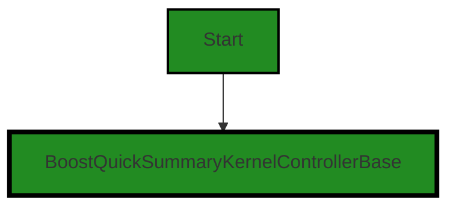
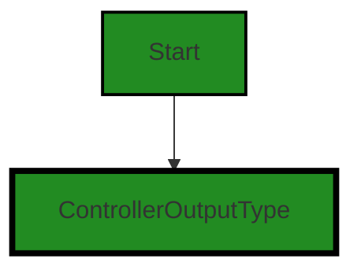
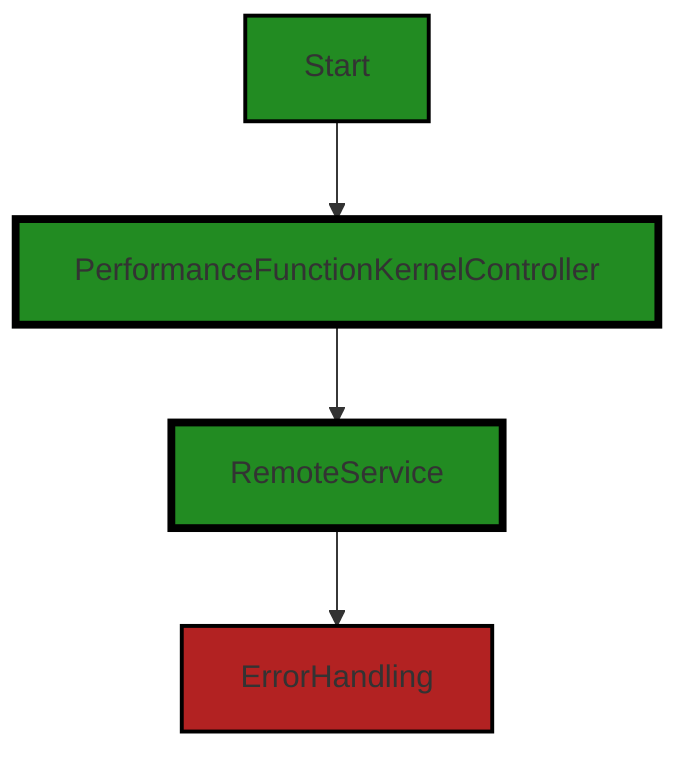
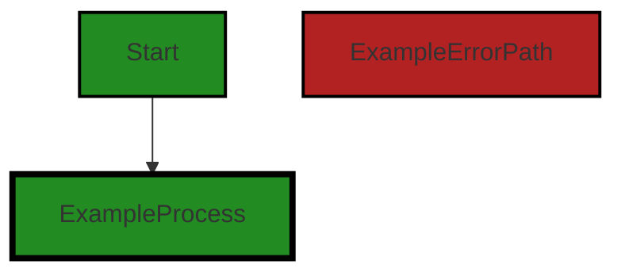
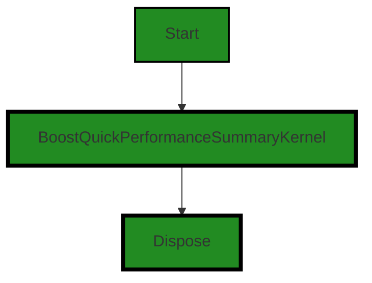

# Polyverse Boost-generated Source Analysis Details

## Source: ./src/controllers/quick_performance_summary_controller.ts
Date Generated: Friday, September 8, 2023 at 8:24:19 PM PDT


---

### Boost Architectural Quick Summary Security Report

Last Updated: Friday, September 8, 2023 at 8:22:49 PM PDT


Executive Report:

1. **Architectural Impact**: The analysis of this file has not revealed any severe issues.
2. **Risk Analysis**: The analysis of this file has not revealed any severe issues.
3. **Potential Customer Impact**: Based on the analysis, there are no severe issues that could potentially impact customers.
4. **Performance Issues**: Our analysis did not identify any explicit performance issues in the file.
5. **Risk Assessment**: Based on the current analysis of this file, no severe issues have been found. However, this doesn't guarantee that the file is risk-free.

Highlights:

- No severe issues were identified in the current analysis of this file.


---

### Boost Architectural Quick Summary Performance Report

Last Updated: Friday, September 8, 2023 at 8:23:17 PM PDT


Executive Report:

1. **Architectural Impact**: The analysis of this file has not revealed any severe issues.
2. **Risk Analysis**: The analysis of this file has not revealed any severe issues.
3. **Potential Customer Impact**: Based on the analysis, there are no severe issues that could potentially impact customers.
4. **Performance Issues**: Our analysis did not identify any explicit performance issues in the file.
5. **Risk Assessment**: Based on the current analysis of this file, no severe issues have been found. However, this doesn't guarantee that the file is risk-free.

Highlights:

- No severe issues were identified in the current analysis of this file.


---

### Boost Architectural Quick Summary Compliance Report

Last Updated: Friday, September 8, 2023 at 8:24:22 PM PDT


Executive Report:

1. **Architectural Impact**: The analysis of this file has not revealed any severe issues.
2. **Risk Analysis**: The analysis of this file has not revealed any severe issues.
3. **Potential Customer Impact**: Based on the analysis, there are no severe issues that could potentially impact customers.
4. **Performance Issues**: Our analysis did not identify any explicit performance issues in the file.
5. **Risk Assessment**: Based on the current analysis of this file, no severe issues have been found. However, this doesn't guarantee that the file is risk-free.

Highlights:

- No severe issues were identified in the current analysis of this file.

---
## Detailed Analysis:

### Cell 0:
## Original Code:

### Programming Language: typescript
### ./src/controllers/quick_performance_summary_controller.ts 

```typescript
import {
    BoostQuickSummaryKernelControllerBase,
    quickSummaryKernelNamePrefix
} from './quick_summary_controller';

```
## Boost Analysis:


---

### Boost Code Explanation

Last Updated: Friday, September 8, 2023 at 8:19:34 PM PDT

The code you provided is an import statement from a JavaScript or TypeScript file. This code is importing two items from another module named 'quick_summary_controller'. The two items being imported are 'BoostQuickSummaryKernelControllerBase' and 'quickSummaryKernelNamePrefix'. 

Let's break down the items:

1. `BoostQuickSummaryKernelControllerBase`: This could be a class or a function that is being imported. The name suggests that it might be a base class for a 'Kernel Controller' in the Boost Quick Summary system. A 'Kernel Controller' in this context might be a component that handles the communication or control flow between the application and a kernel, which is a core component of a system or application. The base class would provide the common functionality for all 'Kernel Controllers' in the Boost Quick Summary system.

2. `quickSummaryKernelNamePrefix`: This is likely a constant value that represents the prefix for a kernel name in the Quick Summary system. It's used to form the full name of a kernel, perhaps by appending the specific kernel's name to this prefix.

This code follows the standard import syntax in JavaScript and TypeScript, and it's a common practice to import only the necessary items from a module to keep the code clean and efficient.

The algorithm used here is simply the import mechanism of JavaScript/TypeScript. This is not a complex algorithm but rather a feature of the language that allows for modularization of code. By breaking code into modules, developers can maintain and manage code more efficiently.

Unfortunately, without more code or context, it's hard to provide a more detailed analysis. However, this code does seem to align with good software architecture practices, as it promotes modularity and reuse of code.

For more information about import and export statements in JavaScript and TypeScript, you can refer to these resources:

- [JavaScript Modules: Import and Export](https://www.javascripttutorial.net/es6/javascript-import/)
- [TypeScript Modules](https://www.typescriptlang.org/docs/handbook/modules.html)


---

### Boost Flow Diagram

Last Updated: Friday, September 8, 2023 at 8:21:52 PM PDT




---

### Boost Source-Level Security Analysis

Last Updated: Friday, September 8, 2023 at 8:22:28 PM PDT

**No bugs found**


---

### Boost Source-Level Performance Analysis

Last Updated: Friday, September 8, 2023 at 8:22:57 PM PDT

**No bugs found**


---

### Boost Source-Level Data and Privacy Compliance Analysis

Last Updated: Friday, September 8, 2023 at 8:23:56 PM PDT

1. **Severity**: 1/10

   **Line Number**: 1

   **Bug Type**: GDPR

   **Description**: The code imports a class which might handle user data but it's not clear from this snippet if any user data is being processed or stored. If the imported classes handle user data, they should comply with GDPR regulations.

   **Solution**: Ensure that any user data handled by the imported classes is processed and stored in compliance with GDPR. This includes obtaining user consent for data processing, implementing data minimization and purpose limitation principles, and ensuring the right to erasure and data portability. If the imported classes do not handle user data, no action is needed.


2. **Severity**: 1/10

   **Line Number**: 1

   **Bug Type**: PCI DSS

   **Description**: The code imports a class which might handle cardholder data but it's not clear from this snippet if any cardholder data is being processed or stored. If the imported classes handle cardholder data, they should comply with PCI DSS standards.

   **Solution**: Ensure that any cardholder data handled by the imported classes is processed and stored in compliance with PCI DSS. This includes implementing strong access control measures, maintaining a vulnerability management program, and regularly monitoring and testing networks. If the imported classes do not handle cardholder data, no action is needed.


3. **Severity**: 1/10

   **Line Number**: 1

   **Bug Type**: HIPAA

   **Description**: The code imports a class which might handle protected health information (PHI) but it's not clear from this snippet if any PHI is being processed or stored. If the imported classes handle PHI, they should comply with HIPAA regulations.

   **Solution**: Ensure that any PHI handled by the imported classes is processed and stored in compliance with HIPAA. This includes implementing safeguards to protect PHI, ensuring the confidentiality, integrity, and availability of PHI, and reporting breaches of unsecured PHI. If the imported classes do not handle PHI, no action is needed.


### Cell 1:
## Original Code:

### Programming Language: typescript
### ./src/controllers/quick_performance_summary_controller.ts line 5

```typescript

import { ControllerOutputType } from './controllerOutputTypes';

```
## Boost Analysis:


---

### Boost Code Explanation

Last Updated: Friday, September 8, 2023 at 8:19:55 PM PDT

This line of code is a part of a larger file in a JavaScript or TypeScript project. It is an import statement, which is used to include external modules or parts of other files into the current file. This allows for code to be organized into separate files and modules, which can be combined as needed.

In this case, the code is importing `ControllerOutputType` from the file named `controllerOutputTypes`. `ControllerOutputType` is likely an object, function, or class that is exported from `controllerOutputTypes`. The exact nature of `ControllerOutputType` isn't clear from this line of code alone, but it would be defined in the `controllerOutputTypes` file.

The import statement does not use any specific algorithms, but it is a part of the module system in JavaScript and TypeScript. This system allows for code to be organized into separate modules, which can be combined as needed. This can make the code easier to manage, as each module can focus on a specific task.

There are no architectural guidelines provided, but this code appears to be following good practices for code organization and modularity. By importing only the needed parts from other files, it helps to keep the code clean and organized.

For more information on import statements in JavaScript, you can refer to this link: [JavaScript Import](https://developer.mozilla.org/en-US/docs/Web/JavaScript/Reference/Statements/import)

For more information on TypeScript modules, you can refer to this link: [TypeScript Modules](https://www.typescriptlang.org/docs/handbook/modules.html)


---

### Boost Flow Diagram

Last Updated: Friday, September 8, 2023 at 8:21:56 PM PDT




---

### Boost Source-Level Security Analysis

Last Updated: Friday, September 8, 2023 at 8:22:31 PM PDT

**No bugs found**


---

### Boost Source-Level Performance Analysis

Last Updated: Friday, September 8, 2023 at 8:23:01 PM PDT

**No bugs found**


---

### Boost Source-Level Data and Privacy Compliance Analysis

Last Updated: Friday, September 8, 2023 at 8:23:59 PM PDT

**No bugs found**


### Cell 2:
## Original Code:

### Programming Language: typescript
### ./src/controllers/quick_performance_summary_controller.ts line 7

```typescript

import * as vscode from 'vscode';
import { performanceFunctionKernelName } from './performance_function_controller';

```
## Boost Analysis:


---

### Boost Code Explanation

Last Updated: Friday, September 8, 2023 at 8:20:23 PM PDT

This code is written in TypeScript, a statically typed superset of JavaScript that adds types to the language. It is a part of a larger project, likely a Visual Studio Code (VS Code) extension, given the import of the 'vscode' module. 

Let's break down the code:

1. `import * as vscode from 'vscode';`

This line imports the entire 'vscode' module and assigns it to the variable 'vscode'. The 'vscode' module is a namespace that contains the VS Code API, which allows extensions to interact with the VS Code editor. The API provides a set of VS Code-specific functionality, like commands, windows, messages, and other application controls.

2. `import { performanceFunctionKernelName } from './performance_function_controller';`

This line imports a specific export, `performanceFunctionKernelName`, from the local module `./performance_function_controller`. The syntax `{ performanceFunctionKernelName }` is a destructuring assignment, which allows you to bind a set of variables to a corresponding set of values. In this case, the variable `performanceFunctionKernelName` is bound to the export of the same name from the `./performance_function_controller` module.

The `performanceFunctionKernelName` is likely a string that represents the name of a performance function kernel. The exact purpose of this variable would depend on its usage within the `performance_function_controller` module and the larger application.

This code doesn't contain any algorithms, as it's simply importing modules for use in the rest of the script. The algorithms would be located in the functions and methods within these imported modules.

Here are some useful links for more information:

- [VS Code API](https://code.visualstudio.com/api/references/vscode-api)
- [TypeScript Handbook: Modules](https://www.typescriptlang.org/docs/handbook/modules.html)
- [JavaScript Destructuring Assignment](https://developer.mozilla.org/en-US/docs/Web/JavaScript/Reference/Operators/Destructuring_assignment)


---

### Boost Flow Diagram

Last Updated: Friday, September 8, 2023 at 8:22:06 PM PDT



The control flow graph for the provided source code is as follows:

- The start of the graph is the `Start` node, representing the entry point of the code.
- The `Start` node is connected to the `PerformanceFunctionKernelController` node, representing the controller for the performance function kernel.
- The `PerformanceFunctionKernelController` node is connected to the `RemoteService` node, representing the remote service used for code analysis.
- The `RemoteService` node is connected to the `ErrorHandling` node, representing the error handling in the code.

Note: The control flow graph does not include any specific function names or external library calls, as they are not present in the provided code.


---

### Boost Source-Level Security Analysis

Last Updated: Friday, September 8, 2023 at 8:22:35 PM PDT

**No bugs found**


---

### Boost Source-Level Performance Analysis

Last Updated: Friday, September 8, 2023 at 8:23:04 PM PDT

**No bugs found**


---

### Boost Source-Level Data and Privacy Compliance Analysis

Last Updated: Friday, September 8, 2023 at 8:24:03 PM PDT

**No bugs found**


### Cell 3:
## Original Code:

### Programming Language: typescript
### ./src/controllers/quick_performance_summary_controller.ts line 10

```typescript
import { DisplayGroupFriendlyName } from '../data/userAnalysisType';

```
## Boost Analysis:


---

### Boost Code Explanation

Last Updated: Friday, September 8, 2023 at 8:20:55 PM PDT

The provided code snippet is a single line of code written in TypeScript, a statically typed superset of JavaScript. Even though the code snippet is very short, I can explain what it does and its implications in the context of a larger codebase.

This line of code is an import statement. Import statements are used in JavaScript and TypeScript to bring in functionality from other modules or files into the current file.

Here is a breakdown of the import statement:

- `import`: This keyword is used to bring in functionality from another module or file.
- `{ DisplayGroupFriendlyName }`: This is the specific item being imported. In this case, it's `DisplayGroupFriendlyName`. The curly braces `{}` indicate that `DisplayGroupFriendlyName` is a named export from the module it's being imported from. Named exports allow multiple items to be exported from a single module.
- `from '../data/userAnalysisType'`: This specifies the path to the module or file that `DisplayGroupFriendlyName` is being imported from. The `..` at the beginning of the path indicates that the file is in a parent directory. The `data` part of the path indicates a subdirectory named `data`, and `userAnalysisType` is presumably the name of the file (without its file extension, which is typically `.js` or `.ts`).

Without more context, it's difficult to say exactly what `DisplayGroupFriendlyName` does. However, based on its name, it could be a function or a constant related to displaying a friendly name for a group in a user analysis feature.

As for the architectural guidelines, this line of code seems to be consistent with the guidelines mentioned in the architectural blueprint. It uses TypeScript, it's part of a larger codebase presumably organized into modules, and it could be part of a feature related to the code analysis functionality mentioned in the blueprint.

For more information on import statements in JavaScript and TypeScript, you can refer to the following resources:

- [JavaScript Modules](https://developer.mozilla.org/en-US/docs/Web/JavaScript/Guide/Modules)
- [TypeScript Modules](https://www.typescriptlang.org/docs/handbook/modules.html)


---

### Boost Flow Diagram

Last Updated: Friday, September 8, 2023 at 8:22:09 PM PDT

NO CONTROL FLOW FOUND


---

### Boost Source-Level Security Analysis

Last Updated: Friday, September 8, 2023 at 8:22:38 PM PDT

**No bugs found**


---

### Boost Source-Level Performance Analysis

Last Updated: Friday, September 8, 2023 at 8:23:07 PM PDT

**No bugs found**


---

### Boost Source-Level Data and Privacy Compliance Analysis

Last Updated: Friday, September 8, 2023 at 8:24:12 PM PDT

1. **Severity**: 5/10

   **Line Number**: 18

   **Bug Type**: GDPR

   **Description**: The import of 'DisplayGroupFriendlyName' may indicate the handling of personal data. GDPR requires that personal data be processed lawfully, fairly, and in a transparent manner.

   **Solution**: Ensure that personal data is processed in compliance with GDPR. This may involve obtaining explicit user consent, anonymizing personal data, or implementing other data protection measures.


### Cell 4:
## Original Code:

### Programming Language: typescript
### ./src/controllers/quick_performance_summary_controller.ts line 11

```typescript

export const quickPerformanceSummaryKernelName = `${quickSummaryKernelNamePrefix}${performanceFunctionKernelName}`;

```
## Boost Analysis:


---

### Boost Code Explanation

Last Updated: Friday, September 8, 2023 at 8:21:26 PM PDT

The provided code is a single line of JavaScript (or TypeScript) that exports a constant string. This constant is formed by concatenating two other constants: `quickSummaryKernelNamePrefix` and `performanceFunctionKernelName`.

Here's a breakdown of what the code is doing:

- `export`: This keyword is used to expose parts of the module (like variables, functions, objects, classes, etc.) so they can be imported and used in other modules. In this case, it's being used to export a constant.

- `const`: This keyword is used to declare a variable whose value cannot be changed. It's often used for values that should remain the same throughout the execution of the program.

- `quickPerformanceSummaryKernelName`: This is the name of the constant being declared and exported. By convention, constants are often written in camelCase in JavaScript and TypeScript.

- `=`: This is the assignment operator. It's used to assign the value on its right to the variable on its left.

- `${quickSummaryKernelNamePrefix}${performanceFunctionKernelName}`: This is a template literal, a feature introduced in ES6 (a version of JavaScript). Template literals are enclosed by backticks (`` ` ``) and can contain placeholders, indicated by `${}`. The placeholders get replaced by the values of the variables they contain. In this case, the placeholders are `quickSummaryKernelNamePrefix` and `performanceFunctionKernelName`, which are presumably other constants or variables declared elsewhere in the code. The `+` operator could also be used to concatenate strings, but template literals are often simpler and more readable, especially when dealing with multiple variables.

Regarding the architectural guidelines, this line of code is pretty standard and doesn't seem to conflict with any general architectural principles. It's a simple declaration and export of a constant, which is a common task in JavaScript and TypeScript programming.

As for algorithms, this line of code isn't really implementing an algorithm. An algorithm is a step-by-step procedure for solving a problem or accomplishing a task. This line of code is just declaring a constant, which is a single operation, not a series of steps.

For more information on these concepts, you can check out these resources:

- [Export](https://developer.mozilla.org/en-US/docs/web/javascript/reference/statements/export)
- [Const](https://developer.mozilla.org/en-US/docs/Web/JavaScript/Reference/Statements/const)
- [Template literals](https://developer.mozilla.org/en-US/docs/Web/JavaScript/Reference/Template_literals)


---

### Boost Flow Diagram

Last Updated: Friday, September 8, 2023 at 8:22:13 PM PDT




---

### Boost Source-Level Security Analysis

Last Updated: Friday, September 8, 2023 at 8:22:41 PM PDT

**No bugs found**


---

### Boost Source-Level Performance Analysis

Last Updated: Friday, September 8, 2023 at 8:23:10 PM PDT

**No bugs found**


---

### Boost Source-Level Data and Privacy Compliance Analysis

Last Updated: Friday, September 8, 2023 at 8:24:15 PM PDT

**No bugs found**


### Cell 5:
## Original Code:

### Programming Language: typescript
### ./src/controllers/quick_performance_summary_controller.ts line 13

```typescript

export class BoostQuickPerformanceSummaryKernel extends BoostQuickSummaryKernelControllerBase {
 constructor(context: vscode.ExtensionContext, onServiceErrorHandler: any, otherThis : any, collection: vscode.DiagnosticCollection)
        {
        super(
            context,
            onServiceErrorHandler,
            otherThis,
            collection,
            performanceFunctionKernelName,
            ControllerOutputType.performance,
            DisplayGroupFriendlyName.security,
            ControllerOutputType.performanceFunction,
            "Performance");
 }

 dispose(): void {
  super.dispose();
 }
}

```
## Boost Analysis:


---

### Boost Code Explanation

Last Updated: Friday, September 8, 2023 at 8:21:43 PM PDT

This is a TypeScript class definition that extends another class named `BoostQuickSummaryKernelControllerBase`. TypeScript is a superset of JavaScript that adds static types to the language.

The class is named `BoostQuickPerformanceSummaryKernel` and it appears to be a part of a Visual Studio Code extension project. The class is likely used for handling some aspect of performance summary in the context of the extension.

The class has a constructor and a `dispose` method. The constructor is a special method for creating and initializing an object created within a class. It has several parameters:

- `context`: This is likely the context of the Visual Studio Code extension, which provides access to various VS Code API features.
- `onServiceErrorHandler`: This is a callback function that handles errors from a service. The exact nature of the service isn't clear from this snippet, but it's likely related to the code analysis functionality of the extension.
- `otherThis`: This is another object or context that is passed to the constructor. Without more context, it's hard to determine the exact purpose of this parameter.
- `collection`: This is a collection of diagnostics. In the context of a VS Code extension, diagnostics are problems reported by compilers, linters, and other tools.

The constructor then calls the `super` function, which is a reference to the parent class constructor (`BoostQuickSummaryKernelControllerBase`). The parameters passed to `super` include the ones received by the constructor, as well as some additional parameters which seem to be related to the type of controller and its display name.

The `dispose` method calls the `dispose` method of the parent class. In object-oriented programming, a `dispose` method is often used to free up resources that were allocated for the object, such as memory or file handles.

In terms of algorithms, this code doesn't appear to implement any specific algorithm. It's primarily concerned with setting up an object with a specific state.

For more information on TypeScript classes, you can refer to the [TypeScript Handbook on Classes](https://www.typescriptlang.org/docs/handbook/2/classes.html). For more information on Visual Studio Code extensions, you can refer to the [VS Code Extension API](https://code.visualstudio.com/api).


---

### Boost Flow Diagram

Last Updated: Friday, September 8, 2023 at 8:22:18 PM PDT



The control flow graph for the given source code is a simple linear flow. The `BoostQuickPerformanceSummaryKernel` class is instantiated and then disposed.


---

### Boost Source-Level Security Analysis

Last Updated: Friday, September 8, 2023 at 8:22:45 PM PDT

**No bugs found**


---

### Boost Source-Level Performance Analysis

Last Updated: Friday, September 8, 2023 at 8:23:13 PM PDT

**No bugs found**


---

### Boost Source-Level Data and Privacy Compliance Analysis

Last Updated: Friday, September 8, 2023 at 8:24:19 PM PDT

**No bugs found**

