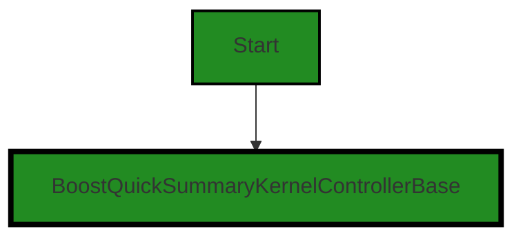
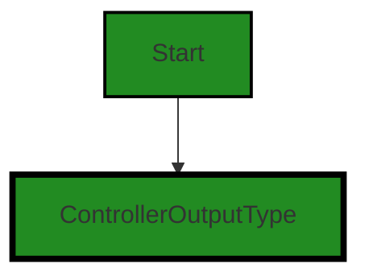
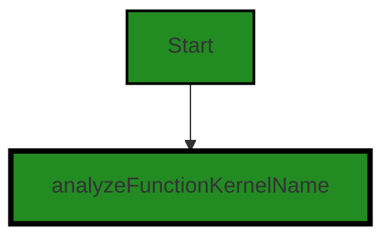
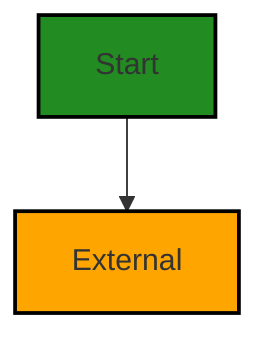
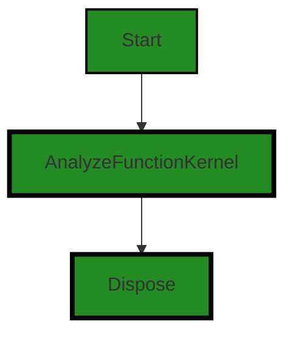

# Polyverse Boost-generated Source Analysis Details

## Source: ./src/controllers/quick_security_summary_controller.ts
Date Generated: Friday, September 8, 2023 at 9:12:57 PM PDT


---

### Boost Architectural Quick Summary Security Report

Last Updated: Friday, September 8, 2023 at 9:11:57 PM PDT


Executive Report:

1. **Architectural Impact**: The analysis of this file has not revealed any severe issues.
2. **Risk Analysis**: The analysis of this file has not revealed any severe issues.
3. **Potential Customer Impact**: Based on the analysis, there are no severe issues that could potentially impact customers.
4. **Performance Issues**: Our analysis did not identify any explicit performance issues in the file.
5. **Risk Assessment**: Based on the current analysis of this file, no severe issues have been found. However, this doesn't guarantee that the file is risk-free.

Highlights:

- No severe issues were identified in the current analysis of this file.


---

### Boost Architectural Quick Summary Performance Report

Last Updated: Friday, September 8, 2023 at 9:12:25 PM PDT


Executive Report:

1. **Architectural Impact**: The analysis of this file has not revealed any severe issues.
2. **Risk Analysis**: The analysis of this file has not revealed any severe issues.
3. **Potential Customer Impact**: Based on the analysis, there are no severe issues that could potentially impact customers.
4. **Performance Issues**: Our analysis did not identify any explicit performance issues in the file.
5. **Risk Assessment**: Based on the current analysis of this file, no severe issues have been found. However, this doesn't guarantee that the file is risk-free.

Highlights:

- No severe issues were identified in the current analysis of this file.


---

### Boost Architectural Quick Summary Compliance Report

Last Updated: Friday, September 8, 2023 at 9:13:00 PM PDT


Executive Report:

1. **Architectural Impact**: The analysis of this file has not revealed any severe issues.
2. **Risk Analysis**: The analysis of this file has not revealed any severe issues.
3. **Potential Customer Impact**: Based on the analysis, there are no severe issues that could potentially impact customers.
4. **Performance Issues**: Our analysis did not identify any explicit performance issues in the file.
5. **Risk Assessment**: Based on the current analysis of this file, no severe issues have been found. However, this doesn't guarantee that the file is risk-free.

Highlights:

- No severe issues were identified in the current analysis of this file.

---
## Detailed Analysis:

### Cell 0:
## Original Code:

### Programming Language: typescript
### ./src/controllers/quick_security_summary_controller.ts 

```typescript
import {
    BoostQuickSummaryKernelControllerBase,
    quickSummaryKernelNamePrefix
} from './quick_summary_controller';

```
## Boost Analysis:


---

### Boost Code Explanation

Last Updated: Friday, September 8, 2023 at 9:09:06 PM PDT

This is a very small piece of code, but I'll explain what it does.

This code is written in TypeScript, a statically typed superset of JavaScript that adds types to the language. TypeScript has become popular in large-scale JavaScript applications because it enhances code quality and understandability.

The code imports two items from the './quick_summary_controller' module:

1. `BoostQuickSummaryKernelControllerBase` - This is likely a class or a function that serves as a base for a controller in the software. In software architecture, a controller is part of the Model-View-Controller (MVC) design pattern. It acts as an interface between Model and View components to process all the business logic and incoming requests, manipulate data using the Model component, and interact with the View to render the final output. In the context of this VS Code extension, this controller might be responsible for handling requests for generating quick summaries of code.

2. `quickSummaryKernelNamePrefix` - This is likely a constant that represents the prefix used for naming a particular kernel. In the context of VS Code extensions, a kernel can be thought of as a computational engine that executes the code written in the notebook. The prefix might be used to distinguish kernels used for different tasks or by different extensions.

The actual algorithms or processes used by these two items cannot be determined from this small piece of code. You would need to look at the implementation of `BoostQuickSummaryKernelControllerBase` and where `quickSummaryKernelNamePrefix` is used to understand that.

For more information on TypeScript, you can refer to the [TypeScript Handbook](https://www.typescriptlang.org/docs/handbook/intro.html). For more information on the MVC design pattern, you can refer to this [Model-View-Controller (MVC) Explained](https://www.freecodecamp.org/news/model-view-controller-mvc-explained-through-ordering-drinks-at-the-bar-efcba6255053/) article.


---

### Boost Flow Diagram

Last Updated: Friday, September 8, 2023 at 9:11:06 PM PDT




---

### Boost Source-Level Security Analysis

Last Updated: Friday, September 8, 2023 at 9:11:35 PM PDT

**No bugs found**


---

### Boost Source-Level Performance Analysis

Last Updated: Friday, September 8, 2023 at 9:12:05 PM PDT

**No bugs found**


---

### Boost Source-Level Data and Privacy Compliance Analysis

Last Updated: Friday, September 8, 2023 at 9:12:33 PM PDT

**No bugs found**


### Cell 1:
## Original Code:

### Programming Language: typescript
### ./src/controllers/quick_security_summary_controller.ts line 5

```typescript

import { ControllerOutputType } from './controllerOutputTypes';

```
## Boost Analysis:


---

### Boost Code Explanation

Last Updated: Friday, September 8, 2023 at 9:09:17 PM PDT

The code provided is a single line of import statement in JavaScript or TypeScript. 

```import { ControllerOutputType } from './controllerOutputTypes';```

This line of code is importing a specific export, `ControllerOutputType`, from a module located in the same directory called 'controllerOutputTypes'. 

The `ControllerOutputType` is likely an object, function, or class that is exported from the 'controllerOutputTypes' module. The exact nature of `ControllerOutputType` can only be determined by looking at the 'controllerOutputTypes' module.

This import statement is part of the ES6 (ECMAScript 2015) module system. In this system, code is organized into separate modules, each of which can export one or more values (such as functions, objects, or primitive values). Other modules can then import these values.

The ES6 module system helps to organize code and manage dependencies. It also helps to avoid naming conflicts, because each import can be renamed in the local scope.

This line of code is consistent with the architectural blueprint provided earlier. It is a common practice in JavaScript and TypeScript projects, and it follows the principles of modular design and object-oriented design.

For more information on ES6 modules, you can refer to this link: [ES6 Modules](https://developer.mozilla.org/en-US/docs/Web/JavaScript/Guide/Modules)


---

### Boost Flow Diagram

Last Updated: Friday, September 8, 2023 at 9:11:10 PM PDT




---

### Boost Source-Level Security Analysis

Last Updated: Friday, September 8, 2023 at 9:11:39 PM PDT

**No bugs found**


---

### Boost Source-Level Performance Analysis

Last Updated: Friday, September 8, 2023 at 9:12:08 PM PDT

**No bugs found**


---

### Boost Source-Level Data and Privacy Compliance Analysis

Last Updated: Friday, September 8, 2023 at 9:12:36 PM PDT

**No bugs found**


### Cell 2:
## Original Code:

### Programming Language: typescript
### ./src/controllers/quick_security_summary_controller.ts line 7

```typescript

import * as vscode from 'vscode';
import { analyzeFunctionKernelName } from './analyze_function_controller';

```
## Boost Analysis:


---

### Boost Code Explanation

Last Updated: Friday, September 8, 2023 at 9:09:43 PM PDT

This is a very simple code snippet from a Visual Studio Code (VSCode) extension written in TypeScript. It only has two lines, and it's not doing much on its own. However, it's setting up some important dependencies for the rest of the code in this file.

The first line is an import statement that brings in the entire VSCode API as an object named `vscode`. This API provides a lot of functionality for extending VSCode, such as creating new commands, interacting with the editor, and displaying messages to the user. By importing the entire API, this code can use any part of it just by referencing `vscode`.

The second line imports a specific item from another module, `analyze_function_controller`. The item it's importing is `analyzeFunctionKernelName`. This could be a variable, a function, a class, or any other exportable item. Without seeing the rest of the code, it's hard to say exactly what `analyzeFunctionKernelName` is or what it does. However, given its name, it might be a string that's used as the name for a kernel function that performs some kind of analysis.

There are no algorithms being used in this snippet. It's just setting up dependencies for the rest of the code.

The architectural guidelines provided don't give any specific constraints or requirements, so it's hard to say how this code might align with or conflict with them. However, this code does seem to follow general good practices for a VSCode extension. It's making use of the VSCode API, and it's organizing its code into separate modules, as evidenced by the import from `analyze_function_controller`.

For more information on the topics mentioned, you can refer to the following links:

- [VSCode API](https://code.visualstudio.com/api/references/vscode-api)
- [TypeScript Modules](https://www.typescriptlang.org/docs/handbook/modules.html)
- [VSCode Extensions](https://code.visualstudio.com/api)


---

### Boost Flow Diagram

Last Updated: Friday, September 8, 2023 at 9:11:14 PM PDT




---

### Boost Source-Level Security Analysis

Last Updated: Friday, September 8, 2023 at 9:11:43 PM PDT

**No bugs found**


---

### Boost Source-Level Performance Analysis

Last Updated: Friday, September 8, 2023 at 9:12:12 PM PDT

**No bugs found**


---

### Boost Source-Level Data and Privacy Compliance Analysis

Last Updated: Friday, September 8, 2023 at 9:12:40 PM PDT

**No bugs found**


### Cell 3:
## Original Code:

### Programming Language: typescript
### ./src/controllers/quick_security_summary_controller.ts line 10

```typescript
import { DisplayGroupFriendlyName } from '../data/userAnalysisType';

```
## Boost Analysis:


---

### Boost Code Explanation

Last Updated: Friday, September 8, 2023 at 9:10:09 PM PDT

The line of code you provided is an import statement in JavaScript. It's importing a named export, `DisplayGroupFriendlyName`, from a module located at `../data/userAnalysisType`.

Let's break it down:

- `import`: This is a keyword in JavaScript that is used to import functions, objects, or values from another module or file.

- `{ DisplayGroupFriendlyName }`: This is the name of the specific function, object, or value that is being imported. The curly braces { } are used for named exports. In this case, `DisplayGroupFriendlyName` is likely a function or a constant that is exported from the `userAnalysisType` module.

- `from '../data/userAnalysisType'`: This is the relative path to the module or file that contains the `DisplayGroupFriendlyName` export. The `..` means it's going up one directory level, then into a `data` directory, and then accessing the `userAnalysisType` file. The file extension is not needed when importing in JavaScript.

As for the algorithm used, it's not applicable in this context as this is just an import statement, not a function or method implementing a particular algorithm. However, the imported `DisplayGroupFriendlyName` might be used in an algorithm elsewhere in the code.

In terms of the architectural guidelines, this import statement is a common practice in modular JavaScript and TypeScript projects, and it's a good way to organize code and promote reusability. It's consistent with the guidelines mentioned in the architectural blueprint summary, particularly the use of object-oriented design and the structure of the code into modules and classes.

For more information on import and export in JavaScript, you can refer to this link: [JavaScript Modules: Import and Export](https://www.javascripttutorial.net/es6/javascript-import/)


---

### Boost Flow Diagram

Last Updated: Friday, September 8, 2023 at 9:11:16 PM PDT

NO CONTROL FLOW FOUND


---

### Boost Source-Level Security Analysis

Last Updated: Friday, September 8, 2023 at 9:11:46 PM PDT

**No bugs found**


---

### Boost Source-Level Performance Analysis

Last Updated: Friday, September 8, 2023 at 9:12:15 PM PDT

**No bugs found**


---

### Boost Source-Level Data and Privacy Compliance Analysis

Last Updated: Friday, September 8, 2023 at 9:12:50 PM PDT

1. **Severity**: 5/10

   **Line Number**: 18

   **Bug Type**: GDPR

   **Description**: The code imports a function that seems to handle user data. If this function processes personal data of EU citizens, it may not be GDPR compliant.

   **Solution**: Ensure that the 'DisplayGroupFriendlyName' function processes data in a way that respects user privacy and complies with GDPR. This may involve obtaining user consent before processing data, anonymizing data, or implementing data minimization practices.


### Cell 4:
## Original Code:

### Programming Language: typescript
### ./src/controllers/quick_security_summary_controller.ts line 11

```typescript

export const quickSecuritySummaryKernelName = `${quickSummaryKernelNamePrefix}${analyzeFunctionKernelName}`;

```
## Boost Analysis:


---

### Boost Code Explanation

Last Updated: Friday, September 8, 2023 at 9:10:30 PM PDT

The code you have provided is a single line of JavaScript code. It is exporting a constant named `quickSecuritySummaryKernelName`. This constant is the result of concatenating two other constants: `quickSummaryKernelNamePrefix` and `analyzeFunctionKernelName`.

The algorithm used here is simple string concatenation, which is a basic operation in most programming languages. In JavaScript, the `+` operator is used for string concatenation. When it is used between two strings, it joins them together into a single string.

This technique is commonly used when you need to create a unique identifier or key by combining several pieces of information. In this case, the `quickSecuritySummaryKernelName` might be used as a unique name for a specific function or feature within the software.

Regarding the architectural guidelines, this line of code appears to be consistent with general best practices. It's using constants, which are a good way to avoid "magic numbers" or repeated literal values in your code. It's also exporting the constant, which means it can be imported and used in other parts of the software, promoting code reuse.

As for learning resources, the Mozilla Developer Network (MDN) has excellent documentation on JavaScript, including string concatenation. You can find more information here: [MDN - String concatenation](https://developer.mozilla.org/en-US/docs/Web/JavaScript/Reference/Operators/String_concatenation)


---

### Boost Flow Diagram

Last Updated: Friday, September 8, 2023 at 9:11:20 PM PDT




---

### Boost Source-Level Security Analysis

Last Updated: Friday, September 8, 2023 at 9:11:50 PM PDT

**No bugs found**


---

### Boost Source-Level Performance Analysis

Last Updated: Friday, September 8, 2023 at 9:12:19 PM PDT

**No bugs found**


---

### Boost Source-Level Data and Privacy Compliance Analysis

Last Updated: Friday, September 8, 2023 at 9:12:53 PM PDT

**No bugs found**


### Cell 5:
## Original Code:

### Programming Language: typescript
### ./src/controllers/quick_security_summary_controller.ts line 13

```typescript

export class BoostQuickSecuritySummaryKernel extends BoostQuickSummaryKernelControllerBase {
 constructor(context: vscode.ExtensionContext, onServiceErrorHandler: any, otherThis : any, collection: vscode.DiagnosticCollection)
        {
        super(
            context,
            onServiceErrorHandler,
            otherThis,
            collection,
            analyzeFunctionKernelName,
            ControllerOutputType.analyze,
            DisplayGroupFriendlyName.security,
            ControllerOutputType.analyzeFunction,
            "Security");
 }

 dispose(): void {
  super.dispose();
 }
}

```
## Boost Analysis:


---

### Boost Code Explanation

Last Updated: Friday, September 8, 2023 at 9:10:57 PM PDT

The code you provided is a TypeScript class definition for `BoostQuickSecuritySummaryKernel`. This class extends the `BoostQuickSummaryKernelControllerBase` class, which suggests that it is part of a larger system designed to analyze and summarize code in some way, likely as part of the Boost Visual Studio Code extension mentioned in the architectural blueprint.

Here is a detailed breakdown of the code:

1. `export class BoostQuickSecuritySummaryKernel extends BoostQuickSummaryKernelControllerBase`: This line is declaring a new class `BoostQuickSecuritySummaryKernel` that extends the `BoostQuickSummaryKernelControllerBase` class. The `export` keyword is used to make this class available to other modules in the application.

2. The `constructor` is a special method for creating and initializing an object created with a class. It takes five parameters: `context`, `onServiceErrorHandler`, `otherThis`, `collection`, and `analyzeFunctionKernelName`. These are likely important resources or dependencies that the `BoostQuickSecuritySummaryKernel` needs to function.

3. `super()` is a function that calls the parent class's constructor. In this case, it's calling the constructor of `BoostQuickSummaryKernelControllerBase`. The arguments passed to `super()` are the same ones received by the `BoostQuickSecuritySummaryKernel` constructor, plus some additional static values related to the type of analysis and display group.

4. `dispose(): void` is a method that's often used in programming to clean up resources when they're no longer needed. In this case, it's calling the `dispose` method of the parent class, `BoostQuickSummaryKernelControllerBase`, to perform this cleanup.

As for the algorithms used, this class definition itself doesn't contain any specific algorithm. It's more of a structural piece of code that helps organize the application's functionality. The actual algorithms would be implemented in the methods of the class, which aren't shown in the provided code.

You can learn more about TypeScript classes and inheritance from the official TypeScript documentation: [TypeScript - Classes](https://www.typescriptlang.org/docs/handbook/2/classes.html)


---

### Boost Flow Diagram

Last Updated: Friday, September 8, 2023 at 9:11:27 PM PDT



In the code provided, the control flow starts at the `BoostQuickSecuritySummaryKernel` constructor. It then calls the `super` constructor of the `BoostQuickSummaryKernelControllerBase` class. After that, it calls the `dispose` method of the `BoostQuickSecuritySummaryKernel` class.

The primary path through the code is from the start to the `AnalyzeFunctionKernel` block, and then to the `Dispose` block.


---

### Boost Source-Level Security Analysis

Last Updated: Friday, September 8, 2023 at 9:11:53 PM PDT

**No bugs found**


---

### Boost Source-Level Performance Analysis

Last Updated: Friday, September 8, 2023 at 9:12:22 PM PDT

**No bugs found**


---

### Boost Source-Level Data and Privacy Compliance Analysis

Last Updated: Friday, September 8, 2023 at 9:12:57 PM PDT

**No bugs found**

