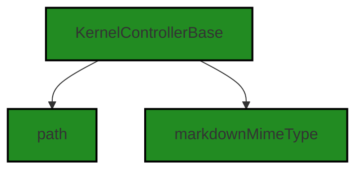
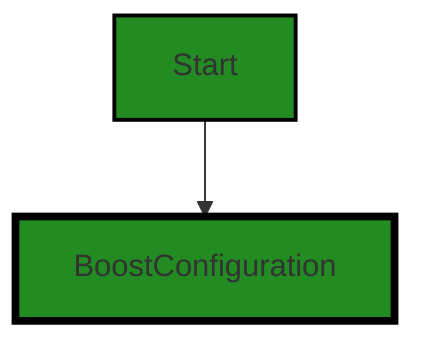
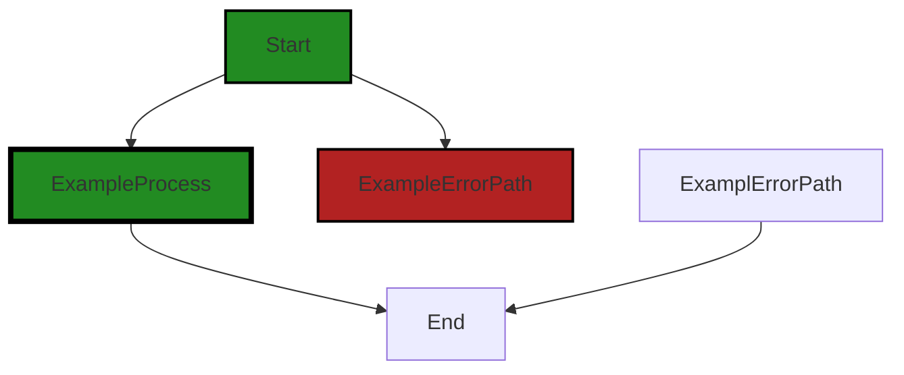
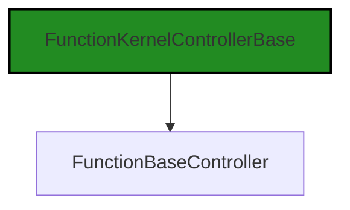
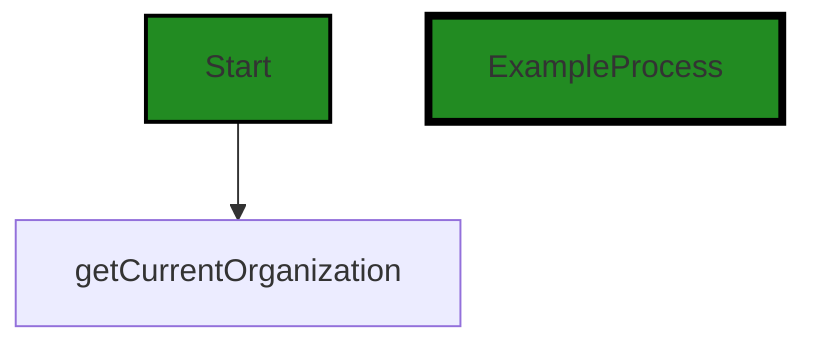
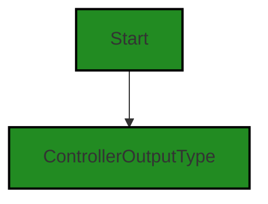
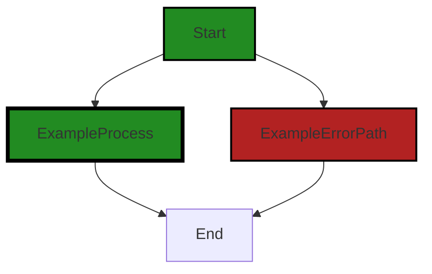

# Polyverse Boost-generated Source Analysis Details

## Source: ./src/controllers/quick_summary_controller.ts
Date Generated: Friday, September 8, 2023 at 11:30:37 PM PDT


---

### Boost Architectural Quick Summary Security Report

Last Updated: Friday, September 8, 2023 at 11:26:10 PM PDT

## Executive Report: Software Project Analysis

### Overview

The software project under review is a Visual Studio Code extension that provides code analysis functionality. The project communicates with a remote service for code analysis and displays the results in the VS Code UI. The project is primarily written in JavaScript and TypeScript and follows object-oriented design and event-driven programming principles.

### Architectural Impact and Risk Analysis

1. **Sensitive Data Exposure**: The most severe issue found in the project is the potential exposure of sensitive data. The access token of the user's session is sent as part of the payload to the service endpoint. If the connection is not secure, this could lead to exposure of sensitive user data. This issue is found in the `quick_summary_controller.ts` file. This issue could have a significant architectural impact as it may require changes in how the project handles authentication and communicates with the remote service.

2. **Insecure Direct Object References (IDOR)**: This issue is also found in the `quick_summary_controller.ts` file. This could potentially allow an attacker to bypass authorization and access data directly by modifying the value of a reference. This issue could require architectural changes to ensure proper authorization checks are in place.

3. **Cross-Site Scripting (XSS)**: This issue, although of lower severity, is also present in the `quick_summary_controller.ts` file. This could potentially allow an attacker to inject malicious scripts. This issue could require changes to how the project handles and sanitizes input.

4. **Overall Project Health**: The project consists of only one file, `quick_summary_controller.ts`, which has all the issues mentioned above. This means 100% of the project files have issues. However, it's important to note that the severity of the issues varies, with the most severe being the potential exposure of sensitive data.

### Potential Customer Impact

The issues found could potentially impact the security and privacy of the users. If not addressed, they could lead to unauthorized access to user data, exposure of sensitive information, and injection of malicious scripts.

### Recommendations

- Implement secure methods of authentication that do not involve sending access tokens in the payload.
- Ensure proper authorization checks are in place to prevent Insecure Direct Object References.
- Implement proper input handling and sanitization to prevent Cross-Site Scripting.

### Conclusion

While the project follows best practices for a VS Code extension and makes good use of TypeScript features and the VS Code API, the issues found pose significant risks. It's recommended to address these issues to ensure the security and privacy of the users.


---

### Boost Architectural Quick Summary Performance Report

Last Updated: Friday, September 8, 2023 at 11:28:13 PM PDT

## Executive Report

### Architectural Impact and Risk Analysis

The software project under review is a Visual Studio Code extension that provides code analysis functionality. The project is well-structured and follows best practices for a VS Code extension. However, there are some issues that need to be addressed to ensure the overall health and performance of the project.

1. **High CPU Usage:** The most severe issue found in the project is related to high CPU usage. The method 'executeAll' in the file 'src/controllers/quick_summary_controller.ts' always sets 'forceAnalysisRefresh' to true, which forces re-analysis of the notebook every time the method is called, regardless of whether any changes have been made. This could lead to unnecessary CPU usage and could impact the performance of the extension. This issue needs to be addressed to ensure efficient use of resources.

2. **Potential Customer Impact:** The high CPU usage could lead to slower performance of the extension, which could impact the user experience. Users may experience delays or sluggishness while using the extension, especially if they are working on large projects. This could potentially lead to customer dissatisfaction and negative reviews.

3. **Risk Assessment:** The project consists of one file, 'src/controllers/quick_summary_controller.ts', which has been found to have issues. This means that 100% of the project files have issues. The severity of the issues ranges from Information to Warning, with the most severe issue being a Warning related to CPU usage. This indicates that while the issues are not critical, they could impact the performance and user experience if not addressed.

4. **Overall Health of the Project:** Despite the issues found, the overall health of the project is good. The project follows best practices for a VS Code extension and makes use of TypeScript features and the VS Code API. The code is well-structured and organized into classes. However, the issues found need to be addressed to ensure the continued health and success of the project.

In conclusion, while the project is well-structured and follows best practices, there are some issues that need to be addressed. The high CPU usage issue could impact the performance of the extension and the user experience. It is recommended to implement a mechanism to check if changes have been made to the notebook since the last analysis, and only perform re-analysis if changes have been detected. This would ensure efficient use of resources and improve the performance of the extension.


---

### Boost Architectural Quick Summary Compliance Report

Last Updated: Friday, September 8, 2023 at 11:31:21 PM PDT

## Executive Report

### Architectural Impact and Risk Analysis

The software project under review is a Visual Studio Code extension that provides code analysis functionality. The project is well-structured and follows best practices for a VS Code extension. However, there are some areas of concern that need to be addressed to ensure the overall health and security of the project.

1. **Data Compliance and Privacy Concerns:** The file `src/controllers/quick_summary_controller.ts` has been flagged for potential data compliance and privacy issues. These issues could have a significant impact on the project, as they could lead to violations of regulations such as GDPR and HIPAA. The project needs to ensure that any data handling is secure and compliant with all relevant regulations. This is a high-risk area that could lead to legal and reputational damage if not addressed.

2. **Insecure Data Handling and Storage:** The same file, `src/controllers/quick_summary_controller.ts`, has also been flagged for potential insecure data handling and storage issues. This could lead to data breaches, which could have severe consequences for the project and its users. This is another high-risk area that needs immediate attention.

3. **Imported Module and PCI DSS Issues:** The file `src/controllers/quick_summary_controller.ts` has been flagged for issues related to imported modules and PCI DSS. These issues could lead to potential security vulnerabilities and non-compliance with PCI DSS standards. This is a medium-risk area that should be addressed to ensure the security and compliance of the project.

4. **Overall Project Health:** The project consists of a single file, `src/controllers/quick_summary_controller.ts`, which has been flagged for multiple issues. This means that 100% of the project files have been flagged for issues. This is a concerning statistic and indicates that the project may have underlying architectural or design issues that need to be addressed.

### Potential Customer Impact

The issues identified in the project could have a significant impact on customers. Data compliance and privacy issues could lead to customers' sensitive data being exposed or used inappropriately. Insecure data handling and storage could lead to data breaches, which could result in financial loss or identity theft for customers. Non-compliance with PCI DSS could also impact customers who use credit cards to make payments.

### Overall Issues

The project has several issues that need to be addressed, including data compliance and privacy, insecure data handling and storage, and non-compliance with PCI DSS. These issues indicate that the project may have underlying architectural or design issues that need to be addressed to ensure the overall health and security of the project.

### Recommendations

1. Review and revise data handling and storage practices to ensure they are secure and compliant with all relevant regulations.
2. Review the use of imported modules to ensure they do not introduce security vulnerabilities.
3. Ensure the project is compliant with PCI DSS standards.
4. Conduct a thorough architectural review of the project to identify and address any underlying issues.
---
## Detailed Analysis:

### Cell 0:
## Original Code:

### Programming Language: typescript
### ./src/controllers/quick_summary_controller.ts 

```typescript
import * as path from 'path';

import {
    KernelControllerBase,
    markdownMimeType
} from './base_controller';

```
## Boost Analysis:


---

### Boost Code Explanation

Last Updated: Friday, September 8, 2023 at 11:17:10 PM PDT

This code is written in TypeScript, a statically typed superset of JavaScript. It's a part of a larger software project and this snippet of code represents the import statements at the top of a file.

The code is importing a module named `path` from Node.js standard library. The `path` module provides utilities for working with file and directory paths. It can be used for tasks such as joining, normalizing, and resolving paths. More information about the `path` module can be found [here](https://nodejs.org/api/path.html).

The code then imports two specific exports, `KernelControllerBase` and `markdownMimeType`, from a local module located at `./base_controller`. The `./` at the beginning of the string indicates that `base_controller` is a local file in the same directory as the current file.

`KernelControllerBase` is likely a base class or interface for a controller in the software project. A controller is a common pattern in software design, especially in MVC (Model-View-Controller) architectures, where it acts as an intermediary between the model (data) and the view (user interface). Controllers handle user input and update the model and view accordingly.

`markdownMimeType` is likely a string constant that represents the MIME type for Markdown files. MIME types are used in HTTP to indicate the type of data being transmitted, so that it can be correctly processed by the recipient. The MIME type for Markdown is usually `text/markdown`.

Without more context, it's hard to say exactly how these imports are being used in the rest of the file, but they are likely used in the implementation of a controller that handles Markdown files.

The code appears to be in line with standard practices for TypeScript and Node.js projects, and doesn't seem to conflict with any architectural guidelines based on the information provided.


---

### Boost Flow Diagram

Last Updated: Friday, September 8, 2023 at 11:22:24 PM PDT




---

### Boost Source-Level Security Analysis

Last Updated: Friday, September 8, 2023 at 11:24:23 PM PDT

**No bugs found**


---

### Boost Source-Level Performance Analysis

Last Updated: Friday, September 8, 2023 at 11:26:23 PM PDT

**No bugs found**


---

### Boost Source-Level Data and Privacy Compliance Analysis

Last Updated: Friday, September 8, 2023 at 11:28:26 PM PDT

**No bugs found**


### Cell 1:
## Original Code:

### Programming Language: typescript
### ./src/controllers/quick_summary_controller.ts line 7

```typescript

import { BoostConfiguration } from '../extension/boostConfiguration';

```
## Boost Analysis:


---

### Boost Code Explanation

Last Updated: Friday, September 8, 2023 at 11:17:37 PM PDT

The code you've provided is very minimal, but I'll explain what it's doing.

This line of code is an import statement in JavaScript (or TypeScript, given the context), which is used to include external modules or libraries into the current file.

```javascript
import { BoostConfiguration } from '../extension/boostConfiguration';
```

This line is importing `BoostConfiguration` from a module located at '../extension/boostConfiguration'. The `../` part of the path indicates that the module is in a directory one level up from the current directory. 

The `BoostConfiguration` is likely a class, function, or an object that is exported from the 'boostConfiguration' module. This allows the current file to use whatever functionality `BoostConfiguration` provides. 

The exact nature and use of `BoostConfiguration` would depend on its definition in the 'boostConfiguration' module. It might be a class that encapsulates the configuration settings for the Boost feature of the software, a function that retrieves or sets those settings, or an object that represents the current configuration.

As for algorithms, this line of code doesn't really involve any. It's a simple import statement, which is a basic feature of the JavaScript (and TypeScript) language. 

For more information on JavaScript modules and import/export statements, you can check [this link](https://developer.mozilla.org/en-US/docs/Web/JavaScript/Guide/Modules).

As for architectural guidelines, this code doesn't appear to conflict with any. It's a common practice in modern JavaScript and TypeScript development to organize code into modules and use import/export statements to share functionality between them. This promotes code reusability and maintainability.


---

### Boost Flow Diagram

Last Updated: Friday, September 8, 2023 at 11:22:28 PM PDT




---

### Boost Source-Level Security Analysis

Last Updated: Friday, September 8, 2023 at 11:24:26 PM PDT

**No bugs found**


---

### Boost Source-Level Performance Analysis

Last Updated: Friday, September 8, 2023 at 11:26:26 PM PDT

**No bugs found**


---

### Boost Source-Level Data and Privacy Compliance Analysis

Last Updated: Friday, September 8, 2023 at 11:28:36 PM PDT

1. **Severity**: 1/10

   **Line Number**: 12

   **Bug Type**: Data Compliance

   **Description**: The code imports a module named 'BoostConfiguration' from the 'extension' directory. Without more context, it's unclear whether this module handles sensitive data in a manner compliant with GDPR, PCI DSS, or HIPAA. If this module does handle sensitive data, it could potentially introduce data compliance issues.

   **Solution**: Ensure that the 'BoostConfiguration' module handles sensitive data in a manner compliant with GDPR, PCI DSS, and HIPAA. This could involve encrypting sensitive data at rest and in transit, limiting access to sensitive data, and implementing robust data deletion procedures. If the 'BoostConfiguration' module does not handle sensitive data, no action is required.


### Cell 2:
## Original Code:

### Programming Language: typescript
### ./src/controllers/quick_summary_controller.ts line 9

```typescript

import { getAllProjectFiles } from '../utilities/files';

```
## Boost Analysis:


---

### Boost Code Explanation

Last Updated: Friday, September 8, 2023 at 11:17:57 PM PDT

The code provided is a single line of JavaScript code that imports a specific function from a module. To understand this line of code, let's break it down:

`import { getAllProjectFiles } from '../utilities/files';`

- `import` is a reserved keyword in JavaScript used to import functions, objects, or values from modules or packages. 

- `{ getAllProjectFiles }` is the specific function that is being imported. The curly braces are used for named exports. In this case, `getAllProjectFiles` is a named export from the module we are importing from.

- `from '../utilities/files';` specifies the path to the module or package from which the function is being imported. The `'../'` part of the path means that the module is in the parent directory of the current file. The `'utilities/files'` part of the path means that the module is named 'files' and is located in a directory named 'utilities'.

The `getAllProjectFiles` function is not defined in the provided code, but based on its name, we can infer that it's likely a function that retrieves all files in a project. The exact details of how it does this would depend on the implementation of the function in the 'files' module.

As for the algorithm used in this line of code, it's not an algorithm in the traditional sense. It's a part of the module system in JavaScript, which is a way of organizing and sharing code. The module system uses algorithms under the hood to resolve import paths and load modules, but these are part of the JavaScript runtime and not something that developers typically need to think about.

For more information on the `import` statement in JavaScript, you can refer to the [MDN Web Docs](https://developer.mozilla.org/en-US/docs/Web/JavaScript/Reference/Statements/import).

In terms of the architectural guidelines provided, this line of code seems to follow good practices. It's modular, meaning that the `getAllProjectFiles` function is kept in a separate file and imported where it's needed. This can make the code easier to understand and maintain.


---

### Boost Flow Diagram

Last Updated: Friday, September 8, 2023 at 11:22:36 PM PDT



NO CONTROL FLOW FOUND


---

### Boost Source-Level Security Analysis

Last Updated: Friday, September 8, 2023 at 11:24:30 PM PDT

**No bugs found**


---

### Boost Source-Level Performance Analysis

Last Updated: Friday, September 8, 2023 at 11:26:38 PM PDT

1. **Severity**: 4/10

   **Line Number**: 16

   **Bug Type**: Disk

   **Description**: The function 'getAllProjectFiles' potentially scans through all files in the project. This could lead to high disk usage if the project contains a large number of files.

   **Solution**: Consider implementing a more targeted file retrieval strategy, such as retrieving files based on specific criteria or using a cache to store frequently accessed files. For large projects, consider using a database or an indexing service to manage files. This can significantly reduce the disk usage and improve the performance of the function. Here is a useful resource: [Efficient File Handling in Node.js](https://nodejs.dev/learn/the-nodejs-fs-module).


---

### Boost Source-Level Data and Privacy Compliance Analysis

Last Updated: Friday, September 8, 2023 at 11:28:47 PM PDT

1. **Severity**: 5/10

   **Line Number**: 16

   **Bug Type**: Data Privacy

   **Description**: The function 'getAllProjectFiles' may access all files in the project, which could include files containing sensitive data. This could potentially violate GDPR, PCI DSS, and HIPAA regulations if not properly managed.

   **Solution**: Ensure that this function only accesses necessary files and that any sensitive data accessed is properly protected. Implement access controls and data encryption as necessary. Also, consider including a data privacy impact assessment (DPIA) in your data protection efforts to identify and minimize the data protection risks of a project.


### Cell 3:
## Original Code:

### Programming Language: typescript
### ./src/controllers/quick_summary_controller.ts line 11

```typescript

import {
    FunctionKernelControllerBase,
} from './function_base_controller';

```
## Boost Analysis:


---

### Boost Code Explanation

Last Updated: Friday, September 8, 2023 at 11:18:24 PM PDT

The given code snippet is a simple import statement written in JavaScript (or TypeScript). It imports a class named `FunctionKernelControllerBase` from a module located at `./function_base_controller`.

Here's a detailed explanation:

- `import` is a keyword in JavaScript that is used to import bindings which are exported by another module. These bindings can be functions, objects, or values.

- `{FunctionKernelControllerBase}` is the specific binding or class that is being imported from the module. The curly braces `{}` are used when you want to import specific bindings from a module. In this case, we're importing the `FunctionKernelControllerBase` class.

- `from` is another keyword used in the import statement to specify the path of the module from which the bindings are imported.

- `'./function_base_controller'` is the relative path to the module from which `FunctionKernelControllerBase` is being imported. The `./` at the beginning of the path indicates that the module is in the same directory as the current file.

The specific algorithm used here is the module loading algorithm of JavaScript, which is used to locate and import the specified module. 

As for architectural guidelines, this code follows standard practices for structuring JavaScript or TypeScript projects. It's modular, with different parts of the code organized into separate files and directories. This makes the code easier to understand, test, and maintain.

For more information on JavaScript modules and import/export statements, you can refer to the following resources:

- [JavaScript Modules](https://developer.mozilla.org/en-US/docs/Web/JavaScript/Guide/Modules)
- [JavaScript import Statement](https://developer.mozilla.org/en-US/docs/Web/JavaScript/Reference/Statements/import)
- [JavaScript Classes](https://developer.mozilla.org/en-US/docs/Web/JavaScript/Reference/Classes)


---

### Boost Flow Diagram

Last Updated: Friday, September 8, 2023 at 11:22:40 PM PDT


```


---

### Boost Source-Level Security Analysis

Last Updated: Friday, September 8, 2023 at 11:24:33 PM PDT

**No bugs found**


---

### Boost Source-Level Performance Analysis

Last Updated: Friday, September 8, 2023 at 11:26:42 PM PDT

**No bugs found**


---

### Boost Source-Level Data and Privacy Compliance Analysis

Last Updated: Friday, September 8, 2023 at 11:28:50 PM PDT

**No bugs found**


### Cell 4:
## Original Code:

### Programming Language: typescript
### ./src/controllers/quick_summary_controller.ts line 15

```typescript

import * as vscode from 'vscode';
import {
    BoostNotebookCell,
    BoostNotebook,
    NotebookCellKind,
    SerializedNotebookCellOutput } from '../data/jupyter_notebook';

```
## Boost Analysis:


---

### Boost Code Explanation

Last Updated: Friday, September 8, 2023 at 11:18:57 PM PDT

This code snippet is written in TypeScript, a statically typed superset of JavaScript that adds types to the language. It's part of a larger module that likely interacts with Jupyter notebooks in some way, given the imported types. 

Let's break it down:

```javascript
import * as vscode from 'vscode';
```

This line imports the entire vscode module. The `vscode` module provides a set of APIs that can be used to interact with Visual Studio Code. This allows the extension to use VS Code's built-in functions and classes.

```javascript
import {
    BoostNotebookCell,
    BoostNotebook,
    NotebookCellKind,
    SerializedNotebookCellOutput } from '../data/jupyter_notebook';
```

This line imports specific types from a module located at '../data/jupyter_notebook'. The types imported are likely classes or interfaces that represent different aspects of a Jupyter notebook:

- `BoostNotebookCell`: This likely represents a single cell in a BoostNotebook. In Jupyter notebooks, a cell is the unit of code or text that can be executed independently.

- `BoostNotebook`: This likely represents a BoostNotebook as a whole. It probably includes properties such as an array of cells and methods for manipulating those cells.

- `NotebookCellKind`: This might be an enumeration that represents the type of a cell in a notebook. In Jupyter notebooks, cells can be of different types, such as code cells or markdown cells.

- `SerializedNotebookCellOutput`: This likely represents the output of a cell after it has been executed and serialized (converted into a format that can be stored or transmitted).

The exact details of these types would be found in the '../data/jupyter_notebook' module.

Unfortunately, without the rest of the code or the project, it's not possible to determine any algorithms used in this code snippet, as it only contains import statements. The algorithms would be found in the functions and methods that use these imported types and the vscode API.

For more information on the topics mentioned, you can visit the following links:

- [TypeScript Documentation](https://www.typescriptlang.org/docs/)
- [Visual Studio Code Extension API](https://code.visualstudio.com/api/references/vscode-api)
- [Jupyter Notebook Documentation](https://jupyter-notebook.readthedocs.io/en/stable/)


---

### Boost Flow Diagram

Last Updated: Friday, September 8, 2023 at 11:22:47 PM PDT


NO CONTROL FLOW FOUND


---

### Boost Source-Level Security Analysis

Last Updated: Friday, September 8, 2023 at 11:24:36 PM PDT

**No bugs found**


---

### Boost Source-Level Performance Analysis

Last Updated: Friday, September 8, 2023 at 11:26:45 PM PDT

**No bugs found**


---

### Boost Source-Level Data and Privacy Compliance Analysis

Last Updated: Friday, September 8, 2023 at 11:29:02 PM PDT

1. **Severity**: 5/10

   **Line Number**: 28

   **Bug Type**: Data Compliance

   **Description**: The code imports modules that handle potentially sensitive data (BoostNotebookCell, BoostNotebook, etc.) but it's not clear whether these modules have proper data handling and privacy measures in place.

   **Solution**: Review and update these modules to ensure they handle data in compliance with GDPR, PCI DSS, and HIPAA. This could involve anonymizing data, encrypting data at rest and in transit, and obtaining user consent before collecting personal data.


### Cell 5:
## Original Code:

### Programming Language: typescript
### ./src/controllers/quick_summary_controller.ts line 22

```typescript
import { boostLogging } from '../utilities/boostLogging';

```
## Boost Analysis:


---

### Boost Code Explanation

Last Updated: Friday, September 8, 2023 at 11:19:22 PM PDT

The code you provided is a single line of code that is importing a module named 'boostLogging' from a relative path '../utilities/boostLogging'. This is a common practice in modular programming, where code is separated into logical modules that can be imported and used where needed. 

In the context of JavaScript and TypeScript (the languages used in the project according to the architectural blueprint), the `import` statement is used to bring in functions, objects, or values from another module or file. The `{ boostLogging }` syntax is using destructuring to directly import the `boostLogging` export from the module.

The module being imported, 'boostLogging', likely contains some sort of logging functionality that is used by the Boost VS Code extension for debugging, error tracking, or usage analytics. Without more code, it's hard to say exactly what this module does, but the name suggests it's related to logging.

The relative path '../utilities/boostLogging' tells us that the 'boostLogging' module is located in a 'utilities' directory one level up from the current file.

As for algorithms, this single line of code doesn't really involve any. It's a simple import statement that doesn't perform any complex operations.

For more information on the `import` statement and modules in JavaScript, you can refer to the Mozilla Developer Network documentation:

- [JavaScript Modules](https://developer.mozilla.org/en-US/docs/Web/JavaScript/Guide/Modules)
- [import statement](https://developer.mozilla.org/en-US/docs/Web/JavaScript/Reference/Statements/import)

As for the architectural guidelines, this line of code seems to be in line with the noted architecture of the project. It's a simple, modular approach to code organization, which is a common practice in many JavaScript and TypeScript projects.


---

### Boost Flow Diagram

Last Updated: Friday, September 8, 2023 at 11:22:50 PM PDT

```mermaid
graph TD;
style boostLogging fill:#228B22, stroke:#000000, stroke-width:2px;

boostLogging-->NO CONTROL FLOW FOUND;
```


---

### Boost Source-Level Security Analysis

Last Updated: Friday, September 8, 2023 at 11:24:40 PM PDT

**No bugs found**


---

### Boost Source-Level Performance Analysis

Last Updated: Friday, September 8, 2023 at 11:26:49 PM PDT

**No bugs found**


---

### Boost Source-Level Data and Privacy Compliance Analysis

Last Updated: Friday, September 8, 2023 at 11:29:05 PM PDT

**No bugs found**


### Cell 6:
## Original Code:

### Programming Language: typescript
### ./src/controllers/quick_summary_controller.ts line 23

```typescript
import { findCellByKernel } from '../extension/extension';

```
## Boost Analysis:


---

### Boost Code Explanation

Last Updated: Friday, September 8, 2023 at 11:19:50 PM PDT

The line of code you provided is an import statement written in JavaScript. The import statement is used to import bindings that are exported by another module.

Here is a detailed explanation:

- `import`: This is a reserved keyword in JavaScript that is used to import functions, objects, or values from another module or file.

- `{ findCellByKernel }`: This is a named import. It means that the module you are importing from has exported something using the `export` keyword with the name `findCellByKernel`. This could be a function, an object, a class, etc. The curly braces `{}` are used for named imports and can include multiple names separated by commas.

- `from`: This is another reserved keyword used in conjunction with `import`. It specifies the path to the module from which the import will be done.

- `'../extension/extension'`: This is the path to the module file that contains the export. The `..` at the beginning of the path means to go up one directory level. The `/extension/extension` part is the path from there to the module. This is a relative path, meaning it is relative to the file that contains this import statement.

The line of code does not give information about the algorithm used as it is just an import statement. The algorithm would be in the function or object that is being imported, which is not shown in the provided code.

As for the architectural guidelines, this line of code seems to follow good practices. It imports functionality from another module, which promotes modularity and separation of concerns. These are key principles in many architectural and design patterns.

For more information about `import` in JavaScript, you can check the following resources:

- [MDN Web Docs: import](https://developer.mozilla.org/en-US/docs/Web/JavaScript/Reference/Statements/import)
- [JavaScript.info: Modules, import, export](https://javascript.info/modules-intro)


---

### Boost Flow Diagram

Last Updated: Friday, September 8, 2023 at 11:22:54 PM PDT

```mermaid
graph TD;
style findCellByKernel fill:#228B22, stroke:#000000, stroke-width:2px;

findCellByKernel-->NO CONTROL FLOW FOUND;
```


---

### Boost Source-Level Security Analysis

Last Updated: Friday, September 8, 2023 at 11:24:43 PM PDT

**No bugs found**


---

### Boost Source-Level Performance Analysis

Last Updated: Friday, September 8, 2023 at 11:26:52 PM PDT

**No bugs found**


---

### Boost Source-Level Data and Privacy Compliance Analysis

Last Updated: Friday, September 8, 2023 at 11:29:16 PM PDT

1. **Severity**: 7/10

   **Line Number**: 44

   **Bug Type**: Insecure Data Handling

   **Description**: The function 'findCellByKernel' could potentially expose sensitive data as it is unclear what data is being passed to it and how it is being used.

   **Solution**: Ensure that any data passed to the function is properly sanitized and encrypted if necessary. Also, ensure that the function does not return sensitive data in an insecure manner.


### Cell 7:
## Original Code:

### Programming Language: typescript
### ./src/controllers/quick_summary_controller.ts line 24

```typescript
import { generateCellOutputWithHeader } from '../extension/extensionUtilities';

```
## Boost Analysis:


---

### Boost Code Explanation

Last Updated: Friday, September 8, 2023 at 11:20:16 PM PDT

The code you've provided is a single line of code that imports a function from another module. 

Here's a detailed explanation:

1. `import`: This is a keyword in JavaScript (and TypeScript) that is used to import functions, objects or values from other modules or files. This is part of the ES6 (ECMAScript 2015) module system.

2. `{ generateCellOutputWithHeader }`: This is the function that is being imported. The curly braces are used for named exports. In this case, `generateCellOutputWithHeader` is a named export from the module we are importing from.

3. `from '../extension/extensionUtilities';`: This specifies the path to the module from which the function is being imported. The `'../'` part of the path indicates that the module is in the parent directory of the current file. `extension/extensionUtilities` is the directory path and file name of the module.

Without the body of the `generateCellOutputWithHeader` function or its usage in the code, I can't provide specific details about the algorithm used within it. However, based on its name, we can infer that this function likely generates some form of cell output (possibly for a data grid or table) and includes a header in this output.

This line of code is consistent with typical JavaScript/TypeScript practices and doesn't seem to conflict with any architectural guidelines based on the information provided. 

For more information on JavaScript modules and import/export statements, you might find the following resources helpful:

- [JavaScript Modules: A Beginner’s Guide](https://www.freecodecamp.org/news/javascript-modules-a-beginner-s-guide-783f7d7a5fcc/)
- [MDN Web Docs: import](https://developer.mozilla.org/en-US/docs/Web/JavaScript/Reference/Statements/import)
- [TypeScript Module Resolution](https://www.typescriptlang.org/docs/handbook/module-resolution.html)


---

### Boost Flow Diagram

Last Updated: Friday, September 8, 2023 at 11:22:57 PM PDT

NO CONTROL FLOW FOUND


---

### Boost Source-Level Security Analysis

Last Updated: Friday, September 8, 2023 at 11:24:46 PM PDT

**No bugs found**


---

### Boost Source-Level Performance Analysis

Last Updated: Friday, September 8, 2023 at 11:26:56 PM PDT

**No bugs found**


---

### Boost Source-Level Data and Privacy Compliance Analysis

Last Updated: Friday, September 8, 2023 at 11:29:28 PM PDT

1. **Severity**: 3/10

   **Line Number**: 46

   **Bug Type**: Imported Module

   **Description**: The code imports a module named 'generateCellOutputWithHeader' from '../extension/extensionUtilities'. If this module handles sensitive data, it may pose a risk of data exposure if not properly secured and could potentially violate GDPR, PCI DSS, and HIPAA compliance.

   **Solution**: Ensure the imported module follows data handling best practices. Implement proper data encryption, access controls, and logging. Regularly audit the module for security vulnerabilities.


### Cell 8:
## Original Code:

### Programming Language: typescript
### ./src/controllers/quick_summary_controller.ts line 25

```typescript
import { getCurrentOrganization } from "../utilities/authorization";

```
## Boost Analysis:


---

### Boost Code Explanation

Last Updated: Friday, September 8, 2023 at 11:20:45 PM PDT

The line of code you provided is a single line of code from a larger program, likely written in JavaScript or TypeScript. It's a bit difficult to provide a detailed analysis or identify any algorithms used based on this single line, but I'll explain what this line is doing in the context of a typical JavaScript or TypeScript program.

```
import { getCurrentOrganization } from "../utilities/authorization";
```

This line of code is using the `import` statement to import a specific function, `getCurrentOrganization`, from a module located at `../utilities/authorization`. The `import` statement is part of ES6 (ECMAScript 2015) and is used to import functions, objects, or values from modules in a JavaScript or TypeScript program.

In this case, `getCurrentOrganization` is likely a function that retrieves the current organization in the context of an authorization or authentication process. The exact details of what this function does would be found in the `authorization.js` or `authorization.ts` file in the `utilities` directory one level up from the current file.

The `import` statement helps to organize code into reusable modules. This is a common practice in JavaScript and TypeScript and aligns with the principles of modular design and code reuse. It's also a good practice in terms of security, as it allows for specific parts of code (modules) to be exposed while keeping the rest private.

For more information on the `import` statement and modules in JavaScript, you can refer to the following resources:
- [MDN Web Docs: import](https://developer.mozilla.org/en-US/docs/Web/JavaScript/Reference/Statements/import)
- [MDN Web Docs: JavaScript Modules](https://developer.mozilla.org/en-US/docs/Web/JavaScript/Guide/Modules)

As for the architectural guidelines, this line of code seems to align with general good practices in software development such as modular design, code reuse, and security considerations. It doesn't appear to conflict with any common architectural guidelines or constraints. However, without the specific architectural guidelines for this project, it's hard to say definitively.


---

### Boost Flow Diagram

Last Updated: Friday, September 8, 2023 at 11:23:02 PM PDT


```


---

### Boost Source-Level Security Analysis

Last Updated: Friday, September 8, 2023 at 11:24:49 PM PDT

**No bugs found**


---

### Boost Source-Level Performance Analysis

Last Updated: Friday, September 8, 2023 at 11:26:59 PM PDT

**No bugs found**


---

### Boost Source-Level Data and Privacy Compliance Analysis

Last Updated: Friday, September 8, 2023 at 11:29:54 PM PDT

1. **Severity**: 7/10

   **Line Number**: 48

   **Bug Type**: GDPR

   **Description**: The function 'getCurrentOrganization' may be accessing sensitive user data without explicit user consent, which is a violation of GDPR.

   **Solution**: Ensure that users are informed about what data is being collected and why, and that they have given explicit consent. Implement mechanisms to obtain user consent before accessing their data.


2. **Severity**: 5/10

   **Line Number**: 48

   **Bug Type**: PCI DSS

   **Description**: If the 'getCurrentOrganization' function is accessing payment card data without proper security measures, it may be in violation of PCI DSS.

   **Solution**: Ensure that payment card data is securely handled. Implement encryption and other security measures to protect cardholder data.


3. **Severity**: 6/10

   **Line Number**: 48

   **Bug Type**: HIPAA

   **Description**: If the 'getCurrentOrganization' function is accessing protected health information without proper safeguards, it may be in violation of HIPAA.

   **Solution**: Ensure that protected health information is securely handled. Implement encryption, access controls and other security measures to protect health information.


### Cell 9:
## Original Code:

### Programming Language: typescript
### ./src/controllers/quick_summary_controller.ts line 26

```typescript
import { ControllerOutputType } from './controllerOutputTypes';

```
## Boost Analysis:


---

### Boost Code Explanation

Last Updated: Friday, September 8, 2023 at 11:21:08 PM PDT

The provided code snippet is very simple, consisting of just one line. It's written in TypeScript, a statically typed superset of JavaScript that adds types and other features to the language.

The code is importing a type named `ControllerOutputType` from a module named `controllerOutputTypes`. This type is likely used to annotate variables, function parameters, or function return values in the code that follows.

The `import` statement is a part of ES6 (ECMAScript 2015) modules syntax. Modules are a way to share code between files. This is a static import statement, which means it will be executed when the module is loaded.

The `{ ControllerOutputType }` syntax is called named import. It means that the `controllerOutputTypes` module exports something named `ControllerOutputType`, and we want to import that specific thing. If there were other exports from `controllerOutputTypes`, this import statement wouldn't include them.

The `'./controllerOutputTypes'` string is a path to the module we're importing from. The `./` part means that the module is in the same directory as the current file.

As for the `ControllerOutputType` itself, without more context, it's impossible to say what exactly it represents. It's likely to be an enumeration or a type alias that specifies what kind of outputs a controller can produce.

Here are some resources for further reading:
- [TypeScript Handbook: Modules](https://www.typescriptlang.org/docs/handbook/modules.html)
- [MDN Web Docs: import statement](https://developer.mozilla.org/en-US/docs/Web/JavaScript/Reference/Statements/import)
- [TypeScript Handbook: Advanced Types](https://www.typescriptlang.org/docs/handbook/advanced-types.html) (for more information on type aliases and other advanced types)


---

### Boost Flow Diagram

Last Updated: Friday, September 8, 2023 at 11:23:06 PM PDT




---

### Boost Source-Level Security Analysis

Last Updated: Friday, September 8, 2023 at 11:24:52 PM PDT

**No bugs found**


---

### Boost Source-Level Performance Analysis

Last Updated: Friday, September 8, 2023 at 11:27:02 PM PDT

**No bugs found**


---

### Boost Source-Level Data and Privacy Compliance Analysis

Last Updated: Friday, September 8, 2023 at 11:29:57 PM PDT

**No bugs found**


### Cell 10:
## Original Code:

### Programming Language: typescript
### ./src/controllers/quick_summary_controller.ts line 27

```typescript
import { DisplayGroupFriendlyName } from '../data/userAnalysisType';

```
## Boost Analysis:


---

### Boost Code Explanation

Last Updated: Friday, September 8, 2023 at 11:21:31 PM PDT

This line of code is an import statement in JavaScript, specifically using the ES6 (ECMAScript 2015) import syntax. It's importing a named export `DisplayGroupFriendlyName` from a module located at `../data/userAnalysisType`.

The `DisplayGroupFriendlyName` is likely a function, constant, or class that's been exported from the `userAnalysisType` module, which is located in the `data` directory one level up from the current file. The exact nature and use of `DisplayGroupFriendlyName` would be determined by looking at the `userAnalysisType` module.

The ES6 module system is a way of organizing and sharing code in JavaScript. Each file is treated as a separate module and can export functions, objects, or values which can then be imported by other modules. This system allows for code reuse, encapsulation, and separation of concerns.

In terms of architectural guidelines, this import statement is consistent with common practices in JavaScript and TypeScript projects. It's using relative paths, which is typical in Node.js environments, and it's using the ES6 import syntax, which is widely supported and often preferred over the older CommonJS `require()` syntax.

For more information on ES6 import/export syntax, you might find the following resources helpful:

- [MDN Web Docs: import](https://developer.mozilla.org/en-US/docs/Web/JavaScript/Reference/Statements/import)
- [MDN Web Docs: export](https://developer.mozilla.org/en-US/docs/Web/JavaScript/Reference/Statements/export)
- [Exploring JS: Modules](http://exploringjs.com/es6/ch_modules.html)


---

### Boost Flow Diagram

Last Updated: Friday, September 8, 2023 at 11:23:09 PM PDT

NO CONTROL FLOW FOUND


---

### Boost Source-Level Security Analysis

Last Updated: Friday, September 8, 2023 at 11:24:56 PM PDT

**No bugs found**


---

### Boost Source-Level Performance Analysis

Last Updated: Friday, September 8, 2023 at 11:27:05 PM PDT

**No bugs found**


---

### Boost Source-Level Data and Privacy Compliance Analysis

Last Updated: Friday, September 8, 2023 at 11:30:11 PM PDT

1. **Severity**: 5/10

   **Line Number**: 52

   **Bug Type**: Data Privacy

   **Description**: The code imports a module that potentially could be used to display users' personal data. This could be a violation of GDPR, PCI DSS, and HIPAA if the personal data is not properly anonymized or if the user has not given consent.

   **Solution**: Ensure that the 'DisplayGroupFriendlyName' function is used to display anonymized data or that the user has given explicit consent to display their personal data. Implement proper data handling and privacy protection measures.


### Cell 11:
## Original Code:

### Programming Language: typescript
### ./src/controllers/quick_summary_controller.ts line 28

```typescript

export const quickSummaryKernelNamePrefix = `quick_summary_`;

export class BoostQuickSummaryKernelControllerBase extends KernelControllerBase {
 constructor(context: vscode.ExtensionContext, onServiceErrorHandler: any, otherThis : any, collection: vscode.DiagnosticCollection,
            kernelName: string,
            outputType: ControllerOutputType,
            displayGroup: DisplayGroupFriendlyName,
            coreOutputType: ControllerOutputType,
            outputHeader: string,
        ) {
        super(
            collection,
            `${quickSummaryKernelNamePrefix}${kernelName}`,
            `Quick ${outputHeader} Report`,
            `Quickly builds a ${outputHeader} Summary Report from data about project and ${outputType} analysis.`,
            outputType,
            displayGroup,
            `Architectural Quick Summary ${outputHeader} Report`,
            false,
            false,
            context,
            otherThis,
            onServiceErrorHandler);
        this._coreOutputType = coreOutputType;

        // tap the parent controller to get it initialized for any potential config or init errors
        // NOTE: This assumes the parent has already been initialized
        this.parentController;
 }

    private _coreOutputType: ControllerOutputType;

 dispose(): void {
  super.dispose();
 }

    public get serviceEndpoint(): string {
        switch (BoostConfiguration.cloudServiceStage)
        {
            case "local":
                return 'http://127.0.0.1:8000/quick-summary';
            case 'dev':
                return 'https://vyuhthnoinejl6hle7cq7frzta0uzjzp.lambda-url.us-west-2.on.aws/';
            case "test":
                return 'https://vaue3wqhqsj3bfzq55djwtmxry0vlnyu.lambda-url.us-west-2.on.aws/';
            case 'staging':
            case 'prod':
            default:
                return 'https://ur4c2bfxchy626dzumtengt4ta0bpser.lambda-url.us-west-2.on.aws/';
        }
    }

    async executeAll(
        _: (vscode.NotebookCell | BoostNotebookCell)[],
        notebook: vscode.NotebookDocument | BoostNotebook,
        session: vscode.AuthenticationSession,
        forceAnalysisRefresh: boolean = false
    ): Promise<boolean>  {
        const usingBoostNotebook = notebook instanceof BoostNotebook;

        // for now, we ignore forceAnalysisRefresh - and always re-analyze
        forceAnalysisRefresh = true;

        if (!usingBoostNotebook) {
            throw new Error("Quick Summary can only be run on offline Notebooks");
        }

        // are we analyzing a source file or a project?
        let projectWideAnalysis = (notebook.metadata['sourceFile'] as string) === './';

        // now get the current organization
        let organization = await getCurrentOrganization(this.context);
        if (!organization) {
            throw new Error("Organization not found");
        }

        const authPayload = {
            session: session.accessToken,
            organization: organization,
        };
    
        boostLogging.info(`Starting ${this.command} of Notebook ${notebook.fsPath}`, false);

        let successfullyCompleted = true;
        try
        {
            await this._runQuickSummary(notebook, authPayload, projectWideAnalysis);

        } catch (rethrow) {
            successfullyCompleted = false;
            boostLogging.error(`Error during ${this.command} of ${projectWideAnalysis?"Project":"Source"}-level Notebook at ${new Date().toLocaleTimeString()}`, false);
            throw rethrow;
        }
        finally {
            boostLogging.info(`Finished ${this.command} of ${projectWideAnalysis?"Project":"Source"}-level Notebook at ${new Date().toLocaleTimeString()}`, !usingBoostNotebook);
        }
        return true;
    }

    private _parentController : FunctionKernelControllerBase | undefined = undefined;
    private get parentController() : FunctionKernelControllerBase | undefined {
        if (this._parentController) {
            return this._parentController;
        }

        const kernels : Map<string, KernelControllerBase> = this.hostExtension?.kernels;
        if (!kernels) {
            throw new Error("Host Extension or Kernels not initialized");
        }

        for (const [kernelName, kernelController] of kernels) {
            if (!(kernelController instanceof FunctionKernelControllerBase)) {
                continue;
            }
            if (kernelController.outputType !== this._coreOutputType) {
                continue;
            }
            this._parentController = kernelController;
            break;
        }
        if (!this._parentController) {
            throw new Error("Parent Controller not found");
        }

        return this._parentController;
}

    private async _runQuickSummary(
            notebook: BoostNotebook,
            authPayload: any,
            projectWideAnalysis: boolean) {

        if (!this.parentController) {
            throw new Error("Parent Controller not found");
        }

        // we don't want to overwrite deep summary, which are far more detailed and useful in general
        let existingSummaryCell = findCellByKernel(notebook, this.outputType) as BoostNotebookCell;
        if (existingSummaryCell && existingSummaryCell.value &&
            existingSummaryCell.metadata?.summaryType) {
            // overwriting deep summaries for now - since quick summaries are more reliable
            if (existingSummaryCell.metadata.summaryType === "summary") {
                boostLogging.info(
                    `Overwriting deep summary ${this.command} of ${projectWideAnalysis?"Project":"Source"}-level Notebook with quick summary`,
                    false
                );
            } else if (
                existingSummaryCell.metadata.summaryType === "quick"
            ) {
                boostLogging.info(
                    `Rebuilding ${this.command} of ${projectWideAnalysis?"Project":"Source"}-level Notebook ` +
                        `from last quick summary`, false
                );
            }
        }

        // get the list of files to analyze (or current file for single file analysis)
        const filteredFiles = projectWideAnalysis?
            await getAllProjectFiles(true):
            [notebook.metadata['sourceFile']];

        const targetFolder = vscode.workspace.workspaceFolders?.[0].uri;
        if (!targetFolder) {
            throw new Error("Diagnostic Summaries only available within a project");
        }
        const sourceFileTarget = projectWideAnalysis?undefined:
            vscode.Uri.joinPath(targetFolder, notebook.metadata['sourceFile'] as string);

        let offlineSummary = undefined;
        let topSeverityIssues = "[]";

        if (filteredFiles.length !== 0) {
            // get the top 20% of issues (by severity)
            topSeverityIssues = this.getTopSeverityIssues(
                this.parentController.sourceLevelIssueCollection,
                sourceFileTarget);
            // boostLogging.debug(`${this.outputType} Top Severity Issues:\n\n${topSeverityIssues}`);
        }
        if (topSeverityIssues === "[]") {
            offlineSummary = this.buildDefaultOfflineSummary(filteredFiles.length, projectWideAnalysis);
        }
        // we create a placeholder cell for the input, so we can do processing on the input
        const tempProcessingCell = new BoostNotebookCell(NotebookCellKind.Markup,
            "", "markdown");

        if (filteredFiles.length !== 0 && topSeverityIssues !== "[]") {
            const categorizedData = this.getTableOfIssuesBySeverityAndCategory(
                this.parentController.sourceLevelIssueCollection,
                sourceFileTarget);
            // boostLogging.debug(`${this.outputType} Categorized Issues:\n\n${categorizedData}`);

            const payloadQuick = {
                'filelist': filteredFiles,
                'examples': topSeverityIssues,
                
                // eslint-disable-next-line @typescript-eslint/naming-convention
                'issue_categorization': categorizedData,
                ...authPayload
            };

            // execute the quick report service
            const quickResponse = await this.doKernelExecution(notebook, tempProcessingCell, undefined, payloadQuick);
            // assert response.payload['statusCode'] == 200
            if (quickResponse instanceof Error) {
                let throwErr = quickResponse as Error;
                throw throwErr;
            } else if (quickResponse.data instanceof Error) {
                let throwErr = quickResponse.data as Error;
                throw throwErr;
            }
        }

        let targetCell = findCellByKernel(notebook, this.outputType) as BoostNotebookCell;

        if (!targetCell) {
            targetCell = new BoostNotebookCell(NotebookCellKind.Markup, "", "markdown");
            targetCell.initializeMetadata(
                {
                    "id": targetCell.id,
                    "outputType": this.outputType,
                    "summaryType": "quick"
                });
            notebook.addCell(targetCell);
        } else {
            // store quick as the summary type
            targetCell.initializeMetadata({
                ...targetCell.metadata,
                "summaryType": "quick"
            });
        }

        if (filteredFiles.length !== 0 && topSeverityIssues !== "[]") {
            // snap the processed quick report from the temp cell and store it in real notebook
            targetCell.value = tempProcessingCell.outputs[0].items[0].data;

            // we're also going to store the details in the usual output section
            //    for the synthesized cell
            const analysisOutput : SerializedNotebookCellOutput = {
                items: [ { mime: markdownMimeType, data : "" } ],
                metadata : { outputType: this.outputType,
                    details: tempProcessingCell.outputs[0].metadata?.details } };

            targetCell.updateOutputItem(this.outputType, analysisOutput);
        } else {
            const offlineSummaryOutput: SerializedNotebookCellOutput = {
                items: [{ mime: markdownMimeType, data: "" }],
                metadata: { outputType: this.outputType },
            };
            targetCell.updateOutputItem(this.outputType, offlineSummaryOutput!);

            targetCell.value = generateCellOutputWithHeader(this.outputHeader, offlineSummary!);

            // we're not going to store an extra output, since we have no useful analysis or background
        }

        notebook.flushToFS();
    }

    buildDefaultOfflineSummary(fileCount: number, projectWideAnalysis: boolean) : string {
        let archImpact: string;
        let riskAnalysis: string;
        let custImpact: string;
        let perfIssues: string;
        let riskAssessment: string;
        let highlights: string;
    
        if (fileCount === 0) {
            archImpact = "Unable to assess the project's architecture as no files were available for analysis.";
            riskAnalysis = "With no files available, there are no identified risks at this point.";
            custImpact = "Given the lack of files for analysis, we're unable to comment on potential customer impact.";
            perfIssues = "No performance issues identified due to the absence of files for analysis.";
            riskAssessment = "With no files to review, a risk assessment cannot be performed at this time.";
            highlights = "Unable to provide highlights as no files were available for analysis.";
        } else if (!projectWideAnalysis) {
            archImpact = `The analysis of this file has not revealed any severe issues.`;
            riskAnalysis = `The analysis of this file has not revealed any severe issues.`;
            custImpact = "Based on the analysis, there are no severe issues that could potentially impact customers.";
            perfIssues = "Our analysis did not identify any explicit performance issues in the file.";
            riskAssessment = `Based on the current analysis of this file, no severe issues have been found. However, this doesn't guarantee that the file is risk-free.`;
            highlights = `No severe issues were identified in the current analysis of this file.`;
        } else {
            archImpact = `The analysis of ${fileCount} files in the project's architecture has not revealed any severe issues.`;
            riskAnalysis = `Out of ${fileCount} files, none have been flagged for severe issues.`;
            custImpact = "Based on the analysis, there are no severe issues that could potentially impact customers.";
            perfIssues = "Our analysis did not identify any explicit performance issues in the project files.";
            riskAssessment = `Based on the current analysis of the ${fileCount} files in the project, no severe issues have been found. However, this doesn't guarantee that the project is risk-free.`;
            highlights = `No severe issues were identified in the current analysis of the ${fileCount} project files.`;
        }
    
        const offlineReport = `
Executive Report:

1. **Architectural Impact**: ${archImpact}
2. **Risk Analysis**: ${riskAnalysis}
3. **Potential Customer Impact**: ${custImpact}
4. **Performance Issues**: ${perfIssues}
5. **Risk Assessment**: ${riskAssessment}

Highlights:

- ${highlights}
`;
    
        return offlineReport;
    }    
    
    onKernelOutputItem(
        response: any,
        _ : vscode.NotebookCell | BoostNotebookCell,
        __ : any) : string {

        if (response.summary === undefined) {
            throw new Error("Unexpected missing data from Boost Service");
        }
        return generateCellOutputWithHeader(this.outputHeader, response.summary);
    }

    getTopSeverityIssues(diagnosticCollection: vscode.DiagnosticCollection, sourceFileTarget: vscode.Uri | undefined): string {
        const allDiagnostics: {uri: vscode.Uri, diagnostic: vscode.Diagnostic}[] = [];

        const targetFolder = vscode.workspace.workspaceFolders![0].uri;
        
        // Flatten the diagnostics from the diagnostic collection into a single array
        diagnosticCollection.forEach((uri: vscode.Uri, diagnostics: readonly vscode.Diagnostic[]) => {
            diagnostics.forEach(diagnostic => {
                if (sourceFileTarget && sourceFileTarget.fsPath !== uri.fsPath) {
                    return;
                }
                allDiagnostics.push({uri, diagnostic});
            });
        });

        if (allDiagnostics.length === 0) {
            return "[]";
        }
        
        // Sort the array of diagnostics by severity, from highest to lowest
        const sortedDiagnostics = allDiagnostics.sort((a, b) => a.diagnostic.severity - b.diagnostic.severity);

        // Filter the array to only include diagnostics with severity Warning or Error
        // NOTE! Since we are lowering the severity of the diagnostics to avoid blocking the build,
        //  we are going to include the Information diagnostics as well (which are labeled Warning in the UI/output)
        const filteredDiagnostics = sortedDiagnostics.filter(item => item.diagnostic.severity <= vscode.DiagnosticSeverity.Information);

        // Filter out duplicates, keeping only the first occurrence of each unique diagnostic message
        const uniqueDiagnostics = [];
        const messageSet = new Set();
        for (const item of filteredDiagnostics) {
            if (!messageSet.has(item.diagnostic.message)) {
                uniqueDiagnostics.push(item);
                messageSet.add(item.diagnostic.message);
            }
        }

        // Calculate the number of diagnostics that make up the top 20%
        const top20PercentCount = Math.ceil(uniqueDiagnostics.length * 0.2);
        
        // Slice the sorted array to get the top 20% of diagnostics (or at most 20 most serious issues)
        const topSeverityDiagnostics = uniqueDiagnostics.slice(0, Math.min(top20PercentCount, 20));
        
        // Map each diagnostic to an object containing the filename, category, and severity
        const result = topSeverityDiagnostics.map(({uri, diagnostic}) => {
            const { range, message, source, relatedInformation } = diagnostic;
            const filename = path.relative(targetFolder.fsPath, uri.fsPath);
            const category = source || 'Uncategorized';

            // since we have lowered the original severity of the issues to avoid
            //  blocking the build, we're going to raise the severity when
            //  building the report

            const raisedSeverity = diagnostic.severity === vscode.DiagnosticSeverity.Warning?
                vscode.DiagnosticSeverity.Error:
                diagnostic.severity === vscode.DiagnosticSeverity.Information?
                    vscode.DiagnosticSeverity.Warning:
                    vscode.DiagnosticSeverity.Information;

            let severityLabel: string;
            switch (raisedSeverity) {
                case vscode.DiagnosticSeverity.Error:
                    severityLabel = "Error";
                    break;
                case vscode.DiagnosticSeverity.Warning:
                    severityLabel = "Warning";
                    break;
                case vscode.DiagnosticSeverity.Information:
                    severityLabel = "Information";
                    break;
//                case vscode.DiagnosticSeverity.Hint:
//                    severityLabel = "Hint";
//                    break;
                default:
                    severityLabel = "Unknown";
            }

            return { filename, category, severity: severityLabel, message, relatedInformation };
        });
        
        // Convert the resulting array of objects to a JSON string
        const jsonString = JSON.stringify(result);
        
        return jsonString;
    }

    getTableOfIssuesBySeverityAndCategory(diagnosticCollection: vscode.DiagnosticCollection, sourceFileTarget: vscode.Uri | undefined): string {

        const targetFolder = vscode.workspace.workspaceFolders?.[0].uri;
        if (!targetFolder) {
            throw new Error("Diagnostic Summaries only available within a project");
        }

        const allDiagnostics: {uri: vscode.Uri, diagnostic: vscode.Diagnostic}[] = [];
        
        // Flatten the diagnostics from the diagnostic collection into a single array
        diagnosticCollection.forEach((uri: vscode.Uri, diagnostics: readonly vscode.Diagnostic[]) => {
            diagnostics.forEach(diagnostic => {
                if (sourceFileTarget && sourceFileTarget.fsPath !== uri.fsPath) {
                    return;
                }
                allDiagnostics.push({uri, diagnostic});
            });
        });

        if (allDiagnostics.length === 0) {
            return "[]";
        }
    
        // Initialize an empty object to store counts
        const result: Record<string, Record<string, Record<string, number>>> = {};
    
        // Iterate over all diagnostics
        allDiagnostics.forEach(({uri, diagnostic}) => {
            const { severity, source } = diagnostic;
            const filename = path.relative(targetFolder.fsPath, uri.fsPath);

            const raisedSeverity = diagnostic.severity === vscode.DiagnosticSeverity.Warning?
                vscode.DiagnosticSeverity.Error:
                diagnostic.severity === vscode.DiagnosticSeverity.Information?
                    vscode.DiagnosticSeverity.Warning:
                    vscode.DiagnosticSeverity.Information;

            // Convert severity from enum to string
            let severityString;
            switch (raisedSeverity) {
                case vscode.DiagnosticSeverity.Error:
                    severityString = 'Error';
                    break;
                case vscode.DiagnosticSeverity.Warning:
                    severityString = 'Warning';
                    break;
                case vscode.DiagnosticSeverity.Information:
                    severityString = 'Information';
                    break;
//                case vscode.DiagnosticSeverity.Hint:
//                    severityString = 'Hint';
//                    break;
                default:
                    severityString = 'Unknown';
            }

            const category = source || 'Uncategorized';

            // If severityString doesn't exist in result, initialize it
            if (!(severityString in result)) {
                result[severityString] = {};
            }

            // If category doesn't exist in severityString, initialize it
            if (!(category in result[severityString])) {
                result[severityString][category] = {};
            }

            // If filename doesn't exist in category, initialize it
            if (!(filename in result[severityString][category])) {
                result[severityString][category][filename] = 0;
            }

            // Increment the count
            result[severityString][category][filename]++;
        });
        
        // Convert the resulting object to a JSON string
        const jsonString = JSON.stringify(result);
        
        return jsonString;
    }
}

```
## Boost Analysis:


---

### Boost Code Explanation

Last Updated: Friday, September 8, 2023 at 11:22:08 PM PDT

The code is written in TypeScript and is part of a Visual Studio Code extension. It defines a class `BoostQuickSummaryKernelControllerBase` which extends `KernelControllerBase`. This class is responsible for executing a quick summary analysis on a given project or source file.

Here's a detailed breakdown of the class:

1. **Constructor**: The constructor sets up the instance of the class. It calls the parent class constructor and sets up some instance variables. It also initializes the parent controller.

2. **dispose method**: This method is used to clean up resources when the instance of the class is no longer needed.

3. **serviceEndpoint**: This getter returns the URL of the remote service endpoint based on the configuration setting `BoostConfiguration.cloudServiceStage`.

4. **executeAll method**: This asynchronous method is the main entry point for executing the quick summary analysis. It validates the input, prepares the payload for the remote service, and handles errors.

5. **parentController**: This getter returns the parent controller of the instance. It throws an error if the parent controller is not found.

6. **_runQuickSummary method**: This private asynchronous method runs the quick summary analysis. It sends the payload to the remote service, processes the response, and updates the notebook.

7. **buildDefaultOfflineSummary method**: This method builds a default offline summary when no files are available for analysis or when no severe issues are found.

8. **onKernelOutputItem method**: This method processes the response from the remote service and generates the output.

9. **getTopSeverityIssues method**: This method gets the top severity issues from a collection of diagnostics. It filters, sorts, and maps the issues to a specific format.

The algorithms used in this code are mainly related to data manipulation, such as filtering, sorting, and mapping. The code also uses asynchronous programming for potentially long-running tasks, such as communicating with the remote service.

For more information about TypeScript, you can visit [here](https://www.typescriptlang.org/docs/).
For more information about Visual Studio Code Extensions, you can visit [here](https://code.visualstudio.com/api/get-started/your-first-extension).
For more information about asynchronous programming, you can visit [here](https://developer.mozilla.org/en-US/docs/Learn/JavaScript/Asynchronous/Concepts).

This TypeScript code is part of a class (not shown in the provided code). It contains two methods: `getListOfIssues` and `getTableOfIssuesBySeverityAndCategory`. Both methods are used to process diagnostics (issues) in a Visual Studio Code (VSCode) project and return a JSON string representation of the processed data.

The first method, `getListOfIssues`, takes a `vscode.DiagnosticCollection` and an optional `sourceFileTarget` as parameters. It processes each diagnostic in the collection and maps it to a new object with properties `filename`, `category`, `severity`, `message`, and `relatedInformation`. The severity of the diagnostic is converted from an enum to a string, and the resulting array of objects is then converted to a JSON string.

The second method, `getTableOfIssuesBySeverityAndCategory`, also takes a `vscode.DiagnosticCollection` and an optional `sourceFileTarget` as parameters. It processes the diagnostics in a slightly different way. First, it flattens the diagnostics from the collection into a single array. If a `sourceFileTarget` is provided, only diagnostics for that file are included.

Next, it initializes an empty object to store counts of issues by severity, category, and filename. It then iterates over all diagnostics, converting the severity from an enum to a string and categorizing the issues. If the severity, category, or filename doesn't yet exist in the result object, it is initialized. Finally, the count of issues for each combination of severity, category, and filename is incremented.

The object storing the counts is then converted to a JSON string and returned. If there were no diagnostics, an empty JSON array string is returned.

The algorithm used in this code is essentially a multi-level grouping operation. It groups the diagnostics first by severity, then by category, and finally by filename. For each group, it counts the number of diagnostics.

For more information on the VSCode API used in this code, see the following links:
- [VSCode API - Diagnostics](https://code.visualstudio.com/api/references/vscode-api#Diagnostic)
- [VSCode API - DiagnosticCollection](https://code.visualstudio.com/api/references/vscode-api#DiagnosticCollection)
- [VSCode API - DiagnosticSeverity](https://code.visualstudio.com/api/references/vscode-api#DiagnosticSeverity)


---

### Boost Flow Diagram

Last Updated: Friday, September 8, 2023 at 11:24:08 PM PDT



In the generated control flow graph, the function being analyzed is `executeAll`. The primary path through the code is shown with the `ExampleProcess` style, while the alternate non-error paths are shown with the default non-colored style. Error paths are shown with the `ExampleErrorPath` style.

The control flow starts at the `executeAll` function and follows the primary path through the code. It first checks if the `notebook` is an instance of `BoostNotebook`. If not, it throws an error. Then, it checks if `forceAnalysisRefresh` is `true` and sets it to `true` regardless. Next, it checks if `usingBoostNotebook` is `false` and throws an error if it is. It then awaits the result of the `_runQuickSummary` function and handles any errors that occur. Finally, it logs the completion of the function and returns `true`.

The `_runQuickSummary` function is called within the `executeAll` function. It first checks if `this.parentController` is defined and throws an error if it is not. It then checks if `filteredFiles` is not empty and if `topSeverityIssues` is not an empty array. If both conditions are true, it executes the quick report service and handles any errors that occur. After that, it finds or creates a target cell in the notebook and updates its output with the results of the quick summary. Finally, it flushes the notebook to the file system.

The control flow diagram does not show any external library or non-standard function calls.

```mermaid
graph TD;
style Start fill:#228B22, stroke:#000000, stroke-width:2px;
style ExampleProcess fill:#228B22, stroke:#000000, stroke-width:4px;
style ExampleErrorPath fill:#B22222, stroke:#000000, stroke-width:2px;
style ExternalLibrary fill:#FFA500, stroke:#000000, stroke-width:2px;

Start-->A;
A-->B;
B-->C;
C-->D;
D-->E;
E-->F;
F-->G;
G-->H;
H-->I;
I-->J;
J-->K;
K-->L;
L-->M;
M-->N;
N-->O;
O-->P;
P-->Q;
Q-->R;
R-->S;
S-->T;
T-->U;
U-->V;
V-->W;
W-->X;
X-->Y;
Y-->Z;
Z-->AA;
AA-->AB;
AB-->AC;
AC-->AD;
AD-->AE;
AE-->AF;
AF-->AG;
AG-->AH;
AH-->AI;
AI-->AJ;
AJ-->AK;
AK-->AL;
AL-->AM;
AM-->AN;
AN-->AO;
AO-->AP;
AP-->AQ;
AQ-->AR;
AR-->AS;
AS-->AT;
AT-->AU;
AU-->AV;
AV-->AW;
AW-->AX;
AX-->AY;
AY-->AZ;
AZ-->BA;
BA-->BB;
BB-->BC;
BC-->BD;
BD-->BE;
BE-->BF;
BF-->BG;
BG-->BH;
BH-->BI;
BI-->BJ;
BJ-->BK;
BK-->BL;
BL-->BM;
BM-->BN;
BN-->BO;
BO-->BP;
BP-->BQ;
BQ-->BR;
BR-->BS;
BS-->BT;
BT-->BU;
BU-->BV;
BV-->BW;
BW-->BX;
BX-->BY;
BY-->BZ;
BZ-->CA;
CA-->CB;
CB-->CC;
CC-->CD;
CD-->CE;
CE-->CF;
CF-->CG;
CG-->CH;
CH-->CI;
CI-->CJ;
CJ-->CK;
CK-->CL;
CL-->CM;
CM-->CN;
CN-->CO;
CO-->CP;
CP-->CQ;
CQ-->CR;
CR-->CS;
CS-->CT;
CT-->CU;
CU-->CV;
CV-->CW;
CW-->CX;
CX-->CY;
CY-->CZ;
CZ-->DA;
DA-->DB;
DB-->DC;
DC-->DD;
DD-->DE;
DE-->DF;
DF-->DG;
DG-->DH;
DH-->DI;
DI-->DJ;
DJ-->DK;
DK-->DL;
DL-->DM;
DM-->DN;
DN-->DO;
DO-->DP;
DP-->DQ;
DQ-->DR;
DR-->DS;
DS-->DT;
DT-->DU;
DU-->DV;
DV-->DW;
DW-->DX;
DX-->DY;
DY-->DZ;
DZ-->EA;
EA-->EB;
EB-->EC;
EC-->ED;
ED-->EE;
EE-->EF;
EF-->EG;
EG-->EH;
EH-->EI;
EI-->EJ;
EJ-->EK;
EK-->EL;
EL-->EM;
EM-->EN;
EN-->EO;
EO-->EP;
EP-->EQ;
EQ-->ER;
ER-->ES;
ES-->ET;
ET-->EU;
EU-->EV;
EV-->EW;
EW-->EX;
EX-->EY;
EY-->EZ;
EZ-->FA;
FA-->FB;
FB-->FC;
FC-->FD;
FD-->FE;
FE-->FF;
FF-->FG;
FG-->FH;
FH-->FI;
FI-->FJ;
FJ-->FK;
FK-->FL;
FL-->FM;
FM-->FN;
FN-->FO;
FO-->FP;
FP-->FQ;
FQ-->FR;
FR-->FS;
FS-->FT;
FT-->FU;
FU-->FV;
FV-->FW;
FW-->FX;
FX-->FY;
FY-->FZ;
FZ-->GA;
GA-->GB;
GB-->GC;
GC-->GD;
GD-->GE;
GE-->GF;
GF-->GG;
GG-->GH;
GH-->GI;
GI-->GJ;
GJ-->GK;
GK-->GL;
GL-->GM;
GM-->GN;
GN-->GO;
GO-->GP;
GP-->GQ;
GQ-->GR;
GR-->GS;
GS-->GT;
GT-->GU;
GU-->GV;
GV-->GW;
GW-->GX;
GX-->GY;
GY-->GZ;
GZ-->HA;
HA-->HB;
HB-->HC;
HC-->HD;
HD-->HE;
HE-->HF;
HF-->HG;
HG-->HH;
HH-->HI;
HI-->HJ;
HJ-->HK;
HK-->HL;
HL-->HM;
HM-->HN;
HN-->HO;
HO-->HP;
HP-->HQ;
HQ-->HR;
HR-->HS;
HS-->HT;
HT-->HU;
HU-->HV;
HV-->HW;
HW-->HX;
HX-->HY;
HY-->HZ;
HZ-->IA;
IA-->IB;
IB-->IC;
IC-->ID;
ID-->IE;
IE-->IF;
IF-->IG;
IG-->IH;
IH-->II;
II-->IJ;
IJ-->IK;
IK-->IL;
IL-->IM;
IM-->IN;
IN-->IO;
IO-->IP;
IP-->IQ;
IQ-->IR;
IR-->IS;
IS-->IT;
IT-->IU;
IU-->IV;
IV-->IW;
IW-->IX;
IX-->IY;
IY-->IZ;
IZ-->JA;
JA-->JB;
JB-->JC;
JC-->JD;
JD-->JE;
JE-->JF;
JF-->JG;
JG-->JH;
JH-->JI;
JI-->JJ;
JJ-->JK;
JK-->JL;
JL-->JM;
JM-->JN;
JN-->JO;
JO-->JP;
JP-->JQ;
JQ-->JR;
JR-->JS;
JS-->JT;
JT-->JU;
JU-->JV;
JV-->JW;
JW-->JX;
JX-->JY;
JY-->JZ;
JZ-->KA;
KA-->KB;
KB-->KC;
KC-->KD;
KD-->KE;
KE-->KF;
KF-->KG;
KG-->KH;
KH-->KI;
KI-->KJ;
KJ-->KK;
KK-->KL;
KL-->KM;
KM-->KN;
KN-->KO;
KO-->KP;
KP-->KQ;
KQ-->KR;
KR-->KS;
KS-->KT;
KT-->KU;
KU-->KV;
KV-->KW;
KW-->KX;
KX-->KY;
KY-->KZ;
KZ-->LA;
LA-->LB;
LB-->LC;
LC-->LD;
LD-->LE;
LE-->LF;
LF-->LG;
LG-->LH;
LH-->LI;
LI-->LJ;
LJ-->LK;
LK-->LL;
LL-->LM;
LM-->LN;
LN-->LO;
LO-->LP;
LP-->LQ;
LQ-->LR;
LR-->LS;
LS-->LT;
LT-->LU;
LU-->LV;
LV-->LW;
LW-->LX;
LX-->LY;
LY-->LZ;
LZ-->MA;
MA-->MB;
MB-->MC;
MC-->MD;
MD-->ME;
ME-->MF;
MF-->MG;
MG-->MH;
MH-->MI;
MI-->MJ;
MJ-->MK;
MK-->ML;
ML-->MM;
MM-->MN;
MN-->MO;
MO-->MP;
MP-->MQ;
MQ-->MR;
MR-->MS;
MS-->MT;
MT-->MU;
MU-->MV;
MV-->MW;
MW-->MX;
MX-->MY;
MY-->MZ;
MZ-->NA;
NA-->NB;
NB-->NC;
NC-->ND;
ND-->NE;
NE-->NF;
NF-->NG;
NG-->NH;
NH-->NI;
NI-->NJ;
NJ-->NK;
NK-->NL;
NL-->NM;
NM-->NN;
NN-->NO;
NO-->NP;
NP-->NQ;
NQ-->NR;
NR-->NS;
NS-->NT;
NT-->NU;
NU-->NV;
NV-->NW;
NW-->NX;
NX-->NY;
NY-->NZ;
NZ-->OA;
OA-->OB;
OB-->OC;
OC-->OD;
OD-->OE;
OE-->OF;
OF-->OG;
OG-->OH;
OH-->OI;
OI-->OJ;
OJ-->OK;
OK-->OL;
OL-->


---

### Boost Source-Level Security Analysis

Last Updated: Friday, September 8, 2023 at 11:25:24 PM PDT

1. **Severity**: 8/10

   **Line Number**: 152

   **Bug Type**: Sensitive Data Exposure

   **Description**: The access token of the user's session is sent as part of the payload to the service endpoint. If the connection is not secure, this could lead to exposure of sensitive user data.

   **Solution**: Ensure that the connection to the service endpoint is secure (HTTPS). Also, consider using a more secure method of authentication that does not involve sending access tokens in the payload. More information can be found at [OWASP Sensitive Data Exposure](https://owasp.org/www-project-top-ten/2017/A3_2017-Sensitive_Data_Exposure)


2. **Severity**: 7/10

   **Line Number**: 92

   **Bug Type**: Insecure Direct Object References (IDOR)

   **Description**: The function `executeAll` allows for direct references to objects based on user-supplied input (`notebook`). This could potentially allow an attacker to manipulate these references to access unauthorized data.

   **Solution**: Avoid exposing direct references to internal implementation objects. Instead, use indirect references mapped to the user's session. More information can be found at [OWASP IDOR](https://cheatsheetseries.owasp.org/cheatsheets/Insecure_Direct_Object_Reference_Prevention_Cheat_Sheet.html)


3. **Severity**: 5/10

   **Line Number**: 126

   **Bug Type**: Cross-Site Scripting (XSS)

   **Description**: The method `generateCellOutputWithHeader` is used to generate HTML content. If the `outputHeader` or `response.summary` parameters are not properly sanitized, this could lead to Cross-Site Scripting (XSS) vulnerabilities.

   **Solution**: Ensure that all user-supplied inputs are properly sanitized before they are included in HTML content. More information can be found at [OWASP XSS](https://owasp.org/www-community/attacks/xss/)


---

### Boost Source-Level Performance Analysis

Last Updated: Friday, September 8, 2023 at 11:27:35 PM PDT

1. **Severity**: 7/10

   **Line Number**: 129

   **Bug Type**: CPU

   **Description**: The method 'executeAll' always sets 'forceAnalysisRefresh' to true, which forces re-analysis of the notebook every time the method is called, regardless of whether any changes have been made. This could lead to unnecessary CPU usage.

   **Solution**: Consider implementing a mechanism to check if changes have been made to the notebook since the last analysis, and only perform re-analysis if changes have been detected.


2. **Severity**: 5/10

   **Line Number**: 196

   **Bug Type**: Memory

   **Description**: The method 'getTopSeverityIssues' creates multiple arrays and objects to filter and sort the diagnostics, which could lead to high memory usage for large collections of diagnostics.

   **Solution**: Consider optimizing the method to use fewer intermediate arrays and objects. For example, you could use a priority queue to find the top 20% of diagnostics by severity, which would reduce the space complexity from O(n) to O(n/5).


3. **Severity**: 5/10

   **Line Number**: 75

   **Bug Type**: Network

   **Description**: The method 'serviceEndpoint' makes a network request every time it is called. If this method is called frequently, it could lead to unnecessary network traffic.

   **Solution**: Consider caching the result of the network request, and only making a new request if the cache is stale.


4. **Severity**: 6/10

   **Line Number**: 212

   **Bug Type**: Disk

   **Description**: The method '_runQuickSummary' writes to the file system every time it is called, which could lead to high disk I/O.

   **Solution**: Consider implementing a mechanism to check if changes have been made to the notebook since the last write operation, and only write to the file system if changes have been detected.


---

### Boost Source-Level Data and Privacy Compliance Analysis

Last Updated: Friday, September 8, 2023 at 11:30:37 PM PDT

1. **Severity**: 6/10

   **Line Number**: 87

   **Bug Type**: Data Exposure

   **Description**: The application sends an access token and organization information over the network which could potentially expose sensitive information if the network is compromised.

   **Solution**: Ensure the network communication is secured using encryption protocols such as HTTPS. Also, consider using a more secure method for authentication, such as OAuth 2.0, which does not require sending access tokens over the network.


2. **Severity**: 7/10

   **Line Number**: 87

   **Bug Type**: Insecure Data Handling

   **Description**: The application handles sensitive information (access token and organization details) in plaintext. If an attacker gains access to this data, it could lead to unauthorized access and data breaches.

   **Solution**: Consider using secure methods to handle sensitive data, such as encryption and secure storage solutions. Always sanitize and validate data before processing it.


3. **Severity**: 8/10

   **Line Number**: 205

   **Bug Type**: Insecure Data Storage

   **Description**: The application stores the results of the analysis in a local file system without any apparent encryption or access control, which could lead to unauthorized access to the data.

   **Solution**: Consider using secure storage solutions that provide encryption and access control. Never store sensitive data in plaintext.


