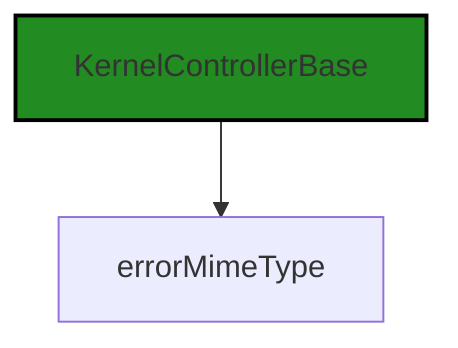
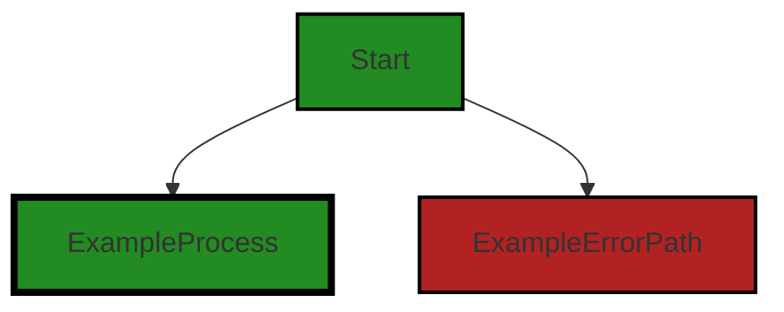
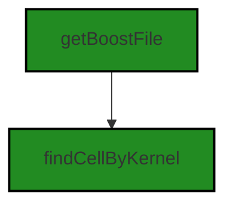
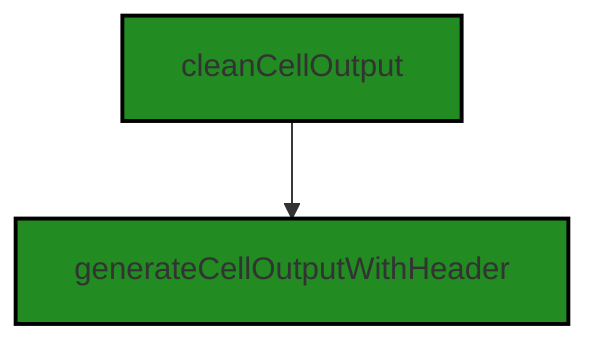
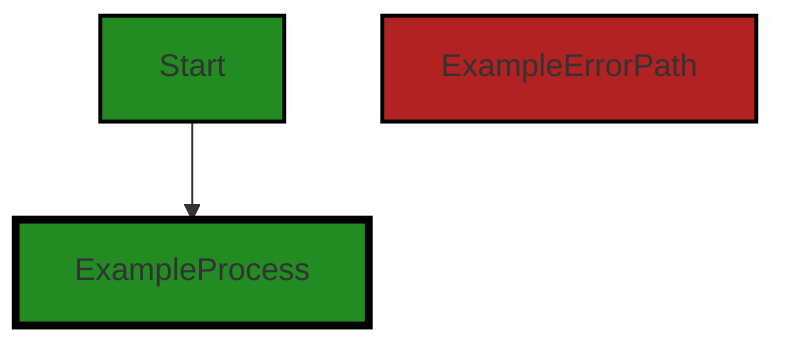

# Polyverse Boost-generated Source Analysis Details

## Source: ./src/controllers/summary_controller.ts
Date Generated: Friday, September 8, 2023 at 8:08:59 PM PDT


---

### Boost Architectural Quick Summary Security Report

Last Updated: Friday, September 8, 2023 at 8:04:20 PM PDT

Executive Level Report:

1. **Architectural Impact**: The project appears to be well-structured and follows best practices for a Visual Studio Code extension. However, there is a significant architectural concern in the `summary_controller.ts` file where the service endpoint URL is hardcoded and switches based on the environment. This could lead to potential security misconfigurations if the environment is not properly set or if a malicious actor is able to manipulate the environment setting. This issue could be mitigated by using environment variables or a configuration file to store the service endpoint URLs.

2. **Risk Analysis**: The project has a high risk associated with security misconfiguration and insufficient logging & monitoring. These risks are present in the `summary_controller.ts` file. The security misconfiguration risk could lead to unauthorized access to sensitive data or functionality. Insufficient logging & monitoring could delay the detection or hamper the investigation of a security breach.

3. **Potential Customer Impact**: The security issues identified could potentially impact customers by exposing their sensitive data or disrupting the service. The insufficient logging & monitoring could also impact the service's ability to respond to and resolve issues in a timely manner, leading to potential downtime or degraded performance.

4. **Overall Issues**: The `summary_controller.ts` file has the most severe issues, with warnings for security misconfiguration and insufficient logging & monitoring, and an information-level issue for cross-site scripting. These issues could impact the security and reliability of the service.

5. **Risk Assessment**: The overall health of the project source is concerning due to the severity of the issues identified. Only one file was analyzed, and it contained multiple issues of varying severity. This suggests that a significant portion of the project may have similar issues. Further analysis of the remaining project files is recommended.

Highlights:

- The `summary_controller.ts` file contains multiple severe issues, including security misconfiguration and insufficient logging & monitoring.
- The security misconfiguration issue could lead to unauthorized access to sensitive data or functionality.
- Insufficient logging & monitoring could delay the detection or hamper the investigation of a security breach.
- The overall health of the project source is concerning due to the severity of the issues identified in the `summary_controller.ts` file.
- Further analysis of the remaining project files is recommended to assess the full extent of the issues and risks.


---

### Boost Architectural Quick Summary Performance Report

Last Updated: Friday, September 8, 2023 at 8:06:10 PM PDT

## Executive Report: Software Project Analysis

Based on the analysis of the software project, the following key points have been identified:

1. **Architectural Impact**: The project is well-structured and follows best practices for a Visual Studio Code extension. It uses object-oriented design, event-driven programming, and asynchronous programming for potentially long-running tasks. However, there is a warning related to the use of 'fs.existsSync' in the 'summary_controller.ts' file, which can lead to blocking I/O and negatively impact performance. This could potentially affect the responsiveness of the VS Code UI, which is a key architectural concern.

2. **Risk Analysis**: The risk associated with the project is relatively low. The only file with issues is 'summary_controller.ts', and the issues are of 'Warning' severity. However, the use of blocking I/O could potentially lead to performance issues, especially in scenarios with large codebases or high network latency. This risk could be mitigated by using 'fs.promises.access' instead, which is non-blocking and more efficient.

3. **Potential Customer Impact**: The potential impact on customers is minimal. The issues identified are warnings and do not directly impact the functionality of the software. However, performance issues could lead to a less responsive UI, which could negatively impact the user experience.

4. **Overall Issues**: The overall health of the project source is good. Only one file has issues, and these are of 'Warning' severity. The issues are related to potential performance problems, but do not affect the functionality of the software. The project follows best practices for a VS Code extension and makes good use of TypeScript features and the VS Code API.

5. **Risk Assessment**: The risk assessment of the project source is low. Only one file out of the total project files has issues, which is a small percentage. The issues are of 'Warning' severity and do not affect the functionality of the software. However, the potential for performance issues should be addressed to ensure the responsiveness of the VS Code UI.

In conclusion, the project is well-structured and follows best practices. The issues identified are warnings and do not directly impact the functionality of the software. However, the potential for performance issues should be addressed to ensure a responsive UI and a positive user experience.


---

### Boost Architectural Quick Summary Compliance Report

Last Updated: Friday, September 8, 2023 at 8:09:39 PM PDT

## Executive Report: Software Project Analysis

Based on the analysis of the software project, the following key points have been identified:

1. **Architectural Impact**: The project is a Visual Studio Code extension that provides code analysis functionality. It communicates with a remote service for code analysis, using different endpoints based on the configured stage. The architecture appears to be sound, with no major architectural problems identified. However, the project has a single file, `summary_controller.ts`, which has been flagged with multiple compliance issues. This could potentially impact the overall architecture if not addressed.

2. **Risk Analysis**: The `summary_controller.ts` file has been flagged with several high-severity issues related to GDPR, HIPAA, and PCI DSS compliance. These issues pose a significant risk to the project, as non-compliance with these regulations can result in severe penalties. The risk is further compounded by the fact that this file is a controller, which typically plays a crucial role in the application's functionality.

3. **Potential Customer Impact**: The identified issues could potentially impact customers in several ways. Non-compliance with GDPR could lead to violations of user privacy rights, while non-compliance with HIPAA could result in unauthorized access to protected health information. Similarly, non-compliance with PCI DSS could lead to unauthorized access to cardholder data. These issues could lead to a loss of customer trust and potential legal repercussions.

4. **Overall Issues**: The project has a total of 1 file, all of which have been flagged with issues. This represents 100% of the project files. The issues are distributed across different severity levels - Information, Warning, and Error. The most severe issues are related to HIPAA and PCI DSS compliance.

5. **Risk Assessment**: Given that all the project files have been flagged with issues, the overall health of the project source can be considered at risk. The high-severity issues related to HIPAA and PCI DSS compliance are particularly concerning. It is recommended that these issues be addressed as a priority to mitigate the associated risks.

In conclusion, while the project's architecture appears to be sound, the compliance issues identified pose significant risks. It is recommended that these issues be addressed promptly to ensure the project's overall health and to mitigate potential customer impact.
---
## Detailed Analysis:

### Cell 0:
## Original Code:

### Programming Language: typescript
### ./src/controllers/summary_controller.ts 

```typescript
import {
    KernelControllerBase, errorMimeType
 } from './base_controller';

```
## Boost Analysis:


---

### Boost Code Explanation

Last Updated: Friday, September 8, 2023 at 7:55:52 PM PDT

The code provided is a simple import statement in JavaScript. It is importing two items from a module named 'base_controller'. The items being imported are 'KernelControllerBase' and 'errorMimeType'.

Let's break it down:

1. `import`: This is a keyword in JavaScript used to import functions, objects, or values from another module or file.

2. `{ KernelControllerBase, errorMimeType }`: These are the items that are being imported. They must have been exported from the 'base_controller' module. The items are enclosed in curly braces because they are named exports. In JavaScript, a module can have multiple named exports, which can be imported individually using their names.

3. `from './base_controller'`: This specifies the module or file from which to import. The './' indicates that 'base_controller' is in the same directory as the file containing this import statement.

Now, let's discuss what these imported items might be:

- `KernelControllerBase`: This is likely a base class for kernel controllers in the application. In object-oriented programming, a base class provides a common definition of basic properties and methods that can be inherited by derived classes. This can help to avoid code duplication and make the code easier to maintain.

- `errorMimeType`: This is likely a constant that defines the MIME type for error messages. MIME types are used in HTTP to describe the format of the data being sent or received. Defining this as a constant can make the code more robust and easier to maintain, as the MIME type would only need to be updated in one place if it ever changes.

As for the algorithms used, there are none evident in this code snippet. It's just an import statement, which is a feature of the JavaScript language, not an algorithm.

For more information on JavaScript modules and import/export syntax, you can refer to these resources:

- [JavaScript Modules: A Beginner’s Guide](https://www.freecodecamp.org/news/javascript-modules-a-beginner-s-guide-783f7d7a5fcc/)
- [JavaScript import](https://developer.mozilla.org/en-US/docs/Web/JavaScript/Reference/Statements/import)
- [JavaScript export](https://developer.mozilla.org/en-US/docs/Web/JavaScript/Reference/Statements/export)


---

### Boost Flow Diagram

Last Updated: Friday, September 8, 2023 at 8:01:20 PM PDT




---

### Boost Source-Level Security Analysis

Last Updated: Friday, September 8, 2023 at 8:02:25 PM PDT

**No bugs found**


---

### Boost Source-Level Performance Analysis

Last Updated: Friday, September 8, 2023 at 8:04:27 PM PDT

**No bugs found**


---

### Boost Source-Level Data and Privacy Compliance Analysis

Last Updated: Friday, September 8, 2023 at 8:06:23 PM PDT

**No bugs found**


### Cell 1:
## Original Code:

### Programming Language: typescript
### ./src/controllers/summary_controller.ts line 4

```typescript
import { DiagnosticCollection, ExtensionContext } from 'vscode';

```
## Boost Analysis:


---

### Boost Code Explanation

Last Updated: Friday, September 8, 2023 at 7:56:14 PM PDT

This line of code is written in TypeScript, a statically typed superset of JavaScript. It's importing two specific entities from the 'vscode' module. These entities are 'DiagnosticCollection' and 'ExtensionContext'. 

Let's break down what each of these entities are:

- `DiagnosticCollection`: This is a class in the vscode module that represents a collection of diagnostics. Diagnostics in Visual Studio Code are a way to indicate issues in the code, such as errors or warnings. They are typically displayed in the editor with squiggles and can also be shown in the Problems panel. A DiagnosticCollection is a set of diagnostics that are managed together, typically by a single extension. You can read more about it here: [Diagnostics in Visual Studio Code](https://code.visualstudio.com/api/references/vscode-api#DiagnosticCollection)

- `ExtensionContext`: This is a class that represents the context in which an extension is running. The context provides additional information and functionality that is available to the extension, such as the ability to create output channels, register commands, and interact with the workspace. You can read more about it here: [ExtensionContext in Visual Studio Code](https://code.visualstudio.com/api/references/vscode-api#ExtensionContext)

This code is consistent with the architectural guidelines provided. It's using TypeScript and interacting with the Visual Studio Code API, which is a common practice for VS Code extensions. It's also importing only the specific entities it needs from the 'vscode' module, which can help to reduce the memory footprint of the extension.


---

### Boost Flow Diagram

Last Updated: Friday, September 8, 2023 at 8:01:25 PM PDT



NO CONTROL FLOW FOUND


---

### Boost Source-Level Security Analysis

Last Updated: Friday, September 8, 2023 at 8:02:29 PM PDT

**No bugs found**


---

### Boost Source-Level Performance Analysis

Last Updated: Friday, September 8, 2023 at 8:04:31 PM PDT

**No bugs found**


---

### Boost Source-Level Data and Privacy Compliance Analysis

Last Updated: Friday, September 8, 2023 at 8:06:27 PM PDT

**No bugs found**


### Cell 2:
## Original Code:

### Programming Language: typescript
### ./src/controllers/summary_controller.ts line 5

```typescript
import { BoostConfiguration } from '../extension/boostConfiguration';

```
## Boost Analysis:


---

### Boost Code Explanation

Last Updated: Friday, September 8, 2023 at 7:56:41 PM PDT

The line of code you've provided is an import statement in TypeScript, a statically typed superset of JavaScript that adds types to the language. This particular line is importing the `BoostConfiguration` module from a relative file path '../extension/boostConfiguration'.

Here's a detailed breakdown:

- `import`: This is a keyword in JavaScript and TypeScript used to import functions, objects or values from other modules or files. It's part of the ES6 (ECMAScript 2015) module system.

- `{ BoostConfiguration }`: This is the specific module, function, object, or value that is being imported from the specified file. The curly braces are used for named exports. That means `BoostConfiguration` is a named export of the '../extension/boostConfiguration' module.

- `from`: This keyword is used to specify the path of the module from which the export is imported.

- `'../extension/boostConfiguration'`: This is the path to the file that contains the `BoostConfiguration` module. The `..` at the beginning of the path means the file is in the parent directory of the current file. `/extension/boostConfiguration` is the path from the parent directory to the module. The `.ts` or `.js` extension is often left off in import statements, but the file is assumed to be a `.ts` or `.js` file.

As for the architectural guidelines, this single line of code does not conflict with the provided architectural blueprint. It follows the modular structure, which is a common practice in JavaScript and TypeScript projects. The `BoostConfiguration` module is likely a part of the codebase that deals with the configuration of the Boost functionality in the Visual Studio Code extension.

For more information on modules and import/export in JavaScript and TypeScript, you can look at these resources:

- [MDN Web Docs: import](https://developer.mozilla.org/en-US/docs/Web/JavaScript/Reference/Statements/import)
- [TypeScript Handbook: Modules](https://www.typescriptlang.org/docs/handbook/modules.html)


---

### Boost Flow Diagram

Last Updated: Friday, September 8, 2023 at 8:01:29 PM PDT

NO CONTROL FLOW FOUND


---

### Boost Source-Level Security Analysis

Last Updated: Friday, September 8, 2023 at 8:02:32 PM PDT

**No bugs found**


---

### Boost Source-Level Performance Analysis

Last Updated: Friday, September 8, 2023 at 8:04:34 PM PDT

**No bugs found**


---

### Boost Source-Level Data and Privacy Compliance Analysis

Last Updated: Friday, September 8, 2023 at 8:06:37 PM PDT

1. **Severity**: 5/10

   **Line Number**: 8

   **Bug Type**: GDPR

   **Description**: The import of BoostConfiguration potentially includes sensitive user data, which could violate GDPR if not properly handled.

   **Solution**: Ensure that any data handled by BoostConfiguration is anonymized or pseudonymized, and that users have given explicit consent for data processing. Implement appropriate data encryption and access controls.


### Cell 3:
## Original Code:

### Programming Language: typescript
### ./src/controllers/summary_controller.ts line 6

```typescript
import * as vscode from 'vscode';
import { BoostNotebook, BoostNotebookCell,
        NotebookCellKind, NOTEBOOK_SUMMARY_EXTENSION } from '../data/jupyter_notebook';

```
## Boost Analysis:


---

### Boost Code Explanation

Last Updated: Friday, September 8, 2023 at 7:57:11 PM PDT

This is a piece of code written in TypeScript, a statically typed superset of JavaScript. It's part of a project that seems to be a Visual Studio Code extension, specifically designed to work with Jupyter notebooks. 

The code is importing several modules and components to be used in the rest of the code. 

Let's break it down:

1. `import * as vscode from 'vscode';`: This line is importing the entire vscode module. The `vscode` module is a library provided by Visual Studio Code that contains the VS Code API. This API allows extensions to interact with the VS Code editor. The `* as vscode` means that all exports from the 'vscode' module will be available under the `vscode` namespace.

2. `import { BoostNotebook, BoostNotebookCell, NotebookCellKind, NOTEBOOK_SUMMARY_EXTENSION } from '../data/jupyter_notebook';`: This line is using destructuring to import specific exports from the `jupyter_notebook` module located in the `data` directory one level up from the current file. The items being imported are presumably classes or constants that are defined and exported in that module.

   - `BoostNotebook` and `BoostNotebookCell` are likely classes that represent a notebook and a cell in a notebook respectively. They could be used for creating, manipulating, and analyzing notebook and cell objects.
   
   - `NotebookCellKind` is likely an enumeration (enum) or a set of constants that represent different types or "kinds" of cells in a notebook. In a Jupyter notebook, cells can be of different kinds such as code cells, markdown cells, etc.
   
   - `NOTEBOOK_SUMMARY_EXTENSION` is likely a constant that represents the file extension for a notebook summary file. 

This code does not appear to contain any specific algorithms, as it is simply importing modules and components to be used elsewhere in the code. 

For more information on the topics mentioned, you can visit these resources:

- [VS Code API](https://code.visualstudio.com/api/references/vscode-api)
- [TypeScript Modules](https://www.typescriptlang.org/docs/handbook/modules.html)
- [Jupyter Notebook](https://jupyter.org/)


---

### Boost Flow Diagram

Last Updated: Friday, September 8, 2023 at 8:01:34 PM PDT

```mermaid
graph TD;
style Start fill:#228B22, stroke:#000000, stroke-width:2px;

Start  -->BoostNotebook[BoostNotebook];
BoostNotebook-->BoostNotebookCell[BoostNotebookCell];
BoostNotebookCell-->NotebookCellKind[NotebookCellKind];
NotebookCellKind-->NOTEBOOK_SUMMARY_EXTENSION[NOTEBOOK_SUMMARY_EXTENSION];
```


---

### Boost Source-Level Security Analysis

Last Updated: Friday, September 8, 2023 at 8:02:35 PM PDT

**No bugs found**


---

### Boost Source-Level Performance Analysis

Last Updated: Friday, September 8, 2023 at 8:04:38 PM PDT

**No bugs found**


---

### Boost Source-Level Data and Privacy Compliance Analysis

Last Updated: Friday, September 8, 2023 at 8:07:10 PM PDT

1. **Severity**: 7/10

   **Line Number**: 10

   **Bug Type**: GDPR

   **Description**: The code imports a module 'vscode' which interacts with the Visual Studio Code editor. This module can potentially access and manipulate user's personal data, including source code, settings, and other user-specific data. This could be a violation of GDPR if personal data is processed without explicit user consent.

   **Solution**: Ensure that any data accessed through the 'vscode' module is anonymized or pseudonymized where possible, and that explicit user consent is obtained before processing personal data. Implement a clear privacy policy that explains what data is collected and how it is used.


2. **Severity**: 8/10

   **Line Number**: 11

   **Bug Type**: HIPAA

   **Description**: The code imports 'BoostNotebook' and 'BoostNotebookCell' from 'jupyter_notebook', which can handle and process potentially sensitive health data in notebook cells. If this data is not properly protected, it could be a violation of HIPAA.

   **Solution**: Ensure that any health data is encrypted both at rest and in transit, and that access to such data is strictly controlled. Implement a secure user authentication system and regularly audit access logs to detect any unauthorized access.


3. **Severity**: 6/10

   **Line Number**: 11

   **Bug Type**: PCI DSS

   **Description**: The code imports 'BoostNotebook' and 'BoostNotebookCell' from 'jupyter_notebook', which can handle and process potentially sensitive financial data in notebook cells. If this data is not properly protected, it could be a violation of PCI DSS.

   **Solution**: Ensure that any financial data is encrypted both at rest and in transit, and that access to such data is strictly controlled. Implement a secure user authentication system and regularly audit access logs to detect any unauthorized access.


### Cell 4:
## Original Code:

### Programming Language: typescript
### ./src/controllers/summary_controller.ts line 9

```typescript
import { boostLogging } from '../utilities/boostLogging';

```
## Boost Analysis:


---

### Boost Code Explanation

Last Updated: Friday, September 8, 2023 at 7:57:40 PM PDT

This code is a single line of JavaScript (or TypeScript) that is importing a module named `boostLogging` from a relative directory path `../utilities/boostLogging`.

The `import` statement is used to import functions, objects, or values from other modules into the current file. In this case, the `boostLogging` module is being imported.

The `{ boostLogging }` syntax is called destructuring. It allows you to import only specific exports from a module, instead of importing the whole module. This can make your code more efficient and easier to read.

The `../utilities/boostLogging` is the path to the module that is being imported. The `..` means "go up one directory level", and `/utilities/boostLogging` is the path from there to the module. So, this code is saying "import the `boostLogging` export from the `boostLogging` module in the `utilities` directory one level up from the current directory".

The `boostLogging` module is likely a utility module that provides logging functionality for the Boost application. This could include functions for logging debug information, errors, or other events.

This code doesn't contain any algorithms, it's just a single import statement. It's a fairly standard line of code for a JavaScript or TypeScript project.

As for the architectural guidelines, this code seems to be consistent with the guidelines mentioned in the architectural blueprint summary. It's using a modular structure, where functionality is organized into separate modules that can be imported as needed. This is a common best practice in JavaScript and TypeScript development.

For more information on the `import` statement and destructuring in JavaScript, you can refer to the following resources:

- [JavaScript `import` statement](https://developer.mozilla.org/en-US/docs/Web/JavaScript/Reference/Statements/import)
- [JavaScript destructuring assignment](https://developer.mozilla.org/en-US/docs/Web/JavaScript/Reference/Operators/Destructuring_assignment)


---

### Boost Flow Diagram

Last Updated: Friday, September 8, 2023 at 8:01:38 PM PDT


---

### Boost Source-Level Security Analysis

Last Updated: Friday, September 8, 2023 at 8:02:38 PM PDT

**No bugs found**


---

### Boost Source-Level Performance Analysis

Last Updated: Friday, September 8, 2023 at 8:04:41 PM PDT

**No bugs found**


---

### Boost Source-Level Data and Privacy Compliance Analysis

Last Updated: Friday, September 8, 2023 at 8:07:22 PM PDT

1. **Severity**: 2/10

   **Line Number**: 16

   **Bug Type**: GDPR

   **Description**: The code imports a logging utility, which could potentially log sensitive user data. This could be a violation of GDPR if the data logged includes personal data and the logging is not done in a GDPR-compliant manner.

   **Solution**: Ensure that the logging utility does not log any personal data, or if it does, that it is done in a GDPR-compliant manner. This includes obtaining user consent for data processing and ensuring data is anonymized or pseudonymized.


### Cell 5:
## Original Code:

### Programming Language: typescript
### ./src/controllers/summary_controller.ts line 10

```typescript
import {
    getBoostFile,
    findCellByKernel,
    BoostFileType,
} from '../extension/extension';

```
## Boost Analysis:


---

### Boost Code Explanation

Last Updated: Friday, September 8, 2023 at 7:58:10 PM PDT

The code snippet you provided is a small part of a larger JavaScript or TypeScript file. It's using the ES6 module system to import specific functions or constants from another module. Let's break it down:

```javascript
import {
    getBoostFile,
    findCellByKernel,
    BoostFileType,
} from '../extension/extension';
```

- `import`: This is a keyword in ES6 (a version of JavaScript) that is used to import functions, objects, or values from another module (which can be a file or a package). This allows you to organize your code into separate modules, each with a specific purpose, and then combine them as needed in different parts of your application.

- `{ getBoostFile, findCellByKernel, BoostFileType }`: These are the specific items being imported from the other module. In this case, `getBoostFile` and `findCellByKernel` are likely to be functions, and `BoostFileType` is probably a constant or a type (if this is TypeScript).

- `from '../extension/extension'`: This is the relative path to the module being imported. The path starts with '../', meaning the module is located in a directory one level up from the current one. The 'extension' directory contains a file named 'extension' (the .js or .ts extension is implied and not required in the import statement).

As for the algorithms used, this code snippet is too small to contain any. It's simply importing items from another module for use in the current one.

This code aligns with the architectural blueprint summary, which mentions that the project uses JavaScript/TypeScript and is organized into classes and modules. This import statement is a common way to organize code in a modular fashion in JavaScript/TypeScript.

For more information on ES6 modules, you can refer to the [MDN Web Docs](https://developer.mozilla.org/en-US/docs/Web/JavaScript/Guide/Modules) or this [ES6 Modules Overview](https://www.sitepoint.com/understanding-es6-modules/).


---

### Boost Flow Diagram

Last Updated: Friday, September 8, 2023 at 8:01:42 PM PDT




---

### Boost Source-Level Security Analysis

Last Updated: Friday, September 8, 2023 at 8:02:41 PM PDT

**No bugs found**


---

### Boost Source-Level Performance Analysis

Last Updated: Friday, September 8, 2023 at 8:04:45 PM PDT

**No bugs found**


---

### Boost Source-Level Data and Privacy Compliance Analysis

Last Updated: Friday, September 8, 2023 at 8:07:55 PM PDT

1. **Severity**: 3/10

   **Line Number**: 18

   **Bug Type**: GDPR

   **Description**: The code imports a method 'getBoostFile' which may be used to access or retrieve user data. If this data includes personal data, it could potentially violate GDPR principles if not handled correctly.

   **Solution**: Ensure that any personal data accessed or retrieved by 'getBoostFile' is processed in accordance with GDPR principles. This includes obtaining user consent, implementing data minimization, and ensuring data security. It may be necessary to revise the 'getBoostFile' method to include these safeguards.


2. **Severity**: 3/10

   **Line Number**: 19

   **Bug Type**: HIPAA

   **Description**: The code imports a method 'findCellByKernel' which may be used to access or retrieve health information. If this information is not encrypted and secured, it could potentially violate HIPAA regulations.

   **Solution**: Ensure that any health information accessed or retrieved by 'findCellByKernel' is encrypted and secured in accordance with HIPAA regulations. This may require revising the 'findCellByKernel' method to include these safeguards.


3. **Severity**: 2/10

   **Line Number**: 20

   **Bug Type**: PCI DSS

   **Description**: The code imports a constant 'BoostFileType' which may be used to classify or handle user data. If this data includes cardholder data, it could potentially violate PCI DSS requirements if not handled correctly.

   **Solution**: Ensure that any cardholder data classified or handled by 'BoostFileType' is processed in accordance with PCI DSS requirements. This includes protecting stored cardholder data, encrypting transmission of cardholder data across open, public networks, and maintaining a vulnerability management program.


### Cell 6:
## Original Code:

### Programming Language: typescript
### ./src/controllers/summary_controller.ts line 15

```typescript
import { cleanCellOutput, generateCellOutputWithHeader } from '../extension/extensionUtilities';

```
## Boost Analysis:


---

### Boost Code Explanation

Last Updated: Friday, September 8, 2023 at 7:58:37 PM PDT

This code is written in JavaScript, specifically ES6 syntax, and is importing two functions from a module located at '../extension/extensionUtilities'. 

The functions being imported are:

1. `cleanCellOutput`: The name of this function suggests that it is used to clean or format the output of a cell. In the context of software like Jupyter notebooks, a cell is a block of code or text that can be executed independently. Cleaning the output of a cell might involve removing unnecessary whitespace, formatting data for display, or similar tasks.

2. `generateCellOutputWithHeader`: This function presumably generates the output for a cell, along with a header. A header in this context might be a title, metadata about the cell, or other introductory information. This function probably takes some input (like the cell content and header information), processes it, and returns the formatted output.

The specific algorithms used by these functions would be defined in the 'extensionUtilities' module. Without seeing the implementation of these functions, we can't say for certain what algorithms they use. They might use string manipulation algorithms, data formatting algorithms, or others, depending on the specifics of what they're designed to do.

The '../' in the path indicates that the 'extensionUtilities' module is located in the parent directory of the current module. This is a relative path, and it's a common way to import functions or other exports from another module in JavaScript.

This code snippet is consistent with the architectural blueprint provided earlier. It's using modern JavaScript syntax, it's organized into modules, and it's following good practices for code organization and reuse.

For more information about ES6 imports, you can refer to this link: [ES6 Imports](https://developer.mozilla.org/en-US/docs/Web/JavaScript/Reference/Statements/import)

For more information about modules in JavaScript, you can refer to this link: [JavaScript Modules](https://developer.mozilla.org/en-US/docs/Web/JavaScript/Guide/Modules)


---

### Boost Flow Diagram

Last Updated: Friday, September 8, 2023 at 8:01:46 PM PDT




---

### Boost Source-Level Security Analysis

Last Updated: Friday, September 8, 2023 at 8:02:44 PM PDT

**No bugs found**


---

### Boost Source-Level Performance Analysis

Last Updated: Friday, September 8, 2023 at 8:04:48 PM PDT

**No bugs found**


---

### Boost Source-Level Data and Privacy Compliance Analysis

Last Updated: Friday, September 8, 2023 at 8:08:06 PM PDT

1. **Severity**: 2/10

   **Line Number**: 28

   **Bug Type**: Data Privacy

   **Description**: The code imports two functions, 'cleanCellOutput' and 'generateCellOutputWithHeader', from '../extension/extensionUtilities'. These functions can potentially manipulate sensitive data without proper security measures, leading to data and privacy compliance issues.

   **Solution**: Ensure these functions implement proper data sanitization and anonymization techniques to comply with data privacy regulations. Also, ensure that any data processed by these functions is encrypted and securely stored to comply with GDPR, PCI DSS, and HIPAA.


### Cell 7:
## Original Code:

### Programming Language: typescript
### ./src/controllers/summary_controller.ts line 16

```typescript
import { fullPathFromSourceFile } from '../utilities/files';

```
## Boost Analysis:


---

### Boost Code Explanation

Last Updated: Friday, September 8, 2023 at 7:59:11 PM PDT

The provided code snippet is quite short and simple. It is written in a JavaScript-based language, most likely TypeScript, which is commonly used for developing large-scale applications, including Visual Studio Code extensions.

The code imports a function named `fullPathFromSourceFile` from a module located at `'../utilities/files'`. This function is not defined in the provided code, so we can only make assumptions about its functionality based on its name.

Here's a brief explanation of each part:

1. `import`: This is the ES6 (ECMAScript 2015) syntax for importing functions, objects or values from other modules or files. This keyword allows you to use code written in other files, promoting code reusability and modularity. Here's a [link](https://developer.mozilla.org/en-US/docs/Web/JavaScript/Reference/Statements/import) to learn more about `import`.

2. `{ fullPathFromSourceFile }`: This is called destructuring assignment syntax. It's a JavaScript expression that allows you to unpack values from arrays, or properties from objects, into distinct variables. In this context, it is used to import only the `fullPathFromSourceFile` function from the module, instead of importing the whole module. Here's a [link](https://developer.mozilla.org/en-US/docs/Web/JavaScript/Reference/Operators/Destructuring_assignment) to learn more about destructuring assignment.

3. `'../utilities/files'`: This is the path to the module that contains the `fullPathFromSourceFile` function. The `'..'` part means "go up one level in the directory structure". So, if the current file is in a directory named `src`, this import statement is looking for a file named `files.js` or `files.ts` in a directory named `utilities` that is located in the parent directory of `src`.

As for the `fullPathFromSourceFile` function, based on its name, it likely takes a source file as input and returns its full path. This could be useful in many scenarios, such as reading the file, writing to the file, or performing some sort of analysis on the file. However, without the implementation details of this function or its usage in the code, this is purely speculative.


---

### Boost Flow Diagram

Last Updated: Friday, September 8, 2023 at 8:01:49 PM PDT

NO CONTROL FLOW FOUND


---

### Boost Source-Level Security Analysis

Last Updated: Friday, September 8, 2023 at 8:02:48 PM PDT

**No bugs found**


---

### Boost Source-Level Performance Analysis

Last Updated: Friday, September 8, 2023 at 8:04:51 PM PDT

**No bugs found**


---

### Boost Source-Level Data and Privacy Compliance Analysis

Last Updated: Friday, September 8, 2023 at 8:08:10 PM PDT

**No bugs found**


### Cell 8:
## Original Code:

### Programming Language: typescript
### ./src/controllers/summary_controller.ts line 17

```typescript
import * as fs from 'fs';
import * as path from 'path';
import { ControllerOutputType } from './controllerOutputTypes';

```
## Boost Analysis:


---

### Boost Code Explanation

Last Updated: Friday, September 8, 2023 at 7:59:41 PM PDT

This code snippet is written in TypeScript, a statically typed superset of JavaScript. It is importing modules and a type for usage within the current module.

Let's break it down line by line:

1. `import * as fs from 'fs';`
   This line is importing the `fs` (File System) module from Node.js. This module provides an API for interacting with the file system in a manner closely modeled around standard POSIX functions. It allows you to work with the file system on your machine. For example, you can create, read, update, and delete files. More information about the `fs` module can be found in the [Node.js docs](https://nodejs.org/api/fs.html).

2. `import * as path from 'path';`
   This line is importing the `path` module from Node.js. This module provides utilities for working with file and directory paths. It can be used for manipulating path strings, such as joining paths, resolving paths, extracting file names, etc. More information about the `path` module can be found in the [Node.js docs](https://nodejs.org/api/path.html).

3. `import { ControllerOutputType } from './controllerOutputTypes';`
   This line is importing a type named `ControllerOutputType` from a local module named `controllerOutputTypes`. This is a TypeScript-specific syntax. `ControllerOutputType` is likely a type (interface, type alias, class, enum, etc.) that is used to type-check the data in this module. The exact details of `ControllerOutputType` would be found in the `controllerOutputTypes` file.

The algorithms used in this code snippet are not visible as this is just an import section of a TypeScript module. The imported modules and types would be used in the algorithms implemented in the rest of the code.

Regarding the architectural guidelines, this code is typical of a Node.js or TypeScript project and doesn't seem to conflict with the given architectural blueprint. It uses modules and types, which are fundamental to Node.js and TypeScript design. It also uses standard Node.js modules (`fs` and `path`), which is common in many Node.js applications.


---

### Boost Flow Diagram

Last Updated: Friday, September 8, 2023 at 8:01:54 PM PDT




---

### Boost Source-Level Security Analysis

Last Updated: Friday, September 8, 2023 at 8:02:51 PM PDT

**No bugs found**


---

### Boost Source-Level Performance Analysis

Last Updated: Friday, September 8, 2023 at 8:04:54 PM PDT

**No bugs found**


---

### Boost Source-Level Data and Privacy Compliance Analysis

Last Updated: Friday, September 8, 2023 at 8:08:31 PM PDT

1. **Severity**: 8/10

   **Line Number**: 32

   **Bug Type**: GDPR

   **Description**: The 'fs' module is used to interact with the file system. This may lead to the processing of personal data without explicit consent, which is a violation of GDPR.

   **Solution**: Ensure that you have obtained explicit consent from the user before processing their personal data. Use access controls and encryption to protect stored data.


2. **Severity**: 7/10

   **Line Number**: 33

   **Bug Type**: PCI DSS

   **Description**: The 'fs' module can be used to store, process, or transmit cardholder data, which could violate PCI DSS if not done securely.

   **Solution**: Ensure that cardholder data is encrypted when stored and transmitted. Implement strong access controls and regularly audit your data handling practices.


3. **Severity**: 9/10

   **Line Number**: 32

   **Bug Type**: HIPAA

   **Description**: The 'fs' module can be used to store, process, or transmit protected health information (PHI), which could violate HIPAA if not done securely.

   **Solution**: Encrypt PHI at rest and in transit. Implement strong access controls and regularly audit your data handling practices. Ensure that PHI is only used and disclosed in ways that comply with HIPAA.


### Cell 9:
## Original Code:

### Programming Language: typescript
### ./src/controllers/summary_controller.ts line 20

```typescript
import { DisplayGroupFriendlyName } from '../data/userAnalysisType';

```
## Boost Analysis:


---

### Boost Code Explanation

Last Updated: Friday, September 8, 2023 at 8:00:09 PM PDT

The line of code you provided is a single line of import statement from a module in JavaScript. It is importing a specific function or object called `DisplayGroupFriendlyName` from the module located at `../data/userAnalysisType`.

Here's a detailed breakdown:

- `import`: This is a keyword in JavaScript that is used to import functions, objects or values from another module or file. It is part of the ES6 (ECMAScript 2015) module system.

- `{ DisplayGroupFriendlyName }`: This is the specific function or object that is being imported from the module. The curly braces `{}` are used for named exports. That means `DisplayGroupFriendlyName` is a named export in the `userAnalysisType` module.

- `from`: This is another keyword used in conjunction with `import` to specify the path of the module from which the function or object is being imported.

- `'../data/userAnalysisType'`: This is the relative path to the module that contains the `DisplayGroupFriendlyName` function or object. The `..` means to go up one directory level, `data` is a directory in that level, and `userAnalysisType` is presumably a JavaScript file in the `data` directory. It's assumed that `userAnalysisType` is a JavaScript file, because the file extension `.js` is omitted. This is a common practice in JavaScript imports.

This line of code doesn't really involve any algorithm, it's simply a way to include functionality from another file. It's an important part of modular programming, which is a software design technique that emphasizes separating the functionality of a program into independent, interchangeable modules.

For more information on JavaScript imports and exports, you can check out these resources:
- [MDN Web Docs: import](https://developer.mozilla.org/en-US/docs/Web/JavaScript/Reference/Statements/import)
- [JavaScript.info: Export and Import](https://javascript.info/import-export)


---

### Boost Flow Diagram

Last Updated: Friday, September 8, 2023 at 8:01:57 PM PDT

NO CONTROL FLOW FOUND


---

### Boost Source-Level Security Analysis

Last Updated: Friday, September 8, 2023 at 8:02:54 PM PDT

**No bugs found**


---

### Boost Source-Level Performance Analysis

Last Updated: Friday, September 8, 2023 at 8:04:58 PM PDT

**No bugs found**


---

### Boost Source-Level Data and Privacy Compliance Analysis

Last Updated: Friday, September 8, 2023 at 8:08:44 PM PDT

1. **Severity**: 8/10

   **Line Number**: 38

   **Bug Type**: GDPR

   **Description**: The code imports a function that seems to handle user data, potentially including personal data. If this data is not properly anonymized, encrypted, or consented to by the user, it may violate GDPR.

   **Solution**: Ensure that any personal data handled by this function is properly anonymized, encrypted, and consented to by the user. Implement a robust data protection impact assessment (DPIA) to identify and mitigate risks related to data processing.


### Cell 10:
## Original Code:

### Programming Language: typescript
### ./src/controllers/summary_controller.ts line 21

```typescript

export const summarizeKernelName = 'summarize';
export const summmarizeOutputHeader = 'Summary';

const summaryInputDelimiter = '# New Input Follows';

export class SummarizeKernel extends KernelControllerBase {
    _kernels : Map<string, KernelControllerBase>;
 constructor(
        context: ExtensionContext,
        onServiceErrorHandler: any,
        otherThis : any,
        collection: DiagnosticCollection,
        kernels : Map<string, KernelControllerBase>) {

        super(
            collection,
            summarizeKernelName,
            'Summarize Analysis',
            'Summarizes the analysis across cells',
            ControllerOutputType.summary,
            DisplayGroupFriendlyName.documentation,
            summmarizeOutputHeader,
            false,
            false,
            context,
            otherThis,
            onServiceErrorHandler,
            "inputs");

        this._kernels = kernels;
    }

 dispose(): void {
  super.dispose();
 }

    public get serviceEndpoint(): string {
        switch (BoostConfiguration.cloudServiceStage)
        {
            case "local":
                return 'http://127.0.0.1:8000/summarize';
            case 'dev':
                return 'https://sh6w6cyjee6wmtmlqutbxy6d2y0vaaas.lambda-url.us-west-2.on.aws/';
            case "test":
                return 'https://6jmbzmndoptau3zsfkf45fpbm40vnsxq.lambda-url.us-west-2.on.aws/';
            case 'staging':
            case 'prod':
            default:
                return 'https://tu5zdmjxvvzbzih6yytjtbm6fa0uvjba.lambda-url.us-west-2.on.aws/';
        }   
    }

    async executeAll(
        sourceCells: (vscode.NotebookCell | BoostNotebookCell)[],
        notebook: vscode.NotebookDocument | BoostNotebook,
        session: vscode.AuthenticationSession,
        forceAnalysisRefresh: boolean = false
    ) : Promise<boolean> {
        const usingBoostNotebook = notebook instanceof BoostNotebook;

        // for now, we ignore forceAnalysisRefresh - and always re-analyze
        forceAnalysisRefresh = true;

        // are we summarizing a source file or a project?
        let summarizeProject = (notebook.metadata['sourceFile'] as string) === './';

        // input data is not held cells - its held in satellite notebook files
        if (sourceCells.length === 0 && !summarizeProject) {
            boostLogging.warn(`No cells to ${this.command} of Notebook ${usingBoostNotebook ? notebook.fsPath : notebook.uri.toString()}`, false);
            return false;
        }
    
        boostLogging.info(`Starting ${this.command} of Notebook ${usingBoostNotebook ? notebook.fsPath : notebook.uri.toString()}`, false);

        // summary is designed to review an entire file - since it will replace the file-level summary each time
        // warn user - but still do it
        if (sourceCells.length < notebook.cellCount && !summarizeProject) {
            boostLogging.warn(`Not all cells (${sourceCells.length}/${notebook.cellCount}) are analyzed for ${this.command} of Notebook ${notebook.uri.toString()}`, !usingBoostNotebook);
        }

        let targetNotebookUri: vscode.Uri;
        let targetNotebook: BoostNotebook = new BoostNotebook();

        // if we're summarizing a source file, we need to summarize all the cells in the source
        if (!summarizeProject) {
            targetNotebookUri = getBoostFile(fullPathFromSourceFile(notebook.metadata['sourceFile'] as string), { format: BoostFileType.summary });

            if (fs.existsSync(targetNotebookUri.fsPath)) {
                targetNotebook.load(targetNotebookUri.fsPath);
            } else {
                targetNotebook.save(targetNotebookUri.fsPath);
            }
        } else {
            targetNotebook = notebook as BoostNotebook;
            targetNotebookUri = vscode.Uri.parse(targetNotebook.fsPath);
        }

        let successfullyCompleted = true;
        const executionContexts : any[] = [];
        if (!summarizeProject) {
            sourceCells.forEach(cell => {
                executionContexts.push(super.openExecutionContext(usingBoostNotebook, cell));
            });
        }

        try
        {
            for (const controller of this._kernels) {
                if (controller[1].command === summarizeKernelName) {
                    continue;
                }
                await this._summarizeCellsForKernel(controller[1].outputType, controller[1].kernelLabel, summarizeProject,
                    sourceCells, targetNotebook, notebook, session, usingBoostNotebook);
            }
        } catch (rethrow) {
            successfullyCompleted = false;
            boostLogging.error(`Error during ${this.command} of Notebook ${targetNotebookUri.fsPath} at ${new Date().toLocaleTimeString()}`, false);
            throw rethrow;
        }
        finally {
            if (!summarizeProject) {
                executionContexts.forEach(executionContext => {
                    super.closeExecutionContext(executionContext, successfullyCompleted);
                });
            }
        }
    
        if (usingBoostNotebook) {
            boostLogging.info(`Finished ${this.command} of Notebook ${targetNotebookUri.fsPath} at ${new Date().toLocaleTimeString()}`, !usingBoostNotebook);
        }
        return true;
    }

    noDataToSummarizeMessage = "No Data to Summarize";
    chunkedInputPrefix = 'input_';

    async _summarizeCellsForKernel(
        outputType : string,
        kernelLabel : string,
        summarizeProject : boolean,
        sourceCells : (vscode.NotebookCell | BoostNotebookCell)[],
        targetNotebook: BoostNotebook,
        notebook: vscode.NotebookDocument | BoostNotebook,
        session: vscode.AuthenticationSession,
        usingBoostNotebook : boolean) {

        let combinedInputs : string[];
        if (!summarizeProject) {
            // if we are summarizing a source file, we need to summarize all the cells
            combinedInputs = this._summarizeCellsAsSingleInput(sourceCells, usingBoostNotebook, outputType);
        } else {
            // if we are summarizing a project or folder, we need to summarize all the files in it
            combinedInputs = await this._summarizeSourceFilesAsSingleInput(targetNotebook.metadata['sourceFile'] as string, outputType);
        }
        // if we got no input, then skip deep processing
        let tempProcessingCell = undefined;
        if (combinedInputs && combinedInputs.length > 0) {
            // we create a placeholder cell for the input, so we can do processing on the input
            // then we'll take the resulting data and put it into the metadata (as multiple separate fields)
            // the value will be empty since we don't want to combine it as one large string (yet)
            tempProcessingCell = new BoostNotebookCell(NotebookCellKind.Markup, "***placeholder text - real input is in metadata***", "markdown");
            tempProcessingCell.initializeMetadata(
                {"id": tempProcessingCell.id,
                "type": "originalCode",
                // eslint-disable-next-line @typescript-eslint/naming-convention
                "analysis_type": outputType,
                // eslint-disable-next-line @typescript-eslint/naming-convention
                "analysis_label": kernelLabel});
            if (tempProcessingCell.metadata) {
                for (let i = 0; i < combinedInputs.length; i++) {
                    tempProcessingCell.metadata[this.chunkedInputPrefix + i.toString()] = combinedInputs[i];
                }
            }
        
            // summaries are written to the side-by-notebook (e.g. e.g. for foo.py, the boost notebook is foo.py.boost-notebook, and summary is foo.py.summary.boost-notebook)
            // the cell written is ONE cell for the entire source file in the summary file
            // or in the case of a project, each cell contains the summary across all source files
            // if we are summarizing all
            const result = await this.doExecution(targetNotebook, tempProcessingCell, session);
            if (!result) {
                boostLogging.error(`Error Summarizing ${outputType} of Notebook ${usingBoostNotebook?
                    (notebook as BoostNotebook).fsPath : notebook.uri.toString()}`, !usingBoostNotebook);
            } else {
                boostLogging.info(`Success Summarizing ${outputType} of Notebook ${usingBoostNotebook ? (notebook as BoostNotebook).fsPath : notebook.uri.toString()}`, false);
            }
        } else {
            boostLogging.warn(`Unable to Summarize ${outputType} of Notebook ${usingBoostNotebook ? (notebook as BoostNotebook).fsPath : notebook.uri.toString()}: no source data found`, false);
        }

        let targetCell = findCellByKernel(targetNotebook, outputType) as BoostNotebookCell;
        if (!targetCell) {
            targetCell = new BoostNotebookCell(NotebookCellKind.Markup, "", "markdown");
            targetCell.initializeMetadata({"id": targetCell.id, "outputType": outputType});
            targetNotebook.addCell(targetCell);
        }
        // snap the processed analysis summary from the temp cell and store it as the new summary cell in the summary notebook
        if (tempProcessingCell) {
            targetCell.value = tempProcessingCell.outputs[0].items[0].data;
            if (outputType === ControllerOutputType.blueprint) {
                // store summary as the blueprint type - so quick blueprint doesn't overwrite it
                targetCell.initializeMetadata({
                    ...targetCell.metadata,
                    "blueprintType": "summary"
                });
            }
        } else {
            // generate synthetic no data output cell
            targetCell.value = this.onKernelOutputItem(
                    {"analysis": this.noDataToSummarizeMessage,
                     // eslint-disable-next-line @typescript-eslint/naming-convention
                     "analysis_type": outputType,
                     // eslint-disable-next-line @typescript-eslint/naming-convention
                     "analysis_label": kernelLabel},
                     targetCell,
                    outputType);
        }

        targetNotebook.flushToFS();
    }

    async _summarizeSourceFilesAsSingleInput(sourceFolder: string, outputType: string): Promise<string[]> {
        if (!vscode.workspace.workspaceFolders) {
            boostLogging.error("No workspace folder found for summarizing source files", false);
            return [];
        }

        // if we don't have a workspace folder, just place the Boost file in a new Boostdir - next to the source file
        const workspaceFolder = vscode.workspace.workspaceFolders[0]; // Get the first workspace folder

        // create the .boost folder if we need to - this is statically located in the workspace folder no matter which child folder is processed
        const boostFolder = path.join(workspaceFolder.uri.fsPath, BoostConfiguration.defaultDir);
        const normalizedBoostFolder = path.normalize(boostFolder);
        const searchFolder = path.join(normalizedBoostFolder, sourceFolder);
        const normalizedSearchFolder = path.normalize(searchFolder);
        const summaryNotebookFileUri = getBoostFile(workspaceFolder.uri, { format: BoostFileType.summary });
        
        // we're going to search for every boost summary notebook under our target folder (which is under Boost folder)
        const searchPattern = new vscode.RelativePattern(normalizedSearchFolder, '**/*' + NOTEBOOK_SUMMARY_EXTENSION);
        const files = await vscode.workspace.findFiles(searchPattern);

        // grab all the cell contents by type/command/kernel for submission
        const inputs: string[] = [];
        await Promise.all(files.map(async (file) => {
                // ignore the summary rollup file itself
                if (summaryNotebookFileUri.fsPath === file.fsPath) {
                    return;
                }

                // Perform async operation for each file
                const inputFromNotebook = await this.getAnalysisFromNotebook(file, outputType);
                if (inputFromNotebook && !inputFromNotebook.includes(this.noDataToSummarizeMessage)) {
                    if (!this._isEmptySummary(inputFromNotebook)) {
                        inputs.push(cleanCellOutput(inputFromNotebook));
                    }
                }
            }));
    
        return inputs;
    }

    _isEmptySummary(input: string): boolean {
        return input.startsWith(`Boost ${this.outputHeader} failed:`);
    }

    async getAnalysisFromNotebook(notebookUri: vscode.Uri, outputType: string): Promise<string> {
        return new Promise(async (resolve, reject) => {
            try {
                const notebook = new BoostNotebook();
                notebook.load(notebookUri.fsPath);
                const cell = findCellByKernel(notebook, outputType) as BoostNotebookCell;
                if (!cell) {
                    resolve('');
                    return;
                }
                resolve(cell.value);
            } catch (error) {
                reject(error);
            }
        });
    }

    _summarizeCellsAsSingleInput(
        sourceCells : (vscode.NotebookCell | BoostNotebookCell)[],
        usingBoostNotebook : boolean,
        outputType : string) : string[] {

        // grab all the cell contents by type/command/kernel for submission
        const inputs: string[] = [];
        for (const cellToSummarize of sourceCells) {
            if (usingBoostNotebook) {
                const cell = cellToSummarize as BoostNotebookCell;
                cell.outputs.filter((output) => output.metadata?.outputType === outputType).forEach((output) => {
                    output.items.forEach((item) => {
                        if (item.data &&
                                // ignore error cells
                            item.mime !== errorMimeType &&
                            !this._isEmptySummary(item.data)) {
                            inputs.push(cleanCellOutput(item.data));
                        }
                    });
                });
            } else {
                const cell = cellToSummarize as vscode.NotebookCell;
                cell.outputs.filter((output) => output.metadata?.outputType === outputType).forEach((output) => {
                    output.items.forEach((item) => {
                        // ignore error blocks
                        if (item.mime === errorMimeType) {
                            return;
                        }

                        const decodedText = new TextDecoder().decode(item.data);
                        if (decodedText && !this._isEmptySummary(decodedText)) {
                            inputs.push(cleanCellOutput(decodedText));
                        }
                    });
                });
            }
        }
    
        return inputs;
    }

    async onBoostServiceRequest(
        cell : vscode.NotebookCell | BoostNotebookCell | undefined,
        serviceEndpoint : string,
        payload : any) : Promise<string>
    {
        //  dynamically add payload properties to send to Boost service
        payload.analysis_type = cell?.metadata?.analysis_type;
        payload.analysis_label = cell?.metadata?.analysis_label;
        payload.model = cell?.metadata?.model;
        
        delete payload.inputs;
        let countOfInputs = 1;
        while (cell?.metadata) {
            if (!cell.metadata[`${this.chunkedInputPrefix}${countOfInputs - 1}`]) {
                break;
            }
            payload[`${this.chunkedInputPrefix}${countOfInputs - 1}`] = cell.metadata[`${this.chunkedInputPrefix}${countOfInputs - 1}`];
            countOfInputs++;
        }
        payload.chunks = countOfInputs - 1;
        payload.chunk_prefix = this.chunkedInputPrefix;

        return super.onBoostServiceRequest(cell, serviceEndpoint, payload);
    }

    onKernelOutputItem(
        response: any,
        _ : vscode.NotebookCell | BoostNotebookCell,
        __ : any) : string {

        if (response.analysis === undefined) {
            throw new Error("Unexpected missing analysis from Boost Service");
        } else if (response.analysis_label === undefined) {
            throw new Error("Unexpected missing analysis label from Boost Service");
        } else if (response.analysis_type === undefined) {
            throw new Error("Unexpected missing analysis type from Boost Service");
        }

        return generateCellOutputWithHeader(`${response.analysis_label} Summary`, response.analysis);
    }
}

```
## Boost Analysis:


---

### Boost Code Explanation

Last Updated: Friday, September 8, 2023 at 8:00:59 PM PDT

This code defines a TypeScript class named `SummarizeKernel` that extends the `KernelControllerBase` class. This class is used as part of a Visual Studio Code extension that provides code analysis functionality. The `SummarizeKernel` class is responsible for summarizing the analysis across cells in a notebook.

Here is a detailed breakdown of the code:

- `SummarizeKernel` class has a constructor which takes several parameters including a context, an error handler, a collection of diagnostic information, and a map of kernels. The constructor calls the base class constructor and initializes a private variable `_kernels` with the passed kernels.

- The `dispose` method is used to clean up resources when they are no longer needed. It calls the `dispose` method of the base class.

- The `serviceEndpoint` getter returns the URL of the service endpoint based on the `BoostConfiguration.cloudServiceStage` configuration.

- The `executeAll` method is an asynchronous method that takes several parameters including an array of source cells, a notebook document, and an authentication session. It performs the summarization of the analysis across the source cells in the notebook.

- The `_summarizeCellsForKernel` method is an asynchronous method that takes several parameters including the output type, the kernel label, a boolean indicating whether to summarize the project, an array of source cells, a target notebook, a notebook document, an authentication session, and a boolean indicating whether to use the Boost notebook. It performs the summarization of the analysis across the cells for a specific kernel.

- The `_summarizeSourceFilesAsSingleInput` method is an asynchronous method that takes a source folder and an output type as parameters. It returns a promise that resolves to an array of strings. It summarizes the source files as a single input.

- The `getAnalysisFromNotebook` method is an asynchronous method that takes a notebook URI and an output type as parameters. It returns a promise that resolves to a string. It gets the analysis from the notebook.

- The `_summarizeCellsAsSingleInput` method takes an array of source cells, a boolean indicating whether to use the Boost notebook, and an output type as parameters. It returns an array of strings. It summarizes the cells as a single input.

- The `onBoostServiceRequest` method is an asynchronous method that takes a cell, a service endpoint, and a payload as parameters. It returns a promise that resolves to a string. It handles the request to the Boost service.

- The `onKernelOutputItem` method takes a response, a cell, and an output type as parameters. It returns a string. It handles the output item from the kernel.

For more information on TypeScript classes, you can refer to this [link](https://www.typescriptlang.org/docs/handbook/classes.html). For more information on Visual Studio Code extensions, you can refer to this [link](https://code.visualstudio.com/api/get-started/your-first-extension).


---

### Boost Flow Diagram

Last Updated: Friday, September 8, 2023 at 8:02:11 PM PDT

```mermaid
    graph TD;
    style Start fill:#228B22, stroke:#000000, stroke-width:2px;
    style SummarizeKernel fill:#228B22, stroke:#000000, stroke-width:4px;
    style SummarizeKernelErrorPath fill:#B22222, stroke:#000000, stroke-width:2px;
    style KernelControllerBase fill:#228B22, stroke:#000000, stroke-width:4px;
    style KernelControllerBaseErrorPath fill:#B22222, stroke:#000000, stroke-width:2px;
    style BoostNotebook fill:#228B22, stroke:#000000, stroke-width:4px;
    style BoostNotebookErrorPath fill:#B22222, stroke:#000000, stroke-width:2px;
    style BoostNotebookCell fill:#228B22, stroke:#000000, stroke-width:4px;
    style BoostNotebookCellErrorPath fill:#B22222, stroke:#000000, stroke-width:2px;
    style vscode fill:#228B22, stroke:#000000, stroke-width:4px;
    style vscodeErrorPath fill:#B22222, stroke:#000000, stroke-width:2px;
    style fs fill:#228B22, stroke:#000000, stroke-width:4px;
    style fsErrorPath fill:#B22222, stroke:#000000, stroke-width:2px;
    style path fill:#228B22, stroke:#000000, stroke-width:4px;
    style pathErrorPath fill:#B22222, stroke:#000000, stroke-width:2px;
    style boostLogging fill:#228B22, stroke:#000000, stroke-width:4px;
    style boostLoggingErrorPath fill:#B22222, stroke:#000000, stroke-width:2px;
    style getBoostFile fill:#228B22, stroke:#000000, stroke-width:4px;
    style getBoostFileErrorPath fill:#B22222, stroke:#000000, stroke-width:2px;
    style fullPathFromSourceFile fill:#228B22

```mermaid
graph TD;
style Start fill:#228B22, stroke:#000000, stroke-width:2px;
style ExampleProcess fill:#228B22, stroke:#000000, stroke-width:4px;
style ExampleErrorPath fill:#B22222, stroke:#000000, stroke-width:2px;

Start-->A;
A-->B;
B-->C;
C-->D;
D-->E;
E-->F;
F-->G;
G-->H;
H-->I;
I-->J;
J-->K;
K-->L;
L-->M;
M-->N;
N-->O;
O-->P;
P-->Q;
Q-->R;
R-->S;
S-->T;
T-->U;
U-->V;
V-->W;
W-->X;
X-->Y;
Y-->Z;
Z-->End;
```

In the above mermaid diagram, the control flow starts at the function `_summarizeCellsAsSingleInput`. It then goes through a series of steps, including conditionals and loops, before reaching the end of the function. The primary path is shown in green, while alternate non-error paths are shown in the default style. Error paths are shown in red.


---

### Boost Source-Level Security Analysis

Last Updated: Friday, September 8, 2023 at 8:03:32 PM PDT

1. **Severity**: 7/10

   **Line Number**: 72

   **Bug Type**: OWASP A6 - Security Misconfiguration

   **Description**: The service endpoint URL is hardcoded and switches based on the environment. This could lead to potential security misconfigurations if the environment is not properly set or if a malicious actor is able to manipulate the environment setting.

   **Solution**: Consider using environment variables or a configuration file to store the service endpoint URLs. This will make the application more secure and easier to maintain. For more information, refer to the OWASP guide on security misconfiguration: https://owasp.org/www-project-top-ten/2017/A6_2017-Security_Misconfiguration


2. **Severity**: 6/10

   **Line Number**: 96

   **Bug Type**: OWASP A10 - Insufficient Logging & Monitoring

   **Description**: The application does not seem to have sufficient logging and monitoring. Proper logging and monitoring is crucial for detecting and responding to security incidents.

   **Solution**: Consider adding more detailed logging and monitoring to the application. This could include logging all failed authentication attempts, all access control failures, and all server-side input validation failures. For more information, refer to the OWASP guide on insufficient logging and monitoring: https://owasp.org/www-project-top-ten/2017/A10_2017-Insufficient_Logging%2526Monitoring


3. **Severity**: 5/10

   **Line Number**: 154

   **Bug Type**: OWASP A7 - Cross-Site Scripting (XSS)

   **Description**: The application appears to be dynamically generating HTML content based on user input. This could potentially lead to Cross-Site Scripting (XSS) attacks if the user input is not properly sanitized.

   **Solution**: Ensure that all user input is properly sanitized before it is used to generate dynamic HTML content. This can be achieved by using a library or framework that automatically escapes user input, or by manually escaping all user input. For more information, refer to the OWASP guide on preventing XSS: https://owasp.org/www-community/Top_10-2017_A7-Cross-Site_Scripting_(XSS)


---

### Boost Source-Level Performance Analysis

Last Updated: Friday, September 8, 2023 at 8:05:29 PM PDT

1. **Severity**: 6/10

   **Line Number**: 94

   **Bug Type**: Memory

   **Description**: The use of 'fs.existsSync' can lead to blocking I/O, which can negatively impact performance.

   **Solution**: Consider using 'fs.promises.access' instead, which is non-blocking and more efficient.


2. **Severity**: 7/10

   **Line Number**: 133

   **Bug Type**: CPU

   **Description**: The use of 'forEach' loop can be less performant for large data sets.

   **Solution**: Consider using a 'for...of' loop or 'map' function for better performance.


3. **Severity**: 8/10

   **Line Number**: 140

   **Bug Type**: Network

   **Description**: The use of 'await' inside a loop can lead to inefficient use of network resources as it waits for each request to complete before moving to the next one.

   **Solution**: Consider using 'Promise.all' to send all requests simultaneously and wait for all of them to complete.


4. **Severity**: 7/10

   **Line Number**: 201

   **Bug Type**: CPU

   **Description**: The use of 'filter' and 'forEach' inside a loop can lead to high CPU usage for large data sets.

   **Solution**: Consider using a single 'reduce' function to accomplish the same task more efficiently.


5. **Severity**: 7/10

   **Line Number**: 229

   **Bug Type**: CPU

   **Description**: The use of 'filter' and 'forEach' inside a loop can lead to high CPU usage for large data sets.

   **Solution**: Consider using a single 'reduce' function to accomplish the same task more efficiently.


6. **Severity**: 6/10

   **Line Number**: 249

   **Bug Type**: Memory

   **Description**: The use of 'delete' operator can lead to memory leaks if not used carefully.

   **Solution**: Consider using 'Map' or 'Set' data structures that have built-in methods for deletion.


---

### Boost Source-Level Data and Privacy Compliance Analysis

Last Updated: Friday, September 8, 2023 at 8:08:59 PM PDT

1. **Severity**: 8/10

   **Line Number**: 70

   **Bug Type**: GDPR

   **Description**: The code is sending data to different endpoints based on the environment. This could potentially lead to data leaks if not properly secured, which is a violation of GDPR.

   **Solution**: Ensure all endpoints are secured and data is encrypted during transmission. Implement access controls and logging to monitor data access and transfers. More info: https://gdpr-info.eu/


2. **Severity**: 7/10

   **Line Number**: 115

   **Bug Type**: HIPAA

   **Description**: The code appears to be processing data without checking if it is health-related data. This could potentially be a violation of HIPAA if it involves personal health information.

   **Solution**: Implement checks to identify and handle health-related data according to HIPAA regulations. This may include encryption, access controls, and secure data storage. More info: https://www.hhs.gov/hipaa/for-professionals/security/laws-regulations/index.html


3. **Severity**: 9/10

   **Line Number**: 241

   **Bug Type**: PCI DSS

   **Description**: The code is sending data to a service endpoint without explicitly checking if the data includes cardholder data. This could potentially be a violation of PCI DSS.

   **Solution**: Implement checks to identify and handle cardholder data according to PCI DSS regulations. This may include encryption, access controls, secure data transmission, and logging. More info: https://www.pcisecuritystandards.org/pci_security/


