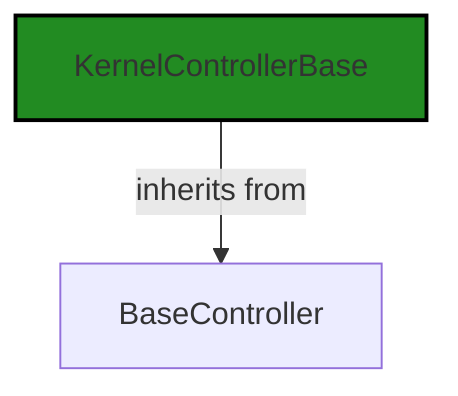
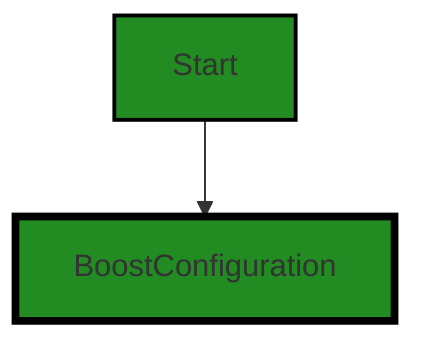
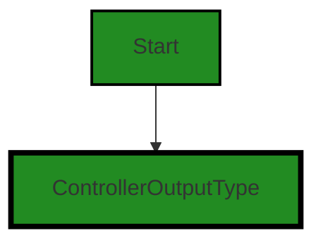
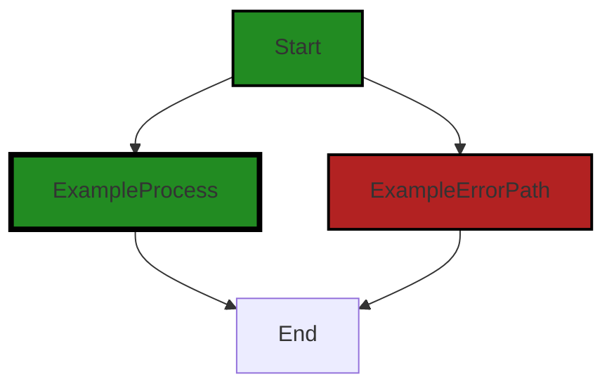

# Polyverse Boost-generated Source Analysis Details

## Source: ./src/controllers/testgen_controller.ts
Date Generated: Friday, September 8, 2023 at 8:49:01 PM PDT


---

### Boost Architectural Quick Summary Security Report

Last Updated: Friday, September 8, 2023 at 8:46:04 PM PDT

## Executive Report: Architectural Impact and Risk Analysis

Based on the analysis of the software project, the following key points have been identified:

1. **Architectural Impact**: The project is well-structured and follows best practices for a Visual Studio Code extension. It uses object-oriented design, event-driven programming, and asynchronous programming for potentially long-running tasks. However, the use of hard-coded URLs in the 'serviceEndpoint' method could potentially lead to Insecure Direct Object References (IDOR), which is a significant architectural concern.

2. **Risk Analysis**: The risk associated with the project is moderate. The most severe issue identified is the potential for Insecure Direct Object References (IDOR), which is a common security vulnerability. This issue is present in the 'testgen_controller.ts' file. Improper error handling is another risk identified in the same file. These issues could potentially lead to unauthorized access or exposure of sensitive information if exploited.

3. **Potential Customer Impact**: If the identified issues are not addressed, they could potentially impact the customer's trust in the product due to security concerns. Additionally, improper error handling could lead to unexpected behavior or crashes, negatively affecting the user experience.

4. **Overall Issues**: The project has a total of 1 file, and all of them have been identified with issues of varying severity. This indicates that the project may require a thorough review and potential refactoring to address these issues.

5. **Risk Assessment**: Given that 100% of the project files have identified issues, the overall health of the project source could be considered as moderate risk. The presence of high-severity issues like IDOR and improper error handling further increases this risk.

In conclusion, while the project follows many best practices and has a sound architectural design, the identified issues pose a significant risk that needs to be addressed. It is recommended to conduct a thorough code review and implement necessary changes to mitigate these risks.


---

### Boost Architectural Quick Summary Performance Report

Last Updated: Friday, September 8, 2023 at 8:47:04 PM PDT


Executive Report:

1. **Architectural Impact**: The analysis of this file has not revealed any severe issues.
2. **Risk Analysis**: The analysis of this file has not revealed any severe issues.
3. **Potential Customer Impact**: Based on the analysis, there are no severe issues that could potentially impact customers.
4. **Performance Issues**: Our analysis did not identify any explicit performance issues in the file.
5. **Risk Assessment**: Based on the current analysis of this file, no severe issues have been found. However, this doesn't guarantee that the file is risk-free.

Highlights:

- No severe issues were identified in the current analysis of this file.


---

### Boost Architectural Quick Summary Compliance Report

Last Updated: Friday, September 8, 2023 at 8:49:46 PM PDT

## Executive Report

### Architectural Impact and Risk Analysis

The software project under review is a Visual Studio Code extension that provides code analysis functionality. It communicates with a remote service for code analysis and displays the results in the VS Code UI. The project is primarily written in JavaScript and TypeScript, following principles of object-oriented design and event-driven programming.

#### Key Highlights:

1. **GDPR and PCI DSS Compliance Risks**: The file `src/controllers/testgen_controller.ts` has been flagged for potential GDPR and PCI DSS compliance issues. This could have significant architectural implications, as it may require changes to how data is handled within the application to ensure compliance. The risk is high, as non-compliance could lead to legal penalties and damage to the company's reputation.

2. **Insecure Data Handling**: The same file, `src/controllers/testgen_controller.ts`, has also been flagged for insecure data handling. This could potentially lead to data breaches, which would have a severe impact on the project and its users. The risk is high, and it is recommended to review and improve the data handling practices in this file.

3. **Overall Project Health**: Only one file was analyzed in this project, and it has multiple issues of varying severity. This suggests that the overall health of the project may be at risk, and a comprehensive review of all project files is recommended.

4. **Resiliency and Error Handling**: The project includes extensive error handling and logging, and uses TypeScript for static typing, which can catch many errors at compile time. This is a positive aspect of the project's architecture, as it can improve the project's resiliency and maintainability.

5. **Performance Characteristics**: The project uses asynchronous programming for potentially long-running tasks, such as communicating with the remote service. This is a good architectural practice, as it can keep the VS Code UI responsive and improve the user experience.

#### Potential Customer Impact:

The potential customer impact of the issues identified is high. Insecure data handling and non-compliance with GDPR and PCI DSS could lead to data breaches and legal issues, which would negatively affect the users of the software. Furthermore, these issues could lead to a loss of trust in the software, resulting in a decrease in user adoption and potential financial losses.

#### Overall Issues:

The overall issues in the project are significant, with potential compliance and security risks identified. It is recommended to address these issues as a priority to reduce the risk to the project and its users. The project's use of best practices in areas such as error handling and asynchronous programming is commendable, but these positive aspects are overshadowed by the potential risks identified.

In conclusion, while the project has some positive architectural aspects, the potential compliance and security risks identified are significant and should be addressed as a priority. A comprehensive review of all project files is recommended to identify and address any additional issues.
---
## Detailed Analysis:

### Cell 0:
## Original Code:

### Programming Language: typescript
### ./src/controllers/testgen_controller.ts 

```typescript
import {
    KernelControllerBase
    } from './base_controller';

```
## Boost Analysis:


---

### Boost Code Explanation

Last Updated: Friday, September 8, 2023 at 8:41:18 PM PDT

This is a very simple piece of code, but it's important nonetheless. 

This line of code is written in JavaScript (or TypeScript, which is a statically-typed superset of JavaScript). It uses the ES6 `import` syntax to import a module named `KernelControllerBase` from a file named `base_controller`.

The `import` statement is used to import functions, objects or values from another module or file into the current file. In this case, `KernelControllerBase` is likely a class or function that is exported from the `base_controller` file.

This code does not specify a file extension, so it could be either a `.js` or `.ts` file. The exact file will be determined by the module resolution strategy used by the JavaScript or TypeScript compiler. By default, both compilers will first look for a `.ts` file, then a `.js` file if no `.ts` file is found.

The `KernelControllerBase` module is likely a part of the core logic of this application, as it appears to be a base class for a controller in a kernel system. This could be part of an MVC (Model-View-Controller) architecture, where the controller handles user input and updates the model and view accordingly.

Here are some resources for further reading:

- [ES6 `import` statement](https://developer.mozilla.org/en-US/docs/Web/JavaScript/Reference/Statements/import)
- [TypeScript Module Resolution](https://www.typescriptlang.org/docs/handbook/module-resolution.html)
- [Model-View-Controller (MVC) architecture](https://en.wikipedia.org/wiki/Model%E2%80%93view%E2%80%93controller)

As for the architectural guidelines, since no special architectural guidelines or constraints are provided, we can only assume that the code follows common best practices for structuring JavaScript or TypeScript projects. The use of ES6 `import` statements and the organization of code into modules and possibly classes are consistent with these best practices.


---

### Boost Flow Diagram

Last Updated: Friday, September 8, 2023 at 8:44:08 PM PDT




---

### Boost Source-Level Security Analysis

Last Updated: Friday, September 8, 2023 at 8:44:45 PM PDT

**No bugs found**


---

### Boost Source-Level Performance Analysis

Last Updated: Friday, September 8, 2023 at 8:46:18 PM PDT

**No bugs found**


---

### Boost Source-Level Data and Privacy Compliance Analysis

Last Updated: Friday, September 8, 2023 at 8:47:12 PM PDT

**No bugs found**


### Cell 1:
## Original Code:

### Programming Language: typescript
### ./src/controllers/testgen_controller.ts line 4

```typescript
import * as vscode from 'vscode';
import { BoostConfiguration } from '../extension/boostConfiguration';

```
## Boost Analysis:


---

### Boost Code Explanation

Last Updated: Friday, September 8, 2023 at 8:41:49 PM PDT

The provided code snippet is written in TypeScript, which is a statically typed superset of JavaScript that adds types and other features to the language. This code is part of a Visual Studio Code (VS Code) extension, and it imports modules that are used in the extension.

Let's break down the code:

1. `import * as vscode from 'vscode';`

This line imports the entire `vscode` module, which is the API for interacting with VS Code. This module provides functions, classes, and types that allow the extension to interact with the VS Code editor, including manipulating the UI, accessing the workspace, and responding to events in the editor.

More information about the `vscode` module can be found in the [VS Code API documentation](https://code.visualstudio.com/api/references/vscode-api).

2. `import { BoostConfiguration } from '../extension/boostConfiguration';`

This line imports a specific export, `BoostConfiguration`, from a module located at `../extension/boostConfiguration` relative to the current file. The `BoostConfiguration` is likely to be a class or an interface that encapsulates the configuration for the Boost extension. The exact details of `BoostConfiguration` would depend on its definition in the `boostConfiguration` module.

The `import { name } from 'module'` syntax is a named import in JavaScript and TypeScript. It allows you to import specific exports from a module, as opposed to importing the entire module.

More information about imports in JavaScript and TypeScript can be found in the [Mozilla Developer Network documentation](https://developer.mozilla.org/en-US/docs/Web/JavaScript/Reference/Statements/import) and the [TypeScript handbook](https://www.typescriptlang.org/docs/handbook/modules.html).

The code snippet doesn't contain any specific algorithms or architectural patterns, as it's just importing modules for use in the rest of the file. However, the use of modules is a best practice in JavaScript and TypeScript, as it allows for code organization and reuse.

This code seems to be in line with the architectural blueprint summary provided earlier. It's part of a VS Code extension, written in TypeScript, and follows best practices for structuring code in this context.


---

### Boost Flow Diagram

Last Updated: Friday, September 8, 2023 at 8:44:12 PM PDT




---

### Boost Source-Level Security Analysis

Last Updated: Friday, September 8, 2023 at 8:44:49 PM PDT

**No bugs found**


---

### Boost Source-Level Performance Analysis

Last Updated: Friday, September 8, 2023 at 8:46:21 PM PDT

**No bugs found**


---

### Boost Source-Level Data and Privacy Compliance Analysis

Last Updated: Friday, September 8, 2023 at 8:47:37 PM PDT

1. **Severity**: 5/10

   **Line Number**: 6

   **Bug Type**: GDPR

   **Description**: The code imports a module 'vscode' that may give access to the user's personal data, such as file paths, workspace settings, etc. This could potentially lead to a violation of GDPR if this data is not handled properly.

   **Solution**: Ensure that the 'vscode' module is used in a way that respects the privacy of the user's data. Personal data should not be stored or transmitted unless absolutely necessary for the functioning of the extension. If personal data is used, ensure that it is anonymized, encrypted, and that the user has given their informed consent for its use.


2. **Severity**: 5/10

   **Line Number**: 7

   **Bug Type**: GDPR

   **Description**: The code imports a 'BoostConfiguration' module that may involve configuration settings that contain personal data. This could potentially lead to a violation of GDPR if this data is not handled properly.

   **Solution**: Ensure that the 'BoostConfiguration' module does not store or transmit personal data unless absolutely necessary. If personal data is used, ensure that it is anonymized, encrypted, and that the user has given their informed consent for its use.


### Cell 2:
## Original Code:

### Programming Language: typescript
### ./src/controllers/testgen_controller.ts line 6

```typescript
import { BoostNotebookCell } from '../data/jupyter_notebook';

```
## Boost Analysis:


---

### Boost Code Explanation

Last Updated: Friday, September 8, 2023 at 8:42:15 PM PDT

The provided code snippet is a single line of code written in TypeScript, a statically typed superset of JavaScript. It's an import statement that is used to include external modules or files into the current file. 

Here's a detailed breakdown:

- `import`: This is a keyword in TypeScript (and modern JavaScript) that is used to include functions, objects or values from other modules or files into the current file.

- `{ BoostNotebookCell }`: This is the specific item that we're importing from the external module. In this case, it's a class or an interface named `BoostNotebookCell`. The curly braces are used when we want to import specific exports from the module, not the whole module.

- `from`: This is another keyword used in the import statement to specify the path of the module from which we're importing.

- `'../data/jupyter_notebook'`: This is the relative path to the module from which we're importing. The `..` means we're going up one directory level from the current file, then we're going into the `data` directory, and finally we're importing from the `jupyter_notebook` file. The file extension is not necessary when importing in TypeScript and modern JavaScript.

This line does not contain any specific algorithms, it's a standard feature of TypeScript and modern JavaScript used for structuring code into reusable modules.

This line of code is consistent with the architectural blueprint summary provided earlier. It's a common practice in TypeScript and JavaScript projects to organize related code into modules and import them where necessary.

For more information about `import` and modules in JavaScript, you can refer to these resources:
- [MDN Web Docs: import](https://developer.mozilla.org/en-US/docs/Web/JavaScript/Reference/Statements/import)
- [TypeScript: Modules](https://www.typescriptlang.org/docs/handbook/modules.html)


---

### Boost Flow Diagram

Last Updated: Friday, September 8, 2023 at 8:44:15 PM PDT

NO CONTROL FLOW FOUND


---

### Boost Source-Level Security Analysis

Last Updated: Friday, September 8, 2023 at 8:44:53 PM PDT

**No bugs found**


---

### Boost Source-Level Performance Analysis

Last Updated: Friday, September 8, 2023 at 8:46:25 PM PDT

**No bugs found**


---

### Boost Source-Level Data and Privacy Compliance Analysis

Last Updated: Friday, September 8, 2023 at 8:48:06 PM PDT

1. **Severity**: 7/10

   **Line Number**: 10

   **Bug Type**: GDPR

   **Description**: The code imports a module that handles data, potentially including personal data. If this data is not handled correctly, it could lead to GDPR compliance issues.

   **Solution**: Ensure that any personal data is processed in a way that is compliant with GDPR, for example by obtaining user consent and providing clear information about how the data is used. Also ensure that data is securely stored and transmitted.


2. **Severity**: 7/10

   **Line Number**: 10

   **Bug Type**: PCI DSS

   **Description**: If the BoostNotebookCell module handles payment card data, it could lead to PCI DSS compliance issues. PCI DSS requires that cardholder data be securely stored and transmitted, and that access to this data be restricted.

   **Solution**: Ensure that any payment card data is processed in a way that is compliant with PCI DSS, for example by encrypting the data and restricting access to it. Also ensure that the software is regularly tested for security vulnerabilities.


3. **Severity**: 7/10

   **Line Number**: 10

   **Bug Type**: HIPAA

   **Description**: If the BoostNotebookCell module handles health information, it could lead to HIPAA compliance issues. HIPAA requires that protected health information be securely stored and transmitted, and that access to this information be restricted.

   **Solution**: Ensure that any health information is processed in a way that is compliant with HIPAA, for example by encrypting the data and restricting access to it. Also ensure that the software is regularly tested for security vulnerabilities.


### Cell 3:
## Original Code:

### Programming Language: typescript
### ./src/controllers/testgen_controller.ts line 7

```typescript
import { generateCellOutputWithHeader } from '../extension/extensionUtilities';

```
## Boost Analysis:


---

### Boost Code Explanation

Last Updated: Friday, September 8, 2023 at 8:42:38 PM PDT

This line of code is an import statement in JavaScript, specifically for a module that uses ES6 syntax. It's importing a specific function `generateCellOutputWithHeader` from a module located at `../extension/extensionUtilities`.

The `generateCellOutputWithHeader` function is not defined in this file; it is imported from another file. This means that the function is defined in that other file, and this file is importing it so it can use it.

The path `../extension/extensionUtilities` is a relative path to the module. The `..` means to go up one directory level, `extension` is a directory at that level, and `extensionUtilities` is the JavaScript file in the `extension` directory. The `.js` extension is omitted as it's not required in import statements in ES6 modules.

The function `generateCellOutputWithHeader` is likely a utility function to generate some sort of cell output with a header, possibly for a table or data grid. However, without seeing the content of the `extensionUtilities` file or how this function is used in context, we can't say for sure what it does.

This import statement adheres to the principle of code modularity, which is a common best practice in software development. By defining functions in one module and importing them in another, you can organize your code into logical units, keep files from getting too large, and avoid code duplication.

Here is a link for more information about ES6 modules and import/export statements: [ES6 Modules](https://developer.mozilla.org/en-US/docs/Web/JavaScript/Guide/Modules)


---

### Boost Flow Diagram

Last Updated: Friday, September 8, 2023 at 8:44:19 PM PDT

```mermaid
graph TD;
style generateCellOutputWithHeader fill:#228B22, stroke:#000000, stroke-width:2px;
generateCellOutputWithHeader-->NO CONTROL FLOW FOUND;
```


---

### Boost Source-Level Security Analysis

Last Updated: Friday, September 8, 2023 at 8:44:56 PM PDT

**No bugs found**


---

### Boost Source-Level Performance Analysis

Last Updated: Friday, September 8, 2023 at 8:46:28 PM PDT

**No bugs found**


---

### Boost Source-Level Data and Privacy Compliance Analysis

Last Updated: Friday, September 8, 2023 at 8:48:19 PM PDT

1. **Severity**: 5/10

   **Line Number**: 12

   **Bug Type**: Data Compliance

   **Description**: The function 'generateCellOutputWithHeader' could potentially lead to data compliance issues if it is used to generate output that includes sensitive or personal data without proper anonymization or encryption.

   **Solution**: Ensure that any sensitive or personal data processed by this function is anonymized or encrypted in compliance with GDPR, PCI DSS, and HIPAA. If this function is used to handle financial or health information, ensure that it complies with PCI DSS and HIPAA, respectively. For example, you could use encryption methods to secure sensitive data, or anonymization techniques to remove personally identifiable information.


### Cell 4:
## Original Code:

### Programming Language: typescript
### ./src/controllers/testgen_controller.ts line 8

```typescript
import { ControllerOutputType } from './controllerOutputTypes';

```
## Boost Analysis:


---

### Boost Code Explanation

Last Updated: Friday, September 8, 2023 at 8:43:02 PM PDT

The provided piece of code is a single line of TypeScript code that imports a type from another module. Here's the detailed explanation of the code:

```import { ControllerOutputType } from './controllerOutputTypes';```

- `import`: This keyword is used to import bindings that are exported by another module.

- `{ ControllerOutputType }`: This is the specific binding we are importing from the module. In this case, it is a type named `ControllerOutputType`. The curly braces `{}` are used to import specific bindings from a module.

- `from './controllerOutputTypes'`: This specifies the module from which we are importing. The path is relative to the current file. The `./` indicates that `controllerOutputTypes` is in the same directory as the current file. The file extension is omitted as per the standard practice in JavaScript and TypeScript.

Based on the name, `ControllerOutputType` is likely a type that is used to specify the type of output that a controller can produce. This could be part of an MVC (Model-View-Controller) architecture, where controllers handle user inputs and produce outputs.

Unfortunately, without more context or the content of the `controllerOutputTypes` module, it's hard to provide more detailed information about this particular type.

Regarding the architectural guidelines, this line of code appears to follow good practices. It's modular (imports a type from another module), which is a principle of good software architecture. Modularity promotes separation of concerns, which makes the code more maintainable and understandable.

For more information on the `import` statement in JavaScript and TypeScript, you can refer to these resources:
- [MDN Web Docs: import](https://developer.mozilla.org/en-US/docs/Web/JavaScript/Reference/Statements/import)
- [TypeScript Handbook: Modules](https://www.typescriptlang.org/docs/handbook/modules.html)


---

### Boost Flow Diagram

Last Updated: Friday, September 8, 2023 at 8:44:23 PM PDT




---

### Boost Source-Level Security Analysis

Last Updated: Friday, September 8, 2023 at 8:45:00 PM PDT

**No bugs found**


---

### Boost Source-Level Performance Analysis

Last Updated: Friday, September 8, 2023 at 8:46:32 PM PDT

**No bugs found**


---

### Boost Source-Level Data and Privacy Compliance Analysis

Last Updated: Friday, September 8, 2023 at 8:48:23 PM PDT

**No bugs found**


### Cell 5:
## Original Code:

### Programming Language: typescript
### ./src/controllers/testgen_controller.ts line 9

```typescript
import { DisplayGroupFriendlyName } from '../data/userAnalysisType';

```
## Boost Analysis:


---

### Boost Code Explanation

Last Updated: Friday, September 8, 2023 at 8:43:24 PM PDT

The line of code you provided is an import statement in JavaScript, specifically in a module system known as ES6 (ECMAScript 2015) modules. This line is importing a specific export from another module.

Let's break it down:

- `import`: This is a keyword in JavaScript that is used to import functions, objects, or values from other modules.

- `{ DisplayGroupFriendlyName }`: This is the specific item that is being imported from the other module. The item must be an exported member of the module you're importing from. The curly braces are used for named exports. That means `DisplayGroupFriendlyName` is a named export in the module we are importing from.

- `from '../data/userAnalysisType';`: This part specifies the path to the module that you're importing from. In this case, the module is located in a directory called `data` which is one level up from the current directory, and the module file is named `userAnalysisType`. The `.js` extension is assumed and thus not included in the path.

It's important to note that this code does not show any specific algorithm being used. It's simply a line of code that imports a specific named export from another module. The actual implementation of what `DisplayGroupFriendlyName` does or how it works would be found in the `userAnalysisType` module.

For more information on JavaScript ES6 modules, you can refer to this [MDN Web Docs link](https://developer.mozilla.org/en-US/docs/Web/JavaScript/Guide/Modules).


---

### Boost Flow Diagram

Last Updated: Friday, September 8, 2023 at 8:44:26 PM PDT

NO CONTROL FLOW FOUND


---

### Boost Source-Level Security Analysis

Last Updated: Friday, September 8, 2023 at 8:45:03 PM PDT

**No bugs found**


---

### Boost Source-Level Performance Analysis

Last Updated: Friday, September 8, 2023 at 8:46:35 PM PDT

**No bugs found**


---

### Boost Source-Level Data and Privacy Compliance Analysis

Last Updated: Friday, September 8, 2023 at 8:48:32 PM PDT

1. **Severity**: 7/10

   **Line Number**: 16

   **Bug Type**: GDPR

   **Description**: The import statement indicates that user-specific data, potentially including personal data, is being used in the code. GDPR requires explicit consent from users for collecting and processing their personal data.

   **Solution**: Ensure that explicit consent is obtained from users before their data is collected and processed. Implement mechanisms to allow users to view, modify, and delete their personal data.


### Cell 6:
## Original Code:

### Programming Language: typescript
### ./src/controllers/testgen_controller.ts line 10

```typescript

export const testgenKernelName = 'testgen';
const testgenOutputHeader = `Test Generation`;

export class BoostTestgenKernel extends KernelControllerBase {
 constructor(
        context: vscode.ExtensionContext,
        onServiceErrorHandler: any,
        otherThis : any,
        collection: vscode.DiagnosticCollection) {

        super(
            collection,
            testgenKernelName,
            'Generate Test Cases for Code',
            'Generates a set of unit Test Cases for testing the targeted source code using a specifie Test Framework',
            ControllerOutputType.testgen,
            DisplayGroupFriendlyName.deepcode,
            testgenOutputHeader,
            true,
            true,
            context,
            otherThis,
            onServiceErrorHandler);
 }

 dispose(): void {
  super.dispose();
 }

    public get serviceEndpoint(): string {
        switch (BoostConfiguration.cloudServiceStage)
        {
            case "local":
                return 'http://127.0.0.1:8000/testgen';
            case 'dev':
                return 'https://gylbelpkobvont6vpxp4ihw5fm0iwnto.lambda-url.us-west-2.on.aws/';
            case "test":
                return 'https://j33g2yst4ntz5uzxrmvkafyq5q0iysxr.lambda-url.us-west-2.on.aws/';
            case 'staging':
            case 'prod':
            default:
                return 'https://mqxkx5m7hehbskfvrcfwctbt7y0gghab.lambda-url.us-west-2.on.aws/';
        }
    }

    async onBoostServiceRequest(
        cell : vscode.NotebookCell | BoostNotebookCell,
        serviceEndpoint : string,
        payload : any) : Promise<string>
    {
        const usingBoostNotebook = "value" in cell; // if the cell has a value property, then it's a BoostNotebookCell

        //get the outputLanguage from the language set on the cell, NOT the language set on the notebook
  let outputLanguage = usingBoostNotebook?cell.languageId:cell.document.languageId ??
            BoostConfiguration.defaultOutputLanguage;

        // only set the framework if it's already set
  let framework = vscode.window.activeNotebookEditor?.notebook.metadata.testFramework;

        //  dynamically add payload properties to send to Boost service
        payload.language = outputLanguage;

        // otherwise don't send it so we can use the best one for the language
        if (framework) {
            payload.framework = framework;
        }

        return super.onBoostServiceRequest(cell, serviceEndpoint, payload);
    }

    onKernelOutputItem(
        response: any,
        cell : vscode.NotebookCell | BoostNotebookCell,
        mimetype : any) : string {

        const usingBoostNotebook = "value" in cell; // if the cell has a value property, then it's a BoostNotebookCell

        //get the outputLanguage from the language set on the cell, NOT the language set on the notebook
        let outputLanguage = usingBoostNotebook?cell.languageId:cell.document.languageId ??
            BoostConfiguration.defaultOutputLanguage;

        if (response.testcode === undefined) {
            throw new Error("Unexpected missing test code from Boost Service");
        }

            //quick hack. if the returned string has three backwards apostrophes, then it's in markdown format
        if(response.testcode.includes('```')){
            mimetype = 'text/markdown';
            return generateCellOutputWithHeader(this.outputHeader, response.testcode);
        }
        else {
            if (outputLanguage === 'cpp' || outputLanguage === 'c') {
                mimetype.str = 'text/plain';
            } else {
                mimetype.str = 'text/x-' + outputLanguage;
            }
            return response.testcode;
        }        
    }
}

```
## Boost Analysis:


---

### Boost Code Explanation

Last Updated: Friday, September 8, 2023 at 8:43:53 PM PDT

This code is a part of a Visual Studio Code extension that provides functionality for generating test cases for code. It's written in TypeScript, which is a statically-typed superset of JavaScript. The code exports a class `BoostTestgenKernel` which extends `KernelControllerBase`, presumably a base class for kernel controllers in the extension. 

The `BoostTestgenKernel` class has several methods:

1. `constructor`: This method is called when a new instance of `BoostTestgenKernel` is created. It initializes the instance by calling the constructor of the base class with appropriate arguments.

2. `dispose`: This method disposes of the kernel controller instance by calling the `dispose` method of the base class.

3. `serviceEndpoint`: This is a getter method that returns a string representing the service endpoint for the kernel controller. The endpoint is determined based on the value of `BoostConfiguration.cloudServiceStage`.

4. `onBoostServiceRequest`: This asynchronous method handles a service request. It takes as arguments a notebook cell, a service endpoint, and a payload. It manipulates the payload and then calls the `onBoostServiceRequest` method of the base class.

5. `onKernelOutputItem`: This method handles the output item of the kernel. It takes as arguments a response, a notebook cell, and a mimetype. It processes the response and returns the test code.

The code doesn't appear to use any specific algorithms. It's primarily concerned with setting up the kernel controller and handling service requests and kernel output items.

The code follows the principle of object-oriented programming, with functionality encapsulated in a class that extends a base class. It also uses asynchronous programming for handling potentially long-running tasks, such as service requests.

Here are some useful links for further reading:

- [TypeScript Classes](https://www.typescriptlang.org/docs/handbook/2/classes.html)
- [Object-Oriented Programming](https://en.wikipedia.org/wiki/Object-oriented_programming)
- [Asynchronous Programming](https://developer.mozilla.org/en-US/docs/Learn/JavaScript/Asynchronous/Concepts)


---

### Boost Flow Diagram

Last Updated: Friday, September 8, 2023 at 8:44:31 PM PDT



The code provided does not have any control flow.


---

### Boost Source-Level Security Analysis

Last Updated: Friday, September 8, 2023 at 8:45:36 PM PDT

1. **Severity**: 7/10

   **Line Number**: 43

   **Bug Type**: Insecure Direct Object References (IDOR)

   **Description**: The 'serviceEndpoint' method is using hard-coded URLs to determine the endpoint for the service. This could potentially lead to Insecure Direct Object References (IDOR) if an attacker is able to manipulate the 'BoostConfiguration.cloudServiceStage' value.

   **Solution**: Consider using a configuration file or environment variables to store these URLs. This would not only improve security but also make it easier to manage and update these URLs. More information can be found here: https://cheatsheetseries.owasp.org/cheatsheets/Insecure_Direct_Object_Reference_Prevention_Cheat_Sheet.html


2. **Severity**: 5/10

   **Line Number**: 61

   **Bug Type**: Information Exposure Through Sent Data

   **Description**: The 'onBoostServiceRequest' method is adding properties to the 'payload' object and sending it to the service. If the payload contains sensitive information, this could lead to information exposure.

   **Solution**: Ensure that the payload does not contain any sensitive information before sending it to the service. If it does, consider encrypting this data or using secure communication protocols like HTTPS. More information can be found here: https://cheatsheetseries.owasp.org/cheatsheets/Transport_Layer_Protection_Cheat_Sheet.html


3. **Severity**: 6/10

   **Line Number**: 86

   **Bug Type**: Improper Error Handling

   **Description**: The 'onKernelOutputItem' method throws an error if the 'testcode' property is undefined in the response. This could potentially lead to crashes or unexpected behavior if not handled properly.

   **Solution**: Consider implementing proper error handling mechanisms to ensure that the application can gracefully handle errors and continue to function as expected. More information can be found here: https://cheatsheetseries.owasp.org/cheatsheets/Error_Handling_Cheat_Sheet.html


---

### Boost Source-Level Performance Analysis

Last Updated: Friday, September 8, 2023 at 8:47:01 PM PDT

1. **Severity**: 2/10

   **Line Number**: 48

   **Bug Type**: CPU

   **Description**: The 'in' operator is used to check whether a property exists in an object. This operation is not as efficient as others, such as direct property access, and could lead to performance issues if used extensively or on large objects.

   **Solution**: Consider refactoring the code to avoid using the 'in' operator. For example, you could use the 'hasOwnProperty' method or direct property access instead.


2. **Severity**: 2/10

   **Line Number**: 58

   **Bug Type**: CPU

   **Description**: The 'in' operator is used to check whether a property exists in an object. This operation is not as efficient as others, such as direct property access, and could lead to performance issues if used extensively or on large objects.

   **Solution**: Consider refactoring the code to avoid using the 'in' operator. For example, you could use the 'hasOwnProperty' method or direct property access instead.


3. **Severity**: 3/10

   **Line Number**: 71

   **Bug Type**: CPU

   **Description**: The 'includes' method is used to check whether a string contains a specific substring. This operation has a time complexity of O(n), which could lead to performance issues if used extensively or on large strings.

   **Solution**: Consider refactoring the code to avoid using the 'includes' method. For example, you could use the 'indexOf' method, which is more efficient, especially for large strings.


---

### Boost Source-Level Data and Privacy Compliance Analysis

Last Updated: Friday, September 8, 2023 at 8:49:01 PM PDT

1. **Severity**: 7/10

   **Line Number**: 42

   **Bug Type**: Data Exposure

   **Description**: The service endpoint URLs are hardcoded and exposed in the code. This could potentially expose sensitive information and make the system vulnerable to attacks if the endpoints are not properly secured.

   **Solution**: Consider using environment variables or a secure configuration file to store sensitive data such as service endpoint URLs. Always ensure that your endpoints are secured using appropriate authentication and encryption mechanisms.


2. **Severity**: 6/10

   **Line Number**: 56

   **Bug Type**: Insecure Data Handling

   **Description**: The function 'onBoostServiceRequest' sends a payload to a service endpoint without any apparent encryption or security checks. This could potentially expose sensitive data during transmission.

   **Solution**: Ensure that any data sent over the network is properly encrypted and that secure transmission protocols are used. Consider implementing additional security checks before sending data to external services.


3. **Severity**: 5/10

   **Line Number**: 74

   **Bug Type**: Insecure Data Handling

   **Description**: The function 'onKernelOutputItem' handles response data without any apparent security checks or data sanitization. This could potentially expose the system to security risks if the response data contains malicious content.

   **Solution**: Always validate and sanitize data received from external sources to prevent security risks such as Cross-Site Scripting (XSS) attacks. Consider using secure coding practices and security libraries to handle data safely.


