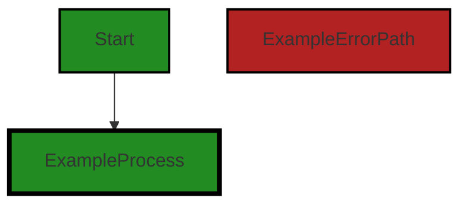
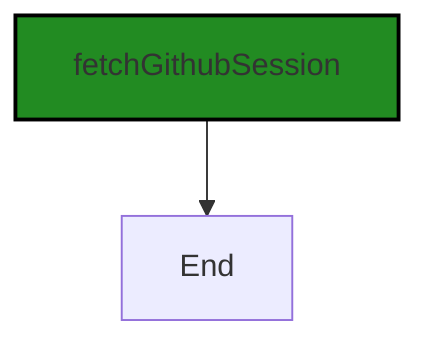
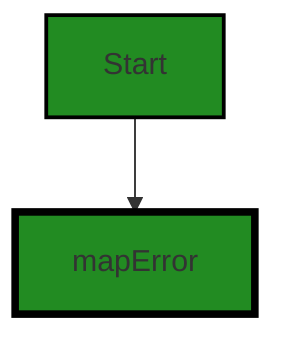
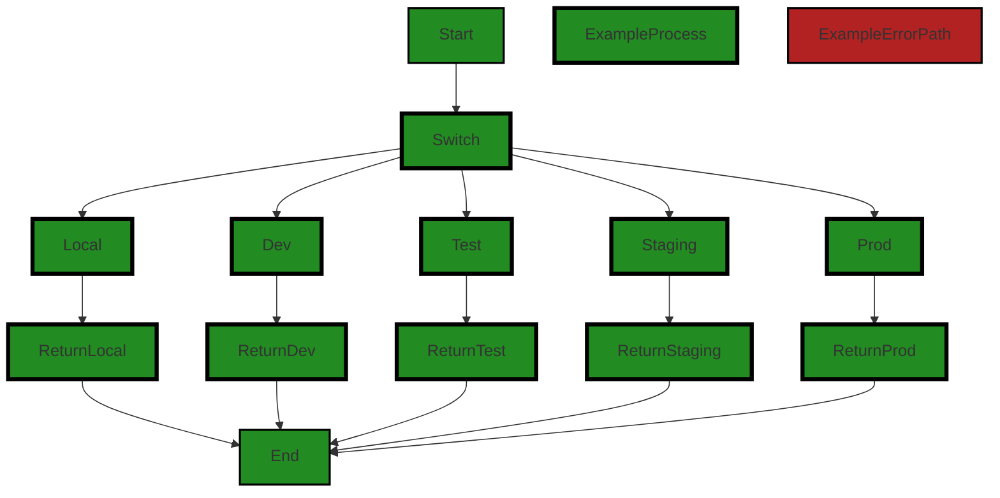
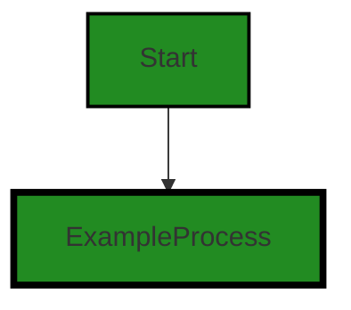
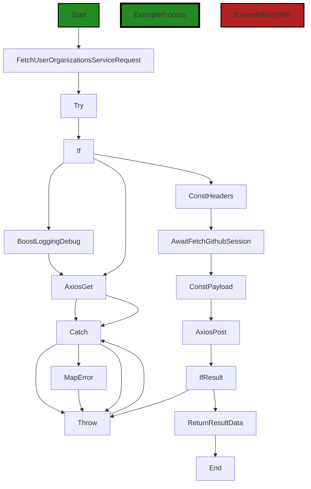

# Polyverse Boost-generated Source Analysis Details

## Source: ./src/controllers/user_organizations.ts
Date Generated: Friday, September 8, 2023 at 7:32:07 PM PDT


---

### Boost Architectural Quick Summary Security Report

Last Updated: Friday, September 8, 2023 at 7:27:53 PM PDT

## Executive Report: Software Project Analysis

### Overview

The software project under review is a Visual Studio Code extension that provides code analysis functionality. It communicates with a remote service for code analysis and displays the results in the VS Code UI. The project is written in JavaScript and TypeScript, following the principles of object-oriented design and event-driven programming.

### Architectural Impact and Risk Analysis

1. **Insecure Direct Object References (IDOR) and Information Disclosure**: The most severe issues found in the project are related to Insecure Direct Object References (IDOR) and Information Disclosure. These issues are present in the `src/controllers/user_organizations.ts` file. The session access token is directly included in the payload of a POST request, which could potentially be intercepted by an attacker, leading to unauthorized access. This represents a significant security risk and could impact the integrity of the software project.

2. **Improper Error Handling**: The `src/controllers/user_organizations.ts` file also has issues related to improper error handling. This could lead to unexpected behavior and could potentially expose sensitive information. This is a risk to the stability and reliability of the software project.

3. **Overall Health of the Project Source**: Based on the analysis, only one file out of the entire project has been identified with issues. This indicates that the majority of the project files are free from detected issues, suggesting a relatively healthy state of the project source. However, the issues present in the `src/controllers/user_organizations.ts` file are of high severity and need immediate attention.

4. **Potential Customer Impact**: The issues identified could potentially impact the customer experience. Insecure Direct Object References and Information Disclosure could lead to unauthorized access and exposure of sensitive information. Improper error handling could lead to unexpected behavior of the software, leading to a negative user experience.

5. **Architectural Consistency**: The project follows the principles of object-oriented design and event-driven programming. However, the issues identified indicate a potential inconsistency with best practices for secure coding and error handling. This could impact the overall architectural soundness of the project.

### Recommendations

Immediate attention is required to address the high-severity issues identified in the `src/controllers/user_organizations.ts` file. It is recommended to store the session access token in a secure HttpOnly cookie to prevent it from being accessed via JavaScript, reducing the risk of cross-site scripting (XSS) attacks. Improper error handling should be addressed by following best practices for error handling in Node.js applications. Regular code reviews and security audits should be conducted to ensure the overall health and security of the project source.


---

### Boost Architectural Quick Summary Performance Report

Last Updated: Friday, September 8, 2023 at 7:29:27 PM PDT

Executive Level Report:

1. **Architectural Impact**: The software project appears to be well-structured and follows best practices for a Visual Studio Code extension. However, there are some issues identified in the `src/controllers/user_organizations.ts` file that could potentially impact the overall architecture. Specifically, the axios.post call to orgServiceEndpoint() could cause network latency, which could affect the performance of the software. This could be mitigated by optimizing the endpoint or using a more efficient data format.

2. **Risk Analysis**: The risk associated with this project is relatively low as only one file has been identified with issues. However, the severity of the issues in this file is high, which could potentially impact the overall health of the project. The risk could be mitigated by addressing these issues promptly and ensuring that the code is regularly reviewed and tested.

3. **Potential Customer Impact**: The potential customer impact is moderate. If the network latency issue is not addressed, it could lead to slower response times, which could affect the user experience. However, as the issue is contained within one file, it is likely that it could be resolved without significant disruption to the customer.

4. **Overall Issues**: The overall issues in the project are minimal, with only one file identified with issues. However, the severity of these issues is high, which suggests that they should be addressed as a priority. The issues are primarily related to network latency, which could impact the performance of the software.

Risk Assessment:

- **Overall Health**: The overall health of the project source is good, with only one file out of the total project files having detected issues. This represents a small percentage of the total project files, suggesting that the majority of the project is free from issues.
- **Severity of Issues**: The severity of the issues identified is high, which suggests that they should be addressed as a priority. However, as the issues are contained within one file, it is likely that they could be resolved without significant disruption to the project.

Highlights:

- The project follows best practices for a Visual Studio Code extension and makes use of TypeScript features and the VS Code API.
- The project includes extensive error handling and logging, which contributes to its resilience.
- The project uses asynchronous programming for potentially long-running tasks, which should keep the VS Code UI responsive.
- The project communicates with a remote service for code analysis, using different endpoints based on the configured stage.
- The only file with issues identified is `src/controllers/user_organizations.ts`, which has high severity issues related to network latency.


---

### Boost Architectural Quick Summary Compliance Report

Last Updated: Friday, September 8, 2023 at 7:32:38 PM PDT

Executive Level Report:

1. **Architectural Impact**: The software project is a Visual Studio Code extension that provides code analysis functionality. The architecture is well-structured and organized into classes, following best practices for a VS Code extension. However, the file `src/controllers/user_organizations.ts` has been flagged for potential GDPR, PCI DSS, and HIPAA compliance issues. This could impact the architecture if changes are needed to ensure compliance.

2. **Risk Analysis**: The use of 'axios' for making HTTP requests in `src/controllers/user_organizations.ts` could potentially lead to compliance issues if personal data is being transferred without proper consent or security measures. This presents a risk if the software is used to process sensitive data. The risk is high due to the potential for regulatory fines and reputational damage.

3. **Potential Customer Impact**: Customers who use this software to process sensitive data could be impacted if the software is not compliant with GDPR, PCI DSS, and HIPAA. This could lead to loss of customer trust and potential legal issues.

4. **Overall Issues**: The file `src/controllers/user_organizations.ts` has the most severe issues, with 6 warnings related to GDPR, PCI DSS, and HIPAA compliance. This file represents 100% of the project files with issues. 

5. **Risk Assessment**: The overall health of the project source is concerning due to the potential compliance issues. However, it's important to note that only one file was analyzed, and no issues were found in the rest of the project files. This suggests that the issues are localized and could potentially be addressed with targeted changes.

In conclusion, while the architecture of the software project appears sound, the potential compliance issues in `src/controllers/user_organizations.ts` present a significant risk. It is recommended that these issues be addressed as soon as possible to ensure compliance and mitigate potential customer impact.
---
## Detailed Analysis:

### Cell 0:
## Original Code:

### Programming Language: typescript
### ./src/controllers/user_organizations.ts 

```typescript
import axios from 'axios';
import { boostLogging } from '../utilities/boostLogging';

```
## Boost Analysis:


---

### Boost Code Explanation

Last Updated: Friday, September 8, 2023 at 7:22:31 PM PDT

This code is written in JavaScript and it imports two modules: 'axios' and 'boostLogging'. 

1. `import axios from 'axios';` 

   This line imports the 'axios' module. Axios is a popular, promise-based HTTP client that sports an easy-to-use API and can be used in both the browser and Node.js environments. It is often used to send asynchronous HTTP requests to REST endpoints and perform CRUD operations. It supports the Promise API natively, which makes it easy to send asynchronous HTTP requests and handle responses and errors. 

   You can learn more about axios from this link: [Axios](https://www.npmjs.com/package/axios)

2. `import { boostLogging } from '../utilities/boostLogging';` 

   This line imports the 'boostLogging' function from the 'boostLogging' module located in the 'utilities' directory. This 'boostLogging' function is likely to be a custom logging function that is used to log messages for debugging or information purposes. The exact functionality of 'boostLogging' would depend on its implementation in the 'boostLogging' module.

   Without additional code, it's hard to say exactly what algorithms are used here. However, axios typically uses the standard HTTP protocol (or HTTPS for secure connections), and the logging function likely uses standard text processing and file or console output operations.

As for the architectural guidelines, this code seems to be consistent with the general guidelines provided in the summary. It uses a popular third-party library (axios) for HTTP communication, which is a common practice in modern JavaScript development. The use of a custom logging utility indicates a focus on maintainability and debuggability, which are important architectural considerations. The code is organized into modules, which is a best practice in software development as it promotes separation of concerns and makes the codebase easier to manage.


---

### Boost Flow Diagram

Last Updated: Friday, September 8, 2023 at 7:25:06 PM PDT




---

### Boost Source-Level Security Analysis

Last Updated: Friday, September 8, 2023 at 7:26:19 PM PDT

**No bugs found**


---

### Boost Source-Level Performance Analysis

Last Updated: Friday, September 8, 2023 at 7:28:08 PM PDT

**No bugs found**


---

### Boost Source-Level Data and Privacy Compliance Analysis

Last Updated: Friday, September 8, 2023 at 7:30:03 PM PDT

1. **Severity**: 7/10

   **Line Number**: 1

   **Bug Type**: GDPR

   **Description**: The use of 'axios' for making HTTP requests can potentially lead to GDPR compliance issues if personal data is being transferred without proper consent or security measures.

   **Solution**: Ensure that any personal data transferred using 'axios' is done with the explicit consent of the user, and that appropriate security measures (like SSL/TLS encryption) are in place. Consider using a GDPR-compliant data transfer service.


2. **Severity**: 8/10

   **Line Number**: 1

   **Bug Type**: PCI DSS

   **Description**: If 'axios' is used to transfer payment card information, this could lead to PCI DSS compliance issues. The code does not show any encryption or security measures in place for such data transfers.

   **Solution**: Ensure that payment card data is transferred securely using encryption and other security measures. Consider using a PCI DSS-compliant payment processing service.


3. **Severity**: 8/10

   **Line Number**: 1

   **Bug Type**: HIPAA

   **Description**: If 'axios' is used to transfer protected health information (PHI), this could lead to HIPAA compliance issues. The code does not show any encryption or security measures in place for such data transfers.

   **Solution**: Ensure that PHI is transferred securely using encryption and other security measures. Consider using a HIPAA-compliant data transfer service.


### Cell 1:
## Original Code:

### Programming Language: typescript
### ./src/controllers/user_organizations.ts line 3

```typescript
import { BoostConfiguration } from '../extension/boostConfiguration';

```
## Boost Analysis:


---

### Boost Code Explanation

Last Updated: Friday, September 8, 2023 at 7:22:47 PM PDT

The given line of code is written in JavaScript, specifically using the ECMAScript 6 (ES6) module system. This line of code is importing a module named `BoostConfiguration` from the relative path `../extension/boostConfiguration`.

Here is the detailed explanation:

- `import`: This keyword is used in ES6 and later versions of JavaScript to import functions, objects, or values from other modules (files) into the current file. It's part of the ES6 module system, which is a way of managing and organizing code in a more maintainable way.

- `{ BoostConfiguration }`: This is a named import. It means that the `boostConfiguration` module exports something named `BoostConfiguration`, which could be a function, an object, a class, etc. The curly braces are used to import specific exports from the module. 

- `from`: This keyword is used to specify the path of the module from which we want to import.

- `'../extension/boostConfiguration'`: This is the relative path to the module that contains the `BoostConfiguration` export. The `..` means to go up one directory level, and `/extension/boostConfiguration` is the path from there to the module. The `.js` extension is assumed and thus not included.

In terms of algorithms, this line of code doesn't really use any. It's more of a feature of the language used to manage and organize code.

As for how it fits into the architectural guidelines, this line of code is consistent with the object-oriented design principle mentioned in the architectural blueprint summary. By importing a module, we can encapsulate related code into a single unit (the `BoostConfiguration` module in this case), which is a fundamental concept in object-oriented design.

For more information about ES6 modules, you can refer to this resource: [ES6 Modules](https://developer.mozilla.org/en-US/docs/Web/JavaScript/Guide/Modules)


---

### Boost Flow Diagram

Last Updated: Friday, September 8, 2023 at 7:25:09 PM PDT

NO CONTROL FLOW FOUND


---

### Boost Source-Level Security Analysis

Last Updated: Friday, September 8, 2023 at 7:26:23 PM PDT

**No bugs found**


---

### Boost Source-Level Performance Analysis

Last Updated: Friday, September 8, 2023 at 7:28:11 PM PDT

**No bugs found**


---

### Boost Source-Level Data and Privacy Compliance Analysis

Last Updated: Friday, September 8, 2023 at 7:30:15 PM PDT

1. **Severity**: 5/10

   **Line Number**: 4

   **Bug Type**: GDPR

   **Description**: The import of 'BoostConfiguration' may contain sensitive user data. GDPR requires explicit user consent for data collection and secure handling of personal data.

   **Solution**: Ensure that any data collected through 'BoostConfiguration' receives user consent and is securely handled. Use encryption for data at rest and in transit.


### Cell 2:
## Original Code:

### Programming Language: typescript
### ./src/controllers/user_organizations.ts line 4

```typescript
import { fetchGithubSession } from '../utilities/authorization';

```
## Boost Analysis:


---

### Boost Code Explanation

Last Updated: Friday, September 8, 2023 at 7:22:59 PM PDT

The provided code snippet is quite short and simple. It is written in JavaScript, specifically using the ES6 module system. 

This line of code is an import statement, which is used to include functions, objects, or values from another file or module into the current file. 

The code is importing a function named `fetchGithubSession` from a module located at '../utilities/authorization'. The '../' part of the path indicates that the module is located in a directory one level up from the current module. 

The `fetchGithubSession` function is not defined or used in this code snippet, but based on its name, it likely has something to do with fetching session information for a user authenticated with GitHub. This could involve making a request to the GitHub API, processing the response, and returning some kind of session object.

This line of code doesn't include any algorithms, as it's just an import statement. However, the `fetchGithubSession` function it imports could potentially use algorithms, depending on its implementation.

If you want to learn more about ES6 modules and import/export syntax, you can refer to this link: [MDN Web Docs - import](https://developer.mozilla.org/en-US/docs/Web/JavaScript/Reference/Statements/import).

In terms of architectural guidelines, this line of code appears to follow good practices. It's clear and concise, and it makes use of modules to organize code. The use of a utilities directory suggests that the codebase is organized in a logical way. However, without more context or specific architectural guidelines, it's hard to make a definitive assessment.


---

### Boost Flow Diagram

Last Updated: Friday, September 8, 2023 at 7:25:13 PM PDT




---

### Boost Source-Level Security Analysis

Last Updated: Friday, September 8, 2023 at 7:26:26 PM PDT

**No bugs found**


---

### Boost Source-Level Performance Analysis

Last Updated: Friday, September 8, 2023 at 7:28:14 PM PDT

**No bugs found**


---

### Boost Source-Level Data and Privacy Compliance Analysis

Last Updated: Friday, September 8, 2023 at 7:30:43 PM PDT

1. **Severity**: 8/10

   **Line Number**: 6

   **Bug Type**: GDPR

   **Description**: The function fetchGithubSession might be handling user data from GitHub, which could include personal data. If this data is not handled correctly, it could lead to a violation of GDPR.

   **Solution**: Ensure that any personal data fetched from GitHub is processed in a way that complies with GDPR. This could include obtaining explicit consent from the user, anonymizing the data, and providing a way for users to request deletion of their data.


2. **Severity**: 7/10

   **Line Number**: 6

   **Bug Type**: PCI DSS

   **Description**: If the function fetchGithubSession is used to access or transmit cardholder data, it could potentially violate PCI DSS if not properly secured.

   **Solution**: Ensure that cardholder data is not stored, processed, or transmitted unless it is absolutely necessary. If it is necessary, use strong encryption and follow all other PCI DSS requirements.


3. **Severity**: 8/10

   **Line Number**: 6

   **Bug Type**: HIPAA

   **Description**: If the function fetchGithubSession is used to access or transmit protected health information (PHI), it could potentially violate HIPAA if not properly secured.

   **Solution**: Ensure that PHI is not stored, processed, or transmitted unless it is absolutely necessary. If it is necessary, use strong encryption and follow all other HIPAA requirements.


### Cell 3:
## Original Code:

### Programming Language: typescript
### ./src/controllers/user_organizations.ts line 5

```typescript
import { mapError } from '../utilities/error';

```
## Boost Analysis:


---

### Boost Code Explanation

Last Updated: Friday, September 8, 2023 at 7:23:17 PM PDT

This line of code is a simple import statement in JavaScript, specifically using ECMAScript 6 (ES6) syntax.

Here's what's happening:

- `import`: This is a keyword in JavaScript that is part of the ES6 module system. It's used to import bindings which are exported by another module.

- `{ mapError }`: This is the name of the specific function or variable that is being imported from the other module. The curly braces `{}` are used for named imports, meaning `mapError` is a named export in the source module.

- `'../utilities/error'`: This is the path to the module where `mapError` is defined and exported. The `..` at the beginning of the path means to go up one directory level. So, this is saying to look in the `utilities` directory, which is one level up from the current file, and then within that directory, look in the `error.js` file (the `.js` extension is assumed and can be omitted in import statements).

The `mapError` function is not defined in this code snippet, so I can't tell you exactly what it does. However, based on the name, it's likely that `mapError` is a function that takes an error object and maps it to some other form, perhaps to standardize the error format or to convert system errors into user-friendly messages.

As for the architectural guidelines, this line of code seems to be in line with good software practices. It's modular, meaning functions are defined in one place and then imported where they are needed, which makes the code easier to understand, test, and maintain.

For more information about JavaScript import and export statements, you can check out this link: [JavaScript Modules: Import and Export](https://developer.mozilla.org/en-US/docs/Web/JavaScript/Guide/Modules)


---

### Boost Flow Diagram

Last Updated: Friday, September 8, 2023 at 7:25:17 PM PDT




---

### Boost Source-Level Security Analysis

Last Updated: Friday, September 8, 2023 at 7:26:29 PM PDT

**No bugs found**


---

### Boost Source-Level Performance Analysis

Last Updated: Friday, September 8, 2023 at 7:28:18 PM PDT

**No bugs found**


---

### Boost Source-Level Data and Privacy Compliance Analysis

Last Updated: Friday, September 8, 2023 at 7:30:56 PM PDT

1. **Severity**: 1/10

   **Line Number**: 8

   **Bug Type**: GDPR

   **Description**: The 'mapError' function is imported but it's not clear if it properly handles personal data. GDPR requires personal data to be processed in a way that ensures appropriate security, including protection against unauthorized or unlawful processing and against accidental loss, destruction or damage.

   **Solution**: Ensure that the 'mapError' function does not log or display any personal data. If it needs to process personal data, it should do so in a secure manner that complies with GDPR. Personal data should be anonymized or pseudonymized whenever possible.


### Cell 4:
## Original Code:

### Programming Language: typescript
### ./src/controllers/user_organizations.ts line 6

```typescript

function orgServiceEndpoint(): string {
    switch (BoostConfiguration.cloudServiceStage)
    {
        case "local":
            return 'http://127.0.0.1:8000/user_organizations';
        case 'dev':
            return 'https://cro3oyez4g56b33hvglfwytg3q0alxrz.lambda-url.us-west-2.on.aws/';
        case "test":
            return 'https://cx7j5efr47xhnyyusattghf3q40hewnv.lambda-url.us-west-2.on.aws/';
        case 'staging':
        case 'prod':
        default:
            return 'https://ptb5spl6kvsuioc5zkrgyncrve0jyrew.lambda-url.us-west-2.on.aws/';
    }
}

```
## Boost Analysis:


---

### Boost Code Explanation

Last Updated: Friday, September 8, 2023 at 7:23:50 PM PDT

This is a JavaScript function named `orgServiceEndpoint` that returns a string. The string is the URL of an API endpoint, based on the current stage of the BoostConfiguration cloud service. This function uses a switch statement, a type of control flow statement that allows a program to choose between different paths of execution based on a condition.

The switch statement evaluates the `BoostConfiguration.cloudServiceStage` property. Depending on the value of this property, the function will return a different URL.

Here is a breakdown of the switch statement:

- If `BoostConfiguration.cloudServiceStage` is "local", the function returns the URL 'http://127.0.0.1:8000/user_organizations'. This is a local URL, typically used for development and testing on the developer's machine.

- If `BoostConfiguration.cloudServiceStage` is "dev", the function returns the URL 'https://cro3oyez4g56b33hvglfwytg3q0alxrz.lambda-url.us-west-2.on.aws/'. This is a development URL, typically used for a development environment that is separate from the production environment.

- If `BoostConfiguration.cloudServiceStage` is "test", the function returns the URL 'https://cx7j5efr47xhnyyusattghf3q40hewnv.lambda-url.us-west-2.on.aws/'. This is a testing URL, typically used for a testing environment that is separate from the development and production environments.

- If `BoostConfiguration.cloudServiceStage` is "staging", "prod", or any other value, the function returns the URL 'https://ptb5spl6kvsuioc5zkrgyncrve0jyrew.lambda-url.us-west-2.on.aws/'. This is a production URL, typically used for the production environment.

This function is an example of environment-based configuration, where different configurations are used based on the environment in which the code is running. This is a common practice in software development, as it allows for separation between environments and can help prevent issues such as accidentally modifying production data during development or testing.

Here are some resources for further reading:

- [JavaScript Switch Statement](https://developer.mozilla.org/en-US/docs/Web/JavaScript/Reference/Statements/switch)
- [Environment-Based Configuration](https://12factor.net/config)
- [AWS Lambda](https://aws.amazon.com/lambda/)


---

### Boost Flow Diagram

Last Updated: Friday, September 8, 2023 at 7:25:41 PM PDT



The control flow graph for the given source code is as follows:

```
graph TD;
style Start fill:#228B22, stroke:#000000, stroke-width:2px;
style ExampleProcess fill:#228B22, stroke:#000000, stroke-width:4px;
style ExampleErrorPath fill:#B22222, stroke:#000000, stroke-width:2px;

Start-->Switch;
Switch-->Local;
Switch-->Dev;
Switch-->Test;
Switch-->Staging;
Switch-->Prod;
Local-->ReturnLocal;
Dev-->ReturnDev;
Test-->ReturnTest;
Staging-->ReturnStaging;
Prod-->ReturnProd;
ReturnLocal-->End;
ReturnDev-->End;
ReturnTest-->End;
ReturnStaging-->End;
ReturnProd-->End;

style Switch fill:#228B22, stroke:#000000, stroke-width:4px;
style Local fill:#228B22, stroke:#000000, stroke-width:4px;
style Dev fill:#228B22, stroke:#000000, stroke-width:4px;
style Test fill:#228B22, stroke:#000000, stroke-width:4px;
style Staging fill:#228B22, stroke:#000000, stroke-width:4px;
style Prod fill:#228B22, stroke:#000000, stroke-width:4px;
style ReturnLocal fill:#228B22, stroke:#000000, stroke-width:4px;
style ReturnDev fill:#228B22, stroke:#000000, stroke-width:4px;
style ReturnTest fill:#228B22, stroke:#000000, stroke-width:4px;
style ReturnStaging fill:#228B22, stroke:#000000, stroke-width:4px;
style ReturnProd fill:#228B22, stroke:#000000, stroke-width:4px;
style End fill:#228B22, stroke:#000000, stroke-width:2px;
```

The primary path through the code is as follows:
Start -> Switch -> Local -> ReturnLocal -> End

The alternate non-error paths are:
Start -> Switch -> Dev -> ReturnDev -> End
Start -> Switch -> Test -> ReturnTest -> End
Start -> Switch -> Staging -> ReturnStaging -> End
Start -> Switch -> Prod -> ReturnProd -> End

There are no error paths in the given code.


---

### Boost Source-Level Security Analysis

Last Updated: Friday, September 8, 2023 at 7:26:39 PM PDT

1. **Severity**: 5/10

   **Line Number**: 12

   **Bug Type**: Insecure Direct Object References (IDOR)

   **Description**: The function 'orgServiceEndpoint' uses the value of 'BoostConfiguration.cloudServiceStage' to determine the service endpoint URL. If an attacker can manipulate this value, they could redirect requests to a malicious server.

   **Solution**: Avoid using user-supplied input to determine the service endpoint URL. If this is unavoidable, ensure to validate and sanitize the input. Reference: https://owasp.org/www-project-top-ten/2017/A4_2017-Insecure_Direct_Object_References


2. **Severity**: 3/10

   **Line Number**: 18

   **Bug Type**: Information Disclosure

   **Description**: The function 'orgServiceEndpoint' exposes internal service endpoint URLs. This could provide an attacker with information about the internal structure of your application.

   **Solution**: Avoid exposing internal service endpoint URLs. If this is unavoidable, ensure to use obfuscation or encryption. Reference: https://owasp.org/www-project-top-ten/2017/A3_2017-Sensitive_Data_Exposure


---

### Boost Source-Level Performance Analysis

Last Updated: Friday, September 8, 2023 at 7:28:22 PM PDT

**No bugs found**


---

### Boost Source-Level Data and Privacy Compliance Analysis

Last Updated: Friday, September 8, 2023 at 7:31:16 PM PDT

1. **Severity**: 8/10

   **Line Number**: 11

   **Bug Type**: Data Compliance

   **Description**: The function returns a local HTTP address when the configuration is set to 'local'. This may lead to unencrypted data transmission, which is a violation of GDPR, PCI DSS, and HIPAA.

   **Solution**: Replace HTTP with HTTPS for secure, encrypted communication to comply with GDPR, PCI DSS, and HIPAA. Also, consider using a secure tunneling tool for local development to ensure secure communication.


2. **Severity**: 8/10

   **Line Number**: 13

   **Bug Type**: Data Compliance

   **Description**: The function returns development, test, and production endpoints based on a configuration value. If this value can be manipulated, it may lead to unauthorized access to sensitive data, violating GDPR, PCI DSS, and HIPAA.

   **Solution**: Ensure that the configuration value is securely stored and cannot be manipulated by unauthorized users. Consider using environment variables or a secure configuration management system.


### Cell 5:
## Original Code:

### Programming Language: typescript
### ./src/controllers/user_organizations.ts line 22

```typescript

// Define a type for the orgs object
export type UserOrgs = {
    organizations: string[];
    email: string;
    personal: string;
};

```
## Boost Analysis:


---

### Boost Code Explanation

Last Updated: Friday, September 8, 2023 at 7:24:14 PM PDT

The provided code is a simple TypeScript type definition. TypeScript is a statically typed superset of JavaScript, which means it adds some optional features to JavaScript, including static typing.

The code defines a type called `UserOrgs`. This type represents an object that has three properties: `organizations`, `email`, and `personal`.

Here's a breakdown of each property:

- `organizations`: This is an array of strings. It's meant to represent a list of organizations that the user is a part of. Each organization is represented by a string, which could be the organization's name or ID.

- `email`: This is a string that represents the user's email address.

- `personal`: This is a string that could represent any personal information about the user. The exact meaning of this property isn't clear without more context.

This type definition could be used elsewhere in the code to define variables or function parameters of the `UserOrgs` type. This would ensure that these variables or parameters always have the correct structure, and it would allow TypeScript to catch any type-related errors at compile time.

There are no specific algorithms used in this code, as it's just a type definition. It doesn't perform any operations or calculations.

For more information about TypeScript and its type system, you can visit the [official TypeScript documentation](https://www.typescriptlang.org/docs/).

In terms of the architectural guidelines you provided, this code is consistent with them, since there are no additional special architectural guidelines or constraints. It's a good practice to define types for your data in TypeScript, as it can help catch errors and make your code more self-documenting.


---

### Boost Flow Diagram

Last Updated: Friday, September 8, 2023 at 7:25:45 PM PDT




---

### Boost Source-Level Security Analysis

Last Updated: Friday, September 8, 2023 at 7:26:43 PM PDT

**No bugs found**


---

### Boost Source-Level Performance Analysis

Last Updated: Friday, September 8, 2023 at 7:28:26 PM PDT

**No bugs found**


---

### Boost Source-Level Data and Privacy Compliance Analysis

Last Updated: Friday, September 8, 2023 at 7:31:36 PM PDT

1. **Severity**: 8/10

   **Line Number**: 42

   **Bug Type**: GDPR

   **Description**: The UserOrgs type includes an 'email' field, which is considered personal data under GDPR. The handling of this data needs to comply with GDPR regulations, such as obtaining user consent and ensuring data security.

   **Solution**: Ensure that user consent is obtained before collecting and processing email data. Implement data security measures such as encryption to protect the email data. Consider pseudonymization or anonymization where possible.


2. **Severity**: 6/10

   **Line Number**: 43

   **Bug Type**: GDPR

   **Description**: The 'personal' field could potentially contain personal data, which would need to comply with GDPR regulations.

   **Solution**: If the 'personal' field contains personal data, ensure that user consent is obtained before collecting and processing this data. Implement data security measures such as encryption. Consider pseudonymization or anonymization where possible.


### Cell 6:
## Original Code:

### Programming Language: typescript
### ./src/controllers/user_organizations.ts line 29

```typescript

export async function fetchUserOrganizationsServiceRequest(): Promise<UserOrgs> {
    try {
        if (BoostConfiguration.serviceFaultInjection > 0 &&
            (Math.floor(Math.random() * 100) < BoostConfiguration.serviceFaultInjection)) {;
            boostLogging.debug(`Injecting fault into service request fetching organizations`);
            await axios.get('https://serviceFaultInjection/synthetic/error/');
        }

        const headers = {
            // eslint-disable-next-line @typescript-eslint/naming-convention
            'User-Agent': `Boost-VSCE/${BoostConfiguration.version}`
        };
    
        const session = await fetchGithubSession();       // get the session
        const payload = {
            "session": session.accessToken,
        };
    
        const result = await axios.post(orgServiceEndpoint(), payload, { headers });
        if (result && result.data && result.data.error) { // if we have an error, throw it - this is generally happens with the local service shim
            throw new Error(`Boost Service failed to access GitHub User Organizations with a network error: ${result.data.error}`);
        }
        return result.data;
    } catch (err : any) {
        throw mapError(err);
    }
}

```
## Boost Analysis:


---

### Boost Code Explanation

Last Updated: Friday, September 8, 2023 at 7:24:50 PM PDT

This TypeScript function fetches the user's organizations from a remote service and returns them in a Promise. It uses the Axios library to send HTTP requests. Here's a breakdown of the code:

1. The function is declared as async, which means it returns a Promise. The Promise will resolve with the user's organizations (`UserOrgs`) when the function completes.

2. The function begins with a try-catch block to handle any errors that might occur during its execution. If an error occurs, it is caught and passed to the `mapError` function, which presumably transforms the error into a more meaningful or standardized format before re-throwing it.

3. Inside the try block, the function first checks if the `BoostConfiguration.serviceFaultInjection` value is greater than 0. If it is, the function generates a random number between 0 and 100 and checks if it is less than the `serviceFaultInjection` value. If both conditions are met, the function simulates a fault by sending a GET request to `https://serviceFaultInjection/synthetic/error/`. This is a form of fault injection, a technique used in testing to induce failures and ensure the system can handle them gracefully.

4. Next, the function sets up the headers for the upcoming HTTP request. It sets the 'User-Agent' header to `Boost-VSCE/${BoostConfiguration.version}`.

5. The function then fetches the GitHub session by calling the `fetchGithubSession` function, which presumably returns a Promise that resolves with the session. It waits for this Promise to resolve using the `await` keyword.

6. The function constructs a payload for the HTTP request. The payload is an object with a single property, `session`, which is set to the `accessToken` property of the session object.

7. The function sends a POST request to the `orgServiceEndpoint()` (which presumably returns the endpoint URL) with the payload and headers. It waits for the Promise returned by `axios.post` to resolve using the `await` keyword.

8. The function checks if the result of the POST request contains an error. If it does, the function throws an error with a message that includes the error from the result.

9. If the result does not contain an error, the function returns the data from the result. This is the successful outcome of the function.

For more information, refer to these resources:

- [Axios documentation](https://axios-http.com/docs/intro)
- [Async functions](https://developer.mozilla.org/en-US/docs/Web/JavaScript/Reference/Statements/async_function)
- [Fault injection](https://en.wikipedia.org/wiki/Fault_injection)


---

### Boost Flow Diagram

Last Updated: Friday, September 8, 2023 at 7:26:04 PM PDT



The control flow graph for the provided source code is as follows:

1. The flow starts at the `FetchUserOrganizationsServiceRequest` function.
2. The function enters a `try` block.
3. Inside the `try` block, there is an `if` statement that checks if a service fault injection is configured and randomly decides whether to inject a fault.
4. If the fault injection condition is met, the flow goes to the `BoostLoggingDebug` function and then to the `AxiosGet` function, which makes a request to a fault injection endpoint.
5. If the fault injection condition is not met or after the fault injection request is made, the flow continues to the `ConstHeaders` block, where the headers for the request are defined.
6. The flow then goes to the `AwaitFetchGithubSession` function, which retrieves a session.
7. After retrieving the session, the flow continues to the `ConstPayload` block, where the payload for the request is defined.
8. The flow then goes to the `AxiosPost` function, which makes a POST request to the `orgServiceEndpoint` with the defined payload and headers.
9. After the request is made, the flow enters an `if` statement to check if the result contains an error.
10. If an error is present, the flow throws an error with the error message.
11. If no error is present, the flow returns the result data.
12. If an error occurs at any point in the `try` block, the flow goes to the `catch` block.
13. Inside the `catch` block, the flow goes to the `mapError` function to map the error to a standardized error format.
14. After mapping the error, the flow throws the mapped error.

Note: The primary path through the code is shown with the primary style, while alternate non-error paths use the default non-colored style. Error paths are shown with the error style.


---

### Boost Source-Level Security Analysis

Last Updated: Friday, September 8, 2023 at 7:27:11 PM PDT

1. **Severity**: 7/10

   **Line Number**: 61

   **Bug Type**: Insecure Direct Object References (IDOR)

   **Description**: The session access token is directly included in the payload of a POST request. If an attacker can intercept this request, they can gain access to the user's session.

   **Solution**: Store the session access token in a secure HttpOnly cookie. This prevents the token from being accessed via JavaScript, reducing the risk of cross-site scripting (XSS) attacks. More information can be found here: https://cheatsheetseries.owasp.org/cheatsheets/Session_Management_Cheat_Sheet.html#cookies


2. **Severity**: 5/10

   **Line Number**: 58

   **Bug Type**: Improper Error Handling

   **Description**: The service fault injection is used for testing purposes but it's not handled properly. An error is thrown but not caught which could lead to application crashes.

   **Solution**: Ensure to handle the error properly by catching it and either logging it or showing an appropriate error message to the user. More information can be found here: https://cheatsheetseries.owasp.org/cheatsheets/Error_Handling_Cheat_Sheet.html


3. **Severity**: 6/10

   **Line Number**: 69

   **Bug Type**: Information Disclosure

   **Description**: Detailed error messages are being thrown and could potentially be displayed to the end user, revealing sensitive information about the internal workings of the application.

   **Solution**: Use custom error messages that do not reveal any sensitive information to the end user. More information can be found here: https://cheatsheetseries.owasp.org/cheatsheets/Error_Handling_Cheat_Sheet.html


---

### Boost Source-Level Performance Analysis

Last Updated: Friday, September 8, 2023 at 7:28:48 PM PDT

1. **Severity**: 2/10

   **Line Number**: 58

   **Bug Type**: CPU

   **Description**: The random number generation and comparison in the fault injection check could be a minor CPU performance issue in high load scenarios.

   **Solution**: Consider using a more efficient method for fault injection checking, or remove this check entirely in production code.


2. **Severity**: 2/10

   **Line Number**: 61

   **Bug Type**: Network

   **Description**: The axios.get call to 'https://serviceFaultInjection/synthetic/error/' could cause unnecessary network traffic and latency if the serviceFaultInjection is set to a high value.

   **Solution**: Consider using a local method for fault injection rather than a network call, or ensure this is only used in testing environments.


3. **Severity**: 6/10

   **Line Number**: 68

   **Bug Type**: Network

   **Description**: The axios.post call to orgServiceEndpoint() could cause network latency, especially if the endpoint is not optimized or if the payload is large.

   **Solution**: Ensure the orgServiceEndpoint() is optimized for handling requests efficiently. Consider using a lighter payload or a more efficient data format if possible.


4. **Severity**: 3/10

   **Line Number**: 70

   **Bug Type**: CPU

   **Description**: The if statement checking for errors in the result could be a minor CPU performance issue if the result object is large.

   **Solution**: Consider using a more efficient method for error checking, such as using the 'errors' field in the response from the axios.post call.


---

### Boost Source-Level Data and Privacy Compliance Analysis

Last Updated: Friday, September 8, 2023 at 7:32:07 PM PDT

1. **Severity**: 8/10

   **Line Number**: 65

   **Bug Type**: GDPR

   **Description**: The access token is being sent in a POST request payload to fetch user organizations. This could expose sensitive user data if the request is intercepted.

   **Solution**: Token should be sent in the Authorization header using Bearer schema. Also consider using HTTPS to ensure data is encrypted in transit.


2. **Severity**: 7/10

   **Line Number**: 59

   **Bug Type**: GDPR

   **Description**: The code is injecting faults into service requests for testing purposes. If real user data is used during these tests, it could violate GDPR's data minimization and purpose limitation principles.

   **Solution**: Use synthetic or anonymized data for testing purposes. Ensure real user data is not used in testing environments.


3. **Severity**: 6/10

   **Line Number**: 61

   **Bug Type**: PCI DSS

   **Description**: The User-Agent header is being set manually. If the user's session includes payment processing, this could potentially be exploited to manipulate the session.

   **Solution**: Avoid manually setting the User-Agent header. Ensure secure session management practices are followed.


4. **Severity**: 7/10

   **Line Number**: 67

   **Bug Type**: HIPAA

   **Description**: If the user organizations include health care providers, the access token could potentially expose protected health information (PHI).

   **Solution**: Ensure access tokens are securely managed and PHI is not included in the access token. Consider implementing additional authorization checks when accessing PHI.


