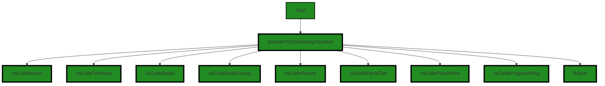
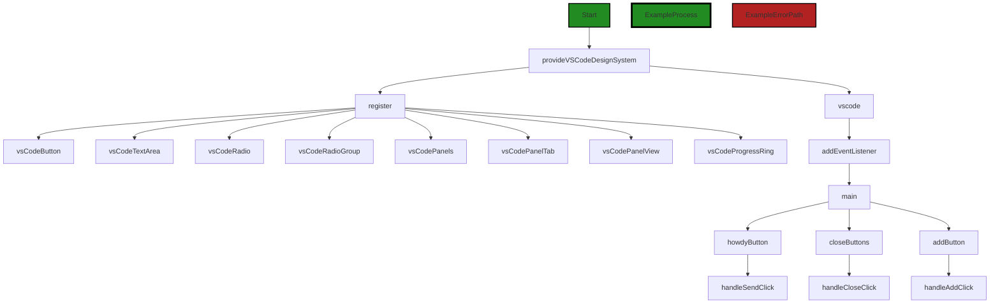
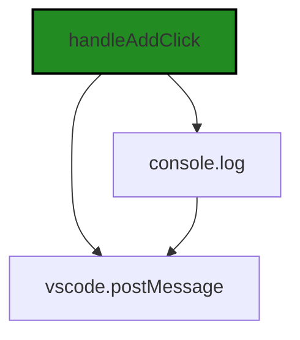
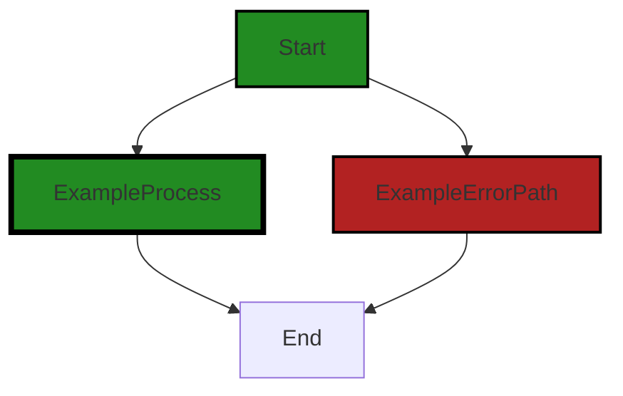
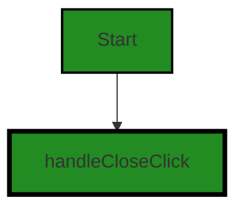

# Polyverse Boost-generated Source Analysis Details

## Source: ./src/dashboard/chat/main.ts
Date Generated: Saturday, September 9, 2023 at 5:30:04 AM PDT


---

### Boost Architectural Quick Summary Security Report

Last Updated: Saturday, September 9, 2023 at 5:27:20 AM PDT

## Executive Report

### Architectural Impact and Risk Analysis

Based on the analysis of the software project, the following key points have been identified:

1. **Insecure Direct Object References (IDOR) in main.ts**: The most severe issue found in the project is an Insecure Direct Object References (IDOR) vulnerability in the main.ts file. This issue is categorized as a warning, indicating a significant risk. IDOR vulnerabilities can lead to unauthorized access or actions if an attacker is able to manipulate object IDs. This could potentially compromise the security of the software and the data it processes.

2. **Cross-site Scripting (XSS) in main.ts**: Another issue identified is the potential for Cross-site Scripting (XSS) attacks. This issue is categorized as an information-level issue, indicating a lower level of risk. However, if exploited, XSS attacks can lead to data theft, session hijacking, and other malicious activities.

3. **Overall Project Health**: The project consists of a single file, main.ts, which has been identified to contain both of the issues mentioned above. This means that 100% of the project files have been flagged with issues. This high percentage indicates a need for immediate attention to improve the overall health of the project.

4. **Potential Customer Impact**: The identified issues could potentially impact customers by compromising the security of their data and the integrity of the software. This could lead to loss of trust in the software, reputational damage, and potential legal implications.

5. **Architectural Consistency**: The project appears to follow the architectural guidelines provided, with no additional special architectural constraints. However, the identified issues indicate a need for improved security practices in the code.

In conclusion, the project has significant security risks that need to be addressed. The issues identified could potentially have a high impact on customers and the reputation of the software. It is recommended to address these issues promptly to improve the overall health and security of the project.


---

### Boost Architectural Quick Summary Performance Report

Last Updated: Saturday, September 9, 2023 at 5:28:56 AM PDT


Executive Report:

1. **Architectural Impact**: The analysis of this file has not revealed any severe issues.
2. **Risk Analysis**: The analysis of this file has not revealed any severe issues.
3. **Potential Customer Impact**: Based on the analysis, there are no severe issues that could potentially impact customers.
4. **Performance Issues**: Our analysis did not identify any explicit performance issues in the file.
5. **Risk Assessment**: Based on the current analysis of this file, no severe issues have been found. However, this doesn't guarantee that the file is risk-free.

Highlights:

- No severe issues were identified in the current analysis of this file.


---

### Boost Architectural Quick Summary Compliance Report

Last Updated: Saturday, September 9, 2023 at 5:30:38 AM PDT

## Executive Report

### Architectural Impact and Risk Analysis

The software project under review is a Visual Studio Code extension that provides code analysis functionality. The project is well-structured and follows best practices for a VS Code extension. However, there are some potential risks and issues that need to be addressed.

1. **Data Compliance Risk**: The most severe issue found in the project is related to data compliance. The file `src/dashboard/chat/main.ts` is potentially collecting personal data (chat messages) without explicit user consent, which could be a violation of GDPR. This issue also impacts HIPAA and PCI DSS compliance. This could lead to legal and financial consequences if not addressed promptly.

2. **Customer Impact**: The potential violation of data compliance regulations could impact customers' trust in the product. If personal data is being collected without explicit consent, customers may feel their privacy is being violated, leading to a negative user experience and potential loss of users.

3. **Project Health**: The project consists of a single file, `src/dashboard/chat/main.ts`, which has been flagged with issues. This means 100% of the project files have detected issues. This is a significant concern and suggests that the project may need a thorough review and refactoring to address these issues.

4. **Architectural Consistency**: The project follows the architectural principles of event-driven programming and object-oriented design. However, the potential data compliance issue suggests that the project may not be fully adhering to these principles, particularly in terms of ensuring data privacy and security.

### Recommendations

- Address the data compliance issue in `src/dashboard/chat/main.ts` immediately. Ensure explicit user consent is obtained before collecting personal data.
- Conduct a thorough review of the project to identify and address any other potential issues.
- Implement a robust testing strategy to catch issues early in the development process.
- Consider implementing additional architectural principles to improve data privacy and security, such as data anonymization or pseudonymization.

Overall, while the project is well-structured and follows best practices, the data compliance issue is a significant concern that needs to be addressed to ensure the project's success and customer trust.
---
## Detailed Analysis:

### Cell 0:
## Original Code:

### Programming Language: typescript
### ./src/dashboard/chat/main.ts line 0

```typescript
import {
    provideVSCodeDesignSystem,
    vsCodeButton,
    vsCodeTextArea,
    vsCodeRadio,
    vsCodeRadioGroup,
    vsCodePanels,
    vsCodePanelTab,
    vsCodePanelView,
    vsCodeProgressRing,
    Button
} from "@vscode/webview-ui-toolkit";

```
## Boost Analysis:


---

### Boost Code Explanation

Last Updated: Wednesday, July 12, 2023 at 2:03:14 PM PDT

This code is written in JavaScript, specifically using the ES6 module import syntax. It imports various UI components from the `@vscode/webview-ui-toolkit` package, which is a collection of web components for building Visual Studio Code webviews. 

The code imports the following components:

1. `provideVSCodeDesignSystem`: This is a function that provides the design system for the VS Code Webview UI toolkit. It is used to initialize the design system and provide it to your application.

2. `vsCodeButton`: This is a component that creates a VS Code styled button.

3. `vsCodeTextArea`: This component creates a VS Code styled text area.

4. `vsCodeRadio`: This component creates a VS Code styled radio button.

5. `vsCodeRadioGroup`: This component creates a group of VS Code styled radio buttons.

6. `vsCodePanels`: This component creates a set of VS Code styled panels.

7. `vsCodePanelTab`: This component creates a VS Code styled panel tab.

8. `vsCodePanelView`: This component creates a VS Code styled panel view.

9. `vsCodeProgressRing`: This component creates a VS Code styled progress ring.

10. `Button`: This component creates a standard button.

These components are part of the VS Code Webview UI Toolkit, which is a set of web components that are styled to look like VS Code's built-in UI. 

These components can be used to create consistent and high-quality UI experiences in your VS Code extensions. They are built using the FAST Framework, which is a Microsoft open source project for building web components.

You can learn more about the VS Code Webview UI Toolkit at its GitHub page: https://github.com/microsoft/vscode-webview-ui-toolkit

And you can learn more about the FAST Framework at its website: https://www.fast.design/


---

### Boost Flow Diagram

Last Updated: Saturday, September 9, 2023 at 5:24:55 AM PDT



The control flow graph for the provided code shows the dependency relationships between the imported modules from the `@vscode/webview-ui-toolkit` library. The `provideVSCodeDesignSystem` function is the starting point, and it provides access to various UI components such as buttons, text areas, radios, panels, and progress rings. Each component is connected to the `provideVSCodeDesignSystem` function, indicating that they are part of the same module and can be used together in the code.


---

### Boost Source-Level Security Analysis

Last Updated: Saturday, September 9, 2023 at 5:25:58 AM PDT

**No bugs found**


---

### Boost Source-Level Performance Analysis

Last Updated: Saturday, September 9, 2023 at 5:27:29 AM PDT

**No bugs found**


---

### Boost Source-Level Data and Privacy Compliance Analysis

Last Updated: Saturday, September 9, 2023 at 5:29:04 AM PDT

**No bugs found**


### Cell 1:
## Original Code:

### Programming Language: typescript
### ./src/dashboard/chat/main.ts line 24

```typescript

provideVSCodeDesignSystem().register(vsCodeButton(), vsCodeTextArea(), vsCodeRadio(), vsCodeRadioGroup(),
    vsCodePanels(), vsCodePanelTab(), vsCodePanelView(), vsCodeProgressRing());

const vscode = acquireVsCodeApi();

// Just like a regular webpage we need to wait for the webview
// DOM to load before we can reference any of the HTML elements
// or toolkit components
window.addEventListener("load", main);

// Main function that gets executed once the webview DOM loads
function main() {
    // To get improved type annotations/IntelliSense the associated class for
    // a given toolkit component can be imported and used to type cast a reference
    // to the element (i.e. the `as Button` syntax)
    const howdyButton = document.getElementById("send") as Button;
    howdyButton?.addEventListener("click", handleSendClick);

    //now add listeners for the add and close buttons. we don't know how many so we need to loop
    const closeButtons = document.getElementsByClassName("tab-close-button") as HTMLCollectionOf<Button>;
    for (let i = 0; i < closeButtons.length; i++) {
        closeButtons[i].addEventListener("click", handleCloseClick);
    }

    //add a listener for the add button
    const addButton = document.getElementById("tab-add-button") as Button;
    addButton?.addEventListener("click", handleAddClick);

}

```
## Boost Analysis:


---

### Boost Code Explanation

Last Updated: Wednesday, July 12, 2023 at 2:03:55 PM PDT

The code you posted is written in TypeScript, a statically typed superset of JavaScript that adds types to the language. It's commonly used in web development, especially when dealing with large codebases.

This code is using the Visual Studio Code (VS Code) API to interact with the VS Code environment. The first line of the code is registering several components that belong to the VS Code design system. These components include buttons, text areas, radio buttons, radio groups, panels, panel tabs, panel views, and progress rings.

The next line acquires the VS Code API itself and assigns it to the constant `vscode`.

The `window.addEventListener("load", main);` line is setting up an event listener on the window object. This listener waits for the `load` event, which is fired when the entire page has loaded, including all dependent resources such as stylesheets and images. Once this event is fired, the `main` function is called.

The `main` function is where the bulk of the work happens. 

First, it gets a reference to the HTML element with the id "send" and casts it as a Button. This is done using the `as` keyword, which is a TypeScript feature for type casting. Once the button is obtained, an event listener is added to it which will call the `handleSendClick` function when the button is clicked.

Next, it gets all the elements with the class "tab-close-button" and casts them as Buttons. It then loops over these buttons and adds a click event listener to each one. The event listener will call the `handleCloseClick` function when a button is clicked.

Finally, it gets the element with the id "tab-add-button", casts it as a Button, and adds a click event listener to it. This listener will call the `handleAddClick` function when the button is clicked.

The `?` operator used in the code is the optional chaining operator. It allows reading the value of a property located deep within a chain of connected objects without having to check that each reference in the chain is valid. 

This code doesn't specify what happens in the `handleSendClick`, `handleCloseClick`, and `handleAddClick` functions. Presumably, these functions are defined elsewhere in the codebase and contain the logic that should be executed when the respective buttons are clicked.

For more information on the VS Code API, you can refer to the official documentation: [VS Code API](https://code.visualstudio.com/api/references/vscode-api)

For more information on TypeScript, you can refer to the official documentation: [TypeScript](https://www.typescriptlang.org/docs/)


---

### Boost Flow Diagram

Last Updated: Saturday, September 9, 2023 at 5:25:17 AM PDT



In the code, the control flow starts with the `provideVSCodeDesignSystem` function being called. This function registers various VS Code components using the `register` function. The registered components include `vsCodeButton`, `vsCodeTextArea`, `vsCodeRadio`, `vsCodeRadioGroup`, `vsCodePanels`, `vsCodePanelTab`, `vsCodePanelView`, and `vsCodeProgressRing`.

After registering the components, the code retrieves the `vscode` object using the `acquireVsCodeApi` function. Then, an event listener is added to the `load` event of the window, which triggers the `main` function.

In the `main` function, the `howdyButton` element is retrieved and an event listener is added to the `click` event, which triggers the `handleSendClick` function.

Next, the code retrieves all elements with the class name "tab-close-button" and adds event listeners to the `click` event of each element, triggering the `handleCloseClick` function.

Finally, the `addButton` element is retrieved and an event listener is added to the `click` event, triggering the `handleAddClick` function.

This control flow diagram represents the flow of execution in the code, showing the primary path and the various event listeners being set up.


---

### Boost Source-Level Security Analysis

Last Updated: Saturday, September 9, 2023 at 5:26:02 AM PDT

**No bugs found**


---

### Boost Source-Level Performance Analysis

Last Updated: Saturday, September 9, 2023 at 5:27:50 AM PDT

1. **Severity**: 3/10

   **Line Number**: 57

   **Bug Type**: CPU

   **Description**: The use of 'getElementsByClassName' and looping through each element to add an event listener can be CPU-intensive if the number of elements is large.

   **Solution**: Consider using event delegation. Rather than attaching an event listener to each individual button, you can attach a single event listener to a parent element. This approach can improve performance by reducing the number of event listeners, and it also handles dynamically added elements. Here is a resource on event delegation: https://javascript.info/event-delegation


2. **Severity**: 2/10

   **Line Number**: 62

   **Bug Type**: Memory

   **Description**: The 'handleAddClick' and 'handleCloseClick' event handlers are not removed when they are no longer needed. If these handlers create closures that capture large objects, it could lead to increased memory usage over time.

   **Solution**: Ensure to remove event listeners when they are no longer needed to prevent potential memory leaks. You can do this by calling 'removeEventListener' with the same arguments as when you added the listener. Here is a resource on removing event listeners: https://developer.mozilla.org/en-US/docs/Web/API/EventTarget/removeEventListener


---

### Boost Source-Level Data and Privacy Compliance Analysis

Last Updated: Saturday, September 9, 2023 at 5:29:08 AM PDT

**No bugs found**


### Cell 2:
## Original Code:

### Programming Language: typescript
### ./src/dashboard/chat/main.ts line 43

```typescript

function handleAddClick() {
    console.log("add click");
    vscode.postMessage({
        command: "add-chat"
    });
}

```
## Boost Analysis:


---

### Boost Code Explanation

Last Updated: Wednesday, July 12, 2023 at 2:04:22 PM PDT

The code you provided is written in JavaScript and is a simple function named `handleAddClick`. This function seems to be used as an event handler, which is a function that handles a specific event such as a user clicking on a button.

Here's a breakdown of what this function does:

1. `console.log("add click");`: This line of code logs the message "add click" to the console. This is often used for debugging purposes to track the flow of execution of the code.

2. `vscode.postMessage({ command: "add-chat" });`: This line of code sends a message from the webview to the extension host. It uses the `postMessage` method of the `vscode` object. The message being sent is an object with a single property: `command` with a value of `"add-chat"`. This could be a command that the extension host understands and will perform some action based on this command.

The `vscode.postMessage` method is part of the API for Visual Studio Code extensions. Extensions in VS Code often use a webview (an embedded web browser) to display a user interface. Communication between the webview and the rest of the extension is done using the `postMessage` method for outgoing messages and the `onDidReceiveMessage` event for incoming messages.

You can read more about this in the [VS Code Extension API documentation](https://code.visualstudio.com/api/extension-guides/webview#passing-messages-from-a-webview-to-an-extension).

As far as architectural guidelines go, without more context, it's hard to say if this code conflicts with any. However, it does seem to follow general good practices for event-driven programming and VS Code extension development. It's simple, clear, and appears to be correctly using the VS Code API.


---

### Boost Flow Diagram

Last Updated: Saturday, September 9, 2023 at 5:25:25 AM PDT



The control flow graph for the given source code is as follows:

1. The function `handleAddClick` is the starting point of the control flow.
2. The function logs the message "add click" to the console using `console.log`.
3. The function then sends a message to `vscode.postMessage` with the command "add-chat".

Note: There is no error path or external library call in the given source code.


---

### Boost Source-Level Security Analysis

Last Updated: Saturday, September 9, 2023 at 5:26:06 AM PDT

**No bugs found**


---

### Boost Source-Level Performance Analysis

Last Updated: Saturday, September 9, 2023 at 5:27:53 AM PDT

**No bugs found**


---

### Boost Source-Level Data and Privacy Compliance Analysis

Last Updated: Saturday, September 9, 2023 at 5:29:13 AM PDT

**No bugs found**


### Cell 3:
## Original Code:

### Programming Language: typescript
### ./src/dashboard/chat/main.ts line 51

```typescript

//for the close click, we need to know which one was clicked. we can get that from the id
function handleCloseClick(event: Event) {
    const closeButton = event.target as HTMLElement;
        // in case we get the close click from the actual HTML button inside
        //    the vscode-button, we need to get the parent
    const vscodeButton = closeButton.closest("vscode-button") as HTMLElement;
    let id = closeButton.id;
    if (!id) {
        id = vscodeButton.id;
    }
    vscode.postMessage({
        command: "close-chat",
        chatindex: id.split("-")[1]
    });
}

```
## Boost Analysis:


---

### Boost Code Explanation

Last Updated: Wednesday, July 12, 2023 at 2:05:09 PM PDT

This JavaScript code is a function that handles the event of a button being clicked in a web-based user interface, specifically a button with the `vscode-button` class. The button is assumed to be part of a chat interface, and the click event signifies that the chat should be closed.

Here's a line-by-line explanation:

1. `function handleCloseClick(event: Event) {`: This line declares a function named `handleCloseClick` that takes an `Event` object as its argument. This `Event` object represents the click event that triggers this function.

2. `const closeButton = event.target as HTMLElement;`: This line declares a constant named `closeButton` and assigns it the target of the event, which is the HTML element that was clicked. The `target` property of the `Event` object is used to get the element that triggered the event.

3. `const vscodeButton = closeButton.closest("vscode-button") as HTMLElement;`: This line declares a constant named `vscodeButton` and assigns it the closest ancestor of `closeButton` that is a `vscode-button` element. The `closest` method of an `HTMLElement` object is used to get the closest ancestor that matches a specified CSS selector.

4. `let id = closeButton.id;`: This line declares a variable named `id` and assigns it the id of the `closeButton`.

5. `if (!id) { id = vscodeButton.id; }`: These lines check if `id` is falsy (i.e., it's an empty string, null, undefined, NaN, 0, or false). If `id` is falsy, it assigns `id` the id of the `vscodeButton`.

6. `vscode.postMessage({ command: "close-chat", chatindex: id.split("-")[1] });`: This line sends a message to the Visual Studio Code extension host. The message is an object with a `command` property set to `"close-chat"` and a `chatindex` property set to the second part of the `id` (after splitting it by the "-" character). The `postMessage` method of the `vscode` object is used to send a message to the extension host.

The algorithm used here is quite simple: it's just getting the id of the clicked button or its parent button, then sending a `close-chat` command to the extension host with the chat index parsed from the id.

This code is related to web development and event handling in JavaScript. For more information, you can refer to:

- Event handling in JavaScript: https://developer.mozilla.org/en-US/docs/Web/API/Event
- The `closest` method: https://developer.mozilla.org/en-US/docs/Web/API/Element/closest
- The `postMessage` method: https://developer.mozilla.org/en-US/docs/Web/API/Window/postMessage


---

### Boost Flow Diagram

Last Updated: Saturday, September 9, 2023 at 5:25:35 AM PDT



The control flow graph for the provided source code is as follows:



The control flow starts at the `handleCloseClick` function.


---

### Boost Source-Level Security Analysis

Last Updated: Saturday, September 9, 2023 at 5:26:20 AM PDT

1. **Severity**: 6/10

   **Line Number**: 107

   **Bug Type**: Insecure Direct Object References (IDOR)

   **Description**: The code is directly using the ID from the closeButton or vscodeButton to post a message. This can be exploited if an attacker is able to manipulate these IDs, leading to unauthorized access or actions.

   **Solution**: Avoid using direct references from user inputs. Implement proper access control checks before performing actions on behalf of the user. You can read more about this issue and how to prevent it here: https://cheatsheetseries.owasp.org/cheatsheets/Insecure_Direct_Object_Reference_Prevention_Cheat_Sheet.html


---

### Boost Source-Level Performance Analysis

Last Updated: Saturday, September 9, 2023 at 5:28:15 AM PDT

1. **Severity**: 2/10

   **Line Number**: 105

   **Bug Type**: CPU

   **Description**: The `closest` method is used, which traverses up the DOM tree, and can be inefficient if the DOM tree is large.

   **Solution**: Consider using a more efficient method to access the parent element, such as caching the parent element if it is frequently accessed, or using event delegation.


2. **Severity**: 1/10

   **Line Number**: 110

   **Bug Type**: CPU

   **Description**: The `split` method is used to extract the chat index from the id. This might be inefficient if the id string is very long.

   **Solution**: Consider using a more efficient method to extract the chat index, such as using a regular expression or storing the chat index separately.


3. **Severity**: 3/10

   **Line Number**: 111

   **Bug Type**: Network

   **Description**: The `postMessage` method is used to send a message to the VS Code extension host. This could be inefficient if many messages are being sent in a short period of time.

   **Solution**: Consider batching messages together if many are being sent in a short period of time, or using a more efficient communication method if available.


---

### Boost Source-Level Data and Privacy Compliance Analysis

Last Updated: Saturday, September 9, 2023 at 5:29:34 AM PDT

1. **Severity**: 2/10

   **Line Number**: 110

   **Bug Type**: GDPR

   **Description**: The code is collecting the ID of the button clicked by the user. If this ID is tied to the user's personal information, it could potentially violate GDPR regulations, which require explicit consent for data collection.

   **Solution**: Ensure that the IDs used in the system are not tied to any personal data of the user. If they are, make sure to obtain explicit consent from the user before collecting this data. Consider using anonymized or pseudonymized IDs.


2. **Severity**: 2/10

   **Line Number**: 117

   **Bug Type**: GDPR

   **Description**: The code is posting a message with the ID of the chat to close. If this ID is tied to the user's personal information, it could potentially violate GDPR regulations, which require explicit consent for data collection.

   **Solution**: Ensure that the IDs used in the system are not tied to any personal data of the user. If they are, make sure to obtain explicit consent from the user before collecting this data. Consider using anonymized or pseudonymized IDs.


### Cell 4:
## Original Code:

### Programming Language: typescript
### ./src/dashboard/chat/main.ts line 67

```typescript

// Callback function that is executed when the howdy button is clicked
function handleSendClick() {
    // get the value of the radio button
    const chatGroup = document.getElementById("chat-group") as HTMLElement;
    const chatid = chatGroup.getAttribute("activeid");
    const chatindex = chatid?.split("-")[1];

    const sendButton = document.getElementById("send") as Button;
    const progressRing = document.getElementById("progress") as HTMLElement;
    const promptBox = document.getElementById("prompt") as HTMLTextAreaElement;

    const promptData = promptBox?.value;
    if (!promptData) {
        return;
    }

    //disable the button and show the progress ring by adding/removing the hidden attribute
    sendButton.setAttribute("hidden", "");
    promptBox.setAttribute("disabled", "");

    progressRing.removeAttribute("hidden");

    vscode.postMessage({
        chatindex: chatindex,
        command: "newprompt",
        showUI: true,
        prompt: promptData 
    });
}

```
## Boost Analysis:


---

### Boost Code Explanation

Last Updated: Wednesday, July 12, 2023 at 2:05:50 PM PDT

This JavaScript code defines a function named `handleSendClick` which is likely to be executed when a button (probably named "send") is clicked in a web page. This function is designed to get certain values from the web page, manipulate the page elements, and then send a message to the host using the `vscode.postMessage` method.

Here is a detailed breakdown of what the code does:

1. It defines a function `handleSendClick()`. This function doesn't take any parameters.

2. Inside this function, it first retrieves the HTML element with the id `chat-group` and stores it in the variable `chatGroup`.

3. It then gets the `activeid` attribute of `chatGroup`, splits it on the character `-`, and stores the second part (index 1) in the variable `chatindex`.

4. It also retrieves the HTML elements with ids `send`, `progress`, and `prompt`, and stores them in variables `sendButton`, `progressRing`, and `promptBox` respectively.

5. It gets the value of the `promptBox` (a text area element), and if it's empty, the function returns immediately.

6. It then sets the `hidden` attribute of the `sendButton` and the `disabled` attribute of the `promptBox`, effectively hiding the button and disabling the text area.

7. It removes the `hidden` attribute of the `progressRing`, making it visible. This could be a visual indicator that some process is ongoing.

8. Finally, it sends a message to the host (VS Code) using the `vscode.postMessage` method. The message is an object with properties `chatindex`, `command`, `showUI`, and `prompt`, which contain the chat index, the command "newprompt", a boolean indicating to show the UI, and the prompt data respectively.

The code is written in TypeScript, a statically typed superset of JavaScript that adds types to the language. TypeScript is designed for development of large applications and transcompiles to JavaScript.

Regarding the algorithm used, it's a straightforward procedural algorithm with no special data structures or algorithms involved. The function is event-driven, meaning it's designed to respond to user interactions (in this case, a button click).

For more information about TypeScript, you can visit the official website: [TypeScript - JavaScript that scales](https://www.typescriptlang.org/)

For more information about `vscode.postMessage`, you can visit the VS Code API documentation: [VS Code API - vscode.postMessage](https://code.visualstudio.com/api/extension-guides/webview#passing-messages-from-a-webview-to-an-extension)


---

### Boost Flow Diagram

Last Updated: Saturday, September 9, 2023 at 5:25:49 AM PDT


In this code, there is a single function named `handleSendClick` that is executed when the "howdy" button is clicked. The function performs several operations based on the user input and sends a message to a remote service using the `vscode.postMessage` method.

The control flow starts at the `handleSendClick` function and there are no external library or non-standard function calls in the provided code. Therefore, the control flow graph is a simple linear flow from the start to the end of the function.

The primary path is the default non-colored style, indicating the normal flow of execution. There are no error paths identified in the code.

Please note that the provided code does not contain any control flow decision points or branches, so the control flow graph is a simple linear flow.


---

### Boost Source-Level Security Analysis

Last Updated: Saturday, September 9, 2023 at 5:26:44 AM PDT

1. **Severity**: 3/10

   **Line Number**: 141

   **Bug Type**: Improper Neutralization of Input During Web Page Generation ('Cross-site Scripting')

   **Description**: The code retrieves the 'promptData' from a text area element and directly uses it in a postMessage call without sanitizing it. This can lead to Cross-Site Scripting (XSS) vulnerabilities if an attacker is able to inject malicious scripts into the 'promptData'.

   **Solution**: Sanitize the 'promptData' before using it in the postMessage call. You can use a library like DOMPurify to sanitize the input. For more information, refer to: https://cheatsheetseries.owasp.org/cheatsheets/Cross_Site_Scripting_Prevention_Cheat_Sheet.html


2. **Severity**: 2/10

   **Line Number**: 135

   **Bug Type**: Insecure Direct Object References (IDOR)

   **Description**: The code directly uses the 'chatid' obtained from the 'chat-group' element attribute in the postMessage call. If an attacker is able to manipulate this 'chatid', they might be able to access chats they are not authorized to access.

   **Solution**: Ensure that proper access controls are in place on the server-side to verify the user's permissions before processing the request. For more information, refer to: https://owasp.org/www-project-top-ten/2017/A5_2017-Broken_Access_Control


---

### Boost Source-Level Performance Analysis

Last Updated: Saturday, September 9, 2023 at 5:28:52 AM PDT

1. **Severity**: 2/10

   **Line Number**: 138

   **Bug Type**: CPU

   **Description**: The split operation can be CPU-intensive if the chatid string is very large.

   **Solution**: Ensure that the chatid string is not excessively large. If it can be, consider using a different method to extract the chatindex.


2. **Severity**: 3/10

   **Line Number**: 145

   **Bug Type**: CPU

   **Description**: The setAttribute and removeAttribute operations can be CPU-intensive if done frequently.

   **Solution**: Consider using CSS classes to show and hide elements instead of manipulating the 'hidden' attribute. This could improve performance by reducing layout thrashing. See: https://developers.google.com/web/fundamentals/performance/rendering/avoid-large-complex-layouts-and-layout-thrashing


3. **Severity**: 2/10

   **Line Number**: 147

   **Bug Type**: Network

   **Description**: The vscode.postMessage operation can be network-intensive if the promptData is very large.

   **Solution**: Ensure that the promptData is not excessively large. If it can be, consider using a different method to send the data.


---

### Boost Source-Level Data and Privacy Compliance Analysis

Last Updated: Saturday, September 9, 2023 at 5:30:04 AM PDT

1. **Severity**: 6/10

   **Line Number**: 144

   **Bug Type**: GDPR

   **Description**: The code is possibly collecting personal data (chat messages) without explicit user consent. This is a potential violation of GDPR.

   **Solution**: Ensure explicit user consent is obtained before collecting personal data. This could be done through a checkbox or a popup dialog where the user agrees to data collection and processing.


2. **Severity**: 7/10

   **Line Number**: 154

   **Bug Type**: GDPR

   **Description**: The code is transmitting potentially personal data without encryption. This could lead to data breaches and GDPR non-compliance.

   **Solution**: Ensure data transmission is done over secure, encrypted channels. This could be achieved by using HTTPS or other secure protocols.


3. **Severity**: 5/10

   **Line Number**: 154

   **Bug Type**: HIPAA

   **Description**: If the chat messages contain health information, transmitting this information without encryption could be a violation of HIPAA.

   **Solution**: Ensure encryption of all transmitted data containing health information. This could be achieved by using secure, encrypted communication protocols.


4. **Severity**: 4/10

   **Line Number**: 144

   **Bug Type**: PCI DSS

   **Description**: If the chat messages contain cardholder data, storing this data in plain text could be a violation of PCI DSS.

   **Solution**: Ensure any cardholder data is securely stored and encrypted. This could be achieved by using secure storage solutions and encryption methods.


