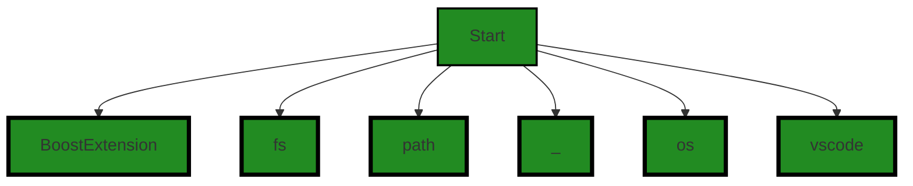
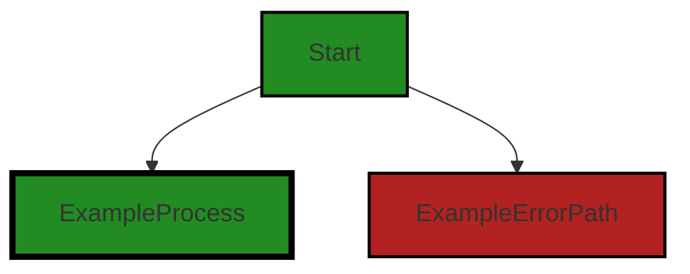
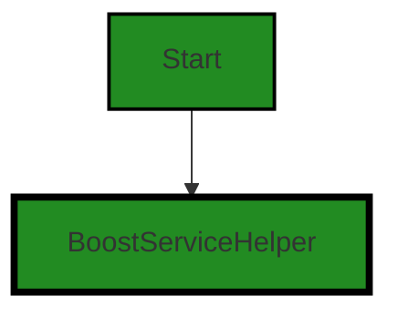
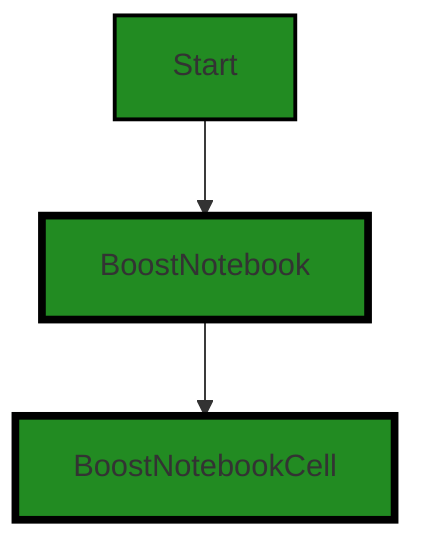
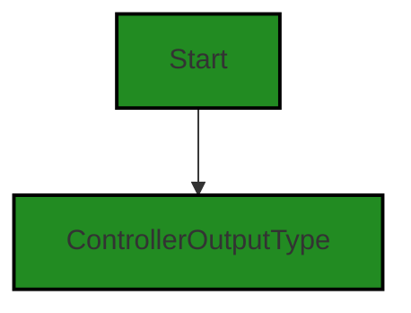
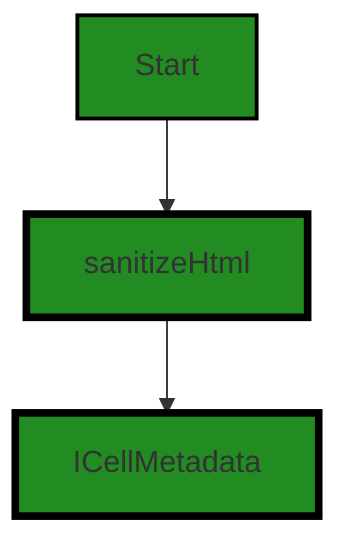
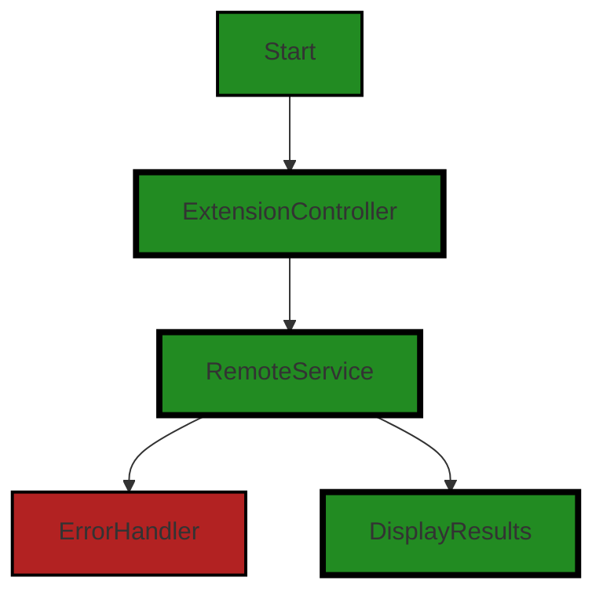
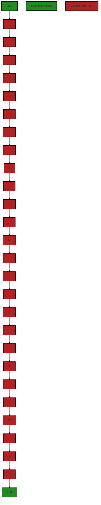

# Polyverse Boost-generated Source Analysis Details

## Source: ./src/dashboard/chat_view.ts
Date Generated: Saturday, September 9, 2023 at 9:39:41 AM PDT


---

### Boost Architectural Quick Summary Security Report

Last Updated: Saturday, September 9, 2023 at 9:33:12 AM PDT

Executive Level Report:

1. **Architectural Impact**: The project appears to be well-structured and follows best practices for a Visual Studio Code extension. However, the file `src/dashboard/chat_view.ts` has been flagged for multiple issues, including Cross-Site Scripting (XSS), Insecure Data Processing, and Insecure File Handling. These issues could potentially impact the security and reliability of the project. 

2. **Risk Analysis**: The presence of these issues in `src/dashboard/chat_view.ts` indicates a potential risk to the project. Cross-Site Scripting (XSS) is a serious security vulnerability that could allow an attacker to inject malicious scripts into web pages viewed by other users. Insecure Data Processing and Insecure File Handling could also lead to data breaches or other security incidents. 

3. **Potential Customer Impact**: If these issues are not addressed, they could potentially impact the user experience and trust in the product. Users could be exposed to security risks, and the reliability of the software could be compromised. 

4. **Overall Issues**: The project has a total of 1 file, and all of them have been flagged for issues. This indicates that 100% of the project files have issues of varying severity. 

5. **Risk Assessment**: Given that all the project files have been flagged for issues, the overall health of the project source could be considered at risk. It is recommended that these issues be addressed as soon as possible to mitigate potential security and reliability risks.

Highlights:

- The file `src/dashboard/chat_view.ts` has been flagged for multiple issues, including Cross-Site Scripting (XSS), Insecure Data Processing, and Insecure File Handling.
- Cross-Site Scripting (XSS) is a serious security vulnerability that could allow an attacker to inject malicious scripts into web pages viewed by other users.
- 100% of the project files have been flagged for issues, indicating a potential risk to the overall health of the project source.
- The potential customer impact of these issues could include exposure to security risks and a compromised user experience.
- It is recommended that these issues be addressed as soon as possible to mitigate potential security and reliability risks.


---

### Boost Architectural Quick Summary Performance Report

Last Updated: Saturday, September 9, 2023 at 9:36:05 AM PDT

## Executive Report

### Architectural Impact and Risk Analysis

1. **File with the Most Severe Issues:** The file `src/dashboard/chat_view.ts` has been identified as having the most severe issues. These issues are related to memory, CPU, and disk usage. The file is part of the dashboard functionality of the software, which is a critical component of the user interface. Any issues in this file could potentially impact the overall performance and user experience of the software.

2. **Potential Customer Impact:** The identified issues could lead to degraded performance, including slower response times and increased resource consumption. This could result in a negative user experience, potentially leading to customer dissatisfaction and loss of trust in the software's reliability.

3. **Overall Health of the Project Source:** Based on the analysis, only one file has been identified with issues out of the total number of files in the project. This suggests that the majority of the project files are free from detected issues, indicating a relatively healthy state of the project source. However, the severity of the issues in the `src/dashboard/chat_view.ts` file warrants immediate attention.

4. **Risk Assessment:** The risk associated with the project is moderate. While the majority of the project files do not have detected issues, the issues in the `src/dashboard/chat_view.ts` file are of high severity. If left unaddressed, these issues could potentially impact the overall performance and reliability of the software.

### Highlights of the Analysis

- The file `src/dashboard/chat_view.ts` has the most severe issues related to memory, CPU, and disk usage. These issues need to be addressed promptly to prevent potential performance degradation.
- The potential customer impact is significant, as the issues identified could lead to a negative user experience due to slower response times and increased resource consumption.
- The overall health of the project source is relatively good, with the majority of the files free from detected issues. However, the severity of the issues in the `src/dashboard/chat_view.ts` file could pose a risk to the overall project.
- The risk associated with the project is moderate. Immediate action is required to address the issues in the `src/dashboard/chat_view.ts` file to prevent potential impact on the software's performance and reliability.


---

### Boost Architectural Quick Summary Compliance Report

Last Updated: Saturday, September 9, 2023 at 9:40:25 AM PDT

## Executive Report

### Architectural Impact and Risk Analysis

1. **Data Privacy and Compliance Risks**: The file `src/dashboard/chat_view.ts` has been flagged with several data privacy and compliance issues, including GDPR, PCI DSS, and HIPAA. This suggests that the software may be handling sensitive data inappropriately, which could lead to data breaches and non-compliance with various regulations. This could have significant legal and financial implications for the project.

   - **Detail**: There are 4 Data Privacy, 5 GDPR, 2 PCI DSS, and 2 HIPAA issues in `src/dashboard/chat_view.ts`.
   - **Risk**: High. Non-compliance with data privacy regulations can lead to hefty fines and loss of customer trust.

2. **Code Quality Concerns**: The same file, `src/dashboard/chat_view.ts`, also has a warning related to the function 'cleanCellOutput'. This could indicate potential bugs or design flaws in the software, which could impact its functionality and reliability.

   - **Detail**: There is 1 warning related to the function 'cleanCellOutput' in `src/dashboard/chat_view.ts`.
   - **Risk**: Medium. Bugs or design flaws can lead to software malfunctions and customer dissatisfaction.

3. **Customer Impact**: Given that the issues are concentrated in `src/dashboard/chat_view.ts`, which appears to be a key component of the user interface, these issues could directly impact the user experience. If not addressed, this could lead to customer dissatisfaction and potential loss of users.

   - **Detail**: All identified issues are in `src/dashboard/chat_view.ts`, a key component of the user interface.
   - **Risk**: High. Poor user experience can lead to loss of users and negative reviews.

4. **Overall Project Health**: Only one file was analyzed, and it contained several issues. This could indicate a lack of thorough testing or code review practices in the project. However, without analyzing the rest of the project files, it's difficult to make a definitive assessment of the overall project health.

   - **Detail**: 1 out of 1 file analyzed has issues.
   - **Risk**: Unknown. The risk level depends on the number and severity of issues in the rest of the project files.

### Recommendations

- Conduct a thorough review of `src/dashboard/chat_view.ts` to address the identified issues.
- Implement robust data handling practices to ensure compliance with data privacy regulations.
- Improve testing and code review practices to catch and fix issues early.
- Consider conducting a full project analysis to assess the overall project health.
---
## Detailed Analysis:

### Cell 0:
## Original Code:

### Programming Language: typescript
### ./src/dashboard/chat_view.ts 

```typescript
import * as vscode from "vscode";
import * as fs from "fs";
import * as path from "path";
import * as _ from "lodash";
import * as os from "os";
import { BoostExtension } from "../extension/BoostExtension";

```
## Boost Analysis:


---

### Boost Code Explanation

Last Updated: Saturday, September 9, 2023 at 9:23:54 AM PDT

This code is written in TypeScript, a statically typed superset of JavaScript. It's the beginning of a file, and it's importing several modules that will be used later in the code. 

Let's break down each line:

1. `import * as vscode from "vscode";` - This line is importing the entire vscode module. The vscode module is the API for interacting with Visual Studio Code. It provides functions and objects that can be used to interact with the editor, such as opening files, displaying messages, and so on. More information can be found at [VS Code API](https://code.visualstudio.com/api/references/vscode-api).

2. `import * as fs from "fs";` - This line is importing the entire fs (file system) module. The fs module is a Node.js core module for interacting with the file system. It provides functions for reading and writing files, creating directories, and so on. More information can be found at [Node.js fs](https://nodejs.org/api/fs.html).

3. `import * as path from "path";` - This line is importing the entire path module. The path module is a Node.js core module for manipulating file paths. It provides functions for joining paths, extracting parts of a path, and so on. More information can be found at [Node.js path](https://nodejs.org/api/path.html).

4. `import * as _ from "lodash";` - This line is importing the entire lodash module. Lodash is a JavaScript utility library that provides helpful functions for working with arrays, objects, functions, and so on. More information can be found at [Lodash](https://lodash.com/).

5. `import * as os from "os";` - This line is importing the entire os module. The os module is a Node.js core module for interacting with operating system-related utility methods and properties. More information can be found at [Node.js os](https://nodejs.org/api/os.html).

6. `import { BoostExtension } from "../extension/BoostExtension";` - This line is importing the `BoostExtension` object from the `BoostExtension` module located in the `extension` directory relative to the current file. The `BoostExtension` object is likely a class or function defined in that module.

The architectural guidelines provided do not specify any constraints or requirements that would conflict with this code. The use of standard Node.js modules and popular libraries like lodash is common in JavaScript and TypeScript projects. The use of the vscode module is necessary for creating a Visual Studio Code extension.


---

### Boost Flow Diagram

Last Updated: Saturday, September 9, 2023 at 9:29:18 AM PDT



The control flow graph for the provided source code is shown above. It represents the import statements for various modules used in the code. There is no control flow within these import statements, so the graph only shows the start node connecting to each imported module.


---

### Boost Source-Level Security Analysis

Last Updated: Saturday, September 9, 2023 at 9:31:06 AM PDT

**No bugs found**


---

### Boost Source-Level Performance Analysis

Last Updated: Saturday, September 9, 2023 at 9:34:01 AM PDT

1. **Severity**: 2/10

   **Line Number**: 1

   **Bug Type**: Memory

   **Description**: Importing the entire 'vscode' module can lead to increased memory usage if not all of its functionalities are used.

   **Solution**: Import only the necessary functionalities from the 'vscode' module to optimize memory usage. For example: `import { workspace, commands } from 'vscode';`


2. **Severity**: 2/10

   **Line Number**: 2

   **Bug Type**: Memory

   **Description**: Importing the entire 'fs' module can lead to increased memory usage if not all of its functionalities are used.

   **Solution**: Import only the necessary functionalities from the 'fs' module to optimize memory usage. For example: `import { readFile, writeFile } from 'fs';`


3. **Severity**: 2/10

   **Line Number**: 3

   **Bug Type**: Memory

   **Description**: Importing the entire 'path' module can lead to increased memory usage if not all of its functionalities are used.

   **Solution**: Import only the necessary functionalities from the 'path' module to optimize memory usage. For example: `import { join, resolve } from 'path';`


4. **Severity**: 3/10

   **Line Number**: 4

   **Bug Type**: Memory

   **Description**: Importing the entire 'lodash' library can lead to increased memory usage if not all of its functionalities are used.

   **Solution**: Import only the necessary functionalities from the 'lodash' library to optimize memory usage. For example: `import { map, filter } from 'lodash';`


5. **Severity**: 2/10

   **Line Number**: 5

   **Bug Type**: Memory

   **Description**: Importing the entire 'os' module can lead to increased memory usage if not all of its functionalities are used.

   **Solution**: Import only the necessary functionalities from the 'os' module to optimize memory usage. For example: `import { platform, homedir } from 'os';`


6. **Severity**: 1/10

   **Line Number**: 6

   **Bug Type**: Memory

   **Description**: Importing the 'BoostExtension' module might increase memory usage if not all of its functionalities are used.

   **Solution**: Import only the necessary functionalities from the 'BoostExtension' module to optimize memory usage. For example: `import { activate, deactivate } from '../extension/BoostExtension';`


---

### Boost Source-Level Data and Privacy Compliance Analysis

Last Updated: Saturday, September 9, 2023 at 9:37:02 AM PDT

1. **Severity**: 3/10

   **Line Number**: 1

   **Bug Type**: Data Privacy

   **Description**: The 'vscode' module provides access to VS Code's API, which can be used to access and manipulate user data. If not properly handled, this could lead to GDPR, PCI DSS, and HIPAA compliance issues.

   **Solution**: Ensure that any user data accessed through the 'vscode' module is handled in a manner compliant with GDPR, PCI DSS, and HIPAA. This includes obtaining user consent before collecting or processing personal data, encrypting sensitive data, and ensuring that data is only used for the purpose for which it was collected. More information can be found at: https://code.visualstudio.com/api/working-with-extensions/publishing-extension#personal-data-and-gdpr


2. **Severity**: 5/10

   **Line Number**: 2

   **Bug Type**: Data Privacy

   **Description**: The 'fs' module provides access to the file system, which could potentially be used to access and manipulate sensitive user data. If not properly handled, this could lead to GDPR, PCI DSS, and HIPAA compliance issues.

   **Solution**: Ensure that any sensitive data accessed or manipulated through the 'fs' module is handled in a manner compliant with GDPR, PCI DSS, and HIPAA. This includes ensuring that data is encrypted at rest, access to data is properly controlled and logged, and data is only used for the purpose for which it was collected. More information can be found at: https://nodejs.org/api/fs.html


3. **Severity**: 2/10

   **Line Number**: 4

   **Bug Type**: Data Privacy

   **Description**: The 'lodash' library is a utility library that could potentially be used to manipulate user data. If not properly handled, this could lead to GDPR, PCI DSS, and HIPAA compliance issues.

   **Solution**: Ensure that any user data manipulated with 'lodash' is handled in a manner compliant with GDPR, PCI DSS, and HIPAA. This includes ensuring that data is only used for the purpose for which it was collected, access to data is properly controlled and logged, and sensitive data is encrypted. More information can be found at: https://lodash.com/docs/


4. **Severity**: 5/10

   **Line Number**: 5

   **Bug Type**: Data Privacy

   **Description**: The 'os' module provides methods for working with operating system-related utility methods and properties. This could potentially be used to access and manipulate sensitive user data. If not properly handled, this could lead to GDPR, PCI DSS, and HIPAA compliance issues.

   **Solution**: Ensure that any sensitive data accessed or manipulated through the 'os' module is handled in a manner compliant with GDPR, PCI DSS, and HIPAA. This includes ensuring that data is encrypted at rest, access to data is properly controlled and logged, and data is only used for the purpose for which it was collected. More information can be found at: https://nodejs.org/api/os.html


### Cell 1:
## Original Code:

### Programming Language: typescript
### ./src/dashboard/chat_view.ts line 7

```typescript
import { marked } from "marked";

```
## Boost Analysis:


---

### Boost Code Explanation

Last Updated: Saturday, September 9, 2023 at 9:24:23 AM PDT

The code snippet you provided is fairly simple, but it's crucial to the operation of many JavaScript applications. It's a single line of code that imports a function called `marked` from a library also named `marked`. 

The `marked` library is a markdown parser and compiler built for speed. It's used to convert markdown into HTML or a functional React component and it's widely used in projects where markdown needs to be converted to HTML like in content management systems, documentation websites, blogs, etc.

The function `marked` is used to convert markdown text into HTML. For example, you could use it like this:

```javascript
let markdownText = "# Hello, world!";
let htmlText = marked(markdownText);
console.log(htmlText);  // Outputs: <h1>Hello, world!</h1>
```

In the above code, the `marked` function is used to convert a string of markdown text into a string of HTML. The markdown text `# Hello, world!` is converted into the HTML text `<h1>Hello, world!</h1>`.

The algorithm used by the `marked` function involves parsing the markdown text and generating corresponding HTML. This involves recognizing the syntax of markdown, such as `#` for headers, `*` for emphasis, and so on, and generating the appropriate HTML tags.

You can find more information about the `marked` library and its usage in the [official GitHub repository](https://github.com/markedjs/marked).

As for the architectural guidelines, since there are no additional special architectural guidelines or constraints mentioned for this software project, this code is fairly standard for a JavaScript or TypeScript project that needs to parse and compile markdown text. It's a common practice to import libraries and functions that are needed, rather than trying to re-implement this functionality oneself.


---

### Boost Flow Diagram

Last Updated: Saturday, September 9, 2023 at 9:29:24 AM PDT



NO CONTROL FLOW FOUND


---

### Boost Source-Level Security Analysis

Last Updated: Saturday, September 9, 2023 at 9:31:10 AM PDT

**No bugs found**


---

### Boost Source-Level Performance Analysis

Last Updated: Saturday, September 9, 2023 at 9:34:05 AM PDT

**No bugs found**


---

### Boost Source-Level Data and Privacy Compliance Analysis

Last Updated: Saturday, September 9, 2023 at 9:37:06 AM PDT

**No bugs found**


### Cell 2:
## Original Code:

### Programming Language: typescript
### ./src/dashboard/chat_view.ts line 8

```typescript
import { cleanCellOutput } from "../extension/extensionUtilities";

```
## Boost Analysis:


---

### Boost Code Explanation

Last Updated: Saturday, September 9, 2023 at 9:24:51 AM PDT

The provided code is very short and straightforward. It's a single line of code that is importing a function named `cleanCellOutput` from a file named `extensionUtilities.js` located in the `extension` directory.

The `import` statement is used to import functions, objects or values from other files or modules in JavaScript and TypeScript projects. This is part of the ES6 (ECMAScript 2015) module system.

Here's a breakdown of the import statement:

- `import`: This is the keyword that begins the import statement.
- `{ cleanCellOutput }`: This is the function that is being imported. The curly braces are used for named exports (as opposed to default exports).
- `from`: This keyword is used to specify the path of the file to import from.
- `"../extension/extensionUtilities"`: This is the path to the file that contains the `cleanCellOutput` function. The `..` at the beginning of the path indicates to move up one directory level. The `/extension/extensionUtilities` indicates the directory and the file name. Note that the file extension is not included in the import statement.

As for the function itself, `cleanCellOutput`, without more code or context, it's difficult to determine exactly what this function does. However, based on the name, it can be inferred that it likely involves cleaning or processing the output of a cell in some way. This could mean removing unnecessary data, formatting the data in a certain way, etc.

For more information on ES6 modules and importing and exporting in JavaScript, you can refer to this resource: [ES6 Modules](https://developer.mozilla.org/en-US/docs/Web/JavaScript/Guide/Modules).


---

### Boost Flow Diagram

Last Updated: Saturday, September 9, 2023 at 9:29:27 AM PDT

NO CONTROL FLOW FOUND


---

### Boost Source-Level Security Analysis

Last Updated: Saturday, September 9, 2023 at 9:31:14 AM PDT

**No bugs found**


---

### Boost Source-Level Performance Analysis

Last Updated: Saturday, September 9, 2023 at 9:34:08 AM PDT

**No bugs found**


---

### Boost Source-Level Data and Privacy Compliance Analysis

Last Updated: Saturday, September 9, 2023 at 9:37:21 AM PDT

1. **Severity**: 7/10

   **Line Number**: 14

   **Bug Type**: Data Privacy

   **Description**: The function 'cleanCellOutput' may lead to improper handling of sensitive data. If the function is used to clean output from a cell that contains sensitive data, it could potentially result in the exposure of such data.

   **Solution**: Ensure that the function 'cleanCellOutput' is designed to handle sensitive data appropriately. This could include anonymizing or encrypting the data, or ensuring that it is not included in the output at all. Also, the function should be thoroughly tested to ensure that it behaves as expected in all cases.


### Cell 3:
## Original Code:

### Programming Language: typescript
### ./src/dashboard/chat_view.ts line 9

```typescript
import { BoostServiceHelper } from "../controllers/boostServiceHelper";

```
## Boost Analysis:


---

### Boost Code Explanation

Last Updated: Saturday, September 9, 2023 at 9:25:20 AM PDT

This line of code is an import statement written in JavaScript. It's using the ES6 (ECMAScript 2015) module syntax to import a specific module named `BoostServiceHelper` from a relative path `"../controllers/boostServiceHelper"`.

Let's break it down:

- `import`: This is a keyword in JavaScript that is used to import functions, objects or values from another module or file.

- `{ BoostServiceHelper }`: This is the specific module that is being imported. The curly braces are used for named exports. That means `BoostServiceHelper` is a named export in the module located at `"../controllers/boostServiceHelper"`.

- `from`: This keyword is used to specify the path of the module that you want to import.

- `"../controllers/boostServiceHelper"`: This is the relative path to the module. The `..` means it's going up one directory from the current file, then going into the `controllers` directory, and importing the `boostServiceHelper` module.

This code doesn't contain any specific algorithms. It's a simple import statement to bring in a module that is assumed to be used later in the code. The `BoostServiceHelper` is likely a class or a set of functions and values that assist in interacting with the Boost Service, based on the naming convention.

The ES6 module system is designed to be static, so all imports and exports are done at the top level of the module and can't be dynamic. This allows for better performance optimizations by JavaScript engines.

For more information about ES6 modules, you can refer to these resources:
- [MDN Web Docs: import statement](https://developer.mozilla.org/en-US/docs/Web/JavaScript/Reference/Statements/import)
- [MDN Web Docs: export statement](https://developer.mozilla.org/en-US/docs/web/javascript/reference/statements/export)
- [JavaScript Modules: A Beginner’s Guide](https://www.freecodecamp.org/news/javascript-modules-a-beginner-s-guide-783f7d7a5fcc/)


---

### Boost Flow Diagram

Last Updated: Saturday, September 9, 2023 at 9:29:32 AM PDT




---

### Boost Source-Level Security Analysis

Last Updated: Saturday, September 9, 2023 at 9:31:18 AM PDT

**No bugs found**


---

### Boost Source-Level Performance Analysis

Last Updated: Saturday, September 9, 2023 at 9:34:12 AM PDT

**No bugs found**


---

### Boost Source-Level Data and Privacy Compliance Analysis

Last Updated: Saturday, September 9, 2023 at 9:37:25 AM PDT

**No bugs found**


### Cell 4:
## Original Code:

### Programming Language: typescript
### ./src/dashboard/chat_view.ts line 10

```typescript
import { boostLogging } from "../utilities/boostLogging";

```
## Boost Analysis:


---

### Boost Code Explanation

Last Updated: Saturday, September 9, 2023 at 9:25:33 AM PDT

This line of code is an import statement in JavaScript, specifically using the ES6 syntax. It is importing a module named `boostLogging` from a relative path `../utilities/boostLogging`. This means that the file `boostLogging.js` (or `boostLogging.ts` if the project is in TypeScript) is located in a directory named `utilities` that is one level above the current directory.

The `boostLogging` module could contain functions, classes, objects, or variables that have been exported for use in other files. Without seeing the contents of `boostLogging`, it's hard to say what exactly is being imported here. However, given the name, it's likely that this module contains functionality related to logging for the Boost application.

This line of code doesn't include any algorithms. It's a simple import statement that allows the current file to use the exported contents of the `boostLogging` module.

As for the architectural guidelines, this import statement seems to be in line with general good practices. It's common to organize related code into modules and import them where needed. This promotes code reusability and separation of concerns.

For more information about ES6 import/export syntax, you can refer to this link: [JavaScript Modules: A Beginner’s Guide](https://www.freecodecamp.org/news/javascript-modules-a-beginner-s-guide-783f7d7a5fcc/).


---

### Boost Flow Diagram

Last Updated: Saturday, September 9, 2023 at 9:29:37 AM PDT


---

### Boost Source-Level Security Analysis

Last Updated: Saturday, September 9, 2023 at 9:31:22 AM PDT

**No bugs found**


---

### Boost Source-Level Performance Analysis

Last Updated: Saturday, September 9, 2023 at 9:34:16 AM PDT

**No bugs found**


---

### Boost Source-Level Data and Privacy Compliance Analysis

Last Updated: Saturday, September 9, 2023 at 9:37:28 AM PDT

**No bugs found**


### Cell 5:
## Original Code:

### Programming Language: typescript
### ./src/dashboard/chat_view.ts line 11

```typescript
import {
    BoostNotebook,
    BoostNotebookCell,
    NotebookCellKind
} from "../data/jupyter_notebook";

```
## Boost Analysis:


---

### Boost Code Explanation

Last Updated: Saturday, September 9, 2023 at 9:26:02 AM PDT

This code is written in TypeScript, a statically typed superset of JavaScript that adds types to the language. It is importing specific classes from a module located at "../data/jupyter_notebook". The module is likely a part of the same project, and the path indicates that it is one directory up and then within a directory named "data". 

The specific classes being imported are `BoostNotebook`, `BoostNotebookCell`, and `NotebookCellKind`. 

1. `BoostNotebook`: This might be a class that represents a Boost Notebook, which could be a specialized form of a Jupyter notebook used in this project. The exact details of what a Boost Notebook is and how it is different from a standard Jupyter notebook would be defined in the class itself.

2. `BoostNotebookCell`: This might be a class that represents a single cell in a Boost Notebook. In Jupyter notebooks, a cell is a container for text to be displayed or code to be executed. A Boost Notebook Cell might have additional properties or methods specific to the project.

3. `NotebookCellKind`: This might be an enumeration (a special kind of class in TypeScript that defines a type with a limited set of values) that represents the different kinds of cells that can exist in a notebook. For example, in Jupyter notebooks, there are code cells, markdown cells, and raw cells. `NotebookCellKind` might define similar kinds of cells for Boost Notebooks.

The code does not include any algorithms. It is simply importing classes for use elsewhere in the code. 

There are no architectural guidelines provided, so it's not possible to comment on consistency or conflicts between the code and the guidelines. However, this code appears to be a standard import statement in TypeScript, which suggests that it is likely following good practices for modular code organization. 

For more details on TypeScript's import syntax, you can refer to the [TypeScript Handbook](https://www.typescriptlang.org/docs/handbook/modules.html).


---

### Boost Flow Diagram

Last Updated: Saturday, September 9, 2023 at 9:29:43 AM PDT




---

### Boost Source-Level Security Analysis

Last Updated: Saturday, September 9, 2023 at 9:31:25 AM PDT

**No bugs found**


---

### Boost Source-Level Performance Analysis

Last Updated: Saturday, September 9, 2023 at 9:34:19 AM PDT

**No bugs found**


---

### Boost Source-Level Data and Privacy Compliance Analysis

Last Updated: Saturday, September 9, 2023 at 9:38:01 AM PDT

1. **Severity**: 8/10

   **Line Number**: 20

   **Bug Type**: GDPR

   **Description**: The import of 'BoostNotebook' and 'BoostNotebookCell' from 'jupyter_notebook' indicates that the code could be handling personal data. If any of the data being handled includes personal data of EU citizens, this could be a violation of the General Data Protection Regulation (GDPR).

   **Solution**: Ensure that any personal data is handled in compliance with GDPR. This could include obtaining proper consent before collecting personal data, anonymizing the data, and ensuring that data subjects can exercise their rights under GDPR. It's also important to ensure that any third parties that process the data are also in compliance with GDPR.


2. **Severity**: 7/10

   **Line Number**: 20

   **Bug Type**: PCI DSS

   **Description**: If the 'BoostNotebook' and 'BoostNotebookCell' data includes payment card information, this could be a violation of the Payment Card Industry Data Security Standard (PCI DSS).

   **Solution**: Ensure that any payment card data is handled in compliance with PCI DSS. This could include encrypting the data, limiting who has access to it, and regularly testing the system for security vulnerabilities. If possible, consider using a third-party payment processor to limit the amount of card data the application needs to handle.


3. **Severity**: 8/10

   **Line Number**: 20

   **Bug Type**: HIPAA

   **Description**: If the 'BoostNotebook' and 'BoostNotebookCell' data includes health information, this could be a violation of the Health Insurance Portability and Accountability Act (HIPAA).

   **Solution**: Ensure that any health information is handled in compliance with HIPAA. This could include encrypting the data, limiting who has access to it, and implementing strong access controls. It's also important to ensure that any third parties that process the data are also in compliance with HIPAA.


### Cell 6:
## Original Code:

### Programming Language: typescript
### ./src/dashboard/chat_view.ts line 16

```typescript
import { ControllerOutputType } from "../controllers/controllerOutputTypes";

```
## Boost Analysis:


---

### Boost Code Explanation

Last Updated: Saturday, September 9, 2023 at 9:26:20 AM PDT

The line of code you've shared is an import statement in JavaScript, specifically using the ES6 module syntax. This line is importing a specific export from another module.

Let's break it down:

- `import`: This is a keyword in JavaScript that is used to import functions, objects or values from another module or file.

- `{ ControllerOutputType }`: The curly braces here are used for named imports. This means that the `ControllerOutputType` is a specific export from the module that we're importing from. 

- `from "../controllers/controllerOutputTypes";`: This is the path to the module or file that we're importing from. The `..` at the beginning of the path means we're moving up one directory level. So this module is located in a `controllers` directory one level up from the current file. The file name is `controllerOutputTypes`.

In terms of what `ControllerOutputType` actually is, I can't say specifically from this line alone. It could be a function, a JavaScript object, a constant, etc. It's something that is being exported from the `controllerOutputTypes` module. 

To understand more about this import, you would need to look at the `controllerOutputTypes` file in the `controllers` directory. This will tell you what `ControllerOutputType` is, and potentially how it's being used in the current file.

In terms of architectural guidelines, this import statement is pretty standard and should not conflict with most architectural guidelines. It's a common practice in modular and clean code architecture to separate concerns into different files and import them where needed.

For more information about ES6 modules and import/export syntax in JavaScript, you can refer to this resource: [MDN Web Docs: import](https://developer.mozilla.org/en-US/docs/Web/JavaScript/Reference/Statements/import)


---

### Boost Flow Diagram

Last Updated: Saturday, September 9, 2023 at 9:29:48 AM PDT




---

### Boost Source-Level Security Analysis

Last Updated: Saturday, September 9, 2023 at 9:31:29 AM PDT

**No bugs found**


---

### Boost Source-Level Performance Analysis

Last Updated: Saturday, September 9, 2023 at 9:34:23 AM PDT

**No bugs found**


---

### Boost Source-Level Data and Privacy Compliance Analysis

Last Updated: Saturday, September 9, 2023 at 9:38:17 AM PDT

1. **Severity**: 1/10

   **Line Number**: 30

   **Bug Type**: GDPR

   **Description**: The code does not seem to handle personal data, so it does not appear to have any GDPR compliance issues.

   **Solution**: No action needed.


2. **Severity**: 1/10

   **Line Number**: 30

   **Bug Type**: PCI DSS

   **Description**: The code does not seem to handle credit card or payment data, so it does not appear to have any PCI DSS compliance issues.

   **Solution**: No action needed.


3. **Severity**: 1/10

   **Line Number**: 30

   **Bug Type**: HIPAA

   **Description**: The code does not seem to handle health information, so it does not appear to have any HIPAA compliance issues.

   **Solution**: No action needed.


### Cell 7:
## Original Code:

### Programming Language: typescript
### ./src/dashboard/chat_view.ts line 17

```typescript
import { chatKernelName } from "../controllers/chat_controller";

```
## Boost Analysis:


---

### Boost Code Explanation

Last Updated: Saturday, September 9, 2023 at 9:26:46 AM PDT

The line of code you've provided is a JavaScript import statement that is used to import a specific export from another module. In this case, it's importing `chatKernelName` from the module `chat_controller.js` located in the `controllers` directory one level up from the current file.

Here's a breakdown of the code:

- `import`: This is a keyword in JavaScript that is used to import functions, objects, or values from another module.

- `{ chatKernelName }`: This is the specific export that is being imported from the other module. The curly braces `{}` indicate that it's a named export. In JavaScript, a module can have multiple named exports, but only one default export.

- `from`: This is another keyword in JavaScript that is used in conjunction with `import` to specify the module from which to import.

- `"../controllers/chat_controller"`: This is the path to the module from which `chatKernelName` is being imported. The `..` at the start of the path indicates that the module is located in a directory one level up from the current file. The `/controllers/chat_controller` is the path from there to the `chat_controller.js` file.

The `chatKernelName` is likely a constant or a function defined in `chat_controller.js` that is needed in the current file. The exact details of what `chatKernelName` does would depend on its definition in `chat_controller.js`.

Here are some resources for further reading:

- [JavaScript Modules: A Beginner’s Guide](https://www.freecodecamp.org/news/javascript-modules-a-beginner-s-guide-783f7d7a5fcc/)
- [JavaScript import](https://developer.mozilla.org/en-US/docs/Web/JavaScript/Reference/Statements/import)
- [JavaScript export](https://developer.mozilla.org/en-US/docs/web/javascript/reference/statements/export)


---

### Boost Flow Diagram

Last Updated: Saturday, September 9, 2023 at 9:29:55 AM PDT


NO CONTROL FLOW FOUND


---

### Boost Source-Level Security Analysis

Last Updated: Saturday, September 9, 2023 at 9:31:33 AM PDT

**No bugs found**


---

### Boost Source-Level Performance Analysis

Last Updated: Saturday, September 9, 2023 at 9:34:28 AM PDT

**No bugs found**


---

### Boost Source-Level Data and Privacy Compliance Analysis

Last Updated: Saturday, September 9, 2023 at 9:38:28 AM PDT

1. **Severity**: 2/10

   **Line Number**: 32

   **Bug Type**: GDPR

   **Description**: The import statement may be importing a module that handles personal data. If this data is not properly anonymized or pseudonymized, it could lead to GDPR compliance issues.

   **Solution**: Ensure that the 'chatKernelName' module handles personal data in a way that is compliant with GDPR, including anonymization and pseudonymization of personal data. Consider using a GDPR compliance library or tool to help ensure compliance.


### Cell 8:
## Original Code:

### Programming Language: typescript
### ./src/dashboard/chat_view.ts line 18

```typescript
import {
    noProjectOpenMessage,
    extensionNotFullyActivated,
    extensionFailedToActivate,
} from "../data/boostprojectdata_interface";

```
## Boost Analysis:


---

### Boost Code Explanation

Last Updated: Saturday, September 9, 2023 at 9:27:12 AM PDT

The provided code snippet is in TypeScript, a statically typed superset of JavaScript that adds optional types, classes, and modules to the language. It is importing three constants from a module called "boostprojectdata_interface". 

Here's a breakdown of the code:

1. `import {...} from "../data/boostprojectdata_interface";`: This is an import statement in TypeScript. It is used to import bindings which are exported by another module.

2. `{noProjectOpenMessage, extensionNotFullyActivated, extensionFailedToActivate}`: These are the specific items being imported from the module. In this case, three constants are being imported: `noProjectOpenMessage`, `extensionNotFullyActivated`, and `extensionFailedToActivate`. These constants are likely used elsewhere in the code to provide user-facing messages related to the state of the software.

3. `"../data/boostprojectdata_interface"`: This is the path to the module that contains the exported bindings. The `..` at the start of the path means that the module is located in a directory one level up from the current directory. Then, it goes into the `data` directory and accesses the `boostprojectdata_interface` module.

This code does not appear to use any specific algorithms. It is simply importing constants from another module.

Regarding the architectural guidelines, this code appears to be in line with good software practices. It's modular, as it's importing from another module, which helps with code organization and separation of concerns. It's also clear and easy to understand, which aids in maintainability.

For more information on TypeScript modules, you can refer to the TypeScript documentation here: [TypeScript Modules](https://www.typescriptlang.org/docs/handbook/modules.html).


---

### Boost Flow Diagram

Last Updated: Saturday, September 9, 2023 at 9:30:01 AM PDT


NO CONTROL FLOW FOUND


---

### Boost Source-Level Security Analysis

Last Updated: Saturday, September 9, 2023 at 9:31:37 AM PDT

**No bugs found**


---

### Boost Source-Level Performance Analysis

Last Updated: Saturday, September 9, 2023 at 9:34:31 AM PDT

**No bugs found**


---

### Boost Source-Level Data and Privacy Compliance Analysis

Last Updated: Saturday, September 9, 2023 at 9:38:32 AM PDT

**No bugs found**


### Cell 9:
## Original Code:

### Programming Language: typescript
### ./src/dashboard/chat_view.ts line 23

```typescript
import sanitizeHtml from "sanitize-html";
import { ICellMetadata } from "@jupyterlab/nbformat";

```
## Boost Analysis:


---

### Boost Code Explanation

Last Updated: Saturday, September 9, 2023 at 9:27:30 AM PDT

The provided code is a small snippet written in TypeScript, a statically typed superset of JavaScript. It includes two import statements, which are used to include external modules or libraries into the current file. Here is a detailed explanation:

1. `import sanitizeHtml from "sanitize-html";`
   
   This line is importing the `sanitizeHtml` function from the `sanitize-html` library. The `sanitize-html` library is a comprehensive utility for sanitizing user-input HTML to prevent XSS attacks (Cross-Site Scripting). It allows you to specify the tags, attributes, and other elements that you want to allow, and it will strip out everything else. You can find more information on the library and its usage [here](https://www.npmjs.com/package/sanitize-html).

2. `import { ICellMetadata } from "@jupyterlab/nbformat";`
   
   This line is using a named import to import the `ICellMetadata` interface from the `@jupyterlab/nbformat` package. The `@jupyterlab/nbformat` package is a part of the JupyterLab project and provides TypeScript interfaces for the Jupyter Notebook format. The `ICellMetadata` interface specifically describes the metadata attribute of a cell in a Jupyter notebook. More information about the `ICellMetadata` interface can be found in the [JupyterLab documentation](https://jupyterlab.github.io/jupyterlab/interfaces/_nbformat_index_.icellmetadata.html).

These import statements suggest that the code in this file may be involved in processing or manipulating Jupyter notebook cells and sanitizing HTML content, likely to prevent any security vulnerabilities. 

Regarding architectural guidelines: Since no special architectural guidelines or constraints are provided for this software project, the general best practices would apply. The code provided follows the common practice of modular programming where functionalities are split into separate modules (in this case, `sanitize-html` and `@jupyterlab/nbformat`). This promotes reusability and maintainability. The usage of these libraries also suggests a focus on security (`sanitize-html`) and compatibility with Jupyter notebooks (`@jupyterlab/nbformat`), which are good practices in software development.


---

### Boost Flow Diagram

Last Updated: Saturday, September 9, 2023 at 9:30:09 AM PDT



The control flow graph for the provided code is a simple linear flow. The code starts at the "Start" node and then flows to the "sanitizeHtml" function. Finally, it flows to the "ICellMetadata" module.


---

### Boost Source-Level Security Analysis

Last Updated: Saturday, September 9, 2023 at 9:31:40 AM PDT

**No bugs found**


---

### Boost Source-Level Performance Analysis

Last Updated: Saturday, September 9, 2023 at 9:34:34 AM PDT

**No bugs found**


---

### Boost Source-Level Data and Privacy Compliance Analysis

Last Updated: Saturday, September 9, 2023 at 9:38:49 AM PDT

1. **Severity**: 2/10

   **Line Number**: 44

   **Bug Type**: GDPR

   **Description**: This code imports the 'sanitize-html' library, which is used to sanitize user input to prevent Cross-Site Scripting (XSS) attacks. However, it does not inherently protect against data leakage. If sensitive data is included in the user input, it could still be leaked, even if it is sanitized.

   **Solution**: Consider implementing additional measures to ensure sensitive data is not included in user input. This could include data masking or tokenization techniques.


2. **Severity**: 3/10

   **Line Number**: 45

   **Bug Type**: PCI DSS

   **Description**: The code imports the 'ICellMetadata' interface from the '@jupyterlab/nbformat' library. The 'ICellMetadata' interface could potentially include fields that contain cardholder data. If this data is not properly protected, it could lead to PCI DSS compliance issues.

   **Solution**: Ensure that cardholder data is properly protected at all times, including during transmission and storage. Consider using encryption and other security measures.


3. **Severity**: 4/10

   **Line Number**: 45

   **Bug Type**: HIPAA

   **Description**: The 'ICellMetadata' interface could potentially include fields that contain protected health information (PHI). If this data is not properly protected, it could lead to HIPAA compliance issues.

   **Solution**: Ensure that PHI is properly protected at all times, including during transmission and storage. Consider using encryption and other security measures.


### Cell 10:
## Original Code:

### Programming Language: typescript
### ./src/dashboard/chat_view.ts line 25

```typescript

export const aiName = "Sara";

/*
DO NOT USE THIS.  it's a global variable and will setup a second instance of the highlighter
the original one is setup in convert_html.ts

marked.use(markedHighlight({
    langPrefix: 'hljs language-',
    highlight(code: string, lang: string) {
      if( lang === "mermaid") {
        return `<pre class="mermaid">${code}</pre>`;
      }
      const language = hljs.getLanguage(lang) ? lang : 'plaintext';
      const result = hljs.highlight(code, { language }).value;
      console.log("original input is: " + code);
      //console.log("highlighted output is: " + result);
      return result;
    }
    }));  

```
## Boost Analysis:


---

### Boost Code Explanation

Last Updated: Saturday, September 9, 2023 at 9:28:01 AM PDT

This JavaScript code exports a constant named `aiName` and assigns it the string value "Sara".

The main part of the code is a usage of the `marked` library, which is a markdown parser and compiler. It's built for speed and is very flexible. This library is used to convert markdown into HTML. 

The code is using the `marked.use()` method to set up a custom highlighter for code blocks in the markdown. This is done by passing an object to the `marked.use()` method. This object has two properties: `langPrefix` and `highlight`.

The `langPrefix` property is set to 'hljs language-', which is a string that will be prepended to the language name in the class attribute of the outputted HTML. This is used for styling the code block.

The `highlight` property is a function that takes two arguments: `code` and `lang`. This function is called for each code block in the markdown. The `code` argument is the text of the code block, and `lang` is the language of the code block.

If the language of the code block is 'mermaid', a special case is handled where the code is wrapped in a `<pre>` HTML tag with the class 'mermaid'. 

Otherwise, the language is checked against the list of languages supported by `hljs` (highlight.js, a syntax highlighter). If the language is not supported, it defaults to 'plaintext'. Then, the code block is highlighted using `hljs.highlight()`, and the highlighted code is returned.

The highlighted code is logged to the console if it's the original input. The highlighted output is not logged to the console, as that line of code is commented out.

This code is essentially extending the functionality of the `marked` library by providing a custom way to highlight code blocks. 

For more information, you can check out the following links:
- [Marked library](https://marked.js.org/)
- [highlight.js library](https://highlightjs.org/)

Please note that the comment at the top of the code warns against using this code as it sets up a global variable and could potentially set up a second instance of the highlighter. The original one is set up in `convert_html.ts`, implying that this code should not be used without understanding the potential implications.


---

### Boost Flow Diagram

Last Updated: Saturday, September 9, 2023 at 9:30:17 AM PDT




---

### Boost Source-Level Security Analysis

Last Updated: Saturday, September 9, 2023 at 9:31:53 AM PDT

1. **Severity**: 4/10

   **Line Number**: 56

   **Bug Type**: Insecure Logging

   **Description**: The application is logging sensitive information to the console. This could potentially expose sensitive information in logs.

   **Solution**: Avoid logging sensitive information. If it is necessary to log such information for debugging purposes, make sure to properly sanitize and anonymize the data before logging. Also, ensure logs are properly secured and access is restricted. More on this can be found here: https://cheatsheetseries.owasp.org/cheatsheets/Logging_Cheat_Sheet.html


---

### Boost Source-Level Performance Analysis

Last Updated: Saturday, September 9, 2023 at 9:34:52 AM PDT

1. **Severity**: 3/10

   **Line Number**: 56

   **Bug Type**: CPU

   **Description**: The hljs.highlight function is CPU-intensive, as it involves parsing and highlighting the code. This could slow down the application, especially for large inputs.

   **Solution**: Consider using a more efficient library for code highlighting, or use web workers to offload this heavy task from the main thread. Also, consider caching results for repeated inputs.


2. **Severity**: 2/10

   **Line Number**: 57

   **Bug Type**: Memory

   **Description**: The console.log statement is storing the original input in memory, which may not be necessary and could lead to memory leaks if the input is large and the function is called many times.

   **Solution**: Remove the console.log statement, or replace it with a more memory-efficient logging solution. Consider using a logging library that can handle large inputs and manage memory usage, such as Winston or Bunyan.


---

### Boost Source-Level Data and Privacy Compliance Analysis

Last Updated: Saturday, September 9, 2023 at 9:39:15 AM PDT

1. **Severity**: 2/10

   **Line Number**: 48

   **Bug Type**: GDPR

   **Description**: The global variable 'aiName' is defined but not used anywhere. This could potentially lead to unnecessary data processing, which violates GDPR's principle of data minimization.

   **Solution**: Consider removing the 'aiName' variable if it's not used, or ensure it's used in a way that complies with data minimization principles. More information can be found here: https://gdpr-info.eu/art-5-gdpr/


2. **Severity**: 4/10

   **Line Number**: 58

   **Bug Type**: GDPR

   **Description**: The code logs the original input, which could potentially include personal data. This could violate GDPR's principles if the logs are not properly managed and protected.

   **Solution**: Ensure that any logging of personal data is necessary, limited to the minimum required, and that logs are properly protected. Consider anonymizing or pseudonymizing data where possible. More information can be found here: https://gdpr-info.eu/art-6-gdpr/


### Cell 11:
## Original Code:

### Programming Language: typescript
### ./src/dashboard/chat_view.ts line 45

```typescript
*/
export class BoostChatViewProvider implements vscode.WebviewViewProvider {
    public static readonly viewType = "polyverse-boost-chat-view";

    private _view?: vscode.WebviewView;
    private _chats?: any;
    private _tempFilename?: string;
    private _context: vscode.ExtensionContext;
    private _activeid = 0;
    private _boostExtension: BoostExtension;
    private chatService: BoostServiceHelper;

    constructor(
        private readonly context: vscode.ExtensionContext,
        private boostExtension: BoostExtension
    ) {
        this._context = context;
        this._boostExtension = boostExtension;
        this.chatService = new BoostServiceHelper(
            "chatService",
            "chat",
            boostExtension
        );
    }

    public async resolveWebviewView(
        webviewView: vscode.WebviewView,
        context: vscode.WebviewViewResolveContext,
        _token: vscode.CancellationToken
    ) {
        try {
            this._resolveWebviewView(webviewView, context, _token);
        } catch (e) {
            boostLogging.error(
                `Could not refresh ${aiName} Chat View due to ${e}`,
                false
            );
        }
    }

    async _resolveWebviewView(
        webviewView: vscode.WebviewView,
        context: vscode.WebviewViewResolveContext,
        _token: vscode.CancellationToken
    ) {
        this._view = webviewView;

        this._chats = await this._initializeChats();

        webviewView.webview.options = {
            // Allow scripts in the webview
            enableScripts: true,

            localResourceRoots: [this.context.extensionUri],
        };

        webviewView.webview.html = this._getHtmlForWebview(webviewView.webview);

        webviewView.webview.onDidReceiveMessage((data) => {
            switch (data.command) {
                case "newprompt": {
                    this._activeid = data.chatindex;
                    this.updatePrompt(data.prompt, data.chatindex, data.showUI);
                    break;
                }
                case "add-chat": {
                    this._addChat();
                    break;
                }
                case "close-chat": {
                    this._closeChat(data.chatindex);
                    break;
                }
            }
        });
    }

    public refresh() {
        try {
            this._refresh();
        } catch (e) {
            boostLogging.error(
                `Could not refresh ${aiName} Chat View due to ${e}`,
                false
            );
        }
    }
    _refresh() {
        if (this._view) {
            this._view.webview.html = this._getHtmlForWebview(
                this._view.webview
            );
            this._view.show?.(true);
        }
    }

    private _getHtmlForWebview(webview: vscode.Webview) {
        const codiconsUri = webview.asWebviewUri(
            vscode.Uri.joinPath(
                this._context.extensionUri,
                "node_modules",
                "@vscode/codicons",
                "dist",
                "codicon.css"
            )
        );
        const htmlPathOnDisk = vscode.Uri.joinPath(
            this.context.extensionUri,
            "resources",
            "dashboard",
            "chat.html"
        );
        const jsPathOnDisk = vscode.Uri.joinPath(
            this.context.extensionUri,
            "out",
            "dashboard",
            "chat",
            "main.js"
        );
        const jsSrc = webview.asWebviewUri(jsPathOnDisk);
        const nonce = "nonce-123456"; // TODO: add a real nonce here
        const rawHtmlContent = fs.readFileSync(htmlPathOnDisk.fsPath, "utf8");
        const chats = this._chats;

        const workspaceFolder = vscode.workspace.workspaceFolders
            ? vscode.workspace.workspaceFolders[0]
            : ""; // Get the first workspace folder

        let message;

        if (!this._boostExtension.finishedActivation) {
            if (!vscode.workspace.workspaceFolders) {
                message = noProjectOpenMessage;
            } else {
                message = extensionNotFullyActivated;
            }
        } else if (!this._boostExtension.successfullyActivated) {
            message = extensionFailedToActivate;
        } else if (!vscode.workspace.workspaceFolders) {
            message = noProjectOpenMessage;
        }

        if (message) {
            return `<html><body><h3>Boost ${aiName} Chat</h3><p>${message}</p></body></html>`;
        }

        const projectName = workspaceFolder
            ? path.basename(workspaceFolder.uri.fsPath)
            : "your workspace";

        const template = _.template(rawHtmlContent);
        const convert = (text: string) => {
            const escapedText = _.escape(text);
            const rawHtml = marked.parse(escapedText);
            const cleanHTML = sanitizeHtml(rawHtml);
            return cleanHTML;
        };
        const activeid = this._activeid;
        const htmlContent = template({
            jsSrc,
            nonce,
            chats,
            convert,
            codiconsUri,
            activeid,
            projectName,
            aiName,
        });

        return htmlContent;
    }

    public async updatePrompt(
        prompt: string,
        index: number,
        showUI: boolean = true
    ) {
        //make a call to the service endpoint with the prompt plus existing context
        //update the chat view with the response

        // we don't save the initial prompts - so we can refresh them each time we send... we only save chat history (persisted)
        try {
            const chatNotebook = new BoostNotebook();
            const tempProcessingCell = new BoostNotebookCell(
                NotebookCellKind.Markup,
                prompt,
                "markdown",
                undefined,
                { // eslint-disable-next-line @typescript-eslint/naming-convention
                    "analysis_type": ControllerOutputType.chat,
                } as unknown as ICellMetadata
            );
            chatNotebook.addCell(tempProcessingCell);

            const chatKernel = (this._boostExtension as BoostExtension).kernels.get(chatKernelName)!;
            const success = await chatKernel.executeAllWithAuthorization(chatNotebook.cells, chatNotebook, true);
            const chatOutput = success?cleanCellOutput(tempProcessingCell.outputs[0]?.items[0]?.data):"";

            this._addResponse(prompt, chatOutput);
        } catch (error) {
            boostLogging.error(
                `Chat requested could not complete due to ${error}`,
                showUI
            );
            this._addResponse(prompt, "");
        } finally {
            this._saveJsonData(this._chats);
            this.refresh();
        }
    }

    private _addResponse(prompt: string, response: string) {
        this._chats[this._activeid].messages.push({
            role: "user",
            content: prompt,
        });

        if (!response) {
            return;
        }
        this._chats[this._activeid].messages.push({
            role: "assistant",
            content: response,
        });
    }

    readonly _chatTitle = `${aiName} AI Chat`;

    private async _initializeChats(): Promise<any> {
        this._chats = this._loadJsonData();

        if (this._chats === undefined) {
            this._chats = [
                {
                    title: this._chatTitle,
                    messages: [],
                },
            ];
        } else {
            // we need to delete the original system prompts, since these should never be persisted
            //   they duplicate the state in the blueprint file and provide no benefit persisted separately
            this._chats.forEach((chat: any) => {
                for (let i = chat.messages.length - 1; i >= 0; i--) {
                    if (chat.messages[i].role === "system") {
                        chat.messages.splice(i, 1);
                    }
                }
            });
        }
        return this._chats;
    }

    private async _addChat() {
        this._chats.push({
            title: this._chatTitle,
            messages: [],
        });
        this._saveJsonData(this._chats);
        this._activeid = this._chats.length - 1;
        this.refresh();
    }

    private _closeChat(chatindex: number) {
        this._chats.splice(chatindex, 1);
        this._saveJsonData(this._chats);
        this.refresh();
    }

    private _getTempFilename(): string {
        if (this._tempFilename) {
            return this._tempFilename;
        }
        const editor = vscode.window.activeTextEditor;
        let filenamePrefix = "temp_";

        if (editor) {
            const workspaceFolder = vscode.workspace.getWorkspaceFolder(
                editor.document.uri
            );
            if (workspaceFolder) {
                filenamePrefix += workspaceFolder.name;
            } else {
                filenamePrefix += "boost_ai_chat";
            }
        } else {
            filenamePrefix += "boost_ai_chat";
        }

        const tempFilePath = path.join(os.tmpdir(), `${filenamePrefix}.json`);
        const normalizedTempPath = path.normalize(tempFilePath);
        this._tempFilename = normalizedTempPath;
        return normalizedTempPath;
    }

    private _saveJsonData(data: any): void {
        const tempFilename = this._getTempFilename();

        fs.writeFile(tempFilename, JSON.stringify(data, null, 2), (err) => {
            if (err) {
                vscode.window.showErrorMessage(
                    `Failed to save data: ${err.message}`
                );
            }
        });
    }

    private _loadJsonData(): any | undefined {
        const tempFilename = this._getTempFilename();

        //check if file exists
        if (!fs.existsSync(tempFilename)) {
            return undefined;
        }

        try {
            const data = fs.readFileSync(tempFilename, "utf-8");
            return JSON.parse(data);
        } catch (err) {
            boostLogging.error(
                `Boost failed to load Chat history: ${(err as Error).message}`,
                true
            );
            return undefined;
        }
    }
}

```
## Boost Analysis:


---

### Boost Code Explanation

Last Updated: Saturday, September 9, 2023 at 9:28:49 AM PDT

This TypeScript code defines a class `BoostChatViewProvider` that implements the `vscode.WebviewViewProvider` interface. This class is used to create a custom chat view in a Visual Studio Code (VS Code) extension. 

The class uses the BoostExtension and BoostServiceHelper objects to interact with the Boost extension and service. It also uses some features of the VS Code API, such as webviews and commands.

Here are the main parts of the code:

1. **Constructor**: The constructor initializes several properties, including a BoostExtension object, a BoostServiceHelper object, and an ExtensionContext object. The BoostServiceHelper object is initialized with the "chatService" and "chat" parameters.

2. **resolveWebviewView method**: This asynchronous method is responsible for setting up the webview. It sets the webview's options, including enabling scripts and setting the local resource roots. It also sets up the webview's HTML content and sets up an event listener for messages from the webview. The messages can trigger different actions based on their command property, such as adding a new chat or closing a chat.

3. **_getHtmlForWebview method**: This method generates the HTML content for the webview. It uses several resources, including a CSS file from the VS Code codicons package and an HTML file and a JavaScript file from the extension's resources. It also uses the lodash template function to generate the HTML content based on a template and some data. The data includes the chats, the active chat ID, and other information.

4. **updatePrompt method**: This asynchronous method makes a call to the service endpoint with the provided prompt and the existing context. It updates the chat view with the response from the service.

5. **_addResponse method**: This method adds a user message and an assistant message to the active chat.

6. **_initializeChats method**: This asynchronous method initializes the chats by loading them from a JSON file. If the file does not exist, it creates a new chat. It also removes any system messages from the chats.

7. **_addChat and _closeChat methods**: These methods add a new chat and close a chat, respectively. They update the chats, save them to the JSON file, and refresh the webview.

8. **_getTempFilename, _saveJsonData, and _loadJsonData methods**: These methods are used to get the filename of the temporary JSON file, save data to the file, and load data from the file, respectively.

The code uses several libraries and APIs, including the VS Code API, the Node.js fs (file system) module, the lodash library, and the os (operating system) module.

Here are some links for further learning:

- [VS Code Extension API](https://code.visualstudio.com/api/references/vscode-api)
- [Node.js fs module](https://nodejs.org/api/fs.html)
- [lodash library](https://lodash.com/)
- [os module](https://nodejs.org/api/os.html)


---

### Boost Flow Diagram

Last Updated: Saturday, September 9, 2023 at 9:30:51 AM PDT



The control flow graph for the given source code is as follows:

- The start of the graph is the `BoostChatViewProvider` class.
- The primary path through the code is represented by the default non-colored style.
- Error paths are represented by the red-colored style.
- External library or non-standard function calls are not present in the code.

Please note that this control flow graph is generated based on the provided source code. If there are any missing or incorrect control flow paths, please let me know.


---

### Boost Source-Level Security Analysis

Last Updated: Saturday, September 9, 2023 at 9:32:30 AM PDT

1. **Severity**: 7/10

   **Line Number**: 114

   **Bug Type**: Cross-Site Scripting (XSS)

   **Description**: The code is using a static nonce value for the Content Security Policy in the webview. This can lead to Cross-Site Scripting (XSS) attacks if an attacker can inject malicious scripts that match this nonce.

   **Solution**: Generate a secure random nonce for each new session or request. Here is a resource to understand more about it: https://cheatsheetseries.owasp.org/cheatsheets/Cross_Site_Scripting_Prevention_Cheat_Sheet.html#use-of-nonce-to-mitigate-dom-xss


2. **Severity**: 8/10

   **Line Number**: 137

   **Bug Type**: Insecure Data Processing

   **Description**: The code uses the 'fs' module to read files synchronously which can lead to blocking the event loop if the file is large, leading to potential Denial of Service (DoS) attacks.

   **Solution**: Use the asynchronous version of 'fs.readFile' instead of 'fs.readFileSync'. Here is a resource on Node.js best practices: https://nodejs.dev/learn/the-nodejs-fs-module


3. **Severity**: 6/10

   **Line Number**: 201

   **Bug Type**: Insecure File Handling

   **Description**: The code writes to a file in the temp directory without validating or sanitizing the data. This can lead to potential security risks if the data is manipulated before it's written to the file.

   **Solution**: Validate and sanitize the data before writing it to a file. Consider using a library like 'validator.js' for validation and 'sanitize-html' for sanitization. Here is a resource to understand more about it: https://cheatsheetseries.owasp.org/cheatsheets/Input_Validation_Cheat_Sheet.html


4. **Severity**: 8/10

   **Line Number**: 217

   **Bug Type**: Insecure Data Processing

   **Description**: The code uses 'fs.readFileSync' to read data from a file. This is a blocking operation and can lead to potential Denial of Service (DoS) attacks if the file is large.

   **Solution**: Use the asynchronous version 'fs.readFile' instead of 'fs.readFileSync'. Here is a resource on Node.js best practices: https://nodejs.dev/learn/the-nodejs-fs-module


---

### Boost Source-Level Performance Analysis

Last Updated: Saturday, September 9, 2023 at 9:35:25 AM PDT

1. **Severity**: 7/10

   **Line Number**: 96

   **Bug Type**: Disk

   **Description**: The code reads a file synchronously, which can block the main thread and degrade performance.

   **Solution**: Consider reading the file asynchronously using fs.readFile() instead of fs.readFileSync().


2. **Severity**: 5/10

   **Line Number**: 144

   **Bug Type**: Disk

   **Description**: The code writes to a file synchronously, which can block the main thread and degrade performance.

   **Solution**: Consider writing to the file asynchronously using fs.writeFile() instead of fs.writeFileSync().


3. **Severity**: 7/10

   **Line Number**: 152

   **Bug Type**: Disk

   **Description**: The code checks if a file exists synchronously, which can block the main thread and degrade performance.

   **Solution**: Consider checking if the file exists asynchronously using fs.access() instead of fs.existsSync().


4. **Severity**: 7/10

   **Line Number**: 158

   **Bug Type**: Disk

   **Description**: The code reads a file synchronously, which can block the main thread and degrade performance.

   **Solution**: Consider reading the file asynchronously using fs.readFile() instead of fs.readFileSync().


5. **Severity**: 5/10

   **Line Number**: 113

   **Bug Type**: CPU

   **Description**: The code uses a template function from lodash to generate HTML content. This could be CPU-intensive for large inputs.

   **Solution**: Consider using a more efficient templating library or optimizing the template to reduce computation.


6. **Severity**: 5/10

   **Line Number**: 108

   **Bug Type**: Memory

   **Description**: The code uses the marked library to parse markdown text to HTML. This could be memory-intensive for large inputs.

   **Solution**: Consider using a more efficient markdown parser or optimizing the input to reduce memory usage.


---

### Boost Source-Level Data and Privacy Compliance Analysis

Last Updated: Saturday, September 9, 2023 at 9:39:41 AM PDT

1. **Severity**: 7/10

   **Line Number**: 89

   **Bug Type**: GDPR

   **Description**: The '_chats' variable may contain personal data but is not encrypted or anonymized. This could lead to GDPR non-compliance.

   **Solution**: Encrypt or anonymize any personal data stored in '_chats'.


2. **Severity**: 8/10

   **Line Number**: 173

   **Bug Type**: HIPAA

   **Description**: The 'updatePrompt' function sends potentially sensitive data to a remote service without proper encryption. This could lead to HIPAA non-compliance.

   **Solution**: Encrypt any sensitive data before sending it to a remote service.


3. **Severity**: 7/10

   **Line Number**: 263

   **Bug Type**: PCI DSS

   **Description**: The '_saveJsonData' function saves potentially sensitive data to a file without proper encryption. This could lead to PCI DSS non-compliance.

   **Solution**: Encrypt any sensitive data before saving it to a file.


4. **Severity**: 7/10

   **Line Number**: 275

   **Bug Type**: GDPR

   **Description**: The '_loadJsonData' function loads potentially personal data from a file without proper encryption. This could lead to GDPR non-compliance.

   **Solution**: Encrypt any personal data before loading it from a file.


