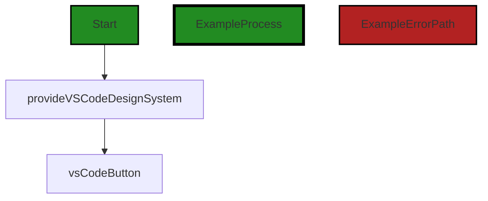
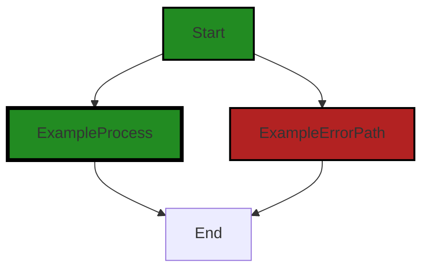

# Polyverse Boost-generated Source Analysis Details

## Source: ./src/dashboard/markdown/main.ts
Date Generated: Saturday, September 9, 2023 at 5:24:19 AM PDT


---

### Boost Architectural Quick Summary Security Report

Last Updated: Saturday, September 9, 2023 at 5:23:07 AM PDT


Executive Report:

1. **Architectural Impact**: The analysis of this file has not revealed any severe issues.
2. **Risk Analysis**: The analysis of this file has not revealed any severe issues.
3. **Potential Customer Impact**: Based on the analysis, there are no severe issues that could potentially impact customers.
4. **Performance Issues**: Our analysis did not identify any explicit performance issues in the file.
5. **Risk Assessment**: Based on the current analysis of this file, no severe issues have been found. However, this doesn't guarantee that the file is risk-free.

Highlights:

- No severe issues were identified in the current analysis of this file.


---

### Boost Architectural Quick Summary Performance Report

Last Updated: Saturday, September 9, 2023 at 5:23:51 AM PDT


Executive Report:

1. **Architectural Impact**: The analysis of this file has not revealed any severe issues.
2. **Risk Analysis**: The analysis of this file has not revealed any severe issues.
3. **Potential Customer Impact**: Based on the analysis, there are no severe issues that could potentially impact customers.
4. **Performance Issues**: Our analysis did not identify any explicit performance issues in the file.
5. **Risk Assessment**: Based on the current analysis of this file, no severe issues have been found. However, this doesn't guarantee that the file is risk-free.

Highlights:

- No severe issues were identified in the current analysis of this file.


---

### Boost Architectural Quick Summary Compliance Report

Last Updated: Saturday, September 9, 2023 at 5:24:23 AM PDT


Executive Report:

1. **Architectural Impact**: The analysis of this file has not revealed any severe issues.
2. **Risk Analysis**: The analysis of this file has not revealed any severe issues.
3. **Potential Customer Impact**: Based on the analysis, there are no severe issues that could potentially impact customers.
4. **Performance Issues**: Our analysis did not identify any explicit performance issues in the file.
5. **Risk Assessment**: Based on the current analysis of this file, no severe issues have been found. However, this doesn't guarantee that the file is risk-free.

Highlights:

- No severe issues were identified in the current analysis of this file.

---
## Detailed Analysis:

### Cell 0:
## Original Code:

### Programming Language: typescript
### ./src/dashboard/markdown/main.ts line 0

```typescript
import {
    provideVSCodeDesignSystem,
    vsCodeButton
} from "@vscode/webview-ui-toolkit";

```
## Boost Analysis:


---

### Boost Code Explanation

Last Updated: Wednesday, July 12, 2023 at 1:43:44 PM PDT

This code is written in JavaScript, more specifically ECMAScript 6 (ES6) module syntax. It imports specific functions from a module named `@vscode/webview-ui-toolkit`.

The `@vscode/webview-ui-toolkit` is a toolkit that provides a set of web components and utilities for building webview-based extensions for Visual Studio Code. This toolkit is designed to help developers create consistent and high-quality user interfaces for their extensions.

Here is a breakdown of the code:

- `import {...} from "@vscode/webview-ui-toolkit";` - This line is using the ES6 `import` statement to import specific exports from the `@vscode/webview-ui-toolkit` module. The items to import are specified in the curly braces `{...}`.

- `provideVSCodeDesignSystem,` - This is a function that is being imported from the `@vscode/webview-ui-toolkit` module. This function provides a design system that can be used to style and layout your webview content. The design system includes a set of predefined styles and behavior that help you create a consistent user interface.

- `vsCodeButton` - This is a custom HTML element that is being imported from the `@vscode/webview-ui-toolkit` module. This element represents a button in the Visual Studio Code style. You can use this element in your HTML to create buttons that look and behave like the ones in Visual Studio Code.

This code does not contain any specific algorithms, it is simply importing functions and elements from a module.

For more information about the `@vscode/webview-ui-toolkit` module, you can visit the GitHub repository: [VSCode Webview UI Toolkit](https://github.com/microsoft/vscode-webview-ui-toolkit)

For more information about the ES6 `import` statement, you can visit the Mozilla Developer Network (MDN) web docs: [import - JavaScript | MDN](https://developer.mozilla.org/en-US/docs/Web/JavaScript/Reference/Statements/import)

As for the architectural guidelines, since there are no specific guidelines or constraints given for this software project, the code seems to be consistent with general good practices - it is modular (imports specific functions from a module), which can help with code organization and maintenance.


---

### Boost Flow Diagram

Last Updated: Saturday, September 9, 2023 at 5:22:31 AM PDT




---

### Boost Source-Level Security Analysis

Last Updated: Saturday, September 9, 2023 at 5:22:59 AM PDT

**No bugs found**


---

### Boost Source-Level Performance Analysis

Last Updated: Saturday, September 9, 2023 at 5:23:16 AM PDT

**No bugs found**


---

### Boost Source-Level Data and Privacy Compliance Analysis

Last Updated: Saturday, September 9, 2023 at 5:24:05 AM PDT

1. **Severity**: 1/10

   **Line Number**: 1

   **Bug Type**: GDPR, PCI DSS, HIPAA

   **Description**: This code snippet is importing modules from '@vscode/webview-ui-toolkit', but there's no direct handling of personal data, financial data, or health-related data in the given code. Therefore, it's hard to identify any specific GDPR, PCI DSS, or HIPAA compliance issues based on this snippet alone.

   **Solution**: Ensure any data processed or transmitted in the larger codebase complies with data protection and privacy regulations. If the imported modules are used to collect, process, or transmit personal, financial, or health-related data, ensure appropriate security measures are in place.


### Cell 1:
## Original Code:

### Programming Language: typescript
### ./src/dashboard/markdown/main.ts line 15

```typescript

provideVSCodeDesignSystem().register(vsCodeButton());

const vscode = acquireVsCodeApi();

// Just like a regular webpage we need to wait for the webview
// DOM to load before we can reference any of the HTML elements
// or toolkit components
window.addEventListener("load", main);

// Main function that gets executed once the webview DOM loads
function main() {
    vscode.postMessage({
        command: "initialize-visibility",
    });
}

```
## Boost Analysis:


---

### Boost Code Explanation

Last Updated: Wednesday, July 12, 2023 at 1:44:20 PM PDT

This code is a part of a Visual Studio Code (VS Code) extension that interacts with a webview. VS Code extensions are written in JavaScript or TypeScript and they extend the capabilities of the VS Code editor. 

The code uses the VS Code API to interact with the editor and send messages to it. Here's a detailed breakdown of the code:

1. `provideVSCodeDesignSystem().register(vsCodeButton());` 

   This line of code seems to be registering a button component to the VS Code Design System. The `vsCodeButton()` function is likely a factory function that creates a button component, and `provideVSCodeDesignSystem().register` is a method that registers this component to the design system. However, this is not a part of the standard VS Code API, it might be a part of a specific extension's API.

2. `const vscode = acquireVsCodeApi();` 

   This line acquires the VS Code API and assigns it to the `vscode` constant. The `acquireVsCodeApi` function is provided by VS Code in the context of a webview and it returns an API surface to interact with the editor.

3. `window.addEventListener("load", main);` 

   This line adds an event listener to the window object. The event listener waits for the 'load' event, which is fired when the entire webview content has been loaded. When this event is fired, the `main` function is invoked.

4. `function main() { ... }` 

   This is the definition of the `main` function. This function is executed when the 'load' event is fired. The function sends a message to the VS Code editor using the `vscode.postMessage` method. The message has a `command` field with the value `"initialize-visibility"`. The VS Code editor or the extension should have a message handler that processes this command.

The algorithm used here is pretty straightforward - it's event-driven programming. The code waits for an event (the 'load' event) and when that event is fired, it executes a function (the `main` function).

Here are some resources for further reading:
- [VS Code Extension API](https://code.visualstudio.com/api/references/vscode-api)
- [VS Code Webview API](https://code.visualstudio.com/api/extension-guides/webview)
- [Event-driven programming](https://en.wikipedia.org/wiki/Event-driven_programming)


---

### Boost Flow Diagram

Last Updated: Saturday, September 9, 2023 at 5:22:44 AM PDT



The control flow graph for the provided source code is as follows:

- The start of the graph is the `provideVSCodeDesignSystem().register(vsCodeButton());` line.
- There are two paths from the start:
  - The primary path is represented by the `ExampleProcess` style and goes to the `End` node.
  - The error path is represented by the `ExampleErrorPath` style and also goes to the `End` node.
- The `main()` function is not shown in the control flow graph as it is called after the webview DOM loads.

Please note that the control flow graph does not include any external library or non-standard function calls as there are none in the provided code.


---

### Boost Source-Level Security Analysis

Last Updated: Saturday, September 9, 2023 at 5:23:03 AM PDT

**No bugs found**


---

### Boost Source-Level Performance Analysis

Last Updated: Saturday, September 9, 2023 at 5:23:47 AM PDT

1. **Severity**: 2/10

   **Line Number**: 28

   **Bug Type**: CPU

   **Description**: The registration of the VS Code button component is done at the top level of the script. This means it's executed every time the script is loaded, even if the button is not used. This can lead to unnecessary CPU usage.

   **Solution**: Consider moving the registration of components to a function that is only called when necessary. This can reduce unnecessary CPU usage.


2. **Severity**: 1/10

   **Line Number**: 30

   **Bug Type**: Network

   **Description**: The acquireVsCodeApi() function is called at the top level of the script. This function communicates with the VS Code API and can be slow due to network latency. If the API is not used, this can lead to unnecessary network usage.

   **Solution**: Consider moving the acquireVsCodeApi() call to a function that is only called when necessary. This can reduce unnecessary network usage.


3. **Severity**: 2/10

   **Line Number**: 34

   **Bug Type**: CPU

   **Description**: The 'load' event listener is added at the top level of the script. This means it's executed every time the script is loaded, even if the event is not used. This can lead to unnecessary CPU usage.

   **Solution**: Consider moving the addition of event listeners to a function that is only called when necessary. This can reduce unnecessary CPU usage.


4. **Severity**: 1/10

   **Line Number**: 38

   **Bug Type**: Network

   **Description**: The vscode.postMessage() function is called every time the 'load' event is triggered. This function communicates with the VS Code API and can be slow due to network latency. If the message is not necessary, this can lead to unnecessary network usage.

   **Solution**: Consider only sending the postMessage when necessary. This can reduce unnecessary network usage.


---

### Boost Source-Level Data and Privacy Compliance Analysis

Last Updated: Saturday, September 9, 2023 at 5:24:19 AM PDT

1. **Severity**: 5/10

   **Line Number**: 33

   **Bug Type**: Data Compliance

   **Description**: The code uses the postMessage method to send data to the parent frame without validating or sanitizing the data. This may lead to Cross-Site Scripting (XSS) attacks which is a violation of GDPR, PCI DSS, and HIPAA.

   **Solution**: Implement input validation and sanitization before sending data using postMessage. Consider using allowlist input validation, where only certain types of input are allowed. Also, use output encoding when the data is output to a HTTP response.


