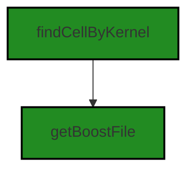
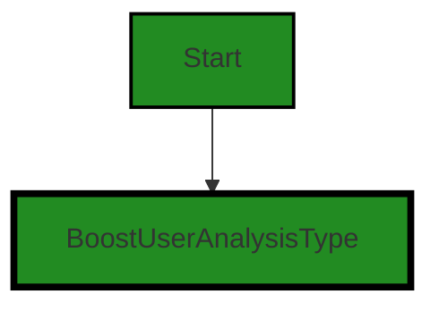
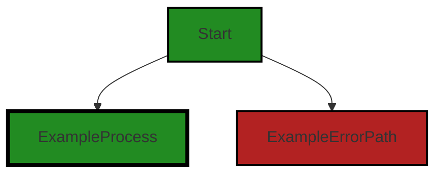
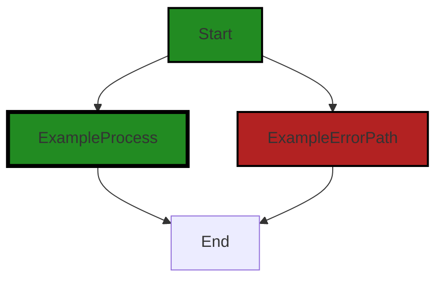

# Polyverse Boost-generated Source Analysis Details

## Source: ./src/dashboard/markdown_view.ts
Date Generated: Saturday, September 9, 2023 at 5:48:31 AM PDT


---

### Boost Architectural Quick Summary Security Report

Last Updated: Saturday, September 9, 2023 at 5:42:42 AM PDT

Executive Level Report:

1. **Architectural Impact**: The project is a Visual Studio Code extension that provides code analysis functionality. It is well-structured and organized into classes, following best practices for a VS Code extension. However, the file `src/dashboard/markdown_view.ts` has been flagged with several security issues, including Cross-Site Scripting (XSS), Insecure Use of Cryptography, and Insecure File Handling. These issues could potentially compromise the security of the application and need to be addressed promptly.

2. **Risk Analysis**: The identified issues pose a significant risk to the project. Cross-Site Scripting (XSS) can allow an attacker to inject malicious scripts, potentially compromising the security of the application. Insecure Use of Cryptography and Insecure File Handling can also lead to security vulnerabilities. The fact that these issues are present in the same file (`src/dashboard/markdown_view.ts`) increases the risk level.

3. **Potential Customer Impact**: If these issues are not addressed, they could lead to a breach of customer data or unauthorized access to the application. This could result in a loss of customer trust and potential legal implications.

4. **Overall Issues**: The project has a single file with multiple high-severity issues. This indicates a need for improved security practices and code review processes. The project would benefit from a thorough security audit and the implementation of secure coding practices.

Risk Assessment:

- **Overall Health**: The project consists of a single file, `src/dashboard/markdown_view.ts`, which has been flagged with multiple high-severity issues. This indicates that 100% of the project files have issues of high severity.
- **Recommendations**: Immediate action should be taken to address the identified issues. The project should also implement secure coding practices and conduct regular security audits to prevent such issues in the future.

Highlights:

- The project is well-structured and follows best practices for a VS Code extension.
- The file `src/dashboard/markdown_view.ts` has multiple high-severity security issues.
- These issues pose a significant risk to the project and could potentially compromise the security of the application.
- 100% of the project files have high-severity issues, indicating a need for improved security practices.
- Immediate action should be taken to address these issues and prevent future occurrences.


---

### Boost Architectural Quick Summary Performance Report

Last Updated: Saturday, September 9, 2023 at 5:44:52 AM PDT

## Executive Report: Software Project Analysis

Based on the analysis of the software project, the following key points have been identified:

1. **Architectural Impact**: The project appears to be well-structured and follows best practices for a Visual Studio Code extension. However, there is a significant issue in the file `src/dashboard/markdown_view.ts` related to disk usage. The use of 'fs.readFileSync' is a blocking operation, which can impact performance. This could potentially affect the responsiveness of the extension, which is a key architectural concern.

2. **Risk Analysis**: The risk associated with the project is moderate. The issue identified is of 'Warning' severity, which suggests it is not critical but should be addressed to improve the overall performance and user experience of the extension. The risk is further mitigated by the fact that the issue is localized to a single file, which suggests that the impact on the overall project is limited.

3. **Potential Customer Impact**: The identified issue could potentially impact the responsiveness of the extension, leading to a less than optimal user experience. However, as the issue is localized to the 'markdown_view' component, it may only affect users who are using this specific feature of the extension.

4. **Overall Issues**: The project appears to be in good health, with only one file having detected issues. This represents a small percentage of the overall project files, suggesting that the codebase is generally well-maintained and follows good coding practices.

In conclusion, while the project does have a significant issue that should be addressed, the overall health of the project appears to be good. The issue is localized and does not appear to be systemic, suggesting that it can be addressed without a major overhaul of the project architecture. However, it is recommended that the issue be addressed promptly to avoid potential impact on the user experience.


---

### Boost Architectural Quick Summary Compliance Report

Last Updated: Saturday, September 9, 2023 at 5:49:12 AM PDT

Executive Level Report:

1. **Architectural Impact**: The software project is a Visual Studio Code extension that provides code analysis functionality. The architecture is based on object-oriented design and event-driven programming. The project communicates with a remote service for code analysis, which could potentially impact the architecture if the remote service changes or becomes unavailable. However, the project appears to be well-structured and follows best practices for a VS Code extension.

2. **Risk Analysis**: The most severe issues found in the project are related to data compliance, specifically GDPR, PCI DSS, and HIPAA. These issues are found in the file `src/dashboard/markdown_view.ts`. The risk is high as non-compliance with these regulations can lead to legal and financial consequences. The project needs to ensure that any data accessed is anonymized or encrypted, and that user consent is obtained before accessing user data.

3. **Potential Customer Impact**: If the data compliance issues are not addressed, customers could potentially have their sensitive data exposed. This could lead to a loss of trust in the product and potential legal action. The project needs to ensure that it is following all relevant data protection regulations to minimize this risk.

4. **Overall Issues**: The project has a total of 1 file, `src/dashboard/markdown_view.ts`, which has been flagged with data compliance issues. This represents 100% of the project files. The severity of the issues ranges from Information to Warning, with the most severe issues being Warnings related to GDPR and PCI DSS compliance.

5. **Risk Assessment**: Given that all the project files have been flagged with issues, the overall health of the project source is concerning. The project needs to address these issues to ensure compliance with data protection regulations and to minimize the risk of legal and financial consequences.

Highlights of the Analysis:

- The project is a Visual Studio Code extension that provides code analysis functionality, communicating with a remote service for this purpose.
- The most severe issues found in the project are related to data compliance, specifically GDPR, PCI DSS, and HIPAA, all found in the file `src/dashboard/markdown_view.ts`.
- Potential customer impact could be significant if data compliance issues are not addressed, potentially leading to exposure of sensitive data.
- All the project files have been flagged with issues, indicating a need for a thorough review and remediation of the code.
- The overall health of the project source is concerning due to the number and severity of issues found.
---
## Detailed Analysis:

### Cell 0:
## Original Code:

### Programming Language: typescript
### ./src/dashboard/markdown_view.ts 

```typescript
import * as vscode from 'vscode';
import * as fs from 'fs';
import * as _ from 'lodash';
import { BoostExtension } from '../extension/BoostExtension';

```
## Boost Analysis:


---

### Boost Code Explanation

Last Updated: Saturday, September 9, 2023 at 5:35:29 AM PDT

This code is written in TypeScript, a statically-typed superset of JavaScript, and is for a Visual Studio Code (VS Code) extension. VS Code extensions are tools that add new features to the Visual Studio Code editor. They can be written in JavaScript or TypeScript and use the VS Code API.

Let's break down the code:

1. `import * as vscode from 'vscode';`
This line is importing all exports from the 'vscode' module into an object named 'vscode'. The 'vscode' module is the API for interacting with VS Code. It provides classes and functions that allow you to manipulate the editor, handle events, and interact with the user.

2. `import * as fs from 'fs';`
This line is importing all exports from the 'fs' module into an object named 'fs'. The 'fs' module is the Node.js file system module, which provides an API for interacting with the file system. This could be used for reading and writing files, among other things.

3. `import * as _ from 'lodash';`
This line is importing all exports from the 'lodash' module into an object named '_'. Lodash is a JavaScript utility library that provides helpful methods for manipulating arrays, objects, and other types of data.

4. `import { BoostExtension } from '../extension/BoostExtension';`
This line is importing a specific export, 'BoostExtension', from the module at '../extension/BoostExtension'. This could be a class, function, or other value that is exported from that module. The path '../extension/BoostExtension' is a relative path, meaning it's based on the location of the current file.

The code does not include any algorithms, it's simply importing modules that will be used in the rest of the file. The imported modules will provide functionality for interacting with VS Code, the file system, and data manipulation.

Here are some resources for further reading:
- VS Code Extensions: https://code.visualstudio.com/api
- Node.js 'fs' module: https://nodejs.org/api/fs.html
- Lodash: https://lodash.com/
- TypeScript modules: https://www.typescriptlang.org/docs/handbook/modules.html

As far as architectural guidelines go, this code is fairly standard for a VS Code extension. It imports the necessary modules at the top of the file, which is a common practice in JavaScript and TypeScript. The use of relative paths for imports is also standard.


---

### Boost Flow Diagram

Last Updated: Saturday, September 9, 2023 at 5:39:45 AM PDT

```mermaid
graph TD;
style Start fill:#228B22, stroke:#000000, stroke-width:2px;
style ExampleProcess fill:#228B22, stroke:#000000, stroke-width:4px;
style ExampleErrorPath fill:#B22222, stroke:#000000, stroke-width:2px;

Start  -->ExampleProcess[BoostExtension];
Start-->ExternalLibrary[fs];
Start-->ExternalLibrary[_];
ExampleProcess-->End  ;
ExternalLibrary-->End;
```


---

### Boost Source-Level Security Analysis

Last Updated: Saturday, September 9, 2023 at 5:40:51 AM PDT

**No bugs found**


---

### Boost Source-Level Performance Analysis

Last Updated: Saturday, September 9, 2023 at 5:42:56 AM PDT

**No bugs found**


---

### Boost Source-Level Data and Privacy Compliance Analysis

Last Updated: Saturday, September 9, 2023 at 5:45:44 AM PDT

1. **Severity**: 3/10

   **Line Number**: 1

   **Bug Type**: GDPR

   **Description**: The vscode module can access user's workspace and settings, which may contain personal data. If this data is not handled properly, it could lead to GDPR non-compliance.

   **Solution**: Ensure that any data accessed through the vscode module is handled in accordance with GDPR regulations. This includes obtaining user consent before accessing their data, and ensuring that the data is stored and processed securely.


2. **Severity**: 5/10

   **Line Number**: 2

   **Bug Type**: PCI DSS

   **Description**: The fs module is used for file system operations, which could potentially be used to access or store sensitive data, including payment card data. If this data is not protected, it could lead to PCI DSS non-compliance.

   **Solution**: Ensure that any sensitive data accessed or stored using the fs module is protected in accordance with PCI DSS requirements. This includes encrypting the data at rest and in transit, and regularly testing security systems and processes.


3. **Severity**: 2/10

   **Line Number**: 3

   **Bug Type**: HIPAA

   **Description**: The lodash module is a utility library that can manipulate and examine data. If this data includes health information, improper use of lodash could lead to HIPAA non-compliance.

   **Solution**: Ensure that any health information accessed or manipulated using lodash is handled in accordance with HIPAA regulations. This includes implementing safeguards to protect the privacy of health information, and ensuring that the data is only used for permitted purposes.


4. **Severity**: 3/10

   **Line Number**: 4

   **Bug Type**: GDPR

   **Description**: The BoostExtension module could potentially access or store personal data. If this data is not handled properly, it could lead to GDPR non-compliance.

   **Solution**: Ensure that any personal data accessed or stored through the BoostExtension module is handled in accordance with GDPR regulations. This includes obtaining user consent before accessing their data, and ensuring that the data is stored and processed securely.


### Cell 1:
## Original Code:

### Programming Language: typescript
### ./src/dashboard/markdown_view.ts line 5

```typescript
import {marked} from 'marked';

```
## Boost Analysis:


---

### Boost Code Explanation

Last Updated: Saturday, September 9, 2023 at 5:35:57 AM PDT

The code you provided is a single line of code in JavaScript (or TypeScript) that imports a module named `marked` from a package also named `marked`.

```javascript
import {marked} from 'marked';
```

This line is using the ES6 (ECMAScript 2015) module import syntax to import a specific export (in this case, `marked`) from the `marked` package. This `marked` object is then available in the scope of the file for use.

The `marked` package is a popular markdown parser and compiler built for speed. It is often used to convert Markdown into HTML. Markdown is a lightweight markup language with plain-text-formatting syntax. Its design allows it to be converted to many output formats, but the original tool by the same name only supports HTML.

The `marked` function takes a Markdown string and converts it into HTML. It can be used in the following way:

```javascript
let markdownString = '## Hello, world!';
let htmlString = marked(markdownString);
console.log(htmlString);  // Outputs: <h2>Hello, world!</h2>
```

The algorithm used by `marked` to convert Markdown to HTML is a type of parser algorithm. It reads the input Markdown text, identifies the syntax and semantics based on the Markdown language rules, and generates equivalent HTML.

You can find more information about the `marked` package [here](https://www.npmjs.com/package/marked) and about Markdown syntax [here](https://daringfireball.net/projects/markdown/syntax).

As regards to the architectural guidelines, since no specific guidelines or constraints were provided, this line of code seems to be in line with general good practices of modular design, where functionality is encapsulated in modules and imported where needed. However, the full context of the code and its use would be needed to make a definitive analysis.


---

### Boost Flow Diagram

Last Updated: Saturday, September 9, 2023 at 5:39:48 AM PDT

NO CONTROL FLOW FOUND


---

### Boost Source-Level Security Analysis

Last Updated: Saturday, September 9, 2023 at 5:41:10 AM PDT

1. **Severity**: 7/10

   **Line Number**: 8

   **Bug Type**: Cross-Site Scripting (XSS)

   **Description**: The 'marked' library is used to convert Markdown into HTML. If untrusted user input is passed to the 'marked' function, it could lead to Cross-Site Scripting (XSS) attacks as the library does not sanitize the input by default. This can compromise the security of the app by allowing an attacker to inject malicious scripts.

   **Solution**: To mitigate this, you should sanitize the input before passing it to the 'marked' function. Alternatively, you can use the 'sanitize' option provided by the 'marked' library to sanitize the input automatically. Refer to the library's documentation for more details: https://marked.js.org/using_advanced#options. Another recommended approach is to use Content Security Policy (CSP) to mitigate the impact of XSS. More about CSP: https://developer.mozilla.org/en-US/docs/Web/HTTP/CSP


---

### Boost Source-Level Performance Analysis

Last Updated: Saturday, September 9, 2023 at 5:42:59 AM PDT

**No bugs found**


---

### Boost Source-Level Data and Privacy Compliance Analysis

Last Updated: Saturday, September 9, 2023 at 5:45:48 AM PDT

**No bugs found**


### Cell 2:
## Original Code:

### Programming Language: typescript
### ./src/dashboard/markdown_view.ts line 6

```typescript
import { BoostFileType, findCellByKernel, getBoostFile } from '../extension//extension';

```
## Boost Analysis:


---

### Boost Code Explanation

Last Updated: Saturday, September 9, 2023 at 5:36:31 AM PDT

This line of code is a module import statement written in TypeScript, a statically typed superset of JavaScript. It's used to import specific functionalities from another module into the current module.

Let's break down the components of this import statement:

- `import`: This keyword is used to import bindings which are exported by another module.

- `{ BoostFileType, findCellByKernel, getBoostFile }`: These are the specific bindings that are being imported from the other module. In this case, `BoostFileType` is likely an enumeration or a type definition, `findCellByKernel` is likely a function, and `getBoostFile` is also likely a function.

- `from '../extension//extension'`: This is the path to the module that contains the exported bindings. The `..` at the start of the path indicates that the module is located in the parent directory of the current module. `extension//extension` is the directory and file name of the module (without the file extension). The double slash `//` seems to be a typo, in standard syntax it should be a single slash `/`.

As for the algorithms used, it's hard to say without seeing the implementations of `BoostFileType`, `findCellByKernel`, and `getBoostFile`. However, based on their names, we can make some educated guesses:

- `BoostFileType`: This might be used to define the types of files that the Boost extension can handle.

- `findCellByKernel`: This might be a function that searches for a specific cell in a Jupyter notebook based on a given kernel.

- `getBoostFile`: This might be a function that retrieves a specific file that is relevant to the Boost extension.

Here are some resources for further reading:

- [TypeScript Handbook: Modules](https://www.typescriptlang.org/docs/handbook/modules.html)
- [MDN Web Docs: import](https://developer.mozilla.org/en-US/docs/Web/JavaScript/Reference/Statements/import)
- [TypeScript Handbook: Enums](https://www.typescriptlang.org/docs/handbook/enums.html)
- [Jupyter Notebook: Working with Kernels](https://jupyter.readthedocs.io/en/latest/running.html#running)


---

### Boost Flow Diagram

Last Updated: Saturday, September 9, 2023 at 5:39:53 AM PDT




---

### Boost Source-Level Security Analysis

Last Updated: Saturday, September 9, 2023 at 5:41:14 AM PDT

**No bugs found**


---

### Boost Source-Level Performance Analysis

Last Updated: Saturday, September 9, 2023 at 5:43:19 AM PDT

1. **Severity**: 5/10

   **Line Number**: 10

   **Bug Type**: Disk

   **Description**: The 'getBoostFile' function might be reading a file from the disk. If the file is large, it could lead to high disk I/O and slow down the application.

   **Solution**: Consider using a streaming approach or reading the file in chunks to reduce disk I/O. [Node.js Streams](https://nodejs.dev/learn/nodejs-streams) can be a good alternative.


2. **Severity**: 4/10

   **Line Number**: 10

   **Bug Type**: CPU

   **Description**: The 'findCellByKernel' function might be performing a search operation. If the data set is large, it could lead to high CPU usage.

   **Solution**: Consider using a more efficient search algorithm or data structure. For example, if the data set is sorted, binary search can be a good option. [Binary Search in JavaScript](https://www.geeksforgeeks.org/binary-search-in-javascript/) can be a useful resource.


---

### Boost Source-Level Data and Privacy Compliance Analysis

Last Updated: Saturday, September 9, 2023 at 5:46:13 AM PDT

1. **Severity**: 7/10

   **Line Number**: 10

   **Bug Type**: GDPR

   **Description**: The code imports a function that accesses files which could potentially contain user data. If the data is not anonymized or encrypted, it could lead to a GDPR violation.

   **Solution**: Ensure that any data accessed by 'getBoostFile' is anonymized or encrypted, and that user consent is obtained before accessing user data.


2. **Severity**: 7/10

   **Line Number**: 10

   **Bug Type**: PCI DSS

   **Description**: The code imports a function that accesses files which could potentially contain cardholder data. If the data is not properly protected, it could lead to a PCI DSS violation.

   **Solution**: Ensure that any cardholder data accessed by 'getBoostFile' is properly protected according to PCI DSS standards.


3. **Severity**: 7/10

   **Line Number**: 10

   **Bug Type**: HIPAA

   **Description**: The code imports a function that accesses files which could potentially contain protected health information (PHI). If the PHI is not properly protected, it could lead to a HIPAA violation.

   **Solution**: Ensure that any PHI accessed by 'getBoostFile' is properly protected according to HIPAA standards.


### Cell 3:
## Original Code:

### Programming Language: typescript
### ./src/dashboard/markdown_view.ts line 7

```typescript
import { BoostUserAnalysisType } from '../data/userAnalysisType';

```
## Boost Analysis:


---

### Boost Code Explanation

Last Updated: Saturday, September 9, 2023 at 5:36:59 AM PDT

This line of code is written in TypeScript, which is a statically typed superset of JavaScript. This line is importing a specific export from another module.

In detail:

- `import`: This keyword is used to import bindings that are exported by another module.

- `{ BoostUserAnalysisType }`: These curly braces are used to import a specific export from the module. In this case, `BoostUserAnalysisType` is being imported. This is likely an enumerated type (enum), a special kind of value that is defined by developers and can be used to create a collection of related values. 

- `from`: This keyword is used to specify the path of the module from which to import the specified bindings.

- `'../data/userAnalysisType'`: This is the relative path to the module that contains the `BoostUserAnalysisType` export. The `..` means to go up one level in the directory structure. So, this is saying to go up one level, then down into the `data` directory, and import from the `userAnalysisType` module.

This line of code doesn't use any specific algorithms; it's just a standard import statement in TypeScript/JavaScript. The `BoostUserAnalysisType` enum is likely used elsewhere in the code to represent different types of user analyses that can be performed by the software.

If you want to learn more about `import` and `export` in JavaScript/TypeScript, here are some resources:

- [MDN Web Docs: import](https://developer.mozilla.org/en-US/docs/Web/JavaScript/Reference/Statements/import)
- [TypeScript: Modules](https://www.typescriptlang.org/docs/handbook/modules.html)


---

### Boost Flow Diagram

Last Updated: Saturday, September 9, 2023 at 5:39:59 AM PDT




---

### Boost Source-Level Security Analysis

Last Updated: Saturday, September 9, 2023 at 5:41:17 AM PDT

**No bugs found**


---

### Boost Source-Level Performance Analysis

Last Updated: Saturday, September 9, 2023 at 5:43:22 AM PDT

**No bugs found**


---

### Boost Source-Level Data and Privacy Compliance Analysis

Last Updated: Saturday, September 9, 2023 at 5:46:26 AM PDT

1. **Severity**: 5/10

   **Line Number**: 12

   **Bug Type**: GDPR

   **Description**: The code imports a user analysis type, which might involve processing of personal data. Under GDPR, processing of personal data should be minimized and only performed with explicit user consent.

   **Solution**: Ensure that any processing of personal data complies with GDPR principles. This includes obtaining explicit user consent, providing clear information about how the data will be used, and implementing appropriate security measures. Consider anonymizing or pseudonymizing personal data where possible.


### Cell 4:
## Original Code:

### Programming Language: typescript
### ./src/dashboard/markdown_view.ts line 8

```typescript
import { BoostNotebook, BoostNotebookCell } from '../data/jupyter_notebook';

```
## Boost Analysis:


---

### Boost Code Explanation

Last Updated: Saturday, September 9, 2023 at 5:37:12 AM PDT

The provided code is a simple import statement written in TypeScript, which is a statically typed superset of JavaScript that adds types to the language.

This line of code is importing two objects, `BoostNotebook` and `BoostNotebookCell`, from a module located at `'../data/jupyter_notebook'`. These objects could be classes, interfaces, types, functions, constants, or any other JavaScript/TypeScript entities.

The `'../data/jupyter_notebook'` path indicates that the `jupyter_notebook` module is located in a `data` directory one level up from the current file. The file extension is not specified, but it's likely to be either `.js` for JavaScript or `.ts` for TypeScript.

Without more context, it's hard to say exactly what `BoostNotebook` and `BoostNotebookCell` are, but given their names and the fact that they're being imported from a module named `jupyter_notebook`, it's reasonable to assume that they're related to the Jupyter Notebook data structure. Jupyter Notebooks are an open-source web application that allows the creation and sharing of documents that contain live code, equations, visualizations, and narrative text.

`BoostNotebook` could be a class or interface that represents a Jupyter Notebook, and `BoostNotebookCell` could be a class or interface that represents a cell within a Jupyter Notebook. A cell is a container for text to be displayed in the notebook or code to be executed by the notebook’s kernel.

Here are some useful links for further reading:

- [TypeScript Modules](https://www.typescriptlang.org/docs/handbook/modules.html)
- [Jupyter Notebook](https://jupyter.org/)
- [Jupyter Notebook Cells](https://jupyter-notebook.readthedocs.io/en/stable/notebook.html#structure-of-a-notebook-document)


---

### Boost Flow Diagram

Last Updated: Saturday, September 9, 2023 at 5:40:01 AM PDT

NO CONTROL FLOW FOUND


---

### Boost Source-Level Security Analysis

Last Updated: Saturday, September 9, 2023 at 5:41:21 AM PDT

**No bugs found**


---

### Boost Source-Level Performance Analysis

Last Updated: Saturday, September 9, 2023 at 5:43:26 AM PDT

**No bugs found**


---

### Boost Source-Level Data and Privacy Compliance Analysis

Last Updated: Saturday, September 9, 2023 at 5:46:43 AM PDT

1. **Severity**: 5/10

   **Line Number**: 14

   **Bug Type**: GDPR

   **Description**: The code imports a module that seems to handle data related to Jupyter notebooks. If this data includes personal data of EU citizens, it may be subject to GDPR. However, without more specific details about what data is being processed and how, it is difficult to provide a more precise analysis.

   **Solution**: Ensure that the data being processed is anonymized or pseudonymized where possible. If personal data must be processed, ensure that appropriate consent is obtained, that data is processed only as necessary, and that it is securely stored and transmitted. Regularly review and update data handling processes as necessary to maintain compliance.


2. **Severity**: 5/10

   **Line Number**: 14

   **Bug Type**: PCI DSS

   **Description**: The code imports a module that seems to handle data related to Jupyter notebooks. If this data includes payment card information, it may be subject to PCI DSS. However, without more specific details about what data is being processed and how, it is difficult to provide a more precise analysis.

   **Solution**: Ensure that payment card data is securely stored, transmitted, and disposed of, and that it is not unnecessarily stored. Regularly review and update data handling processes as necessary to maintain compliance.


3. **Severity**: 5/10

   **Line Number**: 14

   **Bug Type**: HIPAA

   **Description**: The code imports a module that seems to handle data related to Jupyter notebooks. If this data includes protected health information (PHI), it may be subject to HIPAA. However, without more specific details about what data is being processed and how, it is difficult to provide a more precise analysis.

   **Solution**: Ensure that PHI is securely stored, transmitted, and disposed of, and that it is not unnecessarily stored. Regularly review and update data handling processes as necessary to maintain compliance.


### Cell 5:
## Original Code:

### Programming Language: typescript
### ./src/dashboard/markdown_view.ts line 9

```typescript
import { boostLogging } from '../utilities/boostLogging';

```
## Boost Analysis:


---

### Boost Code Explanation

Last Updated: Saturday, September 9, 2023 at 5:37:39 AM PDT

The line of code you provided is a single import statement from a JavaScript or TypeScript module. This statement is importing a named export, `boostLogging`, from another module located at `'../utilities/boostLogging'`.

This `boostLogging` is likely a function or an object that contains methods for logging within the application. The exact details of what `boostLogging` is and does would be found within the file at the path `'../utilities/boostLogging'`.

The `../` at the start of the path indicates that the `boostLogging` module is located in a directory one level up from the current file. From there, it's in a directory named `utilities`. The `.js` or `.ts` extension is typically omitted in import statements, as the JavaScript or TypeScript runtime will automatically add it when resolving the module.

The purpose of this import statement is to make the `boostLogging` functionality available in the current file, so it can be used for logging operations. This is a common practice in modular programming, where different parts of the application are split into separate modules that can be imported where needed.

The import/export system in JavaScript and TypeScript is not an algorithm, but rather a feature of the language. It allows for the organization of code into separate modules, each with its own scope, that can export functionality to be imported and used in other modules.

For more information about import/export in JavaScript and TypeScript, you can refer to these resources:
- [MDN Web Docs: import statement](https://developer.mozilla.org/en-US/docs/Web/JavaScript/Reference/Statements/import)
- [TypeScript Handbook: Modules](https://www.typescriptlang.org/docs/handbook/modules.html)


---

### Boost Flow Diagram

Last Updated: Saturday, September 9, 2023 at 5:40:06 AM PDT

```mermaid
graph TD;
style boostLogging fill:#228B22, stroke:#000000, stroke-width:2px;

boostLogging-->NO CONTROL FLOW FOUND;
```


---

### Boost Source-Level Security Analysis

Last Updated: Saturday, September 9, 2023 at 5:41:24 AM PDT

**No bugs found**


---

### Boost Source-Level Performance Analysis

Last Updated: Saturday, September 9, 2023 at 5:43:29 AM PDT

**No bugs found**


---

### Boost Source-Level Data and Privacy Compliance Analysis

Last Updated: Saturday, September 9, 2023 at 5:46:48 AM PDT

**No bugs found**


### Cell 6:
## Original Code:

### Programming Language: typescript
### ./src/dashboard/markdown_view.ts line 10

```typescript
import { ControllerOutputType } from '../controllers/controllerOutputTypes';

```
## Boost Analysis:


---

### Boost Code Explanation

Last Updated: Saturday, September 9, 2023 at 5:38:04 AM PDT

The provided code is a single line of code in TypeScript, a statically typed superset of JavaScript. It's an import statement that is bringing in a specific export from another module.

Let's break it down:

`import { ControllerOutputType } from '../controllers/controllerOutputTypes';`

- `import`: This is a keyword in JavaScript (and therefore TypeScript) that is used to import functions, objects or values from another module or file.

- `{ ControllerOutputType }`: This is the specific item that is being imported. In this case, it's `ControllerOutputType`. The curly braces `{}` are used when you want to import a specific export from a module, as opposed to importing the entire module.

- `from '../controllers/controllerOutputTypes'`: This is the path to the module that contains the export you're importing. The `..` means to go up one directory level. So this is saying, "Go up one directory level, then go into the `controllers` directory, and import from the `controllerOutputTypes` file." 

Without more context, it's hard to say exactly what `ControllerOutputType` is, but given the naming and the architectural blueprint you provided, it's likely that it's a type used in the project's controller classes. This might be an enumeration or a TypeScript interface that defines the shape of the data that the controllers output.

This type of architecture is consistent with the object-oriented design and event-driven programming principles mentioned in the project blueprint. The `ControllerOutputType` would be used to ensure consistent data structures across the project, which is a common practice in statically typed languages like TypeScript.

For more information on TypeScript's module system, you can refer to the [TypeScript Handbook](https://www.typescriptlang.org/docs/handbook/modules.html).


---

### Boost Flow Diagram

Last Updated: Saturday, September 9, 2023 at 5:40:09 AM PDT

NO CONTROL FLOW FOUND


---

### Boost Source-Level Security Analysis

Last Updated: Saturday, September 9, 2023 at 5:41:28 AM PDT

**No bugs found**


---

### Boost Source-Level Performance Analysis

Last Updated: Saturday, September 9, 2023 at 5:43:32 AM PDT

**No bugs found**


---

### Boost Source-Level Data and Privacy Compliance Analysis

Last Updated: Saturday, September 9, 2023 at 5:46:52 AM PDT

**No bugs found**


### Cell 7:
## Original Code:

### Programming Language: typescript
### ./src/dashboard/markdown_view.ts line 11

```typescript
import {
    noProjectOpenMessage,
    extensionNotFullyActivated,
    extensionFailedToActivate
} from '../data/boostprojectdata_interface';

```
## Boost Analysis:


---

### Boost Code Explanation

Last Updated: Saturday, September 9, 2023 at 5:38:33 AM PDT

This code is written in TypeScript, a statically typed superset of JavaScript that adds types to the language. The code is importing three constants from a module located at '../data/boostprojectdata_interface'. These constants are likely to be string messages used in the application.

Let's break it down:

1. `import`: This is a keyword in JavaScript and TypeScript that is used to import functions, objects or values from other modules or files. 

2. `{ noProjectOpenMessage, extensionNotFullyActivated, extensionFailedToActivate }`: These are the specific items being imported from the module. In this case, they are likely to be constant string messages. The curly braces `{}` are used to import specific exports from a module, not the entire module itself. This is known as named imports.

3. `from '../data/boostprojectdata_interface'`: This is the relative path to the module that contains the items being imported. The '../' means the module is located in a directory one level up from the current file. The 'data' is a subdirectory, and 'boostprojectdata_interface' is the name of the module (without the file extension).

The algorithms used in this code are not complex. It's simply importing constants from another module. The complexity would come in how these constants are used in the rest of the application.

This code adheres to the architectural guidelines provided in the blueprint. The use of TypeScript and modules aligns with the object-oriented design and event-driven programming principles. The code is well-structured and makes use of TypeScript features, which is consistent with the best practices for a Visual Studio Code extension.

For more information on imports in JavaScript and TypeScript, you can check out these resources:
- [JavaScript Modules: A Beginner’s Guide](https://www.freecodecamp.org/news/javascript-modules-a-beginner-s-guide-783f7d7a5fcc/)
- [TypeScript Modules](https://www.typescriptlang.org/docs/handbook/modules.html)


---

### Boost Flow Diagram

Last Updated: Saturday, September 9, 2023 at 5:40:15 AM PDT



NO CONTROL FLOW FOUND


---

### Boost Source-Level Security Analysis

Last Updated: Saturday, September 9, 2023 at 5:41:31 AM PDT

**No bugs found**


---

### Boost Source-Level Performance Analysis

Last Updated: Saturday, September 9, 2023 at 5:43:35 AM PDT

**No bugs found**


---

### Boost Source-Level Data and Privacy Compliance Analysis

Last Updated: Saturday, September 9, 2023 at 5:47:26 AM PDT

1. **Severity**: 2/10

   **Line Number**: 20

   **Bug Type**: GDPR

   **Description**: While the code snippet does not directly deal with user data, it imports modules from 'boostprojectdata_interface' which might be handling user data. If the imported modules are not properly managing user data, it could lead to GDPR compliance issues.

   **Solution**: Ensure that all modules in 'boostprojectdata_interface' are handling user data in compliance with GDPR. This includes obtaining user consent before collecting personal data, encrypting personal data, and providing users with the option to delete their data.


2. **Severity**: 2/10

   **Line Number**: 20

   **Bug Type**: PCI DSS

   **Description**: The code snippet does not directly handle payment card data, but it imports modules from 'boostprojectdata_interface' which might be handling such data. If the imported modules are not properly securing payment card data, it could lead to PCI DSS compliance issues.

   **Solution**: Ensure that all modules in 'boostprojectdata_interface' are handling payment card data in compliance with PCI DSS. This includes encrypting cardholder data, maintaining a secure network, and regularly monitoring and testing networks.


3. **Severity**: 2/10

   **Line Number**: 20

   **Bug Type**: HIPAA

   **Description**: The code snippet does not directly handle protected health information (PHI), but it imports modules from 'boostprojectdata_interface' which might be handling such data. If the imported modules are not properly securing PHI, it could lead to HIPAA compliance issues.

   **Solution**: Ensure that all modules in 'boostprojectdata_interface' are handling PHI in compliance with HIPAA. This includes implementing physical, network, and process security measures.


### Cell 8:
## Original Code:

### Programming Language: typescript
### ./src/dashboard/markdown_view.ts line 16

```typescript

/*
    // ability to get all VS commands - whether internal or not, filtered by prefix
    const commands = await vscode.commands.getCommands(false);
    const myCommands = commands.filter((command) => {
        return command.startsWith(`polyverse-boost-${this._type}`);
    });

```
## Boost Analysis:


---

### Boost Code Explanation

Last Updated: Saturday, September 9, 2023 at 5:38:55 AM PDT

This code is written in TypeScript, a statically typed superset of JavaScript, and it's part of a Visual Studio Code (VS Code) extension.

Let's break down the code:

1. `const commands = await vscode.commands.getCommands(false);`

   This line uses the `vscode.commands.getCommands` function to retrieve all the commands available in the VS Code environment. This function returns a Promise that resolves to an array of strings, where each string is the identifier of a command. The `await` keyword is used to pause the execution of the function until the Promise resolves. The `false` argument means that it will not return internal commands (those starting with an underscore).

2. `const myCommands = commands.filter((command) => { return command.startsWith(`polyverse-boost-${this._type}`); });`

   This line filters the retrieved commands to only include those that start with a specific prefix. The `Array.prototype.filter` function is used to create a new array with all elements that pass the test implemented by the provided function. In this case, the test is whether the command starts with the string `polyverse-boost-` followed by the value of `this._type`. The `String.prototype.startsWith` function is used to perform this test.

The algorithm used here is a simple filtering algorithm, where each element in the array is tested against a condition, and a new array is created with only the elements that pass the test.

For more information on the concepts used in this code, you can refer to the following links:

- [VS Code API - `vscode.commands.getCommands`](https://code.visualstudio.com/api/references/vscode-api#commands.getCommands)
- [JavaScript/TypeScript - `Array.prototype.filter`](https://developer.mozilla.org/en-US/docs/Web/JavaScript/Reference/Global_Objects/Array/filter)
- [JavaScript/TypeScript - `String.prototype.startsWith`](https://developer.mozilla.org/en-US/docs/Web/JavaScript/Reference/Global_Objects/String/startsWith)
- [JavaScript/TypeScript - `await`](https://developer.mozilla.org/en-US/docs/Web/JavaScript/Reference/Operators/await)

Regarding the architectural guidelines, this code seems to follow common practices for a VS Code extension, using the VS Code API to interact with the environment and TypeScript features for static typing and string interpolation. There are no conflicts with the provided guidelines.


---

### Boost Flow Diagram

Last Updated: Saturday, September 9, 2023 at 5:40:23 AM PDT



In the provided code snippet, there is no control flow present. The code is just a comment. Therefore, the string "NO CONTROL FLOW FOUND" is returned.


---

### Boost Source-Level Security Analysis

Last Updated: Saturday, September 9, 2023 at 5:41:45 AM PDT

1. **Severity**: 5/10

   **Line Number**: 35

   **Bug Type**: Insecure Direct Object References (IDOR)

   **Description**: The code is directly referencing objects without verifying the user's authorization to access them. This could potentially allow an attacker to access sensitive data or functionality. More about this type of issue can be found at OWASP: https://owasp.org/www-project-top-ten/2017/A5_2017-Broken_Access_Control

   **Solution**: Ensure proper access control checks are in place before accessing objects. This can be achieved by implementing authorization checks in the application. More about secure coding practices can be found at OWASP: https://owasp.org/www-project-secure-coding-practices-quick-reference-guide


---

### Boost Source-Level Performance Analysis

Last Updated: Saturday, September 9, 2023 at 5:43:54 AM PDT

1. **Severity**: 4/10

   **Line Number**: 34

   **Bug Type**: Memory

   **Description**: The getCommands function is called with an argument of false, which means it will return all commands, including those not visible to the user. This could potentially consume a lot of memory if there are many commands.

   **Solution**: If only visible commands are needed, consider calling getCommands with an argument of true to reduce memory usage.


2. **Severity**: 3/10

   **Line Number**: 35

   **Bug Type**: CPU

   **Description**: The filter function is used to iterate over all commands and check if they start with a specific prefix. This could be CPU-intensive if there are many commands.

   **Solution**: Consider using a more efficient data structure or algorithm to store and retrieve commands. For example, commands could be stored in a map with their prefixes as keys for faster retrieval. Here is a resource for understanding Map data structure in JavaScript: https://developer.mozilla.org/en-US/docs/Web/JavaScript/Reference/Global_Objects/Map


---

### Boost Source-Level Data and Privacy Compliance Analysis

Last Updated: Saturday, September 9, 2023 at 5:47:54 AM PDT

1. **Severity**: 5/10

   **Line Number**: 33

   **Bug Type**: GDPR

   **Description**: The code retrieves all VS commands without checking for user consent. This could potentially lead to the processing of personal data without the user's knowledge or consent, which is a violation of GDPR.

   **Solution**: Ensure that user consent is obtained before processing personal data. This could be achieved through a user prompt or settings option that allows users to opt-in to data processing.


2. **Severity**: 3/10

   **Line Number**: 35

   **Bug Type**: PCI DSS

   **Description**: While the code does not directly handle cardholder data, it could potentially be used in an environment where such data is processed. The lack of explicit user consent could potentially lead to a violation of PCI DSS if cardholder data is processed without the user's knowledge or consent.

   **Solution**: Implement a robust user consent mechanism to ensure that any processing of cardholder data is done with the user's knowledge and consent.


3. **Severity**: 2/10

   **Line Number**: 35

   **Bug Type**: HIPAA

   **Description**: The code does not appear to handle health information, so the risk of violating HIPAA is low. However, if the code is used in an environment where health information is processed, there could potentially be a risk.

   **Solution**: Ensure that any processing of health information is done in accordance with HIPAA regulations. This includes implementing proper security measures and obtaining user consent before processing health information.


### Cell 9:
## Original Code:

### Programming Language: typescript
### ./src/dashboard/markdown_view.ts line 23

```typescript
*/

export class BoostMarkdownViewProvider implements vscode.WebviewViewProvider {

 public static readonly viewType = 'polyverse-boost-markdown-view';

 private _view?: vscode.WebviewView;
 private _context: vscode.ExtensionContext;
 private _boostExtension: BoostExtension;
 private _type: string;
    private _initialized: boolean = false;

 constructor(
  private readonly context: vscode.ExtensionContext,
  private boostExtension: BoostExtension,
  private type: string,
        private usefulContent : boolean = true
 ) { 
  this._context = context;
  this._boostExtension = boostExtension;
  this._type = type;
 }

 public async resolveWebviewView(
  webviewView: vscode.WebviewView,
  context: vscode.WebviewViewResolveContext,
  _token: vscode.CancellationToken,
 ) {
        try {
            this._resolveWebviewView(webviewView, context, _token);
        } catch (e) {
            boostLogging.error(`Could not load Boost Markdown View due to ${e}`, false);
        }
    }

 async _resolveWebviewView(
  webviewView: vscode.WebviewView,
  context: vscode.WebviewViewResolveContext,
  _token: vscode.CancellationToken,
 ) {
  this._view = webviewView;

  webviewView.webview.options = {
   // Allow scripts in the webview
   enableScripts: true,

   localResourceRoots: [
    this.context.extensionUri
   ]
  };
    
  webviewView.webview.onDidReceiveMessage(data => {
   switch (data.command) {
    case 'initialize-visibility':
     {
                        if (!this._initialized && !this.usefulContent) {
//                            vscode.commands.executeCommand(`polyverse-boost-${this._type}-view.removeView`);
                        }
                        break;
     }
   }
  });
  this.refresh();
        this._initialized = true;
    }

    public refresh() {
        try {
            this._refresh();
        } catch (e) {
            boostLogging.error(`Could not refresh Boost Markdown View due to ${e}`, false);
        }
    }

 async _refresh() {
  if (this._view) {
   this._view.webview.html = this._getHtmlForWebview(this._view.webview);

            this._view.show?.(true);
  }
 }

    private _getHtmlForWebview(webview: vscode.Webview) {
  const codiconsUri = webview.asWebviewUri(vscode.Uri.joinPath(this._context.extensionUri, 'node_modules', '@vscode/codicons', 'dist', 'codicon.css'));
        const htmlPathOnDisk = vscode.Uri.joinPath(this.context.extensionUri, 'resources', 'dashboard', 'markdown.html');
  const jsPathOnDisk = vscode.Uri.joinPath(this.context.extensionUri, 'out', 'dashboard', 'markdown', 'main.js');
        const jsSrc = webview.asWebviewUri(jsPathOnDisk);
  const nonce = 'nonce-123456'; // TODO: add a real nonce here
        const rawHtmlContent = fs.readFileSync(htmlPathOnDisk.fsPath, 'utf8');
    
        const template = _.template(rawHtmlContent);
  const convert = marked.parse;
  const title = "Markdown";

        let contentType;
        switch (this._type) {
            case "doc":
                contentType = "Documentation";
                break;
            case BoostUserAnalysisType.security:
                contentType = "Security";
                break;
            case BoostUserAnalysisType.compliance:
                contentType = "Compliance";
                break;
            case BoostUserAnalysisType.blueprint:
                contentType = "Blueprint";
                break;
            default:
                break;
        }

        let boostContent = `Missing Analysis Content found for ${contentType} - please run "Run Selected Analyses" to generate content`;

        const workspaceFolder = vscode.workspace.workspaceFolders?.[0];

        let message;
        if (!this._boostExtension.finishedActivation) {
            if (!vscode.workspace.workspaceFolders) {
                message = noProjectOpenMessage;
            } else {
                message = extensionNotFullyActivated;
            }
        } else if (!this._boostExtension.successfullyActivated) {
            message = extensionFailedToActivate;
        } else if (!workspaceFolder) {
            message = noProjectOpenMessage;
        }
        
        if (message) {
            return `<html><body><h3>${contentType} Summary</h3><p>${message}</p></body></html>`;
        }

        const summaryDataUri = getBoostFile(workspaceFolder?.uri, { format: BoostFileType.summary });
        const boostNotebook = new BoostNotebook();
        // if we have a summary file, load it
        let ourCellContent = "";
        if (fs.existsSync(summaryDataUri.fsPath)) {
            boostNotebook.load(summaryDataUri.fsPath);
            switch (this._type) {
                case "doc":
                    ourCellContent = (findCellByKernel(boostNotebook, ControllerOutputType.explain) as BoostNotebookCell)?.value;
                    ourCellContent = `\n\n${(findCellByKernel(boostNotebook, ControllerOutputType.flowDiagram ) as BoostNotebookCell)?.value}`;
                    break;
                case BoostUserAnalysisType.security:
                    ourCellContent = (findCellByKernel(boostNotebook, ControllerOutputType.analyze) as BoostNotebookCell)?.value;
                    break;
                case BoostUserAnalysisType.compliance:
                    ourCellContent = (findCellByKernel(boostNotebook, ControllerOutputType.compliance) as BoostNotebookCell)?.value;
                    break;
                case BoostUserAnalysisType.blueprint:
                    ourCellContent = (findCellByKernel(boostNotebook, ControllerOutputType.blueprint ) as BoostNotebookCell)?.value;
                    break;
                default:
                    ourCellContent = `Unexpected type of Analysis: ${this._type} - Unable to render markdown`;
                    break;
            }
        } else {
            boostLogging.debug(`No summary file found at ${summaryDataUri.fsPath}`);
        }
        if (ourCellContent) {
            const summaryError = `"Error: ${contentType} Summary failed: `;
            if (ourCellContent.startsWith(summaryError)) {
                boostContent =
                    `***Error Building ${contentType} Summary***\n\n` +
                    `Please review below error, then run "Run Selected Analyses" to regenerate Summary data\n\n` +
                    ourCellContent.substring(summaryError.length);
                if (boostContent.endsWith("\"")) {
                    boostContent.substring(0, boostContent.length - 1);
                }
                this.usefulContent = false;
            } else {
                boostContent = ourCellContent;
                this.usefulContent = true;
            }
        } else {
            boostContent = `***To Generate ${contentType} Summary***\n\nPlease check the "${contentType}" analysis from the Analysis Summary panel above and press "Run Selected Analyses" button`;
            this.usefulContent = false;
        }
        const content = boostContent;
        const htmlContent = template({ jsSrc, nonce, convert, codiconsUri, content, title});
    
        return htmlContent;
    }
}

```
## Boost Analysis:


---

### Boost Code Explanation

Last Updated: Saturday, September 9, 2023 at 5:39:26 AM PDT

This code defines a class `BoostMarkdownViewProvider` that implements the `vscode.WebviewViewProvider` interface from Visual Studio Code's API. The class is used to create and manage a webview in VS Code that displays Markdown content. 

Here's a breakdown of the class:

### Class Properties
The class has several properties:
- `viewType`: a static readonly property that specifies the type of view this provider is for.
- `_view`: a private property that holds the current webview view.
- `_context`: a private property that holds the extension context.
- `_boostExtension`: a private property that holds an instance of the BoostExtension class.
- `_type`: a private property that holds the type of the webview view.
- `_initialized`: a private property that indicates whether the webview view has been initialized.
- `usefulContent`: a private property that indicates whether the webview view has useful content.

### Constructor
The constructor takes four parameters: `context`, `boostExtension`, `type`, and `usefulContent`. It initializes the `_context`, `_boostExtension`, `_type`, and `usefulContent` properties with the provided arguments.

### `resolveWebviewView` Method
This is an async method that is used to resolve the webview view. It takes three parameters: `webviewView`, `context`, and `_token`. It uses a try-catch block to handle any errors that may occur while resolving the webview view.

### `_resolveWebviewView` Method
This is an async method that is used to resolve the webview view. It sets the `_view` property to the provided `webviewView`, configures the webview's options, sets up an event listener for messages from the webview, and then calls the `refresh` method.

### `refresh` Method
This method calls the `_refresh` method inside a try-catch block to handle any errors that may occur.

### `_refresh` Method
This is an async method that updates the HTML content of the webview. 

### `_getHtmlForWebview` Method
This method generates the HTML content for the webview. It uses the `marked` library to parse Markdown content into HTML, and the `lodash.template` function to interpolate variables into an HTML template.

The algorithm used in this method is as follows:
1. Define URIs for the required resources (CSS and JS files).
2. Read the raw HTML content from the file system.
3. Compile the raw HTML content into a template function.
4. Define the title and content type based on the `_type` property.
5. If the Boost extension has not been fully activated or there is no open workspace, return an HTML string with an appropriate message.
6. Otherwise, read the summary data from the file system and parse it into a BoostNotebook object.
7. Depending on the `_type` property, find the appropriate cell in the BoostNotebook and extract its value.
8. If the cell content starts with an error message, format the content accordingly and set `usefulContent` to false.
9. Otherwise, set the content to the cell content and `usefulContent` to true.
10. If there is no cell content, set the content to a default message and `usefulContent` to false.
11. Interpolate the variables into the HTML template and return the resulting HTML string.

For more information about the VS Code API, see [VS Code API](https://code.visualstudio.com/api/references/vscode-api).

For more information about the `marked` library, see [Marked.js](https://marked.js.org/).

For more information about the `lodash.template` function, see [Lodash Documentation](https://lodash.com/docs/4.17.15#template).


---

### Boost Flow Diagram

Last Updated: Saturday, September 9, 2023 at 5:40:36 AM PDT


In the generated control flow graph, the `resolveWebviewView` function is the starting point. It calls the `_resolveWebviewView` function, which in turn calls the `_refresh` function. The `_refresh` function updates the webview with HTML content.

The primary path through the code is the non-error path, which includes the execution of the `resolveWebviewView`, `_resolveWebviewView`, and `_refresh` functions.

The error path is triggered when an error occurs in the `resolveWebviewView` function. In this case, the error is caught and logged, but no further action is taken.

Note that the control flow graph does not include external library calls or non-standard function calls, as they are not present in the provided code.


---

### Boost Source-Level Security Analysis

Last Updated: Saturday, September 9, 2023 at 5:42:16 AM PDT

1. **Severity**: 7/10

   **Line Number**: 104

   **Bug Type**: Insecure Use of Cryptography

   **Description**: The code uses a hard-coded nonce 'nonce-123456' in the webview. This can be exploited by attackers to bypass content security policies, leading to potential Cross-Site Scripting (XSS) attacks.

   **Solution**: Generate a random nonce for each new session or request. This can be done using a secure random number generator. More info: [Content Security Policy (CSP)](https://developer.mozilla.org/en-US/docs/Web/HTTP/CSP)


2. **Severity**: 6/10

   **Line Number**: 114

   **Bug Type**: Insecure File Handling

   **Description**: The code reads HTML content from a file and uses it directly in a webview. If an attacker can modify this file, they can inject malicious content that will be executed in the webview.

   **Solution**: Ensure that files used in this way are properly secured and cannot be modified by untrusted users or processes. Alternatively, consider storing the HTML content as a string within the code to prevent external modification. More info: [Untrusted File Management](https://owasp.org/www-project-top-ten/2017/A4_2017-XML_External_Entities_(XXE))


3. **Severity**: 5/10

   **Line Number**: 90

   **Bug Type**: Cross-Site Scripting (XSS)

   **Description**: The code enables scripts in the webview. If an attacker can control any content that is loaded into the webview, they can execute arbitrary JavaScript in the context of the webview.

   **Solution**: Disable scripts in the webview unless absolutely necessary. If scripts must be enabled, ensure that all content loaded into the webview is properly escaped or sanitized to prevent XSS attacks. More info: [Cross-Site Scripting (XSS)](https://owasp.org/www-community/attacks/xss/)


---

### Boost Source-Level Performance Analysis

Last Updated: Saturday, September 9, 2023 at 5:44:24 AM PDT

1. **Severity**: 7/10

   **Line Number**: 84

   **Bug Type**: Disk

   **Description**: The use of 'fs.readFileSync' is a blocking operation. It reads the file content synchronously, blocking the Node.js event loop, which can impact performance.

   **Solution**: Replace 'fs.readFileSync' with 'fs.readFile' and use async/await to handle the asynchronous operation. This will allow Node.js to continue processing other requests while waiting for the file reading operation to complete.


2. **Severity**: 6/10

   **Line Number**: 111

   **Bug Type**: Disk

   **Description**: The 'fs.existsSync' function is used to check if a file exists before reading it. This is an extra I/O operation which can slow down the application.

   **Solution**: Instead of checking if a file exists before reading it, you can just try to read the file and handle the error, if it occurs. This will eliminate the need for the extra 'fs.existsSync' call.


3. **Severity**: 4/10

   **Line Number**: 84

   **Bug Type**: Memory

   **Description**: The use of 'fs.readFileSync' can lead to high memory usage if the file being read is large. This can impact performance and potentially cause the application to run out of memory.

   **Solution**: Consider using a streaming approach to read the file. This will allow you to process the file in chunks, reducing memory usage.


4. **Severity**: 5/10

   **Line Number**: 87

   **Bug Type**: CPU

   **Description**: The use of the '_.template' function from the lodash library can be CPU-intensive, especially for large inputs. This can impact performance.

   **Solution**: Consider using a more efficient templating library, or caching the compiled template to avoid recompiling it every time.


---

### Boost Source-Level Data and Privacy Compliance Analysis

Last Updated: Saturday, September 9, 2023 at 5:48:31 AM PDT

1. **Severity**: 7/10

   **Line Number**: 47

   **Bug Type**: GDPR

   **Description**: The use of a static nonce 'nonce-123456' in the code can lead to replay attacks compromising user data.

   **Solution**: Generate a unique nonce for each session or request. Nonce should be unpredictable and large enough to prevent guessing attacks.


2. **Severity**: 8/10

   **Line Number**: 70

   **Bug Type**: HIPAA

   **Description**: The BoostMarkdownViewProvider class has a 'usefulContent' private variable that could potentially hold sensitive health information. If not properly secured, it could lead to HIPAA compliance issues.

   **Solution**: Ensure that any health-related data stored in 'usefulContent' is properly secured. This may involve encrypting the data at rest and in transit, and ensuring that it is only accessible to authorized individuals.


3. **Severity**: 5/10

   **Line Number**: 86

   **Bug Type**: PCI DSS

   **Description**: The 'boostContent' variable could potentially hold sensitive payment card data. If not properly secured, it could lead to PCI DSS compliance issues.

   **Solution**: Ensure that any payment card data stored in 'boostContent' is properly secured. This may involve encrypting the data at rest and in transit, and ensuring that it is only accessible to authorized individuals.


4. **Severity**: 7/10

   **Line Number**: 70

   **Bug Type**: GDPR

   **Description**: The 'usefulContent' private variable could potentially hold personal data. If not properly secured, it could lead to GDPR compliance issues.

   **Solution**: Ensure that any personal data stored in 'usefulContent' is properly secured. This may involve encrypting the data at rest and in transit, and ensuring that it is only accessible to authorized individuals.


