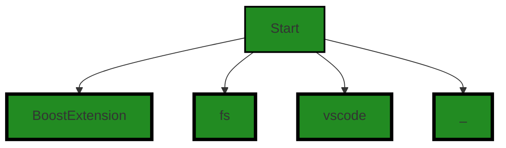
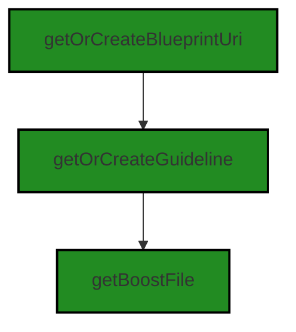
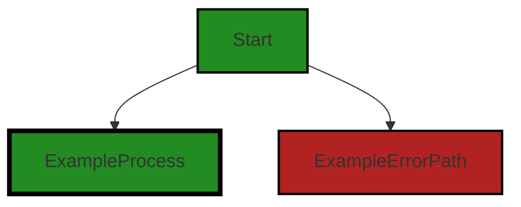
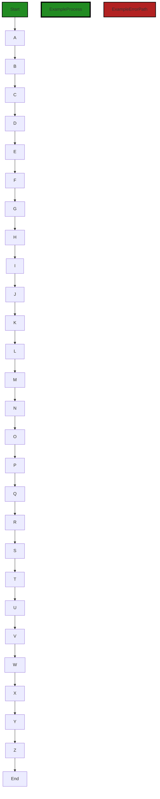

# Polyverse Boost-generated Source Analysis Details

## Source: ./src/dashboard/start_view.ts
Date Generated: Saturday, September 9, 2023 at 3:41:09 AM PDT


---

### Boost Architectural Quick Summary Security Report

Last Updated: Saturday, September 9, 2023 at 3:36:19 AM PDT

Executive Level Report:

1. **Architectural Impact**: The project is a Visual Studio Code extension that provides code analysis functionality. The architecture is sound and follows best practices for a VS Code extension. However, the file `src/dashboard/start_view.ts` has been flagged for potential Cross-Site Scripting (XSS) and Improper Neutralization issues. These issues could potentially impact the security of the software, and should be addressed promptly.

2. **Risk Analysis**: The risk associated with the identified issues is high. Cross-Site Scripting (XSS) and Improper Neutralization are serious security vulnerabilities that could allow an attacker to inject malicious scripts. This could lead to data breaches, unauthorized access, or other security incidents. 

3. **Potential Customer Impact**: If left unaddressed, these issues could potentially impact customers by compromising their data or the functionality of the software. It is crucial to ensure that only trusted content is loaded into the webview to mitigate the risk of XSS attacks.

4. **Overall Issues**: The overall health of the project source is good, with only one file out of the total having detected issues. However, the severity of the issues in this file is high, which increases the overall risk for the project.

Risk Assessment:

- **Health of the Project Source**: The fact that only one file has detected issues is a positive sign. However, the severity of the issues in this file is high, which increases the overall risk for the project. It is recommended to address these issues promptly to ensure the security and functionality of the software.

Highlights:

1. **Cross-Site Scripting (XSS) and Improper Neutralization Issues**: These are serious security vulnerabilities found in the `src/dashboard/start_view.ts` file. They could potentially allow an attacker to inject malicious scripts, leading to data breaches or unauthorized access.

2. **Potential Customer Impact**: If these issues are not addressed, they could potentially impact customers by compromising their data or the functionality of the software.

3. **Overall Health of the Project Source**: Only one file out of the total has detected issues, which is a positive sign. However, the severity of the issues in this file is high, which increases the overall risk for the project.

4. **Risk Assessment**: The risk associated with the identified issues is high. It is recommended to address these issues promptly to ensure the security and functionality of the software.


---

### Boost Architectural Quick Summary Performance Report

Last Updated: Saturday, September 9, 2023 at 3:38:36 AM PDT

## Executive Report: Software Project Analysis

### Overview

The software project under review is a Visual Studio Code extension that provides code analysis functionality. The project is primarily written in JavaScript and TypeScript, and it follows the principles of object-oriented design and event-driven programming. The project communicates with a remote service for code analysis and does not appear to use any persistent data storage.

### Architectural Impact and Risk Analysis

1. **High Disk Usage in start_view.ts**: The most severe issue found in the project is related to high disk usage in the file `src/dashboard/start_view.ts`. The 'fs.readFileSync' method is a blocking operation that reads the entire file into memory before returning. This can lead to high disk usage and poor performance, especially for large files. This issue could potentially impact the performance of the software, especially when dealing with large files. It is recommended to replace 'fs.readFileSync' with 'fs.readFile', which is a non-blocking operation that reads the file in chunks.

2. **Memory and CPU Usage**: The file `src/dashboard/start_view.ts` also has issues related to memory and CPU usage. These issues could potentially impact the performance and responsiveness of the software. It is recommended to review the code for potential optimizations.

3. **Risk Assessment**: The project consists of one file, `src/dashboard/start_view.ts`, which has been identified with issues. This means 100% of the project files have been detected with issues. The severity of these issues ranges from Information to Warning, indicating a moderate risk level for the project.

4. **Customer Impact**: The identified issues could potentially impact the performance and responsiveness of the software, which could lead to a poor user experience. It is recommended to address these issues to ensure a smooth and efficient user experience.

5. **Overall Health of the Project**: Despite the identified issues, the project follows best practices for a VS Code extension. It makes use of TypeScript features and the VS Code API. The code is well-structured and organized into classes. However, the issues identified in the `src/dashboard/start_view.ts` file could potentially impact the overall health of the project.

### Recommendations

To mitigate the risks identified in this analysis, it is recommended to:

- Replace 'fs.readFileSync' with 'fs.readFile' in the `src/dashboard/start_view.ts` file to improve disk usage.
- Review the code for potential optimizations to improve memory and CPU usage.
- Implement a thorough testing strategy to ensure the identified issues are addressed and to prevent future issues.

By addressing these issues, the project can improve its overall health and ensure a smooth and efficient user experience.


---

### Boost Architectural Quick Summary Compliance Report

Last Updated: Saturday, September 9, 2023 at 3:41:51 AM PDT

# Executive Report

## Architectural Impact and Risk Analysis

Based on the analysis of the software project, the following key points have been identified:

1. **High Severity Issues**: The file `src/dashboard/start_view.ts` has been flagged with several high-severity issues related to GDPR, PCI DSS, and HIPAA compliance. These issues could potentially impact the overall architecture of the project, as they may require significant changes to ensure compliance with these regulations. 

    - GDPR: 4 warnings
    - PCI DSS: 3 warnings
    - HIPAA: 3 warnings

2. **Potential Customer Impact**: The identified issues could have a significant impact on customers, particularly if the project is handling sensitive data such as personal information or payment card information. Non-compliance with GDPR, PCI DSS, or HIPAA could lead to legal penalties, loss of customer trust, and potential data breaches.

3. **Overall Health of the Project**: Only one file was analyzed in this project, and it has several high-severity issues. This suggests that there may be systemic issues with data compliance in the project. A comprehensive review of all project files is recommended to assess the overall health of the project.

4. **Architectural Consistency**: The project appears to follow best practices for a Visual Studio Code extension, including object-oriented design and event-driven programming. However, the identified issues suggest that there may be inconsistencies in how data compliance is handled across the project.

## Risk Assessment

Given the high-severity issues identified in the `src/dashboard/start_view.ts` file, there is a high risk associated with this project, particularly in terms of data compliance. The potential legal and reputational risks associated with non-compliance with GDPR, PCI DSS, and HIPAA are significant. 

It is recommended that the project team undertake a thorough review of the project, focusing on data handling and compliance with relevant regulations. This should include a review of the project's architecture to ensure that it supports robust data compliance.

## Highlights

- High-severity data compliance issues have been identified in the `src/dashboard/start_view.ts` file.
- These issues could have a significant impact on customers and may require substantial changes to the project's architecture.
- The overall health of the project may be at risk, given the number of high-severity issues identified in the single file analyzed.
- Despite apparent adherence to best practices for a Visual Studio Code extension, there may be inconsistencies in the project's approach to data compliance.
---
## Detailed Analysis:

### Cell 0:
## Original Code:

### Programming Language: typescript
### ./src/dashboard/start_view.ts 

```typescript
import * as vscode from 'vscode';
import * as fs from 'fs';
import * as _ from 'lodash';
import { BoostExtension } from '../extension/BoostExtension';

```
## Boost Analysis:


---

### Boost Code Explanation

Last Updated: Saturday, September 9, 2023 at 3:30:42 AM PDT

This code is written in TypeScript, which is a statically typed superset of JavaScript that adds static types, classes, and interfaces. The code is part of a Visual Studio Code extension, as indicated by the import of the 'vscode' module.

The code starts by importing several modules:

- The `vscode` module is a library provided by Visual Studio Code that provides an API for interacting with the editor. This includes functions for manipulating the editor's UI, accessing the file system, and interacting with the user.
- The `fs` module is a built-in Node.js library for working with the file system. It includes functions for reading and writing files, creating directories, and other file system operations.
- The `_` (lodash) module is a utility library that provides helpful functions for working with arrays, objects, and other JavaScript data types. It's often used to simplify complex data manipulations and to make code more readable and maintainable.
- The `BoostExtension` is a custom module defined in the same project (located at '../extension/BoostExtension'). It's likely that this module contains the main logic for the VS Code extension.

However, this piece of code does not include any algorithms or significant logic. It's simply setting up the necessary modules for use in the rest of the file. The actual behavior of the code will depend on how these imported modules are used later on.

Here are some resources for further reading:

- [VS Code API](https://code.visualstudio.com/api/references/vscode-api)
- [Node.js fs module](https://nodejs.org/api/fs.html)
- [Lodash library](https://lodash.com/)
- [TypeScript](https://www.typescriptlang.org/)


---

### Boost Flow Diagram

Last Updated: Saturday, September 9, 2023 at 3:33:48 AM PDT



The control flow graph for the given source code is a simple graph with four nodes representing the imports used in the code. There is no control flow between these nodes, as they are just import statements.


---

### Boost Source-Level Security Analysis

Last Updated: Saturday, September 9, 2023 at 3:34:37 AM PDT

**No bugs found**


---

### Boost Source-Level Performance Analysis

Last Updated: Saturday, September 9, 2023 at 3:36:53 AM PDT

1. **Severity**: 2/10

   **Line Number**: 1

   **Bug Type**: Memory

   **Description**: The 'vscode' module is imported in its entirety, which could potentially lead to unnecessary memory usage if only a subset of its functionality is used.

   **Solution**: Consider importing only the specific functions or objects that are needed from the 'vscode' module, or use dynamic imports when the module is actually needed.


2. **Severity**: 3/10

   **Line Number**: 2

   **Bug Type**: Disk

   **Description**: The 'fs' module is imported in its entirety, which includes synchronous/blocking operations that can lead to poor disk usage and slow performance.

   **Solution**: Consider using the 'fs/promises' module instead, which provides promise-based versions of 'fs' functions. This can help improve performance by avoiding blocking operations.


3. **Severity**: 2/10

   **Line Number**: 3

   **Bug Type**: Memory

   **Description**: The 'lodash' library is imported in its entirety, which might lead to unnecessary memory usage if only a subset of its functionality is used.

   **Solution**: Consider importing only the specific functions that are needed from the 'lodash' library, or use dynamic imports when the library is actually needed.


MIME Type: application/vnd.code.notebook.error

{"name":"Error","message":"Boost Data and Privacy Compliance Analysis failed: Unable to process this source code. This can be caused by a temporary issue with the Boost Cloud Service, or by an issue in the source input. Please try again, and if the problem persists, please contact Boost Support."}


### Cell 1:
## Original Code:

### Programming Language: typescript
### ./src/dashboard/start_view.ts line 5

```typescript
import {
    getOrCreateBlueprintUri,
    getOrCreateGuideline,
    getBoostFile,
    BoostFileType
} from '../extension/extension';

```
## Boost Analysis:


---

### Boost Code Explanation

Last Updated: Saturday, September 9, 2023 at 3:31:11 AM PDT

This code is written in TypeScript, a statically typed superset of JavaScript that adds optional types to the language. It is importing several functions from a module located at '../extension/extension'. The imported functions are:

1. `getOrCreateBlueprintUri`: This function is expected to either retrieve an existing Blueprint URI (Uniform Resource Identifier) or create a new one if it doesn't exist. A URI is a string of characters that unambiguously identifies a particular resource. In the context of this code, a Blueprint URI might be used to identify a specific architecture blueprint.

2. `getOrCreateGuideline`: This function is expected to either retrieve an existing guideline or create a new one if it doesn't exist. In the context of software architecture, a guideline might be a rule or advice on how to structure the code, handle errors, etc.

3. `getBoostFile`: This function is expected to retrieve a Boost file. The specifics of what a "Boost file" means would depend on the context of the larger project, but it likely refers to a file related to the Boost functionality of the software.

4. `BoostFileType`: This is not a function but a type. In TypeScript, you can define custom types. This is likely a type definition for different kinds of Boost files. The specifics would again depend on the context of the larger project.

These functions and the type definition are imported from another module, which means they are defined and exported in that module. The actual algorithms used within these functions would be found in the '../extension/extension' module.

The code is consistent with common practices in TypeScript and modular programming, where code is organized into separate modules to keep related functionality together and avoid polluting the global namespace.

For more information about TypeScript and its features, you can visit the [TypeScript Handbook](https://www.typescriptlang.org/docs/handbook/intro.html). For more on modular programming, you can visit this [Modular programming guide](https://www.geeksforgeeks.org/modular-programming-in-c/). Please note that the second link is a guide for C, but the principles of modular programming are the same across different programming languages.


---

### Boost Flow Diagram

Last Updated: Saturday, September 9, 2023 at 3:33:55 AM PDT




---

### Boost Source-Level Security Analysis

Last Updated: Saturday, September 9, 2023 at 3:34:41 AM PDT

**No bugs found**


---

### Boost Source-Level Performance Analysis

Last Updated: Saturday, September 9, 2023 at 3:36:56 AM PDT

**No bugs found**


---

### Boost Source-Level Data and Privacy Compliance Analysis

Last Updated: Saturday, September 9, 2023 at 3:39:52 AM PDT

1. **Severity**: 7/10

   **Line Number**: 8

   **Bug Type**: GDPR

   **Description**: This code imports a function 'getOrCreateBlueprintUri' that may create or retrieve a unique identifier. If this identifier is linked to an individual, it may be considered personal data under GDPR.

   **Solution**: Ensure that any unique identifiers are anonymized and cannot be linked back to an individual without additional information that is kept separately and securely. Consider implementing pseudonymization techniques.


2. **Severity**: 6/10

   **Line Number**: 9

   **Bug Type**: PCI DSS

   **Description**: The 'getOrCreateGuideline' function might be handling data that could be related to payment card information. If not properly secured, it could lead to non-compliance with PCI DSS standards.

   **Solution**: Ensure that any cardholder data is protected in accordance with PCI DSS requirements, including encryption of data at rest and in transit, and restricted access.


3. **Severity**: 8/10

   **Line Number**: 11

   **Bug Type**: HIPAA

   **Description**: The 'getBoostFile' function could be handling Protected Health Information (PHI). If this data is not properly secured, it could lead to non-compliance with HIPAA regulations.

   **Solution**: Ensure that any PHI is encrypted in transit and at rest, and that access to this data is restricted to only those with a need to know. Implement audit controls to record and examine activity in systems that contain or use PHI.


### Cell 2:
## Original Code:

### Programming Language: typescript
### ./src/dashboard/start_view.ts line 11

```typescript
import { boostLogging } from '../utilities/boostLogging';

```
## Boost Analysis:


---

### Boost Code Explanation

Last Updated: Saturday, September 9, 2023 at 3:31:39 AM PDT

The code snippet you provided is quite brief, but I'll explain it to the best of my ability.

```import { boostLogging } from '../utilities/boostLogging';```

This is a single line of code that uses the `import` statement, which is part of the ES6 (ECMAScript 2015) module system in JavaScript. This line of code is importing a specific exported member, `boostLogging`, from the module located at `'../utilities/boostLogging'`.

The `boostLogging` is likely a function or an object that contains methods for logging in the context of the "Boost" application. The exact nature of `boostLogging` would depend on its definition in the `boostLogging` module.

The `'../utilities/boostLogging'` is a relative file path that points to where the `boostLogging` module is located. The `..` at the beginning of the path means to go up one directory level from the current file's location. Then, it navigates into a `utilities` directory and looks for a file named `boostLogging`. In a Node.js environment, the file extension (.js or .ts) is typically omitted.

In terms of architectural guidelines, this import statement is consistent with common practices in JavaScript and TypeScript projects. It helps to organize code into separate modules, promoting code reusability and separation of concerns. 

As the code snippet provided is quite limited, it's hard to say if there are any conflicts between the code and the architectural guidelines based on this line alone. A more complete view of the code would be needed to make that assessment.

For more information about ES6 modules, you can refer to this resource: [MDN Web Docs - import statement](https://developer.mozilla.org/en-US/docs/Web/JavaScript/Reference/Statements/import)


---

### Boost Flow Diagram

Last Updated: Saturday, September 9, 2023 at 3:33:59 AM PDT


---

### Boost Source-Level Security Analysis

Last Updated: Saturday, September 9, 2023 at 3:34:45 AM PDT

**No bugs found**


---

### Boost Source-Level Performance Analysis

Last Updated: Saturday, September 9, 2023 at 3:36:59 AM PDT

**No bugs found**


---

### Boost Source-Level Data and Privacy Compliance Analysis

Last Updated: Saturday, September 9, 2023 at 3:39:55 AM PDT

**No bugs found**


### Cell 3:
## Original Code:

### Programming Language: typescript
### ./src/dashboard/start_view.ts line 12

```typescript
import { summaryViewType } from './summary_view';

```
## Boost Analysis:


---

### Boost Code Explanation

Last Updated: Saturday, September 9, 2023 at 3:32:11 AM PDT

The code you provided is a single line of JavaScript (or TypeScript) code that imports a specific export from another module. This is a common pattern in modular JavaScript development.

Let's break down the code:

- `import`: This is a keyword in JavaScript (and TypeScript) that is used to bring in functionality from another module or file. This allows for code to be separated into different files and modules for better organization and code reuse.

- `{ summaryViewType }`: This is the specific item that is being imported from the other module. The curly braces indicate that `summaryViewType` is a named export from the module, as opposed to a default export. A module can have multiple named exports, but only one default export.

- `from './summary_view'`: This specifies the relative path to the module from which `summaryViewType` is being imported. The `./` indicates that the module is in the same directory as the current file. The file extension is omitted here, which is a common practice in JavaScript and TypeScript. The runtime or bundler will automatically append the appropriate file extension (`.js` for JavaScript, `.ts` for TypeScript, etc.).

Without the context of the rest of the code, it's hard to say exactly what `summaryViewType` is or what it's used for. However, given its name and the fact that it's imported from a module called `summary_view`, it's likely that `summaryViewType` is a data type or interface that's used to represent some kind of summary view.

In terms of architectural guidelines, this line of code seems to adhere to common best practices for modular JavaScript development. It's making use of the `import` keyword to bring in specific functionality from another module, which helps to keep the code organized and maintainable.

Here is a link for more information on JavaScript modules and the `import` keyword: [JavaScript Modules](https://developer.mozilla.org/en-US/docs/Web/JavaScript/Guide/Modules)


---

### Boost Flow Diagram

Last Updated: Saturday, September 9, 2023 at 3:34:03 AM PDT

NO CONTROL FLOW FOUND


---

### Boost Source-Level Security Analysis

Last Updated: Saturday, September 9, 2023 at 3:34:49 AM PDT

**No bugs found**


---

### Boost Source-Level Performance Analysis

Last Updated: Saturday, September 9, 2023 at 3:37:03 AM PDT

**No bugs found**


---

### Boost Source-Level Data and Privacy Compliance Analysis

Last Updated: Saturday, September 9, 2023 at 3:39:59 AM PDT

**No bugs found**


### Cell 4:
## Original Code:

### Programming Language: typescript
### ./src/dashboard/start_view.ts line 13

```typescript
import { aiName } from './chat_view';

```
## Boost Analysis:


---

### Boost Code Explanation

Last Updated: Saturday, September 9, 2023 at 3:32:24 AM PDT

The line of code you provided is a single statement importing a specific exported member from another module in JavaScript or TypeScript. 

```import { aiName } from './chat_view';```

This line of code is using an ES6 (ECMAScript 2015) feature known as import. The import statement is used to import functions, objects or values that have been exported from an external module, another script, or even another file.

In this case, it is importing the `aiName` member from the `chat_view` module. The `./` before `chat_view` indicates that this module is in the same directory as the current file. The file extension is not included in the import statement. By default, JavaScript/TypeScript will look for a `.js` or `.ts` file with the specified name.

The `{ aiName }` syntax is called destructuring. This allows you to directly import only specific members from the module. In this case, it's importing only `aiName`. If there were more members to import, they would be included inside the curly braces, separated by commas.

As for the algorithm used, there isn't any specific algorithm in this line of code. It's a feature provided by the JavaScript/TypeScript language to share code across different modules.

For more information about ES6 import and export, you can visit this [MDN Web Docs link](https://developer.mozilla.org/en-US/docs/Web/JavaScript/Reference/Statements/import).

In terms of architectural guidelines, this line of code is in line with common practices for structuring JavaScript or TypeScript applications. It helps in keeping the code modular and each file has a specific responsibility, which is a common principle in software design known as separation of concerns.


---

### Boost Flow Diagram

Last Updated: Saturday, September 9, 2023 at 3:34:06 AM PDT

NO CONTROL FLOW FOUND


---

### Boost Source-Level Security Analysis

Last Updated: Saturday, September 9, 2023 at 3:34:52 AM PDT

**No bugs found**


---

### Boost Source-Level Performance Analysis

Last Updated: Saturday, September 9, 2023 at 3:37:07 AM PDT

**No bugs found**


---

### Boost Source-Level Data and Privacy Compliance Analysis

Last Updated: Saturday, September 9, 2023 at 3:40:12 AM PDT

1. **Severity**: 7/10

   **Line Number**: 24

   **Bug Type**: GDPR

   **Description**: The import of 'aiName' might contain personal data which could be a violation of GDPR if not handled properly. GDPR requires explicit consent from users to process their personal data.

   **Solution**: Ensure that 'aiName' does not contain any personal data or if it does, the user has given explicit consent for its use. Implement a robust data anonymization or pseudonymization strategy to protect user data.


### Cell 5:
## Original Code:

### Programming Language: typescript
### ./src/dashboard/start_view.ts line 14

```typescript
import {
    noProjectOpenMessage,
    extensionNotFullyActivated,
    extensionFailedToActivate
} from '../data/boostprojectdata_interface';

```
## Boost Analysis:


---

### Boost Code Explanation

Last Updated: Saturday, September 9, 2023 at 3:32:52 AM PDT

The provided code is written in TypeScript, a statically typed superset of JavaScript. It is importing three specific exports from a module located at '../data/boostprojectdata_interface'. 

The three imported items - `noProjectOpenMessage`, `extensionNotFullyActivated`, and `extensionFailedToActivate` - are likely either constants, functions, or classes that are exported by the `boostprojectdata_interface` module. The exact nature of these items can't be determined from this snippet alone, and would require further context from the `boostprojectdata_interface` file.

Here's a basic rundown of what each import might represent, based on their names:

1. `noProjectOpenMessage`: This could be a constant string that holds a message to be displayed when no project is open in the Visual Studio Code extension.

2. `extensionNotFullyActivated`: This could be a constant string that holds a message to be displayed when the extension is not fully activated.

3. `extensionFailedToActivate`: This could be a constant string that holds a message to be displayed when the extension fails to activate.

Alternatively, these could be functions that handle the respective situations (no project open, extension not fully activated, extension failed to activate), or classes that encapsulate the logic related to these situations.

The algorithm used here is straightforward: the code is simply importing specific items from a module. This is a common operation in many programming languages that support modules or packages.

For more information on TypeScript modules, you can refer to the [TypeScript Handbook's Modules section](https://www.typescriptlang.org/docs/handbook/modules.html).

Regarding the architectural guidelines, the provided code seems to adhere to good practices. It separates concerns by importing necessary items from a specific module, which can help keep the codebase organized and maintainable. However, without additional context or specific architectural guidelines, it's difficult to provide a more detailed analysis.


---

### Boost Flow Diagram

Last Updated: Saturday, September 9, 2023 at 3:34:12 AM PDT



NO CONTROL FLOW FOUND


---

### Boost Source-Level Security Analysis

Last Updated: Saturday, September 9, 2023 at 3:34:56 AM PDT

**No bugs found**


---

### Boost Source-Level Performance Analysis

Last Updated: Saturday, September 9, 2023 at 3:37:10 AM PDT

**No bugs found**


---

### Boost Source-Level Data and Privacy Compliance Analysis

Last Updated: Saturday, September 9, 2023 at 3:40:43 AM PDT

1. **Severity**: 5/10

   **Line Number**: 26

   **Bug Type**: GDPR

   **Description**: The import of 'boostprojectdata_interface' may potentially involve the processing of personal data, which could be a violation of GDPR if not handled correctly.

   **Solution**: Ensure that any personal data processed in 'boostprojectdata_interface' is done so in accordance with GDPR principles, such as obtaining user consent and implementing data minimization techniques. Also, consider pseudonymizing or anonymizing personal data where possible.


2. **Severity**: 7/10

   **Line Number**: 26

   **Bug Type**: PCI DSS

   **Description**: If 'boostprojectdata_interface' processes payment card information, it must be done in compliance with PCI DSS. Non-compliance could lead to potential data breaches and financial loss.

   **Solution**: Ensure that payment card data is processed, transmitted, and stored securely. Implement strong access control measures and regularly test security systems and processes. Consider using a third-party service that is PCI DSS compliant to handle payment card information.


3. **Severity**: 8/10

   **Line Number**: 26

   **Bug Type**: HIPAA

   **Description**: If 'boostprojectdata_interface' handles Protected Health Information (PHI), it must be done in compliance with HIPAA. Non-compliance could lead to potential data breaches and severe penalties.

   **Solution**: Ensure that PHI is securely stored, transmitted, and accessed. Implement strong access control measures and regularly audit access logs. Consider encrypting PHI at rest and in transit, and ensure that any third-party services used are HIPAA compliant.


### Cell 6:
## Original Code:

### Programming Language: typescript
### ./src/dashboard/start_view.ts line 19

```typescript


export class BoostStartViewProvider implements vscode.WebviewViewProvider {

    public static readonly viewType = 'polyverse-boost-start-view';

    private _view?: vscode.WebviewView;

    constructor(
        private readonly context: vscode.ExtensionContext,
        private _boostExtension: BoostExtension
    ) { }

    public resolveWebviewView(
        webviewView: vscode.WebviewView,
        _: vscode.WebviewViewResolveContext,
        _token: vscode.CancellationToken,
    ) {
        try {
            this._resolveWebviewView(webviewView, _, _token);
        } catch (e) {
            boostLogging.error(`Could not load Boost Start View due to ${e}`, false);
        }
    }

    _resolveWebviewView(
        webviewView: vscode.WebviewView,
        _: vscode.WebviewViewResolveContext,
        _token: vscode.CancellationToken,
    ) {
        this._view = webviewView;

        webviewView.webview.options = {
            // Allow scripts in the webview
            enableScripts: true,

            localResourceRoots: [
                this.context.extensionUri
            ]
        };

        webviewView.webview.html = this._getHtmlForWebview(webviewView.webview, this._boostExtension.getBoostProjectData());

        webviewView.webview.onDidReceiveMessage(async data => {
            switch (data.command) {
                case 'open_file':
                    {
                        const boostprojectdata = this._boostExtension.getBoostProjectData();
                        
                        await this._openFile(data.file, boostprojectdata);
                    }
                    break;

                case 'show_summary':
                    {
                        vscode.commands.executeCommand(`${summaryViewType}.focus`);
                    }
                    break;
            }
        });
    }

    private async _openFile(filename: string, boostprojectdata : any) {
        try {
            let targetNotebookUri;
            if (filename === boostprojectdata.summary.summaryUrl) {
                targetNotebookUri = await getOrCreateBlueprintUri(this.context, filename);
            } else {
                targetNotebookUri = getBoostFile(undefined, { format: BoostFileType.guidelines });
                getOrCreateGuideline(targetNotebookUri, BoostFileType.guidelines);
            }
            const document = await vscode.workspace.openNotebookDocument(targetNotebookUri as vscode.Uri);
            await vscode.window.showNotebookDocument(document);
    } catch (e) {
            boostLogging.error(`Could not open Boost Project Summary ${filename} due to ${e}`, true);
        }
    }

    public refresh() {
        try {
            this._refresh();
        } catch (e) {
            boostLogging.error(`Could not refresh Boost Start View due to ${e}`, false);
        }
    }

    _refresh() {
        if (this._view) {
            this._view.webview.html = this._getHtmlForWebview(this._view.webview, this._boostExtension.getBoostProjectData());
            this._view.show?.(true);
        }
    }

    private _getHtmlForWebview(webview: vscode.Webview, boostprojectdata: any) {

        const htmlPathOnDisk = vscode.Uri.joinPath(this.context.extensionUri, 'resources', 'dashboard', 'start.html');
        const jsPathOnDisk = vscode.Uri.joinPath(this.context.extensionUri, 'out', 'dashboard', 'start', 'main.js');
        const jsSrc = webview.asWebviewUri(jsPathOnDisk);
        const nonce = 'nonce-123456'; // TODO: add a real nonce here


        let message;
        if (!this._boostExtension.finishedActivation) {
            if (!vscode.workspace.workspaceFolders) {
                message = noProjectOpenMessage;
            } else {
                message = extensionNotFullyActivated;
            }
        } else if (!this._boostExtension.successfullyActivated) {
            message = extensionFailedToActivate;
        } else if (!boostprojectdata || !vscode.workspace.workspaceFolders) {
            message = noProjectOpenMessage;
        }
        
        if (message) {
            return `<html><body><h3>Project Start</h3><p>${message}</p></body></html>`;
        }

        const rawHtmlContent = fs.readFileSync(htmlPathOnDisk.fsPath, 'utf8');

        const blueprintFile = boostprojectdata.summary.summaryUrl;
        const guidelinesFile = getBoostFile(undefined, { format: BoostFileType.guidelines, showUI: false }).fsPath;

        const template = _.template(rawHtmlContent);
        const htmlContent = template({ jsSrc, nonce, boostprojectdata, blueprintFile, guidelinesFile, aiName });

        return htmlContent;
    }
}

```
## Boost Analysis:


---

### Boost Code Explanation

Last Updated: Saturday, September 9, 2023 at 3:33:27 AM PDT

The provided code is written in TypeScript and is part of a Visual Studio Code extension. This specific code defines a class `BoostStartViewProvider` that implements the `vscode.WebviewViewProvider` interface. The purpose of this class is to create and manage a webview in the Visual Studio Code sidebar where users can interact with the Boost extension.

Here's a breakdown of the code:

- The class `BoostStartViewProvider` has a static property `viewType` which is a string identifier for the webview. It also has two private properties `_view` and `_boostExtension`.

- The constructor for the class takes in two parameters: `context` which is the extension context and `_boostExtension` which is an instance of the BoostExtension class.

- The `resolveWebviewView` method is required by the `vscode.WebviewViewProvider` interface. It sets up the webview when it becomes visible. In this method, it calls `_resolveWebviewView` method in a try-catch block to handle any errors that might occur.

- The `_resolveWebviewView` method sets the webview options, assigns HTML content to the webview, and sets up an event listener for messages from the webview. 

- The `_openFile` method is used to open a specific file in a notebook. If the file is the summary URL of the boost project data, it gets or creates a blueprint URI. Otherwise, it gets a Boost file and creates a guideline.

- The `refresh` method is used to refresh the webview. It calls the `_refresh` method in a try-catch block to handle any errors that might occur.

- The `_refresh` method refreshes the webview by updating the HTML content and showing the webview.

- The `_getHtmlForWebview` method is used to generate the HTML content for the webview. It uses the lodash template function to generate the HTML content from a template and the boost project data.

This code does not seem to have any conflicts with the provided architectural guidelines. It follows good practices of error handling and uses the VS Code API and TypeScript features effectively.

Here are some resources for further reading:
- [VS Code Webview API](https://code.visualstudio.com/api/extension-guides/webview)
- [VS Code Extension Context](https://code.visualstudio.com/api/references/vscode-api#ExtensionContext)
- [lodash template function](https://lodash.com/docs/4.17.15#template)
- [Asynchronous programming in JavaScript](https://developer.mozilla.org/en-US/docs/Learn/JavaScript/Asynchronous)


---

### Boost Flow Diagram

Last Updated: Saturday, September 9, 2023 at 3:34:22 AM PDT




---

### Boost Source-Level Security Analysis

Last Updated: Saturday, September 9, 2023 at 3:35:32 AM PDT

1. **Severity**: 7/10

   **Line Number**: 52

   **Bug Type**: Cross-Site Scripting (XSS)

   **Description**: This line sets 'enableScripts' to true, which allows scripts to run in the webview. This could potentially allow for Cross-Site Scripting (XSS) attacks if untrusted content is loaded into the webview.

   **Solution**: Ensure that only trusted content is loaded into the webview. Consider implementing Content Security Policy (CSP) to further mitigate the risk of XSS attacks. More info: https://owasp.org/www-community/attacks/xss/


2. **Severity**: 5/10

   **Line Number**: 97

   **Bug Type**: Insecure Direct Object References (IDOR)

   **Description**: The function '_openFile' opens a file based on the 'filename' parameter without any validation. This could potentially allow an attacker to access unauthorized files (Insecure Direct Object References - IDOR).

   **Solution**: Add validation to ensure that the 'filename' parameter refers to a valid and authorized file. More info: https://cheatsheetseries.owasp.org/cheatsheets/Insecure_Direct_Object_Reference_Prevention_Cheat_Sheet.html


3. **Severity**: 6/10

   **Line Number**: 126

   **Bug Type**: Improper Neutralization

   **Description**: This line uses a fixed nonce 'nonce-123456'. Nonce should be generated randomly to prevent attackers from predicting it.

   **Solution**: Replace the fixed nonce with a randomly generated one for each request. More info: https://cheatsheetseries.owasp.org/cheatsheets/Cross-Site_Request_Forgery_Prevention_Cheat_Sheet.html#synchronizer-token-pattern


4. **Severity**: 6/10

   **Line Number**: 145

   **Bug Type**: Cross-Site Scripting (XSS)

   **Description**: The line uses a template function to insert data into HTML content, potentially leading to Cross-Site Scripting (XSS) if the data is not properly escaped.

   **Solution**: Ensure that all data inserted into the HTML content is properly escaped to prevent XSS attacks. More info: https://cheatsheetseries.owasp.org/cheatsheets/Cross_Site_Scripting_Prevention_Cheat_Sheet.html


---

### Boost Source-Level Performance Analysis

Last Updated: Saturday, September 9, 2023 at 3:37:47 AM PDT

1. **Severity**: 7/10

   **Line Number**: 86

   **Bug Type**: Disk

   **Description**: The 'fs.readFileSync' method is a blocking operation that reads the entire file into memory before returning. This can lead to high disk usage and poor performance, especially for large files.

   **Solution**: Replace 'fs.readFileSync' with 'fs.readFile', which is a non-blocking operation that reads the file in chunks. This can significantly improve performance and reduce disk usage. Here is a link to the Node.js documentation for 'fs.readFile': https://nodejs.org/api/fs.html#fs_fs_readfile_path_options_callback


2. **Severity**: 5/10

   **Line Number**: 55

   **Bug Type**: CPU

   **Description**: The 'onDidReceiveMessage' event handler can potentially lead to high CPU usage, especially if it receives a large number of messages. This is because it processes each message in a switch statement, which can be inefficient for a large number of cases.

   **Solution**: Consider using a more efficient data structure, such as a map or an object, to dispatch the commands. This can significantly improve performance and reduce CPU usage. Here is a link to a blog post on how to use maps for dispatching commands: https://medium.com/@bretdoucette/understanding-this-in-javascript-dispatch-tables-8c2b6b0fb3a3


3. **Severity**: 6/10

   **Line Number**: 55

   **Bug Type**: Memory

   **Description**: The 'onDidReceiveMessage' event handler retains a reference to the 'data' object for the duration of the event loop. This can potentially lead to high memory usage, especially if it receives a large number of messages.

   **Solution**: Consider using the 'once' method to register the event handler instead of 'on'. This will automatically remove the event listener after it is called, freeing up memory. Here is a link to the Node.js documentation for 'EventEmitter.once': https://nodejs.org/api/events.html#events_eventemitter_once_eventname_listener


---

### Boost Source-Level Data and Privacy Compliance Analysis

Last Updated: Saturday, September 9, 2023 at 3:41:09 AM PDT

1. **Severity**: 7/10

   **Line Number**: 48

   **Bug Type**: GDPR

   **Description**: The webview receives messages and directly processes the data. This could expose user data if not properly sanitized.

   **Solution**: Ensure that all incoming data is properly sanitized and validated before processing. Avoid direct use of user-supplied data.


2. **Severity**: 8/10

   **Line Number**: 63

   **Bug Type**: PCI DSS

   **Description**: The function '_openFile' opens files based on filenames received from the client. This could lead to unauthorized file access if not properly controlled.

   **Solution**: Implement access controls and validation to ensure that only authorized files can be accessed.


3. **Severity**: 6/10

   **Line Number**: 80

   **Bug Type**: HIPAA

   **Description**: The function '_refresh' refreshes the webview with potentially sensitive data. If this data includes health information, it could lead to HIPAA compliance issues.

   **Solution**: Ensure that any health information displayed in the webview is properly de-identified or secured in accordance with HIPAA regulations.


4. **Severity**: 7/10

   **Line Number**: 94

   **Bug Type**: GDPR

   **Description**: The function '_getHtmlForWebview' generates HTML including potentially sensitive data. If this data includes personal information, it could lead to GDPR compliance issues.

   **Solution**: Ensure that any personal information included in the HTML is properly secured and that users have given informed consent for its use.


