# Polyverse Boost-generated Source Analysis Details

## Source: ./src/dashboard/summary_view.ts
Date Generated: Saturday, September 9, 2023 at 8:12:26 AM PDT


---

### Boost Architectural Quick Summary Security Report

Last Updated: Saturday, September 9, 2023 at 7:59:32 AM PDT

## Executive Report

### Architectural Impact and Risk Analysis

1. **Cross-Site Scripting (XSS) Vulnerability**: The file `src/dashboard/summary_view.ts` has been flagged for a potential XSS vulnerability. This is a high-risk issue as it can allow attackers to inject malicious scripts into web pages, leading to a variety of attacks against users. The architectural impact is significant as it affects the security of the entire application. The use of the 'marked' library for Markdown parsing without proper sanitization before rendering is the root cause. 

2. **Percentage of Files with Issues**: With only one file in the project, the percentage of files with issues is 100%. This is a high-risk situation as it indicates that every part of the project could potentially be affected by the identified issue. 

3. **Potential Customer Impact**: The identified XSS vulnerability could have a significant impact on customers. If exploited, it could lead to unauthorized access to sensitive user data, loss of user trust, and potential legal implications.

4. **Overall Health of the Project Source**: The overall health of the project source is concerning due to the identified XSS vulnerability. The fact that the only file in the project has a high-severity issue indicates a need for immediate remediation to ensure the security and reliability of the software.

5. **Architectural Consistency**: The project appears to follow best practices for a Visual Studio Code extension, with a well-structured and organized codebase. However, the identified XSS vulnerability indicates a deviation from secure coding practices, which is a significant architectural concern.

### Recommendations

1. **Immediate Remediation of XSS Vulnerability**: The 'marked' library output should be sanitized before rendering to mitigate the XSS risk. This can be done using a library like 'DOMPurify' or by configuring 'marked' to sanitize its output.

2. **Incorporate Secure Coding Practices**: The development team should incorporate secure coding practices into their workflow to prevent such vulnerabilities in the future. This includes regular code reviews and using automated tools to detect potential security issues.

3. **Expand Codebase Analysis**: Given that the only file in the project has a high-severity issue, it would be prudent to expand the codebase and conduct a thorough analysis to ensure no other potential issues are lurking in the code.

4. **Customer Communication**: If the software is already in use, consider informing customers about the issue and the steps being taken to resolve it. This can help maintain trust and transparency.

5. **Review and Update Architectural Guidelines**: The architectural guidelines should be reviewed and updated to include secure coding practices and specific measures to prevent common vulnerabilities like XSS.


---

### Boost Architectural Quick Summary Performance Report

Last Updated: Saturday, September 9, 2023 at 8:03:13 AM PDT


Executive Report:

1. **Architectural Impact**: The analysis of this file has not revealed any severe issues.
2. **Risk Analysis**: The analysis of this file has not revealed any severe issues.
3. **Potential Customer Impact**: Based on the analysis, there are no severe issues that could potentially impact customers.
4. **Performance Issues**: Our analysis did not identify any explicit performance issues in the file.
5. **Risk Assessment**: Based on the current analysis of this file, no severe issues have been found. However, this doesn't guarantee that the file is risk-free.

Highlights:

- No severe issues were identified in the current analysis of this file.


---

### Boost Architectural Quick Summary Compliance Report

Last Updated: Saturday, September 9, 2023 at 8:13:20 AM PDT

## Executive Report: Software Project Analysis

### Overview

The software project under review is a Visual Studio Code extension that provides code analysis functionality. It is primarily written in JavaScript and TypeScript and follows object-oriented design and event-driven programming principles. The project communicates with a remote service for code analysis and does not appear to use any persistent data storage.

### Architectural Impact and Risk Analysis

1. **Data Compliance Issues**: The file `src/dashboard/summary_view.ts` has been flagged with multiple data compliance issues, including GDPR, PCI DSS, and HIPAA. This could potentially impact the project's compliance with data protection regulations, leading to legal and financial risks. The severity of these issues ranges from Information to Warning, indicating a need for immediate attention.

   - GDPR Issues: 10
   - PCI DSS Issues: 7
   - HIPAA Issues: 6

2. **Potential Customer Impact**: The identified issues could potentially impact the privacy and security of user data. If not addressed, these issues could lead to a loss of customer trust and potential legal action. It is crucial to ensure that any personal, financial, or health-related data is handled in accordance with the respective guidelines.

3. **Overall Health of the Project Source**: The project consists of a single file, `src/dashboard/summary_view.ts`, which has been flagged with multiple issues. This indicates that 100% of the project files have issues of varying severity. This high percentage suggests a need for a comprehensive review and update of the project's data handling practices.

4. **Architectural Soundness**: Despite the identified issues, the project appears to follow best practices for a Visual Studio Code extension. It makes use of TypeScript features and the VS Code API, and the code is well-structured and organized into classes. However, the data compliance issues suggest a potential conflict with the project's architectural principles, particularly in terms of data privacy and security.

### Recommendations

Given the severity and number of data compliance issues identified, it is recommended to conduct a thorough review of the project's data handling practices. This should include implementing data anonymization or pseudonymization techniques, encrypting data both in transit and at rest, and restricting access to data on a need-to-know basis. It is also recommended to ensure that users can easily access, modify, and delete their personal data, in accordance with GDPR guidelines.
---
## Detailed Analysis:

### Cell 0:
## Original Code:

### Programming Language: typescript
### ./src/dashboard/summary_view.ts 

```typescript
import * as vscode from "vscode";
import * as fs from "fs";
import * as path from "path";
import * as _ from "lodash";

import { BoostExtension } from "../extension/BoostExtension";

```
## Boost Analysis:


---

### Boost Code Explanation

Last Updated: Saturday, September 9, 2023 at 7:36:08 AM PDT

This code is a relatively straightforward import block from a JavaScript (or more likely, TypeScript) file, which is part of a Visual Studio Code extension named BoostExtension.

Let's break down each line:

```import * as vscode from "vscode";```
This line imports the entire vscode module. The vscode module is a Node.js module that provides an API for interacting with Visual Studio Code. This includes functions and objects for interacting with the editor, windows, commands, and more.

```import * as fs from "fs";```
This line imports the entire fs (File System) module from Node.js. The fs module provides an API for interacting with the file system in a manner closely modeled around standard POSIX functions.

```import * as path from "path";```
This line imports the entire path module from Node.js. The path module provides utilities for working with file and directory paths.

```import * as _ from "lodash";```
This line imports the entire lodash library. Lodash is a JavaScript utility library that provides helpful methods for manipulation and combination of arrays, objects, and other data types.

```import { BoostExtension } from "../extension/BoostExtension";```
This line imports the BoostExtension class from a local file located in the same directory level under the 'extension' folder. The BoostExtension class is likely to be a main part of the VSCode extension, containing the logic for the extension's functionality.

In terms of algorithms, this block of code doesn't really contain any. It's simply importing modules and a class for use in the rest of the file.

Here are some resources for further information:
- [VSCode API](https://code.visualstudio.com/api/references/vscode-api)
- [Node.js fs module](https://nodejs.org/api/fs.html)
- [Node.js path module](https://nodejs.org/api/path.html)
- [Lodash library](https://lodash.com/)
- [JavaScript Modules](https://developer.mozilla.org/en-US/docs/Web/JavaScript/Guide/Modules)


---

### Boost Flow Diagram

Last Updated: Saturday, September 9, 2023 at 7:51:48 AM PDT

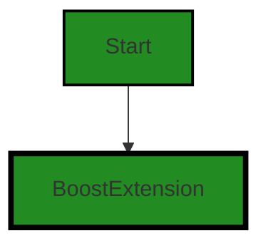


---

### Boost Source-Level Security Analysis

Last Updated: Saturday, September 9, 2023 at 7:55:12 AM PDT

**No bugs found**


---

### Boost Source-Level Performance Analysis

Last Updated: Saturday, September 9, 2023 at 7:59:47 AM PDT

**No bugs found**


---

### Boost Source-Level Data and Privacy Compliance Analysis

Last Updated: Saturday, September 9, 2023 at 8:03:26 AM PDT

**No bugs found**


### Cell 1:
## Original Code:

### Programming Language: typescript
### ./src/dashboard/summary_view.ts line 7

```typescript
import { aiName } from "./chat_view";

```
## Boost Analysis:


---

### Boost Code Explanation

Last Updated: Saturday, September 9, 2023 at 7:36:37 AM PDT

The given code is a single line of code written in JavaScript, specifically using ES6 (ECMAScript 2015) syntax. It's a part of the module system introduced in ES6.

```javascript
import { aiName } from "./chat_view";
```

This line of code is using the `import` statement to import a specific exported member (`aiName`) from another module (`./chat_view`). 

The `./chat_view` is a relative path to the module named `chat_view`. The `./` means that the `chat_view` module is in the same directory as the current file. If the path was `../chat_view`, it would mean that the `chat_view` module is in the parent directory. 

The `{ aiName }` syntax is called object destructuring. In this case, it's used to import only the `aiName` export from the `chat_view` module. If the `chat_view` module had multiple exports, this syntax would allow you to import only the ones you need.

The `aiName` is a named export in the `chat_view` module. A module can have multiple named exports, but they must each have a unique name. The `aiName` can then be used in the rest of the code in this module as a variable.

For more information on JavaScript's import/export syntax and module system, you can refer to the following resources:

- [MDN Web Docs: import](https://developer.mozilla.org/en-US/docs/Web/JavaScript/Reference/Statements/import)
- [MDN Web Docs: export](https://developer.mozilla.org/en-US/docs/web/javascript/reference/statements/export)

As for the architectural guidelines, this line of code appears to be consistent with good software practices. It's using a modular structure, which is a common and recommended practice in software development. This helps to organize code, make it more maintainable, and enable reuse across the project. However, without more context or additional code, it's hard to make a more detailed architectural analysis.


---

### Boost Flow Diagram

Last Updated: Saturday, September 9, 2023 at 7:51:52 AM PDT

NO CONTROL FLOW FOUND


---

### Boost Source-Level Security Analysis

Last Updated: Saturday, September 9, 2023 at 7:55:17 AM PDT

**No bugs found**


---

### Boost Source-Level Performance Analysis

Last Updated: Saturday, September 9, 2023 at 7:59:51 AM PDT

**No bugs found**


---

### Boost Source-Level Data and Privacy Compliance Analysis

Last Updated: Saturday, September 9, 2023 at 8:03:42 AM PDT

1. **Severity**: 4/10

   **Line Number**: 12

   **Bug Type**: GDPR

   **Description**: The variable 'aiName' could potentially be used to store personal data. If this is the case, it would be a violation of GDPR as personal data should be processed in a way that ensures appropriate security, including protection against unauthorized or unlawful processing and against accidental loss, destruction or damage.

   **Solution**: Ensure that any personal data stored in 'aiName' is anonymized or pseudonymized, and that appropriate security measures are in place to protect the data. If 'aiName' is not used to store personal data, no action is necessary.


### Cell 2:
## Original Code:

### Programming Language: typescript
### ./src/dashboard/summary_view.ts line 8

```typescript

import { WorkflowEngine, WorkflowError } from "../utilities/workflow_engine";

```
## Boost Analysis:


---

### Boost Code Explanation

Last Updated: Saturday, September 9, 2023 at 7:37:04 AM PDT

This code is a simple import statement written in JavaScript (or TypeScript). 

The `import` keyword is part of the ES6 (ECMAScript 6) module system, which provides a way to include modules—that is, JavaScript libraries or other pieces of code—into your own code. This system allows for better code organization, reuse, and separation of concerns.

Here's what's happening in this specific import statement:

1. `import { WorkflowEngine, WorkflowError } from "../utilities/workflow_engine";`

This statement is importing two specific exports, `WorkflowEngine` and `WorkflowError`, from a module located at `"../utilities/workflow_engine"`. The path `"../utilities/workflow_engine"` is a relative file path, meaning it's looking for the `workflow_engine` file in the `utilities` directory one level up from the current file's directory. 

The `WorkflowEngine` and `WorkflowError` could be anything that the `workflow_engine` module exports—variables, functions, classes, etc. In the context of their names and typical coding conventions, it's likely that `WorkflowEngine` is a class for handling workflow-related operations, and `WorkflowError` is a class for handling errors that occur within those operations. 

As for algorithms used, this line of code doesn't really involve any algorithms—it's simply a directive to the JavaScript interpreter to include certain pieces of code from another module. 

If you want to learn more about ES6 modules and the `import` statement, you can check out this resource: [MDN Web Docs: import](https://developer.mozilla.org/en-US/docs/Web/JavaScript/Reference/Statements/import). 

Regarding the architectural guidelines, this line of code doesn't seem to conflict with any architectural guidelines. It's a common practice in many software projects to organize code into modules and import them as needed. This helps keep code organized and manageable.


---

### Boost Flow Diagram

Last Updated: Saturday, September 9, 2023 at 7:52:00 AM PDT

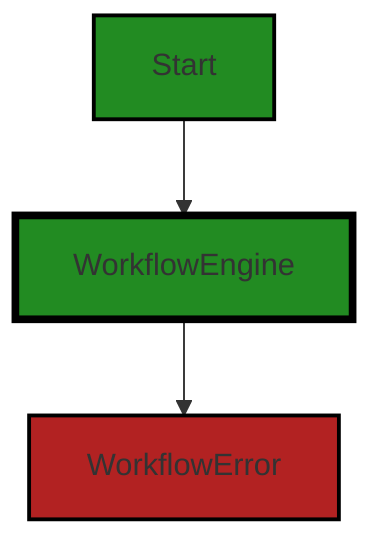

The control flow graph for the provided source code is a simple linear flow. The code starts at the `Start` node and then calls the `WorkflowEngine` function. If an error occurs during the execution of the `WorkflowEngine` function, the control flow goes to the `WorkflowError` node.


---

### Boost Source-Level Security Analysis

Last Updated: Saturday, September 9, 2023 at 7:55:20 AM PDT

**No bugs found**


---

### Boost Source-Level Performance Analysis

Last Updated: Saturday, September 9, 2023 at 7:59:55 AM PDT

**No bugs found**


---

### Boost Source-Level Data and Privacy Compliance Analysis

Last Updated: Saturday, September 9, 2023 at 8:04:08 AM PDT

1. **Severity**: 1/10

   **Line Number**: 14

   **Bug Type**: GDPR

   **Description**: The code imports a workflow engine, which could potentially process personal data. However, there's no explicit mention of data handling or privacy policies.

   **Solution**: Ensure that any personal data processed by the WorkflowEngine is handled according to GDPR guidelines. This may include obtaining user consent, anonymizing data, and providing data erasure capabilities.


2. **Severity**: 1/10

   **Line Number**: 14

   **Bug Type**: PCI DSS

   **Description**: If the WorkflowEngine processes payment card data, it must comply with PCI DSS. There's no explicit mention of how payment card data is handled.

   **Solution**: Ensure that the WorkflowEngine complies with PCI DSS guidelines when handling payment card data. This may include encrypting data, implementing access controls, and regularly auditing the system.


3. **Severity**: 1/10

   **Line Number**: 14

   **Bug Type**: HIPAA

   **Description**: If the WorkflowEngine processes protected health information (PHI), it must comply with HIPAA. There's no explicit mention of how PHI is handled.

   **Solution**: Ensure that the WorkflowEngine complies with HIPAA guidelines when handling PHI. This may include implementing data encryption, maintaining audit logs, and providing data access controls.


### Cell 3:
## Original Code:

### Programming Language: typescript
### ./src/dashboard/summary_view.ts line 10

```typescript

import { getKernelName } from "../extension/extensionUtilities";

```
## Boost Analysis:


---

### Boost Code Explanation

Last Updated: Saturday, September 9, 2023 at 7:37:38 AM PDT

The code you provided is a single line of code from a larger project, so the context is quite limited. However, I can still provide an analysis based on this line.

The code is written in JavaScript (or more specifically, TypeScript, which is a statically typed superset of JavaScript). It's using ES6 module syntax to import a function named `getKernelName` from another module located at "../extension/extensionUtilities".

Here's a breakdown:

- `import`: This is a keyword in JavaScript that is used to import functions, objects or values from another module or file.

- `{ getKernelName }`: This is the specific function that is being imported from the module. The curly braces are used for named exports (as opposed to default exports).

- `from`: This keyword is used to specify the path to the module from which the import is made.

- `"../extension/extensionUtilities"`: This is the path to the module that contains the `getKernelName` function. The `..` at the beginning of the path means that the module is located in the parent directory of the current module. The `/extension/extensionUtilities` part of the path is the directory and file name of the module (without the file extension, which is typically `.js` or `.ts` for JavaScript/TypeScript files).

As for the `getKernelName` function itself, I can't provide details on what it does or what algorithms it uses without seeing its implementation. However, based on its name, it likely retrieves the name of a kernel, possibly for a code analysis or computing task.

For more information on ES6 modules and import/export syntax, you can refer to this link: [ES6 Modules](https://developer.mozilla.org/en-US/docs/Web/JavaScript/Guide/Modules)

As for the architectural guidelines, this line of code seems to be consistent with good practices. It's modular, which is a key principle in software architecture. By importing only the `getKernelName` function, it ensures that each part of the application has a specific role and that roles are clearly separated. This makes the code easier to maintain and understand.


---

### Boost Flow Diagram

Last Updated: Saturday, September 9, 2023 at 7:52:05 AM PDT

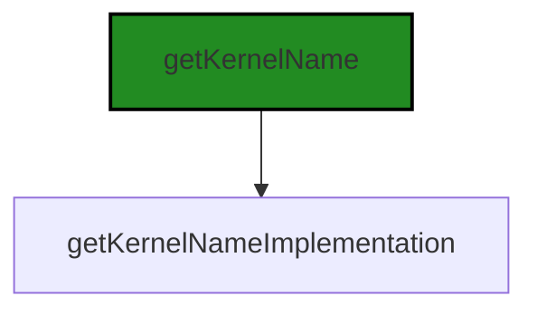
```


---

### Boost Source-Level Security Analysis

Last Updated: Saturday, September 9, 2023 at 7:55:24 AM PDT

**No bugs found**


---

### Boost Source-Level Performance Analysis

Last Updated: Saturday, September 9, 2023 at 7:59:59 AM PDT

**No bugs found**


---

### Boost Source-Level Data and Privacy Compliance Analysis

Last Updated: Saturday, September 9, 2023 at 8:04:41 AM PDT

1. **Severity**: 1/10

   **Line Number**: 18

   **Bug Type**: GDPR

   **Description**: The function getKernelName might be processing or storing personal data. If it does, it could potentially violate GDPR compliance if the data is not handled correctly.

   **Solution**: Ensure that any data processed or stored by the getKernelName function is anonymized or pseudonymized, and that appropriate consent is obtained from users. Implement data protection by design and by default, as required by GDPR.


2. **Severity**: 1/10

   **Line Number**: 18

   **Bug Type**: PCI DSS

   **Description**: If the function getKernelName processes or stores cardholder data, it could potentially violate PCI DSS compliance if the data is not handled correctly.

   **Solution**: Ensure that any cardholder data processed or stored by the getKernelName function is encrypted and that access to this data is restricted. Implement a robust access control system and regularly monitor and test networks, as required by PCI DSS.


3. **Severity**: 1/10

   **Line Number**: 18

   **Bug Type**: HIPAA

   **Description**: If the function getKernelName processes or stores protected health information (PHI), it could potentially violate HIPAA compliance if the data is not handled correctly.

   **Solution**: Ensure that any PHI processed or stored by the getKernelName function is encrypted, and that access to this data is restricted. Implement a robust access control system and regularly monitor and test networks, as required by HIPAA.


### Cell 4:
## Original Code:

### Programming Language: typescript
### ./src/dashboard/summary_view.ts line 12

```typescript
import {
    getAllProjectFiles,
} from "../utilities/files";

```
## Boost Analysis:


---

### Boost Code Explanation

Last Updated: Saturday, September 9, 2023 at 7:38:04 AM PDT

The code you've provided is a single line of JavaScript (or TypeScript) that imports a function named `getAllProjectFiles` from a module located at "../utilities/files".

Let's break down the elements of this line of code:

1. `import`: This is a keyword in JavaScript that is used to import functions, objects or values from other modules or files. This is part of the ES6 (ECMAScript 2015) module syntax.

2. `{ getAllProjectFiles }`: This is the specific function that is being imported from the module. The curly braces `{}` are used for named exports. That is, `getAllProjectFiles` is a function that is exported from the "../utilities/files" module using the `export` keyword.

3. `from "../utilities/files"`: This is the relative path to the module from which the function is being imported. The `..` at the beginning of the path means that the module is located in the parent directory of the current file. `/utilities/files` is the path from the parent directory to the module.

As for the `getAllProjectFiles` function, without seeing the function itself, it's hard to say what it does exactly. However, based on the name, it likely retrieves all the files in a given project. How it does this (the algorithm it uses) would depend on the details of the function.

In terms of architectural analysis, this line of code is consistent with common practices in JavaScript and TypeScript projects. The use of modular code (i.e., splitting code into separate modules that each handle a specific task) is a key principle of clean and maintainable code.

If you want to learn more about ES6 modules and import/export syntax, you can check out the following resources:

- [MDN Web Docs: import](https://developer.mozilla.org/en-US/docs/Web/JavaScript/Reference/Statements/import)
- [MDN Web Docs: export](https://developer.mozilla.org/en-US/docs/Web/JavaScript/Reference/Statements/export)
- [JavaScript.info: Modules](https://javascript.info/modules-intro)


---

### Boost Flow Diagram

Last Updated: Saturday, September 9, 2023 at 7:52:10 AM PDT

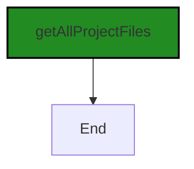


---

### Boost Source-Level Security Analysis

Last Updated: Saturday, September 9, 2023 at 7:55:27 AM PDT

**No bugs found**


---

### Boost Source-Level Performance Analysis

Last Updated: Saturday, September 9, 2023 at 8:00:02 AM PDT

**No bugs found**


---

### Boost Source-Level Data and Privacy Compliance Analysis

Last Updated: Saturday, September 9, 2023 at 8:05:08 AM PDT

1. **Severity**: 5/10

   **Line Number**: 22

   **Bug Type**: GDPR

   **Description**: The function 'getAllProjectFiles' could potentially access user's personal data, which may be a violation of GDPR if not properly handled.

   **Solution**: Ensure that user consent is obtained before accessing or processing their data. Implement data anonymization and encryption techniques to protect user data.


2. **Severity**: 5/10

   **Line Number**: 22

   **Bug Type**: PCI DSS

   **Description**: If the project files contain credit card data, the function 'getAllProjectFiles' could potentially expose this data, violating PCI DSS compliance.

   **Solution**: Ensure that credit card data is not stored in project files. If necessary, use tokenization or encryption to protect this data.


3. **Severity**: 5/10

   **Line Number**: 22

   **Bug Type**: HIPAA

   **Description**: If the project files contain health information, the function 'getAllProjectFiles' could potentially expose this data, violating HIPAA compliance.

   **Solution**: Ensure that health information is not stored in project files. If necessary, use encryption and access controls to protect this data.


### Cell 5:
## Original Code:

### Programming Language: typescript
### ./src/dashboard/summary_view.ts line 15

```typescript

import { NOTEBOOK_TYPE } from "../data/jupyter_notebook";

```
## Boost Analysis:


---

### Boost Code Explanation

Last Updated: Saturday, September 9, 2023 at 7:38:37 AM PDT

This single line of code is an import statement in JavaScript, specifically using the ES6 module syntax. It's importing a constant named `NOTEBOOK_TYPE` from a module located at `../data/jupyter_notebook`.

The `import` statement is used to import functions, objects, or values that have been exported from an external module, script, or other source. In this case, `NOTEBOOK_TYPE` is likely a constant that is used to denote the type of a notebook, probably a string that is used as an identifier.

Here's a bit more detail about each part of the statement:

- `import`: This is the keyword that begins the import statement. It tells JavaScript that we're about to bring in some external value or values.

- `{ NOTEBOOK_TYPE }`: This is the value we're importing. The curly braces are used for named exports - that is, values that were exported from the source module using their variable name. If the source module exported the value as a default export (without a specific name), we wouldn't use the curly braces.

- `from`: This keyword is used to specify the source of the imported value.

- `"../data/jupyter_notebook"`: This is the path to the module we're importing from. The `..` at the beginning of the path means we're going up one directory level from the current module. Then we're going into a `data` directory and importing from a module named `jupyter_notebook`. Note that we don't include the file extension in the module path.

The algorithm used here is pretty straightforward: when this module is loaded, JavaScript will go to the specified path, find the exported `NOTEBOOK_TYPE` value, and make it available in this module under the same name.

This code is quite common in JavaScript and TypeScript projects, and it's a crucial part of working with modules, which are a fundamental building block in these languages. It allows for better organization of code, reuse of code across different parts of an application, and managing dependencies between different parts of an application.

For more information, you can read about the `import` statement and ES6 modules on the Mozilla Developer Network (MDN): https://developer.mozilla.org/en-US/docs/Web/JavaScript/Reference/Statements/import


---

### Boost Flow Diagram

Last Updated: Saturday, September 9, 2023 at 7:52:19 AM PDT

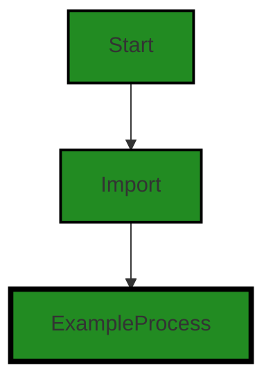

The control flow graph for the provided source code is a simple linear flow. The code starts at the "Start" node and then goes to the "Import" node, indicating the import of the `NOTEBOOK_TYPE` constant from the "../data/jupyter_notebook" module. Finally, the control flow goes to the "ExampleProcess" node, which represents the rest of the code in the file.


---

### Boost Source-Level Security Analysis

Last Updated: Saturday, September 9, 2023 at 7:55:31 AM PDT

**No bugs found**


---

### Boost Source-Level Performance Analysis

Last Updated: Saturday, September 9, 2023 at 8:00:06 AM PDT

**No bugs found**


---

### Boost Source-Level Data and Privacy Compliance Analysis

Last Updated: Saturday, September 9, 2023 at 8:05:15 AM PDT

1. **Severity**: 2/10

   **Line Number**: 28

   **Bug Type**: Data Privacy

   **Description**: The code imports a module that appears to deal with Jupyter notebooks, which may contain sensitive data. If this data is not handled correctly, it could lead to privacy issues.

   **Solution**: Ensure that any data from the Jupyter notebooks is handled in accordance with GDPR, PCI DSS, and HIPAA regulations. This could include anonymizing the data, encrypting it, or obtaining user consent before processing it.


### Cell 6:
## Original Code:

### Programming Language: typescript
### ./src/dashboard/summary_view.ts line 17

```typescript

import { summarizeKernelName } from "../controllers/summary_controller";

```
## Boost Analysis:


---

### Boost Code Explanation

Last Updated: Saturday, September 9, 2023 at 7:39:04 AM PDT

The provided code snippet is very brief and simple, but I will explain it in as much detail as possible.

This line of code is a single import statement written in JavaScript (or TypeScript, which is a superset of JavaScript), and it's used in a module-based system. 

The statement is importing a specific function `summarizeKernelName` from a module located at "../controllers/summary_controller". 

The function `summarizeKernelName` is not defined in this code snippet, so we can't discuss its algorithmic details. However, based on its name, we can infer that it might be responsible for providing a summary or brief description of a kernel's name. The term "kernel" could refer to a variety of things depending on the context of the project, but in many software systems, a kernel is the core component that controls everything else.

The file path "../controllers/summary_controller" indicates that the function is being imported from a file named "summary_controller.js" or "summary_controller.ts" located in a directory named "controllers" which is one level up from the current directory.

The use of import statements like this is a common practice in modular programming, which is a design technique that separates the functionality of a program into independent, interchangeable modules. This improves manageability and reusability of the code, and it's a common practice in many programming paradigms, including object-oriented programming and functional programming.

The import statement is consistent with the architectural blueprint summary provided earlier, which mentioned that the software project is a Visual Studio Code Extension written in JavaScript and TypeScript and follows object-oriented design principles.

Here is a link to learn more about the `import` statement in JavaScript: [MDN Web Docs: import](https://developer.mozilla.org/en-US/docs/Web/JavaScript/Reference/Statements/import)


---

### Boost Flow Diagram

Last Updated: Saturday, September 9, 2023 at 7:52:25 AM PDT

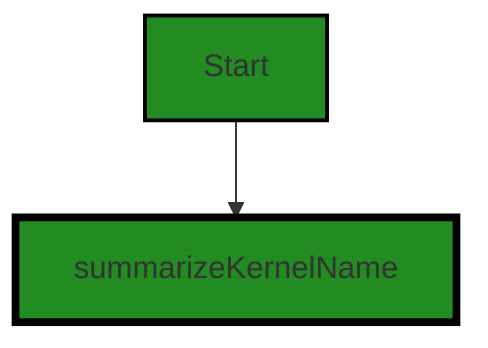


---

### Boost Source-Level Security Analysis

Last Updated: Saturday, September 9, 2023 at 7:55:34 AM PDT

**No bugs found**


---

### Boost Source-Level Performance Analysis

Last Updated: Saturday, September 9, 2023 at 8:00:09 AM PDT

**No bugs found**


---

### Boost Source-Level Data and Privacy Compliance Analysis

Last Updated: Saturday, September 9, 2023 at 8:05:28 AM PDT

1. **Severity**: 3/10

   **Line Number**: 32

   **Bug Type**: Data Compliance

   **Description**: The function 'summarizeKernelName' is being imported, but it's not clear what data it processes and how it handles that data. If it processes personal data, it may not be GDPR compliant.

   **Solution**: Ensure that the 'summarizeKernelName' function does not process personal data, or if it does, that it does so in a way that is GDPR compliant. This could involve anonymizing the data, obtaining user consent, or implementing other appropriate safeguards.


### Cell 7:
## Original Code:

### Programming Language: typescript
### ./src/dashboard/summary_view.ts line 19

```typescript
import { analyzeKernelName } from "../controllers/analyze_controller";

```
## Boost Analysis:


---

### Boost Code Explanation

Last Updated: Saturday, September 9, 2023 at 7:39:45 AM PDT

The code you've provided is a single line of code from a larger codebase, specifically an import statement in JavaScript (or TypeScript). This line is importing a specific function, `analyzeKernelName`, from a module located at `../controllers/analyze_controller`.

Here is a detailed explanation:

- `import`: This is a keyword in JavaScript (and TypeScript) that is part of the ES6 (ECMAScript 2015) import/export syntax. It is used to import functions, objects, or values from other modules or files. This allows for the separation of code into multiple files (modules), each with a specific purpose, promoting code reusability and maintainability.

- `{ analyzeKernelName }`: This is the specific function being imported from the module. The use of curly braces (`{}`) here denotes a named import. It means that the module we are importing from has multiple exports, and we are only interested in importing the `analyzeKernelName` function.

- `from "../controllers/analyze_controller"`: This is the relative path to the module or file that contains the `analyzeKernelName` function. The `..` at the beginning of the path indicates that the module is located in a parent directory. `/controllers/analyze_controller` is the directory path and the file name from which we are importing.

As for the algorithms used, this single line of code doesn't really involve any algorithms. It's simply a directive to the JavaScript (or TypeScript) interpreter to load a specific function from a specific module. However, the `analyzeKernelName` function itself might contain complex algorithms, but without the actual function definition, it's impossible to say what those might be.

For more information on JavaScript modules and import/export syntax, you can visit the following resources:
- [MDN Web Docs: JavaScript Modules](https://developer.mozilla.org/en-US/docs/Web/JavaScript/Guide/Modules)
- [MDN Web Docs: import statement](https://developer.mozilla.org/en-US/docs/Web/JavaScript/Reference/Statements/import)

Regarding architectural guidelines, this line of code appears to be in line with standard practices for structuring a JavaScript or TypeScript project, with code organized into modules and controllers. Without additional context or guidelines, it's hard to say more about this. However, the use of imports and exports to separate concerns and reuse code is a common and recommended practice in many software architectures.


---

### Boost Flow Diagram

Last Updated: Saturday, September 9, 2023 at 7:52:30 AM PDT

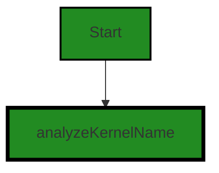


---

### Boost Source-Level Security Analysis

Last Updated: Saturday, September 9, 2023 at 7:55:37 AM PDT

**No bugs found**


---

### Boost Source-Level Performance Analysis

Last Updated: Saturday, September 9, 2023 at 8:00:12 AM PDT

**No bugs found**


---

### Boost Source-Level Data and Privacy Compliance Analysis

Last Updated: Saturday, September 9, 2023 at 8:06:04 AM PDT

1. **Severity**: 5/10

   **Line Number**: 36

   **Bug Type**: GDPR

   **Description**: The function 'analyzeKernelName' potentially processes personal data. If any personal data is processed, it may not be in compliance with GDPR if it's not done under the right conditions or without proper safeguards.

   **Solution**: Ensure that any personal data processed by 'analyzeKernelName' is done so in compliance with GDPR. This includes obtaining proper consent, implementing necessary safeguards, and ensuring the right to be forgotten is respected.


2. **Severity**: 5/10

   **Line Number**: 36

   **Bug Type**: PCI DSS

   **Description**: If 'analyzeKernelName' processes payment card data, it may not be in compliance with PCI DSS. PCI DSS requires that cardholder data is protected and that a secure network is maintained.

   **Solution**: Ensure that 'analyzeKernelName' does not process payment card data, or if it does, that it does so in a secure manner in compliance with PCI DSS. This includes encrypting transmission of cardholder data across open, public networks and maintaining a vulnerability management program.


3. **Severity**: 5/10

   **Line Number**: 36

   **Bug Type**: HIPAA

   **Description**: If 'analyzeKernelName' processes protected health information (PHI), it may not be in compliance with HIPAA. HIPAA requires that PHI is protected and that the minimum necessary information is used.

   **Solution**: Ensure that 'analyzeKernelName' does not process PHI, or if it does, that it does so in a secure manner in compliance with HIPAA. This includes implementing necessary safeguards, ensuring the minimum necessary information is used, and having proper agreements in place with any business associates.


### Cell 8:
## Original Code:

### Programming Language: typescript
### ./src/dashboard/summary_view.ts line 20

```typescript
import { analyzeFunctionKernelName } from "../controllers/analyze_function_controller";

```
## Boost Analysis:


---

### Boost Code Explanation

Last Updated: Saturday, September 9, 2023 at 7:40:08 AM PDT

This line of code is a single import statement in JavaScript, specifically using the ES6 syntax. It's part of a larger file, and without the rest of the code, it's hard to give a detailed explanation. However, I can explain what this line is doing in isolation.

The `import` statement is used to import functions, objects or values from other modules or files in your codebase. In this case, it's importing a named export from another module.

The `{ analyzeFunctionKernelName }` syntax is used for importing a specific "named export" from the module. Named exports are functions, objects, or primitive values that are exported from a module under their own names, rather than as properties of a default export object. 

The string `"../controllers/analyze_function_controller"` specifies the path to the module that contains the named export. The `..` at the start of the path means to go up one level in the directory structure. So this module is in a directory called `controllers` which is at the same level as the directory that contains the current module.

The `analyzeFunctionKernelName` is likely a function or a constant that is used in the code that follows this import statement. Without seeing the rest of the code, it's hard to speculate on its purpose. 

This line of code doesn't really involve any algorithms, it's just a way of organizing code into separate modules to keep things clean and easy to manage.

For more information on ES6 modules and import/export syntax, you can visit this link: [ES6 Modules](https://developer.mozilla.org/en-US/docs/Web/JavaScript/Guide/Modules)


---

### Boost Flow Diagram

Last Updated: Saturday, September 9, 2023 at 7:52:35 AM PDT

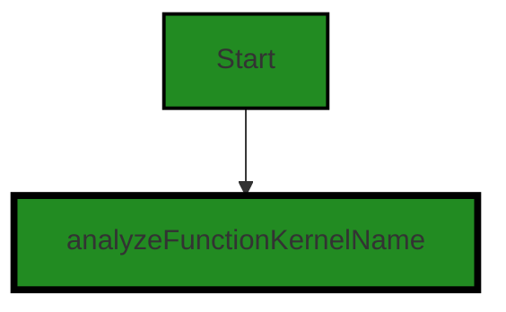


---

### Boost Source-Level Security Analysis

Last Updated: Saturday, September 9, 2023 at 7:55:41 AM PDT

**No bugs found**


---

### Boost Source-Level Performance Analysis

Last Updated: Saturday, September 9, 2023 at 8:00:17 AM PDT

**No bugs found**


---

### Boost Source-Level Data and Privacy Compliance Analysis

Last Updated: Saturday, September 9, 2023 at 8:06:07 AM PDT

**No bugs found**


### Cell 9:
## Original Code:

### Programming Language: typescript
### ./src/dashboard/summary_view.ts line 21

```typescript
import { complianceKernelName } from "../controllers/compliance_controller";

```
## Boost Analysis:


---

### Boost Code Explanation

Last Updated: Saturday, September 9, 2023 at 7:40:41 AM PDT

The code snippet you've provided is quite short, but I can still provide a basic explanation.

```import { complianceKernelName } from "../controllers/compliance_controller";```

This line of code is written in TypeScript, a statically typed superset of JavaScript that adds optional types, classes, and modules to the language, among other features.

The `import` statement is used to bring in exports from another module into the current module. In this case, it's importing the `complianceKernelName` export from the `compliance_controller` module.

The `compliance_controller` module is located in the `controllers` directory, which is one level up from the current directory. This is indicated by the `../` at the beginning of the module path.

The `{ complianceKernelName }` syntax is known as destructuring assignment. This allows you to unpack values from arrays, or properties from objects, into distinct variables. In this case, it's being used to import just the `complianceKernelName` export from the `compliance_controller` module, rather than importing the entire module.

As for the `complianceKernelName`, without more context, I can only guess that it's probably a string constant that holds the name of a compliance kernel used elsewhere in the application.

This code does not implement any specific algorithm, as it's simply importing a value from another module. 

For more information on the `import` statement and destructuring assignment in JavaScript and TypeScript, you can refer to the following resources:
- [MDN Web Docs: import](https://developer.mozilla.org/en-US/docs/Web/JavaScript/Reference/Statements/import)
- [MDN Web Docs: Destructuring assignment](https://developer.mozilla.org/en-US/docs/Web/JavaScript/Reference/Operators/Destructuring_assignment)
- [TypeScript Handbook: Modules](https://www.typescriptlang.org/docs/handbook/modules.html)


---

### Boost Flow Diagram

Last Updated: Saturday, September 9, 2023 at 7:52:40 AM PDT

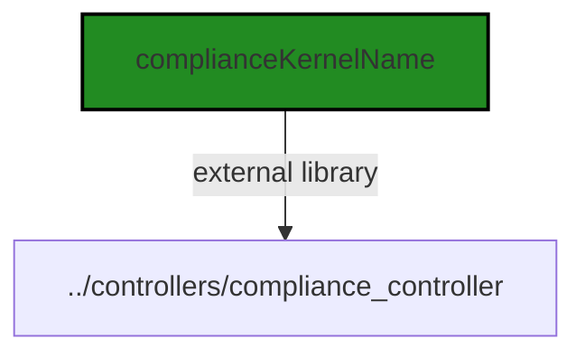


---

### Boost Source-Level Security Analysis

Last Updated: Saturday, September 9, 2023 at 7:55:44 AM PDT

**No bugs found**


---

### Boost Source-Level Performance Analysis

Last Updated: Saturday, September 9, 2023 at 8:00:20 AM PDT

**No bugs found**


---

### Boost Source-Level Data and Privacy Compliance Analysis

Last Updated: Saturday, September 9, 2023 at 8:06:10 AM PDT

**No bugs found**


### Cell 10:
## Original Code:

### Programming Language: typescript
### ./src/dashboard/summary_view.ts line 22

```typescript
import { blueprintKernelName } from "../controllers/blueprint_controller";

```
## Boost Analysis:


---

### Boost Code Explanation

Last Updated: Saturday, September 9, 2023 at 7:41:12 AM PDT

The code you provided is a single line of code which is an import statement in JavaScript (or TypeScript). This line of code is importing a specific exported member, `blueprintKernelName`, from a module located at `../controllers/blueprint_controller`.

Here is a detailed explanation:

- `import`: This is a keyword in JavaScript (and TypeScript) that is used to import functions, objects or values from another module or file.

- `{ blueprintKernelName }`: This is a named import. It means that the module we are importing from has exported a member with the name `blueprintKernelName`. Using curly braces `{}` allows us to import this specific member. If the module exports multiple members, we could import others by including their names in the curly braces, separated by commas.

- `from`: This keyword is used to specify the path of the module we are importing from.

- `"../controllers/blueprint_controller"`: This is the path to the module we are importing from. The `..` at the beginning of the path means we're going up one directory level from the current file. Then we're going into a directory named `controllers` and importing from a file named `blueprint_controller`. The file extension is not included in the import statement; the JavaScript (or TypeScript) interpreter will automatically look for a `.js` or `.ts` file with the specified name.

As for the algorithm, import statements don't really involve an algorithm per se. They are part of the module system in JavaScript, which is a way of organizing code into separate files and managing dependencies between them.

Here are some resources for further reading:

- [JavaScript Modules: A Beginner’s Guide](https://www.freecodecamp.org/news/javascript-modules-a-beginner-s-guide-783f7d7a5fcc/)
- [ES6 In Depth: Modules](https://hacks.mozilla.org/2015/08/es6-in-depth-modules/)
- [TypeScript Module Resolution](https://www.typescriptlang.org/docs/handbook/module-resolution.html)


---

### Boost Flow Diagram

Last Updated: Saturday, September 9, 2023 at 7:52:47 AM PDT

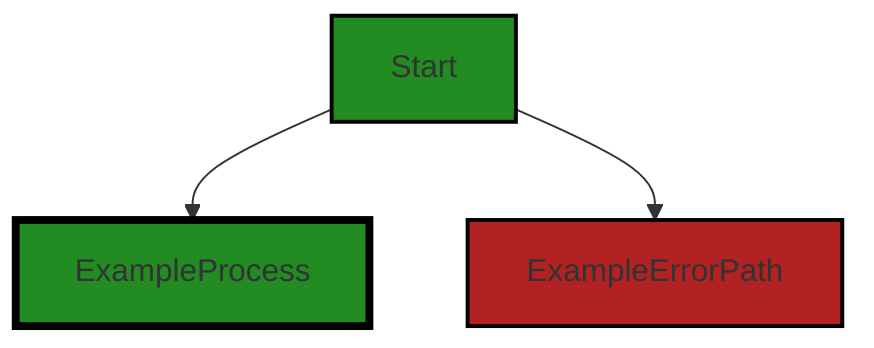

The code snippet provided does not contain any control flow.


---

### Boost Source-Level Security Analysis

Last Updated: Saturday, September 9, 2023 at 7:55:48 AM PDT

**No bugs found**


---

### Boost Source-Level Performance Analysis

Last Updated: Saturday, September 9, 2023 at 8:00:24 AM PDT

**No bugs found**


---

### Boost Source-Level Data and Privacy Compliance Analysis

Last Updated: Saturday, September 9, 2023 at 8:06:14 AM PDT

**No bugs found**


### Cell 11:
## Original Code:

### Programming Language: typescript
### ./src/dashboard/summary_view.ts line 23

```typescript
import { flowDiagramKernelName } from "../controllers/flowdiagram_controller";

```
## Boost Analysis:


---

### Boost Code Explanation

Last Updated: Saturday, September 9, 2023 at 7:41:48 AM PDT

The line of code you've provided is a single line import statement in JavaScript (or TypeScript), which is used to include external modules or pieces in the current file. This allows you to segregate your code into different files and import them when needed, promoting code reusability and modularity.

Here's a breakdown of the code:

`import { flowDiagramKernelName } from "../controllers/flowdiagram_controller";`

- `import` is a keyword in JavaScript that is used to import functions, objects or values from other files or modules.

- `{ flowDiagramKernelName }` is the specific piece being imported from the module. The curly braces `{}` are used for named exports. In this case, `flowDiagramKernelName` is a named export from the `flowdiagram_controller` module.

- `from "../controllers/flowdiagram_controller"` specifies the path to the file or module from which the `flowDiagramKernelName` is being imported. The `..` indicates moving up one directory level, and `/controllers/flowdiagram_controller` is the path from there to the module.

As for the architectural guidelines, this line of code seems to be in line with good practices. It's using modules and named exports, which are common in modern JavaScript and TypeScript development. This promotes code reusability and maintainability.

As for algorithms, there are no specific algorithms being used in this line of code. It's merely a directive to the JavaScript (or TypeScript) engine to include a specific piece from another module.

For more information on `import` and modules in JavaScript, you can refer to the following resources:

- [MDN Web Docs: import](https://developer.mozilla.org/en-US/docs/Web/JavaScript/Reference/Statements/import)
- [JavaScript Modules: A Beginner’s Guide](https://www.freecodecamp.org/news/javascript-modules-a-beginner-s-guide-783f7d7a5fcc/)


---

### Boost Flow Diagram

Last Updated: Saturday, September 9, 2023 at 7:52:50 AM PDT

NO CONTROL FLOW FOUND


---

### Boost Source-Level Security Analysis

Last Updated: Saturday, September 9, 2023 at 7:55:51 AM PDT

**No bugs found**


---

### Boost Source-Level Performance Analysis

Last Updated: Saturday, September 9, 2023 at 8:00:27 AM PDT

**No bugs found**


---

### Boost Source-Level Data and Privacy Compliance Analysis

Last Updated: Saturday, September 9, 2023 at 8:06:17 AM PDT

**No bugs found**


### Cell 12:
## Original Code:

### Programming Language: typescript
### ./src/dashboard/summary_view.ts line 24

```typescript
import { explainKernelName } from "../controllers/explain_controller";

```
## Boost Analysis:


---

### Boost Code Explanation

Last Updated: Saturday, September 9, 2023 at 7:42:19 AM PDT

The provided code is a single line of JavaScript (or TypeScript) code that is importing a function from another module. This is a standard operation in JavaScript and TypeScript, which both support a module system for organizing code into separate files and namespaces. 

Here's a detailed breakdown:

- `import`: This is a keyword in JavaScript and TypeScript that is used to import functions, objects, or values from other modules. This allows you to use code that is defined in another file.

- `{ explainKernelName }`: This is the specific function that is being imported from the other module. The curly braces are used when you want to import a specific export from a module, as opposed to importing the entire module. 

- `from "../controllers/explain_controller"`: This is the relative path to the module that contains the `explainKernelName` function. The `..` at the start of the path means to go up one directory level from the current file. Then, it goes into the `controllers` directory and imports from the `explain_controller` file.

This line of code doesn't contain an algorithm, but it's an essential part of structuring a JavaScript or TypeScript application. The `explainKernelName` function is likely used elsewhere in the code to perform some operation related to explaining a kernel name, based on its name.

For more information about the `import` statement in JavaScript, you can refer to this [MDN web docs link](https://developer.mozilla.org/en-US/docs/Web/JavaScript/Reference/Statements/import).

In terms of architectural guidelines, this code is consistent with common practices in JavaScript and TypeScript projects. It's modular, which makes the code more maintainable and testable. The use of a separate `controllers` directory suggests an MVC (Model-View-Controller) or similar architectural pattern, which is a common and recommended practice for structuring code in many types of software projects.


---

### Boost Flow Diagram

Last Updated: Saturday, September 9, 2023 at 7:52:58 AM PDT


The control flow graph for the provided code is a simple graph with two paths: one for the normal flow and one for the error path. The start of the graph is the function `explainKernelName`.


---

### Boost Source-Level Security Analysis

Last Updated: Saturday, September 9, 2023 at 7:55:54 AM PDT

**No bugs found**


---

### Boost Source-Level Performance Analysis

Last Updated: Saturday, September 9, 2023 at 8:00:31 AM PDT

**No bugs found**


---

### Boost Source-Level Data and Privacy Compliance Analysis

Last Updated: Saturday, September 9, 2023 at 8:06:21 AM PDT

**No bugs found**


### Cell 13:
## Original Code:

### Programming Language: typescript
### ./src/dashboard/summary_view.ts line 25

```typescript
import { boostLogging } from "../utilities/boostLogging";

```
## Boost Analysis:


---

### Boost Code Explanation

Last Updated: Saturday, September 9, 2023 at 7:42:45 AM PDT

The code provided is a single line of code written in JavaScript (or TypeScript). It is using the ES6 (ECMAScript 2015) import statement to import a module named `boostLogging` from a relative path `"../utilities/boostLogging"`.

Let's break down this line:

- `import`: This is an ES6 keyword used to import functions, objects or values from modules into the current script. 

- `{ boostLogging }`: This is the name of the module being imported. The curly braces are used for named exports. It means that the `boostLogging` module exports either a function, an object, or a value under the name `boostLogging`.

- `from "../utilities/boostLogging"`: This specifies the relative path to the module file. The `..` means to go up one directory level, then go into the `utilities` directory, and then import the `boostLogging` module. The `.js` or `.ts` extension is assumed and not required in the import statement.

The `boostLogging` module is likely a utility module that provides functionality related to logging in the Boost application. The specifics of what `boostLogging` does would depend on the code within the `boostLogging` module itself.

This line of code doesn't contain any algorithms. It's simply a directive to the JavaScript engine to load a module that contains certain functionality (in this case, likely logging-related functionality) so that functionality can be used elsewhere in the code.

For more information on ES6 modules and the import statement, you can refer to the following resources:

- [MDN Web Docs: import](https://developer.mozilla.org/en-US/docs/Web/JavaScript/Reference/Statements/import)
- [JavaScript Modules: A Beginner’s Guide](https://www.freecodecamp.org/news/javascript-modules-a-beginner-s-guide-783f7d7a5fcc/)


---

### Boost Flow Diagram

Last Updated: Saturday, September 9, 2023 at 7:53:02 AM PDT

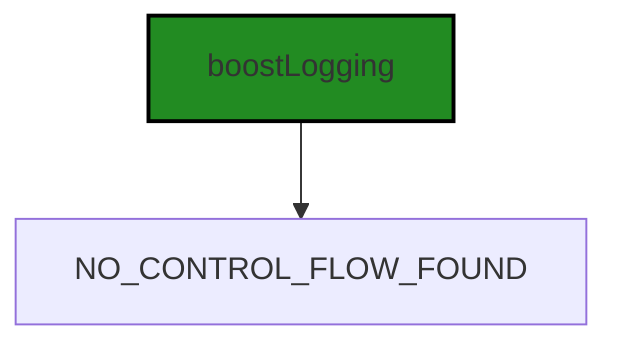


---

### Boost Source-Level Security Analysis

Last Updated: Saturday, September 9, 2023 at 7:55:57 AM PDT

**No bugs found**


---

### Boost Source-Level Performance Analysis

Last Updated: Saturday, September 9, 2023 at 8:00:34 AM PDT

**No bugs found**


---

### Boost Source-Level Data and Privacy Compliance Analysis

Last Updated: Saturday, September 9, 2023 at 8:06:24 AM PDT

**No bugs found**


### Cell 14:
## Original Code:

### Programming Language: typescript
### ./src/dashboard/summary_view.ts line 26

```typescript
import { BoostConfiguration } from "../extension/boostConfiguration";

```
## Boost Analysis:


---

### Boost Code Explanation

Last Updated: Saturday, September 9, 2023 at 7:43:09 AM PDT

This line of code is an import statement in JavaScript, specifically using the ES6 (ECMAScript 2015) module syntax. It's importing an object called `BoostConfiguration` from a module located at `"../extension/boostConfiguration"`.

The `BoostConfiguration` object could be a class, a function, a constant, or any other exportable JavaScript entity. The exact nature of `BoostConfiguration` isn't clear from this single line of code, but given its name and common naming conventions, it's likely that `BoostConfiguration` is a class that encapsulates the configuration settings for the Boost extension.

The path `"../extension/boostConfiguration"` specifies a relative file path. The `..` means to go up one directory level from the current file's location. From there, it goes into the `extension` directory and looks for a file named `boostConfiguration` (the file extension is omitted in the import statement, but it's likely to be either `.js` or `.ts` for JavaScript or TypeScript, respectively).

This line of code doesn't contain any algorithms. It's a simple import statement that allows the current module to use the `BoostConfiguration` object.

In terms of architectural guidelines, this line of code appears to be consistent with the high-level summary of the project as a Visual Studio Code extension written in JavaScript/TypeScript. The use of ES6 module syntax is a common practice in modern JavaScript and TypeScript development.

For more information about ES6 modules, you can refer to these resources:
- [MDN Web Docs: JavaScript Modules](https://developer.mozilla.org/en-US/docs/Web/JavaScript/Guide/Modules)
- [Exploring JS: Modules](https://exploringjs.com/es6/ch_modules.html)


---

### Boost Flow Diagram

Last Updated: Saturday, September 9, 2023 at 7:53:05 AM PDT

NO CONTROL FLOW FOUND


---

### Boost Source-Level Security Analysis

Last Updated: Saturday, September 9, 2023 at 7:56:01 AM PDT

**No bugs found**


---

### Boost Source-Level Performance Analysis

Last Updated: Saturday, September 9, 2023 at 8:00:37 AM PDT

**No bugs found**


---

### Boost Source-Level Data and Privacy Compliance Analysis

Last Updated: Saturday, September 9, 2023 at 8:06:58 AM PDT

1. **Severity**: 1/10

   **Line Number**: 50

   **Bug Type**: GDPR

   **Description**: The import statement does not indicate any data handling or privacy issues on its own. However, the BoostConfiguration file may contain code that violates GDPR if it processes personal data without proper consent, data minimization, or data protection measures.

   **Solution**: Review the BoostConfiguration file for any instances of personal data processing. Ensure that all personal data processing complies with GDPR principles such as obtaining explicit consent, minimizing data collection, and implementing appropriate security measures. Consider implementing a data protection impact assessment (DPIA) to identify and mitigate any data protection risks.


2. **Severity**: 1/10

   **Line Number**: 50

   **Bug Type**: PCI DSS

   **Description**: This import statement does not indicate any PCI DSS compliance issues on its own. However, the BoostConfiguration file may contain code that violates PCI DSS if it processes, stores, or transmits cardholder data without proper security measures.

   **Solution**: Review the BoostConfiguration file for any instances of cardholder data processing. Ensure that all cardholder data processing complies with PCI DSS requirements such as encryption of cardholder data, protection of systems against malware, and restriction of access to cardholder data.


3. **Severity**: 1/10

   **Line Number**: 50

   **Bug Type**: HIPAA

   **Description**: This import statement does not indicate any HIPAA compliance issues on its own. However, the BoostConfiguration file may contain code that violates HIPAA if it processes, stores, or transmits protected health information (PHI) without proper security measures.

   **Solution**: Review the BoostConfiguration file for any instances of PHI processing. Ensure that all PHI processing complies with HIPAA requirements such as encryption of PHI, implementation of access controls, and regular auditing of access logs.


### Cell 15:
## Original Code:

### Programming Language: typescript
### ./src/dashboard/summary_view.ts line 27

```typescript
import { complianceFunctionKernelName } from "../controllers/compliance_function_controller";

```
## Boost Analysis:


---

### Boost Code Explanation

Last Updated: Saturday, September 9, 2023 at 7:43:37 AM PDT

The provided code snippet is a single line of code that imports a variable from another module in the same project. The code is written in JavaScript ES6 syntax.

`import { complianceFunctionKernelName } from "../controllers/compliance_function_controller";`

This line is using the `import` statement to import a specific export (in this case, `complianceFunctionKernelName`) from another module. The module being imported from is `compliance_function_controller`, which is located in the `controllers` directory one level up from the current file.

The `import` statement is part of ES6 (ECMAScript 2015) and is used to import functions, objects, or values from other modules. This allows for code to be organized into smaller, more manageable files, and for code to be reused across multiple files.

The imported `complianceFunctionKernelName` is likely a constant or a function that is used in the current file. Without more context, it's hard to say what its purpose is, but the naming suggests it might be related to a kernel function for compliance checks.

As for algorithms, this line of code doesn't use any. It's a simple import statement that doesn't perform any operations or computations.

For more information about the `import` statement in JavaScript, you can refer to the following resources:

- [MDN Web Docs: import](https://developer.mozilla.org/en-US/docs/Web/JavaScript/Reference/Statements/import)
- [JavaScript.info: Import and export](https://javascript.info/import-export)

As for the architectural guidelines, this line of code seems to be consistent with the general architecture of the project. It's using standard ES6 syntax and organizing code into modules, which aligns with best practices for JavaScript development. Without additional specific architectural guidelines or constraints, it's hard to provide a more detailed analysis in this regard.


---

### Boost Flow Diagram

Last Updated: Saturday, September 9, 2023 at 7:53:10 AM PDT

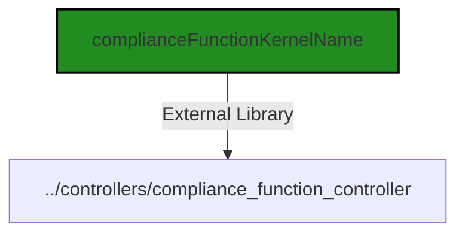


---

### Boost Source-Level Security Analysis

Last Updated: Saturday, September 9, 2023 at 7:56:04 AM PDT

**No bugs found**


---

### Boost Source-Level Performance Analysis

Last Updated: Saturday, September 9, 2023 at 8:00:45 AM PDT

**No bugs found**


---

### Boost Source-Level Data and Privacy Compliance Analysis

Last Updated: Saturday, September 9, 2023 at 8:07:01 AM PDT

**No bugs found**


### Cell 16:
## Original Code:

### Programming Language: typescript
### ./src/dashboard/summary_view.ts line 28

```typescript
import { performanceFunctionKernelName } from "../controllers/performance_function_controller";

```
## Boost Analysis:


---

### Boost Code Explanation

Last Updated: Saturday, September 9, 2023 at 7:44:09 AM PDT

The code you provided is a single line of JavaScript (or TypeScript) that imports a specific exported item from another module. This is a part of the ES6 (ECMAScript 6) module system which is widely used in modern JavaScript development.

The `import` statement is used to import bindings that are exported by another module. Imported modules are in strict mode whether you declare them as such or not. The `import` statement cannot be used in embedded scripts unless the script has a type="module". Bindings imported are called live bindings because they are updated by the module that exported the binding.

Here's a breakdown of the code:

- `import`: This is a keyword in JavaScript that allows one module to include functionality from another module.

- `{ performanceFunctionKernelName }`: This is the name of the specific export from the other module that this module wants to use. The curly braces are used for named exports (as opposed to default exports). This means that `performanceFunctionKernelName` is a named export of the module located at `"../controllers/performance_function_controller"`.

- `from`: This keyword is used to specify the path to the module that contains the export.

- `"../controllers/performance_function_controller"`: This is the path to the module that contains the `performanceFunctionKernelName` export. The `..` at the start of the path means that the module is located in a directory one level up from the current directory.

The algorithm used here is quite straightforward - the JavaScript runtime will go to the specified module and look for an export named `performanceFunctionKernelName`. If it finds one, it will make it available in this module under the same name.

For more information on `import` and ES6 modules, you can visit these resources:

- [MDN Web Docs: import](https://developer.mozilla.org/en-US/docs/Web/JavaScript/Reference/Statements/import)
- [JavaScript Info: Modules](https://javascript.info/modules-intro) 

As for the architectural guidelines, this line of code seems to be in line with common JavaScript practices and doesn't seem to conflict with any architectural guidelines. However, without additional context about the overall project architecture, it's hard to make a definitive statement.


---

### Boost Flow Diagram

Last Updated: Saturday, September 9, 2023 at 7:53:15 AM PDT

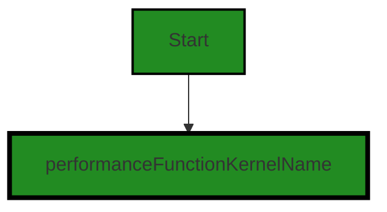


---

### Boost Source-Level Security Analysis

Last Updated: Saturday, September 9, 2023 at 7:56:07 AM PDT

**No bugs found**


---

### Boost Source-Level Performance Analysis

Last Updated: Saturday, September 9, 2023 at 8:00:48 AM PDT

**No bugs found**


---

### Boost Source-Level Data and Privacy Compliance Analysis

Last Updated: Saturday, September 9, 2023 at 8:07:05 AM PDT

**No bugs found**


### Cell 17:
## Original Code:

### Programming Language: typescript
### ./src/dashboard/summary_view.ts line 29

```typescript
import { BoostProjectData } from "../data/BoostProjectData";

```
## Boost Analysis:


---

### Boost Code Explanation

Last Updated: Saturday, September 9, 2023 at 7:44:38 AM PDT

The provided code snippet is very small and doesn't contain any algorithms or complex functionality. It is written in TypeScript, a statically typed superset of JavaScript, and is used in many modern web and software development projects for its additional safety and development features over standard JavaScript.

Let's break it down:

`import { BoostProjectData } from "../data/BoostProjectData";`

This line of code is using the ES6 (ECMAScript 2015) module system to import a specific export, `BoostProjectData`, from another module. The path to the module is given as `"../data/BoostProjectData"`, which is a relative file path.

`BoostProjectData` is likely to be a class, interface, type, or possibly a set of constants or utility functions, but without more context, we cannot be certain. The purpose of this import is to use `BoostProjectData` in the module where this import statement is written.

The file path `"../data/BoostProjectData"` indicates that the `BoostProjectData` module is located in a sibling directory to the current file's directory named `data`.

In terms of architectural guidelines, this code snippet is too small to make any definitive conclusions. However, it does show a modular structure, which is a common and recommended practice in software architecture. Modularity promotes separation of concerns, where each module has a specific role and interacts with other modules through well-defined interfaces.

For more information about ES6 modules, you can read this [MDN Web Docs guide](https://developer.mozilla.org/en-US/docs/Web/JavaScript/Guide/Modules). For more about TypeScript, you can visit the [official TypeScript website](https://www.typescriptlang.org/).


---

### Boost Flow Diagram

Last Updated: Saturday, September 9, 2023 at 7:53:18 AM PDT

NO CONTROL FLOW FOUND


---

### Boost Source-Level Security Analysis

Last Updated: Saturday, September 9, 2023 at 7:56:11 AM PDT

**No bugs found**


---

### Boost Source-Level Performance Analysis

Last Updated: Saturday, September 9, 2023 at 8:00:52 AM PDT

**No bugs found**


---

### Boost Source-Level Data and Privacy Compliance Analysis

Last Updated: Saturday, September 9, 2023 at 8:07:24 AM PDT

1. **Severity**: 8/10

   **Line Number**: 56

   **Bug Type**: GDPR

   **Description**: The code imports a module that might contain personal data of users, which could potentially be mishandled or misused. This could lead to a violation of the General Data Protection Regulation (GDPR).

   **Solution**: Ensure that any personal data is handled in accordance with GDPR guidelines. This includes obtaining explicit consent from the user before collecting their data, only collecting data that is necessary for the service, and securely storing and processing the data. Consider implementing data anonymization or pseudonymization techniques. Also, ensure that users can easily access, modify, and delete their personal data.


2. **Severity**: 8/10

   **Line Number**: 56

   **Bug Type**: PCI DSS

   **Description**: The code imports a module that might contain credit card data or other sensitive financial information. If this data is not handled correctly, it could lead to a violation of the Payment Card Industry Data Security Standard (PCI DSS).

   **Solution**: Ensure that any credit card or financial data is handled in accordance with PCI DSS guidelines. This includes encrypting the data both in transit and at rest, regularly testing and updating security systems and processes, and restricting access to the data on a need-to-know basis.


3. **Severity**: 8/10

   **Line Number**: 56

   **Bug Type**: HIPAA

   **Description**: The code imports a module that might contain health information. If this data is not handled correctly, it could lead to a violation of the Health Insurance Portability and Accountability Act (HIPAA).

   **Solution**: Ensure that any health information is handled in accordance with HIPAA guidelines. This includes implementing physical, technical, and administrative safeguards to protect the data, providing training to all employees who handle the data, and regularly reviewing and updating security measures.


### Cell 18:
## Original Code:

### Programming Language: typescript
### ./src/dashboard/summary_view.ts line 30

```typescript
import {
    FileSummaryItem,
    noProjectOpenMessage,
    extensionNotFullyActivated,
    extensionFailedToActivate,
    AnalysisState,
} from "../data/boostprojectdata_interface";

```
## Boost Analysis:


---

### Boost Code Explanation

Last Updated: Saturday, September 9, 2023 at 7:45:12 AM PDT

The code snippet you provided is in the TypeScript language, which is a statically typed superset of JavaScript that adds optional types to the language. It's part of a larger project, likely a Visual Studio Code extension based on the context provided in the architectural blueprint summary.

This particular snippet is an import statement, which is used to include external modules or parts of code from other files into the current file. In this case, it's importing several items from a module located at "../data/boostprojectdata_interface".

The items being imported are:

1. `FileSummaryItem`: This is likely a class, interface, or type that represents a summary of a file. It could be used to store and manipulate data related to a file, such as its name, size, modification date, etc.

2. `noProjectOpenMessage`, `extensionNotFullyActivated`, `extensionFailedToActivate`: These are likely constants or functions related to error handling or user notifications. They might be used to display messages to the user in certain scenarios, like if no project is open in the editor, if the extension is not fully activated, or if the extension failed to activate.

3. `AnalysisState`: This is likely a class, interface, or type that represents the state of a code analysis. It could be used to store and manipulate data related to an ongoing or completed code analysis, such as its progress, results, errors, etc.

The exact details of these items would depend on their definitions in the "boostprojectdata_interface" module.

The import statement doesn't involve any specific algorithm. It's a fundamental part of the module system in JavaScript and TypeScript, which helps in organizing code into separate, reusable pieces. The module system also helps in managing dependencies between different parts of code.

For more information about the import statement and module system in JavaScript and TypeScript, you can refer to the following resources:

- [JavaScript Modules](https://developer.mozilla.org/en-US/docs/Web/JavaScript/Guide/Modules)
- [TypeScript Modules](https://www.typescriptlang.org/docs/handbook/modules.html)

As for the architectural guidelines, this code snippet doesn't provide enough context to determine whether it's consistent with or conflicts with any specific guidelines. However, based on the architectural blueprint summary, it seems to follow the principles of object-oriented design and event-driven programming. The use of modules also aligns with best practices for structuring and organizing code.


---

### Boost Flow Diagram

Last Updated: Saturday, September 9, 2023 at 7:53:25 AM PDT


NO CONTROL FLOW FOUND


---

### Boost Source-Level Security Analysis

Last Updated: Saturday, September 9, 2023 at 7:56:14 AM PDT

**No bugs found**


---

### Boost Source-Level Performance Analysis

Last Updated: Saturday, September 9, 2023 at 8:01:51 AM PDT

**No bugs found**


---

### Boost Source-Level Data and Privacy Compliance Analysis

Last Updated: Saturday, September 9, 2023 at 8:07:28 AM PDT

**No bugs found**


### Cell 19:
## Original Code:

### Programming Language: typescript
### ./src/dashboard/summary_view.ts line 37

```typescript
import { quickBlueprintKernelName } from "../controllers/quick_blueprint_controller";

```
## Boost Analysis:


---

### Boost Code Explanation

Last Updated: Saturday, September 9, 2023 at 7:45:39 AM PDT

This line of code is a simple import statement in JavaScript (or TypeScript), used to bring in a specific exported value from another module.

Let's break it down:

- `import`: This is a reserved keyword in JavaScript (and TypeScript) that is used to import bindings which are exported by another module.
- `{ quickBlueprintKernelName }`: This is the specific binding or value that is being imported from another module. The curly braces `{}` are used for named exports. In this case, `quickBlueprintKernelName` is a named export from the module we are importing from.
- `from`: This is another reserved keyword in JavaScript (and TypeScript) that specifies the module to import from.
- `"../controllers/quick_blueprint_controller"`: This is the relative path to the module that contains the `quickBlueprintKernelName` export. The `..` means "go up one directory", and `/controllers/quick_blueprint_controller` is the path from there to the module.

In terms of architectural analysis, this line of code implies that the software is modular, with different parts of the codebase organized into separate modules. This is a common best practice in software development, as it helps to keep the codebase organized and maintainable. The use of import statements also suggests that the codebase follows the ES6 module system, which is a standard in modern JavaScript and TypeScript development.

For more information on JavaScript modules and import/export statements, you can refer to the following resources:

- [JavaScript Modules: A Beginner’s Guide](https://www.freecodecamp.org/news/javascript-modules-a-beginner-s-guide-783f7d7a5fcc/)
- [MDN Web Docs: import](https://developer.mozilla.org/en-US/docs/Web/JavaScript/Reference/Statements/import)


---

### Boost Flow Diagram

Last Updated: Saturday, September 9, 2023 at 7:53:30 AM PDT

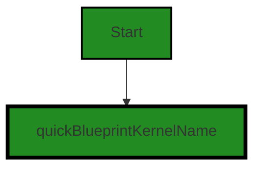


---

### Boost Source-Level Security Analysis

Last Updated: Saturday, September 9, 2023 at 7:57:00 AM PDT

**No bugs found**


---

### Boost Source-Level Performance Analysis

Last Updated: Saturday, September 9, 2023 at 8:01:54 AM PDT

**No bugs found**


---

### Boost Source-Level Data and Privacy Compliance Analysis

Last Updated: Saturday, September 9, 2023 at 8:07:32 AM PDT

**No bugs found**


### Cell 20:
## Original Code:

### Programming Language: typescript
### ./src/dashboard/summary_view.ts line 38

```typescript
import { performanceKernelName } from "../controllers/performance_controller";

```
## Boost Analysis:


---

### Boost Code Explanation

Last Updated: Saturday, September 9, 2023 at 7:46:10 AM PDT

The provided code is a single line of JavaScript or TypeScript. It's using the ES6 import statement to import a specific exported member from another module.

Let's break it down:

- `import`: This is the ES6 import statement. It's used to import functions, objects, or values that have been exported from another module. In this case, it's importing the `performanceKernelName` member.

- `{ performanceKernelName }`: This is the member that's being imported. The curly braces indicate that it's a named export from the other module, not a default export. Named exports allow a module to export multiple members, each with its own name.

- `from "../controllers/performance_controller"`: This is the path to the module that's being imported from. The `..` indicates that it's going up one directory level, then into the `controllers` directory, and importing from the `performance_controller` file. The file extension is not included in the import statement; it's assumed to be either `.js` or `.ts` depending on the context.

As for the architectural guidelines, this line of code is consistent with common practices in JavaScript and TypeScript projects. It's modular, with different parts of the code organized into separate files and directories. It's also using ES6 features, which are widely supported and recommended for modern JavaScript development.

The `performanceKernelName` likely refers to a specific kernel used for performance analysis in the codebase, given the naming and the import from a `performance_controller` module. However, without more context, it's hard to say exactly what role this member plays in the overall architecture.

For more information on ES6 import and export statements, you can refer to this MDN Web Docs page: [Import statement (MDN Web Docs)](https://developer.mozilla.org/en-US/docs/Web/JavaScript/Reference/Statements/import)


---

### Boost Flow Diagram

Last Updated: Saturday, September 9, 2023 at 7:53:34 AM PDT

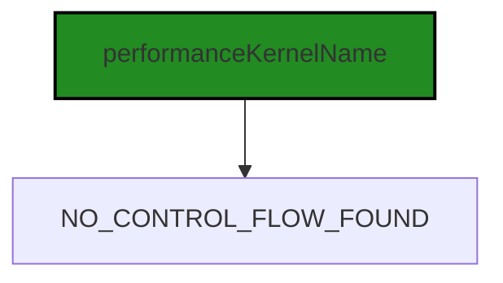


---

### Boost Source-Level Security Analysis

Last Updated: Saturday, September 9, 2023 at 7:57:03 AM PDT

**No bugs found**


---

### Boost Source-Level Performance Analysis

Last Updated: Saturday, September 9, 2023 at 8:01:57 AM PDT

**No bugs found**


---

### Boost Source-Level Data and Privacy Compliance Analysis

Last Updated: Saturday, September 9, 2023 at 8:07:43 AM PDT

1. **Severity**: 2/10

   **Line Number**: 74

   **Bug Type**: GDPR

   **Description**: The code imports a module that could potentially contain personal data. If the 'performanceKernelName' contains personal data, it could lead to GDPR compliance issues.

   **Solution**: Ensure that 'performanceKernelName' does not contain any personal data or, if it does, that it is properly anonymized or pseudonymized according to GDPR requirements.


### Cell 21:
## Original Code:

### Programming Language: typescript
### ./src/dashboard/summary_view.ts line 39

```typescript
import { BoostUserAnalysisType, DisplayGroupFriendlyName } from "../data/userAnalysisType";

```
## Boost Analysis:


---

### Boost Code Explanation

Last Updated: Saturday, September 9, 2023 at 7:46:40 AM PDT

This line of code is written in TypeScript, a statically typed superset of JavaScript. It's importing two constants or types, `BoostUserAnalysisType` and `DisplayGroupFriendlyName`, from a module located at `../data/userAnalysisType`.

Let's break down each part:

- `import`: This is the keyword used to import bindings which are exported by another module.

- `{ BoostUserAnalysisType, DisplayGroupFriendlyName }`: These are the specific constants or types that are being imported. They are enclosed in curly braces because they are named exports from the module, as opposed to a default export. If the module exported an object or function as the default export, the syntax would be `import BoostUserAnalysisType from "../data/userAnalysisType"` (without the curly braces).

- `from "../data/userAnalysisType"`: This is the path to the module that contains the exports. The `..` at the beginning of the path means to go up one directory level. So, if the current file is in a directory called `src`, this import statement is looking for a file called `userAnalysisType.ts` (or `userAnalysisType.js`) in a directory called `data` that's in the same parent directory as `src`.

The `BoostUserAnalysisType` and `DisplayGroupFriendlyName` are likely either TypeScript types, interfaces, enums or constants that are used elsewhere in the code to ensure consistency and correctness (through TypeScript's static type checking) or to provide some predefined values.

Without more context, it's hard to say exactly what these two imports are used for, but they are likely involved in defining the structure of data related to user analysis types and display groups, as suggested by their names.

Here are some resources for further reading:

- [TypeScript Handbook: Modules](https://www.typescriptlang.org/docs/handbook/modules.html)
- [MDN: import statement](https://developer.mozilla.org/en-US/docs/Web/JavaScript/Reference/Statements/import)


---

### Boost Flow Diagram

Last Updated: Saturday, September 9, 2023 at 7:53:39 AM PDT

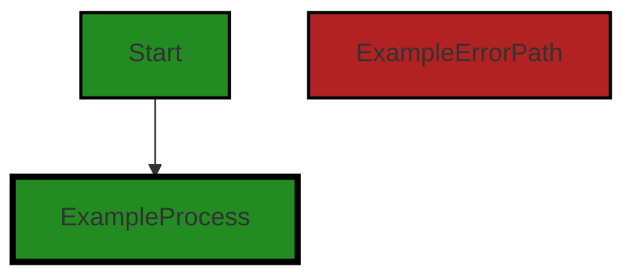


---

### Boost Source-Level Security Analysis

Last Updated: Saturday, September 9, 2023 at 7:57:06 AM PDT

**No bugs found**


---

### Boost Source-Level Performance Analysis

Last Updated: Saturday, September 9, 2023 at 8:02:01 AM PDT

**No bugs found**


---

### Boost Source-Level Data and Privacy Compliance Analysis

Last Updated: Saturday, September 9, 2023 at 8:07:56 AM PDT

1. **Severity**: 5/10

   **Line Number**: 76

   **Bug Type**: GDPR

   **Description**: The import statement could potentially lead to GDPR compliance issues if the imported modules handle personal data without proper consent, security, or data minimization.

   **Solution**: Ensure that the imported modules are GDPR compliant. This includes obtaining proper consent before processing personal data, implementing appropriate security measures, and minimizing the amount of data processed. If the imported modules are not GDPR compliant, consider replacing them or implementing additional measures to ensure compliance.


### Cell 22:
## Original Code:

### Programming Language: typescript
### ./src/dashboard/summary_view.ts line 40

```typescript
import { quickComplianceSummaryKernelName } from "../controllers/quick_compliance_summary_controller";

```
## Boost Analysis:


---

### Boost Code Explanation

Last Updated: Saturday, September 9, 2023 at 7:47:09 AM PDT

The line of code you provided is an import statement in JavaScript (or TypeScript, which is a superset of JavaScript). This statement is used to import bindings which are exported by another module.

In this particular line of code, the `quickComplianceSummaryKernelName` is being imported from the module `../controllers/quick_compliance_summary_controller`. The `../` at the beginning of the string indicates that the module is located in the parent directory of the current module. The `/controllers/quick_compliance_summary_controller` part of the string is the path to the module, relative to the parent directory.

The `quickComplianceSummaryKernelName` is likely a constant or function that is exported by the `quick_compliance_summary_controller` module. Without seeing the code of that module, it's not possible to say exactly what `quickComplianceSummaryKernelName` is, but it's likely used elsewhere in the code of the current module.

This import statement doesn't contain any algorithms, as it's just a way to include code from other modules. However, the way modules are loaded in JavaScript does involve some complexity behind the scenes. When a module is imported, the JavaScript runtime first checks if it has already been loaded. If not, it loads the module and executes its code. This can involve reading the module's code from disk or from a network location, parsing the JavaScript code, and executing it.

The module system in JavaScript is a key part of its architecture. It allows code to be organized into separate files and directories, each with its own scope. This helps to keep code organized and reduces the risk of name clashes between different parts of a large codebase.

For more information on modules in JavaScript, you can check out the following resources:
- [MDN Web Docs: JavaScript Modules](https://developer.mozilla.org/en-US/docs/Web/JavaScript/Guide/Modules)
- [Node.js Docs: Modules](https://nodejs.org/api/modules.html)


---

### Boost Flow Diagram

Last Updated: Saturday, September 9, 2023 at 7:53:45 AM PDT

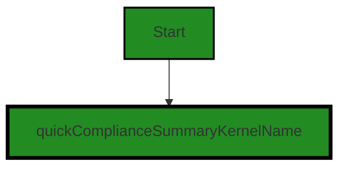


---

### Boost Source-Level Security Analysis

Last Updated: Saturday, September 9, 2023 at 7:57:10 AM PDT

**No bugs found**


---

### Boost Source-Level Performance Analysis

Last Updated: Saturday, September 9, 2023 at 8:02:04 AM PDT

**No bugs found**


---

### Boost Source-Level Data and Privacy Compliance Analysis

Last Updated: Saturday, September 9, 2023 at 8:08:00 AM PDT

**No bugs found**


### Cell 23:
## Original Code:

### Programming Language: typescript
### ./src/dashboard/summary_view.ts line 41

```typescript
import { quickSecuritySummaryKernelName } from "../controllers/quick_security_summary_controller";

```
## Boost Analysis:


---

### Boost Code Explanation

Last Updated: Saturday, September 9, 2023 at 7:47:36 AM PDT

The line of code you've provided is a single import statement in JavaScript (or TypeScript, which is a superset of JavaScript). 

Here's what it does:

```
import { quickSecuritySummaryKernelName } from "../controllers/quick_security_summary_controller";
```

The `import` statement is used to import bindings that are exported by another module. 

In this case, it's importing the `quickSecuritySummaryKernelName` binding from the module located at `../controllers/quick_security_summary_controller`.

The `quickSecuritySummaryKernelName` is likely a variable, function, or class that has been exported from the `quick_security_summary_controller` module and is now being imported for use in the current module.

The path `../controllers/quick_security_summary_controller` indicates that the `quick_security_summary_controller` module is located in a directory named `controllers` that is one level up from the current directory.

This import statement doesn't use any algorithms, but it is part of the JavaScript module system, which is an important part of structuring JavaScript and TypeScript applications. 

This line of code is consistent with the architectural blueprint summary provided earlier, which mentioned that the project is organized into classes (possibly contained within modules like `quick_security_summary_controller`), uses object-oriented design (which often involves importing and exporting classes between modules), and is written in JavaScript/TypeScript.

For more information on JavaScript imports and exports, you can refer to this link: [JavaScript Modules: A Beginner’s Guide](https://www.freecodecamp.org/news/javascript-modules-a-beginner-s-guide-783f7d7a5fcc/)


---

### Boost Flow Diagram

Last Updated: Saturday, September 9, 2023 at 7:53:51 AM PDT


---

### Boost Source-Level Security Analysis

Last Updated: Saturday, September 9, 2023 at 7:57:13 AM PDT

**No bugs found**


---

### Boost Source-Level Performance Analysis

Last Updated: Saturday, September 9, 2023 at 8:02:07 AM PDT

**No bugs found**


---

### Boost Source-Level Data and Privacy Compliance Analysis

Last Updated: Saturday, September 9, 2023 at 8:08:03 AM PDT

**No bugs found**


### Cell 24:
## Original Code:

### Programming Language: typescript
### ./src/dashboard/summary_view.ts line 42

```typescript
import { marked } from "marked";

```
## Boost Analysis:


---

### Boost Code Explanation

Last Updated: Saturday, September 9, 2023 at 7:48:05 AM PDT

The code you've provided is a single line of JavaScript code that imports a module named `marked` from a package also named `marked`.

`marked` is a full-featured markdown parser and compiler, written in JavaScript. It is built for speed and supports CommonMark Spec and GitHub Flavored Markdown Spec. It is used to convert markdown into HTML, and it can be used both on the server and in the browser.

The `import` statement is used to import functions, objects, or values from a module or package into your current file. The `{ marked }` syntax is called destructuring assignment and is used to import only the `marked` function from the `marked` package, rather than the entire module.

The algorithm used by `marked` is a parser for markdown. It reads in a string of text with markdown syntax, processes it to identify the different elements (like headers, links, bold text, etc.), and then outputs an HTML string that represents the same content.

You can find more information about the `marked` package on its [GitHub page](https://github.com/markedjs/marked) and its [npm page](https://www.npmjs.com/package/marked).

In terms of architectural guidelines, this line of code is quite standard and should not conflict with any typical guidelines. It's a common practice to import only the necessary parts from a module to keep the memory footprint of the application as small as possible.

However, without more context or a larger portion of code, it's difficult to provide a more detailed analysis. For instance, how the `marked` function is used in the rest of the code could have implications for the software architecture, such as whether it's used synchronously or asynchronously, how errors are handled, etc.


---

### Boost Flow Diagram

Last Updated: Saturday, September 9, 2023 at 7:53:57 AM PDT

```mermaid
graph TD;
style Start fill:#228B22, stroke:#000000, stroke-width:2px;
style ExampleProcess fill:#228B22, stroke:#000000, stroke-width:4px;
style ExampleErrorPath fill:#B22222, stroke:#000000, stroke-width:2px;

Start-->ExampleProcess;
Start-->ExampleErrorPath;
```

NO CONTROL FLOW FOUND


---

### Boost Source-Level Security Analysis

Last Updated: Saturday, September 9, 2023 at 7:57:29 AM PDT

1. **Severity**: 7/10

   **Line Number**: 82

   **Bug Type**: Cross Site Scripting (XSS)

   **Description**: The 'marked' library, used for Markdown parsing, can be vulnerable to Cross Site Scripting (XSS) if not properly sanitized before rendering. This can allow attackers to inject malicious scripts into your web pages, which can lead to a variety of attacks against your users. More about XSS can be found at https://owasp.org/www-community/attacks/xss/

   **Solution**: To mitigate this risk, you should sanitize the output of 'marked' before rendering it. This can be done using a library like 'DOMPurify'. Alternatively, you can configure 'marked' to sanitize its output by setting the 'sanitize' option to true, but this feature is deprecated and not recommended for use. More about DOMPurify can be found at https://github.com/cure53/DOMPurify


---

### Boost Source-Level Performance Analysis

Last Updated: Saturday, September 9, 2023 at 8:02:11 AM PDT

**No bugs found**


---

### Boost Source-Level Data and Privacy Compliance Analysis

Last Updated: Saturday, September 9, 2023 at 8:08:07 AM PDT

**No bugs found**


### Cell 25:
## Original Code:

### Programming Language: typescript
### ./src/dashboard/summary_view.ts line 43

```typescript
import {
    BoostFileType,
    findCellByKernel,
    getBoostFile,
    BoostCommands,
    ProcessCurrentFolderOptions,
} from "../extension/extension";

```
## Boost Analysis:


---

### Boost Code Explanation

Last Updated: Saturday, September 9, 2023 at 7:48:26 AM PDT

This code is written in TypeScript, a statically-typed superset of JavaScript. It's a simple import statement that brings in several items from a module located at "../extension/extension". Here's a breakdown of what each of these items are likely to be, based on their names and typical JavaScript/TypeScript conventions:

1. `BoostFileType`: This is likely a type or interface definition. In TypeScript, types are a way of specifying the kind of values that an object or variable can have. The `BoostFileType` might be a type that describes what a Boost file looks like or what properties it has.

2. `findCellByKernel`: This is probably a function. The name suggests that it's used to find a "cell" (possibly a term specific to this project or domain) that corresponds to a certain "kernel" (another domain-specific term). Without seeing the implementation or documentation, it's hard to say exactly what this function does, but it's likely that you pass it some kind of identifier for a kernel, and it returns the corresponding cell.

3. `getBoostFile`: This is likely another function, which might be used to retrieve a Boost file. Again, without more context, it's hard to say exactly what this means. It could be retrieving the file from disk, from a remote server, or from some other source.

4. `BoostCommands`: This could be an object, enum, or type that contains a set of commands related to the Boost functionality. If it's an object or enum, it might contain a set of string constants that represent the different commands. If it's a type, it might be used to check that a given command is a valid Boost command.

5. `ProcessCurrentFolderOptions`: This is likely a type or interface definition used to specify the options for a function or method that processes the current folder. The options might include things like whether to include subfolders, what file types to include, etc.

As for algorithms, this code doesn't appear to implement any. It's simply importing several items from another module. However, the algorithms would be found in the definitions of the functions being imported, i.e., `findCellByKernel` and `getBoostFile`.

As for architectural guidelines, this code seems to be following standard practices for modular JavaScript/TypeScript. By importing only the items it needs from the other module, it's keeping its dependencies clear and minimal, which is a good practice. 

For more information on TypeScript and its features, you can refer to the [official TypeScript documentation](https://www.typescriptlang.org/docs/).


---

### Boost Flow Diagram

Last Updated: Saturday, September 9, 2023 at 7:54:04 AM PDT

```mermaid
graph TD;
style Start fill:#228B22, stroke:#000000, stroke-width:2px;
style ExampleProcess fill:#228B22, stroke:#000000, stroke-width:4px;
style ExampleErrorPath fill:#B22222, stroke:#000000, stroke-width:2px;
style ExampleProcess fill:#228B22, stroke:#000000, stroke-width:4px;
style ExampleErrorPath fill:#B22222, stroke:#000000, stroke-width:2px;

Start-->ExampleProcess;
Start-->ExampleErrorPath;
ExampleProcess-->End;
ExamplErrorPath-->End;
```


---

### Boost Source-Level Security Analysis

Last Updated: Saturday, September 9, 2023 at 7:57:32 AM PDT

**No bugs found**


---

### Boost Source-Level Performance Analysis

Last Updated: Saturday, September 9, 2023 at 8:02:14 AM PDT

**No bugs found**


---

### Boost Source-Level Data and Privacy Compliance Analysis

Last Updated: Saturday, September 9, 2023 at 8:08:33 AM PDT

1. **Severity**: 5/10

   **Line Number**: 84

   **Bug Type**: GDPR

   **Description**: The code imports functions that could potentially access or process personal data without explicit user consent, which could be a violation of GDPR.

   **Solution**: Ensure that any personal data accessed or processed by these functions is done so with explicit user consent, and that users are able to withdraw their consent at any time. Implement checks to ensure GDPR compliance.


2. **Severity**: 4/10

   **Line Number**: 84

   **Bug Type**: PCI DSS

   **Description**: The code imports functions that could potentially access or process cardholder data, which could be a violation of PCI DSS if not handled correctly.

   **Solution**: Ensure that any cardholder data accessed or processed by these functions is done so in a secure manner that complies with PCI DSS standards. Implement checks to ensure PCI DSS compliance.


3. **Severity**: 6/10

   **Line Number**: 84

   **Bug Type**: HIPAA

   **Description**: The code imports functions that could potentially access or process protected health information (PHI), which could be a violation of HIPAA if not handled correctly.

   **Solution**: Ensure that any PHI accessed or processed by these functions is done so in a secure manner that complies with HIPAA standards. Implement checks to ensure HIPAA compliance.


### Cell 26:
## Original Code:

### Programming Language: typescript
### ./src/dashboard/summary_view.ts line 50

```typescript
import { BoostNotebook, BoostNotebookCell } from "../data/jupyter_notebook";

```
## Boost Analysis:


---

### Boost Code Explanation

Last Updated: Saturday, September 9, 2023 at 7:48:53 AM PDT

The provided code snippet is a part of a larger TypeScript file. TypeScript is a typed superset of JavaScript that adds static types. It is designed for the development of large applications and transcompiles to JavaScript.

The code is importing two modules or classes, `BoostNotebook` and `BoostNotebookCell`, from a file located at "../data/jupyter_notebook". The relative path indicates that the file `jupyter_notebook.ts` is located in a folder named `data` that is one level up from the current file. 

The `import` statement is used to import bindings which are exported by another module. Imported modules are in strict mode whether you declare them as such or not. The `import` statement cannot be used in embedded scripts unless such script has a `type="module"`.

The `BoostNotebook` and `BoostNotebookCell` are likely classes or interfaces that are defined in the `jupyter_notebook.ts` file. They are probably used to represent and manipulate Jupyter notebooks and their cells in the software.

The specifics of how these classes are used and what algorithms are employed would depend on the context not provided in this code snippet. 

For more information and education on TypeScript and its import/export syntax, you can visit the TypeScript documentation here: [TypeScript Modules](https://www.typescriptlang.org/docs/handbook/modules.html). For more information on Jupyter notebooks, you can visit the Jupyter project documentation here: [Jupyter Project](https://jupyter.org/documentation).

As for the architectural guidelines, since no additional special architectural guidelines or constraints are provided, the general best practices for TypeScript and modular programming are applicable here. The code is consistent with these practices as it uses import statements to include only the necessary modules, which helps with code organization and reuse.


---

### Boost Flow Diagram

Last Updated: Saturday, September 9, 2023 at 7:54:07 AM PDT

NO CONTROL FLOW FOUND


---

### Boost Source-Level Security Analysis

Last Updated: Saturday, September 9, 2023 at 7:57:35 AM PDT

**No bugs found**


---

### Boost Source-Level Performance Analysis

Last Updated: Saturday, September 9, 2023 at 8:02:18 AM PDT

**No bugs found**


---

### Boost Source-Level Data and Privacy Compliance Analysis

Last Updated: Saturday, September 9, 2023 at 8:09:00 AM PDT

1. **Severity**: 7/10

   **Line Number**: 98

   **Bug Type**: GDPR

   **Description**: The import statement indicates that the software uses data structures that may contain user data. If this data is personal data of EU citizens, it needs to be handled according to GDPR regulations.

   **Solution**: Ensure that the data in BoostNotebook and BoostNotebookCell is anonymized, pseudonymized, or encrypted, and that necessary consent is obtained for data processing. Implement data minimization principles.


2. **Severity**: 7/10

   **Line Number**: 98

   **Bug Type**: PCI DSS

   **Description**: If the BoostNotebook or BoostNotebookCell structures contain payment card information, they must comply with PCI DSS requirements.

   **Solution**: Ensure that cardholder data is not stored unless necessary and is encrypted when stored or transmitted. Implement strong access control measures.


3. **Severity**: 7/10

   **Line Number**: 98

   **Bug Type**: HIPAA

   **Description**: If the BoostNotebook or BoostNotebookCell structures contain health information, they must comply with HIPAA regulations.

   **Solution**: Ensure that health information is anonymized or encrypted and that necessary consent is obtained for data processing. Implement strong access control measures.


### Cell 27:
## Original Code:

### Programming Language: typescript
### ./src/dashboard/summary_view.ts line 51

```typescript
import { ControllerOutputType } from "../controllers/controllerOutputTypes";

```
## Boost Analysis:


---

### Boost Code Explanation

Last Updated: Saturday, September 9, 2023 at 7:49:37 AM PDT

The line of code provided is a single import statement written in TypeScript, a statically typed superset of JavaScript. This line is importing a specific exported entity, `ControllerOutputType`, from a relative module located at `"../controllers/controllerOutputTypes"`.

Here's a breakdown of each part:

- `import`: This is a keyword in JavaScript (and thus TypeScript) used to import functions, objects, or primitive values from another module. This allows you to break your code into separate files, each one exporting one or more entities, and import those entities where they're needed. This helps to organize your code and keep it modular.

- `{ ControllerOutputType }`: This is a named import. It means that the module at `"../controllers/controllerOutputTypes"` exports something named `ControllerOutputType`, and we want to import that specific thing. The curly braces are necessary for named imports.

- `from "../controllers/controllerOutputTypes"`: This part specifies the path to the module from which we're importing. The `..` means to go up one directory level from the current file, and `/controllers/controllerOutputTypes` is the path from there to the module. The `.ts` or `.js` extension is usually omitted.

The `ControllerOutputType` is likely an object, function, class, or some other entity that is exported from the `controllerOutputTypes` module. Without seeing the contents of that module, it's impossible to say exactly what `ControllerOutputType` is, but based on the name, it's likely involved in defining the types of outputs that can be produced by the controllers in this application.

As for the architectural guidelines, this import statement appears to be in line with good software architecture principles. It's making use of modules to organize the code, and it's importing only the specific entity that it needs from the `controllerOutputTypes` module.

For more information on import statements in JavaScript and TypeScript, you can refer to the following resources:

- [JavaScript Modules: Import statements](https://developer.mozilla.org/en-US/docs/Web/JavaScript/Guide/Modules#import_statements)
- [TypeScript Modules](https://www.typescriptlang.org/docs/handbook/modules.html)


---

### Boost Flow Diagram

Last Updated: Saturday, September 9, 2023 at 7:54:12 AM PDT

```mermaid
graph TD;
style Start fill:#228B22, stroke:#000000, stroke-width:2px;
style ControllerOutputType fill:#228B22, stroke:#000000, stroke-width:2px;

Start-->ControllerOutputType;
```


---

### Boost Source-Level Security Analysis

Last Updated: Saturday, September 9, 2023 at 7:57:38 AM PDT

**No bugs found**


---

### Boost Source-Level Performance Analysis

Last Updated: Saturday, September 9, 2023 at 8:02:21 AM PDT

**No bugs found**


---

### Boost Source-Level Data and Privacy Compliance Analysis

Last Updated: Saturday, September 9, 2023 at 8:09:15 AM PDT

1. **Severity**: 1/10

   **Line Number**: 100

   **Bug Type**: GDPR, PCI DSS, HIPAA

   **Description**: This line of code is importing a module but there are no immediate data compliance or privacy issues identified from this line alone. Compliance issues would depend on how the imported module is used in the rest of the code, which isn't provided here.

   **Solution**: Ensure that the imported module, 'ControllerOutputType', is used in compliance with GDPR, PCI DSS, and HIPAA regulations. For example, if it's used to handle personal, financial or health data, ensure that data is properly protected and that user consent is obtained when necessary.


### Cell 28:
## Original Code:

### Programming Language: typescript
### ./src/dashboard/summary_view.ts line 52

```typescript
import { getOrCreateBlueprintUri, getOrCreateGuideline } from "../extension/extension";

```
## Boost Analysis:


---

### Boost Code Explanation

Last Updated: Saturday, September 9, 2023 at 7:50:03 AM PDT

This code snippet is written in TypeScript, which is a statically typed superset of JavaScript that adds types to the language. 

The code is importing two functions, `getOrCreateBlueprintUri` and `getOrCreateGuideline`, from a module located at `../extension/extension`. This is a relative import, meaning that the module is located in a directory named `extension` one level up from the current directory, and the module's file name is `extension`.

Here's a brief explanation of the two functions being imported:

1. `getOrCreateBlueprintUri`: This function's name suggests that it retrieves a URI (Uniform Resource Identifier) associated with a blueprint. If the URI does not exist, the function creates it. The exact behavior of this function depends on its implementation in the `extension` module, which is not provided in the code snippet.

2. `getOrCreateGuideline`: This function's name suggests that it retrieves a guideline. If the guideline does not exist, the function creates it. The exact behavior of this function also depends on its implementation in the `extension` module.

The algorithms used in these functions cannot be determined from the provided code snippet, as it only shows the import statements and not the function implementations. 

The code snippet does not appear to conflict with the architectural guidelines provided in the project blueprint summary. It uses TypeScript and follows the principles of modular design, which are consistent with the project's use of TypeScript and object-oriented design. 

For additional education and background on TypeScript and its module system, you can refer to the following resources:
- [TypeScript Documentation](https://www.typescriptlang.org/docs/)
- [TypeScript Module Resolution](https://www.typescriptlang.org/docs/handbook/module-resolution.html)


---

### Boost Flow Diagram

Last Updated: Saturday, September 9, 2023 at 7:54:18 AM PDT

```mermaid
graph TD;
style getOrCreateBlueprintUri fill:#228B22, stroke:#000000, stroke-width:2px;
style getOrCreateGuideline fill:#228B22, stroke:#000000, stroke-width:2px;

getOrCreateBlueprintUri-->getOrCreateGuideline;
```


---

### Boost Source-Level Security Analysis

Last Updated: Saturday, September 9, 2023 at 7:57:42 AM PDT

**No bugs found**


---

### Boost Source-Level Performance Analysis

Last Updated: Saturday, September 9, 2023 at 8:02:24 AM PDT

**No bugs found**


---

### Boost Source-Level Data and Privacy Compliance Analysis

Last Updated: Saturday, September 9, 2023 at 8:09:50 AM PDT

1. **Severity**: 7/10

   **Line Number**: 102

   **Bug Type**: GDPR

   **Description**: The code imports a function that may create or retrieve a blueprint URI. Depending on how this URI is created and used, it may involve processing personal data. If not handled correctly, this could lead to GDPR non-compliance.

   **Solution**: Ensure that any personal data processed in the creation or use of the blueprint URI is done so in accordance with GDPR principles. This includes obtaining necessary consents, implementing appropriate security measures, and providing mechanisms for data subjects to exercise their rights. If possible, avoid processing personal data in the first place.


2. **Severity**: 6/10

   **Line Number**: 102

   **Bug Type**: PCI DSS

   **Description**: The code imports a function that may create or retrieve a blueprint URI. If this URI is used to process, store, or transmit cardholder data, it could lead to PCI DSS non-compliance.

   **Solution**: Ensure that the blueprint URI is not used to process, store, or transmit cardholder data unless necessary. If it is necessary, ensure that it is done in accordance with PCI DSS requirements. This includes implementing strong access control measures, regularly monitoring and testing networks, and maintaining a vulnerability management program.


3. **Severity**: 7/10

   **Line Number**: 102

   **Bug Type**: HIPAA

   **Description**: The code imports a function that may create or retrieve a blueprint URI. If this URI is used to process, store, or transmit protected health information (PHI), it could lead to HIPAA non-compliance.

   **Solution**: Ensure that the blueprint URI is not used to process, store, or transmit PHI unless necessary. If it is necessary, ensure that it is done in accordance with HIPAA requirements. This includes implementing necessary safeguards, conducting regular risk analyses, and providing training to staff.


### Cell 29:
## Original Code:

### Programming Language: typescript
### ./src/dashboard/summary_view.ts line 53

```typescript
import * as boostnb from "../data/jupyter_notebook";
import { quickPerformanceSummaryKernelName } from "../controllers/quick_performance_summary_controller";

```
## Boost Analysis:


---

### Boost Code Explanation

Last Updated: Saturday, September 9, 2023 at 7:50:28 AM PDT

This piece of code is written in TypeScript, which is a statically-typed superset of JavaScript. This code is importing modules for use in the current file. Let's break it down:

1. `import * as boostnb from "../data/jupyter_notebook";` - This line is importing all exported members from the module located at `../data/jupyter_notebook`. The `* as boostnb` syntax means that all exported members will be available under the `boostnb` namespace. This could include functions, classes, or constants that have been exported from the `jupyter_notebook` module. The exact path to the module is relative to the current file.

2. `import { quickPerformanceSummaryKernelName } from "../controllers/quick_performance_summary_controller";` - This line is importing a specific exported member from the module located at `../controllers/quick_performance_summary_controller`. The `{ quickPerformanceSummaryKernelName }` syntax means that only the `quickPerformanceSummaryKernelName` member will be imported. This could be a function, class, or constant that has been exported from the `quick_performance_summary_controller` module.

The code does not contain any algorithms, per se. It is simply importing modules for use in the current file. The actual algorithms would be contained in the imported modules.

As for the architectural guidelines, this code is consistent with common practices in TypeScript and Node.js projects. Modules are used to organize code into logical units, and importing modules is a standard way to use code from one module in another module.

Here are some resources for further reading:

- [TypeScript Modules](https://www.typescriptlang.org/docs/handbook/modules.html)
- [Node.js Modules](https://nodejs.org/api/modules.html)


---

### Boost Flow Diagram

Last Updated: Saturday, September 9, 2023 at 7:54:24 AM PDT

```mermaid
graph TD;
style Start fill:#228B22, stroke:#000000, stroke-width:2px;
style boostnb fill:#228B22, stroke:#000000, stroke-width:4px;
style quickPerformanceSummaryKernelName fill:#228B22, stroke:#000000, stroke-width:4px;

Start-->boostnb;
Start-->quickPerformanceSummaryKernelName;
```


---

### Boost Source-Level Security Analysis

Last Updated: Saturday, September 9, 2023 at 7:57:45 AM PDT

**No bugs found**


---

### Boost Source-Level Performance Analysis

Last Updated: Saturday, September 9, 2023 at 8:02:28 AM PDT

**No bugs found**


---

### Boost Source-Level Data and Privacy Compliance Analysis

Last Updated: Saturday, September 9, 2023 at 8:10:23 AM PDT

1. **Severity**: 2/10

   **Line Number**: 104

   **Bug Type**: GDPR

   **Description**: The code imports a module that handles data but does not implement any data protection measures. This could potentially lead to violations of the General Data Protection Regulation (GDPR) if personal data of EU citizens is processed.

   **Solution**: Implement data protection measures such as encryption and anonymization. Also, ensure that data is only processed with the user's consent and that the user has the ability to request deletion of their data.


2. **Severity**: 2/10

   **Line Number**: 105

   **Bug Type**: PCI DSS

   **Description**: The code imports a module that may process payment card data but does not implement any measures to protect this data. This could potentially lead to violations of the Payment Card Industry Data Security Standard (PCI DSS).

   **Solution**: Implement measures to protect cardholder data such as encryption and access controls. Also, ensure that the system is regularly tested for vulnerabilities.


3. **Severity**: 2/10

   **Line Number**: 104

   **Bug Type**: HIPAA

   **Description**: The code imports a module that may process health information but does not implement any measures to protect this data. This could potentially lead to violations of the Health Insurance Portability and Accountability Act (HIPAA).

   **Solution**: Implement measures to protect health information such as encryption and access controls. Also, ensure that the system is regularly tested for vulnerabilities.


### Cell 30:
## Original Code:

### Programming Language: typescript
### ./src/dashboard/summary_view.ts line 55

```typescript
import { codeGuidelinesKernelName } from "../controllers/codeguidelines_controller";

```
## Boost Analysis:


---

### Boost Code Explanation

Last Updated: Saturday, September 9, 2023 at 7:50:43 AM PDT

The code snippet you provided is quite brief, but I'll explain it as best as I can.

This line of code is written in TypeScript, a statically typed superset of JavaScript that adds types to the language. TypeScript is widely used in software development for its ability to catch errors during development through static typing, and for its support of advanced JavaScript features.

The `import` statement is used to bring in a particular export from another module into the current module. In this case, it's importing a named export `codeGuidelinesKernelName` from the module located at "../controllers/codeguidelines_controller". 

The `codeGuidelinesKernelName` is likely a string constant that holds the name of a kernel (a software component) that's used within the code guidelines controller. This is likely used in the context of identifying the kernel in the system.

As for the architectural guidelines, this code snippet seems to follow good practices. It's modular, as it's using imports to manage dependencies, and it's using a constant for the kernel name, which is a good practice to prevent errors that can be caused by typos in string literals.

The algorithm used here is straightforward: the import statement is part of the module loading system in JavaScript and TypeScript, which is a linear process of locating the module, binding the exports, and then making those exports available to the importing module.

For more information about `import` in JavaScript/TypeScript, you can refer to:

- [MDN Web Docs: import](https://developer.mozilla.org/en-US/docs/Web/JavaScript/Reference/Statements/import)
- [TypeScript: Modules](https://www.typescriptlang.org/docs/handbook/modules.html)


---

### Boost Flow Diagram

Last Updated: Saturday, September 9, 2023 at 7:54:30 AM PDT

```mermaid
graph TD;
style Start fill:#228B22, stroke:#000000, stroke-width:2px;
style codeGuidelinesKernelName fill:#228B22, stroke:#000000, stroke-width:4px;

Start-->codeGuidelinesKernelName;
```


---

### Boost Source-Level Security Analysis

Last Updated: Saturday, September 9, 2023 at 7:57:49 AM PDT

**No bugs found**


---

### Boost Source-Level Performance Analysis

Last Updated: Saturday, September 9, 2023 at 8:02:31 AM PDT

**No bugs found**


---

### Boost Source-Level Data and Privacy Compliance Analysis

Last Updated: Saturday, September 9, 2023 at 8:10:26 AM PDT

**No bugs found**


### Cell 31:
## Original Code:

### Programming Language: typescript
### ./src/dashboard/summary_view.ts line 56

```typescript

export const summaryViewType = "polyverse-boost-summary-view";

export class BoostSummaryViewProvider implements vscode.WebviewViewProvider {
    private _view?: vscode.WebviewView;
    private _context: vscode.ExtensionContext;

    constructor(
        private readonly context: vscode.ExtensionContext,
        private _boostExtension: BoostExtension
    ) {
        this._context = context;
    }

    public async resolveWebviewView(
        webviewView: vscode.WebviewView,
        context: vscode.WebviewViewResolveContext,
        _token: vscode.CancellationToken
    ) {
        try {
            this._resolveWebviewView(webviewView, context, _token);
        } catch (e) {
            boostLogging.error(
                `Could not load Boost Summary View due to ${e}`,
                false
            );
        }
    }

    async _resolveWebviewView(
        webviewView: vscode.WebviewView,
        context: vscode.WebviewViewResolveContext,
        _token: vscode.CancellationToken
    ) {
        this._view = webviewView;

        webviewView.webview.options = {
            // Allow scripts in the webview
            enableScripts: true,

            localResourceRoots: [this.context.extensionUri],
        };

        webviewView.webview.html = this._getHtmlForWebview(
            webviewView.webview,
            this._boostExtension.getBoostProjectData()!
        );

        webviewView.webview.onDidReceiveMessage(async (data) => {
            switch (data.command) {
                case "refreshUI":
                    {
                        const boostprojectdata = this._boostExtension.getBoostProjectData()!;
                        const payload = {
                            command: "refreshUI",
                            boostprojectdata: boostprojectdata,
                        };
                        this._view?.webview.postMessage(payload);
                    }
                    break;
                case "open_file":
                    {
                        await this._openFile(
                            data.file,
                            this._boostExtension.getBoostProjectData()
                        );
                    }
                    break;
                case "analyze_all":
                    {
                        await this.analyzeAll(data.analysisTypes, data.fileLimit);
                    }

                    break;
                case "analysis_type_changed":
                    {
                        this._boostExtension.getBoostProjectData()!.toggleAnalysisTypeEnabled(
                            data.analysisType, data.checked);
                        }
                    break;
                case "analyze_mode_changed":
                    {
                        this._boostExtension.getBoostProjectData()!.setAnalysisMode(
                            data.choice);
                        const payload = {
                            command: "refreshUI",
                            boostprojectdata: this._boostExtension.getBoostProjectData(),
                        };
                        this._view?.webview.postMessage(payload);
                    }
                    break;
                case "refresh_deep_summary": {
                    await this.refreshDeepSummary();
                }
            }
        });
    }

    public refresh() {
        try {
            this._refresh();
        } catch (e) {
            boostLogging.error(
                `Could not refresh Boost Summary View due to ${e}`,
                false
            );
        }
    }

    async _refresh() {
        if (this._view) {
            this._view.webview.html = this._getHtmlForWebview(
                this._view.webview,
                this._boostExtension.getBoostProjectData()!
            );
            this._view.show?.(true);
        }
    }

    private _getHtmlForWebview(
        webview: vscode.Webview,
        boostprojectdata: BoostProjectData
    ) {
        const htmlPathOnDisk = vscode.Uri.joinPath(
            this.context.extensionUri,
            "resources",
            "dashboard",
            "summary.html"
        );
        const jsPathOnDisk = vscode.Uri.joinPath(
            this.context.extensionUri,
            "out",
            "dashboard",
            "summary",
            "main.js"
        );
        const jsSrc = webview.asWebviewUri(jsPathOnDisk);
        const nonce = "nonce-123456"; // TODO: add a real nonce here
        const rawHtmlContent = fs.readFileSync(htmlPathOnDisk.fsPath, "utf8");

        let message;
        if (!this._boostExtension.finishedActivation) {
            if (!vscode.workspace.workspaceFolders) {
                message = noProjectOpenMessage;
            } else {
                message = extensionNotFullyActivated;
            }
        } else if (!this._boostExtension.successfullyActivated) {
            message = extensionFailedToActivate;
        } else if (!boostprojectdata || !vscode.workspace.workspaceFolders) {
            message = noProjectOpenMessage;
        }

        if (message) {
            return `<html><body><h3>Project Status</h3><p>${message}</p></body></html>`;
        }
        const convert = marked.parse;
        const blueprintFile = boostprojectdata.summary.summaryUrl;
        const guidelinesFile = getBoostFile(
            undefined,
            { format: BoostFileType.guidelines,
              showUI: false}
        ).fsPath;

        const summaryMarkdown = this._getMarkdownForSummaries();

        const template = _.template(rawHtmlContent);
        const htmlContent = template({
            jsSrc,
            nonce,
            boostprojectdata,
            summaryMarkdown,
            convert,
            blueprintFile,
            guidelinesFile,
            aiName,
        });

        return htmlContent;
    }

    public addJobs(
        job: string,
        files: [string],
        boostprojectdata: BoostProjectData
    ) {
        //if this._jobs[jobs] exists, add count to it, otherwise set it to count
        boostprojectdata.addJobs(job, files);
        const payload = {
            command: "refreshUI",
            boostprojectdata: boostprojectdata,
            error: null,
        };
        this._view?.webview.postMessage(payload);
    }

    public finishJob(
        job: string,
        file: string,
        summary: FileSummaryItem | null,
        boostprojectdata: BoostProjectData,
        error: Error | null
    ) {
        boostprojectdata.finishJob(job, file, summary, error);
        const payload = {
            command: "refreshUI",
            error: error,
            boostprojectdata: boostprojectdata,
        };
        this._view?.webview.postMessage(payload);
    }

    public finishAllJobs(boostprojectdata: BoostProjectData) {
        boostprojectdata.finishAllJobs();
        const payload = {
            command: "finishAllJobs",
            boostprojectdata: boostprojectdata,
        };
        this._view?.webview.postMessage(payload);
    }

    public addQueue(
        jobs: string[],
        files: string[],
        boostprojectdata: BoostProjectData
    ) {
        boostprojectdata.addQueue(jobs, files);
        const payload = {
            command: "refreshUI",
            boostprojectdata: boostprojectdata,
            error: null,
        };
        this._view?.webview.postMessage(payload);
    }

    private async _openFile(relativePath: string, boostprojectdata: any) {
        if (!vscode.workspace.workspaceFolders?.[0]) {
            boostLogging.error(
                "Please open a Project folder or workspace first",
                true
            );
            return;
        }
        // handle the special cases of blueprint and guidelines. in the case of
        // guidelines, we look for the extension, as we don't store that in boostdata
        // boostnb.NOTEBOOK_GUIDELINES_EXTENSION
        let targetNotebookUri: vscode.Uri;
        let docAbsolutePath: string;
        if (relativePath === boostprojectdata.summary.summaryUrl) {
            targetNotebookUri = await getOrCreateBlueprintUri(
                this.context,
                relativePath
            );
            docAbsolutePath = targetNotebookUri.fsPath;
        } else if (
            relativePath.endsWith(boostnb.NOTEBOOK_GUIDELINES_EXTENSION)
        ) {
            targetNotebookUri = getBoostFile(
                undefined,
                { format: BoostFileType.guidelines }
            );
            getOrCreateGuideline(targetNotebookUri, BoostFileType.guidelines);
            docAbsolutePath = targetNotebookUri.fsPath;
        } else {
            docAbsolutePath = path.join(
                vscode.workspace.workspaceFolders?.[0].uri.fsPath as string,
                relativePath
            );
        }

        const docUri = vscode.Uri.file(docAbsolutePath);
        try {
            //if the filename ends with boost-notebook, then open the notebook
            if (docUri.fsPath.endsWith(".boost-notebook")) {
                const document = await vscode.workspace.openNotebookDocument(
                    docUri
                );
                await vscode.window.showNotebookDocument(document);
            } else {
                // otherwise, open as text
                await vscode.window.showTextDocument(docUri);
            }
        } catch (e) {
            boostLogging.error(
                `Could not open file ${docAbsolutePath} due to ${e}`,
                true
            );
        }
    }

    private async analyzeAll(analysisTypes: string[], fileLimit: number) {
        this._boostExtension.getBoostProjectData()?.setAnalysisState(AnalysisState.preparing);
        try
        {
            if (BoostConfiguration.processFilesInGroups) {
                await this.processAllFilesInRings(analysisTypes, fileLimit);
            } else {
                await this.processAllFilesInSequence(analysisTypes, fileLimit);
            }
        } catch (e) {
            boostLogging.error(`Run Selected Analysis failed: ${e}`, true);
        } finally {
            // make sure we always restore the analysis state to quiescent after finishing analysis
            this.finishAllJobs(this._boostExtension.getBoostProjectData()!);
            this.refresh();
        }
    }

    readonly ringSummaryAnalysisMap = new Map([
        [
            BoostUserAnalysisType.documentation,
            [
            ],
        ],
        [
            BoostUserAnalysisType.security,
            [
                getKernelName(quickSecuritySummaryKernelName),
                getKernelName(quickPerformanceSummaryKernelName),
            ],
        ],
        [
            BoostUserAnalysisType.compliance,
            [
                getKernelName(quickComplianceSummaryKernelName),
            ],
        ],
    ]);

    readonly ringFileAnalysisMap = new Map([
        [
            BoostUserAnalysisType.documentation,
            [
                getKernelName(explainKernelName),
                getKernelName(flowDiagramKernelName),
            ],
        ],
        [
            BoostUserAnalysisType.security,
            [
                getKernelName(analyzeFunctionKernelName),
                getKernelName(quickSecuritySummaryKernelName),
                getKernelName(performanceFunctionKernelName),
                getKernelName(quickPerformanceSummaryKernelName),
            ],
        ],
        [
            BoostUserAnalysisType.compliance,
            [
                getKernelName(complianceFunctionKernelName),
                getKernelName(quickComplianceSummaryKernelName),
            ],
        ],
        [
            BoostUserAnalysisType.deepCode,
            [
                getKernelName(analyzeKernelName),
                getKernelName(complianceKernelName),
                getKernelName(performanceKernelName),
                getKernelName(codeGuidelinesKernelName),
                getKernelName(performanceKernelName),
            ],
        ],
    ]);

    readonly ringFileAnalysisOutputMap = new Map([
        [
            BoostUserAnalysisType.documentation,
            [
                ControllerOutputType.explain,
                ControllerOutputType.flowDiagram,
            ],
        ],
        [
            BoostUserAnalysisType.security,
            [
                ControllerOutputType.analyzeFunction,
                ControllerOutputType.performanceFunction,
            ],
        ],
        [
            BoostUserAnalysisType.compliance,
            [
                ControllerOutputType.complianceFunction,
            ],
        ],
        [
            BoostUserAnalysisType.deepCode,
            [
                ControllerOutputType.analyze,
                ControllerOutputType.compliance,
                ControllerOutputType.performance,
                ControllerOutputType.codeGuidelines,
                ControllerOutputType.performance
            ],
        ],
    ]);     

    checkAccountEnabledBeforeContinuingAnalysis() {
        const projectData = this._boostExtension.getBoostProjectData();
        if (!projectData) {
            throw new WorkflowError("abort", "Aborting analysis - Unable to determine current account status.");
        }
        const processingEnabled = projectData.account.enabled;
        if (!processingEnabled) {
            throw new WorkflowError("abort", `Account is ${projectData.account.status} and cannot perform analysis. Please update your account in the Account Dashboard.`);
        }
    }

    async processAllFilesInRings(analysisTypes: string[], fileLimit: number) {
        const tasks : any[] = [];

        // check current account status before even starting
        this.checkAccountEnabledBeforeContinuingAnalysis();

        const workflowName = "Run Selected Analysis";

        // we're going to dynamically build the list at the start of the run
        //      so we get the best most up to date list of files from
        //      blueprint
        const prepareFileList = async () => {
            // get the entire list of files to analyze
            const allFiles = await getAllProjectFiles();
            boostLogging.info(`Total Project is ${allFiles.length} files`);
    
            // get the requested # of files only
            const limitedFiles = (fileLimit !== 0)?allFiles.slice(0, fileLimit):allFiles;
            if (fileLimit !== 0) {
                boostLogging.info(`Processing only ${limitedFiles.length} files by request`);
            }

            //compute the ControllerOutputTypes for the analysisTypes by looking at the ringSummaryAnalysisMap
            //with the analysisTypes, turn into an array. the map returns an array of contollers, we
            // get the outputtype with controller.outputType

            const controllerOutputTypes = analysisTypes.map((analysisType) => {
                const outputTypes = this.ringFileAnalysisOutputMap.get(analysisType as BoostUserAnalysisType);
                if (outputTypes) {
                    return outputTypes.map((outputType) => {
                        return outputType as ControllerOutputType;
                    });
                } else {
                    return [];
                }
            }).flat();

            // log the relative path for simplicity for user
            const rootPath = vscode.workspace.workspaceFolders?.[0].uri.fsPath as string;

            const relFiles : string[] = [];

            limitedFiles.forEach((file) => {
                const relativePath = path.relative(rootPath, file);
                relFiles.push(relativePath);
                tasks.push(
                    () => {

                        const fileDynamicFunc = async () => { // use arrow function
                            const fileAnalysisTasks : any[] = [];

                            const fileAnalysisWorkflowName = `${workflowName}-File ${relativePath}`;
                            for (const [key, value] of this.ringFileAnalysisMap) {
                                fileAnalysisTasks.push(
                                    () => {
                                        const analysisTypeDynamicFunc = async () => {
                                            if (!analysisTypes.includes(key)) {
                                                throw new WorkflowError("skip", `Skipping File ${key} Analysis by user request`);
                                            }
                                            const fileUri = vscode.Uri.parse(file);
                                            const areaAnalysisWorkflowName = `${fileAnalysisWorkflowName}-${key}`;
                                            await this.processDepthOnRingFileTask(fileUri, value, areaAnalysisWorkflowName);
                                        };
                                        
                                        // Name the function dynamically based on the key
                                        Object.defineProperty(analysisTypeDynamicFunc, 'name', { value: key, writable: false });
                                        
                                        return analysisTypeDynamicFunc;
                                    }
                                );
                            }

                            const fileAnalysisEngine = new WorkflowEngine(fileAnalysisTasks, {
                                pattern: [1],
                                logger: boostLogging,
                                name: fileAnalysisWorkflowName,
                            });

                            const fileAnalysisResults = await fileAnalysisEngine.run();
                            const completed = fileAnalysisResults.filter((x) => !x[0] || !(x[0] instanceof WorkflowError));
                            const skipped = fileAnalysisResults.filter((x) => x[0] && x[0] instanceof WorkflowError && (x[0] as WorkflowError).type === "skip");
                            const aborted = fileAnalysisResults.filter((x) => x[0] && x[0] instanceof WorkflowError && (x[0] as WorkflowError).type === "abort");
                            const canceled = fileAnalysisResults.filter((x) => x[0] && x[0] instanceof WorkflowError && (x[0] as WorkflowError).type === "abort");
                            boostLogging.info(`${relativePath} Analysis completed: ${completed.length}`);
                            boostLogging.info(`${relativePath} Analysis skipped: ${skipped.length}`);

                            if (aborted.length > 0) {
                                throw aborted[0];
                            }
                            if (canceled.length > 0) {
                                throw canceled[0];
                            }
                            if (completed.length === 0 && skipped.length > 0) {
                                throw new WorkflowError("skip", `Skipping File ${relativePath} Analysis because all analysis types were skipped`);
                            }

                            return file;
                        };
                        
                        // Name the function dynamically based on the file (to improve logging)
                        Object.defineProperty(fileDynamicFunc, 'name', { value: relativePath, writable: false });
                        
                        return fileDynamicFunc;
                    }
                );
            });

            this.addQueue(controllerOutputTypes, relFiles, this._boostExtension.getBoostProjectData()!);
        };
 
        const beforeRun = [
            () => async () => {
                if (BoostConfiguration.simulateServiceCalls) {
                    boostLogging.debug(`Simulate:executeCommand: processProject(${getKernelName(quickBlueprintKernelName)})`);
                } else {
                    this.checkAccountEnabledBeforeContinuingAnalysis();
                    // we want to run blueprint first so we get the excludes and priority list before
                    //   we build the task list for the file rings
                    await vscode.commands.executeCommand(
                        NOTEBOOK_TYPE +
                        "." +
                        BoostCommands.processProject,
                        getKernelName(quickBlueprintKernelName)
                    );
                    this.checkAccountEnabledBeforeContinuingAnalysis();
                }

                await prepareFileList();

                if (BoostConfiguration.simulateServiceCalls) {
                    boostLogging.debug(`Simulate:executeCommand: loadCurrentFolder()`);
                    boostLogging.debug(`Simulate:executeCommand: refreshProjectData()`);
                } else {

                    // creates and loads/refreshes/rebuilds all notebook files
                    await vscode.commands.executeCommand(
                        NOTEBOOK_TYPE + "." + BoostCommands.loadCurrentFolder,
                        undefined
                    );
                    // refresh project data (since we may have rebuilt source/files)
                    return vscode.commands.executeCommand(
                        NOTEBOOK_TYPE + "." + BoostCommands.refreshProjectData
                    );
                }
            },
        ];

        const afterEachTask = [
            () => async (inputs: any[]) => {
                const path = inputs[0]; // first param is the file path

                // refresh output files for the analysis on this file
                if (BoostConfiguration.simulateServiceCalls) {
                    boostLogging.debug(`Simulate:executeCommand: buildCurrentFileOutput`);
                } else {
                    await vscode.commands.executeCommand(
                        NOTEBOOK_TYPE + "." + BoostCommands.buildCurrentFileOutput,
                        vscode.Uri.parse(path),
                        "all" // build all outputs for this file
                    );
                }

                if (!BoostConfiguration.alwaysRunSummary) {
                    boostLogging.info(`Skipping summary for source file: ${path}`);
                    return;
                }

                if (BoostConfiguration.simulateServiceCalls) {
                    boostLogging.debug(`Simulate:executeCommand: processCurrentFolder(${path}, ${getKernelName(summarizeKernelName)})`);
                } else {
                    // build the summary notebook for this file
                    await vscode.commands.executeCommand(
                        NOTEBOOK_TYPE + "." + BoostCommands.processCurrentFolder,
                        vscode.Uri.parse(path),
                        getKernelName(summarizeKernelName)
                    );
                    this.checkAccountEnabledBeforeContinuingAnalysis();
                }

                // refresh output files for the analysis summary on this file
                if (BoostConfiguration.simulateServiceCalls) {
                    boostLogging.debug(`Simulate:executeCommand: buildCurrentFileSummaryOutput`);
                } else {
                    await vscode.commands.executeCommand(
                        NOTEBOOK_TYPE + "." + BoostCommands.buildCurrentFileSummaryOutput,
                        vscode.Uri.parse(path),
                        "all" // build all outputs for this file
                    );
                }
            },
        ];
        const afterEachTaskGroup = [
            () => async () => {
                const afterRingSummaryRun = [
                    () => async () => {
                        if (BoostConfiguration.simulateServiceCalls) {
                            boostLogging.debug(`Simulate:executeCommand: refreshProjectData()`);
                        } else {
                            // refresh project data
                            return vscode.commands.executeCommand(
                                NOTEBOOK_TYPE + "." + BoostCommands.refreshProjectData
                            );
                        }
                    },
                ];

                const summaryTasks : any[] = [];

                const summaryWorkflowName = `${workflowName}-Summarization`;
                for (const [key, value] of this.ringSummaryAnalysisMap) {
                    summaryTasks.push(
                        () => {
                            const dynamicFunc = async () => {
                                if (!analysisTypes.includes(key)) {
                                    throw new WorkflowError("skip", `Skipping Summary Analysis ${key} by user request`);
                                }
                                return this.processQuickSummaryOfRingFileTaskGroup(value);
                            };
                            
                            // Name the function dynamically based on the key
                            Object.defineProperty(dynamicFunc, 'name', { value: key, writable: false });
                            
                            return dynamicFunc;
                        }
                    );
                }
                
                const summaryEngine = new WorkflowEngine(summaryTasks, {
                    afterRun: afterRingSummaryRun,
                    pattern: [1],
                    logger: boostLogging,
                    name: summaryWorkflowName,
                });

                const summaryResults = await summaryEngine.run();
                const completed = summaryResults.filter((x) => !x[0] || !(x[0] instanceof WorkflowError));
                const skipped = summaryResults.filter((x) => x[0] && x[0] instanceof WorkflowError && (x[0] as WorkflowError).type === "skip");
                const aborted = summaryResults.filter((x) => x[0] && x[0] instanceof WorkflowError && (x[0] as WorkflowError).type === "abort");
                const canceled = summaryResults.filter((x) => x[0] && x[0] instanceof WorkflowError && (x[0] as WorkflowError).type === "abort");
                boostLogging.info(`Workflow Analysis Summaries completed: ${completed.length}`);
                boostLogging.info(`Workflow Analysis Summaries skipped: ${skipped.length}`);

                if (aborted.length > 0) {
                    throw aborted[0];
                }
                if (canceled.length > 0) {
                    throw canceled[0];
                }
                if (completed.length === 0 && skipped.length > 0) {
                    throw new WorkflowError("skip", `Skipping Workflow Analysis Summaries because all analysis types were skipped`);
                }
            },
        ];
        const afterRun = [
            () => async () => {
                if (BoostConfiguration.simulateServiceCalls) {
                    boostLogging.debug(`Simulate:executeCommand: refreshProjectData()`);
                } else {
                    // refresh project data, refresh the UI
                    await vscode.commands.executeCommand(
                        NOTEBOOK_TYPE + "." + BoostCommands.refreshProjectData
                    );
                }

                // refresh summary output at the end of the run
                if (BoostConfiguration.simulateServiceCalls) {
                    boostLogging.debug(`Simulate:executeCommand: buildCurrentFolderSummaryOutput`);
                } else {
                    await vscode.commands.executeCommand(
                        NOTEBOOK_TYPE + "." + BoostCommands.buildCurrentFolderSummaryOutput,
                        undefined,
                        "all" // build all summary outputs for the entire project
                    );
                }
            },
        ];

        // if we're doing a targeted limit, then process 1 sample then small batch at a time
        // if we have no limit, then double ring size each iteration
        const pattern = (fileLimit === 0)?
            [1, 2, 4, 8, 16]    // infinite limit, doubling in size each ring
            :[1, 4];            // limited (sample), 1 sample then 4 at a time

        const engine = new WorkflowEngine(tasks, {
            beforeRun: beforeRun,
            afterEachTask: afterEachTask,
            afterEachTaskGroup: afterEachTaskGroup,
            afterRun: afterRun,
            pattern: pattern,
            logger: boostLogging,
            name: workflowName,
        });

        try {
            const allResults = await engine.run();
            const completed = allResults.filter((x) => !x[0] || !(x[0] instanceof WorkflowError));
            const skipped = allResults.filter((x) => x[0] && x[0] instanceof WorkflowError && (x[0] as WorkflowError).type === "skip");
            const aborted = allResults.filter((x) => x[0] && x[0] instanceof WorkflowError && (x[0] as WorkflowError).type === "abort");
            const canceled = allResults.filter((x) => x[0] && x[0] instanceof WorkflowError && (x[0] as WorkflowError).type === "abort");
            boostLogging.info(`Overall Workflow File Analysis completed: ${completed.length}`);
            boostLogging.info(`Overall Workflow File Analysis skipped: ${skipped.length}`);

            if (aborted.length > 0) {
                throw aborted[0];
            }
            if (canceled.length > 0) {
                throw canceled[0];
            }

        } finally {
            this.finishAllJobs(this._boostExtension.getBoostProjectData()!);
            this.refresh();
        }
    }

    private async processDepthOnRingFileTask(
        fileUri: vscode.Uri,
        value: string[],
        workflowName: string) {
        // log the relative path for simplicity for user
        const rootPath = vscode.workspace.workspaceFolders?.[0].uri.fsPath as string;
        const relativePath = path.relative(rootPath, fileUri.fsPath);

        const analysisTypeKernelTasks : any[] = [];
        
        for (const analysisKernelName of value) {
            analysisTypeKernelTasks.push(
                () => {
                    const dynamicFunc = async () => {
                        if (BoostConfiguration.simulateServiceCalls) {
                            boostLogging.debug(`Simulate:executeCommand: processCurrentFolder(${fileUri}, ${analysisKernelName})`);
                            return;
                        }
                        this.checkAccountEnabledBeforeContinuingAnalysis();
                        const refreshed = await vscode.commands.executeCommand(
                            NOTEBOOK_TYPE +
                            "." +
                            BoostCommands.processCurrentFolder,
                            {
                                kernelCommand: analysisKernelName,
                                filelist: [fileUri],
                            } as ProcessCurrentFolderOptions
                        );
                        this.checkAccountEnabledBeforeContinuingAnalysis();
                        if (!refreshed) {
                            throw new WorkflowError("skip", `Analysis for ${relativePath} was skipped - all analyzable content was already up to date`);
                        }
                    };
                    
                    // Name the function dynamically
                    Object.defineProperty(dynamicFunc, 'name', { value: `${relativePath}:${analysisKernelName}`, writable: false });
                    
                    return dynamicFunc;
                }
            );
        }
        
        const fileAnalysisEngine = new WorkflowEngine(analysisTypeKernelTasks, {
            pattern: [1],
            logger: boostLogging,
            name: workflowName,
        });

        const analysisTypeResults = await fileAnalysisEngine.run();
        const completed = analysisTypeResults.filter((x) => !x[0] || !(x[0] instanceof WorkflowError));
        const skipped = analysisTypeResults.filter((x) => x[0] && x[0] instanceof WorkflowError && (x[0] as WorkflowError).type === "skip");
        const aborted = analysisTypeResults.filter((x) => x[0] && x[0] instanceof WorkflowError && (x[0] as WorkflowError).type === "abort");
        const canceled = analysisTypeResults.filter((x) => x[0] && x[0] instanceof WorkflowError && (x[0] as WorkflowError).type === "cancel");
        boostLogging.info(`${relativePath} Analysis Kernels completed: ${completed.length}`);
        boostLogging.info(`${relativePath} Analysis Kernels skipped: ${skipped.length}`);

        if (aborted.length > 0) {
            throw aborted[0];
        }
        if (canceled.length > 0) {
            throw canceled[0];
        }
        if (completed.length === 0 && skipped.length > 0) {
            throw new WorkflowError("skip", `Skipping Analysis Kernels because all analysis types were skipped`);
        }
    }

    private async processQuickSummaryOfRingFileTaskGroup(value: string[]) {
        for (const analysisKernelName of value) {
            if (BoostConfiguration.simulateServiceCalls) {
                boostLogging.debug(`Simulate:executeCommand: processProject(${analysisKernelName})`);
                continue;
            }
            this.checkAccountEnabledBeforeContinuingAnalysis();
            await vscode.commands.executeCommand(
                NOTEBOOK_TYPE +
                "." +
                BoostCommands.processProject,
                analysisKernelName
            );
            this.checkAccountEnabledBeforeContinuingAnalysis();
        }
    }

    readonly analysisMap = new Map([
        [
            BoostUserAnalysisType.documentation,
            [
                getKernelName(quickBlueprintKernelName),
                getKernelName(explainKernelName),
                getKernelName(flowDiagramKernelName),
            ],
        ],
        [
            BoostUserAnalysisType.security,
            [
                getKernelName(analyzeFunctionKernelName),
                getKernelName(quickSecuritySummaryKernelName),
                // getKernelName(performanceFunctionKernelName),
                // getKernelName(quickPerformanceSummaryKernelName),
            ],
        ],
        [
            BoostUserAnalysisType.compliance,
            [
                getKernelName(complianceFunctionKernelName),
                getKernelName(quickComplianceSummaryKernelName),
            ],
        ],
        [
            BoostUserAnalysisType.deepCode,
            [
                getKernelName(blueprintKernelName),
                getKernelName(analyzeKernelName),
                getKernelName(complianceKernelName),
                getKernelName(performanceKernelName),
                getKernelName(summarizeKernelName),
            ],
        ],
    ]);

    async processAllFilesInSequence(analysisTypes: string[], fileLimit: number) {
        // creates and loads/refreshes/rebuilds all notebook files
        await vscode.commands.executeCommand(
            NOTEBOOK_TYPE + "." + BoostCommands.loadCurrentFolder,
            undefined
        );

        // refresh project data
        await vscode.commands.executeCommand(
            NOTEBOOK_TYPE + "." + BoostCommands.refreshProjectData
        );

        try {
            this.checkAccountEnabledBeforeContinuingAnalysis();

            let runSummary = false;

            for (const [key, value] of this.analysisMap) {
                if (!analysisTypes.includes(key)) {
                    continue;
                }
                if (
                    BoostConfiguration.runAllTargetAnalysisType &&
                    !(
                        BoostConfiguration.runAllTargetAnalysisType as string
                    ).includes(key)
                ) {
                    continue;
                }
                try {
                    await this.processEachStepOfAnalysisStage(value, fileLimit);

                    if (BoostConfiguration.alwaysRunSummary) {
                        runSummary = true;
                    }
                } catch (error) {
                    boostLogging.error(
                        `Error while running ${key} analysis:: ${error}`,
                        true
                    );
                }
    
                    // refresh project data
                await vscode.commands.executeCommand(
                    NOTEBOOK_TYPE + "." + BoostCommands.refreshProjectData
                );
            }

            if (
                (runSummary &&
                    // don't run summary if dev overrode it, or requested it specifically
                    !BoostConfiguration.runAllTargetAnalysisType) ||
                (BoostConfiguration.runAllTargetAnalysisType &&
                    (
                        BoostConfiguration.runAllTargetAnalysisType as string
                    ).includes(summarizeKernelName))
            ) {
                // summary across all files
                await vscode.commands.executeCommand(
                    NOTEBOOK_TYPE + "." + BoostCommands.processCurrentFolder,
                    {
                        kernelCommand: getKernelName(summarizeKernelName),
                    } as ProcessCurrentFolderOptions
                );
                this.checkAccountEnabledBeforeContinuingAnalysis();
            }
        } finally {
            // refresh project data
            await vscode.commands.executeCommand(
                NOTEBOOK_TYPE + "." + BoostCommands.refreshProjectData
            );
            this.finishAllJobs(this._boostExtension.getBoostProjectData()!);
            this.refresh();
        }
    }

    private async processEachStepOfAnalysisStage(value: string[], fileLimit: number) {
        for (const analysisKernelName of value) {
            if (BoostConfiguration.runAllTargetAnalysisType &&
                !(
                    BoostConfiguration.runAllTargetAnalysisType as string
                ).includes(analysisKernelName)) {
                continue;
            }
            // we're skipping deep summaries for now to reduce
            //    processing time and unnecessary duplication
            if (analysisKernelName in [
                getKernelName(blueprintKernelName),
                getKernelName(summarizeKernelName),
            ]) {
                if (!BoostConfiguration.alwaysRunSummary) {
                    boostLogging.debug(`Skipping ${analysisKernelName} analysis except by alwaysRunSummary config request`);
                    continue;
                }
            }

            // quick operations uses the project-level command
            if ([
                getKernelName(quickBlueprintKernelName),
                getKernelName(quickComplianceSummaryKernelName),
                getKernelName(quickSecuritySummaryKernelName),
            ].includes(analysisKernelName)) {
                await vscode.commands.executeCommand(
                    NOTEBOOK_TYPE +
                    "." +
                    BoostCommands.processProject,
                    analysisKernelName
                );
                this.checkAccountEnabledBeforeContinuingAnalysis();
                // while all other commands run scans across all source files
            } else {
                await vscode.commands.executeCommand(
                    NOTEBOOK_TYPE +
                    "." +
                    BoostCommands.processCurrentFolder,
                    {
                        kernelCommand: analysisKernelName,
                        fileLimit: fileLimit,
                    } as ProcessCurrentFolderOptions
                );
                this.checkAccountEnabledBeforeContinuingAnalysis();
            }
        }
    }

    private _getMarkdownForSummaries(): { [key: string]: string } {
        let markdown = {} as { [key: string]: string };
        if (!this._view?.webview) {
            return {};
        }

        const userFriendlyNames = {
            [ControllerOutputType.blueprint]: DisplayGroupFriendlyName.documentation,
            [ControllerOutputType.analyze]: DisplayGroupFriendlyName.security,
            [ControllerOutputType.compliance]: DisplayGroupFriendlyName.compliance,
        };

        const workspaceFolder = vscode.workspace.workspaceFolders?.[0];

        const summaryDataUri = getBoostFile(
            workspaceFolder?.uri,
            { format: BoostFileType.summary }
        );

        const boostNotebook = new BoostNotebook();
        // if we have a summary file, load it

        if (fs.existsSync(summaryDataUri.fsPath)) {
            boostNotebook.load(summaryDataUri.fsPath);
        }
        //loop through the userFriendlyNames and add the markdown to the markdown object
        for (const [key, value] of Object.entries(userFriendlyNames)) {
            let cell = findCellByKernel(
                boostNotebook,
                key
            ) as BoostNotebookCell;
            let cellmd = cell?.value;

            if (!cellmd) {
                cellmd = `${value} summary not yet run - please use the [Dashboard Control](# "polyverse_boost_dashboard") to generate content.`;
            }
            //if the cell markdown starts with Error
            if (cellmd.startsWith("Error:")) {
                cellmd =
                    `***Error Building ${value} Summary***\n\n` +
                    `Please review below error, then please use the [Dashboard Control](# "polyverse_boost_dashboard") to regenerate the analysis.\n\n` +
                    cellmd;
            }
            markdown[key] = cellmd;
        }
        return markdown;
    }

    private async refreshDeepSummary() {
        // creates and loads all notebook files
        await vscode.commands.executeCommand(
            NOTEBOOK_TYPE + "." + BoostCommands.loadCurrentFolder,
            undefined
        );

        // refresh project data
        await vscode.commands.executeCommand(
            NOTEBOOK_TYPE + "." + BoostCommands.refreshProjectData
        );

        // don't run summary unless overriden by config setting
        if (!BoostConfiguration.alwaysRunSummary) {
            boostLogging.debug(`Skipping ${getKernelName(summarizeKernelName)} analysis except by alwaysRunSummary config request`);
        } else {
            // summary across all files
            const refreshed = await vscode.commands.executeCommand(
                NOTEBOOK_TYPE + "." + BoostCommands.processCurrentFolder,
                undefined,
                getKernelName(summarizeKernelName)
            );
        }

        // refresh project data
        await vscode.commands.executeCommand(
            NOTEBOOK_TYPE + "." + BoostCommands.refreshProjectData
        );
    }
}

```
## Boost Analysis:


---

### Boost Code Explanation

Last Updated: Saturday, September 9, 2023 at 7:51:32 AM PDT

The code provided is written in TypeScript and is part of a Visual Studio Code (VS Code) extension named `BoostExtension`. This extension seems to provide code analysis functionality and user interface components within the VS Code environment.

The main class in this code is `BoostSummaryViewProvider`, which implements the `vscode.WebviewViewProvider` interface. This interface is used to create and manage webview views within the VS Code sidebar or panel.

Here's a breakdown of the important parts of the code:

1. **Constructor**: The constructor of `BoostSummaryViewProvider` takes two arguments: `context` and `_boostExtension`. `context` is the context in which the extension operates, providing key VS Code interfaces. `_boostExtension` is an instance of the `BoostExtension` class, which presumably provides the core functionality of the extension.

2. **resolveWebviewView**: This method is part of the `vscode.WebviewViewProvider` interface. It's called when VS Code wants to create the webview, or when the view becomes visible. In this method, the webview's options are set, and an HTML string is assigned to its `html` property. The webview also starts listening for messages from the front-end.

3. **_getHtmlForWebview**: This method returns a string of HTML that will be displayed in the webview. It reads an HTML template from the file system, populates it with data, and returns the final HTML string.

4. **addJobs, finishJob, finishAllJobs, addQueue**: These methods seem to be related to job management in the extension. They update the state of the `BoostProjectData` object and send a 'refreshUI' message to the webview, causing it to update its display.

5. **_openFile**: This method opens a file in VS Code. If the file has a `.boost-notebook` extension, it's opened as a notebook document; otherwise, it's opened as a text document.

6. **analyzeAll**: This method sets the analysis state to 'preparing' and then starts the analysis process. It processes all files in either rings or sequence, depending on the `BoostConfiguration.processFilesInGroups` setting.

7. **processAllFilesInRings, processAllFilesInSequence**: These methods are used to process all the files in the project. They seem to use a workflow engine to manage the tasks and handle errors.

8. **ringSummaryAnalysisMap, ringFileAnalysisMap, ringFileAnalysisOutputMap**: These are maps that associate different types of analysis with the corresponding kernels and output types.

9. **checkAccountEnabledBeforeContinuingAnalysis**: This method checks if the account is enabled before continuing with the analysis.

The code doesn't seem to use any specific algorithms. Instead, it relies on VS Code's APIs and the capabilities of JavaScript and TypeScript.

For more information on creating webviews in VS Code, you can check out the [VS Code Extensibility Documentation](https://code.visualstudio.com/api/extension-guides/webview).

This is a relatively large piece of code from a Visual Studio Code extension that provides code analysis functionality. It's written in TypeScript, which is a statically typed superset of JavaScript. 

The code is organized around the concept of a "workflow". This workflow is responsible for managing the execution of various tasks related to code analysis. Each task in the workflow is a function that performs some part of the code analysis process.

The workflow uses a pattern called "event-driven programming". This is a programming paradigm in which the flow of the program is determined by events, such as user actions, sensor outputs, or messages from other programs. In this code, the events are the completion of tasks in the workflow.

The code uses a number of different data structures, including arrays and maps. It also uses some advanced JavaScript features, like async/await for handling asynchronous operations and Object.defineProperty for adding properties to objects.

The code also includes extensive error handling. If an error occurs during the execution of a task, a WorkflowError is thrown. This error includes information about the type of error (e.g., "skip", "abort") and a message explaining the error.

The code also includes some debugging functionality. If the BoostConfiguration.simulateServiceCalls setting is true, then instead of executing the tasks, the code just logs a message indicating what would have been done.

Here are some key parts of the code:

- `processDepthOnRingFileTask`: This function is responsible for processing a single file. It creates a new WorkflowEngine and adds tasks to it for each analysis kernel that should be run on the file.

- `processQuickSummaryOfRingFileTaskGroup`: This function processes a group of files by running a summary analysis on them.

- `analysisMap`: This is a map that associates each type of analysis with a list of kernels that should be run for that analysis.

- `processAllFilesInSequence`: This function processes all files in the project in sequence. It first refreshes the project data, then runs each type of analysis on each file. If any errors occur during this process, they are logged and the function continues with the next analysis or file.

The code also includes some code for refreshing project data and finishing all jobs at the end of the analysis process.

This code appears to be well-structured and follows best practices for a VS Code extension. It makes good use of TypeScript features and the VS Code API. 

For more information on the concepts used in this code, see the following links:

- [Event-driven programming](https://en.wikipedia.org/wiki/Event-driven_programming)
- [Asynchronous programming](https://en.wikipedia.org/wiki/Asynchronous_programming)
- [Object.defineProperty](https://developer.mozilla.org/en-US/docs/Web/JavaScript/Reference/Global_Objects/Object/defineProperty)
- [Error handling in JavaScript](https://developer.mozilla.org/en-US/docs/Web/JavaScript/Guide/Control_flow_and_error_handling)

The code provided appears to be part of a larger class or module, but without the full context, we can only analyze what's given. This code seems to be written in TypeScript and is part of a Visual Studio Code extension that performs code analysis using different kernels. The kernels are named in a way that suggests they perform different types of analysis, like blueprint analysis, compliance summary, and security summary. 

The code primarily consists of two methods: 

1. `_getMarkdownForSummaries()`: This method generates a markdown summary of the analysis results. It first checks if the webview is available and then retrieves the summary data from a Boost file. It then loops through `userFriendlyNames` and retrieves the cell value from the BoostNotebook for each entry. If the cell value exists, it is added to the markdown object. If the cell value starts with "Error:", a custom error message is added instead. The method then returns the markdown object.

2. `refreshDeepSummary()`: This method seems to be responsible for refreshing the analysis summary. It first executes the `loadCurrentFolder` and `refreshProjectData` commands. Then, if the `alwaysRunSummary` configuration is set, it executes the `processCurrentFolder` command with the `summarizeKernelName` kernel. Finally, it executes the `refreshProjectData` command again.

The code also contains a fragment of another method that processes different kernels. If the `analysisKernelName` is either `blueprintKernelName` or `summarizeKernelName` and `alwaysRunSummary` is not set, the kernel is skipped. For certain kernels, the `processProject` command is executed, while for others, the `processCurrentFolder` command is executed.

This code demonstrates the use of several software design principles and patterns:

- **Command Pattern**: The `vscode.commands.executeCommand` method is used to execute commands, which is an example of the Command pattern. This pattern encapsulates a request as an object, allowing you to parameterize clients with queues, requests, and operations.
- **Asynchronous Programming**: The `await` keyword is used to pause and resume functions asynchronously. This is a common pattern in JavaScript and TypeScript for handling potentially long-running operations, such as file I/O or network requests.
- **Factory Pattern**: The `getKernelName` function seems to be a factory for creating kernel names. This pattern provides a way to encapsulate a group of individual factories that have a common theme.
- **Singleton Pattern**: The `BoostConfiguration` and `boostLogging` objects seem to be singletons. This pattern restricts the instantiation of a class to a single object and is often used for logging, driver objects, caching, thread pools, and database connections.

For more information on these design patterns and principles, you can refer to the following resources:

- [Command Pattern](https://refactoring.guru/design-patterns/command)
- [Asynchronous Programming](https://developer.mozilla.org/en-US/docs/Learn/JavaScript/Asynchronous/Concepts)
- [Factory Pattern](https://refactoring.guru/design-patterns/factory-method)
- [Singleton Pattern](https://refactoring.guru/design-patterns/singleton)


---

### Boost Flow Diagram

Last Updated: Saturday, September 9, 2023 at 7:54:51 AM PDT

```mermaid
graph TD;
style Start fill:#228B22, stroke:#000000, stroke-width:2px;
style ExampleProcess fill:#228B22, stroke:#000000, stroke-width:4px;
style ExampleErrorPath fill:#B22222, stroke:#000000, stroke-width:2px;
style ExampleProcess fill:#228B22, stroke:#000000, stroke-width:4px;
style ExampleErrorPath fill:#B22222, stroke:#000000, stroke-width:2px;

Start-->ExampleProcess;
Start-->ExampleErrorPath;
ExampleProcess-->End;
ExamplErrorPath-->End;
```

The code does not contain any control flow.

```mermaid
graph TD;
style Start fill:#228B22, stroke:#000000, stroke-width:2px;
style ExampleProcess fill:#228B22, stroke:#000000, stroke-width:4px;
style ExampleErrorPath fill:#B22222, stroke:#000000, stroke-width:2px;

Start-->ExampleProcess;
Start-->ExampleErrorPath;
ExampleProcess-->ExampleProcess1;
ExampleProcess-->ExampleProcess2;
ExampleProcess1-->ExampleProcess3;
ExampleProcess2-->ExampleProcess3;
ExampleProcess3-->ExampleProcess4;
ExampleProcess4-->ExampleProcess5;
ExampleProcess5-->ExampleProcess6;
ExampleProcess6-->ExampleProcess7;
ExampleProcess7-->ExampleProcess8;
ExampleProcess8-->ExampleProcess9;
ExampleProcess9-->ExampleProcess10;
ExampleProcess10-->ExampleProcess11;
ExampleProcess11-->ExampleProcess12;
ExampleProcess12-->ExampleProcess13;
ExampleProcess13-->ExampleProcess14;
ExampleProcess14-->ExampleProcess15;
ExampleProcess15-->ExampleProcess16;
ExampleProcess16-->ExampleProcess17;
ExampleProcess17-->ExampleProcess18;
ExampleProcess18-->ExampleProcess19;
ExampleProcess19-->ExampleProcess20;
ExampleProcess20-->ExampleProcess21;
ExampleProcess21-->ExampleProcess22;
ExampleProcess22-->ExampleProcess23;
ExampleProcess23-->ExampleProcess24;
ExampleProcess24-->ExampleProcess25;
ExampleProcess25-->ExampleProcess26;
ExampleProcess26-->ExampleProcess27;
ExampleProcess27-->ExampleProcess28;
ExampleProcess28-->ExampleProcess29;
ExampleProcess29-->ExampleProcess30;
ExampleProcess30-->ExampleProcess31;
ExampleProcess31-->ExampleProcess32;
ExampleProcess32-->ExampleProcess33;
ExampleProcess33-->ExampleProcess34;
ExampleProcess34-->ExampleProcess35;
ExampleProcess35-->ExampleProcess36;
ExampleProcess36-->ExampleProcess37;
ExampleProcess37-->ExampleProcess38;
ExampleProcess38-->ExampleProcess39;
ExampleProcess39-->ExampleProcess40;
ExampleProcess40-->ExampleProcess41;
ExampleProcess41-->ExampleProcess42;
ExampleProcess42-->ExampleProcess43;
ExampleProcess43-->ExampleProcess44;
ExampleProcess44-->Example

```mermaid
graph TD;
style Start fill:#228B22, stroke:#000000, stroke-width:2px;
style ExampleProcess fill:#228B22, stroke:#000000, stroke-width:4px;
style ExampleErrorPath fill:#B22222, stroke:#000000, stroke-width:2px;

Start-->ExampleProcess;
Start-->ExampleErrorPath;
ExampleProcess-->End;
ExamplErrorPath-->End;
```

The code provided does not have a clear entry point or function name to start the control flow graph from. Please provide the specific function name or entry point for the control flow graph.
MIME Type: application/vnd.code.notebook.error

{"name":"Error","message":"Boost Security Analysis failed: Unable to process this source code. This can be caused by a temporary issue with the Boost Cloud Service, or by an issue in the source input. Please try again, and if the problem persists, please contact Boost Support."}
MIME Type: application/vnd.code.notebook.error

{"name":"Error","message":"Boost Performance Analysis failed: Unable to process this source code. This can be caused by a temporary issue with the Boost Cloud Service, or by an issue in the source input. Please try again, and if the problem persists, please contact Boost Support."}
MIME Type: application/vnd.code.notebook.error

{"name":"Error","message":"Boost Data and Privacy Compliance Analysis failed: Unable to process this source code. This can be caused by a temporary issue with the Boost Cloud Service, or by an issue in the source input. Please try again, and if the problem persists, please contact Boost Support."}

