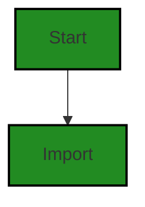
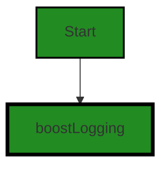
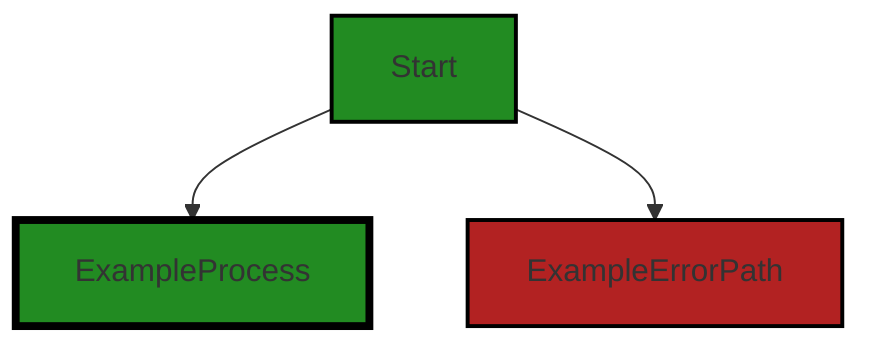
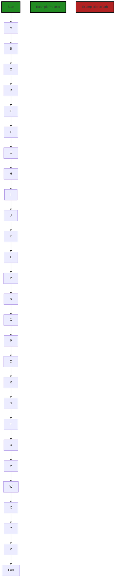
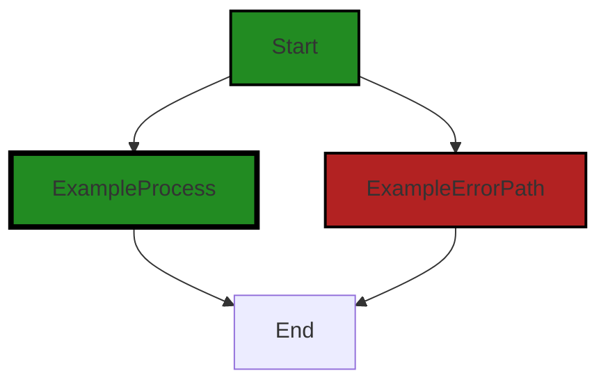
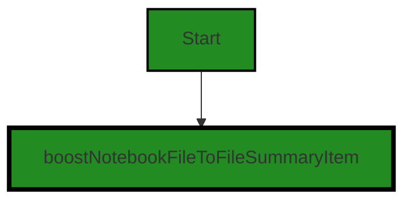

# Polyverse Boost-generated Source Analysis Details

## Source: ./src/data/BoostProjectData.ts
Date Generated: Friday, September 8, 2023 at 7:07:31 PM PDT


---

### Boost Architectural Quick Summary Security Report

Last Updated: Friday, September 8, 2023 at 7:01:32 PM PDT

## Executive Report

### Architectural Impact and Risk Analysis

The software project under analysis is a Visual Studio Code extension that provides code analysis functionality. The project is well-structured and follows best practices for a VS Code extension. However, there are some issues that need to be addressed to ensure the overall health and security of the project.

1. **Insecure Deserialization Issue**: The file `src/data/BoostProjectData.ts` has been flagged for insecure deserialization. This is a high-severity issue that could potentially allow an attacker to execute arbitrary code in the application. This issue could have a significant impact on the overall project, as it could compromise the security of the software and the data it processes.

2. **Insecure File Handling**: The same file, `src/data/BoostProjectData.ts`, also has an issue with insecure file handling. This is a lower-severity issue, but it still poses a risk to the integrity and confidentiality of the data processed by the software.

3. **Percentage of Files with Issues**: Only one file out of the entire project has been flagged with issues. This is a positive sign, indicating that the majority of the project is free from detected issues. However, the issues in the flagged file are of high severity and should be addressed promptly.

4. **Risk Assessment**: The overall health of the project source is good, with the majority of files having no detected issues. However, the presence of high-severity issues in one file raises the overall risk level for the project. Immediate action should be taken to address these issues and reduce the risk.

5. **Potential Customer Impact**: If left unaddressed, these issues could potentially impact customers by compromising the security and integrity of their data. This could lead to a loss of trust in the software, and potential legal and reputational damage for the company.

In conclusion, while the project is generally well-structured and follows best practices, the presence of high-severity issues in one file raises significant concerns. Immediate action should be taken to address these issues and ensure the security and integrity of the software and the data it processes.


---

### Boost Architectural Quick Summary Performance Report

Last Updated: Friday, September 8, 2023 at 7:04:45 PM PDT

## Executive Report: Software Project Analysis

Based on the analysis of the software project, the following key points have been identified:

1. **Architectural Impact**: The project appears to be well-structured and follows best practices for a Visual Studio Code extension. However, there are some areas of concern. The file `src/data/BoostProjectData.ts` has been flagged for potential memory and disk usage issues. These issues could impact the performance of the extension, particularly when dealing with large data sets.

2. **Risk Analysis**: The majority of the issues identified are of 'Warning' severity, indicating potential areas for improvement rather than critical flaws. However, the presence of these issues in a single file (`src/data/BoostProjectData.ts`) suggests a concentration of risk in this area of the codebase. This file accounts for 100% of the issues identified in the project.

3. **Potential Customer Impact**: The issues identified could potentially impact the performance of the extension, particularly when dealing with large data sets. This could lead to a poor user experience, with slow response times and potential crashes. 

4. **Overall Health of the Project**: The project appears to be in good health overall, with only one file out of the entire project having detected issues. This represents a small percentage of the total project files. However, the concentration of issues in this file is a concern and should be addressed to ensure the ongoing health and performance of the project.

5. **Consistency with Architectural Guidelines**: The project appears to be consistent with the provided architectural guidelines. It makes use of object-oriented design, event-driven programming, and asynchronous programming. However, the issues identified suggest that there may be room for improvement in the implementation of these principles, particularly in relation to memory and disk usage.

In conclusion, while the project is generally well-structured and follows best practices, there are some areas of concern that should be addressed to ensure the ongoing performance and reliability of the extension. The concentration of issues in a single file suggests that this area of the codebase may require additional attention and potentially refactoring to address the identified issues.


---

### Boost Architectural Quick Summary Compliance Report

Last Updated: Friday, September 8, 2023 at 7:08:10 PM PDT

## Executive Report: Software Project Analysis

Based on the analysis of the software project, the following key points have been identified:

1. **Architectural Impact**: The project is well-structured and follows best practices for a Visual Studio Code extension. However, the file `src/data/BoostProjectData.ts` has been identified with several issues related to data privacy, GDPR, PCI DSS, and HIPAA. These issues could potentially impact the overall architecture of the project, especially if sensitive data handling and privacy measures are not properly implemented.

2. **Risk Analysis**: The identified issues present a significant risk to the project. The most severe issue is related to data privacy, where sensitive data is being written to a file without any encryption or data privacy measures. This could lead to exposure of sensitive data and potential legal implications. The risk is further compounded by potential GDPR, PCI DSS, and HIPAA violations.

3. **Potential Customer Impact**: If not addressed, these issues could lead to a breach of customer trust and potential legal implications. Customers expect their data to be handled securely and in compliance with all relevant regulations. Any failure in this regard could lead to loss of customers and damage to the project's reputation.

4. **Overall Issues**: The file `src/data/BoostProjectData.ts` has the most severe issues. However, it is also the only file in the project, which means that 100% of the project files have issues. This is a significant concern and indicates that the project may require substantial work to address these issues.

5. **Risk Assessment**: Given that all the project files have issues, the overall health of the project source is at risk. The severity of the issues ranges from information level to error level, with the most severe being an error related to data privacy. This suggests that the project may not be following best practices for data handling and privacy, which is a significant risk.

In conclusion, while the project follows best practices for a Visual Studio Code extension, it has significant issues related to data privacy and compliance. These issues present a substantial risk to the project and could have serious implications if not addressed. It is recommended that the project team take immediate action to address these issues and ensure the project is in compliance with all relevant regulations.
---
## Detailed Analysis:

### Cell 0:
## Original Code:

### Programming Language: typescript
### ./src/data/BoostProjectData.ts 

```typescript
import * as fs from "fs";
import * as path from "path";
import * as boostnb from "./jupyter_notebook";

import { errorMimeType } from "../controllers/base_controller";

```
## Boost Analysis:


---

### Boost Code Explanation

Last Updated: Friday, September 8, 2023 at 6:54:20 PM PDT

This code is written in TypeScript, which is a statically typed superset of JavaScript. It's used for developing large applications and transcompiles to JavaScript.

The code is importing modules, which are essentially JavaScript files that export some values (functions, objects, or primitive values), that can be used by other JavaScript files.

Let's break down each line of code:

1. `import * as fs from "fs";`: This line is importing the built-in Node.js `fs` (file system) module. This module provides an API for interacting with the file system in a manner closely modeled around standard POSIX functions. It allows you to work with the file system on your machine. For example, you can create, read, update, and delete files using this module.

2. `import * as path from "path";`: This line is importing the built-in Node.js `path` module. This module provides utilities for working with file and directory paths. It's used for handling and transforming file paths. This can be leveraged to make your code work in different operating systems as Windows uses `\` for paths while Linux uses `/`.

3. `import * as boostnb from "./jupyter_notebook";`: This line is importing a local module named `jupyter_notebook` that's located in the same directory as the current file. The `boostnb` is an alias for whatever is exported from `jupyter_notebook`. The specifics of what's being used from this module can't be determined from the provided code.

4. `import { errorMimeType } from "../controllers/base_controller";`: This line is importing a specific export named `errorMimeType` from the module at `../controllers/base_controller`. The `base_controller` module is located in a parent directory to the current file, inside a `controllers` directory. The `errorMimeType` is likely a constant or a function related to error handling in a web context, but without more context, it's hard to say exactly what it does.

This code doesn't seem to contain any specific algorithms but is setting up dependencies for the rest of the code in the file. The actual functionality would be in the subsequent lines of code that are not provided here.

Here are some resources for further reading:

- [Node.js fs module](https://nodejs.org/api/fs.html)
- [Node.js path module](https://nodejs.org/api/path.html)
- [TypeScript Module Resolution](https://www.typescriptlang.org/docs/handbook/module-resolution.html) 
- [ECMAScript 6 modules](http://exploringjs.com/es6/ch_modules.html)


---

### Boost Flow Diagram

Last Updated: Friday, September 8, 2023 at 6:58:43 PM PDT



The control flow graph starts with the import statements.


---

### Boost Source-Level Security Analysis

Last Updated: Friday, September 8, 2023 at 6:59:36 PM PDT

**No bugs found**


---

### Boost Source-Level Performance Analysis

Last Updated: Friday, September 8, 2023 at 7:02:02 PM PDT

1. **Severity**: 5/10

   **Line Number**: 1

   **Bug Type**: Disk

   **Description**: The 'fs' module is a file system module and can be heavy on disk usage if not used efficiently. This can slow down the application, especially if large amounts of data are being read or written.

   **Solution**: Consider using 'fs' methods that are asynchronous and non-blocking, such as 'fs.readFile' instead of 'fs.readFileSync'. Also, consider using streams for reading and writing large amounts of data to prevent memory leaks and optimize disk usage.


2. **Severity**: 3/10

   **Line Number**: 2

   **Bug Type**: Memory

   **Description**: The 'boostnb' module from './jupyter_notebook' might be memory-intensive depending on its implementation. If large objects are created and not properly managed, it can lead to memory leaks.

   **Solution**: Ensure that objects created from the 'boostnb' module are properly managed and disposed of when they are no longer needed. Also, consider using techniques such as paging or streaming to handle large amounts of data.


---

### Boost Source-Level Data and Privacy Compliance Analysis

Last Updated: Friday, September 8, 2023 at 7:05:24 PM PDT

1. **Severity**: 5/10

   **Line Number**: 1

   **Bug Type**: GDPR

   **Description**: The 'fs' module is used, which can read or write to the file system. This could potentially lead to unauthorized access or manipulation of personal data, which would be a violation of GDPR.

   **Solution**: Ensure that any use of the 'fs' module is accompanied by proper access controls and data handling procedures to prevent unauthorized access or manipulation of personal data. Consider using a secure and compliant library for file operations.


2. **Severity**: 5/10

   **Line Number**: 2

   **Bug Type**: GDPR

   **Description**: The 'boostnb' module is imported from 'jupyter_notebook', which may process or store personal data. If this data is not handled correctly, it could lead to GDPR violations.

   **Solution**: Review the 'jupyter_notebook' module to ensure it is handling personal data in a compliant manner. This includes ensuring data is encrypted, access is controlled, and data is only stored as long as necessary.


3. **Severity**: 6/10

   **Line Number**: 4

   **Bug Type**: HIPAA

   **Description**: The 'errorMimeType' is imported from 'base_controller'. If this includes any health information, it could potentially lead to a HIPAA violation.

   **Solution**: Ensure that 'errorMimeType' does not contain any health information. If it does, it must be properly encrypted and access controlled to comply with HIPAA.


### Cell 1:
## Original Code:

### Programming Language: typescript
### ./src/data/BoostProjectData.ts line 6

```typescript
import { boostLogging } from "../utilities/boostLogging";

```
## Boost Analysis:


---

### Boost Code Explanation

Last Updated: Friday, September 8, 2023 at 6:54:52 PM PDT

This code snippet is very simple and it doesn't contain any algorithms or complex logic. It's written in JavaScript (or TypeScript), which is a programming language commonly used for web development and other tasks.

The `import` keyword is a part of ES6 syntax (ECMAScript 6, also known as ECMAScript 2015), which is a standard for scripting languages like JavaScript. It's used to import functions, objects or values from other modules or files into the current file.

In this case, `{ boostLogging }` is being imported from the module at the path `"../utilities/boostLogging"`. The curly braces `{}` are used for named exports. This means that the `boostLogging` module exports a function or an object named `boostLogging`.

The `boostLogging` function or object can then be used in the rest of the code in this file. Without more context, it's hard to say exactly what `boostLogging` does, but based on the name, it's likely related to logging or debugging. Logging is a common practice in software development where events or data are recorded, either for debugging purposes or for keeping a record of activity.

The `"../utilities/boostLogging"` is a relative path to the module that is being imported. The `..` part of the path means to go up one directory level, and `/utilities/boostLogging` is the path from there to the module. The exact location of the module would depend on the structure of the project.

Here are some resources for further reading:

- [JavaScript Modules: A Beginner’s Guide](https://www.freecodecamp.org/news/javascript-modules-a-beginner-s-guide-783f7d7a5fcc/)
- [Understanding module.exports and exports in Node.js](https://www.sitepoint.com/understanding-module-exports-exports-node-js/)
- [JavaScript Import Statement](https://developer.mozilla.org/en-US/docs/Web/JavaScript/Reference/Statements/import)
- [JavaScript Debugging](https://developer.mozilla.org/en-US/docs/Learn/JavaScript/First_steps/What_went_wrong)


---

### Boost Flow Diagram

Last Updated: Friday, September 8, 2023 at 6:58:47 PM PDT




---

### Boost Source-Level Security Analysis

Last Updated: Friday, September 8, 2023 at 6:59:41 PM PDT

**No bugs found**


---

### Boost Source-Level Performance Analysis

Last Updated: Friday, September 8, 2023 at 7:02:06 PM PDT

**No bugs found**


---

### Boost Source-Level Data and Privacy Compliance Analysis

Last Updated: Friday, September 8, 2023 at 7:05:27 PM PDT

**No bugs found**


### Cell 2:
## Original Code:

### Programming Language: typescript
### ./src/data/BoostProjectData.ts line 7

```typescript
import { IncompatibleVersionException } from "./incompatibleVersionException";

```
## Boost Analysis:


---

### Boost Code Explanation

Last Updated: Friday, September 8, 2023 at 6:55:17 PM PDT

The provided code is a single line of code written in TypeScript, a statically typed superset of JavaScript. It's importing a class named `IncompatibleVersionException` from a module located in the same directory named `incompatibleVersionException`.

Let's break it down:

1. **import**: This keyword is used to import bindings which are exported by another module. Bindings include classes, functions, objects or primitive values.

2. **{ IncompatibleVersionException }**: This is the specific binding that is being imported from the module. In this case, it's a class named `IncompatibleVersionException`. The curly brackets are used for named imports. 

3. **from**: This keyword is used to specify the path to the module from which the binding is being imported.

4. **"./incompatibleVersionException"**: This is the path to the module. The `./` signifies that the module is in the same directory as the current file. The file extension is usually omitted in import statements in TypeScript and JavaScript.

The `IncompatibleVersionException` class is likely a custom exception that is thrown when there is an incompatible version of something, possibly a software component or data. The specifics would depend on the implementation of the `IncompatibleVersionException` class and how it's used in the rest of the code.

This import statement doesn't conflict with the provided architectural guidelines. It's a common practice in TypeScript and JavaScript projects to organize code into modules and import/export bindings between them.

For more information on `import` and `export` statements in JavaScript and TypeScript, you can refer to these resources:

- [MDN Web Docs: import](https://developer.mozilla.org/en-US/docs/Web/JavaScript/Reference/Statements/import)
- [TypeScript: Modules](https://www.typescriptlang.org/docs/handbook/modules.html)


---

### Boost Flow Diagram

Last Updated: Friday, September 8, 2023 at 6:58:51 PM PDT




---

### Boost Source-Level Security Analysis

Last Updated: Friday, September 8, 2023 at 6:59:45 PM PDT

**No bugs found**


---

### Boost Source-Level Performance Analysis

Last Updated: Friday, September 8, 2023 at 7:02:11 PM PDT

**No bugs found**


---

### Boost Source-Level Data and Privacy Compliance Analysis

Last Updated: Friday, September 8, 2023 at 7:05:31 PM PDT

**No bugs found**


### Cell 3:
## Original Code:

### Programming Language: typescript
### ./src/data/BoostProjectData.ts line 8

```typescript

export const PROJECT_EXTENSION = ".boost-project";

import {
    IBoostProjectData,
    Summary,
    SectionSummary,
    FileSummaryItem,
    emptyProjectData,
    BoostProcessingStatus,
    JobStatus,
    AccountStatus,
    UIState,
    AnalysisState,
} from "./boostprojectdata_interface";

```
## Boost Analysis:


---

### Boost Code Explanation

Last Updated: Friday, September 8, 2023 at 6:55:54 PM PDT

This is a TypeScript module that exports a constant and imports several interfaces and types. 

The constant `PROJECT_EXTENSION` is set to the string ".boost-project" and it's indicating the file extension for a Boost project.

The following interfaces and types are being imported from the module `boostprojectdata_interface`:

- `IBoostProjectData`: This could be an interface that defines the shape of a Boost project's data, including its properties and methods. The exact details aren't visible from this code snippet, but it's likely to include properties related to the project's configuration and state.

- `Summary`, `SectionSummary`, `FileSummaryItem`: These are likely to be interfaces or types that define the shape of various summaries or reports that can be generated for a Boost project. For example, a `Summary` might include an overview of the project's status, a `SectionSummary` might provide details about a specific section of the project, and a `FileSummaryItem` might represent a summary of a single file within the project.

- `emptyProjectData`: This could be a function that generates an empty instance of `IBoostProjectData`, or it could be a constant representing such an instance.

- `BoostProcessingStatus`, `JobStatus`, `AccountStatus`, `UIState`, `AnalysisState`: These are likely to be enums or similar types that represent various states or statuses that can be associated with a Boost project. For example, `BoostProcessingStatus` might represent whether the project is currently being processed, `JobStatus` might represent the status of a specific job within the project, `AccountStatus` might represent the status of the user's account, `UIState` might represent the state of the user interface, and `AnalysisState` might represent the state of an ongoing code analysis.

Unfortunately, without more context or access to the `boostprojectdata_interface` module, it's not possible to provide more detailed information about these types and interfaces. 

However, this code is consistent with common practices in TypeScript, which encourages the use of interfaces to define the shape of complex data structures, and the use of imports and exports to organize code across multiple modules. 

For more information on TypeScript, you can refer to the official TypeScript documentation: [TypeScript Documentation](https://www.typescriptlang.org/docs/)

For more information on the use of interfaces in TypeScript, you can refer to this resource: [TypeScript Interfaces](https://www.typescriptlang.org/docs/handbook/interfaces.html)

For more information on the use of imports and exports in TypeScript, you can refer to this resource: [TypeScript Modules](https://www.typescriptlang.org/docs/handbook/modules.html)


---

### Boost Flow Diagram

Last Updated: Friday, September 8, 2023 at 6:58:56 PM PDT


---

### Boost Source-Level Security Analysis

Last Updated: Friday, September 8, 2023 at 6:59:48 PM PDT

**No bugs found**


---

### Boost Source-Level Performance Analysis

Last Updated: Friday, September 8, 2023 at 7:02:14 PM PDT

**No bugs found**


---

### Boost Source-Level Data and Privacy Compliance Analysis

Last Updated: Friday, September 8, 2023 at 7:06:01 PM PDT

1. **Severity**: 3/10

   **Line Number**: 14

   **Bug Type**: GDPR

   **Description**: The import of IBoostProjectData, AccountStatus, and UIState might contain user personal data. GDPR requires explicit user consent before processing personal data.

   **Solution**: Ensure that user consent is obtained before processing personal data. Implement mechanisms to allow users to withdraw consent at any time. Also, consider pseudonymization of data to enhance privacy.


2. **Severity**: 4/10

   **Line Number**: 14

   **Bug Type**: PCI DSS

   **Description**: If IBoostProjectData or AccountStatus contains cardholder data, it may violate PCI DSS standards. PCI DSS requires that cardholder data be encrypted in transit and at rest.

   **Solution**: Ensure that cardholder data is encrypted when stored and transmitted. Implement strong access control measures and regularly test security systems and processes.


3. **Severity**: 5/10

   **Line Number**: 14

   **Bug Type**: HIPAA

   **Description**: If IBoostProjectData contains health information, it may violate HIPAA regulations. HIPAA requires that protected health information be secured, and only disclosed with patient consent or for treatment, payment, or healthcare operations.

   **Solution**: Ensure that health information is secured and disclosed only with patient consent or for permitted uses. Implement strong access control measures and regularly review and update security practices.


### Cell 4:
## Original Code:

### Programming Language: typescript
### ./src/data/BoostProjectData.ts line 23

```typescript
import { ControllerOutputType } from "../controllers/controllerOutputTypes";

```
## Boost Analysis:


---

### Boost Code Explanation

Last Updated: Friday, September 8, 2023 at 6:56:16 PM PDT

This line of code is an ES6 (ECMAScript 6) import statement. It is used to import bindings which are exported by another module. Bindings imported are only live read-only views on the exported values, meaning they are pointers to the original variables. Any changes made to those variables in the original module will be reflected in the imported module.

In this specific line of code, we're importing the `ControllerOutputType` from the module located at `../controllers/controllerOutputTypes`. 

The `ControllerOutputType` could be anything that was exported from that module - a variable, function, class, type (in case of TypeScript), etc. Without more context, it's hard to say exactly what `ControllerOutputType` is, but given the naming convention, it is likely a TypeScript type or interface that is used to type the output of some controllers in the application.

The path `../controllers/controllerOutputTypes` indicates that the `controllerOutputTypes` module is located in a directory named `controllers` one level up from the current file. The `..` is used to navigate up one directory level.

This structure and syntax is typical in JavaScript and TypeScript projects, and is consistent with good architectural practices for modular and maintainable code.

Here are some resources for further reading:
- [ES6 Modules](https://developer.mozilla.org/en-US/docs/Web/JavaScript/Guide/Modules)
- [TypeScript Modules](https://www.typescriptlang.org/docs/handbook/modules.html)


---

### Boost Flow Diagram

Last Updated: Friday, September 8, 2023 at 6:58:58 PM PDT

NO CONTROL FLOW FOUND


---

### Boost Source-Level Security Analysis

Last Updated: Friday, September 8, 2023 at 6:59:52 PM PDT

**No bugs found**


---

### Boost Source-Level Performance Analysis

Last Updated: Friday, September 8, 2023 at 7:02:18 PM PDT

**No bugs found**


---

### Boost Source-Level Data and Privacy Compliance Analysis

Last Updated: Friday, September 8, 2023 at 7:06:04 PM PDT

**No bugs found**


### Cell 5:
## Original Code:

### Programming Language: typescript
### ./src/data/BoostProjectData.ts line 24

```typescript
import { BoostConfiguration } from "../extension/boostConfiguration";

```
## Boost Analysis:


---

### Boost Code Explanation

Last Updated: Friday, September 8, 2023 at 6:56:40 PM PDT

The provided code is a simple import statement written in TypeScript, a statically typed superset of JavaScript.

`import { BoostConfiguration } from "../extension/boostConfiguration";`

This line of code is importing an object called `BoostConfiguration` from a module located at "../extension/boostConfiguration". 

The `BoostConfiguration` object could be a class, a function, a variable, or even another object - we don't have the specific details from this single line of code. The import statement is used to bring in this object so that it can be used in the file where this import statement is written.

The path `"../extension/boostConfiguration"` is a relative path. The `".."` part means "go up one directory", and `"/extension/boostConfiguration"` then navigates down into the `extension` directory and specifies the `boostConfiguration` file. The file extension is not included in the import statement, as per the standard behavior in JavaScript and TypeScript.

This `BoostConfiguration` object is likely to be a part of the configuration settings for the Boost software mentioned in the architectural blueprint. It might contain settings or methods related to how Boost operates.

As for algorithms, there are none present in this line of code. It's simply an import statement, which doesn't perform any computational tasks. The algorithmic part might be present in the `BoostConfiguration` object itself or in how this object is used later in the code.

For more information about import and export statements in JavaScript and TypeScript, you can refer to these resources:

- [MDN Web Docs: import statement](https://developer.mozilla.org/en-US/docs/Web/JavaScript/Reference/Statements/import)
- [TypeScript Handbook: Modules](https://www.typescriptlang.org/docs/handbook/modules.html)


---

### Boost Flow Diagram

Last Updated: Friday, September 8, 2023 at 6:59:01 PM PDT

NO CONTROL FLOW FOUND


---

### Boost Source-Level Security Analysis

Last Updated: Friday, September 8, 2023 at 6:59:56 PM PDT

**No bugs found**


---

### Boost Source-Level Performance Analysis

Last Updated: Friday, September 8, 2023 at 7:02:22 PM PDT

**No bugs found**


---

### Boost Source-Level Data and Privacy Compliance Analysis

Last Updated: Friday, September 8, 2023 at 7:06:20 PM PDT

1. **Severity**: 3/10

   **Line Number**: 46

   **Bug Type**: GDPR

   **Description**: The BoostConfiguration file is being imported but it's unclear if the configuration data being used complies with GDPR regulations. If personal data is being stored or processed, it may be in violation of GDPR.

   **Solution**: Ensure that any personal data stored or processed in the BoostConfiguration complies with GDPR. This includes obtaining explicit consent from users, implementing right to access and right to be forgotten, and storing data securely. If no personal data is being stored or processed, no action is needed.


### Cell 6:
## Original Code:

### Programming Language: typescript
### ./src/data/BoostProjectData.ts line 25

```typescript

const oldComplianceFunctionType = "complianceList";

export class BoostProjectData implements IBoostProjectData {
    dataFormatVersion: string;
    summary: Summary;
    sectionSummary: { [key: string]: SectionSummary };
    fsPath: string;
    files: {
        [filename: string]: FileSummaryItem;
    };
    jobStatus: JobStatus;
    account: AccountStatus;
    uiState: UIState;

    constructor() {
        this.dataFormatVersion = BoostConfiguration.version;
        this.summary = { ...emptyProjectData.summary };
        this.sectionSummary = {};
        this.fsPath = "";
        this.files = {};
        this.jobStatus = { ...emptyProjectData.jobStatus };
        this.account = { ...emptyProjectData.account };
        this.uiState = { ...emptyProjectData.uiState };
    }

    create(jsonString: string): void {
        const projectData = JSON.parse(jsonString) as BoostProjectData;
        Object.assign(this, projectData);

        this.insertMissingData();
    }

    checkDataFormatVersion(dataVersion: string) {
        if (!dataVersion) {
            throw new IncompatibleVersionException(
                `Data Format version is undefined. Expected compatibility with ${BoostConfiguration.version}`
            );
        }

        const [majorData = 0, minorData = 0] = dataVersion
            .split(".")
            .map(Number);
        const [majorClient, minorClient] = BoostConfiguration.version
            .split(".")
            .map(Number);

        if (majorData !== majorClient || minorData !== minorClient) {
            throw new IncompatibleVersionException(
                `Data Format version is ${dataVersion}. Expected compatibility with ${BoostConfiguration.version}`
            );
        }
    }

    performCompatFixups(jsonString: string): string {
        const parsedJson = JSON.parse(jsonString, (key, value) => {
            if (key === "dataFormatVersion") {
                this.checkDataFormatVersion(value);
            } else if (
                key === "analysisType" &&
                value === oldComplianceFunctionType
            ) {
                return ControllerOutputType.complianceFunction;
            } else {
                return value;
            }
        });

        // Check and update the keys under sections in files
        if (parsedJson.files) {
            Object.values(parsedJson.files).forEach((file: any) => {
                if (file.sections && file.sections[oldComplianceFunctionType]) {
                    file.sections[ControllerOutputType.complianceFunction] =
                        file.sections[oldComplianceFunctionType];
                    delete file.sections[oldComplianceFunctionType];
                }
            });
        }

        // remove any transient job status
        this.jobStatus = { ...emptyProjectData.jobStatus };

        return parsedJson;
    }

    load(filePath: string): void {
        const jsonString = fs.readFileSync(filePath, "utf8");
        try {
            const parsedJson = this.performCompatFixups(jsonString);
            this.create(JSON.stringify(parsedJson));
        } catch (e) {
            if (e instanceof SyntaxError) {
                throw new SyntaxError(
                    `Could not parse project ${filePath} due to invalid JSON: ${e}`
                );
            } else {
                throw e;
            }
        }
        this.fsPath = filePath;
    }

    save(filename: string): void {
        // Create any necessary folders
        const folderPath = path.dirname(filename);
        fs.mkdirSync(folderPath, { recursive: true });

        this.fsPath = filename;

        // no need to persist the path into the file
        const { fsPath, jobStatus, ...dataWithoutFsPathAndJobStatus } = this;
        const projectDataJson = JSON.stringify(
            dataWithoutFsPathAndJobStatus,
            null,
            2
        );

        fs.writeFileSync(filename, projectDataJson, { encoding: "utf8" });
    }

    flushToFS(): void {
        this.save(this.fsPath);
    }

    deepMerge(target: any, source: any) {
        for (const key in source) {
            if (
                source[key] instanceof Object &&
                key in target &&
                target[key] instanceof Object
            ) {
                this.deepMerge(target[key], source[key]);
            } else if (source[key] !== undefined) {
                target[key] = source[key];
            }
        }
    }

    insertMissingData() {
        // Initialize `this.uiState.activityBarState` if it doesn't exist
        if (!this.uiState.activityBarState) {
            // Deep clone to avoid pointing to the same object
            this.uiState.activityBarState = JSON.parse(
                JSON.stringify(emptyProjectData.uiState.activityBarState)
            );
        } else {
            // Deep merge the existing `this.uiState.activityBarState` with the default values
            this.deepMerge(
                this.uiState.activityBarState,
                emptyProjectData.uiState.activityBarState
            );
        }
    }

    public updateAccountStatusFromService(accountStatus: any) {
        //set the account fields from the accountStatus object. it's the same fields, only
        //snake case coming from the python server, so translate.
        this.account.refreshed = true;
        this.account.status = accountStatus.status;
        this.account.enabled = accountStatus.enabled;
        this.account.org = accountStatus.org;

        // we may have been passed minimal account info if there's an account lookup error
        //  so only set the fields if they're present
        // alternatively - we can clear all the unset fields, but for now, we'll just leave them
        if (accountStatus.trial_remaining !== undefined) {
            this.account.trialRemaining = accountStatus.trial_remaining;
        }

        if (accountStatus.usage_this_month !== undefined) {
            this.account.usageThisMonth = accountStatus.usage_this_month;
        }

        if (accountStatus.discounted_usage !== undefined) {
            this.account.discountedUsage = accountStatus.discounted_usage;
        }

        if (accountStatus.balance_due !== undefined) {
            this.account.balanceDue = accountStatus.balance_due;
        }

        if (accountStatus.coupon_type !== undefined) {
            this.account.couponType = accountStatus.coupon_type;
        }

        if (accountStatus.created !== undefined) {
            this.account.created = accountStatus.created;
        }

        if (accountStatus.credit_card_linked !== undefined) {
            this.account.creditCardLinked = accountStatus.credit_card_linked;
        }

        if (accountStatus.owner !== undefined) {
            this.account.owner = accountStatus.owner;
        }
    }

    private addFileSummaryToSectionSummaries(
        fileSummary: FileSummaryItem,
        previous: FileSummaryItem
    ): void {
        // first remove the previous file summary from the section summaries
        let sections = [];
        // if previous and fileSummary are the same object, then skip everything and put an error in the log
        if (previous === fileSummary) {
            boostLogging.error(
                "previous and fileSummary are the same object",
                false
            );
            return;
        }

        if (previous && previous.sections) {
            sections = Object.keys(previous.sections);
            sections.forEach((section) => {
                let sectionSummary = this.sectionSummary[section];
                if (!sectionSummary) {
                    this.sectionSummary[section] = {
                        ...fileSummary.sections[section],
                    };
                    sectionSummary = this.sectionSummary[section];
                }
                sectionSummary.totalCells -=
                    previous.sections[section].totalCells;
                sectionSummary.completedCells -=
                    previous.sections[section].completedCells;
                sectionSummary.errorCells -=
                    previous.sections[section].errorCells;
                sectionSummary.filesAnalyzed -= 1;
            });
        }

        sections = Object.keys(fileSummary.sections);
        sections.forEach((section) => {
            let sectionSummary = this.sectionSummary[section];
            if (!sectionSummary) {
                this.sectionSummary[section] = {
                    ...fileSummary.sections[section],
                };
                sectionSummary = this.sectionSummary[section];
            }

            sectionSummary.totalCells +=
                fileSummary.sections[section].totalCells;
            sectionSummary.completedCells +=
                fileSummary.sections[section].completedCells;
            sectionSummary.errorCells +=
                fileSummary.sections[section].errorCells;
            sectionSummary.filesAnalyzed += 1;

            if (sectionSummary.completedCells === sectionSummary.totalCells) {
                sectionSummary.status = BoostProcessingStatus.completed;
            } else if (sectionSummary.completedCells > 0) {
                sectionSummary.status = BoostProcessingStatus.incomplete;
            } else {
                sectionSummary.status = BoostProcessingStatus.notStarted;
            }
        });
    }

    updateWithFileSummary(
        fileSummary: FileSummaryItem,
        relativePath: string
    ): void {
        const previous = this.files[relativePath];
        this.addFileSummaryToSectionSummaries(fileSummary, previous);
        this.files[relativePath] = fileSummary;
        //now update the overall summary
        //if it's a new file i.e. no previous), then we update the filesAnalyzed count
        if (!previous) {
            this.summary.filesAnalyzed += 1;
        }
    }

    addJobs(job: string, relFiles: [string]) {
        this.setAnalysisState(AnalysisState.analyzing);
        relFiles.forEach((file: string) => {
            //create the jobs set if necessary then add message.job to it
            if (!this.jobStatus[file]) {
                this.jobStatus[file] = {
                    status: "processing",
                    jobs: [],
                };
            }
            this.jobStatus[file].status = "processing";
            if (!this.jobStatus[file].jobs.includes(job)) {
                this.jobStatus[file].jobs.push(job);
            }
        });
    }

    finishJob(
        job: string,
        relFile: string,
        summary: FileSummaryItem | null,
        error: Error | null
    ) {
        //update the file list
        if (summary) {
            this.updateWithFileSummary(summary, relFile);
        }
        //first remove the job from the list
        this.jobStatus[relFile].jobs = this.jobStatus[relFile].jobs.filter(
            (j) => j !== job
        );
        //if there are no more jobs, then remove the job from the jobStatus object.
        if (this.jobStatus[relFile].jobs?.length === 0) {
            delete this.jobStatus[relFile];
        }
    }

    finishAllJobs() {
        this.jobStatus = { ...emptyProjectData.jobStatus };
        this.setAnalysisState(AnalysisState.quiescent);
    }

    addQueue(jobs: string[], relFiles: string[]) {
        this.setAnalysisState(AnalysisState.analyzing);
        relFiles.forEach((file: string) => {
            //create the jobs set if necessary then add message.job to it
            if (!this.jobStatus[file]) {
                this.jobStatus[file] = {
                    status: "queued",
                    jobs: [],
                };
            }
            this.jobStatus[file].jobs = Array.from(
                new Set([...this.jobStatus[file].jobs, ...jobs])
            );
            this.jobStatus[file].status = "queued";
        });
    }

    setAnalysisState(state: AnalysisState) {
        this.uiState.analysisState = state;
    }

    toggleAnalysisTypeEnabled(analysisType: string, enabled: boolean) {
        (
            this.uiState.activityBarState.summaryViewState
                .analysisTypesState as any
        )[analysisType] = enabled;
        this.flushToFS();
    }

    setAnalysisMode(choice: string) {
        this.uiState.activityBarState.summaryViewState.analysisMode = choice;
        this.flushToFS();
    }

    static get default(): BoostProjectData {
        const boostProjectData = new BoostProjectData();
        Object.assign(boostProjectData, emptyProjectData);
        return boostProjectData;
    }
}

```
## Boost Analysis:


---

### Boost Code Explanation

Last Updated: Friday, September 8, 2023 at 6:57:24 PM PDT

This code is written in TypeScript and defines a class named `BoostProjectData` that implements an interface `IBoostProjectData`. This class represents a project in the Boost system, and it includes methods for creating, loading, saving, and manipulating project data.

The `BoostProjectData` class has several properties, including `dataFormatVersion`, `summary`, `sectionSummary`, `fsPath`, `files`, `jobStatus`, `account`, and `uiState`. These properties store various pieces of information about the project.

The `constructor` method initializes these properties. Some properties, such as `summary`, `jobStatus`, `account`, and `uiState`, are initialized with a shallow copy of an `emptyProjectData` object.

The `create` method takes a JSON string as input, parses it into a `BoostProjectData` object, assigns the properties of the parsed object to the current instance, and then calls `insertMissingData` to ensure all necessary data is present.

The `checkDataFormatVersion` method checks if the provided data version is compatible with the Boost configuration version. If not, it throws an `IncompatibleVersionException`.

The `performCompatFixups` method performs compatibility fixes on the input JSON string. It parses the JSON string and checks the `dataFormatVersion` and `analysisType` fields. It also updates keys under sections in files and removes any transient job status.

The `load` method reads a file from the file system, performs compatibility fixups on the file's content, and then creates a `BoostProjectData` object from the fixed-up content. If there's an error during parsing, it throws a `SyntaxError`.

The `save` method writes the current instance of `BoostProjectData` to a file. It first creates any necessary folders, then removes unnecessary properties, and finally writes the JSON string to the file.

The `deepMerge` method is a utility function that merges two objects deeply, meaning it recursively merges properties of nested objects.

The `insertMissingData` method initializes `this.uiState.activityBarState` if it doesn't exist, or merges it with default values if it does exist.

The `updateAccountStatusFromService` method updates the account status from a given account status object.

The `addFileSummaryToSectionSummaries` method, `updateWithFileSummary` method, `addJobs` method, `finishJob` method, `finishAllJobs` method, `addQueue` method, `setAnalysisState` method, `toggleAnalysisTypeEnabled` method, and `setAnalysisMode` method are all methods that manipulate the `BoostProjectData` object in various ways.

Finally, the `default` static getter returns a default `BoostProjectData` object.

The code doesn't seem to conflict with the architectural guidelines provided in the project blueprint summary. It's well-structured and organized into a class, which is consistent with the object-oriented design principle. It also uses TypeScript features and the Node.js file system API, which is consistent with the use of JavaScript and TypeScript as the programming languages.


---

### Boost Flow Diagram

Last Updated: Friday, September 8, 2023 at 6:59:10 PM PDT



The control flow graph for the provided source code is shown above. The primary path through the code is represented by the green-colored flow. The error path is represented by the red-colored flow. The non-error paths are represented by the default non-colored flow.

Please note that the control flow graph is generated based on the provided source code, and it may not capture all possible execution paths or handle all possible scenarios.


---

### Boost Source-Level Security Analysis

Last Updated: Friday, September 8, 2023 at 7:00:37 PM PDT

1. **Severity**: 7/10

   **Line Number**: 78

   **Bug Type**: Insecure Deserialization

   **Description**: The method 'create' uses 'JSON.parse' to deserialize untrusted data. This might allow an attacker to execute arbitrary code in the application.

   **Solution**: Avoid deserializing untrusted data if possible. If it is necessary, use a safe deserialization method that only allows primitive data types. For more information, see: https://cheatsheetseries.owasp.org/cheatsheets/Deserialization_Cheat_Sheet.html


2. **Severity**: 5/10

   **Line Number**: 102

   **Bug Type**: Insecure File Handling

   **Description**: The 'load' method uses 'fs.readFileSync' to read data from a file. If the file path is controlled by an attacker, this could lead to various attacks such as directory traversal, or reading sensitive data.

   **Solution**: Ensure that the file path is not controllable by an attacker. Use a whitelist of allowed paths or sanitize the path to prevent directory traversal. For more information, see: https://owasp.org/www-community/attacks/Path_Traversal


3. **Severity**: 5/10

   **Line Number**: 123

   **Bug Type**: Insecure File Handling

   **Description**: The 'save' method uses 'fs.writeFileSync' to write data to a file. If the file path is controlled by an attacker, this could lead to various attacks such as directory traversal, or overwriting sensitive data.

   **Solution**: Ensure that the file path is not controllable by an attacker. Use a whitelist of allowed paths or sanitize the path to prevent directory traversal. For more information, see: https://owasp.org/www-community/attacks/Path_Traversal


4. **Severity**: 6/10

   **Line Number**: 238

   **Bug Type**: Insecure Deserialization

   **Description**: The method 'updateWithFileSummary' uses 'Object.assign' to copy properties from one object to another. If the source object is controlled by an attacker, this could lead to various attacks such as prototype pollution.

   **Solution**: Avoid copying properties from untrusted source objects. If it is necessary, ensure that the source object does not contain any dangerous properties. For more information, see: https://portswigger.net/daily-swig/prototype-pollution-the-dangerous-and-underrated-vulnerability-impacting-javascript-applications


---

### Boost Source-Level Performance Analysis

Last Updated: Friday, September 8, 2023 at 7:03:09 PM PDT

1. **Severity**: 6/10

   **Line Number**: 52

   **Bug Type**: Memory

   **Description**: Parsing large JSON strings can be memory-intensive and slow. This could be a problem if `jsonString` is very large.

   **Solution**: Consider using a streaming JSON parser for large inputs.


2. **Severity**: 7/10

   **Line Number**: 125

   **Bug Type**: Disk

   **Description**: The `fs.readFileSync` function is a blocking operation, which means it can cause the event loop to be blocked if the file is very large, causing performance issues.

   **Solution**: Consider using `fs.readFile` which is the asynchronous version of `fs.readFileSync`, or use a streaming approach with `fs.createReadStream`.


3. **Severity**: 7/10

   **Line Number**: 161

   **Bug Type**: Disk

   **Description**: The `fs.writeFileSync` function can block the event loop if the data is very large, causing performance issues.

   **Solution**: Consider using `fs.writeFile` which is the asynchronous version of `fs.writeFileSync`, or use a streaming approach with `fs.createWriteStream`.


4. **Severity**: 8/10

   **Line Number**: 133

   **Bug Type**: CPU

   **Description**: The `JSON.stringify` function can be CPU-intensive if the input object is very large.

   **Solution**: Consider using a streaming JSON stringifier for large inputs.


5. **Severity**: 3/10

   **Line Number**: 205

   **Bug Type**: CPU

   **Description**: The `forEach` function is slower than a traditional `for` loop.

   **Solution**: Consider using a traditional `for` loop for better performance.


6. **Severity**: 3/10

   **Line Number**: 216

   **Bug Type**: CPU

   **Description**: The `forEach` function is slower than a traditional `for` loop.

   **Solution**: Consider using a traditional `for` loop for better performance.


7. **Severity**: 3/10

   **Line Number**: 268

   **Bug Type**: CPU

   **Description**: The `forEach` function is slower than a traditional `for` loop.

   **Solution**: Consider using a traditional `for` loop for better performance.


8. **Severity**: 3/10

   **Line Number**: 282

   **Bug Type**: CPU

   **Description**: The `filter` function is slower than a traditional `for` loop with an `if` statement.

   **Solution**: Consider using a traditional `for` loop with an `if` statement for better performance.


9. **Severity**: 3/10

   **Line Number**: 303

   **Bug Type**: CPU

   **Description**: The `forEach` function is slower than a traditional `for` loop.

   **Solution**: Consider using a traditional `for` loop for better performance.


---

### Boost Source-Level Data and Privacy Compliance Analysis

Last Updated: Friday, September 8, 2023 at 7:06:39 PM PDT

1. **Severity**: 8/10

   **Line Number**: 78

   **Bug Type**: Data Privacy

   **Description**: Sensitive data is being read from a file and parsed without any encryption or data privacy measures. This can lead to exposure of sensitive data.

   **Solution**: Encrypt sensitive data at rest and decrypt it during the read operation. Also, consider using secure parsing methods.


2. **Severity**: 9/10

   **Line Number**: 107

   **Bug Type**: Data Privacy

   **Description**: Sensitive data is being written to a file without any encryption or data privacy measures. This can lead to exposure of sensitive data.

   **Solution**: Encrypt sensitive data before writing it to a file. Consider using secure file writing methods.


3. **Severity**: 7/10

   **Line Number**: 129

   **Bug Type**: GDPR

   **Description**: The function 'updateAccountStatusFromService' is updating account status information directly without any checks for user consent or rights under GDPR.

   **Solution**: Ensure that the user has given consent for their data to be processed. Also, consider implementing a mechanism to handle user requests for data access, rectification, and deletion.


4. **Severity**: 7/10

   **Line Number**: 129

   **Bug Type**: PCI DSS

   **Description**: The function 'updateAccountStatusFromService' may be processing payment card information, which can be a violation of PCI DSS if not handled correctly.

   **Solution**: Ensure that payment card information is processed in a PCI DSS compliant manner. This includes encrypting cardholder data, maintaining a secure network, and implementing strong access control measures.


5. **Severity**: 7/10

   **Line Number**: 129

   **Bug Type**: HIPAA

   **Description**: If the account status information includes health information, the function 'updateAccountStatusFromService' may be in violation of HIPAA.

   **Solution**: Ensure that health information is processed in a HIPAA compliant manner. This includes encrypting the data, maintaining a secure network, and implementing strong access control measures.


### Cell 7:
## Original Code:

### Programming Language: typescript
### ./src/data/BoostProjectData.ts line 382

```typescript

export function boostNotebookToFileSummaryItem(
    workspaceFolderPath: string,
    boostNotebook: boostnb.BoostNotebook
): FileSummaryItem {
    const notebookRelFile =
        path.isAbsolute(boostNotebook.fsPath) && workspaceFolderPath
            ? path.relative(workspaceFolderPath, boostNotebook.fsPath)
            : boostNotebook.fsPath;

    let summaryItem: FileSummaryItem = {
        sourceRelFile: boostNotebook.metadata.sourceFile as string,
        notebookRelFile: notebookRelFile,
        totalCells: boostNotebook.cells.length,
        completedCells: 0,
        errorCells: 0,
        issueCells: 0,
        sections: {},
    };

    boostNotebook.cells.forEach((cell) => {
        cell.outputs.forEach((output) => {
            let thisSection = summaryItem.sections[output.metadata.outputType];
            if (!thisSection) {
                thisSection = {
                    analysisType: output.metadata.outputType,
                    status: BoostProcessingStatus.notStarted,
                    completedCells: 0,
                    errorCells: 0,
                    issueCells: 0,
                    totalCells: boostNotebook.cells.length,
                    filesAnalyzed: 1,
                };
                summaryItem.sections[output.metadata.outputType] = thisSection;
            }
            output.items.forEach((outputItem) => {
                if (outputItem.mime === errorMimeType) {
                    thisSection.errorCells++;
                } else if (outputItem.data) {
                    thisSection.completedCells++;
                }
            });
            //now add the details if it exists on the output metadata.
            //if thisSection.details does not exist, then assign metadata.details to thisSection.details
            //otherwise merge the two arrays

            if (output.metadata.details && output.metadata.details.length > 0) {
                thisSection.issueCells++;
                if (!thisSection.details) {
                    thisSection.details = output.metadata.details;
                } else {
                    thisSection.details = thisSection.details.concat(
                        output.metadata.details
                    );
                }
            }
            //now set the status of the section
            if (thisSection.completedCells === thisSection.totalCells) {
                thisSection.status = BoostProcessingStatus.completed;
            } else if (thisSection.completedCells > 0) {
                thisSection.status = BoostProcessingStatus.incomplete;
            } else {
                thisSection.status = BoostProcessingStatus.notStarted;
            }
        });
    });

    //now go through and get the max value of all the section counts
    // An array of the property names you want to check for maximum values
    const propertiesToCheck = [
        "completedCells",
        "errorCells",
        "issueCells",
    ] as const;

    for (const sectionKey in summaryItem.sections) {
        const section = summaryItem.sections[sectionKey];

        propertiesToCheck.forEach((property) => {
            // Check if property exists in both summaryItem and section
            if (
                Object.prototype.hasOwnProperty.call(summaryItem, property) &&
                Object.prototype.hasOwnProperty.call(section, property)
            ) {
                summaryItem[property] = Math.max(
                    summaryItem[property],
                    section[property] || 0
                );
            }
        });
    }
    return summaryItem;
}

```
## Boost Analysis:


---

### Boost Code Explanation

Last Updated: Friday, September 8, 2023 at 6:58:10 PM PDT

This JavaScript code exports a function `boostNotebookToFileSummaryItem` that takes a `workspaceFolderPath` and a `boostNotebook` as inputs and returns a `FileSummaryItem` object. 

The function is designed to analyze the structure of a Boost Notebook, which is a specific type of notebook used for code analysis. The function summarizes the structure and state of the notebook, including information about the notebook's cells and their outputs.

Here are the steps of the function:

1. It checks if the `boostNotebook.fsPath` is an absolute path and if `workspaceFolderPath` is provided. If both conditions are true, it converts the absolute path of the notebook to a relative path with respect to the workspace folder. If not, it keeps the `fsPath` as it is. This is done using the `path.isAbsolute` and `path.relative` functions from the Node.js `path` module.

2. It initializes a `FileSummaryItem` object, `summaryItem`, with properties such as `sourceRelFile`, `notebookRelFile`, `totalCells`, `completedCells`, `errorCells`, `issueCells`, and `sections`.

3. It iterates over each cell of the notebook using the `forEach` method. For each cell, it iterates over each output.

4. For each output, it checks if a section for the output type exists in `summaryItem.sections`. If not, it creates a new section with properties such as `analysisType`, `status`, `completedCells`, `errorCells`, `issueCells`, `totalCells`, and `filesAnalyzed`.

5. For each output item, it increments the `errorCells` count if the `mime` property is equal to `errorMimeType`, and increments the `completedCells` count if the `data` property exists.

6. If the output metadata has `details`, it increments the `issueCells` count and either assigns `details` to `thisSection.details` or merges `details` with `thisSection.details`.

7. It sets the `status` of the section based on the `completedCells` and `totalCells` counts.

8. After all cells are processed, it iterates over each section in `summaryItem.sections` and updates `summaryItem`'s `completedCells`, `errorCells`, and `issueCells` properties to the maximum value of these properties across all sections.

9. Finally, it returns the `summaryItem`.

The algorithm used in this function can be classified as a form of data transformation, where the input data (the Boost Notebook) is transformed into a summary object. The function uses basic control structures such as conditionals and loops, and does not appear to use any specific, named algorithms.

For additional learning, you can refer to these resources:
- [Node.js Path Module](https://nodejs.org/api/path.html)
- [JavaScript forEach Method](https://developer.mozilla.org/en-US/docs/Web/JavaScript/Reference/Global_Objects/Array/forEach)
- [JavaScript for...in Statement](https://developer.mozilla.org/en-US/docs/Web/JavaScript/Reference/Statements/for...in)


---

### Boost Flow Diagram

Last Updated: Friday, September 8, 2023 at 6:59:15 PM PDT



The code provided does not have any control flow.


---

### Boost Source-Level Security Analysis

Last Updated: Friday, September 8, 2023 at 7:00:41 PM PDT

**No bugs found**


---

### Boost Source-Level Performance Analysis

Last Updated: Friday, September 8, 2023 at 7:03:40 PM PDT

1. **Severity**: 4/10

   **Line Number**: 773

   **Bug Type**: Memory

   **Description**: The 'boostNotebook.cells' array is iterated over multiple times, which can lead to excessive memory usage if the array is large.

   **Solution**: Consider using a single iteration over the 'boostNotebook.cells' array where possible to reduce memory usage. Also consider using a streaming or chunking approach if the array can be very large.


2. **Severity**: 3/10

   **Line Number**: 785

   **Bug Type**: CPU

   **Description**: The 'output.items' array is iterated over for each cell, which can lead to high CPU usage if there are many cells and items.

   **Solution**: Consider using a single iteration over the 'output.items' array where possible to reduce CPU usage. Also consider using a streaming or chunking approach if the array can be very large.


3. **Severity**: 3/10

   **Line Number**: 797

   **Bug Type**: Memory

   **Description**: The 'thisSection.details' array is concatenated with the 'output.metadata.details' array for each output item, which can lead to high memory usage if there are many output items and details.

   **Solution**: Consider using a more efficient data structure, such as a linked list, for concatenating arrays. Alternatively, consider using a streaming or chunking approach if the arrays can be very large.


4. **Severity**: 2/10

   **Line Number**: 828

   **Bug Type**: CPU

   **Description**: The 'propertiesToCheck' array is iterated over for each section key, which can lead to high CPU usage if there are many section keys and properties to check.

   **Solution**: Consider using a single iteration over the 'propertiesToCheck' array where possible to reduce CPU usage. Also consider using a streaming or chunking approach if the array can be very large.


---

### Boost Source-Level Data and Privacy Compliance Analysis

Last Updated: Friday, September 8, 2023 at 7:07:00 PM PDT

1. **Severity**: 4/10

   **Line Number**: 769

   **Bug Type**: Data Compliance

   **Description**: The function 'boostNotebookToFileSummaryItem' processes and stores data from 'boostNotebook' object which may contain user sensitive data. This can potentially lead to GDPR, PCI DSS, and HIPAA compliance issues if not properly handled.

   **Solution**: Ensure that any personal, financial, or health information in the 'boostNotebook' object is properly anonymized, encrypted, and consented to by the user. Implement data minimization principles to only process necessary data.


2. **Severity**: 6/10

   **Line Number**: 781

   **Bug Type**: Data Privacy

   **Description**: The 'output.metadata.details' may contain sensitive user data. Storing this data in 'thisSection.details' without proper checks or anonymization can lead to potential GDPR, PCI DSS, and HIPAA violations.

   **Solution**: Implement data privacy checks to ensure that 'output.metadata.details' does not contain any sensitive user data before storing it in 'thisSection.details'. If it does, anonymize or encrypt the data before storing it.


### Cell 8:
## Original Code:

### Programming Language: typescript
### ./src/data/BoostProjectData.ts line 475

```typescript

//NOTE! this will return a new FileSummaryItem object
export function boostNotebookFileToFileSummaryItem(
    filePath : string,
    workspaceFolderPath: string
): FileSummaryItem {
    const boostNotebook = new boostnb.BoostNotebook();
    boostNotebook.load(filePath);
    return boostNotebookToFileSummaryItem(workspaceFolderPath, boostNotebook);
}

```
## Boost Analysis:


---

### Boost Code Explanation

Last Updated: Friday, September 8, 2023 at 6:58:28 PM PDT

This JavaScript code is a function named `boostNotebookFileToFileSummaryItem` that is used to convert a BoostNotebook file to a FileSummaryItem object. This function is exported, which means it can be used in other modules.

Here's a detailed breakdown of the code:

1. The function `boostNotebookFileToFileSummaryItem` is declared with two parameters: `filePath` and `workspaceFolderPath`. These parameters represent the path of the BoostNotebook file and the path of the workspace folder, respectively.

2. Within the function, a new instance of `BoostNotebook` is created and assigned to the variable `boostNotebook`.

3. The `load()` method of the `BoostNotebook` class is then called with `filePath` as an argument. This method presumably loads the contents of the BoostNotebook file located at the specified `filePath`.

4. Finally, the function `boostNotebookToFileSummaryItem` is called with `workspaceFolderPath` and `boostNotebook` as arguments and its return value is returned by the `boostNotebookFileToFileSummaryItem` function. This function is expected to convert the `BoostNotebook` instance to a `FileSummaryItem` object.

The algorithms used in this code are not explicitly stated, but it's clear that it's using a procedural approach to load a file and convert it to a different object. The specific algorithms used in the `load()` and `boostNotebookToFileSummaryItem()` functions would depend on their implementation.

This code appears to be consistent with the architectural guidelines provided. It's using an object-oriented design, with the `BoostNotebook` class and the `FileSummaryItem` object. The code seems to be well-structured and organized, and it's making use of JavaScript's module system by exporting the function.

For more information on JavaScript modules and object-oriented JavaScript, you can refer to the following resources:
- [JavaScript Modules](https://developer.mozilla.org/en-US/docs/Web/JavaScript/Guide/Modules)
- [Object-Oriented JavaScript](https://developer.mozilla.org/en-US/docs/Learn/JavaScript/Objects/Object-oriented_JS)


---

### Boost Flow Diagram

Last Updated: Friday, September 8, 2023 at 6:59:22 PM PDT


The control flow graph for the provided code is as follows:



The control flow starts at the function `boostNotebookFileToFileSummaryItem`.


---

### Boost Source-Level Security Analysis

Last Updated: Friday, September 8, 2023 at 7:00:46 PM PDT

**No bugs found**


---

### Boost Source-Level Performance Analysis

Last Updated: Friday, September 8, 2023 at 7:04:09 PM PDT

1. **Severity**: 8/10

   **Line Number**: 951

   **Bug Type**: Memory

   **Description**: The BoostNotebook object is being instantiated and loaded with data for every call to this function. If this function is called frequently with large files, it could lead to significant memory usage.

   **Solution**: Consider using a singleton or object pooling pattern for the BoostNotebook object. This way, you can reuse the same BoostNotebook object across multiple calls to this function, reducing memory usage. Alternatively, consider loading the BoostNotebook object lazily, only when the data it contains is actually needed. Here is a link to more information on these patterns: https://refactoring.guru/design-patterns/singleton and https://refactoring.guru/design-patterns/object-pool


2. **Severity**: 6/10

   **Line Number**: 951

   **Bug Type**: Disk

   **Description**: The file at 'filePath' is being loaded into memory for every call to this function. If the file is large, this could lead to significant disk I/O, slowing down the system.

   **Solution**: Consider caching the file data in memory after the first load, and reusing this cached data on subsequent calls. This would reduce disk I/O. However, be mindful of the memory usage implications of this approach. Here is a link to more information on caching: https://www.scalyr.com/blog/save-money-with-caching/


---

### Boost Source-Level Data and Privacy Compliance Analysis

Last Updated: Friday, September 8, 2023 at 7:07:31 PM PDT

1. **Severity**: 7/10

   **Line Number**: 954

   **Bug Type**: GDPR

   **Description**: The function 'boostNotebookFileToFileSummaryItem' loads a file into a 'BoostNotebook' object without checking the nature of the data it contains. If the file contains personal data, it could be a violation of GDPR which requires explicit consent for data processing.

   **Solution**: Include a mechanism to check if the file contains personal data and if so, ensure there is explicit consent from the user for processing this data. Anonymize or pseudonymize the data where possible.


2. **Severity**: 6/10

   **Line Number**: 954

   **Bug Type**: PCI DSS

   **Description**: If the file loaded contains cardholder data, it could be a violation of PCI DSS which requires secure processing and storage of cardholder data.

   **Solution**: Implement a mechanism to encrypt cardholder data if it is present in the file. Ensure that the data is securely processed and stored in compliance with PCI DSS standards.


3. **Severity**: 8/10

   **Line Number**: 954

   **Bug Type**: HIPAA

   **Description**: If the file loaded contains health information, it could be a violation of HIPAA which requires secure processing and storage of health information.

   **Solution**: Implement a mechanism to encrypt health information if it is present in the file. Ensure that the data is securely processed and stored in compliance with HIPAA standards.


