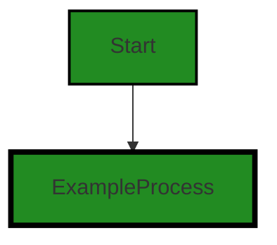
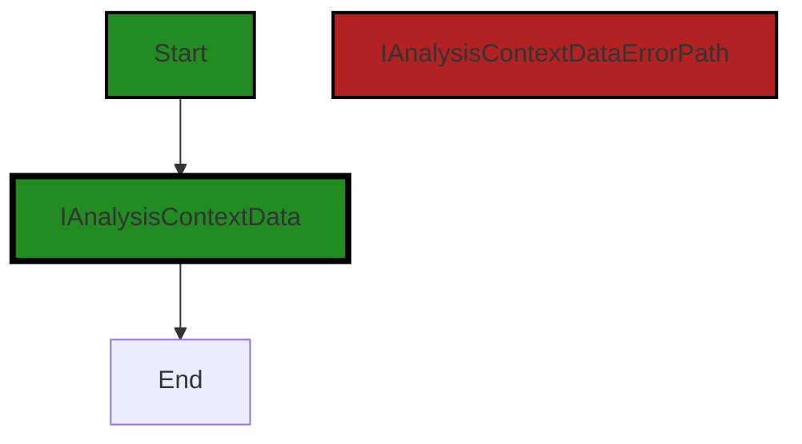

# Polyverse Boost-generated Source Analysis Details

## Source: ./src/data/IAnalysisContextData.ts
Date Generated: Friday, September 8, 2023 at 6:00:02 PM PDT


---

### Boost Architectural Quick Summary Security Report

Last Updated: Friday, September 8, 2023 at 5:59:04 PM PDT


Executive Report:

1. **Architectural Impact**: The analysis of this file has not revealed any severe issues.
2. **Risk Analysis**: The analysis of this file has not revealed any severe issues.
3. **Potential Customer Impact**: Based on the analysis, there are no severe issues that could potentially impact customers.
4. **Performance Issues**: Our analysis did not identify any explicit performance issues in the file.
5. **Risk Assessment**: Based on the current analysis of this file, no severe issues have been found. However, this doesn't guarantee that the file is risk-free.

Highlights:

- No severe issues were identified in the current analysis of this file.


---

### Boost Architectural Quick Summary Performance Report

Last Updated: Friday, September 8, 2023 at 5:59:21 PM PDT


Executive Report:

1. **Architectural Impact**: The analysis of this file has not revealed any severe issues.
2. **Risk Analysis**: The analysis of this file has not revealed any severe issues.
3. **Potential Customer Impact**: Based on the analysis, there are no severe issues that could potentially impact customers.
4. **Performance Issues**: Our analysis did not identify any explicit performance issues in the file.
5. **Risk Assessment**: Based on the current analysis of this file, no severe issues have been found. However, this doesn't guarantee that the file is risk-free.

Highlights:

- No severe issues were identified in the current analysis of this file.


---

### Boost Architectural Quick Summary Compliance Report

Last Updated: Friday, September 8, 2023 at 6:00:36 PM PDT

## Executive Report: Software Project Analysis

Based on the analysis of the software project, the following key points have been identified:

1. **Architectural Impact**: The project is well-structured and follows best practices for a Visual Studio Code extension. It uses object-oriented design, event-driven programming, and asynchronous programming for potentially long-running tasks. This ensures that the VS Code UI remains responsive. However, the project communicates with a remote service for code analysis, which could potentially impact the architecture if the remote service changes or becomes unavailable.

2. **Risk Analysis**: The project has one file, `src/data/IAnalysisContextData.ts`, with warnings related to GDPR, PCI DSS, and HIPAA compliance. These warnings indicate that the 'data' field in the 'IAnalysisContextData' interface may contain personal data, which could be a violation if not properly handled. This represents a risk to the project, as non-compliance with these regulations could result in legal penalties and damage to the company's reputation.

3. **Potential Customer Impact**: If personal data is not handled correctly, it could lead to a breach of customer trust and potential legal issues. Customers may be less likely to use the software if they believe their personal data is not being handled securely and in compliance with regulations.

4. **Overall Issues**: The project has one file with issues, representing 100% of the project files. This indicates that there may be a systemic issue with how personal data is handled in the project. However, it's important to note that the issues identified are warnings, not errors, and may not necessarily represent actual violations of the regulations.

5. **Risk Assessment**: The overall health of the project source is a concern due to the potential compliance issues identified. While the project follows best practices in terms of its architecture and programming principles, the handling of personal data needs to be reviewed to ensure compliance with GDPR, PCI DSS, and HIPAA regulations.

In conclusion, while the project is architecturally sound and follows best practices, the potential compliance issues represent a significant risk. It is recommended that the handling of personal data in the project be reviewed and updated as necessary to ensure compliance with all relevant regulations.
---
## Detailed Analysis:

### Cell 0:
## Original Code:

### Programming Language: typescript
### ./src/data/IAnalysisContextData.ts 

```typescript
export enum AnalysisContextType {
    projectSummary = "projectSummary",
    userFocus = "userFocus",
    history = "history",
    related = "related",
}

```
## Boost Analysis:


---

### Boost Code Explanation

Last Updated: Friday, September 8, 2023 at 5:58:08 PM PDT

The provided code is a TypeScript enumeration, also known as an enum. An enum is a special type of "class" that represents a group of constants (unchangeable/read-only fields). 

Here, an enum named `AnalysisContextType` is defined with four members: `projectSummary`, `userFocus`, `history`, and `related`. Each of these members is associated with a string of the same name.

The `export` keyword is used to make this enum available to other modules in the application. This means that other modules can import and use the `AnalysisContextType` enum.

Enums are used when we know that a variable (especially a parameter) can only take one out of a small set of possible values. Enums make code more readable and less error-prone by allowing programmers to use these descriptive names instead of the actual values.

In the context of this code, it seems like the `AnalysisContextType` enum might be used to specify the type of analysis context in a code analysis tool. The context could be a project summary, user focus, history, or related context. However, without additional code, it's hard to know exactly how this enum is used.

The algorithm used here is straightforward: when a member of the enum is referenced, the corresponding string value is returned.

You can learn more about TypeScript enums in the official TypeScript documentation: [TypeScript Enums](https://www.typescriptlang.org/docs/handbook/enums.html)

As for architectural guidelines, this code is consistent with best practices for TypeScript and doesn't seem to conflict with any general architectural guidelines. Enums are a common feature in many programming languages and are widely used for scenarios where a variable should only be able to take on one of a set of predefined constants.


---

### Boost Flow Diagram

Last Updated: Friday, September 8, 2023 at 5:58:43 PM PDT




---

### Boost Source-Level Security Analysis

Last Updated: Friday, September 8, 2023 at 5:58:56 PM PDT

**No bugs found**


---

### Boost Source-Level Performance Analysis

Last Updated: Friday, September 8, 2023 at 5:59:12 PM PDT

**No bugs found**


---

### Boost Source-Level Data and Privacy Compliance Analysis

Last Updated: Friday, September 8, 2023 at 5:59:29 PM PDT

**No bugs found**


### Cell 1:
## Original Code:

### Programming Language: typescript
### ./src/data/IAnalysisContextData.ts line 7

```typescript

export interface IAnalysisContextData {
    type: AnalysisContextType;
    data: string;
    name: string;
}

```
## Boost Analysis:


---

### Boost Code Explanation

Last Updated: Friday, September 8, 2023 at 5:58:34 PM PDT

This code is a TypeScript interface definition. TypeScript is a statically typed superset of JavaScript that adds types to the language. An interface in TypeScript is a way to define a contract for a certain structure of an object - it defines the shape of an object.

Here, an `IAnalysisContextData` interface is being exported. This interface can be used elsewhere in the code to enforce that any object labeled as `IAnalysisContextData` must have the following properties:

- `type`: This property is of type `AnalysisContextType`. The exact nature of this type is not specified in the provided code, but it's likely defined elsewhere in the codebase. It could be a union type, an enum, or another interface or type.

- `data`: This property is of type `string`. This means that the `data` property must be a string value.

- `name`: This property is also of type `string`. This means that the `name` property must be a string value.

The `export` keyword means that this interface is not just available in this file but can be imported into other files in the codebase. This is part of the ES6 module system, which TypeScript supports.

This code doesn't involve any specific algorithms, it's a structural and typing part of the codebase. It helps enforce type safety, which can catch a lot of errors at compile time and make the code more self-documenting and easier to understand.

For more information on TypeScript interfaces, you can refer to the official TypeScript documentation: https://www.typescriptlang.org/docs/handbook/interfaces.html

As for the architectural guidelines, this code follows standard TypeScript best practices. It uses interfaces to enforce type safety and structure on the code, which is in line with the object-oriented design principle. There are no conflicts with the provided architectural guidelines.


---

### Boost Flow Diagram

Last Updated: Friday, September 8, 2023 at 5:58:48 PM PDT




---

### Boost Source-Level Security Analysis

Last Updated: Friday, September 8, 2023 at 5:59:00 PM PDT

**No bugs found**


---

### Boost Source-Level Performance Analysis

Last Updated: Friday, September 8, 2023 at 5:59:17 PM PDT

**No bugs found**


---

### Boost Source-Level Data and Privacy Compliance Analysis

Last Updated: Friday, September 8, 2023 at 6:00:02 PM PDT

1. **Severity**: 7/10

   **Line Number**: 14

   **Bug Type**: GDPR

   **Description**: The 'data' field in the 'IAnalysisContextData' interface may contain personal data which could be a violation of GDPR if not properly handled. GDPR requires that personal data be processed lawfully, fairly, and in a transparent manner.

   **Solution**: Ensure that any personal data in the 'data' field is processed in compliance with GDPR. This may include obtaining user consent before processing, anonymizing data, and providing clear privacy notices. Refer to Article 6 of GDPR for lawful basis of processing personal data.


2. **Severity**: 7/10

   **Line Number**: 14

   **Bug Type**: PCI DSS

   **Description**: If the 'data' field in the 'IAnalysisContextData' interface contains cardholder data, it could be a violation of PCI DSS. PCI DSS requires that cardholder data be protected wherever it is stored, processed, or transmitted.

   **Solution**: Ensure that any cardholder data in the 'data' field is protected in compliance with PCI DSS. This may include encrypting data, using strong access controls, and regularly testing security systems. Refer to PCI DSS Requirement 3 for protecting stored cardholder data.


3. **Severity**: 7/10

   **Line Number**: 14

   **Bug Type**: HIPAA

   **Description**: If the 'data' field in the 'IAnalysisContextData' interface contains protected health information (PHI), it could be a violation of HIPAA. HIPAA requires that PHI be protected with physical, technical, and administrative safeguards.

   **Solution**: Ensure that any PHI in the 'data' field is protected in compliance with HIPAA. This may include encrypting data, using strong access controls, and conducting risk analysis. Refer to the HIPAA Security Rule for protecting electronic PHI.


