# Polyverse Boost-generated Source Analysis Details

## Source: ./src/data/boostprojectdata_interface.ts
Date Generated: Friday, September 8, 2023 at 6:14:38 PM PDT


---

### Boost Architectural Quick Summary Security Report

Last Updated: Friday, September 8, 2023 at 6:09:50 PM PDT


Executive Report:

1. **Architectural Impact**: The analysis of this file has not revealed any severe issues.
2. **Risk Analysis**: The analysis of this file has not revealed any severe issues.
3. **Potential Customer Impact**: Based on the analysis, there are no severe issues that could potentially impact customers.
4. **Performance Issues**: Our analysis did not identify any explicit performance issues in the file.
5. **Risk Assessment**: Based on the current analysis of this file, no severe issues have been found. However, this doesn't guarantee that the file is risk-free.

Highlights:

- No severe issues were identified in the current analysis of this file.


---

### Boost Architectural Quick Summary Performance Report

Last Updated: Friday, September 8, 2023 at 6:11:44 PM PDT


Executive Report:

1. **Architectural Impact**: The analysis of this file has not revealed any severe issues.
2. **Risk Analysis**: The analysis of this file has not revealed any severe issues.
3. **Potential Customer Impact**: Based on the analysis, there are no severe issues that could potentially impact customers.
4. **Performance Issues**: Our analysis did not identify any explicit performance issues in the file.
5. **Risk Assessment**: Based on the current analysis of this file, no severe issues have been found. However, this doesn't guarantee that the file is risk-free.

Highlights:

- No severe issues were identified in the current analysis of this file.


---

### Boost Architectural Quick Summary Compliance Report

Last Updated: Friday, September 8, 2023 at 6:15:16 PM PDT

## Executive Report: Software Project Analysis

Based on the analysis of the software project, the following key points have been identified:

1. **Architectural Impact**: The project is well-structured and follows best practices for a Visual Studio Code extension. It uses TypeScript features and the VS Code API, which provides static typing to catch many errors at compile time. However, the file `src/data/boostprojectdata_interface.ts` has been flagged with several high-severity issues related to GDPR, HIPAA, and PCI DSS compliance. This could potentially impact the overall architecture if significant changes are required to address these issues.

2. **Risk Analysis**: The identified issues pose a significant risk to the project. Non-compliance with GDPR, HIPAA, and PCI DSS regulations can result in severe penalties. The risk is further heightened by the fact that these issues are present in the same file, indicating a potential concentration of risk in this part of the project.

3. **Potential Customer Impact**: If the identified issues are not addressed, customers could potentially have their personal and sensitive data mishandled. This could lead to a loss of customer trust, reputational damage, and potential legal consequences.

4. **Overall Issues**: The project has a single file with multiple high-severity issues. This indicates a need for a thorough review of the project's data handling practices, particularly in relation to personal and sensitive data.

5. **Risk Assessment**: Given that the project consists of a single file, the fact that this file has multiple high-severity issues is a cause for concern. This suggests that 100% of the project files have issues by severity, indicating a high risk level for the overall health of the project.

In conclusion, while the project follows best practices in terms of its architectural design, the presence of multiple high-severity data compliance issues in the project's only file poses a significant risk. Immediate action should be taken to address these issues and ensure the project's compliance with GDPR, HIPAA, and PCI DSS regulations.
---
## Detailed Analysis:

### Cell 0:
## Original Code:

### Programming Language: typescript
### ./src/data/boostprojectdata_interface.ts 

```typescript
//IMPORTANT!!  This file is shared with webviews, which are packaged separately.
//do not import any depdencies or use any code that is not available in the webview

import { ControllerOutputType } from "../controllers/controllerOutputTypes";

```
## Boost Analysis:


---

### Boost Code Explanation

Last Updated: Friday, September 8, 2023 at 6:01:09 PM PDT

This code snippet is very short and doesn't contain any algorithms. However, I can explain what it does and what each part of it means.

```js
//IMPORTANT!!  This file is shared with webviews, which are packaged separately.
//do not import any depdencies or use any code that is not available in the webview
```
These two lines are comments. They don't affect the functionality of the code, but they provide important information to developers who might be reading or modifying this code. The comments are warning that this file is shared with webviews, which are packaged separately. This means that any dependencies or code that are not available in the webview should not be imported or used in this file.

```js
import { ControllerOutputType } from "../controllers/controllerOutputTypes";
```
This line is importing a specific export (`ControllerOutputType`) from another module (`../controllers/controllerOutputTypes`). This means that `ControllerOutputType` can now be used in this file. The `ControllerOutputType` is likely an enumerated type (enum) or a type alias that is used to specify the type of output that a controller can produce.

The `../` in the path means that the module is located in a directory one level up from the current directory. The `controllers` directory is then within that directory, and `controllerOutputTypes` is a file within the `controllers` directory.

As for the architectural guidelines, this code seems to be consistent with general good practices. It's modular (importing only what it needs from another module), and the comments provide useful information about how this module should be used.

For more information about imports in JavaScript, you can refer to this link: [JavaScript Modules: Importing and Exporting](https://developer.mozilla.org/en-US/docs/Web/JavaScript/Guide/Modules).


---

### Boost Flow Diagram

Last Updated: Friday, September 8, 2023 at 6:07:39 PM PDT

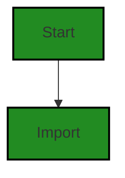

The control flow graph for the provided source code is very simple. It consists of a single node representing the start of the code, which then imports the `ControllerOutputType` from the `../controllers/controllerOutputTypes` module.


---

### Boost Source-Level Security Analysis

Last Updated: Friday, September 8, 2023 at 6:09:02 PM PDT

**No bugs found**


---

### Boost Source-Level Performance Analysis

Last Updated: Friday, September 8, 2023 at 6:10:04 PM PDT

**No bugs found**


---

### Boost Source-Level Data and Privacy Compliance Analysis

Last Updated: Friday, September 8, 2023 at 6:12:07 PM PDT

1. **Severity**: 7/10

   **Line Number**: 3

   **Bug Type**: GDPR

   **Description**: The import statement may lead to data transfer between different systems or components which may not comply with GDPR data transfer rules.

   **Solution**: Ensure that any data transferred as a result of this import statement is in compliance with GDPR. This may involve ensuring that any data transferred is necessary for the service being provided, that it is transferred securely, and that appropriate consent has been obtained if personal data is involved.


### Cell 1:
## Original Code:

### Programming Language: typescript
### ./src/data/boostprojectdata_interface.ts line 5

```typescript

export const noProjectOpenMessage =
    "Please open a project to chat with Sara, the Boost AI, about your project or analyze your project code.";
export const extensionNotFullyActivated =
    "Boost has not fully initialized. Some features may not be fully available yet. Please wait before using Boost Chat AI and analyzing your project.";
export const extensionFailedToActivate =
    "Boost encountered an error during startup. Please restart Visual Studio Code and try again. If the problem persists, please contact Polyverse Boost Support";

export enum AnalysisState {
    quiescent = "quiescent",
    preparing = "preparing",
    analyzing = "analyzing"
}

```
## Boost Analysis:


---

### Boost Code Explanation

Last Updated: Friday, September 8, 2023 at 6:01:39 PM PDT

This TypeScript code snippet is defining some constant messages and an enumeration. 

1. **Constant Messages:** The first three exports are constant string messages that the system can use to inform the user about certain situations. 
   - `noProjectOpenMessage`: This message is likely displayed when there is no project open in the Visual Studio Code editor but the user tries to interact with the Boost AI.
   - `extensionNotFullyActivated`: This message is likely displayed when the Boost extension is still initializing and not all features are available yet.
   - `extensionFailedToActivate`: This message is likely displayed when there is an error during the startup of the Boost extension.

2. **Enumeration (enum):** The `AnalysisState` enum represents the different states that a code analysis process can be in. 
   - `quiescent`: This state likely means that the analysis process is currently inactive.
   - `preparing`: This state likely means that the analysis process is preparing to start or is in the process of starting.
   - `analyzing`: This state likely means that the analysis process is currently analyzing code.

Enumerations are a way of creating a new type in TypeScript (and other languages with similar features) that can have one of a set of predefined values. They are used to make code more readable and less error-prone. 

No specific algorithms are used in this code snippet. It's just defining some constant values and an enumeration that will likely be used elsewhere in the program.

As for the architectural guidelines, this code snippet seems to be consistent with the guidelines provided in the blueprint summary. It uses TypeScript, which is mentioned in the programming languages, and it appears to follow object-oriented design principles by using an enumeration to encapsulate a set of related values.

For more information on TypeScript enums, you can visit this link: [TypeScript Enums](https://www.typescriptlang.org/docs/handbook/enums.html)


---

### Boost Flow Diagram

Last Updated: Friday, September 8, 2023 at 6:07:45 PM PDT

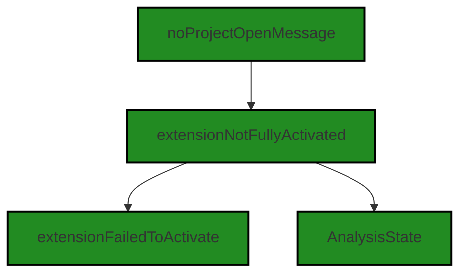


---

### Boost Source-Level Security Analysis

Last Updated: Friday, September 8, 2023 at 6:09:05 PM PDT

**No bugs found**


---

### Boost Source-Level Performance Analysis

Last Updated: Friday, September 8, 2023 at 6:10:08 PM PDT

**No bugs found**


---

### Boost Source-Level Data and Privacy Compliance Analysis

Last Updated: Friday, September 8, 2023 at 6:12:11 PM PDT

**No bugs found**


### Cell 2:
## Original Code:

### Programming Language: typescript
### ./src/data/boostprojectdata_interface.ts line 18

```typescript

export interface SummaryViewState {
    analysisTypesState: AnalysisTypesState;
    analysisMode: string;
}

```
## Boost Analysis:


---

### Boost Code Explanation

Last Updated: Friday, September 8, 2023 at 6:01:55 PM PDT

The provided code is written in TypeScript, a statically typed superset of JavaScript. It defines an interface named `SummaryViewState`. In TypeScript, an interface is a way to define a contract on a function or object to define the shape of the values. The interface also helps in getting the benefits of type-checking and autocompletion.

Here's a breakdown of the code:

1. `export`: This keyword is used to expose this interface for other modules to import and use. Without this keyword, other modules won't be able to import this interface.

2. `interface SummaryViewState`: This line is declaring an interface called `SummaryViewState`. The interface is a structure that defines the contract in your application. It defines the syntax for classes to follow, meaning a class that implements an interface must adhere to the structure the interface prescribes.

3. `analysisTypesState: AnalysisTypesState;`: This line defines a property `analysisTypesState` of the `SummaryViewState` interface. The type of this property is `AnalysisTypesState`, which is likely another interface or type defined elsewhere in the code. This property represents the state of the analysis types.

4. `analysisMode: string;`: This line defines a property `analysisMode` of the `SummaryViewState` interface. The type of this property is `string`. This property likely represents the mode of analysis (for example, "full", "incremental", etc.).

The code does not include any specific algorithms. It's a simple interface definition in TypeScript.

This code seems to be consistent with the general architectural guidelines mentioned in the summary. It uses TypeScript and object-oriented design principles. However, without a broader context or specific architectural guidelines, it's hard to say if there are any conflicts.

For more information about TypeScript interfaces, you can visit this link: [TypeScript Handbook: Interfaces](https://www.typescriptlang.org/docs/handbook/interfaces.html)


---

### Boost Flow Diagram

Last Updated: Friday, September 8, 2023 at 6:07:49 PM PDT

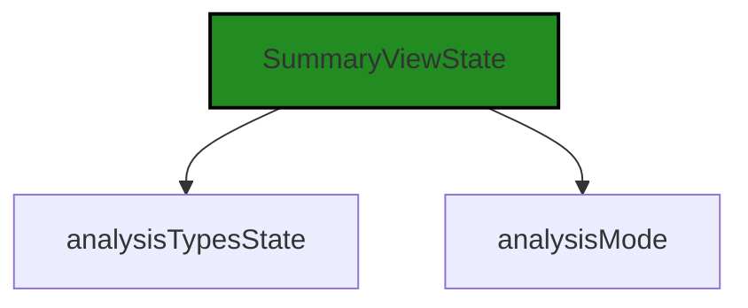


---

### Boost Source-Level Security Analysis

Last Updated: Friday, September 8, 2023 at 6:09:09 PM PDT

**No bugs found**


---

### Boost Source-Level Performance Analysis

Last Updated: Friday, September 8, 2023 at 6:10:12 PM PDT

**No bugs found**


---

### Boost Source-Level Data and Privacy Compliance Analysis

Last Updated: Friday, September 8, 2023 at 6:12:15 PM PDT

**No bugs found**


### Cell 3:
## Original Code:

### Programming Language: typescript
### ./src/data/boostprojectdata_interface.ts line 23

```typescript

export interface AnalysisTypesState {
    security: boolean;
    compliance: boolean;
    documentation: boolean;
}

```
## Boost Analysis:


---

### Boost Code Explanation

Last Updated: Friday, September 8, 2023 at 6:02:20 PM PDT

The code you provided is written in TypeScript, which is a statically typed superset of JavaScript that adds types to the language. This piece of code is defining an interface.

An interface in TypeScript is a way of defining a contract for a certain structure of an object. This means that any object that claims to implement this interface must have properties that match the names and types specified in the interface.

Here's a breakdown of the code:

- `export`: This keyword is used to make the interface available to other modules in the application. By using `export`, other parts of the application can import and use the `AnalysisTypesState` interface.

- `interface`: This keyword is used to declare a TypeScript interface.

- `AnalysisTypesState`: This is the name of the interface.

- Inside the curly braces `{}` are the properties that any object implementing this interface must have. In this case, there are three boolean properties: `security`, `compliance`, and `documentation`. 

This interface might be used in an application that performs different types of analysis on code or documents. An object implementing this interface could be used to keep track of which types of analysis are currently enabled.

In terms of algorithms, there are none present in this code snippet. It's simply a data structure definition.

For more information on TypeScript and interfaces, you can refer to the official TypeScript documentation: [TypeScript Interfaces](https://www.typescriptlang.org/docs/handbook/interfaces.html) 

Regarding the architectural guidelines you provided, this code snippet seems to be consistent with them. It's a simple, clean, and clear interface definition that doesn't appear to conflict with any architectural guidelines or constraints.


---

### Boost Flow Diagram

Last Updated: Friday, September 8, 2023 at 6:07:53 PM PDT

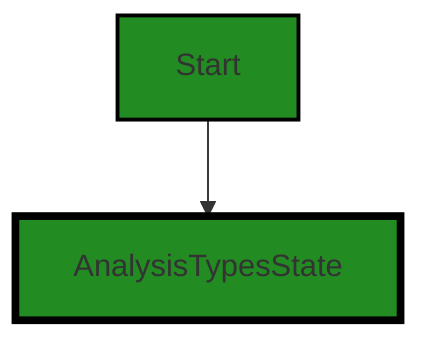


---

### Boost Source-Level Security Analysis

Last Updated: Friday, September 8, 2023 at 6:09:13 PM PDT

**No bugs found**


---

### Boost Source-Level Performance Analysis

Last Updated: Friday, September 8, 2023 at 6:10:15 PM PDT

**No bugs found**


---

### Boost Source-Level Data and Privacy Compliance Analysis

Last Updated: Friday, September 8, 2023 at 6:12:19 PM PDT

**No bugs found**


### Cell 4:
## Original Code:

### Programming Language: typescript
### ./src/data/boostprojectdata_interface.ts line 29

```typescript

export interface ActivityBarState {
    summaryViewState: SummaryViewState;
}

```
## Boost Analysis:


---

### Boost Code Explanation

Last Updated: Friday, September 8, 2023 at 6:02:41 PM PDT

The given code is a simple TypeScript interface definition. TypeScript is a statically typed superset of JavaScript that adds types to the language. An interface in TypeScript is a way to define a contract for a certain structure of an object. It can be used to describe the shape of an object, ensuring that the object has certain properties.

In the provided code, an interface named `ActivityBarState` is being defined. This interface has one property, `summaryViewState`, which is of the type `SummaryViewState`. The type `SummaryViewState` is not defined in the provided code, but it is likely another interface or type defined elsewhere in the codebase.

This interface might be used as a type for an object that represents the state of an activity bar in a user interface, with the `summaryViewState` property representing the state of a summary view within that activity bar. This is a common pattern in state management in modern web development, particularly in frameworks and libraries such as React and Vue.js.

The code doesn't contain any algorithms. It's a simple data structure definition. 

For more information on TypeScript interfaces, you can refer to the official TypeScript documentation here: [TypeScript Interfaces](https://www.typescriptlang.org/docs/handbook/interfaces.html).

In terms of architectural guidelines, this code is consistent with common practices in TypeScript and in state management in modern web development. It doesn't appear to conflict with any general architectural guidelines. However, without specific guidelines or constraints for this software project, it's hard to say definitively.


---

### Boost Flow Diagram

Last Updated: Friday, September 8, 2023 at 6:07:58 PM PDT

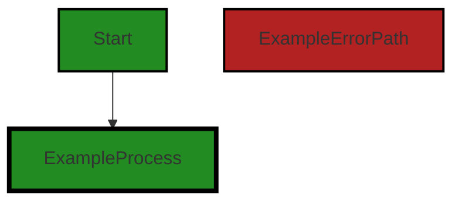
```


---

### Boost Source-Level Security Analysis

Last Updated: Friday, September 8, 2023 at 6:09:17 PM PDT

**No bugs found**


---

### Boost Source-Level Performance Analysis

Last Updated: Friday, September 8, 2023 at 6:10:19 PM PDT

**No bugs found**


---

### Boost Source-Level Data and Privacy Compliance Analysis

Last Updated: Friday, September 8, 2023 at 6:12:22 PM PDT

**No bugs found**


### Cell 5:
## Original Code:

### Programming Language: typescript
### ./src/data/boostprojectdata_interface.ts line 33

```typescript

//this is where we should remember UI state like which analysis were selected, etc. 
export interface UIState {
    analysisState: AnalysisState;
    activityBarState: ActivityBarState;
}

```
## Boost Analysis:


---

### Boost Code Explanation

Last Updated: Friday, September 8, 2023 at 6:03:09 PM PDT

The provided code is written in TypeScript, which is a statically typed superset of JavaScript that adds types to the language. This code defines an interface for an object that will be used to remember the state of the user interface (UI).

Let's break it down:

1. `export interface UIState`: This line is declaring an interface named `UIState`. The `export` keyword means that this interface is not only defined here, but can also be used in other TypeScript files in the same project. An interface in TypeScript is a way to define a contract for a certain structure of an object. It specifies how an object should look like, in terms of the properties it should have and the type of those properties.

2. `analysisState: AnalysisState;`: This line is declaring a property of the `UIState` interface named `analysisState`. The type of this property is `AnalysisState`, which is presumably another interface or type defined elsewhere in the project. The `analysisState` property is expected to hold the state of the analysis part of the user interface.

3. `activityBarState: ActivityBarState;`: Similarly, this line is declaring a property of the `UIState` interface named `activityBarState`. The type of this property is `ActivityBarState`, which is presumably another interface or type defined elsewhere in the project. The `activityBarState` property is expected to hold the state of the activity bar part of the user interface.

The purpose of this `UIState` interface is to provide a structure for an object that will hold the state of the user interface. This state can then be used to remember and restore the state of the user interface as needed, such as after a page refresh or when navigating between different parts of the application. 

This is a common pattern in modern web development, especially in applications that use libraries or frameworks like React or Vue.js, which are based on the concept of maintaining and manipulating the state of the application.

For more information on TypeScript interfaces, you can refer to the [official TypeScript documentation](https://www.typescriptlang.org/docs/handbook/interfaces.html).


---

### Boost Flow Diagram

Last Updated: Friday, September 8, 2023 at 6:08:02 PM PDT

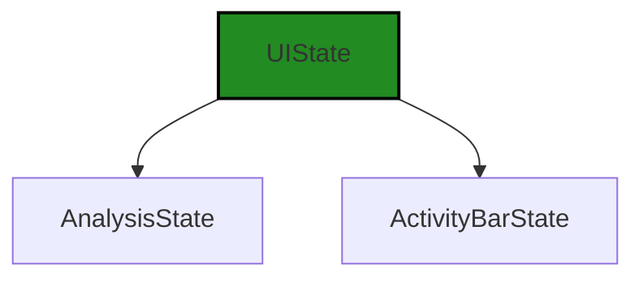


---

### Boost Source-Level Security Analysis

Last Updated: Friday, September 8, 2023 at 6:09:20 PM PDT

**No bugs found**


---

### Boost Source-Level Performance Analysis

Last Updated: Friday, September 8, 2023 at 6:10:23 PM PDT

**No bugs found**


---

### Boost Source-Level Data and Privacy Compliance Analysis

Last Updated: Friday, September 8, 2023 at 6:12:26 PM PDT

**No bugs found**


### Cell 6:
## Original Code:

### Programming Language: typescript
### ./src/data/boostprojectdata_interface.ts line 39

```typescript

export interface AccountStatus {
    refreshed: boolean;
    enabled: boolean;
    status: string;
    trialRemaining: number;
    usageThisMonth: number;
    discountedUsage: number;
    balanceDue: number;
    couponType: string;
    created: string;
    creditCardLinked: boolean;
    org: string;
    owner: string;
}

```
## Boost Analysis:


---

### Boost Code Explanation

Last Updated: Friday, September 8, 2023 at 6:03:40 PM PDT

This code defines an interface in TypeScript named `AccountStatus`. An interface in TypeScript is a syntactical contract that an entity should conform to. They are used to define the shape of an object, ensuring that the object has certain properties with specific types.

Here's a breakdown of what each property in the `AccountStatus` interface represents:

- `refreshed`: A boolean indicating whether the account status has been recently updated or not.
- `enabled`: A boolean indicating whether the account is enabled or not.
- `status`: A string that holds the status of the account. This could be values like 'active', 'inactive', 'suspended', etc.
- `trialRemaining`: A number that represents how many days are left in a trial account.
- `usageThisMonth`: A number that represents the usage of the account for the current month.
- `discountedUsage`: A number that represents the usage of the account that was discounted.
- `balanceDue`: A number that represents the amount due on the account.
- `couponType`: A string that represents the type of coupon applied to the account.
- `created`: A string that represents the date when the account was created.
- `creditCardLinked`: A boolean indicating whether a credit card is linked to the account or not.
- `org`: A string that represents the organization associated with the account.
- `owner`: A string that represents the owner of the account.

This interface does not use any specific algorithms; it is a structure used to define objects in the codebase. 

The `AccountStatus` interface ensures that any object that claims to be of type `AccountStatus` has all these properties with the corresponding types. This is useful for maintaining consistency and integrity in the codebase, reducing the likelihood of bugs due to mismatched or missing properties.

For more information about TypeScript interfaces, you can refer to the [TypeScript Handbook](https://www.typescriptlang.org/docs/handbook/interfaces.html).


---

### Boost Flow Diagram

Last Updated: Friday, September 8, 2023 at 6:08:06 PM PDT


The control flow starts at the beginning of the code.


---

### Boost Source-Level Security Analysis

Last Updated: Friday, September 8, 2023 at 6:09:23 PM PDT

**No bugs found**


---

### Boost Source-Level Performance Analysis

Last Updated: Friday, September 8, 2023 at 6:10:26 PM PDT

**No bugs found**


---

### Boost Source-Level Data and Privacy Compliance Analysis

Last Updated: Friday, September 8, 2023 at 6:12:56 PM PDT

1. **Severity**: 8/10

   **Line Number**: 82

   **Bug Type**: GDPR

   **Description**: The 'creditCardLinked' field indicates whether a credit card is linked to the account. This can be considered as processing personal data.

   **Solution**: Instead of directly indicating whether a credit card is linked, consider using a tokenization system where the actual card data is replaced with a non-sensitive equivalent, known as a token, that has no extrinsic or exploitable meaning or value.


2. **Severity**: 9/10

   **Line Number**: 85

   **Bug Type**: GDPR

   **Description**: The 'owner' field likely contains personal data and must be handled according to GDPR regulations.

   **Solution**: Ensure this data is being processed lawfully, fairly, and in a transparent manner. It should be collected for specified, explicit, and legitimate purposes and not further processed in a manner that is incompatible with those purposes.


3. **Severity**: 8/10

   **Line Number**: 84

   **Bug Type**: HIPAA

   **Description**: The 'org' field may contain information about a healthcare organization, which could potentially be considered Protected Health Information (PHI) under HIPAA if it can be used to identify an individual.

   **Solution**: Ensure that this data is de-identified according to HIPAA standards, or if it must be identifiable, ensure it is securely encrypted both at rest and in transit.


### Cell 7:
## Original Code:

### Programming Language: typescript
### ./src/data/boostprojectdata_interface.ts line 54

```typescript

export interface Summary {
    projectName: string;
    summaryUrl: string;
    filesToAnalyze: number;
    filesAnalyzed: number;
    //an optional issues arrary for *Boost* issues
    issues?: Array<any>;
}

```
## Boost Analysis:


---

### Boost Code Explanation

Last Updated: Friday, September 8, 2023 at 6:04:11 PM PDT

This code is written in TypeScript, a statically typed superset of JavaScript that adds types to the language. The code defines an interface named `Summary`. In TypeScript, an interface is a way to define a contract for a certain structure of an object. It's a powerful way to define and ensure the shape of the objects in your code.

The `Summary` interface contains five properties:

1. `projectName`: This is a string that presumably holds the name of the project that the summary pertains to.

2. `summaryUrl`: Another string, this one presumably contains a URL where more detailed summary information can be found.

3. `filesToAnalyze`: This is a number, likely representing the total number of files that are to be analyzed in the project.

4. `filesAnalyzed`: Another number, this one likely representing the number of files that have already been analyzed.

5. `issues`: This is an optional property (denoted by the `?` after the property name), which if present, will be an array of any type. This property is likely meant to hold a list of issues that were found during the analysis of the project. The `any` type in TypeScript is a flexible type that can hold a value of any type, providing maximum flexibility but also minimal type safety.

This code doesn't contain any algorithms, it's a simple data structure definition. But it's a crucial part of the software architecture, as it defines the shape of the data that will flow through the system.

The code is consistent with general software architecture principles, as it uses TypeScript's static typing to enforce a certain structure on the data, which can help catch errors at compile time. It doesn't conflict with the provided architectural guidelines, as there are no special constraints or guidelines provided.

For more information on TypeScript interfaces, you can refer to the TypeScript Handbook's section on interfaces: [TypeScript Handbook - Interfaces](https://www.typescriptlang.org/docs/handbook/interfaces.html)


---

### Boost Flow Diagram

Last Updated: Friday, September 8, 2023 at 6:08:11 PM PDT

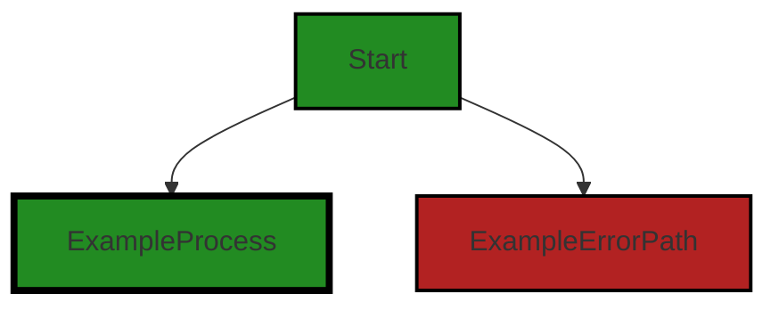

The code provided does not contain any control flow.


---

### Boost Source-Level Security Analysis

Last Updated: Friday, September 8, 2023 at 6:09:27 PM PDT

**No bugs found**


---

### Boost Source-Level Performance Analysis

Last Updated: Friday, September 8, 2023 at 6:10:29 PM PDT

**No bugs found**


---

### Boost Source-Level Data and Privacy Compliance Analysis

Last Updated: Friday, September 8, 2023 at 6:13:06 PM PDT

1. **Severity**: 3/10

   **Line Number**: 114

   **Bug Type**: Data Privacy

   **Description**: The 'issues' field in the 'Summary' interface could potentially contain sensitive data. If this data is not properly protected, it could lead to a violation of GDPR, PCI DSS, and HIPAA regulations.

   **Solution**: Ensure that any sensitive data stored in the 'issues' field is properly encrypted and that access to this data is controlled. Regularly audit the data stored in this field to ensure compliance with data protection regulations.


### Cell 8:
## Original Code:

### Programming Language: typescript
### ./src/data/boostprojectdata_interface.ts line 63

```typescript

export enum BoostProcessingStatus {
    completed = "completed",
    incomplete = "incomplete",
    processing = "processing",
    notStarted = "not-started",
}

```
## Boost Analysis:


---

### Boost Code Explanation

Last Updated: Friday, September 8, 2023 at 6:04:39 PM PDT

This code snippet is written in TypeScript, a statically typed superset of JavaScript. It defines an enumeration, which is a special kind of value type with a set of named constants. 

The enumeration is named `BoostProcessingStatus` and it has four members: `completed`, `incomplete`, `processing`, and `notStarted`. Each of these members is associated with a string value: "completed", "incomplete", "processing", and "not-started" respectively.

Enumerations in TypeScript are used to create user-defined types that help to manage and use sets of constants throughout the codebase. They can improve clarity and reduce errors by enforcing that variables and parameters are only assigned these specific enumerated values.

In this case, the `BoostProcessingStatus` enumeration could be used to represent the status of a code analysis operation. The operation could be in one of four states: not started, processing, incomplete (perhaps due to an error), or completed. Using an enumeration instead of raw string values can make the code easier to understand and less prone to errors.

Here's an example of how it might be used:

```typescript
let currentStatus: BoostProcessingStatus = BoostProcessingStatus.notStarted;

// Later in the code...
if (currentStatus === BoostProcessingStatus.completed) {
    console.log("Analysis is complete!");
}
```

In the above example, `currentStatus` is a variable of type `BoostProcessingStatus`. It's initially set to `BoostProcessingStatus.notStarted`. Later, we check if `currentStatus` is `BoostProcessingStatus.completed` to determine if the analysis is complete.

For more information on TypeScript enumerations, you can refer to the TypeScript handbook's page on Enums: [TypeScript Enums](https://www.typescriptlang.org/docs/handbook/enums.html)


---

### Boost Flow Diagram

Last Updated: Friday, September 8, 2023 at 6:08:16 PM PDT

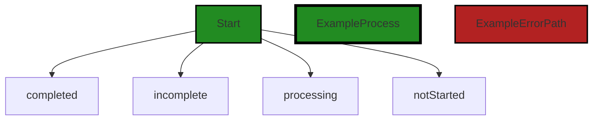


---

### Boost Source-Level Security Analysis

Last Updated: Friday, September 8, 2023 at 6:09:30 PM PDT

**No bugs found**


---

### Boost Source-Level Performance Analysis

Last Updated: Friday, September 8, 2023 at 6:11:23 PM PDT

**No bugs found**


---

### Boost Source-Level Data and Privacy Compliance Analysis

Last Updated: Friday, September 8, 2023 at 6:13:10 PM PDT

**No bugs found**


### Cell 9:
## Original Code:

### Programming Language: typescript
### ./src/data/boostprojectdata_interface.ts line 70

```typescript

export interface SectionSummary {
    analysisType: string;
    status: BoostProcessingStatus;
    errorCells: number;
    completedCells: number;
    totalCells: number;
    issueCells: number;
    filesAnalyzed: number;
    details?: Array<any>; // some sections, like security and compliance, will have a list of issues in the details section
}

```
## Boost Analysis:


---

### Boost Code Explanation

Last Updated: Friday, September 8, 2023 at 6:05:12 PM PDT

This code is written in TypeScript, which is a statically typed superset of JavaScript. It defines an interface named `SectionSummary`. An interface in TypeScript is a way of defining a contract for a certain structure of an object. It's like a blueprint for the object and it defines the shape of the object.

The `SectionSummary` interface has the following properties:

- `analysisType`: This property is of type `string`. It represents the type of analysis that is being performed.

- `status`: This property is of type `BoostProcessingStatus`. `BoostProcessingStatus` is presumably another interface or type defined elsewhere in the code. It represents the current status of the processing.

- `errorCells`: This property is of type `number`. It represents the number of cells (a term generally used in spreadsheet-like data) that have encountered errors during the analysis.

- `completedCells`: This property is of type `number`. It represents the number of cells that have completed the analysis.

- `totalCells`: This property is of type `number`. It represents the total number of cells that are to be analyzed.

- `issueCells`: This property is of type `number`. It represents the number of cells that have issues found during the analysis.

- `filesAnalyzed`: This property is of type `number`. It represents the number of files that have been analyzed.

- `details`: This is an optional property (denoted by the `?`), which, if present, is an array of any type. This means that the array can contain elements of any type. The comment suggests that for some sections like security and compliance, this property will have a list of issues.

This interface doesn't include any algorithms, but it sets up a structure that can be used to hold data related to the summary of a section of analysis.

As for architectural guidelines, this code seems to align well with the principles of object-oriented design, as it uses an interface to define a structure for objects. It doesn't directly relate to the other principles mentioned in the project blueprint, such as event-driven programming or asynchronous programming.

For more information on TypeScript interfaces, you can check this link: [TypeScript Interfaces](https://www.typescriptlang.org/docs/handbook/interfaces.html)


---

### Boost Flow Diagram

Last Updated: Friday, September 8, 2023 at 6:08:22 PM PDT

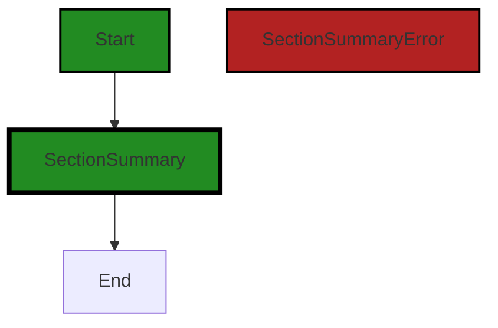

The control flow graph for the provided code is a simple linear flow. The code starts at the `Start` node and then flows to the `SectionSummary` node. There are no alternate paths or error paths in this code.


---

### Boost Source-Level Security Analysis

Last Updated: Friday, September 8, 2023 at 6:09:33 PM PDT

**No bugs found**


---

### Boost Source-Level Performance Analysis

Last Updated: Friday, September 8, 2023 at 6:11:26 PM PDT

**No bugs found**


---

### Boost Source-Level Data and Privacy Compliance Analysis

Last Updated: Friday, September 8, 2023 at 6:13:36 PM PDT

1. **Severity**: 8/10

   **Line Number**: 144

   **Bug Type**: GDPR

   **Description**: The 'details' field may contain personal data which could violate GDPR regulations if not properly handled.

   **Solution**: Ensure that any personal data stored in the 'details' field is anonymized or pseudonymized, and that explicit consent is obtained from the user for the collection and processing of this data.


2. **Severity**: 7/10

   **Line Number**: 144

   **Bug Type**: PCI DSS

   **Description**: If the 'details' field contains cardholder data, it could be in violation of PCI DSS standards.

   **Solution**: Ensure that cardholder data is not stored in the 'details' field or, if it is, that it is encrypted and properly secured according to PCI DSS standards.


3. **Severity**: 9/10

   **Line Number**: 144

   **Bug Type**: HIPAA

   **Description**: If the 'details' field contains Protected Health Information (PHI), it could be in violation of HIPAA regulations.

   **Solution**: Ensure that PHI is not stored in the 'details' field or, if it is, that it is encrypted and properly secured according to HIPAA regulations.


### Cell 10:
## Original Code:

### Programming Language: typescript
### ./src/data/boostprojectdata_interface.ts line 81

```typescript

export interface FileSummaryItem {
    sourceRelFile: string;
    notebookRelFile: string;
    totalCells: number;
    completedCells: number;
    errorCells: number;
    issueCells: number;
    sections: { [outputType: string]: SectionSummary };
}

```
## Boost Analysis:


---

### Boost Code Explanation

Last Updated: Friday, September 8, 2023 at 6:05:43 PM PDT

The code you've provided is a TypeScript interface definition. Interfaces in TypeScript are a powerful way to define contracts within your code and define custom types. They are not included in the JavaScript that is compiled from TypeScript, they exist purely for type-checking during development.

This particular interface, `FileSummaryItem`, appears to be used to summarize the state of a file in a software project. It has the following properties:

1. `sourceRelFile`: This is a string that likely represents the path to the source file relative to the project root.
2. `notebookRelFile`: This is a string that likely represents the path to a notebook file (possibly a Jupyter notebook) relative to the project root.
3. `totalCells`: This is a number, likely representing the total number of cells in the notebook file. In a Jupyter notebook, a cell is a block of code or text.
4. `completedCells`: This is a number, likely representing the number of cells that have been completed or executed successfully.
5. `errorCells`: This is a number, likely representing the number of cells that have encountered an error during execution.
6. `issueCells`: This is a number, likely representing the number of cells that have some sort of issue, perhaps a warning or a non-critical error.
7. `sections`: This is an object where the keys are strings and the values are of type `SectionSummary`. The keys likely represent different output types, and the `SectionSummary` type would summarize the state of each section.

The specific algorithm or algorithms used by this interface would depend on how it's used in the rest of the codebase, which is not provided here. However, the interface itself does not use any algorithms. It's a data structure that defines a type.

This code is consistent with the architectural blueprint provided, which indicates that the project uses TypeScript and object-oriented design. The `FileSummaryItem` interface is a good example of both of these principles.

For more information on TypeScript interfaces, you can refer to the [TypeScript Handbook](https://www.typescriptlang.org/docs/handbook/interfaces.html).


---

### Boost Flow Diagram

Last Updated: Friday, September 8, 2023 at 6:08:26 PM PDT

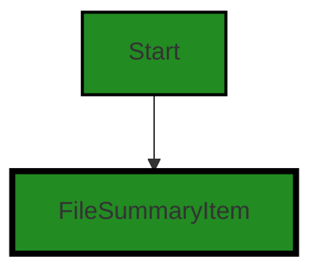


---

### Boost Source-Level Security Analysis

Last Updated: Friday, September 8, 2023 at 6:09:37 PM PDT

**No bugs found**


---

### Boost Source-Level Performance Analysis

Last Updated: Friday, September 8, 2023 at 6:11:30 PM PDT

**No bugs found**


---

### Boost Source-Level Data and Privacy Compliance Analysis

Last Updated: Friday, September 8, 2023 at 6:13:40 PM PDT

**No bugs found**


### Cell 11:
## Original Code:

### Programming Language: typescript
### ./src/data/boostprojectdata_interface.ts line 91

```typescript
export type JobStatus = {
    [relFile: string]: {
        status: "processing" | "queued" | "completed";
        jobs: string[];
    };
};

```
## Boost Analysis:


---

### Boost Code Explanation

Last Updated: Friday, September 8, 2023 at 6:06:10 PM PDT

This code is written in TypeScript, which is a statically-typed superset of JavaScript. It defines a type alias called `JobStatus`. 

`JobStatus` is an object type where the keys are strings (`relFile`) and the values are objects with a specific shape. These objects have two properties: `status` and `jobs`.

The `status` property is a string that can only take one of three values: "processing", "queued", or "completed". This is known as a string literal type, and it's a way of defining a type that can only take a specific set of string values. It's a way to represent a finite state machine in TypeScript, where the state of a job can only be one of the three defined states.

The `jobs` property is an array of strings. The purpose of this array isn't clear from the provided code, but it might represent a list of jobs associated with a specific file, given the `relFile` key in the parent object.

This code doesn't contain any algorithms, it's just a type definition. The structure of this type suggests that it might be used to track the status of some sort of jobs associated with specific files, but without more context, it's hard to say for sure.

In terms of architectural guidelines, this type definition is consistent with common practices in TypeScript. It uses features of the language to define a precise type that can help catch errors at compile time. 

For more information about TypeScript's type system, you can refer to the [TypeScript Handbook](https://www.typescriptlang.org/docs/handbook/2/everyday-types.html). For more information about finite state machines, which this type seems to represent, you can refer to [this article](https://www.smashingmagazine.com/2018/01/rise-state-machines/).


---

### Boost Flow Diagram

Last Updated: Friday, September 8, 2023 at 6:08:30 PM PDT

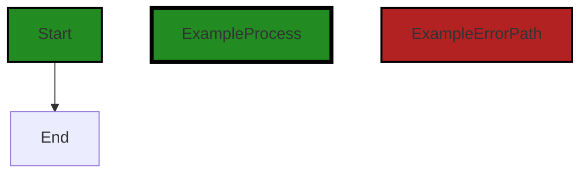


---

### Boost Source-Level Security Analysis

Last Updated: Friday, September 8, 2023 at 6:09:40 PM PDT

**No bugs found**


---

### Boost Source-Level Performance Analysis

Last Updated: Friday, September 8, 2023 at 6:11:33 PM PDT

**No bugs found**


---

### Boost Source-Level Data and Privacy Compliance Analysis

Last Updated: Friday, September 8, 2023 at 6:13:43 PM PDT

**No bugs found**


### Cell 12:
## Original Code:

### Programming Language: typescript
### ./src/data/boostprojectdata_interface.ts line 97

```typescript

export interface IBoostProjectData {
    dataFormatVersion: string;
    summary: Summary;
    sectionSummary: {
        [key: string]: SectionSummary;
    };
    files: {
        [key: string]: FileSummaryItem;
    };
    jobStatus: JobStatus;
    account: AccountStatus;
    uiState: UIState;
}

```
## Boost Analysis:


---

### Boost Code Explanation

Last Updated: Friday, September 8, 2023 at 6:06:41 PM PDT

This code defines an interface in TypeScript named `IBoostProjectData`. An interface in TypeScript is a way of defining a contract for a particular structure of an object. This interface is expected to be used as a data model for the Boost project.

Here's a breakdown of the properties:

- `dataFormatVersion`: This is a string that represents the version of the data format being used. This could be useful for handling backward compatibility or migrations.
- `summary`: This is a property of type `Summary`, which is not defined in this snippet, but it's likely a different interface or type that encapsulates some summary information about the Boost project.
- `sectionSummary`: This is an object where the keys are strings and the values are of type `SectionSummary`. This could be used to store a summary of different sections of the project.
- `files`: This is an object where the keys are strings and the values are of type `FileSummaryItem`. This could be used to store a summary of different files in the project.
- `jobStatus`: This is a property of type `JobStatus`, which likely represents the status of a job or task in the project.
- `account`: This is a property of type `AccountStatus`, which likely represents the status of a user account.
- `uiState`: This is a property of type `UIState`, which likely represents the state of the user interface.

The types `Summary`, `SectionSummary`, `FileSummaryItem`, `JobStatus`, `AccountStatus`, and `UIState` are not defined in the provided code. These are likely defined elsewhere in the codebase.

This interface does not use any specific algorithms. It's a data structure that provides a blueprint for objects that hold Boost project data. It's consistent with the architectural guidelines mentioned in the blueprint summary. It uses TypeScript's static typing for better error checking and autocompletion, and it's organized into an interface for better structure and readability.

For more on TypeScript interfaces, you can refer to the TypeScript handbook: [TypeScript Handbook - Interfaces](https://www.typescriptlang.org/docs/handbook/interfaces.html).


---

### Boost Flow Diagram

Last Updated: Friday, September 8, 2023 at 6:08:40 PM PDT

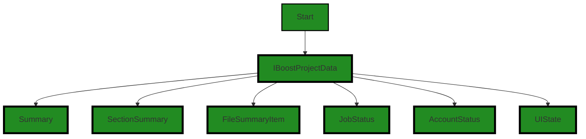

The control flow graph for the provided code is a simple graph with the `IBoostProjectData` interface as the starting point. It has multiple outgoing edges to the `Summary`, `SectionSummary`, `FileSummaryItem`, `JobStatus`, `AccountStatus`, and `UIState` nodes. This represents the structure of the `IBoostProjectData` interface and its relationships with other interfaces or types in the code.


---

### Boost Source-Level Security Analysis

Last Updated: Friday, September 8, 2023 at 6:09:43 PM PDT

**No bugs found**


---

### Boost Source-Level Performance Analysis

Last Updated: Friday, September 8, 2023 at 6:11:37 PM PDT

**No bugs found**


---

### Boost Source-Level Data and Privacy Compliance Analysis

Last Updated: Friday, September 8, 2023 at 6:14:09 PM PDT

1. **Severity**: 8/10

   **Line Number**: 198

   **Bug Type**: GDPR

   **Description**: The 'account' field could potentially contain personally identifiable information (PII) which could be a violation of GDPR if it's not handled properly.

   **Solution**: Ensure that PII in the 'account' field is anonymized or pseudonymized where possible, and that explicit consent is obtained for the processing of this data. Implement data encryption to protect sensitive data during transmission and storage.


2. **Severity**: 7/10

   **Line Number**: 197

   **Bug Type**: PCI DSS

   **Description**: The 'jobStatus' field could potentially contain sensitive payment card data which would be a violation of PCI DSS if it's not properly protected.

   **Solution**: Ensure that payment card data is never stored in plaintext and is encrypted during transmission and storage. Implement strong access controls and authentication mechanisms to protect this data.


3. **Severity**: 9/10

   **Line Number**: 198

   **Bug Type**: HIPAA

   **Description**: The 'account' field could potentially contain protected health information (PHI) which would be a violation of HIPAA if it's not properly protected.

   **Solution**: Ensure that PHI is never stored in plaintext and is encrypted during transmission and storage. Implement strong access controls and authentication mechanisms to protect this data. Ensure that users can request and obtain a copy of their PHI, and can request that their PHI be corrected or deleted.


### Cell 13:
## Original Code:

### Programming Language: typescript
### ./src/data/boostprojectdata_interface.ts line 111

```typescript

export const emptyProjectData: IBoostProjectData = {
    dataFormatVersion: "0.0.0",
    summary: {
        projectName: "",
        summaryUrl: "",
        filesToAnalyze: 0,
        filesAnalyzed: 0,
    },
    sectionSummary: {
        summary: {
            analysisType: ControllerOutputType.summary,
            status: BoostProcessingStatus.notStarted,
            completedCells: 0,
            errorCells: 0,
            issueCells: 0,
            totalCells: 0,
            filesAnalyzed: 0,
        },
    },
    files: {},
    jobStatus: {},
    account: {
        refreshed: false,
        enabled: false,
        status: "",
        trialRemaining: 0,
        usageThisMonth: 0,
        discountedUsage: 0,
        balanceDue: 0,
        couponType: "",
        org: "",
        owner: "",
        created: "",
        creditCardLinked: false,
    },
    uiState: {
        analysisState: AnalysisState.quiescent,
        activityBarState: {
            summaryViewState: {
                analysisMode: "analyze-all-mode",
                analysisTypesState: {
                    security: true,
                    compliance: true,
                    documentation: true,
                }
            },
        },
    },
};

```
## Boost Analysis:


---

### Boost Code Explanation

Last Updated: Friday, September 8, 2023 at 6:07:21 PM PDT

This code is written in TypeScript and it exports a constant object called `emptyProjectData` that implements the `IBoostProjectData` interface. This object serves as the initial state or the default values for a project data in the Boost application. Let's break down the various parts of this object:

1. `dataFormatVersion`: This property represents the version of the data format used. It is set to "0.0.0" by default, indicating that no version has been set yet.

2. `summary`: This is an object that holds summary information about the project. It includes properties like `projectName`, `summaryUrl`, `filesToAnalyze` and `filesAnalyzed`, all of which are initialized with default values.

3. `sectionSummary`: This object holds a summary of the analysis performed. It includes properties like `analysisType`, `status`, `completedCells`, `errorCells`, `issueCells`, `totalCells`, and `filesAnalyzed`. These are all initialized with default values.

4. `files`: This is an empty object which will likely hold information about the files in the project.

5. `jobStatus`: This is another empty object which will likely hold information about the status of jobs related to the project.

6. `account`: This object holds account-related information such as `refreshed`, `enabled`, `status`, `trialRemaining`, `usageThisMonth`, `discountedUsage`, `balanceDue`, `couponType`, `org`, `owner`, `created`, `creditCardLinked`. All of these properties are initialized with either default values or empty strings.

7. `uiState`: This object holds the state of the user interface. It includes properties like `analysisState` and `activityBarState`. The `activityBarState` itself is an object with properties `summaryViewState` and `analysisTypesState`.

In terms of algorithms, this code doesn't really include any. It's simply defining an object with a specific structure and default values.

This code is consistent with the architectural guidelines provided. It is well-structured, making use of TypeScript's static typing to define the structure of the `emptyProjectData` object. This can help catch many errors at compile time.

For more information, you may want to look into the following topics:

- [TypeScript Interfaces](https://www.typescriptlang.org/docs/handbook/interfaces.html)
- [JavaScript Objects](https://developer.mozilla.org/en-US/docs/Web/JavaScript/Guide/Working_with_Objects)


---

### Boost Flow Diagram

Last Updated: Friday, September 8, 2023 at 6:08:48 PM PDT

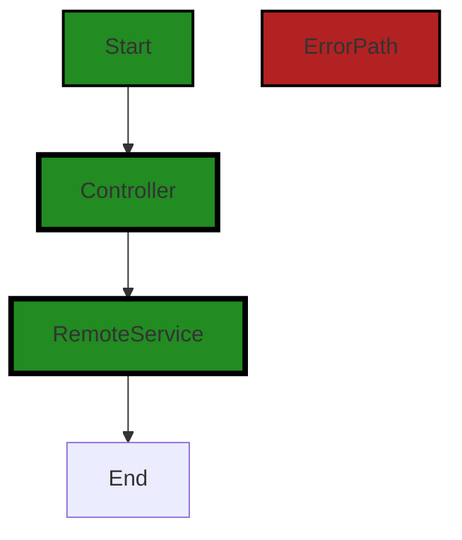

The control flow graph for the provided source code is as follows:

1. The flow starts at the `Start` node.
2. The flow then goes to the `Controller` node.
3. From the `Controller` node, the flow goes to the `RemoteService` node.
4. Finally, the flow ends at the `End` node.

Note that there are no error paths in the provided code, so the graph does not include any error paths.


---

### Boost Source-Level Security Analysis

Last Updated: Friday, September 8, 2023 at 6:09:47 PM PDT

**No bugs found**


---

### Boost Source-Level Performance Analysis

Last Updated: Friday, September 8, 2023 at 6:11:40 PM PDT

**No bugs found**


---

### Boost Source-Level Data and Privacy Compliance Analysis

Last Updated: Friday, September 8, 2023 at 6:14:38 PM PDT

1. **Severity**: 8/10

   **Line Number**: 240

   **Bug Type**: GDPR

   **Description**: The 'account' object contains sensitive user data, including payment and account status information. This data could be exposed if not properly handled and secured, violating GDPR regulations.

   **Solution**: Ensure that all sensitive user data is encrypted both at rest and in transit, and only accessible by authorized individuals. Implement proper access controls and use secure methods for handling and storing sensitive data.


2. **Severity**: 9/10

   **Line Number**: 240

   **Bug Type**: PCI DSS

   **Description**: The 'creditCardLinked' field in the 'account' object indicates that credit card information may be handled by the application. If this data is not properly secured, it could violate PCI DSS regulations.

   **Solution**: Ensure that credit card data is properly encrypted and securely stored. Implement strong access controls and regularly audit your application for security vulnerabilities. Consider using a third-party payment processor to limit the amount of credit card data your application needs to handle.


3. **Severity**: 7/10

   **Line Number**: 240

   **Bug Type**: HIPAA

   **Description**: While there's no direct indication of handling medical data, if the 'account' object is used to handle or store any health-related data, it could violate HIPAA regulations unless it's properly secured.

   **Solution**: Ensure that any health-related data is properly encrypted and securely stored. Implement strong access controls and regularly audit your application for security vulnerabilities. Be aware that HIPAA regulations apply to any system that handles health-related data, not just those in the healthcare industry.


