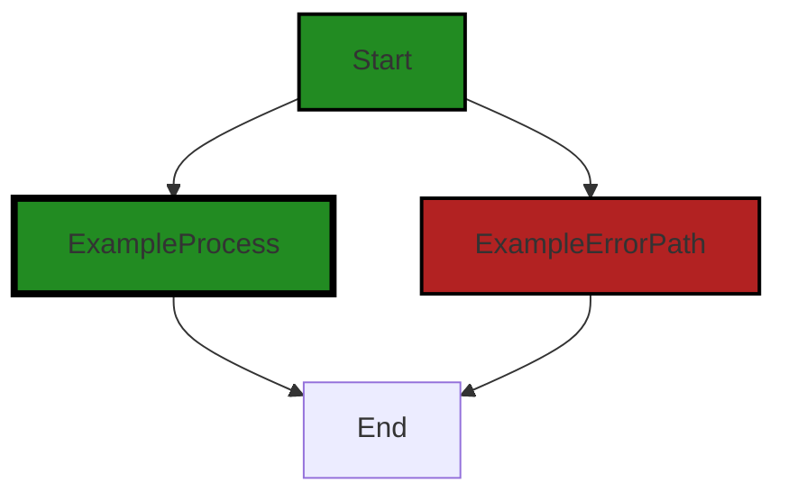

# Polyverse Boost-generated Source Analysis Details

## Source: ./src/data/incompatibleVersionException.ts
Date Generated: Friday, September 8, 2023 at 6:18:54 PM PDT


---

### Boost Architectural Quick Summary Security Report

Last Updated: Friday, September 8, 2023 at 6:18:37 PM PDT


Executive Report:

1. **Architectural Impact**: The analysis of this file has not revealed any severe issues.
2. **Risk Analysis**: The analysis of this file has not revealed any severe issues.
3. **Potential Customer Impact**: Based on the analysis, there are no severe issues that could potentially impact customers.
4. **Performance Issues**: Our analysis did not identify any explicit performance issues in the file.
5. **Risk Assessment**: Based on the current analysis of this file, no severe issues have been found. However, this doesn't guarantee that the file is risk-free.

Highlights:

- No severe issues were identified in the current analysis of this file.


---

### Boost Architectural Quick Summary Performance Report

Last Updated: Friday, September 8, 2023 at 6:18:47 PM PDT


Executive Report:

1. **Architectural Impact**: The analysis of this file has not revealed any severe issues.
2. **Risk Analysis**: The analysis of this file has not revealed any severe issues.
3. **Potential Customer Impact**: Based on the analysis, there are no severe issues that could potentially impact customers.
4. **Performance Issues**: Our analysis did not identify any explicit performance issues in the file.
5. **Risk Assessment**: Based on the current analysis of this file, no severe issues have been found. However, this doesn't guarantee that the file is risk-free.

Highlights:

- No severe issues were identified in the current analysis of this file.


---

### Boost Architectural Quick Summary Compliance Report

Last Updated: Friday, September 8, 2023 at 6:18:58 PM PDT


Executive Report:

1. **Architectural Impact**: The analysis of this file has not revealed any severe issues.
2. **Risk Analysis**: The analysis of this file has not revealed any severe issues.
3. **Potential Customer Impact**: Based on the analysis, there are no severe issues that could potentially impact customers.
4. **Performance Issues**: Our analysis did not identify any explicit performance issues in the file.
5. **Risk Assessment**: Based on the current analysis of this file, no severe issues have been found. However, this doesn't guarantee that the file is risk-free.

Highlights:

- No severe issues were identified in the current analysis of this file.

---
## Detailed Analysis:

### Cell 0:
## Original Code:

### Programming Language: typescript
### ./src/data/incompatibleVersionException.ts 

```typescript
export class IncompatibleVersionException extends Error {
    constructor(
        message?: string,
        expectedVersion?: string,
        actualVersion?: string) {
      super(message);
      this.name = 'IncompatibleVersionException';
      this.expectedVersion = expectedVersion?expectedVersion:"";
      this.actualVersion = actualVersion?actualVersion:"";
    }
    expectedVersion: string;
    actualVersion: string;
}

```
## Boost Analysis:


---

### Boost Code Explanation

Last Updated: Friday, September 8, 2023 at 6:18:18 PM PDT

The code you provided is written in TypeScript, which is a statically typed superset of JavaScript that adds types to the language. 

This code defines a custom exception class named `IncompatibleVersionException` that extends the built-in `Error` class in JavaScript. Custom exceptions are useful for creating specific error types that can be caught and handled separately from other errors.

Here's a breakdown of the code:

- `export class IncompatibleVersionException extends Error`: This line is declaring a class named `IncompatibleVersionException` that inherits from the `Error` class. The `export` keyword is used to make this class available to other modules in the application.

- `constructor(message?: string, expectedVersion?: string, actualVersion?: string)`: This is the constructor of the class, which is a special method that is used to create and initialize an object created from a class. It takes three optional parameters: `message`, `expectedVersion`, and `actualVersion`. The `?` after each parameter name indicates that the parameter is optional.

- `super(message);`: This line is calling the constructor of the parent `Error` class with the `message` parameter. The `super` keyword is used to call methods on a parent class.

- `this.name = 'IncompatibleVersionException';`: This line is setting the `name` property of the error to the string `'IncompatibleVersionException'`. This can be useful when logging or handling errors, as it allows you to determine the type of the error.

- `this.expectedVersion = expectedVersion?expectedVersion:"";`: This line is setting the `expectedVersion` property of the error. If `expectedVersion` is provided, it will be used; otherwise, the property will be set to an empty string.

- `this.actualVersion = actualVersion?actualVersion:"";`: This line is setting the `actualVersion` property of the error in the same way.

- `expectedVersion: string; actualVersion: string;`: These lines are declaring two string properties on the class: `expectedVersion` and `actualVersion`.

This code does not appear to conflict with any architectural guidelines. It follows best practices for defining custom exceptions in TypeScript.

For more information about classes in TypeScript, you can refer to this link: [TypeScript Classes](https://www.typescriptlang.org/docs/handbook/2/classes.html) 

And for more information about errors and exceptions in JavaScript, you can refer to this link: [JavaScript Errors](https://developer.mozilla.org/en-US/docs/Web/JavaScript/Reference/Global_Objects/Error)


---

### Boost Flow Diagram

Last Updated: Friday, September 8, 2023 at 6:18:27 PM PDT



The code provided does not have any control flow.


---

### Boost Source-Level Security Analysis

Last Updated: Friday, September 8, 2023 at 6:18:34 PM PDT

**No bugs found**


---

### Boost Source-Level Performance Analysis

Last Updated: Friday, September 8, 2023 at 6:18:43 PM PDT

**No bugs found**


---

### Boost Source-Level Data and Privacy Compliance Analysis

Last Updated: Friday, September 8, 2023 at 6:18:54 PM PDT

**No bugs found**

