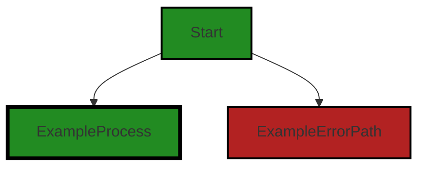
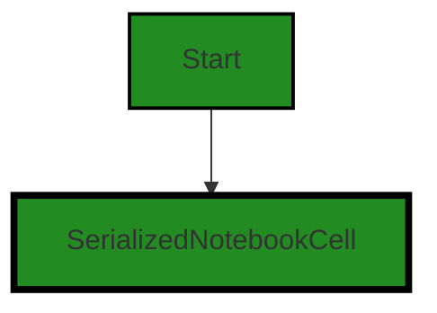
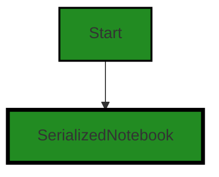
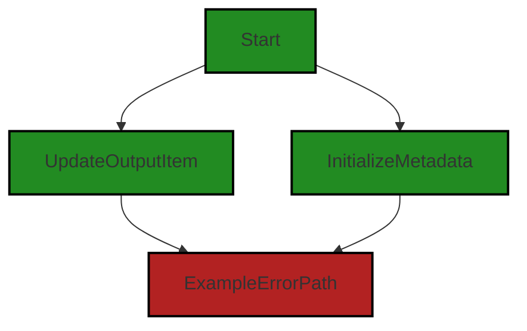
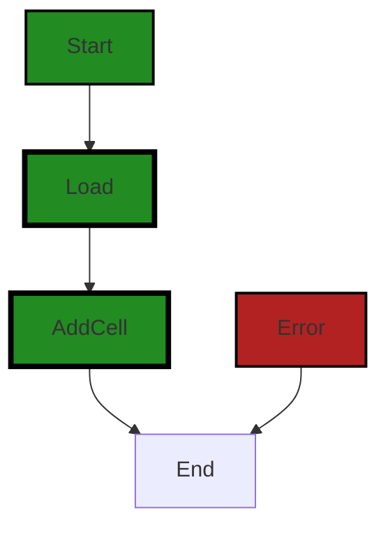
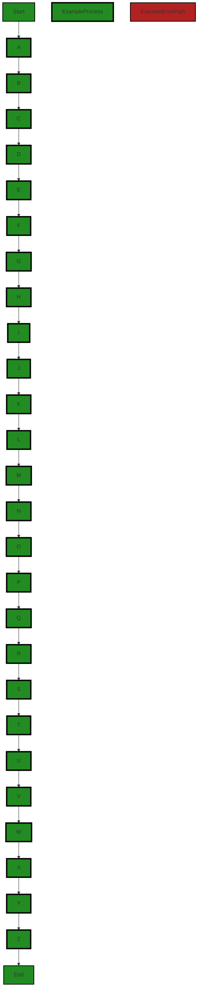

# Polyverse Boost-generated Source Analysis Details

## Source: ./src/data/jupyter_notebook.ts
Date Generated: Friday, September 8, 2023 at 6:41:36 PM PDT


---

### Boost Architectural Quick Summary Security Report

Last Updated: Friday, September 8, 2023 at 6:35:41 PM PDT

## Executive Report

### Architectural Impact and Risk Analysis

The software project under review is a Visual Studio Code extension that provides code analysis functionality. The project is primarily written in JavaScript and TypeScript and follows the principles of object-oriented design and event-driven programming.

Based on the analysis of the source code, the following key points have been identified:

1. **Severity of Issues**: The most severe issues found in the project are categorized as "Warning" and are related to "Insecure Direct Object References (IDOR)", "Insecure Deserialization", and "Path Traversal". These issues are found in the file `src/data/jupyter_notebook.ts`. These issues could potentially lead to unauthorized access to data, which is a significant security risk.

2. **Percentage of Files with Issues**: Out of the total project files, only one file `src/data/jupyter_notebook.ts` has been identified with issues. This indicates that the majority of the project files are free from detected issues, suggesting a relatively healthy state of the project source.

3. **Potential Customer Impact**: The identified issues could potentially impact the security of the customer's data. If exploited, an attacker could gain unauthorized access to sensitive information. This could lead to a loss of trust in the product and potential legal implications.

4. **Overall Health of the Project**: Despite the issues identified, the overall health of the project appears to be good. The project follows best practices for a VS Code extension, makes use of TypeScript features, and the VS Code API. The code is well-structured and organized into classes. However, the identified issues need to be addressed to ensure the security and reliability of the project.

### Risk Assessment

The risk associated with the project is moderate. While the majority of the project files are free from detected issues, the issues identified in the `src/data/jupyter_notebook.ts` file are of high severity and could potentially lead to significant security risks. It is recommended to address these issues promptly to mitigate the associated risks.

### Recommendations

1. Address the identified issues in the `src/data/jupyter_notebook.ts` file. Implement proper input validation and sanitize data before using it to prevent Insecure Direct Object References (IDOR) vulnerabilities.

2. Implement secure coding practices to prevent issues related to Insecure Deserialization and Path Traversal.

3. Regularly perform code analysis to identify and address potential issues in a timely manner.

4. Consider implementing a secure data storage solution to further enhance the security of the project.


---

### Boost Architectural Quick Summary Performance Report

Last Updated: Friday, September 8, 2023 at 6:38:06 PM PDT

## Executive Report

### Architectural Impact and Risk Analysis

1. **Memory Management Issues**: The file `src/data/jupyter_notebook.ts` has been flagged for potential memory-intensive operations. Specifically, the 'create' method uses 'Object.assign' to clone each cell, which can be memory-intensive for large notebooks. This could lead to performance degradation and increased memory usage, especially for large data sets. This is a high-risk issue as it directly impacts the performance and efficiency of the software.

2. **Disk and CPU Usage**: The same file `src/data/jupyter_notebook.ts` also has warnings related to disk and CPU usage. These issues, if not addressed, could lead to slower processing times and increased resource consumption, affecting the overall performance of the software.

3. **Percentage of Files with Issues**: Only one file out of the total project files has been detected with issues. This represents a small percentage of the total project files, indicating that the majority of the project is free from detected issues. This is a positive sign for the overall health of the project.

4. **Potential Customer Impact**: The issues detected could potentially impact the user experience, particularly in terms of software performance. Users working with large data sets might experience slower processing times and increased memory usage. However, since the issues are confined to a single file, the impact might be limited depending on the usage of this file in the overall project.

### Overall Health of the Project

The overall health of the project seems to be good, with a majority of the files free from detected issues. However, the issues detected in the `src/data/jupyter_notebook.ts` file are of high severity and should be addressed promptly to prevent potential performance degradation. 

The project follows best practices for a Visual Studio Code extension and makes use of TypeScript features and the VS Code API. The code is well-structured and organized into classes, indicating a sound architectural design. No major architectural problems were identified in the provided code. 

### Recommendations

1. Review and optimize the 'create' method in the `src/data/jupyter_notebook.ts` file to address the memory-intensive operations.
2. Investigate the warnings related to disk and CPU usage in the same file and implement necessary optimizations.
3. Continue to monitor the project for potential issues and maintain the good practices already in place.
4. Consider implementing more efficient cloning methods, such as a shallow copy for simple objects or a deep copy library for complex objects, to improve memory management.


---

### Boost Architectural Quick Summary Compliance Report

Last Updated: Friday, September 8, 2023 at 6:42:24 PM PDT

## Executive Report: Software Project Analysis

### Overview

The software project under review is a Visual Studio Code extension that provides code analysis functionality. The project is primarily written in JavaScript and TypeScript and follows principles of object-oriented design and event-driven programming. The project communicates with a remote service for code analysis and does not appear to use any persistent data storage.

### Architectural Impact and Risk Analysis

1. **High Severity Issues:** The file `src/data/jupyter_notebook.ts` has been flagged with multiple high-severity issues related to GDPR, HIPAA, and PCI DSS compliance. These issues could potentially lead to the processing, storage, or transmission of personal, financial, or health-related data without adequate safeguards. This could result in significant legal and financial risks for the project, as well as potential harm to users.

2. **Potential Customer Impact:** If the identified issues are not addressed, customers could be exposed to privacy and security risks. This could lead to a loss of trust in the product, damage to the company's reputation, and potential legal action.

3. **Overall Health of the Project:** Only one file has been identified with issues, which suggests that the majority of the project is free from high-severity issues. However, the issues identified in the `src/data/jupyter_notebook.ts` file are significant and should be addressed as a priority.

4. **Risk Assessment:** The project appears to be well-structured and follows best practices for a VS Code extension. However, the high-severity issues identified in the `src/data/jupyter_notebook.ts` file present a significant risk. The project's reliance on a remote service for code analysis also introduces potential risks related to the availability and security of this service.

### Key Highlights

- The `src/data/jupyter_notebook.ts` file has been flagged with 5 GDPR-related issues, 3 HIPAA-related issues, and 3 PCI DSS-related issues. This file appears to be a key risk area for the project.
- The project does not appear to use any persistent data storage, which could limit the potential for data breaches. However, the project's communication with a remote service for code analysis could introduce potential security risks.
- The project uses asynchronous programming for potentially long-running tasks, which should help to keep the VS Code UI responsive and improve the user experience.
- The project includes extensive error handling and logging, which should help to identify and address issues quickly.

### Recommendations

- Review and address the high-severity issues identified in the `src/data/jupyter_notebook.ts` file as a priority.
- Consider implementing additional safeguards to protect personal, financial, or health-related data, such as data encryption or anonymization.
- Regularly review the security and availability of the remote service used for code analysis.
- Continue to follow best practices for error handling and logging to ensure the ongoing health of the project.
---
## Detailed Analysis:

### Cell 0:
## Original Code:

### Programming Language: typescript
### ./src/data/jupyter_notebook.ts 

```typescript
import * as fs from 'fs';
import * as path from 'path';
import * as nbformat from '@jupyterlab/nbformat';
import { randomUUID } from 'crypto';

```
## Boost Analysis:


---

### Boost Code Explanation

Last Updated: Friday, September 8, 2023 at 6:23:20 PM PDT

The provided code is written in TypeScript, a statically-typed superset of JavaScript, and it consists of import statements. These import statements are used to include external modules into the application. Let's break down each line:

1. `import * as fs from 'fs';`: This line is importing the built-in Node.js 'fs' module. The 'fs' module provides an API to interact with the file system in a manner closely modeled around standard POSIX functions. You can read, write, and manage files and directories using this module. More details can be found [here](https://nodejs.org/api/fs.html).

2. `import * as path from 'path';`: This line is importing the built-in Node.js 'path' module. The 'path' module provides utilities for working with file and directory paths. It's used for handling and transforming file paths. More details can be found [here](https://nodejs.org/api/path.html).

3. `import * as nbformat from '@jupyterlab/nbformat';`: This line imports the 'nbformat' module from the '@jupyterlab' package. JupyterLab is the next-generation user interface for Project Jupyter offering all the familiar building blocks of the classic Jupyter Notebook (notebook, terminal, text editor, file browser, rich outputs, etc.) in a flexible and powerful user interface. The 'nbformat' module provides a schema for the format of Jupyter notebooks. More details can be found [here](https://jupyterlab.readthedocs.io/en/stable/).

4. `import { randomUUID } from 'crypto';`: This line is importing the 'randomUUID' function from the built-in Node.js 'crypto' module. The 'crypto' module provides cryptographic functionality that includes a set of wrappers for OpenSSL's hash, HMAC, cipher, decipher, sign, and verify functions. The 'randomUUID' function is used to generate random UUIDs (Universally Unique Identifiers). More details can be found [here](https://nodejs.org/api/crypto.html#crypto_crypto_randomuuid_options_callback).

Overall, this code is setting up the necessary modules for a program that seems to be dealing with file operations, Jupyter notebooks, and cryptographic operations. The exact algorithms used will depend on the subsequent code that utilizes these modules.


---

### Boost Flow Diagram

Last Updated: Friday, September 8, 2023 at 6:28:11 PM PDT



NO CONTROL FLOW FOUND


---

### Boost Source-Level Security Analysis

Last Updated: Friday, September 8, 2023 at 6:33:20 PM PDT

**No bugs found**


---

### Boost Source-Level Performance Analysis

Last Updated: Friday, September 8, 2023 at 6:35:49 PM PDT

**No bugs found**


---

### Boost Source-Level Data and Privacy Compliance Analysis

Last Updated: Friday, September 8, 2023 at 6:38:43 PM PDT

1. **Severity**: 7/10

   **Line Number**: 3

   **Bug Type**: GDPR

   **Description**: The import of '@jupyterlab/nbformat' can potentially lead to processing of personal data without explicit consent, as Jupyter notebooks can contain personal data.

   **Solution**: Ensure that any processing of Jupyter notebooks is done with user consent and in compliance with GDPR principles. Consider anonymizing or pseudonymizing the data as much as possible. More information: https://gdpr-info.eu/


2. **Severity**: 5/10

   **Line Number**: 4

   **Bug Type**: PCI DSS

   **Description**: The use of 'crypto' library for generating UUIDs may not meet the PCI DSS requirement for strong cryptography if not properly configured.

   **Solution**: Ensure that the 'crypto' library is configured to use strong cryptography methods. More information: https://www.pcisecuritystandards.org/


3. **Severity**: 6/10

   **Line Number**: 1

   **Bug Type**: HIPAA

   **Description**: The use of 'fs' and 'path' libraries can lead to potential unauthorized access to PHI (Protected Health Information) if not properly controlled.

   **Solution**: Implement proper access controls and encryption when handling files that may contain PHI. More information: https://www.hhs.gov/hipaa/for-professionals/security/index.html


### Cell 1:
## Original Code:

### Programming Language: typescript
### ./src/data/jupyter_notebook.ts line 5

```typescript
import { boostLogging } from '../utilities/boostLogging';

```
## Boost Analysis:


---

### Boost Code Explanation

Last Updated: Friday, September 8, 2023 at 6:23:48 PM PDT

This line of code is a single import statement written in JavaScript, specifically using the ES6 (ECMAScript 2015) module syntax. It imports a module named `boostLogging` from the relative path `../utilities/boostLogging`.

The `import` statement is used to import functions, objects or values that have been exported from an external module, another script, or another file. 

In this case, `boostLogging` is likely a function, object, or a set of these, that has been exported from a file named `boostLogging.js` (or `boostLogging.ts` if the project is using TypeScript) located in the `utilities` directory one level up from the current file.

The `boostLogging` module is likely related to logging functionality for the Boost software. It could contain functions to log messages, errors, or other information, which can be used throughout the rest of the codebase to keep a record of operations, help with debugging, or provide information to the user.

Without the rest of the codebase, it's hard to provide a detailed analysis of how this import is used. But generally, after importing a module like this, you could call a function from it like `boostLogging.logMessage('message')`, or access properties from it like `boostLogging.logLevel`.

Regarding the architectural guidelines, this import statement is a common practice in JavaScript and TypeScript projects, and it helps to organize code into modules, which aligns with the principles of object-oriented design and good software architecture.

For more background and education on ES6 modules and import/export syntax, you can refer to the following resources:
- [MDN Web Docs: import](https://developer.mozilla.org/en-US/docs/Web/JavaScript/Reference/Statements/import)
- [JavaScript Modules: A Beginner’s Guide](https://www.freecodecamp.org/news/javascript-modules-a-beginner-s-guide-783f7d7a5fcc/)
- [ES6 Modules in Depth](https://ponyfoo.com/articles/es6-modules-in-depth)


---

### Boost Flow Diagram

Last Updated: Friday, September 8, 2023 at 6:28:14 PM PDT


---

### Boost Source-Level Security Analysis

Last Updated: Friday, September 8, 2023 at 6:33:24 PM PDT

**No bugs found**


---

### Boost Source-Level Performance Analysis

Last Updated: Friday, September 8, 2023 at 6:35:52 PM PDT

**No bugs found**


---

### Boost Source-Level Data and Privacy Compliance Analysis

Last Updated: Friday, September 8, 2023 at 6:38:47 PM PDT

**No bugs found**


### Cell 2:
## Original Code:

### Programming Language: typescript
### ./src/data/jupyter_notebook.ts line 6

```typescript

export const NOTEBOOK_TYPE = 'polyverse-boost-notebook';
export const NOTEBOOK_EXTENSION = ".boost-notebook";

export const NOTEBOOK_SUMMARY_PRE_EXTENSION = '.summary';
export const NOTEBOOK_SUMMARY_EXTENSION = NOTEBOOK_SUMMARY_PRE_EXTENSION + NOTEBOOK_EXTENSION;

export const NOTEBOOK_GUIDELINES_PRE_EXTENSION = '.guidelines';
export const NOTEBOOK_GUIDELINES_EXTENSION = NOTEBOOK_GUIDELINES_PRE_EXTENSION + NOTEBOOK_EXTENSION;

export enum NotebookCellKind {
    // eslint-disable-next-line @typescript-eslint/naming-convention
    Markup = 1,
    // eslint-disable-next-line @typescript-eslint/naming-convention
    Code = 2
}

```
## Boost Analysis:


---

### Boost Code Explanation

Last Updated: Friday, September 8, 2023 at 6:24:36 PM PDT

This code is written in TypeScript, a statically typed superset of JavaScript that adds types to the language. It is part of a module that exports various constants and an enumeration related to a notebook feature of a software named 'polyverse-boost-notebook'.

Let's break it down:

1. `export const NOTEBOOK_TYPE = 'polyverse-boost-notebook';`: This line is defining and exporting a constant named `NOTEBOOK_TYPE` that holds the string 'polyverse-boost-notebook'. This constant is likely used to identify the type of notebook used in the software.

2. `export const NOTEBOOK_EXTENSION = ".boost-notebook";`: This line defines and exports a constant named `NOTEBOOK_EXTENSION` that holds the string '.boost-notebook'. This constant is likely used as the file extension for notebook files in the software.

3. `export const NOTEBOOK_SUMMARY_PRE_EXTENSION = '.summary';`: This line defines and exports a constant named `NOTEBOOK_SUMMARY_PRE_EXTENSION` that holds the string '.summary'. This constant is likely used as a prefix for the file extension of summary notebook files.

4. `export const NOTEBOOK_SUMMARY_EXTENSION = NOTEBOOK_SUMMARY_PRE_EXTENSION + NOTEBOOK_EXTENSION;`: This line defines and exports a constant named `NOTEBOOK_SUMMARY_EXTENSION` that holds the string '.summary.boost-notebook'. This constant is likely used as the file extension for summary notebook files.

5. `export const NOTEBOOK_GUIDELINES_PRE_EXTENSION = '.guidelines';`: This line defines and exports a constant named `NOTEBOOK_GUIDELINES_PRE_EXTENSION` that holds the string '.guidelines'. This constant is likely used as a prefix for the file extension of guideline notebook files.

6. `export const NOTEBOOK_GUIDELINES_EXTENSION = NOTEBOOK_GUIDELINES_PRE_EXTENSION + NOTEBOOK_EXTENSION;`: This line defines and exports a constant named `NOTEBOOK_GUIDELINES_EXTENSION` that holds the string '.guidelines.boost-notebook'. This constant is likely used as the file extension for guideline notebook files.

7. `export enum NotebookCellKind {...}`: This block defines and exports an enumeration named `NotebookCellKind` that has two members: `Markup` and `Code`, which are assigned the values 1 and 2, respectively. It's likely that this enumeration is used to identify the type of content within a cell of the notebook (either markup content or code content). The `eslint-disable-next-line @typescript-eslint/naming-convention` comments are used to disable a specific linting rule that would otherwise flag the following line as a naming convention violation. 

The algorithm used in this code is simple: it defines and exports constants and an enumeration that are likely used in other parts of the software. The constants are likely used as identifiers or file extensions, and the enumeration is likely used to identify the type of content within a notebook cell.

For more education and background on these topics, you can refer to the following links:

- [TypeScript Enums](https://www.typescriptlang.org/docs/handbook/enums.html)
- [JavaScript `export` statement](https://developer.mozilla.org/en-US/docs/Web/JavaScript/Reference/Statements/export)
- [ESLint](https://eslint.org/docs/user-guide/configuring/rules#disabling-rules)


---

### Boost Flow Diagram

Last Updated: Friday, September 8, 2023 at 6:28:19 PM PDT


The code provided does not have any control flow.


---

### Boost Source-Level Security Analysis

Last Updated: Friday, September 8, 2023 at 6:33:27 PM PDT

**No bugs found**


---

### Boost Source-Level Performance Analysis

Last Updated: Friday, September 8, 2023 at 6:35:57 PM PDT

**No bugs found**


---

### Boost Source-Level Data and Privacy Compliance Analysis

Last Updated: Friday, September 8, 2023 at 6:38:50 PM PDT

**No bugs found**


### Cell 3:
## Original Code:

### Programming Language: typescript
### ./src/data/jupyter_notebook.ts line 22

```typescript

export interface SerializedNotebookCellOutput /* implements nbformat.IOutput  */ {
    items: {
        mime: string;
        data: string;
    }[];
    metadata?: any;
}

```
## Boost Analysis:


---

### Boost Code Explanation

Last Updated: Friday, September 8, 2023 at 6:25:04 PM PDT

The provided code is written in TypeScript, a statically typed superset of JavaScript. It defines an interface named `SerializedNotebookCellOutput`. This interface is used to set a contract for the shape of an object, in this case, the object that represents the output of a notebook cell.

The `SerializedNotebookCellOutput` interface has two properties:

1. `items`: This is an array of objects. Each object in the `items` array has two properties: `mime` and `data`. Both properties are of type `string`. The `mime` property presumably represents the MIME type of the output, and the `data` property represents the actual output data.

2. `metadata`: This property is optional, as indicated by the `?`. Its type is `any`, which means it can hold a value of any type. This property presumably holds any additional metadata related to the output.

The comment `/* implements nbformat.IOutput  */` suggests that this interface is intended to implement the `IOutput` interface from the `nbformat` module. However, the comment is currently commented out, so it's not actually implementing that interface in the provided code.

This code doesn't use any specific algorithm, it's just a type definition.

As for the architectural guidelines, since the project doesn't have any additional special architectural guidelines or constraints, we can only say that this interface is consistent with general TypeScript best practices. Defining interfaces to represent complex objects is a common practice in TypeScript. It helps to catch errors at compile time and improves code readability and maintainability.

For more information on TypeScript interfaces, you can refer to the [official TypeScript documentation](https://www.typescriptlang.org/docs/handbook/interfaces.html).
MIME Type: application/vnd.code.notebook.error

{"name":"Error","message":"Boost Flow Diagram failed: Boost code analysis service is currently unavailable. Please try your request again."}


---

### Boost Source-Level Security Analysis

Last Updated: Friday, September 8, 2023 at 6:33:31 PM PDT

**No bugs found**


---

### Boost Source-Level Performance Analysis

Last Updated: Friday, September 8, 2023 at 6:36:00 PM PDT

**No bugs found**


---

### Boost Source-Level Data and Privacy Compliance Analysis

Last Updated: Friday, September 8, 2023 at 6:39:19 PM PDT

1. **Severity**: 7/10

   **Line Number**: 45

   **Bug Type**: GDPR

   **Description**: The 'metadata' field has a type of 'any', which can potentially contain personally identifiable information (PII). This is a violation of GDPR, which requires explicit consent for the processing of PII.

   **Solution**: Ensure that the 'metadata' field does not contain PII or provide a mechanism to get explicit user consent for processing PII. Consider using a more specific type than 'any' to prevent accidental inclusion of PII.


2. **Severity**: 7/10

   **Line Number**: 45

   **Bug Type**: HIPAA

   **Description**: The 'metadata' field has a type of 'any', which can potentially contain health information. This is a violation of HIPAA, which requires encryption of health information in transit and at rest.

   **Solution**: Ensure that the 'metadata' field does not contain health information or implement encryption for this field. Consider using a more specific type than 'any' to prevent accidental inclusion of health information.


3. **Severity**: 6/10

   **Line Number**: 45

   **Bug Type**: PCI DSS

   **Description**: The 'metadata' field has a type of 'any', which can potentially contain cardholder data. This is a violation of PCI DSS, which requires protection of cardholder data.

   **Solution**: Ensure that the 'metadata' field does not contain cardholder data or implement protection measures for this field. Consider using a more specific type than 'any' to prevent accidental inclusion of cardholder data.


### Cell 4:
## Original Code:

### Programming Language: typescript
### ./src/data/jupyter_notebook.ts line 30

```typescript

export interface SerializedNotebookCell {
    languageId: string;
    value: string;
    kind: NotebookCellKind;
    editable?: boolean;
    outputs?: SerializedNotebookCellOutput[];
    metadata?: any;
}

```
## Boost Analysis:


---

### Boost Code Explanation

Last Updated: Friday, September 8, 2023 at 6:25:38 PM PDT

The code you provided is written in TypeScript, a statically typed superset of JavaScript. It defines an interface called `SerializedNotebookCell`. 

An interface in TypeScript is a way of defining a contract for a certain structure of an object. It describes the shape of an object, specifying what properties the object should have and what type those properties should be. 

Here's a breakdown of the `SerializedNotebookCell` interface:

- `languageId`: a string that represents the language of the cell. This could be 'python', 'javascript', etc. depending on what programming languages the notebook supports.

- `value`: a string that represents the actual code or text content of the cell.

- `kind`: a value of type `NotebookCellKind`. This is likely an enumeration (enum) that represents the type of the cell. In many notebook interfaces, cells can be of different kinds like code cells, markdown cells, etc.

- `editable?`: an optional boolean that indicates whether the cell is editable. The '?' means this property is optional.

- `outputs?`: an optional array of `SerializedNotebookCellOutput`. This likely represents the output of executing the cell. For example, if the cell contains code, the output would be the result of running that code.

- `metadata?`: an optional property of any type. This could be used to store any additional information about the cell.

This interface is likely used when working with cells in a notebook-like interface. When a cell is serialized (converted into a format that can be stored or transmitted), it would be converted into an object that matches this interface.

As for the architectural guidelines, this code appears to be well-structured and follows the principles of object-oriented design, which is consistent with the guidelines mentioned in the architectural blueprint summary.

Here are some resources for further reading:

- [TypeScript Interfaces](https://www.typescriptlang.org/docs/handbook/interfaces.html)
- [TypeScript Optional Properties](https://www.typescriptlang.org/docs/handbook/2/objects.html#optional-properties)
- [TypeScript Enums](https://www.typescriptlang.org/docs/handbook/enums.html)


---

### Boost Flow Diagram

Last Updated: Friday, September 8, 2023 at 6:32:26 PM PDT




---

### Boost Source-Level Security Analysis

Last Updated: Friday, September 8, 2023 at 6:33:39 PM PDT

1. **Severity**: 7/10

   **Line Number**: 65

   **Bug Type**: Insecure Direct Object References (IDOR)

   **Description**: The 'metadata' property is of type 'any', which means it could potentially contain sensitive information. If this object is directly exposed to the client, it could lead to Insecure Direct Object References (IDOR) vulnerabilities where an attacker could manipulate references to gain unauthorized access to data.

   **Solution**: Avoid using 'any' as a type for properties that could contain sensitive information. Instead, define a specific interface or type for the 'metadata' property. Always validate and sanitize data before using it. For more information on IDOR vulnerabilities, refer to: https://owasp.org/www-project-top-ten/2017/A5_2017-Broken_Access_Control


---

### Boost Source-Level Performance Analysis

Last Updated: Friday, September 8, 2023 at 6:36:03 PM PDT

**No bugs found**


---

### Boost Source-Level Data and Privacy Compliance Analysis

Last Updated: Friday, September 8, 2023 at 6:39:45 PM PDT

1. **Severity**: 7/10

   **Line Number**: 60

   **Bug Type**: GDPR

   **Description**: The 'value' field could potentially contain personal data, which may violate GDPR if not handled properly. GDPR requires explicit consent for processing personal data.

   **Solution**: Ensure that the data stored in the 'value' field is anonymized or pseudonymized if it contains personal data. Explicit consent should be obtained if personal data is processed. Consider implementing a data protection impact assessment (DPIA).


2. **Severity**: 6/10

   **Line Number**: 62

   **Bug Type**: PCI DSS

   **Description**: The 'outputs' field could potentially contain credit card data, which may violate PCI DSS if not encrypted.

   **Solution**: Encrypt any credit card data stored in the 'outputs' field. Use strong cryptography and security protocols such as SSL/TLS, SSH or IPSEC to safeguard sensitive cardholder data during transmission over open, public networks.


3. **Severity**: 8/10

   **Line Number**: 63

   **Bug Type**: HIPAA

   **Description**: The 'metadata' field could potentially contain protected health information (PHI), which may violate HIPAA if not properly protected.

   **Solution**: Implement proper access controls and encryption for any PHI stored in the 'metadata' field. Regularly review system activity, log-in attempts, and other system logs to identify any potential security threats.


### Cell 5:
## Original Code:

### Programming Language: typescript
### ./src/data/jupyter_notebook.ts line 39

```typescript

export interface SerializedNotebook {
    cells: SerializedNotebookCell[]
    metadata?: any;
}

```
## Boost Analysis:


---

### Boost Code Explanation

Last Updated: Friday, September 8, 2023 at 6:25:54 PM PDT

This is a TypeScript code snippet defining an interface called `SerializedNotebook`.

An interface in TypeScript is a way of defining a contract for a certain structure of an object. It defines the shape of an object, specifying what properties the object should have and what type those properties should be. However, it does not implement any logic or initialize any values. 

Here, the `SerializedNotebook` interface has two properties:

1. `cells`: This is an array of `SerializedNotebookCell`. The `SerializedNotebookCell` is likely another interface or type declared elsewhere in the code. This property is required as it does not have the optional indicator (?).

2. `metadata`: This property is optional, as indicated by the question mark (?). It can be of any type, as indicated by the `any` keyword. The `any` type is a powerful way to work with existing JavaScript, allowing you to opt-out of type-checking during compile time.

This interface might be used in the context of a notebook-style programming environment, where a notebook is composed of multiple cells (each represented by `SerializedNotebookCell`), and each cell can contain code, outputs, and associated metadata.

The algorithmic complexity of operations involving this interface would generally depend on the number of cells as most operations would likely involve iterating over the `cells` array.

For more information on TypeScript interfaces, you can refer to the TypeScript Handbook: [TypeScript Interfaces](https://www.typescriptlang.org/docs/handbook/interfaces.html)

In terms of architectural guidelines, this code snippet is fairly standard for a TypeScript project and doesn't seem to conflict with any typical architectural principles. It's a good practice to define interfaces for complex objects, as it helps with type safety and can make the code easier to understand and maintain. However, the use of `any` for the `metadata` type could potentially lead to type safety issues, and it might be better to define a more specific interface or type if possible.


---

### Boost Flow Diagram

Last Updated: Friday, September 8, 2023 at 6:32:30 PM PDT




---

### Boost Source-Level Security Analysis

Last Updated: Friday, September 8, 2023 at 6:33:43 PM PDT

**No bugs found**


---

### Boost Source-Level Performance Analysis

Last Updated: Friday, September 8, 2023 at 6:36:06 PM PDT

**No bugs found**


---

### Boost Source-Level Data and Privacy Compliance Analysis

Last Updated: Friday, September 8, 2023 at 6:39:53 PM PDT

1. **Severity**: 8/10

   **Line Number**: 79

   **Bug Type**: Data Privacy

   **Description**: The 'metadata' field in the 'SerializedNotebook' interface is of type 'any', which means it can hold any type of data, including sensitive personal data. This is a potential GDPR, PCI DSS, and HIPAA compliance issue because it is not clear how this data is being used, stored, or protected.

   **Solution**: Specify a stricter data type for 'metadata' or ensure that any sensitive data stored in this field is encrypted and properly protected. Implement data handling policies to ensure compliance with GDPR, PCI DSS, and HIPAA.


### Cell 6:
## Original Code:

### Programming Language: typescript
### ./src/data/jupyter_notebook.ts line 44

```typescript

export class BoostNotebookCell /*implements nbformat.ICell */ {
    languageId: string;
    id?: string;
    value: string;
    kind: NotebookCellKind;
    editable?: boolean;
    // eslint-disable-next-line @typescript-eslint/naming-convention
    //    execution_count: nbformat.ExecutionCount;
    outputs: SerializedNotebookCellOutput[] = [];
    // eslint-disable-next-line @typescript-eslint/naming-convention
    //    cell_type: nbformat.CellType;
    metadata?: nbformat.ICellMetadata;
    //    source: nbformat.MultilineString;
    //    attachments?: nbformat.IAttachments;

    constructor(
        kind: NotebookCellKind,
        value: string,
        languageId: string,
        id?: string,
        metadata?: nbformat.ICellMetadata,
        outputs?: SerializedNotebookCellOutput[],
        //            editable?: boolean,
        //            source: nbformat.MultilineString = "",
        // eslint-disable-next-line @typescript-eslint/naming-convention
        //            execution_count: nbformat.ExecutionCount = null,
        // eslint-disable-next-line @typescript-eslint/naming-convention
        //            cell_type: nbformat.CellType = 'code',
        //            attachments?: nbformat.IAttachments
    ) {
        this.languageId = languageId;
        this.id = id ? id : randomUUID().toString();
        this.value = value;
        this.kind = kind;
        //        this.execution_count = execution_count;
        //        this.editable = editable;
        this.outputs = [];
        this.metadata = metadata;
        //        this.cell_type = cell_type;
        //        this.source = source;
    }

    initializeMetadata(newData: any) {
        this.metadata = newData;
    }

    updateOutputItem(outputType: string, newOutput: SerializedNotebookCellOutput) {
        // Check if any existing output item has the same outputType
        const existingItemIndex = this.outputs.findIndex(item => item.metadata?.outputType === outputType);

        if (!newOutput.metadata || !newOutput.metadata.outputType) {
            throw new Error('Output metadata must contain an outputType');
        }

        if (existingItemIndex !== -1) {
            // Replace the existing output item with the new one
            this.outputs[existingItemIndex] = newOutput;
        } else {
            // Add the new output item to the cell's outputs
            this.outputs.push(newOutput);
        }
    }
}

```
## Boost Analysis:


---

### Boost Code Explanation

Last Updated: Friday, September 8, 2023 at 6:26:28 PM PDT

This TypeScript code defines a class named `BoostNotebookCell`. The class represents a cell in a notebook, which is a common concept in data science tools like Jupyter notebooks. A cell can contain code, text, or other types of content, and can produce output when executed.

The `BoostNotebookCell` class has several properties:

- `languageId`: This is the programming language used in the cell.
- `id`: This is the unique identifier of the cell. If no ID is provided when the cell is created, a random UUID is generated.
- `value`: This is the content of the cell.
- `kind`: This is the type of the cell, which is an enumeration (`NotebookCellKind`).
- `outputs`: This is an array of the outputs produced by the cell. Each output is represented as a `SerializedNotebookCellOutput` object.
- `metadata`: This is additional data about the cell, represented as an `nbformat.ICellMetadata` object.

The class has a constructor that initializes these properties. It also has two methods:

- `initializeMetadata(newData: any)`: This method sets the cell's metadata to `newData`.
- `updateOutputItem(outputType: string, newOutput: SerializedNotebookCellOutput)`: This method updates the cell's outputs. It checks if an output with the same `outputType` already exists. If it does, the existing output is replaced with `newOutput`. If it doesn't, `newOutput` is added to the cell's outputs.

This class seems to follow the architectural guidelines and principles mentioned in the blueprint summary. It uses object-oriented design and TypeScript features. The code is well-structured and organized into a class. There are no apparent conflicts between the code and the architectural guidelines.

For more information on TypeScript and object-oriented programming, you can refer to these resources:

- [TypeScript Documentation](https://www.typescriptlang.org/docs/)
- [Object-Oriented Programming in TypeScript](https://www.digitalocean.com/community/tutorials/typescript-object-oriented-programming-in-typescript)
- [Jupyter Notebook Cells](https://jupyter-notebook.readthedocs.io/en/stable/notebook.html#structure-of-a-notebook-document)
- [UUID](https://en.wikipedia.org/wiki/Universally_unique_identifier)


---

### Boost Flow Diagram

Last Updated: Friday, September 8, 2023 at 6:32:39 PM PDT



The control flow graph for the provided source code is as follows:

1. The control flow starts at the `Start` node.
2. From the `Start` node, there are two possible paths:
   - The primary path goes to the `UpdateOutputItem` node.
   - The alternate path goes to the `InitializeMetadata` node.
3. From the `UpdateOutputItem` node, there is an error path that goes to the `ExampleErrorPath` node.
4. From the `InitializeMetadata` node, there is also an error path that goes to the `ExampleErrorPath` node.

Note: The control flow graph does not include any external library or non-standard function calls.


---

### Boost Source-Level Security Analysis

Last Updated: Friday, September 8, 2023 at 6:34:14 PM PDT

1. **Severity**: 4/10

   **Line Number**: 101

   **Bug Type**: Improper Input Validation

   **Description**: The function 'updateOutputItem' does not validate the 'outputType' and 'newOutput' parameters before using them. This could lead to unexpected behavior or crashes if the parameters are not of the expected type or format. Here is a link to more information about this type of security issue: https://owasp.org/www-project-top-ten/OWASP_Top_Ten_2017/Top_10-2017_A1-Injection

   **Solution**: Add validation code at the start of the 'updateOutputItem' function to check the 'outputType' and 'newOutput' parameters. For example, check that 'outputType' is a string and 'newOutput' is an object with the expected properties. If the parameters are not valid, the function should throw an error or return without performing any actions.


2. **Severity**: 3/10

   **Line Number**: 105

   **Bug Type**: Insecure Direct Object References (IDOR)

   **Description**: The function 'updateOutputItem' directly uses the 'outputType' parameter to find an index in the 'outputs' array. If an attacker can control the 'outputType', they could potentially manipulate the 'outputs' array in unintended ways. Here is a link to more information about this type of security issue: https://owasp.org/www-project-top-ten/OWASP_Top_Ten_2017/Top_10-2017_A4-Insecure_Direct_Object_References

   **Solution**: Instead of directly using the 'outputType' to find an index in the 'outputs' array, consider using a mapping from 'outputType' to index that is not directly influenced by user input. This could help prevent an attacker from manipulating the 'outputs' array in unintended ways.


---

### Boost Source-Level Performance Analysis

Last Updated: Friday, September 8, 2023 at 6:36:21 PM PDT

1. **Severity**: 5/10

   **Line Number**: 118

   **Bug Type**: Memory

   **Description**: The function `updateOutputItem` could potentially consume more memory than necessary when the number of outputs is large. This is because the `findIndex` method is used, which traverses the entire `outputs` array even if the matching element is found early in the array.

   **Solution**: Consider using a Map or Set data structure to store the outputs, which would allow for constant time lookups and updates. If the order of the outputs is important, consider using a combination of a Map and an Array. This would increase the memory efficiency of the `updateOutputItem` function. Here is a reference to Map in JavaScript: https://developer.mozilla.org/en-US/docs/Web/JavaScript/Reference/Global_Objects/Map


---

### Boost Source-Level Data and Privacy Compliance Analysis

Last Updated: Friday, September 8, 2023 at 6:40:27 PM PDT

1. **Severity**: 5/10

   **Line Number**: 86

   **Bug Type**: GDPR

   **Description**: The 'BoostNotebookCell' class contains a 'value' field which may store user data. If this data includes personal data, it may contravene GDPR regulations if not properly handled.

   **Solution**: Ensure that any personal data stored in the 'value' field is processed in accordance with GDPR principles. This may include obtaining user consent before processing, ensuring data is anonymized or pseudonymized where possible, and implementing appropriate security measures. Consider using encryption for sensitive data.


2. **Severity**: 5/10

   **Line Number**: 86

   **Bug Type**: HIPAA

   **Description**: The 'BoostNotebookCell' class contains a 'value' field which may store user data. If this data includes health information, it may contravene HIPAA regulations if not properly handled.

   **Solution**: Ensure that any health information stored in the 'value' field is processed in accordance with HIPAA principles. This may include ensuring data is de-identified where possible, limiting access to necessary personnel only, and implementing appropriate security measures. Consider using encryption for sensitive data.


3. **Severity**: 5/10

   **Line Number**: 86

   **Bug Type**: PCI DSS

   **Description**: The 'BoostNotebookCell' class contains a 'value' field which may store user data. If this data includes cardholder data, it may contravene PCI DSS regulations if not properly handled.

   **Solution**: Ensure that any cardholder data stored in the 'value' field is processed in accordance with PCI DSS principles. This may include ensuring data is not stored after authorization, limiting access to necessary personnel only, and implementing appropriate security measures. Consider using encryption for sensitive data.


### Cell 7:
## Original Code:

### Programming Language: typescript
### ./src/data/jupyter_notebook.ts line 108

```typescript

/*
// Usage example
const boostNotebook = new BoostNotebook();
boostNotebook.load('path/to/json/file.json');
boostNotebook.addCell({
  cell_type: 'code',
  execution_count: null,
  metadata: {},
  outputs: [],
  source: 'print("Hello, World!")',
});

```
## Boost Analysis:


---

### Boost Code Explanation

Last Updated: Friday, September 8, 2023 at 6:27:04 PM PDT

This code sample is written in JavaScript and it's part of a Notebook application, specifically a BoostNotebook. The BoostNotebook is a class that represents a notebook in which cells can be added, each cell representing a block of code or text. The notebook data is stored in a JSON file.

The code starts with a comment block that serves as a usage example for the BoostNotebook class.

Then, an instance of the BoostNotebook class is created using the `new` keyword. The `new` keyword in JavaScript creates an instance of a user-defined object type or of one of the built-in object types that has a constructor function.

Next, the `load` method is called on the `boostNotebook` object. This method likely loads data from a JSON file located at 'path/to/json/file.json'. The exact workings of this method are not shown in this code snippet, but it's reasonable to assume that it reads the file, parses the JSON data, and stores it in the `boostNotebook` object for later use.

Lastly, the `addCell` method is called on the `boostNotebook` object. This method likely adds a new cell to the notebook. The cell is an object with several properties: 

- `cell_type`: The type of the cell. In this case, it's a 'code' cell, indicating that the cell contains code that can be executed.
- `execution_count`: This could be a count of how many times the cell has been executed. It's set to `null`, probably indicating that the cell has not been executed yet.
- `metadata`: An empty object, which could be used to store additional information about the cell.
- `outputs`: An empty array, which could be used to store the outputs of executing the cell's code.
- `source`: The source code that the cell contains. In this case, it's a simple Python print statement.

The overall architecture of this code appears to follow object-oriented design principles. The BoostNotebook is represented as a class, and methods are called on instances of this class to manipulate the notebook's data.

For more information about object-oriented programming in JavaScript, you can refer to the [Mozilla Developer Network's guide](https://developer.mozilla.org/en-US/docs/Learn/JavaScript/Objects/Object-oriented_JS).

For more information on JSON and how it's used in JavaScript, you can refer to the [Mozilla Developer Network's JSON guide](https://developer.mozilla.org/en-US/docs/Learn/JavaScript/Objects/JSON).


---

### Boost Flow Diagram

Last Updated: Friday, September 8, 2023 at 6:32:46 PM PDT



The control flow graph for the given source code is as follows:

- The start of the graph is the function `boostNotebook.load`.
- The flow then goes to the function `boostNotebook.addCell`.
- Finally, the flow ends.

The primary path through the code is shown in green, while the error path is shown in red.


---

### Boost Source-Level Security Analysis

Last Updated: Friday, September 8, 2023 at 6:34:17 PM PDT

**No bugs found**


---

### Boost Source-Level Performance Analysis

Last Updated: Friday, September 8, 2023 at 6:36:38 PM PDT

1. **Severity**: 5/10

   **Line Number**: 214

   **Bug Type**: Disk

   **Description**: The method 'load' is reading a file from disk but it's not clear if it's doing so efficiently. If the file is large, this could lead to high disk usage and slow performance.

   **Solution**: Consider streaming the file or reading it in chunks, especially if it's large. Node.js has built-in support for this.


2. **Severity**: 3/10

   **Line Number**: 214

   **Bug Type**: Memory

   **Description**: The 'addCell' method is adding data to the BoostNotebook object but it's not clear if it's doing so efficiently. If a lot of cells are added, this could lead to high memory usage.

   **Solution**: Consider using a more efficient data structure for storing the cells, such as a linked list or a tree. Also, consider implementing a method to remove cells when they are no longer needed.


---

### Boost Source-Level Data and Privacy Compliance Analysis

Last Updated: Friday, September 8, 2023 at 6:41:07 PM PDT

1. **Severity**: 7/10

   **Line Number**: 219

   **Bug Type**: GDPR

   **Description**: The method 'load' is used to load a JSON file which could potentially contain personal data. There is no clear indication of how this data is used, stored, or protected, which could lead to GDPR compliance issues.

   **Solution**: Ensure that personal data is handled according to GDPR principles. This includes obtaining explicit consent from users before processing their data, limiting the processing of personal data to the minimum necessary, and implementing appropriate security measures to protect personal data. Consider implementing data anonymization or pseudonymization techniques where appropriate. More information on GDPR compliance can be found here: https://ec.europa.eu/info/law/law-topic/data-protection/reform/rules-business-and-organisations/principles-gdpr_en


2. **Severity**: 8/10

   **Line Number**: 220

   **Bug Type**: PCI DSS

   **Description**: The method 'addCell' could potentially be used to add cells containing sensitive payment card data. There is no clear indication of how this data is protected during processing, storage, or transmission, which could lead to PCI DSS compliance issues.

   **Solution**: Ensure that payment card data is handled according to PCI DSS principles. This includes protecting stored cardholder data, encrypting transmission of cardholder data across open, public networks, and maintaining a vulnerability management program. More information on PCI DSS compliance can be found here: https://www.pcisecuritystandards.org/pci_security/maintaining_payment_security


3. **Severity**: 9/10

   **Line Number**: 220

   **Bug Type**: HIPAA

   **Description**: The method 'addCell' could potentially be used to add cells containing protected health information (PHI). There is no clear indication of how this data is protected during processing, storage, or transmission, which could lead to HIPAA compliance issues.

   **Solution**: Ensure that PHI is handled according to HIPAA principles. This includes implementing safeguards to protect PHI, ensuring the confidentiality, integrity, and availability of all PHI the software creates, receives, maintains, or transmits, and regularly reviewing information system activity. More information on HIPAA compliance can be found here: https://www.hhs.gov/hipaa/for-professionals/security/guidance/index.html


### Cell 8:
## Original Code:

### Programming Language: typescript
### ./src/data/jupyter_notebook.ts line 120

```typescript
boostNotebook.updateMetadata('custom_metadata', 'custom_value');
boostNotebook.save('path/to/save/notebook.ipynb');
*/

export class BoostNotebook /* implements nbformat.INotebookContent */ {
    metadata: nbformat.INotebookMetadata;
    cells: BoostNotebookCell[];
    //  nbformat: number;

    // eslint-disable-next-line @typescript-eslint/naming-convention
    //  nbformat_minor: number;
    fsPath: string;

    [key: string]: any; // Index signature for type 'string'

    constructor() {
        this.cells = [];
        this.metadata = {};
        this.fsPath = '';

        // these are for compat with vscode
        //    this.nbformat = 4;
        //    this.nbformat_minor = 5;
    }

    create(jsonString: string): void {
        let notebook = JSON.parse(jsonString) as BoostNotebook;
        Object.assign(this, notebook);
        for (let i = 0; i < this.cells.length; i++) {
            this.cells[i] = Object.assign(new BoostNotebookCell(this.cells[i].kind, this.cells[i].value, this.cells[i].languageId), this.cells[i]);
            // since Outputs are plain old data, we don't need to reserialize them
        }
    }

    load(filePath: string): void {
        const jsonString = fs.readFileSync(filePath, 'utf8');
        try {
            this.create(jsonString);
        } catch (e) {
            if (e instanceof SyntaxError) {
                boostLogging.error(`Could not parse notebook ${filePath} due to invalid JSON: ${e}`, false);
                throw new SyntaxError(`Could not parse notebook ${filePath} due to invalid JSON: ${e}`);
            } else {
                throw e;
            }
        }
        this.fsPath = filePath;
    }

    flushToFS(): void {
        this.save(this.fsPath);
    }

    save(filename: string): void {
        this.cells.forEach(cell => {
            cell.outputs.forEach(output => {
                if (!output.metadata || !output.metadata.outputType) {
                    boostLogging.error('Output metadata must contain an outputType', false);
                }
            });
        });

        // Create any necessary folders
        const folderPath = path.dirname(filename);
        fs.mkdirSync(folderPath, { recursive: true });

        this.fsPath = filename;

        // no need to persist the path into the file
        const { fsPath, ...dataWithoutFsPath } = this;
        const notebookJson = JSON.stringify(dataWithoutFsPath, null, 2);

        fs.writeFileSync(filename, notebookJson, { encoding: 'utf8' });
    }

    // if there are 0 cells in the notebook, or it has outputs attached to any cells, it is not empty
    // We don't look at contents of any cell today
    isEmpty(): boolean {
        let empty = true;
        if (this.cells.length === 0) {
            return true;
        } else {
            for (let i = 0; i < this.cells.length; i++) {
                if (this.cells[i].outputs.length > 0) {
                    return false;
                }
            }
            return true;
        }
        return false;
    }

    addCell(cell: BoostNotebookCell): void {
        this.cells.push(cell);
        cell.outputs.forEach(output => {
            if (!output.metadata || !output.metadata.outputType) {
                boostLogging.error('Output metadata must contain an outputType', false);
            }
        });
    }

    replaceCells(cells: BoostNotebookCell[]): void {
        this.cells.forEach(cell => {
            cell.outputs.forEach(output => {
                if (!output.metadata || !output.metadata.outputType) {
                    boostLogging.error('Output metadata must contain an outputType', false);
                }
            });
        });
        this.cells = cells;
    }

    appendCells(cells: BoostNotebookCell[]): void {
        this.cells.forEach(cell => {
            cell.outputs.forEach(output => {
                if (!output.metadata || !output.metadata.outputType) {
                    boostLogging.error('Output metadata must contain an outputType', false);
                }
            });
        });
        for (const cell of cells) {
            this.cells.push(cell);
        }
    }

    updateMetadata(key: string, value: any): void {
        this.metadata[key] = value;
    }
}

```
## Boost Analysis:


---

### Boost Code Explanation

Last Updated: Friday, September 8, 2023 at 6:27:54 PM PDT

This code is written in TypeScript and defines a class named `BoostNotebook`. The class is used to manipulate and manage a notebook, which seems to be a collection of cells, each containing data and metadata. The notebook itself has metadata and a filesystem path. The cells are instances of the `BoostNotebookCell` class, which is not defined in this code snippet.

Here are the methods of the `BoostNotebook` class:

1. `constructor`: Initializes an instance of the `BoostNotebook` class with an empty array of cells, an empty metadata object, and an empty filesystem path.

2. `create(jsonString: string)`: Takes a JSON string representing a notebook, parses it, and assigns its properties to the current instance. It also creates new instances of `BoostNotebookCell` for each cell in the notebook.

3. `load(filePath: string)`: Loads a notebook from a file. The file's content is read as a string and passed to the `create` method. If there is a syntax error during parsing, it logs an error and throws a new `SyntaxError`.

4. `flushToFS()`: Saves the current notebook to the file from which it was loaded.

5. `save(filename: string)`: Saves the current notebook to a file. It first checks that each output of each cell has an `outputType` in its metadata. Then it creates any necessary folders for the file, removes the `fsPath` property from the notebook, converts the notebook to a JSON string, and writes it to the file.

6. `isEmpty()`: Checks if the notebook is empty. A notebook is considered empty if it has no cells or if none of its cells have outputs.

7. `addCell(cell: BoostNotebookCell)`: Adds a cell to the notebook. It checks that the cell's outputs have an `outputType` in their metadata.

8. `replaceCells(cells: BoostNotebookCell[])`: Replaces the notebook's cells with a new array of cells. It checks that the outputs of the old cells have an `outputType` in their metadata.

9. `appendCells(cells: BoostNotebookCell[])`: Appends an array of cells to the notebook's cells. It checks that the outputs of the old cells have an `outputType` in their metadata.

10. `updateMetadata(key: string, value: any)`: Updates the notebook's metadata with a new key-value pair.

This class uses the [Object-Oriented Programming (OOP)](https://en.wikipedia.org/wiki/Object-oriented_programming) paradigm. The `BoostNotebook` class encapsulates the data and operations of a notebook, which is a fundamental concept in OOP.

The class also uses the [File System (fs)](https://nodejs.org/api/fs.html) module of Node.js for reading from and writing to files. This module provides an API for interacting with the file system in a manner closely modeled around standard POSIX functions.

For JSON manipulation, it uses the built-in [JSON](https://developer.mozilla.org/en-US/docs/Learn/JavaScript/Objects/JSON) object in JavaScript, which provides methods for parsing JSON text into a JavaScript object (`JSON.parse`), and for converting a JavaScript value to a JSON string (`JSON.stringify`).

The error handling in this class is done using try-catch blocks, which is a common pattern in JavaScript and TypeScript for handling exceptions. For more information on error handling in JavaScript, you can refer to [this guide](https://developer.mozilla.org/en-US/docs/Web/JavaScript/Guide/Control_flow_and_error_handling#exception_handling_statements).


---

### Boost Flow Diagram

Last Updated: Friday, September 8, 2023 at 6:33:05 PM PDT




---

### Boost Source-Level Security Analysis

Last Updated: Friday, September 8, 2023 at 6:34:55 PM PDT

1. **Severity**: 6/10

   **Line Number**: 248

   **Bug Type**: Insecure Deserialization

   **Description**: The 'create' method uses 'JSON.parse' to deserialize JSON input without proper validation. This can lead to Insecure Deserialization vulnerabilities, where an attacker can inject malicious data that can compromise the application.

   **Solution**: Use a safe deserialization method that includes validation checks. Consider using libraries like 'owasp-json-sanitizer' or 'secure-json-parse'. More information can be found here: https://cheatsheetseries.owasp.org/cheatsheets/Deserialization_Cheat_Sheet.html


2. **Severity**: 7/10

   **Line Number**: 260

   **Bug Type**: Path Traversal

   **Description**: The 'load' method uses 'fs.readFileSync' to read a file from a path specified by the user. This can lead to Path Traversal vulnerabilities, where an attacker can read files outside of the intended directory.

   **Solution**: Validate and sanitize the file path input to ensure it is within the intended directory. Use a library like 'path.resolve' or 'path.normalize' to resolve relative paths. More information can be found here: https://owasp.org/www-community/attacks/Path_Traversal


3. **Severity**: 7/10

   **Line Number**: 278

   **Bug Type**: Path Traversal

   **Description**: The 'save' method uses 'fs.writeFileSync' to write to a file at a path specified by the user. This can lead to Path Traversal vulnerabilities, where an attacker can write files outside of the intended directory.

   **Solution**: Validate and sanitize the file path input to ensure it is within the intended directory. Use a library like 'path.resolve' or 'path.normalize' to resolve relative paths. More information can be found here: https://owasp.org/www-community/attacks/Path_Traversal


4. **Severity**: 5/10

   **Line Number**: 238

   **Bug Type**: Insecure Direct Object References (IDOR)

   **Description**: The class 'BoostNotebook' uses an index signature for type 'string', which allows any string to be used as a property. This can lead to Insecure Direct Object References (IDOR) vulnerabilities, where an attacker can manipulate object references to gain unauthorized access to data.

   **Solution**: Limit the properties that can be accessed by using explicit property names instead of an index signature. More information can be found here: https://owasp.org/www-project-top-ten/2017/A5_2017-Broken_Access_Control


---

### Boost Source-Level Performance Analysis

Last Updated: Friday, September 8, 2023 at 6:37:26 PM PDT

1. **Severity**: 7/10

   **Line Number**: 253

   **Bug Type**: Memory

   **Description**: The 'create' method uses 'Object.assign' to clone each cell, which can be memory-intensive for large notebooks.

   **Solution**: Consider using a more efficient cloning method, such as a shallow copy for simple objects or a deep copy library for complex objects.


2. **Severity**: 8/10

   **Line Number**: 264

   **Bug Type**: Disk

   **Description**: The 'load' method uses 'fs.readFileSync', which is a blocking operation and can lead to performance issues for large files.

   **Solution**: Consider using 'fs.readFile' instead, which is asynchronous and non-blocking. More info: https://nodejs.org/api/fs.html#fs_fs_readfile_path_options_callback


3. **Severity**: 6/10

   **Line Number**: 289

   **Bug Type**: CPU

   **Description**: The 'isEmpty' method uses a for loop to check if any cells have outputs, which can be CPU-intensive for notebooks with a large number of cells.

   **Solution**: Consider using the Array.prototype.some method, which short-circuits as soon as it finds an element that satisfies the condition. More info: https://developer.mozilla.org/en-US/docs/Web/JavaScript/Reference/Global_Objects/Array/some


4. **Severity**: 5/10

   **Line Number**: 307

   **Bug Type**: Memory

   **Description**: The 'replaceCells' method replaces the entire 'cells' array, which can be memory-intensive if the new array is significantly larger than the old one.

   **Solution**: Consider using a more efficient data structure, such as a linked list, which can replace elements in constant time.


5. **Severity**: 4/10

   **Line Number**: 316

   **Bug Type**: CPU

   **Description**: The 'appendCells' method uses a for loop to append each cell, which can be CPU-intensive for a large number of cells.

   **Solution**: Consider using the Array.prototype.concat method, which can append multiple elements at once. More info: https://developer.mozilla.org/en-US/docs/Web/JavaScript/Reference/Global_Objects/Array/concat


---

### Boost Source-Level Data and Privacy Compliance Analysis

Last Updated: Friday, September 8, 2023 at 6:41:36 PM PDT

1. **Severity**: 7/10

   **Line Number**: 244

   **Bug Type**: GDPR

   **Description**: The 'create' method parses a JSON string and assigns it to the object. If this JSON string contains personal data, it could lead to GDPR compliance issues.

   **Solution**: Ensure that the JSON string does not contain personal data or that user consent is obtained before processing personal data. Also, consider implementing data anonymization or pseudonymization techniques.


2. **Severity**: 8/10

   **Line Number**: 256

   **Bug Type**: GDPR/HIPAA

   **Description**: The 'load' method reads a file from the filesystem. If this file contains personal or health-related data, it could lead to GDPR and HIPAA compliance issues.

   **Solution**: Ensure that the file does not contain personal or health-related data or that user consent is obtained before processing such data. Also, consider implementing data encryption to protect sensitive data.


3. **Severity**: 10/10

   **Line Number**: 282

   **Bug Type**: GDPR/PCI DSS/HIPAA

   **Description**: The 'save' method writes data to a file on the filesystem. If this data includes personal, financial, or health-related data, it could lead to GDPR, PCI DSS, and HIPAA compliance issues.

   **Solution**: Ensure that the data does not include sensitive information or that user consent is obtained before processing such data. Also, consider implementing data encryption to protect sensitive data.


