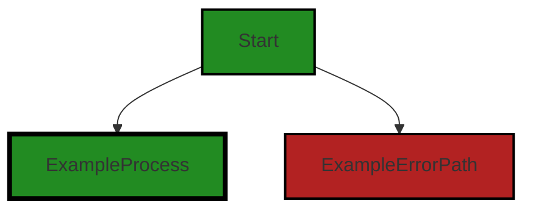
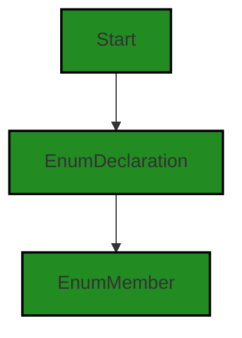

# Polyverse Boost-generated Source Analysis Details

## Source: ./src/data/userAnalysisType.ts
Date Generated: Friday, September 8, 2023 at 6:17:34 PM PDT


---

### Boost Architectural Quick Summary Security Report

Last Updated: Friday, September 8, 2023 at 6:17:08 PM PDT


Executive Report:

1. **Architectural Impact**: The analysis of this file has not revealed any severe issues.
2. **Risk Analysis**: The analysis of this file has not revealed any severe issues.
3. **Potential Customer Impact**: Based on the analysis, there are no severe issues that could potentially impact customers.
4. **Performance Issues**: Our analysis did not identify any explicit performance issues in the file.
5. **Risk Assessment**: Based on the current analysis of this file, no severe issues have been found. However, this doesn't guarantee that the file is risk-free.

Highlights:

- No severe issues were identified in the current analysis of this file.


---

### Boost Architectural Quick Summary Performance Report

Last Updated: Friday, September 8, 2023 at 6:17:23 PM PDT


Executive Report:

1. **Architectural Impact**: The analysis of this file has not revealed any severe issues.
2. **Risk Analysis**: The analysis of this file has not revealed any severe issues.
3. **Potential Customer Impact**: Based on the analysis, there are no severe issues that could potentially impact customers.
4. **Performance Issues**: Our analysis did not identify any explicit performance issues in the file.
5. **Risk Assessment**: Based on the current analysis of this file, no severe issues have been found. However, this doesn't guarantee that the file is risk-free.

Highlights:

- No severe issues were identified in the current analysis of this file.


---

### Boost Architectural Quick Summary Compliance Report

Last Updated: Friday, September 8, 2023 at 6:17:37 PM PDT


Executive Report:

1. **Architectural Impact**: The analysis of this file has not revealed any severe issues.
2. **Risk Analysis**: The analysis of this file has not revealed any severe issues.
3. **Potential Customer Impact**: Based on the analysis, there are no severe issues that could potentially impact customers.
4. **Performance Issues**: Our analysis did not identify any explicit performance issues in the file.
5. **Risk Assessment**: Based on the current analysis of this file, no severe issues have been found. However, this doesn't guarantee that the file is risk-free.

Highlights:

- No severe issues were identified in the current analysis of this file.

---
## Detailed Analysis:

### Cell 0:
## Original Code:

### Programming Language: typescript
### ./src/data/userAnalysisType.ts 

```typescript

export enum BoostUserAnalysisType {
    blueprint = "blueprint",
    security = "security",
    documentation = "documentation",
    compliance = "compliance",
    performance = "performance",
    deepCode = 'deepcode',
}

```
## Boost Analysis:


---

### Boost Code Explanation

Last Updated: Friday, September 8, 2023 at 6:16:00 PM PDT

This code snippet is written in TypeScript, a statically typed superset of JavaScript. It defines an enumeration (enum) named `BoostUserAnalysisType`.

An enum is a special "class" that represents a group of constants (unchangeable/read-only variables). In TypeScript, enums are used to define a type that can have one of several predefined string or numeric values. 

Here's a breakdown of the code:

1. `export`: This keyword is used to make the enum available for import in other modules or files in the project. This means that `BoostUserAnalysisType` can be used in other parts of the application outside of the file it is defined in.

2. `enum`: This keyword is used to declare an enumeration.

3. `BoostUserAnalysisType`: This is the name of the enum. By convention, the name of the enum is usually in PascalCase (i.e., the first letter of each word is capitalized).

4. Inside the curly braces `{...}` are the enum members. Each member is associated with a string value. The members are:
    - `blueprint`: Represents a blueprint analysis type.
    - `security`: Represents a security analysis type.
    - `documentation`: Represents a documentation analysis type.
    - `compliance`: Represents a compliance analysis type.
    - `performance`: Represents a performance analysis type.
    - `deepCode`: Represents a deep code analysis type.

These enum members represent different types of code analysis that can be performed. By using an enum, the code becomes more readable and less error-prone as the TypeScript compiler can check that any value assigned to a `BoostUserAnalysisType` is one of the valid members.

This code doesn't contain any specific algorithms but uses the enum data structure provided by TypeScript. It's a simple yet effective way to group and manage a collection of related constants.

For more information on TypeScript enums, you can check out the official TypeScript documentation here: [TypeScript Enums](https://www.typescriptlang.org/docs/handbook/enums.html).


---

### Boost Flow Diagram

Last Updated: Friday, September 8, 2023 at 6:16:43 PM PDT




---

### Boost Source-Level Security Analysis

Last Updated: Friday, September 8, 2023 at 6:17:02 PM PDT

**No bugs found**


---

### Boost Source-Level Performance Analysis

Last Updated: Friday, September 8, 2023 at 6:17:16 PM PDT

**No bugs found**


---

### Boost Source-Level Data and Privacy Compliance Analysis

Last Updated: Friday, September 8, 2023 at 6:17:31 PM PDT

**No bugs found**


### Cell 1:
## Original Code:

### Programming Language: typescript
### ./src/data/userAnalysisType.ts line 10

```typescript

export enum DisplayGroupFriendlyName {
    documentation = "Documentation",
    security = "Security",
    compliance = "Compliance",
    deepcode = "Deep Code Analysis",
}

```
## Boost Analysis:


---

### Boost Code Explanation

Last Updated: Friday, September 8, 2023 at 6:16:27 PM PDT

The provided code is a TypeScript enumeration, or `enum` for short. An `enum` is a special type of value in TypeScript that allows for a variable to be one of a set of predefined constants. The name of the `enum` is `DisplayGroupFriendlyName` and it has four members: `documentation`, `security`, `compliance`, and `deepcode`.

Each member of the `enum` is associated with a string value. For example, `DisplayGroupFriendlyName.documentation` is associated with the string "Documentation". These string values are not necessary in TypeScript `enum`s, but they can be useful for display purposes or for serialization/deserialization.

This `enum` is likely used in the context of the Visual Studio Code extension to categorize different types of code analysis. For example, when the extension performs a code analysis, it could categorize the results into these four groups: Documentation, Security, Compliance, and Deep Code Analysis. The exact use of this `enum` would depend on the rest of the codebase, but this is a likely scenario based on the names of the `enum` members and the context provided.

This `enum` is exported, which means it can be imported and used in other parts of the codebase.

As for the architectural guidelines, this code is in line with standard TypeScript practices. It's a good practice to use `enum`s to represent a fixed set of values, which seems to be the case here. This makes the code more readable and maintainable, as it's clear what the possible values are for a `DisplayGroupFriendlyName`.

For more information about TypeScript `enum`s, you can visit the official TypeScript documentation: [TypeScript Enums](https://www.typescriptlang.org/docs/handbook/enums.html)


---

### Boost Flow Diagram

Last Updated: Friday, September 8, 2023 at 6:16:48 PM PDT




---

### Boost Source-Level Security Analysis

Last Updated: Friday, September 8, 2023 at 6:17:05 PM PDT

**No bugs found**


---

### Boost Source-Level Performance Analysis

Last Updated: Friday, September 8, 2023 at 6:17:20 PM PDT

**No bugs found**


---

### Boost Source-Level Data and Privacy Compliance Analysis

Last Updated: Friday, September 8, 2023 at 6:17:34 PM PDT

**No bugs found**

