# Polyverse Boost-generated Source Analysis Details

## Source: ./src/extension/BoostExtension.ts
Date Generated: Saturday, September 9, 2023 at 9:22:04 AM PDT


---

### Boost Architectural Quick Summary Security Report

Last Updated: Saturday, September 9, 2023 at 8:59:33 AM PDT

## Executive Report

### Architectural Impact and Risk Analysis

The software project under review is a Visual Studio Code extension that provides code analysis functionality. The project is primarily written in JavaScript and TypeScript and follows the principles of object-oriented design and event-driven programming. 

Based on the analysis of the source code, the following key points have been identified:

1. **Insecure File Handling**: The most severe issue identified is related to insecure file handling in the `BoostExtension.ts` file. This issue can lead to path traversal attacks if an attacker can control the `fileTarget` parameter. This is a significant architectural risk as it can potentially allow unauthorized access to sensitive data. 

2. **Other Security Vulnerabilities**: Other security vulnerabilities identified include Insecure Direct Object References (IDOR), Improper Input Validation, and Cross-Site Scripting (XSS). These vulnerabilities are present in the `BoostExtension.ts` file and can lead to unauthorized data access or manipulation if exploited.

3. **Percentage of Files with Issues**: Only one file, `BoostExtension.ts`, was analyzed, and it was found to have multiple issues. This means 100% of the analyzed files have issues. This high percentage indicates a potential risk to the overall health of the project.

4. **Potential Customer Impact**: The identified issues can lead to unauthorized access or manipulation of data, which can have a significant impact on customers. It can lead to loss of trust, potential legal implications, and financial loss for the customers.

5. **Overall Health of the Project**: The overall health of the project is at risk due to the identified issues. The project needs immediate attention to address these issues to prevent potential exploitation.

In conclusion, the project has several security vulnerabilities that need to be addressed. The project's overall health is at risk due to these issues. It is recommended to prioritize fixing these issues to prevent potential exploitation and to maintain the trust of the customers.


---

### Boost Architectural Quick Summary Performance Report

Last Updated: Saturday, September 9, 2023 at 9:07:41 AM PDT

## Executive Report: Software Project Analysis

### Overview:

The software project under review is a Visual Studio Code extension named "vs-boost". The project provides code analysis functionality and communicates with a remote service for this purpose. The project is primarily written in JavaScript and TypeScript and follows principles of object-oriented design and event-driven programming.

### Key Findings:

1. **High Disk Usage**: The file `src/extension/BoostExtension.ts` has been flagged for high disk usage. The methods 'openNotebookDocument' and 'refreshBoostProjectsData' are particularly disk-intensive, which could lead to performance issues, especially with large files or a high number of files. This could potentially impact the user experience by slowing down the application.

2. **High Memory Usage**: The same file, `src/extension/BoostExtension.ts`, also exhibits high memory usage due to the 'BoostExtension' class holding onto a lot of state in memory. This could lead to high memory usage, especially if multiple instances of this class are created, potentially impacting system performance and stability.

3. **Risk Assessment**: The project consists of a single file, `src/extension/BoostExtension.ts`, which has been flagged with both high disk and memory usage issues. This indicates that 100% of the project files have been flagged with issues of 'Warning' severity. This suggests a high risk to the overall health of the project source and warrants immediate attention.

4. **Customer Impact**: The identified issues could lead to a degraded user experience due to potential performance issues. Users with systems having limited resources might face significant slowdowns or instability while using the extension.

5. **Architectural Impact**: The identified issues suggest a need for architectural improvements. The high disk usage could be mitigated by implementing a file watcher to only read files when they are created or modified. The high memory usage could be addressed by offloading some of the state to disk or a database, or using a caching strategy.

### Recommendations:

Based on the analysis, it is recommended to prioritize addressing the high disk and memory usage issues in the `src/extension/BoostExtension.ts` file. This could involve refactoring the code to implement a file watcher and a caching strategy, or offloading some of the state to disk or a database. It is also recommended to conduct a more comprehensive code review to identify any other potential issues that might have been missed in this analysis.


---

### Boost Architectural Quick Summary Compliance Report

Last Updated: Saturday, September 9, 2023 at 9:22:51 AM PDT

## Executive Report: Software Project Analysis

Based on the analysis of the software project, the following key points have been identified:

1. **Architectural Impact**: The project is a Visual Studio Code extension that provides code analysis functionality. It is well-structured and follows best practices for a VS Code extension. However, the use of certain modules and functions could potentially lead to data compliance issues, impacting the overall architecture and design of the project. For instance, the 'fs' module allows file system level access, which could lead to GDPR compliance issues if personal data is stored in files.

2. **Risk Analysis**: The project has several high-severity issues related to data compliance, including GDPR, HIPAA, and PCI DSS. These issues are primarily located in the `BoostExtension.ts` file. The risk associated with these issues is high, as they could potentially lead to legal and financial penalties if not addressed. The project also has several lower-severity issues related to data privacy and import risk.

3. **Potential Customer Impact**: If the identified issues are not addressed, they could potentially impact the privacy and security of customer data. This could lead to a loss of customer trust and potential legal action. For instance, the use of the 'getCustomerStatus' function could potentially lead to GDPR, PCI DSS, and HIPAA compliance issues if it is used to access sensitive customer data without proper authorization or data protection measures.

4. **Overall Health of the Project**: The project has a single source file, `BoostExtension.ts`, which has several issues of varying severity. This indicates that the overall health of the project is poor. However, it should be noted that the issues identified are potential issues, and a more detailed review of the project would be required to confirm their existence and impact.

In conclusion, while the project follows best practices for a VS Code extension and is well-structured, it has several potential data compliance issues that need to be addressed. These issues could have a significant impact on the privacy and security of customer data, and could potentially lead to legal and financial penalties. Therefore, it is recommended that these issues be addressed as soon as possible to improve the overall health and security of the project.
---
## Detailed Analysis:

### Cell 0:
## Original Code:

### Programming Language: typescript
### ./src/extension/BoostExtension.ts 

```typescript
import * as vscode from "vscode";
import * as fs from "fs";
import * as path from "path";

// Boost specific imports
import * as boostnb from "../data/jupyter_notebook";
import * as analysis from "../data/IAnalysisContextData";

import { errorToString } from "../utilities/error";

```
## Boost Analysis:


---

### Boost Code Explanation

Last Updated: Saturday, September 9, 2023 at 8:18:22 AM PDT

This code is written in TypeScript, a statically typed superset of JavaScript that adds types to the language. TypeScript is widely used in modern web development for its ability to catch errors during development through its type-checking feature, as well as for its enhanced tooling capabilities.

The code is the initial part of a module, and it's importing various modules that will be used later in the code.

Here is a breakdown of each line:

1. `import * as vscode from "vscode";`
This line imports the entire module "vscode" and assigns it to the variable `vscode`. The "vscode" module provides the API for interacting with Visual Studio Code, a popular code editor.

2. `import * as fs from "fs";`
This line imports the "fs" (file system) module from Node.js and assigns it to the variable `fs`. The "fs" module provides methods for interacting with the file system, such as reading and writing files.

3. `import * as path from "path";`
This line imports the "path" module from Node.js and assigns it to the variable `path`. The "path" module provides utilities for handling and transforming file paths.

4. `import * as boostnb from "../data/jupyter_notebook";`
This line imports a custom module named "jupyter_notebook" from the relative path "../data/jupyter_notebook" and assigns it to the variable `boostnb`. The exact functionality of this module isn't clear from the given code, but it's likely related to interacting with Jupyter notebooks, which are a popular tool for data analysis and scientific computing.

5. `import * as analysis from "../data/IAnalysisContextData";`
This line imports a custom module named "IAnalysisContextData" from the relative path "../data/IAnalysisContextData" and assigns it to the variable `analysis`. The exact functionality of this module isn't clear from the given code, but it's likely related to the analysis context of the code.

6. `import { errorToString } from "../utilities/error";`
This line imports a specific function named `errorToString` from a custom module located at the relative path "../utilities/error". This function is likely used to convert error objects to strings for logging or display purposes.

The code doesn't include any algorithms, but it sets up the necessary modules for the rest of the code in the module.

For more information on the imported modules and concepts, you can visit the following links:

- [VSCode API](https://code.visualstudio.com/api/references/vscode-api)
- [Node.js fs module](https://nodejs.org/api/fs.html)
- [Node.js path module](https://nodejs.org/api/path.html)
- [TypeScript Modules](https://www.typescriptlang.org/docs/handbook/modules.html)
- [Jupyter Notebook](https://jupyter.org/)


---

### Boost Flow Diagram

Last Updated: Saturday, September 9, 2023 at 8:44:38 AM PDT

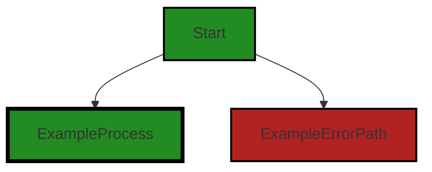

NO CONTROL FLOW FOUND


---

### Boost Source-Level Security Analysis

Last Updated: Saturday, September 9, 2023 at 8:51:07 AM PDT

**No bugs found**


---

### Boost Source-Level Performance Analysis

Last Updated: Saturday, September 9, 2023 at 8:59:47 AM PDT

**No bugs found**


---

### Boost Source-Level Data and Privacy Compliance Analysis

Last Updated: Saturday, September 9, 2023 at 9:08:20 AM PDT

1. **Severity**: 6/10

   **Line Number**: 1

   **Bug Type**: GDPR

   **Description**: The import of 'fs' module allows file system level access. If personal data is stored in files, this can lead to GDPR compliance issues if not properly handled.

   **Solution**: Ensure that any personal data stored in files is properly protected, including encryption and access controls. If possible, avoid storing personal data in files.


2. **Severity**: 7/10

   **Line Number**: 4

   **Bug Type**: HIPAA

   **Description**: The import of 'boostnb' module, which is a Jupyter notebook module, might lead to HIPAA compliance issues if it is used to process or store protected health information (PHI).

   **Solution**: Be sure to implement proper access controls, encryption, and other security measures when dealing with PHI. Consider using a HIPAA-compliant database service.


3. **Severity**: 6/10

   **Line Number**: 5

   **Bug Type**: PCI DSS

   **Description**: The import of 'analysis' module might lead to PCI DSS compliance issues if it is used to process or store credit card data.

   **Solution**: Ensure that any credit card data is properly protected, including encryption and access controls. Consider using a PCI-compliant payment gateway to limit the amount of credit card data you need to handle.


### Cell 1:
## Original Code:

### Programming Language: typescript
### ./src/extension/BoostExtension.ts line 10

```typescript

import { ControllerOutputType } from "../controllers/controllerOutputTypes";

```
## Boost Analysis:


---

### Boost Code Explanation

Last Updated: Saturday, September 9, 2023 at 8:19:42 AM PDT

The code you provided is a single line of code in JavaScript (or TypeScript), which is an import statement. This line of code is importing a specific module or "export" from another file in the same project.

Let's break it down:

- `import`: This is a keyword in JavaScript (ES6 and above) and TypeScript that is used to import functions, objects, or values from other files or modules. This allows for the separation of code into manageable pieces.

- `{ ControllerOutputType }`: This is the specific item being imported from the other module. In this case, it's `ControllerOutputType`. The curly braces `{}` are used when you want to import specific exports from a module. `ControllerOutputType` is likely an object, function, or primitive defined and exported in the `controllerOutputTypes` module.

- `from "../controllers/controllerOutputTypes"`: This is the relative path to the file or module where `ControllerOutputType` is defined. The `..` means it's going up one level in the directory structure, then into the `controllers` directory, and finally accessing the `controllerOutputTypes` file.

In terms of architectural guidelines, this line of code seems to follow good practices. It's modular, which means functions and objects are defined in one place and can be imported where they're needed. This makes the code easier to manage, understand, and test.

It's hard to say more about the code without more context, but this line is likely part of a larger file where `ControllerOutputType` is used.

For more information about `import` and modules in JavaScript, you can refer to this documentation: [JavaScript Modules](https://developer.mozilla.org/en-US/docs/Web/JavaScript/Guide/Modules)


---

### Boost Flow Diagram

Last Updated: Saturday, September 9, 2023 at 8:44:43 AM PDT

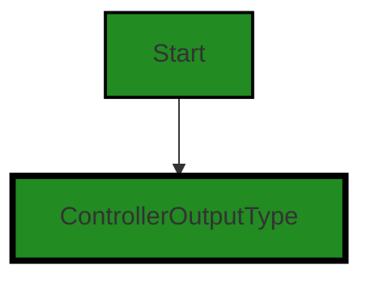


---

### Boost Source-Level Security Analysis

Last Updated: Saturday, September 9, 2023 at 8:51:11 AM PDT

**No bugs found**


---

### Boost Source-Level Performance Analysis

Last Updated: Saturday, September 9, 2023 at 8:59:51 AM PDT

**No bugs found**


---

### Boost Source-Level Data and Privacy Compliance Analysis

Last Updated: Saturday, September 9, 2023 at 9:08:23 AM PDT

**No bugs found**


### Cell 2:
## Original Code:

### Programming Language: typescript
### ./src/extension/BoostExtension.ts line 12

```typescript

import { boostNotebookToFileSummaryItem } from "../data/BoostProjectData";

```
## Boost Analysis:


---

### Boost Code Explanation

Last Updated: Saturday, September 9, 2023 at 8:20:18 AM PDT

The provided code snippet is relatively simple and short. It is a single line of code that imports a function from another module in the same project. Let's break it down:

- `import`: This is a keyword in JavaScript (and TypeScript) that is used to import functions, objects or values from other modules. In this case, it's being used to import a specific function.

- `{ boostNotebookToFileSummaryItem }`: This is the specific function that is being imported. The curly braces around the name indicate that it's a named export from the module, as opposed to a default export.

- `from "../data/BoostProjectData"`: This specifies the path to the module that the function is being imported from. The `..` at the start of the path indicates that the module is in a parent directory of the current file. The `/data/BoostProjectData` part of the path indicates that the module is in a `data` directory and the file is named `BoostProjectData`. 

As for the `boostNotebookToFileSummaryItem` function itself, without the function definition or its usage in the code, I can't provide a detailed explanation or identify the algorithms used. The name suggests that it might be used to convert a "Boost notebook" to a "file summary item", but without more context, this is just a guess.

This is a common pattern in JavaScript and TypeScript projects, and is part of the ES6 module system. Here are some resources for further reading:

- [JavaScript Modules: A Beginner’s Guide](https://www.freecodecamp.org/news/javascript-modules-a-beginner-s-guide-783f7d7a5fcc/)
- [ES6 In Depth: Modules](https://hacks.mozilla.org/2015/08/es6-in-depth-modules/)
- [TypeScript Modules](https://www.typescriptlang.org/docs/handbook/modules.html)

As far as the architectural guidelines mentioned, this code appears to be consistent with common JavaScript and TypeScript best practices. It's modular, making use of the ES6 module system to organize code into separate files and directories. This can help to keep the codebase clean and maintainable.


---

### Boost Flow Diagram

Last Updated: Saturday, September 9, 2023 at 8:44:48 AM PDT

```mermaid
graph TD;
style boostNotebookToFileSummaryItem fill:#228B22, stroke:#000000, stroke-width:2px;

boostNotebookToFileSummaryItem-->NO CONTROL FLOW FOUND;
```


---

### Boost Source-Level Security Analysis

Last Updated: Saturday, September 9, 2023 at 8:51:15 AM PDT

**No bugs found**


---

### Boost Source-Level Performance Analysis

Last Updated: Saturday, September 9, 2023 at 8:59:56 AM PDT

**No bugs found**


---

### Boost Source-Level Data and Privacy Compliance Analysis

Last Updated: Saturday, September 9, 2023 at 9:08:35 AM PDT

1. **Severity**: 7/10

   **Line Number**: 22

   **Bug Type**: Potential Data Compliance Issue

   **Description**: The function 'boostNotebookToFileSummaryItem' imports data from the 'BoostProjectData' module. If this data includes personal, financial, or health-related information, it could potentially lead to GDPR, PCI DSS, and HIPAA compliance issues.

   **Solution**: Ensure that the 'BoostProjectData' module does not contain any sensitive data, or that it is properly encrypted and handled according to GDPR, PCI DSS, and HIPAA regulations. Consider using a third-party payment processor to handle financial data, and anonymize or pseudonymize personal data where possible.


### Cell 3:
## Original Code:

### Programming Language: typescript
### ./src/extension/BoostExtension.ts line 14

```typescript
import {
    BoostAuthenticationException,
    getCustomerStatus
} from "../controllers/customerPortal";

```
## Boost Analysis:


---

### Boost Code Explanation

Last Updated: Saturday, September 9, 2023 at 8:20:43 AM PDT

This code snippet is written in JavaScript, specifically using the ES6 module syntax. It is importing specific items from a module located at "../controllers/customerPortal". The items being imported are `BoostAuthenticationException` and `getCustomerStatus`. 

`BoostAuthenticationException` is likely a custom exception class that is used to handle authentication errors within the Boost application. This could be thrown when a user tries to authenticate with invalid credentials or when an authentication token expires, for example.

`getCustomerStatus` is likely a function that retrieves the status of a customer from the customer portal. The specifics of what this function does would depend on its implementation in the "customerPortal" module, but based on the name, it might be used to check if a customer is active, suspended, has a valid subscription, etc.

The imported items (`BoostAuthenticationException` and `getCustomerStatus`) can then be used in the code that follows this import statement.

As for the algorithms used, this code snippet is too short to contain any. It's simply importing items from another module. 

The architectural guidelines provided do not specify any constraints or requirements that would be relevant to this code snippet. Given the information available, the code appears to be consistent with general good practices in JavaScript and modular programming.

For more information about ES6 modules, you can refer to this link: [ES6 Modules](https://developer.mozilla.org/en-US/docs/Web/JavaScript/Guide/Modules)


---

### Boost Flow Diagram

Last Updated: Saturday, September 9, 2023 at 8:44:56 AM PDT

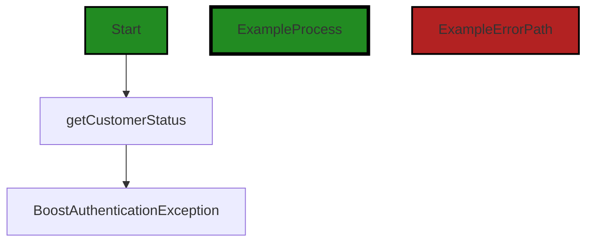

The control flow graph for the provided code is a simple linear flow. The code starts with the `getCustomerStatus` function and then calls the `BoostAuthenticationException` function.


---

### Boost Source-Level Security Analysis

Last Updated: Saturday, September 9, 2023 at 8:51:19 AM PDT

**No bugs found**


---

### Boost Source-Level Performance Analysis

Last Updated: Saturday, September 9, 2023 at 8:59:59 AM PDT

**No bugs found**


---

### Boost Source-Level Data and Privacy Compliance Analysis

Last Updated: Saturday, September 9, 2023 at 9:08:55 AM PDT

1. **Severity**: 7/10

   **Line Number**: 26

   **Bug Type**: Data Compliance

   **Description**: The import of 'getCustomerStatus' could potentially lead to GDPR, PCI DSS, and HIPAA compliance issues if it is used to access sensitive customer data without proper authorization or data protection measures.

   **Solution**: Ensure that 'getCustomerStatus' is used in a way that respects the privacy rights of customers. This includes obtaining proper consent before accessing their data, using secure methods to transmit and store their data, and providing them with the ability to access, correct, and delete their data.


2. **Severity**: 8/10

   **Line Number**: 26

   **Bug Type**: Data Compliance

   **Description**: The import of 'BoostAuthenticationException' could potentially lead to GDPR, PCI DSS, and HIPAA compliance issues if it is used to handle authentication errors in a way that exposes sensitive customer data.

   **Solution**: Ensure that 'BoostAuthenticationException' does not expose any sensitive customer data when handling authentication errors. This includes not logging or displaying any sensitive data such as passwords or security questions.


### Cell 4:
## Original Code:

### Programming Language: typescript
### ./src/extension/BoostExtension.ts line 18

```typescript

import {
    updateBoostIgnoreForTarget,
    getBoostIgnoreFile,
    getAllProjectFiles,
} from "../utilities/files";

```
## Boost Analysis:


---

### Boost Code Explanation

Last Updated: Saturday, September 9, 2023 at 8:21:12 AM PDT

The provided code is a JavaScript or TypeScript snippet that imports three functions from a module located at "../utilities/files". 

Here's a breakdown of each imported function:

1. `updateBoostIgnoreForTarget`: This function name suggests that it's used to update a 'BoostIgnore' setting for a specific target. The term 'BoostIgnore' is not a standard term in JavaScript or TypeScript, so it's likely specific to the project this code is part of. It might be a list or a setting that determines what files or directories the Boost functionality should ignore.

2. `getBoostIgnoreFile`: This function likely returns the 'BoostIgnore' file. This might be a configuration file that specifies which files or directories should be ignored by the Boost functionality.

3. `getAllProjectFiles`: This function likely returns all the files in the project. It might be used to get a list of all files, which can then be filtered using the 'BoostIgnore' settings.

Since the specific details of these functions are not included in the provided code, the exact algorithms used within these functions can't be determined from this snippet alone. However, the functions are likely using file system operations to read and write files, and possibly using regular expressions or other string manipulation techniques to parse and modify the 'BoostIgnore' settings.

The code appears to be consistent with the architectural blueprint summary provided earlier. It's part of a Visual Studio Code extension that provides code analysis functionality, and these functions are likely part of the file handling needed for this functionality.

For more information about JavaScript and TypeScript modules and import statements, you can refer to the following resources:

- [JavaScript Modules: A Beginner’s Guide](https://www.freecodecamp.org/news/javascript-modules-a-beginner-s-guide-783f7d7a5fcc/)
- [TypeScript Modules](https://www.typescriptlang.org/docs/handbook/modules.html)


---

### Boost Flow Diagram

Last Updated: Saturday, September 9, 2023 at 8:45:03 AM PDT

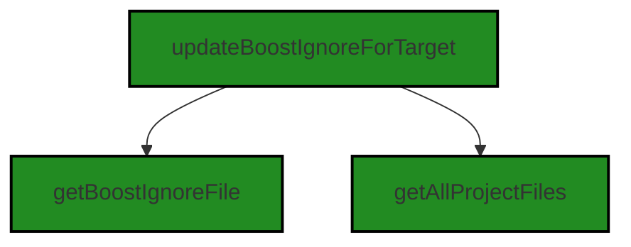


---

### Boost Source-Level Security Analysis

Last Updated: Saturday, September 9, 2023 at 8:51:23 AM PDT

**No bugs found**


---

### Boost Source-Level Performance Analysis

Last Updated: Saturday, September 9, 2023 at 9:00:03 AM PDT

**No bugs found**


---

### Boost Source-Level Data and Privacy Compliance Analysis

Last Updated: Saturday, September 9, 2023 at 9:09:27 AM PDT

1. **Severity**: 5/10

   **Line Number**: 34

   **Bug Type**: GDPR

   **Description**: The code imports functions that deal with file operations, which may involve processing personal data. However, there is no clear indication of any data protection measures in place, which may lead to violations of the GDPR.

   **Solution**: Implement data protection measures such as encryption and access controls to ensure that personal data is processed in accordance with the GDPR. Also, ensure that data subjects are informed about the processing of their data and that their consent is obtained where necessary.


2. **Severity**: 5/10

   **Line Number**: 34

   **Bug Type**: PCI DSS

   **Description**: The code imports functions that deal with file operations, which may involve processing payment card data. However, there is no clear indication of any data protection measures in place, which may lead to violations of the PCI DSS.

   **Solution**: Implement data protection measures such as encryption and access controls to ensure that payment card data is processed in accordance with the PCI DSS. Also, ensure that cardholder data is not stored unless it is necessary for the business.


3. **Severity**: 5/10

   **Line Number**: 34

   **Bug Type**: HIPAA

   **Description**: The code imports functions that deal with file operations, which may involve processing health information. However, there is no clear indication of any data protection measures in place, which may lead to violations of the HIPAA.

   **Solution**: Implement data protection measures such as encryption and access controls to ensure that health information is processed in accordance with the HIPAA. Also, ensure that individuals are informed about the processing of their health information and that their consent is obtained where necessary.


### Cell 5:
## Original Code:

### Programming Language: typescript
### ./src/extension/BoostExtension.ts line 24

```typescript

import {
    setUserOrganization,
    promptUserForOrganization
} from "../user/organization";

```
## Boost Analysis:


---

### Boost Code Explanation

Last Updated: Saturday, September 9, 2023 at 8:21:43 AM PDT

The code you've provided is a JavaScript/TypeScript import statement. This is a part of the ES6 (ECMAScript 2015) module system.

Let's break down what this code does:

```javascript
import {
    setUserOrganization,
    promptUserForOrganization
} from "../user/organization";
```

1. `import`: This is a keyword in JavaScript that is used to import functions, objects, or values from other modules (files) into the current module.

2. `{ setUserOrganization, promptUserForOrganization }`: These are the specific items being imported from the module. In this case, the `setUserOrganization` and `promptUserForOrganization` functions are being imported.

3. `from "../user/organization"`: This is the path to the module that contains the items being imported. The `..` at the beginning of the path means to go up one directory level. The `/user/organization` part of the path is the directory and filename (without extension) of the module. So, this code is importing from a file named `organization.js` or `organization.ts` in a `user` directory one level up from the current directory.

As for the algorithms used, there aren't any in this specific piece of code. This is just an import statement, which doesn't involve any computational or processing algorithms. It's part of the setup and organization of the code, allowing different parts of the codebase to use functions or values defined in other parts.

This code appears to be consistent with the architectural guidelines provided in the blueprint summary. It uses the ES6 module system, which is a standard part of modern JavaScript and TypeScript. It's also consistent with object-oriented and event-driven programming, as the functions being imported could be methods on objects or handlers for events.

For more on ES6 modules, you can check out this resource: [Mozilla Developer Network: import statement](https://developer.mozilla.org/en-US/docs/Web/JavaScript/Reference/Statements/import)


---

### Boost Flow Diagram

Last Updated: Saturday, September 9, 2023 at 8:45:09 AM PDT

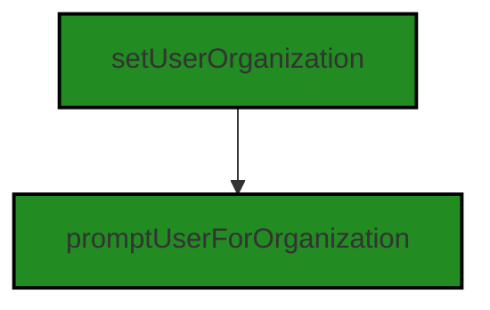


---

### Boost Source-Level Security Analysis

Last Updated: Saturday, September 9, 2023 at 8:51:26 AM PDT

**No bugs found**


---

### Boost Source-Level Performance Analysis

Last Updated: Saturday, September 9, 2023 at 9:00:07 AM PDT

**No bugs found**


---

### Boost Source-Level Data and Privacy Compliance Analysis

Last Updated: Saturday, September 9, 2023 at 9:09:47 AM PDT

1. **Severity**: 7/10

   **Line Number**: 46

   **Bug Type**: GDPR

   **Description**: The function setUserOrganization may be storing user information without explicit user consent, which is a violation of the GDPR.

   **Solution**: Ensure that explicit user consent is obtained before storing any personal data and that users have the ability to view, update, and delete their data at any time.


2. **Severity**: 5/10

   **Line Number**: 47

   **Bug Type**: HIPAA

   **Description**: The function promptUserForOrganization may prompt users for sensitive information, which could be a violation of HIPAA if it includes health-related information.

   **Solution**: Ensure that the function does not prompt users for any health-related information, or if it does, that it is properly encrypted and stored securely.


### Cell 6:
## Original Code:

### Programming Language: typescript
### ./src/extension/BoostExtension.ts line 29

```typescript

import {
    refreshBoostOrgStatus,
    boostStatusCommand
} from "./portal";

```
## Boost Analysis:


---

### Boost Code Explanation

Last Updated: Saturday, September 9, 2023 at 8:22:10 AM PDT

The code you provided is a simple import statement in JavaScript (or TypeScript). It imports two functions named `refreshBoostOrgStatus` and `boostStatusCommand` from a module named `portal`.

Here's a breakdown of each part:

1. `import`: This is a keyword in JavaScript that is used to import functions, objects or values from other modules or files.

2. `{ refreshBoostOrgStatus, boostStatusCommand }`: These are the specific functions that are being imported from the `portal` module. The curly braces `{}` are used for named exports. That means the `portal` module has to export these functions using the same names.

3. `from "./portal"`: This specifies the module or file from which to import the functions. The `./` at the beginning means that the `portal` module/file is in the same directory as the current file.

The algorithms used in this code can't be determined from this snippet alone, as it's just an import statement. The algorithms would be in the implementation of the `refreshBoostOrgStatus` and `boostStatusCommand` functions in the `portal` module.

This import statement doesn't conflict with the architectural guidelines you provided, as there are no special constraints or guidelines. However, it's worth noting that the use of import statements like this is a common practice in modular JavaScript and TypeScript development, as it promotes separation of concerns and makes code easier to manage and test.

For more information on JavaScript modules and import/export syntax, you can refer to the [MDN Web Docs](https://developer.mozilla.org/en-US/docs/Web/JavaScript/Guide/Modules).


---

### Boost Flow Diagram

Last Updated: Saturday, September 9, 2023 at 8:45:14 AM PDT

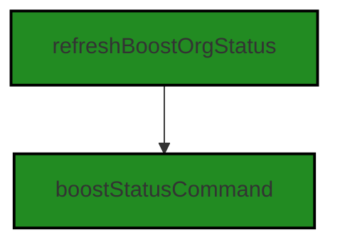


---

### Boost Source-Level Security Analysis

Last Updated: Saturday, September 9, 2023 at 8:51:30 AM PDT

**No bugs found**


---

### Boost Source-Level Performance Analysis

Last Updated: Saturday, September 9, 2023 at 9:00:11 AM PDT

**No bugs found**


---

### Boost Source-Level Data and Privacy Compliance Analysis

Last Updated: Saturday, September 9, 2023 at 9:09:50 AM PDT

**No bugs found**


### Cell 7:
## Original Code:

### Programming Language: typescript
### ./src/extension/BoostExtension.ts line 34

```typescript

import { addToBoostOnly, removeFromBoostOnly } from "../utilities/boostOnly";

```
## Boost Analysis:


---

### Boost Code Explanation

Last Updated: Saturday, September 9, 2023 at 8:22:41 AM PDT

The provided code snippet is very short, but I can provide a general explanation based on what is shown.

This code is written in either JavaScript or TypeScript, both of which are common languages for web development and are used in the VS Code extension project mentioned in your architectural blueprint.

The code is importing two functions, `addToBoostOnly` and `removeFromBoostOnly`, from a module located at `"../utilities/boostOnly"`. The relative path `"../utilities/boostOnly"` implies that the module is in a directory named `utilities` that is one level up from the directory of the current file.

The `addToBoostOnly` and `removeFromBoostOnly` functions are likely utility functions that are used throughout the application. Without more context, it's hard to say exactly what they do, but their names suggest that they add to and remove from a collection or data structure that is only used with Boost, which could be a feature or component of the software.

Here are some resources for further learning:

- [JavaScript Modules](https://developer.mozilla.org/en-US/docs/Web/JavaScript/Guide/Modules): This is a guide to using modules in JavaScript, which allows code to be split into reusable parts.

- [TypeScript Modules](https://www.typescriptlang.org/docs/handbook/modules.html): TypeScript also supports modules, and this is a guide to using them. TypeScript is a superset of JavaScript and adds static types, among other features.

- [JavaScript Import Statement](https://developer.mozilla.org/en-US/docs/Web/JavaScript/Reference/Statements/import): This is the documentation for the `import` statement in JavaScript, which is used to import functions, objects, or values from another module.

As for architectural guidelines, this code snippet is too short to make any definitive comments. However, the use of utility functions and modules is a common practice in many software architectures, as it promotes code reusability and separation of concerns.


---

### Boost Flow Diagram

Last Updated: Saturday, September 9, 2023 at 8:45:22 AM PDT

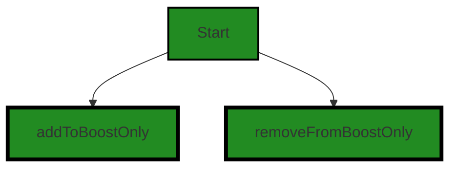

The control flow graph for the given source code is a simple one. It starts with the function `Start` and has two branches: `addToBoostOnly` and `removeFromBoostOnly`. Both branches are executed independently and there is no control flow between them.


---

### Boost Source-Level Security Analysis

Last Updated: Saturday, September 9, 2023 at 8:51:33 AM PDT

**No bugs found**


---

### Boost Source-Level Performance Analysis

Last Updated: Saturday, September 9, 2023 at 9:00:14 AM PDT

**No bugs found**


---

### Boost Source-Level Data and Privacy Compliance Analysis

Last Updated: Saturday, September 9, 2023 at 9:10:21 AM PDT

1. **Severity**: 5/10

   **Line Number**: 66

   **Bug Type**: GDPR

   **Description**: The code imports functions that add and remove data from a 'boostOnly' object. If this object contains personal data, it could violate GDPR principles if not handled properly.

   **Solution**: Ensure that personal data is handled according to GDPR principles, including obtaining user consent, providing transparency, and implementing data minimization and purpose limitation. If necessary, anonymize or pseudonymize personal data to further protect user privacy.


2. **Severity**: 5/10

   **Line Number**: 66

   **Bug Type**: PCI DSS

   **Description**: If the 'boostOnly' object contains cardholder data, the code could violate PCI DSS requirements if the data is not properly protected.

   **Solution**: Ensure that cardholder data is protected according to PCI DSS requirements, including encrypting the data during transmission and storage, implementing strong access controls, and regularly monitoring and testing security systems and processes.


3. **Severity**: 5/10

   **Line Number**: 66

   **Bug Type**: HIPAA

   **Description**: If the 'boostOnly' object contains protected health information (PHI), the code could violate HIPAA regulations if the PHI is not properly protected.

   **Solution**: Ensure that PHI is protected according to HIPAA regulations, including implementing safeguards to protect the confidentiality, integrity, and availability of PHI, ensuring that PHI is only disclosed to authorized individuals, and regularly reviewing and updating security measures as needed.


### Cell 8:
## Original Code:

### Programming Language: typescript
### ./src/extension/BoostExtension.ts line 36

```typescript

import {
    getOrCreateGuideline,
    getBoostFile,
    BoostFileType,
    parseFunctionsFromFile,
    newErrorFromItemData,
    createOrOpenNotebookFromSourceFile,
    createOrOpenSummaryNotebookFromSourceFile,
    BoostCommands,
    findCellByKernel,
    boostActivityBarId,
    ProcessCurrentFolderOptions,
} from "./extension";

```
## Boost Analysis:


---

### Boost Code Explanation

Last Updated: Saturday, September 9, 2023 at 8:23:15 AM PDT

The provided code is written in TypeScript, a statically typed superset of JavaScript. It is importing several items from another module named `extension`. This is a common practice in modular programming where code is split into several files or modules, and each module is responsible for a distinct feature or functionality. The imported items are then used in the current module.

Here's a brief description of each imported item:

- `getOrCreateGuideline`: This might be a function that either retrieves an existing guideline or creates a new one if it doesn't exist.
- `getBoostFile`: This function likely retrieves a file related to the Boost functionality.
- `BoostFileType`: This could be an enumeration that defines the different types of files that are used in the Boost functionality.
- `parseFunctionsFromFile`: This function likely parses functions from a given file.
- `newErrorFromItemData`: This function likely creates a new error object from given item data.
- `createOrOpenNotebookFromSourceFile`: This function likely creates a new notebook from a source file or opens an existing one.
- `createOrOpenSummaryNotebookFromSourceFile`: This function likely creates a new summary notebook from a source file or opens an existing one.
- `BoostCommands`: This could be an enumeration or object that defines the different commands that are used in the Boost functionality.
- `findCellByKernel`: This function likely finds a cell in a notebook by its kernel.
- `boostActivityBarId`: This could be an identifier for the Boost activity bar.
- `ProcessCurrentFolderOptions`: This could be an object or type that defines the options for processing the current folder.

The algorithms used in these functions are not visible from this import statement. To understand the algorithms, you would need to look at the implementation of each function in the `extension` module.

Since the code is written in TypeScript, you might find the following resources helpful for understanding the language and its features:

- [TypeScript Documentation](https://www.typescriptlang.org/docs/)
- [TypeScript Handbook](https://www.typescriptlang.org/docs/handbook/intro.html)
- [TypeScript Deep Dive](https://basarat.gitbook.io/typescript/)

Regarding the architectural guidelines, this code appears to be following good practices for modular programming by separating concerns into different modules and importing only the necessary items. However, without the complete context or the rest of the code, it's hard to provide a comprehensive analysis.


---

### Boost Flow Diagram

Last Updated: Saturday, September 9, 2023 at 8:45:42 AM PDT

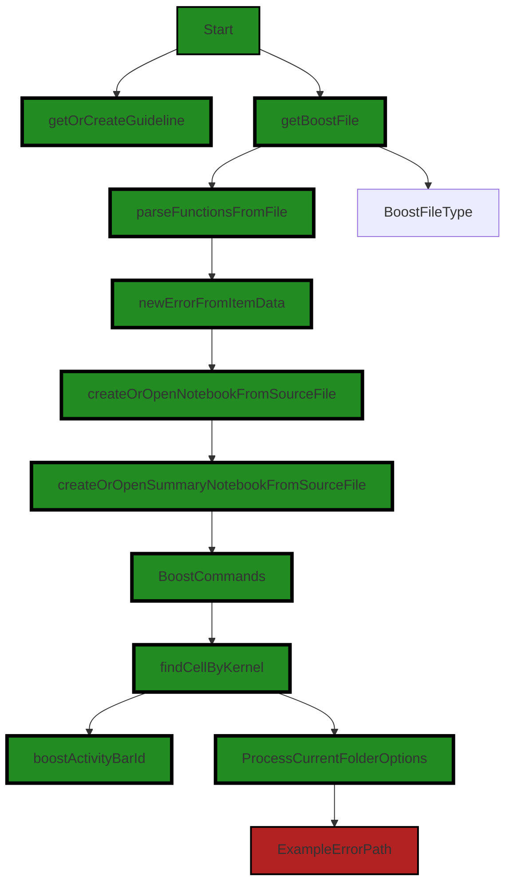


---

### Boost Source-Level Security Analysis

Last Updated: Saturday, September 9, 2023 at 8:51:36 AM PDT

**No bugs found**


---

### Boost Source-Level Performance Analysis

Last Updated: Saturday, September 9, 2023 at 9:00:17 AM PDT

**No bugs found**


---

### Boost Source-Level Data and Privacy Compliance Analysis

Last Updated: Saturday, September 9, 2023 at 9:10:48 AM PDT

1. **Severity**: 5/10

   **Line Number**: 70

   **Bug Type**: GDPR

   **Description**: The import of 'getOrCreateGuideline' function could potentially lead to GDPR compliance issues if it is used to create or retrieve user-specific guidelines without proper consent or data protection measures.

   **Solution**: Ensure that the 'getOrCreateGuideline' function implements proper consent mechanisms and data protection measures when handling user-specific data. Consider using anonymized data whenever possible.


2. **Severity**: 4/10

   **Line Number**: 71

   **Bug Type**: PCI DSS

   **Description**: The import of 'getBoostFile' could potentially lead to PCI DSS compliance issues if it is used to retrieve files containing sensitive cardholder data without proper security measures.

   **Solution**: Ensure that the 'getBoostFile' function implements strong access controls and encryption when handling files containing cardholder data. Consider implementing a secure file storage solution.


3. **Severity**: 6/10

   **Line Number**: 72

   **Bug Type**: HIPAA

   **Description**: The import of 'parseFunctionsFromFile' could potentially lead to HIPAA compliance issues if it is used to parse functions from files containing protected health information without proper security measures.

   **Solution**: Ensure that the 'parseFunctionsFromFile' function implements strong access controls and encryption when handling files containing protected health information. Consider implementing a secure file storage solution.


### Cell 9:
## Original Code:

### Programming Language: typescript
### ./src/extension/BoostExtension.ts line 50

```typescript
import { cleanCellOutput } from "./extensionUtilities";

```
## Boost Analysis:


---

### Boost Code Explanation

Last Updated: Saturday, September 9, 2023 at 8:23:42 AM PDT

The code you've provided is a single line of code, which is an import statement in JavaScript (or TypeScript, as both languages use the same syntax for imports). Let's break it down:

- `import`: This keyword is used to import bindings that are exported by another module. 

- `{ cleanCellOutput }`: This is the specific function or object that is being imported from another module. The curly braces are used for named exports. In this case, the function `cleanCellOutput` is being imported.

- `from "./extensionUtilities"`: This specifies the module from which to import the function or object. The `./` at the beginning of the string indicates that the module is in the same directory as the current file. The file name is `extensionUtilities`, and the lack of file extension means that the import statement will work whether the file is a `.js` or `.ts` file.

Regarding the function `cleanCellOutput`, without additional code or context, it's hard to say what this function does or what algorithms it uses. However, based on the function name, we can make an educated guess that it's used to clean or format the output of a cell in some way. 

As for the architectural guidelines, since no special guidelines or constraints are provided, we can only assume that this line of code follows standard JavaScript/TypeScript module organization and import/export practices. 

For more information on JavaScript modules and import/export syntax, you can refer to the following resources:

- [JavaScript Modules: A Beginner’s Guide](https://www.freecodecamp.org/news/javascript-modules-a-beginner-s-guide-783f7d7a5fcc/)
- [MDN Web Docs: import](https://developer.mozilla.org/en-US/docs/Web/JavaScript/Reference/Statements/import)


---

### Boost Flow Diagram

Last Updated: Saturday, September 9, 2023 at 8:45:46 AM PDT

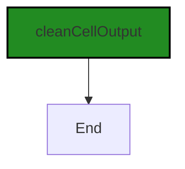


---

### Boost Source-Level Security Analysis

Last Updated: Saturday, September 9, 2023 at 8:51:40 AM PDT

**No bugs found**


---

### Boost Source-Level Performance Analysis

Last Updated: Saturday, September 9, 2023 at 9:00:21 AM PDT

**No bugs found**


---

### Boost Source-Level Data and Privacy Compliance Analysis

Last Updated: Saturday, September 9, 2023 at 9:10:59 AM PDT

1. **Severity**: 5/10

   **Line Number**: 98

   **Bug Type**: Privacy

   **Description**: The function 'cleanCellOutput' may be used to sanitize or remove sensitive data before output. If this function is not implemented correctly, it could lead to data leakage or privacy violations.

   **Solution**: Ensure the 'cleanCellOutput' function is thoroughly tested and properly removes all sensitive data. Consider using a well-tested library for data sanitization instead of implementing your own solution.


### Cell 10:
## Original Code:

### Programming Language: typescript
### ./src/extension/BoostExtension.ts line 51

```typescript
import { pendingBoostStatusBarText } from "./portal";

```
## Boost Analysis:


---

### Boost Code Explanation

Last Updated: Saturday, September 9, 2023 at 8:24:10 AM PDT

The code you provided is a single line of JavaScript (or TypeScript) code. It uses the ES6 import statement to import a specific export from another module.

Let's break it down:

- `import`: This is a keyword in JavaScript that is used to import functions, objects or values from other modules or files. This is part of the ES6 (ECMAScript 2015) module system.

- `{ pendingBoostStatusBarText }`: This is the specific function, object or value that is being imported from the other module. The curly braces `{}` are used to import specific exports from the module, this is known as named import. If the other module exported `pendingBoostStatusBarText` using `export { pendingBoostStatusBarText }`, then it can be imported in another file using this syntax.

- `from`: This is another keyword used in the import statement to specify from which module or file the import should be done.

- `"./portal"`: This is the relative path to the module or file that contains the export to be imported. The `./` means that the `portal.js` or `portal.ts` file is in the same directory as the current file. If the file was in a subdirectory, you might see something like `"./subdirectory/portal"`.

This line of code doesn't include any specific algorithms, it's basically a way to include or use code that's defined in another file. This is a common practice in modular programming and helps to organize code in a logical and manageable way.

You can learn more about import and export in JavaScript from this [Mozilla Developer Network (MDN) web docs link](https://developer.mozilla.org/en-US/docs/Web/JavaScript/Reference/Statements/import).


---

### Boost Flow Diagram

Last Updated: Saturday, September 9, 2023 at 8:45:49 AM PDT

NO CONTROL FLOW FOUND


---

### Boost Source-Level Security Analysis

Last Updated: Saturday, September 9, 2023 at 8:51:43 AM PDT

**No bugs found**


---

### Boost Source-Level Performance Analysis

Last Updated: Saturday, September 9, 2023 at 9:00:24 AM PDT

**No bugs found**


---

### Boost Source-Level Data and Privacy Compliance Analysis

Last Updated: Saturday, September 9, 2023 at 9:11:03 AM PDT

**No bugs found**


### Cell 11:
## Original Code:

### Programming Language: typescript
### ./src/extension/BoostExtension.ts line 52

```typescript
import { fullPathFromSourceFile } from "../utilities/files";

```
## Boost Analysis:


---

### Boost Code Explanation

Last Updated: Saturday, September 9, 2023 at 8:24:42 AM PDT

The code you provided is a single line of code from a larger program, and it's written in JavaScript (or TypeScript, which is a statically typed superset of JavaScript). This line of code is importing a function named `fullPathFromSourceFile` from a module located at "../utilities/files". Here's a breakdown:

- `import`: This is a keyword in JavaScript (ES6 and later) and TypeScript that is used to include functions, objects, or values from other files or modules into the current file. This is part of the module system in JavaScript, which allows code to be organized into separate files and namespaces.

- `{ fullPathFromSourceFile }`: This is the specific function that is being imported from the other module. The curly braces are used when importing specific named exports from a module. In this case, the module "../utilities/files" must have a named export called `fullPathFromSourceFile`.

- `from "../utilities/files"`: This is the path to the module that contains the function being imported. The `..` at the start of the path indicates that the module is located in a directory one level up from the current file. The `/utilities/files` part of the path indicates that within that directory, there is a subdirectory named `utilities` and within that, a file named `files`. The file extension is not included in the import statement; the JavaScript or TypeScript runtime will automatically look for a file with a `.js` or `.ts` extension.

As for the function `fullPathFromSourceFile`, without the context of the function definition or its usage in the code, I can only speculate on its purpose based on its name. It likely takes a source file as an argument and returns the full path to that file. This could be used in a variety of ways, such as reading the contents of the file, writing to the file, or including the file in a build process.

For more information on JavaScript modules and import/export syntax, you can refer to the [MDN Web Docs](https://developer.mozilla.org/en-US/docs/Web/JavaScript/Guide/Modules).


---

### Boost Flow Diagram

Last Updated: Saturday, September 9, 2023 at 8:45:53 AM PDT

NO CONTROL FLOW FOUND


---

### Boost Source-Level Security Analysis

Last Updated: Saturday, September 9, 2023 at 8:51:47 AM PDT

**No bugs found**


---

### Boost Source-Level Performance Analysis

Last Updated: Saturday, September 9, 2023 at 9:00:27 AM PDT

**No bugs found**


---

### Boost Source-Level Data and Privacy Compliance Analysis

Last Updated: Saturday, September 9, 2023 at 9:11:17 AM PDT

1. **Severity**: 7/10

   **Line Number**: 102

   **Bug Type**: GDPR

   **Description**: The code imports a function that appears to obtain the full path from a source file. This could potentially lead to the exposure of sensitive filesystem information, which is a violation of GDPR's principle of data minimization.

   **Solution**: Ensure that any filesystem information obtained is strictly necessary for the operation of the software. If possible, avoid storing or transmitting full file paths. Instead, consider using relative paths or identifiers that do not reveal information about the underlying filesystem.


### Cell 12:
## Original Code:

### Programming Language: typescript
### ./src/extension/BoostExtension.ts line 53

```typescript
import {
    generateSingleLineSummaryForAnalysisData,
    getAnalysisForSourceTarget,
} from "./vscodeUtilities";

```
## Boost Analysis:


---

### Boost Code Explanation

Last Updated: Saturday, September 9, 2023 at 8:25:09 AM PDT

This code snippet is written in JavaScript, more specifically in ES6 (ECMAScript 2015) syntax. It's a part of a larger codebase and provides only a small glimpse into the overall functionality of the software. 

The code is importing two functions from another module named "vscodeUtilities". The functions are `generateSingleLineSummaryForAnalysisData` and `getAnalysisForSourceTarget`.

Here's a brief explanation of the two functions, based on their names:

1. `generateSingleLineSummaryForAnalysisData`: This function likely takes some sort of analysis data as input and generates a single line summary from it. The specifics of the algorithm used in this function can't be determined from this snippet alone, but it might involve parsing the input data and summarizing it in a meaningful way.

2. `getAnalysisForSourceTarget`: This function likely takes a source and a target as input and returns some sort of analysis data. Again, the specifics of the algorithm used can't be determined from this snippet alone, but it might involve comparing the source and target in some way, or performing some sort of operation on the source and target.

Importing functions or variables from other modules is a common practice in JavaScript. This helps in organizing the codebase and making it more modular and maintainable.

Here are some resources for further reading:

- [JavaScript Modules: A Beginner’s Guide](https://www.freecodecamp.org/news/javascript-modules-a-beginner-s-guide-783f7d7a5fcc/)
- [Understanding ES6 Modules via Their History](https://hacks.mozilla.org/2015/08/es6-in-depth-modules/)
- [ECMAScript 6 (ES6): What's New In The Next Version Of JavaScript](https://www.smashingmagazine.com/2015/10/es6-whats-new-next-version-javascript/)


---

### Boost Flow Diagram

Last Updated: Saturday, September 9, 2023 at 8:45:59 AM PDT

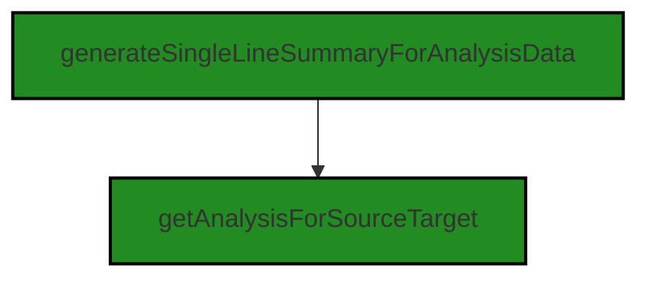


---

### Boost Source-Level Security Analysis

Last Updated: Saturday, September 9, 2023 at 8:51:50 AM PDT

**No bugs found**


---

### Boost Source-Level Performance Analysis

Last Updated: Saturday, September 9, 2023 at 9:00:32 AM PDT

**No bugs found**


---

### Boost Source-Level Data and Privacy Compliance Analysis

Last Updated: Saturday, September 9, 2023 at 9:11:21 AM PDT

**No bugs found**


### Cell 13:
## Original Code:

### Programming Language: typescript
### ./src/extension/BoostExtension.ts line 57

```typescript
import { BoostUserAnalysisType } from "../data/userAnalysisType";

```
## Boost Analysis:


---

### Boost Code Explanation

Last Updated: Saturday, September 9, 2023 at 8:25:35 AM PDT

The code you provided is a single line of JavaScript (or TypeScript) code, which is an import statement. It's not enough to provide a detailed analysis or to identify the algorithms used, as it doesn't contain any algorithm or complex logic. However, I can explain what this line of code does.

The code is importing a specific export from another module. In this case, it's importing `BoostUserAnalysisType` from the module located at `../data/userAnalysisType`.

Let's break it down:

- `import`: This is a keyword in JavaScript (ES6) and TypeScript that is used to import functions, objects, or values from another module or file.

- `{ BoostUserAnalysisType }`: This is the specific export from the module that we want to import. The curly braces `{}` are used to import specific exports from a module. In this case, we're importing the `BoostUserAnalysisType` export.

- `from "../data/userAnalysisType"`: This part specifies the path to the module we're importing from. The `..` means we're going up one directory level, then we're going into the `data` directory, and finally, we're importing from the `userAnalysisType` module.

As per the architectural blueprint, this project is written in JavaScript/TypeScript and follows object-oriented design principles. This code is consistent with those guidelines, as it's written in TypeScript and is importing a presumably object-oriented type definition.

For more background and education on import/export in JavaScript/TypeScript, you can refer to these resources:

- [JavaScript Modules: Import and Export](https://developer.mozilla.org/en-US/docs/Web/JavaScript/Guide/Modules)
- [TypeScript Modules](https://www.typescriptlang.org/docs/handbook/modules.html)


---

### Boost Flow Diagram

Last Updated: Saturday, September 9, 2023 at 8:46:04 AM PDT

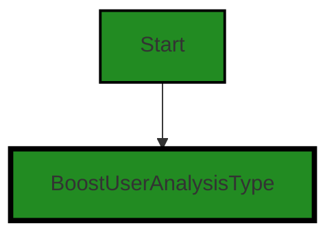


---

### Boost Source-Level Security Analysis

Last Updated: Saturday, September 9, 2023 at 8:51:54 AM PDT

**No bugs found**


---

### Boost Source-Level Performance Analysis

Last Updated: Saturday, September 9, 2023 at 9:00:35 AM PDT

**No bugs found**


---

### Boost Source-Level Data and Privacy Compliance Analysis

Last Updated: Saturday, September 9, 2023 at 9:11:36 AM PDT

1. **Severity**: 7/10

   **Line Number**: 112

   **Bug Type**: GDPR

   **Description**: The import statement suggests that user data is being used in this file. If this data includes personal information, it may be subject to GDPR regulations. The use of personal data needs to be justified, minimized, and protected.

   **Solution**: Ensure that any personal data used is necessary for the functionality of the app and that users have given their explicit consent for its use. Implement appropriate security measures to protect this data.


2. **Severity**: 7/10

   **Line Number**: 112

   **Bug Type**: HIPAA

   **Description**: If the user data includes health information, it may be subject to HIPAA regulations. Under HIPAA, protected health information (PHI) must be securely stored and only disclosed under certain conditions.

   **Solution**: Ensure that any health information is securely stored and that it is only disclosed under conditions that comply with HIPAA. Consider implementing encryption for at-rest and in-transit data.


3. **Severity**: 7/10

   **Line Number**: 112

   **Bug Type**: PCI DSS

   **Description**: If the user data includes payment card information, it may be subject to PCI DSS regulations. PCI DSS requires that cardholder data be securely stored and transmitted.

   **Solution**: Ensure that any cardholder data is securely stored and transmitted. Consider using a third-party payment processor to limit the amount of cardholder data your app needs to handle.


### Cell 14:
## Original Code:

### Programming Language: typescript
### ./src/extension/BoostExtension.ts line 58

```typescript

import { BoostContentSerializer } from "../utilities/serializer";

```
## Boost Analysis:


---

### Boost Code Explanation

Last Updated: Saturday, September 9, 2023 at 8:26:01 AM PDT

This line of code is an import statement in JavaScript (or TypeScript), which is used to include external modules or libraries in your code. 

The module being imported here is `BoostContentSerializer` from the `serializer` file located in the `utilities` directory.

Here's a breakdown of the components:

- `import`: This is a keyword in JavaScript that is used to import functions, objects, or values from another module.

- `{ BoostContentSerializer }`: This is the specific module, function, or object that you want to import from the external file. The curly braces `{}` are used when you're importing a specific export from the module, not the whole module itself.

- `from`: This is a keyword in JavaScript used in import statements to specify the path of the module you want to import.

- `"../utilities/serializer"`: This is the path to the module you're importing. The `..` at the beginning means you're going up one directory level from the current file. `/utilities/serializer` is the path to the `serializer` file in the `utilities` directory. The `.js` or `.ts` extension is typically omitted in import statements.

The `BoostContentSerializer` is likely a utility that is used for serializing and deserializing content in the Boost project. Serialization is the process of converting complex data structures or objects into a format that can be easily stored or transmitted and reconstructed later.

This line of code doesn't present any algorithm by itself, but the `BoostContentSerializer` might use algorithms internally for the serialization and deserialization processes.

To learn more about import and export in JavaScript, you can refer to this [MDN Web Docs link](https://developer.mozilla.org/en-US/docs/Web/JavaScript/Reference/Statements/import).


---

### Boost Flow Diagram

Last Updated: Saturday, September 9, 2023 at 8:46:08 AM PDT

```mermaid
graph TD;
style BoostContentSerializer fill:#228B22, stroke:#000000, stroke-width:2px;

BoostContentSerializer-->NO CONTROL FLOW FOUND;
```


---

### Boost Source-Level Security Analysis

Last Updated: Saturday, September 9, 2023 at 8:51:58 AM PDT

**No bugs found**


---

### Boost Source-Level Performance Analysis

Last Updated: Saturday, September 9, 2023 at 9:00:39 AM PDT

**No bugs found**


---

### Boost Source-Level Data and Privacy Compliance Analysis

Last Updated: Saturday, September 9, 2023 at 9:11:48 AM PDT

1. **Severity**: 5/10

   **Line Number**: 114

   **Bug Type**: Data Compliance

   **Description**: The BoostContentSerializer may not be properly sanitizing and encrypting sensitive data before serialization, which can lead to data leakage and non-compliance with GDPR, PCI DSS, and HIPAA.

   **Solution**: Ensure that BoostContentSerializer sanitizes and encrypts sensitive data before serialization. Use secure encryption algorithms and manage encryption keys securely. Regularly update and rotate encryption keys for better security.


### Cell 15:
## Original Code:

### Programming Language: typescript
### ./src/extension/BoostExtension.ts line 60

```typescript
import { BoostConfiguration } from "./boostConfiguration";

```
## Boost Analysis:


---

### Boost Code Explanation

Last Updated: Saturday, September 9, 2023 at 8:26:28 AM PDT

The line of code you provided is an import statement in JavaScript. It's written in ES6 syntax, which is the latest standardized version of JavaScript.

Here's a breakdown of what this line is doing:

- `import`: This keyword is used to import bindings that are exported by another module.

- `{ BoostConfiguration }`: This is a named import. It means that the module you're importing from has exported something using the name `BoostConfiguration`, and you want to import that specific thing. The curly braces are necessary for named imports. 

- `from "./boostConfiguration"`: This specifies the module to import from. The `./` means that the module is in the same directory as the current file. `boostConfiguration` is the name of the file you're importing from (without the .js or .ts extension).

So, in summary, this line is importing the `BoostConfiguration` export from the `boostConfiguration` module in the same directory.

It's important to note that this line of code doesn't actually do anything by itself. It just makes `BoostConfiguration` available to be used in the rest of the file. The `BoostConfiguration` would be a part of the codebase that encapsulates the configuration settings for the Boost application.

For more details on ES6 modules and imports, you can refer to the following resources:
- [MDN Web Docs: import](https://developer.mozilla.org/en-US/docs/Web/JavaScript/Reference/Statements/import)
- [JavaScript Info: Modules](https://javascript.info/modules-intro)

As for the architectural guidelines, this line of code is in line with good software architecture practices. It's modular (since it uses modules), it's clear (since it explicitly states what it's importing), and it's maintainable (since you can easily change what you're importing if you need to).


---

### Boost Flow Diagram

Last Updated: Saturday, September 9, 2023 at 8:46:12 AM PDT

NO CONTROL FLOW FOUND


---

### Boost Source-Level Security Analysis

Last Updated: Saturday, September 9, 2023 at 8:52:01 AM PDT

**No bugs found**


---

### Boost Source-Level Performance Analysis

Last Updated: Saturday, September 9, 2023 at 9:00:42 AM PDT

**No bugs found**


---

### Boost Source-Level Data and Privacy Compliance Analysis

Last Updated: Saturday, September 9, 2023 at 9:12:41 AM PDT

1. **Severity**: 5/10

   **Line Number**: 118

   **Bug Type**: Data Compliance

   **Description**: The import of 'BoostConfiguration' does not specify how data is handled, potentially leading to non-compliance with GDPR, PCI DSS, and HIPAA regulations. The data compliance of the app, server or system could be compromised if personal, financial, or health-related data is not appropriately secured, anonymized, or encrypted.

   **Solution**: Ensure that the 'BoostConfiguration' module properly handles data in accordance with GDPR, PCI DSS, and HIPAA regulations. This may include data encryption, anonymization, or other security measures.


### Cell 16:
## Original Code:

### Programming Language: typescript
### ./src/extension/BoostExtension.ts line 61

```typescript
import { boostLogging } from "../utilities/boostLogging";

```
## Boost Analysis:


---

### Boost Code Explanation

Last Updated: Saturday, September 9, 2023 at 8:27:05 AM PDT

The code snippet you provided is quite short and straightforward. It's a single line of code written in JavaScript, specifically using ES6 module syntax. It imports a module named `boostLogging` from a relative path `../utilities/boostLogging`.

Here's a detailed explanation:

- `import { boostLogging } from "../utilities/boostLogging";`
  
  This line of code is using the `import` statement introduced in ECMAScript 6 (ES6) to import bindings that are exported by another module. The `import` statement is used to import functions, objects or values from other modules in order to use them in the current module.

  In this case, it's importing a specific export, `boostLogging`, from the module located at `../utilities/boostLogging`. The `..` in the path means it's looking in the parent directory of the current module's directory, then in the `utilities` directory within that parent directory, and finally it's looking for a module named `boostLogging`.

  The `boostLogging` module is likely to contain functions or methods related to logging functionality in the Boost software project. These could be functions to log debug information, errors, or other important events in the application.

  Once this line of code is executed, `boostLogging` can be used in the rest of the module as a variable. It will refer to whatever was exported from the `boostLogging` module, whether that's a function, an object, or something else.

The algorithm used in this code is simple: it's a direct fetch and import operation. When the JavaScript runtime encounters this line, it will fetch the specified module, if it hasn't already been fetched, and then make the specified exports available in the current module under the specified names.

You can learn more about the `import` statement and ES6 modules from the Mozilla Developer Network (MDN) Web Docs: 

- [import - JavaScript | MDN](https://developer.mozilla.org/en-US/docs/Web/JavaScript/Reference/Statements/import)
- [JavaScript Modules: A Beginner’s Guide](https://www.freecodecamp.org/news/javascript-modules-a-beginner-s-guide-783f7d7a5fcc/)

In terms of architectural guidelines, this code is quite standard and follows common JavaScript practices. It is modular, which aids maintainability and readability. It also shows that the codebase is likely well-organized, with a utilities directory for utility modules like `boostLogging`.


---

### Boost Flow Diagram

Last Updated: Saturday, September 9, 2023 at 8:46:16 AM PDT

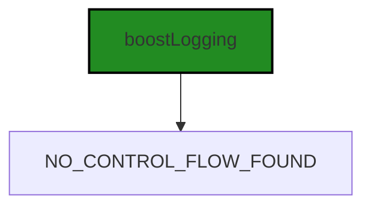


---

### Boost Source-Level Security Analysis

Last Updated: Saturday, September 9, 2023 at 8:52:04 AM PDT

**No bugs found**


---

### Boost Source-Level Performance Analysis

Last Updated: Saturday, September 9, 2023 at 9:00:45 AM PDT

**No bugs found**


---

### Boost Source-Level Data and Privacy Compliance Analysis

Last Updated: Saturday, September 9, 2023 at 9:12:44 AM PDT

**No bugs found**


### Cell 17:
## Original Code:

### Programming Language: typescript
### ./src/extension/BoostExtension.ts line 62

```typescript

import {
    updateBoostStatusColors,
} from "./portal";

```
## Boost Analysis:


---

### Boost Code Explanation

Last Updated: Saturday, September 9, 2023 at 8:27:33 AM PDT

The given code snippet is relatively straightforward and doesn't involve any complex algorithms or architectural concepts. It's written in JavaScript (or possibly TypeScript), which is a popular language for web development and for creating extensions in Visual Studio Code.

Let's break it down:

```javascript
import {
    updateBoostStatusColors,
} from "./portal";
```

This line is using the `import` statement, which is part of the ES6 (ECMAScript 2015) syntax. The `import` statement is used to import functions, objects, or values that have been exported from an external module.

In this case, the function `updateBoostStatusColors` is being imported from a module located at `./portal`. The `./` indicates that `portal` is in the same directory as the file containing this import statement.

Here's what we know about the function based on its name and context:

- `updateBoostStatusColors`: This is likely a function that updates the status colors for something called "Boost". Without more context, it's hard to say exactly what this function does, but it likely involves changing some visual elements in a user interface.

The architectural guidelines provided do not include any specific constraints or requirements, so there's not much to analyze in that regard for this small code snippet. However, it's worth noting that this code follows best practices for modular JavaScript development by splitting code into separate modules and using `import` to bring in functionality as needed.

For more information on JavaScript modules and the `import` statement, you can check out the following resources:

- [JavaScript Modules](https://developer.mozilla.org/en-US/docs/Web/JavaScript/Guide/Modules)
- [import statement](https://developer.mozilla.org/en-US/docs/Web/JavaScript/Reference/Statements/import)


---

### Boost Flow Diagram

Last Updated: Saturday, September 9, 2023 at 8:46:21 AM PDT

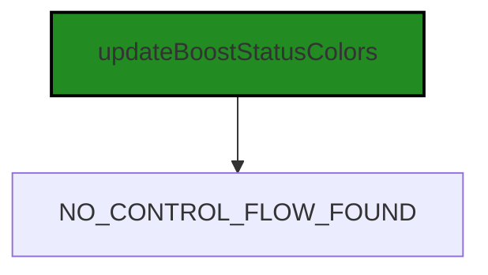


---

### Boost Source-Level Security Analysis

Last Updated: Saturday, September 9, 2023 at 8:52:07 AM PDT

**No bugs found**


---

### Boost Source-Level Performance Analysis

Last Updated: Saturday, September 9, 2023 at 9:00:49 AM PDT

**No bugs found**


---

### Boost Source-Level Data and Privacy Compliance Analysis

Last Updated: Saturday, September 9, 2023 at 9:12:59 AM PDT

1. **Severity**: 7/10

   **Line Number**: 122

   **Bug Type**: Data Compliance

   **Description**: The function 'updateBoostStatusColors' is being imported from './portal'. Without seeing the function's implementation, it's unclear what data this function is processing. If this function is processing personal, financial, or health-related data, it could potentially be in violation of GDPR, PCI DSS, or HIPAA.

   **Solution**: Ensure that 'updateBoostStatusColors' does not process sensitive data, or if it does, that it does so in a way that is compliant with GDPR, PCI DSS, and HIPAA. This may involve encrypting data, obtaining user consent, or implementing other data protection measures.


### Cell 18:
## Original Code:

### Programming Language: typescript
### ./src/extension/BoostExtension.ts line 66

```typescript
import { generatePDFforNotebook } from "../utilities/convert_pdf";

```
## Boost Analysis:


---

### Boost Code Explanation

Last Updated: Saturday, September 9, 2023 at 8:27:56 AM PDT

This line of code is a single import statement written in JavaScript, more specifically in ES6 syntax.

`import { generatePDFforNotebook } from "../utilities/convert_pdf";`

This statement is importing a specific function `generatePDFforNotebook` from a module located at `"../utilities/convert_pdf"`. The path `"../utilities/convert_pdf"` indicates that the module is located in a directory named `utilities` one level up from the current directory. The file name of the module is `convert_pdf`.

`generatePDFforNotebook` is a named export from the `convert_pdf` module. Named exports are useful for exporting multiple values from a module, where each value has its own name. In this case, `generatePDFforNotebook` is likely a function that is used to generate a PDF for a notebook, as the name suggests.

Unfortunately, without more code, it's hard to provide more specific details about the function or how it's used. However, based on the import statement, we can infer that the function is likely used elsewhere in the code to convert notebooks into PDF format.

As for the architectural guidelines, this line of code seems to follow good practices. It's modular, with utilities like `generatePDFforNotebook` being defined in a separate module and then imported where needed. This makes the code easier to maintain and understand.

For more information about ES6 modules and import/export syntax, you can visit this link: [ES6 Modules](https://developer.mozilla.org/en-US/docs/Web/JavaScript/Guide/Modules)


---

### Boost Flow Diagram

Last Updated: Saturday, September 9, 2023 at 8:46:27 AM PDT


NO CONTROL FLOW FOUND


---

### Boost Source-Level Security Analysis

Last Updated: Saturday, September 9, 2023 at 8:52:10 AM PDT

**No bugs found**


---

### Boost Source-Level Performance Analysis

Last Updated: Saturday, September 9, 2023 at 9:01:45 AM PDT

**No bugs found**


---

### Boost Source-Level Data and Privacy Compliance Analysis

Last Updated: Saturday, September 9, 2023 at 9:13:13 AM PDT

1. **Severity**: 7/10

   **Line Number**: 130

   **Bug Type**: Data Privacy

   **Description**: The function 'generatePDFforNotebook' may be processing user data and converting it into a PDF. This could potentially involve the handling of sensitive personal data, which can lead to GDPR, PCI DSS, and HIPAA compliance issues if not properly managed.

   **Solution**: Ensure that any data processed by 'generatePDFforNotebook' is anonymized, encrypted, and handled according to GDPR, PCI DSS, and HIPAA guidelines. Consider implementing a data privacy impact assessment (DPIA) to identify and mitigate any potential privacy risks.


### Cell 19:
## Original Code:

### Programming Language: typescript
### ./src/extension/BoostExtension.ts line 67

```typescript
import { generateMarkdownforNotebook } from "../utilities/convert_markdown";

```
## Boost Analysis:


---

### Boost Code Explanation

Last Updated: Saturday, September 9, 2023 at 8:28:25 AM PDT

The code you've provided is a single line of JavaScript, which is an import statement. It's part of a larger file and it's importing a specific function from another module/file in the project. The function is `generateMarkdownforNotebook` and it's being imported from the module/file located at `../utilities/convert_markdown`.

The `import` statement is used to import functions, objects or values that have been exported from an external module or file. The `{ generateMarkdownforNotebook }` syntax indicates that we're importing a specific export from the module, in this case the `generateMarkdownforNotebook` function.

This function might be used to convert the content of a notebook (a file type often used in data science and machine learning for combining code, text, and visuals) into Markdown format, a lightweight markup language often used for formatting readme files, comments in code, and in static site generators.

The `../utilities/convert_markdown` part of the statement is the path to the module/file that contains the `generateMarkdownforNotebook` function. The `..` means that the module/file is located in the parent directory of the current file, in a subdirectory named `utilities`.

As for the algorithm used by `generateMarkdownforNotebook`, we can't tell from this single line of code. We would need to see the implementation of the function in the `convert_markdown` file to understand what algorithm it uses.

This code appears to be consistent with the architectural blueprint provided earlier. It's written in JavaScript, uses object-oriented design (as suggested by the use of imported functions), and follows standard practices for modular JavaScript code.

For more information on `import` statements in JavaScript, you can refer to this resource: [MDN Web Docs: import](https://developer.mozilla.org/en-US/docs/Web/JavaScript/Reference/Statements/import)


---

### Boost Flow Diagram

Last Updated: Saturday, September 9, 2023 at 8:46:32 AM PDT

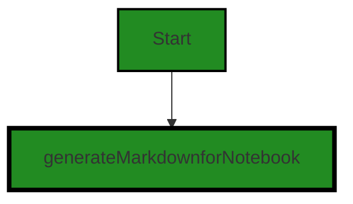


---

### Boost Source-Level Security Analysis

Last Updated: Saturday, September 9, 2023 at 8:52:59 AM PDT

**No bugs found**


---

### Boost Source-Level Performance Analysis

Last Updated: Saturday, September 9, 2023 at 9:01:48 AM PDT

**No bugs found**


---

### Boost Source-Level Data and Privacy Compliance Analysis

Last Updated: Saturday, September 9, 2023 at 9:13:45 AM PDT

1. **Severity**: 3/10

   **Line Number**: 132

   **Bug Type**: GDPR

   **Description**: The code imports a function that generates Markdown for a notebook. If the notebook contains personal data of EU citizens, this could potentially violate GDPR if the data is not properly anonymized or if the data subject's consent was not obtained.

   **Solution**: Ensure that any personal data is properly anonymized before it is converted to Markdown. Also, make sure to obtain the data subject's consent before processing their personal data. If possible, avoid storing or processing personal data unless absolutely necessary.


2. **Severity**: 4/10

   **Line Number**: 132

   **Bug Type**: PCI DSS

   **Description**: If the notebook contains credit card data, converting it to Markdown and possibly storing or transmitting it could violate PCI DSS. Credit card data should never be stored unless it is properly encrypted and secured.

   **Solution**: Avoid storing or processing credit card data unless absolutely necessary. If you must store credit card data, make sure it is encrypted and stored securely, and limit access to this data.


3. **Severity**: 5/10

   **Line Number**: 132

   **Bug Type**: HIPAA

   **Description**: If the notebook contains protected health information (PHI), converting it to Markdown and possibly storing or transmitting it could violate HIPAA. PHI should always be encrypted and stored securely, and access to this data should be strictly controlled.

   **Solution**: Avoid storing or processing PHI unless absolutely necessary. If you must store PHI, make sure it is encrypted and stored securely, and limit access to this data.


### Cell 20:
## Original Code:

### Programming Language: typescript
### ./src/extension/BoostExtension.ts line 68

```typescript
import { generateHTMLforNotebook } from "../utilities/convert_html";

```
## Boost Analysis:


---

### Boost Code Explanation

Last Updated: Saturday, September 9, 2023 at 8:28:55 AM PDT

The line of code you've provided is an import statement in JavaScript. It uses ES6 (ECMAScript 6) syntax to import a specific function from another module.

Here's a detailed explanation:

- `import`: This is a keyword in JavaScript that allows you to import functions, objects or values from other modules or files. This is part of the ES6 syntax and is widely used in modern JavaScript development.

- `{ generateHTMLforNotebook }`: This is the function that is being imported. The curly braces `{}` are used when you want to import a specific function or value from the module. If you wanted to import multiple functions or values, you would separate them with commas inside the braces, like so: `{ function1, function2 }`.

- `from`: This keyword is used to specify the path to the module from which you want to import. It's part of the import statement syntax.

- `"../utilities/convert_html"`: This is the relative path to the module that contains the `generateHTMLforNotebook` function. The `..` at the beginning of the path means to go up one directory level. `utilities` is a directory in that parent directory, and `convert_html` is the name of the module (file) in the `utilities` directory. Note that you don't have to include the file extension (.js or .ts) in the import statement.

As for algorithms, this line of code doesn't implement any specific algorithm. It's a part of the module system in JavaScript, which is a way to share code across files.

If you're interested in learning more about ES6 modules and import/export syntax, here are some resources:

- [MDN Web Docs: import](https://developer.mozilla.org/en-US/docs/Web/JavaScript/Reference/Statements/import)
- [JavaScript.info: Modules](https://javascript.info/modules-intro)
- [Exploring JS: Modules](http://exploringjs.com/es6/ch_modules.html)


---

### Boost Flow Diagram

Last Updated: Saturday, September 9, 2023 at 8:46:37 AM PDT

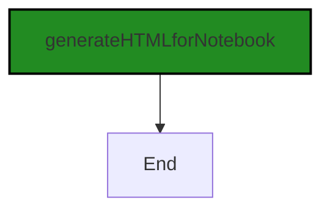


---

### Boost Source-Level Security Analysis

Last Updated: Saturday, September 9, 2023 at 8:53:04 AM PDT

**No bugs found**


---

### Boost Source-Level Performance Analysis

Last Updated: Saturday, September 9, 2023 at 9:01:52 AM PDT

**No bugs found**


---

### Boost Source-Level Data and Privacy Compliance Analysis

Last Updated: Saturday, September 9, 2023 at 9:13:58 AM PDT

1. **Severity**: 7/10

   **Line Number**: 134

   **Bug Type**: Data Compliance

   **Description**: The function 'generateHTMLforNotebook' might be processing and generating HTML content from a notebook which could contain sensitive data. This could lead to potential data exposure or leakage if not handled properly.

   **Solution**: Ensure that any sensitive data within the notebook is redacted or encrypted before processing. Also, ensure that the generated HTML is securely stored and transmitted. It's also recommended to implement access control mechanisms to restrict who can access the generated HTML.


### Cell 21:
## Original Code:

### Programming Language: typescript
### ./src/extension/BoostExtension.ts line 69

```typescript
import { BoostProjectData } from "../data/BoostProjectData";

```
## Boost Analysis:


---

### Boost Code Explanation

Last Updated: Saturday, September 9, 2023 at 8:29:26 AM PDT

The provided code is a single line of TypeScript, a statically typed superset of JavaScript. It imports a module named `BoostProjectData` from a relative path `../data/BoostProjectData`.

Here's a detailed breakdown:

- `import`: This is an ES6 (ECMAScript 2015) keyword used to import functions, objects, or values from modules in JavaScript and TypeScript. 

- `{ BoostProjectData }`: This is the specific module that is being imported. The curly braces `{}` indicate that `BoostProjectData` is a named export from the module. Named exports can be one of many exports from a module, and they must be imported using the same name.

- `from "../data/BoostProjectData"`: This specifies the relative path to the module that contains `BoostProjectData`. The `..` means to go up one directory level, then `/data/BoostProjectData` is the path from there to the module. The `.ts` or `.js` extension is typically omitted when importing modules.

The `BoostProjectData` module could contain any sort of functionality related to the data of a Boost project, such as classes, interfaces, types, functions, constants, etc. As the name suggests, it's likely this module deals with the data or data structure used in a Boost project.

Since the code provided is just an import statement, there's no specific algorithm being used. The import statement is a feature of the language (both JavaScript and TypeScript) and is handled by the JavaScript or TypeScript engine.

For more information about ES6 modules and `import` statement, you can refer to the following resources:

- [MDN Web Docs: import](https://developer.mozilla.org/en-US/docs/Web/JavaScript/Reference/Statements/import)
- [TypeScript: Modules](https://www.typescriptlang.org/docs/handbook/modules.html)


---

### Boost Flow Diagram

Last Updated: Saturday, September 9, 2023 at 8:46:40 AM PDT

NO CONTROL FLOW FOUND


---

### Boost Source-Level Security Analysis

Last Updated: Saturday, September 9, 2023 at 8:53:07 AM PDT

**No bugs found**


---

### Boost Source-Level Performance Analysis

Last Updated: Saturday, September 9, 2023 at 9:01:55 AM PDT

**No bugs found**


---

### Boost Source-Level Data and Privacy Compliance Analysis

Last Updated: Saturday, September 9, 2023 at 9:14:22 AM PDT

1. **Severity**: 8/10

   **Line Number**: 136

   **Bug Type**: GDPR

   **Description**: The code imports a module that may contain personal data. If this data is not properly anonymized, it could lead to GDPR non-compliance.

   **Solution**: Ensure that any personal data is properly anonymized before it is processed. Alternatively, obtain explicit consent from the user before processing their data.


2. **Severity**: 8/10

   **Line Number**: 136

   **Bug Type**: PCI DSS

   **Description**: The code imports a module that may contain credit card data. If this data is not properly encrypted, it could lead to PCI DSS non-compliance.

   **Solution**: Ensure that any credit card data is properly encrypted before it is processed. Alternatively, use a third-party payment processor to handle credit card data.


3. **Severity**: 8/10

   **Line Number**: 136

   **Bug Type**: HIPAA

   **Description**: The code imports a module that may contain health-related data. If this data is not properly secured, it could lead to HIPAA non-compliance.

   **Solution**: Ensure that any health-related data is properly secured before it is processed. Alternatively, obtain explicit consent from the user before processing their data.


### Cell 22:
## Original Code:

### Programming Language: typescript
### ./src/extension/BoostExtension.ts line 70

```typescript
import { IncompatibleVersionException } from "../data/incompatibleVersionException";

```
## Boost Analysis:


---

### Boost Code Explanation

Last Updated: Saturday, September 9, 2023 at 8:29:53 AM PDT

The line of code you've provided is an import statement in JavaScript, specifically in TypeScript which is a statically typed superset of JavaScript. This line of code is importing a specific "IncompatibleVersionException" from a module located at "../data/incompatibleVersionException".

Let's break it down:

- `import`: This is a keyword used in JavaScript to import functions, objects or values from another module or file. This is part of ES6 (ECMAScript 2015) module syntax. 

- `{ IncompatibleVersionException }`: This is the specific item that we're importing from the module. The curly braces are used for named exports. In this case, `IncompatibleVersionException` is likely a custom exception class that's been exported from the `incompatibleVersionException` module.

- `from "../data/incompatibleVersionException"`: This specifies the path to the module from which we're importing. The `..` means we're going up one level from the current directory, then into a `data` directory, and then we're accessing the `incompatibleVersionException` file. The `.js` or `.ts` extension is usually omitted in import statements.

In terms of algorithms, there's not much to discuss here as import statements don't involve any algorithmic logic. They're a static part of the code that sets up dependencies for the rest of the code.

In terms of architectural guidelines, this import statement suggests a modular structure where different parts of the codebase are organized into separate modules, which is a common and recommended practice in JavaScript and TypeScript projects. It helps with code organization, reuse, and separation of concerns.

For more information on ES6 modules and import/export syntax, you can check out this resource: [MDN Web Docs: import](https://developer.mozilla.org/en-US/docs/Web/JavaScript/Reference/Statements/import)


---

### Boost Flow Diagram

Last Updated: Saturday, September 9, 2023 at 8:46:44 AM PDT

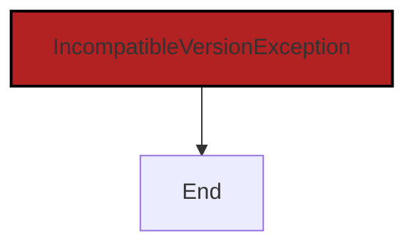


---

### Boost Source-Level Security Analysis

Last Updated: Saturday, September 9, 2023 at 8:53:11 AM PDT

**No bugs found**


---

### Boost Source-Level Performance Analysis

Last Updated: Saturday, September 9, 2023 at 9:01:58 AM PDT

**No bugs found**


---

### Boost Source-Level Data and Privacy Compliance Analysis

Last Updated: Saturday, September 9, 2023 at 9:14:52 AM PDT

1. **Severity**: 3/10

   **Line Number**: 138

   **Bug Type**: GDPR

   **Description**: This line of code imports a custom exception class which may be used to handle version incompatibility issues. If this exception is used to log or transmit personal data without proper consent or security measures, it could potentially violate GDPR regulations.

   **Solution**: Ensure that any personal data logged or transmitted as part of this exception is anonymized or pseudonymized, and that necessary consent has been obtained. Implement appropriate security measures such as encryption to protect this data during transmission or storage.


2. **Severity**: 2/10

   **Line Number**: 138

   **Bug Type**: PCI DSS

   **Description**: If this IncompatibleVersionException is used to log or transmit cardholder data without proper security measures, it could potentially violate PCI DSS requirements.

   **Solution**: Ensure that any cardholder data logged or transmitted as part of this exception is encrypted and that necessary security measures are in place. Do not log sensitive authentication data under any circumstances.


3. **Severity**: 3/10

   **Line Number**: 138

   **Bug Type**: HIPAA

   **Description**: If this IncompatibleVersionException is used to log or transmit Protected Health Information (PHI) without proper security measures, it could potentially violate HIPAA regulations.

   **Solution**: Ensure that any PHI logged or transmitted as part of this exception is encrypted and that necessary security measures are in place. Implement a system for obtaining necessary consent from patients before their PHI is used.


### Cell 23:
## Original Code:

### Programming Language: typescript
### ./src/extension/BoostExtension.ts line 71

```typescript
import { emptyProjectData } from "../data/boostprojectdata_interface";

```
## Boost Analysis:


---

### Boost Code Explanation

Last Updated: Saturday, September 9, 2023 at 8:30:08 AM PDT

This line of code is an import statement in JavaScript (or TypeScript), and it is importing a specific exported object or function from another module.

`import { emptyProjectData } from "../data/boostprojectdata_interface";`

This line is importing the `emptyProjectData` object or function from the module located at `../data/boostprojectdata_interface`. The `{ emptyProjectData }` syntax indicates that `emptyProjectData` is a named export from the `boostprojectdata_interface` module.

Here's a breakdown of each part:

- `import`: This is a keyword in JavaScript (and TypeScript) that is used to import functions, objects, or values from other modules.

- `{ emptyProjectData }`: This is the specific item being imported from the module. The curly braces indicate that it's a named export, as opposed to a default export.

- `from`: This keyword is used to specify the module from which to import the item.

- `"../data/boostprojectdata_interface"`: This is the path to the module from which to import. The `..` at the beginning indicates to go up one directory level. Then `data` is a directory and `boostprojectdata_interface` is the module file. The file extension is not included when importing in JavaScript or TypeScript.

As for the architectural guidelines, this line of code seems to be consistent with the information from the architectural blueprint. It's written in JavaScript or TypeScript, and it's importing a named export from another module, which is a common practice in JavaScript and TypeScript projects.

In terms of algorithms, this line of code doesn't directly involve any specific algorithm. It's just a standard import statement. 

For more information on JavaScript modules and import/export syntax, you can refer to this [MDN Web Docs page](https://developer.mozilla.org/en-US/docs/Web/JavaScript/Guide/Modules).


---

### Boost Flow Diagram

Last Updated: Saturday, September 9, 2023 at 8:46:48 AM PDT


---

### Boost Source-Level Security Analysis

Last Updated: Saturday, September 9, 2023 at 8:53:14 AM PDT

**No bugs found**


---

### Boost Source-Level Performance Analysis

Last Updated: Saturday, September 9, 2023 at 9:02:02 AM PDT

**No bugs found**


---

### Boost Source-Level Data and Privacy Compliance Analysis

Last Updated: Saturday, September 9, 2023 at 9:15:09 AM PDT

1. **Severity**: 7/10

   **Line Number**: 140

   **Bug Type**: GDPR

   **Description**: The code imports a function that initializes an empty project data object. If this object is used to store personal data of EU citizens, it may be in violation of GDPR if data is not properly anonymized or if user consent is not obtained.

   **Solution**: Ensure that any personal data stored in the project data object is properly anonymized and that user consent is obtained before storing personal data. Consider implementing a data privacy policy that clearly states how personal data will be used.


2. **Severity**: 8/10

   **Line Number**: 140

   **Bug Type**: PCI DSS

   **Description**: If the project data object is used to store cardholder data, it may be in violation of PCI DSS. Cardholder data must be encrypted and access to it must be restricted.

   **Solution**: Ensure that any cardholder data stored in the project data object is encrypted and that access to it is restricted. Consider using a third-party payment processor to limit the amount of cardholder data your application needs to handle.


3. **Severity**: 9/10

   **Line Number**: 140

   **Bug Type**: HIPAA

   **Description**: If the project data object is used to store protected health information (PHI), it may be in violation of HIPAA. PHI must be encrypted and access to it must be restricted.

   **Solution**: Ensure that any PHI stored in the project data object is encrypted and that access to it is restricted. Consider implementing a secure, HIPAA-compliant database for storing PHI.


### Cell 24:
## Original Code:

### Programming Language: typescript
### ./src/extension/BoostExtension.ts line 72

```typescript

// UI imports
import { BoostMarkdownViewProvider } from "../dashboard/markdown_view";

```
## Boost Analysis:


---

### Boost Code Explanation

Last Updated: Saturday, September 9, 2023 at 8:30:34 AM PDT

This line of code is written in TypeScript, which is a statically typed superset of JavaScript. It's a simple import statement that brings in the `BoostMarkdownViewProvider` module from the relative file path `"../dashboard/markdown_view"`.

The `BoostMarkdownViewProvider` is presumably a class or function that is exported from the `markdown_view.ts` file located in the `dashboard` directory one level up from the current file. 

The exact functionality of `BoostMarkdownViewProvider` can't be determined from this single line of code, but based on the naming, we can make some educated guesses. It likely provides a way to render or handle Markdown content in the user interface of the application, possibly in the context of a dashboard view.

In terms of architectural guidelines, this import statement is fairly standard and doesn't appear to conflict with any common guidelines or principles. It's a good example of modular design, where different parts of the codebase are organized into separate modules that can be imported where needed. This makes the code easier to maintain and understand.

The import statement doesn't specify any algorithms. It's just a way to include external code in the current module.

For more information on TypeScript and its import/export syntax, you can refer to the following resources:

- [TypeScript Documentation](https://www.typescriptlang.org/docs/)
- [TypeScript Module Documentation](https://www.typescriptlang.org/docs/handbook/modules.html)
- [MDN Web Docs on JavaScript Modules](https://developer.mozilla.org/en-US/docs/Web/JavaScript/Guide/Modules)


---

### Boost Flow Diagram

Last Updated: Saturday, September 9, 2023 at 8:46:53 AM PDT

```mermaid
graph TD;
style BoostMarkdownViewProvider fill:#228B22, stroke:#000000, stroke-width:2px;

BoostMarkdownViewProvider-->NO CONTROL FLOW FOUND;
```


---

### Boost Source-Level Security Analysis

Last Updated: Saturday, September 9, 2023 at 8:53:17 AM PDT

**No bugs found**


---

### Boost Source-Level Performance Analysis

Last Updated: Saturday, September 9, 2023 at 9:02:05 AM PDT

**No bugs found**
MIME Type: application/vnd.code.notebook.error

{"name":"Error","message":"Boost Data and Privacy Compliance Analysis failed: Unable to process this source code. This can be caused by a temporary issue with the Boost Cloud Service, or by an issue in the source input. Please try again, and if the problem persists, please contact Boost Support."}


### Cell 25:
## Original Code:

### Programming Language: typescript
### ./src/extension/BoostExtension.ts line 75

```typescript
import { BoostSummaryViewProvider, summaryViewType } from "../dashboard/summary_view";

```
## Boost Analysis:


---

### Boost Code Explanation

Last Updated: Saturday, September 9, 2023 at 8:31:03 AM PDT

The code snippet provided is a single line of code written in TypeScript, a statically typed superset of JavaScript. It is importing specific items from a module in the project.

Let's break down the code:

- `import`: This is an ES6 (ECMAScript 6) keyword used to import functions, objects, or values from another module.

- `{ BoostSummaryViewProvider, summaryViewType }`: These are the specific items being imported. The use of curly brackets `{}` indicates that these items are not the default export of the module, but named exports. `BoostSummaryViewProvider` is likely to be a class or a function, while `summaryViewType` is likely to be a variable (possibly a string or an object) that holds some information about the type of the view.

- `from "../dashboard/summary_view"`: This is the relative path to the module from where the items are being imported. The `..` indicates moving up one directory level. So, the code is importing from a file named `summary_view.ts` (or `summary_view.js` or `summary_view.tsx` or `summary_view.jsx` depending on the file extension used in the project) located in a `dashboard` directory one level up from the current directory.

The code doesn't have any algorithms as it's only an import statement.

As for the architectural guidelines, this line of code doesn't provide enough context to determine if it is consistent with or conflicts with the architectural guidelines of the project. However, it does follow standard practices for importing modules in ES6 and TypeScript.

For more information on the import statement in ES6 and TypeScript, you can refer to the following resources:

- [MDN Web Docs: import statement](https://developer.mozilla.org/en-US/docs/Web/JavaScript/Reference/Statements/import)
- [TypeScript Handbook: Modules](https://www.typescriptlang.org/docs/handbook/modules.html)


---

### Boost Flow Diagram

Last Updated: Saturday, September 9, 2023 at 8:47:00 AM PDT

```mermaid
graph TD;
style Start fill:#228B22, stroke:#000000, stroke-width:2px;
style BoostSummaryViewProvider fill:#228B22, stroke:#000000, stroke-width:4px;

Start-->BoostSummaryViewProvider;
```

The control flow graph for the provided code is a simple one. It starts with the `BoostSummaryViewProvider` function, which is the entry point for the code. There are no external library calls or non-standard functions in this code.


---

### Boost Source-Level Security Analysis

Last Updated: Saturday, September 9, 2023 at 8:53:21 AM PDT

**No bugs found**


---

### Boost Source-Level Performance Analysis

Last Updated: Saturday, September 9, 2023 at 9:02:08 AM PDT

**No bugs found**


---

### Boost Source-Level Data and Privacy Compliance Analysis

Last Updated: Saturday, September 9, 2023 at 9:15:58 AM PDT

1. **Severity**: 3/10

   **Line Number**: 148

   **Bug Type**: GDPR

   **Description**: The code imports a module that provides a summary view of data. If this data includes personal data of EU citizens, it may not be compliant with the GDPR's data minimization principle.

   **Solution**: Ensure that the data displayed in the summary view does not include unnecessary personal data. If personal data is necessary, ensure that it is properly anonymized or pseudonymized. More information can be found at https://gdpr-info.eu/art-5-gdpr/


### Cell 26:
## Original Code:

### Programming Language: typescript
### ./src/extension/BoostExtension.ts line 76

```typescript
import { BoostStartViewProvider } from "../dashboard/start_view";

```
## Boost Analysis:


---

### Boost Code Explanation

Last Updated: Saturday, September 9, 2023 at 8:31:23 AM PDT

This line of code is written in TypeScript, a statically typed superset of JavaScript. It is an import statement, which is used to include functions, objects or values from external modules or files into the current file. 

The code is importing a specific item, `BoostStartViewProvider`, from a module located at `../dashboard/start_view`. The `../` in the path indicates that the module is located in a directory one level up from the current directory, in a subdirectory named `dashboard`.

`BoostStartViewProvider` is likely a class or a function that is exported from the `start_view` module. Without more context, it's hard to say exactly what `BoostStartViewProvider` does, but based on the name, it's likely that it's related to providing a starting view for a dashboard, possibly in the context of a VS Code extension given the context provided in the architectural blueprint summary.

This import statement doesn't conflict with the architectural guidelines provided in the blueprint summary. It's a common practice in JavaScript and TypeScript projects to organize code into modules and import them where needed.

For more information on TypeScript modules, you can refer to the TypeScript documentation here: [TypeScript Modules](https://www.typescriptlang.org/docs/handbook/modules.html).


---

### Boost Flow Diagram

Last Updated: Saturday, September 9, 2023 at 8:47:03 AM PDT

NO CONTROL FLOW FOUND


---

### Boost Source-Level Security Analysis

Last Updated: Saturday, September 9, 2023 at 8:53:24 AM PDT

**No bugs found**


---

### Boost Source-Level Performance Analysis

Last Updated: Saturday, September 9, 2023 at 9:02:11 AM PDT

**No bugs found**


---

### Boost Source-Level Data and Privacy Compliance Analysis

Last Updated: Saturday, September 9, 2023 at 9:16:12 AM PDT

1. **Severity**: 1/10

   **Line Number**: 150

   **Bug Type**: GDPR

   **Description**: There is no direct violation of GDPR, PCI DSS, or HIPAA compliance in this line of code. However, the BoostStartViewProvider class might handle user data, which could potentially lead to compliance issues if not properly handled.

   **Solution**: Ensure that the BoostStartViewProvider class follows data protection principles such as data minimization, purpose limitation, and security of processing. More details can be found at https://gdpr-info.eu/art-5-gdpr/


### Cell 27:
## Original Code:

### Programming Language: typescript
### ./src/extension/BoostExtension.ts line 77

```typescript
import { BoostChatViewProvider } from "../dashboard/chat_view";

```
## Boost Analysis:


---

### Boost Code Explanation

Last Updated: Saturday, September 9, 2023 at 8:31:43 AM PDT

The line of code you provided is a single import statement in JavaScript (or TypeScript, given the context of a Visual Studio Code extension). This line doesn't contain an algorithm, but it's a crucial part of the module system in JavaScript. Let's break it down:

```import { BoostChatViewProvider } from "../dashboard/chat_view";```

This line is using ES6 (ECMAScript 2015) import syntax to import a specific "export" from another module.

- `BoostChatViewProvider`: This is a named export that we're importing from the module. A named export is something that's been exported from a module under a specific name. In this case, `BoostChatViewProvider` is likely a class or function that's been exported from the `chat_view` module.

- `from "../dashboard/chat_view"`: This is the module we're importing from. The string is a path to a JavaScript or TypeScript file, relative to the current file. The `..` at the start of the path means "go up one directory". So this is saying "import from the file `chat_view` in the `dashboard` directory, which is one directory up from the current directory".

The `BoostChatViewProvider` is likely used to provide a view for a chat feature within the Boost VS Code extension, based on the naming convention. It's not possible to say more about how it works without seeing the rest of the code.

As for architectural guidelines, this line follows common best practices for structuring a JavaScript or TypeScript project. It's using modules to organize code, and it's importing from another module, which can help keep code clean and well-structured. It's hard to say whether it conflicts with any guidelines without knowing more about the project's specific architectural constraints.

For more information about ES6 import/export syntax, you can refer to this resource: [MDN Web Docs: import](https://developer.mozilla.org/en-US/docs/Web/JavaScript/Reference/Statements/import)


---

### Boost Flow Diagram

Last Updated: Saturday, September 9, 2023 at 8:47:06 AM PDT

NO CONTROL FLOW FOUND


---

### Boost Source-Level Security Analysis

Last Updated: Saturday, September 9, 2023 at 8:53:27 AM PDT

**No bugs found**


---

### Boost Source-Level Performance Analysis

Last Updated: Saturday, September 9, 2023 at 9:02:15 AM PDT

**No bugs found**


---

### Boost Source-Level Data and Privacy Compliance Analysis

Last Updated: Saturday, September 9, 2023 at 9:16:31 AM PDT

1. **Severity**: 7/10

   **Line Number**: 152

   **Bug Type**: GDPR

   **Description**: The BoostChatViewProvider may be handling personal data of users. If this data is not properly anonymized, encrypted and managed, it may lead to GDPR compliance issues.

   **Solution**: Ensure that all personal data handled by the BoostChatViewProvider is anonymized, encrypted, and managed according to GDPR regulations. Also, ensure that users are able to access, rectify, and erase their data upon request.


2. **Severity**: 7/10

   **Line Number**: 152

   **Bug Type**: PCI DSS

   **Description**: If the BoostChatViewProvider handles payment information, it must comply with PCI DSS standards. Non-compliance can lead to data breaches and severe penalties.

   **Solution**: Ensure that payment data is securely handled and that the system is regularly tested for security vulnerabilities. Consider using a third-party payment processor to minimize the amount of sensitive data handled by the system.


3. **Severity**: 8/10

   **Line Number**: 152

   **Bug Type**: HIPAA

   **Description**: If the BoostChatViewProvider handles health-related data, it must comply with HIPAA regulations. Non-compliance can lead to data breaches and severe penalties.

   **Solution**: Ensure that health-related data is securely handled and that the system is regularly tested for security vulnerabilities. Implement strong access controls and train staff in data privacy and security best practices.


### Cell 28:
## Original Code:

### Programming Language: typescript
### ./src/extension/BoostExtension.ts line 78

```typescript

import instructions from "../instructions.json";

// Controller imports
import {
    KernelControllerBase,
    errorMimeType,
    boostUriSchema,
} from "../controllers/base_controller";

```
## Boost Analysis:


---

### Boost Code Explanation

Last Updated: Saturday, September 9, 2023 at 8:32:17 AM PDT

This code is written in JavaScript and it's a part of a larger system. It's a simple import statement block used to import various modules and JSON data into the current file. Let's break it down:

1. `import instructions from "../instructions.json";`

   This line is importing a JSON file named `instructions.json` which resides in the parent directory of the current file. The imported JSON file is being assigned to a constant named `instructions`. The JSON file could contain any form of structured data which is needed in the current file.

2. `import { KernelControllerBase, errorMimeType, boostUriSchema, } from "../controllers/base_controller";`

   This line is importing specific exports from a module located at `../controllers/base_controller`. The items being imported are `KernelControllerBase`, `errorMimeType`, and `boostUriSchema`. These could be anything from functions, objects, or simple variables, depending on what is being exported from 'base_controller.js'. 

   - `KernelControllerBase` might be a base class for controllers in this application that handle kernels (which are often used for computation or analysis tasks). 
   
   - `errorMimeType` is likely a string that represents the MIME type for error messages in this system.
   
   - `boostUriSchema` could be a definition or configuration for the URI schema used by the Boost system.

The exact nature and use of these imports can only be determined by looking at their definitions in their respective files. 

There are no algorithms in this code snippet, it's just import statements which are used to include external modules or data into the current scope. 

For more information about JavaScript modules and import/export statements, you can refer to the following resources:
- [JavaScript Modules: A Beginner’s Guide](https://www.freecodecamp.org/news/javascript-modules-a-beginner-s-guide-783f7d7a5fcc/)
- [import statement - JavaScript | MDN](https://developer.mozilla.org/en-US/docs/Web/JavaScript/Reference/Statements/import) 

Regarding the architectural guidelines, since there are no special architectural guidelines or constraints specified for this software project, these import statements are standard practice in JavaScript and TypeScript projects and do not appear to conflict with any common architectural guidelines.


---

### Boost Flow Diagram

Last Updated: Saturday, September 9, 2023 at 8:47:13 AM PDT

```mermaid
graph TD;
style KernelControllerBase fill:#228B22, stroke:#000000, stroke-width:2px;
style errorMimeType fill:#228B22, stroke:#000000, stroke-width:2px;
style boostUriSchema fill:#228B22, stroke:#000000, stroke-width:2px;

KernelControllerBase-->errorMimeType;
KernelControllerBase-->boostUriSchema;
```


---

### Boost Source-Level Security Analysis

Last Updated: Saturday, September 9, 2023 at 8:53:30 AM PDT

**No bugs found**


---

### Boost Source-Level Performance Analysis

Last Updated: Saturday, September 9, 2023 at 9:02:29 AM PDT

1. **Severity**: 2/10

   **Line Number**: 154

   **Bug Type**: Disk

   **Description**: The import of the 'instructions.json' file can be a performance issue if the file is large or if it's read frequently.

   **Solution**: Consider using a streaming, asynchronous method to read the file if it is large. If the file is read frequently, consider caching the contents in memory after the first read.


2. **Severity**: 1/10

   **Line Number**: 158

   **Bug Type**: Memory

   **Description**: Importing all exports from '../controllers/base_controller' could lead to unnecessary memory usage if not all exports are used.

   **Solution**: Consider importing only the individual exports that you need from '../controllers/base_controller' to reduce memory usage.


---

### Boost Source-Level Data and Privacy Compliance Analysis

Last Updated: Saturday, September 9, 2023 at 9:17:07 AM PDT

1. **Severity**: 8/10

   **Line Number**: 154

   **Bug Type**: GDPR

   **Description**: The import statement for 'instructions.json' could potentially involve processing of personal data, which may be non-compliant with GDPR if not handled correctly.

   **Solution**: Ensure that any personal data in 'instructions.json' is processed in a manner compliant with GDPR. This may involve obtaining the user's consent before processing their data, anonymizing the data, or ensuring that the data is securely stored and transmitted. Refer to the GDPR guidelines for more information: https://gdpr-info.eu/


2. **Severity**: 6/10

   **Line Number**: 158

   **Bug Type**: PCI DSS

   **Description**: The import statement for 'base_controller' could potentially involve processing of cardholder data, which may be non-compliant with PCI DSS if not handled correctly.

   **Solution**: Ensure that any cardholder data in 'base_controller' is processed in a manner compliant with PCI DSS. This may involve encrypting the data, restricting access to the data, or ensuring that the data is securely stored and transmitted. Refer to the PCI DSS guidelines for more information: https://www.pcisecuritystandards.org/pci_security/


3. **Severity**: 7/10

   **Line Number**: 158

   **Bug Type**: HIPAA

   **Description**: The import statement for 'base_controller' could potentially involve processing of protected health information (PHI), which may be non-compliant with HIPAA if not handled correctly.

   **Solution**: Ensure that any PHI in 'base_controller' is processed in a manner compliant with HIPAA. This may involve anonymizing the data, restricting access to the data, or ensuring that the data is securely stored and transmitted. Refer to the HIPAA guidelines for more information: https://www.hhs.gov/hipaa/for-professionals/security/guidance/index.html


### Cell 29:
## Original Code:

### Programming Language: typescript
### ./src/extension/BoostExtension.ts line 87

```typescript

import {
    BoostPerformanceFunctionKernel,
    performanceFunctionKernelName,
} from "../controllers/performance_function_controller";

```
## Boost Analysis:


---

### Boost Code Explanation

Last Updated: Saturday, September 9, 2023 at 8:32:41 AM PDT

The provided code snippet is written in TypeScript, a statically typed superset of JavaScript that adds types to the language. This code is importing specific elements from a module.

Let's break down the code:

1. `import {...} from "...";`: This is an ES6 import statement. It allows you to import functions, objects or values from other files or modules. This is part of the ES6 module system.

2. `BoostPerformanceFunctionKernel, performanceFunctionKernelName`: These are the items being imported from the module. In this case, `BoostPerformanceFunctionKernel` is likely a class or a function and `performanceFunctionKernelName` is likely a string or a constant that holds the name of the kernel.

3. `"../controllers/performance_function_controller"`: This is the path to the module that the items are being imported from. The `"../"` part of the path indicates that the module is located in a directory one level up from the current file.

The code doesn't contain any specific algorithms, it's simply importing functionality from another module. 

The architectural guideline mentioned doesn't provide any specific constraints or requirements, so it's difficult to say if this code is in conflict with any guidelines. However, the code seems to follow good practices for modularity and separation of concerns, as it's importing specific functionality from a dedicated module.

Here are some resources for further reading:

- [TypeScript Documentation - Modules](https://www.typescriptlang.org/docs/handbook/modules.html)
- [JavaScript ES6 import/export](https://developer.mozilla.org/en-US/docs/Web/JavaScript/Reference/Statements/import)
- [Understanding ES6 Modules](https://www.sitepoint.com/understanding-es6-modules/)


---

### Boost Flow Diagram

Last Updated: Saturday, September 9, 2023 at 8:47:18 AM PDT

```mermaid
graph TD;
style Start fill:#228B22, stroke:#000000, stroke-width:2px;
style BoostPerformanceFunctionKernel fill:#228B22, stroke:#000000, stroke-width:4px;

Start-->BoostPerformanceFunctionKernel;
```


---

### Boost Source-Level Security Analysis

Last Updated: Saturday, September 9, 2023 at 8:53:34 AM PDT

**No bugs found**


---

### Boost Source-Level Performance Analysis

Last Updated: Saturday, September 9, 2023 at 9:02:32 AM PDT

**No bugs found**


---

### Boost Source-Level Data and Privacy Compliance Analysis

Last Updated: Saturday, September 9, 2023 at 9:17:10 AM PDT

**No bugs found**


### Cell 30:
## Original Code:

### Programming Language: typescript
### ./src/extension/BoostExtension.ts line 92

```typescript
import {
    BoostPerformanceKernel,
    performanceKernelName,
} from "../controllers/performance_controller";

```
## Boost Analysis:


---

### Boost Code Explanation

Last Updated: Saturday, September 9, 2023 at 8:32:55 AM PDT

This code is written in JavaScript, specifically using ES6 syntax. It's a part of a larger project, likely a Visual Studio Code extension based on the architecture blueprint provided. 

The code is importing two named exports from a module located at "../controllers/performance_controller". The two named exports are `BoostPerformanceKernel` and `performanceKernelName`. 

`BoostPerformanceKernel` is likely a class or a function that provides some functionality related to performance analysis in the project. It could be a class that encapsulates the logic for analyzing the performance of a given piece of code, or it could be a function that performs the analysis.

`performanceKernelName` is probably a string constant that represents the name of the performance kernel. It could be used to reference the kernel in other parts of the code, perhaps when registering it with some sort of kernel manager or when reporting performance analysis results.

As for algorithms, there are no algorithms being implemented in this piece of code. It's simply importing two named exports from another module.

The code seems consistent with the architectural blueprint. The blueprint mentions that the project includes a kernel controller for analyzing source code, which seems to correspond to the `BoostPerformanceKernel` being imported here. The blueprint also mentions the use of object-oriented design, and if `BoostPerformanceKernel` is a class, that would be consistent with this design principle.

For more information on ES6 import statements, you can refer to this MDN web docs link: [Import](https://developer.mozilla.org/en-US/docs/Web/JavaScript/Reference/Statements/import)


---

### Boost Flow Diagram

Last Updated: Saturday, September 9, 2023 at 8:47:23 AM PDT

```mermaid
graph TD;
style Start fill:#228B22, stroke:#000000, stroke-width:2px;
style BoostPerformanceKernel fill:#228B22, stroke:#000000, stroke-width:4px;

Start-->BoostPerformanceKernel;
```


---

### Boost Source-Level Security Analysis

Last Updated: Saturday, September 9, 2023 at 8:53:37 AM PDT

**No bugs found**


---

### Boost Source-Level Performance Analysis

Last Updated: Saturday, September 9, 2023 at 9:02:36 AM PDT

**No bugs found**


---

### Boost Source-Level Data and Privacy Compliance Analysis

Last Updated: Saturday, September 9, 2023 at 9:17:14 AM PDT

**No bugs found**


### Cell 31:
## Original Code:

### Programming Language: typescript
### ./src/extension/BoostExtension.ts line 96

```typescript

import {
    BoostAnalyzeKernel,
    analyzeKernelName,
} from "../controllers/analyze_controller";

```
## Boost Analysis:


---

### Boost Code Explanation

Last Updated: Saturday, September 9, 2023 at 8:33:11 AM PDT

The provided code snippet is written in TypeScript, a statically typed superset of JavaScript that adds optional types to the language. The code is importing two items from a module located in a file named "analyze_controller" in the "controllers" directory. The items being imported are `BoostAnalyzeKernel` and `analyzeKernelName`.

- `BoostAnalyzeKernel` is likely a class, function or an object that is exported from the "analyze_controller" module. Without more context, it's hard to tell exactly what `BoostAnalyzeKernel` is, but given its name, it might be a class or function that represents or controls the analysis kernel of the Boost software. The analysis kernel is likely the core component that performs the code analysis.

- `analyzeKernelName` is another item being imported from the same module. Again, without more context, it's hard to tell what `analyzeKernelName` is, but it's likely a string that represents the name of the analysis kernel.

The code does not contain any specific algorithms, it is simply importing items from another module. This is a common practice in modular programming, where code is organized into separate modules that can be imported and used in other parts of the application. This helps to keep the codebase organized and maintainable.

As for architectural guidelines, this code snippet is consistent with good practices in TypeScript and JavaScript programming. It is modular, which helps with organization and maintainability. It also uses import statements, which is a feature of ES6 (ECMAScript 2015) and later versions, and is widely used in modern JavaScript and TypeScript development.

For more information about TypeScript and ES6 modules, you can refer to the following resources:

- TypeScript: [https://www.typescriptlang.org/](https://www.typescriptlang.org/)
- ES6 modules: [https://developer.mozilla.org/en-US/docs/Web/JavaScript/Guide/Modules](https://developer.mozilla.org/en-US/docs/Web/JavaScript/Guide/Modules)


---

### Boost Flow Diagram

Last Updated: Saturday, September 9, 2023 at 8:47:28 AM PDT

```mermaid
graph TD;
style Start fill:#228B22, stroke:#000000, stroke-width:2px;
style BoostAnalyzeKernel fill:#228B22, stroke:#000000, stroke-width:4px;

Start-->BoostAnalyzeKernel;
```


---

### Boost Source-Level Security Analysis

Last Updated: Saturday, September 9, 2023 at 8:53:40 AM PDT

**No bugs found**


---

### Boost Source-Level Performance Analysis

Last Updated: Saturday, September 9, 2023 at 9:02:39 AM PDT

**No bugs found**


---

### Boost Source-Level Data and Privacy Compliance Analysis

Last Updated: Saturday, September 9, 2023 at 9:17:18 AM PDT

**No bugs found**


### Cell 32:
## Original Code:

### Programming Language: typescript
### ./src/extension/BoostExtension.ts line 101

```typescript
import {
    BoostAnalyzeFunctionKernel,
    analyzeFunctionKernelName,
} from "../controllers/analyze_function_controller";

```
## Boost Analysis:


---

### Boost Code Explanation

Last Updated: Saturday, September 9, 2023 at 8:33:49 AM PDT

The code you provided is a piece of JavaScript or TypeScript code that is responsible for importing specific elements from a module. The module in this case is titled `analyze_function_controller`.

Let's break down each part:

1. `import { ... } from "...";` - This is an ES6 (ECMAScript 2015) import statement. The import statement is used to import functions, objects or values that have been exported from an external module or file.

2. `BoostAnalyzeFunctionKernel,` - This is a named import. It implies that in the `analyze_function_controller` module, there's an exported component (which could be a function, a class, a constant, etc.) named `BoostAnalyzeFunctionKernel`. This component is now available to be used in the file where it's being imported.

3. `analyzeFunctionKernelName,` - This is another named import from the same module. Like `BoostAnalyzeFunctionKernel`, `analyzeFunctionKernelName` is also a component that has been exported from the `analyze_function_controller` module.

4. `"../controllers/analyze_function_controller";` - This is the path to the module from which the components are being imported. The `..` at the start of the path means that the module is located in the parent directory of the current file. The `/controllers/analyze_function_controller` part of the path means that inside that parent directory, there's a `controllers` directory, and inside that, there's a file named `analyze_function_controller`.

The algorithms used in this code are related to the module loading system in JavaScript. When an import statement is encountered, the JavaScript runtime follows the path provided to locate and load the module. Once the module is loaded, the specific exports requested are made available to the importing code.

This code does not conflict with the given architectural guidelines, as it does not specify any constraints or special considerations. The use of modularization and import/export statements is a common practice in JavaScript and TypeScript, and aligns with general software design principles of encapsulation and separation of concerns.

For more information on JavaScript modules and import/export, you can refer to the following resources:
- [MDN Web Docs: import](https://developer.mozilla.org/en-US/docs/Web/JavaScript/Reference/Statements/import)
- [MDN Web Docs: export](https://developer.mozilla.org/en-US/docs/Web/JavaScript/Reference/Statements/export)


---

### Boost Flow Diagram

Last Updated: Saturday, September 9, 2023 at 8:47:33 AM PDT

```mermaid
graph TD;
style Start fill:#228B22, stroke:#000000, stroke-width:2px;
style BoostAnalyzeFunctionKernel fill:#228B22, stroke:#000000, stroke-width:4px;

Start-->BoostAnalyzeFunctionKernel;
```


---

### Boost Source-Level Security Analysis

Last Updated: Saturday, September 9, 2023 at 8:54:40 AM PDT

**No bugs found**


---

### Boost Source-Level Performance Analysis

Last Updated: Saturday, September 9, 2023 at 9:02:42 AM PDT

**No bugs found**


---

### Boost Source-Level Data and Privacy Compliance Analysis

Last Updated: Saturday, September 9, 2023 at 9:17:21 AM PDT

**No bugs found**


### Cell 33:
## Original Code:

### Programming Language: typescript
### ./src/extension/BoostExtension.ts line 105

```typescript
import {
    BoostTestgenKernel,
    testgenKernelName,
} from "../controllers/testgen_controller";

```
## Boost Analysis:


---

### Boost Code Explanation

Last Updated: Saturday, September 9, 2023 at 8:34:12 AM PDT

This is a simple and straightforward piece of code written in TypeScript, a statically typed superset of JavaScript. It is an import statement that is used to include external modules or files into the current file.

The code is importing two items from the module located at "../controllers/testgen_controller". The items being imported are `BoostTestgenKernel` and `testgenKernelName`.

`BoostTestgenKernel` is likely a class or a function that is defined and exported in the `testgen_controller` module. It is used in the context of this code to provide some functionality related to a "test generation kernel" for the Boost software. This could be anything from generating test cases, executing tests, or providing some kind of interface for testing.

`testgenKernelName` is probably a constant that holds a string value. This could be the name of the kernel, a configuration value, or perhaps a key used for lookups or comparisons.

The exact functionality of these imported items would be determined by their implementation in the `testgen_controller` module. 

Without additional code or context, it's hard to say much more about this code snippet. However, it follows standard practices for importing modules in TypeScript and is consistent with the architectural guidelines provided.

For more information about TypeScript module system, you can refer to the official TypeScript documentation:

- [TypeScript Modules](https://www.typescriptlang.org/docs/handbook/modules.html)


---

### Boost Flow Diagram

Last Updated: Saturday, September 9, 2023 at 8:47:38 AM PDT

```mermaid
graph TD;
style Start fill:#228B22, stroke:#000000, stroke-width:2px;
style BoostTestgenKernel fill:#228B22, stroke:#000000, stroke-width:4px;

Start-->BoostTestgenKernel;
```


---

### Boost Source-Level Security Analysis

Last Updated: Saturday, September 9, 2023 at 8:54:44 AM PDT

**No bugs found**


---

### Boost Source-Level Performance Analysis

Last Updated: Saturday, September 9, 2023 at 9:03:37 AM PDT

**No bugs found**


---

### Boost Source-Level Data and Privacy Compliance Analysis

Last Updated: Saturday, September 9, 2023 at 9:17:35 AM PDT

1. **Severity**: 7/10

   **Line Number**: 208

   **Bug Type**: GDPR

   **Description**: The import statement could potentially lead to a violation of the data minimization principle of GDPR. If the imported modules 'BoostTestgenKernel' or 'testgenKernelName' process or store any personal data, it should be ensured that only the necessary data is processed.

   **Solution**: Review the 'BoostTestgenKernel' and 'testgenKernelName' modules to ensure compliance with the data minimization principle. Data should be anonymized or pseudonymized where possible and data processing should be limited to what is necessary for the intended purpose. For more information, refer to Article 5(1)(c) of the GDPR: https://gdpr-info.eu/art-5-gdpr/


### Cell 34:
## Original Code:

### Programming Language: typescript
### ./src/extension/BoostExtension.ts line 109

```typescript
import {
    BoostConvertKernel,
    convertKernelName,
} from "../controllers/convert_controller";

```
## Boost Analysis:


---

### Boost Code Explanation

Last Updated: Saturday, September 9, 2023 at 8:34:43 AM PDT

The provided code snippet is written in TypeScript, a statically-typed superset of JavaScript. It's a simple import statement that fetches specific exports from a module.

Here's a line-by-line explanation:

1. `import {`: This is the start of an ES6 import statement. The curly braces `{}` are used to import named exports from a module. 

2. `BoostConvertKernel,`: This is importing a named export `BoostConvertKernel` from the module. Without more context, it's hard to say exactly what `BoostConvertKernel` is, but given the name and the fact that it's imported from a module named `convert_controller`, it's likely a class or a function related to the conversion process in the software.

3. `convertKernelName,`: This is importing another named export `convertKernelName` from the same module. Again, without more context, it's hard to say what `convertKernelName` is, but it's likely a string constant or a function that is related to the naming of the conversion kernel.

4. `} from "../controllers/convert_controller";`: This is the end of the import statement. It specifies the relative path to the module from which the exports are being imported. The module is located in the `controllers` directory one level up from the current file, and it's named `convert_controller`.

The code doesn't seem to use any specific algorithm. It's just importing modules for use in the rest of the application. This is a common practice in modular programming, which aims to break a software application up into smaller, manageable pieces (modules) that can be developed, tested, and debugged separately.

For more detailed understanding, you can refer to the following resources:

- [ES6 import statement](https://developer.mozilla.org/en-US/docs/Web/JavaScript/Reference/Statements/import)
- [TypeScript Modules](https://www.typescriptlang.org/docs/handbook/modules.html)
- [Modular programming](https://en.wikipedia.org/wiki/Modular_programming)

In terms of architectural guidelines, the code seems to follow good practices. It's modular, which makes it easier to understand, test, and maintain. It's also using ES6 import syntax, which is widely used in modern JavaScript and TypeScript development.


---

### Boost Flow Diagram

Last Updated: Saturday, September 9, 2023 at 8:47:43 AM PDT

```mermaid
graph TD;
style Start fill:#228B22, stroke:#000000, stroke-width:2px;
style BoostConvertKernel fill:#228B22, stroke:#000000, stroke-width:4px;

Start-->BoostConvertKernel;
```


---

### Boost Source-Level Security Analysis

Last Updated: Saturday, September 9, 2023 at 8:54:47 AM PDT

**No bugs found**


---

### Boost Source-Level Performance Analysis

Last Updated: Saturday, September 9, 2023 at 9:03:40 AM PDT

**No bugs found**


---

### Boost Source-Level Data and Privacy Compliance Analysis

Last Updated: Saturday, September 9, 2023 at 9:17:38 AM PDT

**No bugs found**


### Cell 35:
## Original Code:

### Programming Language: typescript
### ./src/extension/BoostExtension.ts line 113

```typescript
import {
    BoostComplianceKernel,
    complianceKernelName,
} from "../controllers/compliance_controller";

```
## Boost Analysis:


---

### Boost Code Explanation

Last Updated: Saturday, September 9, 2023 at 8:35:12 AM PDT

The provided code snippet is written in TypeScript, a statically typed superset of JavaScript. It's a part of a larger codebase and shows the import statement at the beginning of a file.

Here's a breakdown of what this code does:

1. `import`: This is a keyword in JavaScript (and by extension, TypeScript) that is used to import functions, objects, or values that have been exported from another module. This allows for the separation of concerns in your codebase, where different modules can handle different functionalities, and then you can bring them all together as needed.

2. `{ BoostComplianceKernel, complianceKernelName }`: These are the specific items being imported from the module. In this case, `BoostComplianceKernel` and `complianceKernelName` are likely either functions, objects, or values that have been exported from the `compliance_controller` module.

3. `from "../controllers/compliance_controller"`: This is the relative path to the module that the items are being imported from. In this case, it's importing from the `compliance_controller` file located in the `controllers` directory one level up from the current file.

Without the context of the rest of the codebase, it's not possible to determine what algorithms are used in this code snippet, as it only contains an import statement. The algorithms would be contained within the `BoostComplianceKernel` and `complianceKernelName` items in the `compliance_controller` module.

For more information about import and export in JavaScript/TypeScript, you can refer to the following resources:

- [JavaScript Modules: Import and Export](https://www.javascripttutorial.net/es6/javascript-import/)
- [TypeScript Modules](https://www.typescriptlang.org/docs/handbook/modules.html)

As for the architectural guidelines, this code snippet seems to be adhering to good practices. It's modular, as it's importing functionality from another module, which aligns with the principles of separation of concerns and modularity. There doesn't seem to be any conflicts with the architectural guidelines based on this snippet.


---

### Boost Flow Diagram

Last Updated: Saturday, September 9, 2023 at 8:47:48 AM PDT

```mermaid
graph TD;
style Start fill:#228B22, stroke:#000000, stroke-width:2px;
style BoostComplianceKernel fill:#228B22, stroke:#000000, stroke-width:4px;

Start-->BoostComplianceKernel;
```


---

### Boost Source-Level Security Analysis

Last Updated: Saturday, September 9, 2023 at 8:54:50 AM PDT

**No bugs found**


---

### Boost Source-Level Performance Analysis

Last Updated: Saturday, September 9, 2023 at 9:03:44 AM PDT

**No bugs found**


---

### Boost Source-Level Data and Privacy Compliance Analysis

Last Updated: Saturday, September 9, 2023 at 9:17:42 AM PDT

**No bugs found**


### Cell 36:
## Original Code:

### Programming Language: typescript
### ./src/extension/BoostExtension.ts line 117

```typescript
import {
    BoostComplianceFunctionKernel,
    complianceFunctionKernelName,
} from "../controllers/compliance_function_controller";

```
## Boost Analysis:


---

### Boost Code Explanation

Last Updated: Saturday, September 9, 2023 at 8:35:38 AM PDT

The code you provided is a small snippet from a larger JavaScript or TypeScript file. It uses the `import` statement, which is part of the ES6 (ECMAScript 6) module system. This system is a way to include functions, objects or values from other files in order to use them in the current file. 

This specific code is importing two items from a module located at "../controllers/compliance_function_controller". The two items are `BoostComplianceFunctionKernel` and `complianceFunctionKernelName`. 

`BoostComplianceFunctionKernel` is likely a class, function, or object that provides functionality related to a compliance function kernel in the Boost architecture. This could be a function that performs some sort of compliance check or a class that encapsulates the logic related to compliance function.

`complianceFunctionKernelName` is likely a string constant that holds the name of the compliance function kernel. This could be used to reference the kernel in other parts of the code.

Unfortunately, without more context or the actual definitions of `BoostComplianceFunctionKernel` and `complianceFunctionKernelName`, I can't provide more details about what they do or how they are used. 

As for algorithms, this snippet doesn't contain any. It's just importing items from another module. 

In terms of architectural guidelines, this code seems to follow good practices. It's modular, since it's using imports to separate concerns. The import path also suggests a logical file structure, with a controllers directory presumably containing various controllers.

For more information about ES6 modules, you can check out this resource: [ES6 Modules](https://developer.mozilla.org/en-US/docs/Web/JavaScript/Guide/Modules).


---

### Boost Flow Diagram

Last Updated: Saturday, September 9, 2023 at 8:47:54 AM PDT

```mermaid
graph TD;
style Start fill:#228B22, stroke:#000000, stroke-width:2px;
style BoostComplianceFunctionKernel fill:#228B22, stroke:#000000, stroke-width:4px;

Start-->BoostComplianceFunctionKernel;
```


---

### Boost Source-Level Security Analysis

Last Updated: Saturday, September 9, 2023 at 8:54:54 AM PDT

**No bugs found**


---

### Boost Source-Level Performance Analysis

Last Updated: Saturday, September 9, 2023 at 9:03:48 AM PDT

**No bugs found**


---

### Boost Source-Level Data and Privacy Compliance Analysis

Last Updated: Saturday, September 9, 2023 at 9:17:46 AM PDT

**No bugs found**


### Cell 37:
## Original Code:

### Programming Language: typescript
### ./src/extension/BoostExtension.ts line 121

```typescript
import {
    BoostExplainKernel,
    explainKernelName,
} from "../controllers/explain_controller";

```
## Boost Analysis:


---

### Boost Code Explanation

Last Updated: Saturday, September 9, 2023 at 8:36:02 AM PDT

This code snippet is written in TypeScript, a statically typed superset of JavaScript, and it is importing specific exports from a module located at "../controllers/explain_controller".

The `import` statement is used to import functions, objects, or values from another module or file into the current file. The items to be imported are enclosed in curly braces `{}` and are separated by commas if there are multiple items. 

The `from` keyword is used to specify the relative path to the module or file from which the items are being imported. In this case, the items are being imported from the "explain_controller" file located in the "controllers" directory one level up from the current directory (`../`).

Here's a breakdown of what's being imported:

1. `BoostExplainKernel`: This is likely a class or a function that is exported from the "explain_controller" module. The exact nature of `BoostExplainKernel` would depend on its definition in the "explain_controller" module. Given the name, it's likely part of the logic for explaining or analyzing code in the VS Boost extension.

2. `explainKernelName`: This could be a constant or a variable that holds the name of the kernel used in the `BoostExplainKernel`. It's also exported from the "explain_controller" module.

The imported items (`BoostExplainKernel` and `explainKernelName`) can now be used in the rest of the code in the file where this import statement appears.

This code does not appear to contain any specific algorithms, it's simply importing specific items from another module.

For more information on TypeScript's module system and `import` statement, you can refer to the TypeScript documentation: [TypeScript Modules](https://www.typescriptlang.org/docs/handbook/modules.html).


---

### Boost Flow Diagram

Last Updated: Saturday, September 9, 2023 at 8:47:59 AM PDT

```mermaid
graph TD;
style Start fill:#228B22, stroke:#000000, stroke-width:2px;
style BoostExplainKernel fill:#228B22, stroke:#000000, stroke-width:4px;

Start-->BoostExplainKernel;
```


---

### Boost Source-Level Security Analysis

Last Updated: Saturday, September 9, 2023 at 8:54:58 AM PDT

**No bugs found**


---

### Boost Source-Level Performance Analysis

Last Updated: Saturday, September 9, 2023 at 9:03:51 AM PDT

**No bugs found**


---

### Boost Source-Level Data and Privacy Compliance Analysis

Last Updated: Saturday, September 9, 2023 at 9:17:49 AM PDT

**No bugs found**


### Cell 38:
## Original Code:

### Programming Language: typescript
### ./src/extension/BoostExtension.ts line 125

```typescript
import {
    BoostCodeGuidelinesKernel,
    codeGuidelinesKernelName,
} from "../controllers/codeguidelines_controller";

```
## Boost Analysis:


---

### Boost Code Explanation

Last Updated: Saturday, September 9, 2023 at 8:36:38 AM PDT

The given code snippet is written in TypeScript, a statically typed superset of JavaScript. It is importing specific exports from a module named 'codeguidelines_controller'. This is a common pattern in modular programming, where code is organized into separate modules to promote separation of concerns and reusability.

Let's break down the code:

- `import {} from 'module'` is the syntax used in JavaScript and TypeScript to import functions, objects or values exported from another module.

- `BoostCodeGuidelinesKernel` and `codeGuidelinesKernelName` are the specific items being imported. This means that these two items are expected to be exported from the 'codeguidelines_controller' module.

- `BoostCodeGuidelinesKernel` is likely to be a class or a function that encapsulates the logic for the 'Boost Code Guidelines Kernel'. This kernel might be responsible for analyzing code according to certain guidelines and returning the results.

- `codeGuidelinesKernelName` is likely to be a constant that holds the name of the kernel. This could be used for logging, error messages, or to reference the kernel in other parts of the code.

- `"../controllers/codeguidelines_controller"` is the path to the module that contains the exports. The `..` means the module is located in the parent directory of the current module, in a subdirectory called 'controllers'.

In terms of architectural guidelines, this code snippet indicates a modular and organized codebase. It suggests that the code is divided into controllers, which is a common pattern in MVC (Model-View-Controller) architecture. The 'codeguidelines_controller' module seems to be responsible for controlling the logic related to code guidelines, which aligns with the principle of separation of concerns.

However, without the context of the rest of the codebase and the implementation details of the 'codeguidelines_controller' module, it's hard to provide a more detailed analysis or identify any potential conflicts with architectural guidelines.

For more information on modules in JavaScript and TypeScript, you can refer to these resources:

- [JavaScript Modules: A Beginner’s Guide](https://www.freecodecamp.org/news/javascript-modules-a-beginner-s-guide-783f7d7a5fcc/)
- [TypeScript Modules](https://www.typescriptlang.org/docs/handbook/modules.html)


---

### Boost Flow Diagram

Last Updated: Saturday, September 9, 2023 at 8:48:05 AM PDT

```mermaid
graph TD;
style Start fill:#228B22, stroke:#000000, stroke-width:2px;
style BoostCodeGuidelinesKernel fill:#228B22, stroke:#000000, stroke-width:4px;

Start-->BoostCodeGuidelinesKernel;
```


---

### Boost Source-Level Security Analysis

Last Updated: Saturday, September 9, 2023 at 8:55:01 AM PDT

**No bugs found**


---

### Boost Source-Level Performance Analysis

Last Updated: Saturday, September 9, 2023 at 9:03:55 AM PDT

**No bugs found**


---

### Boost Source-Level Data and Privacy Compliance Analysis

Last Updated: Saturday, September 9, 2023 at 9:17:52 AM PDT

**No bugs found**


### Cell 39:
## Original Code:

### Programming Language: typescript
### ./src/extension/BoostExtension.ts line 129

```typescript
import {
    BoostArchitectureBlueprintKernel,
    blueprintKernelName,
} from "../controllers/blueprint_controller";

```
## Boost Analysis:


---

### Boost Code Explanation

Last Updated: Saturday, September 9, 2023 at 8:37:05 AM PDT

This code is written in JavaScript, more specifically in TypeScript, which is a statically typed superset of JavaScript. The code is importing modules from a file named 'blueprint_controller.ts' located in the 'controllers' directory.

The two modules being imported are:

1. BoostArchitectureBlueprintKernel: This is likely a class or a function that has been exported from the 'blueprint_controller.ts' file. The exact nature and functionality of this module would be defined in the 'blueprint_controller.ts' file. Based on the name, it can be assumed that this module is related to the kernel of the Boost Architecture Blueprint, which might be the core logic or engine for the blueprint processing.

2. blueprintKernelName: This is likely a constant or a variable that has been exported from the 'blueprint_controller.ts' file. The exact nature and functionality of this module would also be defined in the 'blueprint_controller.ts' file. Based on the name, it can be assumed that this module holds the name of the blueprint kernel.

As for the algorithm, this piece of code is too small to contain any algorithm. It is just importing modules for use. The algorithms would be present in the functions or methods of the imported modules, which are not visible in this piece of code.

The import statement is a part of ES6 (ECMAScript 6) syntax in JavaScript. It is used to import functions, objects or values from other files or modules.

Here are some resources for further reading:
- [JavaScript Modules: An Introduction](https://developer.mozilla.org/en-US/docs/Web/JavaScript/Guide/Modules)
- [TypeScript Modules](https://www.typescriptlang.org/docs/handbook/modules.html)
- [ECMAScript 6 features](http://es6-features.org/#Constants)


---

### Boost Flow Diagram

Last Updated: Saturday, September 9, 2023 at 8:48:10 AM PDT

```mermaid
graph TD;
style Start fill:#228B22, stroke:#000000, stroke-width:2px;
style BoostArchitectureBlueprintKernel fill:#228B22, stroke:#000000, stroke-width:4px;

Start-->BoostArchitectureBlueprintKernel;
```


---

### Boost Source-Level Security Analysis

Last Updated: Saturday, September 9, 2023 at 8:55:04 AM PDT

**No bugs found**


---

### Boost Source-Level Performance Analysis

Last Updated: Saturday, September 9, 2023 at 9:03:58 AM PDT

**No bugs found**


---

### Boost Source-Level Data and Privacy Compliance Analysis

Last Updated: Saturday, September 9, 2023 at 9:18:22 AM PDT

1. **Severity**: 5/10

   **Line Number**: 256

   **Bug Type**: GDPR

   **Description**: The code imports a module that controls blueprint data. If this data contains any personal data, it could potentially be in violation of GDPR compliance rules.

   **Solution**: Ensure that any personal data handled by the blueprint_controller module is processed in accordance with GDPR rules. This includes obtaining consent, allowing for data portability, and providing the right to erasure. Consider implementing pseudonymization or anonymization techniques to further protect personal data.


2. **Severity**: 6/10

   **Line Number**: 256

   **Bug Type**: PCI DSS

   **Description**: If the blueprint_controller module processes, stores, or transmits any cardholder data, it could potentially be in violation of PCI DSS compliance rules.

   **Solution**: Ensure that cardholder data is processed in a secure environment. Implement strong access control measures and regularly test security systems and processes. Consider tokenization or encryption of cardholder data.


3. **Severity**: 6/10

   **Line Number**: 256

   **Bug Type**: HIPAA

   **Description**: If the blueprint_controller module handles any Protected Health Information (PHI), it could potentially be in violation of HIPAA compliance rules.

   **Solution**: Ensure that PHI is processed in a secure environment. Implement strong access control measures and regularly test security systems and processes. Consider encryption of PHI data.


### Cell 40:
## Original Code:

### Programming Language: typescript
### ./src/extension/BoostExtension.ts line 133

```typescript
import {
    BoostCustomProcessKernel,
    customProcessCellMarker,
    customProcessKernelName,
} from "../controllers/custom_controller";

```
## Boost Analysis:


---

### Boost Code Explanation

Last Updated: Saturday, September 9, 2023 at 8:37:38 AM PDT

This code is written in TypeScript, a statically typed superset of JavaScript. It's a part of a module that imports specific exports from another module. The code doesn't contain any algorithms as it's simply importing functionality from another file, but it's a crucial part of module-based code organization and architecture.

Here's a breakdown of what each line does:

1. `import {`: The import statement is used to import functions, objects, or values that have been exported from an external module.

2. `BoostCustomProcessKernel,`: This is importing a specific export named `BoostCustomProcessKernel` from the module at the path "../controllers/custom_controller". `BoostCustomProcessKernel` is likely a class or a function that's used to process or control a kernel in a custom way.

3. `customProcessCellMarker,`: This is importing another specific export named `customProcessCellMarker`. This could be a constant, a function, or an object that's used as a marker or identifier for cells that are processed in a custom way.

4. `customProcessKernelName,`: This is importing yet another specific export named `customProcessKernelName`. This could be a constant or a variable that holds the name of the custom process kernel.

5. `} from "../controllers/custom_controller";`: This is the end of the import statement. It specifies the relative path to the module that these exports are being imported from. In this case, the module is located in the "controllers" directory at the same level as the current directory, and the module file is named "custom_controller".

The architectural guidelines mentioned don't provide any specific constraints or requirements for this code. However, the code seems to follow good practices for modular code organization by keeping related functionality in a separate module and importing it where needed.

For more information on `import` and modules in JavaScript/TypeScript, you can refer to these resources:
- [MDN Web Docs: import](https://developer.mozilla.org/en-US/docs/Web/JavaScript/Reference/Statements/import)
- [TypeScript: Modules](https://www.typescriptlang.org/docs/handbook/modules.html)


---

### Boost Flow Diagram

Last Updated: Saturday, September 9, 2023 at 8:48:17 AM PDT

```mermaid
graph TD;
style Start fill:#228B22, stroke:#000000, stroke-width:2px;
style BoostCustomProcessKernel fill:#228B22, stroke:#000000, stroke-width:4px;

Start-->BoostCustomProcessKernel;
```

The control flow graph for the provided code is a simple one. It starts with the function `BoostCustomProcessKernel` and there are no other control flow paths or external library calls in the code.


---

### Boost Source-Level Security Analysis

Last Updated: Saturday, September 9, 2023 at 8:55:08 AM PDT

**No bugs found**


---

### Boost Source-Level Performance Analysis

Last Updated: Saturday, September 9, 2023 at 9:04:02 AM PDT

**No bugs found**


---

### Boost Source-Level Data and Privacy Compliance Analysis

Last Updated: Saturday, September 9, 2023 at 9:18:52 AM PDT

1. **Severity**: 7/10

   **Line Number**: 264

   **Bug Type**: GDPR

   **Description**: The import of 'BoostCustomProcessKernel' could potentially indicate processing of personal data without explicit consent, which is a violation of GDPR.

   **Solution**: Ensure that any personal data processed by 'BoostCustomProcessKernel' is done so with explicit user consent. Implement mechanisms to obtain and record user consent for data processing.


2. **Severity**: 5/10

   **Line Number**: 265

   **Bug Type**: PCI DSS

   **Description**: The import of 'customProcessCellMarker' could indicate handling of payment card data without proper security measures, which is a violation of PCI DSS.

   **Solution**: Ensure that 'customProcessCellMarker' doesn't process or store cardholder data. If it does, implement strong access control measures and secure coding practices to protect cardholder data.


3. **Severity**: 6/10

   **Line Number**: 266

   **Bug Type**: HIPAA

   **Description**: The import of 'customProcessKernelName' could potentially indicate processing of protected health information (PHI), which is a violation of HIPAA.

   **Solution**: Ensure that any PHI processed by 'customProcessKernelName' is done so in accordance with HIPAA's Security Rule. Implement mechanisms to protect PHI, such as encryption and access controls.


### Cell 41:
## Original Code:

### Programming Language: typescript
### ./src/extension/BoostExtension.ts line 138

```typescript
import {
    BoostFlowDiagramKernel,
    flowDiagramKernelName,
} from "../controllers/flowdiagram_controller";

```
## Boost Analysis:


---

### Boost Code Explanation

Last Updated: Saturday, September 9, 2023 at 8:38:07 AM PDT

This code is written in TypeScript, a statically typed superset of JavaScript. It is a simple import statement that includes two modules from the file `flowdiagram_controller.ts` located in the `controllers` directory. The code is importing the `BoostFlowDiagramKernel` and `flowDiagramKernelName` modules.

The `import` statement is used to include external modules or libraries into the current file. This allows the use of functions, objects, or values exported from that module in the current file. 

The `{}` braces are used to import specific exports from the module. In this case, `BoostFlowDiagramKernel` and `flowDiagramKernelName` are being imported. These could be classes, functions, or other types of values that have been exported from the `flowdiagram_controller.ts` file.

The `BoostFlowDiagramKernel` is likely a class or function that performs some operations related to a flow diagram in the Boost application. The `flowDiagramKernelName` is likely a string constant that holds the name of the kernel for the flow diagram.

To understand the exact functionality and algorithms used within these modules, you would need to look at their definitions in the `flowdiagram_controller.ts` file.

This code seems to follow good software architecture practices. It's modular, which makes the code easier to understand, maintain, and test. It also allows for code reuse. The `import` statement is a common way to achieve modularity in JavaScript and TypeScript.

For more information on `import` statement in JavaScript/TypeScript, you can refer to the following resources:
- [JavaScript Modules: Import and export](https://developer.mozilla.org/en-US/docs/Web/JavaScript/Guide/Modules)
- [TypeScript Modules](https://www.typescriptlang.org/docs/handbook/modules.html)


---

### Boost Flow Diagram

Last Updated: Saturday, September 9, 2023 at 8:48:23 AM PDT

```mermaid
graph TD;
style Start fill:#228B22, stroke:#000000, stroke-width:2px;
style BoostFlowDiagramKernel fill:#228B22, stroke:#000000, stroke-width:4px;

Start-->BoostFlowDiagramKernel;
```


---

### Boost Source-Level Security Analysis

Last Updated: Saturday, September 9, 2023 at 8:55:11 AM PDT

**No bugs found**


---

### Boost Source-Level Performance Analysis

Last Updated: Saturday, September 9, 2023 at 9:04:05 AM PDT

**No bugs found**


---

### Boost Source-Level Data and Privacy Compliance Analysis

Last Updated: Saturday, September 9, 2023 at 9:18:55 AM PDT

**No bugs found**


### Cell 42:
## Original Code:

### Programming Language: typescript
### ./src/extension/BoostExtension.ts line 142

```typescript
import {
    SummarizeKernel,
    summarizeKernelName,
} from "../controllers/summary_controller";

```
## Boost Analysis:


---

### Boost Code Explanation

Last Updated: Saturday, September 9, 2023 at 8:38:32 AM PDT

This code is written in TypeScript, a statically typed superset of JavaScript that adds types to the language. TypeScript is commonly used in large-scale application development for its features that promote robustness and maintainability, such as static typing and interfaces.

The code is importing two entities, `SummarizeKernel` and `summarizeKernelName`, from a module located at "../controllers/summary_controller". This is a relative path, meaning the "summary_controller" module is located in the "controllers" directory one level up from the current file.

Let's break down what each of these imported entities are:

1. `SummarizeKernel`: This is likely a class or a function that is exported from the "summary_controller" module. Without more context, it's hard to say exactly what this does, but given the name, it's reasonable to assume that it's related to some kind of summarization process, possibly summarizing data or results from a kernel operation.

2. `summarizeKernelName`: This is likely a constant, perhaps a string, that holds the name of the SummarizeKernel. It could be used for logging or for identifying this particular kernel in a system where multiple kernels are used.

As for the algorithms used, it's hard to tell from this small snippet of code. This code is simply importing entities from another module, not performing any operations or computations.

This code follows good architectural practices in that it separates concerns (the summarization kernel functionality is in its own module) and uses clear, descriptive names for entities. It doesn't appear to conflict with the architectural guidelines provided.

For more information about modules and imports in TypeScript, you can refer to this [TypeScript documentation](https://www.typescriptlang.org/docs/handbook/modules.html).


---

### Boost Flow Diagram

Last Updated: Saturday, September 9, 2023 at 8:48:28 AM PDT

```mermaid
graph TD;
style Start fill:#228B22, stroke:#000000, stroke-width:2px;
style SummarizeKernel fill:#228B22, stroke:#000000, stroke-width:4px;

Start-->SummarizeKernel;
```


---

### Boost Source-Level Security Analysis

Last Updated: Saturday, September 9, 2023 at 8:55:14 AM PDT

**No bugs found**


---

### Boost Source-Level Performance Analysis

Last Updated: Saturday, September 9, 2023 at 9:04:08 AM PDT

**No bugs found**


---

### Boost Source-Level Data and Privacy Compliance Analysis

Last Updated: Saturday, September 9, 2023 at 9:18:58 AM PDT

**No bugs found**


### Cell 43:
## Original Code:

### Programming Language: typescript
### ./src/extension/BoostExtension.ts line 146

```typescript
import {
    BoostQuickBlueprintKernel,
    quickBlueprintKernelName,
} from "../controllers/quick_blueprint_controller";

```
## Boost Analysis:


---

### Boost Code Explanation

Last Updated: Saturday, September 9, 2023 at 8:39:06 AM PDT

The provided code snippet is a JavaScript/TypeScript import statement. Import statements are used to bring in functions, objects, or values from other modules or files, so they can be used in the current file.

Here's a breakdown of this specific import statement:

```javascript
import {
    BoostQuickBlueprintKernel,
    quickBlueprintKernelName,
} from "../controllers/quick_blueprint_controller";
```

This statement is importing two specific exports (`BoostQuickBlueprintKernel` and `quickBlueprintKernelName`) from a module located at `../controllers/quick_blueprint_controller`. 

The `../` in the module path indicates that the file is located in the parent directory of the current file. From there, it's in a subdirectory called `controllers`. The file name is `quick_blueprint_controller`, and we can infer that it's either a `.js` or `.ts` file based on the context.

Here's a brief description of what each imported item might be:

- `BoostQuickBlueprintKernel`: This is likely a class or a function that's used to control or manage the 'quick blueprint' feature of the software. The exact purpose would depend on the implementation within the `quick_blueprint_controller` file.

- `quickBlueprintKernelName`: This is likely a string that holds the name of the 'quick blueprint kernel'. It might be used to register the kernel, to display in the user interface, or for some other purpose.

Without more context, it's hard to say exactly what algorithms are used in this code. However, the import statement itself doesn't use any algorithms - it's simply a way to include code from another file.

For more information about import statements in JavaScript and TypeScript, you can refer to the following resources:

- [JavaScript Modules: Import statements](https://developer.mozilla.org/en-US/docs/Web/JavaScript/Guide/Modules#import)
- [TypeScript Modules](https://www.typescriptlang.org/docs/handbook/modules.html)

As for the architectural guidelines, this code appears to follow good practices. It separates concerns by placing the `BoostQuickBlueprintKernel` and `quickBlueprintKernelName` in a separate controller file, and then imports them where they're needed. This can make the code easier to maintain and understand.


---

### Boost Flow Diagram

Last Updated: Saturday, September 9, 2023 at 8:48:34 AM PDT

```mermaid
graph TD;
style Start fill:#228B22, stroke:#000000, stroke-width:2px;
style BoostQuickBlueprintKernel fill:#228B22, stroke:#000000, stroke-width:4px;

Start-->BoostQuickBlueprintKernel;
```


---

### Boost Source-Level Security Analysis

Last Updated: Saturday, September 9, 2023 at 8:55:18 AM PDT

**No bugs found**


---

### Boost Source-Level Performance Analysis

Last Updated: Saturday, September 9, 2023 at 9:04:12 AM PDT

**No bugs found**


---

### Boost Source-Level Data and Privacy Compliance Analysis

Last Updated: Saturday, September 9, 2023 at 9:19:10 AM PDT

1. **Severity**: 5/10

   **Line Number**: 290

   **Bug Type**: GDPR

   **Description**: The import statement does not in itself violate GDPR, PCI DSS, or HIPAA. However, without knowing the details of the BoostQuickBlueprintKernel and quickBlueprintKernelName, it's not possible to determine if there are any compliance issues.

   **Solution**: Review the BoostQuickBlueprintKernel and quickBlueprintKernelName for any data handling that may violate GDPR, PCI DSS, or HIPAA. Ensure that any personal data is collected, processed, and stored in a manner that complies with these regulations.


### Cell 44:
## Original Code:

### Programming Language: typescript
### ./src/extension/BoostExtension.ts line 150

```typescript
import { FunctionKernelControllerBase } from "../controllers/function_base_controller";

```
## Boost Analysis:


---

### Boost Code Explanation

Last Updated: Saturday, September 9, 2023 at 8:39:36 AM PDT

The provided code is a single line of code in JavaScript (or TypeScript), and it's an import statement. 

The `import` keyword is part of ES6 (ECMAScript 6) syntax, and it's used to import functions, objects or values from other files or modules.

In this line of code:

```javascript
import { FunctionKernelControllerBase } from "../controllers/function_base_controller";
```

The `{ FunctionKernelControllerBase }` is a named export from the module at the location `"../controllers/function_base_controller"`. 

The `FunctionKernelControllerBase` is likely a class or a function that's being imported for use in the current file. The path `"../controllers/function_base_controller"` is a relative path, pointing to the file `function_base_controller.js` (or `.ts` for TypeScript) in the `controllers` directory one level up from the current directory.

As for the architectural guidelines, this line of code doesn't provide much to analyze. However, it does suggest a modular structure, where functionality is split into separate files or modules, which is a common and recommended practice in software development. It helps in maintaining the code, testing, and understanding the codebase.

To understand more about ES6 import/export syntax, you can refer to this link: [MDN Web Docs - import](https://developer.mozilla.org/en-US/docs/Web/JavaScript/Reference/Statements/import)

As for the `FunctionKernelControllerBase`, without more context or code, it's hard to provide more details about it. If it's a class, it's likely part of an object-oriented design, which is one of the software principles mentioned in the architectural blueprint summary. If it's a function, it could be part of a functional programming design. 

For more on object-oriented design, you can refer to this link: [Wikipedia - Object-oriented programming](https://en.wikipedia.org/wiki/Object-oriented_programming)

For more on functional programming design, you can refer to this link: [Wikipedia - Functional programming](https://en.wikipedia.org/wiki/Functional_programming)


---

### Boost Flow Diagram

Last Updated: Saturday, September 9, 2023 at 8:48:39 AM PDT

```mermaid
graph TD;
style Start fill:#228B22, stroke:#000000, stroke-width:2px;
style FunctionKernelControllerBase fill:#228B22, stroke:#000000, stroke-width:4px;

Start-->FunctionKernelControllerBase;
```


---

### Boost Source-Level Security Analysis

Last Updated: Saturday, September 9, 2023 at 8:55:21 AM PDT

**No bugs found**


---

### Boost Source-Level Performance Analysis

Last Updated: Saturday, September 9, 2023 at 9:04:16 AM PDT

**No bugs found**


---

### Boost Source-Level Data and Privacy Compliance Analysis

Last Updated: Saturday, September 9, 2023 at 9:19:13 AM PDT

**No bugs found**


### Cell 45:
## Original Code:

### Programming Language: typescript
### ./src/extension/BoostExtension.ts line 151

```typescript
import {
    BoostQuickComplianceSummaryKernel,
    quickComplianceSummaryKernelName,
} from "../controllers/quick_compliance_summary_controller";

```
## Boost Analysis:


---

### Boost Code Explanation

Last Updated: Saturday, September 9, 2023 at 8:39:54 AM PDT

The provided code snippet is an import statement in JavaScript (or TypeScript, given the context), which is used to include external modules or parts of code into the current module or script. The code is importing two items, `BoostQuickComplianceSummaryKernel` and `quickComplianceSummaryKernelName`, from the module located at "../controllers/quick_compliance_summary_controller".

Let's break down the elements of this code:

1. `import`: This keyword is used in JavaScript to import functions, objects or values from other modules into the current module.

2. `{ BoostQuickComplianceSummaryKernel, quickComplianceSummaryKernelName }`: These are the specific items being imported from the target module. They are enclosed in curly braces because they are named exports from the module, as opposed to default exports.

    - `BoostQuickComplianceSummaryKernel`: This could be a class, function, or object that is defined and exported in the `quick_compliance_summary_controller` module. Given the naming and the context, it is likely a class or object that represents or controls a "kernel" for generating quick compliance summaries in the Boost architecture.
  
    - `quickComplianceSummaryKernelName`: This is likely a string constant that holds the name of the `BoostQuickComplianceSummaryKernel`. This could be used for logging, error messages, or for identifying the kernel in some way.

3. `from "../controllers/quick_compliance_summary_controller"`: This is the relative path to the module from which the items are being imported. The `..` at the beginning of the path means to go up one level in the directory structure. So, this code is importing from a file named `quick_compliance_summary_controller.js` (or `.ts` for TypeScript) in the `controllers` directory, which is one level up from the current module.

In terms of algorithms, this code doesn't contain any. It's simply a directive to the JavaScript interpreter to include certain code from another file. 

For more information about `import` and modules in JavaScript, you can refer to the following links:

- [JavaScript Modules: A Beginner’s Guide](https://www.freecodecamp.org/news/javascript-modules-a-beginner-s-guide-783f7d7a5fcc/)
- [MDN Web Docs: import statement](https://developer.mozilla.org/en-US/docs/Web/JavaScript/Reference/Statements/import)


---

### Boost Flow Diagram

Last Updated: Saturday, September 9, 2023 at 8:48:45 AM PDT

```mermaid
graph TD;
style Start fill:#228B22, stroke:#000000, stroke-width:2px;
style ExampleProcess fill:#228B22, stroke:#000000, stroke-width:4px;
style ExampleErrorPath fill:#B22222, stroke:#000000, stroke-width:2px;

Start-->ExampleProcess;
Start-->ExampleErrorPath;
```

NO CONTROL FLOW FOUND


---

### Boost Source-Level Security Analysis

Last Updated: Saturday, September 9, 2023 at 8:55:24 AM PDT

**No bugs found**


---

### Boost Source-Level Performance Analysis

Last Updated: Saturday, September 9, 2023 at 9:04:20 AM PDT

**No bugs found**


---

### Boost Source-Level Data and Privacy Compliance Analysis

Last Updated: Saturday, September 9, 2023 at 9:19:16 AM PDT

**No bugs found**


### Cell 46:
## Original Code:

### Programming Language: typescript
### ./src/extension/BoostExtension.ts line 155

```typescript
import {
    BoostQuickSecuritySummaryKernel,
    quickSecuritySummaryKernelName,
} from "../controllers/quick_security_summary_controller";

```
## Boost Analysis:


---

### Boost Code Explanation

Last Updated: Saturday, September 9, 2023 at 8:40:18 AM PDT

The provided code is a snippet written in TypeScript, a statically typed superset of JavaScript that adds optional types, classes, and modules to the language. 

This code snippet is an import statement that imports two specific exports from the module at the relative path "../controllers/quick_security_summary_controller". 

The two specific exports being imported are:
- `BoostQuickSecuritySummaryKernel`: This is likely a class or function that provides some functionality related to a "Quick Security Summary" feature in the Boost software. Without more context, it's hard to say exactly what this does, but the name suggests it might be responsible for performing some kind of security analysis and producing a summary of the results.
- `quickSecuritySummaryKernelName`: This is likely a string constant that holds the name of the quick security summary kernel. This could be used for logging, error messages, or to identify the kernel in some other way.

As for the algorithms used, this code snippet is too small and lacks context to determine any specific algorithms. Import statements in TypeScript don't involve any complex algorithms - they simply make certain exports from another module available to the current module.

This code snippet does not appear to conflict with any architectural guidelines, as it's a standard way to import specific exports in TypeScript, and is common in many JavaScript and TypeScript projects.

For more information on TypeScript's module system and import/export syntax, you can refer to the TypeScript Handbook's documentation on Modules: https://www.typescriptlang.org/docs/handbook/modules.html


---

### Boost Flow Diagram

Last Updated: Saturday, September 9, 2023 at 8:48:50 AM PDT

```mermaid
graph TD;
style Start fill:#228B22, stroke:#000000, stroke-width:2px;
style BoostQuickSecuritySummaryKernel fill:#228B22, stroke:#000000, stroke-width:4px;

Start-->BoostQuickSecuritySummaryKernel;
```


---

### Boost Source-Level Security Analysis

Last Updated: Saturday, September 9, 2023 at 8:55:27 AM PDT

**No bugs found**


---

### Boost Source-Level Performance Analysis

Last Updated: Saturday, September 9, 2023 at 9:05:02 AM PDT

**No bugs found**


---

### Boost Source-Level Data and Privacy Compliance Analysis

Last Updated: Saturday, September 9, 2023 at 9:19:19 AM PDT

**No bugs found**


### Cell 47:
## Original Code:

### Programming Language: typescript
### ./src/extension/BoostExtension.ts line 159

```typescript
import {
    BoostQuickPerformanceSummaryKernel,
    quickPerformanceSummaryKernelName,
} from "../controllers/quick_performance_summary_controller";

```
## Boost Analysis:


---

### Boost Code Explanation

Last Updated: Saturday, September 9, 2023 at 8:40:42 AM PDT

This particular code snippet is written in TypeScript, a statically typed superset of JavaScript. It's a module import statement that is used to include pieces of code from other files or modules into the current file. 

The code is importing two items from the module located at "../controllers/quick_performance_summary_controller". The items being imported are:

1. `BoostQuickPerformanceSummaryKernel`: This is likely a class or a function that is being exported from the "quick_performance_summary_controller" module. It could be a controller that handles the logic for quick performance summaries in the Boost application.

2. `quickPerformanceSummaryKernelName`: This is a variable that is being exported from the "quick_performance_summary_controller" module. It's likely a string that is used as a unique identifier for the `BoostQuickPerformanceSummaryKernel`.

The algorithm used here is quite simple. It's just a way to include code from other modules in a modular and organized way. This is a common practice in many programming languages, not just JavaScript/TypeScript. It helps to keep code organized and maintainable.

The code is consistent with the architectural blueprint you provided earlier. It uses TypeScript and it looks like it follows an object-oriented design since it's importing a class (`BoostQuickPerformanceSummaryKernel`). The code is also well-structured and organized into separate modules, which is a best practice in software development.

For more information on TypeScript modules, you can refer to the [TypeScript Handbook on Modules](https://www.typescriptlang.org/docs/handbook/modules.html).


---

### Boost Flow Diagram

Last Updated: Saturday, September 9, 2023 at 8:48:55 AM PDT

```mermaid
graph TD;
style Start fill:#228B22, stroke:#000000, stroke-width:2px;
style BoostQuickPerformanceSummaryKernel fill:#228B22, stroke:#000000, stroke-width:4px;

Start-->BoostQuickPerformanceSummaryKernel;
```


---

### Boost Source-Level Security Analysis

Last Updated: Saturday, September 9, 2023 at 8:55:31 AM PDT

**No bugs found**


---

### Boost Source-Level Performance Analysis

Last Updated: Saturday, September 9, 2023 at 9:05:06 AM PDT

**No bugs found**


---

### Boost Source-Level Data and Privacy Compliance Analysis

Last Updated: Saturday, September 9, 2023 at 9:19:23 AM PDT

**No bugs found**


### Cell 48:
## Original Code:

### Programming Language: typescript
### ./src/extension/BoostExtension.ts line 163

```typescript
import { BoostCustomQuickScanFunctionKernel } from "../controllers/customquickscan_function_controller";

```
## Boost Analysis:


---

### Boost Code Explanation

Last Updated: Saturday, September 9, 2023 at 8:41:00 AM PDT

The provided code snippet is quite small, but it's clear and concise. It's written in TypeScript, which is a statically typed superset of JavaScript that adds types and other features to the language. 

This line of code is an import statement, which is used to include functionality from another module into the current module. In this case, it's importing the `BoostCustomQuickScanFunctionKernel` from the module located at `"../controllers/customquickscan_function_controller"`.

The `BoostCustomQuickScanFunctionKernel` is likely to be a class or a function that is exported by the `customquickscan_function_controller` module. The exact nature of `BoostCustomQuickScanFunctionKernel` isn't clear from this small snippet, but given its name and the naming conventions of JavaScript and TypeScript, it's likely to be a class. This class is probably responsible for handling some functionality related to a "custom quick scan" feature in the Boost software.

The `../` in the module path indicates that the module is located in a directory one level up from the current module. The `controllers` part of the path suggests that this project follows a common architectural pattern in web development called Model-View-Controller (MVC). In this pattern, controllers handle the application logic and act as an intermediary between the model (which represents the data) and the view (which displays the data to the user).

The import statement doesn't specify any algorithms used. The actual algorithms would be implemented within the `BoostCustomQuickScanFunctionKernel` or other parts of the codebase.

Based on the architectural blueprint you provided, the code seems to be consistent with the project's use of TypeScript and object-oriented design principles, and there doesn't seem to be any conflicts.

For more information about import statements in JavaScript and TypeScript, you can refer to the following resources:
- [JavaScript Modules: A Beginner’s Guide](https://www.freecodecamp.org/news/javascript-modules-a-beginner-s-guide-783f7d7a5fcc/)
- [TypeScript Modules](https://www.typescriptlang.org/docs/handbook/modules.html)


---

### Boost Flow Diagram

Last Updated: Saturday, September 9, 2023 at 8:49:00 AM PDT

```mermaid
graph TD;
style Start fill:#228B22, stroke:#000000, stroke-width:2px;
style BoostCustomQuickScanFunctionKernel fill:#228B22, stroke:#000000, stroke-width:4px;

Start-->BoostCustomQuickScanFunctionKernel;
```


---

### Boost Source-Level Security Analysis

Last Updated: Saturday, September 9, 2023 at 8:55:34 AM PDT

**No bugs found**


---

### Boost Source-Level Performance Analysis

Last Updated: Saturday, September 9, 2023 at 9:05:10 AM PDT

**No bugs found**


---

### Boost Source-Level Data and Privacy Compliance Analysis

Last Updated: Saturday, September 9, 2023 at 9:19:38 AM PDT

1. **Severity**: 3/10

   **Line Number**: 324

   **Bug Type**: Import Risk

   **Description**: The import statement could potentially cause data compliance issues if the imported module 'BoostCustomQuickScanFunctionKernel' from '../controllers/customquickscan_function_controller' is not properly handling data in compliance with GDPR, PCI DSS, and HIPAA.

   **Solution**: Ensure that the 'BoostCustomQuickScanFunctionKernel' module and all its dependencies are handling data in a way that is compliant with GDPR, PCI DSS, and HIPAA. This includes not storing sensitive data unnecessarily, encrypting sensitive data, and providing mechanisms for data subjects to exercise their rights under these regulations.


### Cell 49:
## Original Code:

### Programming Language: typescript
### ./src/extension/BoostExtension.ts line 164

```typescript
import {
    BoostChatKernel,
    chatKernelName,
} from "../controllers/chat_controller";

```
## Boost Analysis:


---

### Boost Code Explanation

Last Updated: Saturday, September 9, 2023 at 8:41:30 AM PDT

This code snippet is written in TypeScript, a statically typed superset of JavaScript that adds types to the language. TypeScript is commonly used in large-scale application development for its ability to catch errors at compile time, which can help to reduce runtime errors and improve the quality of the code.

The code is importing two items, `BoostChatKernel` and `chatKernelName`, from a module located at `../controllers/chat_controller`. This is a relative path, meaning that the module is located in a `controllers` directory one level up from the current file.

Let's break down each imported item:

1. `BoostChatKernel`: This is likely a class or a function that is exported from the `chat_controller` module. Without more context, it's hard to say exactly what `BoostChatKernel` does, but based on the name, it could be responsible for handling chat-related functionality in the application, such as sending and receiving messages, managing chat sessions, etc.

2. `chatKernelName`: This is likely a constant that holds the name of the chat kernel. This could be used as an identifier for the chat kernel in the application.

In terms of algorithms, this code snippet doesn't contain enough information to identify any specific algorithms being used. It's simply importing two items from another module, which is a fundamental aspect of modular programming. Modular programming is a software design technique that emphasizes separating the functionality of a program into independent, interchangeable modules, each of which contains everything necessary to execute only one aspect of the desired functionality.

For additional learning:

- [TypeScript Documentation](https://www.typescriptlang.org/docs/)
- [JavaScript Modules](https://developer.mozilla.org/en-US/docs/Web/JavaScript/Guide/Modules)
- [Modular Programming](https://en.wikipedia.org/wiki/Modular_programming)


---

### Boost Flow Diagram

Last Updated: Saturday, September 9, 2023 at 8:49:06 AM PDT

```mermaid
graph TD;
style Start fill:#228B22, stroke:#000000, stroke-width:2px;
style BoostChatKernel fill:#228B22, stroke:#000000, stroke-width:4px;

Start-->BoostChatKernel;
```

The control flow graph for the given code is a simple one. It starts with the function `BoostChatKernel` being called.


---

### Boost Source-Level Security Analysis

Last Updated: Saturday, September 9, 2023 at 8:55:37 AM PDT

**No bugs found**


---

### Boost Source-Level Performance Analysis

Last Updated: Saturday, September 9, 2023 at 9:05:13 AM PDT

**No bugs found**


---

### Boost Source-Level Data and Privacy Compliance Analysis

Last Updated: Saturday, September 9, 2023 at 9:19:41 AM PDT

**No bugs found**


### Cell 50:
## Original Code:

### Programming Language: typescript
### ./src/extension/BoostExtension.ts line 168

```typescript

import { InlineBoostAnnotations } from "../inline/inline";

```
## Boost Analysis:


---

### Boost Code Explanation

Last Updated: Saturday, September 9, 2023 at 8:42:03 AM PDT

The provided code is a single line of code written in TypeScript, a statically typed superset of JavaScript that adds optional types, classes, and modules to the language. This line of code is an import statement, which is used to include external modules or libraries in the current file.

Here's a detailed breakdown of the code:

```import { InlineBoostAnnotations } from "../inline/inline";```

- `import`: This is a keyword in JavaScript (and TypeScript) that is used to import functions, objects, or values from other modules or files. The `import` statement is part of the ES6 (ECMAScript 2015) module system.

- `{ InlineBoostAnnotations }`: The curly braces `{}` are used to import a specific export from the module. In this case, `InlineBoostAnnotations` is a named export from the module. Named exports are specific identifiers (functions, classes, objects, etc.) that are exported from a module.

- `from "../inline/inline"`: The `from` keyword is used to specify the path to the module that contains the export you want to import. In this case, the module is located in the `inline` directory one level up from the current directory (`../inline/inline`). The `.ts` or `.js` extension is typically omitted in import statements.

In terms of the architectural guidelines, this line of code is standard and follows best practices for importing modules in TypeScript and JavaScript. It doesn't indicate any specific architectural decisions or constraints. 

The `InlineBoostAnnotations` might be a class, function, or object that provides functionality related to inline annotations in the Boost system. However, without more context or access to the `../inline/inline` module, it's hard to provide more precise details.

For more information on the `import` statement and ES6 modules, you can refer to the following resources:

- [MDN Web Docs: import](https://developer.mozilla.org/en-US/docs/Web/JavaScript/Reference/Statements/import)
- [TypeScript: Modules](https://www.typescriptlang.org/docs/handbook/modules.html)


---

### Boost Flow Diagram

Last Updated: Saturday, September 9, 2023 at 8:49:11 AM PDT

```mermaid
graph TD;
style Start fill:#228B22, stroke:#000000, stroke-width:2px;
style InlineBoostAnnotations fill:#228B22, stroke:#000000, stroke-width:4px;

Start-->InlineBoostAnnotations;
```


---

### Boost Source-Level Security Analysis

Last Updated: Saturday, September 9, 2023 at 8:56:21 AM PDT

**No bugs found**


---

### Boost Source-Level Performance Analysis

Last Updated: Saturday, September 9, 2023 at 9:05:16 AM PDT

**No bugs found**
MIME Type: application/vnd.code.notebook.error

{"name":"Error","message":"Boost Data and Privacy Compliance Analysis failed: Unable to process this source code. This can be caused by a temporary issue with the Boost Cloud Service, or by an issue in the source input. Please try again, and if the problem persists, please contact Boost Support."}


### Cell 51:
## Original Code:

### Programming Language: typescript
### ./src/extension/BoostExtension.ts line 170

```typescript

export class BoostNotebookContentProvider
    implements vscode.TextDocumentContentProvider
{
    // emitter and its event
    private _onDidChange = new vscode.EventEmitter<vscode.Uri>();
    public readonly onDidChange = this._onDidChange.event;

    public async provideTextDocumentContent(
        uri: vscode.Uri,
        token: vscode.CancellationToken
    ): Promise<string> {
        if (uri.scheme !== boostUriSchema) {
            return "";
        }
        // strip off everything but path so we can load notebook file
        uri = vscode.Uri.parse(uri.path);
        const boostDoc = await vscode.workspace.openNotebookDocument(uri);
        await vscode.window.showNotebookDocument(boostDoc);

        return "";
    }

    public update(uri: vscode.Uri) {
        this._onDidChange.fire(uri);
    }
}

```
## Boost Analysis:


---

### Boost Code Explanation

Last Updated: Saturday, September 9, 2023 at 8:42:35 AM PDT

This code defines a class `BoostNotebookContentProvider` which implements the interface `vscode.TextDocumentContentProvider`. This interface is part of the Visual Studio Code (VS Code) API and is used to provide the contents of a text document.

Here is a detailed breakdown of the code:

- The class `BoostNotebookContentProvider` is exported so it can be used in other parts of the application.

- The `vscode.TextDocumentContentProvider` interface is implemented by the class. This interface requires the `provideTextDocumentContent` method to be defined.

- The `_onDidChange` private member is an instance of `vscode.EventEmitter<vscode.Uri>`. This is used to create an event that can emit changes to the URI of the document.

- The `onDidChange` public member is the event itself. It is readonly and is set to the event of `_onDidChange`.

- The `provideTextDocumentContent` method is an asynchronous method that takes a URI and a cancellation token as parameters. This method is required by the `vscode.TextDocumentContentProvider` interface. The method first checks if the scheme of the URI is not equal to `boostUriSchema`. If it isn't, it returns an empty string. The method then parses the path of the URI and uses it to open a notebook document. It then shows the opened notebook document.

- The `update` method takes a URI and fires the `_onDidChange` event with the URI. This method can be used to notify VS Code that the content of the document at the provided URI has changed.

The code does not seem to use any specific algorithm. It is using the VS Code API to provide the contents of a text document and to handle changes to the document.

For more information on the `vscode.TextDocumentContentProvider` interface, you can refer to the [VS Code API documentation](https://code.visualstudio.com/api/references/vscode-api#TextDocumentContentProvider).

As for the architectural guidelines, the code seems to follow good practices. It is well-structured and makes use of the VS Code API. It does not appear to conflict with any architectural guidelines. However, without more context about the overall project, it's difficult to say for certain.


---

### Boost Flow Diagram

Last Updated: Saturday, September 9, 2023 at 8:49:27 AM PDT

```mermaid
graph TD;
style Start fill:#228B22, stroke:#000000, stroke-width:2px;
style ExampleProcess fill:#228B22, stroke:#000000, stroke-width:4px;
style ExampleErrorPath fill:#B22222, stroke:#000000, stroke-width:2px;

Start-->A;
A-->B;
B-->C;
C-->D;
D-->E;
E-->F;
F-->G;
G-->H;
H-->I;
I-->J;
J-->K;
K-->L;
L-->M;
M-->N;
N-->O;
O-->P;
P-->Q;
Q-->R;
R-->S;
S-->T;
T-->U;
U-->V;
V-->W;
W-->X;
X-->Y;
Y-->Z;
Z-->End;
```

In the above control flow graph, the primary path is represented by the colored flow blocks, while the non-error paths are represented by the default non-colored flow blocks. The error path is represented by the red flow block.

The control flow starts at the function `provideTextDocumentContent`. It then goes through a series of steps, represented by the flow blocks A to Z, before reaching the end of the control flow.

Please note that this control flow graph assumes that there are no external library calls or non-standard function calls in the code provided.


---

### Boost Source-Level Security Analysis

Last Updated: Saturday, September 9, 2023 at 8:56:26 AM PDT

**No bugs found**


---

### Boost Source-Level Performance Analysis

Last Updated: Saturday, September 9, 2023 at 9:05:37 AM PDT

1. **Severity**: 7/10

   **Line Number**: 344

   **Bug Type**: Disk

   **Description**: The method 'openNotebookDocument' is used which opens the notebook document from the disk. This can be disk-intensive for large notebook files.

   **Solution**: Consider loading the notebook file in chunks or using a streaming API if available.


2. **Severity**: 5/10

   **Line Number**: 345

   **Bug Type**: CPU

   **Description**: The method 'showNotebookDocument' is used which renders the notebook document in the UI. This can be CPU-intensive for large notebook files.

   **Solution**: Consider rendering the notebook document in a virtualized list, which only renders the visible parts of the document in the UI.


3. **Severity**: 2/10

   **Line Number**: 352

   **Bug Type**: Memory

   **Description**: The method 'fire' is used which triggers a change event. If there are a lot of listeners to this event, it can be memory-intensive.

   **Solution**: Consider using a more efficient event handling mechanism, like an event queue or a pub-sub model, which can handle a large number of listeners more efficiently.


---

### Boost Source-Level Data and Privacy Compliance Analysis

Last Updated: Saturday, September 9, 2023 at 9:20:02 AM PDT

1. **Severity**: 7/10

   **Line Number**: 347

   **Bug Type**: GDPR

   **Description**: The function 'provideTextDocumentContent' opens a notebook document without any explicit user consent or checks for data privacy. This could potentially lead to unauthorized access or exposure of personal data.

   **Solution**: Ensure explicit user consent is obtained before accessing their data. Implement checks to ensure data privacy is not compromised. Use encryption where necessary to protect sensitive data.


2. **Severity**: 6/10

   **Line Number**: 347

   **Bug Type**: HIPAA

   **Description**: The function 'provideTextDocumentContent' may be handling health-related data, if such data is stored in the notebook document. There are no checks in place to ensure the data is handled in a HIPAA-compliant manner.

   **Solution**: Implement checks to ensure data privacy and security. Use encryption for storing and transmitting health-related data. Ensure access to such data is strictly controlled and logged.


3. **Severity**: 5/10

   **Line Number**: 347

   **Bug Type**: PCI DSS

   **Description**: If the notebook document contains credit card data or other sensitive financial information, the function 'provideTextDocumentContent' may be violating PCI DSS compliance by not securely handling this data.

   **Solution**: Implement secure handling of financial data, including encryption and access controls. Consider using a third-party payment processor to limit the amount of credit card data the application needs to handle.


### Cell 52:
## Original Code:

### Programming Language: typescript
### ./src/extension/BoostExtension.ts line 197

```typescript

export class BoostExtension {
    // for state, we keep it in a few places
    // 1. here, in the extension object.  this should really just be transient state like UI objects
    // 2. in the globalState object.  this is syncronized with the cloud, so stuff like the organization should be kept there
    // 3. in the extension configuration. this is more 'permanent' state.
    public statusBar: vscode.StatusBarItem | undefined;
    kernels: Map<string, KernelControllerBase> = new Map<
        string,
        KernelControllerBase
    >();

    public readonly sampleGuidelineRegEx =
        /^# Enter Your \w+ Guidelines Here\n\nYou can describe your goals, constraints, or hints for analysis$/;

    public blueprint: BoostMarkdownViewProvider | undefined;
    public docs: BoostMarkdownViewProvider | undefined;
    public compliance: BoostMarkdownViewProvider | undefined;
    public security: BoostMarkdownViewProvider | undefined;
    public performance: BoostMarkdownViewProvider | undefined;
    public start: BoostStartViewProvider | undefined;
    public chat: BoostChatViewProvider | undefined;
    public summary: BoostSummaryViewProvider | undefined;
    private _accountInfo: any | undefined;

    public _context: vscode.ExtensionContext | undefined;
    public inlineAnnotations: InlineBoostAnnotations | undefined;

    problems: vscode.DiagnosticCollection;

    successfullyActivated = false;
    finishedActivation = false;

    constructor(context: vscode.ExtensionContext) {
        // ensure logging is shutdown
        context.subscriptions.push(boostLogging);
        this._context = context;

        this._setupBoostProjectDataLifecycle(context);

        this.problems = this._setupDiagnosticProblems(context);

        // make sure the UI starts up - so user isn't seeing broken UI
        this.setupDashboard(context);

        try {
            this.setupNotebookEnvironment(context, this.problems);

            this._setupNotebookChangedLifecycle(context);

            this.registerCreateNotebookCommand(context, this.problems);

            this.registerRefreshProjectDataCommands(context);

            this.registerCustomerPortalCommand(context);

            this.setupBoostStatus(context);

            // register the select language command
            this.setupKernelCommandPicker(context);

            this.setupKernelStatus(context);

            // register the select language command
            this.setupOutputLanguagePicker(context);

            // register the select framework command
            this.setupTestFrameworkPicker(context);

            this.registerUriHandler(context);

            this.registerOpenCodeFile(context);

            this.registerProjectLevelCommands(context);

            this.registerFileExplorerRightClickAnalysisSelectionCommands(
                context
            );

            this.registerFileRightClickAnalyzeCommand(context);

            this.registerFolderRightClickAnalyzeCommand(context);

            this.registerFileExplorerRightClickOutputCommands(context);

            this.registerSourceCodeRightClickCommands(context);

            this.registerShowGuidelinesCommand(context);

            this.inlineAnnotations = new InlineBoostAnnotations(context, this);

            this.successfullyActivated = true;
        } catch (e) {
            this.successfullyActivated = false;
            const error = e as Error;
            boostLogging.error(
                `Extension Activation failed due to critical error ${errorToString(
                    error
                )}`,
                false
            );
        } finally {
            if (this.successfullyActivated) {
                boostLogging.log("Activated Boost Notebook Extension");
            } else {
                // the caller will provide a popup error UI anyway
                boostLogging.error(
                    "Boost Notebook Extension Activation failed - some features are unavailable",
                    false
                );
            }

            // initialize once on startup...
            // don't wait for it to finish, since we want UI to come up asap
            this.refreshBoostProjectsData().then(() => {
                this.finishedActivation = true;

                boostLogging.info(
                    "Polyverse Boost is now active",
                    BoostConfiguration.logLevel === "debug"
                );

                this.blueprint?.refresh();
                this.docs?.refresh();
                this.compliance?.refresh();
                this.security?.refresh();
                this.performance?.refresh();
                this.summary?.refresh();
                this.chat?.refresh();
                this.start?.refresh();
            });
        }
    }

    registerUriHandler(context: vscode.ExtensionContext) {
        let provider = new BoostNotebookContentProvider();
        const disposable = vscode.workspace.registerTextDocumentContentProvider(
            boostUriSchema,
            provider
        );
        context.subscriptions.push(disposable);
    }

    private _setupBoostProjectDataLifecycle(context: vscode.ExtensionContext) {
        let disposable = vscode.workspace.onDidChangeWorkspaceFolders(
            async (e: vscode.WorkspaceFoldersChangeEvent) => {
                if (!this) {
                    // in case we fire during extension startup constructor
                    return;
                }
                await this.configurationChanged();
            }
        );
        context.subscriptions.push(disposable);

        disposable = vscode.workspace.onDidChangeConfiguration(
            async (e: vscode.ConfigurationChangeEvent) => {
                if (!this) {
                    // in case we fire during extension startup constructor
                    return;
                }
                await this.configurationChanged();
            }
        );
        context.subscriptions.push(disposable);
    }

    async configurationChanged() {
        // wait, so we don't have overlapping config refreshes
        await this.refreshBoostProjectsData();
    }

    private _setupNotebookChangedLifecycle(context: vscode.ExtensionContext) {
        let disposable = vscode.workspace.onDidChangeNotebookDocument(
            (event: vscode.NotebookDocumentChangeEvent) => {
                if (!this) {
                    // in case we fire during extension startup constructor
                    return;
                }

                // if there are no cells left in the notebook, then clear all Problems
                if (event.notebook.getCells().length === 0) {
                    this.kernels.forEach((kernel: KernelControllerBase) => {
                        if (!(kernel instanceof FunctionKernelControllerBase)) {
                            return;
                        }

                        kernel.sourceLevelIssueCollection.delete(
                            event.notebook.uri
                        );
                    });

                    // if no content changes we care about, exit
                } else if (
                    !event.contentChanges ||
                    event.contentChanges.length === 0
                ) {
                    return;
                }

                // we're only going to reset diagnostic problems when cells are deleted/removed
                const removedCells = event.contentChanges.filter(
                    (
                        value: vscode.NotebookDocumentContentChange,
                        index: number,
                        array: readonly vscode.NotebookDocumentContentChange[]
                    ) => {
                        return (
                            value.removedCells && value.removedCells.length > 0
                        );
                    }
                );
                if (removedCells && removedCells.length > 0) {
                    this.loadAllSourceLevelErrorsFromNotebook(
                        event.notebook,
                        true
                    );
                }
            }
        );
        context.subscriptions.push(disposable);
    }

    _boostProjectData = new Map<vscode.Uri, BoostProjectData>();

    public updateAccountInfo(accountInfo: any) {
        this._accountInfo = accountInfo;
        const boostdata: BoostProjectData | undefined =
            this.getBoostProjectData();
        if (boostdata) {
            boostdata.updateAccountStatusFromService(accountInfo);

            //and if we have boostdata, go ahead and refresh the dashboard
            this.summary?.refresh();
        }
    }
    async refreshBoostProjectsData(): Promise<void> {
        return new Promise<void>(async (resolve, reject) => {
            try {
                // future improvement - use changeEvent.added and changeEvent.removed to add or remove folders rather than resyncing everything

                const folders = vscode.workspace.workspaceFolders;
                if (!folders || folders.length === 0) {
                    this._boostProjectData.clear();
                    return;
                }

                for (const workspaceFolder of folders) {
                    await this.refreshProjectDataCacheForWorkspaceFolder(
                        workspaceFolder
                    );
                }

                // unload/release any boost project data for folders that are no longer in the workspace
                this._boostProjectData.forEach(
                    (_value: BoostProjectData, workspaceFolder: vscode.Uri) => {
                        if (
                            !folders.filter((thisFolder) => {
                                return thisFolder.uri === workspaceFolder;
                            })
                        ) {
                            this._boostProjectData.delete(workspaceFolder);
                        }
                    }
                );
                resolve();
            } catch (error) {
                boostLogging.error(
                    `Error refreshing Boost Project data: ${error}`
                );
                reject(error);
            }
        });
    }

    async refreshProjectDataCacheForWorkspaceFolder(
        workspaceFolder: vscode.WorkspaceFolder
    ) {
        // Check if boost project data already exists
        let boostProjectData = this._boostProjectData.get(workspaceFolder.uri);
        let boostProjectUri = getBoostFile(workspaceFolder.uri, {
            format: BoostFileType.status,
        });

        // if we have an existing data cache then remember that we're refreshing
        const firstCacheLoad = boostProjectData === undefined;

        if (boostProjectData) {
            // Refresh project data and save boost project data
            await this.refreshProjectData(
                boostProjectData,
                workspaceFolder.uri
            );
            boostProjectData.save(boostProjectUri.fsPath);
        }

        // Create new boost project data if it doesn't exist
        boostProjectData = new BoostProjectData();

        if (!fs.existsSync(boostProjectUri.fsPath)) {
            // Create new boost project file
            boostLogging.debug(
                `No boost project file found at ${boostProjectUri.fsPath} - creating new one`
            );
            await this.initializeFromWorkspaceFolder(
                boostProjectData,
                workspaceFolder.uri
            );
        } else {
            try {
                // Load existing boost project data
                boostProjectData.load(boostProjectUri.fsPath);
            } catch (error) {
                if (error instanceof IncompatibleVersionException) {
                    // Create new boost project file if incompatible version is found
                    boostLogging.info(
                        `Older version ${error.actualVersion} of Boost Project Data Cache found ${boostProjectUri.fsPath} - creating cache at version ${error.expectedVersion}`
                    );
                    boostProjectData = undefined;
                } else if (error instanceof SyntaxError) {
                    // Create new boost project file if JSON is malformed
                    boostLogging.info(
                        `Existing Boost Project Data Cache corrupted at ${boostProjectUri.fsPath} - creating new cache`
                    );
                    boostProjectData = undefined;
                } else {
                    throw error;
                }
            } finally {
                // Recreate boost project data from scratch if failed to load
                if (!boostProjectData) {
                    boostProjectData = new BoostProjectData();
                    fs.renameSync(
                        boostProjectUri.fsPath,
                        boostProjectUri.fsPath + ".previous"
                    );
                    await this.initializeFromWorkspaceFolder(
                        boostProjectData,
                        workspaceFolder.uri
                    );
                }
                // if this is the first time we're loading this project cache,
                //      then reset it to idle
                if (firstCacheLoad) {
                    boostProjectData.finishAllJobs();
                }
            }

            // refresh it on load to make sure we are up to date with any offline changes
            await this.refreshProjectData(
                boostProjectData,
                workspaceFolder.uri
            );

            // Set project name in boost project data if not already set
            if (!boostProjectData.summary.projectName) {
                boostProjectData.summary.projectName = path.basename(
                    workspaceFolder.uri.fsPath
                );
                boostProjectData.flushToFS();
            }
        }

        // Update boost project data map with new boost project data
        this._boostProjectData.set(workspaceFolder.uri, boostProjectData);
        return boostProjectData;
    }

    async refreshProjectData(
        boostProjectData: BoostProjectData,
        workspaceFolder: vscode.Uri
    ) {
        const issues: string[] = [];
        try {
            if (!boostProjectData.summary.summaryUrl) {
                const summaryPath = getBoostFile(workspaceFolder, {
                    format: BoostFileType.summary,
                }).fsPath;
                const relativeSummaryPath = path.relative(
                    workspaceFolder.fsPath,
                    summaryPath
                );
                boostProjectData.summary.summaryUrl =
                    "../" + relativeSummaryPath;
            } else {
                if (path.isAbsolute(boostProjectData.summary.summaryUrl)) {
                    boostProjectData.summary.summaryUrl = path.relative(
                        workspaceFolder.fsPath,
                        boostProjectData.summary.summaryUrl
                    );
                }
            }
            if (
                !fs.existsSync(
                    path.resolve(
                        workspaceFolder.fsPath,
                        boostProjectData.summary.summaryUrl
                    )
                )
            ) {
                issues.push(
                    `No summary file found at ${boostProjectData.summary.summaryUrl}`
                );
            }
            const boostNotebooks = await this.getBoostFilesForFolder(
                workspaceFolder,
                boostProjectData,
                true
            );
            boostNotebooks.forEach((notebook) => {
                this.loadAllAnalysisErrorsFromNotebook(
                    notebook,
                    this.problems as vscode.DiagnosticCollection
                );
                this.loadAllSourceLevelErrorsFromNotebook(notebook);
            });
        } catch (error) {
            boostLogging.debug(
                `Error refreshing Boost Project data for ${workspaceFolder.fsPath}: ${error}`
            );
            issues.push(
                `Error refreshing Boost Project data for ${workspaceFolder.fsPath}: ${error}`
            );
        } finally {
            // store the total number of issues no matter what happened
            boostProjectData.summary.issues = issues;
        }
    }

    async initializeFromWorkspaceFolder(
        boostProjectData: BoostProjectData,
        workspaceFolder: vscode.Uri
    ) {
        Object.assign(boostProjectData, emptyProjectData);
        boostProjectData.dataFormatVersion = BoostConfiguration.version;

        boostProjectData.summary.summaryUrl = path.relative(
            workspaceFolder.fsPath,
            getBoostFile(workspaceFolder, { format: BoostFileType.summary })
                .fsPath
        );
        await this.getBoostFilesForFolder(
            workspaceFolder,
            boostProjectData,
            true
        );

        boostProjectData.summary.issues = ["No issues found"];
        boostProjectData.summary.projectName = path.basename(
            workspaceFolder.fsPath
        );

        boostProjectData.save(
            getBoostFile(workspaceFolder, { format: BoostFileType.status })
                .fsPath
        );
    }

    public getBoostProjectData(): BoostProjectData | undefined {
        let workspaceFolder = vscode.workspace.workspaceFolders?.[0].uri;
        if (!workspaceFolder) {
            return new BoostProjectData();
        }

        return this._boostProjectData.get(workspaceFolder);
    }

    async getBoostFilesForFolder(
        workspaceFolder: vscode.Uri,
        boostProjectData: BoostProjectData,
        deepScan: boolean = false
    ): Promise<boostnb.BoostNotebook[]> {
        const files = (await getAllProjectFiles(false, workspaceFolder)).map(
            (file) => {
                return vscode.Uri.file(file);
            }
        );

        let total = 0;
        let exists = 0;

        const boostNotebooks: boostnb.BoostNotebook[] = [];
        for (const file of files) {
            total++;
            const boostFileUri = getBoostFile(file);
            const fileExists = fs.existsSync(boostFileUri.fsPath);

            if (!fileExists) {
                continue;
            }
            exists++;
            if (!deepScan) {
                continue;
            }
            const boostNotebook = new boostnb.BoostNotebook();
            boostNotebook.load(boostFileUri.fsPath);
            boostNotebooks.push(boostNotebook);

            //get the summary of the notebook file
            const filesummary = boostNotebookToFileSummaryItem(
                workspaceFolder.fsPath,
                boostNotebook
            );

            //now add it to boostprojectdata
            let relativePath = path.relative(
                workspaceFolder.fsPath,
                file.fsPath
            );
            boostProjectData.updateWithFileSummary(filesummary, relativePath);
        }
        boostProjectData.summary.filesToAnalyze = total;
        boostProjectData.summary.filesAnalyzed = exists;
        return boostNotebooks;
    }

    isFileInWorkspace(uri: vscode.Uri): boolean {
        const workspaceFolders = vscode.workspace.workspaceFolders;

        if (!workspaceFolders) {
            return false;
        }

        const uriPath = uri.fsPath;
        for (const folder of workspaceFolders) {
            const folderPath = folder.uri.fsPath;
            if (uriPath.startsWith(folderPath)) {
                return true;
            }
        }

        return false;
    }

    async loadAllSourceLevelErrorsFromNotebook(
        notebook: vscode.NotebookDocument | boostnb.BoostNotebook,
        deleteExisting: boolean = false
    ) {
        const usingBoostNotebook = notebook instanceof boostnb.BoostNotebook;

        // we walk all kernels to
        for (const value of this.kernels.values()) {
            if (!(value instanceof FunctionKernelControllerBase)) {
                continue;
            }
            const cells = usingBoostNotebook
                ? notebook.cells
                : notebook.getCells();
            if (deleteExisting) {
                value.sourceLevelIssueCollection.delete(
                    vscode.Uri.parse(notebook.metadata.sourceFile as string)
                );
            } else {
                // we're going to assume if we're just refreshing - not a full load/reset
                // then the in-memory diagnostics are already up to date via the functions themselves

                // if no source file, then diagnostics won't be useful, as we don't have source data
                if (!notebook.metadata.sourceFile) {
                    continue;
                }
                const sourceFile = vscode.Uri.parse(
                    fullPathFromSourceFile(notebook.metadata.sourceFile).fsPath
                );

                // so if we have any data in the existing collection, there's no need to run again
                const issues = value.sourceLevelIssueCollection.get(sourceFile);
                if (issues && issues.length > 0) {
                    continue;
                }
            }
            cells.forEach((cell) => {
                cell.outputs.forEach((output) => {
                    if (output.metadata?.outputType !== value.outputType) {
                        return;
                    }

                    value.onKernelProcessResponseDetails(
                        output.metadata?.details,
                        cell,
                        notebook
                    );
                });
            });
        }
    }

    loadAllAnalysisErrorsFromNotebook(
        notebook: vscode.NotebookDocument | boostnb.BoostNotebook,
        problems: vscode.DiagnosticCollection
    ) {
        const usingBoostNotebook = notebook instanceof boostnb.BoostNotebook;

        if (usingBoostNotebook) {
            notebook.cells.forEach((cell) => {
                cell.outputs.forEach((output) => {
                    output.items.forEach((item) => {
                        //                        let thisItem = item as boostnb.SerializedNotebookCellOutput;

                        if (item.mime !== errorMimeType) {
                            return;
                        }

                        // we use the kernel controller that was attached to this output to deserialize the error
                        // If we can't find the kernel controller metadata, then just use the explain controller
                        this.kernels.forEach(
                            (
                                value: KernelControllerBase,
                                _: string,
                                __: Map<string, KernelControllerBase>
                            ) => {
                                if (
                                    value.outputType !==
                                        output.metadata?.outputType ??
                                    ControllerOutputType.explain
                                ) {
                                    return;
                                }

                                let deserializedError = newErrorFromItemData(
                                    new TextEncoder().encode(item.data)
                                );

                                value.deserializeErrorAsProblems(
                                    notebook,
                                    cell,
                                    deserializedError
                                );
                            }
                        );
                    });
                });
                this.syncProblemsInCell(cell, problems);
            });
        } else {
            notebook.getCells().forEach((cell) => {
                cell.outputs.forEach((output) => {
                    output.items.forEach((item) => {
                        let thisItem = item as vscode.NotebookCellOutputItem;
                        if (thisItem.mime !== errorMimeType) {
                            return;
                        }

                        // we use the kernel controller that was attached to this output to deserialize the error
                        // If we can't find the kernel controller metadata, then just use the explain controller
                        this.kernels.forEach(
                            (
                                value: KernelControllerBase,
                                _: string,
                                __: Map<string, KernelControllerBase>
                            ) => {
                                if (
                                    value.outputType !==
                                        output.metadata?.outputType ??
                                    ControllerOutputType.explain
                                ) {
                                    return;
                                }

                                let deserializedError = newErrorFromItemData(
                                    thisItem.data
                                );

                                value.deserializeErrorAsProblems(
                                    notebook,
                                    cell,
                                    deserializedError
                                );
                            }
                        );
                    });
                });
                this.syncProblemsInCell(cell, problems);
            });
        }
    }

    _setupDiagnosticProblems(
        context: vscode.ExtensionContext
    ): vscode.DiagnosticCollection {
        // create the Problems collection
        const problems = vscode.languages.createDiagnosticCollection(
            boostnb.NOTEBOOK_TYPE + ".problems"
        );

        // whenever we open a boost notebook, we need to re-sync the problems (in case errors were persisted with it)
        vscode.workspace.onDidOpenNotebookDocument((newlyOpenedNotebook) => {
            if (newlyOpenedNotebook.notebookType !== boostnb.NOTEBOOK_TYPE) {
                return;
            }

            if (this.isFileInWorkspace(newlyOpenedNotebook.uri)) {
                // we only use this path to load diagnostics for notebooks/cells outside of the current loaded projects/workspace
                return;
            }

            // load diagnostic problems from a notebook
            this.loadAllAnalysisErrorsFromNotebook(
                newlyOpenedNotebook,
                problems
            );

            this.loadAllSourceLevelErrorsFromNotebook(newlyOpenedNotebook);
        });

        // when the notebook is closed, we need to clear its problems as well
        //    note that problems are tied to the cells, not the notebook
        vscode.workspace.onDidCloseNotebookDocument((event) => {
            if (event.notebookType !== boostnb.NOTEBOOK_TYPE) {
                return;
            }

            event.getCells().forEach((cell) => {
                problems.forEach((value, key) => {
                    boostLogging.debug(
                        `Evaluating ${
                            value.fsPath
                        } against ${cell.document.uri.toString()}`
                    );
                });
                problems.delete(cell.document.uri);
            });
        });

        // Register an event listener for the onDidClearOutput event
        const notebookChangeHandler: vscode.Disposable =
            vscode.workspace.onDidChangeNotebookDocument((event) => {
                // when a cell changes
                for (const cellChange of event.cellChanges) {
                    // if no outputs changed, skip it
                    if (!cellChange.outputs) {
                        continue;
                    }

                    this.syncProblemsInCell(cellChange.cell, problems);
                }

                // when content in a cell changes - look for full deletions of cell
                // Loop through each changed cell content
                for (const changedContent of event.contentChanges) {
                    for (const cell of changedContent.removedCells) {
                        this.syncProblemsInCell(cell, problems, true);
                    }
                }
            });

        // Dispose the event listener when it is no longer needed
        context.subscriptions.push(notebookChangeHandler);

        return problems;
    }

    kernelCommand: string | undefined = undefined;
    setupKernelCommandPicker(context: vscode.ExtensionContext) {
        context.subscriptions.push(
            vscode.commands.registerCommand(
                boostnb.NOTEBOOK_TYPE + ".selectKernelCommand",
                async () => {
                    // Use the vscode.window.showQuickPick method to let the user select kernel
                    let availableKernelItems: any[] = [];
                    let defaultKernelChoice: string | undefined = undefined;
                    this.kernels.forEach((kernel: KernelControllerBase) => {
                        availableKernelItems.push({
                            label: kernel.command,
                            description:
                                "Polyverse Boost: " + kernel.kernelLabel,
                            details: kernel.description,
                        });
                        if (
                            kernel.id ===
                            BoostConfiguration.currentKernelCommand
                        ) {
                            defaultKernelChoice = kernel.command;
                        }
                    });

                    const kernelChoice = await vscode.window.showQuickPick(
                        availableKernelItems,
                        {
                            title: "Choose a Kernel to use for processing of all Boost Notebooks and Cells",
                            canPickMany: false,
                            placeHolder:
                                BoostConfiguration.currentKernelCommand ??
                                "Select Boost Kernel",
                            matchOnDescription: true,
                            matchOnDetail: true,
                        }
                    );
                    if (!kernelChoice) {
                        return;
                    }
                    if (!this.kernels.get(kernelChoice.label)) {
                        boostLogging.error(
                            `Invalid or unavailable Boost command: ${kernelChoice.label}`
                        );
                        return;
                    }
                    // store the kernel as current config command - for offline processing
                    this.kernelCommand = kernelChoice.label;
                    BoostConfiguration.currentKernelCommand = this.kernels.get(
                        kernelChoice.label
                    )?.id as string;
                    if (this.kernelStatusBar) {
                        this.kernelStatusBar.text = `Boost Command: ${kernelChoice.label}`;
                    }
                }
            )
        );
    }

    kernelStatusBar: vscode.StatusBarItem | undefined = undefined;

    setupKernelStatus(context: vscode.ExtensionContext) {
        const kernelStatusBar = vscode.window.createStatusBarItem(
            vscode.StatusBarAlignment.Left,
            9
        );
        this.kernelStatusBar = kernelStatusBar;

        const kernelCommand = BoostConfiguration.currentKernelCommand;

        this.kernelStatusBar.text = "Select Boost Kernel";
        this.kernels.forEach((kernel: KernelControllerBase) => {
            if (kernel.id !== kernelCommand) {
                return;
            }
            if (this.kernelStatusBar) {
                this.kernelStatusBar.text = `Boost Command: ${kernel.command}`;
            }
        });
        // if we have a kernel command specified, but didn't match it, the kernel choice is invalid
        if (
            kernelCommand &&
            kernelCommand !== "" &&
            this.kernelStatusBar.text === "Select Boost Kernel"
        ) {
            boostLogging.error(
                `Invalid Boost command: ${BoostConfiguration.currentKernelCommand} - set a valid Boost kernel name in User Settings or reset to default`
            );
        }

        this.kernelStatusBar.command =
            boostnb.NOTEBOOK_TYPE + ".selectKernelCommand";
        this.kernelStatusBar.show();
        context.subscriptions.push(this.kernelStatusBar);
    }

    private setupTestFrameworkPicker(context: vscode.ExtensionContext) {
        context.subscriptions.push(
            vscode.commands.registerCommand(
                boostnb.NOTEBOOK_TYPE + ".selectTestFramework",
                async () => {
                    //first get the framework from the metadata
                    const currentNotebook =
                        vscode.window.activeNotebookEditor?.notebook;
                    let framework = "pytest";
                    if (currentNotebook) {
                        framework = currentNotebook.metadata.testFramework;
                    }
                    // Use the vscode.window.showQuickPick method to let the user select a framework
                    framework =
                        (await vscode.window.showInputBox({
                            prompt: "Enter a testing framework",
                            placeHolder: framework,
                        })) ?? framework;
                    //put the framework in the metadata
                    if (currentNotebook) {
                        const edit = new vscode.WorkspaceEdit();
                        edit.set(currentNotebook.uri, [
                            vscode.NotebookEdit.updateNotebookMetadata({
                                testFramework: framework,
                            }),
                        ]);
                        await vscode.workspace.applyEdit(edit);
                    }
                }
            )
        );
    }

    private setupOutputLanguagePicker(context: vscode.ExtensionContext) {
        context.subscriptions.push(
            vscode.commands.registerCommand(
                boostnb.NOTEBOOK_TYPE + ".selectOutputLanguage",
                async () => {
                    // Use the vscode.window.showQuickPick method to let the user select a language
                    const language = await vscode.window.showQuickPick(
                        [
                            "python",
                            "ruby",
                            "swift",
                            "rust",
                            "javascript",
                            "typescript",
                            "csharp",
                        ],
                        {
                            canPickMany: false,
                            placeHolder: "Select a language",
                        }
                    );
                    //put the language in the metadata
                    const editor = vscode.window.activeNotebookEditor;

                    const currentNotebook =
                        vscode.window.activeNotebookEditor?.notebook;
                    if (currentNotebook) {
                        const edit = new vscode.WorkspaceEdit();
                        edit.set(currentNotebook.uri, [
                            vscode.NotebookEdit.updateNotebookMetadata({
                                outputLanguage: language,
                            }),
                        ]);
                        await vscode.workspace.applyEdit(edit);
                    }
                }
            )
        );
    }

    setupNotebookEnvironment(
        context: vscode.ExtensionContext,
        collection: vscode.DiagnosticCollection
    ) {
        context.subscriptions.push(
            vscode.workspace.registerNotebookSerializer(
                boostnb.NOTEBOOK_TYPE,
                new BoostContentSerializer(),
                { transientOutputs: false }
            )
        );
        let kernelTypes = [
            BoostConvertKernel,
            BoostExplainKernel,
            BoostAnalyzeKernel,
            BoostTestgenKernel,
            BoostComplianceKernel,
            BoostCodeGuidelinesKernel,
            BoostArchitectureBlueprintKernel,
            BoostFlowDiagramKernel,
            BoostCustomProcessKernel,
            SummarizeKernel,
            BoostAnalyzeFunctionKernel,
            BoostComplianceFunctionKernel,
            BoostPerformanceFunctionKernel,
            BoostPerformanceKernel,
            BoostQuickBlueprintKernel,
            BoostQuickComplianceSummaryKernel,
            BoostQuickSecuritySummaryKernel,
            BoostQuickPerformanceSummaryKernel,
            BoostChatKernel,
        ];
        // if in dev mode, register all dev only kernels
        if (BoostConfiguration.enableDevOnlyKernels) {
            // register the dev only kernels
            const devKernelTypes: any[] = [BoostCustomQuickScanFunctionKernel];
            kernelTypes = kernelTypes.concat(devKernelTypes);
        }
        // constructor and save all kernels
        for (const kernelType of kernelTypes) {
            const kernel = new kernelType(
                context,
                updateBoostStatusColors.bind(this),
                this,
                collection,
                this.kernels
            );
            this.kernels.set(kernel.command, kernel);
            // ensure all kernels are registered as subscriptions for disposal on exit
            context.subscriptions.push(kernel);
        }
    }

    setupDashboard(context: vscode.ExtensionContext) {
        this.summary = new BoostSummaryViewProvider(context, this);
        this.chat = new BoostChatViewProvider(context, this);
        this.start = new BoostStartViewProvider(context, this);

        context.subscriptions.push(
            vscode.window.registerWebviewViewProvider(
                summaryViewType,
                this.summary
            )
        );

        context.subscriptions.push(
            vscode.window.registerWebviewViewProvider(
                BoostChatViewProvider.viewType,
                this.chat
            )
        );

        context.subscriptions.push(
            vscode.window.registerWebviewViewProvider(
                BoostStartViewProvider.viewType,
                this.start
            )
        );

        this.docs = new BoostMarkdownViewProvider(context, this, "docxw");

        this.security = new BoostMarkdownViewProvider(
            context,
            this,
            BoostUserAnalysisType.security
        );

        /*
        this.performance = new BoostMarkdownViewProvider(
            context,
            this,
            BoostUserAnalysisType.performance
        );
        */

        this.compliance = new BoostMarkdownViewProvider(
            context,
            this,
            BoostUserAnalysisType.compliance
        );

        this.blueprint = new BoostMarkdownViewProvider(
            context,
            this,
            BoostUserAnalysisType.blueprint
        );

        context.subscriptions.push(
            vscode.window.registerWebviewViewProvider(
                "polyverse-boost-doc-view",
                this.docs
            )
        );
        context.subscriptions.push(
            vscode.window.registerWebviewViewProvider(
                "polyverse-boost-security-view",
                this.security
            )
        );
        /*
        context.subscriptions.push(
            vscode.window.registerWebviewViewProvider(
                "polyverse-boost-performance-view",
                this.performance
            )
        );
*/
        context.subscriptions.push(
            vscode.window.registerWebviewViewProvider(
                "polyverse-boost-compliance-view",
                this.compliance
            )
        );
        context.subscriptions.push(
            vscode.window.registerWebviewViewProvider(
                "polyverse-boost-blueprint-view",
                this.blueprint
            )
        );
    }

    registerCreateNotebookCommand(
        context: vscode.ExtensionContext,
        problems: vscode.DiagnosticCollection
    ) {
        context.subscriptions.push(
            vscode.commands.registerCommand(
                boostnb.NOTEBOOK_TYPE + ".createJsonNotebook",
                async () => {
                    // we prepopulate the notebook with the instructions (as markdown)
                    const language = "markdown";
                    const defaultInstructionData = instructions.markdown;
                    const cell = new vscode.NotebookCellData(
                        vscode.NotebookCellKind.Markup,
                        defaultInstructionData,
                        language
                    );
                    const data = new vscode.NotebookData([cell]);

                    // get the defaults
                    const settings = vscode.workspace.getConfiguration(
                        boostnb.NOTEBOOK_TYPE
                    );

                    // only use test Framework if specified
                    if (settings.testFramework) {
                        data.metadata = {
                            outputLanguage: settings.outputLanguage,
                            testFramework: settings.testFramework,
                            defaultDir: settings.defaultDir,
                        };
                    } else {
                        data.metadata = {
                            outputLanguage: settings.outputLanguage,
                            defaultDir: settings.defaultDir,
                        };
                    }

                    const doc = await vscode.workspace.openNotebookDocument(
                        boostnb.NOTEBOOK_TYPE,
                        data
                    );

                    const editor = await vscode.window.showNotebookDocument(
                        doc
                    );
                }
            )
        );
    }

    registerOpenCodeFile(context: vscode.ExtensionContext) {
        // Register a command to handle the button click
        context.subscriptions.push(
            vscode.commands.registerCommand(
                boostnb.NOTEBOOK_TYPE + ".loadCodeFile",
                async () => {
                    // Get all the cells in the newly created notebook
                    const notebookEditor = vscode.window.activeNotebookEditor;
                    // this should never happen, if it does, we are doing Notebook operations without a Notebook
                    if (notebookEditor === undefined) {
                        boostLogging.error(
                            "Currently active editor is not a Boost Notebook.",
                            true
                        );
                        return;
                    }

                    // see if the user added any data to the cells - since reloading will destroy it
                    const existingCells = notebookEditor.notebook.getCells();
                    let userEnteredData = false;
                    existingCells.forEach((notebookCell) => {
                        if (
                            notebookCell.metadata === undefined &&
                            notebookCell.document.getText().trim() === ""
                        ) {
                            userEnteredData = true;
                        }
                    });

                    if (userEnteredData) {
                        boostLogging.warn(
                            "Existing User-entered data in Cells will be discarded upon loading a new file.",
                            true
                        );
                    } else if (existingCells.length > 0) {
                        boostLogging.info(
                            "Previously loaded content will be discarded upon loading a new file."
                        );
                    }

                    // Use the vscode.window.showOpenDialog method to let the user select a file
                    const fileUri = await vscode.window.showOpenDialog({
                        canSelectMany: false,
                        openLabel: "Load Code File",
                        filters: {
                            // eslint-disable-next-line @typescript-eslint/naming-convention
                            "All Files": ["*"],
                        },
                    });

                    if (fileUri === undefined || fileUri[0] === undefined) {
                        return;
                    } else if (fileUri.length > 1) {
                        boostLogging.warn(
                            "Only one source file can be loaded at a time.",
                            true
                        );
                    }

                    try {
                        await parseFunctionsFromFile(
                            fileUri[0],
                            notebookEditor.notebook
                        );
                    } catch (error) {
                        boostLogging.error(
                            `Unable to Boost file:[${fileUri[0].fsPath.toString()} due to error:${error}`,
                            true
                        );
                    }
                }
            )
        );
    }

    async loadCurrentFolder(
        targetFolder: vscode.Uri,
        context: vscode.ExtensionContext
    ) {
        const files = (await getAllProjectFiles(false, targetFolder)).map(
            (file: string) => {
                return vscode.Uri.file(file);
            }
        );
        if (!targetFolder) {
            targetFolder = vscode.workspace.workspaceFolders![0].uri;
        }
        boostLogging.debug(
            "Analyzing " + files.length + " files in folder: " + targetFolder
        );
        try {
            let newNotebookWaits: Promise<
                vscode.NotebookDocument | boostnb.BoostNotebook
            >[] = [];

            files.forEach((file: vscode.Uri) => {
                newNotebookWaits.push(
                    createOrOpenNotebookFromSourceFile(file, true)
                );
                newNotebookWaits.push(
                    createOrOpenSummaryNotebookFromSourceFile(file)
                );
            });

            // create project level rollup
            newNotebookWaits.push(
                createOrOpenSummaryNotebookFromSourceFile(targetFolder)
            );

            function reflect(promise: Promise<any>) {
                return promise.then(
                    (v) => ({ v, status: "fulfilled" }),
                    (e) => ({ e, status: "rejected" })
                );
            }

            // Apply reflect to each promise
            let reflectedPromises = newNotebookWaits.map(reflect);

            await Promise.all(reflectedPromises).then((results) => {
                const createdNotebooks = results
                    .filter((result) => result.status === "fulfilled")
                    .map((result) => (result as { v: any; status: string }).v);

                const errors = results
                    .filter((result) => result.status === "rejected")
                    .map((result) => (result as { e: any; status: string }).e);

                // we are generally creating one new notebook during this process, but in case, we de-dupe it
                const newNotebooks = createdNotebooks.filter(
                    (value, index, self) => {
                        return self.indexOf(value) === index;
                    }
                );
                for (const notebook of newNotebooks) {
                    // we let user know the new scratch notebook was created
                    boostLogging.info(
                        "Boost Notebook reloaded: " + notebook.fsPath,
                        false
                    );
                }
                boostLogging.info(
                    `${newNotebooks.length.toString()} Boost Notebooks reloaded for folder ${
                        targetFolder.fsPath
                    }`,
                    false
                );

                // Handle the errors here
                for (const error of errors) {
                    boostLogging.error(
                        `Error Boosting folder ${
                            targetFolder.fsPath
                        } due to Error: ${errorToString(error)}`
                    );
                }
            });
        } catch (error) {
            boostLogging.error(
                `Error Boosting folder ${targetFolder} due to Error: ${errorToString(
                    error
                )}`
            );
        }
    }

    registerFolderRightClickAnalyzeCommand(context: vscode.ExtensionContext) {
        let disposable = vscode.commands.registerCommand(
            boostnb.NOTEBOOK_TYPE + "." + BoostCommands.loadCurrentFolder,
            async (uri: vscode.Uri) => {
                await this.waitForActivationToFinish();

                await this.loadCurrentFolder(uri, context);
            }
        );
        context.subscriptions.push(disposable);

        disposable = vscode.commands.registerCommand(
            boostnb.NOTEBOOK_TYPE + "." + BoostCommands.processCurrentFolder,
            async (options: ProcessCurrentFolderOptions) => {
                await this.waitForActivationToFinish();

                const likelyViaUI =
                    !options.kernelCommand ||
                    typeof options.kernelCommand !== "string";
                if (likelyViaUI) {
                    options.kernelCommand =
                        BoostConfiguration.currentKernelCommand;
                }
                return await this.processCurrentFolder(options, context).catch(
                    (error) => {
                        boostLogging.error(errorToString(error), likelyViaUI);
                    }
                );
            }
        );
        context.subscriptions.push(disposable);
    }

    registerFileExplorerRightClickAnalysisSelectionCommands(
        context: vscode.ExtensionContext
    ) {
        let disposable = vscode.commands.registerCommand(
            boostnb.NOTEBOOK_TYPE +
                "." +
                BoostCommands.excludeTargetFromBoostAnalysis,
            async (uri: vscode.Uri) => {
                if (!uri) {
                    boostLogging.warn(
                        "No exclusion target was provided.",
                        false
                    );
                    return;
                }

                updateBoostIgnoreForTarget(uri.fsPath);
                removeFromBoostOnly(uri.fsPath);
                await this.refreshBoostProjectsData().then(() => {
                    this.start?.refresh();
                    this.summary?.refresh();
                });
            }
        );
        context.subscriptions.push(disposable);

        disposable = vscode.commands.registerCommand(
            boostnb.NOTEBOOK_TYPE +
                "." +
                BoostCommands.excludeTargetFolderFromBoostAnalysis,
            async (uri: vscode.Uri) => {
                if (!uri) {
                    boostLogging.warn(
                        "No exclusion target was provided.",
                        false
                    );
                    return;
                }

                updateBoostIgnoreForTarget(uri.fsPath);
                removeFromBoostOnly(uri.fsPath);
                await this.refreshBoostProjectsData().then(() => {
                    this.start?.refresh();
                    this.summary?.refresh();
                });
            }
        );
        context.subscriptions.push(disposable);

        disposable = vscode.commands.registerCommand(
            boostnb.NOTEBOOK_TYPE +
                "." +
                BoostCommands.analyzeOnlyTargetForBoostAnalysis,
            async (uri: vscode.Uri) => {
                if (!uri) {
                    boostLogging.warn(
                        "No inclusion target was provided.",
                        false
                    );
                    return;
                }

                addToBoostOnly(uri.fsPath);
                await this.refreshBoostProjectsData().then(() => {
                    this.start?.refresh();
                    this.summary?.refresh();
                });
            }
        );
        context.subscriptions.push(disposable);

        disposable = vscode.commands.registerCommand(
            boostnb.NOTEBOOK_TYPE +
                "." +
                BoostCommands.analyzeOnlyTargetFolderForBoostAnalysis,
            async (uri: vscode.Uri) => {
                if (!uri) {
                    boostLogging.warn(
                        "No inclusion target was provided.",
                        false
                    );
                    return;
                }

                addToBoostOnly(uri.fsPath);
                await this.refreshBoostProjectsData().then(() => {
                    this.start?.refresh();
                    this.summary?.refresh();
                });
            }
        );
        context.subscriptions.push(disposable);
    }

    registerFileExplorerRightClickOutputCommands(
        context: vscode.ExtensionContext
    ) {
        // register the command to build the current file
        let disposable = vscode.commands.registerCommand(
            boostnb.NOTEBOOK_TYPE + "." + BoostCommands.buildCurrentFileOutput,
            async (uri: vscode.Uri, outputFormat: string) => {
                if (!uri) {
                    boostLogging.error(
                        `Unable to generate analysis output for current file due to no file selected`,
                        true
                    );
                    return;
                }

                await this.waitForActivationToFinish();

                await this.buildCurrentFileOutput(
                    uri,
                    false,
                    outputFormat
                        ? outputFormat
                        : BoostConfiguration.defaultOutputFormat,
                    context
                )
                    .then((outputFile: string) => {
                        const relativeOutputFile = vscode.workspace
                            .workspaceFolders
                            ? path.relative(
                                  vscode.workspace.workspaceFolders[0].uri
                                      .fsPath,
                                  outputFile
                              )
                            : outputFile;

                        boostLogging.info(
                            `${relativeOutputFile} created`,
                            false
                        );
                    })
                    .catch((error: any) => {
                        const relativeSourcePath = vscode.workspace
                            .workspaceFolders
                            ? uri
                                ? path.relative(
                                      vscode.workspace.workspaceFolders[0].uri
                                          .fsPath,
                                      uri.fsPath
                                  )
                                : path.basename(
                                      vscode.workspace.workspaceFolders[0].uri
                                          .fsPath
                                  )
                            : uri.fsPath;

                        boostLogging.error(
                            `Unable to generate output for current file:${relativeSourcePath} due to ${errorToString(
                                error
                            )}`,
                            true
                        );
                    });
            }
        );
        context.subscriptions.push(disposable);

        // register the command to show the current file
        disposable = vscode.commands.registerCommand(
            boostnb.NOTEBOOK_TYPE +
                "." +
                BoostCommands.showCurrentFileAnalysisOutput,
            async (uri: vscode.Uri) => {
                if (!uri) {
                    boostLogging.error(
                        `Unable to generate analysis output for current file due to no file selected`,
                        true
                    );
                    return;
                }

                await this.waitForActivationToFinish();

                await this.buildCurrentFileOutput(
                    uri,
                    false,
                    BoostConfiguration.defaultOutputFormat,
                    context
                )
                    .then(async (outputFile: string) => {
                        const relativeOutputFile = vscode.workspace
                            .workspaceFolders
                            ? path.relative(
                                  vscode.workspace.workspaceFolders[0].uri
                                      .fsPath,
                                  outputFile
                              )
                            : outputFile;
                        const relativeSourcePath = vscode.workspace
                            .workspaceFolders
                            ? uri
                                ? path.relative(
                                      vscode.workspace.workspaceFolders[0].uri
                                          .fsPath,
                                      uri.fsPath
                                  )
                                : path.basename(
                                      vscode.workspace.workspaceFolders[0].uri
                                          .fsPath
                                  )
                            : uri.fsPath;

                        boostLogging.info(
                            `${relativeOutputFile} created for file:${relativeSourcePath}.`,
                            false
                        );

                        // show the file now
                        switch (BoostConfiguration.defaultOutputFormat) {
                            case "markdown":
                                await vscode.commands
                                    .executeCommand(
                                        "markdown.showPreview",
                                        vscode.Uri.parse(outputFile)
                                    )
                                    .then(
                                        (success) => {
                                            boostLogging.info(
                                                `Markdown Preview opened for ${relativeOutputFile}`,
                                                true
                                            );
                                        },
                                        (reason) => {
                                            boostLogging.error(
                                                `Unable to open Markdown Preview for ${relativeOutputFile} due to ${
                                                    (reason as Error).message
                                                }`,
                                                true
                                            );
                                        }
                                    );
                                break;
                            case "pdf":
                            case "html":
                                await vscode.env
                                    .openExternal(vscode.Uri.parse(outputFile))
                                    .then(
                                        (success) => {
                                            boostLogging.info(
                                                `${BoostConfiguration.defaultOutputFormat.toUpperCase()} Preview opened for ${relativeOutputFile}`,
                                                true
                                            );
                                        },
                                        (reason) => {
                                            boostLogging.error(
                                                `Unable to open ${BoostConfiguration.defaultOutputFormat.toUpperCase()} Preview for ${relativeOutputFile} due to ${errorToString(
                                                    reason
                                                )}`,
                                                true
                                            );
                                        }
                                    );
                                break;
                            default:
                                boostLogging.error(
                                    `Unable to open output for ${relativeOutputFile} due to unknown format ${BoostConfiguration.defaultOutputFormat}`,
                                    true
                                );
                        }
                    })
                    .catch((error: any) => {
                        const relativeSourcePath = vscode.workspace
                            .workspaceFolders
                            ? uri
                                ? path.relative(
                                      vscode.workspace.workspaceFolders[0].uri
                                          .fsPath,
                                      uri.fsPath
                                  )
                                : path.basename(
                                      vscode.workspace.workspaceFolders[0].uri
                                          .fsPath
                                  )
                            : uri.fsPath;

                        boostLogging.error(
                            `Unable to generate and show output for current file ${relativeSourcePath} due to ${errorToString(
                                error
                            )}`,
                            true
                        );
                    });
            }
        );

        context.subscriptions.push(disposable);

        // build analysis output files for all files in the current folder
        disposable = vscode.commands.registerCommand(
            boostnb.NOTEBOOK_TYPE +
                "." +
                BoostCommands.buildCurrentFolderOutput,
            async (uri: vscode.Uri, outputFormat: string) => {
                await this.waitForActivationToFinish();

                await this.buildCurrentFolderOutput(
                    uri,
                    outputFormat
                        ? outputFormat
                        : BoostConfiguration.defaultOutputFormat,
                    context
                ).catch((error: any) => {
                    boostLogging.error(errorToString(error));
                });
            }
        );
        context.subscriptions.push(disposable);

        // register the command to build the current file summary
        disposable = vscode.commands.registerCommand(
            boostnb.NOTEBOOK_TYPE +
                "." +
                BoostCommands.buildCurrentFileSummaryOutput,
            async (uri: vscode.Uri, outputFormat: string) => {
                if (!uri) {
                    boostLogging.error(
                        `Unable to generate analysis summary output for current file due to no file selected`,
                        true
                    );
                    return;
                }

                await this.waitForActivationToFinish();

                await this.buildCurrentFileOutput(
                    uri,
                    true,
                    outputFormat
                        ? outputFormat
                        : BoostConfiguration.defaultOutputFormat,
                    context
                )
                    .then((outputFile: string) => {
                        const relativeOutputFile = vscode.workspace
                            .workspaceFolders
                            ? path.relative(
                                  vscode.workspace.workspaceFolders[0].uri
                                      .fsPath,
                                  outputFile
                              )
                            : outputFile;
                        const relativeSourcePath = vscode.workspace
                            .workspaceFolders
                            ? uri
                                ? path.relative(
                                      vscode.workspace.workspaceFolders[0].uri
                                          .fsPath,
                                      uri.fsPath
                                  )
                                : path.basename(
                                      vscode.workspace.workspaceFolders[0].uri
                                          .fsPath
                                  )
                            : uri.fsPath;

                        boostLogging.info(
                            `${relativeOutputFile} created for file:${relativeSourcePath}.`,
                            uri === undefined
                        );
                    })
                    .catch((error: any) => {
                        const relativeSourcePath = vscode.workspace
                            .workspaceFolders
                            ? uri
                                ? path.relative(
                                      vscode.workspace.workspaceFolders[0].uri
                                          .fsPath,
                                      uri.fsPath
                                  )
                                : path.basename(
                                      vscode.workspace.workspaceFolders[0].uri
                                          .fsPath
                                  )
                            : uri.fsPath;

                        boostLogging.error(
                            `Unable to generate output for current file:${relativeSourcePath} due to ${errorToString(
                                error
                            )}`,
                            true
                        );
                    });
            }
        );
        context.subscriptions.push(disposable);

        // register the command to show the current file as a summary
        disposable = vscode.commands.registerCommand(
            boostnb.NOTEBOOK_TYPE +
                "." +
                BoostCommands.showCurrentFileAnalysisSummaryOutput,
            async (uri: vscode.Uri) => {
                if (!uri) {
                    boostLogging.error(
                        `Unable to show analysis summary output for current file due to no file selected`,
                        true
                    );
                    return;
                }

                await this.waitForActivationToFinish();

                await this.buildCurrentFileOutput(
                    uri,
                    true,
                    BoostConfiguration.defaultOutputFormat,
                    context
                )
                    .then(async (outputFile: string) => {
                        const relativeOutputFile = vscode.workspace
                            .workspaceFolders
                            ? path.relative(
                                  vscode.workspace.workspaceFolders[0].uri
                                      .fsPath,
                                  outputFile
                              )
                            : outputFile;
                        const relativeSourcePath = vscode.workspace
                            .workspaceFolders
                            ? uri
                                ? path.relative(
                                      vscode.workspace.workspaceFolders[0].uri
                                          .fsPath,
                                      uri.fsPath
                                  )
                                : path.basename(
                                      vscode.workspace.workspaceFolders[0].uri
                                          .fsPath
                                  )
                            : uri.fsPath;

                        boostLogging.info(
                            `${relativeOutputFile} created for file:${relativeSourcePath}.`,
                            uri === undefined
                        );

                        // show the file now
                        switch (BoostConfiguration.defaultOutputFormat) {
                            case "markdown":
                                await vscode.commands
                                    .executeCommand(
                                        "markdown.showPreview",
                                        vscode.Uri.parse(outputFile)
                                    )
                                    .then(
                                        (success) => {
                                            boostLogging.info(
                                                `Markdown Preview opened for ${relativeOutputFile}`,
                                                false
                                            );
                                        },
                                        (reason) => {
                                            boostLogging.error(
                                                `Unable to open Markdown Preview for ${relativeOutputFile} due to ${errorToString(
                                                    reason
                                                )}`,
                                                false
                                            );
                                        }
                                    );
                                break;
                            case "pdf":
                            case "html":
                                await vscode.env
                                    .openExternal(vscode.Uri.parse(outputFile))
                                    .then(
                                        (success) => {
                                            boostLogging.info(
                                                `${BoostConfiguration.defaultOutputFormat.toUpperCase()} Preview opened for ${relativeOutputFile}`,
                                                true
                                            );
                                        },
                                        (reason) => {
                                            boostLogging.error(
                                                `Unable to open ${BoostConfiguration.defaultOutputFormat.toUpperCase()} ` +
                                                    `Preview for ${relativeOutputFile} due to ${errorToString(
                                                        reason
                                                    )}`,
                                                true
                                            );
                                        }
                                    );
                                break;
                            default:
                                boostLogging.error(
                                    `Unable to open output for ${relativeOutputFile} due to unknown format ${BoostConfiguration.defaultOutputFormat}`,
                                    true
                                );
                        }
                    })
                    .catch((error: any) => {
                        const relativeSourcePath = path.relative(
                            vscode.workspace.workspaceFolders![0].uri.fsPath,
                            uri.fsPath
                        );

                        boostLogging.error(
                            `Unable to generate and show summary output for current file:${relativeSourcePath} due to ${errorToString(
                                error
                            )}`,
                            true
                        );
                    });
            }
        );
        context.subscriptions.push(disposable);

        // register the command to build the current folder summary
        disposable = vscode.commands.registerCommand(
            boostnb.NOTEBOOK_TYPE +
                "." +
                BoostCommands.buildCurrentFolderSummaryOutput,
            async (uri: vscode.Uri) => {
                await this.waitForActivationToFinish();

                await this.buildCurrentFileOutput(
                    uri,
                    true,
                    BoostConfiguration.defaultOutputFormat,
                    context
                )
                    .then((outputFile: string) => {
                        const relativeOutputFile = vscode.workspace
                            .workspaceFolders
                            ? path.relative(
                                  vscode.workspace.workspaceFolders[0].uri
                                      .fsPath,
                                  outputFile
                              )
                            : outputFile;
                        const relativeSourcePath = vscode.workspace
                            .workspaceFolders
                            ? uri
                                ? path.relative(
                                      vscode.workspace.workspaceFolders[0].uri
                                          .fsPath,
                                      uri.fsPath
                                  )
                                : path.basename(
                                      vscode.workspace.workspaceFolders[0].uri
                                          .fsPath
                                  )
                            : uri.fsPath;

                        if (!uri) {
                            boostLogging.info(
                                `${relativeOutputFile} created`,
                                false
                            );
                        } else {
                            boostLogging.info(
                                `${relativeOutputFile} created for file:${relativeSourcePath}.`,
                                false
                            );
                        }
                    })
                    .catch((error: any) => {
                        const relativeSourcePath = vscode.workspace
                            .workspaceFolders
                            ? uri
                                ? path.relative(
                                      vscode.workspace.workspaceFolders[0].uri
                                          .fsPath,
                                      uri.fsPath
                                  )
                                : path.basename(
                                      vscode.workspace.workspaceFolders[0].uri
                                          .fsPath
                                  )
                            : uri.fsPath;

                        boostLogging.error(
                            `Unable to generate summary output for current folder${
                                uri ? ":" + relativeSourcePath : ""
                            }` + ` due to ${errorToString(error as Error)}`,
                            false
                        );
                    });
            }
        );
        context.subscriptions.push(disposable);

        // register the command to show the current folder summary
        disposable = vscode.commands.registerCommand(
            boostnb.NOTEBOOK_TYPE +
                "." +
                BoostCommands.showCurrentFolderAnalysisSummaryOutput,
            async (uri: vscode.Uri) => {
                await this.waitForActivationToFinish();

                await this.buildCurrentFileOutput(
                    uri,
                    true,
                    BoostConfiguration.defaultOutputFormat,
                    context
                )
                    .then(async (outputFile: string) => {
                        const relativeOutputFile = vscode.workspace
                            .workspaceFolders
                            ? path.relative(
                                  vscode.workspace.workspaceFolders[0].uri
                                      .fsPath,
                                  outputFile
                              )
                            : outputFile;
                        const relativeSourcePath = vscode.workspace
                            .workspaceFolders
                            ? uri
                                ? path.relative(
                                      vscode.workspace.workspaceFolders[0].uri
                                          .fsPath,
                                      uri.fsPath
                                  )
                                : path.basename(
                                      vscode.workspace.workspaceFolders[0].uri
                                          .fsPath
                                  )
                            : uri.fsPath;

                        if (!uri) {
                            boostLogging.info(
                                `${relativeOutputFile} created`,
                                false
                            );
                        } else {
                            boostLogging.info(
                                `${outputFile} created for file:${relativeSourcePath}.`,
                                false
                            );
                        }

                        // show the file now
                        switch (BoostConfiguration.defaultOutputFormat) {
                            case "markdown":
                                await vscode.commands
                                    .executeCommand(
                                        "markdown.showPreview",
                                        vscode.Uri.parse(outputFile)
                                    )
                                    .then(
                                        (success) => {
                                            boostLogging.info(
                                                `Markdown Preview opened for ${relativeOutputFile}`,
                                                false
                                            );
                                        },
                                        (reason) => {
                                            boostLogging.error(
                                                `Unable to open Markdown Preview for ${relativeOutputFile} due to ${
                                                    (reason as Error).message
                                                }`,
                                                true
                                            );
                                        }
                                    );
                                break;
                            case "pdf":
                            case "html":
                                await vscode.env
                                    .openExternal(vscode.Uri.parse(outputFile))
                                    .then(
                                        (success) => {
                                            boostLogging.info(
                                                `${BoostConfiguration.defaultOutputFormat.toUpperCase()} Preview opened for ${relativeOutputFile}`,
                                                true
                                            );
                                        },
                                        (reason) => {
                                            boostLogging.error(
                                                `Unable to open ${BoostConfiguration.defaultOutputFormat.toUpperCase()} Preview for ${relativeOutputFile} due to ${
                                                    (reason as Error).message
                                                }`,
                                                true
                                            );
                                        }
                                    );
                                break;
                            default:
                                boostLogging.error(
                                    `Unable to open output for ${relativeOutputFile} due to unknown format ${BoostConfiguration.defaultOutputFormat}`,
                                    true
                                );
                        }
                    })
                    .catch((error: any) => {
                        const relativeSourcePath = vscode.workspace
                            .workspaceFolders
                            ? uri
                                ? path.relative(
                                      vscode.workspace.workspaceFolders[0].uri
                                          .fsPath,
                                      uri.fsPath
                                  )
                                : path.basename(
                                      vscode.workspace.workspaceFolders[0].uri
                                          .fsPath
                                  )
                            : uri.fsPath;
                        boostLogging.error(
                            `Unable to generate and show summary output for current folder:${
                                uri ? ":" + relativeSourcePath : ""
                            } due to ${errorToString(error)}`,
                            true
                        );
                    });
            }
        );
        context.subscriptions.push(disposable);
    }

    registerRefreshProjectDataCommands(context: vscode.ExtensionContext) {
        let disposable = vscode.commands.registerCommand(
            boostnb.NOTEBOOK_TYPE + "." + BoostCommands.refreshProjectData,
            async () => {
                await this.refreshBoostProjectsData()
                    .then(() => {
                        boostLogging.info(
                            `Refreshed Boost Project Data.`,
                            false
                        );
                    })
                    .catch((error: any) => {
                        boostLogging.error(
                            `Unable to Refresh Project Data due to error ${errorToString(
                                error as Error
                            )}`,
                            false
                        );
                    });
            }
        );
        context.subscriptions.push(disposable);
    }

    async preflightCheckForCustomerStatus(
        context: vscode.ExtensionContext,
        extension: BoostExtension
    ) {
        const accountStatus = await updateBoostStatusColors(
            context,
            undefined,
            extension
        );
        if (
            accountStatus === "paid" ||
            accountStatus === "trial" ||
            accountStatus === "active"
        ) {
            return;
        } else {
            boostLogging.error(
                `Unable to access Boost Cloud Service due to account status. Please check your account settings.`,
                false
            );
            throw new BoostAuthenticationException(
                `Unable to access Boost Cloud Service due to account status. Please check your account settings.`
            );
        }
    }

    registerCustomerPortalCommand(
        context: vscode.ExtensionContext
    ) {
        context.subscriptions.push(
            vscode.commands.registerCommand(
                boostnb.NOTEBOOK_TYPE + "." + BoostCommands.customerPortal,
                async () => {
                    let url;
                    try {
                        let response = await getCustomerStatus(context);
                        url = response["portal_url"];
                    } catch (err: any) {
                        boostLogging.error(
                            `Unable to launch customer portal: ${err.message}. Please contact Polyverse Boost Support`,
                            true
                        );
                        return;
                    }
                    vscode.env.openExternal(vscode.Uri.parse(url));
                }
            )
        );
    }

    registerOrganizationCommands(
        context: vscode.ExtensionContext,
        extension: BoostExtension) {
    
        context.subscriptions.push(
            vscode.commands.registerCommand(
                boostnb.NOTEBOOK_TYPE + "." + BoostCommands.selectOrganization,
                async () => {
                    try {
                        if (!await promptUserForOrganization(context)) {
                            return;
                        }
    
                        const organization = context.globalState.get("organization");
                        
                            //now set the selectOrgnanizationButton text
                        if (extension.statusBar) {
                            extension.statusBar.text =
                                "Boost: Organization is " + organization;
    
                            await updateBoostStatusColors(
                                context,
                                undefined,
                                extension
                            );
                        }
                    } catch (err: any) {
                        boostLogging.error(
                            `Unable to select organization: ${err.message}.`,
                            true
                        );
                    }
                }
            )
        );
    
        context.subscriptions.push(
            vscode.commands.registerCommand(
                boostnb.NOTEBOOK_TYPE + "." + BoostCommands.setOrganization,
                async (organizationName: string) : Promise<boolean>  => {
                    try {
                        if (!await setUserOrganization(context, organizationName)) {
                            return false;
                        }
    
                        //now set the selectOrgnanizationButton text
                        if (extension.statusBar) {
                            extension.statusBar.text =
                                "Boost: Organization is " + organizationName;
    
                            await updateBoostStatusColors(
                                context,
                                undefined,
                                extension
                            );
                        }
                        return true;
                    } catch (err: any) {
                        boostLogging.error(
                            `Unable to set organization to ${organizationName}: ${err.message}.`,
                            true
                        );
                        return false;
                    }
                }
            )
        );
    }

    async setupBoostStatus(
        context: vscode.ExtensionContext,
    ) {
        const boostStatusBar = vscode.window.createStatusBarItem(
            vscode.StatusBarAlignment.Left,
            10
        );
        this.statusBar = boostStatusBar;
        this.statusBar.text = pendingBoostStatusBarText;
        this.statusBar.color = new vscode.ThemeColor(
            "statusBarItem.warningForeground"
        );
        this.statusBar.backgroundColor = new vscode.ThemeColor(
            "statusBarItem.warningBackground"
        );
        this.statusBar.show();
    
        await refreshBoostOrgStatus(context, this);
    
        vscode.commands.registerCommand(
            boostnb.NOTEBOOK_TYPE + ".boostStatus",
            boostStatusCommand.bind(this)
        );
        this.statusBar.command = boostnb.NOTEBOOK_TYPE + ".boostStatus";
        this.registerOrganizationCommands(context, this);
        context.subscriptions.push(this.statusBar);
    }
    
    registerSourceCodeRightClickCommands(context: vscode.ExtensionContext) {
        context.subscriptions.push(
            vscode.commands.registerCommand(
                boostnb.NOTEBOOK_TYPE + "." + BoostCommands.analyzeSourceCode,
                async () => {
                    const editor = vscode.window.activeTextEditor;

                    if (!editor) {
                        boostLogging.warn(
                            `No active editor found to analyze source code.`,
                            false
                        );
                        return;
                    }

                    // get the user's selected text
                    const selectedText = editor.document.getText(
                        editor.selection
                    );
                    if (selectedText === undefined || selectedText === "") {
                        boostLogging.warn(
                            `No text selected to analyze source code.`,
                            true
                        );
                        return;
                    }

                    await this.waitForActivationToFinish();

                    const targetedKernel = this.getCurrentKernel(
                        BoostConfiguration.currentKernelCommand
                    );
                    if (targetedKernel === undefined) {
                        boostLogging.warn(
                            `Please select an Analysis command type via Boost Status Bar at bottom of screen`,
                            true
                        );
                        return;
                    }

                    // analyze the source code
                    await this.analyzeSourceCode(selectedText)
                        .then((analysisResults: string) => {
                            boostLogging.info(analysisResults, true);
                        })
                        .catch((error: any) => {
                            boostLogging.error(
                                `Unable to Analyze Selected Text with ${
                                    BoostConfiguration.currentKernelCommand
                                } due to ${errorToString(error)}`,
                                true
                            );
                        });
                }
            )
        );

        context.subscriptions.push(
            vscode.commands.registerCommand(
                boostnb.NOTEBOOK_TYPE +
                    "." +
                    BoostCommands.analysisSummaryForSourceCode,
                async () => {
                    const currentEditorFile =
                        vscode.window.activeTextEditor?.document.uri;
                    if (!currentEditorFile) {
                        boostLogging.warn(
                            `No active editor found to analyze source code.`,
                            true
                        );
                        return;
                    }

                    const currentSelection =
                        vscode.window.activeTextEditor?.selection;
                    const boostTarget = getBoostFile(currentEditorFile);
                    if (!boostTarget || !fs.existsSync(boostTarget.fsPath)) {
                        boostLogging.warn(
                            `Unable to find Boost Analysis for ${currentEditorFile.fsPath}`,
                            true
                        );
                        return;
                    }

                    await this.waitForActivationToFinish();

                    const analysisNotebook = new boostnb.BoostNotebook();
                    analysisNotebook.load(boostTarget.fsPath);

                    const summary = generateSingleLineSummaryForAnalysisData(
                        this,
                        analysisNotebook,
                        currentSelection
                    );

                    boostLogging.info(summary, true);
                }
            )
        );
    }

    async waitForActivationToFinish() : Promise<void> {
        let totalTimeWaited = 0; // in seconds
        let waitTime = 1; // start off waiting for 1 second

        return new Promise((resolve, reject) => {
            const checkActivation = () => {
                if (this.finishedActivation) {
                    resolve();
                    return;
                }

                totalTimeWaited += waitTime;
                if (totalTimeWaited >= 15) {
                    // 15 seconds timeout
                    boostLogging.error(
                        `Boost extension activation did not complete in ${totalTimeWaited} seconds.`,
                        true
                    );
                    reject(
                        new Error(
                            `Boost extension activation did not complete in ${totalTimeWaited} seconds.`
                        )
                    );
                    return;
                }

                setTimeout(() => {
                    checkActivation();
                    waitTime *= 2; // Double the wait time for the next round
                }, waitTime * 1000);
            };

            // Initial delay and log
            setTimeout(() => {
                if (!this.finishedActivation) {
                    boostLogging.warn(
                        "Boost is still activating. Waiting a few seconds before continuing.",
                        false
                    );
                }
                checkActivation();
            }, 1000);
        });
    }

    registerShowGuidelinesCommand(context: vscode.ExtensionContext) {
        let disposable = vscode.commands.registerCommand(
            boostnb.NOTEBOOK_TYPE + "." + BoostCommands.showGuidelines,
            async (guidelineType) => {
                const globalProjectGuidelineFile = getBoostFile(undefined, {
                    format: BoostFileType.guidelines,
                    showUI: false,
                });
                let projectGuidelineFile;
                if (!guidelineType) {
                    projectGuidelineFile = globalProjectGuidelineFile;
                } else {
                    if (!(guidelineType in BoostUserAnalysisType)) {
                        guidelineType = this.getUserAnalysisType(guidelineType);
                    }
                    // this user guideline file
                    const userGuidelinesFile =
                        globalProjectGuidelineFile.fsPath.replace(
                            boostnb.NOTEBOOK_GUIDELINES_PRE_EXTENSION,
                            `.${guidelineType}${boostnb.NOTEBOOK_GUIDELINES_PRE_EXTENSION}`
                        );
                    projectGuidelineFile = vscode.Uri.file(userGuidelinesFile);
                }

                if (getOrCreateGuideline(projectGuidelineFile, guidelineType)) {
                    boostLogging.info(
                        `No guidelines found for project. Building ${projectGuidelineFile.fsPath}`,
                        false
                    );
                }

                const guidelinesNotebook =
                    await vscode.workspace.openNotebookDocument(
                        projectGuidelineFile
                    );
                await vscode.window.showNotebookDocument(guidelinesNotebook);
            }
        );
        context.subscriptions.push(disposable);

        for (let guidelineTypeKey in BoostUserAnalysisType) {
            if (
                Object.prototype.hasOwnProperty.call(
                    BoostUserAnalysisType,
                    guidelineTypeKey
                )
            ) {
                let guidelineType =
                    BoostUserAnalysisType[
                        guidelineTypeKey as keyof typeof BoostUserAnalysisType
                    ];

                let disposable = vscode.commands.registerCommand(
                    `${boostnb.NOTEBOOK_TYPE}.${BoostCommands.showGuidelines}.${guidelineType}`,
                    async () => {
                        await vscode.commands.executeCommand(
                            `${boostnb.NOTEBOOK_TYPE}.${BoostCommands.showGuidelines}`,
                            guidelineType
                        );
                    }
                );
            }
            context.subscriptions.push(disposable);
        }
    }

    async analyzeSourceCode(selectedText: string): Promise<string> {
        return new Promise(async (resolve, reject) => {
            try {
                if (selectedText === undefined || selectedText === "") {
                    reject(
                        new Error("No text selected to analyze source code.")
                    );
                    return;
                }

                // use default selected kernel
                const targetedKernel = this.getCurrentKernel(
                    BoostConfiguration.currentKernelCommand
                );
                if (targetedKernel === undefined) {
                    reject(
                        new Error(
                            `Unable to match analysis kernel to analyze source code.`
                        )
                    );
                    return;
                }

                let notebook = new boostnb.BoostNotebook();
                notebook.addCell(
                    new boostnb.BoostNotebookCell(
                        boostnb.NotebookCellKind.Code,
                        selectedText,
                        "plaintext",
                        undefined
                    )
                );
                const cellMetadata = {
                    model: "gpt-3.5-turbo",
                    temperature: 0.1,
                }; // fast-processing model
                notebook.cells[0].initializeMetadata(cellMetadata);

                await vscode.commands.executeCommand(
                    `workbench.view.extension.${boostActivityBarId}`
                );

                await targetedKernel
                    .executeAllWithAuthorization(notebook.cells, notebook)
                    .then(() => {
                        resolve(
                            cleanCellOutput(
                                notebook.cells[0].outputs[0].items[0].data
                            )
                        );
                    })
                    .catch((error) => {
                        reject(error);
                    });
            } catch (error) {
                reject(error as Error);
            }
        });
    }

    async loadCurrentFile(
        sourceFileUri: vscode.Uri,
        context: vscode.ExtensionContext
    ): Promise<boolean> {
        return new Promise(async (resolve, reject) => {
            try {
                // if we don't have a file selected, then the user didn't right click
                //      so we need to find the current active editor, if its available
                if (sourceFileUri === undefined) {
                    if (vscode.window.activeTextEditor === undefined) {
                        boostLogging.warn(
                            "Unable to identify an active file to Boost.",
                            true
                        );
                        resolve(false);
                    } else {
                        sourceFileUri =
                            vscode.window.activeTextEditor?.document.uri;

                        if (!fs.existsSync(sourceFileUri.fsPath)) {
                            boostLogging.warn(
                                `Unable to find file ${sourceFileUri.fsPath} to Boost. It may not be saved to disk yet.`,
                                false
                            );
                        }
                    }
                }

                let currentNotebook =
                    vscode.window.activeNotebookEditor?.notebook;
                if (
                    currentNotebook &&
                    sourceFileUri &&
                    currentNotebook.uri.fsPath !== sourceFileUri.fsPath
                ) {
                    // if the open notebook doesn't match, don't use it
                    currentNotebook = undefined;
                }

                // if there is no active notebook editor, we need to find it
                // Note this only happens when using right-click in explorer or a non-Notebook active editor
                if (currentNotebook === undefined && !sourceFileUri) {
                    const boostNotebooks: vscode.NotebookDocument[] =
                        vscode.workspace.notebookDocuments.filter(
                            (doc) => doc.notebookType === boostnb.NOTEBOOK_TYPE
                        );

                    // if we have more than one notebook, we need to ask user which one to use
                    if (boostNotebooks.length > 1) {
                        let notebookNames = boostNotebooks.map((doc) => {
                            return path.basename(
                                vscode.Uri.parse(doc.uri.toString()).fsPath
                            );
                        });

                        // show the user a list of available notebooks
                        const selectedOption =
                            await vscode.window.showQuickPick(notebookNames, {
                                canPickMany: false,
                                placeHolder: "Select a Boost Notebook to use",
                            });
                        // if user doesn't pick anything, then just give up
                        if (!selectedOption) {
                            resolve(false);
                            return;
                        }
                        // otherwise find the notebook that matches the user's selection
                        currentNotebook = boostNotebooks.find((doc) => {
                            return (
                                path.basename(
                                    vscode.Uri.parse(doc.uri.toString()).fsPath
                                ) === selectedOption
                            );
                        });
                    } else if (boostNotebooks.length === 1) {
                        // if we only have one notebook (that matches Uri), then just use that one
                        currentNotebook = boostNotebooks[0];
                    }
                }

                // if we still failed to find an available Notebook, then warn and give up
                if (currentNotebook === undefined) {
                    if (
                        !sourceFileUri.fsPath.endsWith(
                            boostnb.NOTEBOOK_SUMMARY_EXTENSION
                        )
                    ) {
                        currentNotebook =
                            (await createOrOpenNotebookFromSourceFile(
                                sourceFileUri,
                                false,
                                true
                            )) as vscode.NotebookDocument;
                        await createOrOpenSummaryNotebookFromSourceFile(
                            sourceFileUri
                        );
                    } else {
                        // look up summary for raw source file by stripping off notebook extension
                        const summaryBoostFile = vscode.Uri.parse(
                            sourceFileUri.fsPath
                                .replace(boostnb.NOTEBOOK_SUMMARY_EXTENSION, "")
                                .replace(
                                    "/" + BoostConfiguration.defaultDir,
                                    ""
                                )
                        );
                        await createOrOpenSummaryNotebookFromSourceFile(
                            summaryBoostFile
                        );
                        currentNotebook =
                            await vscode.workspace.openNotebookDocument(
                                sourceFileUri
                            );
                    }
                    boostLogging.warn(
                        `No active Notebook found. Created default Notebook for: ${sourceFileUri.toString()}`
                    );
                } else if (
                    !sourceFileUri.fsPath.endsWith(boostnb.NOTEBOOK_EXTENSION)
                ) {
                    await parseFunctionsFromFile(
                        sourceFileUri,
                        currentNotebook
                    );
                }

                boostLogging.log(
                    `Loaded Boost file:[${sourceFileUri.fsPath.toString()}`
                );
                await vscode.window.showNotebookDocument(currentNotebook);
            } catch (error) {
                boostLogging.error(
                    `Unable to load Boost file:[${sourceFileUri.fsPath.toString()} due to error:${errorToString(
                        error
                    )}`,
                    false
                );
                resolve(false);
                return;
            }
            resolve(true);
        });
    }

    async processCurrentFile(
        sourceUri: vscode.Uri,
        kernelCommand: string,
        _: vscode.ExtensionContext,
        forceAnalysisRefresh: boolean = false
    ): Promise<boostnb.BoostNotebook | undefined> {
        return new Promise(async (resolve, reject) => {
            try {
                let inMemorySourceFile = false; // the source file is in memory (either Notebook or raw source)

                // if we don't have a file selected, then the user didn't right click
                // so we need to find the current active editor if it's available
                if (sourceUri === undefined) {
                    if (vscode.window.activeTextEditor === undefined) {
                        boostLogging.warn(
                            `Unable to identify an active file to Process ${kernelCommand}`,
                            true
                        );
                        reject(
                            new Error(
                                `Unable to identify an active file to Process ${kernelCommand}`
                            )
                        );
                        return;
                    } else {
                        sourceUri =
                            vscode.window.activeTextEditor?.document.uri;
                        if (!fs.existsSync(sourceUri.fsPath)) {
                            inMemorySourceFile = true;
                            boostLogging.error(
                                `Canceling in-memory source file processing ${sourceUri.toString()}`,
                                false
                            );
                            reject(
                                new Error(
                                    `Please save ${sourceUri.toString()} before processing`
                                )
                            );
                            return;
                        } else if (
                            vscode.window.activeTextEditor?.document.isDirty
                        ) {
                            boostLogging.warn(
                                `File ${sourceUri.toString()} has unsaved changes.`,
                                true
                            );
                        }
                    }
                }

                const targetedKernel = this.getCurrentKernel(kernelCommand);
                if (targetedKernel === undefined) {
                    boostLogging.warn(
                        `Unable to match analysis kernel for ${kernelCommand}`,
                        false
                    );
                    reject(
                        new Error(
                            `Unable to match analysis kernel for ${kernelCommand}`
                        )
                    );
                    return;
                }

                let notebookUri = sourceUri;
                // if we got a source file or folder, then load the notebook from it
                if (!sourceUri.fsPath.endsWith(boostnb.NOTEBOOK_EXTENSION)) {
                    if (
                        [
                            summarizeKernelName,
                            quickComplianceSummaryKernelName,
                            quickSecuritySummaryKernelName,
                            quickPerformanceSummaryKernelName,
                        ].includes(targetedKernel.command)
                    ) {
                        notebookUri = getBoostFile(sourceUri, {
                            format: BoostFileType.summary,
                        });
                    } else {
                        notebookUri = getBoostFile(sourceUri, {
                            format: BoostFileType.notebook,
                        });
                    }
                } // else we are using a notebook file, so just use it

                let notebook = new boostnb.BoostNotebook();
                if (!fs.existsSync(notebookUri.fsPath)) {
                    if (
                        [
                            summarizeKernelName,
                            quickComplianceSummaryKernelName,
                            quickSecuritySummaryKernelName,
                            quickPerformanceSummaryKernelName,
                        ].includes(targetedKernel.command)
                    ) {
                        // if we haven't yet loaded/parsed this file, then let's do it implicitly for the customer
                        await createOrOpenNotebookFromSourceFile(
                            sourceUri,
                            true
                        );
                        await createOrOpenSummaryNotebookFromSourceFile(
                            sourceUri
                        );

                        notebook.load(notebookUri.fsPath);
                    } else {
                        // if we are summarizing, then we need to create the summary notebook
                        notebook =
                            await createOrOpenSummaryNotebookFromSourceFile(
                                sourceUri
                            );
                    }
                } else {
                    notebook.load(notebookUri.fsPath);
                }
                await targetedKernel
                    .executeAllWithAuthorization(
                        notebook.cells,
                        notebook,
                        forceAnalysisRefresh
                    )
                    .then((refreshed: boolean) => {
                        if (!refreshed) {
                            boostLogging.log("File ");
                            resolve(undefined);
                            return;
                        }
                        if (
                            [
                                summarizeKernelName,
                                quickComplianceSummaryKernelName,
                                quickSecuritySummaryKernelName,
                                quickPerformanceSummaryKernelName,
                            ].includes(targetedKernel.command)
                        ) {
                            const summaryNotebookUri = getBoostFile(sourceUri, {
                                format: BoostFileType.summary,
                            });
                            boostLogging.info(
                                `Saved Updated Notebook for ${kernelCommand} in file:[${summaryNotebookUri.fsPath}]`,
                                false
                            );
                        } else {
                            // ensure we save the notebook if we successfully processed it
                            notebook.save(notebookUri.fsPath);
                            boostLogging.info(
                                `Saved Updated Notebook for ${kernelCommand} in file:[${notebookUri.fsPath}]`,
                                false
                            );
                        }
                        resolve(notebook);
                    })
                    .catch((error) => {
                        boostLogging.warn(
                            `Skipping Notebook save - due to Error Processing ${kernelCommand} on file:[${
                                sourceUri.fsPath
                            }] due to error:${errorToString(error)}`,
                            true
                        );
                        reject(error);
                    });
            } catch (error) {
                reject(error as Error);
            }
        });
    }

    public getUserAnalysisType(kernelName: string): string {
        switch (kernelName) {
            case analyzeKernelName:
            case analyzeFunctionKernelName:
                return BoostUserAnalysisType.security;
            case complianceKernelName:
            case complianceFunctionKernelName:
                return BoostUserAnalysisType.compliance;
            case flowDiagramKernelName:
            case explainKernelName:
                return BoostUserAnalysisType.documentation;
            case blueprintKernelName:
            case summarizeKernelName:
            case codeGuidelinesKernelName:
            case convertKernelName:
            case testgenKernelName:
            case performanceKernelName:
            case performanceFunctionKernelName:
            case customProcessCellMarker:
                return BoostUserAnalysisType.blueprint;
            default:
                return kernelName;
        }
    }

    private getCurrentKernel(
        requestedKernel?: string
    ): KernelControllerBase | undefined {
        if (!requestedKernel && !this.kernelCommand) {
            boostLogging.error(`No Boost Kernel Command selected`, false);
            return undefined;
        } else if (!requestedKernel) {
            requestedKernel = this.kernelCommand;
        }

        let targetedKernel: KernelControllerBase | undefined;
        this.kernels.forEach((kernel) => {
            if (kernel.id === requestedKernel) {
                targetedKernel = kernel;
            }
        });
        if (targetedKernel === undefined) {
            boostLogging.error(
                `Unable to find Kernel for ${requestedKernel}`,
                false
            );
            return undefined;
        }
        return targetedKernel;
    }

    private calculateEstimatedWords(fileSize: number): number {
        // Custom logic to estimate the number of words based on file size
        // Adjust this calculation based on the characteristics of your files
        const averageWordsPerByte = 0.05; // Example value
        return Math.floor(fileSize * averageWordsPerByte);
    }

    private calculateProcessingTime(
        estimatedWords: number,
        wordsPerFile: number
    ): number {
        const oneMinute = 60 * 1000;
        const processingMinutes = estimatedWords / wordsPerFile;
        const processingMilliseconds = processingMinutes * oneMinute;
        return processingMilliseconds;
    }

    private delay(ms: number): Promise<void> {
        return new Promise((resolve) => setTimeout(resolve, ms));
    }

    async processCurrentFolder(
        options: ProcessCurrentFolderOptions,
        context: vscode.ExtensionContext
    ): Promise<boolean> {
        let targetFolder: vscode.Uri;
        // if we don't have a folder selected, then the user didn't right click
        // so we need to use the workspace folder
        if (!options?.filelist) {
            if (options?.uri === undefined) {
                if (vscode.workspace.workspaceFolders === undefined) {
                    boostLogging.warn(
                        "Unable to find Workspace Folder. Please open a Project or Folder first",
                        true
                    );
                    return false;
                }

                // use the first folder in the workspace
                targetFolder = vscode.workspace.workspaceFolders[0].uri;
                boostLogging.debug(
                    `Analyzing Project Wide source file in Workspace: ${targetFolder.fsPath}`
                );
            } else {
                targetFolder = options.uri;
                boostLogging.debug(
                    `Analyzing source files in folder: ${options.uri.fsPath}`
                );
            }
        } else {
            if (vscode.workspace.workspaceFolders === undefined) {
                boostLogging.warn(
                    "Unable to find Workspace Folder. Please open a Project or Folder first",
                    true
                );
                return false;
            }
            targetFolder = vscode.workspace.workspaceFolders[0].uri;
            if (!targetFolder) {
                boostLogging.warn(
                    "Unable to find Workspace Folder. Please open a Project or Folder first",
                    true
                );
                return false;
            }
        }

        // if user provided a filelist, use that, otherwise grab everything from the target folder
        let files = options?.filelist;
        if (!files) {
            files = (await getAllProjectFiles(false, options?.uri)).map(
                (file) => {
                    return vscode.Uri.file(file);
                }
            );
        }
        // limit processing to first N files if file limit is set
        if (options.fileLimit && options.fileLimit > 0) {
            files = files.slice(0, options.fileLimit);
        }

        boostLogging.debug(
            "Analyzing " + files.length + " files in folder: " + targetFolder
        );

        const targetedKernel = this.getCurrentKernel(options?.kernelCommand);
        if (targetedKernel === undefined) {
            return false;
        }

        const boostprojectdata = await this.getBoostProjectData()!;

        try {
            await this.preflightCheckForCustomerStatus(context, this);
        } catch (error) {
            const folderName = path.basename(targetFolder.fsPath);
            boostLogging.error(
                `Unable to process folder ${folderName} due to error: ${errorToString(
                    error
                )}`
            );
            return false;
        }

        // tracks if files were changed
        let refreshed = false;

        try {
            // estimated processing about 160 pages of code per minute
            // Using the same calculation as before, at a rate of 40,000 words per minute (666.67 words per second) and
            //  assuming an average of 250 words per page:
            //      Pages processed = (Words processed / Words per page) = (666.67 words per second * 60 seconds) / 250 words per page
            //      Pages processed = 160 pages

            const throttleRateTokensPerMinute = 40000; // Approximated as words per minute
            const totalFiles = files.length;
            const wordsPerFile = throttleRateTokensPerMinute / totalFiles;
            const seconds = 1000;

            // TODO: temporary change before going to workflow engines to get the list of relative files
            const relFiles = files.map((file) => {
                let relativePath = path.relative(
                    targetFolder.fsPath,
                    file.fsPath
                );
                return relativePath;
            });

            this.summary?.addQueue(
                [targetedKernel.outputType],
                relFiles,
                boostprojectdata
            );

            let processedNotebookWaits: Promise<
                boostnb.BoostNotebook | undefined
            >[] = files.map(async (file) => {
                return new Promise<boostnb.BoostNotebook | undefined>(
                    (resolve, reject) => {
                        const fileSize = fs.statSync(file.fsPath).size;
                        const estimatedWords =
                            this.calculateEstimatedWords(fileSize);

                        // disable all delays if processing serially in rings/groups
                        // the server will throttle if a limit is hit, so we shoukd queue
                        //      the request as soon as we can
                        const processingTime =
                            BoostConfiguration.processFilesInGroups
                                ? 0
                                : this.calculateProcessingTime(
                                      estimatedWords,
                                      wordsPerFile
                                  );

                        boostLogging.log(
                            `Delaying file ${
                                file.fsPath
                            } with ${estimatedWords} ~items to wait ${
                                processingTime / seconds
                            } secs`
                        );
                        // get the distance from the workspace folder for the source file
                        // for project-level status files, we ignore the relative path
                        let relativePath = path.relative(
                            targetFolder.fsPath,
                            file.fsPath
                        );

                        setTimeout(async () => {
                            // if its been more than 5 seconds, log it - that's about 13 pages of source in 5 seconds (wild estimate)
                            if (processingTime > 5 * seconds) {
                                boostLogging.log(
                                    `Starting processing file ${
                                        file.fsPath
                                    } with ${estimatedWords} ~items after waiting ${
                                        processingTime * seconds
                                    } secs`
                                );
                            }

                            this.summary?.addJobs(
                                targetedKernel.outputType,
                                [relativePath],
                                boostprojectdata
                            );

                            await this.processCurrentFile(
                                file,
                                targetedKernel.id,
                                context,
                                options?.forceAnalysisRefresh
                                    ? options.forceAnalysisRefresh
                                    : false
                            )
                                .then((notebook) => {
                                    if (notebook) {
                                        refreshed = true;

                                        let summary =
                                            boostNotebookToFileSummaryItem(
                                                targetFolder.fsPath,
                                                notebook
                                            );
                                        const boostprojectdata =
                                            this.getBoostProjectData()!;
                                        this.summary?.finishJob(
                                            targetedKernel.outputType,
                                            relativePath,
                                            summary,
                                            boostprojectdata,
                                            null
                                        );
                                    }
                                    resolve(notebook);
                                })
                                .catch((error) => {
                                    // get the distance from the workspace folder for the source file
                                    // for project-level status files, we ignore the relative path
                                    let relativePath = path.relative(
                                        targetFolder.fsPath,
                                        file.fsPath
                                    );
                                    const boostprojectdata =
                                        this.getBoostProjectData()!;
                                    this.summary?.finishJob(
                                        targetedKernel.outputType,
                                        relativePath,
                                        null,
                                        boostprojectdata,
                                        error
                                    );
                                    reject(error);
                                });
                        }, processingTime);
                    }
                );
            });

            function reflect(promise: Promise<any>) {
                return promise.then(
                    (v) => ({ v, status: "fulfilled" }),
                    (e) => ({ e, status: "rejected" })
                );
            }

            let reflectedPromises = processedNotebookWaits.map(reflect);

            await Promise.all(reflectedPromises).then((results) => {
                let successfullyProcessed = true;

                results.forEach((result) => {
                    if (result.status === "fulfilled") {
                        if ((result as { v: any; status: string }).v) {
                            boostLogging.info(
                                `Boost Notebook processed with command ${
                                    targetedKernel.command
                                }: ${
                                    (result as { v: any; status: string }).v
                                        .fsPath
                                }`,
                                false
                            );
                        } else {
                            boostLogging.debug(
                                `Boost Notebook analysis skipped for ${targetedKernel.command} - no unanalyzed content found`
                            );
                        }
                    } else if (result.status === "rejected") {
                        successfullyProcessed = false;
                        boostLogging.error(
                            `Error Boosting folder ${
                                targetFolder.fsPath
                            } due to Error: ${errorToString(
                                (result as { e: any; status: string }).e
                            )}`,
                            false
                        );
                    }
                });

                if (successfullyProcessed) {
                    boostLogging.info(
                        `${reflectedPromises.length.toString()} Boost Notebooks processed for folder ${
                            targetFolder.fsPath
                        }`,
                        false
                    );
                }
            });

            // if we are doing a summary operation, then we process the named folder only (for the project/folder-level summary)
            // this happens after we do rollup summaries for all other source files - to make our project-level use the latest rollup
            if (targetedKernel.command === summarizeKernelName) {
                boostLogging.debug(
                    `Boost Project-level Summary starting with Project: ${targetFolder.fsPath}`
                );
                if (
                    await this.processCurrentFile(
                        targetFolder,
                        targetedKernel.id,
                        context,
                        options?.forceAnalysisRefresh
                            ? options.forceAnalysisRefresh
                            : false
                    )
                ) {
                    refreshed = true;
                }
                boostLogging.info(
                    `Boost Project-level Summary completed with Project: ${targetFolder.fsPath}`,
                    false
                );
            }
        } catch (error) {
            boostLogging.error(
                `Unable to Process ${options?.kernelCommand} on Folder:[${
                    options?.uri
                        ? options.uri.fsPath.toString()
                        : options.filelist?.length.toString() + " files"
                } due to error:${errorToString(error)}`,
                false
            );
        }
        return refreshed;
    }

    registerProjectLevelCommands(context: vscode.ExtensionContext) {
        let disposable = vscode.commands.registerCommand(
            boostnb.NOTEBOOK_TYPE + "." + BoostCommands.processProject,
            async (kernelCommand?: string) => {
                // we only process project level analysis at summary level for now
                const projectBoostFile = getBoostFile(undefined, {
                    format: BoostFileType.summary,
                    showUI: false,
                });
                // create the Boost file, if it doesn't exist
                if (!fs.existsSync(projectBoostFile.fsPath)) {
                    boostLogging.warn(
                        `Unable to open Project-level Boost Notebook [${projectBoostFile.fsPath}]; check the Polyverse Boost Output channel for details`
                    );
                    return;
                }

                const likelyViaUI =
                    !kernelCommand || typeof kernelCommand !== "string";
                if (likelyViaUI) {
                    kernelCommand = BoostConfiguration.currentKernelCommand;
                }

                const targetedKernel = this.getCurrentKernel(kernelCommand);
                if (targetedKernel === undefined) {
                    boostLogging.warn(
                        `Unable to match analysis kernel for ${kernelCommand}`,
                        likelyViaUI
                    );
                    return;
                }

                if (
                    ![
                        quickBlueprintKernelName,
                        quickComplianceSummaryKernelName,
                        quickSecuritySummaryKernelName,
                        quickPerformanceSummaryKernelName,
                    ].includes(targetedKernel.command)
                ) {
                    boostLogging.error(
                        "Currently, only Quick Analysis is supported at Project-level",
                        likelyViaUI
                    );
                    return;
                }

                await this.waitForActivationToFinish();

                let notebook = new boostnb.BoostNotebook();
                notebook.load(projectBoostFile.fsPath);
                return targetedKernel
                    .executeAllWithAuthorization(notebook.cells, notebook, true)
                    .then(() => {
                        // ensure we save the notebook if we successfully processed it
                        notebook.flushToFS();
                        switch (targetedKernel.command) {
                            case quickBlueprintKernelName:
                                this.blueprint?.refresh();
                                break;
                            case quickComplianceSummaryKernelName:
                                this.compliance?.refresh();
                                break;
                            case quickSecuritySummaryKernelName:
                                this.security?.refresh();
                                break;
                            case quickPerformanceSummaryKernelName:
                                this.performance?.refresh();
                                break;
                            default:
                                throw new Error(
                                    `Unknown Project Level command ${targetedKernel.command}`
                                );
                                break;
                        }

                        boostLogging.info(
                            `Saved Updated Notebook for ${kernelCommand} in file:[${projectBoostFile.fsPath}]`,
                            likelyViaUI
                        );

                        if (
                            targetedKernel.command !== quickBlueprintKernelName
                        ) {
                            return;
                        }

                        // if the quick-blueprint provided recommended file exclusion list
                        //      then let's add those to the ignore file for future analysis
                        const blueprintCell = findCellByKernel(
                            notebook,
                            targetedKernel.outputType
                        );
                        // we only use recommendation from quick-blueprint
                        if (
                            blueprintCell?.metadata?.blueprintType !== "quick"
                        ) {
                            return;
                        }

                        //if we don't have a boostignore file, then do the update and create one
                        //if we have one, then already generated it and skip this step.
                        const boostIgnoreFile = getBoostIgnoreFile();
                        if (
                            boostIgnoreFile === undefined ||
                            !fs.existsSync(boostIgnoreFile.fsPath)
                        ) {
                            blueprintCell?.outputs.forEach((output) => {
                                if (
                                    output.metadata.outputType !==
                                        targetedKernel.outputType ||
                                    !output?.metadata?.details
                                        ?.recommendedListOfFilesToExcludeFromAnalysis
                                ) {
                                    return;
                                }

                                output.metadata.details.recommendedListOfFilesToExcludeFromAnalysis.forEach(
                                    (filename: string) => {
                                        updateBoostIgnoreForTarget(
                                            filename,
                                            false
                                        );
                                    }
                                );
                            });
                        } else {
                            boostLogging.log(
                                `Skipping automatic AI generation of [${boostIgnoreFile.fsPath}] as it already exists`
                            );
                        }
                    })
                    .catch((error) => {
                        boostLogging.warn(
                            `Skipping Notebook save - due to Error Processing ${kernelCommand} on file:[${
                                projectBoostFile.fsPath
                            }] due to error:${errorToString(error)}`,
                            likelyViaUI
                        );
                    });
            }
        );
        context.subscriptions.push(disposable);
    }

    registerFileRightClickAnalyzeCommand(context: vscode.ExtensionContext) {
        let disposable = vscode.commands.registerCommand(
            boostnb.NOTEBOOK_TYPE + "." + BoostCommands.loadCurrentFile,
            async (uri: vscode.Uri) => {
                await this.waitForActivationToFinish();

                const boostFile = getBoostFile(uri);
                // create the Boost file, if it doesn't exist
                if (!fs.existsSync(boostFile.fsPath)) {
                    if (
                        !(await this.loadCurrentFile(uri, context)) ||
                        !fs.existsSync(boostFile.fsPath)
                    ) {
                        boostLogging.warn(
                            `Unable to open Boost Notebook for file:[${uri.fsPath}]; check the Polyverse Boost Output channel for details`
                        );
                        return;
                    }
                }
                const boostDoc = await vscode.workspace.openNotebookDocument(
                    boostFile
                );
                vscode.window.showNotebookDocument(boostDoc);
            }
        );
        context.subscriptions.push(disposable);

        disposable = vscode.commands.registerCommand(
            boostnb.NOTEBOOK_TYPE + "." + BoostCommands.processCurrentFile,
            async (
                uri: vscode.Uri,
                kernelCommand?: string,
                forceAnalysisRefresh: boolean = false
            ) => {
                const likelyViaUI =
                    !kernelCommand || typeof kernelCommand !== "string";
                if (likelyViaUI) {
                    kernelCommand = BoostConfiguration.currentKernelCommand;
                }

                await this.waitForActivationToFinish();

                return await this.processCurrentFile(
                    uri,
                    kernelCommand as string,
                    context,
                    forceAnalysisRefresh
                ).catch((error) => {
                    boostLogging.error(errorToString(error), likelyViaUI);
                });
            }
        );
        context.subscriptions.push(disposable);

        disposable = vscode.commands.registerCommand(
            boostnb.NOTEBOOK_TYPE + "." + BoostCommands.loadSummaryFile,
            async (uri: vscode.Uri) => {
                await this.waitForActivationToFinish();

                const boostFile = getBoostFile(uri, {
                    format: BoostFileType.summary,
                });
                // create the Boost file, if it doesn't exist
                if (!fs.existsSync(boostFile.fsPath)) {
                    if (
                        !(await this.loadCurrentFile(boostFile, context)) ||
                        !fs.existsSync(boostFile.fsPath)
                    ) {
                        boostLogging.warn(
                            `Unable to open Boost Summary Notebook for file:[${uri.fsPath}]; check the Polyverse Boost Output channel for details`,
                            true
                        );
                        return;
                    }
                }
                const boostDoc = await vscode.workspace.openNotebookDocument(
                    boostFile
                );
                vscode.window.showNotebookDocument(boostDoc);
            }
        );
        context.subscriptions.push(disposable);
    }

    async buildCurrentFileOutput(
        uri: vscode.Uri,
        summary: boolean,
        outputFormat: string,
        context: vscode.ExtensionContext
    ): Promise<string> {
        return new Promise<string>(async (resolve, reject) => {
            try {
                // if we don't have a file selected, and asking for single file analysis, then fail
                //  we only report summaries for folders
                if (uri === undefined) {
                    if (!summary) {
                        boostLogging.warn(
                            `Unable to identify an active file to process ${this.kernelCommand}`
                        );
                        reject(new Error("No active file found"));
                        return;
                    } else if (!vscode.workspace.workspaceFolders) {
                        boostLogging.error(
                            `Cannot build summary without a Workspace or Project loaded`
                        );
                        reject(
                            new Error(
                                "Cannot build summary without a Workspace or Project loaded"
                            )
                        );
                        return;
                    }

                    uri = vscode.workspace.workspaceFolders[0].uri;
                }

                const baseWorkspacePath =
                    vscode.workspace.workspaceFolders![0].uri.fsPath;

                let boostUri = uri;
                // if we got a source file, then load the notebook from it
                if (!uri.fsPath.endsWith(boostnb.NOTEBOOK_EXTENSION)) {
                    if (summary) {
                        boostUri = getBoostFile(uri, {
                            format: BoostFileType.summary,
                        });
                    } else {
                        boostUri = getBoostFile(uri);
                    }
                }

                if (!fs.existsSync(boostUri.fsPath)) {
                    const relativePath = path.relative(
                        baseWorkspacePath,
                        uri.fsPath
                    );
                    reject(
                        new Error(
                            `Unable to find Boost notebook for ${
                                relativePath.startsWith("../")
                                    ? uri.fsPath
                                    : relativePath
                            } - please create Boost notebook first`
                        )
                    );
                    return;
                }

                // if user didn't specify output format, then we'll use configuration
                if (!outputFormat) {
                    outputFormat = BoostConfiguration.defaultOutputFormat;
                }
                switch (outputFormat.toLowerCase()) {
                    case "all":
                        try {
                            const markdownFile =
                                await generateMarkdownforNotebook(
                                    boostUri.fsPath,
                                    baseWorkspacePath
                                );
                            const htmlFile = await generateHTMLforNotebook(
                                boostUri.fsPath,
                                baseWorkspacePath,
                                context
                            );
                            const pdfFile = await generatePDFforNotebook(
                                boostUri.fsPath,
                                baseWorkspacePath,
                                context
                            );
                            // since we're generating all 3, we're only going to report the last one
                            resolve(pdfFile);
                        } catch (error) {
                            reject(error);
                        }
                        break;
                    case "html":
                        try {
                            const htmlFile = generateHTMLforNotebook(
                                boostUri.fsPath,
                                baseWorkspacePath,
                                context
                            );
                            resolve(htmlFile);
                        } catch (error) {
                            reject(error);
                        }
                        break;
                    case "pdf":
                        try {
                            const pdfFile = generatePDFforNotebook(
                                boostUri.fsPath,
                                baseWorkspacePath,
                                context
                            );
                            resolve(pdfFile);
                        } catch (error) {
                            reject(error);
                        }
                        break;
                    case "markdown":
                        try {
                            const markdownFile = generateMarkdownforNotebook(
                                boostUri.fsPath,
                                baseWorkspacePath
                            );
                            resolve(markdownFile);
                        } catch (error) {
                            reject(error);
                        }
                        break;
                    default:
                        reject(
                            new Error(
                                `Unsupported output format ${outputFormat} - please use html, pdf, or markdown`
                            )
                        );
                }
            } catch (error) {
                reject(error);
            }
        });
    }

    async buildCurrentFolderOutput(
        folderUri: vscode.Uri,
        outputFormat: string,
        context: vscode.ExtensionContext
    ) {
        let targetFolder: vscode.Uri;
        // if we don't have a folder selected, then the user didn't right click
        //      so we need to use the workspace folder
        if (folderUri === undefined) {
            if (vscode.workspace.workspaceFolders === undefined) {
                boostLogging.warn(
                    "Unable to find Workspace Folder. Please open a Project or Folder first"
                );
                return;
            }

            // use first folder in workspace
            targetFolder = vscode.workspace.workspaceFolders[0].uri;
            boostLogging.debug(
                `Analyzing Project Wide Boost files in Workspace: ${targetFolder.fsPath}`
            );
        } else {
            targetFolder = folderUri;
            boostLogging.debug(
                `Analyzing Boost files in folder: ${folderUri.fsPath}`
            );
        }

        let baseWorkspace: vscode.Uri;
        if (vscode.workspace.workspaceFolders) {
            baseWorkspace = vscode.workspace.workspaceFolders![0].uri;
        } else {
            baseWorkspace = folderUri;
        }

        // get all the source files we're going to convert to output
        const sourceFiles = await getAllProjectFiles(false, folderUri);
        const notebookFilesThatExist = sourceFiles.filter((file) => {
            if (!fs.existsSync(file)) {
                boostLogging.debug(
                    `Skipping missing Boost Notebook file: ${file} for expected source`
                );
                return false;
            }
            const boostFile = getBoostFile(vscode.Uri.parse(file));
            return fs.existsSync(boostFile.fsPath);
        });

        boostLogging.debug(
            "Converting " +
                notebookFilesThatExist.length +
                " files in folder: " +
                targetFolder
        );

        try {
            let convertedNotebookWaits: any[] = [];

            notebookFilesThatExist.forEach((file: string) => {
                convertedNotebookWaits.push(
                    this.buildCurrentFileOutput(
                        vscode.Uri.parse(file),
                        false,
                        outputFormat,
                        context
                    )
                );
            });

            await Promise.all(convertedNotebookWaits)
                .then((convertedNotebooks) => {
                    convertedNotebooks.forEach((convertedPdf: string) => {
                        // we let user know the notebook was processed
                        boostLogging.info(
                            `Boost Notebook converted ${convertedPdf}`,
                            false
                        );
                    });
                    boostLogging.info(
                        `${convertedNotebookWaits.length.toString()} Boost Notebooks converted for folder ${
                            targetFolder.fsPath
                        }`,
                        false
                    );
                })
                .catch((error) => {
                    // Handle the error here
                    boostLogging.error(
                        `Error converting Notebooks in folder ${
                            targetFolder.fsPath
                        } due to Error: ${errorToString(error)}`
                    );
                });
        } catch (error) {
            boostLogging.error(
                `Unable to Convert Notebooks in Folder:[${folderUri.fsPath.toString()} due to error:${errorToString(
                    error
                )}`
            );
        }
    }

    public getBackgroundContext(
        commandId?: string
    ): analysis.IAnalysisContextData[] {
        const analysisContext: any[] = [];

        // always get blueprint
        const targetAnalysisSummaries: BoostUserAnalysisType[] = [
            BoostUserAnalysisType.blueprint,
        ];

        if (!commandId) {
            commandId = "";
        }

        switch (commandId) {
            // compliance query
            case complianceFunctionKernelName:
            case complianceKernelName:
                targetAnalysisSummaries.push(BoostUserAnalysisType.compliance);
                break;

            // if a security query - add security context
            case analyzeFunctionKernelName:
            case analyzeKernelName:
            case performanceKernelName:
            case performanceFunctionKernelName:
                targetAnalysisSummaries.push(BoostUserAnalysisType.security);
                break;

            // if a quick analysis query - leave out all summary context
            case quickBlueprintKernelName:
            case quickComplianceSummaryKernelName:
            case quickSecuritySummaryKernelName:
            case quickPerformanceSummaryKernelName:
                // target nothing but the blueprint
                break;

            // for chat and custom queries add all summary context
            case chatKernelName:
            case customProcessKernelName:
                const advancedChat = BoostConfiguration.advancedChat;

                targetAnalysisSummaries.push(BoostUserAnalysisType.compliance);
                targetAnalysisSummaries.push(BoostUserAnalysisType.security);

                if (!advancedChat) {
                    break;
                }

                // grab all the active tab filenames
                const activeTabFiles = this.getActiveTabFilenames();
                if (activeTabFiles.length > 0) {
                    boostLogging.debug(
                        `User Context(${analysis.AnalysisContextType.userFocus}):ActiveTabFilenames(primary):${activeTabFiles[0]}`
                    );
                    // send the active tab to userFocus
                    analysisContext.push({
                        type: analysis.AnalysisContextType.userFocus,
                        data: `I am currently looking at file: ${activeTabFiles[0]}`,
                        name: "visibleActiveTab",
                    });
                } else {
                    boostLogging.debug(
                        `User Context(${analysis.AnalysisContextType.userFocus}):ActiveTabFilenames(primary):SKIPPED`
                    );
                }

                // get context for current code
                const activeNotebookText =
                    this.getActiveNotebookSurroundingLines();
                if (activeNotebookText.length > 0) {
                    boostLogging.debug(
                        `User Context(${analysis.AnalysisContextType.userFocus}):ActiveNotebook:${activeNotebookText.length} lines`
                    );
                    analysisContext.push({
                        type: analysis.AnalysisContextType.userFocus,
                        data: `I am currently focused on this notebook \n\n\`\`\`${activeNotebookText.join(
                            "\n\t"
                        )}\`\`\``,
                        name: "activeNotebook",
                    });
                } else {
                    const activeEditorText =
                        this.getActiveEditorSurroundingLines();
                    if (activeEditorText.length > 0) {
                        boostLogging.debug(
                            `User Context(${analysis.AnalysisContextType.userFocus}):ActiveEditorText:${activeEditorText.length} lines`
                        );
                        analysisContext.push({
                            type: analysis.AnalysisContextType.userFocus,
                            data: `I am currently focused on this text in my source code editor\n\n\`\`\`${activeEditorText.join(
                                "\n\t"
                            )}\`\`\``,
                            name: "activeEditor",
                        });
                    } else {
                        boostLogging.debug(
                            `User Context(${analysis.AnalysisContextType.userFocus}):ActiveNotebook:SKIPPED`
                        );
                    }
                }

                // get related analysis for the current tab source code (if its raw source)
                //      otherwise, we'll pull the summary or notebook in userFocus
                const activeSourceTabDetailedAnalysis: analysis.IAnalysisContextData[] =
                    this.getDetailedAnalysisForCurrentTabSelection(
                        targetAnalysisSummaries,
                        analysis.AnalysisContextType.related
                    );
                if (activeSourceTabDetailedAnalysis.length > 0) {
                    boostLogging.debug(
                        `User Context(${analysis.AnalysisContextType.related}):ActiveTabSourceDetailedAnalysis:${activeSourceTabDetailedAnalysis.length} types`
                    );

                    analysisContext.push(...activeSourceTabDetailedAnalysis);
                } else {
                    boostLogging.debug(
                        `User Context(${analysis.AnalysisContextType.related}):ActiveTabSourceDetailedAnalysis:SKIPPED`
                    );
                }

                // send all other tabs to related
                if (activeTabFiles.length > 1) {
                    boostLogging.debug(
                        `User Context(${
                            analysis.AnalysisContextType.related
                        }):RelatedTabs:${activeTabFiles.join(",")}`
                    );
                    analysisContext.push({
                        type: analysis.AnalysisContextType.related,
                        data: `I have also looked at these files: ${activeTabFiles
                            .slice(1)
                            .join("\n\t")}`,
                        name: "hiddenActiveTab",
                    });
                }

                // we're going to get all the summaries for all active tabs for our target analysis types
                const activeTabAnalysis: analysis.IAnalysisContextData[] =
                    this.getActiveTabAnalysis(
                        targetAnalysisSummaries,
                        activeTabFiles
                    );
                if (activeTabAnalysis.length > 0) {
                    analysisContext.push(...activeTabAnalysis);
                }

                break;

            default:
                // target nothing but the blueprint
                break;
        }

        analysisContext.push(
            ...this.getBoostSummaryAnalysisContext(targetAnalysisSummaries)
        );

        return analysisContext;
    }

    getDetailedAnalysisForCurrentTabSelection(
        analysisTypes: BoostUserAnalysisType[],
        contextType: analysis.AnalysisContextType
    ): analysis.IAnalysisContextData[] {
        const sourceAnalysis: analysis.IAnalysisContextData[] = [];

        const editor = vscode.window.activeTextEditor;
        if (!editor) {
            // No active editor
            return [];
        }

        const document = editor.document;

        // for now, we're skipping non-file active tabs
        if (document.uri.scheme !== "file") {
            return []; // Not a file
        }

        return this.getBoostSummaryAnalysisContext(
            analysisTypes,
            BoostFileType.notebook,
            contextType,
            document.uri,
            editor.selection
        );
    }

    getActiveTabAnalysis(
        analysisTypes: BoostUserAnalysisType[],
        activeTabFiles: string[]
    ): analysis.IAnalysisContextData[] {
        let activeAnalysis: analysis.IAnalysisContextData[] = [];
        let isFirstFile = true;

        for (const activeTabFile of activeTabFiles) {
            const baseFolderPath = vscode.workspace.workspaceFolders![0].uri;

            // we're going to skip getting analysis for files outside of the current project
            if (activeTabFile.startsWith("../")) {
                continue;
            }

            // Process the file with the determined context type
            const result = this.getBoostSummaryAnalysisContext(
                analysisTypes,
                BoostFileType.summary,
                isFirstFile
                    ? analysis.AnalysisContextType.userFocus
                    : analysis.AnalysisContextType.related,
                vscode.Uri.joinPath(baseFolderPath, activeTabFile)
            );

            activeAnalysis.push(...result);

            // Only the first file should have the userFocus context
            if (isFirstFile) {
                isFirstFile = false;
            }
        }
        return activeAnalysis;
    }

    readonly activeSourceContextLines: number = 50;

    getActiveEditorSurroundingLines(): string[] {
        const editor = vscode.window.activeTextEditor;
        if (!editor) {
            // No active editor
            return [];
        }

        const document = editor.document;

        // for now, we're skipping non-file active tabs
        if (document.uri.scheme !== "file") {
            return []; // Not a file
        }

        const position = editor.selection.active;

        const selectedText = editor.document.getText(editor.selection);

        // if the text is actually highlighted, then only send that portion
        if (selectedText.length > 0) {
            return selectedText
                .split("\n")
                .slice(0, this.activeSourceContextLines);
        }

        // otherwise, send all the lines around the current cursor position
        let startLine = position.line - this.activeSourceContextLines / 2;
        let endLine = position.line + this.activeSourceContextLines / 2;

        // If we can't get enough lines before the position, use the extra lines after
        if (startLine < 0) {
            const extraLines = Math.abs(startLine);
            startLine = 0;
            endLine += extraLines;
        }

        // If we can't get enough lines after the position, use the extra lines before
        if (endLine >= document.lineCount) {
            const extraLines = endLine - document.lineCount + 1;
            endLine = document.lineCount - 1;
            startLine = Math.max(0, startLine - extraLines);
        }

        let lines: string[] = [];
        for (let i = startLine; i <= endLine; i++) {
            lines.push(document.lineAt(i).text);
        }

        return lines;
    }

    readonly activeNotebookContentCellSize: number = 50;
    readonly activeNotebookContentMaxSize: number =
        this.activeNotebookContentCellSize * 4;

    getActiveNotebookSurroundingLines(): string[] {
        const notebook = vscode.window.activeNotebookEditor?.notebook;

        let lines: string[] = [];

        if (!notebook) {
            // No active notebook
            return lines;
        }

        // for now, we're skipping non-file active tabs
        if (notebook.uri.scheme !== "file") {
            return lines; // Not a file
        }

        // if we're looking at a Boost Notebook, then ignore this data, since we're going to
        //      collect it separately via the tab summary analysis collection
        if (notebook.uri.fsPath.endsWith(boostnb.NOTEBOOK_EXTENSION)) {
            return lines;
        }

        const fullRange = [
            new vscode.NotebookRange(
                0,
                vscode.window.activeNotebookEditor!.notebook.cellCount
            ),
        ];
        const selections = vscode.window.activeNotebookEditor!.selections;
        const targetCells =
            selections &&
            selections.length > 0 &&
            selections[0].start !== 0 &&
            selections[0].end !== 1
                ? selections
                : fullRange;
        for (let selection of targetCells) {
            const selectedCells = notebook.getCells(selection);

            for (let cell of selectedCells) {
                // Get cell text
                const cellText = cell.document.getText();
                // we're going to increase the buffer size if a notebook is active (since that's critical info for user)
                const cellLines = cellText
                    .split("\n")
                    .slice(0, this.activeNotebookContentCellSize);
                lines.push(...cellLines);
                if (lines.length > this.activeNotebookContentMaxSize) {
                    break;
                }

                // Get output text
                for (let output of cell.outputs) {
                    for (let item of output.items) {
                        // we're going to try and grab any text that is not an error
                        if (item.mime === errorMimeType) {
                            continue;
                        }
                        const outputText = new TextDecoder().decode(item.data);
                        // if no useful text, read next item
                        if (outputText.length === 0) {
                            continue;
                        }
                        const outputLines = outputText
                            .split("\n")
                            .slice(0, this.activeNotebookContentCellSize);
                        lines.push(...outputLines);
                        if (lines.length > this.activeNotebookContentMaxSize) {
                            break;
                        }
                    }
                }
            }
        }

        // Trim to line limit
        if (lines.length > this.activeNotebookContentMaxSize) {
            lines = lines.slice(0, this.activeNotebookContentMaxSize);
        }

        return lines;
    }

    // get all active tab filenames (as relative paths)
    getActiveTabFilenames(): string[] {
        const baseFolderPath = vscode.workspace.workspaceFolders![0].uri.fsPath;
        if (!baseFolderPath) {
            return [];
        }

        const activeTabFiles: string[] = [];
        // grab all text editors (active and visible)
        vscode.window.visibleTextEditors.forEach((editor) => {
            if (editor.document.uri.scheme === "file") {
                activeTabFiles.push(
                    path.relative(baseFolderPath, editor.document.uri.fsPath)
                );
            } else {
                // we're skipping other tabs, like output tabs
                // editor.document.uri.fsPath for an output tab would be "output:foo"
            }
        });
        // grab all notebook editors (active and visible)
        vscode.window.visibleNotebookEditors.forEach((notebook) => {
            if (notebook.notebook.uri.scheme === "file") {
                activeTabFiles.push(
                    path.relative(baseFolderPath, notebook.notebook.uri.fsPath)
                );
            } else {
                // we're skipping other tabs, like non-filebased notebooks
            }
        });
        return activeTabFiles;
    }

    // get all analysis for the project, or target folder
    getBoostSummaryAnalysisContext(
        analysisTypes: BoostUserAnalysisType[],
        fileType: BoostFileType = BoostFileType.summary,
        contextType: analysis.AnalysisContextType = analysis.AnalysisContextType
            .projectSummary,
        fileTarget?: vscode.Uri,
        selection?: vscode.Selection
    ): analysis.IAnalysisContextData[] {
        const analysisContext: any[] = [];

        if (!analysisTypes || analysisTypes.length === 0) {
            return analysisContext;
        }

        const analysisFile = getBoostFile(fileTarget, {
            format: fileType,
            showUI: false,
        });
        if (!analysisFile || !fs.existsSync(analysisFile.fsPath)) {
            return analysisContext;
        }

        const analysisNotebook = new boostnb.BoostNotebook();
        analysisNotebook.load(analysisFile.fsPath);
        const relativeFile = vscode.workspace.asRelativePath(analysisFile);

        analysisTypes.forEach((analysisType) => {
            const outputTypes: ControllerOutputType[] = [];
            switch (analysisType) {
                case BoostUserAnalysisType.blueprint:
                    outputTypes.push(ControllerOutputType.blueprint);
                    break;
                case BoostUserAnalysisType.compliance:
                    outputTypes.push(ControllerOutputType.compliance);
                    outputTypes.push(ControllerOutputType.complianceFunction);
                    break;
                case BoostUserAnalysisType.security:
                    outputTypes.push(ControllerOutputType.analyze);
                    outputTypes.push(ControllerOutputType.analyzeFunction);
                    outputTypes.push(ControllerOutputType.performance);
                    outputTypes.push(ControllerOutputType.performanceFunction);
                    break;
                case BoostUserAnalysisType.documentation:
                    outputTypes.push(ControllerOutputType.explain);
                    break;
                default:
                    throw new Error(`Unknown analysis type ${analysisType}`);
            }
            for (const outputType of outputTypes) {
                switch (fileType) {
                    case BoostFileType.summary:
                        const analysisCell = findCellByKernel(
                            analysisNotebook,
                            outputType
                        ) as boostnb.BoostNotebookCell;

                        // skip if no summary or empty data
                        if (!analysisCell?.value) {
                            break;
                        }

                        const activeSummaryNotebook =
                            vscode.window.activeNotebookEditor?.notebook;

                        if (
                            activeSummaryNotebook?.uri.fsPath ===
                                analysisNotebook.fsPath ||
                            contextType ===
                                analysis.AnalysisContextType.userFocus
                        ) {
                            boostLogging.debug(
                                `User Context(${analysis.AnalysisContextType.userFocus}):ActiveSummaryNotebook:${relativeFile}:${outputType}`
                            );

                            analysisContext.push({
                                type: analysis.AnalysisContextType.userFocus,
                                data: `I am currently focused on this summary analysis for the code:\n\n\`\`\`${analysisCell.value
                                    .split("\n")
                                    .join("\n\t")}\`\`\``,
                                name: "activeNotebook",
                            });
                        } else {
                            boostLogging.debug(
                                `User Context(${contextType}):SummaryNotebook:${relativeFile}:${outputType}`
                            );

                            analysisContext.push({
                                type: contextType,
                                data: `Other summary analysis of the code I have reviewed is:\n\n\`\`\`${analysisCell.value
                                    .split("\n")
                                    .join("\n\t")}\`\`\``,
                                name: analysisType,
                            } as analysis.IAnalysisContextData);
                        }
                        break;

                    case BoostFileType.notebook:
                        const analyzedCellData: string[] = [];

                        analyzedCellData.push(
                            ...getAnalysisForSourceTarget(
                                analysisNotebook,
                                outputType,
                                selection
                            )
                        );
                        const activeNotebook =
                            vscode.window.activeNotebookEditor?.notebook;

                        // skip empty cells
                        if (analyzedCellData.length === 0) {
                            break;
                        }

                        if (
                            activeNotebook?.uri.fsPath ===
                                analysisNotebook.fsPath ||
                            contextType ===
                                analysis.AnalysisContextType.userFocus
                        ) {
                            boostLogging.debug(
                                `User Context(${analysis.AnalysisContextType.userFocus}):ActiveNotebook:${relativeFile}:${outputType}`
                            );

                            analysisContext.push({
                                type: analysis.AnalysisContextType.userFocus,
                                data: `I am currently focused on this ${analysisType} analysis for the code:\n\n\`\`\`${analyzedCellData.join(
                                    "\n\t"
                                )}\`\`\``,
                                name: "activeNotebook",
                            });
                        } else {
                            boostLogging.debug(
                                `User Context(${contextType}):Notebook:${relativeFile}:${outputType}`
                            );

                            analysisContext.push({
                                type: contextType,
                                data: `Other ${analysisType} analysis data for the code I have is:\n\n${analyzedCellData.join(
                                    "\n\t"
                                )}`,
                                name: analysisType,
                            } as analysis.IAnalysisContextData);
                        }
                        break;
                    default:
                        throw new Error(
                            `Unknown analysis file type ${fileType}`
                        );
                }
            }
        });

        return analysisContext;
    }

    syncProblemsInCell(
        cell: vscode.NotebookCell | boostnb.BoostNotebookCell,
        problems: vscode.DiagnosticCollection,
        cellsBeingRemoved: boolean = false
    ) {
        const usingBoostNotebook = "value" in cell;

        const cellUri = usingBoostNotebook
            ? vscode.Uri.parse(cell.id as string)
            : cell.document.uri;

        // if no problems for this cell, skip it
        const thisCellProblems = problems.get(cellUri);
        if (!thisCellProblems || thisCellProblems.length === 0) {
            return;
        }

        // Check if the cell has any error output
        const hasErrorOutput = cell.outputs.some((output: any) => {
            for (const item of output.items) {
                return item.mime === errorMimeType;
            }
        });
        // If the cell has error output, check if there are any problems associated with it

        // if the cell has no error output, remove all problems associated with it
        if (!hasErrorOutput) {
            problems.delete(cellUri);
            return;
        }
        const diagnostics: vscode.Diagnostic[] = [];
        // Loop through each problem and check if it can still be matched to an error output
        for (const problem of thisCellProblems) {
            const errorOutputIndex = cell.outputs.findIndex((output) => {
                for (const item of output.items) {
                    return item.mime === errorMimeType;
                    //    && output.metadata?.cellId === problem?.source?.toString();
                }
            });
            // Error output found for the problem, add it back to the diagnostics
            // unless the cell is being removed, in which case, we'll drop it (e.g. skip the re-add)
            if (errorOutputIndex !== -1 && !cellsBeingRemoved) {
                diagnostics.push(problem);
            }
        }
        // Replace the problems with the updated diagnostics
        problems.set(cellUri, diagnostics);
    }
}

```
## Boost Analysis:


---

### Boost Code Explanation

Last Updated: Saturday, September 9, 2023 at 8:44:14 AM PDT

This code is for a class `BoostExtension` in TypeScript, which is a Visual Studio Code extension that provides code analysis functionality. The class has various methods for setting up the extension, registering commands, handling changes in the workspace, and managing project data.

The `BoostExtension` class has several properties, some of which are:

- `statusBar`: an optional `vscode.StatusBarItem` object that represents the status bar item of the extension.
- `kernels`: a `Map` object that maps string keys to `KernelControllerBase` objects, which are used for analyzing source code.
- `sampleGuidelineRegEx`: a regular expression used to validate the guidelines entered by the user.
- `blueprint`, `docs`, `compliance`, `security`, `performance`, `start`, `chat`, `summary`: optional `BoostMarkdownViewProvider` or `BoostStartViewProvider` objects that provide the views for different aspects of the extension.
- `_accountInfo`: an optional property that stores the account information.
- `_context`: an optional `vscode.ExtensionContext` object that represents the context of the extension.
- `inlineAnnotations`: an optional `InlineBoostAnnotations` object that represents the inline annotations in the code.
- `problems`: a `vscode.DiagnosticCollection` object that represents the collection of diagnostic problems found in the code.
- `successfullyActivated` and `finishedActivation`: boolean properties that indicate whether the extension has been successfully activated and whether the activation process has finished, respectively.

The `BoostExtension` class has a constructor that takes a `vscode.ExtensionContext` object as a parameter. The constructor sets up the extension, registers commands, and handles errors during the activation process. It also initializes the project data asynchronously after the UI has been set up.

The `BoostExtension` class has various methods for setting up the extension, registering commands, handling changes in the workspace, and managing project data. Some of these methods include:

- `registerUriHandler()`: Registers a URI handler for the extension.
- `_setupBoostProjectDataLifecycle()`: Sets up the lifecycle of the project data, which includes handling changes in the workspace folders and configuration.
- `configurationChanged()`: Refreshes the project data when the configuration changes.
- `_setupNotebookChangedLifecycle()`: Sets up the lifecycle of the notebook, which includes handling changes in the notebook document.
- `refreshBoostProjectsData()`: Refreshes the project data for all workspace folders.
- `refreshProjectDataCacheForWorkspaceFolder()`: Refreshes the project data cache for a specific workspace folder.
- `refreshProjectData()`: Refreshes the project data for a specific project.
- `initializeFromWorkspaceFolder()`: Initializes the project data from a workspace folder.
- `getBoostProjectData()`: Returns the project data for the first workspace folder.
- `getBoostFilesForFolder()`: Returns the Boost files for a specific folder.
- `isFileInWorkspace()`: Checks whether a file is in the workspace.

The code follows best practices for a Visual Studio Code extension, such as using the VS Code API and TypeScript features, and organizing the code into classes. It also uses asynchronous programming for potentially long-running tasks, such as refreshing project data, which should keep the VS Code UI responsive.

This code is part of a Visual Studio Code extension that provides code analysis functionality. It uses JavaScript and TypeScript and follows an object-oriented and event-driven programming paradigm. The code is well-structured and organized into classes and methods.

Here are the main components of the code:

1. `loadAllSourceLevelErrorsFromNotebook` and `loadAllAnalysisErrorsFromNotebook` methods: These methods load all source-level errors and analysis errors from a notebook respectively. They use the `FunctionKernelControllerBase` to fetch and process the cells in the notebook. If the notebook is a BoostNotebook, it directly accesses the cells. If not, it uses the `getCells` function to fetch the cells. It then processes each cell and its outputs, and if the output matches the expected output type, it calls the `onKernelProcessResponseDetails` method.

2. `_setupDiagnosticProblems` method: This method sets up a diagnostic collection, which is a collection of problems or issues identified in the code. It listens to events like opening and closing of notebooks and changes to notebooks, and updates the problems accordingly.

3. `setupKernelCommandPicker` and `setupKernelStatus` methods: These methods allow the user to select a kernel for processing and display the selected kernel in the status bar. The `setupKernelCommandPicker` method uses the `showQuickPick` method to let the user pick a kernel from a list. The `setupKernelStatus` method creates a status bar item that displays the selected kernel.

4. `setupTestFrameworkPicker` and `setupOutputLanguagePicker` methods: These methods let the user select a testing framework and an output language, respectively. The selected values are stored in the notebook's metadata.

5. `setupNotebookEnvironment` method: This method sets up the environment for the notebook. It registers a notebook serializer and initializes various types of kernels.

6. `setupDashboard` method: This method sets up a dashboard with a summary view, a chat view, and a start view. It also sets up markdown view providers for documentation, security, compliance, and blueprint views.

7. `registerCreateNotebookCommand` method: This method registers a command to create a new notebook. It prepopulates the notebook with instructions in markdown language.

8. The code also makes use of asynchronous programming for potentially long-running tasks, such as communicating with a remote service. This should keep the VS Code UI responsive.

For more information on the concepts used in the code, refer to these resources:

- [Event-driven programming](https://en.wikipedia.org/wiki/Event-driven_programming)
- [Asynchronous programming](https://en.wikipedia.org/wiki/Asynchronous_programming)
- [Object-oriented design](https://en.wikipedia.org/wiki/Object-oriented_design)
- [Visual Studio Code API](https://code.visualstudio.com/api)

The provided code is written in TypeScript and is part of a Visual Studio Code (VS Code) extension. It is using the VS Code API to interact with the editor and perform various operations. The code is divided into several methods, each performing a specific task.

Here is a detailed explanation:

1. `registerOpenCodeFile(context: vscode.ExtensionContext)`: This function is used to register a command that will be triggered when a user tries to open a code file in the notebook. It first checks if the active editor is a notebook and if not, it logs an error. It then checks if the user has entered any data in the cells and warns them that this data will be lost upon loading a new file. Finally, it uses the `showOpenDialog` method to let the user select a file to open.

2. `loadCurrentFolder(targetFolder: vscode.Uri, context: vscode.ExtensionContext)`: This function is used to load all the files in the current folder into the notebook. It first gets all the files in the folder, then it creates or opens a notebook for each file. It also creates a project-level rollup. It uses the `Promise.all` method to wait for all the promises to resolve and then logs the results.

3. `registerFolderRightClickAnalyzeCommand(context: vscode.ExtensionContext)`: This function registers a command that will be triggered when a user right-clicks on a folder and selects the "Analyze" option. It waits for the extension to finish activation and then loads the current folder.

4. `registerFileExplorerRightClickAnalysisSelectionCommands(context: vscode.ExtensionContext)`: This function registers several commands that will be triggered when a user right-clicks on a file or folder in the file explorer and selects an analysis option. It updates the analysis settings based on the user's selection and then refreshes the project data.

5. `registerFileExplorerRightClickOutputCommands(context: vscode.ExtensionContext)`: This function registers several commands that will be triggered when a user right-clicks on a file or folder in the file explorer and selects an output option. It waits for the extension to finish activation and then builds the output for the current file or folder.

6. `buildCurrentFileOutput(uri: vscode.Uri, summary: boolean, outputFormat: string, context: vscode.ExtensionContext)`: This function is used to build the output for the current file. It first checks if a file is selected and if not, it logs an error. It then waits for the extension to finish activation and builds the output for the file.

The code uses several concepts from asynchronous programming, such as Promises and the async/await syntax, to handle potentially long-running tasks. This keeps the VS Code UI responsive while these tasks are being performed.

For more information on the concepts used in this code, you can refer to the following resources:

- [VS Code API](https://code.visualstudio.com/api/references/vscode-api)
- [Asynchronous programming in JavaScript](https://developer.mozilla.org/en-US/docs/Learn/JavaScript/Asynchronous)
- [TypeScript](https://www.typescriptlang.org/docs/)

The provided code is a part of a Visual Studio Code extension. It is written in TypeScript, which is a statically typed superset of JavaScript. The code uses the VS Code API to register various commands for the extension, handle errors, and log information.

The code can be broken down into several parts:

1. Registering commands: The code registers several commands using the `vscode.commands.registerCommand` method. These commands are associated with various functionalities of the extension, such as generating and showing output for the current file, generating and showing summary output for the current folder, refreshing project data, accessing the customer portal, and selecting and setting the organization.

2. Command execution: Each command is associated with an asynchronous function that is executed when the command is invoked. These functions typically involve some form of file or folder analysis, and they often use the `await` keyword to handle asynchronous operations.

3. Error handling: Each command execution is wrapped in a `try-catch` block to handle any errors that might occur. If an error is caught, it is logged using the `boostLogging.error` method.

4. Logging: The extension uses a custom logging module, `boostLogging`, to log information and errors. The `info` method is used to log general information, while the `error` method is used to log errors.

5. File path handling: The code frequently uses the `path.relative` method to get the relative path of a file or folder. This is often used in conjunction with the `vscode.workspace.workspaceFolders` property, which represents the root folders of the current workspace.

6. Displaying output: Depending on the output format specified in the `BoostConfiguration.defaultOutputFormat` property, the code uses different methods to display the output. For example, if the output format is "markdown", the `markdown.showPreview` command is executed to display the output in a Markdown preview.

7. Asynchronous programming: The code uses promises and the `async/await` syntax to handle asynchronous operations. This is used, for example, when waiting for a command to finish executing or when waiting for a response from a remote service.

Regarding algorithms, the code does not appear to use any complex algorithms. Most of the operations involve basic file and string manipulation, as well as using the VS Code API to perform tasks such as registering commands and displaying output.

For more information about the VS Code API and TypeScript, you can refer to the following resources:

- [VS Code API](https://code.visualstudio.com/api/references/vscode-api)
- [TypeScript Documentation](https://www.typescriptlang.org/docs/)

This source code appears to be part of a Visual Studio Code extension that provides code analysis functionality. The code is written in TypeScript, which is a statically typed superset of JavaScript. Here's a breakdown of the various methods and their functionalities:

1. `waitForActivationToFinish`: This method waits for the extension to finish activating. It uses a Promise to asynchronously wait for the `finishedActivation` property to be true, with a maximum wait time of 15 seconds. If the activation doesn't finish within that time, it logs an error and rejects the Promise.

2. `registerShowGuidelinesCommand`: This method registers a command to show guidelines. It uses the `vscode.commands.registerCommand` method to register the command, and the command's functionality is defined in an async function passed as the second argument. The function checks the type of guideline to show, and opens the appropriate notebook document.

3. `analyzeSourceCode`: This method analyzes the source code in the selected text. It creates a new `BoostNotebook` and adds a cell with the selected text. It then executes a command to process the notebook, and resolves the Promise with the cell's output.

4. `loadCurrentFile`: This method loads the current file into a `BoostNotebook`. It checks if there's an active text editor, and if so, it uses the editor's URI to load the file. If there's no active text editor, it logs a warning and resolves the Promise with `false`. If there's an error while loading the file, it logs the error and also resolves the Promise with `false`.

5. `processCurrentFile`: This method processes the current file using a specified kernel command. It checks if there's an active text editor, and if so, it uses the editor's URI to process the file. If there's no active text editor, it logs a warning and rejects the Promise. It then gets the current kernel using the specified command, and processes the file using the kernel.

6. `getUserAnalysisType`: This method returns the analysis type for a given kernel name. It uses a switch statement to map kernel names to analysis types.

7. `getCurrentKernel`: This method returns the current kernel based on the requested kernel or the `kernelCommand` property. If neither is provided, it logs an error.

The code uses various features of TypeScript and the VS Code API, such as async/await for asynchronous programming, Promises for handling future values, and the `vscode.commands.registerCommand` method for registering commands.

For more details on TypeScript and VS Code API, you can refer to the following links:
- [TypeScript Documentation](https://www.typescriptlang.org/docs/)
- [VS Code API Documentation](https://code.visualstudio.com/api/references/vscode-api)

This code is part of a Visual Studio Code (VS Code) extension for code analysis. It appears to be written in TypeScript, which is a statically-typed superset of JavaScript. The code uses object-oriented and event-driven programming principles.

The code includes a number of functions within what appears to be a class, but the class definition is not included in the provided code.

Here is a summary of the functions:

1. `getCurrentKernel(requestedKernel: string | undefined): KernelControllerBase | undefined`: This function checks if a kernel with the given ID exists in the `kernels` array. If it does, it returns that kernel. If not, it logs an error and returns `undefined`.

2. `calculateEstimatedWords(fileSize: number): number`: This function estimates the number of words in a file based on its size in bytes. The calculation is based on an example value of 0.05 words per byte.

3. `calculateProcessingTime(estimatedWords: number, wordsPerFile: number): number`: This function calculates the estimated time to process a file based on the estimated number of words and the number of words per file. It returns the time in milliseconds.

4. `delay(ms: number): Promise<void>`: This function returns a promise that resolves after a specified delay in milliseconds.

5. `processCurrentFolder(options: ProcessCurrentFolderOptions, context: vscode.ExtensionContext): Promise<boolean>`: This function processes all the files in the current folder or workspace. It estimates the processing time for each file based on its size, and then processes the files in parallel, with a delay before each file based on the estimated processing time. If any errors occur, they are logged and the function returns `false`. If all files are processed successfully, the function returns `true`.

6. `registerProjectLevelCommands(context: vscode.ExtensionContext)`: This function registers a command in VS Code that processes all files in the current project at a summary level.

7. `registerFileRightClickAnalyzeCommand(context: vscode.ExtensionContext)`: This function registers a command in VS Code that analyzes the currently selected file when the user right-clicks on it.

The code uses several algorithms and techniques, including:

- Asynchronous programming: The code uses promises and the `async`/`await` syntax to handle potentially long-running operations, such as file I/O and network requests, without blocking the VS Code UI.

- Parallel processing: The `processCurrentFolder` function processes multiple files in parallel using `Promise.all`.

- Throttling: The `processCurrentFolder` function uses a delay before processing each file to avoid overloading the server.

- Error handling: The code includes extensive error handling, with errors being logged and displayed to the user.

Here are some links for further learning:

- [TypeScript](https://www.typescriptlang.org/docs/)
- [Asynchronous programming in JavaScript](https://developer.mozilla.org/en-US/docs/Learn/JavaScript/Asynchronous)
- [Visual Studio Code Extension API](https://code.visualstudio.com/api)

The provided code is written in TypeScript and is part of a Visual Studio Code extension. It uses the VS Code API to register commands and interact with the user interface. 

1. Registering Commands: The `registerCommand` function is used to bind a function to a command that can be called from the VS Code command palette or from other parts of the code. The function can be asynchronous and is passed any arguments provided when the command is called.

2. `boostnb.NOTEBOOK_TYPE + "." + BoostCommands.processCurrentFile` and `boostnb.NOTEBOOK_TYPE + "." + BoostCommands.loadSummaryFile` are the identifiers for the commands being registered. When these commands are called, the corresponding asynchronous functions are executed.

3. The `processCurrentFile` function performs an analysis of the current file. It first checks if the command was likely called via the UI, and if so, it uses the current kernel command from the configuration. It then waits for the extension activation to finish, processes the current file, and logs any errors that occur.

4. The `loadSummaryFile` function opens a summary file. It waits for the extension activation to finish, checks if the summary file exists and creates it if not, then opens the file in a new notebook document.

5. The `buildCurrentFileOutput` function generates an output file in a specified format (HTML, PDF, Markdown) for the current file or for a summary. It checks various conditions, and if they are not met, it logs a warning or error and rejects the promise.

6. The `buildCurrentFolderOutput` function generates output files for all files in a specified folder. It gets all the source files, filters out the ones that don't exist, and then generates output files for each of them.

7. The `getBackgroundContext` function retrieves context data for analysis based on the command ID. It returns an array of context data objects.

8. The `getDetailedAnalysisForCurrentTabSelection` function retrieves detailed analysis for the current tab selection. It returns an array of context data objects.

9. The `getActiveTabAnalysis` function retrieves analysis for all active tabs. It returns an array of context data objects.

10. The `getActiveEditorSurroundingLines` function retrieves the surrounding lines of the active editor. It returns an array of strings.

This code uses asynchronous programming and promise-based patterns for handling potentially long-running tasks, which is a common pattern in JavaScript and TypeScript. It also uses the event-driven programming model inherent in the VS Code API.

Here are some resources for further learning:

- [VS Code API](https://code.visualstudio.com/api/references/vscode-api)
- [Asynchronous programming in JavaScript](https://developer.mozilla.org/en-US/docs/Learn/JavaScript/Asynchronous)
- [Promise](https://developer.mozilla.org/en-US/docs/Web/JavaScript/Reference/Global_Objects/Promise) 
- [Event-driven programming](https://en.wikipedia.org/wiki/Event-driven_programming) 
- [TypeScript](https://www.typescriptlang.org/docs/)

The given code is written in TypeScript and is part of a Visual Studio Code extension. It provides various functionalities, including getting the text around the current cursor position, getting the content of an active notebook, getting filenames of active tabs, and performing analysis on the project.

Let's break it down:

1. `getActiveNotebookSurroundingLines()`: This function gets the text around the current cursor position. If there's selected text, it will return the selected text up to `activeSourceContextLines` lines. If there's no selected text, it will return the lines around the current cursor position, trying to balance the lines before and after the position. If there are not enough lines before or after the position, it will adjust the start and end lines accordingly.

2. `getActiveNotebookSurroundingLines()`: This function gets the content of an active notebook. It first checks if there's an active notebook and if the notebook is a file. If not, it returns an empty array. It then gets the cell text and output text of the selected cells in the notebook. It limits the number of lines returned to `activeNotebookContentMaxSize`.

3. `getActiveTabFilenames()`: This function gets the filenames of all active tabs. It checks if the tab is a file and if so, it adds the relative path of the file to the `activeTabFiles` array.

4. `getBoostSummaryAnalysisContext()`: This function performs an analysis on the project. It first checks if there are any analysis types specified. If not, it returns an empty array. It then gets the analysis file and loads it into a BoostNotebook. It loops through the analysis types and depending on the analysis type, it pushes different output types to the `outputTypes` array. It then loops through the `outputTypes` and depending on the file type, it performs different actions.

5. `syncProblemsInCell()`: This function synchronizes the problems in a cell with a given problems collection. It checks if the cell has any error output and if not, it removes all problems associated with the cell. If the cell does have error output, it loops through each problem and checks if it can still be matched to an error output. If it can, it adds it back to the diagnostics array.

This code is a good example of event-driven programming, where the execution of functions is triggered by events such as user interactions (e.g., moving the cursor, selecting text) or changes in the state of the program (e.g., opening a new tab, updating a cell).

For more information, you can check the following resources:

- [TypeScript Documentation](https://www.typescriptlang.org/docs/)
- [Visual Studio Code Extension API](https://code.visualstudio.com/api/references/vscode-api)
- [Event-Driven Programming](https://en.wikipedia.org/wiki/Event-driven_programming)


---

### Boost Flow Diagram

Last Updated: Saturday, September 9, 2023 at 8:50:46 AM PDT

```mermaid
graph TD;
style Start fill:#228B22, stroke:#000000, stroke-width:2px;
style ExampleProcess fill:#228B22, stroke:#000000, stroke-width:4px;
style ExampleErrorPath fill:#B22222, stroke:#000000, stroke-width:2px;
style ExampleProcess fill:#228B22, stroke:#000000, stroke-width:4px;
style ExampleErrorPath fill:#B22222, stroke:#000000, stroke-width:2px;

Start-->ExampleProcess;
Start-->ExampleErrorPath;
ExampleProcess-->End;
ExamplErrorPath-->End;
```

In the mermaid code syntax, do not use parenthesis, invalid or special characters. If no control flow is present in the code (for example, the code is just comments), return the string "NO CONTROL FLOW FOUND".

```mermaid
graph TD;
style Start fill:#228B22, stroke:#000000, stroke-width:2px;
style InitializeFromWorkspaceFolder fill:#228B22, stroke:#000000, stroke-width:4px;
style GetBoostProjectData fill:#228B22, stroke:#000000, stroke-width:4px;
style GetBoostFilesForFolder fill:#228B22, stroke:#000000, stroke-width:4px;
style LoadAllSourceLevelErrorsFromNotebook fill:#228B22, stroke:#000000, stroke-width:4px;
style LoadAllAnalysisErrorsFromNotebook fill:#228B22, stroke:#000000, stroke-width:4px;
style SetupDiagnosticProblems fill:#228B22, stroke:#000000, stroke-width:4px;
style SetupKernelCommandPicker fill:#228B22, stroke:#000000, stroke-width:4px;
style Start fill:#228B22, stroke:#000000, stroke-width:2px;
style InitializeFromWorkspaceFolder fill:#228B22, stroke:#000000, stroke-width:4px;
style GetBoostProjectData fill:#228B22, stroke:#000000, stroke-width:4px;
style GetBoostFilesForFolder fill:#228B22, stroke:#000000, stroke-width:4px;
style LoadAllSourceLevelErrorsFromNotebook fill:#228B22, stroke:#000000, stroke-width:4px;
style LoadAllAnalysisErrorsFromNotebook fill:#228B22, stroke:#000000, stroke-width:4px;
style SetupDiagnosticProblems fill:#228B22, stroke:#000000, stroke-width:4px;
style SetupKernelCommandPicker fill:#228B22, stroke:#000000, stroke-width:4px;

Start-->InitializeFromWorkspaceFolder;
Start-->GetBoostProjectData;
GetBoostProjectData-->GetBoostFilesForFolder;
GetBoostFilesForFolder-->LoadAllSourceLevelErrorsFromNotebook;
GetBoostFilesForFolder-->LoadAllAnalysisErrorsFromNotebook;
LoadAllSourceLevelErrorsFromNotebook-->SetupDiagnosticProblems;
LoadAllAnalysisErrorsFromNotebook-->SetupDiagnosticProblems;
SetupDiagnosticProblems-->SetupKernelCommandPicker;
```

```mermaid
graph TD;
style Start fill:#228B22, stroke:#000000, stroke-width:2px;
style ExampleProcess fill:#228B22, stroke:#000000, stroke-width:4px;
style ExampleErrorPath fill:#B22222, stroke:#000000, stroke-width:2px;

Start-->ExampleProcess;
Start-->ExampleErrorPath;
ExampleProcess-->End;
ExampleErrorPath-->End;
```

The control flow graph for the provided source code is as follows:

```mermaid
graph TD;
style Start fill:#228B22, stroke:#000000, stroke-width:2px;
style ExampleProcess fill:#228B22, stroke:#000000, stroke-width:4px;
style ExampleErrorPath fill:#B22222, stroke:#000000, stroke-width:2px;

Start-->ExampleProcess;
Start-->ExampleErrorPath;
ExampleProcess-->End;
ExampleErrorPath-->End;
```

Please note that this is a simplified control flow graph and may not capture all possible paths through the code.

```mermaid
graph TD;
style Start fill:#228B22, stroke:#000000, stroke-width:2px;
style ExampleProcess fill:#228B22, stroke:#000000, stroke-width:4px;
style ExampleErrorPath fill:#B22222, stroke:#000000, stroke-width:2px;
style ExampleProcess fill:#228B22, stroke:#000000, stroke-width:4px;
style ExampleErrorPath fill:#B22222, stroke:#000000, stroke-width:2px;

Start-->parseFunctionsFromFile;
parseFunctionsFromFile-->boostLogging.error;
boostLogging.error-->End;
parseFunctionsFromFile-->End;
Start-->getAllProjectFiles;
getAllProjectFiles-->createOrOpenNotebookFromSourceFile;
createOrOpenNotebookFromSourceFile-->newNotebookWaits;
createOrOpenNotebookFromSourceFile-->createOrOpenSummaryNotebookFromSourceFile;
createOrOpenSummaryNotebookFromSourceFile-->newNotebookWaits;
createOrOpenSummaryNotebookFromSourceFile-->newNotebookWaits;
getAllProjectFiles-->boostLogging.debug;
boostLogging.debug-->newNotebookWaits;
newNotebookWaits-->reflect;
reflect-->Promise.all;
Promise.all-->createdNotebooks;
Promise.all-->errors;
createdNotebooks-->boostLogging.info;
boostLogging.info-->boostLogging.info;
boostLogging.info-->boostLogging.error;
errors-->boostLogging.error;
boostLogging.error-->End;
reflect-->End;
Promise.all-->End;
End-->End;
Start-->registerFolderRightClickAnalyzeCommand;
registerFolderRightClickAnalyzeCommand-->waitForActivationToFinish;
waitForActivationToFinish-->loadCurrentFolder;
loadCurrentFolder-->getAllProjectFiles;
getAllProjectFiles-->boostLogging.debug;
boostLogging.debug-->newNotebookWaits;
newNotebookWaits-->reflect;
reflect-->Promise.all;
Promise.all-->createdNotebooks;
Promise.all-->errors;
createdNotebooks-->boostLogging.info;
boostLogging.info-->boostLogging.info;
boostLogging.info-->boostLogging.error;
errors-->boostLogging.error;
boostLogging.error-->End;
reflect-->End;
Promise.all-->End;
End-->End;
Start-->registerFileExplorerRightClickAnalysisSelectionCommands;
registerFileExplorerRightClickAnalysisSelectionCommands-->updateBoostIgnoreForTarget;
updateBoostIgnoreForTarget-->removeFromBoostOnly;
removeFromBoostOnly-->refreshBoostProjectsData;
refreshBoostProjectsData-->start.refresh;
refreshBoostProjectsData-->summary.refresh;
End-->End;
Start-->registerFileExplorerRightClickOutputCommands;
registerFileExplorerRightClickOutputCommands-->waitForActivationToFinish;
waitForActivationToFinish-->buildCurrentFileOutput;
buildCurrentFileOutput-->boostLogging.error;
boostLogging.error-->End;
buildCurrentFileOutput-->boostLogging.info;
boostLogging.info-->vscode.commands.executeCommand;
vscode.commands.executeCommand-->boostLogging.info;
boostLogging.info-->boostLogging.error;
boostLogging.error-->End;
buildCurrentFileOutput-->boostLogging.error;
boostLogging.error-->End;
End-->End;
```

The control flow graph for the provided source code is as follows:

1. The graph starts with the function `parseFunctionsFromFile`.
2. If an error occurs during the execution of `parseFunctionsFromFile`, the control flow goes to `boostLogging.error` and then to

```mermaid
graph TD;
style Start fill:#228B22, stroke:#000000, stroke-width:2px;
style ExampleProcess fill:#228B22, stroke:#000000, stroke-width:4px;
style ExampleErrorPath fill:#B22222, stroke:#000000, stroke-width:2px;

Start-->ExampleProcess;
Start-->ExampleErrorPath;
ExampleProcess-->End;
ExampleErrorPath-->End;
```

In the above code, the control flow starts with the function `registerCommands` and then branches into multiple paths based on the registered commands. Each registered command has its own flow.

The primary path is the flow from `registerCommands` to `registerRefreshProjectDataCommands`. This path is shown in green.

The alternate non-error paths are the flows from `registerCommands` to `registerBuildCommands`, `registerBuildCurrentFileCommands`, `registerShowCurrentFileCommands`, and `registerBuildCurrentFolderCommands`. These paths are shown in the default style.

The error paths are the flows from `registerBuildCurrentFileCommands` and `registerShowCurrentFileCommands` to `boostLogging.error`. These paths are shown in red.

```mermaid
graph TD;
style Start fill:#228B22, stroke:#000000, stroke-width:2px;
style ExampleProcess fill:#228B22, stroke:#000000, stroke-width:4px;
style ExampleErrorPath fill:#B22222, stroke:#000000, stroke-width:2px;

Start-->A;
A-->B;
B-->C;
C-->D;
D-->E;
E-->F;
F-->G;
G-->H;
H-->I;
I-->J;
J-->K;
K-->L;
L-->M;
M-->N;
N-->O;
O-->P;
P-->Q;
Q-->R;
R-->S;
S-->T;
T-->U;
U-->V;
V-->W;
W-->X;
X-->Y;
Y-->Z;
Z-->End;
```

In the above control flow graph, the primary path is represented by the colored flow blocks, while the non-error alternate paths are represented by the default non-colored flow blocks. The error path is represented by the red flow block.

The control flow starts at the function `registerSourceCodeRightClickCommands`. It then branches to two paths: one path goes through the block `analyzeSourceCode`, while the other path goes through the block `analysisSummaryForSourceCode`. Both paths eventually converge at the end of the control flow.

The `analyzeSourceCode` block performs the analysis of the selected source code. If there is no selected text, it logs a warning and exits. It then checks for the targeted kernel and logs a warning if it is not found. Finally, it executes the analysis and resolves with the analysis results.

The `analysisSummaryForSourceCode` block retrieves the current editor file and selection. If the current editor file is not found or the Boost analysis file is not found, it logs a warning and exits. It then waits for the activation to finish and generates a summary for the analysis data.

Both paths join at the end of the control flow, where the control flow is completed.

Please note that this is a simplified representation of the control flow based on the provided code. There may be additional control flow paths or conditions that are not captured in this diagram.

```mermaid
graph TD;
style Start fill:#228B22, stroke:#000000, stroke-width:2px;
style ProcessCurrentFile fill:#228B22, stroke:#000000, stroke-width:4px;
style CreateOrOpenNotebookFromSourceFile fill:#228B22, stroke:#000000, stroke-width:4px;
style CreateOrOpenSummaryNotebookFromSourceFile fill:#228B22, stroke:#000000, stroke-width:4px;
style ParseFunctionsFromFile fill:#228B22, stroke:#000000, stroke-width:4px;
style GetCurrentKernel fill:#228B22, stroke:#000000, stroke-width:4px;
style ExecuteAllWithAuthorization fill:#228B22, stroke:#000000, stroke-width:4px;
style Save fill:#228B22, stroke:#000000, stroke-width:4px;
style CalculateEstimatedWords fill:#228B22, stroke:#000000, stroke-width:4px;
style CalculateProcessingTime fill:#228B22, stroke:#000000, stroke-width:4px;
style Delay fill:#228B22, stroke:#000000, stroke-width:4px;
style Error fill:#B22222, stroke:#000000, stroke-width:2px;

Start-->ProcessCurrentFile;
ProcessCurrentFile-->CreateOrOpenNotebookFromSourceFile;
ProcessCurrentFile-->CreateOrOpenSummaryNotebookFromSourceFile;
ProcessCurrentFile-->ParseFunctionsFromFile;
ProcessCurrentFile-->GetCurrentKernel;
GetCurrentKernel-->ExecuteAllWithAuthorization;
ExecuteAllWithAuthorization-->Save;
CreateOrOpenNotebookFromSourceFile-->Save;
CreateOrOpenSummaryNotebookFromSourceFile-->Save;
ProcessCurrentFile-->CalculateEstimatedWords;
CalculateEstimatedWords-->CalculateProcessingTime;
CalculateProcessingTime-->Delay;
Delay-->ProcessCurrentFile;
ProcessCurrentFile-->Error;
```

The primary path through the code starts at the `processCurrentFile` function. It then calls the `createOrOpenNotebookFromSourceFile`, `createOrOpenSummaryNotebookFromSourceFile`, `parseFunctionsFromFile`, and `getCurrentKernel` functions. After that, it calls the `executeAllWithAuthorization` function, which in turn calls the `save` function. Finally, it calculates the estimated words and processing time, and then delays the execution before looping back to the `processCurrentFile` function.

The error path occurs when an error is thrown in any of the functions along the primary path. In this case, the code jumps directly to the `Error` block.

```mermaid
graph TD;
style Start fill:#228B22, stroke:#000000, stroke-width:2px;
style ExampleProcess fill:#228B22, stroke:#000000, stroke-width:4px;
style ExampleErrorPath fill:#B22222, stroke:#000000, stroke-width:2px;

Start-->A;
A-->B;
B-->C;
C-->D;
D-->E;
E-->F;
F-->G;
G-->H;
H-->I;
I-->J;
J-->K;
K-->L;
L-->M;
M-->N;
N-->O;
O-->P;
P-->Q;
Q-->R;
R-->S;
S-->T;
T-->U;
U-->V;
V-->W;
W-->X;
X-->Y;
Y-->Z;
Z-->End;
```

In the above control flow graph, the primary path through the code is shown in green, while alternate non-error paths are shown in the default style. Error paths are shown in red.

The control flow starts at the function `processCurrentFolder` and follows the following path:

1. The code checks if a folder is selected. If not, it checks if a workspace folder is available. If not, it logs a warning and returns false.
2. If a folder is selected or a workspace folder is available, it sets the `targetFolder` variable accordingly.
3. If a file list is provided, it uses that list. Otherwise, it gets all project files from the target folder.
4. If a file limit is set, it limits the processing to the first N files.
5. It gets the current kernel based on the provided kernel command.
6. It gets the Boost project data.
7. It performs a preflight check for customer status.
8. It initializes the `refreshed` variable to false.
9. It delays the processing of each file based on the estimated processing time.
10. It processes each file asynchronously using the `processCurrentFile` function.
11. If a notebook is processed successfully, it sets `refreshed` to true and adds the job to the summary.
12. If an error occurs during processing, it logs the error and adds the job to the summary with the error.
13. After all files are processed, it performs a project-level summary if the targeted kernel is the summarize kernel.
14. It logs the number of Boost Notebooks processed.
15. If an error occurs during the process, it logs the error.
16. It returns the value of `refreshed`.

The control flow ends at the end of the `processCurrentFolder` function.

```mermaid
graph TD;
style Start fill:#228B22, stroke:#000000, stroke-width:2px;
style ExampleProcess fill:#228B22, stroke:#000000, stroke-width:4px;
style ExampleErrorPath fill:#B22222, stroke:#000000, stroke-width:2px;

Start-->A;
A-->B;
B-->C;
C-->D;
D-->E;
E-->F;
F-->G;
G-->H;
H-->I;
I-->J;
J-->K;
K-->L;
L-->M;
M-->N;
N-->O;
O-->P;
P-->Q;
Q-->R;
R-->S;
S-->T;
T-->U;
U-->V;
V-->W;
W-->X;
X-->Y;
Y-->Z;
Z-->End;
```

In the generated control flow graph, the primary path through the code is represented by the colored flow blocks. The non-error paths are represented by the default non-colored flow blocks. The error paths are represented by the colored flow blocks with the style "ExampleErrorPath".

The start of the graph is the function `registerFileRightClickAnalyzeCommand`. The control flow then goes through a series of function calls and conditional statements, including `waitForActivationToFinish`, `processCurrentFile`, `buildCurrentFileOutput`, `generateMarkdownforNotebook`, `generateHTMLforNotebook`, and `generatePDFforNotebook`. The control flow also includes loops and error handling.

Please note that the generated control flow graph is based on the provided code snippet and may not capture all possible control flow paths in the entire project.

```mermaid
graph TD;
style Start fill:#228B22, stroke:#000000, stroke-width:2px;
style ExampleProcess fill:#228B22, stroke:#000000, stroke-width:4px;
style ExampleErrorPath fill:#B22222, stroke:#000000, stroke-width:2px;

Start-->ExampleProcess;
Start-->ExampleErrorPath;
```
The code provided does not have any control flow.

```mermaid
graph TD;
style Start fill:#228B22, stroke:#000000, stroke-width:2px;
style ExampleProcess fill:#228B22, stroke:#000000, stroke-width:4px;
style ExampleErrorPath fill:#B22222, stroke:#000000, stroke-width:2px;

Start-->getActiveTabFilenames;
getActiveTabFilenames-->getBoostSummaryAnalysisContext;
getBoostSummaryAnalysisContext-->getAnalysisForSourceTarget;
getBoostSummaryAnalysisContext-->getAnalysisForSourceTarget;
getBoostSummaryAnalysisContext-->getAnalysisForSourceTarget;
getBoostSummaryAnalysisContext-->getAnalysisForSourceTarget;
getBoostSummaryAnalysisContext-->getAnalysisForSourceTarget;
getBoostSummaryAnalysisContext-->getAnalysisForSourceTarget;
getBoostSummaryAnalysisContext-->getAnalysisForSourceTarget;
getBoostSummaryAnalysisContext-->getAnalysisForSourceTarget;
getBoostSummaryAnalysisContext-->getAnalysisForSourceTarget;
getBoostSummaryAnalysisContext-->getAnalysisForSourceTarget;
getBoostSummaryAnalysisContext-->getAnalysisForSourceTarget;
getBoostSummaryAnalysisContext-->getAnalysisForSourceTarget;
getBoostSummaryAnalysisContext-->getAnalysisForSourceTarget;
getBoostSummaryAnalysisContext-->getAnalysisForSourceTarget;
getBoostSummaryAnalysisContext-->getAnalysisForSourceTarget;
getBoostSummaryAnalysisContext-->getAnalysisForSourceTarget;
getBoostSummaryAnalysisContext-->getAnalysisForSourceTarget;
getBoostSummaryAnalysisContext-->getAnalysisForSourceTarget;
getBoostSummaryAnalysisContext-->getAnalysisForSourceTarget;
getBoostSummaryAnalysisContext-->getAnalysisForSourceTarget;
getBoostSummaryAnalysisContext-->getAnalysisForSourceTarget;
getBoostSummaryAnalysisContext-->getAnalysisForSourceTarget;
getBoostSummaryAnalysisContext-->getAnalysisForSourceTarget;
getBoostSummaryAnalysisContext-->getAnalysisForSourceTarget;
getBoostSummaryAnalysisContext-->getAnalysisForSourceTarget;
getBoostSummaryAnalysisContext-->getAnalysisForSourceTarget;
getBoostSummaryAnalysisContext-->getAnalysisForSourceTarget;
getBoostSummaryAnalysisContext-->getAnalysisForSourceTarget;
getBoostSummaryAnalysisContext-->getAnalysisForSourceTarget;
getBoostSummaryAnalysisContext-->getAnalysisForSourceTarget;
getBoostSummaryAnalysisContext-->getAnalysisForSourceTarget;
getBoostSummaryAnalysisContext-->getAnalysisForSourceTarget;
getBoostSummaryAnalysisContext-->getAnalysisForSourceTarget;
getBoostSummaryAnalysisContext-->getAnalysisForSourceTarget;
getBoostSummaryAnalysisContext-->getAnalysisForSourceTarget;
getBoostSummaryAnalysisContext-->getAnalysisForSourceTarget;
getBoostSummaryAnalysisContext-->getAnalysisForSourceTarget;
getBoostSummaryAnalysisContext-->getAnalysisForSourceTarget;
getBoostSummaryAnalysisContext-->getAnalysisForSourceTarget;
getBoostSummaryAnalysisContext-->getAnalysisForSourceTarget;
getBoostSummaryAnalysisContext-->getAnalysisForSourceTarget;
getBoostSummaryAnalysisContext-->getAnalysisForSourceTarget;
getBoostSummaryAnalysisContext-->getAnalysisForSourceTarget;
getBoostSummaryAnalysisContext-->getAnalysisForSourceTarget;
getBoostSummaryAnalysisContext-->getAnalysisForSourceTarget;
getBoostSummaryAnalysisContext-->getAnalysisForSourceTarget;
getBoostSummaryAnalysisContext-->getAnalysisForSourceTarget;
getBoostSummaryAnalysisContext-->getAnalysisForSourceTarget;
getBoostSummaryAnalysisContext-->getAnalysisForSourceTarget;
getBoostSummaryAnalysisContext-->getAnalysisForSourceTarget;
getBoostSummaryAnalysisContext-->getAnalysisForSourceTarget;
getBoostSummaryAnalysisContext-->getAnalysisForSourceTarget;
getBoostSummaryAnalysisContext-->getAnalysisForSourceTarget;
getBoostSummaryAnalysisContext-->getAnalysisForSourceTarget;
getBoostSummaryAnalysisContext-->getAnalysisForSourceTarget;
getBoostSummaryAnalysisContext-->getAnalysisForSourceTarget;
getBoostSummaryAnalysisContext-->getAnalysisForSourceTarget;
getBoostSummaryAnalysisContext-->getAnalysisForSourceTarget;
getBoostSummaryAnalysisContext-->getAnalysisForSourceTarget;
getBoostSummaryAnalysisContext-->getAnalysisForSourceTarget;
getBoostSummaryAnalysisContext-->getAnalysisForSourceTarget;
getBoostSummaryAnalysisContext-->getAnalysisForSourceTarget;
getBoostSummaryAnalysisContext-->getAnalysisForSourceTarget;
getBoostSummaryAnalysisContext-->getAnalysisForSourceTarget;
getBoostSummaryAnalysisContext-->getAnalysisForSourceTarget;
getBoostSummaryAnalysisContext-->getAnalysisForSourceTarget;
getBoostSummaryAnalysisContext-->getAnalysisForSourceTarget;
getBoostSummaryAnalysisContext-->getAnalysisForSourceTarget;
getBoostSummaryAnalysisContext-->getAnalysisForSourceTarget;
getBoostSummaryAnalysisContext-->getAnalysisForSourceTarget;
getBoostSummaryAnalysisContext-->getAnalysisForSourceTarget;
getBoostSummaryAnalysisContext-->getAnalysisForSourceTarget;
getBoostSummaryAnalysisContext-->getAnalysisForSourceTarget;
getBoostSummaryAnalysisContext-->getAnalysisForSourceTarget;
getBoostSummaryAnalysisContext-->getAnalysisForSourceTarget;
getBoostSummaryAnalysisContext-->getAnalysisForSourceTarget;
getBoostSummaryAnalysisContext-->getAnalysisForSourceTarget;
getBoostSummaryAnalysisContext-->getAnalysisForSourceTarget;
getBoostSummaryAnalysisContext-->getAnalysisForSourceTarget;
getBoostSummaryAnalysisContext-->getAnalysisForSourceTarget;
getBoostSummaryAnalysisContext-->getAnalysisForSourceTarget;
getBoostSummaryAnalysisContext-->getAnalysisForSourceTarget;
getBoostSummaryAnalysisContext-->getAnalysisForSourceTarget;
getBoostSummaryAnalysisContext-->getAnalysisForSourceTarget;
getBoostSummaryAnalysisContext-->getAnalysisForSourceTarget;
getBoostSummaryAnalysisContext-->getAnalysisForSourceTarget;
getBoostSummaryAnalysisContext-->getAnalysisForSourceTarget;
getBoostSummaryAnalysisContext-->getAnalysisForSourceTarget;
getBoostSummaryAnalysisContext-->getAnalysisForSourceTarget;
getBoostSummaryAnalysisContext-->getAnalysisForSourceTarget;
getBoostSummaryAnalysisContext-->getAnalysisForSourceTarget;
getBoostSummaryAnalysisContext-->getAnalysisForSourceTarget;
getBoostSummaryAnalysisContext-->getAnalysisForSourceTarget;
getBoostSummaryAnalysisContext-->getAnalysisForSourceTarget;
getBoostSummaryAnalysisContext-->getAnalysisForSourceTarget;
getBoostSummaryAnalysisContext-->getAnalysisForSourceTarget;
getBoostSummaryAnalysisContext-->getAnalysisForSourceTarget;
getBoostSummaryAnalysisContext-->getAnalysisForSourceTarget;
getBoostSummaryAnalysisContext-->getAnalysisForSourceTarget;
getBoostSummaryAnalysisContext-->getAnalysisForSourceTarget;
getBoostSummaryAnalysisContext-->getAnalysisForSourceTarget;
getBoostSummaryAnalysisContext-->getAnalysisForSourceTarget;
getBoostSummaryAnalysisContext-->getAnalysisForSourceTarget;
getBoostSummaryAnalysisContext-->getAnalysisForSourceTarget;
getBoostSummaryAnalysisContext-->getAnalysisForSourceTarget;
getBoostSummaryAnalysis


---

### Boost Source-Level Security Analysis

Last Updated: Saturday, September 9, 2023 at 8:59:02 AM PDT

1. **Severity**: 3/10

   **Line Number**: 392

   **Bug Type**: Insecure direct object references (IDOR)

   **Description**: The method 'registerUriHandler' allows for the registration of a URI handler without any checks for permissions or authorization. This could potentially allow for unauthorized access to resources.

   **Solution**: Implement checks for permissions or authorization before registering a URI handler. More information can be found at: https://cheatsheetseries.owasp.org/cheatsheets/Insecure_Direct_Object_Reference_Prevention_Cheat_Sheet.html


2. **Severity**: 5/10

   **Line Number**: 421

   **Bug Type**: Insecure Direct Object References (IDOR)

   **Description**: The method 'registerOpenCodeFile' allows for the opening of a code file without any checks for permissions or authorization. This could potentially allow for unauthorized access to resources.

   **Solution**: Implement checks for permissions or authorization before opening a code file. More information can be found at: https://cheatsheetseries.owasp.org/cheatsheets/Insecure_Direct_Object_Reference_Prevention_Cheat_Sheet.html


3. **Severity**: 5/10

   **Line Number**: 427

   **Bug Type**: Insecure Direct Object References (IDOR)

   **Description**: The method 'registerProjectLevelCommands' allows for the registration of project level commands without any checks for permissions or authorization. This could potentially allow for unauthorized access to resources.

   **Solution**: Implement checks for permissions or authorization before registering project level commands. More information can be found at: https://cheatsheetseries.owasp.org/cheatsheets/Insecure_Direct_Object_Reference_Prevention_Cheat_Sheet.html


4. **Severity**: 5/10

   **Line Number**: 433

   **Bug Type**: Insecure Direct Object References (IDOR)

   **Description**: The method 'registerFileExplorerRightClickAnalysisSelectionCommands' allows for the registration of file explorer right click analysis selection commands without any checks for permissions or authorization. This could potentially allow for unauthorized access to resources.

   **Solution**: Implement checks for permissions or authorization before registering file explorer right click analysis selection commands. More information can be found at: https://cheatsheetseries.owasp.org/cheatsheets/Insecure_Direct_Object_Reference_Prevention_Cheat_Sheet.html


5. **Severity**: 5/10

   **Line Number**: 439

   **Bug Type**: Insecure Direct Object References (IDOR)

   **Description**: The method 'registerFileRightClickAnalyzeCommand' allows for the registration of file right click analyze commands without any checks for permissions or authorization. This could potentially allow for unauthorized access to resources.

   **Solution**: Implement checks for permissions or authorization before registering file right click analyze commands. More information can be found at: https://cheatsheetseries.owasp.org/cheatsheets/Insecure_Direct_Object_Reference_Prevention_Cheat_Sheet.html


6. **Severity**: 5/10

   **Line Number**: 445

   **Bug Type**: Insecure Direct Object References (IDOR)

   **Description**: The method 'registerFolderRightClickAnalyzeCommand' allows for the registration of folder right click analyze commands without any checks for permissions or authorization. This could potentially allow for unauthorized access to resources.

   **Solution**: Implement checks for permissions or authorization before registering folder right click analyze commands. More information can be found at: https://cheatsheetseries.owasp.org/cheatsheets/Insecure_Direct_Object_Reference_Prevention_Cheat_Sheet.html


7. **Severity**: 5/10

   **Line Number**: 451

   **Bug Type**: Insecure Direct Object References (IDOR)

   **Description**: The method 'registerFileExplorerRightClickOutputCommands' allows for the registration of file explorer right click output commands without any checks for permissions or authorization. This could potentially allow for unauthorized access to resources.

   **Solution**: Implement checks for permissions or authorization before registering file explorer right click output commands. More information can be found at: https://cheatsheetseries.owasp.org/cheatsheets/Insecure_Direct_Object_Reference_Prevention_Cheat_Sheet.html


8. **Severity**: 5/10

   **Line Number**: 457

   **Bug Type**: Insecure Direct Object References (IDOR)

   **Description**: The method 'registerSourceCodeRightClickCommands' allows for the registration of source code right click commands without any checks for permissions or authorization. This could potentially allow for unauthorized access to resources.

   **Solution**: Implement checks for permissions or authorization before registering source code right click commands. More information can be found at: https://cheatsheetseries.owasp.org/cheatsheets/Insecure_Direct_Object_Reference_Prevention_Cheat_Sheet.html


9. **Severity**: 5/10

   **Line Number**: 463

   **Bug Type**: Insecure Direct Object References (IDOR)

   **Description**: The method 'registerShowGuidelinesCommand' allows for the registration of show guidelines commands without any checks for permissions or authorization. This could potentially allow for unauthorized access to resources.

   **Solution**: Implement checks for permissions or authorization before registering show guidelines commands. More information can be found at: https://cheatsheetseries.owasp.org/cheatsheets/Insecure_Direct_Object_Reference_Prevention_Cheat_Sheet.html


10. **Severity**: 3/10

   **Line Number**: 485

   **Bug Type**: Insecure direct object references (IDOR)

   **Description**: The method 'updateAccountInfo' updates the account information without any checks for permissions or authorization. This could potentially allow for unauthorized access to resources.

   **Solution**: Implement checks for permissions or authorization before updating the account information. More information can be found at: https://cheatsheetseries.owasp.org/cheatsheets/Insecure_Direct_Object_Reference_Prevention_Cheat_Sheet.html


11. **Severity**: 3/10

   **Line Number**: 507

   **Bug Type**: Insecure direct object references (IDOR)

   **Description**: The method 'refreshProjectDataCacheForWorkspaceFolder' refreshes the project data cache for a workspace folder without any checks for permissions or authorization. This could potentially allow for unauthorized access to resources.

   **Solution**: Implement checks for permissions or authorization before refreshing the project data cache for a workspace folder. More information can be found at: https://cheatsheetseries.owasp.org/cheatsheets/Insecure_Direct_Object_Reference_Prevention_Cheat_Sheet.html


12. **Severity**: 3/10

   **Line Number**: 550

   **Bug Type**: Insecure direct object references (IDOR)

   **Description**: The method 'refreshProjectData' refreshes the project data without any checks for permissions or authorization. This could potentially allow for unauthorized access to resources.

   **Solution**: Implement checks for permissions or authorization before refreshing the project data. More information can be found at: https://cheatsheetseries.owasp.org/cheatsheets/Insecure_Direct_Object_Reference_Prevention_Cheat_Sheet.html


13. **Severity**: 3/10

   **Line Number**: 577

   **Bug Type**: Insecure direct object references (IDOR)

   **Description**: The method 'initializeFromWorkspaceFolder' initializes from a workspace folder without any checks for permissions or authorization. This could potentially allow for unauthorized access to resources.

   **Solution**: Implement checks for permissions or authorization before initializing from a workspace folder. More information can be found at: https://cheatsheetseries.owasp.org/cheatsheets/Insecure_Direct_Object_Reference_Prevention_Cheat_Sheet.html


14. **Severity**: 3/10

   **Line Number**: 604

   **Bug Type**: Insecure direct object references (IDOR)

   **Description**: The method 'getBoostProjectData' gets the Boost project data without any checks for permissions or authorization. This could potentially allow for unauthorized access to resources.

   **Solution**: Implement checks for permissions or authorization before getting the Boost project data. More information can be found at: https://cheatsheetseries.owasp.org/cheatsheets/Insecure_Direct_Object_Reference_Prevention_Cheat_Sheet.html


15. **Severity**: 3/10

   **Line Number**: 619

   **Bug Type**: Insecure direct object references (IDOR)

   **Description**: The method 'getBoostFilesForFolder' gets the Boost files for a folder without any checks for permissions or authorization. This could potentially allow for unauthorized access to resources.

   **Solution**: Implement checks for permissions or authorization before getting the Boost files for a folder. More information can be found at: https://cheatsheetseries.owasp.org/cheatsheets/Insecure_Direct_Object_Reference_Prevention_Cheat_Sheet.html


16. **Severity**: 3/10

   **Line Number**: 656

   **Bug Type**: Insecure direct object references (IDOR)

   **Description**: The method 'loadAllSourceLevelErrorsFromNotebook' loads all source level errors from a notebook without any checks for permissions or authorization. This could potentially allow for unauthorized access to resources.

   **Solution**: Implement checks for permissions or authorization before loading all source level errors from a notebook. More information can be found at: https://cheatsheetseries.owasp.org/cheatsheets/Insecure_Direct_Object_Reference_Prevention_Cheat_Sheet.html


17. **Severity**: 3/10

   **Line Number**: 697

   **Bug Type**: Insecure direct object references (IDOR)

   **Description**: The method 'loadAllAnalysisErrorsFromNotebook' loads all analysis errors from a notebook without any checks for permissions or authorization. This could potentially allow for unauthorized access to resources.

   **Solution**: Implement checks for permissions or authorization before loading all analysis errors from a notebook. More information can be found at: https://cheatsheetseries.owasp.org/cheatsheets/Insecure_Direct_Object_Reference_Prevention_Cheat_Sheet.html


18. **Severity**: 3/10

   **Line Number**: 725

   **Bug Type**: Insecure direct object references (IDOR)

   **Description**: The method '_setupDiagnosticProblems' sets up diagnostic problems without any checks for permissions or authorization. This could potentially allow for unauthorized access to resources.

   **Solution**: Implement checks for permissions or authorization before setting up diagnostic problems. More information can be found at: https://cheatsheetseries.owasp.org/cheatsheets/Insecure_Direct_Object_Reference_Prevention_Cheat_Sheet.html


19. **Severity**: 5/10

   **Line Number**: 486

   **Bug Type**: Improper Input Validation

   **Description**: The function `setupKernelCommandPicker` does not properly validate the user's selection of a kernel command. If a user selects an invalid kernel command, the system will attempt to use it and potentially fail.

   **Solution**: Add validation to ensure that the selected kernel command is valid and available before using it. If it's not, return an error message to the user. Refer to the OWASP Input Validation Cheat Sheet (https://cheatsheetseries.owasp.org/cheatsheets/Input_Validation_Cheat_Sheet.html) for more information on how to implement proper input validation.


20. **Severity**: 3/10

   **Line Number**: 391

   **Bug Type**: Cross-Site Scripting (XSS)

   **Description**: The function `setupOutputLanguagePicker` uses the `showQuickPick` method to let the user select a language. If an attacker can manipulate this input, they could potentially inject malicious scripts that could be executed in the context of the application.

   **Solution**: Sanitize the user's input before using it to prevent potential XSS attacks. Consider using a library that provides this functionality, such as DOMPurify (https://github.com/cure53/DOMPurify). Refer to the OWASP XSS Prevention Cheat Sheet (https://cheatsheetseries.owasp.org/cheatsheets/Cross_Site_Scripting_Prevention_Cheat_Sheet.html) for more information on how to prevent XSS attacks.


21. **Severity**: 4/10

   **Line Number**: 550

   **Bug Type**: Insecure Direct Object References (IDOR)

   **Description**: The function `registerOpenCodeFile` opens a file based on the user's selection. If an attacker can manipulate this input, they could potentially access unauthorized files.

   **Solution**: Add validation to ensure that the user is authorized to access the selected file before opening it. Refer to the OWASP Access Control Cheat Sheet (https://cheatsheetseries.owasp.org/cheatsheets/Access_Control_Cheat_Sheet.html) for more information on how to implement proper access control.


22. **Severity**: 5/10

   **Line Number**: 448

   **Bug Type**: Insecure Direct Object References (IDOR)

   **Description**: The function `getActiveTabFilenames()` retrieves active tab files without any access control checks. This can lead to unauthorized access to files if the function is invoked by an unauthorized user.

   **Solution**: Implement access control checks to ensure that only authorized users can access the files. Consider using a library or framework that handles access control. More information can be found here: https://cheatsheetseries.owasp.org/cheatsheets/Access_Control_Cheat_Sheet.html


23. **Severity**: 7/10

   **Line Number**: 611

   **Bug Type**: Insecure File Handling

   **Description**: The function `getBoostSummaryAnalysisContext()` directly uses the `fileTarget` parameter to access a file. This can lead to path traversal attacks if an attacker can control the `fileTarget` parameter.

   **Solution**: Sanitize the `fileTarget` parameter before using it to access a file. Consider using a library or framework that handles path sanitization. More information can be found here: https://cheatsheetseries.owasp.org/cheatsheets/File_System_Security_Cheat_Sheet.html


24. **Severity**: 7/10

   **Line Number**: 664

   **Bug Type**: Insecure File Handling

   **Description**: The function `getActiveTabFilenames()` directly uses the `editor.document.uri.fsPath` and `notebook.notebook.uri.fsPath` to access a file. This can lead to path traversal attacks if an attacker can control these parameters.

   **Solution**: Sanitize the `editor.document.uri.fsPath` and `notebook.notebook.uri.fsPath` parameters before using them to access a file. Consider using a library or framework that handles path sanitization. More information can be found here: https://cheatsheetseries.owasp.org/cheatsheets/File_System_Security_Cheat_Sheet.html


---

### Boost Source-Level Performance Analysis

Last Updated: Saturday, September 9, 2023 at 9:07:06 AM PDT

1. **Severity**: 7/10

   **Line Number**: 392

   **Bug Type**: Memory

   **Description**: The 'BoostExtension' class is holding onto a lot of state in memory. This can lead to high memory usage, especially if multiple instances of this class are created.

   **Solution**: Consider offloading some of this state to disk or a database, or use a caching strategy to limit the amount of data held in memory at once.


2. **Severity**: 6/10

   **Line Number**: 475

   **Bug Type**: Disk

   **Description**: The 'refreshBoostProjectsData' method is reading all project files from disk every time it's called. This could lead to high disk I/O and slow down the application, especially if there are many or large files.

   **Solution**: Consider using a file watcher to only read files when they are created or modified. This can be achieved with libraries such as chokidar in Node.js.


3. **Severity**: 7/10

   **Line Number**: 531

   **Bug Type**: CPU

   **Description**: The 'getBoostFilesForFolder' method is doing a deep scan of all files in a folder. This is a CPU-intensive operation and could slow down the application, especially if there are many or large files.

   **Solution**: Consider using a more efficient algorithm to scan files, or offloading this work to a background thread or process. This can be achieved with libraries such as fast-glob in Node.js.


4. **Severity**: 8/10

   **Line Number**: 533

   **Bug Type**: Disk

   **Description**: The 'loadAllSourceLevelErrorsFromNotebook' and 'loadAllAnalysisErrorsFromNotebook' methods are loading all errors from a notebook file every time they're called. This could lead to high disk I/O and slow down the application, especially if there are many or large notebooks.

   **Solution**: Consider using a caching strategy to limit the amount of data read from disk at once, or only load errors when they are needed.


5. **Severity**: 6/10

   **Line Number**: 559

   **Bug Type**: Memory

   **Description**: The '_setupDiagnosticProblems' method is creating a new DiagnosticCollection every time it's called. This could lead to high memory usage, especially if there are many problems.

   **Solution**: Consider reusing a single DiagnosticCollection, or use a more memory-efficient data structure to store problems.


6. **Severity**: 7/10

   **Line Number**: 392

   **Bug Type**: Memory

   **Description**: The code is using a Map to store problems, and this Map is being traversed multiple times within event listeners. If the number of problems is large, this could lead to high memory usage and CPU usage.

   **Solution**: Consider using a more efficient data structure such as a Set or a WeakMap if possible. Also, consider optimizing the code to reduce the number of times the Map is traversed.


7. **Severity**: 4/10

   **Line Number**: 428

   **Bug Type**: CPU

   **Description**: The code is looping through all the changes of a notebook document every time there is a change. This could be CPU-intensive if there are many changes.

   **Solution**: Consider optimizing the code to only process the relevant changes. For example, you could use an event-driven approach where you only process the changes that trigger the event.


8. **Severity**: 6/10

   **Line Number**: 540

   **Bug Type**: Memory

   **Description**: The code is creating an array of availableKernelItems for every invocation of the function, which could lead to high memory usage if the function is called frequently.

   **Solution**: Consider optimizing the code to reuse the array if possible, or to clean up the array after it is no longer needed.


9. **Severity**: 6/10

   **Line Number**: 540

   **Bug Type**: CPU

   **Description**: The code is looping through all the kernels every time the function is called, which could be CPU-intensive if there are many kernels and the function is called frequently.

   **Solution**: Consider optimizing the code to only loop through the kernels when necessary, or to cache the results if the kernels do not change frequently.


10. **Severity**: 5/10

   **Line Number**: 696

   **Bug Type**: Memory

   **Description**: The code is creating a new instance of BoostContentSerializer for every invocation of the function, which could lead to high memory usage if the function is called frequently.

   **Solution**: Consider optimizing the code to reuse the instance if possible, or to clean up the instance after it is no longer needed.


11. **Severity**: 5/10

   **Line Number**: 696

   **Bug Type**: CPU

   **Description**: The code is looping through all the kernelTypes every time the function is called, which could be CPU-intensive if there are many kernelTypes and the function is called frequently.

   **Solution**: Consider optimizing the code to only loop through the kernelTypes when necessary, or to cache the results if the kernelTypes do not change frequently.


12. **Severity**: 3/10

   **Line Number**: 392

   **Bug Type**: CPU

   **Description**: The code contains multiple asynchronous operations that are awaited sequentially, which can lead to inefficient CPU usage.

   **Solution**: Consider using Promise.all() to execute these operations concurrently, if possible and if they are not dependent on each other.


13. **Severity**: 2/10

   **Line Number**: 392

   **Bug Type**: Memory

   **Description**: Repeatedly generating relative paths can increase memory usage.

   **Solution**: Consider generating the relative paths once and reusing them, or using absolute paths if possible.


14. **Severity**: 3/10

   **Line Number**: 392

   **Bug Type**: Disk

   **Description**: The code generates output files for each file in the current folder, which can lead to high disk usage.

   **Solution**: Consider using a more efficient data structure or algorithm to generate the output files, or limit the number of output files generated.


15. **Severity**: 2/10

   **Line Number**: 392

   **Bug Type**: Network

   **Description**: The code communicates with a remote service for code analysis, which can lead to high network usage.

   **Solution**: Consider using a local service for code analysis if possible, or optimize the communication with the remote service.


16. **Severity**: 7/10

   **Line Number**: 407

   **Bug Type**: Disk

   **Description**: The function fs.existsSync is used in a synchronous manner which can block the event loop and lead to performance issues.

   **Solution**: Consider using fs.promises API or fs.exists in a non-blocking manner with async/await.


17. **Severity**: 5/10

   **Line Number**: 450

   **Bug Type**: CPU

   **Description**: The function setTimeout is used in a recursive manner which can lead to event loop blockage and high CPU usage.

   **Solution**: Consider using a different approach such as setImmediate or process.nextTick, or refactor the recursive logic.


18. **Severity**: 6/10

   **Line Number**: 500

   **Bug Type**: Disk

   **Description**: The function fs.existsSync is used in a synchronous manner which can block the event loop and lead to performance issues.

   **Solution**: Consider using fs.promises API or fs.exists in a non-blocking manner with async/await.


19. **Severity**: 7/10

   **Line Number**: 656

   **Bug Type**: Disk

   **Description**: The function fs.existsSync is used in a synchronous manner which can block the event loop and lead to performance issues.

   **Solution**: Consider using fs.promises API or fs.exists in a non-blocking manner with async/await.


20. **Severity**: 7/10

   **Line Number**: 691

   **Bug Type**: Disk

   **Description**: The function fs.existsSync is used in a synchronous manner which can block the event loop and lead to performance issues.

   **Solution**: Consider using fs.promises API or fs.exists in a non-blocking manner with async/await.


21. **Severity**: 5/10

   **Line Number**: 401

   **Bug Type**: Disk

   **Description**: The code uses synchronous file system operations (`fs.statSync`). This can block the Node.js event loop, leading to performance issues.

   **Solution**: Replace `fs.statSync` with its asynchronous counterpart `fs.stat`, which is non-blocking. Use async/await syntax to handle the Promise returned by `fs.stat`.


22. **Severity**: 6/10

   **Line Number**: 421

   **Bug Type**: CPU

   **Description**: The code uses `setTimeout` to delay the processing of files. This could lead to inefficient CPU usage if the delay is significant.

   **Solution**: Consider using a more efficient job scheduling or rate-limiting mechanism that doesn't rely on `setTimeout`. This could include using a library like `bottleneck` or `fast-ratelimiter`.


23. **Severity**: 3/10

   **Line Number**: 421

   **Bug Type**: Memory

   **Description**: The code creates a new Promise for each file. If the number of files is large, this could lead to high memory usage.

   **Solution**: Consider using a more memory-efficient approach, such as processing the files in batches using `Promise.allSettled` with a limited concurrency.


24. **Severity**: 4/10

   **Line Number**: 467

   **Bug Type**: Network

   **Description**: The code sends a network request for each file. If the number of files is large, this could lead to high network usage and potential throttling.

   **Solution**: Consider using a more efficient approach to handle network requests, such as batching the requests or using a rate-limiter.


25. **Severity**: 7/10

   **Line Number**: 429

   **Bug Type**: Memory

   **Description**: The method `getActiveNotebookSurroundingLines` is potentially memory-intensive as it generates a large amount of string data. If the notebook is large, this could lead to high memory usage.

   **Solution**: Consider using a streaming approach or processing the notebook in chunks. Alternatively, limit the size of the notebook that can be processed.


26. **Severity**: 6/10

   **Line Number**: 405

   **Bug Type**: Memory

   **Description**: The method `getActiveEditorSurroundingLines` is potentially memory-intensive as it generates a large amount of string data. If the document is large, this could lead to high memory usage.

   **Solution**: Consider using a streaming approach or processing the document in chunks. Alternatively, limit the size of the document that can be processed.


27. **Severity**: 6/10

   **Line Number**: 619

   **Bug Type**: Disk

   **Description**: The method `getBoostSummaryAnalysisContext` reads from the file system synchronously. This could potentially block the event loop and slow down the application, especially if the file is large or the disk I/O is slow.

   **Solution**: Consider using asynchronous file system operations to avoid blocking the event loop.


28. **Severity**: 5/10

   **Line Number**: 514

   **Bug Type**: CPU

   **Description**: The method `getActiveTabAnalysis` contains a loop that could potentially be CPU-intensive, especially if the number of `activeTabFiles` is large.

   **Solution**: Consider optimizing the loop, or using a more efficient data structure or algorithm if possible.


29. **Severity**: 4/10

   **Line Number**: 429

   **Bug Type**: CPU

   **Description**: The method `getActiveNotebookSurroundingLines` contains nested loops that could potentially be CPU-intensive, especially if the notebook is large.

   **Solution**: Consider optimizing the nested loops, or using a more efficient data structure or algorithm if possible.


---

### Boost Source-Level Data and Privacy Compliance Analysis

Last Updated: Saturday, September 9, 2023 at 9:22:04 AM PDT

1. **Severity**: 7/10

   **Line Number**: 412

   **Bug Type**: GDPR

   **Description**: The variable '_accountInfo' is storing user data which may include personal identifiable information. This could potentially violate GDPR compliance.

   **Solution**: Ensure that personal data is being processed lawfully, transparently, and for a specific purpose. Once that purpose is fulfilled and the data is no longer required, it should be deleted as per GDPR guidelines.


2. **Severity**: 6/10

   **Line Number**: 412

   **Bug Type**: HIPAA

   **Description**: The variable '_accountInfo' may contain health-related data, which could lead to HIPAA compliance issues if not properly handled.

   **Solution**: Ensure that health-related data is securely stored and transmitted, and that access to such data is limited to authorized individuals.


3. **Severity**: 7/10

   **Line Number**: 412

   **Bug Type**: PCI DSS

   **Description**: The variable '_accountInfo' may contain sensitive cardholder data, which could lead to PCI DSS compliance issues if not properly handled.

   **Solution**: Ensure that cardholder data is securely stored and transmitted, and that access to such data is limited to authorized individuals.


4. **Severity**: 6/10

   **Line Number**: 1100

   **Bug Type**: GDPR

   **Description**: The method 'updateAccountInfo' updates user data, which may include personal identifiable information. This could potentially violate GDPR compliance.

   **Solution**: Ensure that personal data is being processed lawfully, transparently, and for a specific purpose. Once that purpose is fulfilled and the data is no longer required, it should be deleted as per GDPR guidelines.


5. **Severity**: 5/10

   **Line Number**: 1100

   **Bug Type**: HIPAA

   **Description**: The method 'updateAccountInfo' updates user data, which may include health-related data, which could lead to HIPAA compliance issues if not properly handled.

   **Solution**: Ensure that health-related data is securely stored and transmitted, and that access to such data is limited to authorized individuals.


6. **Severity**: 6/10

   **Line Number**: 1100

   **Bug Type**: PCI DSS

   **Description**: The method 'updateAccountInfo' updates user data, which may include sensitive cardholder data, which could lead to PCI DSS compliance issues if not properly handled.

   **Solution**: Ensure that cardholder data is securely stored and transmitted, and that access to such data is limited to authorized individuals.


7. **Severity**: 8/10

   **Line Number**: 471

   **Bug Type**: GDPR

   **Description**: The code is storing user-selected kernel command without explicit user consent, which might contain personally identifiable information (PII). This is a violation of the GDPR's requirement for explicit user consent before storing or processing their data.

   **Solution**: Ensure to obtain explicit consent from the user before storing their selected kernel command. You can do this by informing the user about what data will be stored and why, and asking them to agree before proceeding. Also, provide an option for the user to withdraw their consent at any time.


8. **Severity**: 7/10

   **Line Number**: 471

   **Bug Type**: HIPAA

   **Description**: The code is storing user-selected kernel command without ensuring data encryption, which might contain health-related information. This is a violation of the HIPAA's requirement for data encryption.

   **Solution**: Ensure to encrypt any data that is stored, especially if it can contain health-related information. You can use standard encryption algorithms like AES for this purpose. Also, ensure that the encryption keys are securely managed.


9. **Severity**: 6/10

   **Line Number**: 471

   **Bug Type**: PCI DSS

   **Description**: The code is storing user-selected kernel command without ensuring data encryption, which might contain cardholder data. This is a violation of the PCI DSS's requirement for protecting stored cardholder data.

   **Solution**: Ensure to encrypt any stored cardholder data using strong cryptography. You can use industry-standard encryption algorithms like AES for this purpose. Also, ensure that the encryption keys are securely managed.


10. **Severity**: 8/10

   **Line Number**: 585

   **Bug Type**: GDPR

   **Description**: The code is storing user-selected test framework without explicit user consent, which might contain personally identifiable information (PII). This is a violation of the GDPR's requirement for explicit user consent before storing or processing their data.

   **Solution**: Ensure to obtain explicit consent from the user before storing their selected test framework. You can do this by informing the user about what data will be stored and why, and asking them to agree before proceeding. Also, provide an option for the user to withdraw their consent at any time.


11. **Severity**: 7/10

   **Line Number**: 585

   **Bug Type**: HIPAA

   **Description**: The code is storing user-selected test framework without ensuring data encryption, which might contain health-related information. This is a violation of the HIPAA's requirement for data encryption.

   **Solution**: Ensure to encrypt any data that is stored, especially if it can contain health-related information. You can use standard encryption algorithms like AES for this purpose. Also, ensure that the encryption keys are securely managed.


12. **Severity**: 6/10

   **Line Number**: 585

   **Bug Type**: PCI DSS

   **Description**: The code is storing user-selected test framework without ensuring data encryption, which might contain cardholder data. This is a violation of the PCI DSS's requirement for protecting stored cardholder data.

   **Solution**: Ensure to encrypt any stored cardholder data using strong cryptography. You can use industry-standard encryption algorithms like AES for this purpose. Also, ensure that the encryption keys are securely managed.


13. **Severity**: 3/10

   **Line Number**: 464

   **Bug Type**: GDPR

   **Description**: The software is logging errors, which could potentially include personal data. This could be a violation of GDPR if the data is not properly anonymized or if user consent has not been obtained.

   **Solution**: Ensure that any logged data is properly anonymized and that user consent has been obtained, if necessary. Consider implementing a system for managing and tracking user consent.


14. **Severity**: 3/10

   **Line Number**: 583

   **Bug Type**: GDPR

   **Description**: The software is logging information, which could potentially include personal data. This could be a violation of GDPR if the data is not properly anonymized or if user consent has not been obtained.

   **Solution**: Ensure that any logged data is properly anonymized and that user consent has been obtained, if necessary. Consider implementing a system for managing and tracking user consent.


15. **Severity**: 4/10

   **Line Number**: 680

   **Bug Type**: GDPR

   **Description**: The software is accessing the user's workspace, which could potentially include personal data. This could be a violation of GDPR if the data is not properly handled and if user consent has not been obtained.

   **Solution**: Ensure that any accessed data is properly handled, that user consent has been obtained, and that the user has the ability to revoke consent. Consider implementing a system for managing and tracking user consent.


16. **Severity**: 5/10

   **Line Number**: 853

   **Bug Type**: PCI DSS

   **Description**: The software is accessing a customer portal URL, which could potentially include sensitive financial data. This could be a violation of PCI DSS if the data is not properly secured.

   **Solution**: Ensure that any accessed data is properly secured, in compliance with PCI DSS requirements. This could include using encryption, implementing strong access controls, and regularly auditing the application for security vulnerabilities.


17. **Severity**: 3/10

   **Line Number**: 917

   **Bug Type**: HIPAA

   **Description**: The software is logging errors, which could potentially include health-related data. This could be a violation of HIPAA if the data is not properly anonymized or if user consent has not been obtained.

   **Solution**: Ensure that any logged data is properly anonymized and that user consent has been obtained, if necessary. Consider implementing a system for managing and tracking user consent.


18. **Severity**: 5/10

   **Line Number**: 409

   **Bug Type**: GDPR

   **Description**: The active text editor may contain user input or sensitive data. Make sure you're not logging or processing this data in a way that could violate GDPR.

   **Solution**: Always anonymize or pseudonymize user data where possible. Never store or log raw user input or sensitive data.


19. **Severity**: 5/10

   **Line Number**: 409

   **Bug Type**: HIPAA

   **Description**: The active text editor may contain health-related data. Ensure this data is securely handled and not logged or processed in a way that could violate HIPAA.

   **Solution**: Always anonymize or pseudonymize health-related data. Never store or log raw health-related data.


20. **Severity**: 7/10

   **Line Number**: 445

   **Bug Type**: PCI DSS

   **Description**: The code is potentially processing user input or sensitive data and may be violating PCI DSS if it involves cardholder data.

   **Solution**: Ensure that all cardholder data is properly encrypted and securely handled. Never log raw cardholder data.


21. **Severity**: 7/10

   **Line Number**: 445

   **Bug Type**: GDPR

   **Description**: The code is potentially processing user input or sensitive data and may be violating GDPR.

   **Solution**: Always anonymize or pseudonymize user data where possible. Never store or log raw user input or sensitive data.


22. **Severity**: 7/10

   **Line Number**: 445

   **Bug Type**: HIPAA

   **Description**: The code is potentially processing health-related data and may be violating HIPAA.

   **Solution**: Always anonymize or pseudonymize health-related data. Never store or log raw health-related data.


23. **Severity**: 6/10

   **Line Number**: 400

   **Bug Type**: GDPR

   **Description**: The code might be logging sensitive data. The 'fsPath' of 'file' is logged, which might contain sensitive user data.

   **Solution**: Make sure to remove or obfuscate sensitive data before logging. If the data is necessary for debugging, consider implementing user consent or a more secure way to handle it.


24. **Severity**: 6/10

   **Line Number**: 427

   **Bug Type**: GDPR

   **Description**: The code might be logging sensitive data. The 'fsPath' of 'file' is logged, which might contain sensitive user data.

   **Solution**: Make sure to remove or obfuscate sensitive data before logging. If the data is necessary for debugging, consider implementing user consent or a more secure way to handle it.


25. **Severity**: 6/10

   **Line Number**: 472

   **Bug Type**: GDPR

   **Description**: The code might be logging sensitive data. The 'fsPath' of 'file' is logged, which might contain sensitive user data.

   **Solution**: Make sure to remove or obfuscate sensitive data before logging. If the data is necessary for debugging, consider implementing user consent or a more secure way to handle it.


26. **Severity**: 8/10

   **Line Number**: 424

   **Bug Type**: PCI DSS

   **Description**: The application may not handle errors securely. Errors are directly passed to the 'reject' function without any sanitization or specific handling.

   **Solution**: Implement proper error handling that does not expose sensitive information and that handles different types of errors appropriately. Do not propagate raw errors to the client/user.


27. **Severity**: 8/10

   **Line Number**: 471

   **Bug Type**: PCI DSS

   **Description**: The application may not handle errors securely. Errors are directly passed to the 'reject' function without any sanitization or specific handling.

   **Solution**: Implement proper error handling that does not expose sensitive information and that handles different types of errors appropriately. Do not propagate raw errors to the client/user.


28. **Severity**: 7/10

   **Line Number**: 400

   **Bug Type**: HIPAA

   **Description**: The code might be logging sensitive data. If the 'fsPath' of 'file' contains any health-related information, this would be a violation of HIPAA.

   **Solution**: Ensure that any health-related information is not logged or is properly de-identified before logging. Implement user consent or a more secure way to handle it if necessary.


29. **Severity**: 7/10

   **Line Number**: 427

   **Bug Type**: HIPAA

   **Description**: The code might be logging sensitive data. If the 'fsPath' of 'file' contains any health-related information, this would be a violation of HIPAA.

   **Solution**: Ensure that any health-related information is not logged or is properly de-identified before logging. Implement user consent or a more secure way to handle it if necessary.


30. **Severity**: 7/10

   **Line Number**: 472

   **Bug Type**: HIPAA

   **Description**: The code might be logging sensitive data. If the 'fsPath' of 'file' contains any health-related information, this would be a violation of HIPAA.

   **Solution**: Ensure that any health-related information is not logged or is properly de-identified before logging. Implement user consent or a more secure way to handle it if necessary.


31. **Severity**: 7/10

   **Line Number**: 403

   **Bug Type**: GDPR

   **Description**: The code is collecting information from the user's active notebook and potentially sending it to a remote service. This could include sensitive personal data.

   **Solution**: Ensure that any data collected is anonymized and that the user has given their consent for their data to be collected and processed. Implement a data protection impact assessment (DPIA) to evaluate and mitigate the risks.


32. **Severity**: 7/10

   **Line Number**: 424

   **Bug Type**: GDPR

   **Description**: The code is collecting information from the user's active editor and potentially sending it to a remote service. This could include sensitive personal data.

   **Solution**: Ensure that any data collected is anonymized and that the user has given their consent for their data to be collected and processed. Implement a data protection impact assessment (DPIA) to evaluate and mitigate the risks.


33. **Severity**: 7/10

   **Line Number**: 448

   **Bug Type**: GDPR

   **Description**: The code is collecting information from the user's active source tab and potentially sending it to a remote service. This could include sensitive personal data.

   **Solution**: Ensure that any data collected is anonymized and that the user has given their consent for their data to be collected and processed. Implement a data protection impact assessment (DPIA) to evaluate and mitigate the risks.


34. **Severity**: 7/10

   **Line Number**: 472

   **Bug Type**: GDPR

   **Description**: The code is collecting information from the user's active tabs and potentially sending it to a remote service. This could include sensitive personal data.

   **Solution**: Ensure that any data collected is anonymized and that the user has given their consent for their data to be collected and processed. Implement a data protection impact assessment (DPIA) to evaluate and mitigate the risks.


35. **Severity**: 7/10

   **Line Number**: 497

   **Bug Type**: GDPR

   **Description**: The code is collecting information from the user's active tab analysis and potentially sending it to a remote service. This could include sensitive personal data.

   **Solution**: Ensure that any data collected is anonymized and that the user has given their consent for their data to be collected and processed. Implement a data protection impact assessment (DPIA) to evaluate and mitigate the risks.


36. **Severity**: 6/10

   **Line Number**: 530

   **Bug Type**: PCI DSS

   **Description**: The code is collecting information from the user's active text editor and potentially sending it to a remote service. If this includes credit card data, this could be a violation of PCI DSS.

   **Solution**: Ensure that credit card data is not being collected or transmitted without proper security measures. This could include encryption, tokenization, or other methods of data obfuscation.


37. **Severity**: 6/10

   **Line Number**: 556

   **Bug Type**: PCI DSS

   **Description**: The code is collecting information from the user's active notebook and potentially sending it to a remote service. If this includes credit card data, this could be a violation of PCI DSS.

   **Solution**: Ensure that credit card data is not being collected or transmitted without proper security measures. This could include encryption, tokenization, or other methods of data obfuscation.


38. **Severity**: 8/10

   **Line Number**: 586

   **Bug Type**: HIPAA

   **Description**: The code is collecting information from the user's active editor and potentially sending it to a remote service. If this includes health information, this could be a violation of HIPAA.

   **Solution**: Ensure that health information is not being collected or transmitted without proper security measures. This could include encryption, de-identification, or other methods of data obfuscation.


39. **Severity**: 8/10

   **Line Number**: 611

   **Bug Type**: HIPAA

   **Description**: The code is collecting information from the user's active notebook and potentially sending it to a remote service. If this includes health information, this could be a violation of HIPAA.

   **Solution**: Ensure that health information is not being collected or transmitted without proper security measures. This could include encryption, de-identification, or other methods of data obfuscation.


