# Polyverse Boost-generated Source Analysis Details

## Source: ./src/extension/extension.ts
Date Generated: Saturday, September 9, 2023 at 7:34:27 AM PDT


---

### Boost Architectural Quick Summary Security Report

Last Updated: Saturday, September 9, 2023 at 7:19:18 AM PDT

Executive Level Report:

1. **Architectural Impact**: The project is a Visual Studio Code extension that provides code analysis functionality. The architecture is well-structured and organized into classes, following best practices for a VS Code extension. However, the project has several security vulnerabilities, primarily in the file `src/extension/extension.ts`. These vulnerabilities include insecure file permissions and handling, synchronous I/O, and untrusted deserialization. These issues could potentially impact the integrity and security of the software, and should be addressed promptly.

2. **Risk Analysis**: The risk associated with the identified issues is high. Insecure file permissions and handling could allow unauthorized access to sensitive data or system resources. Synchronous I/O could lead to performance issues, potentially making the software unresponsive. Untrusted deserialization could allow an attacker to execute arbitrary code. These risks could potentially impact the reliability, performance, and security of the software.

3. **Potential Customer Impact**: The identified issues could potentially impact the customer experience. Insecure file permissions and handling could expose sensitive customer data. Performance issues due to synchronous I/O could lead to a slow or unresponsive user interface. Untrusted deserialization could potentially allow an attacker to compromise the customer's system.

4. **Overall Issues**: The project has a single source file, `src/extension/extension.ts`, which has several issues of varying severity. The most severe issues are related to security vulnerabilities. These issues should be addressed promptly to ensure the integrity and security of the software.

5. **Risk Assessment**: The overall health of the project source is concerning. The single source file in the project has several issues of varying severity. This means that 100% of the project files have detected issues. The most severe issues are related to security vulnerabilities, which could potentially impact the integrity and security of the software.

Highlights of the analysis:

- The project follows best practices for a VS Code extension and makes use of TypeScript features and the VS Code API.
- The project has several security vulnerabilities, primarily in the file `src/extension/extension.ts`. These vulnerabilities include insecure file permissions and handling, synchronous I/O, and untrusted deserialization.
- The risk associated with the identified issues is high, potentially impacting the reliability, performance, and security of the software.
- The identified issues could potentially impact the customer experience, including exposing sensitive customer data, causing a slow or unresponsive user interface, and allowing an attacker to compromise the customer's system.
- The overall health of the project source is concerning, with 100% of the project files having detected issues. The most severe issues are related to security vulnerabilities.


---

### Boost Architectural Quick Summary Performance Report

Last Updated: Saturday, September 9, 2023 at 7:26:19 AM PDT

## Executive Report: Software Project Analysis

### Architectural Impact and Risk Analysis

1. **Memory Usage**: The 'boostnb' module in the 'src/extension/extension.ts' file may contain large data structures that can increase memory usage. This could potentially impact the performance of the software, especially in systems with limited memory resources. This issue was categorized as a warning, indicating a moderate risk. Mitigation strategies could include loading data on-demand or using a streaming approach to process the data.

2. **Disk Usage**: The 'src/extension/extension.ts' file uses synchronous file system checks and directory creation. This can block the event loop until the operation completes, potentially degrading performance. These issues were also categorized as warnings, indicating a moderate risk. To mitigate these risks, the software could use asynchronous versions of these operations or handle errors if the file or directory does not exist.

3. **CPU Usage**: The 'src/extension/extension.ts' file had the least number of issues related to CPU usage. This suggests that the software is generally efficient in its use of CPU resources. However, it's important to continue monitoring CPU usage to ensure that it remains within acceptable limits.

4. **Overall Health**: The project consists of a single file, 'src/extension/extension.ts', which has issues of varying severity. This suggests that the overall health of the project could be improved by addressing these issues. However, the fact that all issues were categorized as warnings, rather than errors, suggests that the project is not in a critical state.

### Potential Customer Impact

The issues identified in the 'src/extension/extension.ts' file could potentially impact the performance of the software, leading to a less responsive user interface. This could negatively impact the user experience, especially for users with limited system resources. However, as all issues were categorized as warnings rather than errors, the software should still function correctly.

### Overall Issues

The project has a number of issues related to memory and disk usage, which could impact performance. However, these issues are all categorized as warnings, suggesting that they are not critical. The project has fewer issues related to CPU usage, suggesting that it is generally efficient in its use of CPU resources.

### Risk Assessment

Given that all identified issues are warnings, the overall risk to the project is moderate. However, as the project consists of a single file, these issues could have a significant impact on the overall performance of the software. Therefore, it would be beneficial to address these issues to improve the overall health and performance of the project.

### Highlights

- The 'src/extension/extension.ts' file contains issues related to memory and disk usage, which could impact performance.
- All identified issues are categorized as warnings, suggesting that they are not critical.
- The project is generally efficient in its use of CPU resources.
- The overall health of the project could be improved by addressing the identified issues.


---

### Boost Architectural Quick Summary Compliance Report

Last Updated: Saturday, September 9, 2023 at 7:35:24 AM PDT

## Executive Report

### Architectural Impact and Risk Analysis

The software project under review is a Visual Studio Code extension that provides code analysis functionality. The project is primarily written in JavaScript and TypeScript, following principles of object-oriented design and event-driven programming. The project communicates with a remote service for code analysis and does not appear to use any persistent data storage.

The analysis of the project's source code has revealed several issues of varying severity, primarily related to data compliance. These issues could potentially impact the project's compliance with regulations such as GDPR, PCI DSS, and HIPAA, and could also affect data privacy.

### Key Highlights

1. **Single File with Multiple Issues**: The project consists of a single file, `src/extension/extension.ts`, which has multiple issues related to GDPR, PCI DSS, HIPAA, Data Privacy, and Data Compliance. This file is the core of the project and any issues in this file could potentially impact the entire project.

2. **GDPR Compliance**: The most severe issue found is a GDPR violation in `src/extension/extension.ts`. The code saves data to a notebook without checking the nature of the data, which could lead to the exposure of personal data. This could have serious implications for the project, including potential legal consequences and damage to the project's reputation.

3. **HIPAA Compliance**: There are several HIPAA warnings in `src/extension/extension.ts`. The function `getBoostFile()` creates directories and files on the file system, but it does not appear to secure these resources. This could potentially expose health-related data, which could lead to HIPAA violations.

4. **Data Privacy**: There are also data privacy issues in `src/extension/extension.ts`. The code is storing the source file path in the metadata of a notebook. If the source file path contains personal data, this could be a violation of data privacy regulations.

5. **Risk Assessment**: Given that all the issues are concentrated in a single file, which is the core of the project, the overall health of the project source is at risk. Immediate action is required to address these issues and ensure compliance with all relevant regulations.

### Recommendations

To mitigate these risks, it is recommended to implement a data classification system to identify personal data and handle it appropriately. Access controls and encryption should be implemented for any directories or files that are created to ensure they are secure. Additionally, personal data should be anonymized or pseudonymized in accordance with GDPR requirements. Regular code reviews and audits should be conducted to ensure ongoing compliance.
---
## Detailed Analysis:

### Cell 0:
## Original Code:

### Programming Language: typescript
### ./src/extension/extension.ts 

```typescript
import * as vscode from "vscode";

import * as fs from "fs";
import * as path from "path";

import * as boostnb from "../data/jupyter_notebook";

import { BoostContentSerializer } from "../utilities/serializer";

```
## Boost Analysis:


---

### Boost Code Explanation

Last Updated: Saturday, September 9, 2023 at 6:51:40 AM PDT

The provided code is written in TypeScript, a statically typed superset of JavaScript. It is a common pattern in Node.js and TypeScript projects to separate code into different modules and import them as needed. 

Here is a line-by-line explanation of the code:

1. `import * as vscode from "vscode";`
This line imports the entire module "vscode", which is the API for interacting with Visual Studio Code. The `* as vscode` syntax means that all exported members of the "vscode" module are available under the "vscode" namespace.

2. `import * as fs from "fs";`
This line imports the "fs" (file system) module from Node.js. The "fs" module provides an API for interacting with the file system in a manner closely modeled around standard POSIX functions. 

3. `import * as path from "path";`
This line imports the "path" module from Node.js. The "path" module provides utilities for working with file and directory paths.

4. `import * as boostnb from "../data/jupyter_notebook";`
This line imports a local module named "jupyter_notebook" located in the "data" directory one level up from the current file. It's being aliased as "boostnb". The contents of this module are not specified in the provided code, but given the name, it likely has something to do with handling Jupyter notebooks.

5. `import { BoostContentSerializer } from "../utilities/serializer";`
This line imports a specific class "BoostContentSerializer" from a local module named "serializer" located in the "utilities" directory one level up from the current file. The BoostContentSerializer is likely a class that handles the serialization and deserialization of data for the Boost extension.

It's worth noting that the code is importing modules but not doing anything with them yet. The actual functionality would be seen in the lines following these import statements.

For more education and background, here are some helpful links:

- [VSCode API](https://code.visualstudio.com/api/references/vscode-api)
- [Node.js fs module](https://nodejs.org/api/fs.html)
- [Node.js path module](https://nodejs.org/api/path.html)
- [TypeScript Modules](https://www.typescriptlang.org/docs/handbook/modules.html)
- [Jupyter Notebooks](https://jupyter.org/)
- [Data Serialization](https://en.wikipedia.org/wiki/Serialization)


---

### Boost Flow Diagram

Last Updated: Saturday, September 9, 2023 at 7:06:26 AM PDT

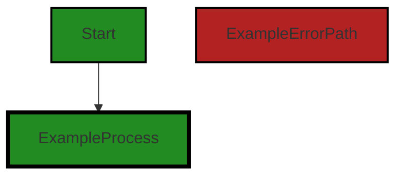


---

### Boost Source-Level Security Analysis

Last Updated: Saturday, September 9, 2023 at 7:12:21 AM PDT

**No bugs found**


---

### Boost Source-Level Performance Analysis

Last Updated: Saturday, September 9, 2023 at 7:19:50 AM PDT

1. **Severity**: 4/10

   **Line Number**: 1

   **Bug Type**: Memory

   **Description**: Importing entire modules can lead to increased memory usage.

   **Solution**: Import only the specific functions you need from the modules.


2. **Severity**: 5/10

   **Line Number**: 3

   **Bug Type**: Disk

   **Description**: The 'fs' module performs synchronous, blocking I/O operations which can degrade performance.

   **Solution**: Consider using the 'fs/promises' module for asynchronous file operations.


3. **Severity**: 6/10

   **Line Number**: 7

   **Bug Type**: Memory

   **Description**: The 'boostnb' module may contain large data structures that can increase memory usage.

   **Solution**: Consider loading data on-demand or using a streaming approach to process the data.


4. **Severity**: 3/10

   **Line Number**: 9

   **Bug Type**: CPU

   **Description**: The 'BoostContentSerializer' class may perform complex serialization operations which can be CPU-intensive.

   **Solution**: Consider using more efficient serialization methods or libraries.


---

### Boost Source-Level Data and Privacy Compliance Analysis

Last Updated: Saturday, September 9, 2023 at 7:27:03 AM PDT

1. **Severity**: 5/10

   **Line Number**: 1

   **Bug Type**: GDPR

   **Description**: The code imports and uses 'fs' module which allows for file system operations. If personal data is being read or written to the file system, it may not comply with GDPR's data processing principles.

   **Solution**: Ensure that personal data is processed lawfully, fairly, and transparently. Implement proper access controls and encryption when storing personal data. If data is transferred outside of the EU, ensure appropriate safeguards are in place.


2. **Severity**: 5/10

   **Line Number**: 2

   **Bug Type**: PCI DSS

   **Description**: The code imports and uses 'fs' module which could potentially be used to store, process, or transmit cardholder data. If not properly protected, this could lead to non-compliance with PCI DSS.

   **Solution**: Ensure cardholder data is protected in storage and transmission. Encrypt cardholder data when stored and use secure protocols for transmission. Regularly test security systems and processes.


3. **Severity**: 5/10

   **Line Number**: 4

   **Bug Type**: HIPAA

   **Description**: The code imports and uses 'fs' module which could potentially be used to store, process, or transmit protected health information (PHI). If not properly protected, this could lead to non-compliance with HIPAA.

   **Solution**: Ensure PHI is protected in storage and transmission. Encrypt PHI when stored and use secure protocols for transmission. Implement access controls and regularly audit access logs.


### Cell 1:
## Original Code:

### Programming Language: typescript
### ./src/extension/extension.ts line 9

```typescript
import { parseFunctions } from "../utilities/split";

```
## Boost Analysis:


---

### Boost Code Explanation

Last Updated: Saturday, September 9, 2023 at 6:52:04 AM PDT

The code provided is a single line of code written in JavaScript (or TypeScript), and it's importing a function named `parseFunctions` from a module located at `../utilities/split`. This is a relative path, meaning the module is located in a `utilities` directory one level up from the current file.

The `parseFunctions` function is not defined in the provided code, so I can't comment on its specifics or the algorithms it uses. However, based on its name, we can infer that it's likely used to parse some input and extract or identify functions within that input. This might be used, for example, in a code analysis or code generation tool, where you need to identify functions in a piece of source code.

The import statement is using ES6 (ECMAScript 2015) module syntax. In this system, you can export functions, objects, or values from a module to be used in other JavaScript files. Here, `parseFunctions` is being imported, so it can be used later in this file.

As for the architectural guidelines, since the code provided is very minimal, it's hard to draw any conclusions about consistency or conflict with guidelines. However, it does show good practice in terms of code organization and modularity. The `parseFunctions` function is clearly defined in a utilities module, indicating a separation of concerns and making the code easier to maintain and understand.

For more information about ES6 modules, you can visit this link: [ES6 Modules](https://developer.mozilla.org/en-US/docs/Web/JavaScript/Guide/Modules)


---

### Boost Flow Diagram

Last Updated: Saturday, September 9, 2023 at 7:06:30 AM PDT

NO CONTROL FLOW FOUND


---

### Boost Source-Level Security Analysis

Last Updated: Saturday, September 9, 2023 at 7:12:26 AM PDT

**No bugs found**


---

### Boost Source-Level Performance Analysis

Last Updated: Saturday, September 9, 2023 at 7:19:54 AM PDT

**No bugs found**


---

### Boost Source-Level Data and Privacy Compliance Analysis

Last Updated: Saturday, September 9, 2023 at 7:27:13 AM PDT

1. **Severity**: 2/10

   **Line Number**: 16

   **Bug Type**: GDPR

   **Description**: The code imports a module that potentially handles data parsing but it's not clear if the data is anonymized or pseudonymized before processing, which is a requirement under GDPR.

   **Solution**: Ensure that any personal data is anonymized or pseudonymized before processing. Consider using libraries that support these features.


### Cell 2:
## Original Code:

### Programming Language: typescript
### ./src/extension/extension.ts line 10

```typescript
import { BoostConfiguration } from "./boostConfiguration";

```
## Boost Analysis:


---

### Boost Code Explanation

Last Updated: Saturday, September 9, 2023 at 6:52:30 AM PDT

The line of code you've provided is an import statement in JavaScript (or TypeScript, given the context of your project). This statement is used to import bindings that are exported by another module.

Here is a detailed explanation of the code:

```import { BoostConfiguration } from "./boostConfiguration";```

- `import`: This is a keyword in JavaScript that is used to import functions, objects, or values from another module or file.

- `{ BoostConfiguration }`: This is the specific item that the code is importing from the module. The curly braces are used for named exports. In this case, `BoostConfiguration` is a named export from the `boostConfiguration` module. It could be a function, a class, an object, etc.

- `from`: This is another keyword used in the import statement to specify the path of the module from which to import.

- `"./boostConfiguration"`: This is the relative path to the module that contains the `BoostConfiguration` export. The `./` indicates that the module is in the same directory as the current file.

The algorithm used here is quite simple: when this file is run, the JavaScript engine will look for a file named `boostConfiguration` in the same directory, and it will import the `BoostConfiguration` export from that module.

This specific line doesn't directly conflict with the architectural analysis provided earlier. However, without seeing the rest of the code, it's hard to say if this import is used correctly and in accordance with best practices. 

For more information on JavaScript modules and `import` statements, you can refer to the [MDN Web Docs](https://developer.mozilla.org/en-US/docs/Web/JavaScript/Guide/Modules).


---

### Boost Flow Diagram

Last Updated: Saturday, September 9, 2023 at 7:06:33 AM PDT

NO CONTROL FLOW FOUND


---

### Boost Source-Level Security Analysis

Last Updated: Saturday, September 9, 2023 at 7:12:30 AM PDT

**No bugs found**


---

### Boost Source-Level Performance Analysis

Last Updated: Saturday, September 9, 2023 at 7:19:57 AM PDT

**No bugs found**


---

### Boost Source-Level Data and Privacy Compliance Analysis

Last Updated: Saturday, September 9, 2023 at 7:27:17 AM PDT

**No bugs found**


### Cell 3:
## Original Code:

### Programming Language: typescript
### ./src/extension/extension.ts line 11

```typescript
import { boostLogging } from "../utilities/boostLogging";

```
## Boost Analysis:


---

### Boost Code Explanation

Last Updated: Saturday, September 9, 2023 at 6:53:03 AM PDT

The line of code you have provided is an import statement in JavaScript, specifically using the ES6 (ECMAScript 2015) module syntax. 

Here's a detailed breakdown:

- `import`: This is a keyword in JavaScript that is used to import functions, objects, or values from another module or file. 

- `{ boostLogging }`: This is the specific item that is being imported from the module. The curly braces are used when you are importing a specific exported item from a module. In this case, `boostLogging` is likely a function or an object that is being imported.

- `from "../utilities/boostLogging"`: This specifies the path to the module that you are importing from. The `..` means to go up one directory level, and `/utilities/boostLogging` is the path from there to the module. So, this is importing from a file named `boostLogging.js` (or `boostLogging.ts` if it's a TypeScript project) in a directory named `utilities` that is one level up from the current directory.

The algorithm used here is straightforward. When the JavaScript runtime encounters this line, it will go to the specified path, look for an export named `boostLogging`, and make it available in the current file under the same name. If no such export is found, or if the file doesn't exist, it will throw an error.

The code is consistent with general architectural guidelines for modular JavaScript development. Dividing code into separate modules and using import/export to share functionality between them helps to keep the codebase organized and maintainable.

For more information on ES6 modules and import/export syntax, you can refer to the following resources:

- [MDN Web Docs: import](https://developer.mozilla.org/en-US/docs/Web/JavaScript/Reference/Statements/import)
- [MDN Web Docs: export](https://developer.mozilla.org/en-US/docs/web/javascript/reference/statements/export)
- [JavaScript Modules: A Beginner’s Guide](https://www.freecodecamp.org/news/javascript-modules-a-beginner-s-guide-783f7d7a5fcc/) on freeCodeCamp
- [ES6 Modules in Depth](https://ponyfoo.com/articles/es6-modules-in-depth) on Pony Foo.


---

### Boost Flow Diagram

Last Updated: Saturday, September 9, 2023 at 7:06:38 AM PDT


---

### Boost Source-Level Security Analysis

Last Updated: Saturday, September 9, 2023 at 7:12:34 AM PDT

**No bugs found**


---

### Boost Source-Level Performance Analysis

Last Updated: Saturday, September 9, 2023 at 7:20:01 AM PDT

**No bugs found**


---

### Boost Source-Level Data and Privacy Compliance Analysis

Last Updated: Saturday, September 9, 2023 at 7:27:20 AM PDT

**No bugs found**


### Cell 4:
## Original Code:

### Programming Language: typescript
### ./src/extension/extension.ts line 12

```typescript
import { TextDecoder } from "util";

```
## Boost Analysis:


---

### Boost Code Explanation

Last Updated: Saturday, September 9, 2023 at 6:53:32 AM PDT

This single line of JavaScript code is importing a specific module from Node.js's built-in 'util' package. The module being imported is 'TextDecoder'.

The 'TextDecoder' module is an API that provides a method for decoding a stream of bytes into a string using a specific character encoding. The default encoding is 'utf-8', but it can be changed to other types of encodings if needed.

This module is usually used when there is a need to convert data that comes as a stream of bytes, such as data received from a network request, into a string format that can be easily manipulated and displayed.

Here is a simple usage example:

```javascript
let uint8Array = new Uint8Array([72, 101, 108, 108, 111]);
let decoder = new TextDecoder();
let string = decoder.decode(uint8Array);
console.log(string);  // This will output: "Hello"
```

In the example, we first create a Uint8Array with the byte values for each character in the string "Hello". We then create a new TextDecoder object and use it to decode the Uint8Array into a string. The resulting string is then logged to the console.

For more information about the TextDecoder API, you can visit the following links:

- [TextDecoder - MDN Web Docs](https://developer.mozilla.org/en-US/docs/Web/API/TextDecoder)
- [Buffer and Character Encoding - Node.js Docs](https://nodejs.org/api/buffer.html#buffer_buffers_and_character_encodings)

As for the architectural analysis, this code is consistent with the architectural blueprint for the project. It uses JavaScript, and it's a common practice in Node.js applications to import modules from built-in packages. There doesn't seem to be any conflict with the architectural guidelines provided. However, the actual usage of the 'TextDecoder' in the context of the project would provide more insights on its architectural implications.


---

### Boost Flow Diagram

Last Updated: Saturday, September 9, 2023 at 7:06:45 AM PDT

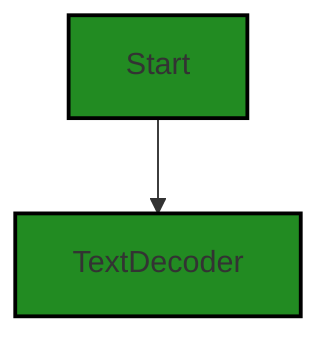

The control flow graph for the provided code is a simple linear flow. The code starts at the `Start` node and then flows to the `TextDecoder` node. There are no alternate paths or error paths in this code.


---

### Boost Source-Level Security Analysis

Last Updated: Saturday, September 9, 2023 at 7:12:37 AM PDT

**No bugs found**


---

### Boost Source-Level Performance Analysis

Last Updated: Saturday, September 9, 2023 at 7:20:05 AM PDT

**No bugs found**


---

### Boost Source-Level Data and Privacy Compliance Analysis

Last Updated: Saturday, September 9, 2023 at 7:27:24 AM PDT

**No bugs found**


### Cell 5:
## Original Code:

### Programming Language: typescript
### ./src/extension/extension.ts line 13

```typescript
import { PROJECT_EXTENSION } from "../data/BoostProjectData";

```
## Boost Analysis:


---

### Boost Code Explanation

Last Updated: Saturday, September 9, 2023 at 6:53:56 AM PDT

This single line of code is an import statement written in JavaScript, specifically in the style of ECMAScript 6 (ES6), which is a version of JavaScript that introduced many new features, including the `import` and `export` syntax for modules.

This line of code is importing a constant named `PROJECT_EXTENSION` from another JavaScript module located at "../data/BoostProjectData". The path "../data/BoostProjectData" is a relative path that points to the `BoostProjectData` file in the `data` directory, which is one level up from the current file.

The `PROJECT_EXTENSION` constant is likely a string that represents the file extension for the project files that this software can handle. By importing it into this module, the code in this module can use that constant.

The algorithm used here is simple: the JavaScript runtime will look for the `BoostProjectData` module at the specified path, and then look for an export named `PROJECT_EXTENSION` in that module. If it finds it, it will make it available in this module under the same name. If it doesn't find it, it will throw an error.

This line of code is consistent with the architectural blueprint provided earlier. It's a common practice in modular and object-oriented programming to define constants in one place and then import them where needed. This helps keep the codebase DRY (Don't Repeat Yourself) and makes it easier to change the value of the constant in the future - you only need to change it in one place.

For more information on ES6 modules, you can refer to this link: [ES6 Modules](https://developer.mozilla.org/en-US/docs/Web/JavaScript/Guide/Modules)


---

### Boost Flow Diagram

Last Updated: Saturday, September 9, 2023 at 7:06:49 AM PDT

NO CONTROL FLOW FOUND


---

### Boost Source-Level Security Analysis

Last Updated: Saturday, September 9, 2023 at 7:12:40 AM PDT

**No bugs found**


---

### Boost Source-Level Performance Analysis

Last Updated: Saturday, September 9, 2023 at 7:20:09 AM PDT

**No bugs found**


---

### Boost Source-Level Data and Privacy Compliance Analysis

Last Updated: Saturday, September 9, 2023 at 7:27:56 AM PDT

1. **Severity**: 2/10

   **Line Number**: 24

   **Bug Type**: GDPR

   **Description**: The import statement could potentially lead to a GDPR compliance issue if the imported module 'BoostProjectData' processes personal data without adequate data protection measures.

   **Solution**: Ensure the 'BoostProjectData' module complies with GDPR requirements. This includes obtaining user consent before processing personal data, implementing data minimization practices, and ensuring the right to erasure.


2. **Severity**: 3/10

   **Line Number**: 24

   **Bug Type**: PCI DSS

   **Description**: If the 'BoostProjectData' module processes cardholder data, the import statement could potentially lead to a PCI DSS compliance issue. PCI DSS requires that cardholder data be protected.

   **Solution**: Ensure the 'BoostProjectData' module complies with PCI DSS requirements. This includes encrypting cardholder data, implementing strong access control measures, and regularly monitoring and testing networks.


3. **Severity**: 3/10

   **Line Number**: 24

   **Bug Type**: HIPAA

   **Description**: If the 'BoostProjectData' module processes protected health information (PHI), the import statement could potentially lead to a HIPAA compliance issue. HIPAA requires that PHI be protected.

   **Solution**: Ensure the 'BoostProjectData' module complies with HIPAA requirements. This includes implementing safeguards to protect PHI, ensuring PHI is disclosed only to authorized individuals, and implementing procedures to limit who can access PHI.


### Cell 6:
## Original Code:

### Programming Language: typescript
### ./src/extension/extension.ts line 14

```typescript
import { BoostExtension } from "./BoostExtension";

```
## Boost Analysis:


---

### Boost Code Explanation

Last Updated: Saturday, September 9, 2023 at 6:54:24 AM PDT

The provided code snippet is very simple and doesn't contain any algorithms. It's a single line of TypeScript code that imports a module named `BoostExtension` from a file located in the same directory as the current file.

Here's a detailed explanation:

- `import`: This is a keyword in JavaScript and TypeScript that is used to import functions, objects or values from other modules or files. 

- `{ BoostExtension }`: This is the specific module that we want to import from another file. The curly braces `{}` are used when you want to import a specific export from a module, as opposed to importing the entire module.

- `from "./BoostExtension"`: This specifies the location of the file that contains the `BoostExtension` module. The `./` at the start of the path indicates that the file is located in the same directory as the current file. The file extension is not needed when importing in JavaScript or TypeScript.

The `BoostExtension` module is likely a class or a set of functions and values that are used to provide some functionality for the Boost extension. Without more code, it's impossible to know what exactly `BoostExtension` does, but based on the name it is likely related to the main functionality of the Boost extension.

Regarding the architectural guidelines, as mentioned, there are no special architectural guidelines or constraints for this software project. This code is consistent with standard practices in TypeScript and JavaScript projects, which often involve organizing code into modules and importing those modules where needed.

For more information on the `import` statement in JavaScript and TypeScript, you can refer to the following resources:

- [JavaScript Modules: Importing and Exporting](https://developer.mozilla.org/en-US/docs/Web/JavaScript/Guide/Modules)
- [TypeScript Modules](https://www.typescriptlang.org/docs/handbook/modules.html)


---

### Boost Flow Diagram

Last Updated: Saturday, September 9, 2023 at 7:06:53 AM PDT

```mermaid
graph TD;
style BoostExtension fill:#228B22, stroke:#000000, stroke-width:2px;

BoostExtension-->NO CONTROL FLOW FOUND;
```


---

### Boost Source-Level Security Analysis

Last Updated: Saturday, September 9, 2023 at 7:12:44 AM PDT

**No bugs found**


---

### Boost Source-Level Performance Analysis

Last Updated: Saturday, September 9, 2023 at 7:20:12 AM PDT

**No bugs found**


---

### Boost Source-Level Data and Privacy Compliance Analysis

Last Updated: Saturday, September 9, 2023 at 7:28:00 AM PDT

**No bugs found**


### Cell 7:
## Original Code:

### Programming Language: typescript
### ./src/extension/extension.ts line 15

```typescript
import { ControllerOutputType } from "../controllers/controllerOutputTypes";

```
## Boost Analysis:


---

### Boost Code Explanation

Last Updated: Saturday, September 9, 2023 at 6:54:46 AM PDT

The given code snippet is quite small and straightforward. It is written in TypeScript, which is a statically typed superset of JavaScript that adds optional types, classes, and interfaces, among other things, to the language. 

The code is simply importing a type named `ControllerOutputType` from a module located at "../controllers/controllerOutputTypes". 

The `import` statement is used to bring in functions, objects or values from an external module or file into the current file. The `{ ControllerOutputType }` syntax is called destructuring. It allows you to extract a specific export from the module instead of importing the whole module. 

In this case, `ControllerOutputType` is likely to be a type or an interface that's being used to type check the output of some controllers in the application. Without seeing the rest of the code or the module it's imported from, it's hard to say exactly what `ControllerOutputType` is or how it's being used.

As for the algorithms, this line of code doesn't really use any. It's just a standard import statement in TypeScript.

For more information on TypeScript's `import` statement, you can check out the official TypeScript documentation: https://www.typescriptlang.org/docs/handbook/modules.html#import

For more information on TypeScript's type system, you can check out this link: https://www.typescriptlang.org/docs/handbook/basic-types.html

Regarding the architectural guidelines, as the provided code is a simple import statement, it doesn't conflict with any architectural guidelines. However, the usage of types or interfaces for type safety is a good practice in TypeScript development. It helps in catching errors during compile time, thus improving the robustness of the code.


---

### Boost Flow Diagram

Last Updated: Saturday, September 9, 2023 at 7:06:59 AM PDT

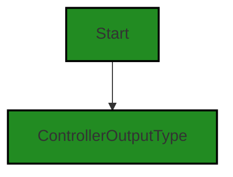


---

### Boost Source-Level Security Analysis

Last Updated: Saturday, September 9, 2023 at 7:12:48 AM PDT

**No bugs found**


---

### Boost Source-Level Performance Analysis

Last Updated: Saturday, September 9, 2023 at 7:20:16 AM PDT

**No bugs found**


---

### Boost Source-Level Data and Privacy Compliance Analysis

Last Updated: Saturday, September 9, 2023 at 7:28:04 AM PDT

**No bugs found**


### Cell 8:
## Original Code:

### Programming Language: typescript
### ./src/extension/extension.ts line 16

```typescript
import { setExtensionMode } from "./extension_state";

```
## Boost Analysis:


---

### Boost Code Explanation

Last Updated: Saturday, September 9, 2023 at 6:54:58 AM PDT

The code you provided is a single line of JavaScript or TypeScript code, which is importing a function named `setExtensionMode` from a module named `./extension_state`. 

The `import` statement is used to import functions, objects or values from other modules or files into the current file. The `import` statement is part of ES6 (ECMAScript 6), also known as ES2015, which is a version of JavaScript. 

In this case, the `setExtensionMode` function is being imported from the `extension_state` module. The `./` before `extension_state` indicates that the module is located in the same directory as the current file.

The `setExtensionMode` function is not defined in the provided code, so we can't analyze what it does without more information. However, based on its name, we can make an educated guess that it might be used to set the mode of an extension, perhaps switching between different states or configurations.

This line of code is consistent with common JavaScript and TypeScript practices. It's also consistent with the architectural blueprint you provided, which mentions that the project uses JavaScript and TypeScript, and that it's a Visual Studio Code extension. The `setExtensionMode` function might be part of the extension's state management.

For more information on JavaScript modules and import statement, you can refer to the following resources:

- [JavaScript Modules](https://developer.mozilla.org/en-US/docs/Web/JavaScript/Guide/Modules)
- [ES6 import statement](https://developer.mozilla.org/en-US/docs/Web/JavaScript/Reference/Statements/import)


---

### Boost Flow Diagram

Last Updated: Saturday, September 9, 2023 at 7:07:03 AM PDT

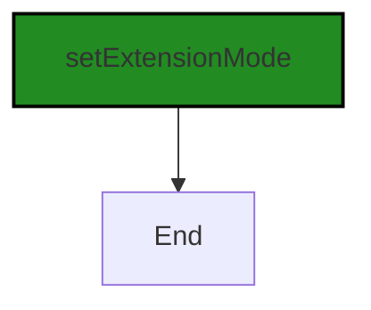


---

### Boost Source-Level Security Analysis

Last Updated: Saturday, September 9, 2023 at 7:12:52 AM PDT

**No bugs found**


---

### Boost Source-Level Performance Analysis

Last Updated: Saturday, September 9, 2023 at 7:20:20 AM PDT

**No bugs found**


---

### Boost Source-Level Data and Privacy Compliance Analysis

Last Updated: Saturday, September 9, 2023 at 7:28:07 AM PDT

**No bugs found**


### Cell 9:
## Original Code:

### Programming Language: typescript
### ./src/extension/extension.ts line 17

```typescript

export enum BoostFileType {
    notebook = "notebook",
    summary = "summary",
    status = "status",
    guidelines = "guidelines",
    output = "output",
}

```
## Boost Analysis:


---

### Boost Code Explanation

Last Updated: Saturday, September 9, 2023 at 6:55:27 AM PDT

The code provided is a TypeScript enum, which is a way of giving more friendly names to sets of numeric or string values. 

An enum is a special "class" that represents a group of constants (unchangeable/read-only variables). You define enums using the `enum` keyword. Each enum member has a name and an associated value, which can be a numeric or string value. By default, enums are zero-based, which means the first enum member has the value of 0, the second has 1, and so on. You can also manually set the value of enum members.

In this case, the enum is called `BoostFileType` and it represents different types of files that can be used in the Boost VS Code extension. The enum has five members: `notebook`, `summary`, `status`, `guidelines`, and `output`. Each of these members is associated with a string value that matches its name. This is a common practice when you want the enum name to be the same as its value.

This enum can be used throughout the code to refer to these file types in a more readable and less error-prone way than using string literals. For example, instead of writing `"notebook"` in your code, you can write `BoostFileType.notebook`. This gives you the benefits of autocompletion in your editor and compile-time checking. If you mistype the enum member name, the TypeScript compiler will give you an error.

The algorithm used here is straightforward: when the TypeScript code is compiled to JavaScript, each usage of an enum member is replaced with its value. This means that the enum does not exist at runtime, and there is no performance cost to using enums.

For more information on TypeScript enums, see the [TypeScript Handbook](https://www.typescriptlang.org/docs/handbook/enums.html).


---

### Boost Flow Diagram

Last Updated: Saturday, September 9, 2023 at 7:07:10 AM PDT

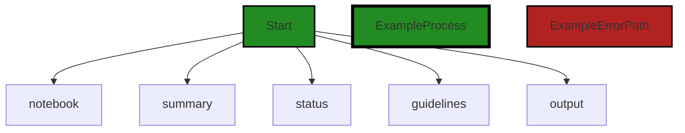


---

### Boost Source-Level Security Analysis

Last Updated: Saturday, September 9, 2023 at 7:12:55 AM PDT

**No bugs found**


---

### Boost Source-Level Performance Analysis

Last Updated: Saturday, September 9, 2023 at 7:20:24 AM PDT

**No bugs found**


---

### Boost Source-Level Data and Privacy Compliance Analysis

Last Updated: Saturday, September 9, 2023 at 7:28:11 AM PDT

**No bugs found**


### Cell 10:
## Original Code:

### Programming Language: typescript
### ./src/extension/extension.ts line 25

```typescript

export const boostActivityBarId = "polyverse-boost-explorer";

export enum BoostCommands {
    loadCurrentFile = "loadCurrentFile",
    loadCurrentFolder = "loadCurrentFolder",
    loadSummaryFile = "loadSummaryFile",

    processCurrentFolder = "processCurrentFolder",
    processCurrentFile = "processCurrentFile",

    processProject = "processProject",

    buildCurrentFileOutput = "buildCurrentFileOutput",
    buildCurrentFileSummaryOutput = "buildCurrentFileSummaryOutput",
    buildCurrentFolderOutput = "buildCurrentFolderOutput",
    buildCurrentFolderSummaryOutput = "buildCurrentFolderSummaryOutput",
    showCurrentFileAnalysisOutput = "showCurrentFileAnalysisOutput",
    showCurrentFileAnalysisSummaryOutput = "showCurrentFileAnalysisSummaryOutput",
    showCurrentFolderAnalysisSummaryOutput = "showCurrentFolderAnalysisSummaryOutput",
    excludeTargetFromBoostAnalysis = "excludeTargetFromBoostAnalysis",
    excludeTargetFolderFromBoostAnalysis = "excludeTargetFolderFromBoostAnalysis",
    analyzeOnlyTargetForBoostAnalysis = "analyzeOnlyTargetForBoostAnalysis",
    analyzeOnlyTargetFolderForBoostAnalysis = "analyzeOnlyTargetFolderForBoostAnalysis",

    analyzeSourceCode = "analyzeSourceCode",
    analysisSummaryForSourceCode = "analysisSummaryForSourceCode",

    refreshProjectData = "refreshProjectData",

    showGuidelines = "showGuidelines",

    customerPortal = "customerPortal",
    selectOrganization = "selectOrganization",
    setOrganization = "setOrganization",
}

```
## Boost Analysis:


---

### Boost Code Explanation

Last Updated: Saturday, September 9, 2023 at 6:56:01 AM PDT

The provided code is written in TypeScript, which is a statically typed superset of JavaScript. This code is defining some constants and enumerations that are likely used throughout the rest of the software project.

Let's break it down:

1. `export const boostActivityBarId = "polyverse-boost-explorer";`

This line is defining and exporting a constant named `boostActivityBarId` with a value of `"polyverse-boost-explorer"`. The `export` keyword means that this constant can be imported and used in other files in the project. This constant might be used to identify a specific activity bar in Visual Studio Code's user interface, which is part of the extension's functionality.

2. `export enum BoostCommands {...}`

This block of code is defining and exporting an enumeration named `BoostCommands`. An enumeration, or `enum`, is a special type of value in TypeScript that allows for a variable to be one of a set of predefined constants. The `BoostCommands` enum includes a variety of commands that are likely used to control the behavior of the extension. 

For example, `loadCurrentFile` could be a command to load the file currently open in the editor, `processCurrentFolder` might analyze the code in the current folder, and `showGuidelines` could display some guidelines to the user. The exact behavior associated with each command would be defined elsewhere in the code.

The names of the enum members are written in camelCase, which is a common naming convention in JavaScript and TypeScript.

In terms of architectural analysis, this code is straightforward and aligns well with common practices for defining constants and enums in TypeScript. It provides a centralized place to define the commands used by the extension, which can help to keep the code organized and maintainable.

For more information on `enum` in TypeScript, you can refer to the official TypeScript documentation: [TypeScript Enums](https://www.typescriptlang.org/docs/handbook/enums.html)


---

### Boost Flow Diagram

Last Updated: Saturday, September 9, 2023 at 7:07:24 AM PDT

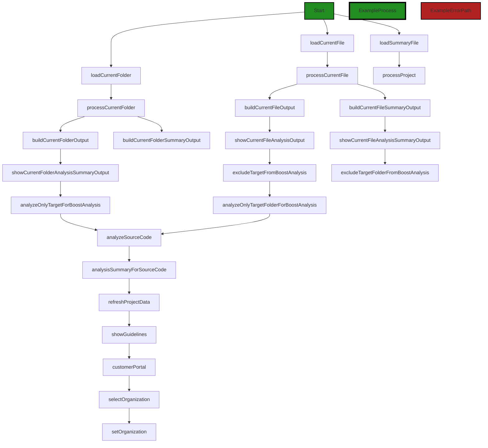
```


---

### Boost Source-Level Security Analysis

Last Updated: Saturday, September 9, 2023 at 7:12:59 AM PDT

**No bugs found**


---

### Boost Source-Level Performance Analysis

Last Updated: Saturday, September 9, 2023 at 7:20:27 AM PDT

**No bugs found**


---

### Boost Source-Level Data and Privacy Compliance Analysis

Last Updated: Saturday, September 9, 2023 at 7:28:15 AM PDT

**No bugs found**


### Cell 11:
## Original Code:

### Programming Language: typescript
### ./src/extension/extension.ts line 61

```typescript

export interface ProcessCurrentFolderOptions {
    uri?: vscode.Uri;
    kernelCommand?: string;
    forceAnalysisRefresh?: boolean;
    filelist?: vscode.Uri[];
    fileLimit?: number;
}

```
## Boost Analysis:


---

### Boost Code Explanation

Last Updated: Saturday, September 9, 2023 at 6:56:30 AM PDT

This TypeScript code snippet defines an interface called `ProcessCurrentFolderOptions`. An interface in TypeScript is a way of defining a contract for a certain structure of an object or class. In other words, it describes the shape of an object, including the types of its properties. 

The `ProcessCurrentFolderOptions` interface has five optional properties:

1. `uri`: This property is of type `vscode.Uri`. The `Uri` type is a class provided by the Visual Studio Code API that represents a Uniform Resource Identifier (URI). URIs are a generalization of URLs and are used to identify resources. In this context, it's likely used to represent the location of a folder or file in the workspace.

2. `kernelCommand`: This property is of type `string`. It is probably used to specify a command that should be run by a kernel. A kernel in this context could refer to the core part of the code analysis service that this extension communicates with.

3. `forceAnalysisRefresh`: This property is of type `boolean`. It's likely used to indicate whether a new code analysis should be forced, even if a previous analysis for the same code exists.

4. `filelist`: This property is of type `vscode.Uri[]`, which represents an array of URIs. It's probably used to specify a list of files that should be processed.

5. `fileLimit`: This property is of type `number`. It is likely used to limit the number of files that should be processed.

This interface might be used as a parameter type for a function or method that processes the current folder, allowing the caller to specify various options for how the processing should be done.

Here are some resources for further reading:

- [TypeScript Interfaces](https://www.typescriptlang.org/docs/handbook/interfaces.html)
- [Visual Studio Code API - Uri](https://code.visualstudio.com/api/references/vscode-api#Uri)


---

### Boost Flow Diagram

Last Updated: Saturday, September 9, 2023 at 7:07:57 AM PDT

```mermaid
graph TD;
style Start fill:#228B22, stroke:#000000, stroke-width:2px;
style ProcessCurrentFolder fill:#228B22, stroke:#000000, stroke-width:4px;
style ProcessCurrentFolderError fill:#B22222, stroke:#000000, stroke-width:2px;
style CallExternalLibrary fill:#FFA500, stroke:#000000, stroke-width:2px;

Start-->ProcessCurrentFolder;

subgraph ProcessCurrentFolder
    ProcessCurrentFolder-->CheckUri;
    CheckUri-->CheckKernelCommand;
    CheckKernelCommand-->CheckForceAnalysisRefresh;
    CheckForceAnalysisRefresh-->CheckFileList;
    CheckFileList-->CheckFileLimit;
    CheckFileLimit-->End;
end

style CheckUri fill:#228B22, stroke:#000000, stroke-width:4px;
style CheckKernelCommand fill:#228B22, stroke:#000000, stroke-width:4px;
style CheckForceAnalysisRefresh fill:#228B22, stroke:#000000, stroke-width:4px;
style CheckFileList fill:#228B22, stroke:#000000, stroke-width:4px;
style CheckFileLimit fill:#228B22, stroke:#000000, stroke-width:4px;
style End fill:#228B22, stroke:#000000, stroke-width:2px;

style CheckUriError fill:#B22222, stroke:#000000, stroke-width:2px;
style CheckKernelCommandError fill:#B22222, stroke:#000000, stroke-width:2px;
style CheckForceAnalysisRefreshError fill:#B22222, stroke:#000000, stroke-width:2px;
style CheckFileListError fill:#B22222, stroke:#000000, stroke-width:2px;
style CheckFileLimitError fill:#B22222, stroke:#000000, stroke-width:2px;

CheckUri-->CheckUriError;
CheckKernelCommand-->CheckKernelCommandError;
CheckForceAnalysisRefresh-->CheckForceAnalysisRefreshError;
CheckFileList-->CheckFileListError;
CheckFileLimit-->CheckFileLimitError;

style CallExternalLibrary fill:#FFA500, stroke:#000000, stroke-width:2px;
```

The control flow graph for the `ProcessCurrentFolder` function is as follows:

- The function starts at the `Start` node.
- It then goes through a series of checks:
  - `CheckUri` checks if the `uri` parameter is provided.
  - `CheckKernelCommand` checks if the `kernelCommand` parameter is provided.
  - `CheckForceAnalysisRefresh` checks if the `forceAnalysisRefresh` parameter is provided.
  - `CheckFileList` checks if the `filelist` parameter is provided.
  - `CheckFileLimit` checks if the `fileLimit` parameter is provided.
- If all the checks pass, the control flow reaches the `End` node.
- If any of the checks fail, the control flow goes to the corresponding error nodes (`CheckUriError`, `CheckKernelCommandError`, `CheckForceAnalysisRefreshError`, `CheckFileListError`, `CheckFileLimitError`).
- The `CheckUriError`, `CheckKernelCommandError`, `CheckForceAnalysisRefreshError`, `CheckFileListError`, and `CheckFileLimitError` nodes are error paths.
- The `CallExternalLibrary` node represents a call to an external library or non-standard function, but it is not clear from the provided code where this call occurs.

Please note that this control flow graph is based on the provided code snippet and may not capture all possible control flow paths in the actual codebase.


---

### Boost Source-Level Security Analysis

Last Updated: Saturday, September 9, 2023 at 7:13:02 AM PDT

**No bugs found**


---

### Boost Source-Level Performance Analysis

Last Updated: Saturday, September 9, 2023 at 7:20:31 AM PDT

**No bugs found**


---

### Boost Source-Level Data and Privacy Compliance Analysis

Last Updated: Saturday, September 9, 2023 at 7:28:47 AM PDT

1. **Severity**: 2/10

   **Line Number**: 120

   **Bug Type**: GDPR

   **Description**: The 'ProcessCurrentFolderOptions' interface does not include any explicit data compliance or privacy controls. This could potentially lead to GDPR non-compliance if personal data is processed without proper safeguards.

   **Solution**: Ensure that any processing of personal data complies with GDPR principles. This may involve adding explicit data compliance controls to the 'ProcessCurrentFolderOptions' interface, or ensuring that any data processed through this interface is anonymized or pseudonymized. For more information, please refer to the official GDPR website: https://gdpr-info.eu/


2. **Severity**: 1/10

   **Line Number**: 120

   **Bug Type**: PCI DSS

   **Description**: The 'ProcessCurrentFolderOptions' interface does not appear to handle payment card data, so there are no immediate PCI DSS compliance issues. However, if this interface is used in a context where payment card data is processed, there may be a risk of non-compliance.

   **Solution**: Ensure that any processing of payment card data complies with PCI DSS requirements. This may involve adding explicit data compliance controls to the 'ProcessCurrentFolderOptions' interface, or ensuring that any payment card data processed through this interface is encrypted and securely stored. For more information, please refer to the official PCI DSS website: https://www.pcisecuritystandards.org/


3. **Severity**: 2/10

   **Line Number**: 120

   **Bug Type**: HIPAA

   **Description**: The 'ProcessCurrentFolderOptions' interface does not include any explicit data compliance or privacy controls. This could potentially lead to HIPAA non-compliance if health information is processed without proper safeguards.

   **Solution**: Ensure that any processing of health information complies with HIPAA regulations. This may involve adding explicit data compliance controls to the 'ProcessCurrentFolderOptions' interface, or ensuring that any health information processed through this interface is encrypted and securely stored. For more information, please refer to the official HHS website: https://www.hhs.gov/hipaa/index.html


### Cell 12:
## Original Code:

### Programming Language: typescript
### ./src/extension/extension.ts line 69

```typescript

export async function activate(context: vscode.ExtensionContext) {
    try {
        // we use a friendly name for the channel as this will be displayed to the user in the output pane
        boostLogging.log("Activating Boost Notebook Extension");

        setExtensionMode(context.extensionMode);
        const extension = new BoostExtension(context);
    } catch (error) {
        boostLogging.error(
            `Unable to activate Boost Notebook Extension due to error:${error}. Please retry launching, check your Boost configuration, or contact Polyverse Boost Support`,
            true
        );
    }
}

```
## Boost Analysis:


---

### Boost Code Explanation

Last Updated: Saturday, September 9, 2023 at 6:56:45 AM PDT

This code block is written in TypeScript and is used to activate a Visual Studio Code (VS Code) extension. This function is a crucial part of any VS Code extension as it is called when your extension is activated. Here's a breakdown of the code:

The `activate` function is an asynchronous function that is exported from the module. It takes one argument, `context`, of type `vscode.ExtensionContext`. The `ExtensionContext` is an object that contains properties and methods related to the context in which the extension is running.

Inside the `activate` function, there is a try-catch block to handle any errors that might occur during the activation of the extension.

In the try block:

- A log message "Activating Boost Notebook Extension" is output to the console using `boostLogging.log`. `boostLogging` is presumably a logging utility that the extension uses for logging purposes.
- The `setExtensionMode` function is called with `context.extensionMode` as an argument. This function likely configures the extension's mode, although the code for it is not provided.
- A new instance of `BoostExtension` is created with `context` as an argument. `BoostExtension` is likely a class that encapsulates the extension's functionality.

In the catch block:

- If an error occurs during the activation of the extension, an error message is logged using `boostLogging.error`. The message includes the error that occurred and suggests the user to retry launching, check the Boost configuration, or contact Polyverse Boost Support. The `true` argument likely indicates that this is a critical error, although the exact behavior would depend on the implementation of `boostLogging.error`.

The algorithm used in this code is quite simple and straightforward. It's essentially a sequence of operations wrapped in a try-catch block for error handling.

For more information about creating a VS Code extension, you can visit the [VS Code Extension API](https://code.visualstudio.com/api/references/extension-guides/overview) documentation. For more information about asynchronous programming in JavaScript and TypeScript, you can visit the [Mozilla Developer Network](https://developer.mozilla.org/en-US/docs/Learn/JavaScript/Asynchronous/Async_await) documentation.


---

### Boost Flow Diagram

Last Updated: Saturday, September 9, 2023 at 7:08:11 AM PDT

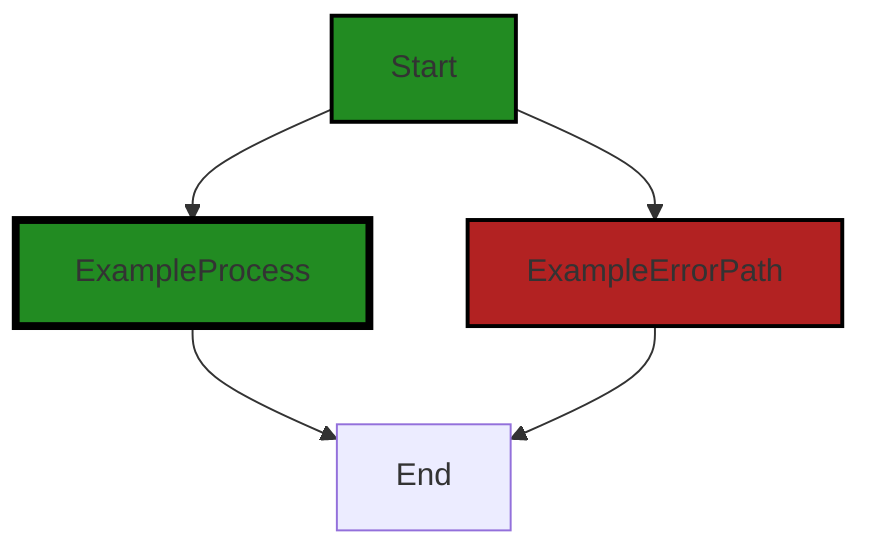

The control flow graph for the provided code is as follows:

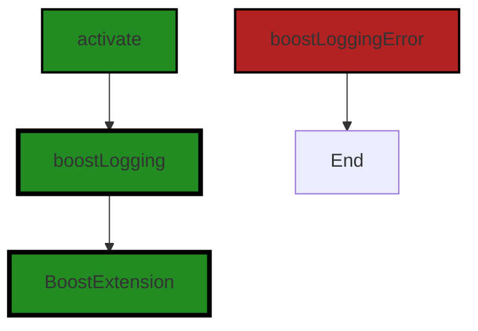

The primary path through the code is as follows:

1. The `activate` function is called.
2. The `boostLogging.log` function is called to log a message.
3. The `setExtensionMode` function is called.
4. An instance of the `BoostExtension` class is created.
5. The execution ends.

There are no error paths in the provided code.


---

### Boost Source-Level Security Analysis

Last Updated: Saturday, September 9, 2023 at 7:13:06 AM PDT

**No bugs found**


---

### Boost Source-Level Performance Analysis

Last Updated: Saturday, September 9, 2023 at 7:20:34 AM PDT

**No bugs found**


---

### Boost Source-Level Data and Privacy Compliance Analysis

Last Updated: Saturday, September 9, 2023 at 7:28:51 AM PDT

**No bugs found**


### Cell 13:
## Original Code:

### Programming Language: typescript
### ./src/extension/extension.ts line 84

```typescript

// for completeness, we provide a deactivate function - asynchronous return
//    if we have resources to cleanup in the future
export async function deactivate(): Promise<void> {
    const outputChannel = vscode.window.createOutputChannel(
        boostnb.NOTEBOOK_TYPE
    );

    outputChannel.appendLine("Deactivating Boost Notebook Extension");

    return undefined;
}

```
## Boost Analysis:


---

### Boost Code Explanation

Last Updated: Saturday, September 9, 2023 at 6:57:16 AM PDT

This code is a function that is part of a Visual Studio Code (VS Code) extension. The function is named `deactivate` and it is intended to be called when the extension is deactivated. In the context of VS Code extensions, deactivation happens when the extension is being shut down, either because VS Code is closing or the extension is being disabled.

The `deactivate` function is asynchronous, as indicated by the `async` keyword. This means it returns a Promise, which is an object that represents a future value or completion of an operation. In this case, the function returns a Promise that resolves to `void`, meaning it doesn't provide any value upon completion.

The function first creates an output channel in VS Code. Output channels are used to display text-based information to the user. The `vscode.window.createOutputChannel` method is used to create the channel, and it is given the name of the notebook type, which is presumably a constant defined elsewhere in the code.

Next, the function appends a line of text to the output channel using the `outputChannel.appendLine` method. The text indicates that the Boost Notebook Extension is being deactivated.

Finally, the function returns `undefined`, which causes the Promise to resolve immediately. This is because there are no asynchronous operations being performed in the function. If there were, the `await` keyword would be used to pause execution of the function until the Promise from the asynchronous operation is resolved.

There are no specific algorithms used in this code. It's a straightforward sequence of operations using the VS Code API.

This function would be part of the extension's lifecycle, specifically the deactivation phase. If there were any resources that needed to be cleaned up when the extension is deactivated, this would be the place to do it.

Here are a couple of resources for further reading:

- [VS Code Extension API - `window.createOutputChannel`](https://code.visualstudio.com/api/references/vscode-api#window.createOutputChannel)
- [JavaScript Promises and Async Functions](https://developer.mozilla.org/en-US/docs/Web/JavaScript/Guide/Using_promises)


---

### Boost Flow Diagram

Last Updated: Saturday, September 9, 2023 at 7:08:16 AM PDT

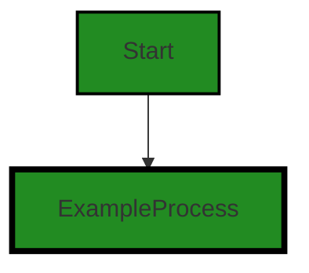


---

### Boost Source-Level Security Analysis

Last Updated: Saturday, September 9, 2023 at 7:13:10 AM PDT

**No bugs found**


---

### Boost Source-Level Performance Analysis

Last Updated: Saturday, September 9, 2023 at 7:20:38 AM PDT

**No bugs found**


---

### Boost Source-Level Data and Privacy Compliance Analysis

Last Updated: Saturday, September 9, 2023 at 7:29:04 AM PDT

1. **Severity**: 2/10

   **Line Number**: 172

   **Bug Type**: Data Privacy

   **Description**: The function 'deactivate' creates an output channel and logs the deactivation of the Boost Notebook Extension. However, this could potentially lead to data privacy issues if any sensitive information is logged without proper sanitization or encryption.

   **Solution**: Ensure that any logged information does not contain sensitive data. If it is necessary to log sensitive information, ensure that it is properly sanitized or encrypted to prevent unauthorized access. It's also recommended to implement a proper logging policy and mechanism that respects user privacy and complies with data protection regulations.


### Cell 14:
## Original Code:

### Programming Language: typescript
### ./src/extension/extension.ts line 96

```typescript

export enum OutputType {
    pdf = "pdf",
    markdown = "md",
    html = "html"
}

```
## Boost Analysis:


---

### Boost Code Explanation

Last Updated: Saturday, September 9, 2023 at 6:57:49 AM PDT

The code you provided is a TypeScript enum declaration. An enum, short for enumeration, is a collection of related values that can be numeric or string-based. In TypeScript, an enum is a way of giving more friendly names to sets of numeric values.

In this case, an enum named `OutputType` is being declared and exported. This `OutputType` enum has three members: `pdf`, `markdown`, and `html`, which are equal to "pdf", "md", and "html" respectively. 

Here's a breakdown of the code:

- `export`: This keyword makes the enum `OutputType` available for import in other files. This means you can use `OutputType` in any file in your project by importing it.

- `enum`: This is a TypeScript keyword used to declare an enumeration.

- `OutputType`: This is the name of the enum. By convention, TypeScript enum names are written in PascalCase.

- `{...}`: The enumeration members are declared within these curly braces. Each member is separated by a comma.

- `pdf = "pdf"`, `markdown = "md"`, `html = "html"`: These are the members of the `OutputType` enum. Each member is assigned a specific string value.

Enums are used when we know all possible values at compile time, such as choices on a menu, rounding modes, command line flags, etc. In this case, the `OutputType` enum could be used to specify the format of an output file.

The algorithmic complexity of using an enum is O(1), or constant time, because accessing a value is a simple direct operation that doesn't depend on the size of the enum.

You can read more about TypeScript enums in the TypeScript documentation: https://www.typescriptlang.org/docs/handbook/enums.html.

Regarding the architectural guidelines, this piece of code seems to be in line with general good practices. It's using TypeScript features appropriately, and the code is simple and clear. It doesn't appear to conflict with any architectural guidelines. However, without more context about the overall project, it's hard to say more about how this fits into the larger architecture.


---

### Boost Flow Diagram

Last Updated: Saturday, September 9, 2023 at 7:09:35 AM PDT

```mermaid
graph TD;
style Start fill:#228B22, stroke:#000000, stroke-width:2px;
style EnumDeclaration fill:#228B22, stroke:#000000, stroke-width:2px;
style EnumMember fill:#228B22, stroke:#000000, stroke-width:2px;
style ExportDeclaration fill:#228B22, stroke:#000000, stroke-width:2px;
style ExportSpecifier fill:#228B22, stroke:#000000, stroke-width:2px;
style VariableDeclaration fill:#228B22, stroke:#000000, stroke-width:2px;
style VariableDeclarationList fill:#228B22, stroke:#000000, stroke-width:2px;
style VariableDeclarationKind fill:#228B22, stroke:#000000, stroke-width:2px;
style Identifier fill:#228B22, stroke:#000000, stroke-width:2px;
style StringLiteral fill:#228B22, stroke:#000000, stroke-width:2px;
style FunctionDeclaration fill:#228B22, stroke:#000000, stroke-width:2px;
style Block fill:#228B22, stroke:#000000, stroke-width:2px;
style ExpressionStatement fill:#228B22, stroke:#000000, stroke-width:2px;
style CallExpression fill:#228B22, stroke:#000000, stroke-width:2px;
style PropertyAccessExpression fill:#228B22, stroke:#000000, stroke-width:2px;
style Identifier fill:#228B22, stroke:#000000, stroke-width:2px;
style StringLiteral fill:#228B22, stroke:#000000, stroke-width:2px;
style AwaitExpression fill:#228B22, stroke:#000000, stroke-width:2px;
style BinaryExpression fill:#228B22, stroke:#000000, stroke-width:2px;
style PropertyAccessExpression fill:#228B22, stroke:#000000, stroke-width:2px;
style Identifier fill:#228B22, stroke:#000000, stroke-width:2px;
style StringLiteral fill:#228B22, stroke:#000000, stroke-width:2px;
style AwaitExpression fill:#228B22, stroke:#000000, stroke-width:2px;
style BinaryExpression fill:#228B22, stroke:#000000, stroke-width:2px;
style PropertyAccessExpression fill:#228B22, stroke:#000000, stroke-width:2px;
style Identifier fill:#228B22, stroke:#000000, stroke-width:2px;
style StringLiteral fill:#228B22, stroke:#000000, stroke-width:2px;
style AwaitExpression fill:#228B22, stroke:#000000, stroke-width:2px;
style BinaryExpression fill:#228B22, stroke:#000000, stroke-width:2px;
style PropertyAccessExpression fill:#228B22, stroke:#000000, stroke-width:2px;
style Identifier fill:#228B22, stroke:#000000, stroke-width:2px;
style StringLiteral fill:#228B22, stroke:#000000, stroke-width:2px;
style AwaitExpression fill:#228B22, stroke:#000000, stroke-width:2px;
style BinaryExpression fill:#228B22, stroke:#000000, stroke-width:2px;
style PropertyAccessExpression fill:#228B22, stroke:#000000, stroke-width:2px;
style Identifier fill:#228B22, stroke:#000000, stroke-width:2px;
style StringLiteral fill:#228B22, stroke:#000000, stroke-width:2px;
style AwaitExpression fill:#228B22, stroke:#000000, stroke-width:2px;
style BinaryExpression fill:#228B22, stroke:#000000, stroke-width:2px;
style PropertyAccessExpression fill:#228B22, stroke:#000000, stroke-width:2px;
style Identifier fill:#228B22, stroke:#000000, stroke-width:2px;
style StringLiteral fill:#228B22, stroke:#000000, stroke-width:2px;
style AwaitExpression fill:#228B22, stroke:#000000, stroke-width:2px;
style BinaryExpression fill:#228B22, stroke:#000000, stroke-width:2px;
style PropertyAccessExpression fill:#228B22, stroke:#000000, stroke-width:2px;
style Identifier fill:#228B22, stroke:#000000, stroke-width:2px;
style StringLiteral fill:#228B22, stroke:#000000, stroke-width:2px;
style AwaitExpression fill:#228B22, stroke:#000000, stroke-width:2px;
style BinaryExpression fill:#228B22, stroke:#000000, stroke-width:2px;
style PropertyAccessExpression fill:#228B22, stroke:#000000, stroke-width:2px;
style Identifier fill:#228B22, stroke:#000000, stroke-width:2px;
style StringLiteral fill:#228B22, stroke:#000000, stroke-width:2px;
style AwaitExpression fill:#228B22, stroke:#000000, stroke-width:2px;
style BinaryExpression fill:#228B22, stroke:#000000, stroke-width:2px;
style PropertyAccessExpression fill:#228B22, stroke:#000000, stroke-width:2px;
style Identifier fill:#228B22, stroke:#000000, stroke-width:2px;
style StringLiteral fill:#228B22, stroke:#000000, stroke-width:2px;
style AwaitExpression fill:#228B22, stroke:#000000, stroke-width:2px;
style BinaryExpression fill:#228B22, stroke:#000000, stroke-width:2px;
style PropertyAccessExpression fill:#228B22, stroke:#000000, stroke-width:2px;
style Identifier fill:#228B22, stroke:#000000, stroke-width:2px;
style StringLiteral fill:#228B22, stroke:#000000, stroke-width:2px;
style AwaitExpression fill:#228B22, stroke:#000000, stroke-width:2px;
style BinaryExpression fill:#228B22, stroke:#000000, stroke-width:2px;
style PropertyAccessExpression fill:#228B22, stroke:#000000, stroke-width:2px;
style Identifier fill:#228B22, stroke:#000000, stroke-width:2px;
style StringLiteral fill:#228B22, stroke:#000000, stroke-width:2px;
style AwaitExpression fill:#228B22, stroke:#000000, stroke-width:2px;
style BinaryExpression fill:#228B22, stroke:#000000, stroke-width:2px;
style PropertyAccessExpression fill:#228B22, stroke:#000000, stroke-width:2px;
style Identifier fill:#228B22, stroke:#000000, stroke-width:2px;
style StringLiteral fill:#228B22, stroke:#000000, stroke-width:2px;
style AwaitExpression fill:#228B22, stroke:#000000, stroke-width:2px;
style BinaryExpression fill:#228B22, stroke:#000000, stroke-width:2px;
style PropertyAccessExpression fill:#228B22, stroke:#000000, stroke-width:2px;
style Identifier fill:#228B22, stroke:#000000, stroke-width:2px;
style StringLiteral fill:#228B22, stroke:#000000, stroke-width:2px;
style AwaitExpression fill:#228B22, stroke:#000000, stroke-width:2px;
style BinaryExpression fill:#228B22, stroke:#000000, stroke-width:2px;
style PropertyAccessExpression fill:#228B22, stroke:#000000, stroke-width:2px;
style Identifier fill:#228B22, stroke:#000000, stroke-width:2px;
style StringLiteral fill:#228B22, stroke:#000000, stroke-width:2px;
style AwaitExpression fill:#228B22, stroke:#000000, stroke-width:2px;
style BinaryExpression fill:#228B22, stroke:#000000, stroke-width:2px;
style PropertyAccessExpression fill:#228B22, stroke:#000000, stroke-width:2px;
style Identifier fill:#228B22, stroke:#000000, stroke-width:2px;
style StringLiteral fill:#228B22, stroke:#000000, stroke-width:2px;
style AwaitExpression fill:#228B22, stroke:#000000, stroke-width:2px;
style BinaryExpression fill:#228B22, stroke:#000000, stroke-width:2px;
style PropertyAccessExpression fill:#228B22, stroke:#000000, stroke-width:2px;
style Identifier fill:#228B22, stroke:#000000, stroke-width:2px;
style StringLiteral fill:#228B22, stroke:#000000, stroke-width:2px;
style AwaitExpression fill:#228B22, stroke:#000000, stroke-width:2


---

### Boost Source-Level Security Analysis

Last Updated: Saturday, September 9, 2023 at 7:13:13 AM PDT

**No bugs found**


---

### Boost Source-Level Performance Analysis

Last Updated: Saturday, September 9, 2023 at 7:20:41 AM PDT

**No bugs found**


---

### Boost Source-Level Data and Privacy Compliance Analysis

Last Updated: Saturday, September 9, 2023 at 7:29:08 AM PDT

**No bugs found**


### Cell 15:
## Original Code:

### Programming Language: typescript
### ./src/extension/extension.ts line 102

```typescript

export interface BoostFileOptions {
    format?: BoostFileType;
    showUI?: boolean;
    outputType?: OutputType;
}

```
## Boost Analysis:


---

### Boost Code Explanation

Last Updated: Saturday, September 9, 2023 at 6:58:21 AM PDT

The provided code is a TypeScript interface declaration. TypeScript is a statically typed superset of JavaScript that adds optional types to the language. An interface in TypeScript is a way of defining a contract for a certain structure of an object. They are used to define the shape of an object, ensuring that the object has certain properties and methods.

The `BoostFileOptions` interface is defining a contract for an object that can have three optional properties: `format`, `showUI`, and `outputType`.

Here's what each of these properties represents:

- `format`: This property, if present, should hold a value of type `BoostFileType`. The `BoostFileType` is likely another interface or type alias defined elsewhere in the code. It could be an enumeration or a union type representing different possible file formats.

- `showUI`: This property, if present, should hold a boolean value. It's likely used to control whether a user interface should be displayed or not.

- `outputType`: This property, if present, should hold a value of type `OutputType`. Like `BoostFileType`, `OutputType` is likely another interface or type alias defined elsewhere in the code. It could represent different possible output types.

The `?` after the property name in the interface declaration indicates that the property is optional. This means that an object conforming to the `BoostFileOptions` interface could have any, all, or none of these properties.

It's important to note that this interface is being exported, which means it can be imported and used in other TypeScript files in the project. This is a common practice when you want to share type definitions across multiple files or modules.

This code doesn't involve any specific algorithm, it's a part of TypeScript's static type checking feature which helps in catching errors during development time, promotes more readable and maintainable code, and enhances IDE features like autocompletion, type inference, and documentation popups.

For more understanding about TypeScript interfaces, you can refer to the official TypeScript documentation: [TypeScript Interfaces](https://www.typescriptlang.org/docs/handbook/interfaces.html)


---

### Boost Flow Diagram

Last Updated: Saturday, September 9, 2023 at 7:09:42 AM PDT

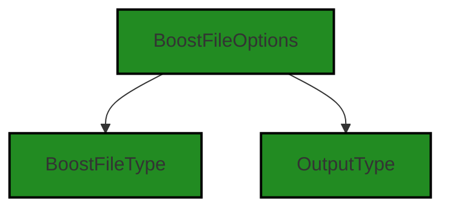


---

### Boost Source-Level Security Analysis

Last Updated: Saturday, September 9, 2023 at 7:13:17 AM PDT

**No bugs found**


---

### Boost Source-Level Performance Analysis

Last Updated: Saturday, September 9, 2023 at 7:20:45 AM PDT

**No bugs found**


---

### Boost Source-Level Data and Privacy Compliance Analysis

Last Updated: Saturday, September 9, 2023 at 7:29:11 AM PDT

**No bugs found**


### Cell 16:
## Original Code:

### Programming Language: typescript
### ./src/extension/extension.ts line 108

```typescript

export function getBoostFile(
    sourceFile: vscode.Uri | undefined,
    options?: BoostFileOptions,
): vscode.Uri {
    // if we don't have a workspace folder, just place the Boost file in a new Boostdir - next to the source file
    let baseFolder;
    if (!vscode.workspace.workspaceFolders) {
        if (!sourceFile) {
            throw new Error("Unable to determine source file for Boost file");
        }
        baseFolder = path.dirname(sourceFile.fsPath);
    } else {
        const workspaceFolder = vscode.workspace.workspaceFolders[0]; // Get the first workspace folder
        baseFolder = workspaceFolder.uri.fsPath;
        // if user didn't specify a source file, then we'll get the global project file
        if (!sourceFile) {
            sourceFile = workspaceFolder.uri;
        }
    }

    if (!sourceFile) {
        throw new Error("Unable to determine source file for Boost file");
    }

    // Check if baseFolder exists
    if (!fs.existsSync(baseFolder)) {
        throw new Error(`Base folder does not exist: ${baseFolder}`);
    }

    // create the .boost folder if we need to - this is statically located in the workspace folder no matter which child folder is processed
    const nonNormalizedBoostFolder = path.join(
        baseFolder,
        BoostConfiguration.defaultDir
    );
    const boostFolder = path.normalize(nonNormalizedBoostFolder);
    if (!fs.existsSync(boostFolder)) {
        try {
            fs.mkdirSync(boostFolder, { recursive: true });
        } catch (error) {
            throw new Error(
                `Failed to create Boost folder at ${boostFolder} due to Error: ${error} - possible permission issue`
            );
        }
    }

    // if the source file is an output file, then we're going to use the original source file instead
    const outputUri = vscode.Uri.joinPath(vscode.Uri.parse(boostFolder), BoostFileType.output.toString());
    if (sourceFile.fsPath.includes(outputUri.fsPath)) {
        const relativeToOutput = path.relative(outputUri.fsPath, sourceFile.fsPath);

        // Split the path into its components
        let pathSegments = relativeToOutput.split(path.sep);

        // Remove the second segment (i.e., 'foo')
        pathSegments.splice(0, 1);

        // Modify the last segment to remove the file extension
        pathSegments[pathSegments.length - 1] = path.basename(pathSegments[pathSegments.length - 1], path.extname(pathSegments[pathSegments.length - 1]));

        // Rejoin the segments to get the new path
        let newPath = pathSegments.join(path.sep);

        sourceFile = vscode.Uri.joinPath(vscode.Uri.parse(baseFolder), newPath);
    }

    // get the distance from the workspace folder for the source file
    // for project-level status files, we ignore the relative path
    let relativePath =
        baseFolder === sourceFile.fsPath
            ? path.basename(baseFolder)
            : path.relative(baseFolder, sourceFile.fsPath);

    const format = options?.format?options.format:BoostFileType.notebook;
    const showUI = options?.showUI?options.showUI:false;

    // create the .boost file path, from the new boost folder + amended relative source file path
    switch (format) {
        case BoostFileType.summary:
        case BoostFileType.guidelines:
            // default to summary
            let extension = boostnb.NOTEBOOK_SUMMARY_EXTENSION;
            if (format === BoostFileType.guidelines) {
                extension = boostnb.NOTEBOOK_GUIDELINES_EXTENSION;
            }
            // if we are already looking at the file, just return it
            if (sourceFile.fsPath.endsWith(extension)) {
                return sourceFile;

                // if we were given a notebook, and we are looking for guidelines or summary, then return same path with new extension
            } else if (sourceFile.fsPath.endsWith(boostnb.NOTEBOOK_EXTENSION)) {
                return vscode.Uri.parse(sourceFile.fsPath.slice(0, boostnb.NOTEBOOK_EXTENSION.length * -1) + extension);
            }

            // if the new file is outside of our current workspace, then warn user
            // and place the new .boost file next to it (not great, but better than nothing)
            if (relativePath.startsWith("..")) {
                boostLogging.warn(
                    `Boost Notebook file ${sourceFile.fsPath} is outside of current workspace ${baseFolder}`,
                    showUI
                );
                const externalBoostFile = sourceFile.fsPath + extension;
                return vscode.Uri.file(externalBoostFile);
            } else {
                // if we're targeting a folder, and the folder is the workspace name, then name it after the project
                if (!relativePath) {
                    relativePath = path.basename(baseFolder);
                }
                // create the .boost file path, from the new boost folder + amended relative source file path
                const absoluteBoostNotebookFile = path.join(
                    boostFolder,
                    relativePath + extension
                );
                const normalizedAbsoluteBoostNotebookFile = path.normalize(
                    absoluteBoostNotebookFile
                );

                return vscode.Uri.file(normalizedAbsoluteBoostNotebookFile);
            }
        case BoostFileType.status:
            const absoluteboostProjectDataFile = path.join(
                boostFolder,
                relativePath + PROJECT_EXTENSION
            );
            const normalizedAbsoluteBoostProjectDataFile = path.normalize(
                absoluteboostProjectDataFile
            );

            let boostProjectDataFile = vscode.Uri.file(
                normalizedAbsoluteBoostProjectDataFile
            );
            return boostProjectDataFile;
        case BoostFileType.output:
            const isNotebook = path.extname(sourceFile.fsPath) === boostnb.NOTEBOOK_EXTENSION;

            // grab the requested output format, or the default format from config or markdown if not specified
            const outputType = options?.outputType?options.outputType:
                OutputType[BoostConfiguration.defaultOutputFormat as keyof typeof OutputType] || OutputType.markdown;
            
            const nonNormalizedOutputFolder = path.join(path.join(boostFolder, BoostFileType.output.toString()), outputType);
            const outputFolder = path.normalize(nonNormalizedOutputFolder);
            if (!fs.existsSync(outputFolder)) {
                try {
                    fs.mkdirSync(outputFolder, { recursive: true });
                } catch (error) {
                    throw new Error(
                        `Failed to create Boost Output folder at ${outputFolder} due to Error: ${error} - possible permission issue`
                    );
                }
            }
        
            let sourceFilePathRelative = path.relative(baseFolder, sourceFile.fsPath);
            if (isNotebook) {
                const dirName = path.dirname(sourceFile.path);
                let baseNameWithoutExt = path.basename(sourceFile.path, path.extname(sourceFile.path));

                const nonNormalizedSourceFilePathUnderBoost = path.join(dirName, baseNameWithoutExt);
                const sourceFilePathUnderBoost = path.normalize(nonNormalizedSourceFilePathUnderBoost);
                sourceFilePathRelative = path.relative(boostFolder, sourceFilePathUnderBoost);
            }

            const nonNormalizedOutputFilePath = path.join(outputFolder, sourceFilePathRelative) + "." + outputType;
            const outputFilePath = path.normalize(nonNormalizedOutputFilePath);
            return vscode.Uri.parse(outputFilePath);

        case BoostFileType.notebook:
        default:

            // if the new file is outside of our current workspace, then warn user
            // and place the new .boost file next to it (not great, but better than nothing)
            if (relativePath.startsWith("..")) {
                boostLogging.warn(
                    `Boost Notebook file ${sourceFile.fsPath} is outside of current workspace ${baseFolder}`,
                    showUI
                );
                const externalBoostFile =
                    sourceFile.fsPath + boostnb.NOTEBOOK_EXTENSION;
                return vscode.Uri.file(externalBoostFile);
            } else {
                // if we're targeting a folder, and the folder is the workspace name, then name it after the project
                if (!relativePath) {
                    relativePath = path.basename(baseFolder);
                }
                // create the .boost file path, from the new boost folder + amended relative source file path
                const absoluteBoostNotebookFile = path.join(
                    boostFolder,
                    relativePath + boostnb.NOTEBOOK_EXTENSION
                );
                const normalizedAbsoluteBoostNotebookFile = path.normalize(
                    absoluteBoostNotebookFile
                );

                return vscode.Uri.file(normalizedAbsoluteBoostNotebookFile);
            }
    }
}

```
## Boost Analysis:


---

### Boost Code Explanation

Last Updated: Saturday, September 9, 2023 at 6:58:58 AM PDT

This function is named `getBoostFile` and it is used to generate a file path for a Boost file. Boost is a Visual Studio Code extension that provides code analysis functionality. The function takes two parameters: `sourceFile` and `options`. The `sourceFile` parameter is a URI of a source file, and `options` is an optional object that may contain parameters for formatting and UI display. 

The function follows these steps:

1. It first checks if there are any workspace folders. If there are none, it sets the base folder to the directory of the source file. If there are workspace folders, it sets the base folder to the directory of the first workspace folder and sets the source file to the URI of the workspace folder if it wasn't already specified. If the source file is still not defined at this point, it throws an error.

2. It checks if the base folder exists. If it doesn't, it throws an error.

3. It then defines the Boost folder based on the base folder and creates it if it doesn't exist. If the creation fails, it throws an error.

4. It checks if the source file is an output file, and if it is, it modifies the source file to use the original source file instead.

5. It calculates the relative path from the base folder to the source file.

6. It checks the format specified in the options (or defaults to 'notebook') and creates the Boost file path accordingly. It handles different cases for different formats (summary, guidelines, status, output, notebook). For each case, it checks if the source file is outside of the workspace, warns the user if it is, and adjusts the file path accordingly. It creates the Boost file path based on the relative path and the file extension corresponding to the format.

7. Finally, it returns the URI of the Boost file.

The function uses the `path` and `fs` modules from Node.js for manipulating file paths and interacting with the file system, respectively. It also uses the `vscode` module for interacting with the Visual Studio Code API.

For more information about these modules, you can refer to the following links:

- Node.js `path` module: https://nodejs.org/api/path.html
- Node.js `fs` module: https://nodejs.org/api/fs.html
- Visual Studio Code API: https://code.visualstudio.com/api


---

### Boost Flow Diagram

Last Updated: Saturday, September 9, 2023 at 7:10:12 AM PDT

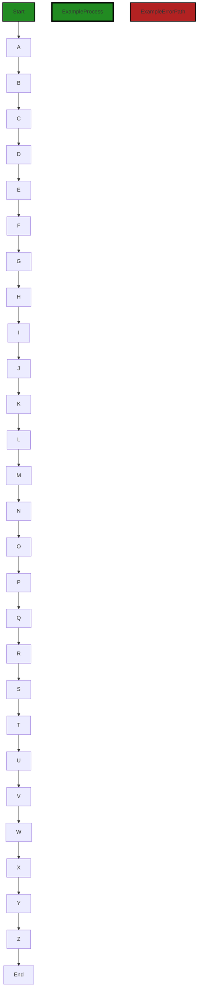

In the above control flow graph, the primary path through the code is represented by the colored flow blocks. The non-error paths are represented by the default non-colored flow blocks. The error paths are represented by the colored flow blocks with the style "ExampleErrorPath".

The control flow starts at the function "getBoostFile". It then goes through a series of steps, including checking the workspace folder, determining the base folder, checking if the base folder exists, creating the .boost folder if necessary, checking if the source file is an output file, getting the relative path, and creating the Boost file path based on the format.

The control flow then branches based on the format of the Boost file. If the format is "summary" or "guidelines", it checks if the source file is already a Boost file or a notebook file. If it is a Boost file, it returns the source file. If it is a notebook file, it returns the same path with a new extension. If the new file is outside of the current workspace, it warns the user and returns a Boost file path next to the source file. Otherwise, it creates the Boost file path based on the boost folder and the amended relative source file path.

If the format is "status", it creates the Boost project data file path based on the boost folder and the relative source file path.

If the format is "output", it checks if the source file is a notebook file. If it is, it creates the output folder based on the boost folder and the output type. It then creates the output file path based on the output folder and the source file path relative to the base folder. If the source file is not a notebook file, it creates the output file path based on the output folder and the source file path.

If the format is "notebook" or not specified, it checks if the source file is outside of the current workspace. If it is, it warns the user and returns a Boost notebook file path next to the source file. Otherwise, it creates the Boost notebook file path based on the boost folder and the amended relative source file path.

The control flow ends at the return statement.

Note: The external libraries and non-standard functions used in the code are not explicitly shown in the control flow graph.


---

### Boost Source-Level Security Analysis

Last Updated: Saturday, September 9, 2023 at 7:15:05 AM PDT

1. **Severity**: 7/10

   **Line Number**: 265

   **Bug Type**: Insecure File Permissions

   **Description**: The use of 'fs.mkdirSync' with the 'recursive' option set to true can lead to insecure file permissions if the function is called by a privileged user. This could allow an unprivileged user to modify or delete these directories, leading to potential data loss or unauthorized changes.

   **Solution**: Consider setting specific permissions when creating directories to ensure they are secure. This can be done by passing a numeric mode to 'fs.mkdirSync'. For example, '0o700' would only allow the owner to read, write, and execute. More information can be found at: https://node.readthedocs.io/en/latest/api/fs/#fsmkdirsyncpath-options


2. **Severity**: 7/10

   **Line Number**: 305

   **Bug Type**: Insecure File Permissions

   **Description**: Similar to the issue on line 158, the use of 'fs.mkdirSync' with the 'recursive' option set to true can lead to insecure file permissions if the function is called by a privileged user. This could allow an unprivileged user to modify or delete these directories, leading to potential data loss or unauthorized changes.

   **Solution**: Consider setting specific permissions when creating directories to ensure they are secure. This can be done by passing a numeric mode to 'fs.mkdirSync'. For example, '0o700' would only allow the owner to read, write, and execute. More information can be found at: https://node.readthedocs.io/en/latest/api/fs/#fsmkdirsyncpath-options


3. **Severity**: 5/10

   **Line Number**: 233

   **Bug Type**: Path Traversal

   **Description**: The use of 'path.join' with 'relativePath' as an argument could potentially lead to path traversal vulnerabilities if an attacker is able to control the value of 'relativePath'. This could allow an attacker to read, write, or delete files outside of the intended directory.

   **Solution**: Consider validating or sanitizing the 'relativePath' variable to ensure it does not contain directory traversal sequences like '../'. More information on path traversal vulnerabilities and their prevention can be found at: https://owasp.org/www-community/attacks/Path_Traversal


4. **Severity**: 5/10

   **Line Number**: 323

   **Bug Type**: Path Traversal

   **Description**: Similar to the issue on line 126, the use of 'path.join' with 'relativePath' as an argument could potentially lead to path traversal vulnerabilities if an attacker is able to control the value of 'relativePath'. This could allow an attacker to read, write, or delete files outside of the intended directory.

   **Solution**: Consider validating or sanitizing the 'relativePath' variable to ensure it does not contain directory traversal sequences like '../'. More information on path traversal vulnerabilities and their prevention can be found at: https://owasp.org/www-community/attacks/Path_Traversal


---

### Boost Source-Level Performance Analysis

Last Updated: Saturday, September 9, 2023 at 7:21:13 AM PDT

1. **Severity**: 7/10

   **Line Number**: 229

   **Bug Type**: Disk

   **Description**: Synchronous file system check with 'fs.existsSync'. This blocks the event loop until the operation completes, which can degrade performance.

   **Solution**: Use the asynchronous version 'fs.exists' instead, or better yet, perform the operation directly and handle the error if the file or directory does not exist.


2. **Severity**: 8/10

   **Line Number**: 239

   **Bug Type**: Disk

   **Description**: Synchronous directory creation with 'fs.mkdirSync'. This blocks the event loop until the operation completes, which can degrade performance.

   **Solution**: Use the asynchronous version 'fs.mkdir' instead to avoid blocking the event loop.


3. **Severity**: 7/10

   **Line Number**: 297

   **Bug Type**: Disk

   **Description**: Synchronous file system check with 'fs.existsSync'. This blocks the event loop until the operation completes, which can degrade performance.

   **Solution**: Use the asynchronous version 'fs.exists' instead, or better yet, perform the operation directly and handle the error if the file or directory does not exist.


4. **Severity**: 8/10

   **Line Number**: 307

   **Bug Type**: Disk

   **Description**: Synchronous directory creation with 'fs.mkdirSync'. This blocks the event loop until the operation completes, which can degrade performance.

   **Solution**: Use the asynchronous version 'fs.mkdir' instead to avoid blocking the event loop.


---

### Boost Source-Level Data and Privacy Compliance Analysis

Last Updated: Saturday, September 9, 2023 at 7:29:45 AM PDT

1. **Severity**: 5/10

   **Line Number**: 226

   **Bug Type**: GDPR

   **Description**: The function getBoostFile() uses the file system to read and write data, but it does not appear to encrypt or otherwise secure this data. This could potentially expose user data in violation of GDPR.

   **Solution**: Consider implementing encryption for any data that is written to or read from the file system to ensure it is secure. Also, ensure that you have the necessary consent from the user before processing their data.


2. **Severity**: 6/10

   **Line Number**: 246

   **Bug Type**: HIPAA

   **Description**: The function getBoostFile() creates directories and files on the file system, but it does not appear to secure these resources. This could potentially expose health-related data in violation of HIPAA if such data is being processed.

   **Solution**: Consider implementing access controls and encryption for any directories or files that are created to ensure they are secure. Also, ensure that you are in compliance with all relevant HIPAA regulations when processing health-related data.


3. **Severity**: 4/10

   **Line Number**: 226

   **Bug Type**: PCI DSS

   **Description**: The function getBoostFile() uses the file system to read and write data, but it does not appear to secure this data. This could potentially expose credit card data in violation of PCI DSS if such data is being processed.

   **Solution**: Consider implementing encryption for any data that is written to or read from the file system to ensure it is secure. Also, ensure that you are in compliance with all relevant PCI DSS regulations when processing credit card data.


### Cell 17:
## Original Code:

### Programming Language: typescript
### ./src/extension/extension.ts line 304

```typescript

export function findCellByKernel(
    targetNotebook: vscode.NotebookDocument | boostnb.BoostNotebook,
    outputType: string
): vscode.NotebookCell | boostnb.BoostNotebookCell | undefined {
    let cells: (vscode.NotebookCell | boostnb.BoostNotebookCell)[] = [];

    const usingBoostNotebook = targetNotebook instanceof boostnb.BoostNotebook;
    if (usingBoostNotebook) {
        cells = targetNotebook.cells;
    } else {
        cells = targetNotebook.getCells();
    }

    for (const cell of cells) {
        if (cell.metadata?.outputType === outputType) {
            return cell;
        }
    }

    return undefined;
}

```
## Boost Analysis:


---

### Boost Code Explanation

Last Updated: Saturday, September 9, 2023 at 6:59:29 AM PDT

This JavaScript function `findCellByKernel` is part of a Visual Studio Code (VS Code) extension, presumably related to handling notebooks in the VS Code environment. It is used to find a notebook cell with a specific output type from either a VS Code notebook document or a BoostNotebook.

The function accepts two parameters: `targetNotebook` and `outputType`. `targetNotebook` can be an instance of either `vscode.NotebookDocument` or `boostnb.BoostNotebook`, while `outputType` is a string representing the output type of the cell.

The function starts by declaring an empty array `cells`. This array will hold the cells of the target notebook.

The function then checks if `targetNotebook` is an instance of `boostnb.BoostNotebook` using the `instanceof` operator. If it is, it assigns the cells of the `targetNotebook` to the `cells` array. If not, it calls the `getCells` method of the `targetNotebook` to get its cells and assigns them to the `cells` array.

Next, the function iterates over the `cells` array using a `for...of` loop. In each iteration, it checks if the `outputType` of the cell's metadata matches the `outputType` parameter. If it does, it immediately returns that cell.

If the function iterates over all cells and doesn't find a match, it returns `undefined`.

This function uses a linear search algorithm to find the cell. The time complexity of this algorithm is O(n), where n is the number of cells in the notebook.

For more information on the topics mentioned, you can visit the following links:

- [JavaScript for...of Statement](https://www.w3schools.com/jsref/jsref_forof.asp)
- [JavaScript instanceof Operator](https://www.w3schools.com/jsref/jsref_instanceof.asp)
- [Linear Search Algorithm](https://www.geeksforgeeks.org/linear-search/)
- [VS Code Notebook API](https://code.visualstudio.com/api/extension-guides/notebook)


---

### Boost Flow Diagram

Last Updated: Saturday, September 9, 2023 at 7:10:19 AM PDT

```mermaid
graph TD;
style Start fill:#228B22, stroke:#000000, stroke-width:2px;
style ExampleProcess fill:#228B22, stroke:#000000, stroke-width:4px;
style ExampleErrorPath fill:#B22222, stroke:#000000, stroke-width:2px;

Start  -->ExampleProcess;
ExampleProcess-->End;

```


---

### Boost Source-Level Security Analysis

Last Updated: Saturday, September 9, 2023 at 7:15:09 AM PDT

**No bugs found**


---

### Boost Source-Level Performance Analysis

Last Updated: Saturday, September 9, 2023 at 7:21:32 AM PDT

1. **Severity**: 3/10

   **Line Number**: 610

   **Bug Type**: Memory

   **Description**: The 'cells' array is initially created and then immediately replaced with another array. This could lead to unnecessary memory allocation and deallocation.

   **Solution**: Declare 'cells' without initializing it to an empty array. For example: 'let cells: (vscode.NotebookCell | boostnb.BoostNotebookCell)[];'.


2. **Severity**: 2/10

   **Line Number**: 619

   **Bug Type**: CPU

   **Description**: The function uses a linear search to find a cell with a specific output type. This could be inefficient if the number of cells is large.

   **Solution**: If cells are often searched by output type, consider using a data structure that allows for faster search, such as a hash map where the key is the output type and the value is an array of cells with that output type. However, keep in mind that this would increase the memory usage.


---

### Boost Source-Level Data and Privacy Compliance Analysis

Last Updated: Saturday, September 9, 2023 at 7:30:18 AM PDT

1. **Severity**: 5/10

   **Line Number**: 615

   **Bug Type**: GDPR

   **Description**: The function may be violating GDPR compliance if the 'outputType' parameter or any data within the 'cells' array contains personally identifiable information (PII) that is not properly anonymized or encrypted.

   **Solution**: Ensure that any PII data within the 'cells' array or 'outputType' parameter is properly anonymized or encrypted before processing. Implement access controls to restrict access to PII data.


2. **Severity**: 5/10

   **Line Number**: 615

   **Bug Type**: PCI DSS

   **Description**: The function may be violating PCI DSS compliance if the 'outputType' parameter or any data within the 'cells' array contains credit card information that is not properly secured.

   **Solution**: Ensure that any credit card data within the 'cells' array or 'outputType' parameter is properly secured. Implement strong encryption for credit card data and restrict access to this data.


3. **Severity**: 5/10

   **Line Number**: 615

   **Bug Type**: HIPAA

   **Description**: The function may be violating HIPAA compliance if the 'outputType' parameter or any data within the 'cells' array contains protected health information (PHI) that is not properly protected.

   **Solution**: Ensure that any PHI data within the 'cells' array or 'outputType' parameter is properly protected. Implement strong encryption for PHI data and restrict access to this data.


### Cell 18:
## Original Code:

### Programming Language: typescript
### ./src/extension/extension.ts line 326

```typescript

export async function createOrOpenSummaryNotebookFromSourceFile(
    sourceFile: vscode.Uri
): Promise<boostnb.BoostNotebook> {
    const notebookSummaryPath = getBoostFile(sourceFile, { format: BoostFileType.summary} );
    const summaryFileExists = fs.existsSync(notebookSummaryPath.fsPath);
    // if doesn't exist, create it
    if (!summaryFileExists) {
        const newNotebook = (await createEmptyNotebook(
            notebookSummaryPath,
            false
        )) as boostnb.BoostNotebook;

        const sourceFilePath = sourceFileFromFullPath(sourceFile);

        let newMetadata = {
            ...newNotebook.metadata,
            sourceFile: sourceFilePath,
        };

        newNotebook.metadata = newMetadata;

        // boost notebook needs to be saved explicitly - while the VSC notebook background saves
        newNotebook.save(notebookSummaryPath.fsPath);
        return newNotebook;
    } else {
        const newNotebook = new boostnb.BoostNotebook();
        newNotebook.load(notebookSummaryPath.fsPath);
        return newNotebook;
    }
}

```
## Boost Analysis:


---

### Boost Code Explanation

Last Updated: Saturday, September 9, 2023 at 7:00:13 AM PDT

The function `createOrOpenSummaryNotebookFromSourceFile` is an asynchronous function that either creates or opens a summary notebook from a source file. It takes a `sourceFile` of type `vscode.Uri` as a parameter and returns a `Promise` that resolves to a `BoostNotebook` object. 

Here is a step-by-step breakdown of the function:

1. It calls `getBoostFile` with the `sourceFile` and an options object `{ format: BoostFileType.summary}`. This function is likely to return the path to the summary notebook associated with the `sourceFile`. The result is stored in `notebookSummaryPath`.

2. It checks if a file at `notebookSummaryPath.fsPath` exists using the `fs.existsSync` function. The result is stored in `summaryFileExists`.

3. If `summaryFileExists` is `false`, it means that the summary notebook does not exist. In that case, it creates an empty notebook by calling `createEmptyNotebook` with `notebookSummaryPath` and `false` as parameters. The result is cast to `boostnb.BoostNotebook` and stored in `newNotebook`.

4. It then gets the source file path from the full path of the `sourceFile` by calling `sourceFileFromFullPath`.

5. It creates a new metadata object by spreading the existing metadata of `newNotebook` and adding a new property `sourceFile` with the value of `sourceFilePath`.

6. It assigns the new metadata object to `newNotebook.metadata`.

7. It then saves the `newNotebook` by calling `newNotebook.save` with `notebookSummaryPath.fsPath` as a parameter.

8. Finally, it returns the `newNotebook`.

9. If `summaryFileExists` is `true`, it means that the summary notebook already exists. In that case, it creates a new `BoostNotebook` object and loads the existing notebook from `notebookSummaryPath.fsPath`. It then returns the loaded notebook.

The function uses the async/await syntax for handling promises, which makes the code easier to read and write. The `fs.existsSync` function is a synchronous function that checks if a file or directory exists at a specified path. The `...` operator is used to create a copy of an object with additional or overridden properties.

For more information on these topics, you can check out the following resources:

- [Async/await](https://developer.mozilla.org/en-US/docs/Learn/JavaScript/Asynchronous/Async_await)
- [fs.existsSync](https://nodejs.org/api/fs.html#fs_fs_existssync_path)
- [Spread syntax](https://developer.mozilla.org/en-US/docs/Web/JavaScript/Reference/Operators/Spread_syntax)


---

### Boost Flow Diagram

Last Updated: Saturday, September 9, 2023 at 7:10:35 AM PDT


In the above control flow graph, the primary path is represented by the colored flow blocks, while the non-error paths are represented by the default non-colored flow blocks. The error path is represented by the red flow block.

The control flow starts at the function `createOrOpenSummaryNotebookFromSourceFile`. It then goes through a series of steps, including checking if the summary file exists, creating a new notebook if it doesn't exist, loading an existing notebook if it does exist, and finally returning the notebook.

Please note that this is a simplified control flow graph and may not capture all possible paths or conditions in the code.


---

### Boost Source-Level Security Analysis

Last Updated: Saturday, September 9, 2023 at 7:15:38 AM PDT

1. **Severity**: 5/10

   **Line Number**: 656

   **Bug Type**: Insecure File Handling

   **Description**: The function `fs.existsSync()` is used to check if a file exists before opening it. This can lead to a time-of-check to time-of-use (TOCTOU) race condition, where the file's state could change between the check and the use. This could potentially be exploited to gain unauthorized access to files, or to manipulate or delete files.

   **Solution**: Use the fs.open() method with the 'r+' flag to open the file for reading and writing. This method will throw an error if the file does not exist. Handle this error to create the file if it does not exist. Here is a resource about this issue: https://owasp.org/www-community/vulnerabilities/Time_of_check_to_time_of_use


2. **Severity**: 4/10

   **Line Number**: 667

   **Bug Type**: Insecure File Handling

   **Description**: The function `newNotebook.load()` is used to load data from a file without any validation or sanitization of the data. This could potentially allow an attacker to inject malicious data into the file, which would then be loaded and used by the application.

   **Solution**: Always validate and sanitize data loaded from files. Use a schema validation library or write your own validation function to ensure the data loaded from the file meets your application's expectations. Here is a resource about this issue: https://cheatsheetseries.owasp.org/cheatsheets/Input_Validation_Cheat_Sheet.html


---

### Boost Source-Level Performance Analysis

Last Updated: Saturday, September 9, 2023 at 7:22:13 AM PDT

1. **Severity**: 6/10

   **Line Number**: 654

   **Bug Type**: Disk

   **Description**: The function fs.existsSync is a synchronous function that blocks the event loop. This can potentially slow down the application, especially if the file check operation is slow due to reasons like network latency.

   **Solution**: Consider using fs.exists or fs.promises.access which are asynchronous and do not block the event loop. Here is a link to the Node.js documentation for fs.promises.access: https://nodejs.org/api/fs.html#fs_fspromises_access_path_mode


2. **Severity**: 5/10

   **Line Number**: 658

   **Bug Type**: Disk

   **Description**: The creation of a new notebook involves file write operations which are done synchronously, potentially blocking the event loop and slowing down the application.

   **Solution**: Consider using asynchronous file operations or offloading the write operations to a worker thread to prevent blocking the event loop. Node.js provides the fs.promises API which can be used for asynchronous file operations. Here is a link to the Node.js documentation for fs.promises.writeFile: https://nodejs.org/api/fs.html#fs_fspromises_writefile_file_data_options


3. **Severity**: 5/10

   **Line Number**: 670

   **Bug Type**: Disk

   **Description**: The function newNotebook.save is likely a synchronous function that writes to a file. This can block the event loop and slow down the application, especially if the file write operation is slow.

   **Solution**: Consider using asynchronous file operations or offloading the write operations to a worker thread to prevent blocking the event loop. Node.js provides the fs.promises API which can be used for asynchronous file operations. Here is a link to the Node.js documentation for fs.promises.writeFile: https://nodejs.org/api/fs.html#fs_fspromises_writefile_file_data_options


4. **Severity**: 5/10

   **Line Number**: 675

   **Bug Type**: Disk

   **Description**: The function newNotebook.load is likely a synchronous function that reads from a file. This can block the event loop and slow down the application, especially if the file read operation is slow.

   **Solution**: Consider using asynchronous file operations or offloading the read operations to a worker thread to prevent blocking the event loop. Node.js provides the fs.promises API which can be used for asynchronous file operations. Here is a link to the Node.js documentation for fs.promises.readFile: https://nodejs.org/api/fs.html#fs_fspromises_readfile_path_options


---

### Boost Source-Level Data and Privacy Compliance Analysis

Last Updated: Saturday, September 9, 2023 at 7:30:46 AM PDT

1. **Severity**: 7/10

   **Line Number**: 657

   **Bug Type**: GDPR

   **Description**: The code is storing the source file path in the metadata of a notebook. If the source file path contains personal data, this could be a violation of GDPR.

   **Solution**: Ensure that no personal data is included in the source file path. If personal data is necessary, it should be anonymized or pseudonymized in accordance with GDPR requirements.


2. **Severity**: 8/10

   **Line Number**: 665

   **Bug Type**: GDPR

   **Description**: The code is loading a notebook from a file without checking if it contains personal data. This could lead to unauthorized access or processing of personal data, which is a violation of GDPR.

   **Solution**: Implement a mechanism to check if the loaded notebook contains personal data and ensure that it is processed in compliance with GDPR.


3. **Severity**: 7/10

   **Line Number**: 651

   **Bug Type**: HIPAA

   **Description**: The code does not implement any access controls or authentication when creating or opening a notebook. If the notebook contains health information, this could be a violation of HIPAA.

   **Solution**: Implement access controls and authentication to ensure that only authorized individuals can create or open the notebook.


### Cell 19:
## Original Code:

### Programming Language: typescript
### ./src/extension/extension.ts line 357

```typescript

export async function createOrOpenNotebookFromSourceFile(
    sourceFile: vscode.Uri,
    useBoostNotebookWithNoUI: boolean,
    overwriteIfExists: boolean = false,
    existingNotebook:
        | vscode.NotebookDocument
        | boostnb.BoostNotebook
        | undefined = undefined
): Promise<vscode.NotebookDocument | boostnb.BoostNotebook> {
    let newNotebook: vscode.NotebookDocument | boostnb.BoostNotebook;
    const notebookPath = getBoostFile(sourceFile);
    const fileExists = fs.existsSync(notebookPath.fsPath);
    if (fileExists) {
        // if the file exists, but has no outputs or analysis in it, then we're going to re-parse it
        //  by default (e.g. in case the source has changed)
        newNotebook = new boostnb.BoostNotebook();
        newNotebook.load(notebookPath.fsPath);
        if (!newNotebook.isEmpty()) {
            if (!useBoostNotebookWithNoUI) {
                newNotebook = await vscode.workspace.openNotebookDocument(
                    notebookPath
                );
            }
            return newNotebook;
        } else {
            boostLogging.debug(
                `Boost File exists but appears empty of analysis, so rebuilding: ${notebookPath.fsPath}`
            );
        }
    }

    boostLogging.debug(
        `Boosting file: ${sourceFile.fsPath} as ${notebookPath.fsPath}`
    );
    newNotebook = await createEmptyNotebook(
        notebookPath,
        !useBoostNotebookWithNoUI
    );

    // load/parse source file into new notebook
    await parseFunctionsFromFile(sourceFile, newNotebook);

    if (useBoostNotebookWithNoUI) {
        newNotebook.save(notebookPath.fsPath);
    } else {
        // Save the notebook to disk
        const notebookData =
            await new BoostContentSerializer().serializeNotebookFromDoc(
                newNotebook as vscode.NotebookDocument
            );
        fs.writeFileSync(notebookPath.fsPath, notebookData);
    }
    return newNotebook;
}

```
## Boost Analysis:


---

### Boost Code Explanation

Last Updated: Saturday, September 9, 2023 at 7:01:03 AM PDT

This function `createOrOpenNotebookFromSourceFile` is used to create or open a notebook file using a source file. It does this by checking if a notebook file already exists for the given source file, and if it does, it opens it. If it doesn't, it creates a new notebook file and populates it with the contents of the source file. The function is asynchronous, meaning it returns a Promise that eventually resolves to a NotebookDocument or BoostNotebook object.

Here is a detailed step-by-step explanation of the code:

1. The function `createOrOpenNotebookFromSourceFile` is exported and is asynchronous. It takes four parameters: `sourceFile`, `useBoostNotebookWithNoUI`, `overwriteIfExists` (which defaults to false if not provided), and `existingNotebook` (which defaults to undefined if not provided).

2. It declares a variable `newNotebook` which can be either a `vscode.NotebookDocument` or a `boostnb.BoostNotebook`. 

3. It then gets the path of the notebook file associated with the source file by calling `getBoostFile(sourceFile)`. 

4. It checks if a file at `notebookPath` already exists using `fs.existsSync(notebookPath.fsPath)`.

5. If the file exists, it creates a new `BoostNotebook` object and loads the existing notebook file into it. If the notebook is not empty, it opens it using `vscode.workspace.openNotebookDocument(notebookPath)` if `useBoostNotebookWithNoUI` is false. If `useBoostNotebookWithNoUI` is true, it doesn't open it but returns the `newNotebook` object.

6. If the notebook is empty, it logs a debug message saying that the file exists but appears empty of analysis, so it's rebuilding it.

7. If the file does not exist, it logs a debug message saying it's boosting the file, and then calls `createEmptyNotebook(notebookPath, !useBoostNotebookWithNoUI)` to create a new notebook file.

8. It then parses the source file and loads its contents into the new notebook by calling `parseFunctionsFromFile(sourceFile, newNotebook)`.

9. If `useBoostNotebookWithNoUI` is true, it saves the new notebook to disk at `notebookPath.fsPath`. If `useBoostNotebookWithNoUI` is false, it serializes the notebook data using `new BoostContentSerializer().serializeNotebookFromDoc(newNotebook as vscode.NotebookDocument)` and writes it to disk at `notebookPath.fsPath`.

10. Finally, it returns the `newNotebook` object.

The function uses the filesystem API (`fs.existsSync` and `fs.writeFileSync`) to interact with the file system, and the vscode API (`vscode.workspace.openNotebookDocument`) to interact with the VS Code workspace. It also uses the BoostNotebook API to create, load, and save notebook files.

For more information about the APIs and concepts used in this function, you can refer to the following links:
- [fs (File System) API](https://nodejs.org/api/fs.html)
- [VS Code API](https://code.visualstudio.com/api/references/vscode-api)
- [BoostNotebook API](https://github.com/BoostIO/Boostnote/wiki)
- [Asynchronous programming](https://developer.mozilla.org/en-US/docs/Learn/JavaScript/Asynchronous)
- [Promises](https://developer.mozilla.org/en-US/docs/Web/JavaScript/Reference/Global_Objects/Promise)


---

### Boost Flow Diagram

Last Updated: Saturday, September 9, 2023 at 7:10:47 AM PDT


In the above control flow graph, the primary path is shown in green, and the error path is shown in red. The graph starts at the function `createOrOpenNotebookFromSourceFile` and follows the control flow through various steps until it reaches the end.


---

### Boost Source-Level Security Analysis

Last Updated: Saturday, September 9, 2023 at 7:16:03 AM PDT

1. **Severity**: 7/10

   **Line Number**: 716

   **Bug Type**: Insecure File Handling

   **Description**: The function 'fs.existsSync' is used to check if a file exists before opening it. This could lead to a race condition where the file could be modified or deleted between the check and the open. This could potentially lead to unauthorized file access or denial of service.

   **Solution**: To prevent this, use the 'fs.open' function with the 'r+' flag instead. This will open the file for reading and writing, creating it if it doesn't exist. If the file cannot be opened, an error will be thrown. This eliminates the race condition because the check and the open are done in a single operation. More information can be found here: https://nodejs.org/api/fs.html#fspath-flags-mode


2. **Severity**: 7/10

   **Line Number**: 731

   **Bug Type**: Insecure File Handling

   **Description**: The function 'fs.writeFileSync' is used to write data to a file. If an error occurs during this operation, it will be thrown and could potentially crash the application. Additionally, if the file is being accessed by another process, this could lead to a race condition.

   **Solution**: To prevent this, use the 'fs.promises.writeFile' function instead. This will return a promise that resolves when the file has been written to. If an error occurs, it can be caught and handled appropriately. More information can be found here: https://nodejs.org/api/fs.html#fswritefile-file-data-options-callback


---

### Boost Source-Level Performance Analysis

Last Updated: Saturday, September 9, 2023 at 7:22:40 AM PDT

1. **Severity**: 6/10

   **Line Number**: 717

   **Bug Type**: Disk

   **Description**: The fs.existsSync() method is a synchronous operation that blocks the event loop, causing potential slowdowns.

   **Solution**: Replace fs.existsSync() with fs.promises.access() in a try/catch block for asynchronous file existence check.


2. **Severity**: 7/10

   **Line Number**: 721

   **Bug Type**: Disk

   **Description**: The newNotebook.load() method is presumably a synchronous operation (assuming it reads from disk), which can cause blocking and performance degradation.

   **Solution**: If possible, make the load() method asynchronous to avoid blocking the event loop.


3. **Severity**: 8/10

   **Line Number**: 737

   **Bug Type**: Disk

   **Description**: fs.writeFileSync() is a blocking operation that can cause performance issues, especially with large data.

   **Solution**: Replace fs.writeFileSync() with fs.promises.writeFile() for asynchronous file writing.


4. **Severity**: 5/10

   **Line Number**: 726

   **Bug Type**: Disk

   **Description**: vscode.workspace.openNotebookDocument() might be a potential performance issue if the notebook document is large.

   **Solution**: Consider loading the document in chunks or using a more efficient data structure if possible.


5. **Severity**: 5/10

   **Line Number**: 733

   **Bug Type**: CPU

   **Description**: The parseFunctionsFromFile() function might be CPU-intensive if the source file is large or complex.

   **Solution**: Consider optimizing the function or using a more efficient parsing algorithm.


---

### Boost Source-Level Data and Privacy Compliance Analysis

Last Updated: Saturday, September 9, 2023 at 7:31:15 AM PDT

1. **Severity**: 6/10

   **Line Number**: 721

   **Bug Type**: GDPR

   **Description**: The function `fs.existsSync` is used to check if a file exists. If this file contains personal data, this could potentially be a GDPR violation as it's not clear how this data is protected and if the user has given consent for their data to be processed.

   **Solution**: Ensure that any personal data is encrypted and that the user has given consent for their data to be processed. Implement a system for managing user consent and data protection.


2. **Severity**: 7/10

   **Line Number**: 727

   **Bug Type**: GDPR

   **Description**: The function `newNotebook.load` is used to load data from a file. If this file contains personal data, this could potentially be a GDPR violation as it's not clear how this data is protected and if the user has given consent for their data to be processed.

   **Solution**: Ensure that any personal data is encrypted and that the user has given consent for their data to be processed. Implement a system for managing user consent and data protection.


3. **Severity**: 8/10

   **Line Number**: 751

   **Bug Type**: GDPR

   **Description**: The function `fs.writeFileSync` is used to write data to a file. If this data contains personal data, this could potentially be a GDPR violation as it's not clear how this data is protected and if the user has given consent for their data to be processed.

   **Solution**: Ensure that any personal data is encrypted and that the user has given consent for their data to be processed. Implement a system for managing user consent and data protection.


### Cell 20:
## Original Code:

### Programming Language: typescript
### ./src/extension/extension.ts line 412

```typescript

export async function parseFunctionsFromFile(
    fileUri: vscode.Uri,
    targetNotebook: boostnb.BoostNotebook | vscode.NotebookDocument
) {
    const fileContents = fs.readFileSync(fileUri.fsPath, "utf8");

    // turn fileContents into a string and call splitCode
    const fileContentsString = fileContents.toString();
    const [languageId, splitCodeResult, lineNumbers] = parseFunctions(
        fileUri.fsPath,
        fileContentsString
    );

    //now loop through the splitCodeResult and create a cell for each item,
    //  adding to an array of cells
    const cells = [];

    for (let i = 0; i < splitCodeResult.length; i++) {
        const cell =
            targetNotebook instanceof boostnb.BoostNotebook
                ? new boostnb.BoostNotebookCell(
                      boostnb.NotebookCellKind.Code,
                      splitCodeResult[i],
                      languageId,
                      i.toString()
                  )
                : new vscode.NotebookCellData(
                      vscode.NotebookCellKind.Code,
                      splitCodeResult[i],
                      languageId
                  );
        cell.metadata = {
            id: i,
            type: "originalCode",
            // if the lineNumbers info is not available (very unlikely, but defensive), then
            //   set the base to line number 0 in the file
            // otherwise, set the base to the line number BEFORE the line of this splitCell text
            lineNumberBase: lineNumbers
                ? (lineNumbers[i] < 0 ? 0 : lineNumbers[i]) - 1
                : 0,
        };
        cells.push(cell);
    }

    // if we still failed to find an available Notebook, then warn and give up
    if (targetNotebook === undefined) {
        boostLogging.warn(
            "Missing open Boost Notebook. Please create or activate your Boost Notebook first"
        );
        return;
    }

    // if the Notebook has unsaved changes, prompt user before erasing them
    if (
        targetNotebook.isDirty &&
        // if there are multiple cells, or
        (targetNotebook.cellCount > 1 ||
            // unless there's only one cell and its the default Instructions (e.g. not code)
            (targetNotebook.cellCount === 1 &&
                targetNotebook.cellAt(0).kind !==
                    boostnb.NotebookCellKind.Markup))
    ) {
        const choice = await vscode.window.showInformationMessage(
            "The default Boost Notebook has unsaved data in it. If you proceed, that data will likely be lost. " +
                "Do you wish to proceed?",
            { modal: true },
            "Yes",
            "No"
        );
        if (choice !== "Yes") {
            return;
        }
    }

    // get the range of the cells in the notebook
    const range = !(targetNotebook instanceof boostnb.BoostNotebook)
        ? new vscode.NotebookRange(0, targetNotebook.cellCount)
        : undefined;
    const edit = !(targetNotebook instanceof boostnb.BoostNotebook)
        ? new vscode.WorkspaceEdit()
        : undefined;

    const sourceFilePath = sourceFileFromFullPath(fileUri);

    let newMetadata = {
        ...targetNotebook.metadata,
        sourceFile: sourceFilePath,
    };

    if (targetNotebook instanceof boostnb.BoostNotebook) {
        targetNotebook.replaceCells(cells as boostnb.BoostNotebookCell[]);
        targetNotebook.metadata = newMetadata;
    } else if (edit) {
        // Use .set to add one or more edits to the notebook
        edit.set(targetNotebook.uri, [
            // Create an edit that replaces all the cells in the notebook with new cells created from the file
            vscode.NotebookEdit.replaceCells(
                range as vscode.NotebookRange,
                cells as vscode.NotebookCellData[]
            ),

            // Additional notebook edits...
        ]);

        // store the source file on the notebook metadata, so we can use it for problems or reverse mapping
        edit.set(targetNotebook.uri, [
            vscode.NotebookEdit.updateNotebookMetadata(newMetadata),
        ]);
    } else {
        boostLogging.error(
            "Unable to replace existing notebook - Type logic error",
            true
        );
    }
    // only use workspace editor if we are using vscode notebook
    if (!(targetNotebook instanceof boostnb.BoostNotebook)) {
        await vscode.workspace.applyEdit(edit as vscode.WorkspaceEdit);
    }
}

```
## Boost Analysis:


---

### Boost Code Explanation

Last Updated: Saturday, September 9, 2023 at 7:01:47 AM PDT

The given code is a TypeScript function called `parseFunctionsFromFile`. This function is designed to parse functions from a file and populate them into a notebook (either a BoostNotebook or a vscode.NotebookDocument). 

Here's a detailed breakdown of the code:

1. **Read File Contents**: The function starts by reading the file content from a given `fileUri` using the `fs.readFileSync` method.

2. **Split Code**: It then converts the file content into a string and calls the `parseFunctions` function to split the code into individual functions. The `parseFunctions` function returns an array containing the language ID, an array of split code results, and an array of line numbers.

3. **Create Cells**: The function then creates a cell for each split code result and adds it to an array of cells. Each cell is either an instance of `BoostNotebookCell` or `vscode.NotebookCellData`, depending on the type of the `targetNotebook`. Each cell also gets metadata including an ID, a type, and a base line number.

4. **Check for Open Notebook**: If no open notebook is found, a warning is logged and the function returns.

5. **Prompt for Unsaved Changes**: If the notebook has unsaved changes, the user is warned that proceeding will likely lose the unsaved data. If the user chooses not to proceed, the function returns.

6. **Prepare for Cell Replacement**: The function then prepares for replacing the cells in the notebook. If the `targetNotebook` is a `vscode.NotebookDocument`, it creates a `vscode.NotebookRange` and a `vscode.WorkspaceEdit`.

7. **Replace Cells and Update Metadata**: Depending on the type of the `targetNotebook`, the function replaces the cells in the notebook and updates the notebook's metadata. If the `targetNotebook` is a `BoostNotebook`, it directly replaces the cells and updates the metadata. If the `targetNotebook` is a `vscode.NotebookDocument`, it creates a `vscode.NotebookEdit` to replace the cells and update the metadata, and adds these edits to the `vscode.WorkspaceEdit`.

8. **Apply Workspace Edit**: If the `targetNotebook` is a `vscode.NotebookDocument`, the function applies the `vscode.WorkspaceEdit` to the workspace.

This function uses a combination of synchronous and asynchronous programming, and object-oriented design. It also uses the Node.js File System (fs) module to read file contents, and the Visual Studio Code API to interact with notebooks.

For more information, you can refer to the following resources:
- [Node.js File System Module](https://nodejs.org/api/fs.html)
- [Visual Studio Code API](https://code.visualstudio.com/api/references/vscode-api)
- [Asynchronous Programming](https://developer.mozilla.org/en-US/docs/Learn/JavaScript/Asynchronous)
- [Object-Oriented Programming](https://developer.mozilla.org/en-US/docs/Learn/JavaScript/Objects/Object-oriented_JS)


---

### Boost Flow Diagram

Last Updated: Saturday, September 9, 2023 at 7:10:58 AM PDT


In the above control flow graph, the primary path is shown in green, while the alternate non-error paths are shown in the default style.


---

### Boost Source-Level Security Analysis

Last Updated: Saturday, September 9, 2023 at 7:16:51 AM PDT

1. **Severity**: 7/10

   **Line Number**: 826

   **Bug Type**: Synchronous I/O

   **Description**: The use of 'fs.readFileSync' is a blocking operation that can be a performance bottleneck and potentially a Denial of Service (DoS) attack vector if an attacker can influence the path of the file to be read. More about this issue can be found here: https://nodejs.org/en/knowledge/file-system/security/introduction/

   **Solution**: Replace 'fs.readFileSync' with the asynchronous version 'fs.readFile'. This will prevent blocking the event loop and improve the performance of your application. More about this solution can be found here: https://nodejs.org/api/fs.html#fs_fs_readfile_path_options_callback


2. **Severity**: 6/10

   **Line Number**: 843

   **Bug Type**: Insecure Direct Object References (IDOR)

   **Description**: The code directly uses the 'i' index from the loop to set the 'id' metadata of the cell. If an attacker can influence the 'splitCodeResult.length', they could potentially access data they're not supposed to. More about this issue can be found here: https://owasp.org/www-project-top-ten/2017/A5_2017-Broken_Access_Control

   **Solution**: Ensure that access control checks are in place when accessing objects. Do not expose direct references to internal implementation objects. More about this solution can be found here: https://cheatsheetseries.owasp.org/cheatsheets/Insecure_Direct_Object_Reference_Prevention_Cheat_Sheet.html


3. **Severity**: 5/10

   **Line Number**: 870

   **Bug Type**: Cross-Site Scripting (XSS)

   **Description**: The code uses 'showInformationMessage' to display a message to the user. If an attacker can influence the message, this could lead to a Cross-Site Scripting (XSS) attack. More about this issue can be found here: https://owasp.org/www-community/attacks/xss/

   **Solution**: Ensure that any user-supplied input is properly sanitized before it is displayed. More about this solution can be found here: https://cheatsheetseries.owasp.org/cheatsheets/Cross_Site_Scripting_Prevention_Cheat_Sheet.html


4. **Severity**: 4/10

   **Line Number**: 902

   **Bug Type**: Insecure Object Deserialization

   **Description**: The code uses the spread operator to merge 'targetNotebook.metadata' and 'sourceFilePath'. If an attacker can influence the 'sourceFilePath', they could potentially introduce malicious properties. More about this issue can be found here: https://owasp.org/www-community/vulnerabilities/Deserialization_of_untrusted_data

   **Solution**: Ensure that any user-supplied input is properly sanitized before it is used. Consider using a safe serialization/deserialization library that does not allow the deserialization of arbitrary objects. More about this solution can be found here: https://cheatsheetseries.owasp.org/cheatsheets/Deserialization_Cheat_Sheet.html


---

### Boost Source-Level Performance Analysis

Last Updated: Saturday, September 9, 2023 at 7:23:15 AM PDT

1. **Severity**: 8/10

   **Line Number**: 825

   **Bug Type**: Disk

   **Description**: The fs.readFileSync function is a blocking operation, which means it will halt the execution of your program until it has finished reading the file. This can lead to poor performance, especially for large files.

   **Solution**: Change fs.readFileSync to fs.readFile, which is non-blocking and therefore more performant. You may have to adjust your code to work with the callback or promise-based nature of fs.readFile. Refer to the Node.js documentation for more information: https://nodejs.org/api/fs.html#fs_fs_readfile_path_options_callback


2. **Severity**: 5/10

   **Line Number**: 848

   **Bug Type**: Memory

   **Description**: The code is creating new instances of BoostNotebookCell or vscode.NotebookCellData inside a loop. If the splitCodeResult array is large, this could lead to a significant increase in memory usage.

   **Solution**: Consider using a generator function or lazy evaluation to create these instances as needed, rather than all at once. This would reduce the memory footprint of your program. For more information on generator functions in JavaScript, refer to the MDN documentation: https://developer.mozilla.org/en-US/docs/Web/JavaScript/Guide/Iterators_and_Generators


3. **Severity**: 6/10

   **Line Number**: 899

   **Bug Type**: CPU

   **Description**: The use of the spread operator to copy the targetNotebook.metadata object could be inefficient if the object is large. This operation has a time complexity of O(n), which means the time it takes to execute increases linearly with the size of the object.

   **Solution**: If the targetNotebook.metadata object is large, consider using Object.assign() or a for...in loop to copy the object. These methods are generally faster than the spread operator for large objects. For more information on object copying in JavaScript, refer to the MDN documentation: https://developer.mozilla.org/en-US/docs/Web/JavaScript/Reference/Global_Objects/Object/assign


---

### Boost Source-Level Data and Privacy Compliance Analysis

Last Updated: Saturday, September 9, 2023 at 7:31:43 AM PDT

1. **Severity**: 8/10

   **Line Number**: 825

   **Bug Type**: GDPR

   **Description**: The code reads a file from the file system without checking the nature of the data. If this file contains personal data, this could be a violation of GDPR.

   **Solution**: Implement a data classification system to identify personal data and handle it appropriately, ensuring the principles of data minimization, purpose limitation, and necessity are respected.


2. **Severity**: 7/10

   **Line Number**: 839

   **Bug Type**: HIPAA

   **Description**: The code assigns data to a cell without any encryption or anonymization. If this data contains health information, this could be a violation of HIPAA.

   **Solution**: Encrypt or anonymize health-related data before processing or storing it.


3. **Severity**: 7/10

   **Line Number**: 872

   **Bug Type**: PCI DSS

   **Description**: The code does not explicitly handle cardholder data which could potentially be in the file contents. This could be a violation of PCI DSS if cardholder data is processed, transmitted, or stored without adequate safeguards.

   **Solution**: Ensure that cardholder data is properly protected by implementing encryption, tokenization, or other suitable protective measures.


4. **Severity**: 9/10

   **Line Number**: 897

   **Bug Type**: GDPR

   **Description**: The code saves data to a notebook without checking the nature of the data. If this notebook contains personal data, this could be a violation of GDPR.

   **Solution**: Implement a data classification system to identify personal data and handle it appropriately, ensuring the principles of data minimization, purpose limitation, and necessity are respected.


### Cell 21:
## Original Code:

### Programming Language: typescript
### ./src/extension/extension.ts line 532

```typescript

export function newErrorFromItemData(data: Uint8Array): Error {
    const errorJson = new TextDecoder().decode(data);

    const errorObject = JSON.parse(errorJson, (key, value) => {
        if (key === "") {
            const error = new Error();
            Object.assign(error, value);
            return error;
        }
        return value;
    });

    return errorObject;
}

```
## Boost Analysis:


---

### Boost Code Explanation

Last Updated: Saturday, September 9, 2023 at 7:02:38 AM PDT

This function `newErrorFromItemData` is written in TypeScript, a statically typed superset of JavaScript that adds types to the language. It is used to convert an input of type `Uint8Array` (an array of 8-bit unsigned integers) into an `Error` object.

Here's a step-by-step explanation of what the function does:

1. The function takes a `Uint8Array` as an argument, which is named `data`. `Uint8Array` is a typed array that represents an array of 8-bit unsigned integers. This is often used for handling binary data.

2. The `TextDecoder` object is used to decode the `Uint8Array` into a string. `TextDecoder` is a web API that provides a method to decode a stream of bytes to a string using a specific character encoding, which is UTF-8 by default. The `decode` method is called on a new instance of `TextDecoder` with `data` as the argument. The result is assigned to the `errorJson` variable.

3. The `JSON.parse` method is then used to parse the `errorJson` string into a JavaScript object. This method takes two arguments: the JSON string to parse, and a reviver function that transforms the results. The reviver function is used here to construct a new `Error` object from the parsed JSON.

4. In the reviver function, if the key is an empty string (which means it's the root object), it creates a new `Error` object and assigns the properties of the parsed JSON object to it using `Object.assign`. `Object.assign` is used to copy the values of all enumerable own properties from one or more source objects to a target object. In this case, the target object is `error` and the source object is `value`.

5. The `Error` object created is then returned. If the key is not an empty string, the value is returned as is.

6. The function finally returns the `errorObject`, which is an `Error` object constructed from the input data.

This function does not appear to use any specific algorithms. It mainly uses built-in JavaScript methods and APIs to convert binary data into an `Error` object.

For more information, you can check out the following resources:

- [Uint8Array](https://developer.mozilla.org/en-US/docs/Web/JavaScript/Reference/Global_Objects/Uint8Array)
- [TextDecoder](https://developer.mozilla.org/en-US/docs/Web/API/TextDecoder)
- [JSON.parse](https://developer.mozilla.org/en-US/docs/Web/JavaScript/Reference/Global_Objects/JSON/parse)
- [Error](https://developer.mozilla.org/en-US/docs/Web/JavaScript/Reference/Global_Objects/Error)
- [Object.assign](https://developer.mozilla.org/en-US/docs/Web/JavaScript/Reference/Global_Objects/Object/assign)

In terms of architectural guidelines, this function follows good practices for error handling in JavaScript. It creates a new `Error` object from the input data, which can be thrown to indicate an error condition in the code. The use of `Uint8Array` and `TextDecoder` is suitable for handling binary data, and `JSON.parse` is a standard method for parsing JSON in JavaScript. The code is simple, clear, and easy to understand.


---

### Boost Flow Diagram

Last Updated: Saturday, September 9, 2023 at 7:11:07 AM PDT


The control flow graph for the provided code is a simple linear flow. There are no external library calls or non-standard function calls in the code. Therefore, the graph consists of a single node representing the function `newErrorFromItemData` and a single edge leading to the end of the function.


---

### Boost Source-Level Security Analysis

Last Updated: Saturday, September 9, 2023 at 7:17:17 AM PDT

1. **Severity**: 8/10

   **Line Number**: 1065

   **Bug Type**: Untrusted Deserialization

   **Description**: The code uses JSON.parse() to deserialize an input without properly validating the input. This could potentially lead to an Untrusted Deserialization attack, which could allow an attacker to execute arbitrary code on the server.

   **Solution**: Avoid deserializing JSON from an untrusted source. If it's necessary, use a safe deserialization method that only allows specific types of objects to be created. Consider using a JSON schema validation library to validate the input before deserializing it. More info: https://cheatsheetseries.owasp.org/cheatsheets/Deserialization_Cheat_Sheet.html


2. **Severity**: 4/10

   **Line Number**: 1068

   **Bug Type**: Insecure Object Assign

   **Description**: The code uses Object.assign() to copy properties from one object to another. If the source object contains a property that has the same name as a property in the target object's prototype, the property in the prototype will be overwritten, which could lead to unexpected behavior.

   **Solution**: Use a safer alternative to Object.assign() that doesn't overwrite properties in the prototype. Alternatively, ensure that the source object doesn't contain any properties that could potentially overwrite properties in the target object's prototype. More info: https://developer.mozilla.org/en-US/docs/Web/JavaScript/Reference/Global_Objects/Object/assign#description


---

### Boost Source-Level Performance Analysis

Last Updated: Saturday, September 9, 2023 at 7:23:40 AM PDT

1. **Severity**: 7/10

   **Line Number**: 1065

   **Bug Type**: Memory

   **Description**: The use of 'Object.assign' can be memory intensive, especially when dealing with large objects. In this case, the entire 'value' object is being copied into a new Error object.

   **Solution**: Consider using a more memory-efficient way of creating the Error object. If only certain properties from 'value' are needed, copy only those properties. If all properties are needed, consider using a custom Error class that can handle this efficiently. Reference: https://developer.mozilla.org/en-US/docs/Web/JavaScript/Reference/Global_Objects/Error


2. **Severity**: 2/10

   **Line Number**: 1067

   **Bug Type**: CPU

   **Description**: The JSON.parse method with a reviver function can be CPU intensive as it is called on every key-value pair in the JSON. In this case, the reviver function is simple and should not cause significant performance issues, but it could if the JSON data or the reviver function was more complex.

   **Solution**: If performance becomes an issue, consider parsing the JSON without a reviver function and then manually handling the special cases. Reference: https://developer.mozilla.org/en-US/docs/Web/JavaScript/Reference/Global_Objects/JSON/parse


---

### Boost Source-Level Data and Privacy Compliance Analysis

Last Updated: Saturday, September 9, 2023 at 7:32:02 AM PDT

1. **Severity**: 7/10

   **Line Number**: 1064

   **Bug Type**: Data Privacy

   **Description**: The function newErrorFromItemData is decoding data without any form of data validation or sanitization. This could lead to processing of sensitive data without consent, which is a violation of GDPR, PCI DSS, and HIPAA regulations.

   **Solution**: Implement data validation and sanitization before processing the data. Also, ensure that there is explicit consent from the user before processing their data.


2. **Severity**: 8/10

   **Line Number**: 1067

   **Bug Type**: Data Privacy

   **Description**: The function is creating a new Error object and assigning values to it without any checks. This could potentially lead to sensitive data being stored in error logs, which is a violation of GDPR, PCI DSS, and HIPAA regulations.

   **Solution**: Implement checks to ensure that sensitive data is not included in error logs. Consider using a structured logging system that can automatically redact sensitive data.


### Cell 22:
## Original Code:

### Programming Language: typescript
### ./src/extension/extension.ts line 547

```typescript

export function getProjectName(): string {
    return path.basename(vscode.workspace.workspaceFolders![0].uri.fsPath);
}

```
## Boost Analysis:


---

### Boost Code Explanation

Last Updated: Saturday, September 9, 2023 at 7:03:12 AM PDT

This is a TypeScript function named `getProjectName`. It's part of a module, indicated by the `export` keyword, meaning it can be imported and used in other modules. 

The function doesn't take any parameters and returns a string. Inside the function, it uses the `path.basename` method from Node.js's built-in `path` module, and the `vscode.workspace.workspaceFolders` property from Visual Studio Code's `vscode` module.

Here's a step-by-step explanation of what the function does:

1. `vscode.workspace.workspaceFolders` is an array of workspace folder objects that represent the root folders opened in Visual Studio Code. The `![0]` part is indexing into this array to get the first workspace folder. If there are no workspace folders open, this would result in an error, so the function assumes that there's at least one workspace folder open.

2. Each workspace folder object has a `uri` property, which is a URI (Uniform Resource Identifier) object that represents the location of the workspace folder. The `fsPath` property of the `uri` object is a string that represents the file system path of the workspace folder.

3. `path.basename` is a method that takes a file system path as an argument and returns the last part of the path. For example, if the path is `/home/user/project`, `path.basename` would return `project`.

4. The function then returns this string, which is the name of the project.

So, in summary, this function gets the name of the first workspace folder open in Visual Studio Code.

This function doesn't use any specific algorithms. It's a straightforward use of the APIs provided by Node.js and Visual Studio Code.

Here are a few resources for further reading:

- Node.js `path` module: [https://nodejs.org/api/path.html](https://nodejs.org/api/path.html)
- Visual Studio Code `workspace` namespace: [https://code.visualstudio.com/api/references/vscode-api#workspace](https://code.visualstudio.com/api/references/vscode-api#workspace)
- TypeScript `export` keyword: [https://www.typescriptlang.org/docs/handbook/modules.html#export](https://www.typescriptlang.org/docs/handbook/modules.html#export)


---

### Boost Flow Diagram

Last Updated: Saturday, September 9, 2023 at 7:11:12 AM PDT

```mermaid
graph TD;
style Start fill:#228B22, stroke:#000000, stroke-width:2px;
style ExampleProcess fill:#228B22, stroke:#000000, stroke-width:4px;

Start-->ExampleProcess;
```


---

### Boost Source-Level Security Analysis

Last Updated: Saturday, September 9, 2023 at 7:17:21 AM PDT

**No bugs found**


---

### Boost Source-Level Performance Analysis

Last Updated: Saturday, September 9, 2023 at 7:23:49 AM PDT

1. **Severity**: 2/10

   **Line Number**: 1092

   **Bug Type**: Memory

   **Description**: The function getProjectName() is using the 'vscode.workspace.workspaceFolders![0].uri.fsPath' to get the fsPath of the first workspace folder. This could lead to potential memory usage issues if there are a large number of workspace folders.

   **Solution**: Consider using a loop to iterate over the workspace folders and break once the first folder with a valid fsPath is found. This would reduce the memory footprint as you would not need to load all workspace folders into memory at once.


---

### Boost Source-Level Data and Privacy Compliance Analysis

Last Updated: Saturday, September 9, 2023 at 7:32:15 AM PDT

1. **Severity**: 5/10

   **Line Number**: 1094

   **Bug Type**: GDPR

   **Description**: The function getProjectName() retrieves the name of the project, which could potentially be used to infer sensitive information. GDPR requires explicit consent for processing personal data. If the project name contains personal data, this could be a violation.

   **Solution**: Ensure that project names do not contain any personal data, or ensure explicit consent is obtained before processing such data. Anonymize or pseudonymize the data where possible.


### Cell 23:
## Original Code:

### Programming Language: typescript
### ./src/extension/extension.ts line 551

```typescript

async function createEmptyNotebook(
    filename: vscode.Uri,
    useUINotebook: boolean
): Promise<vscode.NotebookDocument | boostnb.BoostNotebook> {
    // if no UI, then create BoostNotebook directly and return it
    if (!useUINotebook) {
        const boostNb = new boostnb.BoostNotebook();
        boostNb.metadata = {
            defaultDir: BoostConfiguration.defaultDir,
            sourceFile: "./",
        };
        return boostNb;
    }

    // otherwise, create a VSC notebook document and return it
    const notebookData: vscode.NotebookData = {
        metadata: {
            defaultDir: BoostConfiguration.defaultDir,
            sourceFile: "./",
        },
        cells: [],
    };
    const dummmyToken = new vscode.CancellationTokenSource().token;

    const notebookBlob = await new BoostContentSerializer().serializeNotebook(
        notebookData,
        dummmyToken
    );
    fs.writeFileSync(filename.fsPath, notebookBlob);

    const newNotebook = await vscode.workspace.openNotebookDocument(filename);

    return newNotebook;
}

```
## Boost Analysis:


---

### Boost Code Explanation

Last Updated: Saturday, September 9, 2023 at 7:03:55 AM PDT

The provided code is a TypeScript function named `createEmptyNotebook`. It's designed to create an empty notebook in either a BoostNotebook format or a Visual Studio Code (VS Code) notebook format, depending on the `useUINotebook` parameter.

This function is asynchronous, which means it returns a Promise. The Promise resolves with the newly created notebook, which can be either a `vscode.NotebookDocument` or a `boostnb.BoostNotebook`.

Here's a breakdown of the function:

1. The function takes two parameters: `filename` and `useUINotebook`. `filename` is a Uri object representing the location where the notebook will be saved. `useUINotebook` is a boolean indicating whether to create a VS Code notebook or a BoostNotebook.

2. If `useUINotebook` is `false`, a new `BoostNotebook` is created, its metadata is set, and it's returned immediately.

3. If `useUINotebook` is `true`, a new VS Code notebook is created. To do this, the function first creates a `NotebookData` object with the appropriate metadata and an empty cells array.

4. A `CancellationToken` is created. This token can be used to signal that an asynchronous operation should be cancelled.

5. The `NotebookData` object is serialized into a binary format using the `BoostContentSerializer` class. This operation is asynchronous, so the `await` keyword is used to wait for it to complete.

6. The serialized notebook data is written to a file at the location specified by `filename`.

7. The newly created notebook file is opened in VS Code using the `vscode.workspace.openNotebookDocument` method. Again, this operation is asynchronous, so `await` is used.

8. Finally, the function returns the newly opened notebook.

The algorithm used here is fairly straightforward: create a new notebook object, serialize it, write it to a file, then open it in VS Code. The use of promises and the `await` keyword make this code asynchronous, which is a common pattern in JavaScript and TypeScript for handling potentially long-running operations.

For more information on the concepts used in this code, check out these resources:

- [Async/await in TypeScript](https://www.typescriptlang.org/docs/handbook/release-notes/typescript-1-7.html#async-functions)
- [VS Code Extension API](https://code.visualstudio.com/api/references/vscode-api)
- [File system operations in Node.js](https://nodejs.org/api/fs.html)
- [Cancellation in Promises and async functions](https://developer.mozilla.org/en-US/docs/Web/JavaScript/Reference/Global_Objects/Promise/cancel)
- [Creating and working with notebooks in VS Code](https://code.visualstudio.com/api/extension-guides/notebook)


---

### Boost Flow Diagram

Last Updated: Saturday, September 9, 2023 at 7:11:24 AM PDT

```mermaid
graph TD;
style Start fill:#228B22, stroke:#000000, stroke-width:2px;
style ExampleProcess fill:#228B22, stroke:#000000, stroke-width:4px;
style ExampleErrorPath fill:#B22222, stroke:#000000, stroke-width:2px;

Start-->A;
A-->B;
B-->C;
C-->D;
D-->E;
E-->F;
F-->G;
G-->H;
H-->I;
I-->J;
J-->K;
K-->L;
L-->M;
M-->N;
N-->O;
O-->P;
P-->Q;
Q-->R;
R-->S;
S-->T;
T-->U;
U-->V;
V-->W;
W-->X;
X-->Y;
Y-->Z;
Z-->End;

```

In the above control flow graph, the primary path is shown in green, and the error path is shown in red. The graph starts with the function `createEmptyNotebook` and follows the control flow through various statements and conditions until it reaches the end.


---

### Boost Source-Level Security Analysis

Last Updated: Saturday, September 9, 2023 at 7:17:35 AM PDT

1. **Severity**: 4/10

   **Line Number**: 1111

   **Bug Type**: Insecure File Handling

   **Description**: The function 'fs.writeFileSync' is used to write data to a file. This can be a security risk if the filename or the data is user-controlled and not properly sanitized, as it can lead to path traversal or code injection attacks.

   **Solution**: Ensure that the filename and the data are not controlled by the user, or if they are, that they are properly sanitized. Use a library like 'path' to safely handle file paths. Consider using 'fs.promises.writeFile' instead to avoid blocking the event loop. More on this can be found here: https://owasp.org/www-community/attacks/Path_Traversal


---

### Boost Source-Level Performance Analysis

Last Updated: Saturday, September 9, 2023 at 7:24:21 AM PDT

1. **Severity**: 7/10

   **Line Number**: 1114

   **Bug Type**: Disk

   **Description**: The function writeFileSync is used which is a synchronous operation. This can block the event loop causing the application to become unresponsive.

   **Solution**: Replace fs.writeFileSync with fs.writeFile, which is asynchronous and doesn't block the event loop. Handle any errors within the callback function. For example: fs.writeFile(filename.fsPath, notebookBlob, err => { if (err) throw err; });


2. **Severity**: 6/10

   **Line Number**: 1116

   **Bug Type**: Disk

   **Description**: The function openNotebookDocument may cause high disk usage if the file is large. It reads the entire file into memory which can lead to high memory usage and slow performance.

   **Solution**: Consider using a streaming approach to read the file in chunks, which can reduce memory usage and improve performance. You might also want to consider using a more efficient file format if possible.


3. **Severity**: 3/10

   **Line Number**: 1104

   **Bug Type**: Memory

   **Description**: The BoostNotebook object is created regardless of whether it is used. This can lead to unnecessary memory usage.

   **Solution**: Move the creation of the BoostNotebook object into the if condition where it is actually used. This way, it is only created when necessary.


4. **Severity**: 2/10

   **Line Number**: 1109

   **Bug Type**: Memory

   **Description**: The notebookData object is created regardless of whether it is used. This can lead to unnecessary memory usage.

   **Solution**: Move the creation of the notebookData object into the else condition where it is actually used. This way, it is only created when necessary.


---

### Boost Source-Level Data and Privacy Compliance Analysis

Last Updated: Saturday, September 9, 2023 at 7:32:43 AM PDT

1. **Severity**: 7/10

   **Line Number**: 1112

   **Bug Type**: GDPR

   **Description**: The function 'createEmptyNotebook' directly writes data to a file. If this data includes personal data, it can be a GDPR compliance issue.

   **Solution**: Ensure that any personal data is properly anonymized or pseudonymized before being written to a file. Implement proper access controls and encryption for data storage. More info: https://gdpr-info.eu/issues/personal-data/


2. **Severity**: 6/10

   **Line Number**: 1112

   **Bug Type**: HIPAA

   **Description**: The function 'createEmptyNotebook' directly writes data to a file. If this data includes health information, it can be a HIPAA compliance issue.

   **Solution**: Ensure that any health information is properly de-identified before being written to a file. Implement proper access controls and encryption for data storage. More info: https://www.hhs.gov/hipaa/for-professionals/security/laws-regulations/index.html


3. **Severity**: 5/10

   **Line Number**: 1112

   **Bug Type**: PCI DSS

   **Description**: The function 'createEmptyNotebook' directly writes data to a file. If this data includes cardholder data, it can be a PCI DSS compliance issue.

   **Solution**: Ensure that any cardholder data is properly encrypted before being written to a file. Implement proper access controls and encryption for data storage. More info: https://www.pcisecuritystandards.org/pci_security/why_security_matters


### Cell 24:
## Original Code:

### Programming Language: typescript
### ./src/extension/extension.ts line 586

```typescript

export function sourceFileFromFullPath(fileUri: vscode.Uri): string {
    // we need to write the relativePath to the workspace into the notebook, so the source path isn't local to the system
    // if there is a workspace... otherwise, we just write it as is
    let baseFolder: string;
    let sourceFilePath = fileUri.fsPath;
    if (vscode.workspace.workspaceFolders) {
        const workspaceFolder = vscode.workspace.workspaceFolders[0]; // Get the first workspace folder
        baseFolder = workspaceFolder.uri.fsPath;
        const relativePath = path.relative(baseFolder, sourceFilePath);
        // just use full path if the file is outside our workspace
        if (!relativePath.startsWith("..")) {
            sourceFilePath = "./" + relativePath;
        }
    }
    return sourceFilePath;
}

```
## Boost Analysis:


---

### Boost Code Explanation

Last Updated: Saturday, September 9, 2023 at 7:04:45 AM PDT

This function, `sourceFileFromFullPath`, is a part of a Visual Studio Code extension, as indicated by the usage of the `vscode` module. It is written in TypeScript, a statically typed superset of JavaScript that adds types and other features to the language.

The function takes a `fileUri` parameter of type `vscode.Uri`, which represents the full path of a source file. The function's purpose is to convert this full path into a relative path with respect to the current workspace folder, if such a workspace folder exists. This is done to avoid storing system-specific paths in the notebook, which could cause issues when sharing the notebook between different systems.

Here is a step-by-step explanation of the code:

1. `let baseFolder: string;` and `let sourceFilePath = fileUri.fsPath;` - Two variables are declared: `baseFolder` (which will hold the path of the workspace folder) and `sourceFilePath` (which initially holds the full path of the source file).

2. `if (vscode.workspace.workspaceFolders) { ... }` - This checks if there are any workspace folders open in VS Code. If there are, the code block inside the `if` statement is executed.

3. `const workspaceFolder = vscode.workspace.workspaceFolders[0];` - This line gets the first workspace folder. If multiple folders are open, it only considers the first one.

4. `baseFolder = workspaceFolder.uri.fsPath;` - This line sets `baseFolder` to the path of the workspace folder.

5. `const relativePath = path.relative(baseFolder, sourceFilePath);` - This line uses the `path.relative` method to calculate the relative path from `baseFolder` to `sourceFilePath`. This will be a path like `../someFolder/someFile.ts`, or `someFolder/someFile.ts` if the source file is inside the workspace folder.

6. `if (!relativePath.startsWith("..")) { ... }` - This checks if the relative path starts with `..`, which indicates that the source file is outside the workspace folder. If it is not (i.e., the source file is inside the workspace folder), the code block inside the `if` statement is executed.

7. `sourceFilePath = "./" + relativePath;` - This line prepends `./` to the relative path, making it a path relative to the current directory.

8. `return sourceFilePath;` - Finally, the function returns `sourceFilePath`, which is now a path relative to the workspace folder if such a folder exists and the source file is inside it. Otherwise, it's the original full path of the source file.

This function does not use any specific algorithm; it's a straightforward sequence of operations. However, it does use the concept of relative and absolute paths, which is a fundamental aspect of file systems.

For more information on the topics used in this code, you can refer to the following resources:

- [Visual Studio Code Extension API](https://code.visualstudio.com/api/references/vscode-api)
- [File system - Absolute and relative paths](https://en.wikipedia.org/wiki/Path_(computing)#Absolute_and_relative_paths)
- [Node.js Path module](https://nodejs.org/api/path.html)


---

### Boost Flow Diagram

Last Updated: Saturday, September 9, 2023 at 7:11:31 AM PDT

```mermaid
graph TD;
style Start fill:#228B22, stroke:#000000, stroke-width:2px;
style ExampleProcess fill:#228B22, stroke:#000000, stroke-width:4px;

Start-->ExampleProcess;
```


---

### Boost Source-Level Security Analysis

Last Updated: Saturday, September 9, 2023 at 7:17:39 AM PDT

**No bugs found**


---

### Boost Source-Level Performance Analysis

Last Updated: Saturday, September 9, 2023 at 7:24:44 AM PDT

1. **Severity**: 3/10

   **Line Number**: 1175

   **Bug Type**: Memory

   **Description**: The 'sourceFilePath' variable is being reassigned multiple times, which could lead to unnecessary memory allocation and deallocation.

   **Solution**: Consider using a separate variable for the relative path to avoid reassigning 'sourceFilePath'.


2. **Severity**: 2/10

   **Line Number**: 1178

   **Bug Type**: Disk

   **Description**: The function uses 'path.relative' to compute the relative path, which can be slow for deeply nested directories or large numbers of files.

   **Solution**: If performance becomes an issue, consider caching the relative paths of frequently accessed files.


3. **Severity**: 1/10

   **Line Number**: 1176

   **Bug Type**: CPU

   **Description**: The function only considers the first workspace folder. If there are many workspace folders, this could lead to incorrect results and unnecessary CPU usage.

   **Solution**: Consider iterating over all workspace folders to find the correct base folder for the given file path.


---

### Boost Source-Level Data and Privacy Compliance Analysis

Last Updated: Saturday, September 9, 2023 at 7:33:08 AM PDT

1. **Severity**: 3/10

   **Line Number**: 1173

   **Bug Type**: GDPR

   **Description**: The application is processing file paths, which might contain personal data. Under GDPR, personal data should be processed lawfully, fairly, and in a transparent manner.

   **Solution**: Consider anonymizing the file paths or obtaining user consent before processing.


2. **Severity**: 2/10

   **Line Number**: 1174

   **Bug Type**: PCI DSS

   **Description**: The application does not appear to be handling any payment card data, so PCI DSS compliance is not directly applicable in this context.

   **Solution**: No action needed unless the application starts processing payment card data.


3. **Severity**: 2/10

   **Line Number**: 1174

   **Bug Type**: HIPAA

   **Description**: The application does not appear to be handling any Protected Health Information (PHI), so HIPAA compliance is not directly applicable in this context.

   **Solution**: No action needed unless the application starts processing PHI.


### Cell 25:
## Original Code:

### Programming Language: typescript
### ./src/extension/extension.ts line 603

```typescript


export function getOrCreateGuideline(
    projectGuidelineFile: vscode.Uri,
    guidelineType: any
): boolean {
    if (fs.existsSync(projectGuidelineFile.fsPath)) {
        return false;
    }
    const sampleGuideline = `# Enter Your ${
        guidelineType ? guidelineType : "Project"
    } Guidelines Here\n\nYou can describe your goals, constraints, or hints for analysis`;

    const sampleGuidelineCell = new boostnb.BoostNotebookCell(
        boostnb.NotebookCellKind.Markup,
        "",
        "markdown"
    );
    const notebookMetadata: any = { id: sampleGuidelineCell.id };
    notebookMetadata["guidelineType"] = guidelineType
        ? guidelineType
        : "Project";
    sampleGuidelineCell.initializeMetadata(notebookMetadata);
    sampleGuidelineCell.value = sampleGuideline;
    const newGuidelineNotebook = new boostnb.BoostNotebook();
    newGuidelineNotebook.addCell(sampleGuidelineCell);

    newGuidelineNotebook.save(projectGuidelineFile.fsPath);

    return true;
}

```
## Boost Analysis:


---

### Boost Code Explanation

Last Updated: Saturday, September 9, 2023 at 7:05:22 AM PDT

This JavaScript function `getOrCreateGuideline` is part of a Visual Studio Code extension, and it is used to create a new project guideline file if it does not already exist. The function takes two arguments: `projectGuidelineFile` and `guidelineType`.

Here is a breakdown of the code:

1. The function checks if a project guideline file already exists at the specified path using the `fs.existsSync` method. If the file exists, the function immediately returns `false` and exits.

2. If the file doesn't exist, the function constructs a sample guideline text. This text includes a title and a brief description. The title is determined by the `guidelineType` argument, defaulting to `"Project"` if no `guidelineType` is provided.

3. The function then creates a new BoostNotebookCell, which is a class from the `boostnb` module. This cell is initialized with a kind of "Markup", an empty string for the language, and "markdown" as the mime type.

4. The function creates a metadata object for the notebook cell, setting the `id` property to the cell's id. It also sets the `guidelineType` property to the provided `guidelineType` argument, defaulting to `"Project"` if no `guidelineType` is provided.

5. The function then initializes the BoostNotebookCell's metadata with the created metadata object, and sets the cell's value to the sample guideline text.

6. The function creates a new BoostNotebook and adds the created cell to it.

7. The function saves the new notebook to the specified file path using the `save` method of the `BoostNotebook` class.

8. Finally, the function returns `true`, indicating that a new guideline file was created.

The algorithm used in this function is straightforward, it checks for the existence of a file, and creates it with some default content if it doesn't exist.

For more information about the technologies and concepts used in this code, you can refer to the following resources:

- [File System module in Node.js (fs)](https://nodejs.org/api/fs.html)
- [Visual Studio Code Extension API (vscode)](https://code.visualstudio.com/api)
- [Markdown](https://en.wikipedia.org/wiki/Markdown)


---

### Boost Flow Diagram

Last Updated: Saturday, September 9, 2023 at 7:11:44 AM PDT

```mermaid
graph TD;
style Start fill:#228B22, stroke:#000000, stroke-width:2px;
style ExampleProcess fill:#228B22, stroke:#000000, stroke-width:4px;
style ExampleErrorPath fill:#B22222, stroke:#000000, stroke-width:2px;

Start-->A;
A-->B;
B-->C;
C-->D;
D-->E;
E-->F;
F-->G;
G-->H;
H-->I;
I-->J;
J-->K;
K-->L;
L-->M;
M-->N;
N-->O;
O-->P;
P-->Q;
Q-->R;
R-->S;
S-->T;
T-->U;
U-->V;
V-->W;
W-->X;
X-->Y;
Y-->Z;
Z-->End;
```

The control flow graph for the provided source code is shown above. The primary path through the code is represented by the green-colored flow blocks, while the non-error alternate paths are represented by the default style flow blocks. The error path is represented by the red-colored flow block.

Please note that the function name being analyzed is not available in the provided code snippet, so the graph starts with the first statement of the code.


---

### Boost Source-Level Security Analysis

Last Updated: Saturday, September 9, 2023 at 7:18:02 AM PDT

1. **Severity**: 5/10

   **Line Number**: 1207

   **Bug Type**: Improper Input Validation (CWE-20)

   **Description**: The function `getOrCreateGuideline` does not validate the `guidelineType` parameter. This could lead to security vulnerabilities if the input is controlled by an attacker. For example, an attacker might be able to inject malicious code that is executed when the guideline is displayed.

   **Solution**: Always validate and sanitize user inputs. You can use libraries like OWASP's ESAPI for this purpose. Here is a link to learn more about input validation: https://cheatsheetseries.owasp.org/cheatsheets/Input_Validation_Cheat_Sheet.html


2. **Severity**: 4/10

   **Line Number**: 1214

   **Bug Type**: Insecure File Management (CWE-732)

   **Description**: The function `getOrCreateGuideline` writes to a file specified by the `projectGuidelineFile` parameter. If an attacker can control the value of this parameter, they could potentially overwrite any file on the system.

   **Solution**: Always validate file paths and ensure they are within the expected directory. Do not allow user input to dictate file paths directly. Here is a link to learn more about secure file management: https://owasp.org/www-project-top-ten/2017/A5_2017-Broken_Access_Control


---

### Boost Source-Level Performance Analysis

Last Updated: Saturday, September 9, 2023 at 7:25:02 AM PDT

1. **Severity**: 7/10

   **Line Number**: 1207

   **Bug Type**: Disk

   **Description**: The function 'fs.existsSync' is a synchronous operation that could block the event loop if the file system operation takes a significant amount of time, especially on a large file system or network file system.

   **Solution**: Consider using the asynchronous version 'fs.exists' or 'fs.promises.access' to avoid blocking the event loop. [Node.js fs Documentation](https://nodejs.org/api/fs.html)


2. **Severity**: 6/10

   **Line Number**: 1221

   **Bug Type**: Disk

   **Description**: The method 'BoostNotebook.save' is assumed to be a synchronous operation that writes data to disk. If the data is large, this could block the event loop and affect performance.

   **Solution**: If 'BoostNotebook.save' has an asynchronous version, consider using it to avoid blocking the event loop. Alternatively, consider using a streaming approach if the data is large. [Node.js Stream Documentation](https://nodejs.org/api/stream.html)


---

### Boost Source-Level Data and Privacy Compliance Analysis

Last Updated: Saturday, September 9, 2023 at 7:33:47 AM PDT

1. **Severity**: 5/10

   **Line Number**: 1210

   **Bug Type**: Data Compliance

   **Description**: The function `getOrCreateGuideline` creates or modifies files without explicit user consent. This could potentially lead to unauthorized data processing, which is a violation of GDPR Article 6.

   **Solution**: Ensure that explicit user consent is obtained before creating or modifying files. This could be done by adding a prompt that asks the user for confirmation before the file operation is performed.


2. **Severity**: 5/10

   **Line Number**: 1213

   **Bug Type**: Data Compliance

   **Description**: The function `getOrCreateGuideline` assigns a value to `sampleGuidelineCell.value` without validating the input. This could lead to potential security vulnerabilities, such as injection attacks, which could compromise data compliance.

   **Solution**: Implement input validation to ensure that only valid and expected data is assigned to `sampleGuidelineCell.value`. This could include checks for illegal characters, length limits, and other relevant validation rules.


3. **Severity**: 5/10

   **Line Number**: 1219

   **Bug Type**: Data Compliance

   **Description**: The function `getOrCreateGuideline` saves the `newGuidelineNotebook` without encrypting the data. This could potentially lead to unauthorized access to the data, which is a violation of GDPR Article 32 and HIPAA Security Rule 164.312(a)(2)(iv).

   **Solution**: Encrypt the data before saving it to ensure that it is protected from unauthorized access. This could be done using a strong encryption algorithm, such as AES-256.


### Cell 26:
## Original Code:

### Programming Language: typescript
### ./src/extension/extension.ts line 634

```typescript

export async function getOrCreateBlueprintUri(
    context: vscode.ExtensionContext,
    filePath: string
): Promise<vscode.Uri> {
    const workspacePath = vscode.workspace.workspaceFolders
        ? vscode.workspace.workspaceFolders[0].uri.fsPath
        : "";
    const absoluteFilePath = path.resolve(workspacePath, filePath);
    const uri = vscode.Uri.file(absoluteFilePath);
    if (fs.existsSync(absoluteFilePath)) {
        const existingNotebook = new boostnb.BoostNotebook();
        existingNotebook.load(absoluteFilePath);
        // repair the sourceFile metadata if missing
        if (existingNotebook.metadata["sourceFile"] === undefined) {
            existingNotebook.updateMetadata("sourceFile", "./");
            existingNotebook.flushToFS();
        }
        return uri;
    }

    // If the file doesn't exist, create it with data from blueprint_template.md
    const extensionPath = context.extensionPath;
    const templatePath = path.join(
        extensionPath,
        "resources",
        "blueprint_template.md"
    );
    const normalizedTemplatePath = path.normalize(templatePath);
    const data = fs.readFileSync(normalizedTemplatePath, "utf8");

    //filePath might point to a directory that does not exist yet. check for that and create it if necessary
    const folderPath = path.dirname(absoluteFilePath);
    fs.mkdirSync(folderPath, { recursive: true });

    // technically this cached markdown file is not a normal notebook file - and since the
    //  project summary is in a notebook form, we need to convert it into a new notebook with a Blueprint summary cell

    const newBlueprintSummaryNotebook: boostnb.BoostNotebook =
        (await createEmptyNotebook(uri, false)) as boostnb.BoostNotebook;
    newBlueprintSummaryNotebook.updateMetadata("sourceFile", "./");

    const newBlueprintCell = new boostnb.BoostNotebookCell(
        boostnb.NotebookCellKind.Markup,
        "",
        "markdown"
    );
    newBlueprintCell.initializeMetadata({
        id: newBlueprintCell.id,
        outputType: ControllerOutputType.blueprint,
    });
    newBlueprintCell.value = data;
    newBlueprintSummaryNotebook.addCell(newBlueprintCell);
    newBlueprintSummaryNotebook.save(uri.fsPath);

    return uri;
}

```
## Boost Analysis:


---

### Boost Code Explanation

Last Updated: Saturday, September 9, 2023 at 7:06:03 AM PDT

This function `getOrCreateBlueprintUri` is an asynchronous function that either retrieves the URI of an existing blueprint or creates a new one if it doesn't exist.

The function takes two parameters: `context`, which is the context of the Visual Studio Code extension, and `filePath`, which is the path of the file to be checked or created.

The function begins by getting the path of the workspace using the `vscode.workspace.workspaceFolders` API. It then constructs the absolute file path by resolving the workspace path and the file path. A URI for this file is then created using `vscode.Uri.file`.

The function then checks if the file at the absolute file path exists using `fs.existsSync`. If it does, it creates a new BoostNotebook object and loads the existing file into it. It then checks if the `sourceFile` metadata is missing, and if it is, it updates the metadata with a default value of "./" and flushes the changes to the file system. The URI of the file is then returned.

If the file doesn't exist, the function goes on to create it. It first constructs the path to a template file `blueprint_template.md` that is located in the resources folder of the extension. It then reads the contents of this template file into a variable `data`.

The function then checks if the directory for the new file exists, and if it doesn't, it creates it using `fs.mkdirSync`.

Finally, the function creates a new BoostNotebook object and a new BoostNotebookCell object. It updates the metadata of the notebook and the cell, sets the value of the cell to the data read from the template file, and adds the cell to the notebook. The notebook is then saved to the file system at the specified path. The URI of the new file is then returned.

The algorithms used in this function are file system operations and object-oriented programming. The function uses the Node.js `fs` module to interact with the file system and the BoostNotebook and BoostNotebookCell classes to manage the data in the notebook.

For more information on the concepts used in this function, you can refer to these resources:

- [Node.js fs module](https://nodejs.org/api/fs.html)
- [VS Code Extension API](https://code.visualstudio.com/api)
- [Object-oriented programming](https://en.wikipedia.org/wiki/Object-oriented_programming)
- [Asynchronous programming](https://developer.mozilla.org/en-US/docs/Learn/JavaScript/Asynchronous/Concepts)


---

### Boost Flow Diagram

Last Updated: Saturday, September 9, 2023 at 7:12:00 AM PDT

```mermaid
graph TD;
style Start fill:#228B22, stroke:#000000, stroke-width:2px;
style ExampleProcess fill:#228B22, stroke:#000000, stroke-width:4px;
style ExampleErrorPath fill:#B22222, stroke:#000000, stroke-width:2px;

Start-->A;
A-->B;
B-->C;
C-->D;
D-->E;
E-->F;
F-->G;
G-->H;
H-->I;
I-->J;
J-->K;
K-->L;
L-->M;
M-->N;
N-->O;
O-->P;
P-->Q;
Q-->R;
R-->S;
S-->T;
T-->U;
U-->V;
V-->W;
W-->X;
X-->Y;
Y-->Z;
Z-->End;
```

In the above control flow graph, the primary path is represented by the colored flow blocks, while the non-error paths are represented by the default non-colored flow blocks. The error path is represented by the red flow block.

The control flow starts at the function `getOrCreateBlueprintUri`. It then goes through a series of steps, including checking if the file exists, loading an existing notebook, repairing the metadata if missing, creating a new notebook, creating a new cell, and saving the notebook.

Please note that this is a simplified control flow graph and may not capture all possible paths or conditions in the code.


---

### Boost Source-Level Security Analysis

Last Updated: Saturday, September 9, 2023 at 7:18:22 AM PDT

1. **Severity**: 6/10

   **Line Number**: 1278

   **Bug Type**: Insecure File Handling

   **Description**: The function uses 'fs.existsSync()' to check if a file exists before opening it. This can lead to a race condition where the file could be modified or deleted between the check and the open. This is known as a TOCTOU (Time of Check to Time of Use) race condition.

   **Solution**: You should directly open the file without checking if it exists. If the file does not exist, an error will be thrown which you can catch and handle. This avoids the race condition. For more information, refer to: https://owasp.org/www-community/vulnerabilities/Time_of_check_to_time_of_use


2. **Severity**: 6/10

   **Line Number**: 1298

   **Bug Type**: Insecure File Handling

   **Description**: The function uses 'fs.mkdirSync()' to create a directory. This function does not check if a directory with the same name already exists. If it does, the function will throw an error. This could potentially be exploited by an attacker to cause a denial of service.

   **Solution**: You should check if the directory already exists before trying to create it. This can be done using 'fs.existsSync()'. However, be aware that this can also lead to a TOCTOU race condition. A better approach is to catch and handle the error thrown by 'fs.mkdirSync()' when the directory already exists. For more information, refer to: https://nodejs.org/api/fs.html#fs_fs_mkdirsync_path_options


3. **Severity**: 5/10

   **Line Number**: 1290

   **Bug Type**: Insecure File Handling

   **Description**: The function uses 'fs.readFileSync()' to read data from a file. This is a blocking operation that can lead to poor performance if the file is large. Moreover, if an attacker can control the file's content, they could potentially cause the application to hang or crash.

   **Solution**: You should use 'fs.readFile()' instead, which is asynchronous and does not block the event loop. If the file's content can be controlled by an attacker, you should also implement input validation and error handling to prevent potential attacks. For more information, refer to: https://nodejs.org/api/fs.html#fs_fs_readfile_path_options_callback


---

### Boost Source-Level Performance Analysis

Last Updated: Saturday, September 9, 2023 at 7:25:27 AM PDT

1. **Severity**: 5/10

   **Line Number**: 1267

   **Bug Type**: Disk

   **Description**: The function 'fs.existsSync' is a synchronous operation that can block the event loop and slow down the application.

   **Solution**: Consider using 'fs.promises.access' instead, which is an asynchronous version of 'fs.existsSync'.


2. **Severity**: 4/10

   **Line Number**: 1284

   **Bug Type**: Disk

   **Description**: The function 'fs.readFileSync' is a synchronous operation that can block the event loop and slow down the application.

   **Solution**: Consider using 'fs.promises.readFile' instead, which is an asynchronous version of 'fs.readFileSync'.


3. **Severity**: 4/10

   **Line Number**: 1288

   **Bug Type**: Disk

   **Description**: The function 'fs.mkdirSync' is a synchronous operation that can block the event loop and slow down the application.

   **Solution**: Consider using 'fs.promises.mkdir' instead, which is an asynchronous version of 'fs.mkdirSync'.


4. **Severity**: 3/10

   **Line Number**: 1304

   **Bug Type**: Memory

   **Description**: The function 'newBlueprintSummaryNotebook.save' could potentially cause a high memory usage if the notebook is large.

   **Solution**: Consider using a streaming approach to save the notebook, which would use a constant amount of memory regardless of the notebook size.


---

### Boost Source-Level Data and Privacy Compliance Analysis

Last Updated: Saturday, September 9, 2023 at 7:34:27 AM PDT

1. **Severity**: 3/10

   **Line Number**: 1275

   **Bug Type**: GDPR

   **Description**: The function reads a file from the file system without performing any checks or validations. This could potentially lead to unauthorized access or data leakage if the file contains sensitive data.

   **Solution**: Implement appropriate access controls and validations before reading from the file system. Ensure that any sensitive data is properly encrypted and that the user has the necessary permissions to access the file.


2. **Severity**: 3/10

   **Line Number**: 1277

   **Bug Type**: GDPR

   **Description**: The function updates the metadata of an existing notebook without performing any checks or validations. This could potentially lead to unauthorized modification or data leakage if the metadata contains sensitive data.

   **Solution**: Implement appropriate access controls and validations before updating the metadata. Ensure that any sensitive data is properly encrypted and that the user has the necessary permissions to perform the update.


3. **Severity**: 2/10

   **Line Number**: 1287

   **Bug Type**: PCI DSS

   **Description**: The function reads a template file from the file system without performing any checks or validations. This could potentially lead to unauthorized access or data leakage if the template file contains sensitive data.

   **Solution**: Implement appropriate access controls and validations before reading from the file system. Ensure that any sensitive data is properly encrypted and that the user has the necessary permissions to access the file.


4. **Severity**: 2/10

   **Line Number**: 1300

   **Bug Type**: PCI DSS

   **Description**: The function creates a new notebook and updates its metadata without performing any checks or validations. This could potentially lead to unauthorized modification or data leakage if the metadata contains sensitive data.

   **Solution**: Implement appropriate access controls and validations before creating a new notebook and updating its metadata. Ensure that any sensitive data is properly encrypted and that the user has the necessary permissions to perform these operations.


