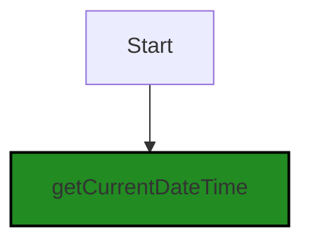
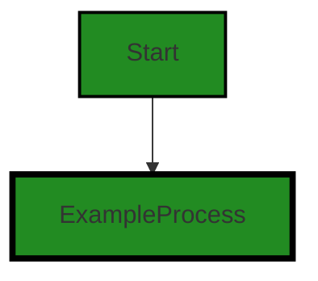
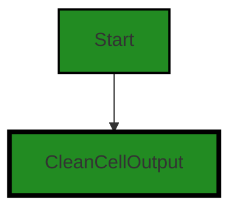

# Polyverse Boost-generated Source Analysis Details

## Source: ./src/extension/extensionUtilities.ts
Date Generated: Saturday, September 9, 2023 at 6:50:56 AM PDT


---

### Boost Architectural Quick Summary Security Report

Last Updated: Saturday, September 9, 2023 at 6:49:14 AM PDT


Executive Report:

1. **Architectural Impact**: The analysis of this file has not revealed any severe issues.
2. **Risk Analysis**: The analysis of this file has not revealed any severe issues.
3. **Potential Customer Impact**: Based on the analysis, there are no severe issues that could potentially impact customers.
4. **Performance Issues**: Our analysis did not identify any explicit performance issues in the file.
5. **Risk Assessment**: Based on the current analysis of this file, no severe issues have been found. However, this doesn't guarantee that the file is risk-free.

Highlights:

- No severe issues were identified in the current analysis of this file.


---

### Boost Architectural Quick Summary Performance Report

Last Updated: Saturday, September 9, 2023 at 6:49:54 AM PDT


Executive Report:

1. **Architectural Impact**: The analysis of this file has not revealed any severe issues.
2. **Risk Analysis**: The analysis of this file has not revealed any severe issues.
3. **Potential Customer Impact**: Based on the analysis, there are no severe issues that could potentially impact customers.
4. **Performance Issues**: Our analysis did not identify any explicit performance issues in the file.
5. **Risk Assessment**: Based on the current analysis of this file, no severe issues have been found. However, this doesn't guarantee that the file is risk-free.

Highlights:

- No severe issues were identified in the current analysis of this file.


---

### Boost Architectural Quick Summary Compliance Report

Last Updated: Saturday, September 9, 2023 at 6:51:00 AM PDT


Executive Report:

1. **Architectural Impact**: The analysis of this file has not revealed any severe issues.
2. **Risk Analysis**: The analysis of this file has not revealed any severe issues.
3. **Potential Customer Impact**: Based on the analysis, there are no severe issues that could potentially impact customers.
4. **Performance Issues**: Our analysis did not identify any explicit performance issues in the file.
5. **Risk Assessment**: Based on the current analysis of this file, no severe issues have been found. However, this doesn't guarantee that the file is risk-free.

Highlights:

- No severe issues were identified in the current analysis of this file.

---
## Detailed Analysis:

### Cell 0:
## Original Code:

### Programming Language: typescript
### ./src/extension/extensionUtilities.ts 

```typescript

import { getCurrentDateTime } from "../utilities/datetime";

```
## Boost Analysis:


---

### Boost Code Explanation

Last Updated: Saturday, September 9, 2023 at 6:46:36 AM PDT

The line of code you've provided is a single import statement in JavaScript, specifically in a format known as ES6 (ECMAScript 6) module syntax. There's not much to analyze architecturally or algorithmically from this single line, but I'll explain what it does and its role in a larger system.

```import { getCurrentDateTime } from "../utilities/datetime";```

This line of code is importing a specific function, `getCurrentDateTime`, from a module located at `../utilities/datetime`. The `..` in the path indicates that the module is located in a directory one level up from the current file's directory. 

The `getCurrentDateTime` function is presumably a utility function that, when called, returns the current date and time. This function could be used throughout the rest of the codebase wherever the current date and time is needed.

As for architectural guidelines, this line of code demonstrates good encapsulation and modularity practices. By keeping the `getCurrentDateTime` function in a separate module and importing it where needed, the code remains DRY (Don't Repeat Yourself), easier to maintain, and more readable. 

For more information on ES6 Modules, you can refer to this link: [ES6 Modules](https://developer.mozilla.org/en-US/docs/Web/JavaScript/Guide/Modules)

As for algorithms, this line of code doesn't really involve any. It's merely importing a function for use. The algorithm, if any, would be contained within the `getCurrentDateTime` function itself, which is not shown here.


---

### Boost Flow Diagram

Last Updated: Saturday, September 9, 2023 at 6:48:28 AM PDT




---

### Boost Source-Level Security Analysis

Last Updated: Saturday, September 9, 2023 at 6:48:59 AM PDT

**No bugs found**


---

### Boost Source-Level Performance Analysis

Last Updated: Saturday, September 9, 2023 at 6:49:23 AM PDT

**No bugs found**


---

### Boost Source-Level Data and Privacy Compliance Analysis

Last Updated: Saturday, September 9, 2023 at 6:50:13 AM PDT

1. **Severity**: 1/10

   **Line Number**: 1

   **Bug Type**: GDPR

   **Description**: The code imports a function that gets the current date and time. This in itself does not violate any data compliance regulations. However, if this function is used to collect timestamps associated with user activities without their consent, it could potentially violate GDPR.

   **Solution**: Ensure that any data collected with this function is done with user consent and is necessary for the operation of the software. Also, ensure that this data is properly protected and not shared without user consent.


### Cell 1:
## Original Code:

### Programming Language: typescript
### ./src/extension/extensionUtilities.ts line 3

```typescript

export function getKernelName(kernelName: string): string {
    return "polyverse-boost-" + kernelName + "-kernel";
}

```
## Boost Analysis:


---

### Boost Code Explanation

Last Updated: Saturday, September 9, 2023 at 6:46:58 AM PDT

This is a simple JavaScript function named `getKernelName` that is part of an ES6 module, as indicated by the `export` keyword. The function takes one argument, `kernelName`, which is expected to be a string.

The function's purpose is to take the input `kernelName` and prepend it with the string `"polyverse-boost-"` and append it with the string `"-kernel"`. This is done using the `+` operator, which concatenates strings in JavaScript.

There's no complex algorithm used here; it's a straightforward string concatenation operation.

In terms of architectural analysis, this function is quite simple and would likely not have a significant impact on the overall architecture of the software project. It's a utility function that generates a specific format of a kernel name.

The function follows general good coding practices: it is clearly named, takes an input, performs a specific task, and returns an output. It's a pure function, meaning it doesn't have any side effects or depend on any external state; the output is solely determined by the input.

For more information about JavaScript functions, you can visit this link: [JavaScript Functions](https://developer.mozilla.org/en-US/docs/Web/JavaScript/Guide/Functions)

For more information about ES6 modules and export statement, you can visit this link: [ES6 Modules](https://developer.mozilla.org/en-US/docs/Web/JavaScript/Guide/Modules)


---

### Boost Flow Diagram

Last Updated: Saturday, September 9, 2023 at 6:48:33 AM PDT




---

### Boost Source-Level Security Analysis

Last Updated: Saturday, September 9, 2023 at 6:49:02 AM PDT

**No bugs found**


---

### Boost Source-Level Performance Analysis

Last Updated: Saturday, September 9, 2023 at 6:49:27 AM PDT

**No bugs found**


---

### Boost Source-Level Data and Privacy Compliance Analysis

Last Updated: Saturday, September 9, 2023 at 6:50:17 AM PDT

**No bugs found**


### Cell 2:
## Original Code:

### Programming Language: typescript
### ./src/extension/extensionUtilities.ts line 7

```typescript

export function cleanCellOutput(input: string): string {
    // strip out timestamps from the input
    // ### Boost Code Compliance Check Summary
    // Last Updated: Friday, June 16, 2023 at 8:24:17 PM PDT

    // use regex to remove the above info
    var pattern = /\n\n---\n\n### Boost [^\n]*\n\nLast Updated: [^\n]*\n\n/g;
    const cleanedInput = input.replace(pattern, "");
    return cleanedInput;
}

```
## Boost Analysis:


---

### Boost Code Explanation

Last Updated: Saturday, September 9, 2023 at 6:47:37 AM PDT

The function `cleanCellOutput(input: string): string` is a TypeScript function that takes in a string as an input and returns a string. The purpose of this function is to clean up the cell output by removing certain parts of the string that match a specific pattern.

The specific pattern it's looking for is a string that starts with two newline characters, followed by three hyphens, two more newline characters, the string "### Boost", any characters that are not a newline, two newline characters, the string "Last Updated:", any characters that are not a newline, and two more newline characters. This pattern is represented by the regular expression (`regex`) in the variable `pattern`.

Here's how the pattern works:

- `\n\n---\n\n### Boost`: Matches this exact string.
- `[^\n]*`: Matches any number of characters that are not a newline. The `*` means "zero or more of the preceding element".
- `\n\nLast Updated:`: Matches this exact string.
- `[^\n]*`: Matches any number of characters that are not a newline.
- `\n\n`: Matches two newline characters.

The `g` at the end of the regular expression means that this pattern should be matched globally in the input string, i.e., it should find all matches rather than stopping after the first match.

The function then uses the `replace` method of the string to replace all occurrences of the pattern in the input with an empty string, effectively removing them. This cleaned up string is then returned by the function.

In terms of algorithms, this function uses a basic string manipulation algorithm. It scans the input string from start to end, looking for matches to the pattern. When it finds a match, it removes it from the string. The time complexity of this algorithm is O(n), where n is the length of the input string, as it needs to scan the entire string.

Here are some online resources for further learning:

- [Regular Expressions (MDN)](https://developer.mozilla.org/en-US/docs/Web/JavaScript/Guide/Regular_Expressions)
- [String.prototype.replace() (MDN)](https://developer.mozilla.org/en-US/docs/Web/JavaScript/Reference/Global_Objects/String/replace)
- [TypeScript Functions](https://www.typescriptlang.org/docs/handbook/functions.html)


---

### Boost Flow Diagram

Last Updated: Saturday, September 9, 2023 at 6:48:39 AM PDT




---

### Boost Source-Level Security Analysis

Last Updated: Saturday, September 9, 2023 at 6:49:06 AM PDT

**No bugs found**


---

### Boost Source-Level Performance Analysis

Last Updated: Saturday, September 9, 2023 at 6:49:46 AM PDT

1. **Severity**: 3/10

   **Line Number**: 14

   **Bug Type**: CPU

   **Description**: The use of regular expressions can be CPU-intensive, especially for large input strings.

   **Solution**: Consider using a more efficient string processing method or optimizing the regular expression. If the pattern is static, precompile the regular expression outside the function scope for better efficiency. For more information, refer to this resource: https://developer.mozilla.org/en-US/docs/Web/JavaScript/Guide/Regular_Expressions


2. **Severity**: 2/10

   **Line Number**: 14

   **Bug Type**: Memory

   **Description**: The replace method creates a new string, which could lead to increased memory usage for large input strings.

   **Solution**: If memory usage is a concern, consider using a streaming or chunked processing approach. This can be more complex but can significantly reduce memory usage for large inputs. More information on this approach can be found here: https://nodejs.org/api/stream.html


---

### Boost Source-Level Data and Privacy Compliance Analysis

Last Updated: Saturday, September 9, 2023 at 6:50:28 AM PDT

1. **Severity**: 5/10

   **Line Number**: 12

   **Bug Type**: Data Privacy

   **Description**: The function 'cleanCellOutput' does not have any explicit data validation or sanitization. This could potentially lead to data privacy issues as it may process sensitive and/or personally identifiable information (PII).

   **Solution**: Implement explicit data validation and sanitization mechanisms to ensure that the data being processed is safe and does not contain any sensitive or PII data. You may use libraries like 'validator.js' for input validation and 'DOMPurify' for sanitization.


### Cell 3:
## Original Code:

### Programming Language: typescript
### ./src/extension/extensionUtilities.ts line 18

```typescript

export function generateCellOutputWithHeader(
    analysisType: string,
    analysisResults: string
): string {
    return `\n\n---\n\n### Boost ${analysisType}\n\nLast Updated: ${getCurrentDateTime()}\n\n${analysisResults}`;
}

```
## Boost Analysis:


---

### Boost Code Explanation

Last Updated: Saturday, September 9, 2023 at 6:48:13 AM PDT

The provided code is a function written in TypeScript, which is a statically typed superset of JavaScript. The function is named `generateCellOutputWithHeader` and it's exported, meaning it can be used in other modules in the application.

The function takes two parameters:
1. `analysisType`: a string that represents the type of analysis being performed.
2. `analysisResults`: a string that contains the results of the analysis.

The function generates and returns a string that combines these parameters with some additional text to create a formatted output.

Here is a detailed breakdown of what the function does:

1. It begins with two newline characters (`\n\n`), which creates an empty line for formatting purposes.

2. It then adds a line of three hyphens (`---`), which in Markdown syntax (commonly used in documentation and text formatting in software projects) creates a horizontal line.

3. It adds another two newline characters for formatting.

4. It then includes a heading, starting with "### Boost", which in Markdown syntax creates a level 3 heading. This heading is followed by the `analysisType` parameter value. 

5. It adds another two newline characters for formatting.

6. It adds the text "Last Updated: ", followed by the return value of the `getCurrentDateTime()` function. This function is not defined in the provided code, but it presumably returns the current date and time as a string.

7. It adds another two newline characters for formatting.

8. Finally, it adds the `analysisResults` parameter value, which is the results of the analysis.

The function uses string interpolation to combine these elements into a single string. String interpolation is a feature of modern JavaScript (and thus TypeScript) that allows for easier concatenation of strings and variables.

The function does not appear to use any complex algorithms. Its purpose is to format and present the results of some analysis in a readable way.

Here are some resources for further learning:

- [TypeScript Documentation](https://www.typescriptlang.org/docs/)
- [JavaScript String Interpolation](https://developer.mozilla.org/en-US/docs/Web/JavaScript/Reference/Template_literals)
- [Markdown Syntax](https://daringfireball.net/projects/markdown/syntax)

Regarding the architectural guidelines, this function does not appear to conflict with any guidelines. It's a simple utility function for formatting output, and such functions are common in many software projects. However, without more context, it's hard to say how this function fits into the overall architecture of the project.


---

### Boost Flow Diagram

Last Updated: Saturday, September 9, 2023 at 6:48:44 AM PDT


---

### Boost Source-Level Security Analysis

Last Updated: Saturday, September 9, 2023 at 6:49:10 AM PDT

**No bugs found**


---

### Boost Source-Level Performance Analysis

Last Updated: Saturday, September 9, 2023 at 6:49:50 AM PDT

**No bugs found**


---

### Boost Source-Level Data and Privacy Compliance Analysis

Last Updated: Saturday, September 9, 2023 at 6:50:56 AM PDT

1. **Severity**: 4/10

   **Line Number**: 37

   **Bug Type**: GDPR

   **Description**: The function generateCellOutputWithHeader may potentially include personal data in the 'analysisResults' parameter, which could be a violation of GDPR if the data is not properly anonymized or if user consent has not been obtained.

   **Solution**: Ensure that any personal data included in 'analysisResults' is properly anonymized or that user consent has been obtained before processing the data. Implement data minimization principles.


2. **Severity**: 4/10

   **Line Number**: 37

   **Bug Type**: PCI DSS

   **Description**: If 'analysisResults' contains cardholder data, it could lead to non-compliance with PCI DSS. PCI DSS requires that cardholder data be stored and transmitted securely.

   **Solution**: Ensure that 'analysisResults' does not contain cardholder data. If it does, make sure it is encrypted and stored securely according to PCI DSS guidelines.


3. **Severity**: 4/10

   **Line Number**: 37

   **Bug Type**: HIPAA

   **Description**: If 'analysisResults' contains protected health information (PHI), it could lead to non-compliance with HIPAA. HIPAA requires that PHI be stored and transmitted securely.

   **Solution**: Ensure that 'analysisResults' does not contain PHI. If it does, make sure it is encrypted and stored securely according to HIPAA guidelines.


