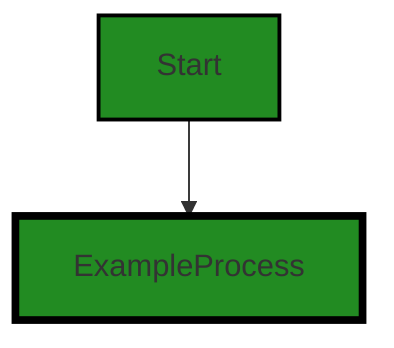
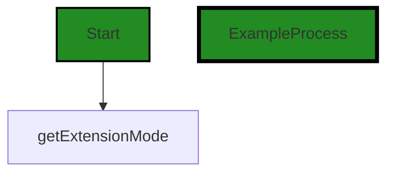

# Polyverse Boost-generated Source Analysis Details

## Source: ./src/extension/extension_state.ts
Date Generated: Saturday, September 9, 2023 at 8:17:28 AM PDT


---

### Boost Architectural Quick Summary Security Report

Last Updated: Saturday, September 9, 2023 at 8:16:53 AM PDT


Executive Report:

1. **Architectural Impact**: The analysis of this file has not revealed any severe issues.
2. **Risk Analysis**: The analysis of this file has not revealed any severe issues.
3. **Potential Customer Impact**: Based on the analysis, there are no severe issues that could potentially impact customers.
4. **Performance Issues**: Our analysis did not identify any explicit performance issues in the file.
5. **Risk Assessment**: Based on the current analysis of this file, no severe issues have been found. However, this doesn't guarantee that the file is risk-free.

Highlights:

- No severe issues were identified in the current analysis of this file.


---

### Boost Architectural Quick Summary Performance Report

Last Updated: Saturday, September 9, 2023 at 8:17:16 AM PDT


Executive Report:

1. **Architectural Impact**: The analysis of this file has not revealed any severe issues.
2. **Risk Analysis**: The analysis of this file has not revealed any severe issues.
3. **Potential Customer Impact**: Based on the analysis, there are no severe issues that could potentially impact customers.
4. **Performance Issues**: Our analysis did not identify any explicit performance issues in the file.
5. **Risk Assessment**: Based on the current analysis of this file, no severe issues have been found. However, this doesn't guarantee that the file is risk-free.

Highlights:

- No severe issues were identified in the current analysis of this file.


---

### Boost Architectural Quick Summary Compliance Report

Last Updated: Saturday, September 9, 2023 at 8:17:32 AM PDT


Executive Report:

1. **Architectural Impact**: The analysis of this file has not revealed any severe issues.
2. **Risk Analysis**: The analysis of this file has not revealed any severe issues.
3. **Potential Customer Impact**: Based on the analysis, there are no severe issues that could potentially impact customers.
4. **Performance Issues**: Our analysis did not identify any explicit performance issues in the file.
5. **Risk Assessment**: Based on the current analysis of this file, no severe issues have been found. However, this doesn't guarantee that the file is risk-free.

Highlights:

- No severe issues were identified in the current analysis of this file.

---
## Detailed Analysis:

### Cell 0:
## Original Code:

### Programming Language: typescript
### ./src/extension/extension_state.ts 

```typescript
import * as vscode from 'vscode';

let extensionMode: vscode.ExtensionMode | undefined = undefined;

export function setExtensionMode(mode: vscode.ExtensionMode) {
    extensionMode = mode;
}

```
## Boost Analysis:


---

### Boost Code Explanation

Last Updated: Saturday, September 9, 2023 at 8:15:42 AM PDT

This is a simple piece of TypeScript code that is likely part of a larger Visual Studio Code extension. Here's a detailed breakdown:

1. `import * as vscode from 'vscode';`: This line is importing the entire `vscode` module. The `vscode` module provides the APIs that are available for interacting with Visual Studio Code in extensions.

2. `let extensionMode: vscode.ExtensionMode | undefined = undefined;`: Here, a variable `extensionMode` is declared. This variable can either be of type `vscode.ExtensionMode` or `undefined`. Initially, it is set to `undefined`. The `vscode.ExtensionMode` is an enumeration that indicates the mode in which the extension is running. It can have one of three values: `Production`, `Development`, or `Test`.

3. The `setExtensionMode` function is an exported function, meaning it can be imported and used in other modules. It takes one parameter `mode` of type `vscode.ExtensionMode` and assigns it to the `extensionMode` variable.

This code doesn't use any specific algorithms; it's a simple piece of state management within a module. The `setExtensionMode` function allows other parts of the extension to change the `extensionMode` state.

Here are some relevant links for further reading:

- [VS Code API](https://code.visualstudio.com/api/references/vscode-api)
- [VS Code Extension Documentation](https://code.visualstudio.com/api)
- [TypeScript Documentation](https://www.typescriptlang.org/docs/)

Regarding the architectural guidelines, this code seems to be in line with general good practices. It is simple, clear, and leverages TypeScript's static typing for better code safety and clarity. However, without the context of the larger project, it's hard to say whether it aligns with the project's specific architectural guidelines.


---

### Boost Flow Diagram

Last Updated: Saturday, September 9, 2023 at 8:16:26 AM PDT




---

### Boost Source-Level Security Analysis

Last Updated: Saturday, September 9, 2023 at 8:16:46 AM PDT

**No bugs found**


---

### Boost Source-Level Performance Analysis

Last Updated: Saturday, September 9, 2023 at 8:17:08 AM PDT

**No bugs found**


---

### Boost Source-Level Data and Privacy Compliance Analysis

Last Updated: Saturday, September 9, 2023 at 8:17:24 AM PDT

**No bugs found**


### Cell 1:
## Original Code:

### Programming Language: typescript
### ./src/extension/extension_state.ts line 8

```typescript

export function getExtensionMode(): vscode.ExtensionMode | undefined {
    return extensionMode;
}

```
## Boost Analysis:


---

### Boost Code Explanation

Last Updated: Saturday, September 9, 2023 at 8:16:10 AM PDT

The provided code snippet is a simple function written in TypeScript, which is used in the context of a Visual Studio Code (VS Code) extension. The function is named `getExtensionMode` and it does not take any parameters. The function returns a value of type `vscode.ExtensionMode` or `undefined`.

The `vscode.ExtensionMode` is an enumeration defined in the VS Code API. It describes the mode in which the extension is running. The possible values are:

- `vscode.ExtensionMode.Development`: The extension is running from the command line in the --extensionDevelopmentPath mode. This mode is typically used during extension development.
- `vscode.ExtensionMode.Test`: The extension is running as part of an extension test.
- `vscode.ExtensionMode.Production`: The extension is running normally.

The `getExtensionMode` function is simply returning the current value of the `extensionMode` variable, which is not shown in the provided code snippet. This variable presumably holds the current mode of the extension.

This function does not appear to use any complex algorithms. It is a simple getter function, a common pattern in object-oriented programming. Getter functions are used to control access to an object's properties.

This function aligns with the architectural blueprint provided earlier. It is part of a VS Code extension and is written in TypeScript. It uses the VS Code API and follows object-oriented design principles.

For more information on VS Code extensions and the VS Code API, you can refer to the following resources:

- [VS Code Extension API](https://code.visualstudio.com/api/references/vscode-api)
- [Creating a VS Code Extension](https://code.visualstudio.com/api/get-started/your-first-extension)


---

### Boost Flow Diagram

Last Updated: Saturday, September 9, 2023 at 8:16:31 AM PDT




---

### Boost Source-Level Security Analysis

Last Updated: Saturday, September 9, 2023 at 8:16:50 AM PDT

**No bugs found**


---

### Boost Source-Level Performance Analysis

Last Updated: Saturday, September 9, 2023 at 8:17:12 AM PDT

**No bugs found**


---

### Boost Source-Level Data and Privacy Compliance Analysis

Last Updated: Saturday, September 9, 2023 at 8:17:28 AM PDT

**No bugs found**

