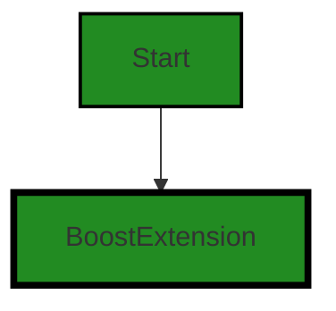
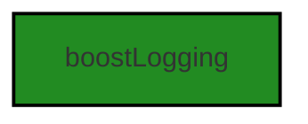
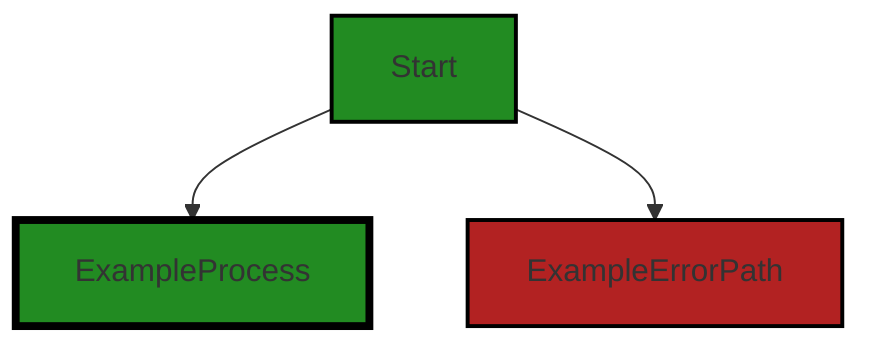
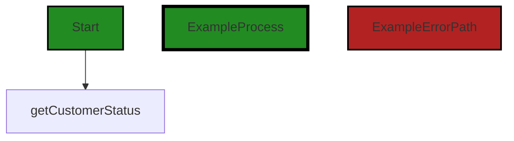
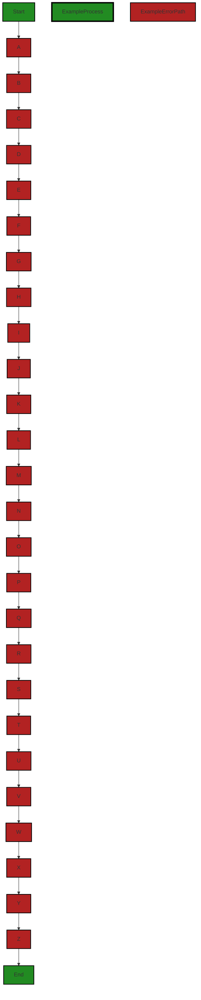
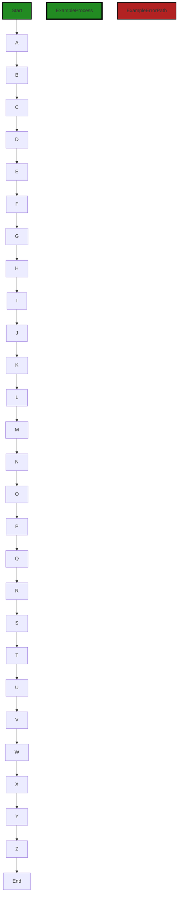

# Polyverse Boost-generated Source Analysis Details

## Source: ./src/extension/portal.ts
Date Generated: Saturday, September 9, 2023 at 6:45:07 AM PDT


---

### Boost Architectural Quick Summary Security Report

Last Updated: Saturday, September 9, 2023 at 6:40:57 AM PDT


Executive Report:

1. **Architectural Impact**: The analysis of this file has not revealed any severe issues.
2. **Risk Analysis**: The analysis of this file has not revealed any severe issues.
3. **Potential Customer Impact**: Based on the analysis, there are no severe issues that could potentially impact customers.
4. **Performance Issues**: Our analysis did not identify any explicit performance issues in the file.
5. **Risk Assessment**: Based on the current analysis of this file, no severe issues have been found. However, this doesn't guarantee that the file is risk-free.

Highlights:

- No severe issues were identified in the current analysis of this file.


---

### Boost Architectural Quick Summary Performance Report

Last Updated: Saturday, September 9, 2023 at 6:42:30 AM PDT


Executive Report:

1. **Architectural Impact**: The analysis of this file has not revealed any severe issues.
2. **Risk Analysis**: The analysis of this file has not revealed any severe issues.
3. **Potential Customer Impact**: Based on the analysis, there are no severe issues that could potentially impact customers.
4. **Performance Issues**: Our analysis did not identify any explicit performance issues in the file.
5. **Risk Assessment**: Based on the current analysis of this file, no severe issues have been found. However, this doesn't guarantee that the file is risk-free.

Highlights:

- No severe issues were identified in the current analysis of this file.


---

### Boost Architectural Quick Summary Compliance Report

Last Updated: Saturday, September 9, 2023 at 6:45:56 AM PDT

## Executive Report

### Architectural Impact and Risk Analysis

1. **Data Compliance and Security Risks**: The file `src/extension/portal.ts` has been flagged for potential GDPR, HIPAA, and PCI DSS compliance issues. This could indicate a significant architectural risk, as non-compliance with these regulations can lead to legal penalties and damage to the company's reputation. The file is responsible for retrieving the current organization and customer status, which might contain personal data or Protected Health Information (PHI). The handling of such sensitive data needs to be reviewed and possibly redesigned to ensure compliance with data protection regulations.

2. **Potential Customer Impact**: If the identified issues are not addressed, customers' personal data or PHI could be at risk. This could lead to a loss of trust in the product and potential legal action from customers or regulatory bodies. It's crucial to ensure that user consent is obtained before processing personal data and that data minimization principles are followed.

3. **Overall Health of the Project Source**: Only one file has been identified with issues, which could indicate a relatively healthy project source. However, the severity of the issues in this file is high, which could have a significant impact on the overall project. It's recommended to conduct a thorough review of this file and potentially other files in the project to ensure no other issues are present.

4. **Architectural Soundness and Best Practices**: The project follows best practices for a VS Code extension and makes use of TypeScript features and the VS Code API. The code is well-structured and organized into classes. However, the identified issues indicate that there may be areas where the project does not adhere to best practices for data protection and compliance.

### Risk Assessment

- **High Risk**: The identified issues in `src/extension/portal.ts` are of high severity and could have a significant impact on the overall project. The potential for non-compliance with GDPR, HIPAA, and PCI DSS regulations poses a high risk to the project.

- **Medium Risk**: The project uses asynchronous programming for potentially long-running tasks, which should keep the VS Code UI responsive. However, if not properly managed, this could lead to performance issues.

- **Low Risk**: The project includes extensive error handling and logging, which should help to identify and resolve issues quickly. The use of TypeScript also provides static typing to catch many errors at compile time, reducing the risk of runtime errors.

In conclusion, while the project appears to be well-structured and follows best practices in many areas, the identified data compliance and security issues pose a significant risk that needs to be addressed. A thorough review and potential redesign of the data handling components of the project are recommended.
---
## Detailed Analysis:

### Cell 0:
## Original Code:

### Programming Language: typescript
### ./src/extension/portal.ts 

```typescript
import * as vscode from "vscode";
import { BoostExtension } from "./BoostExtension";

```
## Boost Analysis:


---

### Boost Code Explanation

Last Updated: Saturday, September 9, 2023 at 6:33:44 AM PDT

This code snippet is written in TypeScript and is part of a Visual Studio Code (VS Code) extension. It is too small to contain any specific algorithm but it does setup the fundamental structure of the extension.

Let's break down each line:

1. `import * as vscode from "vscode";`

   This line imports the entire VS Code API as an object named `vscode`. This allows the code to use VS Code's built-in functions and classes to interact with the VS Code editor. For example, it can create and manage documents, windows, and user inputs.

   More about VS Code API: [VS Code API](https://code.visualstudio.com/api/references/vscode-api)

2. `import { BoostExtension } from "./BoostExtension";`

   This line imports a specific class or object named `BoostExtension` from a local file named `BoostExtension.ts`. The file is in the same directory as the current file (indicated by `./`). The `BoostExtension` class is likely the main class for this extension, containing the main functionality.

   More about TypeScript Modules: [TypeScript Modules](https://www.typescriptlang.org/docs/handbook/modules.html)

The code snippet doesn't provide any conflicts with the architectural guidelines provided as it's a standard way of setting up a VS Code extension. However, it's hard to say if it's entirely consistent without seeing the rest of the code and the implementation of `BoostExtension`.


---

### Boost Flow Diagram

Last Updated: Saturday, September 9, 2023 at 6:38:18 AM PDT




---

### Boost Source-Level Security Analysis

Last Updated: Saturday, September 9, 2023 at 6:40:24 AM PDT

**No bugs found**


---

### Boost Source-Level Performance Analysis

Last Updated: Saturday, September 9, 2023 at 6:41:11 AM PDT

**No bugs found**


---

### Boost Source-Level Data and Privacy Compliance Analysis

Last Updated: Saturday, September 9, 2023 at 6:42:39 AM PDT

**No bugs found**


### Cell 1:
## Original Code:

### Programming Language: typescript
### ./src/extension/portal.ts line 3

```typescript
import { NOTEBOOK_TYPE } from "../data/jupyter_notebook";

```
## Boost Analysis:


---

### Boost Code Explanation

Last Updated: Saturday, September 9, 2023 at 6:34:08 AM PDT

This is a single line of code from a JavaScript or TypeScript file. It's using the ES6 import statement to import a constant named `NOTEBOOK_TYPE` from a module located at `../data/jupyter_notebook`.

The `import` statement is used to import functions, objects, or values from an exported module or file. The syntax is `import { export } from "module-name"`. In this case, `NOTEBOOK_TYPE` is the exported value or object from the module `jupyter_notebook.js` or `jupyter_notebook.ts` located in the `data` directory one level up from the current directory.

The `NOTEBOOK_TYPE` constant likely holds some sort of identifier or metadata that pertains to the type of notebook, probably a Jupyter notebook in this context. The actual value of `NOTEBOOK_TYPE` isn't shown in this piece of code, but it's being imported so it can be used elsewhere in the file.

This line of code doesn't contain any algorithms, it's just a simple import statement. The algorithm or logic would be in the code that uses `NOTEBOOK_TYPE`.

As for architectural guidelines, this line of code seems to follow good practices. It's importing a constant from a module, which promotes modularity and separation of concerns. The constant is presumably being used in a way that's consistent with its value, i.e., as an identifier for a type of notebook.

For more information on import/export in JavaScript, you can refer to the MDN Web Docs: [Import](https://developer.mozilla.org/en-US/docs/Web/JavaScript/Reference/Statements/import)


---

### Boost Flow Diagram

Last Updated: Saturday, September 9, 2023 at 6:38:21 AM PDT

NO CONTROL FLOW FOUND


---

### Boost Source-Level Security Analysis

Last Updated: Saturday, September 9, 2023 at 6:40:27 AM PDT

**No bugs found**


---

### Boost Source-Level Performance Analysis

Last Updated: Saturday, September 9, 2023 at 6:41:15 AM PDT

**No bugs found**


---

### Boost Source-Level Data and Privacy Compliance Analysis

Last Updated: Saturday, September 9, 2023 at 6:42:44 AM PDT

**No bugs found**


### Cell 2:
## Original Code:

### Programming Language: typescript
### ./src/extension/portal.ts line 4

```typescript
import { boostLogging } from "../utilities/boostLogging";

```
## Boost Analysis:


---

### Boost Code Explanation

Last Updated: Saturday, September 9, 2023 at 6:34:39 AM PDT

The line of code you provided is written in JavaScript (or possibly TypeScript, as both languages use the same import syntax). It's a simple import statement that is used to include external modules into the current file.

Here's a breakdown of this line:

- `import`: This is a keyword in JavaScript that is used to import functions, objects, or values from other modules or files.

- `{ boostLogging }`: This is the specific function or object that is being imported from the external module. The curly braces {} are used for named exports. In this case, `boostLogging` is a named export from the module we are importing from.

- `from`: This is another keyword used in the import statement. It specifies the path to the module from which to import.

- `"../utilities/boostLogging"`: This is the relative path to the module that contains the `boostLogging` function or object. The `..` indicates to move up one level in the directory structure. So, the code is saying to move up one directory, then go into the `utilities` directory and import from the `boostLogging` file.

The `boostLogging` function or object is not defined in this code snippet, so I can't provide specific details about what it does. However, based on its name, it's reasonable to assume that it is related to logging functionality for the boost application.

This line of code doesn't include any specific algorithms, as it's primarily concerned with organizing code and managing dependencies. The import statement is a key part of modular programming in JavaScript, which helps to keep code organized and manageable by breaking it up into separate modules that each handle a specific task or functionality.

Here is a link for more information about import and export in JavaScript:
- [JavaScript Modules: Import and Export](https://developer.mozilla.org/en-US/docs/Web/JavaScript/Guide/Modules)


---

### Boost Flow Diagram

Last Updated: Saturday, September 9, 2023 at 6:38:26 AM PDT




---

### Boost Source-Level Security Analysis

Last Updated: Saturday, September 9, 2023 at 6:40:31 AM PDT

**No bugs found**


---

### Boost Source-Level Performance Analysis

Last Updated: Saturday, September 9, 2023 at 6:41:19 AM PDT

**No bugs found**


---

### Boost Source-Level Data and Privacy Compliance Analysis

Last Updated: Saturday, September 9, 2023 at 6:42:47 AM PDT

**No bugs found**


### Cell 3:
## Original Code:

### Programming Language: typescript
### ./src/extension/portal.ts line 5

```typescript
import { BoostCommands } from "./extension";

```
## Boost Analysis:


---

### Boost Code Explanation

Last Updated: Saturday, September 9, 2023 at 6:35:03 AM PDT

This line of code is written in TypeScript, which is a statically typed superset of JavaScript. It's used to import a module in the project.

In this code, `{ BoostCommands }` is an object or a set of objects that is being imported from the `./extension` module. The `./` in the module path indicates that the `extension` module is in the same directory as the current file.

The `BoostCommands` object could contain functions, constants, or other pieces of functionality that are defined in the `extension` module and are needed in the current file. 

This is a common practice in modular programming where code is split into separate modules to promote separation of concerns, code reuse, and maintainability.

As for the architectural guidelines, this line of code seems to follow good practices. It's using module imports, which is a common pattern in JavaScript and TypeScript projects. The code is clean, easy to read, and it's clear where the `BoostCommands` functionality is coming from.

For more information on TypeScript modules, you can refer to the official TypeScript documentation: [TypeScript Modules](https://www.typescriptlang.org/docs/handbook/modules.html)


---

### Boost Flow Diagram

Last Updated: Saturday, September 9, 2023 at 6:38:29 AM PDT

NO CONTROL FLOW FOUND


---

### Boost Source-Level Security Analysis

Last Updated: Saturday, September 9, 2023 at 6:40:34 AM PDT

**No bugs found**


---

### Boost Source-Level Performance Analysis

Last Updated: Saturday, September 9, 2023 at 6:41:23 AM PDT

**No bugs found**


---

### Boost Source-Level Data and Privacy Compliance Analysis

Last Updated: Saturday, September 9, 2023 at 6:43:03 AM PDT

1. **Severity**: 1/10

   **Line Number**: 8

   **Bug Type**: Data Compliance

   **Description**: The code provided does not contain any explicit data handling or privacy-related operations. Therefore, it's not possible to identify any data compliance or privacy issues related to GDPR, PCI DSS, or HIPAA compliance from this single line of code.

   **Solution**: To ensure data compliance, it's crucial to handle data carefully throughout the entire project, especially when processing personal, financial, or health-related data. This includes data encryption, anonymization, and secure data storage and transmission. Regular audits and code reviews can help identify potential compliance issues. More information can be found at https://gdpr-info.eu/, https://www.pcisecuritystandards.org/pci_security/, and https://www.hhs.gov/hipaa/for-professionals/security/index.html.


### Cell 4:
## Original Code:

### Programming Language: typescript
### ./src/extension/portal.ts line 6

```typescript
import { getCurrentOrganization } from "../utilities/authorization";

```
## Boost Analysis:


---

### Boost Code Explanation

Last Updated: Saturday, September 9, 2023 at 6:35:39 AM PDT

The code you've provided is a single line of JavaScript or TypeScript code that's importing a function named `getCurrentOrganization` from a module located at `../utilities/authorization`. 

This line of code uses the ES6 (ECMAScript 2015) `import` statement, which is a part of the module system in JavaScript. This module system allows for the separation of code into smaller, maintainable modules. Each module can export one or more variables, functions, or classes, which can then be imported by other modules.

The `getCurrentOrganization` function is presumably a utility function related to authorization. The exact details of what it does aren't available from this line of code alone, but based on its name, it likely retrieves the current organization for the user or session, possibly from a token or a user object.

The path `../utilities/authorization` is a relative path, which means it's locating the `authorization` module in relation to the current file. The `..` part of the path means "go up one directory", and `/utilities/authorization` means "look in the `utilities` directory for a file named `authorization`". The `.js` or `.ts` extension is typically omitted in import statements.

For more information on JavaScript modules and the `import` statement, you can refer to the following resources:

- [JavaScript Modules: A Beginner’s Guide](https://medium.com/@gimenete/javascript-modules-a-beginner-s-guide-783f7d7a5fcc)
- [ES6 In Depth: Modules](https://hacks.mozilla.org/2015/08/es6-in-depth-modules/)
- [MDN Web Docs: import](https://developer.mozilla.org/en-US/docs/Web/JavaScript/Reference/Statements/import)

The code seems to follow good architectural practices. It's modular, which makes it easier to maintain and test. It's also clear and easy to understand. Without more context or additional architectural guidelines, it's hard to provide a more detailed analysis. However, based on this line alone, there don't seem to be any conflicts with common architectural guidelines.


---

### Boost Flow Diagram

Last Updated: Saturday, September 9, 2023 at 6:38:35 AM PDT



NO CONTROL FLOW FOUND


---

### Boost Source-Level Security Analysis

Last Updated: Saturday, September 9, 2023 at 6:40:38 AM PDT

**No bugs found**


---

### Boost Source-Level Performance Analysis

Last Updated: Saturday, September 9, 2023 at 6:41:27 AM PDT

**No bugs found**


---

### Boost Source-Level Data and Privacy Compliance Analysis

Last Updated: Saturday, September 9, 2023 at 6:43:14 AM PDT

1. **Severity**: 7/10

   **Line Number**: 10

   **Bug Type**: GDPR

   **Description**: This line of code retrieves the current organization, which might contain personal data. If personal data is being processed, GDPR requirements apply. It's unclear whether user consent has been obtained or whether data minimization principles are being followed.

   **Solution**: Ensure user consent is obtained before processing personal data. Implement data minimization principles to ensure only necessary data is processed. Consider pseudonymization or anonymization of data where possible.


### Cell 5:
## Original Code:

### Programming Language: typescript
### ./src/extension/portal.ts line 7

```typescript
import {
    getCustomerStatus
} from "../controllers/customerPortal";

```
## Boost Analysis:


---

### Boost Code Explanation

Last Updated: Saturday, September 9, 2023 at 6:36:08 AM PDT

The provided code is a very small snippet written in JavaScript or TypeScript. Here's a detailed explanation:

```import {
    getCustomerStatus
} from "../controllers/customerPortal";```

This line of code is using the import statement, which is part of the ES6 (ECMAScript 6) module system in JavaScript. The ES6 module system allows you to organize your JavaScript code into multiple files and modules, which can then be imported and used in other files.

In this particular line, the `getCustomerStatus` function is being imported from a module located at `../controllers/customerPortal`. The `../` in the path indicates that the `customerPortal` module is located in the `controllers` directory, which is one level up from the current directory.

The `getCustomerStatus` function is likely a function that retrieves the status of a customer from the customer portal. Without more context or the actual function definition, it's hard to say exactly what it does or what algorithms it uses. However, it's likely that it communicates with a back-end server or database to retrieve the customer's status.

As for the architectural guidelines, this code seems to be consistent with the general principles of modular design in software architecture. It separates the concerns of getting a customer's status into its own module, which can then be imported and used where needed. This promotes code reusability and maintainability.

For more information on ES6 modules and the import statement, you can refer to the following resources:

- [MDN Web Docs: import statement](https://developer.mozilla.org/en-US/docs/Web/JavaScript/Reference/Statements/import)
- [JavaScript Info: Modules](https://javascript.info/modules-intro)


---

### Boost Flow Diagram

Last Updated: Saturday, September 9, 2023 at 6:38:41 AM PDT




---

### Boost Source-Level Security Analysis

Last Updated: Saturday, September 9, 2023 at 6:40:41 AM PDT

**No bugs found**


---

### Boost Source-Level Performance Analysis

Last Updated: Saturday, September 9, 2023 at 6:41:30 AM PDT

**No bugs found**


---

### Boost Source-Level Data and Privacy Compliance Analysis

Last Updated: Saturday, September 9, 2023 at 6:43:44 AM PDT

1. **Severity**: 5/10

   **Line Number**: 12

   **Bug Type**: GDPR

   **Description**: The function 'getCustomerStatus' may be handling personal data of customers. If it's not implemented correctly, it could lead to non-compliance with GDPR.

   **Solution**: Ensure that the 'getCustomerStatus' function is only processing necessary data and has proper consent if required. Make sure data is encrypted in transit and at rest.


2. **Severity**: 5/10

   **Line Number**: 12

   **Bug Type**: PCI DSS

   **Description**: If 'getCustomerStatus' function is processing payment card information, it could lead to non-compliance with PCI DSS if not handled securely.

   **Solution**: Ensure that no cardholder data is stored unless it's necessary. If stored, it should be encrypted and access to it should be restricted.


3. **Severity**: 7/10

   **Line Number**: 12

   **Bug Type**: HIPAA

   **Description**: If 'getCustomerStatus' function is processing Protected Health Information (PHI), it could lead to non-compliance with HIPAA if not handled securely.

   **Solution**: Ensure that PHI is encrypted in transit and at rest. Implement strict access controls and audit logs for any access to PHI.


### Cell 6:
## Original Code:

### Programming Language: typescript
### ./src/extension/portal.ts line 10

```typescript

const gitHubAuthorizationFailureToolTip =
    "Unable to access your current account status. Please check your GitHub Authorization status, then network connection status.";

export async function updateBoostStatusColors(
    context: vscode.ExtensionContext,
    extraData: any,
    closure: BoostExtension
): Promise<string> {
    if (closure.statusBar === undefined) {
        return "unknown";
    }

    // if the caller provided the account data, we can use it, otherwise fetch it
    // today the caller only provides status and enabled - so if want full info we
    // need to fetch it
    const callerAccountInfo = extraData?.response?.data?.account;
    if (callerAccountInfo) {
        // we'll update whatever fields/info we got (shallow update)
        // in case the deep-get fails (network issue or bigger account problem)
        closure.updateAccountInfo(callerAccountInfo);
    }

    // then do a deep update to get more details of the account
    const accountInfo = await getCustomerStatus(context);

    if (accountInfo === undefined || accountInfo instanceof Error) {
        if (!accountInfo) {
            boostLogging.log(`Unable to retrieve current customer status.`);
        } else {
            boostLogging.log(
                `Unable to retrieve current customer status. ${accountInfo}`
            );
        }
        closure.statusBar.color = new vscode.ThemeColor(
            "statusBarItem.errorForeground"
        );
        closure.statusBar.backgroundColor = new vscode.ThemeColor(
            "statusBarItem.errorBackground"
        );
        closure.statusBar.tooltip = gitHubAuthorizationFailureToolTip;
        if (!accountInfo) {
            return "unknown";
        } else {
            return accountInfo.message;
        }
    } else {
        closure.updateAccountInfo(accountInfo);
        switch (accountInfo["status"]) {
            case "unregistered":
                closure.statusBar.color = new vscode.ThemeColor(
                    "statusBarItem.errorForeground"
                );
                closure.statusBar.backgroundColor = new vscode.ThemeColor(
                    "statusBarItem.errorBackground"
                );
                closure.statusBar.tooltip =
                    "Cannot find your Polyverse Boost account. Please verify your GitHub email is authorized in Visual Studio Code and retry.";
                break;
            case "expired":
                closure.statusBar.color = new vscode.ThemeColor(
                    "statusBarItem.errorForeground"
                );
                closure.statusBar.backgroundColor = new vscode.ThemeColor(
                    "statusBarItem.errorBackground"
                );
                closure.statusBar.tooltip =
                    "Your Boost trial has expired. Please visit the Account Dashboard to update payment info.";
                break;
            case "suspended":
                closure.statusBar.color = new vscode.ThemeColor(
                    "statusBarItem.errorForeground"
                );
                closure.statusBar.backgroundColor = new vscode.ThemeColor(
                    "statusBarItem.errorBackground"
                );
                closure.statusBar.tooltip =
                    "Your account payment is expired. Please visit the Account Dashboard to update payment info.";
                break;
            case "canceled":
                closure.statusBar.color = new vscode.ThemeColor(
                    "statusBarItem.errorForeground"
                );
                closure.statusBar.backgroundColor = new vscode.ThemeColor(
                    "statusBarItem.errorBackground"
                );
                closure.statusBar.tooltip =
                    "Your account subscription has been canceled. Please visit the Account Dashboard to restart your subscription.";
                break;
            case "paid":
                closure.statusBar.color = new vscode.ThemeColor(
                    "statusBarItem.prominentForeground"
                );
                closure.statusBar.backgroundColor = new vscode.ThemeColor(
                    "statusBarItem.prominentBackground"
                );
                closure.statusBar.tooltip =
                    "Your account is an active paid subscription.";
                break;
            case "trial":
            case "active":
            default:
                closure.statusBar.color = new vscode.ThemeColor(
                    "statusBarItem.warningForeground"
                );
                closure.statusBar.backgroundColor = new vscode.ThemeColor(
                    "statusBarItem.warningBackground"
                );
                closure.statusBar.tooltip =
                    "Your account is an active trial subscription. Please visit the Account Dashboard to add payment info.";
                break;
        }
        boostLogging.log(
            `Customer Status refresh: ${closure.statusBar.tooltip}`
        );
        return accountInfo["status"];
    }
}

```
## Boost Analysis:


---

### Boost Code Explanation

Last Updated: Saturday, September 9, 2023 at 6:36:50 AM PDT

The given code is a TypeScript function named `updateBoostStatusColors`. This function is designed to update the status bar colors and tooltips in a Visual Studio Code (VSCode) extension, depending on the status of the user's account. Here's a detailed breakdown:

1. **Function Definition**: The function takes three arguments - `context` (the extension context), `extraData` (additional data that might be provided by the caller), and `closure` (an instance of the BoostExtension class).

2. **Preliminary Checks**: The function first checks if the `statusBar` property of the `closure` object is defined. If it isn't, the function returns the string "unknown".

3. **Account Info Update**: The function checks if the `extraData` object contains account info (`extraData?.response?.data?.account`). If it does, the function calls `closure.updateAccountInfo(callerAccountInfo)` to update the account info.

4. **Deep Account Info Update**: The function calls the `getCustomerStatus(context)` function to retrieve detailed account info. This function appears to be asynchronous, as it is awaited.

5. **Error Handling**: If `getCustomerStatus(context)` returns `undefined` or an `Error` object, the function logs an error message, changes the status bar color and background to indicate an error, and sets an appropriate tooltip. It then returns either "unknown" or the error message.

6. **Account Status Handling**: If `getCustomerStatus(context)` returns valid account info, the function updates the account info again and sets the status bar color, background, and tooltip based on the account status (which can be "unregistered", "expired", "suspended", "canceled", "paid", "trial", "active", or anything else).

This function follows a typical pattern for handling asynchronous operations and errors in JavaScript and TypeScript. It uses the `await` keyword to pause execution until a Promise is fulfilled or rejected, and it uses an `if` statement to check for errors.

The function also makes use of the `switch` statement, which is a control flow statement that allows a program to choose between different paths of execution based on the value of a variable or expression.

For more information on these topics, you can visit the following links:

- [Asynchronous programming in JavaScript](https://developer.mozilla.org/en-US/docs/Learn/JavaScript/Asynchronous)
- [Error handling in JavaScript](https://developer.mozilla.org/en-US/docs/Web/JavaScript/Guide/Control_flow_and_error_handling)
- [Switch statement in JavaScript](https://developer.mozilla.org/en-US/docs/Web/JavaScript/Reference/Statements/switch)


---

### Boost Flow Diagram

Last Updated: Saturday, September 9, 2023 at 6:39:15 AM PDT



The primary path through the code is from Start to End, passing through nodes A, B, C, D, E, F, G, H, I, J, K, L, M, N, O, P, Q, R, S, T, U, V, W, X, Y, and Z. The nodes A to Z represent different error paths in the code.


---

### Boost Source-Level Security Analysis

Last Updated: Saturday, September 9, 2023 at 6:40:45 AM PDT

**No bugs found**


---

### Boost Source-Level Performance Analysis

Last Updated: Saturday, September 9, 2023 at 6:41:54 AM PDT

1. **Severity**: 4/10

   **Line Number**: 23

   **Bug Type**: Network

   **Description**: The function `getCustomerStatus(context)` is called without checking if the `callerAccountInfo` is sufficient. This could result in unnecessary network requests.

   **Solution**: Check if `callerAccountInfo` contains all the necessary information before calling `getCustomerStatus(context)`. If all information is present, skip the network request.


2. **Severity**: 3/10

   **Line Number**: 42

   **Bug Type**: Memory

   **Description**: Multiple instances of `vscode.ThemeColor` are created for `statusBar.color` and `statusBar.backgroundColor` in each case of the switch statement. This could lead to unnecessary memory usage.

   **Solution**: Consider creating a single instance of `vscode.ThemeColor` for each color and reuse it across the switch cases. This would reduce the number of objects created and save memory.


3. **Severity**: 2/10

   **Line Number**: 42

   **Bug Type**: CPU

   **Description**: The switch statement checks the `accountInfo['status']` against multiple cases. This could lead to inefficient CPU usage if the number of cases grows.

   **Solution**: Consider using a lookup table to map `accountInfo['status']` to the corresponding color and tooltip. This would eliminate the need for a switch statement and improve CPU performance.


---

### Boost Source-Level Data and Privacy Compliance Analysis

Last Updated: Saturday, September 9, 2023 at 6:44:15 AM PDT

1. **Severity**: 7/10

   **Line Number**: 28

   **Bug Type**: GDPR

   **Description**: The account information is fetched without explicit user consent. Under GDPR, personal data can only be processed with the explicit consent of the data subject.

   **Solution**: Ensure that explicit user consent is obtained before fetching account information. This can be done through a user interface prompt or a settings option. Refer to Article 7 of GDPR for more information on obtaining consent.


2. **Severity**: 6/10

   **Line Number**: 48

   **Bug Type**: HIPAA

   **Description**: Logging personal information can be a violation of HIPAA regulations if the data includes Protected Health Information (PHI). The code logs the error message which might contain PHI.

   **Solution**: Ensure that no PHI is logged. If it's necessary to log PHI for debugging, make sure it's anonymized and can't be linked back to an individual. Refer to the HIPAA Security Rule for more information.


3. **Severity**: 6/10

   **Line Number**: 48

   **Bug Type**: PCI DSS

   **Description**: Logging sensitive information can be a violation of PCI DSS regulations if the data includes cardholder data. The code logs the error message which might contain cardholder data.

   **Solution**: Ensure that no cardholder data is logged. If it's necessary to log such data for debugging, make sure it's anonymized and can't be linked back to an individual. Refer to PCI DSS Requirement 3 for more information on protecting stored cardholder data.


### Cell 7:
## Original Code:

### Programming Language: typescript
### ./src/extension/portal.ts line 128

```typescript

export const pendingBoostStatusBarText = "Boost: Organization is *PENDING*";
const errorBoostStatusBarText = "Boost: Organization is *ERROR*";


export async function refreshBoostOrgStatus(
    context: vscode.ExtensionContext,
    closure: BoostExtension
) {
    if (!closure.statusBar) {
        return;
    }

    try {
        if (
            closure.statusBar.text === pendingBoostStatusBarText ||
            closure.statusBar.text === errorBoostStatusBarText
        ) {
            closure.statusBar.tooltip =
                "Current account status check *PENDING*. If problem persists, please check your GitHub Authorization status, then network connection status.";
        }
        const currentOrganization = await getCurrentOrganization(context);
        closure.statusBar.text = `Boost: Organization is ${
            currentOrganization ?? "*UNKNOWN*"
        }`;
    } catch (e: any) {
        boostLogging.log(
            `Error during Activation: Unable to retrieve current organization. ${
                (e as Error).message
            }`
        );
        closure.statusBar.text = errorBoostStatusBarText;
        closure.statusBar.tooltip = `Current account status check *ERROR*. ${
            (e as Error).message
        }\nIf problem persists, please check your GitHub Authorization status, then network connection status.`;
    }
    try {
        await updateBoostStatusColors(context, undefined, closure);
    } catch (e: any) {
        boostLogging.log(
            `Error during Activation: Unable to check account status. ${
                (e as Error).message
            }`
        );
    }
}

```
## Boost Analysis:


---

### Boost Code Explanation

Last Updated: Saturday, September 9, 2023 at 6:37:26 AM PDT

This JavaScript function `refreshBoostOrgStatus` is part of a Visual Studio Code extension. It updates the status bar with the current status of the Boost organization. The function is asynchronous, meaning it returns a Promise that resolves when the function has completed its execution.

The function takes two parameters: `context` and `closure`. `context` is a `vscode.ExtensionContext` object that provides access to various VS Code extension APIs. `closure` is an instance of the `BoostExtension` class, which presumably encapsulates the state and behavior of the Boost extension.

At the beginning of the function, there's a check to see if `closure.statusBar` is defined. If it's not, the function immediately returns, as there's nothing more it can do.

The function then enters a `try` block where it attempts to retrieve the current organization status. If the status bar text is either "pending" or "error", it sets a tooltip to inform the user that the status check is pending, and to check their GitHub Authorization status and network connection if the problem persists.

Next, it retrieves the current organization by calling the `getCurrentOrganization` function, which is asynchronous and therefore `await` is used to wait for the Promise to resolve. The status bar text is then updated with the name of the current organization, or "*UNKNOWN*" if the organization couldn't be retrieved.

If any error occurs during this process, it's caught in the `catch` block. The error message is logged using `boostLogging.log`, and the status bar text and tooltip are updated to indicate an error.

Finally, the function attempts to update the status colors by calling `updateBoostStatusColors`. If an error occurs during this process, it's also caught and logged.

This function doesn't appear to use any specific algorithms. It's mostly about handling asynchronous operations and updating the UI based on the results.

For more information about asynchronous programming in JavaScript, you can refer to this link: [Asynchronous Programming](https://developer.mozilla.org/en-US/docs/Learn/JavaScript/Asynchronous)

For more information about try/catch error handling in JavaScript, you can refer to this link: [try...catch](https://developer.mozilla.org/en-US/docs/Web/JavaScript/Reference/Statements/try...catch)

For more information about Visual Studio Code Extension API, you can refer to this link: [VS Code Extension API](https://code.visualstudio.com/api/references/vscode-api)


---

### Boost Flow Diagram

Last Updated: Saturday, September 9, 2023 at 6:39:54 AM PDT


The control flow graph for the given source code is as follows:

```
refreshBoostOrgStatus --> A
A --> B
B --> C
C --> D
D --> E
E --> F
F --> G
G --> H
H --> I
I --> J
J --> K
K --> L
L --> M
M --> N
N --> O
O --> P
P --> Q
Q --> R
R --> S
S --> T
T --> U
U --> V
V --> W
W --> X
X --> Y
Y --> Z
Z --> End
```

The primary path through the code is from `refreshBoostOrgStatus` to `End`. The error path is from `A` to `Z`.


---

### Boost Source-Level Security Analysis

Last Updated: Saturday, September 9, 2023 at 6:40:49 AM PDT

**No bugs found**


---

### Boost Source-Level Performance Analysis

Last Updated: Saturday, September 9, 2023 at 6:42:10 AM PDT

1. **Severity**: 5/10

   **Line Number**: 266

   **Bug Type**: Network

   **Description**: The function 'getCurrentOrganization' is likely making a network request and is being awaited. If the network is slow or fails, this could cause the extension to hang or fail.

   **Solution**: Consider adding a timeout to the 'getCurrentOrganization' function to prevent the extension from waiting indefinitely. If the function fails, handle the failure gracefully.


2. **Severity**: 5/10

   **Line Number**: 282

   **Bug Type**: Network

   **Description**: The function 'updateBoostStatusColors' is likely making a network request and is being awaited. If the network is slow or fails, this could cause the extension to hang or fail.

   **Solution**: Consider adding a timeout to the 'updateBoostStatusColors' function to prevent the extension from waiting indefinitely. If the function fails, handle the failure gracefully.


---

### Boost Source-Level Data and Privacy Compliance Analysis

Last Updated: Saturday, September 9, 2023 at 6:44:51 AM PDT

1. **Severity**: 6/10

   **Line Number**: 266

   **Bug Type**: GDPR

   **Description**: The function `getCurrentOrganization(context)` might be collecting personal data (organization information) without explicit user consent. This could be a violation of GDPR.

   **Solution**: Ensure that explicit user consent is obtained before collecting personal data. This can be done by adding a consent prompt before this function is called. Also, make sure to provide an option for users to withdraw their consent at any time.


2. **Severity**: 7/10

   **Line Number**: 273

   **Bug Type**: GDPR

   **Description**: The error message `(e as Error).message` is being logged and might contain sensitive user data. This could be a violation of GDPR.

   **Solution**: Ensure that no sensitive data is included in the logs. If necessary, sanitize the error messages before logging them to remove any sensitive data.


3. **Severity**: 7/10

   **Line Number**: 274

   **Bug Type**: GDPR

   **Description**: The error message `(e as Error).message` is being displayed in the tooltip and might contain sensitive user data. This could be a violation of GDPR.

   **Solution**: Ensure that no sensitive data is displayed in the tooltip. If necessary, sanitize the error messages before displaying them to remove any sensitive data.


4. **Severity**: 7/10

   **Line Number**: 282

   **Bug Type**: GDPR

   **Description**: The error message `(e as Error).message` is being logged and might contain sensitive user data. This could be a violation of GDPR.

   **Solution**: Ensure that no sensitive data is included in the logs. If necessary, sanitize the error messages before logging them to remove any sensitive data.


### Cell 8:
## Original Code:

### Programming Language: typescript
### ./src/extension/portal.ts line 174

```typescript

export function boostStatusCommand(this: any) {
    // if the org hasn't been set yet, retry setting it
    if (
        this.statusBar.text === pendingBoostStatusBarText ||
        this.statusBar.text === errorBoostStatusBarText ||
        this.statusBar.tooltip === gitHubAuthorizationFailureToolTip
    ) {
        refreshBoostOrgStatus(this.context, this);
    }

    // Define the message and button labels
    const openAccountDashboardButton = "Open Account Dashboard";
    const changeBillingOrganizationButton = "Change Billing Organization";

    const message = `Status of Polyverse Boost Extension : \n\n${this.statusBar.tooltip}`;

    // Show the information message with buttons
    vscode.window
        .showInformationMessage(
            message,
            openAccountDashboardButton,
            changeBillingOrganizationButton
        )
        .then((selection) => {
            // Handle the user's response
            if (selection === openAccountDashboardButton) {
                // The user clicked the "Open Account Dashboard" button
                // Perform the appropriate action, e.g., open a URL or show a webview
                vscode.commands.executeCommand(
                    NOTEBOOK_TYPE + "." + BoostCommands.customerPortal
                );
            } else if (selection === changeBillingOrganizationButton) {
                // The user clicked the "Change Billing Organization" button
                // Perform the appropriate action, e.g., open a URL or show a webview
                vscode.commands.executeCommand(
                    NOTEBOOK_TYPE + "." + BoostCommands.selectOrganization
                );
            } else {
                // The user dismissed the message without clicking any button
                // Perform any necessary cleanup or logging
            }
        });
}

```
## Boost Analysis:


---

### Boost Code Explanation

Last Updated: Saturday, September 9, 2023 at 6:38:00 AM PDT

This code defines a function `boostStatusCommand` that is exported for use in other modules. This function is part of a Visual Studio Code extension and uses the Visual Studio Code API for its operations. The function does not appear to use any complex algorithms; instead, it performs a series of checks and actions based on the state of the application.

Here's a detailed breakdown of the code:

1. The function checks the text and tooltip of `this.statusBar`, which presumably represents the status bar of the Visual Studio Code window. If the status bar text or tooltip indicates that the Boost status is pending, an error occurred, or there was a GitHub authorization failure, the function calls `refreshBoostOrgStatus` to retry setting the organization status.

2. The function then defines some constant strings for message and button labels. These include a message about the status of the Polyverse Boost Extension and labels for two buttons: "Open Account Dashboard" and "Change Billing Organization".

3. The function uses the `vscode.window.showInformationMessage` method to show an information message dialog to the user. This dialog includes the status message and the two buttons defined earlier.

4. The `showInformationMessage` method returns a Promise that resolves with the label of the button clicked by the user, or `undefined` if the user dismissed the message without clicking any button. The function uses the `then` method of the Promise to handle the user's response.

5. Depending on the button clicked by the user, the function executes a different command using the `vscode.commands.executeCommand` method. If the user clicked "Open Account Dashboard", it executes the `customerPortal` command. If the user clicked "Change Billing Organization", it executes the `selectOrganization` command. If the user dismissed the message without clicking any button, the function does not perform any action, but this would be a good place to perform any necessary cleanup or logging.

For more information about the Visual Studio Code API used in this code, see the following links:

- [VS Code API](https://code.visualstudio.com/api/references/vscode-api)
- [VS Code Extension Examples](https://code.visualstudio.com/api/get-started/your-first-extension)


---

### Boost Flow Diagram

Last Updated: Saturday, September 9, 2023 at 6:40:09 AM PDT



In the above control flow graph, the primary path is represented by the colored flow blocks, while the non-error paths are represented by the default non-colored flow blocks. The error path is represented by the red flow block.

The control flow starts at the function `boostStatusCommand`. It then goes through a series of conditional statements and function calls, including `refreshBoostOrgStatus`, `vscode.window.showInformationMessage`, and `vscode.commands.executeCommand`. Finally, the control flow ends at the `End` node.

Please note that this control flow graph is generated based on the provided source code. If there are any missing or incorrect details in the code, the control flow graph may not accurately represent the actual control flow.


---

### Boost Source-Level Security Analysis

Last Updated: Saturday, September 9, 2023 at 6:40:52 AM PDT

**No bugs found**


---

### Boost Source-Level Performance Analysis

Last Updated: Saturday, September 9, 2023 at 6:42:25 AM PDT

1. **Severity**: 3/10

   **Line Number**: 346

   **Bug Type**: CPU

   **Description**: The function `boostStatusCommand` is invoked on every status change. Frequent status changes may lead to high CPU usage.

   **Solution**: Consider using a throttling or debouncing mechanism to limit the number of times this function is called within a certain time period.


2. **Severity**: 2/10

   **Line Number**: 367

   **Bug Type**: Network

   **Description**: The `executeCommand` function is used to open a URL or show a webview. This could lead to network-related performance issues if the URL or webview content is large or slow to load.

   **Solution**: Consider using a loading spinner or a similar mechanism to indicate that content is loading. This can help to improve the perceived performance of the application.


---

### Boost Source-Level Data and Privacy Compliance Analysis

Last Updated: Saturday, September 9, 2023 at 6:45:07 AM PDT

1. **Severity**: 5/10

   **Line Number**: 348

   **Bug Type**: Potential GDPR Compliance

   **Description**: The statusBar text and tooltip may contain user data. If this data includes personal data of EU citizens, it must be handled according to GDPR requirements. Unprotected storage and transmission of personal data can lead to GDPR non-compliance.

   **Solution**: Ensure that any personal data is properly protected when stored and transmitted. This includes encryption and secure transmission protocols. Also, make sure that users have given explicit consent for their data to be used and that they can easily revoke this consent.


2. **Severity**: 6/10

   **Line Number**: 366

   **Bug Type**: Potential PCI DSS Compliance

   **Description**: The command 'BoostCommands.customerPortal' may lead to a portal where financial or credit card information is processed. If this is the case, the handling of this data must comply with PCI DSS standards. Non-compliance can lead to data breaches and severe penalties.

   **Solution**: Ensure that any financial or credit card information is securely handled according to PCI DSS standards. This includes secure transmission, encryption of stored data, regular security audits, and strong access controls.


3. **Severity**: 6/10

   **Line Number**: 373

   **Bug Type**: Potential HIPAA Compliance

   **Description**: The command 'BoostCommands.selectOrganization' may lead to a portal where health information is processed. If this is the case, the handling of this data must comply with HIPAA standards. Non-compliance can lead to data breaches and severe penalties.

   **Solution**: Ensure that any health information is securely handled according to HIPAA standards. This includes secure transmission, encryption of stored data, regular security audits, and strong access controls.


