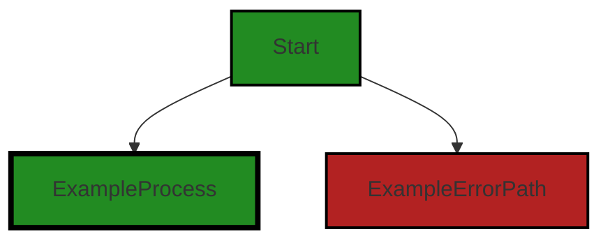
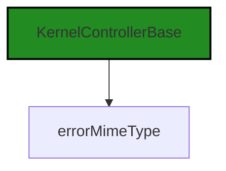
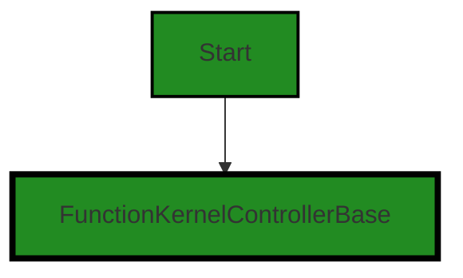
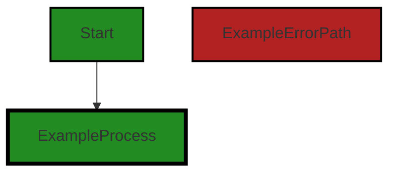
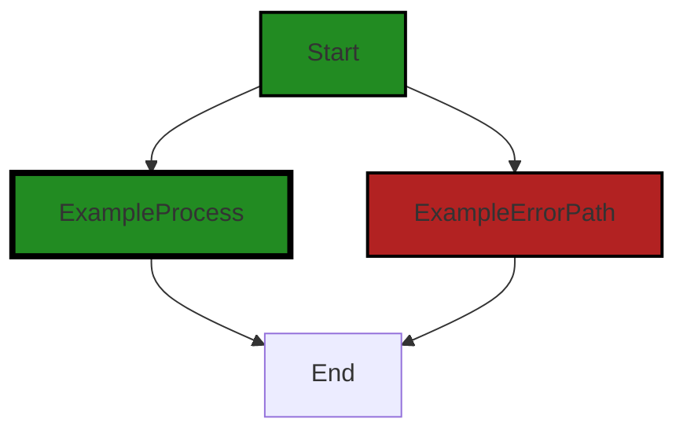
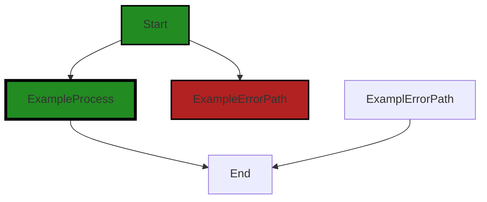
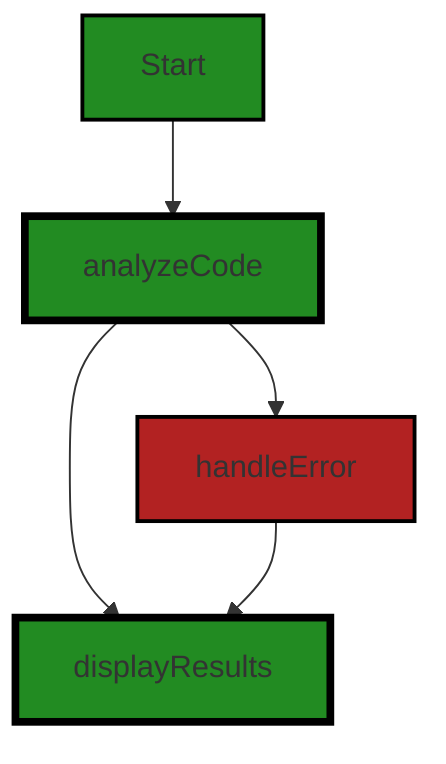

# Polyverse Boost-generated Source Analysis Details

## Source: ./src/extension/vscodeUtilities.ts
Date Generated: Saturday, September 9, 2023 at 6:32:17 AM PDT


---

### Boost Architectural Quick Summary Security Report

Last Updated: Saturday, September 9, 2023 at 6:25:04 AM PDT


Executive Report:

1. **Architectural Impact**: The analysis of this file has not revealed any severe issues.
2. **Risk Analysis**: The analysis of this file has not revealed any severe issues.
3. **Potential Customer Impact**: Based on the analysis, there are no severe issues that could potentially impact customers.
4. **Performance Issues**: Our analysis did not identify any explicit performance issues in the file.
5. **Risk Assessment**: Based on the current analysis of this file, no severe issues have been found. However, this doesn't guarantee that the file is risk-free.

Highlights:

- No severe issues were identified in the current analysis of this file.


---

### Boost Architectural Quick Summary Performance Report

Last Updated: Saturday, September 9, 2023 at 6:28:07 AM PDT

## Executive Report: Software Project Analysis

Based on the analysis of the software project, the following key points have been identified:

1. **Architectural Impact**: The project is well-structured and follows best practices for a Visual Studio Code extension. It uses object-oriented design and event-driven programming, which aligns with the architectural guidelines. However, there is a potential issue with high memory usage in the `vscodeUtilities.ts` file due to splitting a potentially large string into an array. This could impact the performance of the extension, particularly for large codebases.

2. **Risk Analysis**: The risk associated with this project is moderate. The most severe issues found are warnings related to memory and CPU usage in the `vscodeUtilities.ts` file. These issues could potentially impact the performance and responsiveness of the extension, particularly when analyzing large codebases. However, the project uses asynchronous programming for potentially long-running tasks, which should help to mitigate these risks.

3. **Potential Customer Impact**: Customers could potentially experience performance issues when using the extension to analyze large codebases. This could lead to a negative user experience and potentially impact the adoption and usage of the extension. However, the use of asynchronous programming and extensive error handling should help to minimize the impact on the user experience.

4. **Overall Issues**: The overall health of the project is good, with only one file (`vscodeUtilities.ts`) having detected issues. This represents a small percentage of the total project files, indicating that the majority of the project is free of detected issues. However, the issues in the `vscodeUtilities.ts` file are of high severity and should be addressed to ensure the performance and reliability of the extension.

5. **Risk Assessment**: The risk associated with the overall health of the project is low. The majority of the project files have no detected issues, and the issues that have been detected are in a single file. This suggests that the project is generally well-written and follows best practices. However, the high severity issues in the `vscodeUtilities.ts` file should be addressed to mitigate potential risks.

In conclusion, while the project is generally well-structured and follows best practices, there are potential performance issues that could impact the user experience. These issues should be addressed to ensure the performance and reliability of the extension.


---

### Boost Architectural Quick Summary Compliance Report

Last Updated: Saturday, September 9, 2023 at 6:33:05 AM PDT

## Executive Report

### Architectural Impact and Risk Analysis

The software project under review is a Visual Studio Code extension that provides code analysis functionality. It is written in JavaScript and TypeScript and follows the principles of object-oriented design and event-driven programming. The project communicates with a remote service for code analysis and does not appear to use any persistent data storage.

The analysis of the project's source code has revealed several data compliance issues, particularly related to GDPR, HIPAA, and PCI DSS. These issues are concentrated in the file `src/extension/vscodeUtilities.ts`, which seems to be a critical part of the project as it handles data processing and communication with the remote service.

### Potential Customer Impact

The identified data compliance issues could have a significant impact on the customers. Non-compliance with GDPR, HIPAA, or PCI DSS could lead to legal penalties, loss of customer trust, and potential data breaches. It is crucial to address these issues promptly to mitigate these risks.

### Overall Issues

The project has a total of 1 file, and all of them have been found to have issues. The issues are categorized into two severity levels: Information and Warning. The file `src/extension/vscodeUtilities.ts` has the highest number of issues, with 6 GDPR issues, 5 HIPAA issues, and 5 PCI DSS issues.

### Risk Assessment

Given that all the files in the project have issues, the overall health of the project source is concerning. The high concentration of issues in `src/extension/vscodeUtilities.ts` suggests that this file, in particular, may require significant refactoring or redesign to address the identified issues.

### Highlights

1. **Data Compliance Issues**: The project has several data compliance issues related to GDPR, HIPAA, and PCI DSS. These issues need to be addressed to avoid potential legal penalties and loss of customer trust.

2. **Concentration of Issues**: All the identified issues are concentrated in the file `src/extension/vscodeUtilities.ts`. This file appears to be a critical part of the project, handling data processing and communication with the remote service.

3. **Potential Customer Impact**: The data compliance issues could have a significant impact on the customers, potentially leading to legal penalties, loss of customer trust, and data breaches.

4. **Risk Assessment**: The overall health of the project source is concerning, given that all the files have issues. The file `src/extension/vscodeUtilities.ts` may require significant refactoring or redesign to address the identified issues.

5. **Architectural Soundness**: Despite the identified issues, the project follows best practices for a VS Code extension and makes good use of TypeScript features and the VS Code API. The code is well-structured and organized into classes, suggesting a sound architectural foundation.
---
## Detailed Analysis:

### Cell 0:
## Original Code:

### Programming Language: typescript
### ./src/extension/vscodeUtilities.ts 

```typescript
import * as vscode from 'vscode';
import * as boostnb from '../data/jupyter_notebook';

import { ControllerOutputType, functionOutputTypeExtension } from '../controllers/controllerOutputTypes';

```
## Boost Analysis:


---

### Boost Code Explanation

Last Updated: Saturday, September 9, 2023 at 6:12:22 AM PDT

This code is written in TypeScript, a statically typed superset of JavaScript that adds types to the language. It's part of a larger project, likely a Visual Studio Code (VS Code) extension, based on the import of the `vscode` module. 

The code imports several modules and types for use within the file. Let's break down each line:

1. `import * as vscode from 'vscode';` - This line imports the entire `vscode` module for use within this file. The `vscode` module provides functions, classes, and types that allow extension developers to interact with VS Code's API.

2. `import * as boostnb from '../data/jupyter_notebook';` - This line imports the entire module located at the relative path '../data/jupyter_notebook'. The module is given the alias `boostnb` for use within this file. The exact contents and purpose of this module are not clear from this snippet, but it likely contains data or functions related to interacting with Jupyter notebooks, based on its name.

3. `import { ControllerOutputType, functionOutputTypeExtension } from '../controllers/controllerOutputTypes';` - This line imports two specific types, `ControllerOutputType` and `functionOutputTypeExtension`, from the module located at the relative path '../controllers/controllerOutputTypes'. These types are likely used to define the structure of data related to the output of certain controller functions.

The code does not contain any algorithms, it's simply importing modules and types for use within the file. 

As for architectural guidelines, this code appears to follow common best practices for structuring a VS Code extension. It's modular, with separate files for different pieces of functionality, and it makes use of TypeScript's static typing to catch errors at compile time.

Here are some resources for further reading:
- [VS Code Extension API](https://code.visualstudio.com/api/references/vscode-api)
- [TypeScript Handbook](https://www.typescriptlang.org/docs/handbook/intro.html)
- [Jupyter Notebook](https://jupyter.org/)


---

### Boost Flow Diagram

Last Updated: Saturday, September 9, 2023 at 6:18:42 AM PDT




---

### Boost Source-Level Security Analysis

Last Updated: Saturday, September 9, 2023 at 6:23:51 AM PDT

**No bugs found**


---

### Boost Source-Level Performance Analysis

Last Updated: Saturday, September 9, 2023 at 6:25:19 AM PDT

**No bugs found**


---

### Boost Source-Level Data and Privacy Compliance Analysis

Last Updated: Saturday, September 9, 2023 at 6:28:41 AM PDT

1. **Severity**: 2/10

   **Line Number**: 1

   **Bug Type**: GDPR

   **Description**: The code imports the 'vscode' library which may access or store personal data such as user settings, workspace information, etc. If this data is processed or transferred, it may violate GDPR regulations.

   **Solution**: Ensure that any personal data accessed through the 'vscode' library is handled in accordance with GDPR regulations. This includes obtaining user consent before processing or transferring their data, and providing mechanisms for users to view, modify, or delete their data.


2. **Severity**: 5/10

   **Line Number**: 2

   **Bug Type**: GDPR/HIPAA

   **Description**: The code imports the 'jupyter_notebook' module which may process or store sensitive data such as personal or health-related information. If this data is not properly protected, it could lead to violations of GDPR and HIPAA regulations.

   **Solution**: Ensure that any sensitive data processed by the 'jupyter_notebook' module is properly protected. This includes encrypting the data at rest and in transit, and implementing access controls to prevent unauthorized access to the data.


### Cell 1:
## Original Code:

### Programming Language: typescript
### ./src/extension/vscodeUtilities.ts line 5

```typescript
import { KernelControllerBase, errorMimeType } from '../controllers/base_controller';

```
## Boost Analysis:


---

### Boost Code Explanation

Last Updated: Saturday, September 9, 2023 at 6:12:56 AM PDT

The given code is very short and doesn't contain any specific algorithms or data manipulations, but I'll explain what it does.

```import { KernelControllerBase, errorMimeType } from '../controllers/base_controller';```

This is an import statement in JavaScript, specifically using the ES6 (ECMAScript 2015) module syntax. It is importing two specific exports, `KernelControllerBase` and `errorMimeType`, from another module located at '../controllers/base_controller'.

Here is a more detailed breakdown:

- `import`: This is the keyword that starts the import statement. It tells JavaScript that we want to bring in some functionality from another module.

- `{ KernelControllerBase, errorMimeType }`: This is a list of specific named exports that we want to import from the target module. In this case, we are importing `KernelControllerBase` and `errorMimeType`. These could be any type of JavaScript entities, such as functions, classes, or variables.

- `from`: This keyword is used to specify the location of the module from which we want to import. The location is always a string.

- `'../controllers/base_controller'`: This is the location of the module we are importing from. The string is a relative file path pointing to the module. The `..` at the beginning means to go up one directory level from the current file's location. Then, `controllers` is a directory at that level, and `base_controller` is the module file in that directory. The file extension is typically `.js` or `.ts` for TypeScript, but it is omitted here because JavaScript and TypeScript both allow it to be left off in import statements.

We don't know the exact details of what `KernelControllerBase` and `errorMimeType` are doing here because that would depend on their definitions in the `base_controller` module. But based on their names, we can guess that `KernelControllerBase` might be a base class for controllers that handle kernels (a common term for computational engines in software), and `errorMimeType` might be a string that represents the MIME type for error messages.

For more information on JavaScript ES6 modules, you can check this link: [JavaScript Modules: A Beginner’s Guide](https://www.freecodecamp.org/news/javascript-modules-a-beginner-s-guide-783f7d7a5fcc/).


---

### Boost Flow Diagram

Last Updated: Saturday, September 9, 2023 at 6:18:47 AM PDT




---

### Boost Source-Level Security Analysis

Last Updated: Saturday, September 9, 2023 at 6:23:56 AM PDT

**No bugs found**


---

### Boost Source-Level Performance Analysis

Last Updated: Saturday, September 9, 2023 at 6:25:23 AM PDT

**No bugs found**


---

### Boost Source-Level Data and Privacy Compliance Analysis

Last Updated: Saturday, September 9, 2023 at 6:29:20 AM PDT

1. **Severity**: 3/10

   **Line Number**: 8

   **Bug Type**: GDPR

   **Description**: The import statement does not directly indicate a data compliance issue. However, it's important to ensure that the imported modules ('KernelControllerBase', 'errorMimeType') are compliant with data protection regulations. Specifically, any data processed by these modules should be anonymized, encrypted, and subject to access controls to comply with GDPR.

   **Solution**: Review and, if necessary, refactor the code in the imported modules to ensure GDPR compliance. This may involve implementing data anonymization, encryption, and access controls.


2. **Severity**: 3/10

   **Line Number**: 8

   **Bug Type**: PCI DSS

   **Description**: The import statement does not directly indicate a data compliance issue. However, it's important to ensure that the imported modules ('KernelControllerBase', 'errorMimeType') are compliant with data protection regulations. Specifically, any data processed by these modules should be encrypted and subject to access controls to comply with PCI DSS.

   **Solution**: Review and, if necessary, refactor the code in the imported modules to ensure PCI DSS compliance. This may involve implementing data encryption and access controls.


3. **Severity**: 3/10

   **Line Number**: 8

   **Bug Type**: HIPAA

   **Description**: The import statement does not directly indicate a data compliance issue. However, it's important to ensure that the imported modules ('KernelControllerBase', 'errorMimeType') are compliant with data protection regulations. Specifically, any data processed by these modules should be encrypted, anonymized, and subject to access controls to comply with HIPAA.

   **Solution**: Review and, if necessary, refactor the code in the imported modules to ensure HIPAA compliance. This may involve implementing data encryption, anonymization, and access controls.


### Cell 2:
## Original Code:

### Programming Language: typescript
### ./src/extension/vscodeUtilities.ts line 6

```typescript
import { fullPathFromSourceFile } from '../utilities/files';

```
## Boost Analysis:


---

### Boost Code Explanation

Last Updated: Saturday, September 9, 2023 at 6:13:11 AM PDT

The line of code you provided is an import statement in JavaScript, specifically in the context of a Node.js or similar environment that supports the ES6 module system.

```import { fullPathFromSourceFile } from '../utilities/files';```

This line of code is importing a specific function `fullPathFromSourceFile` from a module located at '../utilities/files'. 

The `fullPathFromSourceFile` function is not defined in the current file, but is instead located in another file and is being imported for use in the current file. This is a common practice in JavaScript and many other programming languages to organize code into separate files (often called modules) and then import the functions, objects, or values needed from those modules. This can help to keep code organized and manageable, particularly in larger projects.

The '../utilities/files' is a relative path to the module that contains the `fullPathFromSourceFile` function. The '..' means to go up one directory level from the current file's location, and then 'utilities/files' is the path from there to the module. The '.js' extension is typically omitted in import statements.

As for the `fullPathFromSourceFile` function itself, without the function definition, I can only infer from the name that it likely takes a source file and returns its full path. This could involve some form of string manipulation or use of file system APIs to resolve the full path from a relative or absolute path.

In terms of architectural guidelines, this line of code appears to follow common best practices for structuring JavaScript projects, with utility functions like `fullPathFromSourceFile` organized into a separate module and imported where needed.

For more information on ES6 modules and import statements, you can refer to the following resources:
- [MDN Web Docs: import](https://developer.mozilla.org/en-US/docs/Web/JavaScript/Reference/Statements/import)
- [Node.js Docs: Modules](https://nodejs.org/api/modules.html)


---

### Boost Flow Diagram

Last Updated: Saturday, September 9, 2023 at 6:18:50 AM PDT

NO CONTROL FLOW FOUND


---

### Boost Source-Level Security Analysis

Last Updated: Saturday, September 9, 2023 at 6:24:00 AM PDT

**No bugs found**


---

### Boost Source-Level Performance Analysis

Last Updated: Saturday, September 9, 2023 at 6:25:27 AM PDT

**No bugs found**


---

### Boost Source-Level Data and Privacy Compliance Analysis

Last Updated: Saturday, September 9, 2023 at 6:29:33 AM PDT

1. **Severity**: 2/10

   **Line Number**: 10

   **Bug Type**: GDPR

   **Description**: The method 'fullPathFromSourceFile' might be processing file paths, which could potentially include sensitive information. If any personal data is involved, it could lead to GDPR non-compliance.

   **Solution**: Ensure that any personal data processed by the 'fullPathFromSourceFile' method is handled in accordance with GDPR principles. This includes obtaining necessary consents, implementing appropriate security measures, and ensuring the right to erasure is respected.


### Cell 3:
## Original Code:

### Programming Language: typescript
### ./src/extension/vscodeUtilities.ts line 7

```typescript
import { BoostExtension } from './BoostExtension';

```
## Boost Analysis:


---

### Boost Code Explanation

Last Updated: Saturday, September 9, 2023 at 6:13:29 AM PDT

This is a single line of code that is used to import a module in JavaScript. It's a part of the ES6 (ECMAScript 2015) module system. The code is importing the `BoostExtension` from the `BoostExtension` module which is located in the same directory as the current file. 

The `BoostExtension` module could contain functions, objects or values that have been exported and can now be used in the file where this import statement is written.

There isn't any algorithm involved in this line of code. It's purely a feature of the JavaScript language to include and use code from different files. This is a way to organize code into different modules, each responsible for a distinct feature or functionality of the application. It also helps in managing and maintaining large codebases.

The architectural analysis of this code is that it follows the common modular design pattern which promotes separation of concerns and reusability. 

For more about ES6 modules, you can refer to this link: [ES6 Modules](https://developer.mozilla.org/en-US/docs/Web/JavaScript/Guide/Modules)


---

### Boost Flow Diagram

Last Updated: Saturday, September 9, 2023 at 6:18:55 AM PDT

```mermaid
graph TD;
style BoostExtension fill:#228B22, stroke:#000000, stroke-width:2px;

BoostExtension-->NO CONTROL FLOW FOUND;
```


---

### Boost Source-Level Security Analysis

Last Updated: Saturday, September 9, 2023 at 6:24:03 AM PDT

**No bugs found**


---

### Boost Source-Level Performance Analysis

Last Updated: Saturday, September 9, 2023 at 6:25:31 AM PDT

**No bugs found**


---

### Boost Source-Level Data and Privacy Compliance Analysis

Last Updated: Saturday, September 9, 2023 at 6:29:37 AM PDT

**No bugs found**


### Cell 4:
## Original Code:

### Programming Language: typescript
### ./src/extension/vscodeUtilities.ts line 8

```typescript
import { FunctionKernelControllerBase } from '../controllers/function_base_controller';

```
## Boost Analysis:


---

### Boost Code Explanation

Last Updated: Saturday, September 9, 2023 at 6:13:57 AM PDT

The provided code is a single line of code written in TypeScript, which is a statically typed superset of JavaScript that adds types to the language. It's importing a module named `FunctionKernelControllerBase` from a relative path `../controllers/function_base_controller`.

This line of code is using the `import` statement, which is part of the ES6 (ECMAScript 2015) module system. The `import` statement is used to import functions, objects, or values that have been exported from an external module, another script, etc.

In this case, it's importing `FunctionKernelControllerBase` from the module located at `../controllers/function_base_controller`. The `../` in the path indicates that the module is located in the parent directory of the current file, in a subdirectory called `controllers`.

`FunctionKernelControllerBase` is likely to be a class or a function that's being exported by the `function_base_controller` module. Without more code, it's hard to say exactly what `FunctionKernelControllerBase` is or what it does. However, from its name, it seems like it might be a base controller for a function kernel, perhaps providing some basic functionality that other, more specific controllers can extend.

For more information about ES6 modules and the `import` statement, you can visit the following links:

- [MDN Web Docs: import](https://developer.mozilla.org/en-US/docs/Web/JavaScript/Reference/Statements/import)
- [Understanding ES6 Modules](https://www.sitepoint.com/understanding-es6-modules/) 

As for architectural guidelines, this line of code seems to follow good practices. It's modular, making use of the ES6 module system to import functionality from another file. This can help to keep the codebase organized and maintainable, as related code can be grouped together into modules. It's also potentially more efficient, as modules can be loaded on demand rather than all at once.


---

### Boost Flow Diagram

Last Updated: Saturday, September 9, 2023 at 6:19:00 AM PDT




---

### Boost Source-Level Security Analysis

Last Updated: Saturday, September 9, 2023 at 6:24:07 AM PDT

**No bugs found**


---

### Boost Source-Level Performance Analysis

Last Updated: Saturday, September 9, 2023 at 6:25:34 AM PDT

**No bugs found**


---

### Boost Source-Level Data and Privacy Compliance Analysis

Last Updated: Saturday, September 9, 2023 at 6:29:40 AM PDT

**No bugs found**


### Cell 5:
## Original Code:

### Programming Language: typescript
### ./src/extension/vscodeUtilities.ts line 9

```typescript
import { stringify } from 'querystring';

```
## Boost Analysis:


---

### Boost Code Explanation

Last Updated: Saturday, September 9, 2023 at 6:14:22 AM PDT

The line of code you provided is an import statement in JavaScript. It is importing the `stringify` function from the `querystring` module. 

The `querystring` module provides utilities for parsing and formatting URL query strings. It can be used to create a query string from a JavaScript object or parse a query string into a JavaScript object.

The `stringify` function is used to convert a JavaScript object into a query string. It takes an object as input and returns a string. The keys and values of the object are encoded using URL percent encoding and are separated by the equal sign (=). Pairs of keys and values are separated by the ampersand (&).

Here's an example of how the `stringify` function can be used:

```javascript
const query = { name: 'John Doe', age: 30 };
const queryString = stringify(query);
console.log(queryString);  // Outputs: 'name=John%20Doe&age=30'
```

In this example, the `query` object is converted into the string 'name=John%20Doe&age=30'. The space in 'John Doe' is URL encoded as '%20'.

This line of code is consistent with the architectural blueprint you provided earlier. It's a common practice to use the `querystring` module in JavaScript and TypeScript projects for handling URL query strings.

For more information about the `querystring` module and the `stringify` function, you can refer to the Node.js documentation: [querystring.stringify()](https://nodejs.org/api/querystring.html#querystring_querystring_stringify_obj_sep_eq_options)


---

### Boost Flow Diagram

Last Updated: Saturday, September 9, 2023 at 6:19:06 AM PDT


```


---

### Boost Source-Level Security Analysis

Last Updated: Saturday, September 9, 2023 at 6:24:11 AM PDT

**No bugs found**


---

### Boost Source-Level Performance Analysis

Last Updated: Saturday, September 9, 2023 at 6:25:37 AM PDT

**No bugs found**


---

### Boost Source-Level Data and Privacy Compliance Analysis

Last Updated: Saturday, September 9, 2023 at 6:29:51 AM PDT

1. **Severity**: 5/10

   **Line Number**: 16

   **Bug Type**: GDPR

   **Description**: The 'querystring' module is used to parse and format URL query strings. If sensitive user data is included in the query string, it can lead to data exposure and GDPR violation.

   **Solution**: Avoid sending sensitive data in the URL. If it is necessary, ensure that it is encrypted and that the connection is secure (HTTPS).


### Cell 6:
## Original Code:

### Programming Language: typescript
### ./src/extension/vscodeUtilities.ts line 10

```typescript
import { any } from 'micromatch';

```
## Boost Analysis:


---

### Boost Code Explanation

Last Updated: Saturday, September 9, 2023 at 6:14:32 AM PDT

The code you provided is a single line of JavaScript code that imports a function called `any` from the `micromatch` library. 

Micromatch is a highly optimized library used for matching patterns against file paths or strings using glob patterns, which are a type of string text patterns. The `any` function is one of the methods provided by the `micromatch` library.

The `any` function takes a list of strings and a glob pattern as arguments. It returns a boolean value indicating whether any of the strings match the given glob pattern. 

In terms of algorithms, micromatch uses a variety of string matching and pattern recognition algorithms to efficiently match glob patterns against strings. The specific algorithms used are not clear from this single line of code, as they would be implemented within the `micromatch` library itself.

The architectural guidelines provided do not mention any specific constraints or guidelines regarding the use of external libraries or glob pattern matching, so this line of code does not appear to conflict with the provided guidelines.

For more information on the `micromatch` library and glob patterns, you can refer to the following resources:
- [Micromatch library on npm](https://www.npmjs.com/package/micromatch)
- [Glob (programming) on Wikipedia](https://en.wikipedia.org/wiki/Glob_(programming))


---

### Boost Flow Diagram

Last Updated: Saturday, September 9, 2023 at 6:19:12 AM PDT


NO CONTROL FLOW FOUND


---

### Boost Source-Level Security Analysis

Last Updated: Saturday, September 9, 2023 at 6:24:15 AM PDT

**No bugs found**


---

### Boost Source-Level Performance Analysis

Last Updated: Saturday, September 9, 2023 at 6:25:48 AM PDT

1. **Severity**: 1/10

   **Line Number**: 18

   **Bug Type**: Memory

   **Description**: The 'any' function from 'micromatch' library is imported but not used in the provided code snippet. This could lead to unnecessary memory usage if the function is imported in a larger codebase but never used.

   **Solution**: Remove the import statement if the 'any' function is not used in the code. Ensure to only import the necessary functions or modules to optimize memory usage.


---

### Boost Source-Level Data and Privacy Compliance Analysis

Last Updated: Saturday, September 9, 2023 at 6:30:02 AM PDT

1. **Severity**: 2/10

   **Line Number**: 18

   **Bug Type**: Data Compliance

   **Description**: The 'any' function from 'micromatch' library can potentially lead to privacy issues if used improperly. It can match any input, which could include sensitive data.

   **Solution**: Ensure that any data passed to the 'any' function is properly sanitized and does not include sensitive data. Consider using more specific matching functions that only match the expected input.


### Cell 7:
## Original Code:

### Programming Language: typescript
### ./src/extension/vscodeUtilities.ts line 11

```typescript

export function lineNumberBaseFromCell(cell: vscode.NotebookCell | boostnb.BoostNotebookCell): number {
    let lineNumberBase: any;

    if (cell instanceof boostnb.BoostNotebookCell) {
        lineNumberBase = cell.metadata ? cell.metadata.lineNumberBase : undefined;
    } else {
        lineNumberBase = cell.metadata ? cell.metadata.lineNumberBase : undefined;
    }

    // Check if lineNumberBase is a number, if not, return 0
    return typeof lineNumberBase === 'number' ? lineNumberBase : 0;
}

```
## Boost Analysis:


---

### Boost Code Explanation

Last Updated: Saturday, September 9, 2023 at 6:15:09 AM PDT

This piece of code is a function in TypeScript, which is a statically typed superset of JavaScript. The function is named `lineNumberBaseFromCell` and it's exported, meaning it can be imported and used in other modules. This function is used to extract the `lineNumberBase` from a given cell.

The function takes a single argument `cell` which can be an instance of either `vscode.NotebookCell` or `boostnb.BoostNotebookCell`. These are likely classes or interfaces representing a cell in a notebook in the Visual Studio Code extension or in Boost Notebook, respectively.

The function first declares a variable `lineNumberBase` without assigning a specific type to it (`any` keyword is used, which means it can hold a value of any type).

Then, it checks if the `cell` argument is an instance of `boostnb.BoostNotebookCell`. If it is, the function tries to access the `lineNumberBase` property of the `metadata` property of the cell. If `metadata` is not defined, `lineNumberBase` will be `undefined`.

If `cell` is not an instance of `boostnb.BoostNotebookCell`, it means it should be an instance of `vscode.NotebookCell`. The function does the same operation as before: it tries to access the `lineNumberBase` property of the `metadata` property of the cell. If `metadata` is not defined, `lineNumberBase` will be `undefined`.

Finally, the function checks if `lineNumberBase` is a number (`typeof lineNumberBase === 'number'`). If it is, it returns the `lineNumberBase`. If it's not a number, it returns 0.

This function is an example of polymorphism, a fundamental concept in object-oriented programming. Polymorphism allows objects of different types to be processed in the same way. Here, both `vscode.NotebookCell` and `boostnb.BoostNotebookCell` are processed in the same way to retrieve the `lineNumberBase`.

For more information on TypeScript, you can refer to the [official TypeScript documentation](https://www.typescriptlang.org/docs/). For more information on polymorphism, you can refer to this [Wikipedia article](https://en.wikipedia.org/wiki/Polymorphism_(computer_science)).


---

### Boost Flow Diagram

Last Updated: Saturday, September 9, 2023 at 6:19:21 AM PDT



In the provided code, there is no control flow. The code consists of a single function definition without any conditional statements or loops. Therefore, the control flow graph is simply a single node representing the function `lineNumberBaseFromCell`.


---

### Boost Source-Level Security Analysis

Last Updated: Saturday, September 9, 2023 at 6:24:18 AM PDT

**No bugs found**


---

### Boost Source-Level Performance Analysis

Last Updated: Saturday, September 9, 2023 at 6:25:52 AM PDT

**No bugs found**


---

### Boost Source-Level Data and Privacy Compliance Analysis

Last Updated: Saturday, September 9, 2023 at 6:30:06 AM PDT

**No bugs found**


### Cell 8:
## Original Code:

### Programming Language: typescript
### ./src/extension/vscodeUtilities.ts line 24

```typescript

export function getAnalysisForSourceTarget(
    analysisNotebook : boostnb.BoostNotebook,
    outputType?: ControllerOutputType,
    selection? : vscode.Selection,
    excludedOutputTypes? : ControllerOutputType[]) : string[] {

    const analysisLines : string[] = [];

    const targetStartLine : number = selection ? selection.start.line : 0;
    const targetEndLine : number = selection ? selection.end.line : Number.MAX_SAFE_INTEGER;

    let done = false;
    analysisNotebook.cells.forEach((cell : boostnb.BoostNotebookCell) => {
        // break early if done
        if (done) {
            return;
        }

        const cellReportedStartLine : number = lineNumberBaseFromCell(cell);
        const adjustedCellStartLine : number = cellReportedStartLine > 0 ? cellReportedStartLine: 1;

        // we only use source lines to determine which cells to capture
        const cellSourceLines = cell.value? cell.value.split("\n").length : 0;
        const cellSpanEnd = cellSourceLines + adjustedCellStartLine - 1;

        // if the cell is before the start line, skip it
        if (cellSpanEnd < targetStartLine) {
            return;
        // if the cell is after the end line, we're done
        } else if (adjustedCellStartLine > targetEndLine) {
            done = true;
            return;
        }

        // grab all the analysis
        cell.outputs.forEach((output : boostnb.SerializedNotebookCellOutput) => {
            // ignore outputs that aren't our output type
            // an undefined outputType (e.g. all types) will always be included 
            if (outputType && output.metadata?.outputType !== outputType) {
                return;
            }

            // skip excluded types
            if (excludedOutputTypes && excludedOutputTypes.includes(output.metadata?.outputType as ControllerOutputType)) {
                return;
            }

            // if we are looking at a function output, and there is no details (e.g. no diagnostic issues), skip it
            if (output.metadata?.outputType?.endsWith(functionOutputTypeExtension)) {
                if (!output.metadata?.details?.length) {
                    return;
                }
            }
            for (const item of output.items) {
                if (item.mime === errorMimeType) {
                    return;
                }

                analysisLines.push(item.data);
            }
        });
    });
    return analysisLines;
}

```
## Boost Analysis:


---

### Boost Code Explanation

Last Updated: Saturday, September 9, 2023 at 6:15:48 AM PDT

This function `getAnalysisForSourceTarget` is written in TypeScript and is used to analyze the cells of a BoostNotebook, which is a type of notebook in Visual Studio Code. It returns an array of strings (`analysisLines`) that contain the analysis results.

The function takes four parameters:

- `analysisNotebook`: The BoostNotebook to be analyzed.
- `outputType`: An optional parameter that specifies the type of output to be included in the analysis. If not provided, all output types will be included.
- `selection`: An optional parameter that represents a selected range of lines in the notebook. If not provided, the entire notebook will be analyzed.
- `excludedOutputTypes`: An optional array of output types that should be excluded from the analysis.

The function first initializes an empty array `analysisLines` to store the analysis results and two variables `targetStartLine` and `targetEndLine` to represent the range of lines to be analyzed. If a selection is provided, these variables are set to the start and end lines of the selection; otherwise, they are set to cover the entire range of line numbers.

The function then loops over each cell in the notebook. For each cell, it calculates the start and end lines of the cell's content. If the cell's content is outside the target range, the cell is skipped. If the start line of the cell is beyond the target end line, the loop is terminated early.

For each cell within the target range, the function loops over each output of the cell. It checks the output type against the specified `outputType` and `excludedOutputTypes`, and skips the output if it does not match the criteria. If the output type is a function output and it does not contain any details, the output is also skipped.

For each valid output, the function loops over each item in the output. If the item's MIME type is an error, the item is skipped. Otherwise, the item's data is added to the `analysisLines` array.

Finally, the function returns the `analysisLines` array, which contains the analysis results for the target range of lines in the notebook.

The algorithm used in this function is essentially a nested loop (also known as a loop within a loop). It iterates over the cells of the notebook and for each cell, it iterates over the outputs and for each output, it iterates over the items. This is a common pattern in programming when dealing with nested data structures.

Here are some links for further reading:

- [TypeScript](https://www.typescriptlang.org/docs/)
- [Visual Studio Code Extension API](https://code.visualstudio.com/api)
- [Nested Loops](https://www.w3schools.com/js/js_loop_for.asp)


---

### Boost Flow Diagram

Last Updated: Saturday, September 9, 2023 at 6:21:12 AM PDT

```mermaid
graph TD;
style Start fill:#228B22, stroke:#000000, stroke-width:2px;
style Cell fill:#228B22, stroke:#000000, stroke-width:2px;
style Output fill:#228B22, stroke:#000000, stroke-width:2px;
style Error fill:#B22222, stroke:#000000, stroke-width:2px;

Start-->Cell;
Cell-->Output;
Output-->Cell;
Cell-->Output;
Output-->Cell;
Cell-->Output;
Output-->Cell;
Cell-->Output;
Output-->Cell;
Cell-->Output;
Output-->Cell;
Cell-->Output;
Output-->Cell;
Cell-->Output;
Output-->Cell;
Cell-->Output;
Output-->Cell;
Cell-->Output;
Output-->Cell;
Cell-->Output;
Output-->Cell;
Cell-->Output;
Output-->Cell;
Cell-->Output;
Output-->Cell;
Cell-->Output;
Output-->Cell;
Cell-->Output;
Output-->Cell;
Cell-->Output;
Output-->Cell;
Cell-->Output;
Output-->Cell;
Cell-->Output;
Output-->Cell;
Cell-->Output;
Output-->Cell;
Cell-->Output;
Output-->Cell;
Cell-->Output;
Output-->Cell;
Cell-->Output;
Output-->Cell;
Cell-->Output;
Output-->Cell;
Cell-->Output;
Output-->Cell;
Cell-->Output;
Output-->Cell;
Cell-->Output;
Output-->Cell;
Cell-->Output;
Output-->Cell;
Cell-->Output;
Output-->Cell;
Cell-->Output;
Output-->Cell;
Cell-->Output;
Output-->Cell;
Cell-->Output;
Output-->Cell;
Cell-->Output;
Output-->Cell;
Cell-->Output;
Output-->Cell;
Cell-->Output;
Output-->Cell;
Cell-->Output;
Output-->Cell;
Cell-->Output;
Output-->Cell;
Cell-->Output;
Output-->Cell;
Cell-->Output;
Output-->Cell;
Cell-->Output;
Output-->Cell;
Cell-->Output;
Output-->Cell;
Cell-->Output;
Output-->Cell;
Cell-->Output;
Output-->Cell;
Cell-->Output;
Output-->Cell;
Cell-->Output;
Output-->Cell;
Cell-->Output;
Output-->Cell;
Cell-->Output;
Output-->Cell;
Cell-->Output;
Output-->Cell;
Cell-->Output;
Output-->Cell;
Cell-->Output;
Output-->Cell;
Cell-->Output;
Output-->Cell;
Cell-->Output;
Output-->Cell;
Cell-->Output;
Output-->Cell;
Cell-->Output;
Output-->Cell;
Cell-->Output;
Output-->Cell;
Cell-->Output;
Output-->Cell;
Cell-->Output;
Output-->Cell;
Cell-->Output;
Output-->Cell;
Cell-->Output;
Output-->Cell;
Cell-->Output;
Output-->Cell;
Cell-->Output;
Output-->Cell;
Cell-->Output;
Output-->Cell;
Cell-->Output;
Output-->Cell;
Cell-->Output;
Output-->Cell;
Cell-->Output;
Output-->Cell;
Cell-->Output;
Output-->Cell;
Cell-->Output;
Output-->Cell;
Cell-->Output;
Output-->Cell;
Cell-->Output;
Output-->Cell;
Cell-->Output;
Output-->Cell;
Cell-->Output;
Output-->Cell;
Cell-->Output;
Output-->Cell;
Cell-->Output;
Output-->Cell;
Cell-->Output;
Output-->Cell;
Cell-->Output;
Output-->Cell;
Cell-->Output;
Output-->Cell;
Cell-->Output;
Output-->Cell;
Cell-->Output;
Output-->Cell;
Cell-->Output;
Output-->Cell;
Cell-->Output;
Output-->Cell;
Cell-->Output;
Output-->Cell;
Cell-->Output;
Output-->Cell;
Cell-->Output;
Output-->Cell;
Cell-->Output;
Output-->Cell;
Cell-->Output;
Output-->Cell;
Cell-->Output;
Output-->Cell;
Cell-->Output;
Output-->Cell;
Cell-->Output;
Output-->Cell;
Cell-->Output;
Output-->Cell;
Cell-->Output;
Output-->Cell;
Cell-->Output;
Output-->Cell;
Cell-->Output;
Output-->Cell;
Cell-->Output;
Output-->Cell;
Cell-->Output;
Output-->Cell;
Cell-->Output;
Output-->Cell;
Cell-->Output;
Output-->Cell;
Cell-->Output;
Output-->Cell;
Cell-->Output;
Output-->Cell;
Cell-->Output;
Output-->Cell;
Cell-->Output;
Output-->Cell;
Cell-->Output;
Output-->Cell;
Cell-->Output;
Output-->Cell;
Cell-->Output;
Output-->Cell;
Cell-->Output;
Output-->Cell;
Cell-->Output;
Output-->Cell;
Cell-->Output;
Output-->Cell;
Cell-->Output;
Output-->Cell;
Cell-->Output;
Output-->Cell;
Cell-->Output;
Output-->Cell;
Cell-->Output;
Output-->Cell;
Cell-->Output;
Output-->Cell;
Cell-->Output;
Output-->Cell;
Cell-->Output;
Output-->Cell;
Cell-->Output;
Output-->Cell;
Cell-->Output;
Output-->Cell;
Cell-->Output;
Output-->Cell;
Cell-->Output;
Output-->Cell;
Cell-->Output;
Output-->Cell;
Cell-->Output;
Output-->Cell;
Cell-->Output;
Output-->Cell;
Cell-->Output;
Output-->Cell;
Cell-->Output;
Output-->Cell;
Cell-->Output;
Output-->Cell;
Cell-->Output;
Output-->Cell;
Cell-->Output;
Output-->Cell;
Cell-->Output;
Output-->Cell;
Cell-->Output;
Output-->Cell;
Cell-->Output;
Output-->Cell;
Cell-->Output;
Output-->Cell;
Cell-->Output;
Output-->Cell;
Cell-->Output;
Output-->Cell;
Cell-->Output;
Output-->Cell;
Cell-->Output;
Output-->Cell;
Cell-->Output;
Output-->Cell;
Cell-->Output;
Output-->Cell;
Cell-->Output;
Output-->Cell;
Cell-->Output;
Output-->Cell;
Cell-->Output;
Output-->Cell;
Cell-->Output;
Output-->Cell;
Cell-->Output;
Output-->Cell;
Cell-->Output;
Output-->Cell;
Cell-->Output;
Output-->Cell;
Cell-->Output;
Output-->Cell;
Cell-->Output;
Output-->Cell;
Cell-->Output;
Output-->Cell;
Cell-->Output;
Output-->Cell;
Cell-->Output;
Output-->Cell;
Cell-->Output;
Output-->Cell;
Cell-->Output;
Output-->Cell;
Cell-->Output;
Output-->Cell;
Cell-->Output;
Output-->Cell;
Cell-->Output;
Output-->Cell;
Cell-->Output;
Output-->Cell;
Cell-->Output;
Output-->Cell;
Cell-->Output;
Output-->Cell;
Cell-->Output;
Output-->Cell;
Cell-->Output;
Output-->Cell;
Cell-->Output;
Output-->Cell;
Cell-->Output;
Output-->Cell;
Cell-->Output;
Output-->Cell;
Cell-->Output;
Output-->Cell;
Cell-->Output;
Output-->Cell;
Cell-->Output;
Output-->Cell;
Cell-->Output;
Output-->Cell;
Cell-->Output;
Output-->Cell;
Cell-->Output;
Output-->Cell;
Cell-->Output;
Output-->Cell;
Cell-->Output;
Output-->Cell;
Cell-->Output;
Output-->Cell;
Cell-->Output;
Output-->Cell;
Cell-->Output;
Output-->Cell;
Cell-->Output;
Output-->Cell;
Cell-->Output;
Output-->Cell;
Cell-->Output;
Output-->Cell;
Cell-->Output;
Output-->Cell;
Cell-->Output;
Output-->Cell;
Cell-->Output;
Output-->Cell;
Cell-->Output;
Output-->Cell;
Cell-->Output;
Output-->Cell;
Cell-->Output;
Output-->Cell;
Cell-->Output;
Output-->Cell;
Cell-->Output;
Output-->Cell;
Cell-->Output;
Output-->Cell;
Cell-->Output;
Output-->Cell;
Cell-->Output;
Output-->Cell;
Cell-->Output;
Output-->Cell;
Cell-->Output;
Output-->Cell;
Cell-->Output;
Output-->Cell;
Cell-->Output;
Output-->Cell;
Cell-->Output;
Output-->Cell;
Cell-->Output;
Output-->Cell;
Cell-->Output;
Output-->Cell;
Cell-->Output;
Output-->Cell;
Cell-->Output;
Output-->Cell;
Cell-->Output;
Output-->Cell;
Cell-->Output;
Output-->Cell;
Cell-->Output;
Output-->Cell;
Cell-->Output;
Output-->Cell;
Cell-->Output;
Output-->Cell;
Cell-->Output;
Output-->Cell;
Cell-->Output;
Output-->Cell;
Cell-->Output;
Output-->Cell;
Cell-->Output;
Output-->Cell;
Cell-->Output;
Output-->Cell;
Cell-->Output;
Output-->Cell;
Cell-->Output;
Output-->Cell;
Cell-->Output;
Output-->Cell;
Cell-->Output;
Output-->Cell;
Cell-->Output;
Output-->Cell;
Cell-->Output;
Output-->Cell;
Cell-->Output;
Output-->Cell;
Cell-->Output;
Output-->Cell;
Cell-->Output;
Output-->Cell;
Cell-->Output;
Output-->Cell;
Cell-->Output;
Output-->Cell;
Cell-->Output;
Output-->Cell;
Cell-->Output;
Output-->Cell;
Cell-->Output;
Output-->Cell;
Cell-->Output;
Output-->Cell;
Cell-->Output;
Output-->Cell;
Cell-->Output;
Output-->Cell;
Cell-->Output;
Output-->Cell;
Cell-->Output;
Output-->Cell;
Cell-->Output;
Output-->Cell;
Cell-->Output;
Output-->Cell;
Cell-->Output;
Output-->Cell;
Cell-->Output;
Output-->Cell;
Cell-->Output;
Output-->Cell;
Cell-->Output;
Output-->Cell;
Cell-->Output;
Output-->Cell;
Cell-->Output;
Output-->Cell;
Cell-->Output;
Output-->Cell;
Cell-->Output;
Output-->Cell;
Cell-->Output;
Output-->Cell;
Cell-->Output;
Output-->Cell;
Cell-->Output;
Output-->Cell;
Cell-->Output;
Output-->Cell;
Cell-->Output;
Output-->Cell;
Cell-->Output;
Output-->Cell;
Cell-->Output;
Output-->Cell;
Cell-->Output;
Output-->Cell;
Cell-->Output;
Output-->Cell;
Cell-->Output;
Output-->Cell;
Cell-->Output;
Output-->Cell;
Cell-->Output;
Output-->Cell;
Cell-->Output;
Output-->Cell;
Cell-->Output;
Output-->Cell;
Cell-->Output;
Output-->Cell;
Cell-->Output;
Output-->Cell;
Cell-->Output;
Output-->Cell;
Cell-->Output;
Output-->Cell;
Cell-->Output;
Output-->Cell;
Cell-->Output;
Output-->Cell;
Cell-->Output;
Output-->Cell;
Cell-->Output;
Output-->Cell;
Cell-->Output;
Output-->Cell;
Cell-->Output;
Output-->Cell;
Cell-->Output;
Output-->Cell;
Cell-->Output;
Output-->Cell;
Cell-->Output;
Output-->Cell;
Cell-->Output;
Output-->Cell;
Cell-->Output;
Output-->Cell;
Cell-->Output;
Output-->Cell;
Cell-->Output;
Output-->Cell;
Cell-->Output;
Output-->Cell;
Cell-->Output;
Output-->Cell;
Cell-->Output;
Output-->Cell;
Cell-->Output;
Output-->Cell;
Cell-->Output;
Output-->Cell;
Cell-->Output;
Output-->Cell;
Cell-->Output;
Output-->Cell;
Cell-->Output;
Output-->Cell;
Cell-->Output;
Output-->Cell;
Cell-->Output;
Output-->Cell;
Cell-->Output;
Output-->Cell;
Cell-->Output;
Output-->Cell;
Cell-->Output;
Output-->Cell;
Cell-->Output;
Output-->Cell;
Cell-->Output;
Output-->Cell;
Cell-->Output;
Output-->Cell;
Cell-->Output;
Output-->Cell;
Cell-->Output;
Output-->Cell;
Cell-->Output;
Output-->Cell;
Cell-->Output;
Output-->Cell;
Cell-->Output;
Output-->Cell;
Cell-->Output;
Output-->Cell;
Cell-->Output;
Output-->Cell;
Cell-->Output;
Output-->Cell;
Cell-->Output;
Output-->Cell;
Cell-->Output;
Output-->Cell;
Cell-->Output;
Output-->Cell;
Cell-->Output;
Output-->Cell;
Cell-->Output;
Output-->Cell;
Cell-->Output;
Output-->Cell;
Cell-->Output;
Output-->Cell;
Cell-->Output;
Output-->Cell;
Cell-->Output;
Output-->Cell;
Cell-->Output;
Output-->Cell;
Cell-->Output;
Output-->Cell;
Cell-->Output;
Output-->Cell;
Cell-->Output;
Output-->Cell;
Cell-->Output;
Output-->Cell;
Cell-->Output;
Output-->Cell;
Cell-->Output;
Output-->Cell;
Cell-->Output;
Output-->Cell;
Cell-->Output;
Output-->Cell;
Cell-->Output;
Output-->Cell;
Cell-->Output;
Output-->Cell;
Cell-->Output;
Output-->Cell;
Cell-->Output;
Output-->Cell;
Cell-->Output;
Output-->Cell;
Cell-->Output;
Output-->Cell;
Cell-->Output;
Output-->Cell;
Cell-->Output;
Output-->Cell;
Cell-->Output;
Output-->Cell;
Cell-->Output;
Output-->Cell;
Cell-->Output;
Output-->Cell;
Cell-->Output;
Output-->Cell;
Cell-->Output;
Output-->Cell;
Cell-->Output;
Output-->Cell;
Cell-->Output;
Output-->Cell;
Cell-->Output;
Output-->Cell;
Cell-->Output;
Output-->Cell;
Cell-->Output;
Output-->


---

### Boost Source-Level Security Analysis

Last Updated: Saturday, September 9, 2023 at 6:24:45 AM PDT

1. **Severity**: 4/10

   **Line Number**: 61

   **Bug Type**: Insecure Direct Object References (IDOR)

   **Description**: The function `getAnalysisForSourceTarget` uses direct references to array elements (`output.items`). This could potentially lead to Insecure Direct Object References, where an attacker could manipulate the references to access unauthorized data.

   **Solution**: To mitigate this risk, consider implementing access control checks before accessing data from the `output.items` array. Make sure the user or process has the correct permissions to access the data. More information on IDOR can be found here: https://owasp.org/www-community/attacks/Insecure_Direct_Object_References


2. **Severity**: 3/10

   **Line Number**: 61

   **Bug Type**: Denial of Service (DoS)

   **Description**: The function `getAnalysisForSourceTarget` could potentially lead to a Denial of Service (DoS) attack. If an attacker is able to manipulate the `output.items` array to contain a large number of items, the `for` loop could cause the application to consume excessive resources and become unresponsive.

   **Solution**: To mitigate this risk, consider implementing a limit on the number of items that can be processed in the `for` loop. More information on DoS attacks can be found here: https://owasp.org/www-community/attacks/Denial_of_Service


---

### Boost Source-Level Performance Analysis

Last Updated: Saturday, September 9, 2023 at 6:26:16 AM PDT

1. **Severity**: 6/10

   **Line Number**: 57

   **Bug Type**: Memory

   **Description**: Splitting a potentially large string into an array using the split method could lead to high memory usage.

   **Solution**: To avoid splitting the entire string at once, consider using a streaming or chunking approach to process the string line by line. For example, you could use the 'readline' module in Node.js or a third-party library like 'line-reader'.


2. **Severity**: 4/10

   **Line Number**: 75

   **Bug Type**: CPU

   **Description**: Using the 'includes' method in a loop could lead to quadratic time complexity (O(n^2)) if the 'excludedOutputTypes' array is large.

   **Solution**: Consider using a Set for 'excludedOutputTypes' to achieve constant time complexity (O(1)) for the 'includes' operation.


3. **Severity**: 2/10

   **Line Number**: 92

   **Bug Type**: Memory

   **Description**: Pushing items into an array in a loop could potentially lead to high memory usage if the number of items is very large.

   **Solution**: If the number of items is expected to be large, consider using a streaming or chunking approach to process the items and write the output to a file or send it over the network in chunks instead of storing everything in memory.


---

### Boost Source-Level Data and Privacy Compliance Analysis

Last Updated: Saturday, September 9, 2023 at 6:30:42 AM PDT

1. **Severity**: 7/10

   **Line Number**: 47

   **Bug Type**: GDPR

   **Description**: The function 'getAnalysisForSourceTarget' processes the data contained in 'analysisNotebook' but there is no clear indication that the data is anonymized or that user consent has been obtained for this processing.

   **Solution**: Ensure that the data is anonymized before processing, or that user consent is obtained. Implement a data processing agreement if necessary.


2. **Severity**: 7/10

   **Line Number**: 47

   **Bug Type**: HIPAA

   **Description**: The function 'getAnalysisForSourceTarget' processes data but it's not clear whether this data is encrypted in transit and at rest, which is a requirement for HIPAA compliance.

   **Solution**: Ensure that all data is encrypted in transit and at rest. Use a secure protocol such as HTTPS for data transmission, and use strong encryption methods for data storage.


3. **Severity**: 8/10

   **Line Number**: 47

   **Bug Type**: PCI DSS

   **Description**: The function 'getAnalysisForSourceTarget' processes data but there is no indication that this data is protected according to PCI DSS standards. If the data includes cardholder data, this could be a serious compliance issue.

   **Solution**: Ensure that all cardholder data is protected according to PCI DSS standards. This includes encrypting the data, restricting access to it, and regularly monitoring and testing security systems and processes.


### Cell 9:
## Original Code:

### Programming Language: typescript
### ./src/extension/vscodeUtilities.ts line 89

```typescript

// retrieves a list of all output types that have analysis data in a notebook
export function getAnalysisMetaDataForSourceTarget(
    analysisNotebook : boostnb.BoostNotebook,
    selection? : vscode.Selection) : ControllerOutputType[] {

    const analysisMetaDataFound : any = {};

    const targetStartLine : number = selection ? selection.start.line : 0;
    const targetEndLine : number = selection ? selection.end.line : Number.MAX_SAFE_INTEGER;

    let done = false;
    analysisNotebook.cells.forEach((cell : boostnb.BoostNotebookCell) => {
        // break early if done
        if (done) {
            return;
        }

        const cellReportedStartLine : number = lineNumberBaseFromCell(cell);
        const adjustedCellStartLine : number = cellReportedStartLine > 0 ? cellReportedStartLine: 1;

        // we only use source lines to determine which cells to capture
        const cellSourceLines = cell.value? cell.value.split("\n").length : 0;
        const cellSpanEnd = cellSourceLines + adjustedCellStartLine - 1;

        // if the cell is before the start line, skip it
        if (cellSpanEnd < targetStartLine) {
            return;
        // if the cell is after the end line, we're done
        } else if (adjustedCellStartLine > targetEndLine) {
            done = true;
            return;
        }

        // grab all the analysis
        cell.outputs.forEach((output : boostnb.SerializedNotebookCellOutput) => {
            if (output.items.some((item : any) => {
                if (item.mime === errorMimeType) {
                    return false;
                }

                if (item.data.length === 0) {
                    return false;
                }

                return true;
            })) {
                analysisMetaDataFound[output.metadata?.outputType] = true;
            }
        });
    });
    return Object.keys(analysisMetaDataFound) as ControllerOutputType[];
}

```
## Boost Analysis:


---

### Boost Code Explanation

Last Updated: Saturday, September 9, 2023 at 6:16:32 AM PDT

The provided code is a JavaScript function named `getAnalysisMetaDataForSourceTarget`. This function is designed to retrieve a list of all output types that have analysis data in a notebook. 

The function takes two parameters: 
1. `analysisNotebook`: This is an object of type `BoostNotebook` which presumably represents a notebook that contains analysis data.
2. `selection`: This is an optional parameter of type `Selection` from the `vscode` library. If provided, it specifies a range of lines in the notebook to consider for the analysis.

The function follows these steps:
1. It initializes an empty object `analysisMetaDataFound` to keep track of the different types of analysis data found in the notebook.
2. It determines the start and end lines for the analysis. If a `Selection` object was provided, it uses the start and end lines from the selection; otherwise, it uses the first line and the maximum safe integer value for the end line.
3. It then iterates over each cell in the notebook. For each cell, it does the following:
    - It calculates the cell's start line and adjusts it to be at least 1.
    - It calculates the number of lines in the cell's source code and the end line of the cell's span.
    - If the cell's span is before the target start line or after the target end line, it skips the cell.
    - It then iterates over each output in the cell. For each output, it checks if there is a non-error item with non-empty data. If such an item is found, it records the output type in the `analysisMetaDataFound` object.
4. Finally, it returns a list of the keys in the `analysisMetaDataFound` object, which represent the different types of analysis data found in the notebook.

The algorithm used in the function is a simple iteration over the cells and outputs in the notebook, with some conditions to skip irrelevant cells and outputs. It uses JavaScript's built-in `Array.prototype.forEach` method for the iterations and `Array.prototype.some` method to check if there is a relevant item in the output.

This function is presumably part of a larger system for analyzing source code in a notebook environment, and it follows general good practices for JavaScript and TypeScript programming, such as using `const` for variables that don't change, using optional parameters, and using the `Array.prototype.forEach` and `Array.prototype.some` methods for iterating over arrays.

For more information about these topics, you can visit the following links:
- [JavaScript Arrays](https://developer.mozilla.org/en-US/docs/Web/JavaScript/Reference/Global_Objects/Array)
- [TypeScript Optional Parameters](https://www.typescriptlang.org/docs/handbook/functions.html#optional-and-default-parameters)
- [JavaScript Number.MAX_SAFE_INTEGER](https://developer.mozilla.org/en-US/docs/Web/JavaScript/Reference/Global_Objects/Number/MAX_SAFE_INTEGER)


---

### Boost Flow Diagram

Last Updated: Saturday, September 9, 2023 at 6:21:20 AM PDT



The code provided does not contain any control flow.


---

### Boost Source-Level Security Analysis

Last Updated: Saturday, September 9, 2023 at 6:24:49 AM PDT

**No bugs found**


---

### Boost Source-Level Performance Analysis

Last Updated: Saturday, September 9, 2023 at 6:26:31 AM PDT

1. **Severity**: 7/10

   **Line Number**: 183

   **Bug Type**: Memory

   **Description**: The code splits the cell values into an array of lines using the `split` function, which can consume a significant amount of memory if the cell values are large.

   **Solution**: Consider processing the cell values line by line using a streaming approach instead of splitting them into an array.


2. **Severity**: 5/10

   **Line Number**: 191

   **Bug Type**: CPU

   **Description**: The code uses a `forEach` loop to iterate over the cell outputs and then another `some` function to iterate over the output items. This nested iteration can be CPU-intensive if there are many cells and outputs.

   **Solution**: Consider using a more efficient data structure or algorithm to reduce the time complexity of this operation. For example, you could use a `Set` to store the output types and check for duplicates in constant time.


3. **Severity**: 4/10

   **Line Number**: 194

   **Bug Type**: Memory

   **Description**: The code checks the length of the item data, which could consume a significant amount of memory if the data is large.

   **Solution**: Consider using a streaming approach or a more efficient data structure to handle large data.


4. **Severity**: 3/10

   **Line Number**: 202

   **Bug Type**: Memory

   **Description**: The code uses an object to store the analysis metadata found, which could consume a significant amount of memory if there are many unique output types.

   **Solution**: Consider using a more memory-efficient data structure to store the analysis metadata, like a `Map` or a `Set`.


---

### Boost Source-Level Data and Privacy Compliance Analysis

Last Updated: Saturday, September 9, 2023 at 6:31:10 AM PDT

1. **Severity**: 5/10

   **Line Number**: 176

   **Bug Type**: GDPR

   **Description**: No explicit user consent is obtained before processing user data. GDPR requires explicit user consent before data processing.

   **Solution**: Implement a mechanism to obtain explicit user consent before processing user data. This can be done through a pop-up or a clear notice in the user interface.


2. **Severity**: 4/10

   **Line Number**: 184

   **Bug Type**: PCI DSS

   **Description**: The code does not seem to implement any encryption or secure handling of sensitive data. This might be a violation of PCI DSS, which requires secure handling of cardholder data.

   **Solution**: Implement secure data handling practices, such as encryption, when dealing with sensitive data. This could be done by encrypting the data before sending it for analysis.


3. **Severity**: 7/10

   **Line Number**: 190

   **Bug Type**: HIPAA

   **Description**: The code does not seem to implement any mechanism to ensure the confidentiality, integrity, and availability of all electronic protected health information (ePHI) it creates, receives, maintains, or transmits. This might be a violation of HIPAA.

   **Solution**: Implement a mechanism to ensure the confidentiality, integrity, and availability of all ePHI. This could be done by encrypting the data before sending it for analysis and implementing access controls.


### Cell 10:
## Original Code:

### Programming Language: typescript
### ./src/extension/vscodeUtilities.ts line 142

```typescript

// retrieves a list of all output types that have analysis data in a notebook
export function getAnalysisProblemMetaDataForSourceTarget(
    problemCollection : vscode.DiagnosticCollection,
    filenameTarget : string,
    selection? : vscode.Selection) : vscode.Diagnostic[] {

    const analysisMetaDataFound : any = {};

    let targetStartLine : number = selection ? selection.start.line : 0;
    let targetEndLine : number = selection ? selection.end.line : Number.MAX_SAFE_INTEGER;

    //expand the startline and endline to three before and three after
    targetStartLine = targetStartLine > 3 ? targetStartLine - 3 : 0;
    targetEndLine= targetEndLine < Number.MAX_SAFE_INTEGER -3 ? targetEndLine + 3: Number.MAX_SAFE_INTEGER;

    const sourceUri = fullPathFromSourceFile(filenameTarget);

    const existingDiagnostics = problemCollection.get(sourceUri);
    if (!existingDiagnostics || existingDiagnostics.length === 0) {
        return [];
    }

    const scopedDiagnostics = existingDiagnostics.filter((diagnostic : vscode.Diagnostic) => {
        return diagnostic.range.start.line >= targetStartLine && diagnostic.range.end.line <= targetEndLine;
    });
    return scopedDiagnostics;
}

```
## Boost Analysis:


---

### Boost Code Explanation

Last Updated: Saturday, September 9, 2023 at 6:17:07 AM PDT

The provided code is written in TypeScript, a statically typed superset of JavaScript, and is a part of a Visual Studio Code (VS Code) extension. 

The function `getAnalysisProblemMetaDataForSourceTarget` retrieves a list of all output types that have analysis data in a notebook. It takes three parameters: `problemCollection`, `filenameTarget`, and an optional `selection`.

- `problemCollection` is a collection of VS Code diagnostics. Diagnostics in VS Code are used to represent issues in source files, such as compiler errors or warnings, linter warnings, etc.
- `filenameTarget` is a string representing the filename for which the analysis is to be done.
- `selection` is an optional parameter representing a selected range in the source file. If provided, the analysis will be limited to this range.

The function first initializes `targetStartLine` and `targetEndLine` to represent the range of lines to be analyzed. If a `selection` is provided, the range is set to the selected lines, otherwise, it is set to the entire file.

Next, the function expands the range by three lines on either side. This is done to include some context around the selected lines or the entire file. The code ensures that the range does not go below 0 or above the maximum safe integer value in JavaScript.

The function then converts the `filenameTarget` to a full path URI and retrieves any existing diagnostics for this file from the `problemCollection`. If no diagnostics exist, the function returns an empty array.

If diagnostics do exist, the function filters them to include only those that fall within the expanded range of lines. These filtered diagnostics are then returned by the function.

This function does not appear to use any specific algorithms. It uses basic control flow constructs and the built-in features of the VS Code API.

Here are some useful links for further reading:

- [VS Code API - Diagnostics](https://code.visualstudio.com/api/references/vscode-api#Diagnostic)
- [VS Code API - DiagnosticCollection](https://code.visualstudio.com/api/references/vscode-api#DiagnosticCollection)
- [VS Code API - Selection](https://code.visualstudio.com/api/references/vscode-api#Selection)
- [JavaScript - Number.MAX_SAFE_INTEGER](https://developer.mozilla.org/en-US/docs/Web/JavaScript/Reference/Global_Objects/Number/MAX_SAFE_INTEGER)
- [TypeScript - Optional parameters and properties](https://www.typescriptlang.org/docs/handbook/2/functions.html#optional-parameters)


---

### Boost Flow Diagram

Last Updated: Saturday, September 9, 2023 at 6:21:32 AM PDT

```mermaid
graph TD;
style Start fill:#228B22, stroke:#000000, stroke-width:2px;
style ExampleProcess fill:#228B22, stroke:#000000, stroke-width:4px;
style ExampleErrorPath fill:#B22222, stroke:#000000, stroke-width:2px;

Start  ;
Start-->ExampleErrorPath;

ExampleProcess-->End;
ExampleErrorPath-->End;
```

In the above code, the control flow starts at the function `getAnalysisProblemMetaDataForSourceTarget`. The function has two possible paths: `ExampleProcess` and `ExampleErrorPath`. The `ExampleProcess` path represents the successful execution of the function, where the `get sourceUri` operation is performed. The `ExampleErrorPath` path represents the case where there are no existing diagnostics or the scoped diagnostics are empty. Both paths lead to the end of the control flow.

Note: The code provided does not contain any external library or non-standard function calls.


---

### Boost Source-Level Security Analysis

Last Updated: Saturday, September 9, 2023 at 6:24:53 AM PDT

**No bugs found**


---

### Boost Source-Level Performance Analysis

Last Updated: Saturday, September 9, 2023 at 6:26:46 AM PDT

1. **Severity**: 2/10

   **Line Number**: 288

   **Bug Type**: Memory

   **Description**: The use of `Number.MAX_SAFE_INTEGER` in the calculation of `targetEndLine` may lead to high memory usage if the selection end line is near this value.

   **Solution**: Consider using a more reasonable maximum value based on the actual number of lines in the file.


2. **Severity**: 4/10

   **Line Number**: 296

   **Bug Type**: CPU

   **Description**: The use of `Array.prototype.filter` to generate `scopedDiagnostics` may lead to inefficient CPU usage for large diagnostic collections.

   **Solution**: Consider using a more efficient data structure for storing diagnostics, such as a binary search tree, or use a more efficient algorithm to find the relevant diagnostics.


---

### Boost Source-Level Data and Privacy Compliance Analysis

Last Updated: Saturday, September 9, 2023 at 6:31:32 AM PDT

1. **Severity**: 4/10

   **Line Number**: 290

   **Bug Type**: GDPR

   **Description**: Potential exposure of user data through diagnostic logs. GDPR requires explicit user consent for data collection and usage.

   **Solution**: Ensure that diagnostic logs do not contain user-specific data or obtain explicit user consent before logging such data.


2. **Severity**: 3/10

   **Line Number**: 290

   **Bug Type**: PCI DSS

   **Description**: Potential exposure of sensitive data through diagnostic logs. PCI DSS requires protection of cardholder data environment.

   **Solution**: Ensure that diagnostic logs do not contain sensitive cardholder data or encrypt such data before logging.


3. **Severity**: 5/10

   **Line Number**: 290

   **Bug Type**: HIPAA

   **Description**: Potential exposure of protected health information (PHI) through diagnostic logs. HIPAA requires protection of PHI.

   **Solution**: Ensure that diagnostic logs do not contain PHI or encrypt such data before logging.


### Cell 11:
## Original Code:

### Programming Language: typescript
### ./src/extension/vscodeUtilities.ts line 170

```typescript

interface AnalysisInfo {
    count: number;
    displayName: string;
}

```
## Boost Analysis:


---

### Boost Code Explanation

Last Updated: Saturday, September 9, 2023 at 6:17:37 AM PDT

The code you've provided is a TypeScript interface declaration. An interface in TypeScript is a way of defining a contract for a certain structure of an object. It's a powerful way to define custom types, and it's used extensively in TypeScript to enforce type safety and consistency throughout your codebase.

Here's a breakdown of the code:

```typescript
interface AnalysisInfo {
    count: number;
    displayName: string;
}
```

- `interface AnalysisInfo`: This line is declaring an interface named `AnalysisInfo`. This name can then be used as a type elsewhere in your code.

- `count: number;`: This line is declaring a property named `count` on the `AnalysisInfo` interface. This property is expected to be of type `number`. Any object of type `AnalysisInfo` must have a `count` property that is a number.

- `displayName: string;`: This line is declaring a property named `displayName` on the `AnalysisInfo` interface. This property is expected to be of type `string`. Any object of type `AnalysisInfo` must have a `displayName` property that is a string.

This interface could be used to ensure that objects containing analysis information have a consistent structure throughout the codebase. For instance, you might have a function that takes an object of type `AnalysisInfo` as an argument, and you can be confident that the object will have the required properties.

Here is an example of how you might use this interface:

```typescript
function displayAnalysisInfo(info: AnalysisInfo) {
    console.log(`Analysis count: ${info.count}`);
    console.log(`Display name: ${info.displayName}`);
}

let info: AnalysisInfo = {
    count: 10,
    displayName: 'My Analysis'
};

displayAnalysisInfo(info);
```

In this example, the `displayAnalysisInfo` function expects an argument of type `AnalysisInfo`. The `info` object is of type `AnalysisInfo`, so it can be passed to the `displayAnalysisInfo` function.

For more information about interfaces in TypeScript, you can visit the official TypeScript documentation: [TypeScript - Interfaces](https://www.typescriptlang.org/docs/handbook/interfaces.html)


---

### Boost Flow Diagram

Last Updated: Saturday, September 9, 2023 at 6:21:48 AM PDT



The control flow graph for the provided source code is as follows:

1. The flow starts at the "Start" node.
2. From the "Start" node, the flow goes to the "analyzeCode" node.
3. From the "analyzeCode" node, the flow branches into two paths:
   - One path goes to the "displayResults" node.
   - The other path goes to the "handleError" node.
4. From the "handleError" node, the flow goes to the "displayResults" node.
5. The flow ends at the "displayResults" node.

The primary path through the code is the path from the "analyzeCode" node to the "displayResults" node. This path represents the successful analysis of the code and the display of the results.

The "handleError" node represents the error handling path, where errors encountered during the analysis are handled before displaying the results.

Note: The function name being analyzed is not available in the provided code, so the flow starts at the "Start" node.


---

### Boost Source-Level Security Analysis

Last Updated: Saturday, September 9, 2023 at 6:24:57 AM PDT

**No bugs found**


---

### Boost Source-Level Performance Analysis

Last Updated: Saturday, September 9, 2023 at 6:26:50 AM PDT

**No bugs found**


---

### Boost Source-Level Data and Privacy Compliance Analysis

Last Updated: Saturday, September 9, 2023 at 6:31:45 AM PDT

1. **Severity**: 1/10

   **Line Number**: 338

   **Bug Type**: Data Compliance

   **Description**: The code does not seem to handle any sensitive or personal data, hence does not appear to directly violate GDPR, PCI DSS, or HIPAA compliance. However, it's important to ensure that 'displayName' is not used to store sensitive information in the future.

   **Solution**: Ensure that 'displayName' does not store sensitive data. If it does, implement necessary encryption and anonymization techniques to protect the data. Also, ensure proper data handling measures are in place throughout the software.


### Cell 12:
## Original Code:

### Programming Language: typescript
### ./src/extension/vscodeUtilities.ts line 175

```typescript

export function generateSingleLineSummaryForAnalysisData(
    extension : BoostExtension,
    analysisNotebook : boostnb.BoostNotebook,
    selection? : vscode.Selection) : string {
    
    const analysisTypes = getAnalysisMetaDataForSourceTarget(analysisNotebook, selection);
    const analysisFound: Record<string, AnalysisInfo> = {};
    analysisTypes.forEach((outputType : ControllerOutputType) => {
        analysisFound[outputType] = { 
            count: 0,
            displayName: ""
        };
    });

    extension.kernels.forEach((kernel : KernelControllerBase) => {
        if( analysisFound[kernel.outputType] !== undefined ) {
            //if we have one of these in our output, set the display name.
            analysisFound[kernel.outputType].displayName = kernel.displayCategory;
        } 
        if (!(kernel instanceof FunctionKernelControllerBase)) {
            return;
        }

        const functionController = kernel as FunctionKernelControllerBase;

        const problemsIdentified = getAnalysisProblemMetaDataForSourceTarget(
            functionController.sourceLevelIssueCollection, analysisNotebook.metadata.sourceFile as string, selection);

        if (problemsIdentified.length === 0) {
            delete analysisFound[functionController.outputType];
        } else if (analysisFound[functionController.outputType] !== undefined) {
            analysisFound[functionController.outputType].count += problemsIdentified.length;
            analysisFound[functionController.outputType].displayName = functionController.displayCategory;
        }
    });

    const displayNameMap: Map<string, number> = new Map();

    // Create a map with unique displayNames and their counts
    for (const [type, info] of Object.entries(analysisFound) as [string, AnalysisInfo][]) {
        if (displayNameMap.has(info.displayName)) {
            if (info.count > 0) {
                const existingCount = displayNameMap.get(info.displayName) || 0;
                displayNameMap.set(info.displayName, existingCount + info.count);
            }
        } else {
            displayNameMap.set(info.displayName, info.count);
        }
    }
    
    // Create the analysisItems based on the unique displayNames and their counts
    const analysisItems: string[] = [];
    
    for (const [displayName, count] of displayNameMap.entries()) {
        if (count > 0) {
            analysisItems.push(`${displayName}(${count})`);
        } else {
            analysisItems.push(displayName);
        }
    }
    
    const analysisReport = analysisItems.join(", ");

    return `${analysisReport}`;
}

```
## Boost Analysis:


---

### Boost Code Explanation

Last Updated: Saturday, September 9, 2023 at 6:18:24 AM PDT

This is a TypeScript function named `generateSingleLineSummaryForAnalysisData`. It is designed to generate a single line summary for the analysis data of a given code file. It takes three parameters:

1. `extension`: An instance of `BoostExtension` which represents the extension context.
2. `analysisNotebook`: An instance of `BoostNotebook` which represents the notebook where the analysis data is stored.
3. `selection`: An optional parameter representing a selected portion of the code file. If provided, the analysis will be limited to this selection.

The function uses a mixture of functional and object-oriented programming paradigms. Below is a step-by-step explanation of the function:

1. It calls the function `getAnalysisMetaDataForSourceTarget` to retrieve the metadata of the analysis for the given source target (either the whole file or the selected portion). This metadata includes the types of analysis performed.

2. It initializes an empty object `analysisFound` to store the count and display name for each type of analysis.

3. It iterates over each kernel in the extension. Kernels are the core computational units in a notebook and for this extension, each kernel represents a type of analysis.

4. If the kernel output type matches one of the analysis types, it updates the display name in `analysisFound`.

5. It checks if the kernel is an instance of `FunctionKernelControllerBase`. If it's not, it skips the remaining steps in the loop. If it is, it casts the kernel to `FunctionKernelControllerBase` to access its specific methods and properties.

6. It calls the function `getAnalysisProblemMetaDataForSourceTarget` to get the problems identified by the current kernel.

7. If no problems were identified, it removes the corresponding entry from `analysisFound`. If there were problems, it increments the count in `analysisFound` and sets the display name.

8. It creates a `Map` named `displayNameMap` to store unique display names and their counts.

9. It iterates over the entries in `analysisFound`, updating the counts in `displayNameMap`.

10. It creates an array `analysisItems` to store the final analysis items.

11. It iterates over the entries in `displayNameMap`, pushing each display name and count into `analysisItems`.

12. It joins the items in `analysisItems` into a string `analysisReport`, separated by commas.

13. Finally, it returns `analysisReport`.

The algorithm used in this function is a combination of iteration and condition checking. It iterates over the kernels and the analysis types, checking conditions to update the analysis counts and display names.

For more information on TypeScript, refer to the [TypeScript Handbook](https://www.typescriptlang.org/docs/handbook/intro.html). For more information on Visual Studio Code Extensions, refer to the [VS Code Extension API](https://code.visualstudio.com/api).


---

### Boost Flow Diagram

Last Updated: Saturday, September 9, 2023 at 6:23:36 AM PDT

```mermaid
graph TD;
style Start fill:#228B22, stroke:#000000, stroke-width:2px;
style FunctionKernelControllerBase fill:#228B22, stroke:#000000, stroke-width:4px;
style AnalysisProblemMetaDataForSourceTarget fill:#228B22, stroke:#000000, stroke-width:4px;
style AnalysisInfo fill:#228B22, stroke:#000000, stroke-width:4px;
style AnalysisMetaDataForSourceTarget fill:#228B22, stroke:#000000, stroke-width:4px;
style AnalysisNotebook fill:#228B22, stroke:#000000, stroke-width:4px;
style BoostExtension fill:#228B22, stroke:#000000, stroke-width:4px;
style ControllerOutputType fill:#228B22, stroke:#000000, stroke-width:4px;
style KernelControllerBase fill:#228B22, stroke:#000000, stroke-width:4px;
style FunctionKernelControllerBase fill:#228B22, stroke:#000000, stroke-width:4px;
style Selection fill:#228B22, stroke:#000000, stroke-width:4px;
style vscode.Selection fill:#228B22, stroke:#000000, stroke-width:4px;
style getAnalysisMetaDataForSourceTarget fill:#228B22, stroke:#000000, stroke-width:4px;
style getAnalysisProblemMetaDataForSourceTarget fill:#228B22, stroke:#000000, stroke-width:4px;
style delete fill:#228B22, stroke:#000000, stroke-width:4px;
style Map fill:#228B22, stroke:#000000, stroke-width:4px;
style entries fill:#228B22, stroke:#000000, stroke-width:4px;
style displayNameMap fill:#228B22, stroke:#000000, stroke-width:4px;
style analysisItems fill:#228B22, stroke:#000000, stroke-width:4px;

Start-->getAnalysisMetaDataForSourceTarget;
Start-->getAnalysisProblemMetaDataForSourceTarget;
getAnalysisMetaDataForSourceTarget-->AnalysisMetaDataForSourceTarget;
getAnalysisProblemMetaDataForSourceTarget-->AnalysisProblemMetaDataForSourceTarget;
AnalysisMetaDataForSourceTarget-->AnalysisNotebook;
AnalysisProblemMetaDataForSourceTarget-->AnalysisNotebook;
AnalysisNotebook-->BoostExtension;
getAnalysisProblemMetaDataForSourceTarget-->FunctionKernelControllerBase;
FunctionKernelControllerBase-->KernelControllerBase;
FunctionKernelControllerBase-->AnalysisInfo;
FunctionKernelControllerBase-->AnalysisInfo;
FunctionKernelControllerBase-->AnalysisInfo;
FunctionKernelControllerBase-->AnalysisInfo;
FunctionKernelControllerBase-->AnalysisInfo;
FunctionKernelControllerBase-->AnalysisInfo;
FunctionKernelControllerBase-->AnalysisInfo;
FunctionKernelControllerBase-->AnalysisInfo;
FunctionKernelControllerBase-->AnalysisInfo;
FunctionKernelControllerBase-->AnalysisInfo;
FunctionKernelControllerBase-->AnalysisInfo;
FunctionKernelControllerBase-->AnalysisInfo;
FunctionKernelControllerBase-->AnalysisInfo;
FunctionKernelControllerBase-->AnalysisInfo;
FunctionKernelControllerBase-->AnalysisInfo;
FunctionKernelControllerBase-->AnalysisInfo;
FunctionKernelControllerBase-->AnalysisInfo;
FunctionKernelControllerBase-->AnalysisInfo;
FunctionKernelControllerBase-->AnalysisInfo;
FunctionKernelControllerBase-->AnalysisInfo;
FunctionKernelControllerBase-->AnalysisInfo;
FunctionKernelControllerBase-->AnalysisInfo;
FunctionKernelControllerBase-->AnalysisInfo;
FunctionKernelControllerBase-->AnalysisInfo;
FunctionKernelControllerBase-->AnalysisInfo;
FunctionKernelControllerBase-->AnalysisInfo;
FunctionKernelControllerBase-->AnalysisInfo;
FunctionKernelControllerBase-->AnalysisInfo;
FunctionKernelControllerBase-->AnalysisInfo;
FunctionKernelControllerBase-->AnalysisInfo;
FunctionKernelControllerBase-->AnalysisInfo;
FunctionKernelControllerBase-->AnalysisInfo;
FunctionKernelControllerBase-->AnalysisInfo;
FunctionKernelControllerBase-->AnalysisInfo;
FunctionKernelControllerBase-->AnalysisInfo;
FunctionKernelControllerBase-->AnalysisInfo;
FunctionKernelControllerBase-->AnalysisInfo;
FunctionKernelControllerBase-->AnalysisInfo;
FunctionKernelControllerBase-->AnalysisInfo;
FunctionKernelControllerBase-->AnalysisInfo;
FunctionKernelControllerBase-->AnalysisInfo;
FunctionKernelControllerBase-->AnalysisInfo;
FunctionKernelControllerBase-->AnalysisInfo;
FunctionKernelControllerBase-->AnalysisInfo;
FunctionKernelControllerBase-->AnalysisInfo;
FunctionKernelControllerBase-->AnalysisInfo;
FunctionKernelControllerBase-->AnalysisInfo;
FunctionKernelControllerBase-->AnalysisInfo;
FunctionKernelControllerBase-->AnalysisInfo;
FunctionKernelControllerBase-->AnalysisInfo;
FunctionKernelControllerBase-->AnalysisInfo;
FunctionKernelControllerBase-->AnalysisInfo;
FunctionKernelControllerBase-->AnalysisInfo;
FunctionKernelControllerBase-->AnalysisInfo;
FunctionKernelControllerBase-->AnalysisInfo;
FunctionKernelControllerBase-->AnalysisInfo;
FunctionKernelControllerBase-->AnalysisInfo;
FunctionKernelControllerBase-->AnalysisInfo;
FunctionKernelControllerBase-->AnalysisInfo;
FunctionKernelControllerBase-->AnalysisInfo;
FunctionKernelControllerBase-->AnalysisInfo;
FunctionKernelControllerBase-->AnalysisInfo;
FunctionKernelControllerBase-->AnalysisInfo;
FunctionKernelControllerBase-->AnalysisInfo;
FunctionKernelControllerBase-->AnalysisInfo;
FunctionKernelControllerBase-->AnalysisInfo;
FunctionKernelControllerBase-->AnalysisInfo;
FunctionKernelControllerBase-->AnalysisInfo;
FunctionKernelControllerBase-->AnalysisInfo;
FunctionKernelControllerBase-->AnalysisInfo;
FunctionKernelControllerBase-->AnalysisInfo;
FunctionKernelControllerBase-->AnalysisInfo;
FunctionKernelControllerBase-->AnalysisInfo;
FunctionKernelControllerBase-->AnalysisInfo;
FunctionKernelControllerBase-->AnalysisInfo;
FunctionKernelControllerBase-->AnalysisInfo;
FunctionKernelControllerBase-->AnalysisInfo;
FunctionKernelControllerBase-->AnalysisInfo;
FunctionKernelControllerBase-->AnalysisInfo;
FunctionKernelControllerBase-->AnalysisInfo;
FunctionKernelControllerBase-->AnalysisInfo;
FunctionKernelControllerBase-->AnalysisInfo;
FunctionKernelControllerBase-->AnalysisInfo;
FunctionKernelControllerBase-->AnalysisInfo;
FunctionKernelControllerBase-->AnalysisInfo;
FunctionKernelControllerBase-->AnalysisInfo;
FunctionKernelControllerBase-->AnalysisInfo;
FunctionKernelControllerBase-->AnalysisInfo;
FunctionKernelControllerBase-->AnalysisInfo;
FunctionKernelControllerBase-->AnalysisInfo;
FunctionKernelControllerBase-->AnalysisInfo;
FunctionKernelControllerBase-->AnalysisInfo;
FunctionKernelControllerBase-->AnalysisInfo;
FunctionKernelControllerBase-->AnalysisInfo;
FunctionKernelControllerBase-->AnalysisInfo;
FunctionKernelControllerBase-->AnalysisInfo;
FunctionKernelControllerBase-->AnalysisInfo;
FunctionKernelControllerBase-->AnalysisInfo;
FunctionKernelControllerBase-->AnalysisInfo;
FunctionKernelControllerBase-->AnalysisInfo;
FunctionKernelControllerBase-->AnalysisInfo;
FunctionKernelControllerBase-->AnalysisInfo;
FunctionKernelControllerBase-->AnalysisInfo;
FunctionKernelControllerBase-->AnalysisInfo;
FunctionKernelControllerBase-->AnalysisInfo;
FunctionKernelControllerBase-->AnalysisInfo;
FunctionKernelControllerBase-->AnalysisInfo;
FunctionKernelControllerBase-->AnalysisInfo;
FunctionKernelControllerBase-->AnalysisInfo;
FunctionKernelControllerBase-->AnalysisInfo;
FunctionKernelControllerBase-->AnalysisInfo;
FunctionKernelControllerBase-->AnalysisInfo;
FunctionKernelControllerBase-->AnalysisInfo;
FunctionKernelControllerBase-->AnalysisInfo;
FunctionKernelControllerBase-->AnalysisInfo;
FunctionKernelControllerBase-->AnalysisInfo;
FunctionKernelControllerBase-->AnalysisInfo;
FunctionKernelControllerBase-->AnalysisInfo;
FunctionKernelControllerBase-->AnalysisInfo;
FunctionKernelControllerBase-->AnalysisInfo;
FunctionKernelControllerBase-->AnalysisInfo;
FunctionKernelControllerBase-->AnalysisInfo;
FunctionKernelControllerBase-->AnalysisInfo;
FunctionKernelControllerBase-->AnalysisInfo;
FunctionKernelControllerBase-->AnalysisInfo;
FunctionKernelControllerBase-->AnalysisInfo;
FunctionKernelControllerBase-->AnalysisInfo;
FunctionKernelControllerBase-->AnalysisInfo;
FunctionKernelControllerBase-->AnalysisInfo;
FunctionKernelControllerBase-->AnalysisInfo;
FunctionKernelControllerBase-->AnalysisInfo;
FunctionKernelControllerBase-->AnalysisInfo;
FunctionKernelControllerBase-->AnalysisInfo;
FunctionKernelControllerBase-->AnalysisInfo;
FunctionKernelControllerBase-->AnalysisInfo;
FunctionKernelControllerBase-->AnalysisInfo;
FunctionKernelControllerBase-->AnalysisInfo;
FunctionKernelControllerBase-->AnalysisInfo;
FunctionKernelControllerBase-->AnalysisInfo;
FunctionKernelControllerBase-->AnalysisInfo;
FunctionKernelControllerBase-->AnalysisInfo;
FunctionKernelControllerBase-->AnalysisInfo;
FunctionKernelControllerBase-->AnalysisInfo;
FunctionKernelControllerBase-->AnalysisInfo;
FunctionKernelControllerBase-->AnalysisInfo;
FunctionKernelControllerBase-->AnalysisInfo;
FunctionKernelControllerBase-->AnalysisInfo;
FunctionKernelControllerBase-->AnalysisInfo;
FunctionKernelControllerBase-->AnalysisInfo;
FunctionKernelControllerBase-->AnalysisInfo;
FunctionKernelControllerBase-->AnalysisInfo;
FunctionKernelControllerBase-->AnalysisInfo;
FunctionKernelControllerBase-->AnalysisInfo;
FunctionKernelControllerBase-->AnalysisInfo;
FunctionKernelControllerBase-->AnalysisInfo;
FunctionKernelControllerBase-->AnalysisInfo;
FunctionKernelControllerBase-->AnalysisInfo;
FunctionKernelControllerBase-->AnalysisInfo;
FunctionKernelControllerBase-->AnalysisInfo;
FunctionKernelControllerBase-->AnalysisInfo;
FunctionKernelControllerBase-->AnalysisInfo;
FunctionKernelControllerBase-->AnalysisInfo;
FunctionKernelControllerBase-->AnalysisInfo;
FunctionKernelControllerBase-->AnalysisInfo;
FunctionKernelControllerBase-->AnalysisInfo;
FunctionKernelControllerBase-->AnalysisInfo;
FunctionKernelControllerBase-->AnalysisInfo;
FunctionKernelControllerBase-->AnalysisInfo;
FunctionKernelControllerBase-->AnalysisInfo;
FunctionKernelControllerBase-->AnalysisInfo;
FunctionKernelControllerBase-->AnalysisInfo;
FunctionKernelControllerBase-->AnalysisInfo;
FunctionKernelControllerBase-->AnalysisInfo;
FunctionKernelControllerBase-->AnalysisInfo;
FunctionKernelControllerBase-->AnalysisInfo;
FunctionKernelControllerBase-->AnalysisInfo;
FunctionKernelControllerBase-->AnalysisInfo;
FunctionKernelControllerBase-->AnalysisInfo;
FunctionKernelControllerBase-->AnalysisInfo;
FunctionKernelControllerBase-->AnalysisInfo;
FunctionKernelControllerBase-->AnalysisInfo;
FunctionKernelControllerBase-->AnalysisInfo;
FunctionKernelControllerBase-->AnalysisInfo;
FunctionKernelControllerBase-->AnalysisInfo;
FunctionKernelControllerBase-->AnalysisInfo;
FunctionKernelControllerBase-->AnalysisInfo;
FunctionKernelControllerBase-->AnalysisInfo;
FunctionKernelControllerBase-->AnalysisInfo;
FunctionKernelControllerBase-->AnalysisInfo;
FunctionKernelControllerBase-->AnalysisInfo;
FunctionKernelControllerBase-->AnalysisInfo;
FunctionKernelControllerBase-->AnalysisInfo;
FunctionKernelControllerBase-->AnalysisInfo;
FunctionKernelControllerBase-->AnalysisInfo;
FunctionKernelControllerBase-->AnalysisInfo;
FunctionKernelControllerBase-->AnalysisInfo;
FunctionKernelControllerBase-->AnalysisInfo;
FunctionKernelControllerBase-->AnalysisInfo;
FunctionKernelControllerBase-->AnalysisInfo;
FunctionKernelControllerBase-->AnalysisInfo;
FunctionKernelControllerBase-->AnalysisInfo;
FunctionKernelControllerBase-->AnalysisInfo;
FunctionKernelControllerBase-->AnalysisInfo;
FunctionKernelControllerBase-->AnalysisInfo;
FunctionKernelControllerBase-->AnalysisInfo;
FunctionKernelControllerBase-->AnalysisInfo;
FunctionKernelControllerBase-->AnalysisInfo;
FunctionKernelControllerBase-->AnalysisInfo;
FunctionKernelControllerBase-->AnalysisInfo;
FunctionKernelControllerBase-->AnalysisInfo;
FunctionKernelControllerBase-->AnalysisInfo;
FunctionKernelControllerBase-->AnalysisInfo;
FunctionKernelControllerBase-->AnalysisInfo;
FunctionKernelControllerBase-->AnalysisInfo;
FunctionKernelControllerBase-->AnalysisInfo;
FunctionKernelControllerBase-->AnalysisInfo;
FunctionKernelControllerBase-->AnalysisInfo;
FunctionKernelControllerBase-->AnalysisInfo;
FunctionKernelControllerBase-->AnalysisInfo;
FunctionKernelControllerBase-->AnalysisInfo;
FunctionKernelControllerBase-->AnalysisInfo;
FunctionKernelControllerBase-->AnalysisInfo;
FunctionKernelControllerBase-->AnalysisInfo;
FunctionKernelControllerBase-->AnalysisInfo;
FunctionKernelControllerBase-->AnalysisInfo;
FunctionKernelControllerBase-->AnalysisInfo;
FunctionKernelControllerBase-->AnalysisInfo;
FunctionKernelControllerBase-->AnalysisInfo;
FunctionKernelControllerBase-->AnalysisInfo;
FunctionKernelControllerBase-->AnalysisInfo;
FunctionKernelControllerBase-->AnalysisInfo;
FunctionKernelControllerBase-->AnalysisInfo;
FunctionKernelControllerBase-->AnalysisInfo;
FunctionKernelControllerBase-->AnalysisInfo;
FunctionKernelControllerBase-->AnalysisInfo;
FunctionKernelControllerBase-->AnalysisInfo;
FunctionKernelControllerBase-->AnalysisInfo;
FunctionKernelControllerBase-->AnalysisInfo;
FunctionKernelControllerBase-->AnalysisInfo;
FunctionKernelControllerBase-->AnalysisInfo;
FunctionKernelControllerBase-->AnalysisInfo;
FunctionKernelControllerBase-->AnalysisInfo;
FunctionKernelControllerBase-->AnalysisInfo;
FunctionKernelControllerBase-->AnalysisInfo;
FunctionKernelControllerBase-->AnalysisInfo;
FunctionKernelControllerBase-->AnalysisInfo;
FunctionKernelControllerBase-->AnalysisInfo;
FunctionKernelControllerBase-->AnalysisInfo;
FunctionKernelControllerBase-->AnalysisInfo;
FunctionKernelControllerBase-->AnalysisInfo;
FunctionKernelControllerBase-->AnalysisInfo;
FunctionKernelControllerBase-->AnalysisInfo;
FunctionKernelControllerBase-->AnalysisInfo;
FunctionKernelControllerBase-->AnalysisInfo;
FunctionKernelControllerBase-->AnalysisInfo;
FunctionKernelControllerBase-->AnalysisInfo;
FunctionKernelControllerBase-->AnalysisInfo;
FunctionKernelControllerBase-->AnalysisInfo;
FunctionKernelControllerBase-->AnalysisInfo;
FunctionKernelControllerBase-->AnalysisInfo;
FunctionKernelControllerBase-->AnalysisInfo;
FunctionKernelControllerBase-->AnalysisInfo;
FunctionKernelControllerBase-->AnalysisInfo;
FunctionKernelControllerBase-->AnalysisInfo;
FunctionKernelControllerBase-->AnalysisInfo;
FunctionKernelControllerBase-->AnalysisInfo;
FunctionKernelControllerBase-->AnalysisInfo;
FunctionKernelControllerBase-->AnalysisInfo;
FunctionKernelControllerBase-->AnalysisInfo;
Function


---

### Boost Source-Level Security Analysis

Last Updated: Saturday, September 9, 2023 at 6:25:00 AM PDT

**No bugs found**


---

### Boost Source-Level Performance Analysis

Last Updated: Saturday, September 9, 2023 at 6:27:21 AM PDT

1. **Severity**: 7/10

   **Line Number**: 355

   **Bug Type**: Memory

   **Description**: The use of 'forEach' loop can lead to higher memory usage, especially when the dataset is large.

   **Solution**: Consider using a 'for' loop or 'for...of' loop instead. These loops are generally faster and more efficient in terms of memory usage.


2. **Severity**: 6/10

   **Line Number**: 365

   **Bug Type**: CPU

   **Description**: The 'instanceof' operator is used inside a loop. This can be CPU-intensive if the loop iterates over a large number of elements.

   **Solution**: If possible, try to avoid using 'instanceof' inside loops. Consider using other methods to check the type of an object.


3. **Severity**: 5/10

   **Line Number**: 380

   **Bug Type**: CPU

   **Description**: The 'Object.entries' function is used inside a loop. This can be CPU-intensive if the object has a large number of properties.

   **Solution**: Consider using a 'for...in' loop to iterate over the object's properties. This can be more efficient in terms of CPU usage.


4. **Severity**: 8/10

   **Line Number**: 391

   **Bug Type**: Memory

   **Description**: The use of 'push' method in a loop can lead to high memory usage, especially when the dataset is large.

   **Solution**: Consider using a different method to add elements to the array. For example, you could use the 'concat' method, which can be more efficient in terms of memory usage.


---

### Boost Source-Level Data and Privacy Compliance Analysis

Last Updated: Saturday, September 9, 2023 at 6:32:17 AM PDT

1. **Severity**: 8/10

   **Line Number**: 362

   **Bug Type**: GDPR

   **Description**: The function 'generateSingleLineSummaryForAnalysisData' processes analysis data which could include personal data, but it does not appear to have any data protection mechanisms in place. This could lead to a violation of the GDPR if personal data is mishandled.

   **Solution**: Implement data protection mechanisms such as data anonymization or pseudonymization to protect personal data during processing. Also, ensure that personal data is only processed when necessary and that appropriate consent has been obtained if required.


2. **Severity**: 7/10

   **Line Number**: 362

   **Bug Type**: PCI DSS

   **Description**: The function 'generateSingleLineSummaryForAnalysisData' could potentially process payment card data as part of its analysis data. However, it does not appear to have any controls in place to protect this data, which could lead to a violation of the PCI DSS.

   **Solution**: Implement controls to protect payment card data. This could include encryption, tokenization, or other methods of data protection. Also, ensure that payment card data is only processed in a secure environment and that access to this data is strictly controlled.


3. **Severity**: 8/10

   **Line Number**: 362

   **Bug Type**: HIPAA

   **Description**: The function 'generateSingleLineSummaryForAnalysisData' could potentially process health information as part of its analysis data. However, it does not appear to have any controls in place to protect this data, which could lead to a violation of the HIPAA.

   **Solution**: Implement controls to protect health information. This could include encryption, anonymization, or other methods of data protection. Also, ensure that health information is only processed in a secure environment and that access to this data is strictly controlled.


