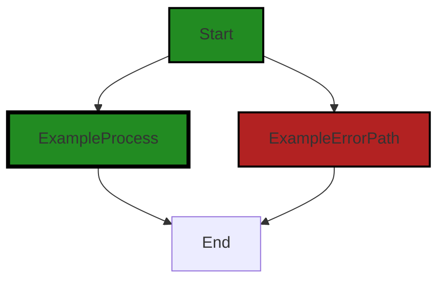

# Polyverse Boost-generated Source Analysis Details

## Source: ./src/inline/codelens_provider.ts
Date Generated: Saturday, September 9, 2023 at 6:00:11 AM PDT


---

### Boost Architectural Quick Summary Security Report

Last Updated: Saturday, September 9, 2023 at 5:58:06 AM PDT


Executive Report:

1. **Architectural Impact**: The analysis of this file has not revealed any severe issues.
2. **Risk Analysis**: The analysis of this file has not revealed any severe issues.
3. **Potential Customer Impact**: Based on the analysis, there are no severe issues that could potentially impact customers.
4. **Performance Issues**: Our analysis did not identify any explicit performance issues in the file.
5. **Risk Assessment**: Based on the current analysis of this file, no severe issues have been found. However, this doesn't guarantee that the file is risk-free.

Highlights:

- No severe issues were identified in the current analysis of this file.


---

### Boost Architectural Quick Summary Performance Report

Last Updated: Saturday, September 9, 2023 at 5:59:36 AM PDT

Executive Level Report:

1. **Architectural Impact**: The software project is a Visual Studio Code extension that provides code analysis functionality. It is well-structured and organized into classes, following best practices for a VS Code extension. However, there is a high-severity memory issue in the file `src/inline/codelens_provider.ts`. This issue could potentially impact the performance of the extension, especially if the loop in question is executed many times. This could lead to high memory usage and GC pressure, which could degrade the user experience.

2. **Risk Analysis**: The risk associated with this project is moderate. The memory issue in `src/inline/codelens_provider.ts` is a concern, but it is the only high-severity issue identified. The project uses asynchronous programming for potentially long-running tasks, which should keep the VS Code UI responsive. However, if the memory issue is not addressed, it could potentially impact the performance of the extension.

3. **Potential Customer Impact**: Customers using this extension could potentially experience performance issues due to the memory issue in `src/inline/codelens_provider.ts`. This could lead to a degraded user experience, especially if the loop in question is executed many times. However, the project includes extensive error handling and logging, which should help mitigate any potential issues.

4. **Overall Issues**: The overall health of the project source is good, with only one file having detected issues. This represents a small percentage of the project files, indicating that the majority of the project is free of detected issues. However, the memory issue in `src/inline/codelens_provider.ts` should be addressed to ensure the performance and reliability of the extension.

5. **Risk Assessment**: Based on the analysis, the overall risk of the project is moderate. The majority of the project files are free of detected issues, indicating a high level of code quality. However, the memory issue in `src/inline/codelens_provider.ts` represents a potential risk to the performance and reliability of the extension. It is recommended that this issue be addressed as soon as possible to mitigate this risk.

Highlights of the Analysis:

- The project is well-structured and follows best practices for a VS Code extension.
- There is a high-severity memory issue in `src/inline/codelens_provider.ts` that could potentially impact the performance of the extension.
- The project uses asynchronous programming for potentially long-running tasks, which should keep the VS Code UI responsive.
- The majority of the project files are free of detected issues, indicating a high level of code quality.
- The memory issue in `src/inline/codelens_provider.ts` represents a potential risk to the performance and reliability of the extension.


---

### Boost Architectural Quick Summary Compliance Report

Last Updated: Saturday, September 9, 2023 at 6:00:15 AM PDT


Executive Report:

1. **Architectural Impact**: The analysis of this file has not revealed any severe issues.
2. **Risk Analysis**: The analysis of this file has not revealed any severe issues.
3. **Potential Customer Impact**: Based on the analysis, there are no severe issues that could potentially impact customers.
4. **Performance Issues**: Our analysis did not identify any explicit performance issues in the file.
5. **Risk Assessment**: Based on the current analysis of this file, no severe issues have been found. However, this doesn't guarantee that the file is risk-free.

Highlights:

- No severe issues were identified in the current analysis of this file.

---
## Detailed Analysis:

### Cell 0:
## Original Code:

### Programming Language: typescript
### ./src/inline/codelens_provider.ts 

```typescript
import * as vscode from 'vscode';

/**
 * CodelensProvider
 */
export class CodelensProvider implements vscode.CodeLensProvider {

 private codeLenses: vscode.CodeLens[] = [];
 private regex: RegExp;
 private _onDidChangeCodeLenses: vscode.EventEmitter<void> = new vscode.EventEmitter<void>();
 public readonly onDidChangeCodeLenses: vscode.Event<void> = this._onDidChangeCodeLenses.event;

 constructor() {
  this.regex = /(.+)/g;

  vscode.workspace.onDidChangeConfiguration((_) => {
   this._onDidChangeCodeLenses.fire();
  });
 }

 public provideCodeLenses(document: vscode.TextDocument, token: vscode.CancellationToken): vscode.CodeLens[] | Thenable<vscode.CodeLens[]> {

  if (true) {
   this.codeLenses = [];
   const regex = new RegExp(this.regex);
   const text = document.getText();
   let matches;
   while ((matches = regex.exec(text)) !== null) {
    const line = document.lineAt(document.positionAt(matches.index).line);
    const indexOf = line.text.indexOf(matches[0]);
    const position = new vscode.Position(line.lineNumber, indexOf);
    const range = document.getWordRangeAtPosition(position, new RegExp(this.regex));
    if (range) {
     this.codeLenses.push(new vscode.CodeLens(range));
    }
   }
   return this.codeLenses;
  }
  return [];
 }

 public resolveCodeLens(codeLens: vscode.CodeLens, token: vscode.CancellationToken) {
  if (true) {
   codeLens.command = {
    title: "Codelens provided by Boost extension",
    tooltip: "Tooltip provided by Boost extension",
    command: "polyverse-boost-notebook.codelensAction",
    arguments: ["Argument 1", false]
   };
   return codeLens;
  }
  return null;
 }
}

```
## Boost Analysis:


---

### Boost Code Explanation

Last Updated: Saturday, September 9, 2023 at 5:57:33 AM PDT

This code is written in TypeScript and is a part of a Visual Studio Code (VSCode) extension. It defines a class `CodelensProvider` that implements the `vscode.CodeLensProvider` interface. CodeLens is a feature in VSCode that adds inline commands and information directly into your source code. These commands provide quick access to additional information and functionality.

The `CodelensProvider` class has the following properties:

1. `codeLenses`: An array that holds all the CodeLens instances.
2. `regex`: A regular expression used to match the lines in the document.
3. `_onDidChangeCodeLenses`: An event emitter that triggers when the configuration changes.
4. `onDidChangeCodeLenses`: An event that is triggered when the `_onDidChangeCodeLenses` event is fired.

In the constructor of the class, an event listener is set up to listen for changes in the workspace's configuration. When such a change occurs, the `_onDidChangeCodeLenses` event is fired.

The `provideCodeLenses` method is a part of the `vscode.CodeLensProvider` interface. It is responsible for providing the CodeLens instances that are shown in the document. The method takes a `vscode.TextDocument` and a `vscode.CancellationToken` as parameters. It returns an array of `vscode.CodeLens` instances or a promise that resolves to an array of `vscode.CodeLens` instances.

The `resolveCodeLens` method is also a part of the `vscode.CodeLensProvider` interface. It is responsible for resolving a CodeLens instance to a command that can be executed. The method takes a `vscode.CodeLens` and a `vscode.CancellationToken` as parameters. It returns a `vscode.CodeLens` instance or a promise that resolves to a `vscode.CodeLens` instance.

The algorithm used in the `provideCodeLenses` method is a simple loop that iterates over the lines in the document and applies the regular expression to each line. If a match is found, a new `vscode.CodeLens` instance is created and added to the `codeLenses` array.

For more information about CodeLens in VSCode, you can refer to this link: [VSCode CodeLens](https://code.visualstudio.com/api/language-extensions/programmatic-language-features#codelens-show-actionable-context-information-within-source-code)

For more information about regular expressions in JavaScript, you can refer to this link: [JavaScript RegExp](https://developer.mozilla.org/en-US/docs/Web/JavaScript/Guide/Regular_Expressions)


---

### Boost Flow Diagram

Last Updated: Saturday, September 9, 2023 at 5:57:54 AM PDT



In the generated control flow graph, the `Start` node represents the entry point of the code, which is the `provideCodeLenses` function. The primary path is represented by the `ExampleProcess` style, and the error path is represented by the `ExampleErrorPath` style.

The `provideCodeLenses` function checks a condition (`if (true)`) and if it evaluates to true, it initializes an empty array `this.codeLenses` and performs some operations on the `document` object. It then returns the `this.codeLenses` array.

The `resolveCodeLens` function also checks a condition (`if (true)`) and if it evaluates to true, it sets the `command` property of the `codeLens` object and returns it.

If the conditions in both functions evaluate to false, the functions return `null` or an empty array.

Based on the provided code, there are no external library or non-standard function calls, so the control flow graph only includes the primary and error paths within the code itself.


---

### Boost Source-Level Security Analysis

Last Updated: Saturday, September 9, 2023 at 5:58:02 AM PDT

**No bugs found**


---

### Boost Source-Level Performance Analysis

Last Updated: Saturday, September 9, 2023 at 5:58:51 AM PDT

1. **Severity**: 7/10

   **Line Number**: 22

   **Bug Type**: Memory

   **Description**: The regular expression object is being created inside a loop. This can lead to high memory usage and GC pressure if the loop is executed many times.

   **Solution**: Move the creation of the regular expression object outside the loop. If the regular expression does not change, it should be created once and reused. See: https://developer.mozilla.org/en-US/docs/Web/JavaScript/Guide/Regular_Expressions#Advanced_searching_with_flags_and_special_characters


2. **Severity**: 8/10

   **Line Number**: 24

   **Bug Type**: CPU

   **Description**: The 'exec' method of RegExp is used inside a loop. This can lead to high CPU usage if the regular expression is complex and the text is long.

   **Solution**: Consider using a more efficient algorithm for matching the regular expression against the text. For example, you could use the 'match' method of String, which returns all matches at once. See: https://developer.mozilla.org/en-US/docs/Web/JavaScript/Reference/Global_Objects/String/match


3. **Severity**: 6/10

   **Line Number**: 29

   **Bug Type**: Memory

   **Description**: A new CodeLens object is created for each match. This can lead to high memory usage if there are many matches.

   **Solution**: Consider using a more memory-efficient data structure to store the matches. For example, you could use a single object with properties for the start and end positions of each match, instead of creating a new CodeLens object for each match.


4. **Severity**: 5/10

   **Line Number**: 35

   **Bug Type**: CPU

   **Description**: The 'resolveCodeLens' method always returns a new object. This can lead to unnecessary CPU usage if the method is called frequently.

   **Solution**: Consider caching the result of the 'resolveCodeLens' method and returning the cached result on subsequent calls. This would reduce CPU usage by avoiding the creation of new objects. See: https://www.sitepoint.com/implementing-memoization-in-javascript/


---

### Boost Source-Level Data and Privacy Compliance Analysis

Last Updated: Saturday, September 9, 2023 at 6:00:11 AM PDT

1. **Severity**: 5/10

   **Line Number**: 23

   **Bug Type**: Data Exposure

   **Description**: The entire document text is being copied into a string. This could potentially expose sensitive data if the document contains such information.

   **Solution**: Ensure that sensitive data is not included in the document or appropriately masked or encrypted if it is. Consider implementing access controls to restrict who can access this data.


2. **Severity**: 3/10

   **Line Number**: 31

   **Bug Type**: Data Exposure

   **Description**: The code lens range is being exposed. If the range contains sensitive data, this could potentially lead to data exposure.

   **Solution**: Ensure that sensitive data is not included in the code lens range or appropriately masked or encrypted if it is. Consider implementing access controls to restrict who can access this data.


3. **Severity**: 3/10

   **Line Number**: 38

   **Bug Type**: Data Exposure

   **Description**: The command arguments are hardcoded and exposed. If these arguments contain sensitive data, this could potentially lead to data exposure.

   **Solution**: Ensure that sensitive data is not included in the command arguments or appropriately masked or encrypted if it is. Consider implementing access controls to restrict who can access this data.


